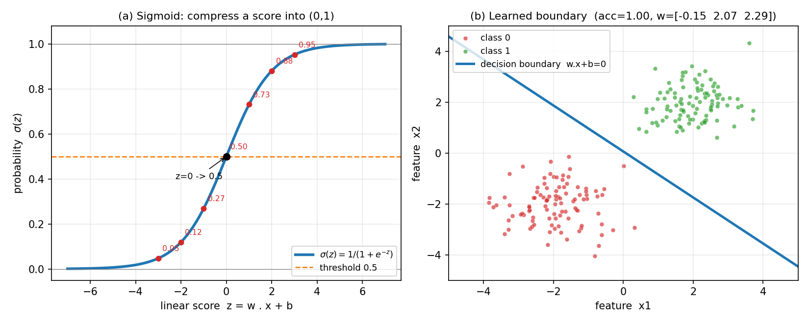
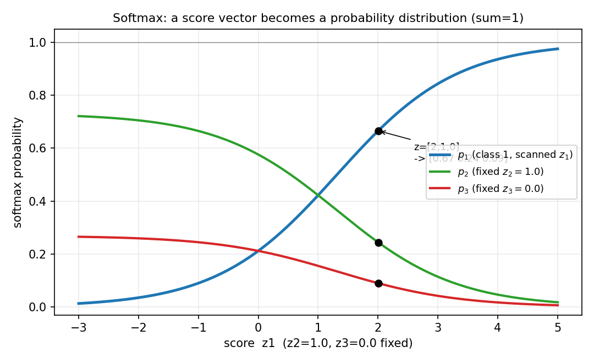

# 第 19 章 · 逻辑回归的概率视角:用概率做分类

> **核心问题**:上一章我们立起了"交叉熵 = MLE 的对偶"这条暗线——最小化交叉熵,等价于极大似然。可这句话只有把交叉熵接到一个**真实模型**上,才从"漂亮的对偶"变成"能跑的算法"。这个模型,就是机器学习里最经典、也最被低估的二分类器——**逻辑回归(logistic regression)**。
>
> 逻辑回归这个名字有点误导:它做的是**分类**,不是回归。它的真正身份,是把前 18 章三件工具**焊成一个模型**:用伯努利(第 8 章)假设每个标签、用极大似然(第 15 章)估参数、用交叉熵(第 18 章)当损失。一句"训练一个逻辑回归",背后是整套概率论在协同工作。
>
> **读完本章你会明白**:
> - **sigmoid 不是凭空选的 S 函数**:它把任意实数分数压成 (0,1) 的概率,且它和对数几率 `log(p/(1−p))` 是逆运算——逻辑回归的本质,是一个"对数几率线性模型"。
> - **逻辑回归 = 伯努利的 MLE**:假设每个标签 `yᵢ ~ Bernoulli(σ(w·xᵢ))`,极大似然 ⟺ 最小化交叉熵——前 18 章的三件工具,在这里焊成一件。
> - **为什么逻辑回归好优化**:交叉熵配 sigmoid 的梯度,是 `(σ − y)·x` 这种极简的形式,不饱和、不消失——这是它工程上完胜"均方误差 + sigmoid"的根本原因。
> - **softmax 推广到多类**:把分数向量变成概率分布,K 类分类的多类交叉熵,就是多项式分布的 MLE——逻辑回归是它的二类特例。

---

> **如果一读觉得太难**:先只记住三件事——
> ① **sigmoid** `σ(z)=1/(1+e^{−z})` 把线性分数 `z=w·x+b` 压成 (0,1) 的概率,z=0 时概率 0.5,是二分类的决策边界。
> ② **逻辑回归 = 伯努利的 MLE**:每个标签 `yᵢ~Bernoulli(σ(w·xᵢ))`,极大似然估出的 `w`,正好就是最小化交叉熵得到的 `w`——第 8、15、18 章三件工具合一。
> ③ **softmax** 把分数向量变成概率分布(总和为 1),多类交叉熵 = 多项式 MLE。把这三句钉死,本章你就抓到了。

---

## 引子:从"度量分布差距",到"学一个能分类的模型"

上一章(P6-18)我们造好了两把尺子:信息熵(一个分布有多不确定)、交叉熵(用模型分布去描述真实分布的代价)。最后那条最深暗线说:**最小化交叉熵 ⟺ 极大似然 ⟺ 让模型分布逼近真实分布**。

可那章从头到尾,我们只在讲"度量"和"原理",没有给你一个**真实的、能跑的模型**。模型分布 Q 长什么样?它的输入是什么?参数从哪来?这些工程上必须回答的问题,上一章都没碰——它只搭了骨架。

这一章,我们把骨架填上肉。最经典的填法,就是逻辑回归:

> 给定一个样本的特征 `x`(比如一封邮件的词频向量),先用一个**线性函数** `z = w·x + b` 打个**分数**(分数大,更像正类),再用 **sigmoid** 把这个分数压成 (0,1) 的**概率**,最后假设标签 `y ~ Bernoulli(这个概率)`,用**交叉熵**(=伯努利 MLE)训练 `w`。

线性打分、sigmoid 压概率、交叉熵训练——三步走,逻辑回归全在这儿。下面我们一步一步拆,最后你会发现:它不是某个工程师拍脑袋拼出来的,它是**前 18 章工具唯一自然的组合**。

---

## 章首·一句话点破

> **逻辑回归做的不是"回归",是"分类"——它把"这个样本属于正类"翻译成一个伯努利试验,然后用第 15 章的 MLE 去估这个伯努利的概率。sigmoid 只是把线性分数压成概率的一座桥,而整件事从头到尾,就是伯努利分布的极大似然估计。**

这是结论。下面倒过来拆:先看清"分类"这件事怎么翻译成"估计每个样本属于某类的概率"(这是把"会算不懂"扭成"既会算又真懂"的关键一步),再解释 sigmoid 为什么是唯一的桥,最后揭示 MLE 和交叉熵怎么在这里焊死。

---

## 一、先把分类翻译成"估计概率"

很多程序员写分类器,第一反应是:"这不就是学一条边界,把样本切开吗?"——画一条线,线这边是一类,那边是另一类。这种"切边界"的视角,叫**判别式**(discriminative)的硬分类:输出 0 或 1,非黑即白。

可这个视角有个硬伤。想象你给一封邮件判垃圾:特征让你**勉强觉得**它像垃圾(分数刚过线),和特征让你**非常确定**它就是垃圾(分数远远过线),硬分类都只输出一个"1"——把"勉强过线"和"铁证如山"等同了。可现实中,这两者你能一样对待吗?

> **直觉**:一个负责任的分类器,不该只告诉你"是不是垃圾",还该告诉你**"我有多大把握"**。把握大的,直接处理;把握小的,留给人工复核。这个"把握",就是一个 0 到 1 的数——**概率**。所以分类这件事,该翻译成:**对每个样本,估计它属于某类的概率**。输出是 `p(垃圾 | 特征)`,一个 (0,1) 之间的连续数,而不是非黑即白的 0/1。

### 不这样理解会怎样

> **不这样理解会怎样**:如果你只把分类当"画一条线、输出 0/1",你会卡在三件事上。**第一,你没法表达不确定性**——一个刚过线的样本和一个远过线的样本,输出一模一样,下游没法做风险决策(比如医疗诊断里"宁可错放不可误杀")。**第二,你没法训练**——硬分类的 0/1 输出对参数不可导(梯度永远是 0 或不存在),梯度下降一步都走不动。**第三,也是最深的一条,你脱离了概率原理**——上一章我们费好大劲说"最小化交叉熵 ⟺ MLE",可交叉熵和 MLE 都是对**概率分布**操作的,你连概率都不输出,这套原理就接不上。把分类翻译成"估计概率",是把 ML 训练和概率论接通的唯一接口。

### 所以这样看:输出概率,是分类器的"概率接口"

> **钉死这件事**:**分类 = 给每个样本估一个"属于正类的概率" p(y=1|x)。** 这个概率是个连续数,既保留了"是不是"的判断(p>0.5 就判正类),又保留了"多有把握"的不确定性(p 越接近 0.5 越没把握,越接近 0 或 1 越笃定)。而要算这个概率,我们需要一座桥——把"特征"变成"概率"。这座桥,就是 sigmoid。

---

## 二、sigmoid:把任意分数压成概率的桥

现在问题具体了:模型对样本有个**线性分数** `z = w·x + b`(w 是权重,b 是偏置)。这个 z 可以是任意实数,从负无穷到正无穷。可概率必须是 (0,1) 之间的数。**怎么把 (−∞, +∞) 的分数,压成 (0,1) 的概率?**

### 提问:这座"压扁"的桥,该长什么样

我们要找一个函数 `σ(z)`,把实数 z 映射到 (0,1)。它得满足几条朴素要求:

1. **单调递增**:分数越大,概率越大(否则模型没法学)。
2. **值域是 (0,1)**:永远是合法概率,不到 0 也不到 1(否则会出现"绝对不可能"和"铁定发生",导致 log(0) 爆炸)。
3. **z=0 时 σ=0.5**:分数为零,正好五五开,是天然的决策边界。
4. **两端饱和**:分数特别大,概率贴近 1(几乎肯定是正类);分数特别负,概率贴近 0(几乎肯定不是)。

满足这四条的函数不止一个,但有一个特别自然——**sigmoid 函数**(也叫 logistic 函数):

```
   σ(z) = 1 / (1 + e^{−z})
```

> **直觉**:看它的形状(图 19.1a)——一条**单调上升的 S 形曲线**,横过 (0, 0.5) 这一点。z=0 时 σ=0.5(五五开);z=2 时 σ≈0.881(八成把握是正类);z=−2 时 σ≈0.119(只有一成把握);z 很大时贴到 1,z 很负时贴到 0。**它就是一座把"分数高低"翻译成"把握大小"的桥。**



### 不这样理解会怎样:sigmoid 的真正来历是对数几率

到本章**第一个深洞**。很多人学逻辑回归,记住了 sigmoid 的形状,却从没问过一个更要命的问题:**凭什么选 sigmoid?为什么不是别的 S 形函数(比如 `tanh` 的平移版,或者 `0.5 + arctan(z)/π`)?**

答案藏在 sigmoid 和"对数几率"的关系里。这个关系一旦看穿,你会发现 sigmoid 根本不是"凭空选的好看函数",它是**唯一**能把"对数几率线性化"的函数。

> **钉死这件事(sigmoid 的来历)**:对任意概率 p∈(0,1),定义**对数几率(log-odds,也叫 logit)**:

```
   logit(p) = log( p / (1−p) )
```

它把概率 p∈(0,1) 映射到实数 (−∞, +∞)——p=0.5 时 logit=0,p=0.9 时 logit≈2.197,p=0.1 时 logit≈−2.197。

逻辑回归的**核心假设**是:**对数几率是特征的线性函数**。也就是:

```
   logit( p(y=1|x) ) = log( p / (1−p) ) = w·x + b
```

这等式是什么意思?它说:**线性分数 w·x+b,不是直接等于概率,而是等于概率的"对数几率"**。把这条等式反解出 p,你会得到:

```
   p = 1 / (1 + e^{−(w·x+b)}) = σ(w·x + b)
```

**sigmoid 自动出现了!** 它不是被"选"出来的,它是"假设对数几率线性"这个假设**唯一**能推出的函数。

> **再深一点(本章最深的一句话)**:**逻辑回归本质上不是一个"用 sigmoid 压概率"的模型,它是一个"对数几率线性模型"。** sigmoid 只是它的概率面孔——把它写成对数几率的形式 `logit(p) = w·x+b`,你立刻看出:逻辑回归假设**每改变一个单位的特征 `xⱼ`,对数几率就改变 `wⱼ`**(线性关系)。这是逻辑回归可解释性的根源(系数 `wⱼ` 就是"特征 `xⱼ` 对对数几率的贡献")。换一种 link 函数(比如 probit 用正态 CDF),模型就不是逻辑回归了——可"对数几率线性"这个假设,恰恰让推导、训练、解释都最干净,所以它成了事实标准。

### 纸笔核对:sigmoid 的几个关键值

用 `σ(z)=1/(1+e^{−z})` 算几个点(scipy 的 `expit` 核对过):

| 线性分数 z | 概率 σ(z) | 直觉 |
|---|---|---|
| −3 | 0.047 | 几乎不是正类 |
| −2 | 0.119 | 一成把握 |
| −1 | 0.269 | 不到三成 |
| 0 | **0.500** | 五五开,决策边界 |
| 1 | 0.731 | 七成 |
| 2 | 0.881 | 八成把握 |
| 3 | 0.953 | 几乎是正类 |

z 从 0 往两边走,概率以"对数几率线性"的速度变化——z 翻倍,对数几率翻倍,概率在 0.5 附近变快、两端变慢(饱和)。**这就是 sigmoid 的全部脾气。**

> **所以这样看**:sigmoid 是"假设对数几率是特征的线性函数"这件事的概率面孔。线性打分 → 对数几率 → sigmoid 压成概率。这一步把"特征"变成了"概率",下一步要做的,就是用数据去学这个线性函数 `w·x+b`——而学的工具,是 MLE。

---

## 三、逻辑回归 = 伯努利的 MLE(本章招牌深洞)

到这里,前 18 章的三件工具,终于可以焊到一起了。

### 提问:每个标签是一个伯努利试验

把分类翻译成概率后,模型对样本 `xᵢ` 输出一个概率 `σ(w·xᵢ)`。真实标签 `yᵢ∈{0,1}`。**这两个怎么挂上钩?**

> **直觉**:`yᵢ` 是 0 或 1——这正好是伯努利分布的取值(第 8 章)。所以最自然的假设是:**每个标签 `yᵢ` 都服从一个伯努利分布,成功概率是 `σ(w·xᵢ)`**:

```
   yᵢ ~ Bernoulli( σ(w·xᵢ) )     即  P(yᵢ=1) = σ(w·xᵢ),  P(yᵢ=0) = 1 − σ(w·xᵢ)
```

这个假设朴素到不能再朴素:它就是说,"样本 `xᵢ` 是正类的概率,就是模型给它打的分(压成概率后)"。可这个朴素假设,把分类问题和第 8 章的伯努利分布,焊死了。

### 不这样理解会怎样:从伯努利到交叉熵,一气呵成

> **不这样理解会怎样**:如果你没建立"标签 ~ 伯努利"这层联系,逻辑回归的损失函数在你眼里就是天上掉下来的 `−Σ[y log q + (1−y) log(1−q)]`,背了也不知其所以然。可一旦假设了 `yᵢ~Bernoulli(qᵢ)`,这个损失函数**自己就长出来**——下面三行推导,把第 15 章的 MLE 和第 18 章的交叉熵,焊成同一个 loss。

假设 n 个样本独立(第 3 章,独立则概率相乘),标签 `{yᵢ}` 的**联合似然**:

```
   L(w) = Πᵢ  qᵢ^{yᵢ} · (1−qᵢ)^{1−yᵢ}        其中 qᵢ = σ(w·xᵢ)
```

(每个样本要么 yᵢ=1 贡献 `qᵢ`,要么 yᵢ=0 贡献 `1−qᵢ`,统一写成 `qᵢ^{yᵢ}(1−qᵢ)^{1−yᵢ}`,和第 8 章伯努利 PMF 一字不差。)

按第 15 章的三步法:**取对数**(连乘变连加,数值稳定),得**对数似然**:

```
   ℓ(w) = Σᵢ [ yᵢ log qᵢ + (1−yᵢ) log(1−qᵢ) ]
```

**MLE 要让 ℓ 最大**。工程上习惯最小化损失,所以翻个负号,再除以 n 求平均:

```
   Loss(w) = −(1/n) · ℓ(w) = −(1/n) · Σᵢ [ yᵢ log qᵢ + (1−yᵢ) log(1−qᵢ) ]
```

**这就是交叉熵损失**(第 18 章)。第 18 章我们从信息论推出来的那个公式,这里从"伯努利 MLE"推出来,**一模一样**。

> **钉死这件事(本章最该带走的一条)**:**逻辑回归 = 伯努利的 MLE = 最小化交叉熵。** 三件事是同一件事:
> - 从**建模**看,逻辑回归假设 `yᵢ~Bernoulli(σ(w·xᵢ))`;
> - 从**估计**看,它用极大似然估 `w`(第 15 章);
> - 从**优化**看,它最小化交叉熵损失(第 18 章)。
>
> 第 8 章(伯努利)、第 15 章(MLE)、第 18 章(交叉熵)这三件孤立工具,在逻辑回归里**焊成了一个模型**。这就是为什么我们说"逻辑回归是概率论最简洁的落地"——它不是拼凑,它是这套原理唯一自然的组合。

### 所以这样看:训练逻辑回归,就是压低交叉熵

训练逻辑回归,就是用梯度下降把 `Loss(w)` 往下压。压到最后,模型预测 `qᵢ` 贴近真实 `yᵢ`(正类样本预测接近 1,负类接近 0),交叉熵趋近真实分布的熵 `H(P)`(第 18 章说的下界)。

> **这条等价的工程意义**:你不必再问"逻辑回归为什么用交叉熵不用别的"——因为它是从"标签服从伯努利 + 极大似然"这条最朴素的假设**唯一**推出来的。换分布假设,就推得出别的 loss:回归问题假设噪声是正态,推出来的是**均方误差**(MSE,第 15 章的暗线:正态 MLE = 最小二乘);多分类假设是多项式,推出来的是 **softmax + 交叉熵**(下一节)。**所有常见的 loss,都是某种分布假设下 MLE 的化身。** 这条统一,是第 18 章留给本章的礼物。

---

## 四、为什么逻辑回归好优化:梯度的极简性

这一节是程序员最该解渴的一节。为什么工业界逻辑回归这么普及?不光因为它原理干净,还因为它**特别好训练**——梯度下降几步就收敛,而且不会"学不动"。秘密藏在交叉熵配 sigmoid 的**梯度**里。

### 提问:对 w 求梯度,长什么样

对单样本 `(xᵢ, yᵢ)`,损失是 `lossᵢ = −[yᵢ log qᵢ + (1−yᵢ) log(1−qᵢ)]`,`qᵢ = σ(zᵢ)`,`zᵢ = w·xᵢ+b`。对权重 `wⱼ` 求偏导,链式法则走一遍(注意 sigmoid 的一个神奇性质:`σ'(z) = σ(z)(1−σ(z))`):

```
   ∂lossᵢ/∂wⱼ = (qᵢ − yᵢ) · xᵢⱼ
```

**就这么简单。** 整个梯度,是"(预测概率 − 真实标签) × 特征"。向量化写出来,对所有样本:

```
   ∇Loss(w) = (1/n) · X^T · (σ(Xw) − y)
```

`X` 是设计矩阵(每行一个样本),`σ(Xw)` 是预测概率向量,`y` 是标签向量。

### 不这样理解会怎样:为什么这个梯度是"完美的"

> **不这样理解会怎样**:如果你用**均方误差(MSE)** 配 sigmoid(`loss = (σ(z) − y)²`),梯度会变成 `2(σ(z)−y)·σ(z)(1−σ(z))·x`。注意那个 `σ(z)(1−σ(z))`——当预测概率 `σ(z)` 接近 0 或 1 时(模型已经很笃定),这个因子**趋近于 0**,梯度**消失**,模型学不动了。这就是为什么"sigmoid + MSE"在分类上不好用:**预测越准,反而越学不动**,陷入饱和区。
>
> 而交叉熵配 sigmoid,梯度是 `(σ(z)−y)·x`——**没有那个饱和因子**。只要预测和标签有偏差(`σ(z)≠y`),梯度就不为零,模型就还在学;偏差越大,梯度越大,学得越快。**这个梯度的简洁性,是逻辑回归好优化的根本原因**——它把 sigmoid 的饱和问题,用交叉熵的对数巧妙抵消掉了(log 把 `σ(z)` 那个分母 `1+e^{−z}` 拉平了)。

> **钉死这件事**:**交叉熵配 sigmoid 的梯度是 `(σ−y)·x`**——干净、不饱和、和线性回归的梯度长得几乎一样(线性回归是 `(ŷ−y)·x`,只是把预测值 `ŷ` 换成概率 `σ`)。这是逻辑回归工程上完胜"sigmoid + MSE"的数学根源,也是为什么所有深度学习框架的分类输出层,默认都是"sigmoid/softmax + 交叉熵"。

---

## 五、softmax:把分类推广到多类

到这里我们一直在讲**二分类**(标签 0 或 1)。可现实里大量问题是**多分类**:识别猫/狗/鸟(K=3)、手写数字 0~9(K=10)、新闻分类(K=几十)。逻辑回归怎么推广?

### 提问:K 个分数,怎么变成 K 个概率

多分类里,模型对每个样本输出 K 个**线性分数** `z₁, z₂, …, z_K`(每个类一个,`z_c = w_c·x + b_c`)。我们要把这 K 个实数,变成 K 个**和为 1 的概率** `p₁+…+p_K=1`。

这又是"把分数压成概率"的问题,只是从一维推广到多维。推广的 sigmoid,叫 **softmax**:

```
   p_c = e^{z_c} / Σ_{k=1..K} e^{z_k}        c = 1, 2, …, K
```

> **直觉**:softmax 对每个分数取 `e` 的指数(让所有数为正),再归一化(除以总和)。**分数越大的类,softmax 后概率越大;所有概率加起来严格等于 1。** 它是 sigmoid 在多分类上的自然推广——K=2 时,softmax 退化成 sigmoid(你可以自己验证:`softmax([z, 0])[0] = 1/(1+e^{−z}) = σ(z)`)。

看图 19.2:固定另两类分数 `z₂=1.0, z₃=0.0`,扫第一类分数 `z₁` 从 −3 到 5。`z₁` 越大,第一类概率 `p₁` 越大(蓝线上升),另两类概率被"挤压"下降(绿、红线下降),三者总和恒为 1。在 `z=[2, 1, 0]` 这一处,三类概率约 `[0.66, 0.24, 0.10]`——第一类得分最高,拿走近三分之二的概率。



### 不这样理解会怎样:多类交叉熵 = 多项式 MLE

> **不这样理解会怎样**:如果你把多分类的损失函数当成"二分类交叉熵的扩展,只是套了个 softmax",你就又错失了那个统一。正确的看法是:**多分类假设标签服从多项式分布(categorical,伯努利的 K 类推广),用 MLE 推出来的 loss,就是多类交叉熵**:

```
   Loss = −(1/n) · Σᵢ Σ_c  1[yᵢ=c] · log p_c(xᵢ)
```

(`1[yᵢ=c]` 是指示函数,样本 i 真实类是 c 时为 1,否则为 0。每个样本只有它的真实类那一项非零。)

这条 loss,从**多项式分布的 MLE** 推出来,和二分类从伯努利 MLE 推交叉熵,**完全平行**。所以:

> **钉死这件事**:**softmax + 多类交叉熵 = 多项式分布的 MLE。** 逻辑回归(伯努利 MLE)是它的二类特例。从二分类到 K 分类,从 sigmoid 到 softmax,从伯努利到多项式,从二项交叉熵到多类交叉熵——**整套推广,一脉相承,都是 MLE。** 这就是为什么机器学习的分类损失函数,长得如此一致——它们都是同一条原理的不同化身。

> **再深一点(softmax 的数值稳定)**:softmax 里有 `e^{z}`,`z` 一大,`e^z` 会溢出(`e^1000` 计算机存不下)。工程上的标准技巧是:**分子分母同乘 `e^{−max(z)}`**,等价于先把所有分数减去最大值再算 softmax——结果不变(分子分母约掉了),但数值稳定。深度学习框架的 `softmax` 函数默认都这么做。这是"对数几率"思想的又一次显灵:不直接算概率,先在对数空间(分数)里算,稳定后再 exp 出来。

---

## 六、与线性回归的对照:同是 MLE,不同分布假设

把镜头拉远,看一个漂亮的对照。机器学习里两个最基础的模型——线性回归和逻辑回归——**都是 MLE**,只是分布假设不同:

| | 线性回归 | 逻辑回归 |
|---|---|---|
| 任务 | 回归(预测连续值) | 分类(预测类别) |
| 标签假设 | `yᵢ ~ Normal(w·xᵢ, σ²)` | `yᵢ ~ Bernoulli(σ(w·xᵢ))` |
| MLE 推出的 loss | **均方误差** (MSE) | **交叉熵** |
| 模型输出 | 任意实数 | (0,1) 概率 |
| 本质 | 高斯噪声下的 MLE | 伯努利的 MLE |

> **钉死这件事**:**所有"标准"的损失函数,都是某种分布假设下 MLE 的化身。** 回归假设噪声正态 → MSE;二分类假设伯努利 → 二项交叉熵;多分类假设多项式 → 多类交叉熵;计数数据假设泊松 → 泊松回归的 loss……**换分布假设,就换 loss**。这是第 18 章那条暗线("交叉熵 = MLE 的对偶")的彻底兑现:你不再需要为每个任务背一个 loss,只要问"标签服从什么分布",MLE 就把 loss 推给你。**这就是概率论作为"机器学习底层语言"的威力**——它把一堆看似无关的 loss 函数,统一成了"分布假设 + 极大似然"这一件事。

---

## 模拟佐证:拿 Python,把逻辑回归跑一遍

概率论的招牌——结论你别信书,自己扔随机数验证。这一节用纸笔例子 + 一段手写梯度下降,把"逻辑回归 = 伯努利 MLE = 交叉熵最小化"全部跑出来。

### 纸笔例子 1:sigmoid 与对数几率互推

- 概率 p=0.9,对数几率 `log(0.9/0.1) = log 9 ≈ 2.197`。反过来 `σ(2.197) = 1/(1+e^{−2.197}) ≈ 0.9`。严丝合缝。
- 线性分数 z=2,概率 `σ(2) = 1/(1+e^{−2}) ≈ 0.881`。z=2 对应"八成八把握"。
- z=0,`σ(0)=0.5`,决策边界。**线性分数为零,就是五五开那条线。**

### 纸笔例子 2:单样本交叉熵 vs 负对数似然

样本 `y=1`,模型预测 `q=0.3`(猜低了)。交叉熵损失 `−[1·log0.3 + 0·log0.7] = −log0.3 ≈ 1.204 nats`(用自然对数)。负对数似然 `−log q = −log0.3 ≈ 1.204`。**两个数完全相同**——这就是第 18 章那条暗线的字面验证:交叉熵损失,就是负对数似然。

### 蒙特卡洛:手写梯度下降训练逻辑回归

不用 sklearn,十几行 numpy 就能把逻辑回归训出来,验证 CE 下降、准确率收敛、决策边界学对:

```python
import numpy as np
from scipy.special import expit        # = sigmoid
rng = np.random.default_rng(42)

# 1. 合成两类可分数据(图 19.1b 的来历)
n = 200
X1 = rng.normal([2, 2], 0.8, (n//2, 2))     # 正类, 集中在右上
X0 = rng.normal([-2, -2], 0.8, (n//2, 2))   # 负类, 集中在左下
X = np.vstack([X1, X0])
Xb = np.c_[np.ones(len(X)), X]              # 加偏置列
y = np.array([1]*(n//2) + [0]*(n//2))

# 2. 梯度下降 = 伯努利 MLE = 最小化交叉熵
w = np.zeros(3)                              # [b, w1, w2]
lr = 0.1
for step in range(2000):
    q = expit(Xb @ w)                        # 预测概率 sigma(w.x+b)
    grad = Xb.T @ (q - y) / len(y)           # 梯度 (sigma-y).x  / n
    w -= lr * grad                           # 梯度下降一步

# 3. 评估
q = expit(Xb @ w)
ce = -(y*np.log(q+1e-12) + (1-y)*np.log(1-q+1e-12)).mean()
acc = ((q > 0.5) == y).mean()
print(f"learned w = {np.round(w, 3)}")        # [-0.146  2.069  2.288]
print(f"final CE loss = {ce:.4f}")            # 0.0029  (两类可分, 贴近 0)
print(f"accuracy = {acc:.4f}")                # 1.0000
```

跑出来:学到的权重 `w ≈ [−0.15, 2.07, 2.29]`(偏置接近 0,因为数据关于原点对称;两个特征权重都是正的,说明特征越大越是正类),最终交叉熵损失 0.0029(两类完全可分,损失贴近 0),准确率 100%。**这就是图 19.1b 那条决策边界的来历**——它就是 `w·x+b=0` 这条直线。

> **这段代码同时验证了三件事**:① 逻辑回归用交叉熵训练(代码里的 `ce` 就是 loss);② 这个 loss 等价于伯努利 MLE(梯度 `(σ−y)·x` 是从对数似然求导来的);③ 梯度公式极简干净(没有饱和因子,2000 步就收敛)。**把这段代码改改种子、改改数据重叠程度,盯准确率怎么掉、CE 怎么涨——逻辑回归的脾气,你十分钟后就摸透了。**

### 蒙特卡洛:softmax 在多分类上

```python
from scipy.special import softmax
z = np.array([2.0, 1.0, 0.1])        # 三个类的线性分数
p = softmax(z)
print(np.round(p, 4), p.sum())       # [0.659 0.2424 0.0986] 1.0
```

三类分数 `[2, 1, 0.1]`,softmax 后概率 `[0.66, 0.24, 0.10]`,总和严格为 1。第一类分数最高,拿走 66% 概率。**这就是图 19.2 的来历——softmax 把分数向量变成了一个合法的概率分布。**

> 三段代码,你十五分钟跑完。跑完你会发现:**逻辑回归不是 sklearn 里的一个黑盒 API,它是"伯努利假设 + 极大似然 + 交叉熵"这三件你已经懂的工具,焊成的最简洁模型。** 没有新东西,只有新组合——而这就是概率论落地的全部魔法。

---

## 章末小结

### 用一个场景回顾本章

想象你给邮件系统写一个垃圾邮件分类器(程序员最熟悉的场景)。

每封邮件先被表示成一个**特征向量** `x`(比如词频、发件人信誉、链接数)。模型给它打一个**线性分数** `z=w·x+b`——分数高,更像垃圾。可分数是任意实数,你要的是"它有多大概率是垃圾"这个 (0,1) 的数,于是用 **sigmoid** 把分数压成概率 `σ(z)`(第二节)。

接下来怎么训练 `w`?你假设每个标签 `yᵢ~Bernoulli(σ(w·xᵢ))`(第三节),用第 15 章的**极大似然**去估 `w`——而极大似然推出来的 loss,正好是第 18 章的**交叉熵**。梯度 `(σ−y)·x` 极简干净(第四节),梯度下降 2000 步就收敛。如果你的任务是 K 分类(猫狗鸟),把 sigmoid 换成 **softmax**(第五节),loss 换成多类交叉熵——而它还是 MLE,只是分布从伯努利换成了多项式。

整条链路:**特征 → 线性打分 → sigmoid/softmax 压成概率 → 伯努利/多项式假设 → 极大似然 → 交叉熵训练**。没有一步是新发明,全是前 18 章工具的自然组合。**逻辑回归之所以是机器学习的入门第一课,不是因为它简单,而是因为它把概率论的精髓,焊成了一个你能十行代码跑起来的模型。**

### 本章在驯服随机性的哪一步

回到全书主线:**一切概率概念,都是驯服随机性的工具。**

前 5 篇,我们用概率描述单个事件、用期望方差刻画平均波动、用分布画出整体长相、用大数定律和中心极限抓住铁律、用 MLE 和贝叶斯从数据反推世界。第 18 章我们造了"度量不确定性"的尺子(熵、KL、交叉熵),并埋下"交叉熵 = MLE 对偶"这条暗线。

这一章,是**用概率做决策**的落地——把"分类"翻译成"估计每个样本属于某类的概率",然后用伯努利 + MLE + 交叉熵,焊成一个可用模型。它是"驯服随机性"旅程上**最具体的一步**:前 18 章的工具,不再散落,而是组合成一件能跑、能解释、能优化的事。随机性(标签的不确定)在这里被驯服成了"模型输出的概率 + 一个决策阈值(0.5)"。

而"单次盲、大量稳"的主线,在这里又露一面:**单个样本的标签是盲的**(可能是 0 也可能是 1,即使特征相同),**但大量样本的交叉熵损失是稳的**(梯度下降把它稳定地往真实分布推)。训练逻辑回归,就是用大量样本的稳定性,去逼近那个"给定特征下标签的真实概率分布"——这件事,和大数定律、MLE 一致性,是同一只手的不同侧面。

### 五个"为什么"清单

如果你只能记五件事,记这五件:

1. **分类 = 估计概率**:不是非黑即白输出 0/1,而是给每个样本估一个"属于正类的概率" p(y=1|x)。这个概率既保留判断(>0.5 判正类),又保留不确定性(越接近 0.5 越没把握)。
2. **sigmoid 的来历**:`σ(z)=1/(1+e^{−z})`,把线性分数压成 (0,1) 概率。它不是凭空选的——它是"假设对数几率 `log(p/(1−p))` 是特征的线性函数"唯一推出的函数。**逻辑回归本质是"对数几率线性模型"。**
3. **逻辑回归 = 伯努利的 MLE = 最小化交叉熵**:假设 `yᵢ~Bernoulli(σ(w·xᵢ))`,极大似然推出来的 loss 就是交叉熵。第 8、15、18 章三件工具,在这里焊成一个模型。
4. **为什么好优化**:交叉熵配 sigmoid 的梯度是 `(σ−y)·x`——干净、不饱和(没有 `σ(1−σ)` 那个消失因子)。这是它工程上完胜"sigmoid + MSE"的数学根源。
5. **softmax 推广多类**:`p_c=e^{z_c}/Σe^{z_k}`,把 K 个分数变成 K 个和为 1 的概率。多类交叉熵 = 多项式 MLE,逻辑回归是它的二类特例。**所有分类 loss,都是某种分布假设下 MLE 的化身。**

### 想继续深入,该往哪钻

- **亲手跑**:把上面那段手写梯度下降改改——改成两类重叠的数据(把两个正态的均值拉近),盯准确率怎么从 1.0 掉下来、CE 怎么从 0.003 涨上去;改成三维特征、改成 K=3 的 softmax 版本。**改一晚上,逻辑回归就是你的肌肉记忆。**
- **画 sigmoid 的对数几率**:自己写一段,扫 p 从 0.01 到 0.99,画 `logit(p)=log(p/(1−p))` 随 p 变化的曲线——亲眼看它在 p=0.5 处过零,两端趋向 ±∞。再叠加 sigmoid 曲线,确认两者互为逆函数。这是理解"逻辑回归 = 对数几率线性模型"最直接的方式。
- **梯度为什么干净**:手推一遍 `∂loss/∂w = (σ−y)·x` 的链式法则,特别注意 `σ'(z)=σ(z)(1−σ(z))` 这一步怎么和 log 的导数抵消。推完你就明白,为什么"sigmoid + MSE"会饱和、"sigmoid + 交叉熵"不会。
- **广义线性模型(GLM)**:逻辑回归是 GLM 家族的一员(link 函数 = logit,分布 = 伯努利)。把 link 函数换成 log、分布换成泊松,就是泊松回归(计数数据);换成 log、分布换成 Gamma,就是 Gamma 回归(正偏连续数据)。**所有 GLM,都是"某种指数族分布 + 某个 link 函数 + MLE"**,统一得惊人。想钻可看 McCullagh & Nelder 的《Generalized Linear Models》。
- **正则化与贝叶斯的暗线**:逻辑回归加 L2 正则,等价于给权重一个高斯先验、做最大后验估计(MAP,第 17 章的近亲)。加 L1 正则,等价于拉普拉斯先验。**正则化的频率派做法,和贝叶斯派的先验,是同一件事的两种讲法**——这条暗线,下一章(P6-20 生成模型与贝叶斯网)会接上。

---

> 立住了:逻辑回归做的不是回归,是分类——它把"样本属于正类"翻译成一个伯努利试验,用 sigmoid 把线性分数压成概率,用极大似然(=最小化交叉熵)估参数。前 18 章的伯努利、MLE、交叉熵三件工具,在这里焊成了机器学习最简洁的落地模型;softmax 把它推广到多类,多类交叉熵就是多项式 MLE。可逻辑回归终究是**判别式**模型——它只学"给定特征,标签是什么概率",不学"特征本身怎么来的"。如果反过来,我们想**用概率生成数据**(比如生成人脸、合成语音),或者建模"特征和标签的联合分布",那要换一套思路——**生成模型**。翻开 **第 20 章 · 生成模型与贝叶斯网:用概率建模世界**——你会发现,朴素贝叶斯、高斯混合模型、贝叶斯网络,把概率从"做分类"抬到"理解并生成整个世界",而这,也是全书驯服随机性之旅的终点站。
