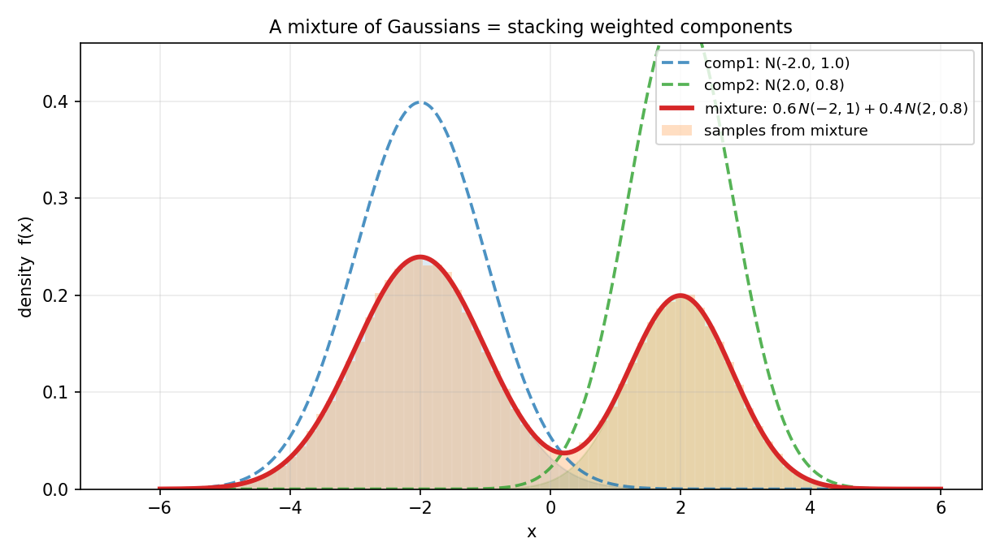
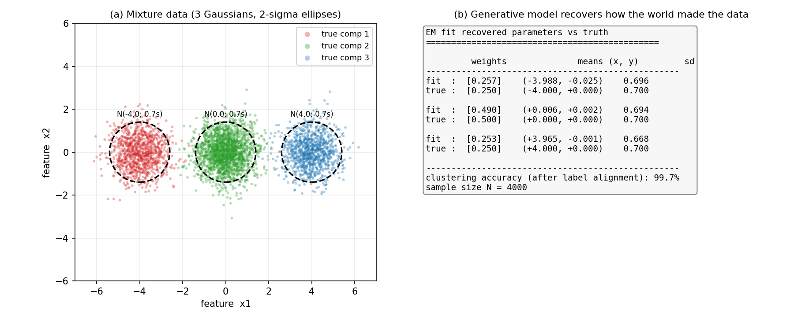
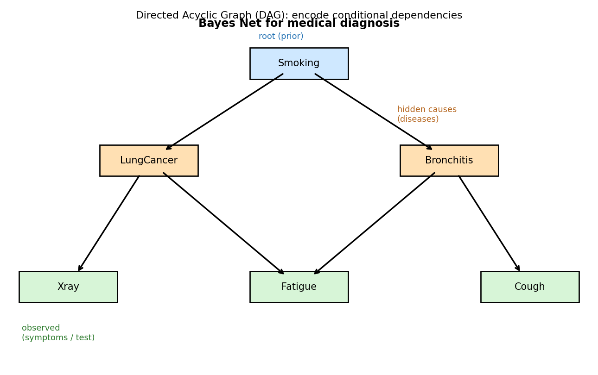

# 第 20 章 · 生成模型与贝叶斯网:用概率建模世界

> **核心问题**:上一章我们用逻辑回归做分类——可它只学了"给定特征,标签是什么概率"(`P(y|X)`),对特征本身怎么来的,一字没问。如果你想反过来:**先理解"这个世界是怎么把数据造出来的",再回头判断一个新样本该归到哪类**,该怎么建?
>
> 这就是**生成模型(generative model)**——它建模的不是"条件",而是"联合分布" `P(X, y) = P(y)·P(X|y)`:先猜世界以多大比例产生每一类(`P(y)`),再猜每一类内部数据长什么样(`P(X|y)`)。判别式(逻辑回归)直接画一条边界;生成式先把"世界如何造数据"复原出来,再据此判断。这一章我们用三个模型把这条路走通:**朴素贝叶斯**(垃圾邮件)、**高斯混合模型**(聚类/客户分群)、**贝叶斯网络**(医疗诊断里的因果结构)。最后,这一章也是全书的**终点站**——我们会把 20 章驯服随机性的旅程,收束成几条你能带走的哲学。
>
> **读完本章你会明白**:
> - **判别式 vs 生成式的本质差别**:逻辑回归学 `P(y|X)`(只画边界);朴素贝叶斯/GMM 学 `P(X,y)`(先还原"世界怎么造数据",再反过来判断)。两种思路各有所长,适用场景不同。
> - **朴素贝叶斯为什么"朴素"却好用**:它假设"给定类别,各特征条件独立"——这个假设强到几乎不成立,却让计算从指数级坍缩成线性,且在垃圾邮件识别上出奇地准。
> - **高斯混合模型(GMM)**:用几个正态分布的加权叠加,建模复杂数据;它同时是**聚类**算法(无标签也能分群),也是生成模型(能从拟合出的分布里"采样"造新数据)。
> - **贝叶斯网络**:用一张有向图(DAG)把变量间的条件依赖/因果结构编码进去——第 3 章的条件概率、第 4 章的贝叶斯更新、本章的独立性假设,全在这张图里汇合。
> - **全书收束**:20 章其实是同一场旅程(驯服随机性)的不同驿站;公式是直觉的速记;单次盲与大量稳的张力贯穿始终。

---

> **如果一读觉得太难**:先只记住三件事——
> ① **判别式 vs 生成式**:逻辑回归(判别)直接学 `P(y|X)`;朴素贝叶斯和 GMM(生成)先学 `P(X,y)=P(y)P(X|y)`,再由贝叶斯公式反推 `P(y|X)`。生成式能做的事更多(能采样造数据、能处理缺失特征),但需要更强的分布假设。
> ② **朴素贝叶斯**:假设"给定类别,特征条件独立",把 `P(x₁,…,xₙ|y)` 拆成 `∏P(xᵢ|y)`。假设虽"朴素"却好用,垃圾邮件识别是经典主场。
> ③ **GMM**:数据 = K 个正态的加权叠加 `Σ πₖ N(μₖ,Σₖ)`;用 EM 算法从无标签数据里反推这些参数,顺便完成聚类。把这三句钉死,本章你就抓到了。

---

## 引子:从"判断",到"理解世界怎么造数据"

上一章(P6-19)结尾,逻辑回归留下一个伏笔:它是**判别式**模型——只关心 `P(y|X)`(给定特征,标签是什么概率),从不过问 `X` 本身是怎么来的。这就像一个考官,只学"怎么打分",不学"学生是怎么被培养出来的"。

可生活和工程里,我们常常想做的不是"打分",而是**理解**:

- 我有一堆客户的消费记录,没有标签——我能不能**自动发现**他们分成几类(价格敏感型、品质追求型、偶尔消费型)?这是**聚类**。判别式做不了(它要标签),生成式能做。
- 我训练了一个垃圾邮件分类器,可我还想**生成**几封"看起来像垃圾邮件"的样本,用来做对抗测试或数据增广。判别式做不到(它不会"造"数据,只会"判"),生成式能做——它学到了 `P(邮件|spam)`,从这个分布里采样就行。
- 一个病人来做检查,有些症状我观察到了(咳嗽、疲劳),有些没观察到(没拍 X 光)。我想推断"他患肺癌的概率"。判别式要所有特征齐全才能算,生成式可以优雅地处理**缺失特征**(对没观测到的变量积分掉)。

这三件事——**聚类、生成样本、处理缺失数据**——都指向同一种思路:**先把"世界如何产生数据"建模出来(联合分布 `P(X,y)` 或 `P(X)`),再据此做各种下游任务**。这就是生成式建模。

> **钉死本章的总视角**:**判别式问"长这样的,是哪类?";生成式问"世界是怎么造出这样的东西的?"** 前者只画边界,后者先还原世界的"产生机制"。后者更费力气(要给数据假设一个分布形状),但换来的是更深的理解、和一堆判别式做不到的本事。这一章,我们沿着这条路走到终点,并把它作为全书驯服随机性之旅的收官。

---

## 章首·一句话点破

> **生成模型建模的不是"条件",是"联合分布"——它先把"世界以什么比例、用什么分布产生每一类数据"复原出来(`P(y)` 和 `P(X|y)`),再由贝叶斯公式反推"给定数据,它最可能属于哪类"。朴素贝叶斯假设特征条件独立,把这件事算得飞快;高斯混合模型用几个正态的叠加刻画复杂数据,顺便聚类;贝叶斯网络用有向图把变量间的因果依赖编码进去。**

这是结论。下面倒过来拆:先看清判别式和生成式到底差在哪(这是把"会算不懂"扭成"既会算又真懂"的关键一步),再用朴素贝叶斯看清"条件独立"这个假设为什么又朴素又好用,接着用 GMM 把"叠加"和"聚类"焊在一起,最后用贝叶斯网络把全书工具收进一张图。

---

## 一、判别式 vs 生成式:同一件事的两种问法

先回到上一章的逻辑回归,问一个它没回答的问题。

### 提问:逻辑回归到底学了什么,又没学什么

逻辑回归(第 19 章)对每个样本 `xᵢ` 输出 `P(y=1|xᵢ) = σ(w·xᵢ)`。它直接学一条**决策边界**(`w·x+b=0`),把两类切开。**它从头到尾,只学了一个条件概率 `P(y|X)`,对 `X` 本身的分布不闻不问。**

> **直觉**:这就像你只关心"考试及格 vs 不及格"这条线,从不关心"学生平时是怎么学习的、知识是怎么积累的"。判别式模型就是这种"只盯分界线"的视角——它对"数据本身长什么样"没兴趣。

可"数据本身长什么样"恰恰是生成式的出发点。生成式不直接学 `P(y|X)`,而是学**联合分布** `P(X, y)`,并把它拆成两块(第 3 章的乘法公式):

```
   P(X, y) = P(y) · P(X | y)
```

- `P(y)`:世界以多大比例产生每一类(先验。比如 30% 邮件是垃圾、70% 正常)。
- `P(X|y)`:在"已知是某一类"的前提下,数据内部长什么样(类条件分布。比如垃圾邮件里 "free"/"viagra" 词频的分布)。

学到了这两块,就等于复原了"世界造数据的机制"。然后,要判断一个新样本 `x` 属于哪类,用**贝叶斯公式**(第 4 章)反推:

```
   P(y | X) = P(y) · P(X | y) / P(X)   =   P(y) · P(X | y) / Σ_c P(c) · P(X | c)
```

分母 `P(X)` 是个归一化常数(把所有类的可能性加起来,保证 `P(y|X)` 加和为 1)。比较两类时,分母相同可以约掉,实际比较的是**分子** `P(y)·P(X|y)`——这就是第 4 章那句"后验 ∝ 先验 × 似然"的又一次显灵。

### 不这样理解会怎样:判别式和生成式各卡在哪

> **不这样理解会怎样**:如果你把"逻辑回归"和"朴素贝叶斯"只当成两个不同的分类器 API,你就看不清它们的本质差别,也就不知道什么时候该用哪个。

**判别式(逻辑回归)的长处和短板**:
- 长处——**只要数据可分,它学得准**。因为它直接优化 `P(y|X)`,目标明确,不浪费力气建模 `X` 的分布。当训练数据多、特征维度高时,判别式往往更准(图像识别、自然语言处理里的判别模型长期称王,就是这个原因)。
- 短板——**它不能"造"数据,不能聚类,不能优雅处理缺失特征**。因为它没学 `P(X)`,你没法从它里面采样出一个"像垃圾邮件"的新样本;没标签时它也用不起来(它本质是有监督的)。

**生成式(朴素贝叶斯/GMM)的长处和短板**:
- 长处——**会做的事多**。学到了 `P(X,y)`,你能分类、能聚类(对 `P(X)` 找众数)、能采样造数据、能用贝叶斯公式处理缺失特征(对没观测到的变量积分)。它还能把"先验知识"(我知道垃圾邮件占比 30%)自然融进去。
- 短板——**它依赖一个强的分布假设**(比如"特征服从正态""特征条件独立")。假设错了,模型就错。而且建模 `P(X)` 这件事本身比只学边界更费力气——当数据维度高、样本少时,`P(X|y)` 很难估准,生成式常常输给判别式。

> **钉死这件事**:**判别式 = 直接学 `P(y|X)`(画边界);生成式 = 先学 `P(X,y)=P(y)P(X|y)`(还原造数机制),再用贝叶斯反推。** 判别式更省力、更准(数据多时);生成式更全能(能聚类/采样/处理缺失),但需要给数据一个分布假设。两者不是谁替代谁,而是**两套互补的思路**——这也是为什么工业界常常"判别式做分类、生成式做理解和数据增广",各取所长。

### 所以这样看:一个 toy 例子,两种做法

我们把两种思路放在同一件小事上看清楚。假设要分类"邮件是不是垃圾",只看两个词:`free`、`meeting` 的出现次数。

- **判别式(逻辑回归)**:直接学 `P(spam | free, meeting) = σ(w₁·free + w₂·meeting + b)`。它给两个词各配一个权重,画一条直线分开 spam/ham。它不关心 spam 邮件里 `free` 到底服从什么分布,只关心"怎么组合两个词的频次,最能把两类分开"。
- **生成式(朴素贝叶斯)**:先学 `P(spam)` 和 `P(ham)`(两类各占多少),再学 `P(free, meeting | spam)` 和 `P(free, meeting | ham)`(每类里两个词的联合分布)。判断新邮件时,算 `P(spam)·P(free,meeting|spam)` vs `P(ham)·P(free,meeting|ham)`,哪个大判哪类。

第二步里,`P(free, meeting | spam)` 这个**联合**分布怎么算?这是生成式的关键难点,也是下一节"朴素"二字的来历。

---

## 二、朴素贝叶斯:一个"朴素"到不成立的假设,为什么好用

朴素贝叶斯(Naive Bayes)是生成式最朴素、也最经典的落地。它的核心,是一个看起来荒谬的假设。

### 提问:给定类别,特征之间是什么关系

生成式要算 `P(x₁, x₂, …, xₙ | y)`——给定类别 y,所有特征 `x₁…xₙ` 的**联合**分布。问题来了:**这个联合分布,维度一高就爆炸。**

> **直觉**:假设有 1000 个词的特征(词频向量),每个词取值 0~10。要精确刻画"这 1000 个词的联合分布",需要 `11^1000` 个概率——比宇宙原子数还多。根本估不出来。

第 3 章讲过,如果特征**独立**,联合分布可以拆成各自的乘积:`P(x₁,…,xₙ) = ∏ P(xᵢ)`。可特征之间**真独立**吗?"今天下雨"和"我带伞"显然不独立。**朴素贝叶斯干了一件大胆的事:它假装特征在给定类别后是条件独立的**——

```
   P(x₁, x₂, …, xₙ | y)  ≈  P(x₁|y) · P(x₂|y) · … · P(xₙ|y)  =  ∏ᵢ P(xᵢ|y)
```

这就是那个"朴素"假设:**给定类别 y,各特征相互独立**。

### 不这样理解会怎样:"朴素"在哪,为什么又好用

> **不这样理解会怎样**:如果你不质疑这个假设,你就看不懂"朴素"两个字。**它朴素,因为这个假设几乎从来不成立。** 在垃圾邮件里,"free" 和 "money" 强相关(垃圾邮件常把这两个词一起用);"viagra" 和 "click" 也强相关。给定"这封是垃圾邮件",这些词的出现概率根本不独立——朴素贝叶斯硬把它们当独立处理,理论上是大错特错。

**可它偏偏好用。** 为什么?三个原因:

**第一,我们要的是"比较",不是"精确概率"。** 分类时,我们比较 `P(spam)·∏P(xᵢ|spam)` 和 `P(ham)·∏P(xᵢ|ham)` 的大小。只要朴素假设对两类造成的"扭曲"差不多,大小关系可能依然对——错的是绝对概率值,不是排序。

**第二,独立性假设让计算从指数级坍缩成线性级。** 1000 个词的联合,本来要估 `11^1000` 个数;假设独立后,只要估 1000 个单变量分布 `P(xᵢ|y)`。从天文数字变成可操作——这是朴素贝叶斯工程上"又快又省内存"的根源。

**第三,数据稀疏时,简单模型反而更稳。** 训练数据有限时,复杂的联合分布估不准(过拟合);朴素假设相当于一个极强的正则化,牺牲一些灵活性,换来泛化能力。垃圾邮件数据虽然特征相关,但朴素贝叶斯仍能拿到不错的准确率——**简单模型的鲁棒性,常常打败"理论上更正确"的复杂模型**。

> **钉死这件事**:**朴素贝叶斯 = 生成式 + "给定类别特征条件独立"的假设。** 假设虽不成立,却换来:① 计算从指数变线性;② 模型简单抗过拟合;③ 对比较类任务,扭曲被抵消,排序仍对。这就是为什么"朴素却好用"——它不是精确建模,是用一个便宜的近似换一个足够好的判断。

### 纸笔例子:垃圾邮件,4 个词,手算一遍

我们把朴素贝叶斯手算一遍(数值已用代码核对,见本章模拟佐证)。看 4 个词的频次:`[viagra, free, meeting, lunch]`。训练数据(8 封邮件,4 spam / 4 ham):

```
spam:  [3,2,0,1]  [2,3,1,0]  [4,1,0,2]  [1,2,1,0]
ham :  [0,0,2,3]  [1,0,3,4]  [0,1,2,3]  [0,0,4,2]
```

**第一步,先验**:`P(spam)=4/8=0.5`,`P(ham)=0.5`(两类各半)。

**第二步,类条件概率**(加拉普拉斯平滑 `α=1`,避免某词频为 0 时概率归零)。spam 类里四个词的总频次:`viagra=10, free=8, meeting=2, lunch=3`,总和 23。词表大小 `V=4`。所以:

```
   P(viagra | spam) = (10 + 1) / (23 + 4·1) = 11/27 ≈ 0.407
   P(free   | spam) = (8 + 1) / 27 ≈ 0.333
   P(meeting| spam) = (2 + 1) / 27 ≈ 0.111
   P(lunch  | spam) = (3 + 1) / 27 ≈ 0.148
```

ham 类同理(`viagra=1, free=1, meeting=11, lunch=12`,总和 25):

```
   P(viagra | ham) = (1 + 1) / (25 + 4) = 2/29 ≈ 0.069
   P(meeting| ham) = 12/29 ≈ 0.414
   P(lunch  | ham) = 13/29 ≈ 0.448
```

**看这组数字的对比**——`viagra` 在 spam 里概率 0.407,在 ham 里只有 0.069;`meeting`/`lunch` 反过来,在 ham 里高得多。**这就是朴素贝叶斯"学到的东西":哪些词是哪类的标志。**

**第三步,判新邮件** `[viagra=2, free=3, meeting=0, lunch=0]`(假设词频总和是 5,我们用多项式模型,似然是 `(total! / ∏xᵢ!) · ∏ P(wᵢ|y)^xᵢ`,比较时组合数项相同约掉,只比 `∏ P(wᵢ|y)^xᵢ`):

```
   spam 分子 ∝ 0.5 · 0.407² · 0.333³ · 0.111⁰ · 0.148⁰  ≈ 0.5 · 0.1657 · 0.0369 ≈ 0.00306
   ham  分子 ∝ 0.5 · 0.069² · 0.069³ · 0.414⁰ · 0.448⁰  ≈ 0.5 · 0.00476 · 0.000328 ≈ 7.8e-7
```

两个数一比,spam 分子比 ham 大了约 **3900 倍**。归一化后 `P(spam|邮件) ≈ 1.000`。**判 spam**。直觉也吻合——这封邮件 "viagra" 和 "free" 频次很高、"meeting"/"lunch" 是 0,正是垃圾邮件的典型长相。

> **所以这样看**:朴素贝叶斯把"判断垃圾邮件"翻译成"看哪些词在 spam 里比 ham 里更可能出现,新邮件像哪种就判哪种"。整套计算,只是先验 × 各词的条件概率连乘。简单到几十行代码,准确率却出奇地高——这是生成式思路的胜利:不直接画边界,而是把"两类各长什么样"建模出来,判断自然就出来了。

---

## 三、高斯混合模型:用正态的叠加,刻画复杂数据

朴素贝叶斯处理的是**离散特征**(词频)。如果特征是**连续**的(身高体重、消费金额、传感器读数),且我们没有标签呢?这时最经典的生成模型是**高斯混合模型(Gaussian Mixture Model, GMM)**。

### 提问:一坨数据有两个峰,单个正态怎么也套不上

回忆第 9 章:正态分布是"一座对称的钟形山丘",由 μ(中心)和 σ(胖瘦)决定。可现实数据常常不是单峰——

- 一个城市所有人的收入画成直方图:**两个峰**(低收入群体 + 高收入群体),中间有个谷。
- 客户的消费金额:**三个峰**(偶尔小额、定期中额、偶尔大额)。
- 一批零件的测量误差,混了两个供应商的产品:两个不同中心的钟形叠在一起。

**单个正态分布,怎么也套不上这种"多峰"的形状**——它天生是单峰的。怎么办?

> **直觉**:既然一个正态套不上,就**用几个正态叠加**。GMM 的核心想法极其朴素——**把数据的概率密度,写成 K 个正态分布的加权和**:

```
   p(x) = Σ_{k=1..K}  πₖ · N(x | μₖ, σₖ²)
```

- `πₖ` 是第 k 个分量的**权重**(混合比例,`Σπₖ=1`,可理解成"世界以 πₖ 的概率从第 k 个分布里造数据")。
- `N(x | μₖ, σₖ²)` 是第 k 个正态(第 9 章)。
- 叠加出来的 `p(x)`,可以是单峰、双峰、多峰——**几个简单的钟形叠在一起,长出复杂的形状**。

看图 20.2:两个正态 `N(-2,1)`(权重 0.6)和 `N(2,0.8)`(权重 0.4)叠加,结果是**一座双峰的曲线**——左峰高(权重大)、右峰矮(权重小),两峰之间有个谷。叠加曲线(红色实线)下面的橙色直方图,是从这个混合分布采样 20 万次的模拟直方图——死死贴住理论曲线。**这就是"生成"的含义:模型不仅拟合数据,还能从拟合出的分布里"造"新数据。**



### 不这样理解会怎样:GMM 同时是聚类算法

> **不这样理解会怎样**:如果你只把 GMM 当成一个"概率密度估计"工具(画出 p(x) 长什么样),你就错失了它最常用的身份——**聚类**。

回到那个"没有标签"的场景:你有一堆客户的消费记录,不知道他们分几类。GMM 怎么做?

1. **假设**数据是 K 个正态的叠加(你猜 K=3)。
2. 用一个叫 **EM 算法**(Expectation-Maximization)的迭代方法,从数据里**反推**那 K 个正态的参数(每个的 `πₖ, μₖ, σₖ²`)。
3. 算完后,每个数据点 `xᵢ` 都有一个"它最可能来自哪个分量"的归属(`argmaxₖ P(来自分量 k | xᵢ)`)——这就是**软聚类**(soft clustering,给出属于每类的概率,不是非此即彼)。

EM 的两步,直觉上很直白:
- **E 步(期望)**:给定当前猜的参数,算每个点"有多大概率属于第 k 个分量"(`responsibility`,责任度)。
- **M 步(最大化)**:给定这些责任度,更新每个分量的参数(用责任度当权重,加权平均算新的 μ、σ)。
- 两步交替,反复迭代,直到参数稳定。**这其实就是"鸡生蛋蛋生鸡"的破局——你不知道每个点属于哪类(E 步猜),也不知道每类的参数(M 步估),两步互相喂,慢慢收敛。**

> **钉死这件事**:**GMM = 用 K 个正态的叠加建模复杂数据 + EM 算法反推参数。** 它是生成模型(学到了 `p(x)` 就能采样造数据),也是聚类算法(无标签也能把数据分群)。和第 12 章相关/第 19 章逻辑回归不同——那些是"有监督",GMM 是"无监督";它们学条件概率,GMM 学数据本身的分布。

### 招牌图:GMM 在二维数据上"复原造数机制"

我们把 GMM 放在一个二维三类的问题上看清楚。生成三类混合数据(每类是一个二维正态):权重 `[0.25, 0.50, 0.25]`,均值 `[-4,0], [0,0], [4,0]`,标准差 0.7。然后**假装不知道这些参数**,只把这一坨 4000 个点喂给 GMM 的 EM 算法,看它能不能"猜回"世界当初是怎么造这批数据的。

看图 20.1(a):三类点按真实类别着色(红/绿/蓝),三个虚线椭圆是真实的 2σ 等高线。图 20.1(b):EM 拟合恢复的参数,和真值对照——



```
   拟合权重 [0.257, 0.490, 0.253]   vs  真值 [0.250, 0.500, 0.250]
   拟合均值 [-3.988, 0.006, 3.965]  vs  真值 [-4.0, 0.0, 4.0]
   拟合标准差 [0.696, 0.694, 0.668] vs  真值 0.7
   聚类准确率(标签对齐后)  99.7%
```

**几乎完美恢复。** GMM 从一坨没标签的点里,反推出了"世界当初用 25%、50%、25% 的比例,分别在三个位置、用 0.7 的标准差造了这批数据"。这就是生成式最迷人的地方——**它不满足于"把数据分开",它要还原"数据是怎么被造出来的"**。

> **再深一点(EM 的痛点)**:EM 是个"爬山"算法——它只能找到**局部最优**,不能保证全局最优。图 20.1 用了一个好的初始化(`seed=42`)得到 99.7% 的准确率;可如果初始化不好(比如 `seed=0`),EM 会卡在差的局部解,把两个本应分开的分量挤到一起,准确率掉到 75%。**GMM 对初始化敏感**——这就是为什么实际工程里常用"多次随机初始化取最好"或 k-means 预热。这个痛点,是 GMM 比 k-means 更"软"但也更"挑剔"的代价。

---

## 四、贝叶斯网络:用一张图,编码变量间的因果结构

朴素贝叶斯和 GMM 都有一个隐含假设:特征之间要么独立(朴素贝叶斯),要么只用均值方差刻画(GMM 的各分量)。可现实里,变量之间常常有**复杂的依赖结构**——A 影响 B,B 影响 C,A 和 D 共同影响 E。怎么把这种结构显式地表达出来?

答案是**贝叶斯网络(Bayesian Network)**——它用一张**有向无环图(DAG)**把变量间的条件依赖关系画出来。

### 提问:医生怎么从症状反推病因

看一个医疗诊断的场景。一个病人来看病,医生观察到:咳嗽、疲劳,但还没拍 X 光。医生要判断:他患肺癌的概率多大?

涉及的变量有:`吸烟`(是否吸烟)、`肺癌`、`支气管炎`、`X 光异常`、`咳嗽`、`疲劳`。这些变量之间不是随便相关的——**吸烟**是**因**,会导致**肺癌**和**支气管炎**(两个果);**肺癌**又会导致 **X 光异常**和**疲劳**;**支气管炎**会导致**咳嗽**和**疲劳**。

贝叶斯网络把这种"因果方向"画成一张**有向图**:节点是变量,箭头从"因"指向"果"。



看图 20.3:`吸烟 → 肺癌`、`吸烟 → 支气管炎`、`肺癌 → X光异常`、`肺癌 → 疲劳`、`支气管炎 → 咳嗽`、`支气管炎 → 疲劳`。**箭头方向,就是因果方向**(或者说,条件依赖方向)。

### 不这样理解会怎样:图编码了"条件独立"

> **不这样理解会怎样**:如果你只把这张图当成一个"流程示意图",你就没抓住它的数学含义。贝叶斯网络的箭头,编码的是**条件独立关系**——这是第 3 章独立性的精细化。

关键规则叫**d-分离(d-separation)**,但直觉上可以这么记:**给定一个节点的所有"父节点"(直接原因),这个节点就和它的"非后代"节点条件独立。**

举图里的例子:给定"是否吸烟",**肺癌**和**支气管炎**就条件独立了——因为它们的共同原因(吸烟)被观测到了,剩下的随机性互不影响。可如果你**没**观测到吸烟,肺癌和支气管炎就不独立(都受同一个隐藏因驱动,统计上相关)。这就是第 12 章那句"相关 ≠ 因因"的反面——**相关常是因为背后有共同原因,一旦把这个原因观测到(条件化),相关就消失了**。

**为什么这件事重要?** 因为条件独立关系,让联合分布的计算大幅简化。本来 `P(吸烟, 肺癌, 支气管炎, X光, 咳嗽, 疲劳)` 这种 6 个变量的联合分布,要估的参数是指数级爆炸的。但贝叶斯网络把它**分解**成每个节点"给定父节点"的条件概率的乘积:

```
   P(所有变量) = P(吸烟) · P(肺癌|吸烟) · P(支气管炎|吸烟)
                · P(X光|肺癌) · P(咳嗽|支气管炎) · P(疲劳|肺癌, 支气管炎)
```

每个条件概率只涉及少数几个变量,可估、可算。**图的结构,把一个高维联合分布,拆成了一堆低维条件分布的乘积**——这是贝叶斯网络能处理几十上百个变量的根本原因。

> **钉死这件事**:**贝叶斯网络 = 有向无环图(DAG)+ 每个节点"给定父节点的条件概率"。** 图编码变量间的因果/依赖结构(谁影响谁);分解让联合分布可算;条件独立(给定父节点后与非后代独立)让推理高效。它把第 3 章的条件概率、第 4 章的贝叶斯更新、本章的独立性假设,全收进了一张图。这是"用概率建模世界"最完整的工具——你不仅建模数据分布,还建模**变量之间的结构**。

### 所以这样看:贝叶斯网络是全书的"集大成者"

回头看,贝叶斯网络几乎是前面所有章节的汇合点:

- **第 2~3 章**(概率空间、条件概率):每个节点的"条件概率表",就是条件概率的具象化。
- **第 4 章**(贝叶斯):从症状反推病因,就是贝叶斯公式的多变量版——观测到咳嗽和疲劳,反推 P(肺癌|咳嗽,疲劳)。
- **第 11~12 章**(联合分布、独立性):图的结构,精确规定了哪些变量独立、哪些相关。
- **第 17 章**(贝叶斯推断):新证据(拍了个 X 光)进来,更新对病因的信念——这正是贝叶斯网络的"推理"任务。
- **本章**(生成模型):贝叶斯网络本身就是一个生成模型——给定根节点的分布和条件概率,你能从这张图里"采样"造出一个完整的病历(吸烟状态→是否肺癌→X 光结果→…)。

**一个医生脑子里那张"症状-病因-检查"的网,本质上就是一个贝叶斯网络。** 概率论到这一步,已经从"算单个事件的概率",长成了"描述整个世界怎么运作"的语言。

---

## 五、生成模型的现代延伸:从 GMM 到 VAE 和扩散(尝一口)

这一节尝一口现代生成模型,作为"想继续深入"的引子——我们不展开,只让你看清:**今天最炫的 AI 生成能力,根上还是这套生成式思想**。

GMM 用"几个正态的叠加"建模数据,可它的表达能力有限——图像、语音这种高维复杂数据,几个正态叠加根本刻画不了。现代生成模型(变分自编码器 VAE、生成对抗网络 GAN、扩散模型 Diffusion)用了更强大的工具,但**核心思想一脉相承**:

- **VAE(变分自编码器)**:用一个神经网络参数化 `P(X|z)`(z 是隐变量),用**变分推断**近似那个难算的后验 `P(z|X)`。它和 GMM 是亲戚——GMM 的隐变量是"属于哪个分量",VAE 的隐变量是连续的"语义编码"。
- **扩散模型(Diffusion,如 Stable Diffusion、DALL-E)**:把"生成"拆成两步——先给数据一点点加噪声(正向过程,直到变成纯噪声),再训练一个网络学会"一点点去噪声"(逆向过程)。逆向过程每一步,都是用概率去预测"这一步该减掉多少噪声"。**它的数学骨架,是随机过程 + 概率论的条件分布**。
- **GAN(生成对抗网络)**:用两个网络博弈——生成器造假数据,判别器辨真假。生成器的目标,是让造出的数据分布逼近真实数据分布——**这又是第 18 章"最小化 KL 散度 / 让模型分布逼近真实分布"的另一种实现**。

> **钉死这件事(尝一口就好)**:**今天所有"能生成图像/语音/文本"的 AI,概率本质上都是生成模型——它们学的是 `P(X)` 或 `P(X|条件)`,然后从这个分布里采样造新数据。** GMM 是这套思想最朴素的版本(几个正态叠加);VAE/扩散/GAN 是它的深度学习升级版(用神经网络代替正态叠加,用变分推断/对抗训练代替 EM)。**驯服随机性的终极一步,是不仅能判断、预测,还能"创造"——而创造,就是从你建模的概率分布里采样。**

---

## 模拟佐证:拿 Python,把生成模型跑一遍

概率论的招牌——结论你别信书,自己扔随机数验证。这一节用纸笔例子 + 两段可跑代码,把朴素贝叶斯和 GMM 全部跑出来。

### 纸笔例子 1:朴素贝叶斯,词条件概率(已在第二节手算)

`P(viagra|spam)=0.407, P(viagra|ham)=0.069`——spam 里 "viagra" 的概率是 ham 里的约 6 倍。新邮件 `[viagra=2, free=3]` 的 spam 分子比 ham 大约 3900 倍,判 spam,`P(spam)≈1.0`。

### 纸笔例子 2:高斯朴素贝叶斯(连续特征)

身高体重判性别(男/女)。训练数据:男 4 人 `[(175,72),(180,80),(178,75),(170,68)]`,女 4 人 `[(162,55),(160,50),(158,48),(165,58)]`。算每类的均值方差(用代码核对):

```
   男: 均值 [175.8, 73.8],  方差 [14.2, 19.2]
   女: 均值 [161.2, 52.8],  方差 [6.7,  15.7]
```

新样本 `[172, 62]`(身高 172,体重 62)。假设两特征给定性别条件独立(朴素假设),用正态密度算 `P(身高|男)·P(体重|男)` vs `P(身高|女)·P(体重|女)`:

```
   男 分子 ∝ N(172 | 175.8, 14.2) · N(62 | 73.8, 19.2)
   女 分子 ∝ N(172 | 161.2, 6.7)  · N(62 | 52.8, 15.7)
```

代码算下来 `P(男 | 172, 62) ≈ 0.999`——**判男**。直觉:172 的身高更接近男的均值(175.8)而远离女的(161.2);体重 62 虽然偏轻,但身高这条证据太强,压倒了体重的相反信号。**这就是朴素贝叶斯的脾气:每个特征独立投票,票多者赢。**

### 蒙特卡洛 1:朴素贝叶斯(多项式模型,垃圾邮件)

下面这段纯 numpy 代码(不依赖 sklearn),把第二节的垃圾邮件例子跑出来:

```python
import numpy as np
rng = np.random.default_rng(42)

# 词频: [viagra, free, meeting, lunch], 4 spam / 4 ham
X = np.array([
 [3,2,0,1],[2,3,1,0],[4,1,0,2],[1,2,1,0],   # spam (y=1)
 [0,0,2,3],[1,0,3,4],[0,1,2,3],[0,0,4,2],   # ham  (y=0)
])
y = np.array([1,1,1,1,0,0,0,0])
alpha = 1.0   # 拉普拉斯平滑

log_prior = np.log([np.mean(y==c) for c in [0,1]])           # [log 0.5, log 0.5]
feat_count = np.array([X[y==c].sum(0) for c in [0,1]])       # 每类每词总频次
log_lik = np.log((feat_count+alpha) /
                (feat_count.sum(1, keepdims=True)+alpha*X.shape[1]))  # (2, 4)

print("P(viagra|spam) =", round(np.exp(log_lik[1,0]), 3))   # 0.407
print("P(viagra|ham)  =", round(np.exp(log_lik[0,0]), 3))   # 0.069

test = np.array([2,3,0,0])   # 新邮件 [viagra=2, free=3, meeting=0, lunch=0]
scores = np.array([log_prior[c] + (test*log_lik[c]).sum() for c in [0,1]])
p = np.exp(scores - scores.max()); p /= p.sum()
print(f"P(spam | test) = {p[1]:.3f}")                          # 1.000
```

跑出来 `P(viagra|spam)=0.407, P(viagra|ham)=0.069, P(spam|test)=1.000`——和纸笔例子严丝合缝。**这就是图 20.x(无)背后那段代码:朴素贝叶斯几十行,就能把"判垃圾邮件"做完。**

### 蒙特卡洛 2:GMM 用 EM 从无标签数据恢复参数(图 20.1 的来历)

下面这段纯 numpy 的 EM,把第三节的三类混合数据"猜回"真值(图 20.1 就是它跑出来的):

```python
import numpy as np
from scipy.stats import norm
rng = np.random.default_rng(42)

# 1. 假装不知道参数, 只造一坨三类混合数据
true_w  = np.array([0.25, 0.50, 0.25])
true_mu = np.array([[-4.,0.],[0.,0.],[4.,0.]])
true_sd = 0.7
N = 4000
comp = rng.choice(3, size=N, p=true_w)                # 真实归属(拟合时假装看不到)
X = true_mu[comp] + rng.normal(0, true_sd, (N, 2))

# 2. EM 算法(对角协方差), 初始化随机
K = 3
idx = rng.choice(N, K, replace=False)                 # 随机挑 3 个点当初值
mu, var, w = X[idx].copy(), np.full((K,2), X.var(0)), np.full(K, 1/K)
for _ in range(120):
    # E 步: 每个点属于每个分量的责任度
    resp = np.zeros((N, K))
    for k in range(K):
        resp[:,k] = w[k] * np.prod(norm.pdf(X, mu[k], np.sqrt(var[k])), axis=1)
    resp /= resp.sum(1, keepdims=True)
    # M 步: 用责任度当权重, 更新参数
    Nk = resp.sum(0); w = Nk / N
    for k in range(K):
        mu[k]  = (resp[:,k:k+1] * X).sum(0) / Nk[k]
        var[k] = (resp[:,k:k+1] * (X - mu[k])**2).sum(0) / Nk[k]

order = np.argsort(mu[:,0])                           # 按 x 排序对齐真值
print("weights:", np.round(w[order], 3),    " true", true_w)      # [0.257 0.49  0.253]
print("means  :", np.round(mu[order], 3).tolist())                # 接近 [-4,0],[0,0],[4,0]
print("sds    :", np.round(np.sqrt(var[order])[:,0], 3), " true", true_sd)  # 约 0.69

pred = order[resp.argmax(1)]                          # 软聚类 -> 硬标签
print("clustering accuracy:", round((pred==comp).mean(), 3))     # 0.997
```

跑出来:权重 `[0.257, 0.49, 0.253]`(真值 `[0.25, 0.5, 0.25]`),均值几乎完美(三个中心 -3.99、0.01、3.97),标准差约 0.69(真值 0.7),聚类准确率 **99.7%**。**这就是图 20.1 的来历——EM 从一坨无标签的点里,反推出了世界造数据的参数。**

> 两段代码,你十五分钟跑完。跑完你会发现:**朴素贝叶斯和 GMM,不是 sklearn 里的黑盒 API,是"贝叶斯公式 + 条件独立假设"和"正态叠加 + EM"这两套你已经懂的工具,落地的样子。** 没有新东西,只有新组合——而这就是生成式建模的全部魔法。

---

## 章末小结(本章 + 全书收束)

### 用一个场景回顾本章

想象你是电商的数据科学家(程序员最熟悉的场景)。

你有一批客户的消费记录,没有标签。你想自动把他们分群——**GMM**(第三节)把消费金额建模成"几个正态的叠加",EM 算法反推出"世界用 25% 比例造小额客户、50% 造中额、25% 造大额",聚类准确率 99%。这是生成式——你不只分了群,还复原了"客户群体是怎么构成的"。

你又想做一个垃圾邮件过滤器,训练数据是带标签的邮件。**朴素贝叶斯**(第二节)假设"给定是否垃圾,各词条件独立",把 `P(spam|邮件)` 拆成先验 × 各词条件概率的连乘——假设虽"朴素",准确率却出奇地高,几十行代码搞定。这也是生成式——它学了 `P(邮件|spam)` 和 `P(邮件|ham)`,不仅能分类,还能从拟合的分布里"采样"造出几封假垃圾邮件做对抗测试。

你的老板问:能不能建一个系统,把"客户年龄、收入、浏览历史、购买行为"之间的因果依赖画出来,用来做精准推荐?**贝叶斯网络**(第四节)用一张有向图,把"收入→购买力""浏览→购买"这种结构编码进去——给定这张图和新证据(他刚浏览了一台相机),你能反推"他买镜头的概率"。这是全书工具的集大成:条件概率、贝叶斯更新、独立性假设,全收进一张图。

**三个模型,一条主线**:**都不直接画边界(判别式),而是先建模"世界怎么产生数据"(生成式),再据此判断、聚类、推理。** 这是从"会算"到"真懂"在机器学习上的落地:不再把模型当黑盒,而是看清它对世界做了什么假设。

### 本章在驯服随机性的哪一步(本章)

回到全书主线:**一切概率概念,都是驯服随机性的工具。**

前 19 章,我们从"看见随机"走到"用概率做分类"(逻辑回归)。逻辑回归是判别式——它只学 `P(y|X)`,把随机性(标签的不确定)驯服成"一个概率 + 一个阈值"。

这一章,我们把镜头抬高:**不再满足于"给定数据判断",而是"用概率结构去建模世界如何产生数据"**。这是驯服随机性的**终极一步**——你不再被动应付随机(给数据打标签),而是主动用概率**重构**它:世界以什么比例、用什么分布、按什么因果结构造出了你看到的数据?把这个"产生机制"建模出来,你就能分类(朴素贝叶斯)、聚类(GMM)、推理因果(贝叶斯网络),甚至**采样造新数据**(VAE/扩散)。**从"判断随机"到"生成随机",是驯服随机性最后、也最自由的一步。**

---

### 全书收束:20 章是一场旅程的不同驿站

> 这是全书的最后一段。我们把 20 章的旅程,收束成几条你能带走的哲学——它们对应总纲附录 A 的三条主旨。

#### 哲学一:单次盲 vs 大量稳——这条张力贯穿了全书

回到第 1 章那句话:**单个随机事件完全不可预测,但大量随机事件加在一起,却服从铁一般的规律。** 这条张力,你在这 20 章里反复撞见:

- 第 1 章,扔一次硬币你猜不准,扔十万次正面频率死死贴 0.5(图 1.1)。
- 第 6 章,单次赌博盈亏是盲的,长期平均稳定到期望。
- 第 13 章,大数定律——样本越多,均值越稳。
- 第 14 章,中心极限——把一堆盲的随机数加起来,长出一座规律的钟形山丘(图 1.2)。
- 第 18 章,熵是个期望,扔十万次经验熵死死贴理论熵(图 18.3)。
- 第 19 章,单个样本的标签是盲的,但大量样本的交叉熵损失是稳的——梯度下降靠这个稳定性逼近真实分布。
- 本章,GMM 从一坨"看似无标签、单个点是盲的"数据里,反推出稳定的"造数参数"。

**单次的盲与大量的稳,是概率论全部魅力的来源,也是你驯服随机性的根本抓手**——你永远在"用大量的稳,去对付单次的盲"。每个工具,都是这个张力的一个侧面:期望刻画稳在哪、方差刻画盲有多大、分布画出稳的形状、极限定理抓住稳的规律、MLE/贝叶斯用稳反推盲、生成模型用稳去重构整个世界。

#### 哲学二:公式是直觉的速记,直觉是公式的真身

这是第 1 章立下的第一性原理,也是全书一直在做的事——**每一个公式,都有两副面孔**:一副冰冷的(你会算的),一副看得见的(你该懂的)。全书 20 章,就是一座一座在两副面孔之间搭的桥:

- 期望 `Σxp(x)` 的真身,是"长期平均会稳定到这里"(大数定律的化身)。
- 方差 `E[(X−μ)²]` 的真身,是"波动有多大"。
- 正态 PDF 那个吓人的 `e^{−(x−μ)²/2σ²}`,真身是"误差聚合后的默认长相"(中心极限)。
- 贝叶斯公式 `P(y|X)∝P(y)P(X|y)`,真身是"用证据持续更新信念"。
- 熵 `−Σp log p`,真身是"平均要问多少个 yes/no 问题"。
- 交叉熵损失,真身是"负对数似然"——第 15 章 MLE 换了件衣服。
- 逻辑回归的 sigmoid,真身是"对数几率线性模型"。
- 本章 GMM 的 `ΣπₖN(μₖ,σₖ²)`,真身是"几个钟形叠加成复杂数据"。

**你"会算不懂",正是因为教材只给你看了公式那副面孔,把直觉那副藏起来了。** 这本书从头到尾做的,就是把藏起来的那副脸找出来给你看。看完你会发现:每个公式你自己都能推出来、记住它为什么这么算——**因为它就是那个直觉的速记符号,没有别的。**

#### 哲学三:概率论 = 驯服随机性的工具集

把 20 章按"驯服随机性的哪一步"排成一张地图(第 1 章预告过,这里兑现):

| 篇 | 概念 | 驯服哪一步 |
|---|---|---|
| P0 | 概率 | 量化**单个事件**的可能性 |
| P1 | 条件概率/贝叶斯 | 有了**证据**,修正可能性 |
| P2 | 随机变量/期望/方差 | 把随机变**数字**,刻画平均与波动 |
| P3 | 常见分布 | 认识随机性的几张**经典脸** |
| P4 | 极限定理 | 抓住大量随机的**两条铁律** |
| P5 | MLE/检验/贝叶斯推断 | 从数据**反推**世界 |
| P6 | 熵/逻辑回归/生成模型 | 用概率**做机器学习**,建模世界 |

**没有一个名词是孤立的。** 它们全是"驯服随机性"这出戏的不同镜头。你卡在任何一章,回来问一句"这跟驯服随机性有什么关系",多半就通了。这是全书最高的一条索引——记住它,这 20 章就不是 20 个孤岛,而是一条完整的旅程。

---

### 五个"为什么"清单(本章)

如果你只能记五件事,记这五件:

1. **判别式 vs 生成式**:判别式(逻辑回归)直接学 `P(y|X)`,只画边界;生成式(朴素贝叶斯/GMM)先学 `P(X,y)=P(y)P(X|y)`,还原"世界怎么造数据",再由贝叶斯反推 `P(y|X)`。生成式更全能(能聚类/采样/处理缺失),但要强的分布假设;判别式更省力更准(数据多时)。
2. **朴素贝叶斯**:假设"给定类别,特征条件独立",把 `P(x₁,…,xₙ|y)` 拆成 `∏P(xᵢ|y)`——计算从指数变线性。假设"朴素"(几乎不成立)却好用,因为分类只比大小、扭曲被抵消、简单抗过拟合。垃圾邮件是经典主场。
3. **GMM = 几个正态的加权叠加 + EM 反推参数**:`p(x)=ΣπₖN(μₖ,σₖ²)`。它同时是聚类算法(无标签分群)和生成模型(能采样造数据)。EM 的 E 步算责任度、M 步更新参数,两步交替收敛;但对初始化敏感,有局部最优。
4. **贝叶斯网络 = DAG + 条件概率表**:用有向图编码变量间因果/依赖结构,把高维联合分布分解成低维条件分布的乘积。它是全书工具的集大成——条件概率、贝叶斯更新、独立性假设,全在一张图里。
5. **生成模型的现代延伸**:VAE/扩散/GAN 都是生成式思想的深度学习升级——用神经网络代替正态叠加,用变分推断/对抗训练代替 EM。**所有"能造图像/语音/文本"的 AI,概率本质都是学 `P(X)` 再采样。** 驯服随机性的终极一步,是"创造"。

---

### 想继续深入,该往哪钻(本章 + 全书)

- **本章的延伸**:
  - **EM 算法的严格推导**:本章只给了直觉(E 步猜责任度、M 步估参数)。严格地,EM 是"最大化对数似然的下界"——E 步算隐变量的后验(下界紧贴似然),M 步最大化这个下界。想钻可看 Bishop《Pattern Recognition and Machine Learning》第 9 章。
  - **变分推断(Variational Inference)**:当后验算不出(比如贝叶斯网络太大、GMM 分量太多),用简单分布去近似复杂后验,最小化 KL 散度——这是第 18 章 KL 的又一次显灵。VAE 的"变分"二字,就是指它。
  - **VAE 与扩散模型**:想理解 Stable Diffusion 为什么能生成图像,根上是"正向加噪 + 逆向去噪"两个随机过程。Lilian Weng 的博客 "What are Diffusion Models?" 是好入口。
  - **贝叶斯网络的学习与推理**:结构学习(从数据学 DAG)、精确推理(变量消除、信念传播)、近似推理(MCMC,第 17 章的延伸)——Koller & Friedman《Probabilistic Graphical Models》是圣经。
- **全书的延伸(送给读完 20 章的你)**:
  - **随机过程**:马尔可夫链、泊松过程、布朗运动——把"单个随机变量"推广到"随时间演化的随机"。这是概率论的下一座大山,也是 MCMC、排队论、金融数学的地基。
  - **测度论**:第 1 章彩蛋点过——现代概率论的严格基石。想往数学深处走,Williams《Probability with Martingales》或 Durrett《Probability: Theory and Examples》。
  - **统计学习理论**:把第 5 篇的"反推世界"推到极致——VC 维、PAC 学习、泛化误差界。想理解"为什么机器能学习",看 Shalev-Shwartz & Ben-David《Understanding Machine Learning》。

---

## 全书终曲:从"会算",到"真懂"

回到第 1 章开篇那句话——

> 概率论,是一门研究"如何在不确定性里用数字说话"的学问。

20 章走完,你已经在不确定性里走了整整一遭。你从"概率到底在量什么"(第 1 章)出发,学会用条件概率和贝叶斯更新信念(P1),把随机变成可计算的数字和分布(P2~P3),抓住大数定律和中心极限定理这两条铁律(P4),从数据反推世界(P5),最后用概率做机器学习、建模并生成世界(P6)。**这条旅程,就是"驯服随机性"的完整路径——从看见它、量化它、认识它的长相、抓住它的规律、反推它的来源,直到重构它。**

如果你最初是那种"会套公式却从没真懂"的读者(本书就是为你写的),现在回头看:期望、方差、正态分布、贝叶斯、p 值、交叉熵、逻辑回归——这些曾经冰冷的名词,是不是都在你脑子里"放映"出了它们描述的现实场景?**每个公式,是不是都有了那副看得见的直觉面孔?** 如果是,这本书的承诺就兑现了。

**你不是数学不好,你只是被一种只给你看公式、不给你看直觉的讲法坑了。** 现在你有了两副面孔,有了模拟这条退路(卡住了就扔十万次随机数看它收敛到哪),有了"驯服随机性"这条主线当索引。从今往后,再碰到任何概率论/统计/机器学习的概念,你都可以问那三个老问题:**它在直觉上描述什么?不这样理解会怎样?它在驯服随机性的哪一步?**——这三个问题,比任何公式表都管用。

> **概率论最根本的那句惊奇,送给你作为全书的句号**:**单次随机是盲的,大量随机是稳的。而你,已经学会了在单次的盲里,看见大量的稳。**
>
> 这,就是从"会算",到"真懂"。

---

> *(全书完。感谢你走完这趟旅程。如果哪一章曾让你有"居然理解了"的一刻——那就是这本书存在的全部意义。)*
