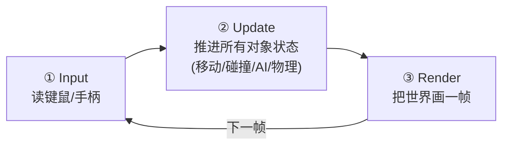
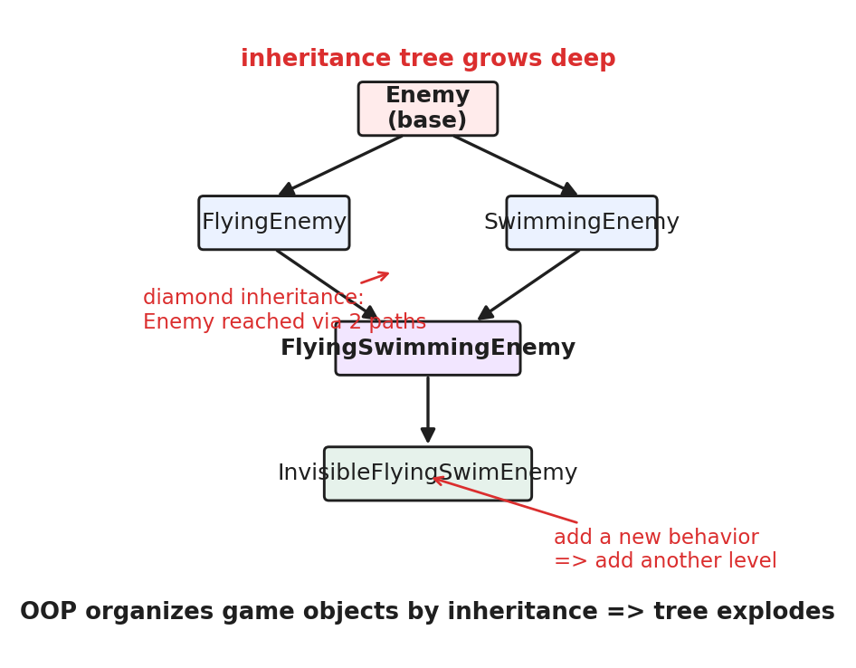
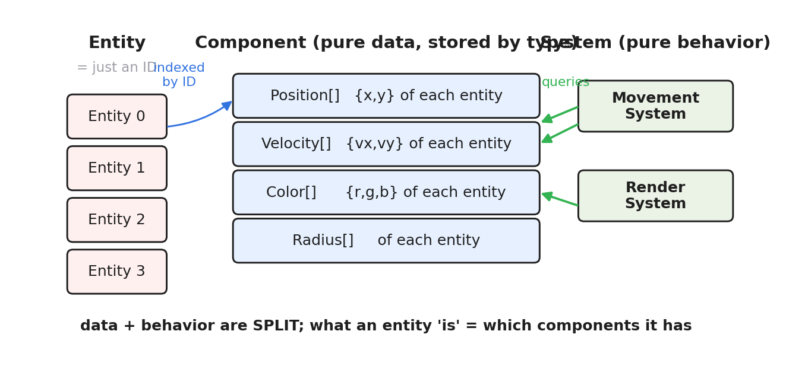
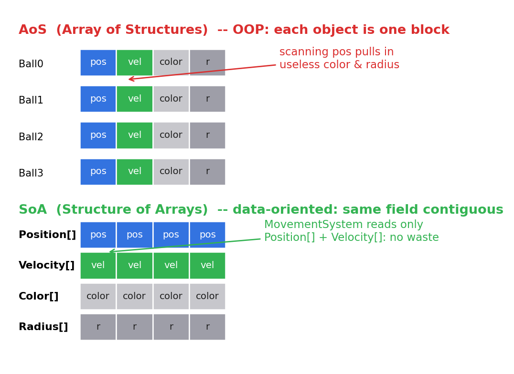
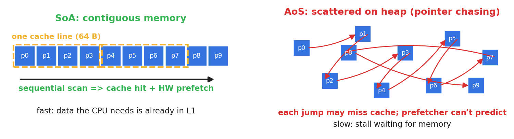

# 第 0 篇 · 第 1 章 · 第一性原理:一个虚拟世界怎么每帧更新 60 次

> **核心问题**:你会写 Web 服务、读过内核和数据库源码,可一旦面对"一个游戏(或任何实时交互的客户端)的程序结构到底是什么样",就两眼一抹黑。游戏程序和我们熟悉的"处理一个请求然后返回"的服务端程序,根本区别在哪?游戏里成千上万个对象,引擎怎么每帧把它们都更新一遍还跑得动 60 FPS?为什么现代游戏引擎都用 ECS 而不是面向对象?——本章要建立的就是这张全景图:**游戏引擎,本质就是一个永不停止的 while 大循环,每秒把虚拟世界的状态推进 60 次、每次都渲染一帧**。它的核心架构难题是组织海量对象,现代引擎的答案是 **ECS + 数据导向设计**。本章全程跟着一个"几百个移动小球"的小游戏,讲清这一切。

> **读完本章你会明白**:
> 1. 游戏程序和 Web 服务的根本区别:游戏是一个 `while(true)` 大循环(主动推进世界),不是"请求-响应"。
> 2. 一帧 16 毫秒的预算怎么花:主循环三段式 input → update → render。
> 3. 组织海量游戏对象,面向对象继承为什么撞墙(深继承、钻石继承、数据散落缓存差)。
> 4. ECS 三件套(Entity / Component / System)+ 数据导向设计,凭什么取代面向对象。
> 5. 为什么数据导向快:按"系统怎么遍历"布局数据,让 CPU 缓存和 SIMD 发挥威力(承《内存分配器》)。

> **如果一读觉得太难**:先只记住三件事——① 游戏引擎 = `while(true){ 更新世界; 渲染一帧; }` 的死循环;② 组织海量对象,面向对象继承会撞墙,现代引擎用 ECS;③ ECS 的精髓是"数据导向":按系统怎么遍历来摆放数据,让遍历缓存友好。

---

## 〇、一句话点破

> **游戏引擎,就是一个永不停止的 while 大循环——每秒把虚拟世界的状态推进 60 次,每次推进都更新所有对象、再渲染一帧。它的核心架构难题,是怎么组织海量对象让每帧够快;现代引擎的答案是 ECS + 数据导向设计:别按"对象是什么"组织数据(面向对象),而按"系统要怎么遍历数据"来布局数据。**

这是结论。本章倒过来拆,而且**全程跟着一个"几百个移动小球"的小游戏**——看它的程序结构长什么样、面向对象组织它会在哪撞墙、ECS 又是怎么漂亮解决的。

---

## 一、先看清:游戏程序和 Web 服务的根本区别

### 你熟悉的程序:请求-响应

你写过 Web 服务、数据库、分布式系统。这些程序的共同结构是**请求-响应(request-response)**:程序大多时候**睡着等**,来一个请求,处理一下,返回结果,接着等。没请求时,CPU 是闲的。整个程序是**被动的**——外部不来事件,它不动。

```
   你熟悉的 Web 服务(请求-响应):

        ┌─ sleep ──> 来请求 ──> 处理 ──> 返回 ─┐
        └────────────────────────────────────┘
                     (被动, 等事件才动)
```

### 游戏程序:永不停止的大循环

游戏(以及任何实时交互的客户端:浏览器、仿真、实时看板)完全不同。**它没有"等请求"这回事——它从启动到关闭,每时每刻都在主动推进世界。** 哪怕玩家不动手柄,游戏里的云在飘、水在流、敌人在巡逻、物理在结算、画面在刷新。驱动这一切的,是一个**永不停止的 while 循环**:

```python
while True:            # 游戏主循环, 从启动到关闭一直转
    process_input()    # 读输入: 键鼠/手柄这一帧按了什么
    update()           # 更新世界: 推进所有对象的状态(移动、碰撞、AI...)
    render()           # 渲染: 把更新后的世界画一帧到屏幕
```

这个循环每转一圈叫**一帧(frame)**。屏幕每秒刷新 60 次(60 FPS),所以这个循环**每秒要转 60 圈**——每圈只有 **16 毫秒**(1000ms ÷ 60)的预算,要在里面读输入、更新几千上万个对象、渲染一帧。做不到,画面就卡。

> **钉死这件事**:游戏程序 = `while(true){ 更新世界; 渲染一帧; }` 的死循环,和"请求-响应"的服务端**根本不同**——它是**主动**推进世界的,每秒 60 次,每圈 16ms。这是理解一切游戏引擎机制的起点。后面所有机制(ECS、主循环、job 系统),都是为了让这个循环每圈 16ms 跑得动。

---

## 二、一帧 16 毫秒:主循环三段式

那 16 毫秒怎么花?最朴素的主循环分三段:



- **① Input(输入)**:这一帧玩家按了什么键、手柄推到哪、鼠标移到哪,读进来。
- **② Update(更新)**:把世界里所有对象的状态推进一格。几百个小球各自按速度移动一格、互相碰撞反弹、AI 决策、物理结算……**这是最耗时的一段**,也是本书的主战场(ECS 就是为了让这一段够快)。
- **③ Render(渲染)**:把更新后的世界画一帧。这一段就是《图形渲染管线》那本书讲的整条管线——本书一句话带过,聚焦"引擎怎么每帧把场景数据喂给管线"(第 5 篇 P5-18)。

### 我们的例子:几百个移动小球

本章全程跟着一个最小游戏:**屏幕上几百个小球,每个有自己的位置和速度,每帧移动一格、撞墙反弹**。它的主循环 update 段,朴素地写就是:

```python
# 朴素 update: 遍历所有小球, 各自移动 + 撞墙反弹
for ball in all_balls:
    ball.x += ball.vx     # 位置 += 速度
    ball.y += ball.vy
    if ball.x < 0 or ball.x > W: ball.vx = -ball.vx   # 撞墙反弹
    if ball.y < 0 or ball.y > H: ball.vy = -ball.vy
```

看起来简单。可问题是:**这几百个小球(在真实游戏里是几千上万个对象),在程序里怎么组织?** 这才是游戏引擎的核心架构难题。下面两节,我们先用面向对象组织它,看它撞什么墙;再用 ECS 组织,看它怎么漂亮解决。

---

## 三、组织海量对象的难题:面向对象为什么撞墙

### 朴素做法:每个小球是一个对象

最直觉的做法,面向对象:定义一个 `Ball` 类,把"小球是什么、小球会什么"绑在一起。

```python
class Ball:                    # 面向对象: 数据 + 行为绑在一个对象里
    def __init__(self, x, y, vx, vy, color, radius):
        self.x, self.y = x, y          # 位置
        self.vx, self.vy = vx, vy      # 速度
        self.color = color             # 颜色
        self.radius = radius           # 半径
    def update(self):                  # 行为也绑在对象里
        self.x += self.vx; self.y += self.vy
        ... # 撞墙反弹
    def render(self):
        ... # 画自己
```

几百个小球 = 一个 `Ball` 对象数组。update 就是 `for ball in balls: ball.update()`。看起来没问题。**那面向对象撞什么墙?** 有两面墙:

### 墙一:继承地狱(真实游戏对象千变万化)

几百个相同的小球,面向对象没问题。可真实游戏的对象**千变万化**:有会飞的角色、会游泳的敌人、会飞的会游泳还会施法的 BOSS……面向对象的武器是**继承**,于是继承树越长越深:



- **深继承**:为了表达"会飞的会游泳的会施法的敌人",继承链 `Enemy → FlyingEnemy → SwimmingEnemy → ...` 越来越深。
- **钻石继承**:`FlyingSwimmingEnemy` 同时继承 `FlyingEnemy` 和 `SwimmingEnemy`,而它们又都继承 `Enemy`——`Enemy` 的数据被继承了两次,混乱。
- **加新行为要改继承树**:策划突然要"会隐形的飞行敌人",你得新加一个继承类,可能牵一发动全身。

> **不这样会怎样**:真实游戏有几百种对象组合(能飞/能游/能施法/能隐身/能掉落……),用继承表达,继承树会爆炸,改一个新组合就牵动整棵树。这是面向对象组织游戏对象的**第一面墙**。

### 墙二:数据散落,缓存差(性能墙,本书真正关心的)

这第二面墙更致命,而且是面向对象的**根本性**问题。看上面 `Ball` 类:位置、速度、颜色、半径,加上 `update`/`render` 行为,全绑在一个对象里,存在内存的**一块**。几百个小球在内存里长这样:

```
   面向对象(AoS: Array of Structures): 每个对象是一整块

   [Ball_0: x,y,vx,vy,color,radius] [Ball_1: x,y,vx,vy,color,radius] ...
    └─ 一整块, 散落在堆上, 用指针连 ─┘
```

问题来了:主循环 update 段只需要 `x, y, vx, vy`(算位置),**根本不需要 color 和 radius**。可面向对象把所有字段绑一起,CPU 遍历时,**每读一个小球的 x、y,就把这一整块(含无用的 color、radius)都拉进缓存行**。而且每个 `Ball` 对象是 `new` 出来散落在堆上的,遍历时是**指针追逐(pointer chasing)**——东一个西一个,CPU 缓存几乎全 miss, prefetcher 也预测不了。

> **钉死这件事**:面向对象的根本性能问题——**数据按"对象"组织,可遍历是按"字段"的**(update 只要位置速度,render 只要颜色半径)。对象把无关字段绑一起,遍历时拉一堆无用数据进缓存;对象又散落在堆上,遍历变成指针追逐,缓存全 miss。**几百个小球还好,几万个对象每帧更新,这面墙直接让游戏卡死。**

这就是为什么现代游戏引擎抛弃面向对象组织对象。答案,是下一节的 ECS。

---

## 四、ECS 的答案:三件套 + 数据导向

### ECS 三件套:把"是什么""有什么""怎么做"拆开

ECS(Entity-Component-System)的核心思想:**把面向对象绑在一起的"数据 + 行为"拆开**。



- **Entity(实体)= 一个 ID**。就一个数字(0, 1, 2...),什么数据都没有。它只是"这个游戏对象存在"的标记。几百个小球 = 几百个 Entity ID。
- **Component(组件)= 纯数据**。`Position{x,y}`、`Velocity{vx,vy}`、`Color{r,g,b}`——每个组件就是一小块数据,**没有任何行为**。一个 Entity"有什么组件"就"是什么":有 Position+Velocity+Color+Radius 组件的 Entity 就是个小球。
- **System(系统)= 纯行为**。`MovementSystem`(遍历所有有 Position+Velocity 的实体,更新位置)、`RenderSystem`(遍历所有有 Position+Color 的实体,画出来)——每个 System 只做一件事,**遍历它关心的那类组件**。

对比面向对象:

| | 面向对象 | ECS |
|---|---|---|
| 数据和行为 | 绑在一个对象里 | 拆开:Component 是数据,System 是行为 |
| "是什么" | 由类(继承)决定 | 由"有哪些 Component"组合决定 |
| 加新行为 | 改继承树 | 加个新 System,不动现有数据 |
| 遍历 | 按对象遍历,拉一堆无用字段 | 按组件类型遍历,只碰要的字段 |

> **钉死这件事**:ECS 把面向对象的"数据+行为绑一起"拆成三件套——**Entity 是 ID、Component 是纯数据、System 是纯行为**。"对象是什么"由"它有哪些 Component"组合决定(再不用继承树),加新行为就加个 System(不动现有数据)。这一下同时拆掉了第一面墙(继承地狱)。

### 但拆三件套只是开始,真正的杀手锏是"数据导向"

ECS 拆开三件套,解决了继承墙。但它真正解决性能墙(第二面)的,是**数据导向设计(Data-Oriented Design)**:**Component 不按"属于哪个 Entity"存,而按"System 怎么遍历"存。**

回想 update 段:`MovementSystem` 只要 Position 和 Velocity。数据导向的做法是——**把所有实体的 Position 连续存一块,所有 Velocity 连续存一块**。这就是 **SoA(Structure of Arrays)**,和面向对象的 **AoS(Array of Structures)** 正相反:



- **AoS(面向对象)**:`[Ball_0: pos,vel,color,radius][Ball_1: pos,vel,color,radius]...`——每个对象一整块,遍历位置时要拉上无用的颜色半径。
- **SoA(数据导向)**:`[pos_0,pos_1,pos_2...][vel_0,vel_1,vel_2...][color_0,...][radius_0,...]`——同一字段连续存。`MovementSystem` 只要 pos 和 vel 两个数组,一路连续读,**不碰 color/radius**。

---

## 五、为什么数据导向快:缓存友好 + 可并行(承《内存分配器》)

SoA 凭什么快?这要回到 CPU 怎么读内存——而这正是《内存分配器》那本讲透的"数据布局决定性能"。

### 缓存友好:连续读 vs 指针追逐

CPU 读内存不是一字节一字节读,而是按**缓存行(cache line,通常 64 字节)**整块读进 L1 缓存。读下一个数据时,如果它**在缓存行里**(缓存命中),飞快;如果**不在**(缓存未命中),要慢几十上百倍地去内存搬。



- **SoA(连续)**:Position 数组是连续的,CPU 读 `pos_0` 时把整条缓存行(含 `pos_1, pos_2...`)都搬进 L1,后面几个全命中;**硬件 prefetcher 还能预测你顺序读,提前把后面的搬来**。一路畅通。
- **AoS(散落)**:`Ball` 对象散落在堆上,读 `ball_0` 要跳到地址 A,读 `ball_1` 跳到地址 B……每次跳都可能缓存未命中,prefetcher 也预测不了。**这就是"指针追逐"**,缓存几乎全 miss。

> **承《内存分配器》**:这就是那本讲的"数据布局决定性能"——**不是算法复杂度的问题,是数据在内存里怎么排布的问题**。SoA 把同一字段连续排布,让 CPU 缓存和 prefetcher 发挥威力;ECS 的 Component 存储(第 2 篇 P2-06)和 Archetype 分组(P2-08),本质都是在做这件事。

### 可并行:海量实体,同一操作,SIMD + 多核

数据导向还有个面向对象做不到的好处:**海量实体做同一个操作,天然适合并行**。

- **SIMD**:`MovementSystem` 对每个实体都是"`pos += vel`"这同一个操作。SIMD 指令一次能对 8 个、16 个实体的 Position 同时加 Velocity——SoA 连续布局正好喂给 SIMD。
- **多核数据并行**:实体 0~999 互不依赖,可以分给 8 个核各算 125 个,同时跑。面向对象散落的数据,根本没法这样切。

> **钉死这件事**:数据导向快的根 = **数据连续(缓存命中+预取)+ 同一操作(SIMD 批量)+ 互不依赖(多核并行)**。这三件事面向对象的"对象散落"全都做不到。这是 ECS 取代面向对象的**性能理由**,也是第 2 篇(P2-06~08)要逐站拆透的灵魂。

---

## 六、承接:本书在你已读系列里的坐标

本书不是孤立的,它在你写过的系列里有密集承接:

- **★承《图形渲染管线》**:引擎的渲染子系统(Render 那段)就是那本书的整条管线。本书 P5-18 讲"引擎怎么每帧把场景喂给管线",管线本身一句带过指路。
- **★承《内存分配器》**:ECS 的 SoA / 缓存行 / SIMD / 数据导向,本质是"数据布局决定性能"在游戏引擎的极致应用——第 2 篇把这条承接兑现。
- **承《Lua 虚拟机》**:很多引擎用 Lua 做热重载脚本。本书 P4-14 讲"怎么把 Lua VM 嵌进引擎"。
- **承《JVM》**:Unity 用 C#(IL2CPP 编译)。本书 P4-15 讲跨语言脚本。
- **承《数学分析》《线性代数》**:主循环的数值积分、对象的变换。
- **承《Linux 内核机制》《Tokio》**:主循环事件驱动、多线程 job 系统。

> **钉死这件事**:读本书,你不是从零学游戏引擎,而是把你已有的功底(数据布局、VM、主循环、并行),装到游戏引擎这个场景里。

---

## 七、技巧精解:两个第一性洞察

### 洞察一:面向对象的错,错在"按对象组织,却按字段遍历"

面向对象组织游戏对象为什么慢?根因不是"面向对象不好",而是**它的数据布局和遍历方式不匹配**:对象按"它是什么"组织(一个 Ball 整块),可遍历是按"我要哪个字段"的(update 只要位置速度)。这种**组织方式和访问方式错配**,在几百个对象时无所谓,几万个对象每帧更新时就是灾难。ECS 的数据导向,本质是**让数据布局服从访问方式**——你怎么遍历,我就怎么摆。

> **不这么设计会怎样**:如果坚持面向对象(对象整块、散落堆上),几万个对象每帧遍历,指针追逐让缓存全 miss,16ms 预算根本不够,游戏卡死。这是真实游戏引擎从面向对象迁移到 ECS的根本动力。

### 洞察二:大循环 + 数据导向,是所有实时系统的通用解

游戏引擎的"while 大循环 + 数据导向",不是游戏独有的。**浏览器渲染**(每帧布局-绘制-合成)、**物理仿真**(每步推进所有粒子)、**实时数据看板**(每秒刷新海量指标)——本质都是"大循环 + 把海量数据按访问方式布局"。本书讲透游戏引擎,你顺带理解了这一整类实时系统。

---

## 八、章末小结

### 回扣主线

本章立起全书四个根基:① 游戏引擎 = while 大循环,每秒推进世界 60 次;② 主循环三段式 input→update→render,每帧 16ms;③ 组织海量对象,面向对象撞墙(继承地狱 + 数据散落缓存差);④ ECS + 数据导向是答案(Entity/Component/System + 按系统遍历布局数据)。我们全程跟"几百个移动小球",看清了面向对象在哪撞墙、ECS 怎么漂亮解决。

### 五个为什么

1. **游戏程序和 Web 服务根本区别?**——游戏是 `while(true)` 大循环主动推进世界,每秒 60 次;Web 服务是请求-响应被动等事件。
2. **一帧 16ms 怎么花?**——input(读输入)→ update(推进所有对象,最耗时)→ render(画一帧)。
3. **面向对象组织游戏对象撞什么墙?**——继承墙(深继承/钻石继承/改树)和性能墙(数据散落堆上,按对象组织却按字段遍历,缓存全 miss)。
4. **ECS 凭什么取代面向对象?**——三件套拆开"数据+行为"(Entity 是 ID、Component 是数据、System 是行为),解决继承墙;数据导向按访问方式布局(SoA),解决性能墙。
5. **为什么数据导向快?**——数据连续(缓存命中+预取)+ 同一操作(SIMD 批量)+ 互不依赖(多核并行),承《内存分配器》"数据布局决定性能"。

### 想继续深入往哪钻

- 想搞懂 ECS 三件套:第 2 篇 P2-05。
- 想搞懂 SoA / 数据布局(承分配器):第 2 篇 P2-06。
- 想搞懂 Archetype(现代 ECS 怎么存):第 2 篇 P2-08。
- 想搞懂主循环 / 固定步长:第 3 篇 P3-10。
- 想亲手跑通:附录 B"用 EnTT 写一个最小 ECS"。

### 引出下一章

我们搞清了游戏引擎是 while 大循环、面向对象撞墙、ECS + 数据导向是答案。但这个**大循环本身**,一帧到底怎么跑、物理更新为什么用固定步长而渲染不用、delta time 怎么让动画帧率独立?还有,引擎除了更新对象,还有哪些子系统在循环里协作?下一章 P1-02,我们从**游戏引擎是什么:从一个 while 循环说起**,把主循环的三段式和 16ms 预算讲透。

> **下一章**:[P1-02 · 游戏引擎是什么:从一个 while 循环说起](P1-02-游戏引擎是什么-从一个while循环说起.md)
