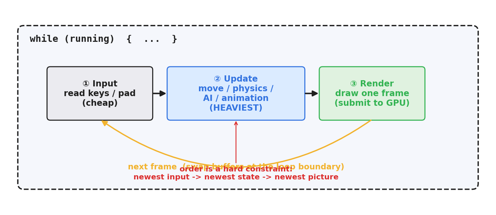
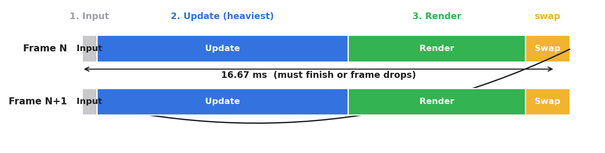
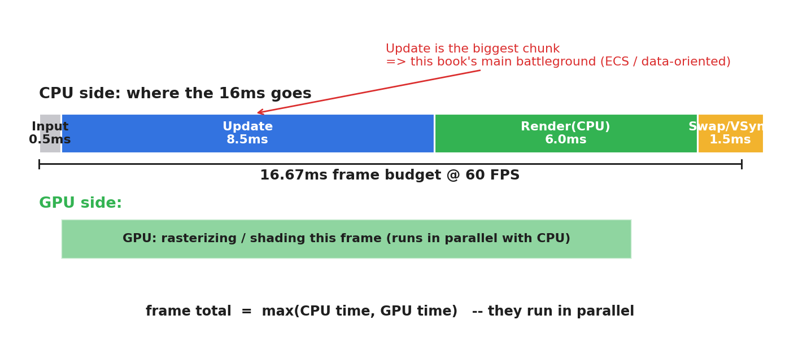
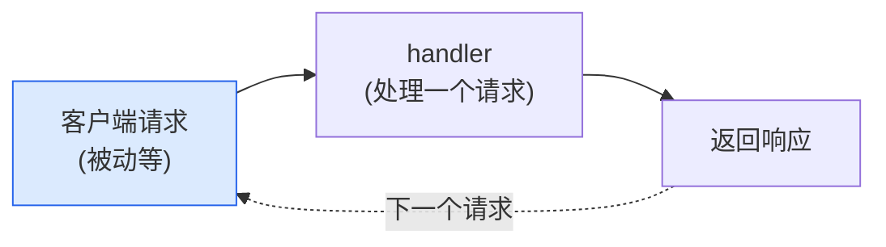
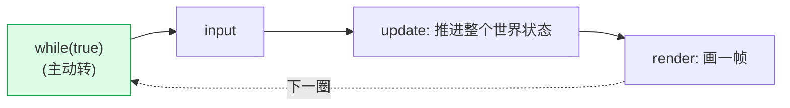
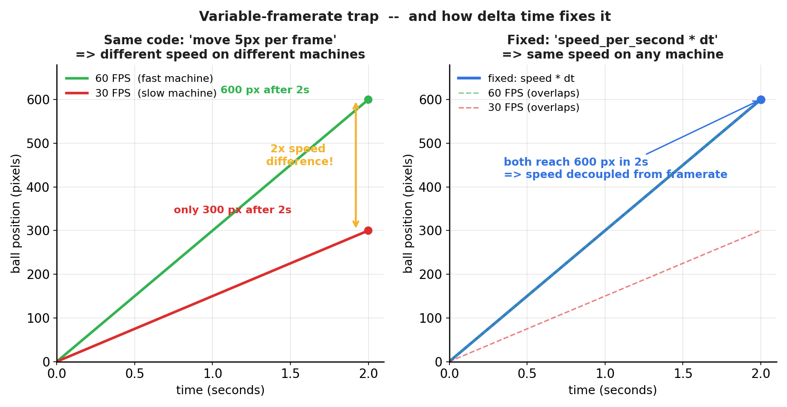

# 第 1 篇 · 第 2 章 · 游戏引擎是什么:从一个 while 循环说起

> **核心问题**:上一章我们点破了游戏引擎是 `while(true){ 更新世界; 渲染一帧; }` 的大循环。可这个循环**长什么样**?它一秒要转 60 圈,每圈 16 毫秒,这 16 毫秒到底花在哪、按什么顺序花?更要命的是——为什么同一份"每帧把小球向右挪 1 像素"的代码,在你的高配机上跑得飞快、在朋友的老笔记本上却像慢动作?游戏程序和你写惯的"来一个 HTTP 请求就处理一下"的 Web 服务,在程序结构上到底差在哪?本章把上一章那句"大循环"彻底展开:**看清主循环的三段式(input → update → render)、看清 16 毫秒预算怎么切、看清"可变帧率"这个让所有游戏程序员都栽过跟头的坑长什么样**。

> **读完本章你会明白**:
> 1. 游戏主循环的三段式 **input → update → render**,每一段到底干什么、为什么必须按这个顺序(为什么 input 在 update 前、为什么 render 在最后)。
> 2. 一帧 16 毫秒的预算怎么花:update 最耗时(是本书主战场)、render 次之、input 廉价。
> 3. 游戏程序和"请求-响应"服务端在**结构上**的根本差别:游戏主动推进世界、服务端被动等事件,这决定了两者完全不同的写法和性能模型。
> 4. **可变帧率(variable framerate)陷阱**:为什么"每帧移动固定距离"会让游戏在快机器上变快、慢机器上变慢,这个痛点怎么自然引出下一章要讲的 delta time 与固定步长。
> 5. 主循环的几种历史形态:固定帧率(早期街机)、可变帧率、带固定步长更新 + 可变渲染(accumulator 模式预告)。

> **如果一读觉得太难**:先只记住三件事——① 游戏主循环就是 `while(true){ input(); update(); render(); }`,顺序不能换;② update 段最吃性能,本书后面讲的 ECS、数据导向、job 系统全是为了让这一段够快;③ 同一份"每帧挪 1 像素"的代码在不同帧率的机器上速度不一样,这是游戏开发最经典的坑,第 3 篇会用 delta time 和固定步长解决它。

---

## 〇、一句话点破

> **游戏程序的结构,就是一个不停转的 while 循环:每圈先读输入(input)、再推进整个虚拟世界的状态(update)、最后把这个世界画一帧到屏幕(render),然后再读输入、再推进、再画……一秒转 60 圈,每圈 16 毫秒。这个"循环本身"是游戏和一切"请求-响应"程序的分水岭——Web 服务被动等事件,游戏主动推进世界。而循环里最隐蔽、最坑人的一个事实是:你"每帧移动多少"不能写死,因为不同机器一秒能转的圈数不一样,写死了游戏速度就跟着帧率飘。**

这是结论。本章倒过来拆:先把循环三段式一段段掰开看,再把 16 毫秒预算的账算清楚,最后用那个经典的"小球在两台机器上速度不一样"的例子,让你亲手摸到游戏开发的第一道大坎——可变帧率。

---

## 一、为什么先讲主循环:它是游戏引擎的地基,而不是锦上添花

你也许会问:上一章已经说过游戏引擎是大循环了,这一章再讲一遍,是不是绕远路?

不是。上一章是用大循环来**对比面向对象**,重点在"组织海量对象"那面墙。这一章我们**把镜头对准循环本身**——循环怎么转、转一圈花多久、每一段在干什么、转得快慢不一样会出什么事。这是"驱动"这一面的地基。后面第 3 篇讲 fixed update、delta time、accumulator,第 5 篇讲多线程 job 系统,全都是建立在本章讲清的"一帧怎么跑"之上。

> **钉死这件事**:本书的二分法是"组织 vs 驱动"。上一章(P0-01)顺带点了"大循环"一句,但镜头其实对着"组织"(面向对象 vs ECS)。本章(P1-02)和下一章(P1-03)把镜头正式转向"驱动":先看清主循环本身(P1-02),再看循环里有哪些子系统在协作(P1-03)。你迷路的时候,就回到这个二分法问自己——这一段是在讲"数据怎么躺",还是"循环怎么跑"?

打个比方帮你定位(只此一处,不延伸):你写过的 Web 服务,主流程是 `接收请求 → 查数据库 → 拼响应 → 返回`,这个流程决定了你怎么设计中间件、怎么做错误处理、怎么压测。游戏的"主流程"就是主循环,它同样决定了你怎么组织代码、怎么分配性能预算、怎么处理并发。**不先把主循环看清楚,后面所有引擎机制(ECS 怎么被遍历、物理怎么用固定步长、job 怎么并行)都没有落脚点。**

---

## 二、从一个最小可玩的游戏说起:不到 20 行的主循环

我们不从概念入手,先看代码。下面是一个能跑的最小游戏——一个可以左右移动的小方块,撞墙反弹。它的全部主循环长这样:

```python
# 最小主循环: 一个可以左右移动 + 撞墙反弹的小方块
x = 100           # 方块位置
vx = 5            # 方块速度(每帧移动 5 像素)
running = True

while running:                       # <-- 主循环, 从启动到关闭一直转
    # ① Input: 读这一帧玩家按了什么键
    keys = read_keyboard()
    if keys["left"]:  vx = -5
    if keys["right"]: vx = 5
    if keys["quit"]:  running = False

    # ② Update: 推进世界状态(这里就是把方块挪一格)
    x += vx
    if x < 0 or x > 800:             # 撞墙反弹
        vx = -vx

    # ③ Render: 把世界画一帧
    clear_screen()
    draw_rect(x, 300, 40, 40, color="red")
    swap_buffers()                   # 把画好的帧翻到屏幕
```

就这么短。这个 20 行的程序,和《赛博朋克 2077》这种 3A 大作,**主循环的骨架是一样的**:都是一个 `while`,每圈按 input → update → render 的顺序跑。区别只在于:update 段里更新的对象从 1 个方块变成几万个实体,render 段里画的东西从 1 个方块变成上百万三角形,但**循环的结构没变**。

> **钉死这件事**:从最小的 Pong 到最大的 3A,游戏主循环的骨架都是 `while(true){ input(); update(); render(); }`。引擎的复杂度全在 update 和 render 两段里"更新什么、画什么",不在循环结构本身。所以本章值得花一整章把这个骨架讲透——它是后面一切的地基。

下面这张图把三段式的结构画出来(后面还有一张两帧时序图):



下面三节,我们把这三段一段段掰开看,每段都回答三个问题:**它干什么、为什么不这样会出事、为什么放在这个位置**。

---

## 三、第一段 Input:读"玩家这一帧想干什么"

### Input 段干什么

Input(输入)段的任务很单纯:**把玩家这一帧的意图读进来**。玩家按了哪个键、鼠标移到哪、手柄摇杆推了多远、触摸屏点在哪个位置——这些都是"输入"。Input 段把它们从操作系统的输入队列里取出来,翻译成游戏能理解的形式(比如"玩家这一帧想往右走")。

在 20 行例子里,Input 段就是 `read_keyboard()` 加几个 `if` 判断。在真实引擎里它要复杂得多:可能要支持键鼠、手柄、方向盘、触屏、VR 手柄等多种设备;要处理"按键被按下""按键被松开""按键持续按住"这三种状态;还要把原始输入(比如手柄摇杆的 0.7)经过死区(dead zone)过滤、平滑处理后,变成游戏逻辑要的"移动量"。

### 不先把输入读进来会怎样

你会问:为什么 input 非得放在最前面?我能不能先 update(用上一帧的输入)、render 完了再读这一帧的输入,留到下一帧用?

能跑,但**玩家会觉得操作"黏"**。想象你在玩射击游戏,你按下开火键。如果引擎先 update 再读输入,那你这一帧按的键,要到下一帧的 update 才生效——延迟了一整帧(16ms 起步,叠加显示延迟、输入设备轮询周期,手感会明显变差)。专业玩家对这种延迟极其敏感,格斗游戏的"帧数表"社区就是围绕"哪个动作发生后第几帧能取消"这种精度建立起来的。

更糟的是,如果你 render 之后才读输入,那这一帧画到屏幕上的画面,用的是**上一帧的输入算出来的世界状态**——画面永远滞后玩家操作一帧。对实时交互来说,这种滞后累积起来会毁掉手感。

> **不这样会怎样**:把 input 放在 update 之后或 render 之后,玩家的操作就要多等一到两帧才在画面上生效,手感发黏。在格斗、射击、音游这种对输入延迟零容忍的品类里,这是致命的。所以 input 必须最先读,这一帧读到的输入,这一帧的 update 就用上。

### 为什么 input 段通常很廉价(性能上)

注意一个反差:input 段虽然**逻辑上**最重要(直接决定手感),但它通常是主循环里**最廉价**的一段(性能上)。原因是输入数据量本来就小:一个键盘一百来个键的状态(用一个位图就够了),一只鼠标的位置加几个按键,一只手柄十几个轴和按钮。这点数据相对 update 段要处理的几千上万个对象的状态,简直九牛一毛。

所以你会看到一种很反直觉的现象:游戏引擎优化时,几乎没人去优化 input 段的性能(它的耗时常常不到一帧的 1%),但会花大力气优化 input 的**延迟**(从按键事件到画面响应的端到端时间)。性能和延迟是两件事,本章后面讲预算分配时还会回到这一点。

> **承接书讲过**:input 的具体机制(事件总线 vs 轮询、设备抽象、死区处理)本书第 5 篇 P5-19 单开一章讲,这里只把它作为主循环的一段先认识它。

---

## 四、第二段 Update:推进整个虚拟世界(本书主战场)

### Update 段干什么

Update(更新)段是主循环里**最重**的一段,也是本书几乎所有篇幅(尤其第 2 篇 ECS)要服务的对象。它的任务是:**把整个虚拟世界的状态,往前推进一帧**。

什么叫"推进一帧"?拿 20 行例子说,就是把方块的 `x` 加上 `vx`,再判断撞墙反弹。在真实游戏里,"推进一帧"包括但不限于:

- **移动**:几千个角色、敌人、子弹、粒子,各自按自己的速度移动一格(这是最基础的)。
- **物理**:重力下落、碰撞检测、碰撞响应、绳索/布料/流体的数值积分(碰撞和积分是最吃 CPU 的之一)。
- **AI**:敌人怎么巡逻、怎么追玩家、怎么决策(寻路、状态机、行为树)。
- **动画**:角色当前播放哪个动画、动画在第几帧、骨骼怎么插值。
- **脚本**:游戏逻辑脚本(Lua / C# / Blueprint)里那些"每帧要执行"的回调。
- **游戏规则**:计分、刷怪、任务进度、存档检查……

可以看出,update 段干的活又多又杂,而且**对象数量巨大**(一个开放世界游戏,update 段每帧要碰的对象能到几十万)。这就是为什么 update 段几乎总是一帧预算里**最大的一块**,也是为什么本书后面花一整本讲 ECS 和数据导向——它们存在的全部意义,就是让 update 段能在一帧 16 毫秒内,把这几万到几十万个对象都更新一遍。

> **钉死这件事**:update 段 = 把世界里所有对象的状态推进一帧。它是一帧里最耗时的一段,也是本书的主战场。你后面读到的 Entity/Component/System、SoA、Archetype、job 系统,全部是为了让 update 段够快。理解了这一点,你就理解了为什么本书要花 5 章(第 2 篇)讲 ECS——不是为了时髦,是因为 update 段性能压不起。

### 为什么 update 必须在 input 之后、render 之前

update 必须在 input 之后——前面讲过,input 没读进来,update 用什么去推进世界?用上一帧的旧输入?那手感就黏了。

update 必须在 render 之前——这个更显然:render 是"把世界画出来",你必须**先**把世界推进到当前这一帧的最新状态,**再**画。如果反过来先 render 再 update,那你这一帧画到屏幕上的,是**上一帧 update 之后**的世界状态,又滞后一帧。

所以三段的顺序是**强约束**:input → update → render,不能换。这个顺序是"用这一帧的最新输入、算出这一帧的最新世界、再把这个最新世界画出来"的逻辑必然。

> **所以这样设计**:三段式 input → update → render 的顺序不是随便定的,是"用最新输入 → 算最新状态 → 画最新状态"这条逻辑链决定的。换任何一段的位置,都会引入至少一帧的滞后或逻辑错误。

### Update 里"物理"那块一句带过

update 段里有一大块是物理更新(重力、碰撞、积分)。物理更新有它自己的讲究:**它必须用固定步长**(为什么,第 3 篇 P3-10 详讲),和 update 段其它部分(可变步长)不一样。这一章我们先不展开,只点一句——update 段里"移动、AI、动画"这类逻辑用可变步长(跟着帧率走)就行,但"物理积分"必须固定步长,否则数值会爆炸。

> **承接书讲过**:物理引擎的具体实现(碰撞检测、积分方法、约束求解)是本子线另一本书《物理引擎》的内容,本书一句带过。本书只在第 3 篇 P3-10 讲"主循环怎么把固定步长的物理 update 嵌进可变步长的渲染里"(accumulator 模式),那是引擎层面的安排,不是物理算法本身。

---

## 五、第三段 Render:把世界画一帧到屏幕

### Render 段干什么

Render(渲染)段的任务是:**把 update 之后的世界状态,转换成一帧画面,送到屏幕**。

这个"转换"过程——从世界里的三维模型、材质、灯光、相机,到屏幕上每个像素的颜色——就是《图形渲染管线》那本书讲的整条管线(顶点变换、光栅化、深度测试、着色、混合……)。本书**不重讲**这条管线,只把它作为主循环的一段先认识它。

在 20 行例子里,render 段就三步:`clear_screen`(清屏)、`draw_rect`(画方块)、`swap_buffers`(把画好的帧翻到屏幕)。在真实引擎里,render 段要先做剔除(只画相机看得见的)、再做批处理(把能用同一材质的物体合并成一个 draw call)、再实际调图形 API(Vulkan / DirectX / Metal / OpenGL)提交给 GPU、最后等 GPU 画完把帧翻到屏幕。

### Render 为什么必须放最后

前面讲过:update 必须在 render 前,因为 render 要画的是"最新状态"。这里再补一个角度:render 是**只读**地访问世界状态(它不改世界,只把世界画出来),这种"只读"性质让它可以放心地放在最后——它不会污染下一帧的输入和更新。

如果 render 里偷偷改了世界状态(比如某个渲染回调里手贱写了 `x += 1`),那就是 bug——渲染不应该有副作用。引擎设计上会用各种机制(比如 const 引用、不可变视图)来防止 render 段误改世界状态。

### Render 段是第二大预算消耗

render 段通常是一帧里**第二大**的预算消耗(update 第一)。原因是 GPU 虽然快,但现代游戏一帧要画的东西太多了:上百万三角形、几百个 draw call、复杂的着色器、阴影、后处理……render 段吃掉 5~8 毫秒是常态。

但有个关键差别:**render 段的活主要在 GPU 上跑**,update 段的活主要在 CPU 上跑。所以你看一帧的 CPU profile,update 段常常占大头、render 段(CPU 这边主要是在准备 draw call 和等 GPU)反而没那么大;但一帧的总耗时,往往是 CPU(update + render 提交)和 GPU(实际画)两边取最大值。这个"CUP/GPU 并行"的话题,第 5 篇 P5-18 讲渲染提交时详谈。

> **承接书讲过**:render 段内部的渲染管线(变换、光栅化、着色、深度、混合),是《图形渲染管线》那本书的整条内容,本书一句带过。本书只在第 5 篇 P5-18 讲"引擎怎么每帧把 ECS 里的场景数据,提交给这条管线"(draw call、批处理、剔除)——那是引擎和管线的接口,不是管线本身。

---

## 六、把三段拼起来:主循环的时序

现在我们把三段拼起来,看完整的一帧是怎么转的。下面这张图把两帧的耗时分布画出来(配合后面的时序图一起看):



下面这张时序图展示了两帧的对象交互:

```mermaid
sequenceDiagram
    participant OS as 操作系统<br/>(输入/显示)
    participant Loop as 主循环
    participant World as 虚拟世界状态

    Note over Loop: === 第 N 帧 ===
    OS->>Loop: 输入事件(按键/手柄/鼠标)
    Loop->>Loop: ① Input: 读输入, 翻译成"玩家意图"
    Loop->>World: ② Update: 用意图推进世界(移动/物理/AI/动画)
    World-->>Loop: 推进后的最新状态
    Loop->>Loop: ③ Render: 把最新状态画成帧
    Loop->>OS: swap buffers: 帧翻到屏幕, 等垂直同步

    Note over Loop: === 第 N+1 帧 ===
    OS->>Loop: 输入事件(这一帧玩家又按了什么)
    Loop->>Loop: ① Input
    Loop->>World: ② Update
    World-->>Loop: 最新状态
    Loop->>Loop: ③ Render
    Loop->>OS: swap buffers
```

注意几个细节:

1. **三段是串行的**(在单线程模型里):input 完了才 update,update 完了才 render。这是最朴素的模型,真实引擎会用多线程把 update 内部并行化(第 5 篇 P5-17 的 job 系统),但"input → update → render"这个**外层顺序**始终是串行的。
2. **帧之间的边界是 `swap buffers`**:render 段画完一帧,要把这帧"翻"到屏幕(术语叫 buffer swap / page flip),这一翻,一帧才算结束,下一帧的 input 才开始。这一翻通常还要等显示器的垂直同步(vertical synchronization, VSync),否则会"撕裂"(屏幕上半画的是第 N 帧、下半画的是第 N+1 帧)。
3. **世界状态是"被推进"的**:每一帧的 update 都基于上一帧结束时的世界状态,往前推进一格。这是一个递推关系:`状态[t] = 推进(状态[t-1], 输入[t])`。整个游戏就是这个世界状态在时间轴上一格一格往前推。

> **钉死这件事**:主循环三段式 input → update → render,串行执行,以 `swap buffers` 作为帧边界。世界状态是一个递推序列:`状态[t] = 推进(状态[t-1], 输入[t])`。理解这个递推关系,你就理解了为什么游戏要"每帧都跑一遍"——世界状态是靠每帧推进一格来演化的,不跑就不前进。

---

## 七、一帧 16 毫秒的预算怎么花:三段的耗时分布

上面讲清了三段干什么、什么顺序。现在算账:一帧 16 毫秒(60 FPS),这三段各花多少?

### 16 毫秒这个数怎么来的

先说 16 毫秒怎么来的。显示器刷新率一般是每秒 60 次(60 Hz),意思是屏幕每秒把画面刷新 60 次。游戏要"流畅", ideally 是每秒生成 60 帧新画面,刚好对上屏幕刷新——这就是 60 FPS(frames per second)。一秒 1000 毫秒,60 帧平分,每帧 `1000 / 60 ≈ 16.67` 毫秒。所以**16 毫秒**这个数,本质是显示器刷新率决定的。

(现在的显示器有 120 Hz、144 Hz、240 Hz 的,对应的帧预算就是 8.3ms / 6.9ms / 4.2ms。但 60 FPS 是行业默认基准,本书以它举例。)

如果你一帧的耗时**超过** 16 毫秒,会怎样?屏幕要刷新了但你这一帧还没画完,要么显示上一帧(掉帧,stutter)、要么不等了直接显示半成品(撕裂)。前者让画面卡顿,后者让画面错位。所以"16 毫秒以内"是一个**硬约束**,游戏引擎的一切优化都是为了让这三段加起来不超过 16 毫秒。

### 三段的典型耗时

一帧 16 毫秒,典型情况下(update 重、render 中、input 轻)大致这么分:



- **Input**:0.5 毫秒上下,几乎可以忽略(前面说过,数据量小)。但**延迟**要单独优化(第 5 篇 P5-19)。
- **Update**:7~9 毫秒,是最大的一块。这就是为什么本书花一整本讲 ECS——update 段是性能瓶颈。
- **Render**:5~7 毫秒(这里指的是 CPU 侧准备 draw call + 等 GPU 的时间)。GPU 那边画一帧也是几毫秒,但 CPU 和 GPU 是并行的(第 5 篇 P5-18 详谈)。
- **其余**(swap buffers、等 VSync、引擎本身的调度开销):1~2 毫秒。

> **钉死这件事**:一帧 16 毫秒,input 几乎不吃预算、update 吃最大一块(7~9ms,本书主战场)、render 次之(5~7ms)、其余是同步开销。**update 是性能瓶颈**,所以本书后面所有的优化手段(ECS 的连续内存、SIMD、多核 job 系统)都集中在 update 段。理解了这一点,你就理解了本书的优化为什么"押宝在 update 上"。

### 16 毫秒预算的两个"对手"

这里要补一个关键认知:**16 毫秒预算,是被 CPU 和 GPU 两个处理器瓜分的,而且它俩是并行的**。

- CPU 跑主循环:input、update、(render 段里)准备 draw call 提交给 GPU。
- GPU 收到 draw call 后,实际去画那些三角形、跑着色器。
- 一帧的**总耗时 = max(CPU 耗时, GPU 耗时)**,不是两者相加(因为它俩并行)。

所以你做优化的时候,要先搞清楚瓶颈在哪边:

- 如果 CPU 是瓶颈(update 太慢),那优化 GPU(换更简单的着色器)没用,要优化 update(本书的主战场)。
- 如果 GPU 是瓶颈(画的东西太多),那优化 update(把 ECS 改成 SoA)没用,要简化渲染(减三角形、减 draw call)。

这就是为什么游戏引擎优化常常被描述成"找瓶颈"——你必须先量出一帧里 CPU 和 GPU 各花多少,才知道该优化哪边。本书主要讲 CPU 侧(尤其 update),GPU 侧优化(着色器、纹理、LOD)留给《图形渲染管线》和图形学专门的书。

---

## 八、回头对比:游戏循环 vs 请求-响应(为什么要强调这个差别)

上一章我们已经点过"游戏是主动推进世界、服务端被动等事件"。这一章我们把它讲得更结构化一点,因为它决定了你**写代码时的思维模式**完全不同。

### 请求-响应程序的结构

你写过的 Web 服务、数据库、RPC 服务,结构都是请求-响应:



这种程序的特征:

1. **被动**:没请求来,CPU 就闲着(在 epoll_wait / accept 上阻塞)。
2. **无状态(或状态可恢复)**:每个请求处理完,handler 的本地状态就丢了。要保存状态,显式写进数据库或 session。
3. **吞吐优先**:性能指标是"每秒处理多少请求(QPS)",延迟只要不超时就行。
4. **失败可重试**:一个请求处理失败,客户端重发就行(幂等性)。

### 游戏循环的结构

游戏完全是另一种结构:



这种程序的特征:

1. **主动**:没有"请求"这回事,循环自己每秒转 60 次,玩家不动手柄也照转(云在飘、水在流、敌人在巡逻)。
2. **状态持续演化**:世界状态是一个递推序列 `状态[t] = 推进(状态[t-1], 输入[t])`,状态的演化是程序的核心,不能丢。
3. **延迟优先**:性能指标是"每帧稳定 16 毫秒以内"(延迟敏感),吞吐(QPS)没意义(就一个"客户端"——玩家)。
4. **失败不能重试**:一帧算错了(物理穿模、状态错乱),不能"重发",只能接受这个错误或者整体回滚。

这个差别为什么重要?因为它决定了你写代码时的**默认假设**:

| | 请求-响应 | 游戏循环 |
|---|---|---|
| 默认状态 | 无状态,状态存数据库 | 世界状态在内存里持续演化,是核心 |
| 性能目标 | 高 QPS,可接受波动 | 稳定 16ms/帧,不能波动(波动 = 卡顿) |
| 内存模型 | 一个请求一组临时对象,用完回收 | 海量对象常驻内存,每帧都要碰一遍 |
| 并发模型 | 多个请求互不依赖,天然并行 | 一帧里所有对象有依赖(物理碰撞),要精心切分才能并行 |
| 失败处理 | 重试、降级 | 一帧超时就掉帧,没有重试 |

> **钉死这件事**:游戏循环和请求-响应是两种**结构上根本不同**的程序模型。Web 服务的优化目标是高 QPS、波动可接受;游戏循环的优化目标是**每帧稳定 16 毫秒,不能波动**——波动就是卡顿,玩家立刻能感觉到。这个"稳定比平均快更重要"的特性,贯穿游戏引擎所有设计(比如为什么物理要固定步长,因为可变步长会让物理仿真不稳定)。

### 一个具体的例子:为什么"GC 在游戏里是大敌"

举一个具体例子,帮你感受这个差别。在 Java / Go 这种带垃圾回收(GC)的语言里写 Web 服务,GC 偶尔停一下(STW, stop-the-world)几十毫秒,大家觉得可以接受——一个请求慢一点就慢一点,QPS 短暂下降,无伤大雅。

但同样的事在游戏里是灾难:GC 一停 50 毫秒,就是连续 3 帧没画出来,玩家看到的就是画面卡死 50 毫秒——这在音游、格斗、射击里直接毁掉体验。这就是为什么:

- Unity 用 C# 但要小心翼翼控制 GC(对象池、避免运行时分配);
- 主流高性能游戏引擎核心几乎都用 C++ 或 Rust(无 GC,内存分配完全手动控制);
- ECS 的数据导向设计天然"少分配"(数据连续存放,不像面向对象那样 new 一堆散落对象)——这本身就是为了消灭 GC 和分配抖动。

这个例子说明:**请求-响应程序里可以容忍的东西,在游戏循环里常常不能忍**。这种思维转换,是从 Web/服务端转游戏开发最需要建立的第一直觉。

---

## 九、本章的重头戏:可变帧率陷阱

前面八节我们看清了主循环的结构、预算、和请求-响应的差别。这一节,我们讲游戏开发**最经典、最坑人、每一个新手都栽过**的一个问题:**可变帧率(variable framerate)陷阱**。这个问题会自然引出第 3 篇要讲的 delta time 和固定步长——理解了它,你就理解了为什么第 3 篇那两章非写不可。

### 问题的产生:同一份代码,两台机器,两个速度

回到我们 20 行的例子。我们让那个小方块"每帧移动 5 像素":

```python
while running:
    ...
    x += 5        # 每帧固定移动 5 像素
    ...
```

现在把这份代码放到两台不同的机器上跑:

- **你的高配机**:性能强,一秒能跑 60 帧(60 FPS)。每帧移动 5 像素,一秒移动 `5 × 60 = 300` 像素。
- **朋友的老笔记本**:性能弱,一秒只能跑 30 帧(30 FPS)。每帧也移动 5 像素,但一秒只移动 `5 × 30 = 150` 像素。

发现了吗?**同一份代码,在你的机器上一秒走 300 像素,在朋友的机器上一秒只走 150 像素——游戏在慢机器上变成了慢动作!**

这不是 bug 吗?可代码逻辑没错啊——每帧移动 5 像素,我没写错。问题出在哪?

问题出在:**"每帧"不是一个稳定的时间单位**。"每帧"在你的机器上是 16 毫秒,在朋友的机器上是 33 毫秒。你写"每帧移动 5 像素",其实是在写"每 16 毫秒移动 5 像素"(你的机器)或"每 33 毫秒移动 5 像素"(朋友的机器)——这俩换算成"每秒移动多少",自然就不一样了。

### 把它画出来:位移随时间的曲线

我们把这个现象画出来,直观感受一下。假设小球都从位置 0 出发,都执行"每帧移动 5 像素"的逻辑,一帧的时间分别是 16ms(60 FPS)和 33ms(30 FPS):



看得出来:同样过了 2 秒,60 FPS 的机器上小球走到了 600 像素,30 FPS 的机器上只走到 300 像素。两台机器跑的是同一份代码,**游戏速度差了一倍**。

这就是"可变帧率陷阱"——**你的游戏逻辑绑在了"帧"这个不稳定的时间单位上,导致游戏速度跟着帧率飘**。帧率高,游戏快;帧率低,游戏慢。

### 这个问题有多坑

你可能会想:不就是"快机器上快、慢机器上慢"嘛,有那么严重吗?非常严重,体现在三个层面:

1. **玩家体验不一致**:同一个游戏,不同玩家玩到的速度不一样。竞速游戏里,帧率高的玩家成绩更好(因为他的车跑得更快);格斗游戏里,帧率影响连招节奏。这破坏了游戏的公平性和设计意图。
2. **物理仿真爆炸**:更致命的是物理。物理积分(比如用欧拉法算位置 `x += v*dt`)如果"每帧固定移动",在低帧率下数值会发散——绳子会越拉越长、布料会穿模、堆叠的物体会抖动甚至飞出去。这是物理引擎要固定步长的根本原因(第 3 篇 P3-10)。
3. **多人游戏不同步**:如果是网络游戏,每个玩家的机器帧率不一样,那"每帧固定移动"会让不同玩家看到的世界状态逐帧偏离,几秒后就完全对不上了。网络同步(锁步 lockstep、状态同步)对"时间步进一致性"要求极高。

> **钉死这件事**:**绝不能把游戏逻辑绑在"每帧固定多少"上,因为"一帧"的时间长短不稳定,游戏速度就会跟着帧率飘**。这是游戏开发最经典的坑,每个新手都踩过。第 3 篇要讲的 delta time 和固定步长,就是来解决这个坑的——下面我们先点一下解决思路,详细在第 3 篇。

### 解决思路预告:把"每帧"换成"每秒"

这个坑怎么填?思路其实很简单——**别用"每帧移动多少",改用"每秒移动多少"**。

具体怎么做:主循环每帧开始时,先量一下"上一帧花了多久"(这个时间差叫 **delta time**,记作 `dt`),然后 update 时按"每秒速度 × dt"来推进:

```python
# 正确做法: 用 delta time, 让移动量正比于"实际经过的时间"
speed_per_second = 300      # 每秒移动 300 像素(这是设计意图)

while running:
    dt = measure_time_since_last_frame()   # 上一帧花了多久(秒)
    ...
    x += speed_per_second * dt              # 移动量 = 每秒速度 × 实际经过时间
    ...
```

我们验算一下:

- **你的机器(60 FPS,dt = 1/60 秒)**:每帧移动 `300 × (1/60) = 5` 像素,一秒 60 帧共 `5 × 60 = 300` 像素。✓
- **朋友的机器(30 FPS,dt = 1/33 秒)**:每帧移动 `300 × (1/33) ≈ 9` 像素,一秒 30 帧共 `9 × 30 = 300` 像素。✓

两台机器,一秒都移动 300 像素!**游戏速度和帧率解耦了**——不管你跑 60 帧还是 30 帧,游戏世界的"时间流逝速度"是一样的。

> **所以这样设计**:用 delta time 把"每帧移动多少"换成"每秒移动多少 × 实际经过时间",游戏速度就和帧率解耦了。这是第 3 篇 P3-11(delta time 与帧率)的核心思想。但 delta time 还不够——物理仿真要的是**固定步长**,这就引出 P3-10 的 accumulator 模式。本章先点到这,让你带着"这个坑怎么填"的悬念进第 3 篇。

### Delta time 也不是万能药(预告更深的坑)

别以为引入 delta time 就万事大吉。它自己又带来新的坑:

- **dt 抖动**:如果某一帧卡了一下(比如 GC 停了 100ms),那这一帧的 dt 就是 0.1 秒,update 里 `x += 300 × 0.1 = 30` 像素,小球一下跳 30 像素——可能直接穿过一堵墙(因为它本来应该在这 100ms 里慢慢挪过墙,现在一步跨过去了)。这是为什么物理要固定步长、要做"子步进"。
- **数值稳定性**:dt 越大,数值积分(欧拉法、Verlet)误差越大。低帧率下,绳子和布料仿真会发疯。
- **乘法顺序的浮点误差**:`x += v * dt` 反复做,浮点误差累积,长时间运行后位置会漂移。

这些坑,第 3 篇会一一拆。本章的目的,是让你**先感受到这个坑的存在**——为什么"每帧固定移动"不行,为什么必须引入时间。带着这个痛点进第 3 篇,你会觉得 delta time、固定步长、accumulator 这些机制"原来是为了解决我刚才看到的那个坑啊",而不是凭空冒出来的概念。

---

## 十、主循环的几种历史形态(顺带认清演进)

主循环不是一开始就是现在这个样子。它经历过几种形态的演进,认清这个演进,你能更深刻地理解"为什么现代主循环长这样"。这一节我们快速过一遍三种形态。

### 形态一:固定帧率(早期街机/8 位机时代)

最早的游戏(街机、红白机、8 位/16 位机)用的是**固定帧率**循环。这种机器硬件是固定的(所有玩家用同一台街机或同一种主机),所以可以假设"帧率永远是 60 FPS",直接写死:

```python
# 早期: 假设帧率恒定 60 FPS
while running:
    input()
    x += 5            # 每帧固定移动 5 像素(因为帧率固定, 等于每秒 300 像素)
    render()
    wait_for_vblank() # 等垂直同步, 锁 60 FPS
```

这种做法的好处是**简单**——没有 delta time 的概念,所有逻辑都按"每帧"写。因为硬件固定、帧率恒定,游戏速度天然一致。

为什么现在不行了?因为 PC 和手机硬件百花齐放,你没法假设"所有玩家的帧率都一样"。在 PC 上写固定帧率循环,慢机器上游戏变慢(我们刚才看到的),快机器上游戏变快(144 Hz 屏幕上,游戏速度变成 2.4 倍!)。所以现代游戏**几乎不用纯固定帧率**。

### 形态二:可变帧率(纯 delta time)

PC 时代到来后,游戏转向**可变帧率**——引入 delta time,让游戏速度和帧率解耦(我们上一节讲的):

```python
# 可变帧率: 用 delta time
while running:
    dt = measure_dt()
    input()
    x += speed_per_second * dt      # 移动量正比于实际时间
    render()
```

这种做法的好处是**自适应**:慢机器上帧率低但游戏速度不变。坏处是前面说的——dt 抖动会让物理仿真不稳定,大 dt 时数值积分发散。

### 形态三:固定步长更新 + 可变渲染(accumulator 模式,现代标准)

现代游戏引擎的标准做法,是把 update 段**进一步**拆开:**物理/游戏逻辑用固定步长更新,渲染用可变步长**。怎么把"固定步长的更新"嵌进"可变时间的循环"里?用一个叫 **accumulator(累加器)** 的模式:

```python
# 现代标准: 固定步长 update + 可变渲染 (accumulator)
fixed_dt = 1/60              # 固定步长: 每次 update 推进 1/60 秒
accumulator = 0

while running:
    frame_time = measure_dt()
    accumulator += frame_time

    # 把这一帧的实际时间, 拆成若干个固定步长来 update
    while accumulator >= fixed_dt:
        input()
        update(fixed_dt)         # 物理永远用固定步长, 数值稳定
        accumulator -= fixed_dt

    render(accumulator / fixed_dt)   # 渲染用可变步长, 还可以插值平滑
```

这个模式的核心思想:**实际经过的时间(可变)被累加起来,每攒够一个固定步长就 update 一次**。这样物理永远用 1/60 秒推进(数值稳定),但渲染跟着实际帧率走(流畅)。

这个模式有点绕,本章不展开——它是第 3 篇 P3-10 的主角。这里只让你**先认识它的名字和它解决什么问题**(可变帧率下物理不稳定),带着这个印象进第 3 篇。

> **钉死这件事**:主循环的三种历史形态——固定帧率(早期,简单但慢机器变慢)、可变帧率(纯 delta time,自适应但物理不稳定)、固定步长更新 + 可变渲染(accumulator,现代标准)。本书后面讲的主循环,默认是第三种。本章你只要知道有这三种、知道为什么演进到第三种就行,细节在第 3 篇。

---

## 十一、技巧精解:主循环里两个容易被忽视的细节

主循环看起来简单,但有几个细节,新手容易写错,老手也要小心。这一节挑两个最硬核的讲透。

### 技巧一:`swap_buffers` 放哪、为什么要"等 VSync"

render 段画完一帧,不是直接怼到屏幕,而是先画到一个**后台缓冲区(back buffer)**,画完了再和**前台缓冲区(front buffer)**对调——这叫 `swap_buffers`(或 page flip)。为什么不直接画到屏幕?因为如果一边画一边显示,玩家会看到"画了一半"的中间状态(屏幕上半是新帧、下半是旧帧),叫**撕裂(tearing)**。

但 `swap_buffers` 本身还不够。如果它不等屏幕刷新就直接换缓冲,你可能在屏幕刷到一半时换,还是会撕裂。所以要**等垂直同步(VSync)**——显示器刷完一帧、准备刷下一帧的那个瞬间(垂直消隐期,vblank),才换缓冲。

这就引出一个微妙的点:`swap_buffers` 在 VSync 开启时,**会阻塞主循环**,直到下一个 vblank。也就是说,如果你的 update + render 只花了 10 毫秒,`swap_buffers` 会让你**等** 6 毫秒,凑够 16 毫秒才进下一帧。这是好事(稳定 60 FPS),也可能是坏事(如果你想做 120 FPS,但 VSync 锁 60,就跑不上去)。

> **不这样会怎样**:不开 VSync 直接 swap,帧率上限被 GPU 拉满(可能跑 300 FPS),但画面撕裂、显卡空转费电、笔记本发烫。开 VSync 但帧时间超过 16ms,会被 VSync "降级"到 30 FPS(因为错过了 vblank,要等下一个),这就是为什么"差一点到 60 FPS"的游戏会突然掉到 30 FPS 卡顿。

(这个 VSync 降级机制是个经典的坑,叫 **frame time quantization**:你跑了 17ms 错过 vblank,要等下一个 vblank,实际变成 33ms 一帧。一些引擎用"三缓冲(triple buffering)"来缓解,但会引入一帧延迟。本书不展开,提一句让你知道有这个坑。)

### 技巧二:量 delta time 要"钳位(clamp)"

前面讲可变帧率时说,update 用 `x += speed * dt`。但如果某一帧 dt 特别大(比如窗口被拖动、系统休眠、GC 停了 500ms),那这一帧 update 会往前推一大截——小球可能直接飞出屏幕、物理对象互相穿透、玩家从 A 点瞬移到 B 点。这种"dt 爆炸"的帧,会让游戏体验崩坏。

所以实践中,delta time **必须钳位(clamp)**——设一个上限,超过这个上限就截断:

```python
dt = measure_dt()
dt = min(dt, 0.1)        # 钳位: 单帧 dt 不超过 0.1 秒
# 这样即使卡了 500ms, 这一帧也只推进 0.1 秒, 不会让小球瞬移
```

钳位是治标——它让"卡顿帧"不会毁掉游戏,但代价是那一帧游戏时间会"慢"一点(实际过了 500ms 但游戏只推进 100ms)。这是可接受的折中:**宁可让游戏在某帧"慢半拍",也不能让它"穿模/瞬移/状态错乱"**。

> **所以这样设计**:delta time 必须钳位,防止单帧 dt 爆炸导致状态错乱。这是游戏引擎主循环的标准防御措施。第 3 篇 P3-11 会展开讲 delta time 的平滑、钳位、异常处理,这里你先记住"dt 不能裸用"这个原则。

### 反面对比:为什么这两个细节"面向对象"管不到

你可能会想:这两个细节(input 延迟、swap_buffers、dt 钳位)看起来都是工程细节,和 ECS、面向对象有什么关系?

关系大了——它们都是**主循环层面**的决策,不是单个对象能管的。在面向对象里,每个对象有自己的 `update(dt)`,很容易出现"每个对象各自量 dt、各自钳位"的混乱(每个对象的 dt 不一样,世界状态就乱了)。正确的做法是:**主循环统一量一次 dt、统一钳位,然后传给所有对象的 update**——所有对象用同一个 dt,世界状态才一致。

这其实是个伏笔——它说明**有些决策必须在循环层面统一做,不能下放到对象**。这个思想,到第 2 篇讲 ECS 的 System(纯行为,遍历所有对象)时会重新出现:System 是"全局的、统一的"行为,不是"每个对象自己的"行为。这是 ECS 区别于面向对象的一个深层动机,先种下这个印象。

---

## 十二、章末小结

### 回扣主线

本章把上一章那句"游戏引擎 = while 大循环"彻底展开了。我们看清了:

1. **主循环的三段式 input → update → render**,每段干什么、为什么必须按这个顺序(input 用最新输入 → update 算最新状态 → render 画最新状态)。
2. **16 毫秒预算怎么花**:input 廉价、update 最耗时(本书主战场)、render 次之,三段加起来不能超 16 毫秒,否则掉帧。
3. **游戏循环 vs 请求-响应**的根本差别:游戏主动推进世界、状态持续演化、延迟敏感、波动不可接受——这决定了游戏引擎所有的设计动机。
4. **可变帧率陷阱**:同一份"每帧固定移动"的代码,在不同帧率机器上速度不一样——这个坑自然引出 delta time 和固定步长。
5. **主循环的三种历史形态**:固定帧率 → 可变帧率 → 固定步长更新 + 可变渲染(accumulator,现代标准)。

本章服务的是二分法的**驱动**这一面——讲清"循环怎么跑"。后面第 3 篇(fixed update、delta time)、第 5 篇(job 系统、渲染提交、输入)都是建立在本章这个地基之上。

### 五个为什么

1. **为什么主循环是 input → update → render 这个顺序,不能换?**——因为要"用这一帧的最新输入、算这一帧的最新世界、再把这个最新世界画出来"。换任何一段的位置,都会引入至少一帧的滞后(操作黏、画面旧)或逻辑错误。
2. **一帧 16 毫秒怎么花?**——input 几乎不吃预算(0.5ms)、update 吃最大一块(7~9ms,本书主战场)、render 次之(5~7ms,CPU 侧准备 draw call + 等 GPU)、其余是 swap/VSync 同步。一帧总耗时 = max(CPU, GPU),因为它俩并行。
3. **游戏循环和请求-响应根本差在哪?**——游戏主动推进世界、状态持续演化(`状态[t] = 推进(状态[t-1], 输入[t])`)、延迟敏感(波动 = 卡顿)、失败不能重试;服务端被动等事件、无状态、吞吐优先、失败可重试。这个差别决定了游戏引擎"稳定 16ms 不可波动"的优化目标。
4. **为什么"每帧移动固定距离"会出事?**——因为"一帧"的时间长短不稳定(快机器 16ms、慢机器 33ms),每帧移动 5 像素换算成"每秒移动多少"就不一样——游戏速度跟着帧率飘,慢机器变慢动作、快机器变快进。这就是可变帧率陷阱。
5. **怎么解可变帧率陷阱?**——用 delta time:把"每帧移动多少"换成"每秒移动多少 × 实际经过时间",游戏速度就和帧率解耦。但 delta time 还不够(物理要固定步长),所以现代引擎用"固定步长 update + 可变渲染"的 accumulator 模式(第 3 篇 P3-10 详讲)。

### 想继续深入往哪钻

- 想搞懂 fixed update 和 accumulator 模式(本章悬念的答案):第 3 篇 P3-10。
- 想搞懂 delta time 的平滑、钳位、帧率独立:第 3 篇 P3-11。
- 想搞懂多核怎么把 update 并行化(job 系统):第 5 篇 P5-17。
- 想搞懂渲染提交(draw call、批处理、剔除):第 5 篇 P5-18。
- 想搞懂输入的延迟优化(事件 vs 轮询):第 5 篇 P5-19。

### 引出下一章

本章我们把主循环本身讲透了——三段式、16ms 预算、可变帧率陷阱。但这个循环里,**update 和 render 两段干的活到底是什么**?游戏引擎除了 input/update/render,还有哪些子系统(物理、脚本、资源、音频、网络)在循环里协作?render 那条管线我们一句带过指路《图形渲染管线》,那 update 里那些子系统各自承担什么?下一章 P1-03,我们俯瞰**引擎的子系统全景**,看清一帧里的活是怎么分工的——这会为你读第 2 篇(ECS 怎么组织这些子系统的数据)打下全景基础。

> **下一章**:[P1-03 · 引擎的子系统全景](P1-03-引擎的子系统全景.md)
