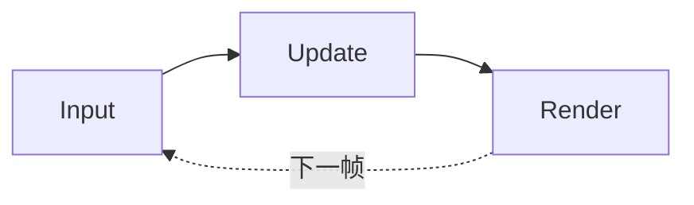
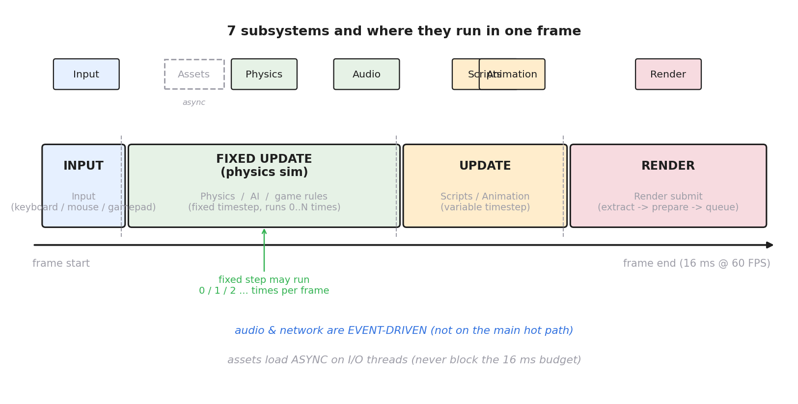
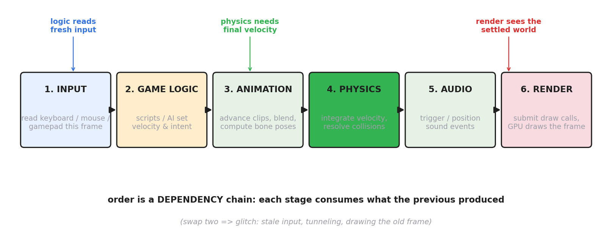
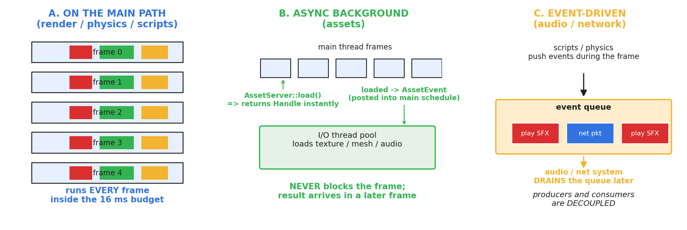
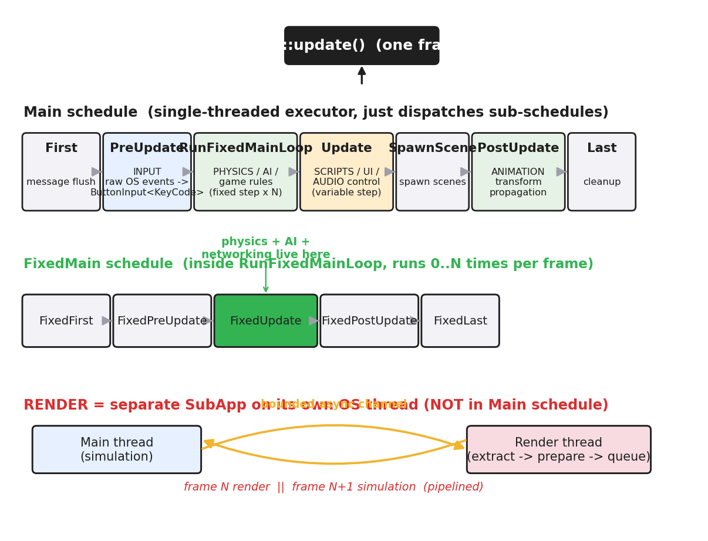

# 第 1 篇 · 第 3 章 · 引擎的子系统全景

> **核心问题**:上一章我们把主循环拆成了三段式 `input → update → render`,看着挺清爽。可问题是,那个 `update` 不是铁板一块——游戏里的角色按什么键走、撞墙怎么弹、脚步动画怎么放、脚步声什么时候响、这一帧要不要画出阴影,全是不同的人在不同地方干的不同活。一个真实引擎远不止"更新对象"四个字,它至少是**七个子系统**在协作:输入(input)、游戏逻辑与脚本(scripts)、动画(animation)、物理(physics)、资源(assets)、音频(audio)、网络(network),还有那个总揽一切的渲染(render)。它们各自干什么?谁先谁后?为什么是这个顺序?——本章要建立的就是这张全景图:**引擎里有哪些子系统,以及它们怎么在一个 16 毫秒的帧里被编排协作**。

> **读完本章你会明白**:
> 1. 一个真实游戏引擎由哪些子系统构成(输入 / 脚本 / 动画 / 物理 / 资源 / 音频 / 网络 / 渲染),各自负责什么。
> 2. 子系统之间有一条**依赖顺序**:`输入 → 游戏逻辑 / 脚本 → 动画 → 物理 → 音频 → 渲染`,以及为什么是这个顺序(物理要在逻辑定好速度后结算,渲染要在一切更新后画)。
> 3. 子系统有**三种驱动模式**:主路径(每帧跑)、异步后台(资源加载不阻塞 16ms)、事件驱动(音频 / 网络靠队列解耦)。
> 4. 真实引擎(Bevy)怎么用 `Schedule` / `SystemSet` 把这些子系统**编排**进主循环——这是"驱动"这一面的核心技巧。

> **如果一读觉得太难**:先只记三件事——① 引擎是七八个子系统在主循环里协作,不是铁板一块;② 它们有固定的先后顺序(输入在前,渲染在后),顺序错了就是 bug;③ 资源是异步的、音频网络是事件驱动的,都不在主循环的热路径上。渲染和物理两个最重的子系统,本书一句话带过指路,本章篇幅全留给"引擎怎么把它们编排到一起"。

---

## 〇、一句话点破

> **引擎不是一个 `update()` 函数,而是一队分工明确的子系统,按一条依赖链在一帧里依次登场:输入先采,逻辑次定意图,物理再结算世界,音频网络插空排队,渲染压轴画一帧。编排它们的不是哪个神级 `update`,而是一张"调度表(Schedule)"——它声明每个子系统在哪一段跑、谁先谁后、哪些可以并行。**

这是结论。本章倒过来拆,先逐个认清这队子系统,再看它们怎么被编排,最后用真实引擎(Bevy)的源码佐证。**渲染和物理那两个最重的子系统,我们只用一句话交代它们的"职责边界",细节一律指路承接书**——本章的篇幅,全留给"引擎怎么编排"这件游戏引擎独有的事。

---

## 一、从三段式到七个子系统:update 不是铁板一块

### 上一章留下的悬念

上一章(P1-02)我们把主循环拆成了三段式:



这个三段式对建立直觉足够了,可一旦你想在 `update` 里真的写点什么,就发现它是个**筐**——什么都往里塞。一个角色这一帧要做的事,至少包括:

- 读键盘,知道玩家这一帧按了"前";
- 脚本/AI 据此决定"我要往前走",定下速度;
- 动画系统据此把腿从"站立"切到"迈步",算出当前姿态;
- 物理系统据此把角色按速度推进一格、和墙做碰撞;
- 音频系统据此在脚落地的瞬间播一个脚步声;
- 网络系统(联机游戏)把这个位移打包发给服务器;
- 渲染系统最后把这一切画出来。

这七件事,涉及的子系统、读写的内存、调用的库全不一样。要是真写成一个巨大的 `update()`,就成了"上帝函数",改一个地方牵动全身。

> **不这样会怎样**:把所有更新逻辑塞进一个 `update()`,代码会迅速膨胀成几千行的怪物。更要命的是顺序失控——你不知道这一帧里是先算了物理再放动画,还是先放了动画再算物理,二者结果不一样(动画放早了,角色这一帧的姿态是上一帧的速度推出来的;物理算早了,角色还没决定要走,这帧就没动)。**子系统协作的第一难题,就是定死它们的先后。**

### 把 update 拆开:七个(加渲染八个)子系统

所以真实引擎都把 `update` 进一步拆成若干**子系统(subsystem)**。本书后续会反复提到这队子系统,先把它们的"职责卡片"摆出来:

| 子系统 | 职责一句话 | 读什么 | 写什么 | 谁喂给它 |
|---|---|---|---|---|
| **输入 Input** | 把键鼠 / 手柄这一帧的状态读进引擎 | OS 事件队列 | `ButtonInput<KeyCode>` 等资源 | 操作系统 |
| **游戏逻辑 / 脚本 Scripts** | AI 决策、玩法规则、决定"要做什么" | 输入、世界状态 | 速度、意图、状态机 | 输入子系统 |
| **动画 Animation** | 推进动画片段、混合、算出骨骼姿态 | 当前姿态、动画片段、速度 | 骨骼局部变换 | 脚本(定的意图) |
| **物理 Physics** | 按速度积分位置、解算碰撞、约束 | 速度、碰撞体、力 | 位置、接触点 | 脚本 / 动画(定的速度) |
| **音频 Audio** | 触发声音、空间化、混音 | 事件队列、听者位置 | 音频后端缓冲 | 脚本 / 物理(碰撞声) |
| **网络 Network** | 收发 packet、状态同步、插值 | socket、世界状态 | 远端实体状态、发送缓冲 | 脚本 / 物理 |
| **资源 Assets** | 异步加载贴图 / 模型 / 音频,管理生命周期 | 磁盘 | `Assets<T>` 集合、Handle | 谁需要谁请求 |
| **渲染 Render** | 把更新后的世界提交给 GPU 画一帧 | 位置、网格、材质、相机 | 帧缓冲 / 屏幕 | 所有上述子系统 |

> **钉死这件事**:引擎的 `update` 不是一个函数,是**七个子系统在协作**。每个子系统有清晰的职责边界(读什么 / 写什么 / 谁喂给它),这个边界就是它们能被独立编排、甚至并行的基础。第 2 篇讲的 ECS,本质就是让这些子系统(在 ECS 里叫 System)各自只碰自己关心的 Component,互不干扰——但那是后话,本章先看清"有哪些子系统、它们怎么排进一帧"。

这张全景图,就是本章第一张配图想表达的:



---

## 二、七个子系统逐个认清(职责 + 边界)

这一节我们逐个过一遍这七(加渲染八)个子系统,**只讲它干什么、读写什么、和谁打交道,不讲它内部怎么实现**(那是后续章节或承接书的事)。读者读完这一节,该能在脑子里给每个子系统画一张"职责卡片"。

### 2.1 输入子系统:把外部事件翻译成引擎能读的状态

输入子系统是**一帧里最早**干活的。它干的活很纯粹:把操作系统这一帧产生的原始事件(键盘按下、鼠标移动、手柄摇杆位置、触摸点)收集起来,翻译成引擎其他子系统能方便读的统一状态。

为什么单独拎出来,不直接让脚本去读 OS 事件?两个原因:

- **抽象掉平台差异**:Windows 的键码、macOS 的键码、手柄的厂商协议、触摸屏的坐标,全不一样。输入子系统把这些**归一化**成一套统一的 `ButtonInput<KeyCode>`、`Axis<GamepadAxis>` 资源,脚本只读这套统一抽象,不用关心跑在哪个平台。
- **统一采集时机**:如果让每个脚本自己各读各的 OS 事件,可能这一个脚本读到"按下了",下一个脚本(同一帧稍晚跑)读到"松开了"——同一帧里输入状态不一致。输入子系统在帧的**最开头**统一采集一次,之后整帧大家读到的是同一份快照。

> **钉死这件事**:输入子系统 = "把这一帧的外部事件,在帧开头一次性翻译成统一状态,供全帧读取"。它不决定"按了键要干什么"(那是脚本的活),只负责"这一帧到底按了什么"。这个"采集在帧头、消费在帧中"的切分,是子系统协作的第一个范本。

> **承接书讲过**:输入的事件驱动 / 轮询取舍、事件总线,本书 P5-19 专章讲;本章只把它当"七个子系统之一"认清职责。

### 2.2 游戏逻辑 / 脚本子系统:决定"要做什么"

输入只告诉你"玩家按了前",可"按了前之后角色要加速到多少、要不要闪避、AI 这个敌人要不要追击"——这些**意图和决策**,全归游戏逻辑 / 脚本子系统。

这是引擎里**最像"游戏"**的那一块:玩法规则、AI、状态机、技能系统、任务逻辑,都住在这里。它的产出是**意图**:角色这一帧想以多大速度往哪走、技能想触发什么效果。注意它**不亲自移动角色**(那是物理的活),只定下"我想怎么动"。

为什么这一层通常用**脚本语言**(Lua、C#、Python)而不是 C++ 写?

- **热重载**:改一句"跳跃高度从 3 改到 5",不用重新编译整个 C++ 引擎(几分钟),改脚本秒级生效,策划迭代飞快。
- **给非程序员用**:策划、关卡设计师不会写 C++,但会写 Lua / Blueprint。
- **沙箱**:脚本跑在 VM 里,崩了不会拖垮整个引擎。

> **承接书讲过**:把 Lua VM 嵌进引擎、C++ 对象绑定到 Lua,本书 P4-14 专章讲(承《Lua 虚拟机》);Unity 的 C# 凭什么跨平台(IL2CPP),P4-15 讲(承《JVM》)。本章只把脚本当"定意图的子系统"认清职责。

### 2.3 动画子系统:把"意图"变成"姿态"

脚本说"角色在跑",可"跑"在画面上意味着什么?意味着腿在交替迈、手臂在摆、躯干有轻微上下起伏——这一整套**骨骼姿态随时间变化**的活,归动画子系统。

动画子系统的输入是"当前在播哪个动画片段、播到第几帧、要不要和别的片段混合(比如跑着拔枪)",输出是**每一根骨骼这一帧的局部变换**。这些变换喂给渲染子系统去蒙皮(skining)画出来。

动画排在脚本之后、物理之前,是有讲究的:

- **在脚本之后**:动画要根据脚本定的意图(在跑还是在站)来切片段,所以得脚本先定完意图。
- **在物理之前**:有些游戏用动画的根运动(root motion)驱动角色位移——角色的实际移动是从动画脚步推出来的,这时候物理要读动画算出来的速度。即使不用根运动,动画算出的姿态也得在物理结算前准备好,以便物理用的碰撞体(比如蹲下时变矮)是对的。

> **钉死这件事**:动画子系统 = "把抽象的意图(在跑),翻译成具体的姿态(每根骨头在哪)"。它的位置在脚本(定意图)之后、物理(用姿态结算)之前,是承上启下的中间层。

### 2.4 物理子系统:结算世界的最终位置

输入告诉了意图,脚本定了速度,动画备好了姿态——可角色这一帧到底**移动到了哪、有没有穿墙、撞到敌人没有**,这些**世界的最终物理状态**,归物理子系统结算。

物理子系统干的事:按速度对位置做数值积分(位置 += 速度 × 时间)、检测碰撞体之间有没有重叠、有重叠就按物理规律(弹性、摩擦、约束)解算接触力、更新最终位置。它是引擎里**计算最重**的子系统之一(渲染之外最重),也是为什么本书把它单独列一章一句带过指路。

> **★承接《物理引擎》**:物理引擎内部那一整套——刚体动力学、碰撞检测的宽相 / 窄相、接触约束求解器、时间步进、连续碰撞检测(CCD)——是本子线第三本《物理引擎深入浅出》的整本书主题。本书讲到物理,一律**一句带过 + 指路 [[physics-engine-source-facts]]**,篇幅留"物理怎么作为一个子系统排进主循环"。

物理有一个**全引擎最特殊的约束:固定步长(fixed timestep)**。物理的数值积分只在固定时间步长(比如 1/60 秒)下才稳定、可复现,所以物理子系统不是每帧跑一次,而是按累积器(accumulator)在一帧里跑零到多次。这件事极其重要,但它属于"主循环怎么跑"的细节,本书 P3-10 专章拆透;本章只需记住:**物理子系统在主循环里有自己独立的"固定步长"小循环**,和其他子系统(每帧跑一次)节奏不一样。

> **钉死这件事**:物理子系统 = "拿到脚本 / 动画定的速度后,做数值积分和碰撞解算,写出世界的最终位置"。它用**固定步长**(保证数值稳定),节奏和"每帧一次"的其他子系统不同——这是子系统协作里最微妙的一点,P3-10 展开。

### 2.5 资源子系统:异步加载大块头,绝不阻塞 16ms

前面四个子系统都是"每帧算点什么",资源子系统不一样——它管的是那些**不能在一帧里算完的大块头**:几十 MB 的贴图、上万千瓦的模型、几分钟的音频。这些东西从磁盘加载、解码、上传 GPU,动辄几十上百毫秒,**绝不能让它们阻塞主循环的 16ms 预算**,否则画面就卡。

所以资源子系统的核心设计是**异步**:你在脚本里说"给我加载 `hero.png`",资源服务器(`AssetServer`)立刻返回一个轻量的**句柄(Handle)**,然后在后台 I/O 线程上慢慢加载。主循环该怎么跑还怎么跑,若干帧之后加载完了,用一个**事件(AssetEvent)**通知"你之前要的那个贴图好了"。如果还没好你就用,句柄指向的就是空,渲染子系统会跳过这个对象(或显示占位符)。

> **钉死这件事**:资源子系统 = "把大资产加载变成异步后台任务,用 Handle 立即返回、用 AssetEvent 事后通知"。它是**三种驱动模式里的"异步后台"**——不在主循环热路径上,这是它和输入 / 脚本 / 物理 / 渲染的根本区别。本书 P4-13 专章拆它的加载队列、引用计数、生命周期。

### 2.6 音频子系统:事件驱动,靠队列解耦

音频子系统和前面几个都不一样。它**不主动遍历世界**算什么,而是**被动地等事件**:脚本说"这里要播一个脚步声"、物理说"这两个物体撞了要播撞击声"——这些请求被丢进一个**音频事件队列**,音频子系统稍后(通常在一帧快收尾时)把队列"抽干(drain)",触发实际播放。

为什么用队列,不让脚本直接调"播放音效"?

- **解耦生产者和消费者**:脚本不该知道音频后端怎么工作(OpenAL / WASAPI / DirectSound),它只管"我要个声音",音频子系统负责"怎么播"。
- **避免一帧里重复触发**:同一帧里十个脚本都喊"播脚步声",队列可以合并 / 限频,不然十个声音叠一起炸耳朵。
- **时序可控**:音频在一帧里只结算一次,而不是散落在各脚本里随时触发,便于调度。

音频子系统还负责**空间化(spatialization)**:根据听者(通常是相机)的位置和声源位置,算出声音该从左耳还是右耳出、要多大音量(距离衰减)。这件事它要读相机和声源的位置——所以它必须排在**物理结算完之后**(位置都定好了)才能算准。

> **钉死这件事**:音频子系统 = "事件驱动,从队列消费播放请求,读最终位置做空间化"。它是**三种驱动模式里的"事件驱动"**——和资源子系统一样不在主循环热路径上,靠队列和脚本 / 物理解耦。

### 2.7 网络子系统:也是事件驱动,但更苛刻

联机游戏还有网络子系统。它和音频一样是**事件驱动**(收 packet 是事件、发包是事件),但比音频苛刻得多:

- **必须确定性**:联机游戏里,同样的输入要在所有机器上算出同样的结果(否则你看到敌人在 A,队友看到他在 B)。这要求物理和逻辑严格确定,不能有浮点漂移、不能有随机数泄漏。
- **状态同步 / 帧同步**:网络子系统要么定期把世界状态打包发出去(状态同步),要么把输入广播给所有人各算各的(帧同步)——这是分布式系统在游戏里的化身。
- **插值 / 外推**:远端玩家的位置由于网络延迟,总是"过期"的,网络子系统要做插值平滑,不然画面里远端玩家一卡一卡。

网络子系统通常和物理一样跑在**固定步长**上(保证确定性),本书不深入(它在本书目录里没有专章,属于"诚实标注未深入"的部分),但读者要知道:**它是第八个、也是最苛刻的事件驱动子系统**。

> **钉死这件事**:网络子系统 = "事件驱动 + 固定步长 + 严格确定,本质是分布式系统在游戏里的落地"。本书篇幅有限不专讲,但读者已读过《etcd》《TiKV》那些分布式书,对照着看会发现同源(Raft 一致性 ↔ 帧同步的确定性约束)。

### 2.8 渲染子系统:压轴画一帧,但细节指路

最后是渲染。它是引擎里最重、最复杂、也最容易"喧宾夺主"的子系统。本书是图形学 / 游戏引擎子线的第二本,渲染那本(《图形渲染管线》)已经把它从顶点变换到光栅化到着色到输出合并讲了个透,所以本书讲到渲染,**一律一句带过 + 指路**。

渲染子系统在引擎里干的活,一句话:**把所有"要画的东西"的网格、材质、变换、灯光、相机,每帧提交给 GPU,让 GPU 按渲染管线画一帧**。它必须排在所有更新之后(因为要画的是"更新后的世界"),是依赖链的最后一环。

> **★承接《图形渲染管线》**:渲染管线本身(顶点着色 / 光栅化 / 深度测试 / 像素着色 / 输出合并)是那本书的整本书主题,本书 P5-18 只讲"引擎怎么每帧把 ECS 场景数据提交给管线(draw call、批处理、剔除)",管线细节一句带过指路 [[graphics-series-project]]。

---

## 三、子系统之间的依赖顺序:为什么是这条链

认清了每个子系统,现在回答本章第二个核心问题:**它们在一帧里谁先谁后?为什么?**

把八个子系统按"谁喂给它"排,自然得到一条依赖链:



```
输入 → 游戏逻辑/脚本 → 动画 → 物理 → 音频 → 渲染
```

这条顺序不是随便定的,它是一条**数据依赖链**——每一段都消费上一段的产出。我们把链上每一环的"为什么必须在它前面"逐个说清:

### 3.1 为什么输入在最前

输入是整条链的**源头**。它把外部事件翻译成引擎状态后,脚本才能读"玩家按了什么"来定意图。如果输入排在脚本之后,脚本读到的就是**上一帧**的输入——按一下跳跃键,角色要下一帧才跳,体感迟滞。虽然一帧只有 16ms,但玩家对这种延迟极其敏感(尤其格斗、射击游戏),所以输入必须在本帧逻辑之前采好。

### 3.2 为什么脚本在物理之前

脚本定的是**意图**(我要以多大速度往哪走),物理结算的是**结果**(按这个速度推一格后到了哪、撞没撞墙)。物理要读脚本写出的速度才能积分,所以脚本必须在物理之前。如果反过来——先物理后脚本——角色这一帧移动用的是**上一帧脚本定的速度**,这一帧你按了"急停",角色要下一帧才停下来,又是延迟。

### 3.3 为什么动画在脚本之后、物理之前

动画根据脚本定的意图切片段(跑还是站),所以要排在脚本之后。它排在物理之前有两种情况:

- **不用根运动**:动画只决定姿态(骨头怎么摆),不决定位移。这时候物理用脚本定的速度积分,动画的产出(姿态)喂给渲染。动画排在物理之前,是为了让物理用的碰撞体(蹲下时变矮)和姿态一致。
- **用根运动**:角色的实际位移是从动画脚步推出来的。这时候物理要读动画算出的速度,所以动画必须在物理之前。

无论哪种,动画都在物理之前。

### 3.4 为什么物理在脚本 / 动画之后、音频 / 渲染之前

物理是**结算世界最终状态**的环节。它一旦算完,所有对象的位置、碰撞、接触都定死了。之后:

- **音频**要读最终位置做空间化(声音从哪边来),所以音频在物理之后。
- **渲染**要画最终状态,所以渲染在物理之后。
- **网络**(联机)要把最终状态打包发出去,也在物理之后。

如果物理排在音频 / 渲染之后,你会画出 / 播出**上一帧的位置**——画面里角色"飘",声音方向不对。

### 3.5 为什么渲染压轴

渲染画的是"更新完的世界"。任何一个子系统在渲染之前没算完,渲染画的就是过期的状态。所以渲染必须排在所有更新之后,是依赖链的最后一环。

> **钉死这件事**:这条链 `输入 → 脚本 → 动画 → 物理 → 音频 → 渲染` 不是惯例,是**数据依赖**——每段消费上段的产出。调换任意两段都会产生延迟或错配(读到过期数据)。这是子系统协作的第一原理,任何引擎的调度表都围绕它设计。

### 一个常见的疑问:那资源子系统排哪?

读者可能注意到,资源子系统不在上面这条链里——它**不在主路径上**。它是异步的,你这一帧请求加载,可能十几帧后才回来。它不消费这条链上任何一段的产出,也不被链上任何一段同步等待。脚本只拿一个句柄(Handle),用的时候看看"好了没",没好就跳过。所以资源子系统游离在这条链之外,是**三种驱动模式里独立的一种**——下一节专门讲这件事。

---

## 四、三种驱动模式:不是所有子系统都"每帧跑一次"

到目前为止,我们好像默认"每个子系统每帧都跑一次"。其实不是。引擎里的子系统按**怎么被驱动**分三类,这是本章最该带走的一个分类:



### 4.1 模式 A:在主路径上(每帧跑)

这是最直觉的一类。输入、脚本、动画、物理、渲染——这些子系统**每帧都跑一次**(物理还可能跑多次),它们占着 16ms 预算的大头。它们的特征是:

- **每帧都必须算**(不算世界就不前进)。
- **有严格的先后顺序**(就是上面那条依赖链)。
- **是性能优化的重点**(本书第 2 篇 ECS、第 5 篇 job 系统,主要就是优化这些)。

### 4.2 模式 B:异步后台(不阻塞主路径)

资源子系统是这一类。它的特征:

- **不能在一帧内算完**(加载一个大贴图要几十毫秒)。
- **绝不能阻塞主路径**(阻塞了画面就卡)。
- **用"请求-句柄-事件"模式**:请求时立即返回句柄,完成后发事件通知。

> **不这样会怎样**:如果资源同步加载(请求时阻塞到加载完),那一帧就不止 16ms 了,可能 100ms,画面直接卡顿。早期引擎(和现在某些简易框架)就是这么干的,加载关卡时整个画面冻住。现代引擎一律异步,P4-13 展开。

### 4.3 模式 C:事件驱动(靠队列解耦)

音频、网络是这一类。它们的特征:

- **不主动遍历世界**(不像脚本 / 物理那样扫所有实体)。
- **被动等事件**(音频等"播声音"请求,网络等 packet)。
- **生产者 / 消费者解耦**:脚本 / 物理这些"生产者"往队列里塞事件,音频 / 网络这些"消费者"稍后把队列抽干。

为什么这么设计?因为音频 / 网络的**触发频率和主循环不同步**。一帧里可能触发十几个脚步声,也可能一个都没有;网络 packet 可能一帧来仨,也可能几帧不来。如果让它们和主路径同步(每帧强制跑一遍),既浪费(没事件也得扫),又难调度(时序乱)。用队列解耦,生产者随时塞,消费者择机抽,干净。

> **钉死这件事**:引擎子系统的"怎么被驱动"分三类——**主路径(每帧跑)、异步后台(请求-句柄-事件)、事件驱动(队列解耦)**。这个分类比"有哪些子系统"更重要,因为它决定了子系统在主循环里怎么被编排。资源为什么不在依赖链上?因为它是异步的。音频 / 网络为什么排在物理之后却不像物理那样占预算?因为它们是事件驱动的,只抽队列。

---

## 五、真实引擎怎么编排:Bevy 的 Schedule 与 SystemSet

讲完了原理,现在用真实引擎佐证。我们看 **Bevy**(bevyengine/bevy,Rust 数据导向 ECS 引擎)是怎么把这七八个子系统排进主循环的——这是本章最硬的"技巧佐证"。

### 5.1 Bevy 的主循环:App::update 一帧跑一次

Bevy 的主循环入口是 `App::update()`,一帧调一次。最朴素的运行器(`ScheduleRunnerPlugin`)就是一个死循环:

```rust
// crates/bevy_app/src/schedule_runner.rs (简化, 非源码原文)
loop {
    let start = Instant::now();
    app.update();          // 跑一帧
    if let Some(exit) = app.should_exit() { return exit; }
    // 如果跑得快, 睡到下一帧; 跑得慢, 立刻进下一帧
}
```

真实带窗口的引擎不用这个朴素运行器,改用窗口库(winit)的事件循环来驱动 `app.update()`(因为窗口事件必须由 OS 主线程泵),但**一帧调一次 `app.update()` 这件事不变**。

> **钉死这件事**:无论朴素运行器还是 winit 事件循环,Bevy 的主循环本质都是"一帧调一次 `app.update()`"——这就是上一章讲的 `while(true){ update(); render(); }` 里那个 `update` 的真实落点。

### 5.2 Bevy 的 Main schedule:一张"调度表"编排所有子系统

`App::update()` 这一帧里到底跑什么?答案是:**跑一张叫 `Main` 的调度表(Schedule)**。这张表声明了"这一帧按顺序跑哪些子调度(sub-schedule)",每个子调度里再装具体的 system。

Bevy 的 `Main` 调度默认顺序,在源码里清清楚楚写着([crates/bevy_app/src/main_schedule.rs](https://github.com/bevyengine/bevy/blob/master/crates/bevy_app/src/main_schedule.rs) 的 `MainScheduleOrder::default()`):

```rust
// crates/bevy_app/src/main_schedule.rs (MainScheduleOrder::default, 简化)
impl Default for MainScheduleOrder {
    fn default() -> Self {
        Self {
            labels: vec![
                First.intern(),
                PreUpdate.intern(),
                RunFixedMainLoop.intern(),
                Update.intern(),
                SpawnScene.intern(),
                PostUpdate.intern(),
                Last.intern(),
            ],
            ...
        }
    }
}
```

这七个 sub-schedule,就是 Bevy 给一帧划分的"时段"。每个时段装哪类子系统,源码注释和命名讲得明明白白:

| sub-schedule | 装的子系统(源码注释原文印证) |
|---|---|
| **First** | 帧开头跑的杂务(message flush) |
| **PreUpdate** | **输入**:源码注释明说"reads raw keyboard input OS events into a `Messages` resource ... enables systems in `Update` to consume the messages"——输入在 PreUpdate 采集,供 Update 消费 |
| **RunFixedMainLoop** | **物理 / AI / 游戏规则**:跑 `FixedMain` 子调度零到多次(固定步长) |
| **Update** | **脚本 / UI / 音频控制**:源码注释明说"Examples of systems that should run once per render frame include UI, Input handling, Audio control" |
| **SpawnScene** | 场景实例化 |
| **PostUpdate** | **动画 / 变换传播**:源码注释明说"synchronizing local transforms in a hierarchy to global absolute transforms";`AnimationSystems` 这个 SystemSet 也定义在 PostUpdate 里 |
| **Last** | 帧末杂务 / 清理 |

把这张表和本章前面的依赖链 `输入 → 脚本 → 动画 → 物理 → 音频 → 渲染` 对照,会发现 Bevy 的编排和我们的原理推导**完全一致**:

- 输入在 `PreUpdate`(帧头),消费在 `Update`(帧中)——对应"输入最先采"。
- 物理 / AI / 游戏规则在 `RunFixedMainLoop`(固定步长)——对应"物理用固定步长,节奏独立"。
- 脚本 / UI / 音频控制 in `Update`(每帧一次)。
- 动画 in `PostUpdate`(`AnimationSystems` SystemSet),排在 `Update` 之后——对应"动画在脚本之后"。
- 渲染**不在这张表里**(单独的 SubApp,见 5.4)。

> **钉死这件事**:Bevy 用一张"调度表 + 若干 sub-schedule + SystemSet"把所有子系统编排进一帧。这张表的核心抽象是 **ScheduleLabel**(标记一段时段,如 `PreUpdate`/`Update`)和 **SystemSet**(标记一组同类 system,如 `AnimationSystems`/`InputSystems`),子系统靠"装进哪个 set / 哪个 schedule"来声明"我在哪段跑、我和谁同类"。这是"驱动"这一面的招牌技巧,第 5 篇讲 job 系统时还会再回到这套抽象。

### 5.3 FixedMain:物理的小循环,藏在 RunFixedMainLoop 里

上面提到 `RunFixedMainLoop` 里会跑 `FixedMain` 子调度零到多次。这个 `FixedMain` 内部又有一张自己的表:

```rust
// crates/bevy_app/src/main_schedule.rs (FixedMainScheduleOrder::default, 简化)
impl Default for FixedMainScheduleOrder {
    fn default() -> Self {
        Self {
            labels: vec![
                FixedFirst.intern(),
                FixedPreUpdate.intern(),
                FixedUpdate.intern(),
                FixedPostUpdate.intern(),
                FixedLast.intern(),
            ],
        }
    }
}
```

源码对 `FixedUpdate` 的注释,一字不差地印证了"物理 / AI / 网络 / 游戏规则住在这":

> "The schedule that contains most gameplay logic, which runs at a fixed rate rather than every render frame. Examples of systems that should run at a fixed rate include (but are not limited to): **Physics, AI, Networking, Game rules**."

而 `Update`(每帧一次的那个)的注释则印证了另一类:

> "Examples of systems that should run once per render frame include (but are not limited to): **UI, Input handling, Audio control**."

注意这个微妙切分:**物理 / AI / 网络在固定步长的 `FixedUpdate`,而 UI / 输入 / 音频控制在每帧的 `Update`**。这是 Bevy 把"固定步长子系统"和"每帧子系统"显式分开的设计——这件事的 why(物理为什么必须固定步长)和 how(accumulator 怎么在一帧里跑零到多次)是 P3-10 的重头戏,本章只点出"Bevy 源码就是这么分的"。

### 5.4 渲染是独立 SubApp,根本不在 Main schedule 里

读到这里读者可能发现一个惊人的事实:**上面那张 `Main` 调度表里,根本没有"渲染"这一段**。渲染去哪了?

答案是:**Bevy 的渲染是一个独立的 SubApp,跑在独立的 OS 线程上,不在 `Main` 调度里**。源码对 `Main` 调度的注释直接点破:

> "Note rendering is not executed in the main schedule by default. Instead, rendering is performed in a separate `SubApp` which exchanges data with the main app in between the main schedule runs."

这是 Bevy(和现代高性能引擎)的一个关键设计——**流水线渲染(pipelined rendering)**:

- 主线程跑 `Main` 调度(模拟世界),算出"要画什么";
- 把"要画什么"的数据**抽取(extract)**到一个独立的渲染世界(Render world);
- 通过**有界异步通道(bounded async channel)**把渲染世界发给**渲染线程**;
- 渲染线程在 GPU 上画,同时主线程已经进了下一帧的模拟。

效果是:**第 N 帧的渲染和第 N+1 帧的模拟并行跑**,CPU 和 GPU 都不闲着。这件事 P5-18 展开,本章只需记住:**渲染子系统因为太重,被单独拎到独立线程,用 channel 和主循环通信**——这是"子系统协作"的极致形态。



### 5.5 Unity 的对照:MonoBehaviour 生命周期

作为对照,看一眼 **Unity** 怎么编排子系统。Unity 不是 ECS 原生(虽然 2018 后加了 DOTS / ECS,但主流仍是 MonoBehaviour),它的子系统编排靠 **MonoBehaviour 的生命周期回调**:

- `Awake` / `Start`:对象创建 / 场景启动时调一次(对应 Bevy 的 `Startup`)。
- `FixedUpdate`:固定步长调(对应 Bevy 的 `FixedUpdate`)——物理在这里。
- `Update`:每帧调(对应 Bevy 的 `Update`)——游戏逻辑 / 脚本在这里。
- `LateUpdate`:每帧调,但在所有 `Update` 之后(对应 Bevy 的 `PostUpdate`)——相机跟随、动画后处理在这里。
- `OnGUI` / 渲染回调:画一帧。

这套用"命名回调 + 引擎保证调用顺序"的方式编排子系统,和 Bevy 的"调度表 + SystemSet"是两种范式:

- **Unity(命令式回调)**:你写 `void Update()` 引擎就调它,顺序靠"引擎规定的回调时序"保证。简单直观,但每个对象的回调散落各处,难以全局并行。
- **Bevy(声明式调度)**:你声明"我这个 system 装在 `Update` 这个 schedule 里",引擎按表统一调度,能自动并行化无冲突的 system。这是数据导向引擎的招牌,第 5 篇 job 系统展开。

两种编排无所谓"谁对谁错",但**现代引擎(Bevy / Unity DOTS / Unreal Mass)都在往声明式调度靠**,因为它天然支持并行——这是本书第 5 篇的主线。

---

## 六、技巧精解:Schedule——把"子系统协作"变成"查表"

本章最该带走的技巧,是 Bevy 用 **Schedule + SystemSet + ScheduleLabel** 这套抽象,把"子系统在一帧里怎么协作"从"硬编码的 `update()` 调用链"变成了"一张可查询、可重排、可并行化的调度表"。这一节拆透它。

### 6.1 朴素做法:硬编码的 update 调用链

如果不用调度表,最朴素的做法是在主循环里手写调用链:

```python
# 朴素做法: 主循环里硬编码子系统调用顺序
while True:
    input_system.update()
    script_system.update()
    animation_system.update()
    physics_system.update()
    audio_system.update()
    render_system.render()
```

看起来没问题。但它撞三面墙:

- **墙一:顺序写死,改不动**。想加一个新子系统(比如 `weather_system`),得改主循环源码,把它插到正确位置。引擎一编译就是几小时,策划 / mod 作者根本改不动。
- **墙二:没法并行**。这六个调用是串行的,即使 `animation` 和 `audio` 互不依赖(动画写骨骼姿态,音频读位置播声音,读写的数据不冲突),也没法让它们同时跑——因为主循环不知道它们依赖关系,只看到一行行调用。
- **墙三:插件没法扩展**。第三方插件(一个新物理引擎、一个新渲染后端)想"把我的 system 排在你的物理之前",硬编码方案下根本插不进来。

### 6.2 Bevy 的解法:声明式调度表

Bevy 把这件事变成"查表"。每个 system 不在主循环里被硬编码调用,而是**声明"我属于哪个 schedule、在哪个 set 里、在谁之前 / 之后"**,引擎收集所有声明,构建一张调度图,按拓扑序执行。

```rust
// 声明式: 告诉引擎 "我这个 system 装在 Update 这个时段"
app.add_systems(Update, move_player_system);

// 进一步用 SystemSet 分组 + 排序
app.add_systems(Update, (
    movement_system,
    combat_system,
).chain());  // chain 表示这俩要按顺序跑

// 跨 schedule 排序: 我的 system 必须在 AnimationSystems 之前
app.add_systems(Update, my_system.before(AnimationSystems));
```

引擎拿到所有这些声明,构建一张**依赖图**:节点是 system,边是"我必须在谁之前 / 之后"。然后对这张图做拓扑排序,找出哪些 system 互相不依赖(可以并行),哪些必须串行,最终生成一份执行计划。

### 6.3 这套设计的三个妙处

**妙处一:子系统协作变成"查表",顺序可重排**。想加新子系统,不用改主循环,只要 `app.add_systems(SomeSchedule, my_system)` 一行声明,引擎自动把它排进去。想改顺序,改声明就行(`.before(...)` / `.after(...)`),不动别人代码。这把"子系统协作"从"硬编码"变成了"配置",可维护性天差地别。

**妙处二:自动并行化**。引擎看每个 system 读写了哪些 Component / Resource,如果两个 system 读写的数据不冲突(一个读 Position,另一个写 Velocity),它们就能在不同线程同时跑。Bevy 的调度器在 `Main` 这层用单线程 executor(因为它只 dispatch sub-schedule),但每个 sub-schedule(如 `Update`)内部用多线程 executor,自动把无冲突的 system 摊到多核。这是第 5 篇 job 系统的伏笔。

**妙处三:插件可扩展**。第三方物理插件(bevy_xpbd)、渲染插件、AI 插件,都靠 `add_systems` + SystemSet 把自己排进主循环,不需要改 Bevy 主仓。这是 Bevy 生态能繁荣的架构基础。

> **钉死这件事**:Bevy 的 Schedule 抽象,把"子系统协作"从"主循环里的硬编码调用链"变成"一张可声明、可查询、可并行化的调度表"。这是"驱动"这一面的招牌技巧——它让加子系统、改顺序、并行化都变成"改声明"而不是"改主循环"。Unity DOTS、Unreal Mass 都在往这个方向走,本质都是"用调度表编排 subsystem"。

### 6.4 反面对比:硬编码调用链为什么扛不住

> **不这样会怎样**:如果坚持硬编码 `input(); script(); physics(); render();`,真实引擎会撞死在三面墙上——① 加新子系统要改主循环源码(引擎重编译,迭代慢);② 没法并行(即使子系统互不依赖也只能串行,浪费多核);③ 第三方插件没法扩展(插不进主循环)。这三面墙,正是现代引擎从"硬编码 update"迁移到"声明式 Schedule"的根本动力。Bevy 的 Schedule 不是花架子,是解决了"子系统怎么协作才灵活、才快"这个真问题的答案。

---

## 七、承接:本章在你已读 / 将读系列里的坐标

本章是"驱动"这一面的全景章,它和系列其他书的关系:

- **★承《图形渲染管线》**:渲染子系统 = 那本书的整条管线,本章一句带过职责边界,管线细节一律指路。本书 P5-18 讲"引擎怎么每帧提交场景给管线"。
- **★承《物理引擎》**:物理子系统内部(刚体、碰撞、求解器、CCD)是本子线第三本《物理引擎》的整本书主题,本章一句带过,只讲"物理怎么作为一个子系统排进主循环"。物理的固定步长 why 和 accumulator how,本书 P3-10 展开。
- **承《内存分配器》**:本章没直接用,但第 2 篇讲 ECS 的 SoA / 缓存行时强承——这些 system 之所以能高速遍历,根在数据布局。
- **承《etcd》《TiKV》**:网络子系统的"确定性 / 状态同步"和分布式共识同源,本章点出对照,不展开。
- **承《Lua 虚拟机》《JVM》**:脚本子系统(Lua / C#)内部,本书 P4-14 / P4-15 专章。

---

## 八、章末小结

### 回扣主线

本章服务"驱动"这一面。我们从上一章的主循环三段式出发,发现 `update` 不是铁板一块,而是**七八个子系统在协作**:输入(采事件)、脚本(定意图)、动画(算姿态)、物理(结算世界)、资源(异步加载)、音频 / 网络(事件驱动)、渲染(画一帧)。它们按一条数据依赖链 `输入 → 脚本 → 动画 → 物理 → 音频 → 渲染` 依次登场,顺序错了就是延迟或错配。按"怎么被驱动"分三类:**主路径(每帧跑)、异步后台(资源)、事件驱动(音频 / 网络)**。最后用 Bevy 的 Schedule 源码佐证——真实引擎用一张"调度表 + SystemSet + ScheduleLabel"把所有子系统编排进一帧,这套抽象让加子系统、改顺序、并行化都变成"改声明"。渲染和物理两个最重的子系统,本章一句带过指路,篇幅全留给了"引擎怎么编排"这件游戏引擎独有的事。

### 五个为什么

1. **引擎的 update 为什么不是一个函数?**——因为它是一队子系统(输入 / 脚本 / 动画 / 物理 / 资源 / 音频 / 网络 / 渲染)在协作,每个有清晰职责边界(读什么 / 写什么 / 谁喂给它),塞进一个函数就成了上帝函数。
2. **子系统之间为什么是 `输入 → 脚本 → 动画 → 物理 → 音频 → 渲染` 这条链?**——是数据依赖链,每段消费上段的产出(脚本读输入定意图,物理读脚本定的速度积分,渲染画物理结算后的世界)。调换任意两段都会读到期数据或错配。
3. **资源子系统为什么不在依赖链上?**——它是**异步后台**模式,请求时立即返回句柄、完成后发事件,绝不在 16ms 预算里同步等。它和主路径解耦,游离在依赖链之外。
4. **音频 / 网络为什么是事件驱动,不在主路径?**——它们的触发频率和主循环不同步(一帧可能没事件也可能一堆),用队列解耦生产者 / 消费者,既不浪费(没事件不扫)又时序可控(择机抽队列)。
5. **Bevy 的 Schedule 抽象妙在哪?**——它把"子系统协作"从"主循环硬编码调用链"变成"可声明、可查询、可并行化的调度表",加子系统 / 改顺序 / 并行化都变"改声明",还让第三方插件能扩展。这是"驱动"这一面的招牌技巧。

### 想继续深入往哪钻

- 想搞懂物理为什么必须固定步长、accumulator 怎么跑零到多次:第 3 篇 P3-10。
- 想搞懂资源异步加载的句柄 / 引用计数 / 生命周期:第 4 篇 P4-13。
- 想搞懂脚本(Lua / C#)怎么嵌进引擎:第 4 篇 P4-14、P4-15。
- 想搞懂 job 系统(子系统怎么并行):第 5 篇 P5-17。
- 想搞懂渲染提交(draw call / 批处理 / 剔除):第 5 篇 P5-18。
- 想看 Bevy 调度表源码:[crates/bevy_app/src/main_schedule.rs](https://github.com/bevyengine/bevy/blob/master/crates/bevy_app/src/main_schedule.rs)。

### 引出下一章

我们搞清了引擎有哪些子系统、它们怎么在一帧里被编排协作。但本章自始至终有个悬而未决的问题:这些子系统要遍历的**海量对象**(几千上万个角色 / 敌人 / 子弹),在程序里到底怎么组织?上一章(P0-01)已经预告了面向对象组织游戏对象会撞墙,下一章我们正式拆这面墙——用"会飞的会游泳的会施法的敌人"这种经典例子,讲清面向对象继承组织游戏对象到底撞什么墙(深继承、钻石继承、数据散落缓存差),为第 2 篇 ECS 的登场铺好最后的路。

> **下一章**:[P1-04 · 组织游戏对象的困境:面向对象为什么崩溃](P1-04-组织游戏对象的困境-面向对象为什么崩溃.md)
