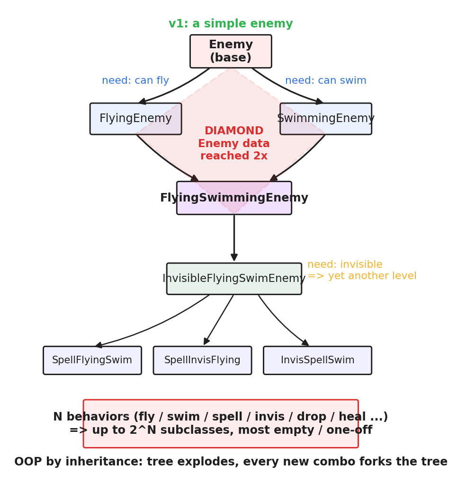
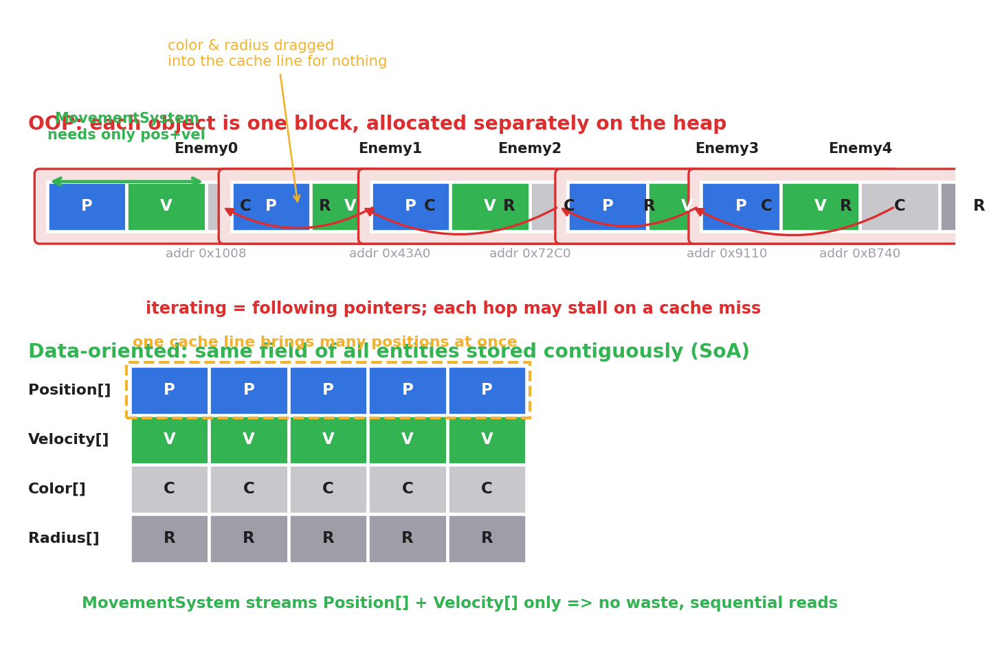
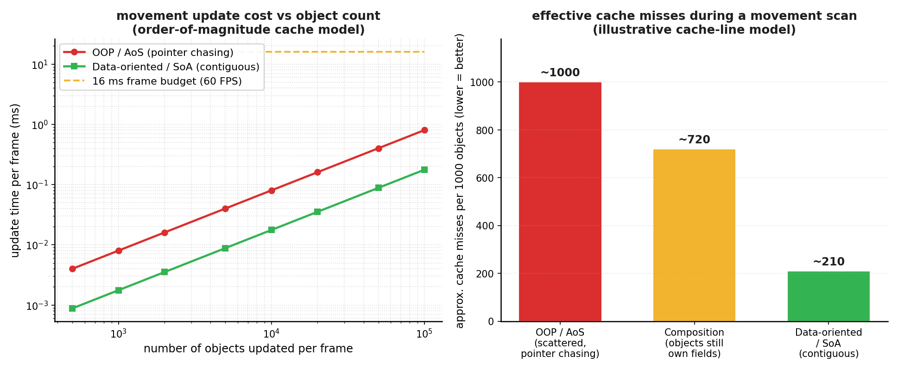

# 第 1 篇 · 第 4 章 · 组织游戏对象的困境:面向对象为什么崩溃

> **核心问题**:上一章我们把引擎拆成了一堆子系统(渲染、物理、脚本、资源、输入、音频、网络),看到它们都在主循环里围绕"对象"转——渲染要画对象、物理要推对象、脚本要改对象。可这些"对象"在程序里到底怎么组织?最直觉的答案是面向对象:敌人继承自 `Enemy`,飞行敌人继承自 `FlyingEnemy`……可一旦真这么干,你会发现继承树越长越歪,直至崩溃。本章要彻底拆透这件事:**面向对象组织游戏对象,到底在哪两面墙上撞碎**,以及为什么这堵墙不是"写法不够好",而是面向对象在这个场景下的**结构性错配**。这是引出第 2 篇 ECS 招牌的关键铺垫——搞不懂面向对象撞的是什么墙,就搞不懂 ECS 凭什么存在。
>
> **读完本章你会明白**:
> 1. **深继承怎么产生**:从一个简单 `Enemy` 出发,策划每加一个需求(会飞、会游泳、会施法、会隐身、会掉落……),继承树就被迫加深一层,直至组合爆炸。
> 2. **钻石继承的痛**:`FlyingSwimmingEnemy` 同时继承 `FlyingEnemy` 和 `SwimmingEnemy`(都继承 `Enemy`),`Enemy` 的数据被继承两次,为什么 C++ 非要"虚继承"才不混乱,以及虚继承自己又带来了什么代价。
> 3. **"组合优于继承"的中间方案**:把 Fly/Swim/Cast 做成可挂载的组件,它缓解了继承墙,但有它自己的局限——组件还是绑在对象里,数据还是散落。
> 4. **最致命的性能墙**:面向对象把所有字段绑在一个对象里、对象 `new` 在堆上散落;可每帧遍历是按"字段"的(update 只要位置速度)。**组织方式和访问方式错配**,几百个对象无所谓,几万个对象每帧遍历就是指针追逐、缓存全 miss,16ms 根本不够。
>
> **如果一读觉得太难**:先只记住三件事——① 继承组织游戏对象,加一个行为就要改继承树,组合一多就爆炸;② "组合优于继承"缓解了继承墙,但没解决数据散落;③ 真正的杀手是**数据散落导致的缓存灾难**(承《内存分配器》),这是 ECS 取代面向对象的根本动力。

---

## 〇、一句话点破

> **面向对象组织游戏对象,撞的不是一面墙,是两面:继承墙(组织不灵活,加行为就要改树)+ 性能墙(数据按对象组织、却按字段遍历,缓存全 miss)。第一面墙,"组合优于继承"还能勉强糊;第二面墙是结构性的,只要你还按"对象"组织数据,就绕不过去。**

这是结论。本章倒过来拆,而且**全程跟着一个虚构项目"暗夜要塞"的开发过程**——你是一个引擎程序员,策划每两周提一个新需求(会飞的敌人、会游泳的敌人、会飞会游泳会施法还会隐身的 BOSS……),你看面向对象怎么一步步被逼到墙角。

> **承接说明**:P0-01 第三节已经概览过"面向对象撞墙"(深继承、数据散落缓存差)的结论。本章不重复那个概览,而是**把那两面墙彻底拆开**:深继承是怎么一毫米一毫米长出来的、钻石继承在 C++ 里到底卡在哪、"组合优于继承"为什么只是半步解、以及性能墙的具体数字模型。如果你只读过 P0-01 的概述,本章会带你下到地里看根。
>
> **前置衔接**:上一章 P1-03 我们把引擎拆成了渲染、物理、脚本、资源、输入、音频、网络等子系统,看到它们都在主循环里围绕"对象"转。但那个"对象"在程序里到底怎么组织?继承?组合?还是别的什么?这一章就从上一章留下的这个问号接过来——组织对象的几种朴素方案,为什么都撞墙。

---

## 一、起点:一个最朴素的 `Enemy` 类

故事开始。你接到一个需求:做一款动作游戏"暗夜要塞",里面要有敌人。敌人有位置、有血量、能移动、能被攻击。最直觉的面向对象写法:

```cpp
class Enemy {
public:
    float x, y;           // 位置
    float vx, vy;         // 速度
    int   hp;             // 血量
    int   damage;         // 攻击力

    void update(float dt) {       // 行为:每帧移动一格
        x += vx * dt;
        y += vy * dt;
    }
    void take_damage(int d) {     // 行为:被攻击
        hp -= d;
    }
    void render() { /* 画自己 */ }
};
```

几百个敌人就是一个 `std::vector<Enemy>`,主循环 update 段遍历它们各调 `update()`。看起来一点问题没有。

> **钉死这件事**:面向对象的直觉是"把数据和行为绑在一个对象里"。这个直觉在"对象种类单一"时是完美的——几百个一模一样的敌人,`vector<Enemy>` 连续存放,遍历缓存友好,简单又快。**面向对象撞墙的前提,是对象种类开始爆炸。**

策划来了。

---

## 二、墙一:继承墙(深继承怎么一毫米一毫米长出来)

### 第一个需求:"要会飞的敌人"

策划说:"第二关在悬崖上,要有会飞的敌人,它们飞过玩家的头顶偷袭。" 你想:会飞的敌人也是敌人,有位置、血量、攻击力,只是多了一个"会飞"的能力。面向对象的武器是**继承**——让 `FlyingEnemy` 继承 `Enemy`:

```cpp
class FlyingEnemy : public Enemy {     // 继承 Enemy, 拿到所有字段和方法
public:
    float altitude;                    // 新增: 飞行高度
    void update(float dt) override {   // 重写 update: 高度也变
        Enemy::update(dt);             // 先调父类的移动
        altitude += ... ;              // 再加飞行逻辑
    }
};
```

干净利落。继承的好处在这里兑现:复用了 `Enemy` 的所有数据和逻辑,只加飞行的部分。

### 第二个需求:"水下关要有会游泳的敌人"

策划又说:"第三关是水下关,要有会游泳的敌人,游得慢但能潜水躲避。" 同样的套路:`SwimmingEnemy` 继承 `Enemy`,加个 `dive_depth` 字段和潜水逻辑。继承树现在长这样:

```
            Enemy
           /     \
    FlyingEnemy   SwimmingEnemy
```

还是棵漂亮的二叉树。一切可控。

### 第三个需求(开始出事):"做一个会飞又会游泳的 BOSS"

策划说:"第五关的 BOSS 是一只从水里飞上天、又从天上扎进水里的海龙,它既要会飞又要会游泳。" 你卡住了。`FlyingEnemy` 只有飞行逻辑,`SwimmingEnemy` 只有游泳逻辑。要做"会飞又会游泳"的敌人,你要么:

- **方案 A**:让它同时继承 `FlyingEnemy` 和 `SwimmingEnemy`(多继承)。
- **方案 B**:复制粘贴一份飞行逻辑到 `SwimmingEnemy` 的子类里(代码重复)。

你选了方案 A(看起来更"优雅"):

```cpp
class FlyingSwimmingEnemy
    : public FlyingEnemy, public SwimmingEnemy {   // 多继承
    // ...
};
```

**这就是著名的钻石继承(diamond inheritance)**。看继承图你就明白为什么叫"钻石":



为什么这是个大麻烦?因为 `FlyingEnemy` 和 `SwimmingEnemy` **都继承自 `Enemy`**。所以一个 `FlyingSwimmingEnemy` 对象的内存里,`Enemy` 的数据(位置、血量、攻击力)被**存了两份**——一份来自 `FlyingEnemy` 这条路径,一份来自 `SwimmingEnemy` 那条路径。

> **不这样会怎样**:你不写 `FlyingSwimmingEnemy.fly()` 还好,一旦你想在它里面改 `hp`,编译器会问你:"你要改的是 `FlyingEnemy::hp` 还是 `SwimmingEnemy::hp`?"——同一个对象里有两份血量,这不科学。C++ 编译器会直接报错(ambiguity,二义性),你的代码编不过。

### C++ 的"解药":虚继承——以及它自己的代价

C++ 给了个解药叫**虚继承(virtual inheritance)**:

```cpp
class FlyingEnemy    : public virtual Enemy { ... };
class SwimmingEnemy  : public virtual Enemy { ... };
// 现在 FlyingSwimmingEnemy 里只有一份 Enemy 数据
```

虚继承的机制是:虚继承的子类不再直接持有基类的数据,而是存一个指针(或偏移),指向那唯一一份 `Enemy` 子对象。这样 `FlyingSwimmingEnemy` 里 `Enemy` 的数据就只有一份了。

可虚继承自己有代价,而且代价不小:

- **额外的间接寻址**:访问 `Enemy` 的字段(比如 `hp`)要绕一层指针(或 vbase offset),每次访问多一次内存读。这对缓存不友好。
- **对象布局更复杂**:虚继承的对象构造、析构顺序,标准规定了一套复杂的规则,调试时看内存布局让人头大。
- **运行时多一层**:编译器要为虚基类生成 vtable 里的 vbase offset 表,对象变大。

> **钉死这件事**:钻石继承不是"你代码写得不好",是**多继承的固有结构性问题**——同一个基类被多条路径继承,数据冗余、访问二义。C++ 用虚继承硬补,但补丁本身(间接寻址、布局复杂)就是性能和可维护性的负担。**很多游戏团队的 C++ 编码规范直接禁用多继承,就是被钻石继承咬怕了。**

### 把钻石继承的内存画出来,你就懂它为什么痛

光说"数据存两份"还不够直观,我们把内存画出来。假设 `Enemy` 有 `x, y, hp` 三个字段(12 字节,简化),`FlyingEnemy` 加个 `altitude`,`SwimmingEnemy` 加个 `dive_depth`。**不虚继承**时,`FlyingSwimmingEnemy` 的内存长这样:

```
   不虚继承的 FlyingSwimmingEnemy 内存:

   ┌─────────────────────────────────────┐
   │ FlyingEnemy::Enemy 子对象            │  ← 来自 FlyingEnemy 这条路径
   │   x, y, hp                            │
   ├─────────────────────────────────────┤
   │ FlyingEnemy 自己的字段: altitude      │
   ├─────────────────────────────────────┤
   │ SwimmingEnemy::Enemy 子对象           │  ← 来自 SwimmingEnemy 这条路径(又一份!)
   │   x, y, hp                            │
   ├─────────────────────────────────────┤
   │ SwimmingEnemy 自己的字段: dive_depth   │
   └─────────────────────────────────────┘

   问题: x, y, hp 在对象里出现两次!
   写 boss->hp 到底改哪一份? 编译器拒绝猜测, 报错 ambiguity。
```

虚继承之后:

```
   虚继承的 FlyingSwimmingEnemy 内存:

   ┌─────────────────────────────────────┐
   │ vbase_offset (指向唯一的那份 Enemy)   │  ← 多出来的间接层
   ├─────────────────────────────────────┤
   │ FlyingEnemy 自己的字段: altitude      │
   ├─────────────────────────────────────┤
   │ vbase_offset                         │
   ├─────────────────────────────────────┤
   │ SwimmingEnemy 自己的字段: dive_depth  │
   ├─────────────────────────────────────┤
   │ Enemy 子对象 (唯一一份): x, y, hp     │  ← 只有一份了
   └─────────────────────────────────────┘

   问题: 访问 x/y/hp 要先读 vbase_offset 算出 Enemy 子对象地址,
        再跳过去读——每次多一次内存读, 缓存更不友好。
```

两种方案都不省心。这就是为什么很多团队选择**从根上回避多继承**——既然钻石继承是结构性的痛,那干脆别用多继承,改用"组合"(下一节)。

### 第四个需求:"还要会隐身"

策划又来:"这个 BOSS 第三阶段会隐身,玩家要靠声音才能定位它。" 你叹口气,继续加深继承树:`InvisibleFlyingSwimEnemy` 继承 `FlyingSwimmingEnemy`,加隐身字段和逻辑。继承树现在四层深:

```
Enemy
 └─ FlyingEnemy
      └─ FlyingSwimmingEnemy
           └─ InvisibleFlyingSwimEnemy
```

### 第五个需求(组合爆炸):"策划说,还要能施法的、能掉落的、能治疗的……"

策划列了个表,这一关会有十几种敌人组合:

- 会飞 + 施法的法师
- 会游泳 + 施法的水妖
- 会隐身 + 会飞 + 施法的刺客
- 会掉落 + 会游泳 + 治疗的祭司
- ……

你突然意识到一个恐怖的事实:**N 个独立行为(飞/游/施法/隐身/掉落/治疗/...),理论上能组合出 2 的 N 次方种子类**。6 个行为就是 64 种,10 个行为就是 1024 种。你不可能为每种组合写一个子类——绝大多数子类只是"把几个行为拼在一起",几乎为空,但继承树的每个叶子都要单独维护。

> **钉死这件事**:面向对象用继承表达"对象是什么",在行为可自由组合的游戏里会**组合爆炸**——N 个行为 => 2 的 N 次方个子类。这不是写法问题,是继承模型本身和"组合式对象"的根本冲突。继承擅长表达**分类**(鸟是动物),不擅长表达**组合**(这个敌人又能飞又能游又能施法)。

### 继承墙的另外两记闷棍

除了钻石继承和组合爆炸,深继承还有两个隐性代价,真实项目里特别痛:

**第一记:加新行为要改继承树,牵一发动全身。** 策划突然说:"我想给所有飞行敌人加一个'俯冲攻击'。" 你想:在 `FlyingEnemy` 里加个 `dive()` 方法。可这一加,所有继承自 `FlyingEnemy` 的子类(`FlyingSwimmingEnemy`、`InvisibleFlyingSwimEnemy`、`SpellFlyingSwim`……)全都多了一个 `dive()`。万一其中某个子类不该能俯冲(比如设计上水妖不会俯冲),你又得在那个子类里 override 掉把它禁用。**继承是把行为往下"灌"的,父类一动,所有子类被动跟随**,这在行为频繁变动的游戏开发里特别难受。

**第二记:父类是个"黑箱基座",改父类签名要重编一切。** `Enemy` 是基类,几十个子类继承它。你某天想给 `Enemy` 加个字段(比如 `armor` 护甲值),所有继承自 `Enemy` 的子类全要重编译。在大型 C++ 项目里,这意味着一次编译要等十几分钟。继承树越深,改动传播越广,**重构成本随着树深线性甚至超线性增长**。

> **承接书讲过**:面向对象的这些组织痛点(继承滥用、深继承难维护),本质上和《Lua 虚拟机》《JVM》那些书里讲的"为什么语言运行时要支持组合而非继承"是同一个根——**继承是编译期绑死的,组合是运行期可换的**。游戏对象千变万化、还要热重载脚本,继承的编译期绑定天然吃亏。本书不展开这条线,记住结论:**游戏对象需要运行期能灵活组合的组织方式,继承给不了。**

### 一个看似能救场的退路:`enum` 标志位,以及它的死穴

被继承墙撞了之后,很多团队会想到一个"务实"的退路:别用继承区分敌人种类了,在 `Enemy` 类里塞一组布尔/枚举标志,运行时用 `if` 分流:

```cpp
class Enemy {
public:
    float x, y, vx, vy;
    int   hp;
    bool  can_fly;
    bool  can_swim;
    bool  can_cast;
    bool  can_invisible;
    bool  can_drop_loot;
    // ... 10 个 bool
    void update(float dt) {
        if (can_fly)       do_fly(dt);
        if (can_swim)      do_swim(dt);
        if (can_cast)      do_cast(dt);
        if (can_invisible) do_invisible(dt);
        // ...
        x += vx * dt; y += vy * dt;
    }
};
```

这条路(俗称"胖类"或"god class")确实绕开了继承墙——只有一个类,没钻石、没爆炸。**但它有两个致命死穴**:

**死穴一:每个对象都背着所有行为的字段和分支,哪怕它用不上。** 一只最普通的地精,`can_fly`/`can_swim`/`can_cast` 全是 false,可它的内存里还是塞着飞行高度、潜水深度、法力值这些用不上的字段;update 里还是要逐个检查这些 false 分支。**对象变大、分支预测糟糕**(每个对象走不同的分支组合,CPU 分支预测器预测不准)、字段浪费严重。

**死穴二:它把性能墙原封不动地保留了——而且更糟。** 胖类比简单 `Enemy` 字段更多,对象更大,一个对象可能跨两三个缓存行,遍历时拉的垃圾数据更多。继承墙是绕过了,性能墙反而加固了。

所以继承、组合、胖类标志位,这三个面向对象时代的朴素方案,**没有一个能同时拆掉两面墙**。继承撞组织墙,组合和胖类撞性能墙。这就是为什么需要一种全新的组织模型——ECS。

---

## 三、中间方案:"组合优于继承"——缓解了继承墙,但没解决性能墙

你被继承墙撞得头破血流,翻开《Effective C++》《Design Patterns》,一句话跳出来:

> **优先使用对象组合,而非类继承。**(Prefer composition over inheritance.)

这是面向对象设计原则里最有名的一条。它的意思是:别再靠"继承一个新类"加行为了,**把行为做成一个个小对象(组件),挂到敌人身上**。会飞的敌人不是 `FlyingEnemy : Enemy`,而是"`Enemy` 持有一个 `FlyBehavior` 组件"。代码长这样:

```cpp
// 把行为抽成一个个小类
class FlyBehavior {
public:
    virtual void fly(float dt) = 0;
};
class SwimBehavior {
public:
    virtual void swim(float dt) = 0;
};
class CastBehavior {
public:
    virtual void cast_spell() = 0;
};

class Enemy {
public:
    std::vector<Behavior*> behaviors;   // 持有一组行为组件
    float x, y, vx, vy;
    int   hp;

    void update(float dt) {
        for (auto* b : behaviors) b->apply(dt);   // 遍历所有行为
        x += vx * dt; y += vy * dt;
    }
};
```

要做"会飞会游泳会施法的 BOSS",不用再写 `FlyingSwimmingCastingBoss` 这个子类,直接:

```cpp
Enemy* boss = new Enemy();
boss->behaviors.push_back(new WingFlapFly());
boss->behaviors.push_back(new TailSwim());
boss->behaviors.push_back(new FireballCast());
```

一下,继承墙的好几面都缓解了:

- **没有钻石继承了**:行为是组合进来的,不存在"两条路径都继承同一个基类"。
- **没有组合爆炸了**:N 个行为组合,就是 `behaviors` 数组里挂 N 个组件,运行时随便挂,不用写 2 的 N 次方个子类。
- **加新行为不动旧代码**:策划要"会治疗",你写个 `HealBehavior`,挂上去就行,继承树一个都不用改。

> **所以这样设计**:"组合优于继承"把"对象是什么"从**类层级关系**变成了**运行时可挂的组件集合**。这是面向对象设计模式里几十年的智慧(策略模式、装饰器、组件模式),Unity 早期的 `MonoBehaviour`、Unreal 的 `ActorComponent` 都是这个路子。

听起来问题解决了?**别急。继承墙确实缓解了,但第二面墙——性能墙——纹丝未动。** 而且在某种意义上,组合方案还把性能墙加固了。

---

## 四、墙二:性能墙(本章真正的重点)

组织不灵活(继承墙)只是面子上的痛,**性能才是面向对象组织游戏对象的真正死穴**。这一节我们慢慢拆,因为这是引出整个第 2 篇 ECS 的根本动机。

### 4.1 看一眼面向对象对象的内存布局

回到最朴素的 `Enemy` 类。一个 `Enemy` 对象在内存里长这样(简化,忽略虚表指针):

```
   一个 Enemy 对象 (假设 40 字节, 顺序排列):
   ┌──────┬──────┬──────┬──────┬──────┬──────┬──────┬──────┐
   │  x   │  y   │ vx   │ vy   │  hp  │damage│color │radius│ ...
   └──────┴──────┴──────┴──────┴──────┴──────┴──────┴──────┘
    \______ 位置 ____/  \____ 速度 ____/  血量  攻击  颜色  半径
```

所有字段——位置、速度、血量、攻击、颜色、半径——**绑在一起,占一块连续内存**。这就是面向对象的根本直觉:"一个对象是一个整体,它的数据和行为绑一起。"

几百个敌人,如果你写 `std::vector<Enemy>`,它们是连续存的;可你一旦写了 `class FlyingEnemy : public Enemy` 然后想把他们混在一个容器里,你就**只能存指针**了:

```cpp
std::vector<Enemy*> enemies;        // 多态容器, 只能存指针
enemies.push_back(new FlyingEnemy());
enemies.push_back(new SwimmingEnemy());
```

`new` 出来的每个对象,散落在堆(heap)的**任意位置**——地址 A 一个,地址 B 一个,东一个西一个。`vector` 里存的是指向它们的指针。这就是图里上半部分的样子:



### 4.2 主循环遍历是指针追逐(pointer chasing)

主循环 update 段要遍历所有敌人,各自调用 `update()`:

```cpp
for (Enemy* e : enemies) {
    e->update(dt);    // 通过指针跳到对象, 再调虚函数
}
```

这一行代码,在硬件层面是**一场缓存灾难**。我们一步一步拆,看 CPU 到底要跳几次:

1. 读 `enemies[0]`,拿到一个指针(地址 A)。`enemies` 数组本身连续,这步快。
2. 解引用指针,跳到地址 A 读 `Enemy` 对象的数据。地址 A 在堆上,**几乎肯定不在 L1 缓存里**——缓存未命中(cache miss),CPU 停下来等几十上百纳秒去内存搬。
3. 调 `update()` 是虚函数。CPU 要先读对象头部的**虚表指针(vptr)**,跳到虚表(vtable),再从虚表里读出 `update` 的真实地址。**又是两次内存访问**,而虚表通常在另一个完全不相关的内存区域,**又是两次潜在缓存未命中**。
4. 跳进真正的 `update()` 函数体,这才开始读 `x, y, vx, vy` 算位置——而这些字段刚刚随对象一起被拉进缓存了(因为我们读 vptr 时把缓存行都搬了)。
5. 算完一个,读 `enemies[1]`,拿到指针(地址 B),又跳到一个完全不同的内存位置,**又是从第 2 步开始的一整套缓存颠簸**……

> **钉死虚函数调用的代价**:一次虚函数调用,在最好情况下(虚表恰好在缓存里)只比普通调用多一次间接寻址,几个时钟周期;但在最坏情况下(虚表不在缓存、对象也不在缓存),要**三次缓存未命中**——对象一次、虚表一次、函数体里读字段时还可能跨缓存行又一次。在遍历几万个散落对象的场景下,基本是最坏情况。这就是为什么数据导向设计能不用虚函数就不用虚函数,**用模板在编译期把多态摊平**(下一章 System 怎么做)。

**这就是"指针追逐"**:遍历的每一步都跳到一个不可预测的地址,CPU 缓存和硬件预取器(prefetcher)都预测不了下一步去哪,几乎每一步都是缓存未命中。

> **承《内存分配器》**:这正是《内存分配器》那本书讲透的"数据布局决定性能"——CPU 读内存不是一字节一字节读,而是按**缓存行(cache line, 通常 64 字节)**整块读进 L1。读下一个数据时,如果它在缓存行里(命中),飞快;如果不在(未命中),要慢几十倍地去内存搬。**指针追逐让每一次访问都可能是未命中,这就是面向对象遍历慢的根。** 缓存行原理不在这本书重讲,详见《内存分配器》对应章。

为了让你对"慢几十倍"有具体感觉,这里给一组量级数:命中 L1 缓存约 **1~4 个时钟周期**(不到 1 纳秒),L2 约 **10~15 周期**,L3 约 **40~70 周期**,而**主存**(L3 未命中)约 **100~300 周期**(几十到上百纳秒)。一次缓存未命中的代价,够 CPU 在缓存里做几百次运算。一万个对象遍历,每个都未命中,光等内存就够你吃掉大半个帧预算。

### 4.3 组织方式和访问方式错配(本章的核心洞察)

但指针追逐只是表象。真正的结构性问题,是**面向对象的数据组织方式,和主循环的访问方式,根本不匹配**。

看清楚这件事:

- **面向对象按"对象"组织数据**:一个 `Enemy` 把它所有的字段(位置、速度、血量、攻击、颜色、半径)绑在一起,当**一个整体**存。组织的逻辑是"这堆字段都属于这个敌人"。
- **主循环按"字段"访问数据**:update 段只需要 `x, y, vx, vy`(算位置);render 段只需要 `x, y, color, radius`(画出来);AI 段只需要 `x, y, hp, damage`(决策)。**没有哪个子系统需要"一个对象的全部字段"**——每个子系统只关心其中几个字段。

这就是错配:**数据按"它属于谁"躺,可遍历是按"我要哪个字段"走**。结果是,update 段遍历敌人算位置时,**每读一个敌人的 `x`、`y`,就把这个敌人的整块内存(含 update 根本不用的 `color`、`radius`、`hp`、`damage`)都拉进了缓存行**——拉进来一堆没用的东西,浪费缓存带宽;再加上对象散落在堆上,下一次又跳到远处,缓存又 miss。

> **钉死这件事(本章核心洞察)**:面向对象组织游戏对象的**根本性能错配** = **按对象组织数据(每对象一整块,所有字段绑一起),却按字段访问数据(每个系统只要其中几个字段)**。这错配在几百个对象时无所谓,几万个对象每帧遍历就是缓存灾难。**这不是写法问题,是组织模型的结构性问题**——只要你按"对象"组织,就绕不过这堵墙。

### 4.4 把数字算出来:这堵墙到底有多硬

口说无凭,我们把账算一遍。游戏对象大概 40~80 字节一个(位置 8B + 速度 8B + 血量攻击 8B + 颜色 16B + 半径 4B + 各种状态 + vptr 8B)。一万个对象。

- **面向对象 + 指针追逐**:每个对象散落在堆上,遍历时,因为对象大于半个缓存行(40B > 64B/2),**几乎每个对象都要至少一次缓存未命中**。一万个对象 ≈ 一万次缓存未命中。每次未命中约 60~100 纳秒(看缓存层级,L3 miss 走主存更慢),光缓存未命中就吃掉 **0.6~1.0 毫秒**——这还只是 update 一个系统、只算位置。再加上虚函数调用的间接开销、prefetcher 失效,实际更糟。
- **数据导向 + 连续数组**:同一字段(比如所有敌人的 `x`)连续存,一万个 `x` 占 40KB。一个缓存行 64B 能装 8 个 `float`,也就是 8 个敌人的 `x`。CPU 读第一个 `x` 时,后面 7 个直接进缓存,**命中率接近 1/8 = 12.5% 的未命中率**,即一万个对象 ≈ 1250 次未命中,约 0.08~0.13 毫秒。**快了近一个数量级。**

把这些数字画出来,就是这个量级的关系:



看左图:面向对象(红线)在两万个对象左右就**冲破了 16 毫秒的帧预算**(60 FPS 的生死线),而数据导向(绿线)在十万对象时还稳稳在预算内。这就是真实游戏引擎从面向对象迁移到 ECS 的根本动力——**不是审美,是帧率**。

> **不这样会怎样**:如果你坚持用面向对象组织几万个对象,光 update 段的指针追逐就能吃掉你一半的帧预算,留给物理、渲染、AI、音频的钱就不够了,游戏必然掉帧。在 60 FPS 的硬约束下,这是**致命**的。这也是为什么严肃的游戏引擎(Unity DOTS、Unreal 的 Mass Entity、Bevy、EnTT)**无一例外**都走向了数据导向。

### 4.5 一个常见的误解:"那是 C++ 写得不好,我用对象池就好了"

有读者会反驳:"你这是 `new` 出来散落才慢的。我把对象预分配在一个池(pool)里,它们不就连续了吗?"

对,也不对。**对象池**确实能让对象在内存里相对紧凑,是面向对象时代的标准优化手段(也是《内存分配器》讲过的)。但池只解决了"散落"这一半,**没解决"字段绑一起"那一半**:

```cpp
// 对象池: Enemy 对象紧凑排列
Enemy pool[10000];           // 连续, 没散落
for (int i = 0; i < 10000; ++i) {
    pool[i].update(dt);      // 但 update 还是只要 x,y,vx,vy
}                            // 每读 pool[i].x, 还是把 color,radius,hp,damage 都拉进缓存行
```

池里每个 `Enemy` 还是 40 字节的整块,update 段遍历时,**每读一个敌人的位置,还是把它无用的颜色、半径、血量都拉进了缓存行**。带宽浪费没省下来。对象池缓解了指针追逐(对象地址连续了),但**没解决"字段绑一起"的根本错配**。

> **钉死这件事**:对象池缓解了"散落",没解决"字段绑一起"。**面向对象性能墙的根,是字段绑在一起的错配,不是地址散落这一个症状**。要彻底解决,必须把字段拆开存——这正是下一章 ECS 的 SoA(Structure of Arrays)布局要做的事。

### 4.6 一个具体例子:一个"豪华"敌人对象的所有字段,各系统各取几何?

把"组织与访问错配"讲得再具体一点。假设你的游戏越来越复杂,敌人 `Enemy` 类的字段膨胀到这样(真实游戏完全可能):

```cpp
class Enemy {
    // —— 位置/运动(物理和移动系统用) ——
    float x, y, z;              // 位置
    float vx, vy, vz;           // 速度
    // —— 渲染相关(渲染系统用) ——
    float r, g, b, a;           // 颜色
    int   mesh_id;              // 模型
    int   material_id;          // 材质
    // —— 战斗(AI 和战斗系统用) ——
    int   hp, max_hp;
    int   damage;
    float attack_range;
    // —— 动画(动画系统用) ——
    int   current_anim;
    float anim_time;
    float blend_weight;
    // —— 音频(音频系统用) ——
    int   footstep_sound;
    // —— 任务/掉落(游戏逻辑用) ——
    int   loot_table_id;
    int   quest_id;
    // —— 多态开销 ——
    void* vptr;                 // 虚表指针
};
```

现在看每个子系统每帧实际要读哪些字段:

| 子系统 | 它要读的字段 | 字段占总字节数比例(粗算) |
|---|---|---|
| 移动系统 | x,y,z, vx,vy,vz | 24B / ~80B ≈ **30%** |
| 渲染系统 | x,y,z, r,g,b,a, mesh_id, material_id | ~28B / ~80B ≈ **35%** |
| AI 系统 | x,y,z, hp,max_hp, damage, attack_range | ~24B / ~80B ≈ **30%** |
| 动画系统 | current_anim, anim_time, blend_weight | ~12B / ~80B ≈ **15%** |
| 音频系统 | x,y,z, footstep_sound | ~16B / ~80B ≈ **20%** |

看出问题了吗?**没有任何一个系统读的对象字段超过 40%**。也就是说,面向对象把整块对象拉进缓存行,其中**一大半字段对这个正在跑的系统是垃圾**——纯浪费缓存带宽。一万个对象遍历,你拉进缓存的字节里有 60% 是垃圾字节,而缓存带宽是有限的,这意味着真实有用的数据吞吐率被腰斩。

> **钉死这件事**:面向对象的"对象整块"模型,让每个系统遍历时都拉一堆它不需要的字段进缓存。**字段越多的"豪华"对象,这个浪费比例越高**。在万级对象遍历的场景下,这相当于把你的缓存带宽白白扔掉一半以上。ECS 的解法是:每个 Component 只放一组紧密相关的字段,System 只读它要的那几个 Component——零浪费。

### 4.7 两个易混的误区,提前澄清

讲到这里,有两个新手特别容易混的误区,提前澄清:

**误区一:"那我把对象拆成多个小类,每个小类只放几个字段,不就好了?"**——不。把对象拆成小类,你还是 `new` 在堆上散落,还是指针追逐。**字段绑一起 + 散落**这两个问题,只要你还按"每个对象一块、每个对象一个堆地址"的模型,就都没解决。ECS 拆的是**字段按类型跨所有实体连续存**(所有敌人的 x 连成一条数组),不是"每个对象内部字段少一点"。

**误区二:"用结构体数组 `std::vector<Enemy>` 而不是 `vector<Enemy*>`,对象不就连续了吗?"**——对单一类型可以。一旦你要多态(`FlyingEnemy`、`SwimmingEnemy` 混在一起),C++ 的 `vector<Enemy>` 会**对象切片(object slicing)**——派生类的额外字段被截掉,虚函数也不对了。所以多态场景你**被迫**用 `vector<Enemy*>` 存指针,绕回到指针追逐。这是面向对象"多态"和"连续存储"的内在矛盾——**多态逼你用指针,指针逼你散落,散落逼你缓存灾难**。这个链条,是面向对象组织游戏对象的死结。

---

## 五、回到"组合优于继承":为什么它没解决性能墙

现在回头看第三节那个"组合优于继承"的中间方案。它解决了继承墙,但性能墙呢?

更糟。看那个 `Enemy` 持有 `std::vector<Behavior*> behaviors` 的设计:

```cpp
class Enemy {
    std::vector<Behavior*> behaviors;   // 一组行为组件
    float x, y, vx, vy;
    // ...
};
```

`behaviors` 是个 `vector` 存指针,每个 `Behavior` 又是 `new` 在堆上的小对象。遍历 update 时,对每个敌人,你要先跳到敌人对象(第一次指针追逐),再遍历它的 `behaviors` 数组(每个元素是另一个指针),每个 `Behavior` 又是另一个堆地址(第二次指针追逐)——**两层指针追逐,缓存灾难翻倍**。我们把这拆开看:

```cpp
for (Enemy* e : enemies) {              // 第一层: enemies 里存的是 Enemy* (跳一次)
    e->update(dt);                       // 跳到敌人对象, 读 vptr, 调虚函数
    // update 内部:
    for (Behavior* b : e->behaviors) {   // 第二层: behaviors 里存的是 Behavior* (再跳)
        b->apply(dt);                    // 跳到 behavior 对象, 又一次 vptr + 虚函数
    }
}
```

一万敌人,每个挂 3 个行为,update 段就是一万次敌人指针追逐 × 三万次行为指针追逐 = 四万次潜在缓存未命中。**比纯继承方案还慢**——继承方案每个对象至少是一整块,这里连行为都被拆散到堆各处。

Unity 早期(MonoBehaviour 时代)就是这种架构。每个 `MonoBehaviour` 是一个 C# 对象(托管堆上),托管堆虽然有 GC 整理、相对紧凑,但 GC 移动对象后引用要更新,且对象仍是独立分配的小块,**遍历 Update 一样是指针追逐**。在成千上万个 GameObject 时性能极差,这正是 Unity 后来推 DOTS(数据导向栈,完全 ECS 化)的根本原因。

> **钉死这件事**:"组合优于继承"把行为做成了可挂的组件,解决了**组织灵活性**(继承墙)。但组件还是绑在对象里、`new` 在堆上散落,**数据散落和字段绑一起的性能墙反而加固了**。它是面向对象组织游戏对象的"半步解"——但离真正的解(数据导向的 ECS)还差那决定性的一步。

---

## 六、把两面墙放一起看:面向对象组织游戏对象的完整账单

| 墙 | 症状 | 根因 | "组合优于继承"缓解了吗? |
|---|---|---|---|
| **继承墙** | 深继承、钻石继承、组合爆炸、改树牵动全局 | 继承是编译期绑死的分类,不擅长组合 | **缓解了**(组件可运行时挂,无钻石、无爆炸) |
| **性能墙** | 指针追逐、缓存未命中、字段绑一起带宽浪费 | 数据按对象组织,却按字段访问——结构性错配 | **没缓解,反而加固**(组件散落更多) |

这就是面向对象组织游戏对象的完整账单。继承墙是面子上的痛(程序员难受),性能墙是里子里的痛(游戏掉帧)。继承墙"组合优于继承"能糊,性能墙糊不动——**只要你按"对象"组织数据,就绕不过去**。

> **钉死这件事(本章总账)**:面向对象组织游戏对象撞两面墙——继承墙(组合优于继承能缓解)和性能墙(组合也救不了,因为是结构性的)。**ECS 要取代的不是"面向对象"这个标签,是"按对象组织数据"这个根本模型。** ECS 把数据按"系统怎么遍历"重新布局,同时拆掉两面墙——这是下一章第 2 篇的开篇。

---

## 七、技巧精解:两个最硬的洞察

### 洞察一:继承墙的根,是"分类"和"组合"的根本冲突

为什么面向对象的继承在游戏对象上撞墙,而在 GUI、集合类、文件系统这些地方用得好好的?因为那些地方的对象是**分类关系**——`Button` 是 `Widget` 的一种,`FileInputStream` 是 `InputStream` 的一种。分类关系天然是树形的,继承擅长。

可游戏对象不是分类,是**组合**——一个 BOSS"会飞 + 会游泳 + 会施法 + 会隐身",它不是一个"更高级的敌人",它是几个独立能力的**叠加**。继承模型逼着你把这个叠加硬塞进一棵树(于是钻石、爆炸),"组合优于继承"承认了这一点,改用组件组合。**但组件组合没解决数据布局**,所以性能墙还在。

> **不这么设计会怎样**:如果继续用继承,6 个行为 = 64 种敌人组合,你需要 64 个子类(绝大多数为空);策划再加一个行为,子类数翻倍到 128。这不是工程,是地狱。

### 洞察二:性能墙的根,是"按对象组织、按字段访问"的结构性错配

这是本章最核心的洞察,也是第 2 篇整本书的灵魂。再强调一遍:

```
   面向对象: 按对象组织数据         主循环: 按字段访问数据
   ┌─────────────────┐              update: x, y, vx, vy
   │ Enemy_0 整块     │   < mismatch >   render: x, y, color, radius
   │ x y vx vy hp dmg │              AI:     x, y, hp, dmg
   │ color radius ... │              (没有系统要"整块")
   └─────────────────┘
```

**没有任何一个系统需要"一个对象的全部字段"**。每个系统只关心一个子集。可面向对象把全部字段绑成整块,遍历时就要把整块都拉进缓存。这种错配在几百个对象时看不出来(缓存偶尔 miss,16ms 还有富余),几万个对象每帧遍历时就是帧率杀手。

> **钉死这件事**:这不是"面向对象写得不好",是**组织模型和访问模式的根本性不匹配**。要解决,只能反过来——**别按对象组织数据,改按系统怎么访问来布局数据**。这就是数据导向设计(Data-Oriented Design),也就是下一章 ECS 三件套的灵魂。

> **承《内存分配器》**:这条洞察的硬件根(缓存行、预取、SIMD),《内存分配器》那本书已经讲透。本书不重讲缓存行原理,只讲它怎么在游戏引擎这个具体场景里兑现——ECS 的 Component 存储(第 2 篇 P2-06)和 Archetype 分组(P2-08),就是把这条洞察一步步落地。

---

## 八、一个真实的对照:Unity 的演进就是这堵墙的活教材

讲完原理,讲一个真实的演进案例,让你看到这堵墙不是理论。

**Unity 早期(2005~2018)**:用 GameObject + MonoBehaviour 的架构。GameObject 持有一组 MonoBehaviour 组件(就是第三节的"组合优于继承")。这个架构解决了继承墙(组件可挂),但性能墙一直在——成千上万个 GameObject 时,每个 MonoBehaviour 是堆上的小对象,Update 遍历是指针追逐,缓存灾难。大型游戏(几千上万敌人/子弹/粒子)在 Unity 里跑不动,这是业内共识。

**Unity DOTS(2018~,Data-Oriented Technology Stack)**:Unity 推翻 MonoBehaviour,改成完全的 ECS 架构(Unity Entities 包)。Entity 是 ID,Component 是纯数据按类型连续存(Struct,不是类,值类型语义),System 遍历组件。官方数据:同样一万颗子弹,GameObject + MonoBehaviour 方案每帧几毫秒,Entities(ECS)方案快一个数量级。

**Unreal Engine**:传统 Actor + UObjectComponent 也是"组合优于继承",同样有性能墙。Unreal 5 推出了 **Mass Entity**(面向数据的大规模 ECS),专门处理几十万实体(人群、植被、碎片)的场景,正是为了避开 UObject 的堆分配和指针追逐。

**Bevy(Rust 游戏引擎)**:从第一行代码就是 ECS,根本没有"面向对象组织对象"这个选项,因为设计者(及其用户)早就吃透了这堵墙。

> **钉死这件事**:Unity、Unreal 这两个最大的商业引擎,过去十几年都在补这堵墙的课,纷纷往 ECS 迁移。这不是追赶时髦,**是被帧率逼的**。一旦对象规模到几万,面向对象组织就掉帧,ECS 是唯一出路。

---

## 九、你可能还在怀疑:"真的需要几万个对象吗?"

有读者(尤其是没做过游戏的读者)会问:"一个游戏画面里哪有几万个东西?几只敌人、几个 NPC,几百个顶天了吧,面向对象怎么会慢?"

这是个好问题,也是新手最容易低估的地方。游戏里的"对象"远不止"画面上看得见的角色",还有一大堆**看不见但每帧都要更新的东西**:

- **子弹和弹幕**:一款射击游戏一秒能射出上百发子弹,一场 BOSS 战的弹幕几秒内就有几千上万颗子弹同时在飞。
- **粒子**:爆炸、烟雾、火焰、魔法特效,一个大型特效就是几百个粒子,几十个特效叠加就是上万个。
- **AI 单位**:RTS(《星际争霸》《帝国时代》)一场战役几千个单位是常态;塔防游戏的敌人波次也是几百上千。
- **可破坏物**:一片可破坏的草地、一堵可碎的墙,每个碎片都是一个对象。
- **人群和植被**:开放世界游戏的城市人群、森林植被,为了"看起来活的",每个都要轻微地动一动,几万到几十万。
- **物理刚体**:一堆可碰撞的杂物(箱、桶、石块),加上布娃娃系统的骨骼,轻易上千。
- **UI 元素**:复杂界面的按钮、列表项、血条,一个满屏 HUD 上千个 UI 对象不稀奇。

把这些加起来,**一款中等规模的游戏,同时存在的对象很容易破万,大型游戏十几万、几十万**。而这些对象**每一帧都要被 update 走一遍**(哪怕只是检查"它要不要动"),面向对象组织 + 指针追逐,在 16 毫秒里根本走不完。

> **钉死这件事**:游戏对象的数量级,远大于"画面上看见的角色"。子弹、粒子、AI、碎片、植被、物理刚体、UI——这些加起来轻易破万。**面向对象组织在万级对象上掉帧,不是理论,是真实游戏每天都在踩的坑。**

---

## 十、回到全局:为什么这一章是 ECS 的引子

读完这一章,你应该明白:**ECS 不是几个工程师拍脑袋发明的时髦架构,它是被面向对象的两堵墙逼出来的**。

- 第一堵墙(继承墙):让游戏团队放弃了"用继承组织对象",改用"组合"。但组合只解决了一半。
- 第二堵墙(性能墙):是结构性的,只要还按"对象"组织数据,组合也救不了。要解决,必须**把数据按系统访问方式重新布局**。

第二堵墙是 ECS 真正的灵魂。ECS 三件套(Entity = ID、Component = 纯数据按类型连续存、System = 按字段遍历)不是"另一种面向对象",它是**数据导向设计(Data-Oriented Design)**在游戏引擎里的具体形态——把"对象是什么"这件事,从"类层级 + 散落堆上"彻底换成"组件按类型连续存放 + 系统按访问方式遍历"。这一换,继承墙和性能墙同时塌掉。

> **钉死这件事(本章收束)**:面向对象组织游戏对象的两堵墙——继承墙(组合可缓解)和性能墙(结构性,组合也救不了)——是 ECS 存在的全部理由。第 2 篇接下来五章(P2-05 三件套、P2-06 SoA、P2-07 遍历与并行、P2-08 Archetype、P2-09 Query),就是把这堵墙的解法一步步拆透。**记住这两堵墙,你就理解了 ECS 为什么存在。**

---

## 九、章末小结

### 回扣主线

本章服务二分法的**组织**这一面。我们彻底拆了面向对象组织游戏对象的两面墙:**继承墙**(深继承、钻石继承、组合爆炸)和**性能墙**(数据按对象组织、却按字段访问,缓存全 miss)。继承墙"组合优于继承"还能缓解,性能墙是结构性的,只要按"对象"组织数据就绕不过去。这两面墙,正是第 2 篇 ECS 三件套要同时拆掉的——Entity 是 ID、Component 是纯数据按类型连续存、System 按字段遍历,把组织模型从"按对象"换成"按系统访问方式"。

### 五个为什么

1. **面向对象组织游戏对象,撞的第一面墙是什么?**——继承墙:深继承(策划每加一行为,继承树深一层)、钻石继承(多继承导致基类数据冗余,C++ 要虚继承补,虚继承自己又有间接寻址代价)、组合爆炸(N 个行为 => 2 的 N 次方个子类)。
2. **钻石继承为什么是 C++ 多继承的固有结构性问题?**——同一个基类被两条路径继承,对象里基类数据存两份,访问有二义;C++ 用虚继承补,补丁(间接寻址、布局复杂)是额外代价。
3. **"组合优于继承"解决了什么、没解决什么?**——解决了继承墙(组件运行时可挂,无钻石、无爆炸);没解决性能墙,反而加固了(组件散落在堆上,遍历是两层指针追逐)。
4. **面向对象的性能墙,根因是什么?**——**数据按对象组织(每对象一整块,所有字段绑一起),却按字段访问(每个系统只要几个字段)**。这是组织方式和访问方式的结构性错配,不是写法问题。
5. **为什么对象池只解决了一半?**——池让对象地址连续了(缓解散落),但字段还绑在一起,遍历算位置时还是把无用的颜色半径拉进缓存。根因是"字段绑一起",池没碰这个。

### 想继续深入往哪钻

- 想搞懂"钻石继承 + 虚继承"在 C++ 对象内存布局里的真实样子:翻 C++ 对象模型经典《Inside the C++ Object Model》(Stanley Lippman),或编译一个多继承小程序用 `-fdump-lang-class`(GCC)看类布局。
- 想搞懂数据导向设计(Data-Oriented Design)的完整方法论:读 Scott Meyers 的演讲、Mike Acton(CPPCon 2014 "Data-Oriented Design and C++")、Richard Fabian 的《Data-Oriented Design》。
- 想看真实引擎从面向对象到 ECS 的迁移:Unity DOTS 文档、Unreal Mass Entity 文档,都是商业引擎补这堵墙课的活教材。
- 想亲手感受性能差异:附录 B"用 EnTT 写一个最小 ECS",跑一个有几万个移动实体的小 demo,对比面向对象和 ECS 的帧时间。

### 引出下一章

我们彻底拆了面向对象组织游戏对象的两面墙。但拆墙不是目的,**建新房子才是**。下一章 P2-05 进入第 2 篇 ECS 灵魂,我们要讲 ECS 三件套——**Entity(实体,一个 ID)、Component(组件,纯数据)、System(系统,纯行为)**——看它怎么同时拆掉这两面墙:组合式的 Entity + Component 拆掉继承墙(无继承树,无钻石),数据导向的 Component 存储 + System 遍历拆掉性能墙(数据按类型连续,按字段访问)。第 2 篇是本书招牌,从这里开始,你会看到现代游戏引擎真正的灵魂。

> **下一章**:[P2-05 · ECS 三件套:Entity / Component / System](P2-05-ECS三件套-Entity-Component-System.md)
