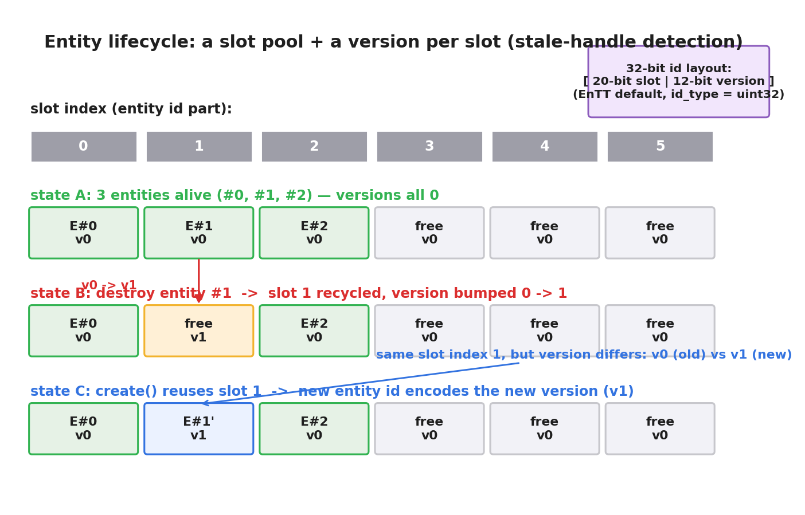
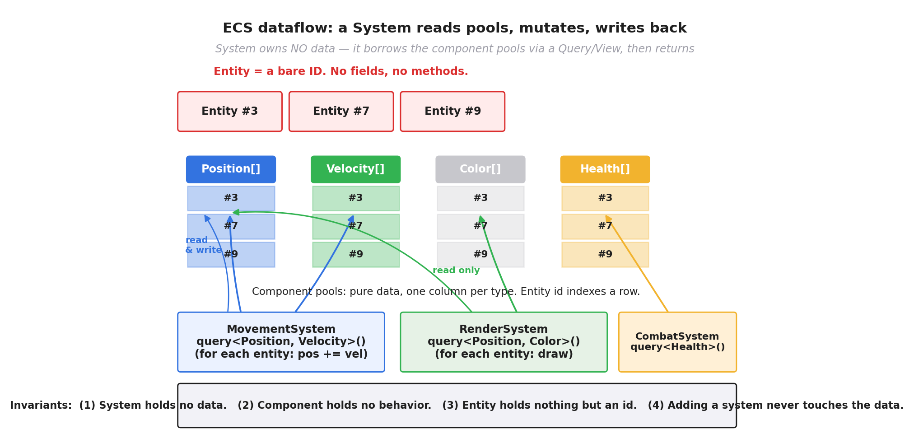

# 第 2 篇 · 第 5 章 · ECS 三件套:Entity / Component / System

> **核心问题**:上一章(P1-04)我们把面向对象组织游戏对象的两面墙——继承地狱、数据散落缓存差——拆透了。可拆完墙,手里还是空的:既然不按"对象是什么"组织,那到底按什么组织?本章就是给出这个解:**ECS 三件套**。它把面向对象绑在一起的"数据 + 行为"彻底拆开——Entity 只是一个 ID,Component 只是纯数据,System 只是纯行为。这一拆,继承墙塌了(对象的"是什么"由它"有哪些组件"组合决定,不再靠继承树),性能墙也松动了(数据和行为分开后,数据可以按"系统怎么遍历"重新摆放,这是下一章 P2-06 的题)。本章只立三件套的概念,把它讲透。

> **读完本章你会明白**:
> 1. Entity 是什么:就一个 ID——它是"这个游戏对象存在"的标记,本身不携带任何数据和行为。实体怎么生成、怎么回收,ID 池 + version 机制凭什么区分"已销毁的旧实体"和"复用同一槽位的新实体"。
> 2. Component 是什么:纯数据,无行为。一个实体"有什么组件"就"是什么"——组合取代继承,P1-04 的继承墙被这样拆掉。
> 3. System 是什么:纯行为,遍历它关心的那类组件,本身不持有数据。和面向对象"方法绑在对象上"的根本对立,以及 System 怎么注册到主循环被每帧调用。
> 4. 把上一章的小球例子彻底拆开:Ball 类 → Position/Velocity/Radius/Color 四个组件 + MovementSystem + RenderSystem,亲手看见"数据 + 行为绑一起"是怎么被三件套拆解的。

> **如果一读觉得太难**:先只记住三件事——① Entity 就是个数字 ID(它什么数据都没有);② Component 就是一小块纯数据(没有任何方法);③ System 就是遍历某一类组件、对它们做同一件事的函数(它不持有数据)。这三件事合起来,等于把面向对象"对象 = 数据 + 行为"这个铁律拆了。

---

## 〇、一句话点破

> **ECS 把面向对象的"数据 + 行为绑在一个对象里"这条铁律拆了:Entity 只是个 ID,Component 只是纯数据,System 只是纯行为。"一个游戏对象是什么"不再由它的类(继承树)决定,而由"它挂了哪些 Component"组合决定;行为不再绑在对象上,而由独立的 System 遍历它关心的组件来施加。**

这是结论。本章倒过来拆:先把"Entity = ID"讲透(它凭什么什么都不用带,还怎么区分已销毁的实体),再把"Component = 纯数据"和"组合取代继承"讲透(P1-04 的继承墙是怎么被它一拳打穿的),最后把"System = 纯行为"和"行为从对象上剥离"讲透,顺手把上一章的小球例子彻底拆开给你看。

P0-01 的第四节已经给过 ECS 三件套的概览。本章不再重讲那个概览,而是把三件套**逐个拆透**:它每个到底是什么(类型长什么样)、为什么必须这么设计(面向对象撞的墙)、源码里长什么样(EnTT 怎么实现的),以及它和"数据 + 行为绑一起"为什么是根本对立的。存储细节(SoA / Archetype)是后面 P2-06 / P2-08 的题,本章只立概念,预告但不展开。

---

## 一、Entity:就一个 ID

### 先把"Entity 是什么"讲死

新手最容易卡的第一关,就是"Entity 到底是什么"。直觉上,游戏对象嘛——一个角色、一颗子弹、一个敌人——总该是个"东西",有位置、有血量、有行为。可 ECS 的答案冷冰冰:**Entity 就是一个 ID,一个数字。它什么数据都没有,什么行为都没有。**

这句话要钉死。一个 Entity 在内存里就占 4 个或 8 个字节(看 ID 类型),里面只有一个数字,比如 `7`。这个 `7` 不是"血量 = 7",不是"位置 = 7",它就是"**世界上第 7 号游戏对象存在**"这个标记。仅此而已。

> **钉死这件事**:Entity = 一个 ID。它是"这个游戏对象存在"的凭证,本身不携带任何数据。位置、血量、颜色这些数据,全部以 Component 的形式挂在 Entity 外面(下一节讲)。Entity 自己,真的就只是一个数字。

这在面向对象程序员听来很反直觉:面向对象里,一个 `Enemy` 对象至少要装下自己的字段吧?ECS 说不用——字段全部拆成 Component 挂在外面,Entity 自己只剩个"户口本编号"。这就像把一个人所有的财产、技能、关系都登记在不同的册子上(房产册、技能册、社交册),这个人自己呢,就剩一个身份证号。但只要这个身份证号存在,就证明"这个人存在";至于他有什么,去翻那些册子(组件)。

### 为什么 Entity 只要一个 ID 就够了

为什么不给 Entity 留点字段?哪怕留个"类型"字段也好啊。**因为留了就又走回面向对象的老路了。** Entity 一旦带了字段,它就开始"决定对象是什么",就开始和特定的数据耦合,就开始重新撞 P1-04 那两面墙。ECS 把 Entity 设计成纯 ID,是把"对象存在"和"对象有什么"这两件事彻底解耦:

- **"对象存在"**——靠 Entity 这个 ID 标记。
- **"对象有什么"**——靠挂在它外面的 Component 组合决定(下一节)。

这样一个游戏对象,可以是"只有 Position 的一个静止点",也可以是"有 Position + Velocity + Health + AI 的一个完整敌人",它们的 Entity 本身没有任何区别——都是一个 ID。区别全在挂了哪些 Component。**这正是 ECS 灵活性的根**:游戏对象的"类型"不再需要在创建时就钉死(像面向对象的 `new Enemy()`),而是由它运行时挂的组件动态决定,随时可以加、可以减。

> **不这样会怎样**:如果 Entity 自己带字段(比如带个"类型枚举"或一组虚函数),那它就是个披着 ECS 外衣的面向对象对象——加新类型要改枚举、加新行为要改继承,继承墙立马回来。Entity 必须是个纯 ID,这是三件套拆分能成立的物理前提。

### Entity 在源码里长什么样:EnTT 的 entt::entity

我们把这套设计在真实 ECS 库里对照一下。看 EnTT(skypjack/entt,C++ ECS 标杆,Minecraft 等在用)。它的 Entity 定义,核心就一行(基于 GitHub skypjack/entt):

```cpp
// src/entt/entity/fwd.hpp
enum class entity : id_type {};   // id_type 通常是 std::uint32_t
```

这是一个**强类型枚举,底层是 `id_type`(默认 32 位无符号整数),没有任何成员**。它就是个数字。你拿到的每个 Entity,本质上就是 `0, 1, 2, 3, ...` 这样一个编号。EnTT 用 `enum class` 而不是直接用 `uint32_t`,是为了类型安全——免得你不小心把一个 entity 当成普通整数拿去加加减减。

那这个数字怎么生成?怎么回收?怎么区分"已经销毁的实体"和"复用同一编号的新实体"?EnTT 用一个叫 `registry`(注册表)的中央管理器来管(下一节 Component 还会再见到它):

```cpp
entt::registry registry;
const auto e1 = registry.create();   // 拿到一个新 entity, 比如 0
const auto e2 = registry.create();   // 1
const auto e3 = registry.create();   // 2
registry.destroy(e2);                // 销毁 e2 (id=1)
const auto e4 = registry.create();   // 又拿一个新 entity...
```

这里有个关键问题:`destroy(e2)` 之后,`e2` 这个 id(假设是 `1`)是不是就永远不能再用了?如果永远不用,引擎跑久了 id 会越涨越大(虽然 32 位够大,但语义上别扭);如果**复用**这个 id(下次 `create()` 又返回 `1`),那万一有谁手里还攥着旧的 `e2`(一个悬空引用),他怎么知道他那个 `1` 已经不是原来的那个 1 了?

### Entity 的生成与回收:ID 池 + version 机制

这是 Entity 设计里最精巧的一笔,也是本章技巧精解要拆的重点(先在这里讲清原理,后面技巧精解配源码)。

**朴素做法(会翻车)**:`create()` 维护一个递增计数器,`destroy()` 直接把 id 标记为"已销毁"且永不复用。问题:① id 会无限增长,虽然 32 位够大,但任何"按 id 索引"的数组都要跟着扩容;② 悬空引用检测不了——你手里攥着已销毁的 `e2 = 1`,引擎没法告诉你"这个 1 已经失效了",因为 id 本身不带任何"是否还有效"的信息。

**EnTT 的做法(版本号机制)**:一个 entity 的标识符**不是纯 id,而是 "id 部分 + version 部分" 两段拼起来**。看 EnTT 的 `entt_traits`(src/entt/entity/entity.hpp):

```cpp
// 简化示意(非源码原文,突出位分配):
template<>
struct entt_traits<std::uint32_t> {
    using entity_type = std::uint32_t;
    using version_type = std::uint16_t;

    static constexpr entity_type entity_mask  = 0xFFFFF;   // 低 20 位: id 部分
    static constexpr entity_type version_mask = 0xFFF;     // 高 12 位: version 部分
};
```

也就是说,默认配置下,一个 32 位的 entity 被劈成两段:**低 20 位是真正的"槽位编号(slot)"(可表示约 100 万个槽位),高 12 位是"版本号(version)"**。

- **槽位(slot)**:这是真正的"实体编号",`create()` 优先复用已销毁的空槽,而不是无限递增。
- **版本号(version)**:每个槽位带一个版本号,初始为 0。**这个槽位上的实体每次被 `destroy()` 时,版本号 +1**。下次 `create()` 复用这个槽位时,新实体的 version 就是 +1 后的值。

这样一来:

- 旧实体 `e2` 槽位 = 1, version = 0,完整 id = `(0 << 20) | 1` = `1`。
- `destroy(e2)` 后,槽位 1 空出来,版本号 +1 → version = 1。
- 下次 `create()` 复用槽位 1,新实体 `e4` 槽位 = 1, version = 1,完整 id = `(1 << 20) | 1`,显然和旧的 `1` 不同。
- 你手里攥着旧的 `e2 = 1`,拿去问 registry "这个还活着吗",registry 一看"槽位 1 当前 version 是 1,但你这个 id 的 version 是 0,不匹配"——**立即判定这是个悬空引用**。

> **钉死这件事**:EnTT 的 entity = **低 20 位 slot + 高 12 位 version**。slot 决定槽位(可复用,不无限增长),version 区分"同一槽位上的新旧实体"(每次销毁 +1)。你手里攥着的旧 entity id,拿去和 registry 当前状态一对,version 不匹配就知道它已经死了。这套机制零额外内存开销——version 直接塞在 id 的高位里。



这张图把三态画清了:**同一槽位(slot 1)上,旧实体 v0 和新实体 v1 是两个不同的实体**,靠 version 区分。源码细节(`to_entity` / `to_version` / `next` 怎么从 id 里拆装这两段、tombstone / null 哨兵怎么用)我们留到技巧精解里拆。

### Entity 小结

到这里 Entity 就讲透了:**它就是个 ID——一个"这个游戏对象存在"的凭证,本身不带任何数据和行为**。它通过"槽位池 + version"机制实现高效的生成/回收/悬空引用检测。下一节,我们看"对象有什么"——这是 Component 的事。

---

## 二、Component:纯数据,无行为

### Component 是什么

Component 就是**一小块纯数据**。`Position{x, y}`、`Velocity{vx, vy}`、`Health{hp, max}`、`Color{r, g, b}`、`Radius{r}`——每个 Component 就是一个数据结构,**没有任何方法**(没有 `update()`,没有 `render()`,什么都没有)。

把它和面向对象对照一下,马上清楚。面向对象里,你会写:

```cpp
class Ball {                       // 数据 + 行为绑在一起
    float x, y, vx, vy;            // 数据
    Color color; float radius;
public:
    void update(float dt);         // 行为(方法)也在这
    void render();                 // 行为也在这
};
```

ECS 里,你把数据和行为**彻底分开**:

```cpp
// 组件: 纯数据, 没有方法
struct Position { float x, y; };
struct Velocity { float vx, vy; };
struct Color     { float r, g, b; };
struct Radius    { float r; };

// 行为(update / render)不在这 —— 它们属于下一节的 System
```

> **钉死这件事**:Component = 纯数据结构,不带任何行为。一个 `Position` 组件就是个 `{float x, y}`,仅此而已。你可能会问"那移动逻辑(改 x, y)写在哪?"——答:写在 System 里(下一节)。Component 只负责"把数据躺好",System 负责"来处理这堆数据"。这就是"数据和行为分离"在 ECS 里的字面落地。

### "有什么组件"就"是什么":组合取代继承

Component 单看只是个数据结构,不稀奇。它的革命性在于:**一个 Entity"挂了哪些 Component",就决定了它"是什么"**。这叫**组合取代继承(composition over inheritance)**,是 ECS 拆掉 P1-04 继承墙的那一拳。

回想 P1-04 的痛点:面向对象要表达"会飞的会游泳的会施法的敌人",得 `Enemy → FlyingEnemy → SwimmingEnemy → ... → SpellCastingFlyingSwimmingEnemy`,继承树爆炸,钻石继承(Enemy 数据被两条路径各继承一次),加一个新组合就牵动整棵树。

ECS 怎么表达同一个敌人?**根本不继承**。你只要造一个 Entity,然后往它身上挂组件:

```cpp
auto enemy = registry.create();
registry.emplace<Position>(enemy, ...);
registry.emplace<Velocity>(enemy, ...);
registry.emplace<Health>(enemy, 100, 100);
registry.emplace<Flyable>(enemy, ...);       // "会飞" = 挂个 Flyable 组件
registry.emplace<Swimmable>(enemy, ...);     // "会游" = 挂个 Swimmable 组件
registry.emplace<SpellCaster>(enemy, ...);   // "会施法" = 挂个 SpellCaster 组件
```

这个 enemy 是什么?**它就是"挂了 Position + Velocity + Health + Flyable + Swimmable + SpellCaster 这一组组件的实体"**。没有类,没有继承树,没有"它必须先是个 Enemy 再是 FlyingEnemy 再是..."。它的"类型"完全由它挂的组件组合动态决定。

现在策划说"我要个会隐形的飞行敌人",你怎么办?

- **面向对象**:新写一个 `InvisibleFlyingEnemy` 类,继承 `FlyingEnemy`,加个 `Invisible` mixin 或接口,可能引发钻石继承,牵一发动全身。
- **ECS**:造个 Entity,挂 `Position + Velocity + Flyable + Invisible` 组件,**完工**。一行继承代码都不用动,现有类(本来就没有)和现有组件一个不改。

这就是**组合取代继承**的力量。P1-04 那面"继承墙"(深继承、钻石继承、改一个组合牵动整棵树),被这一拳直接打穿。

> **不这样会怎样**:如果"是什么"还是由类(继承)决定,那回到 P1-04:N 个行为(飞/游/施法/隐身/掉落/治疗...)最多产生 2^N 个叶子类,大多数还是一次性的空壳子。每加一个新组合,继承树就得动刀。ECS 把"是什么"交给组件组合决定,加新组合就只是"换个挂组件的方式",现有代码零改动。这是 ECS 取代面向对象的**第一性理由(架构层面)**。

### 组件是动态的:运行时加加减减

组件组合还有一个面向对象做不到的好处:**它可以在运行时动态加减**。

一个经典的例子:**冰冻状态**。敌人被冰冻魔法打中,你不能动了。面向对象里,你大概会加个 `bool frozen` 标志,然后在 `update()` 里到处 `if (frozen) return;`——标志位污染每个方法。ECS 里,你**直接把它的 `Velocity` 组件移除**(冰冻时它没有速度,自然不会动),等冰解了再 `emplace<Velocity>` 加回来。MovementSystem 只遍历有 Velocity 的实体,没 Velocity 的实体它根本碰不到——冰冻逻辑零侵入,一行 `if` 都不用写。

再比如:**死亡**。面向对象里,敌人死了你大概设个 `bool dead`,然后所有系统都得记得检查它。ECS 里,死亡可以表达为"移除 Health 组件"(或加个 Dead 组件),于是所有"只对活人感兴趣"的 System(AI、战斗、移动)自动跳过它,而 RenderSystem(它要画尸体)还继续画——**每个 System 靠"它查询哪些组件"自然过滤,不用写 if**。

> **钉死这件事**:组件可以在运行时随时加、随时减,对象的"类型"随之动态变化。这让很多面向对象里要靠"标志位 + 到处 if"的逻辑,在 ECS 里退化成"加减组件",干净、零侵入。

### Component 小结

Component 就是**纯数据,无行为**;一个 Entity 挂了哪些 Component 就"是什么";组合取代继承,继承墙塌;组件可运行时加减,逻辑零侵入。但有个问题还没回答:**数据都拆成组件了,那"行为"——移动、渲染、AI——到底写在哪?** 这就是下一节 System 的事。

---

## 三、System:纯行为,遍历某类组件

### System 是什么

System 就是**一段纯行为(函数),它遍历它关心的那类组件,对每个实体做同一件事**。System **本身不持有数据**——数据全在组件里,System 只是来"读组件、算、写回组件"的过客。

举个最直白的例子。MovementSystem(移动系统)的逻辑是:对每个有 Position + Velocity 的实体,把它的 Position 按 Velocity 推进一格。用 EnTT 写:

```cpp
// 注册成函数, 注册到主循环每帧调用(后面讲怎么注册)
void movement_system(entt::registry &reg, float dt) {
    auto view = reg.view<Position, Velocity>();   // 找出所有同时有 Position+Velocity 的实体
    for (auto [entity, pos, vel] : view.each()) { // 遍历它们
        pos.x += vel.vx * dt;                     // 读 vel, 算, 写回 pos
        pos.y += vel.vy * dt;
    }
}
```

这一段就囊括了 System 的全部精髓:

- **`reg.view<Position, Velocity>()`**:这叫**查询(Query)**——告诉 registry"我要所有同时挂了 Position 和 Velocity 组件的实体"。registry 返回一个 view(P2-09 详讲)。注意:**System 不持有这些实体,它只是来查询的**。
- **`for (auto [entity, pos, vel] : view.each())`**:遍历查询结果,每个实体连同它的 Position、Velocity 引用一起给你。这是**对每个实体做同一件事**(pos += vel * dt)的循环——和面向对象 `for ball in balls: ball.update()` 看着像,本质不同(下面对比)。
- **System 自己没有数据**:`movement_system` 这个函数,除了参数 `reg` 和 `dt`,自己不存任何状态。数据全在 registry 管的组件里,System 只是来读写的。

> **钉死这件事**:System = 纯行为,本身不持有数据。它通过**查询(Query)**告诉世界"我要哪些组件",然后**遍历**查询结果,对每个实体做同一件事。数据归 Component(和管它的 registry),行为归 System,各司其职。

### System 和"方法绑在对象上"的根本对立

把 System 和面向对象的"方法"对照,你就看清这场革命了。

**面向对象**:行为绑在对象上。`Ball` 类有 `update()` 方法,每个 Ball 对象**自己**会 update。调用的语法是 `ball.update()`——行为从对象身上发起。几百个球的 update 阶段就是 `for ball in balls: ball.update()`,每个球各自调自己的 update。

**ECS**:行为从对象上剥离。`Position` / `Velocity` 组件**没有任何方法**,组件自己什么都不会。行为由**独立的 System 函数**施加——`movement_system(reg)` 遍历所有有 Position+Velocity 的实体,统一地把它们的位置推进。行为不在对象身上,而在 System 这个"局外人"手里。

这一剥离带来三个面向对象做不到的好处:

**好处一:行为集中,改一处全生效。** 面向对象里,移动逻辑散落在每个对象的 `update()` 里(Ball 有 Ball::update,Enemy 有 Enemy::update,FlyingEnemy 有它自己的...)。你想改"移动时考虑摩擦力",得挨个类改。ECS 里,移动逻辑**只写在一个 MovementSystem 里**,所有会动的实体(不管它是球、敌人、子弹)都走这一套——改一处,全部生效。

**好处二:加新行为不动现有数据。** 策划要加个"重力"行为。面向对象里,你得给所有"会受重力"的类加个 `apply_gravity()` 方法,要么改基类(牵动整棵继承树),要么每个叶子类各加一遍。ECS 里,**新写一个 GravitySystem**,它查询所有有 Position+Velocity 的实体,给 vy 加个 g*dt,**完工**。现有组件、现有 System 一个不改。这是"加新行为 = 加个 System"的灵活性。

**好处三:遍历天然适配数据导向。** System 对每个实体做的是**同一件事**(pos += vel*dt)。这件事意味着:这堆实体可以连续摆放、可以用 SIMD 一次处理好几个、可以多核并行各算一半——这是下一章 P2-06 / P2-07 的题,这里只点一下。



> **钉死这件事**:System 把行为从对象身上剥离出来——数据归 Component,行为归 System。这带来"行为集中改一处全生效""加新行为不动现有数据""遍历天然适配数据导向"三个面向对象做不到的好处。这是 ECS 取代面向对象的**第二性理由(行为层面)**。

### System 怎么注册到主循环被每帧调用

System 是函数,但函数不会自己跑。引擎的主循环(P1-02 讲的三段式 input → update → render)每帧要调用一批 System。怎么调?

最朴素的做法:在主循环的 update 段里,手写一行行调用:

```cpp
while (running) {
    process_input();
    float dt = clock.last_frame_time();

    // ---- update: 一行行调 System ----
    movement_system(registry, dt);
    gravity_system(registry, dt);
    collision_system(registry, dt);
    ai_system(registry, dt);
    combat_system(registry, dt);
    // ...

    render_system(registry);
    clock.tick();
}
```

这够用,直观。但真实引擎里 System 一多(几十上百个),且 System 之间有依赖(比如 CollisionSystem 必须在 MovementSystem 之后跑,否则用的是旧位置)、有并发(不冲突的 System 可以多核并行),手写就管不了了。所以现代引擎(ECS 库)会提供**调度器(scheduler)**:你把每个 System 注册进去,声明它读/写哪些组件、依赖谁,调度器自动算出执行顺序、自动把不冲突的 System 并行起来。EnTT 的 `organizer`、Bevy 的 `Schedule` 就是干这个的(P5-17 多线程 job 系统详讲)。

本章只需记住:**System 是注册到主循环、被每帧(或固定步长)调用的函数**。它怎么被调度,是后面"驱动"那一面的题(P3 主循环、P5 并发)。

> **承接**:System 的调度(顺序、并发、依赖)属于"驱动"那一面,本书 P3-10(主循环)、P5-17(job 系统)详讲。本章只立"System 是什么"的概念。

---

## 四、把上一章的小球彻底拆开

讲了三件套的概念,现在回到 P1-04 / P0-01 那个几百个移动小球的例子,亲手把它拆开。这一拆,你就看清"数据 + 行为绑一起"是怎么被三件套解构的。

### 朴素(面向对象)版:Ball 类

先看面向对象怎么做。一个 Ball 类,数据和行为绑一起:

```cpp
class Ball {                            // 数据 + 行为绑在一个对象里
    float x, y;                         // 位置(数据)
    float vx, vy;                       // 速度(数据)
    Color color;                        // 颜色(数据)
    float radius;                       // 半径(数据)
public:
    void update(float dt) {             // 移动行为(也绑在这)
        x += vx * dt; y += vy * dt;
        if (x < 0 || x > W) vx = -vx;   // 撞墙反弹
        if (y < 0 || y > H) vy = -vy;
    }
    void render() { /* 画自己, 用 color 和 radius */ }
};

std::vector<Ball> balls;
// update 阶段: for (auto &b : balls) b.update(dt);
// render 阶段: for (auto &b : balls) b.render();
```

几百个 Ball 是一个对象数组。update 阶段遍历每个 Ball,调它自己的 `update()`;render 阶段遍历每个 Ball,调它自己的 `render()`。看起来没问题。

但 P1-04 已经拆过它两面墙:**继承墙**(几百个相同球没事,可一旦要"会飞的球""会变色的球""会分裂的球",继承树就炸)和**性能墙**(每个 Ball 把 pos/vel/color/radius 绑一整块,update 只要 pos+vel,却把无用的 color/radius 也拉进缓存;对象散落在堆上,遍历是指针追逐)。

### ECS 版:拆成 4 组件 + 2 System

ECS 怎么做?把 Ball 类彻底拆开:**数据拆成 4 个组件,行为拆成 2 个 System**。

```cpp
// ---- 1. 组件: 纯数据, 无行为 ----
struct Position { float x, y; };
struct Velocity { float vx, vy; };
struct Color    { float r, g, b; };
struct Radius   { float r; };

// ---- 2. System: 纯行为, 遍历某类组件 ----
void movement_system(entt::registry &reg, float dt) {
    auto view = reg.view<Position, Velocity>();
    for (auto [e, pos, vel] : view.each()) {
        pos.x += vel.vx * dt;
        pos.y += vel.vy * dt;
        if (pos.x < 0 || pos.x > W) vel.vx = -vel.vx;   // 撞墙反弹
        if (pos.y < 0 || pos.y > H) vel.vy = -vel.vy;
    }
}

void render_system(entt::registry &reg) {
    auto view = reg.view<Position, Color, Radius>();
    for (auto [e, pos, color, radius] : view.each()) {
        draw_circle(pos.x, pos.y, radius.r, color.r, color.g, color.b);
    }
}

// ---- 3. 造球: 挂组件 ----
entt::registry registry;
for (int i = 0; i < 500; ++i) {
    auto ball = registry.create();                       // 一个 ID
    registry.emplace<Position>(ball, rand_x(), rand_y());
    registry.emplace<Velocity>(ball, rand_vx(), rand_vy());
    registry.emplace<Color>(ball, rand_color());
    registry.emplace<Radius>(ball, rand_radius());
}

// ---- 4. 主循环: 每帧调 System ----
while (running) {
    movement_system(registry, dt);
    render_system(registry);
}
```

对比看一下发生了什么:

- **数据被拆开**:位置、速度、颜色、半径各自独立成组件。一个球"是什么"——它是有 Position+Velocity+Color+Radius 的 Entity。
- **行为被剥离**:`update()` 不再绑在 Ball 身上,而是变成了独立的 `movement_system`;`render()` 变成了 `render_system`。System 通过查询(`view<Position, Velocity>`、`view<Position, Color, Radius>`)拿到它要的组件,统一处理。
- **System 只碰它要的字段**:`movement_system` 只查 Position+Velocity,完全不碰 Color/Radius(它们甚至不在 view 里);`render_system` 只查 Position+Color+Radius,不碰 Velocity。每个 System 只取它要的字段,无关字段它根本看不见。

![面向对象:每个对象自带 vtable+update(),遍历是对每个对象做一次虚函数调用,字段散落、color/radius 被白拉进缓存;ECS:一个 System 函数流式遍历两个连续的组件池(Position[]、Velocity[]),无虚调用,数据连续,SIMD 友好](images/fig-p2_05_03-oop-vs-system.png)

> **钉死这件事**:把 Ball 类拆成 Position/Velocity/Color/Radius 四个组件 + MovementSystem/RenderSystem 两个 System,你就亲手完成了"数据 + 行为绑一起"到"三件套拆开"的范式转换。继承墙塌了(球要变种就换组件组合,不动继承),性能墙松动了(每个 System 只碰它要的字段,数据可以按"系统怎么遍历"重新摆放——这是下一章 P2-06 的题)。

### ECS vs OOP 对比表

把整章的对比汇总成一张表,这张表是本章的核心收获:

| 维度 | 面向对象(OOP) | ECS |
|------|--------------|-----|
| 数据和行为 | 绑在一个对象里(Ball 有字段也有 update) | **拆开**:Component 是数据,System 是行为 |
| "对象是什么"由什么决定 | 类(继承树)决定 | **挂了哪些 Component 组合**决定 |
| 加新行为(比如加重力) | 改继承树/基类,或每个叶子类加方法 | **加个 GravitySystem**,不动任何现有数据 |
| 加新对象变种(隐形飞行球) | 新写叶子类,可能钻石继承 | **换个挂组件的组合**,零继承 |
| 行为集中度 | 散落在每个对象的 update() 里 | **集中在少数几个 System 里**,改一处全生效 |
| 遍历方式 | 按对象遍历,虚函数调用,字段散落 | **按组件类型遍历**,只碰要的字段,数据可连续摆放 |
| 缓存友好 | 差(对象散落堆上,指针追逐) | **好**(组件按类型连续存,下章详讲) |
| 可并行 | 难(对象间隐式耦合,虚调用) | **天然**(同 System 内实体互不依赖,P2-07 详讲) |

这张表里,前 5 行是**架构层面**的优势(继承墙),后 3 行是**性能层面**的优势(性能墙)。架构优势本章已经讲透,性能优势的细节(SoA、SIMD、并行)留给 P2-06 / P2-07 / P2-08。

---

## 五、技巧精解:Entity 的 version 机制

本章最硬核的一个技巧,是 Entity 的**版本号(version)机制**——它用零额外内存,同时实现了"槽位复用"和"悬空引用检测"两件事。我们拿 EnTT 源码拆透。

### 它解决什么问题

前面讲过:Entity 销毁后,槽位要不要复用?复用的话,旧引用怎么检测?这是任何"带句柄(handle)的系统"(不光是 ECS,文件描述符、数据库连接池、内核对象句柄都一样)都要解决的问题。朴素方案有两种,各有问题:

- **方案 A:不复用,id 永远递增**。问题:id 无限增长;更糟,旧引用(已销毁的 entity id)无法检测——id 本身不带"是否还有效"的信息,你拿个死 id 去查,registry 可能因为 id 越界崩溃,或者(如果 id 没越界)返回一个错误的结果。
- **方案 B:不复用 + 维护一个"已销毁 id 集合"**。问题:每次访问前查集合,慢;集合本身占内存;销毁的 id 多了集合会很大。

EnTT 的方案:**把 version 编码进 id 的高位**,零额外内存,查询时 O(1) 判定有效性。

### EnTT 怎么实现:entt_traits 拆装两段

看源码(src/entt/entity/entity.hpp,基于 GitHub skypjack/entt)。核心是 `basic_entt_traits` 这组函数,负责从 id 里**拆出**slot 和 version、或**拼装**回去:

```cpp
// 简化示意(突出核心, 非源码全文):
template<typename Traits>
class basic_entt_traits {
    static constexpr auto length = std::popcount(Traits::entity_mask);  // entity_mask 占几位
public:
    static constexpr entity_type entity_mask  = Traits::entity_mask;    // 低 20 位
    static constexpr entity_type version_mask = Traits::version_mask;   // 高 12 位

    // 从 id 拆出 slot 部分
    static constexpr entity_type to_entity(value_type value) noexcept {
        return (to_integral(value) & entity_mask);
    }
    // 从 id 拆出 version 部分
    static constexpr version_type to_version(value_type value) noexcept {
        return (static_cast<version_type>(to_integral(value) >> length) & version_mask);
    }
    // 销毁时: version + 1 (拼回一个新 id)
    static constexpr value_type next(value_type value) noexcept {
        const auto vers = to_version(value) + 1;
        return construct(to_integral(value),
                         static_cast<version_type>(vers + (vers == version_mask)));  // 溢出回 0
    }
    // 由 slot + version 拼装一个 id
    static constexpr value_type construct(entity_type entity, version_type version) noexcept {
        return value_type{(entity & entity_mask) |
                          (static_cast<entity_type>(version & version_mask) << length)};
    }
};
```

读这段代码注意三件事:

1. **`to_entity` / `to_version` 用位与和右移拆出两段**。一个 32 位 id,低 20 位是 slot,高 12 位是 version。`entity_mask = 0xFFFFF`(20 个 1),`& entity_mask` 就取出低 20 位;`>> length`(length = 20)再 `& version_mask` 取出高 12 位。位运算,极快。
2. **`next` 把 version + 1**(销毁时调用),还处理了溢出(version 加到 `version_mask = 0xFFF` 后再 +1 回绕到 0,避免越界)。这就是"销毁一个实体 → 它的槽位 version +1"的实现。
3. **`construct` 把 slot 和 version 拼回一个 id**:`(entity & entity_mask) | (version << 20)`。create() 复用槽位时,用当前(已经 +1 过的)version 拼出新 id。

### 悬空引用怎么被检测

现在看悬空引用检测就一目了然了。假设你手里有个旧 entity `e_old`,它是在某次 `create()` 拿到的。你后来调了 `destroy(e_old)`,但 `e_old` 这个变量还在你手上(典型场景:它存在某个组件里、某个脚本变量里、某个回调闭包里)。你拿它去问 registry:

```cpp
if (registry.valid(e_old)) {       // 它还活着吗?
    auto &pos = registry.get<Position>(e_old);   // 活着就拿它的 Position
}
```

`registry.valid(e_old)` 内部干的事:从 e_old 拆出 slot,查 registry 的槽位表,看那个槽位当前的 version,再和 e_old 自带的 version 比。**不等 → 已销毁(或已被复用)→ 返回 false**。于是 `get<Position>` 不会被调用,避免了"拿到一个张冠李戴的 Position"(明明是同一 slot,但已经是另一个新实体的 Position 了)。

> **钉死这件事**:version 机制用**零额外内存**(version 直接塞在 id 高位)实现了两件事:① **槽位复用**(destroy 后 slot 能再分配给新实体,id 不无限增长);② **悬空引用检测**(旧 id 的 version 和槽位当前 version 不等,立即判定失效)。这是 EnTT entity 设计的精髓,也是任何"句柄系统"的通用技巧——你将来在文件描述符、内核对象、连接池里都会看到类似的 version/generation 计数。

### 反面对比:如果不这么设计

要是没有 version 机制(纯递增 id,不复用):

- 几个小时的游戏运行后,你可能销毁过上亿个临时实体(子弹、特效、粒子),id 涨到上亿。任何"按 id 索引"的稀疏数组(sparse set,P2-08 讲)都要扩到上亿槽位,内存爆炸。
- 你存了个旧 entity id(比如"上锁的目标"),去访问时,registry 没法告诉你"它死了"——要么越界崩溃,要么(更糟)返回个垃圾结果,bug 极难复现。

version 机制两件事一起解,零额外内存,O(1) 检测。这就是技巧的"妙"。

---

## 六、章末小结

### 回扣主线

本章是第 2 篇(ECS 灵魂)的开篇招牌。我们立起了 ECS 三件套的概念——**Entity = 一个 ID、Component = 纯数据、System = 纯行为**——把面向对象"数据 + 行为绑一起"这条铁律彻底拆了。这一拆,继承墙塌了(对象"是什么"由组件组合决定,不靠继承树;行为从对象身上剥离到 System),性能墙也松动了(数据和行为分开后,数据可以按"系统怎么遍历"重新摆放——但这是下一章 P2-06 的题)。我们全程对照 EnTT 源码,看清了 Entity 在源码里就是个 `enum class entity : id_type {}`(纯 id)、Component 就是个无方法的 struct、System 就是个查询 + 遍历的函数。本章服务二分法的**组织**这一面,只立"数据怎么逻辑组织"的概念;数据在内存里**怎么物理摆放**(SoA / Archetype),是 P2-06 / P2-08 的题。

### 五个为什么

1. **Entity 凭什么只是个 ID?**——因为一旦它带字段,它就开始决定"对象是什么",就又走回面向对象的老路了。Entity 必须是个纯 ID,才能把"对象存在"和"对象有什么"彻底解耦,让"是什么"完全由挂的组件组合动态决定。
2. **Entity 销毁后槽位复用,旧引用怎么检测?**——version 机制。id 高位塞个 version,销毁时 +1,复用时用新 version 拼新 id。旧 id 的 version 和槽位当前 version 不等,registry 立即判定它失效,零额外内存,O(1)。
3. **Component 凭什么不带行为?**——因为行为绑在数据上,就重新撞继承墙(加新行为要改类)、且无法集中(散落在每个对象的 update 里)。Component 只负责躺数据,行为交给独立的 System,才能"改一处全生效""加新行为不动现有数据"。
4. **"组合取代继承"为什么比继承好?**——N 个行为用继承最多产生 2^N 个叶子类(且大多一次性);用组件组合,任何组合就是"挂哪些组件",零继承,加新组合零改动现有代码。运行时还能动态加减组件(冰冻 = 移除 Velocity),面向对象做不到。
5. **System 凭什么不持有数据?**——数据归 Component(和管它的 registry),System 只是来"查询 + 遍历 + 读写组件"的过客。这样 System 之间无状态、可并行(不同 System 操作不同组件,天然不冲突,P5-17 详讲),且 System 对每个实体做同一件事,天然适配 SIMD 和数据并行(P2-07)。

### 想继续深入往哪钻

- 想搞懂**组件在内存里怎么存**(SoA vs AoS,承《内存分配器》):第 2 篇 P2-06。本章只立了"组件是纯数据"的概念,没讲这些数据在内存里怎么连续摆放让 System 遍历飞快——下一章就拆这个。
- 想搞懂 **System 的遍历凭什么缓存友好、凭什么能 SIMD 和多核并行**:第 2 篇 P2-07。
- 想搞懂 **Archetype**(组件组合相同的实体怎么连续存放):第 2 篇 P2-08。
- 想搞懂 **Query / view**(System 怎么声明"我要哪些组件",registry 怎么快速返回):第 2 篇 P2-09。
- 想搞懂 **System 怎么被调度**(顺序、并发、依赖,本书"驱动"那一面):第 3 篇 P3-10(主循环)、第 5 篇 P5-17(job 系统)。
- 想亲手用 EnTT 跑一个最小 ECS:附录 B。

### 引出下一章

本章立起了 ECS 三件套的概念——Entity 是 ID、Component 是纯数据、System 是纯行为。但有一个关键问题我们一直按着没讲:**这些 Component,在内存里到底怎么存?** 本章的图里,Position[] / Velocity[] 都是画成"连续一整列"——可面向对象的对象是散落在堆上的啊,凭什么组件就能连续?这就是下一章 P2-06《Component 的存储:SoA vs AoS》的题。它会拆透**为什么把所有实体的同一字段连续存(SoA),比把每个对象整块存(AoS)让 System 遍历快得多**——这条承接《内存分配器》"数据布局决定性能"的思想,要在游戏引擎场景里兑现了。

> **下一章**:[P2-06 · Component 的存储:SoA vs AoS](P2-06-Component的存储-SoA-vs-AoS.md)
