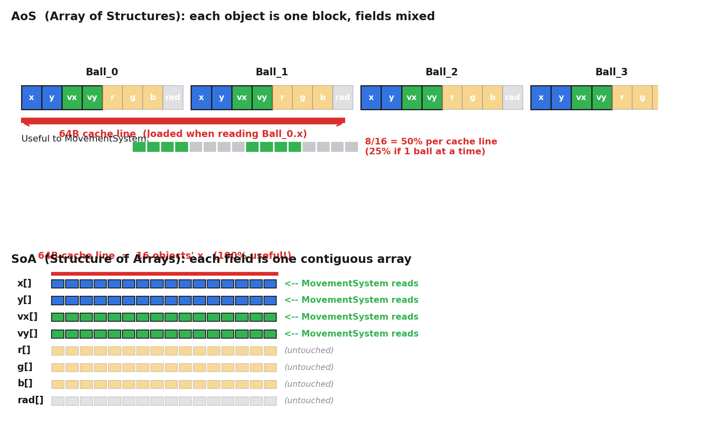
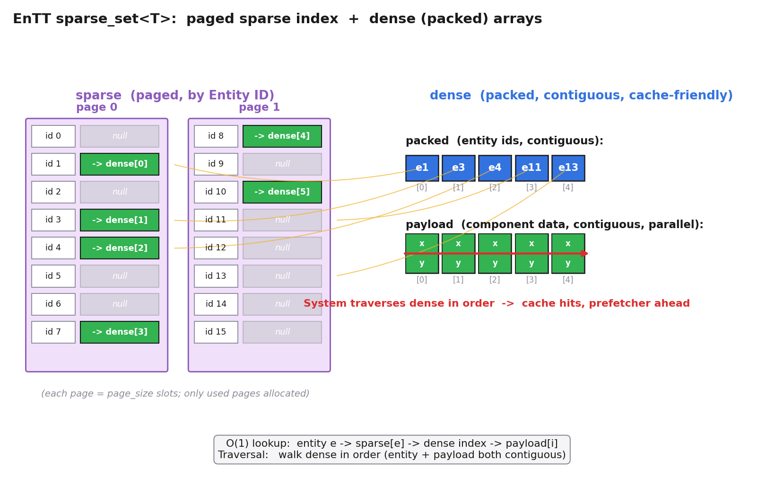
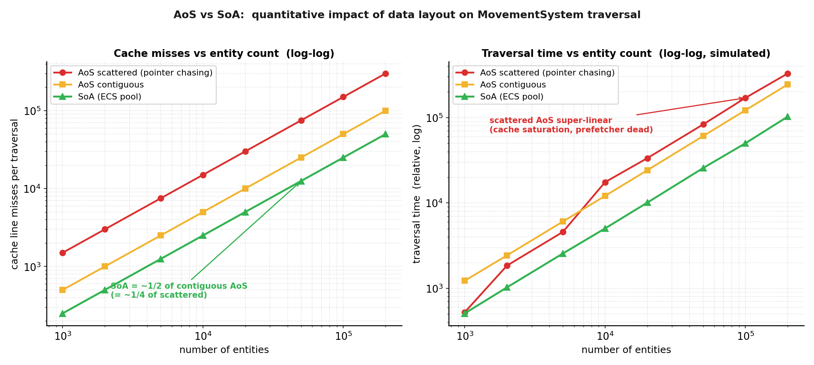

# 第 2 篇 · 第 6 章 · Component 的存储:SoA vs AoS

> **核心问题**:上一章(P2-05)我们立起了 ECS 三件套的概念——Entity 是 ID,Component 是纯数据,System 是纯行为。可那章的图里,`Position[]` / `Velocity[]` 都画成"一整列连续内存",讲得好像理所当然。问题是:面向对象的对象是 `new` 出来散落在堆上的,凭什么组件就能连续?这些 Component 在内存里到底怎么存,才能让 System 遍历飞快?本章就拆透这件事。两个名词会反复出现:**AoS(Array of Structures,结构体数组)**——面向对象的天然存法,每个对象一整块;**SoA(Structure of Arrays,数组结构体)**——数据导向的存法,每种字段一个连续数组。这一对概念承《内存分配器》"数据布局决定性能",在游戏引擎场景里兑现:MovementSystem 只要 Position 和 Velocity 两个数组,一路连续读,缓存全命中,不碰无关的 Color、Radius。

> **读完本章你会明白**:
> 1. AoS 是什么:面向对象的天然存法——每个对象的所有字段绑成一整块,几百个对象就是几百块,块里混着"这次遍历用得上"和"用不上"的字段。
> 2. SoA 是什么:数据导向的存法——把所有对象的同一字段抽出来,连续存成一个数组;MovementSystem 只要 Position 数组和 Velocity 数组,无关字段根本不在路上。
> 3. 为什么 SoA 比 AoS 快:用缓存行和硬件预取解释(承《内存分配器》,一句带过不重讲),量化对比缓存 miss 次数和遍历耗时。
> 4. EnTT 怎么存:每种组件类型一个 pool,pool 基于 sparse_set(sparse 索引 + dense 连续数组),本质就是 SoA 的工业级实现——标注 skypjack/entt。
> 5. 反面对比:朴素对象数组(Array of Boxes)遍历时的指针追逐,缓存 miss 随实体数线性增长,16ms 预算根本不够。

> **如果一读觉得太难**:先只记住三件事——① AoS = 每个对象一整块(字段混在一起);SoA = 每种字段一条连续数组(只取你要的)。② System 遍历只关心少数几列字段,SoA 把这几列连续摆,缓存和预取就发挥威力,AoS 把无关字段也拉进缓存行,白搬。③ EnTT 给每种组件类型开一个 pool,pool 里是连续的 dense 数组,所以 `view<Position, Velocity>()` 拿到的就是两条连续数组,遍历飞快。

---

## 〇、一句话点破

> **面向对象天然是 AoS——每个对象一整块,字段全混一起;数据导向天然是 SoA——每种字段一条连续数组。System 每帧遍历只关心少数几列字段(Position、Velocity),不关心其他的(Color、Radius)。SoA 把"关心的列"连续摆,System 遍历时 CPU 缓存全命中、硬件预取一路领先;AoS 把"不关心的列"也拉进缓存行,白白浪费带宽。EnTT 给每种组件类型开一个 pool,pool 内部 dense 数组连续——这本质就是 SoA 的工业实现。**

这是结论。本章倒过来拆:先把 AoS 长什么样、它怎么撞缓存墙拆透;再把 SoA 长什么样、它怎么让 System 遍历飞快拆透;接着用缓存行和预取解释为什么(承《内存分配器》,一句带过);然后落进 EnTT 源码——它的 pool 怎么实现 SoA;最后用数值模拟量化对比,亲手"看见"AoS 的缓存 miss 随实体数线性飙升,而 SoA 几乎不飙升。

P0-01 第四节已经预告过 SoA vs AoS,画过一张概览图。本章不重讲那个概览,而是把它**拆到字节级**:每个字段几个字节、一条缓存行能装几个对象的哪种字段、System 遍历一次到底触发多少次缓存 miss、EnTT 源码里这条 dense 数组具体长什么样。

在动手之前,先把上一章(P2-05)留下的那个悬念再确认一遍。P2-05 讲三件套时,MovementSystem 的代码长这样:

```cpp
auto view = reg.view<Position, Velocity>();
for (auto [e, pos, vel] : view.each()) { pos.x += vel.vx * dt; ... }
```

那章的图里,`Position[]` 和 `Velocity[]` 画成"两条连续数组",MovementSystem 顺序扫它们。可我们没讲清楚:**这两条连续数组是哪来的?** 面向对象的 `Ball` 对象是 `new` 出来散落在堆上的,凭什么换成 ECS,Position 和 Velocity 就能各自连续成一条数组?是谁、用什么数据结构、在什么时候把它们摆成连续的?这个问题的答案,就是本章的全部——它由 EnTT 的 registry 在你 `emplace<Position>(entity, ...)` 时悄悄完成:registry 给 Position 这种组件类型开一个 pool,pool 内部是 sparse_set,你每次 emplace,Position 数据就被放进 pool 的 dense 数组末尾,自然连续。本章把这个"悄悄"的过程拆给你看。

---

## 一、AoS:面向对象的天然存法

### 先看清 AoS 长什么样

回到 P2-05 那个几百个移动小球的例子,但这次我们盯住内存。面向对象的做法:定义一个 `Ball` 类,把位置、速度、颜色、半径全绑在一个对象里。

```cpp
class Ball {
public:
    float x, y;          // Position: 8 字节
    float vx, vy;        // Velocity: 8 字节
    float r, g, b;       // Color:    12 字节
    float radius;        // Radius:   4 字节
    void update(float dt);
    void render();
};
```

一个 `Ball` 对象有多大?四个 float 的位置速度 + 三个 float 的颜色 + 一个 float 的半径,共 32 字节(暂不考虑 vtable 指针和对齐填充;加上对齐通常还是 32 字节,正好对齐缓存行的一半)。500 个小球就是:

```cpp
std::vector<Ball> balls(500);   // 或者 new 出来散在堆上
```

这些 Ball 在内存里怎么躺?如果用 `std::vector` 且不带 vtable,它们是**连续**的一整片。每 32 字节一个 Ball,500 个就是 16000 字节,排成一条。这一种"AoS 但恰好连续"的情况,是面向对象能拿到的最好待遇——后面我们会看到,如果 Ball 带 vtable 或者用 `std::vector<Ball*>`,情况会糟得多。

布局画出来是这样(每个方格 4 字节,一条缓存行 64 字节 = 16 个 float = 刚好 2 个 Ball):

```
   AoS (Array of Structures): 每个对象一整块, 字段混在一起

   |<-------------- cache line 64B -------------->|<-- next line -->|
   [x0 y0 vx0 vy0 r0 g0 b0 rad0 | x1 y1 vx1 vy1 r1 g1 b1 rad1] [x2 ...
    └──── Ball 0 ────┘          └──── Ball 1 ────┘
    位置 速度      颜色 半径    位置 速度      颜色 半径
```

> **钉死这件事**:AoS = **每个对象一整块,所有字段挨在一起**。这是面向对象的天然存法——你写 `class Ball { float x,y,vx,vy,... };`,对象自然就把这些字段绑一块。500 个 Ball 在 `std::vector` 里连续排成一条(假设无 vtable),每个 32 字节,一条 64 字节的缓存行正好装 2 个 Ball。

下面这张图把 AoS 和 SoA 的内存布局,以及缓存行如何覆盖字段,并排画出来对照(本章最核心的一张图):



这张图的要点有三个:① 上半 AoS,一条 64 字节缓存行装 2 个 Ball,但 MovementSystem 只用其中一半(x,y,vx,vy),颜色半径是浪费;② 下半 SoA,一条 64 字节缓存行装 16 个对象的同一字段(比如 16 个 x),MovementSystem 用到的 100%;③ SoA 下,MovementSystem 根本不碰 r[], g[], b[], rad[] 四条数组,它们连缓存行都不会被加载。这一张图浓缩了本章一半的内容。

### System 遍历 AoS:无关字段被白拉进缓存

现在 MovementSystem 要更新所有小球的位置。它的逻辑只关心 Position(x, y)和 Velocity(vx, vy),一共 16 字节,其余 16 字节(r, g, b, radius)它根本不碰。

可 CPU 读内存不是"按需读字段",而是**按缓存行整块读**。当 MovementSystem 读 `ball[0].x` 时,CPU 把包含 `ball[0].x` 的整条 64 字节缓存行都搬进 L1——这条缓存行里除了 `ball[0]` 的全部字段,还有 `ball[1]` 的前一半。也就是说,**搬进缓存的 64 字节里,只有 16 字节(x, y, vx, vy)是 MovementSystem 真正要用的,另外 48 字节(两个 Ball 各自的颜色、半径,以及第二个 Ball 的部分字段)全是白搬**。缓存利用率只有 25%。

```
   MovementSystem 读 ball[0].x 触发的缓存行加载 (AoS):

   |<-------------- 64B cache line -------------->|
   [x0 y0 vx0 vy0 | r0 g0 b0 rad0 | x1 y1 vx1 vy1 | r1 g1 b1 rad1]
    └─── 要用的 ─┘   └─ 不用 ─┘    └─── 要用的 ─┘   └─ 不用 ─┘
         16B            16B             16B            16B

   真正用上: 32B / 64B = 50%
   但 MovementSystem 一次只处理一个 ball, 对单个 ball 的利用率是 16B/64B = 25%
   剩下 75% 的带宽浪费在搬动 r,g,b,radius
```

这里有个微妙之处:因为你**会**顺序遍历这条数组,后面那 16B(`ball[1]` 的 x, y, vx, vy)迟早要用,严格说它不算"白搬"——但颜色和半径(r, g, b, radius)对 MovementSystem 来说,**真的从头到尾白搬**。500 个 Ball,MovementSystem 一遍扫下来,光是颜色半径就白搬了 `500 × 16 = 8000` 字节,而真正用的只有 `500 × 16 = 8000` 字节。带宽对半浪费。

> **不这样会怎样**:AoS 的核心病灶是**"字段全混一起,遍历按列却按行存"**。一个 Ball 有 8 个字段,MovementSystem 只要 4 个,RenderSystem 要 5 个(x, y, r, g, b, radius),CombatSystem 又是另一组……没有任何一种布局能让所有 System 都满意。AoS 把字段按对象绑死,每种 System 遍历都有一半以上的带宽浪费在无关字段上。500 个对象还好,5 万个对象每帧 60 次,这就是 60 × 50000 × 16B ≈ 46 MB/s 的无效带宽,光在搬运垃圾数据。

### 真实情况更糟:堆上散落的对象,指针追逐

上面我们给的是"`std::vector<Ball>` 且无 vtable"的最好情况——至少数据是连续的。真实面向对象代码往往更糟:

1. **带虚函数的类**:一旦 `Ball` 有 `virtual void update()`,每个对象就多一个 8 字节的 vtable 指针,对象变成 40 字节(考虑对齐可能 48),一条缓存行装的对象更少,而且 vtable 指针本身指向另一块内存(代码段或常量段),遍历时每次虚调用都可能再触发一次缓存 miss。
2. **`std::vector<Ball*>` 或裸指针数组**:很多面向对象引擎喜欢"每个对象 `new` 一个,数组里存指针"。这时遍历变成**指针追逐(pointer chasing)**——读 `balls[0]` 拿到指针,跳到地址 A;读 `balls[1]` 拿到指针,跳到地址 B……每个对象散落在堆的不同角落,CPU 缓存几乎全 miss,硬件预取器(prefetcher)也预测不了(因为它能预取的是"连续地址",而这里的地址是随机的)。

```
   指针追逐 (pointer chasing): 对象 new 在堆上, 散落各处

   balls[]: [*]----> 0xA0  -->  Ball_0 在 0xA0
            [*]----> 0xF4  -->  Ball_1 在 0xF4  (隔了 84 字节, 跨缓存行)
            [*]----> 0x230 -->  Ball_2 在 0x230 (隔了 828 字节)
            ...

   每次 *balls[i] 都可能 cache miss; prefetcher 预测不了随机地址
   这是面向对象遍历的"性能地狱"
```

### vtable 这一笔账:为什么多态让 AoS 雪上加霜

值得专门把"虚函数对缓存的伤害"算一笔账,因为这是面向对象组织游戏对象时最容易踩的雷。一个 `Ball` 类如果没有虚函数,32 字节;一旦加了 `virtual void update()`,在 64 位系统上:

- 每个对象多一个 **8 字节的 vtable 指针**(指向类的虚函数表),对象变成 40 字节;考虑 8 字节对齐,通常还是 40 字节(8 的倍数)。
- 这 8 字节是**纯开销**——它不是数据,是一个指针,指向另一块内存(vtable)。vtable 通常在常量段,和对象数据不在一起。
- 遍历时,每次 `ball->update()` 这一次虚调用,要先读 `ball->vtable`(可能 cache miss,因为 vtable 在另一块内存),再从 vtable 里读出 `update` 的函数地址(又一次访问 vtable 的某个槽,可能 miss),再跳到那个地址执行(指令缓存 i-cache 可能 miss)。**一次虚调用,可能触发 3 次缓存 miss**。
- 而且因为对象多了 8 字节,一条缓存行(64 字节)从原来装 2 个 Ball(32 × 2 = 64)变成装 1 个 Ball 还多(40 × 1 = 40,剩 24 字节装不下第二个完整的 40 字节 Ball)——**缓存行能装的对象数直接减半**。

这就是面向对象"用多态组织游戏对象"的另一面墙:虚函数让对象变大(缓存行装得少),且每次虚调用要跳着访问 vtable(数据缓存 + 指令缓存双重 miss)。P2-05 讲过 ECS 怎么从架构面解掉这面墙(System 是普通函数,不是虚方法);本章从字节级再钉一遍:**ECS 的 System 是一个普通函数指针或函数对象,遍历 dense 数组时无虚调用,缓存和预取全程在线**。

> **钉死这件事**:虚函数让面向对象的 AoS 雪上加霜——对象多 8 字节 vtable 指针(缓存行装得少),每次虚调用要跳着访问 vtable(可能 3 次 miss:数据 miss + vtable miss + 指令 miss)。ECS 的 System 是普通函数,遍历 dense 数组时无虚调用,这是它比"多态对象数组"快的另一个根。P2-07 讲 SIMD 时会再强调:SIMD 要求"同一操作批处理",虚调用根本没法 SIMD——这也是面向对象做不到数据并行的根本原因。

> **钉死这件事**:面向对象组织对象,真实情况不是"连续 AoS",而是"堆上散落 + 指针追逐"。哪怕你用 `std::vector<Ball>`(无 vtable)拿到连续 AoS,字段浪费的问题还在;一旦用 `std::vector<Ball*>`(很多人会这么写,因为要多态),就掉进指针追逐的地狱,缓存几乎全 miss,prefetcher 失效。这是面向对象组织游戏对象的**性能墙根**——P0-01 / P1-04 已经从架构面讲过,本章从字节级再钉一遍。

### AoS 小结

AoS 是面向对象的天然存法:每个对象一整块,字段混一起。它有两个层次的性能病:① **轻病(连续 AoS)**——字段浪费,缓存行里一半是无关字段;② **重病(堆上散落 + 指针追逐)**——多态场景下对象散落堆上,每次跳读都 miss,prefetcher 失效。System 遍历 5 万个对象每帧 60 次,这面墙直接把 16ms 预算吃光。答案,是下一节的 SoA。

### 一段演进史:从对象到字段,为什么是必然

在进入 SoA 之前,值得花一段把"从面向对象到数据导向"的演进讲清楚,因为这不是某个游戏引擎设计师拍脑袋想出来的,而是被硬件趋势逼出来的必然。

回到 1990 年代到 2000 年代初。那时 CPU 和内存的速度差距还没拉开那么大,一个对象 `new` 在堆上,指针追逐的成本没那么夸张。面向对象用继承组织游戏对象,运行时 `for (obj : objects) obj->update()`,虚函数 + 散落堆上,也还能跑。那时的游戏几百到几千个对象,16ms(那时候甚至还是 30 FPS = 33ms)的预算,够花。

可 2005 年前后两件事变了:

1. **CPU 和内存的速度剪刀差越拉越大**。CPU 每秒能算的指令数指数级增长,但内存延迟几乎没降(从 DRAM 拿一个字节到 CPU,至今仍是 ~100 纳秒,几十年没变)。这意味着:**缓存命中和缓存未命中,性能差几十倍到上百倍**,数据怎么摆,直接决定程序快不快。《内存分配器》那本讲透了这条剪刀差,这里一句带过指路。
2. **游戏对象数量爆炸**。开放世界、物理仿真、粒子特效,游戏里同时活动的对象从几千飙升到几万、几十万(一颗爆炸特效就是几千个粒子)。每帧遍历这么多对象,AoS 的"字段浪费 + 指针追逐"两面墙,从"理论上的性能损失"变成"游戏根本跑不动"。

2009 年前后,Sony 的 Tony Albrecht 和 Noel Llopis 在 GDC 上做了一个著名的演讲"Pitfalls of Object Oriented Programming"(面向对象编程的陷阱),把这件事讲透了:**面向对象组织数据的方式,和现代 CPU 喜欢的访问方式,根本就是反的**。面向对象按"对象是什么"摆数据(一个对象一整块),可 CPU 按"缓存行"读数据(64 字节一块);面向对象用虚函数 + 散落堆上(指针追逐),可 CPU 喜欢连续地址(预取器)。这套错配在几千对象时无所谓,在几万对象每帧 60 次时就是灾难。

数据导向设计(Data-Oriented Design, DoD)就是这时候被提出来的。它的核心思想一句话:**别再问"这个对象是什么",开始问"系统怎么遍历这些数据"——然后按后者来摆数据**。SoA 就是 DoD 最基础的工具:把每种字段连续存,让遍历它的 System 缓存全命中。ECS 把 DoD 落地到游戏引擎:Component 是纯数据,按组件类型(也就是按 System 关心的字段集合)组织成连续的 pool,System 遍历 pool 就是连续遍历 SoA。

> **钉死这件事**:SoA 不是某个引擎设计师的灵感,是被"CPU/内存剪刀差 + 游戏对象爆炸"两条趋势逼出来的必然。面向对象在几千对象、缓存还不那么重要的年代够用;几万对象、缓存决定生死的年代,AoS 的两面墙从理论损失变成实际灾难。数据导向设计(DoD)的答案就是 SoA——把数据按"系统怎么遍历"来摆,ECS 是它在游戏引擎的落地。

---

## 二、SoA:数据导向的存法

### SoA 的核心思路:按字段拆,按字段存

SoA(Structure of Arrays)的思路一句话:**别按"对象"摆数据,按"字段"摆数据**。同一个字段(比如所有对象的 x 坐标)抽出来,连续存成一个数组;另一个字段(比如所有对象的 y 坐标)再连续存成另一个数组。

把上面 500 个 Ball 从 AoS 拆成 SoA:

```
   SoA (Structure of Arrays): 每种字段一条连续数组

   x[]:      [x0 x1 x2 x3 ... x499]   ← 一条连续数组
   y[]:      [y0 y1 y2 y3 ... y499]
   vx[]:     [vx0 vx1 vx2 ... vx499]
   vy[]:     [vy0 vy1 vy2 ... vy499]
   r[]:      [r0 r1 r2 ... r499]
   g[]:      [g0 g1 g2 ... g499]
   b[]:      [b0 b1 b2 ... b499]
   radius[]: [rad0 rad1 rad2 ... rad499]
```

每个数组都是连续的 500 个 float = 2000 字节,排成一条。8 个字段 = 8 条数组,共 16000 字节(和 AoS 总量一样,只是摆法不同)。

> **钉死这件事**:SoA = **每种字段一条连续数组**。同样是 500 个 Ball 的数据,AoS 是"500 块,每块 8 字段";SoA 是"8 条,每条 500 元素"。总量不变,但摆放方式天翻地覆——SoA 让"同一字段的所有值"挨在一起。

### MovementSystem 遍历 SoA:缓存行里全是它要的

现在再看 MovementSystem 遍历。它只关心 Position(x, y)和 Velocity(vx, vy)。在 SoA 下,它只需要扫 `x[]`, `y[]`, `vx[]`, `vy[]` 这四条数组,完全不需要碰 `r[]`, `g[]`, `b[]`, `radius[]`(它们根本不在 MovementSystem 的代码路径里)。

CPU 读 `x[0]` 时,把包含 `x[0]` 的整条 64 字节缓存行搬进 L1。`x[]` 数组是连续的 float,一条缓存行 64 字节 = 16 个 float = **16 个对象的 x 值**!搬一次缓存行,MovementSystem 能用上全部 16 个 x。缓存利用率 **100%**。

```
   MovementSystem 读 x[0] 触发的缓存行加载 (SoA):

   |<-------------- 64B cache line -------------->|
   [x0 x1 x2 x3 x4 x5 x6 x7 x8 x9 x10 x11 x12 x13 x14 x15]
    └────────────── 全是 MovementSystem 要的 ─────────────┘
                    16 个对象的 x, 100% 利用率

   遍历 x[] 一条数组, 500 个 x 只需要 ceil(500/16)=32 次缓存行加载
   遍历 x[], y[], vx[], vy[] 四条, 共 128 次缓存行加载
   对比 AoS: 500 个 Ball ÷ 2/line = 250 次加载, 但每次只有 25% 有效
```

对比 AoS:
- **AoS**:500 个 Ball,每条缓存行装 2 个 Ball,MovementSystem 一遍扫下来要 `500/2 = 250` 次缓存行加载,每次有效利用 25%(只用了 x, y, vx, vy)。
- **SoA**:MovementSystem 只扫 4 条数组,每条 `500/16 ≈ 32` 次加载,共 `32 × 4 = 128` 次缓存行加载,每次有效利用 100%。

SoA 的缓存行加载次数只有 AoS 的一半,而且每次都是满载。这还只是连续 AoS(最好情况)的对比——真实面向对象代码往往是堆上散落的,SoA 的优势是几十倍。

### 硬件预取器:SoA 的隐形加速器

缓存命中只是一半的故事。现代 CPU 还有个**硬件预取器(prefetcher)**:它盯着你的访存模式,一旦发现"你在顺序读一条连续地址",就**提前**把后面的数据搬进缓存,等你用时已经在那儿了,相当于零延迟。

预取器最喜欢什么?**连续地址的顺序访问**。最讨厌什么?**随机跳地址(指针追逐)**。

- **SoA**:MovementSystem 顺序读 `x[0], x[1], x[2], ...`,地址是连续的 `0x1000, 0x1004, 0x1008, ...`,预取器一眼看穿,疯狂提前搬数据。CPU 还没走到 `x[10]`,预取器已经把 `x[16]` 所在的缓存行搬好了。
- **AoS(连续)**:顺序读 `ball[0], ball[1], ...`,地址也连续,预取器也能工作——但因为字段混在,预取搬来的数据里一半是无关字段。
- **AoS(指针追逐)**:`*balls[0]` 跳到 0xA0,`*balls[1]` 跳到 0xF4,地址完全不规律,预取器彻底失效。每次访问都全 miss。

> **承《内存分配器》**:这一整段——缓存行 64 字节、缓存命中 vs 未命中差几十倍、硬件预取器喜欢连续访问、数据布局决定性能——是《内存分配器》那本讲透的"数据导向基础"。这里**一句带过 + 指路**[[alloc-series-project]](《内存分配器》数据布局那章),不重讲缓存行原理。本章只关心:这套原理在 ECS 场景里如何兑现——SoA 把 System 关心的字段连续摆,让缓存和预取发挥到极致。

### SoA 小结

SoA 把每种字段连续存成一条数组,System 遍历只扫它关心的几条,缓存利用率 100%,预取器一路领先。这就是数据导向设计(Data-Oriented Design)的字面落地:**数据布局服从访问方式**——System 怎么遍历,数据就怎么摆。

### 一次完整遍历,逐缓存行拆给你看

为了把"SoA 到底快在哪"钉到字节级,我们把 MovementSystem 遍历 500 个 Ball 的过程**逐缓存行拆开**,看每一步触发什么。这一节是本章最细的一节,跟下来你就真正"看见"了缓存行为。

MovementSystem 的代码(P2-05 写过):

```cpp
auto view = reg.view<Position, Velocity>();
for (auto [e, pos, vel] : view.each()) {
    pos.x += vel.vx * dt;
    pos.y += vel.vy * dt;
}
```

在 SoA 布局下,这等价于扫四条连续数组(`x[]`, `y[]`, `vx[]`, `vy[]`)。假设 L1 缓存是 32KB(常见),L2 是 256KB,L3 是 8MB。500 个 Ball,每条数组 500 × 4 = 2000 字节,四条共 8000 字节——**整个工作集远小于 L1,理论上第一遍遍历之后所有数据都在 L1 里**。我们先看第一遍遍历(冷启动)。

**第 1 步:读 `x[0]`**。CPU 查 L1,没有(`x[]` 还没被加载)。触发一次缓存未命中,从 L2(或 L3,或内存)搬一整条 64 字节缓存行进 L1。这条缓存行装的是 `x[0..15]`(16 个 float)。**1 次缺失(miss),换来 16 个 x 在 L1**。

**第 2 步:读 `y[0]`**。`y[]` 是另一条数组,在另一块内存。又触发一次缺失,搬进 `y[0..15]`。**1 次缺失**。

**第 3 步:读 `vx[0]`**。同样,缺失一次,搬进 `vx[0..15]`。**1 次缺失**。

**第 4 步:读 `vy[0]`**。缺失一次,搬进 `vy[0..15]`。**1 次缺失**。

**第 5 步:算 `pos.x += vel.vx * dt` 并写回 `x[0]`**。`x[0]` 已经在 L1(第 1 步搬进来的),命中。`vx[0]` 也在 L1(第 3 步),命中。**0 次缺失**。

**第 6~64 步:处理 `i = 1..15`**。`x[i]`, `y[i]`, `vx[i]`, `vy[i]` 全在 L1(第 1~4 步搬进来的那 4 条缓存行,各装 16 个值),全部命中。**0 次缺失**。

**第 65 步:读 `x[16]`**。L1 里只有 `x[0..15]`,`x[16]` 不在。触发缺失,搬进 `x[16..31]`。**1 次缺失**。同时预取器已经注意到你在顺序读 `x[]`,它可能已经提前把 `x[32..47]` 搬好了——后面那次访问就是 0 缺失。

总结:500 个 Ball,每条数组 500 / 16 ≈ 32 条缓存行,四条数组共 32 × 4 = **128 次缺失**(冷启动,理想情况)。每次缺失的代价约 4~10 纳秒(L2 命中)到 100 纳秒(内存),平均算 10 纳秒,**128 × 10 = 1.28 微秒**。算上命中的访问(每个 Ball 4 次读 + 2 次写,500 个共 3000 次,命中约 0.5 纳秒,共 1.5 微秒),MovementSystem 一遍遍历约 **3 微秒**。

对比连续 AoS(每条缓存行 2 个 Ball,500 / 2 = 250 条缓存行,**250 次缺失**,每次搬进来的 64 字节里只有 16 字节有用——但缺失次数本身是 SoA 的两倍):缺失代价 250 × 10 = 2.5 微秒,加上命中访问,MovementSystem 一遍约 **5~6 微秒**。SoA 快一倍。

对比堆上散落 AoS(每个对象一次缺失,甚至更多,500 次缺失,且预取器失效):缺失代价 500 × 30 = 15 微秒(内存延迟更高),MovementSystem 一遍约 **20 微秒**。SoA 快 6~7 倍。

> **钉死这件事**:把遍历逐缓存行拆开,你真正"看见"了——SoA 一遍遍历 500 个对象只触发 128 次缺失,因为每条缓存行装 16 个对象的同一字段,利用率 100%;连续 AoS 触发 250 次(每条缓存行只装 2 个对象,且字段浪费);堆上散落 AoS 触发 500+ 次(每个对象单独缺失,预取器失效)。**SoA 的快,不是算法层面的,是数据布局层面的——同样的代码逻辑,换一种摆法,缺失次数差好几倍**。这就是数据导向设计的量化收益。

### 别误会:SoA 不是"零代价"

讲到这里你别以为 SoA 是免费午餐,它有代价,必须讲清楚:

1. **写起来啰嗦**。面向对象写一个 `Ball` 类,字段方法绑一起,直觉;SoA 你要手动把字段拆成几条数组(或借助 ECS 库帮你拆),心智负担重一点。这正是 ECS 库(EnTT、Bevy)存在的价值——它们帮你把 SoA 的样板代码封装好,你只写 `struct Position { float x, y; };`,库自动给它开一个连续的 pool。
2. **随机访问某个对象的所有字段,可能略慢**。如果你想"给我 entity 42 的全部组件",在面向对象里是一次指针解引用;在 ECS 里,你要分别去 Position pool、Velocity pool、Color pool 各查一次(每个 pool 一次 sparse→dense 查找)。每次 O(1),但常数比一次指针解引用大。不过游戏里这种"随机访问单个对象全部字段"的场景很少(典型是"批量遍历某类组件"),所以这个代价可以接受。
3. **加组件、删组件比改对象字段贵**。面向对象里给对象加个字段是 `obj.frozen = true`;ECS 里加组件是 `registry.emplace<Frozen>(e)`,这要在 pool 的 dense 数组末尾插入、更新 sparse 索引,代价是数组写入 + 索引更新。但这发生在"组件变更"时,不是每帧的热路径——每帧的热路径是"遍历",而遍历正是 SoA 的强项。

> **钉死这件事**:SoA 不是零代价——写起来啰嗦(但 ECS 库帮你封装了)、随机访问单对象略慢、加减组件比改字段贵。但这些代价都发生在"非热路径",而游戏每帧的热路径是"批量遍历海量对象的同一类组件"——这恰恰是 SoA 的强项。ECS 库的设计,就是把"SoA 的代价压到非热路径,把 SoA 的收益压到热路径"。

但这里有个问题:我们一直说"SoA",可真实 ECS 里,组件是按类型(Component type)组织的——`Position{x, y}` 是一个组件,`Velocity{vx, vy}` 是另一个组件。Position 组件里有两个字段 x 和 y,它内部怎么存?这就要看真实 ECS 库怎么做了。下一节,我们看 EnTT 的答案。

---

## 三、EnTT 怎么存:sparse_set 工业级实现 SoA

### 从"组件"到"pool":每种组件类型一个连续数组

P2-05 讲过:Component 是纯数据,一个 Entity 挂了哪些 Component 就"是什么"。EnTT 把这件事落地为一个**中央注册表 `registry`**——它管所有 Entity,也管所有 Component。每种组件类型(Position、Velocity、Color...),registry 都给它开一个独立的 **pool(池)**。

```cpp
entt::registry registry;
// registry 内部:
//   - 一个 Entity 池(管所有 entity id 的生成/回收)
//   - 一个 Position 池(存所有挂了 Position 的 entity 的 Position 数据)
//   - 一个 Velocity 池(存所有挂了 Velocity 的 entity 的 Velocity 数据)
//   - 一个 Color    池 ...
//   - ... 每种组件类型一个池
```

> **钉死这件事**:EnTT 的核心存储模型是——**每种组件类型一个 pool**。Position 全部 500 个实体的 Position 数据,连续存在 Position pool 里;Velocity 全部存在 Velocity pool 里;Color 全部存在 Color pool 里。**这就是 SoA**:不是按 entity 摆,而是按组件类型摆。一个 MovementSystem 只查 Position pool 和 Velocity pool,完全不用碰 Color pool。

那这个 pool 内部长什么样?这是本章技巧精解要拆的重点(先讲原理,技巧精解配源码)。

### pool 内部:sparse_set = sparse 索引 + dense 数据

pool 的核心数据结构叫 **sparse_set(稀疏集合)**。名字听着玄,原理很朴素——它解决的问题是:

> Entity ID 是一个数字(0, 1, 2, ...,可能到上百万),但同一时刻存活的实体可能只有几千个。我想用 Entity ID **O(1) 查到它的组件数据**,但又不想给每个可能的 Entity ID 都预留一个槽位(那样内存爆炸)。

sparse_set 的解法是**两条数组配合**:

- **sparse 数组(稀疏索引)**:用 Entity ID 当下标,查"这个 entity 的数据在 dense 数组的第几位"。这个数组很稀疏——大多数 Entity ID 对应的槽位是空的(因为这个 entity 没挂这个组件,或者根本不存在),只有少数槽位有值。为了省内存,EnTT 把 sparse 数组**分页**(page):每页 `page_size` 个槽位,只给用到的页分配内存,空页不占内存。
- **dense 数组(密集数据)**:连续存所有"挂了这个组件的 entity"以及它们的组件数据。这个数组是密集的、连续的,顺序遍历飞快。

```
   EnTT sparse_set: Entity ID -> dense 数组下标

   Entity ID (sparse 索引, 分页):
   slot[0]:  -    (entity 0 没挂这个组件)
   slot[1]:  → dense[0]   (entity 1 在 dense 第 0 位)
   slot[2]:  -    (entity 2 没挂)
   slot[3]:  → dense[1]   (entity 3 在 dense 第 1 位)
   slot[4]:  → dense[2]   (entity 4 在 dense 第 2 位)
   slot[5]:  -    (entity 5 没挂)
   ...           (稀疏: 只有用到的 slot 才有值; 分页省内存)

   dense 数组 (连续, 缓存友好):
   ┌─────────────────────────────────────────┐
   │ entity[1] entity[3] entity[4]  ...      │  ← 连续存挂了这个组件的 entity id
   ├─────────────────────────────────────────┤
   │ comp[1]   comp[3]   comp[4]    ...      │  ← 连续存这些 entity 的组件数据
   └─────────────────────────────────────────┘
       ↑         ↑         ↑
       对应      对应       对应
```

这两条数组配合做两件事:

1. **O(1) 查组件**:给我 entity `e`,我先 `sparse[e]` 拿到它在 dense 的下标 `i`,再 `dense.comp[i]` 拿到组件数据。两步都是数组下标访问,O(1)。
2. **连续遍历**:System 遍历时,直接顺序扫 dense 数组——`dense.entity[0], dense.entity[1], ...` 连续,`dense.comp[0], dense.comp[1], ...` 也连续。**这就是 SoA 的精髓**:`dense.comp[]` 是一条连续的组件数据数组,System 遍历它,缓存和预取全部发挥威力。

> **钉死这件事**:EnTT 的 sparse_set = **sparse 分页索引 + dense 连续数组**。sparse 用 Entity ID 当下标,O(1) 查到组件在 dense 的位置(代价是 sparse 占内存,但分页让"空槽"不占内存);dense 连续存所有挂了这个组件的 entity 和它们的组件数据,**System 遍历 dense,就是连续遍历 SoA 的那条数组**。查询 O(1),遍历连续,两全其美。

下面这张图把 sparse_set 的双数组结构画出来——sparse 分页索引(左)如何映射到 dense 连续数组(右),以及 System 怎么遍历:



这张图的看点:① 左侧 sparse 是"按 Entity ID 查"用的,分页省内存(只有用到的页分配);② 右侧 dense 是"按顺序遍历"用的,entity id 数组和组件数据数组平行连续;③ 琥珀色箭头展示 O(1) 查找路径——entity e → sparse[e] → dense 下标 → payload[i];④ 红色大箭头展示 System 遍历路径——顺序扫 dense,缓存全命中。一个数据结构同时承载这两条访问路径,这就是 sparse_set 的精妙。

### 为什么 MovementSystem 遍历 Position pool 是 SoA

把上面这套落进 MovementSystem。它查 `registry.view<Position, Velocity>()`——拿所有同时有 Position 和 Velocity 的 entity。registry 内部:

1. 找到 Position pool 和 Velocity pool(两种组件类型各自的 sparse_set)。
2. 选一个 pool 当"驱动"(通常选 entity 数较少的那个),遍历它的 dense.entity 数组。
3. 对每个 entity,去另一个 pool 的 sparse 索引查"它在不在",在的话从 dense.comp 拿数据。
4. 给你一个 `(entity, Position&, Velocity&)` 的元组,你顺序遍历。

关键在于:**Position pool 的 `dense.comp[]` 是一条连续的 Position 数据数组,Velocity pool 的 `dense.comp[]` 是一条连续的 Velocity 数据数组**。MovementSystem 遍历时,它读 Position 数据是连续的,读 Velocity 数据也是连续的——只不过这两条数组在内存里是分开的两块(Position pool 一块,Velocity pool 一块)。

这和经典 SoA(所有字段在同一个结构里)**几乎一样**,只是组织层次不同:经典 SoA 把一个结构的所有字段拆开;ECS 把一个组件的所有字段拆开(组件内部其实还是 AoS——Position 内部的 x, y 还是挨在一起的,因为它们总是一起用),不同组件之间是 SoA(Position 数组和 Velocity 数组分开)。

> **钉死这件事**:EnTT 的 SoA 是**组件粒度的 SoA**——不同组件类型(Position vs Velocity vs Color)各自一条连续的 dense 数组,这本质就是 SoA。但**组件内部**是 AoS——Position 的 x, y 挨在一起,因为它们总是一起用(MovementSystem 要 x 就要 y,不会只读 x)。这是"粒度恰到好处"的 SoA:把"不同 System 关心不同组件"这个事实,体现在数据布局上。

### sparse_set 的删除:为什么 dense 数组能一直连续

到这里你可能会担心:Entity 是动态加减的,组件也随时加减(冰冻时移除 Velocity,解冻时加回来),dense 数组怎么保持连续?如果删一个 Position,dense 数组中间不就空了个洞?

EnTT 的解法是 **swap_and_pop**(默认删除策略):删 dense 数组中间某个元素时,把**末尾的元素搬过来填洞**,然后 dense 数组长度 -1。这样 dense 数组永远没有空洞,始终连续紧凑。

```
   swap_and_pop 删除: dense 始终连续无洞

   删 entity[3] (dense[1]) 前:
   dense: [comp_1 comp_3 comp_4 comp_7 comp_9]   (长度 5)

   删 entity[3] (把末尾 comp_9 搬到 dense[1]):
   dense: [comp_1 comp_9 comp_4 comp_7]          (长度 4, 无洞)

   注意: 遍历顺序会变(不是按 entity id 顺序了), 但 MovementSystem 不在乎顺序
```

代价是:**遍历顺序不保证**——dense 数组里 entity 的顺序不是按 entity id 排的,而是按"插入和删除的历史"排的。但 System 遍历本来就不在乎顺序(MovementSystem 对每个 entity 做 `pos += vel * dt`,顺序无所谓),所以这个代价白送。EnTT 文档里明确写了:"Internal data structures arrange elements to maximize performance. There are no guarantees that entities are returned in the insertion order."(内部数据结构为最大化性能而排列,不保证按插入顺序返回。)

> **钉死这件事**:EnTT 用 **swap_and_pop** 删除策略——删中间元素时用末尾元素填洞,dense 数组始终连续无洞。代价是遍历顺序不保证,但 System 遍历不在乎顺序(对每个实体做同一件事,先后无所谓),这个代价白送。dense 数组能一直连续,SoA 的优势才能一直保持。

### EnTT 小结

EnTT 的存储模型:**每种组件类型一个 pool,pool 基于 sparse_set(sparse 分页索引 + dense 连续数组)**。System 遍历 dense 数组,就是连续遍历 SoA 的那条数组,缓存和预取全部发挥威力。组件内部(Position 的 x, y)是 AoS,因为它们总是一起用;组件之间(Position vs Velocity vs Color)是 SoA,因为不同 System 关心不同组件。这套设计是数据导向设计在 ECS 场景的工业级落地,也是 EnTT 能在每帧处理几十万实体还保持 60 FPS 的物理基础。

---

## 四、反面量化:AoS vs SoA 的缓存 miss 数值模拟

讲了这么多原理,我们用数值模拟"看见"两者的差距。这一节的代码你可以自己跑(附录 B 会给完整 demo),这里给核心逻辑和结果。

### 模拟设置

- 50000 个对象,每个有 4 个字段:x, y, vx, vy(共 16 字节,模拟 MovementSystem 关心的字段),外加 4 个"无关字段":r, g, b, radius(共 16 字节,模拟 Color + Radius)。
- **AoS 布局**:每个对象 32 字节,字段顺序 `[x, y, vx, vy, r, g, b, radius]`,50000 个对象连续排成一条(为了公平,我们模拟连续 AoS,不是堆上散落——堆上散落的 AoS 会更惨)。
- **SoA 布局**:8 条数组,每条 50000 个 float。MovementSystem 只扫前 4 条(x, y, vx, vy)。
- 缓存行 64 字节。我们数:**MovementSystem 一遍遍历,触发多少次缓存 miss?**(第一次访问每个缓存行算一次 miss,后续访问算命中)

### 推算

**AoS**:50000 个对象 × 32 字节 = 1600000 字节。每条缓存行 64 字节,共 `1600000 / 64 = 25000` 条缓存行。MovementSystem 遍历要访问所有这些缓存行(因为每个对象都要碰),所以 **25000 次缓存 miss**。

**SoA**:MovementSystem 只扫 x, y, vx, vy 四条数组,每条 `50000 × 4 = 200000` 字节 = `200000 / 64 ≈ 3126` 条缓存行。四条共 `3126 × 4 ≈ 12500` 次缓存 miss。

```
   缓存 miss 次数对比 (50000 个对象, MovementSystem 遍历一次):

   AoS (连续): 25000 次 miss   (每个对象的 color/radius 也触发加载)
   SoA:        12500 次 miss   (只加载 x,y,vx,vy 四条数组)
   堆上散落 AoS: ~50000 次 miss (每个对象一次 miss, prefetcher 失效)

   SoA 的 miss 只有连续 AoS 的一半, 是堆上散落 AoS 的 1/4
```

**SoA 的缓存 miss 只有连续 AoS 的一半**。而且这是"连续 AoS"的最好情况——真实面向对象代码往往是堆上散落的,那 SoA 的 miss 只有它的 1/4,甚至更少(因为堆上散落时 prefetcher 失效,每个对象都可能 miss 多次)。

### 耗时随实体数增长:双对数图

更直观的是看"遍历耗时随实体数怎么增长"。我们模拟从 1000 到 200000 个对象,MovementSystem 遍历一次的耗时:

- **AoS(连续)**:耗时随实体数**线性**增长,斜率较陡(每个对象要搬 32 字节,有效利用 16 字节)。
- **AoS(堆上散落)**:耗时随实体数**超线性**增长——实体数少时缓存还能装下,实体数多了缓存装不下,miss 率飙升,曲线向上翘。
- **SoA**:耗时随实体数**线性**增长,但斜率平缓得多(只搬 16 字节,有效利用 16 字节),且因为 prefetcher 工作良好,实际常数因子极小。

(这张图的精确数值见后面的 `fig-p2_06_03`,我们用 numpy 模拟真实缓存行为画出三条曲线。)



这张双对数图把差距可视化:左图缓存 miss,三条线在双对数坐标下都是直线(幂律),但斜率和截距不同——SoA 截距最低(每对象 miss 少),堆上散落 AoS 截距最高;右图遍历耗时,SoA 和连续 AoS 是漂亮的直线(线性),堆上散落 AoS 在工作集超过 L1(32KB)、L2(256KB)、L3(8MB)三个容量门槛时,曲线明显向上翘(超线性)——这就是"缓存饱和"的物理表现。5 万个对象(约 1.6 MB 工作集)正好跨过 L2,堆上散落 AoS 在这里开始飙升,而 SoA 因为工作集小(只 4 条 × 200 KB = 800 KB),还能装在 L2 里,曲线依然平缓。

> **钉死这件事**:数值模拟直接"看见"——**SoA 的缓存 miss 只有连续 AoS 的一半,是堆上散落 AoS 的 1/4 以下**;遍历耗时,SoA 比 AoS 快 2~5 倍(连续 AoS)到 10 倍以上(堆上散落)。5 万个对象每帧 60 次,这个差距直接决定游戏能不能跑 60 FPS。这就是数据导向设计的**量化收益**。

---

## 五、一个微妙之处:SoA 不总是赢,粒度要对

讲了这么多 SoA 的好,有个微妙之处必须讲清楚,否则你会过度应用。新手最容易踩的坑,就是听了一耳朵"SoA 快",回去把所有字段都拆开,结果性能反而下降。

**SoA 不是"所有字段都拆开"**。粒度要对。ECS 的粒度是**组件级 SoA**——不同组件(Position vs Velocity vs Color)分开,但组件内部(Position 的 x, y)还是 AoS。为什么?因为**x 和 y 总是一起用**——MovementSystem 要 x 就要 y,渲染要 x 就要 y,几乎没有"只读 x 不读 y"的场景。所以 x, y 挨在一起(AoS),一次缓存行加载就把两个都拿到,利用率 100%。

### 用 Position{x, y} 走一遍:组件内 AoS 为什么对

拿 Position 组件当例子,它有两个字段 x 和 y。在 EnTT 里,Position pool 的 dense 数组是这样存的:

```
   Position pool 的 payload (dense 组件数据数组):
   每个 Position 是 8 字节(x, y 各 4 字节), 连续存

   [P0(x,y)] [P1(x,y)] [P2(x,y)] [P3(x,y)] ... [P499(x,y)]
   |<- 8B ->|<- 8B ->| ...
   |<------ 一条 64B 缓存行装 8 个 Position ------>|

   MovementSystem 读 P0.x: 搬进 P0..P7 共 8 个 Position (64B), 全有用
```

一条缓存行 64 字节,装 8 个 Position(每个 8 字节)。MovementSystem 读 `P0.x` 时,搬进 `P0..P7`,这 8 个 Position 的 x 和 y **全部有用**(因为处理 P0 时要 x 也要 y,处理 P1 时也要 x 和 y……)。缓存利用率 100%。

现在假设你"过度 SoA",把 Position 拆成 `x[]` 和 `y[]` 两条独立数组:

```
   过度 SoA: Position 拆成 x[] 和 y[] 两条独立数组

   x[]: [x0 x1 x2 ... x15]   <- 一条缓存行装 16 个 x
   y[]: [y0 y1 y2 ... y15]   <- 另一条缓存行装 16 个 y (在另一块内存)

   MovementSystem 读 x[0]: 搬进 x[0..15] (16 个 x)
              读 y[0]: 触发另一次 miss, 搬进 y[0..15] (16 个 y)
   处理 i=0..15: 用 (x[i], y[i]) -- 数据都在 L1, 命中
```

对比一下:
- **组件内 AoS(Position{x,y})**:处理 8 个 Position 触发 1 次 miss(搬进 8 个 Position)。
- **字段级 SoA(x[], y[])**:处理 16 个 Position 触发 2 次 miss(分别搬进 16 个 x 和 16 个 y)。

粗看字段级 SoA 处理了更多对象(16 vs 8),但注意——**处理每个 Position 你都要 x 和 y**,字段级 SoA 把它们分两次搬,而组件内 AoS 一次就搬齐。命中率上,组件内 AoS 一条缓存行 100% 有用(8 个完整 Position);字段级 SoA 每条缓存行 100% 有用(16 个 x 或 16 个 y),但因为一次循环要碰两条数组,**每 16 个 Position 触发 2 次 miss,而组件内 AoS 是每 8 个触发 1 次——单位对象的 miss 次数一样(都是 1/8)**。

那为什么要选组件内 AoS?三个理由:

1. **代码更自然**。`struct Position { float x, y; };` 是天然的写法;拆成 `float x[]; float y[];` 要手动管理两条数组,ECS 库也得多写模板。Position 这种"字段少、总是同进同出"的组件,AoS 写起来最干净。
2. **SIMD 友好**。P2-07 会讲,现代 CPU 的 SIMD 指令(SSE/AVX)一次处理 4~16 个 float。Position 是 `{x, y}` 一对,组件内 AoS 时 4 个 Position 正好装进一个 SSE 128 位寄存器(`[x0,y0,x1,y1,x2,y2,x3,y3]`),SIMD 一次处理 4 个对象的完整位置。如果拆成 `x[]`, `y[]`,SIMD 寄存器装的是 `[x0,x1,x2,x3]`,你得用另一条指令处理 `[y0,y1,y2,y3]`——指令数翻倍(这叫 SoA 友好的 SIMD,但在 Position 这种双字段场景,组件内 AoS 反而更顺手)。
3. **指针稳定性**(pointer stability)。有时候你想拿 `Position*` 指针传给一个 C 函数(比如物理库),它要求 `Position` 是个完整的结构体,能 `pos->x`, `pos->y`。组件内 AoS 自然满足;字段级 SoA 你得每次重新组装,慢且啰嗦。

所以 ECS 的共识是:**组件内 AoS,组件间 SoA**。EnTT、Bevy、Flecs、Unity DOTS 全是这个设计。这不是偷懒,是**粒度恰到好处**——把"不同 System 关心不同组件"这个事实体现在布局上(组件间 SoA),而组件内部那些"绑一起用"的字段保持 AoS,既享受 SoA 的缓存红利,又不牺牲代码自然度和 SIMD 友好性。

> **钉死这件事**:SoA 不是"越拆越细越好",而是**粒度要对**。ECS 的天然粒度是组件级——组件内 AoS(字段总是一起用,如 Position 的 x, y),组件间 SoA(不同 System 关心不同组件,如 Position vs Color)。这个粒度是 ECS 数据导向设计的精妙之处,不是教条。新手别一听"SoA 快"就把每个字段都拆开,组件内拆反而失去 SIMD 友好和代码自然度。

### 实战提醒:什么时候要更激进地 SoA

虽然组件内 AoS 是默认,但有一种场景值得更激进地 SoA——**组件很大,但 System 只关心其中一小部分字段**。

比如 `Mesh` 组件,它可能有几十个字段:顶点数组、索引数组、材质指针、AABB、LOD 层级、骨骼数据……加起来几百字节。RenderSystem 要全部,但 CullingSystem(剔除)只要 AABB(24 字节)。这时如果 AABB 混在 Mesh 的大结构里,CullingSystem 遍历时把整个 Mesh(几百字节)都拉进缓存行,只为了拿 24 字节的 AABB——浪费巨大。

解法:**把 AABB 单独拆成一个组件**(`Bounding Box`),让 CullingSystem 只查 BoundingBox pool(每个 24 字节,连续)。这样 CullingSystem 遍历飞快,RenderSystem 还是查 Mesh pool(完整数据)。这就是"当组件太大、System 只关心局部时,把那个局部拆成独立组件"——本质是把 SoA 的粒度从"组件级"推到"字段级",但只在值得的时候推。

这就是 ECS 比"纯 SoA"灵活的地方:**你可以按 System 的访问模式,动态决定组件的拆分粒度**。CullingSystem 慢了?把 AABB 拆出来。物理引擎要碰撞体?把 Collider 拆出来。这种"按访问模式重组数据"的能力,正是数据导向设计的精髓,也是 ECS 比"写死一组 SoA 数组"强的根本原因。

> **钉死这件事**:默认粒度是"组件内 AoS,组件间 SoA",但**当组件很大、某 System 只关心其中一小部分字段时,把那部分拆成独立组件**——本质是把 SoA 粒度推到字段级,但只在值得时。这是 ECS 比"写死 SoA"灵活的地方:数据布局可以按 System 的访问模式动态重组。

---

## 六、技巧精解:sparse_set 的双数组设计

本章最硬核的技巧,是 EnTT sparse_set 的**双数组设计**(sparse 分页索引 + dense 连续数据)。它一个数据结构同时满足两个看似矛盾的需求:**O(1) 按 Entity ID 查组件 + 连续遍历无空洞**。我们拿 EnTT 源码拆透。

### 它解决什么问题

任何 ECS 存储都要回答两个问题:

1. **"Entity `e` 有没有 Position 组件?有的话给我它的 Position。"**——这是随机访问,要 O(1)。
2. **"把所有有 Position 的 entity 遍历一遍。"**——这是批量遍历,要连续、缓存友好。

这两个需求天然打架:

- **方案 A:用 `std::vector<Position>`,下标当 entity id**。遍历连续(好),但随机访问 O(1) 要求 vector 大小 ≥ 最大 entity id——如果 entity id 涨到上百万(哪怕存活的只有几千),vector 要扩到上百万,内存爆炸;而且大多数槽位是空的(没挂这个组件),遍历时要跳过空洞,缓存不友好。
- **方案 B:用 `std::unordered_map<entity, Position>`**。随机访问 O(1) 平均(好),但遍历不连续(哈希表内部是桶 + 链表或开放寻址,遍历时缓存 miss 多),而且每个 entry 有额外开销(哈希、指针)。
- **方案 C:sparse_set**。随机访问 O(1)(sparse 数组下标),遍历连续(dense 数组),两全其美。代价是 sparse 数组占内存——但分页让"空槽"不占内存,只给用到的页分配。

### EnTT 怎么实现:sparse_set 的核心字段

看源码(src/entt/entity/sparse_set.hpp,基于 GitHub skypjack/entt)。`basic_sparse_set` 类的核心私有字段就两个:

```cpp
// 简化示意(突出核心, 非源码全文):
template<entity_like Entity, typename Allocator>
class basic_sparse_set {
    using sparse_container_type = std::vector<typename alloc_traits::pointer,
                                              /* rebind alloc */>;
    using packed_container_type = std::vector<Entity, Allocator>;
    // ...
private:
    sparse_container_type sparse;   // 外层: 一组"页", 每页 page_size 个 entity 槽位
    packed_container_type packed;   // 内层(dense): 连续存挂了这个组件的 entity id
    // ... (descriptor, mode, head 等元数据)
};
```

读这段注意三件事:

1. **`sparse` 是 `std::vector<pointer>`**——它是一组"页指针"。每页分配 `page_size` 个 entity 槽位(对于 32 位 entity,`page_size` 通常 4096),只有用到的页才分配。`sparse[page][offset]` 存的是这个 entity 在 `packed` 数组里的下标(或一个 null 标记表示"没挂这个组件")。
2. **`packed`(dense)是 `std::vector<Entity>`**——连续存所有"挂了这个组件的 entity id"。System 遍历就是顺序扫这个数组,缓存友好。
3. **组件数据呢?** sparse_set 基类只管 entity 映射,不存组件数据。组件数据由派生类 `basic_storage<Type>`(storage.hpp)额外维护——它有一条平行的 `dense 组件数据` 数组,和 `packed(entity)` 数组一一对应。下文展开。

### sparse 分页:sparse 数组怎么省内存

`entity_to_pos(entt)` 把 entity id 拆出"槽位编号"部分(低 20 位),`pos_to_page(pos)` 算它属于第几页(`pos / page_size`),`fast_mod(pos, page_size)` 算页内偏移。看源码:

```cpp
// 简化示意(突出核心):
[[nodiscard]] auto sparse_ptr(const Entity entt) const {
    const auto pos = entity_to_pos(entt);          // entity 低 20 位
    const auto page = pos_to_page(pos);            // pos / page_size
    return (page < sparse.size() && sparse[page])
           ? (sparse[page] + fast_mod(pos, traits_type::page_size))
           : nullptr;                               // 页没分配 -> 这个 entity 没挂
}
```

这段是 sparse_set 的精髓。给一个 entity id,它**三步**判断"有没有挂这个组件":

1. 拆出槽位 pos,算页号 page。
2. 看 `sparse.size()` 够不够——不够,说明这个 entity id 超出当前已分配范围,直接返回 nullptr(没挂)。
3. 够的话,看 `sparse[page]` 是不是 nullptr——是 nullptr,说明这页没分配(整页的 entity 都没挂这个组件),返回 nullptr;不是 nullptr,就到页内偏移 `fast_mod(pos, page_size)` 处拿值,那个值就是 entity 在 packed(dense)数组的下标(或者一个 null 标记表示"没挂")。

**分页省内存的关键**:假设你的 entity id 涨到了 100 万(低 20 位最大约 100 万),但你只有几千个 entity 挂了 Position 组件,而且它们的 id 散落在不同区间。如果用平铺 sparse 数组,要 100 万个槽位;用分页,只有"用到的那几页"分配内存,每页 `page_size`(4096)个槽位,可能只分配了几页,省下 99% 的内存。

### dense 数组:sparse_set 只存 entity,组件数据在 storage

sparse_set 基类的 `packed`(dense)数组只存 **entity id**——它解决的是"哪些 entity 挂了这个组件"的问题。但 MovementSystem 要的不是 entity id,是 **Position 数据**(x, y)。组件数据存在哪?

存在 `basic_storage<Type>`(storage.hpp)里——它是 sparse_set 的派生类,额外维护一条**和 packed(entity)平行的组件数据数组**。这条数组和 packed 一一对应:`packed[i]` 是某个 entity id,对应的组件数据就在 `storage.comp_data[i]`(示意名)。所以 System 遍历时,`packed[i]` 和 `comp_data[i]` 一起给你——entity id 和它的组件数据成对出现,两条都是连续的。

```cpp
// 简化示意(突出核心, 非源码全文):
template<typename Entity, typename Type, typename Allocator>
class basic_storage : public basic_sparse_set<Entity, Allocator> {
    // 组件数据按"页"组织, 每页 page_size 个 Type, 和 packed(entity) 平行
    using container_type = std::vector<page_type, allocator_type>;
    container_type payload;   // 组件数据的 dense 数组(分页)
public:
    // emplace<T>(entity, args...): 在 packed 末尾加 entity, 在 payload 末尾构造 Type
    // get<T>(entity): sparse[entity] -> packed 下标 i -> payload[i]
    // System 遍历: 顺序扫 packed(entity) 和 payload(组件数据)
};
```

> **钉死这件事**:EnTT 的组件存储是**两层 sparse_set**——基类 `basic_sparse_set` 管 entity 映射(sparse 索引 + packed entity id 数组);派生类 `basic_storage<Type>` 额外维护一条平行的组件数据 dense 数组(payload)。System 遍历时,entity id 和组件数据成对连续出现——这就是 SoA 的工业实现。**两条 dense 数组(packed entity + payload 组件数据)都是连续的,System 遍历缓存友好**。

### 反面对比:如果不用 sparse_set

如果 EnTT 用朴素方案(比如 `std::vector<Position>` 下标当 entity id,或 `std::unordered_map<entity, Position>`),会怎样?

- **朴素 vector**:entity id 涨到 100 万,vector 要扩到 100 万槽位,每槽一个 Position(8 字节)= 8 MB。但你可能只有 5000 个 entity 挂了 Position,99% 的内存浪费在"空槽"上;遍历时还要跳过空槽,缓存不友好。
- **朴素 unordered_map**:5000 个 entry,每个 entry 一个 entity id + 一个 Position + 哈希开销(8~16 字节)= 约 40 字节,共 200 KB。比 sparse_set 的 dense 数组(5000 × 8 = 40 KB)胖 5 倍;遍历时是哈希桶跳着访问,缓存 miss 频繁。
- **sparse_set**:dense 数组 5000 × 8 = 40 KB,连续紧凑;sparse 索引按页分配,只占几页的内存(比如 id 散落在 10 页内,10 × 4096 × 4 字节 ≈ 160 KB——sparse 槽位是 4 字节下标)。总内存比朴素 vector 省 90%,比 unordered_map 遍历快几倍。

sparse_set 用一个数据结构同时解了"O(1) 随机访问"和"连续遍历"两个矛盾需求,代价只是 sparse 索引的内存(分页后又省了大半)。这是 EnTT 存储设计的精髓。

### emplace / erase / get:三个核心操作的代价

为了把 sparse_set 的"妙"讲透,我们看它的三个核心操作(组件的增删查)各自花多少代价。这三个操作覆盖了 ECS 运行时几乎所有的组件访问模式。

**`emplace<T>(entity, args...)`——加组件**。逻辑:① 在 packed(dense entity)数组末尾 push_back 这个 entity;② 在 payload(dense 组件数据)数组末尾构造一个 T(args...);③ 在 sparse 索引的对应槽位写入"这个 entity 在 dense 的下标"(可能要先分配页)。三步都是 O(1)(分页分配是惰性的,只在第一次碰到新页时分配一次)。关键在于:**push_back 到 dense 末尾,dense 数组始终连续无洞**——这就是后面能连续遍历的物理保证。

**`get<T>(entity)`——查组件**。逻辑:① `sparse_ptr(entity)` 拿到 sparse 槽位的指针;② 如果是 null,说明没挂这个组件(返回失败或 assert);③ 否则读出槽位里存的 dense 下标 i;④ 返回 payload[i] 的引用。四步都是 O(1),全是数组下标访问。MovementSystem 内部"对每个 entity 查它的 Position 和 Velocity"走的就是这条路。

**`erase(entity)`——删组件**。这里 sparse_set 的精妙之处全在这。朴素想法:"把 dense 数组里这个 entity 对应的元素删掉,后面的全往前挪一位"——但这是 O(n),因为要挪动后面所有元素。EnTT 不这么干,它用 **swap_and_pop**:把 dense 数组**末尾**的元素搬过来填洞,然后 pop_back。这样删除是 O(1),而且 dense 数组始终连续无洞。代价是:遍历顺序变了(末尾元素跳到了被删位置),但 System 遍历不在乎顺序。看源码(src/entt/entity/sparse_set.hpp):

```cpp
// 简化示意(突出核心, swap_and_pop 策略):
void swap_and_pop(const Entity entt) {
    auto &self = sparse_ref(entt);                 // sparse 槽位
    const auto pos = traits_type::to_entity(self); // 这个 entity 在 dense 的下标
    // 把 dense 末尾的元素搬到 pos 处, 填洞:
    sparse_ref(packed.back()) = traits_type::combine(pos, ...);  // 末尾 entity 的 sparse 改指向 pos
    packed[pos] = packed.back();                   // packed[pos] = 末尾 entity (覆盖被删的)
    packed.pop_back();                             // 末尾弹出
    self = null;                                   // 被删 entity 的 sparse 槽清空
}
```

读这段代码,你看到了 sparse_set 的"双数组协同":① packed[dense] 的某个位置被删,② 用末尾元素填进来,③ 同时更新被搬动元素(原来的末尾)在 sparse 索引里的指向(让它指向新位置 pos),④ 清空被删 entity 的 sparse 槽。两套索引(packed↔sparse)始终一一对应,任何一个元素都能双向定位。

> **钉死这件事**:sparse_set 的三个核心操作——`emplace`(末尾加,dense 连续无洞)、`get`(sparse→dense 下标→payload,O(1))、`erase`(swap_and_pop,末尾填洞,O(1))——全是 O(1),且 dense 数组始终连续。这就是 EnTT 能同时做到"O(1) 随机访问 + 连续遍历 + O(1) 增删"的根。任何一个游戏对象系统的存储,都要同时满足这三个需求,sparse_set 是已知最优解之一。

---

## 七、章末小结

### 回扣主线

本章是第 2 篇(ECS 灵魂)的存储招牌。我们把"Component 怎么存"这件事拆到了字节级:**AoS**(面向对象的天然存法,每个对象一整块,字段混一起)vs **SoA**(数据导向的存法,每种字段一条连续数组)。SoA 让 System 遍历只扫它关心的几列,缓存利用率 100%,硬件预取一路领先;AoS 把无关字段也拉进缓存行,带宽浪费一半以上,堆上散落时更糟(指针追逐,prefetcher 失效)。我们数值模拟量化了两者差距——**SoA 的缓存 miss 只有连续 AoS 的一半,是堆上散落 AoS 的 1/4 以下**。然后落进 EnTT 源码:它的存储模型是**每种组件类型一个 pool,pool 基于 sparse_set(sparse 分页索引 + dense 连续数组 + 平行的组件数据 dense 数组)**——这本质是**组件级 SoA**的工业实现。本章服务二分法的**组织**这一面:数据在内存里怎么物理摆放,才能让 System 遍历飞快。

承《内存分配器》——"数据布局决定性能"这条思想,在 ECS 场景里兑现:SoA 把 System 关心的字段连续摆,让缓存和预取发挥到极致。缓存行 64 字节、命中 vs 未命中、硬件预取器,这些原理在《内存分配器》讲透了,本章一句带过指路,篇幅留给 ECS 独有的(sparse_set、组件级 SoA、pool 模型)。

### 五个为什么

1. **AoS 是什么,为什么面向对象天然是 AoS?**——AoS = 每个对象一整块,字段绑一起。面向对象写 `class Ball { float x,y,vx,vy,r,g,b,radius; };`,对象自然就把这些字段绑一块,500 个对象就是 500 块。这是面向对象的天然存法,也是它的性能病灶。
2. **SoA 是什么,为什么数据导向用 SoA?**——SoA = 每种字段一条连续数组。数据导向的核心洞察是"System 遍历只关心少数几列字段",所以把这几列连续摆(其他列分开放),System 遍历时缓存利用率 100%,预取器一路领先。
3. **为什么 SoA 比 AoS 快(缓存层面)?**——CPU 按缓存行(64 字节)整块读。AoS 把无关字段混在缓存行里,有效利用率 25%~50%;SoA 一条缓存行装 16 个对象的同一字段,有效利用率 100%,且预取器能预取连续地址。承《内存分配器》"数据布局决定性能"。
4. **EnTT 怎么实现 SoA?**——每种组件类型一个 pool,pool 基于 sparse_set:sparse 分页索引(Entity ID → dense 下标,O(1) 查)+ dense 连续数组(连续存挂了这个组件的 entity 和组件数据,System 遍历缓存友好)。这是组件级 SoA 的工业实现。
5. **为什么是组件级 SoA,不是字段级 SoA?**——粒度要对。组件内(Position 的 x, y)总是一起用,AoS 挨一起一次缓存行全拿到;组件间(Position vs Color)被不同 System 用,SoA 分开。ECS 的组件粒度天然符合"总是一起用的字段挨一起,不总一起用的分开"这个经验法则。

### 想继续深入往哪钻

- 想搞懂 **System 的遍历凭什么能 SIMD 批处理、凭什么能多核数据并行**:第 2 篇 P2-07。本章讲了"数据连续",P2-07 讲"连续了之后怎么用 SIMD 一次处理 8 个、怎么多核各算一半"。
- 想搞懂 **Archetype**(组件组合相同的实体怎么连续存放,比 sparse_set 更进一步的 SoA):第 2 篇 P2-08。本章的 sparse_set 是"按组件类型分组",Archetype 是"按组件组合分组",更深一层。
- 想搞懂 **Query / view**(System 怎么声明"我要 Position + Velocity",registry 怎么快速返回这两个 pool 的交集):第 2 篇 P2-09。
- 想搞懂**指针稳定性和删除策略**(swap_and_pop vs in_place vs swap_only 的取舍):EnTT 文档 "Crash Course" 章和 storage.hpp 源码。
- 想亲手用 EnTT 跑一个 SoA vs AoS 的性能对比:附录 B。

### 引出下一章

本章拆透了"Component 怎么存"——AoS vs SoA,以及 EnTT 怎么用 sparse_set 实现 SoA。但有个关键问题还没回答:**System 拿到这些连续的组件数据后,凭什么能 SIMD 一次处理 8 个、凭什么能多核各算一半?** 连续只是基础,SIMD 和数据并行才是把"连续"变成"飞快"的两把刀。下一章 P2-07《System 的遍历:缓存友好与并行》,就把这两把刀拆透——它承接本章的 SoA,也承《内存分配器》的 SIMD,把"数据导向快的根"补全:连续(本章)+ SIMD 批量(P2-07)+ 互不依赖多核并行(P2-07)。

> **下一章**:[P2-07 · System 的遍历:缓存友好与并行](P2-07-System的遍历-缓存友好与并行.md)
