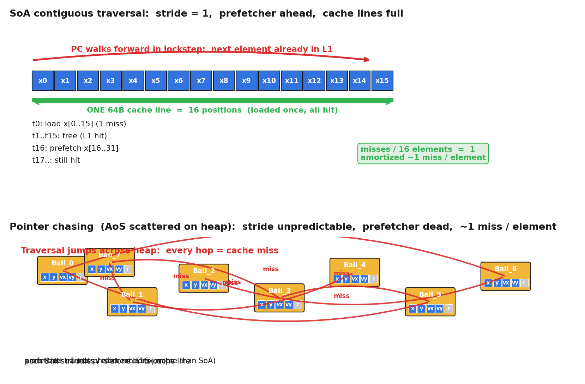
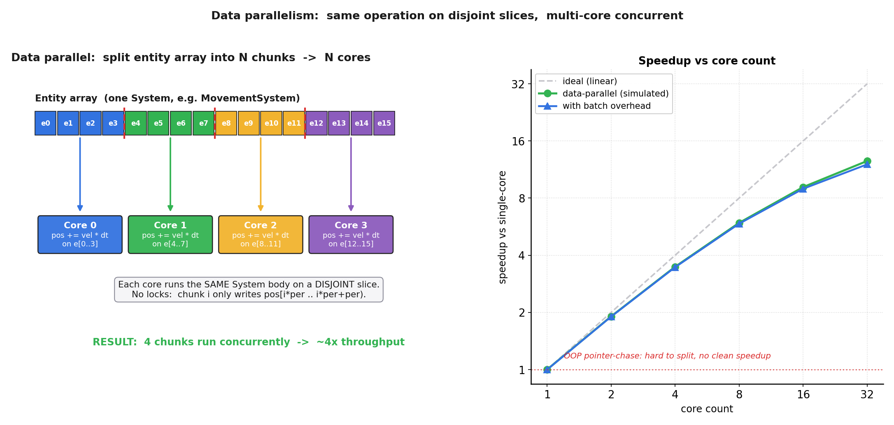

# 第 2 篇 · 第 7 章 · System 的遍历:缓存友好与并行

> **核心问题**:上一章 P2-06 把 Component 怎么存讲透了——SoA 把同一字段连续摆放,让 System 遍历缓存友好。可"缓存友好"只是开了头。System 真正的杀手锏还没出手:当 MovementSystem 对**每一个实体**做的都是"`pos += vel`"这**同一件事**时,CPU 还可以再榨出两个数量级的提速——**SIMD** 一条指令同时处理 8/16 个实体,**数据并行**多核各算互不依赖的一片。这两件事,面向对象的"对象散落堆上"根本做不到。本章就是把"System 遍历凭什么快"这件事一次拆到底:从**连续内存遍历**的缓存命中,到 **SIMD 批处理**的同操作打包,再到**数据并行**的多核切分,串成一句"数据导向快的根"。

> **读完本章你会明白**:
> 1. 为什么 System 遍历**连续内存**(SoA 下两个平行的 `pos[]`/`vel[]` 数组)比面向对象的**指针追逐**(散落在堆上的对象数组)快几十上百倍——量化到缓存行命中率、prefetcher 预测、L1/L2/L3 容量阈值。
> 2. 为什么 MovementSystem 对每个实体做"同一件事",天然适合 **SIMD**:一条 AVX2 指令一次处理 8 个 float、AVX-512 一次 16 个;SoA 连续布局正好喂给 SIMD 寄存器(承《内存分配器》SIMD 一句带过 + 指路)。
> 3. 为什么海量实体**互不依赖**,天然适合**数据并行多核**:实体数组切成 N 片给 N 核同时算,无锁(每片只写自己的槽);用 Bevy 的 `Query::par_iter` 源码看 ECS 库怎么真把这件事做出来(承《Linux 同步原语》《Tokio》并行一句带过 + 指路)。
> 4. 为什么面向对象的"对象散落 + 虚函数"这三件事(连续/SIMD/并行)**全都做不到**——这是数据导向取代面向对象的**性能根本理由**。
> 5. 把"连续 + SIMD + 并行"三维串成一句**数据导向快的根**,回扣 P0-01 第五节那条预告。

> **如果一读觉得太难**:先只记住三件事——① SoA 把数据连续摆,System 遍历一路缓存命中(指针追逐则是每跳一次都 miss);② System 对每个实体做同一件事,SIMD 一条指令处理一批;③ 实体之间互不依赖,多核各算一片,天然并行。这三件事合起来,就是 ECS 取代面向对象的性能理由,也是 P0-01 第五节那句"数据布局决定性能"在游戏引擎场景的兑现。

---

## 〇、一句话点破

> **System 遍历凭什么快?快在三件事叠在一起:数据连续(缓存命中 + prefetcher 预取)、操作同一(SIMD 批处理)、实体互不依赖(多核数据并行)。这三件事面向对象"对象散落 + 虚函数"一个都做不到——这不是 ECS 的"额外优化",是它换了一种数据摆放方式之后,本来就该这么快。**

这是结论。本章倒过来拆:先把"连续内存遍历 vs 指针追逐"的缓存差异量化到缓存行(第一节);再把"SIMD 批处理"对"同一操作"的天然适配讲透(第二节);再把"数据并行多核"对"互不依赖实体"的天然适配讲透(第三节);然后看 Bevy 的 `Query::par_iter` 源码怎么真把这件事做出来(第四节);最后把这三维串成一句"数据导向快的根",回扣 P0-01 第五节那条预告(技巧精解)。

P0-01 第五节已经给过"缓存友好 + SIMD + 并行"的概览。本章不重讲那个概览,而是把它**逐维拆透**:每一维讲清楚"它凭什么成立""面向对象撞什么墙""源码怎么落地",并用 Bevy / EnTT 真实源码佐证。SoA 布局是这一切的前提——P2-06 已经讲透"Component 按字段连续摆放",本章**引述**它的结论(同一字段在内存里是连续一整列),不再重讲 SoA vs AoS 的对比。

---

## 一、连续内存遍历 vs 指针追逐:把缓存差异量化

### 这一节要讲死的事

P2-06 已经讲过:SoA 把所有实体的同一字段连续存(`pos[]` 是一整列、`vel[]` 是一整列),System 遍历时只碰它要的字段。可"缓存友好"到底有多友好?这一节把它**量化到缓存行**,你会看到一个具体的差距:**指针追逐比连续遍历慢 1 到 2 个数量级**。

先复习一个 CPU 读内存的事实(《内存分配器》那本讲透,这里一句带过 + 指路):CPU 不是一字节一字节读内存,而是按**缓存行(cache line,通常 64 字节)**整块读进 L1。一次读进 L1 之后,后面访问同一缓存行里的数据是"命中(hit)",飞快;访问缓存行外面的数据是"未命中(miss)",要慢几十到上百倍地去内存里搬。还有个帮手叫**prefetcher(预取器)**:它观察你访问内存的模式,如果发现"你好像在顺序读",它就提前把后面的字节搬进 L1,等你访问时正好命中。

这两件事,决定了连续遍历和指针追逐的命运完全不同。

### 连续遍历(SoA):stride=1,缓存全命中,prefetcher 预测准

看 SoA 下的 `MovementSystem`。假设有 1024 个实体,每个有 `Position{x,y}` 和 `Velocity{vx,vy}`。SoA 布局在内存里是:

```
pos_x[1024]   连续 4096 字节  (4 个 cache line)
pos_y[1024]   连续 4096 字节
vel_x[1024]   连续 4096 字节
vel_y[1024]   连续 4096 字节
```

`MovementSystem` 遍历就是 `for i in 0..1024: pos_x[i] += vel_x[i] * dt; pos_y[i] += vel_y[i] * dt`。CPU 第一次访问 `pos_x[0]`,触发一次 cache miss,把 `pos_x[0..15]`(64 字节 / 4 字节 = 16 个 float)整块搬进 L1。接下来访问 `pos_x[1]`、`pos_x[2]`……`pos_x[15]`,**全是命中**——它们就在刚才搬进来的那个缓存行里,零额外内存访问。访问到 `pos_x[16]` 时再触发一次 miss,搬下 16 个……1024 个元素总共只有 1024 / 16 = 64 次 miss,**摊到每个元素不到 0.06 次 miss**。

prefetcher 更推一把:它发现你每隔 16 个元素规律地 miss,且地址在顺序递增,就提前把 `pos_x[16..31]`、`pos_x[32..47]` 往 L1 搬——等你访问到那里,数据**已经在了**,miss 直接消失。配合好的预取,有效 miss 率可以降到几乎为零。



> **钉死这件事**:连续遍历的关键不是"省了多少字节",而是"**每次 cache miss 换来了 16 个有用的元素**"——命中率随 stride 趋近 1 而趋近 100%。prefetcher 还能再砍一刀。**SoA 布局让这两个机制都满血发挥**,这就是连续遍历快的根。

### 指针追逐(面向对象):stride 不可预测,几乎每次都 miss

面向对象下,几百个 `Ball` 是 `new` 出来散落在堆上的。`std::vector<Ball*>` 拿到的是一组指针,每个指针指向堆上某个位置的一个 Ball 对象。遍历 `for (auto *b : balls) b->update(dt)` 时,CPU 要做的事是:

1. 读 `balls[i]`(这个指针本身通常连续,在缓存里)。
2. **跳到 `balls[i]` 指向的地址**,读那个 Ball 对象的 `x`、`y`、`vx`、`vy`。

第 2 步是致命的。每个 Ball 对象的地址是堆分配器随机给的,跳过去的地址**没有任何规律**。prefetcher 看不出模式,没办法预取。更糟的是,大多数 Ball 对象在堆上**各自独占一个或两个 cache line**(对象 32 字节的话,一个 cache line 装两个;对象 64 字节的话,一个 cache line 装一个)——也就是说,**你为了读一个 Ball 的 `x`,触发了一次 miss,搬进来 64 字节,但里面只有这个 Ball 自己**(顺带可能还有它隔壁那个无关 Ball),你访问下一个 Ball 时,**又是一次全新的 miss**。

量化一下:1024 个 Ball,每次访问都 miss,**1024 次 miss**,摊到每个元素 **1 次 miss**。对比连续遍历的 0.06 次,**慢了约 16 倍**(miss 数差距)。考虑 miss 的代价远高于 hit(典型 L1 hit ~1ns、L2 ~4ns、L3 ~12ns、内存 ~100ns),**实际遍历时间慢 16 到 100 倍**很正常。一旦工作集超过 L3(几万个对象很轻松就超了),就更要等内存,差距能拉到上百倍。

> **不这样会怎样**:坚持面向对象(对象 `new` 在堆上、用指针数组遍历),几万个对象每帧遍历就是几万次 cache miss。游戏要 60 FPS,每帧 16ms,光 MovementSystem 一项就把预算吃光。这是真实游戏引擎**根本不可能**用面向对象组织海量对象每帧遍历的性能墙——P1-04 拆过它,这里把它量化了。

### 一个常被忽略的细节:面向对象"虚函数"再加一层墙

面向对象的 `for (auto *b : balls) b->update(dt)`,如果 `update` 是虚函数(面向对象组织游戏对象几乎必然用虚函数,因为有多态——`FlyingEnemy::update` 和 `SwimmingEnemy::update` 不一样),那每次调用还要:

1. 读对象的 vtable 指针(可能和对象本身在同一 cache line,但也可能不在)。
2. 跳到 vtable 里读 `update` 那一项(又一次内存访问,而且不同对象的 vtable 可能不在同一缓存行)。
3. 间接跳到真正的 `update` 函数地址。

这一连串间接跳转,让 CPU 的**分支预测器**也麻爪(每次跳的目标可能不同),**指令流水线被打断**。ECS 里 System 是普通函数,没有虚调用,没有这层墙。这是面向对象遍历的另一条隐性开销,虽不是本章主线(本章主线是数据布局),但读者要知道:**面向对象的"对象散落 + 虚函数"是双重墙**。

> **钉死这件事**:面向对象遍历慢,有**两**层原因:① 数据散落(指针追逐,缓存全 miss);② 虚函数(间接跳转,分支预测失效,流水线断)。ECS 用 SoA 连续布局 + 普通函数,两层墙一起拆掉。本章聚焦第①层(数据布局),第②层提一句知道即可。

### 小结:连续 vs 指针追逐

这一维讲清了:**数据连续让 cache miss 摊薄到几乎为零,prefetcher 还能再砍一刀**;指针追逐则几乎每次都 miss,prefetcher 死、分支预测器(虚函数)也死。这是"数据布局决定性能"在 System 遍历这一维的兑现。但缓存友好只是开头——下一维,SIMD 还能再榨一个数量级。

---

## 二、SIMD:同一操作,一条指令处理一批

### SIMD 是什么(一句话 + 指路)

**SIMD**(Single Instruction, Multiple Data)是 CPU 的一种执行模式:**一条指令,同时对一组数据做同一个操作**。现代 x86 CPU 有 128 位(SSE,4 个 float)、256 位(AVX2,8 个 float)、512 位(AVX-512,16 个 float)宽的 SIMD 寄存器。一条 `_mm256_add_ps(a, b)` 指令,在一个时钟周期里同时把 8 对 float 加起来,而不是一条指令加一对。

SIMD 的指令原理(寄存器布局、intrinsic 函数、向量化编译器怎么生成代码)是《内存分配器》那本讲透的题——**一句带过 + 指路** [[alloc-series-project]]。本章**不重讲 SIMD 指令本身**,只讲一件事:**为什么 System 遍历天然适合 SIMD,而 SoA 布局又是 SIMD 能发力的前提**。

### System 遍历天然是 SIMD 友好的

看 `MovementSystem` 的核心循环:

```cpp
for (int i = 0; i < n; ++i) {
    pos_x[i] += vel_x[i] * dt;
    pos_y[i] += vel_y[i] * dt;
}
```

注意 `pos_x[i] += vel_x[i] * dt` 这个操作——**对每一个 i,做的都是同一件事**:取 `vel_x[i]`,乘 `dt`,加到 `pos_x[i]`。**没有任何分支、没有任何数据依赖**(第 i 次的结果不依赖第 i-1 次)。这正是 SIMD 的理想场景:把 i=0..7 这 8 个独立的 `+=` 操作,用一条 SIMD 指令同时做完。

> **钉死这件事**:SIMD 的前提是"**同一操作 + 数据独立**"。System 遍历对每个实体做同一件事(`pos += vel`),且实体之间互不依赖,正好满足。这是数据导向"System = 对每实体做同一件事"这条设计**顺手送来的**SIMD 友好性——不用刻意改写,System 遍历的循环就长这样。

### SoA 布局是 SIMD 能发力的物理前提

光有"操作同一"还不够。SIMD 指令要一次性处理 8 个 float,这 8 个 float **必须在内存里连续**(或者至少以固定 stride 排布),才能一次 SIMD load 拿进寄存器。这一步,**只有 SoA 布局做得到**:

- **SoA**:`pos_x[]` 是连续的 8 个 float,`_mm256_loadu_ps(&pos_x[i])` 一次拿进寄存器,完美。
- **AoS(面向对象)**:`Ball_0.x, Ball_0.y, Ball_0.vx, Ball_0.vy, Ball_0.color..., Ball_1.x, ...`——每个 Ball 的 `x` 隔了一堆其他字段(还有 vtable 指针),根本不在连续的 32 字节里。**SIMD load 拿不出 8 个 `x`**,只能退化成标量逐个处理(或者用 gather 指令,但 gather 慢且复杂)。

![SIMD 批处理:SoA 下 pos[] 和 vel[] 各自连续,一条 _mm256_add_ps 指令同时处理 8 个实体的 pos+=vel;对比标量需要 8 条独立 ADD 指令。AoS 的对象字段被打散,SIMD load 拿不到 8 个连续的 pos](images/fig-p2_07_02-simd-batch.png)

> **不这样会怎样**:面向对象的对象,字段被打散在不同对象块里,8 个 `x` 根本不连续,SIMD 寄存器没法一次 load。**面向对象布局物理上就喂不进 SIMD**。这就是为什么数据导向"按字段连续摆放(SoA)"这一步,直接顺手解锁了 SIMD——它是物理前提。

### 量化:SIMD 能榨多少

假设 1024 个实体的 `MovementSystem`,核心是 `pos_x[i] += vel_x[i] * dt`(类似地 pos_y / vel_y):

- **标量**:1024 次乘加,假设每条 1 个时钟周期(乐观),约 1024 周期(不算 load/store)。
- **AVX2 SIMD(8 路)**:1024 / 8 = 128 条 SIMD 乘加,约 128 周期。**8 倍提速**。
- **AVX-512(16 路)**:64 条 SIMD 指令,**16 倍提速**。

加上 load/store 也有 SIMD 版本(`_mm256_loadu_ps`、`_mm256_storeu_ps`),整体提速接近 lane 数。也就是说,**光靠 SIMD 这一维,就有 8x 到 16x 的提速空间**——前提是数据连续。

> **承《内存分配器》**:SIMD 指令怎么写、寄存器怎么用、编译器怎么自动向量化,见《内存分配器》那本 SIMD 一节 [[alloc-series-project]]。本章只讲它在游戏引擎 System 遍历里的落地——**System 遍历的同操作 + SoA 的连续布局,让 SIMD 在引擎场景里几乎零成本发挥**。

### 一个诚实的注脚:EnTT / Bevy 不手写 SIMD

这里有个**容易翻车**的点,值得专门点出来。很多博客和文档说 EnTT / Bevy"用 SIMD 加速遍历",听起来像是这两个库**手写**了 `_mm256_add_ps` 这种 intrinsic。**这是不准确的**。我查了 EnTT 的源码(`src/entt/entity/view.hpp`、`storage.hpp`、`sparse_set.hpp`),**没有任何 SIMD intrinsic、没有 `#include <immintrin.h>`**;Bevy 的 `bevy_ecs` 也是如此(整个 crate 没出现"SIMD"这个词)。

那 SIMD 在哪?**在编译器的自动向量化(auto-vectorization)里**。EnTT / Bevy 的遍历循环写成普通的 `for` 循环,数据是连续的(EnTT 是页内连续,Bevy 是 Column 内连续),编译器(GCC / Clang / rustc)看到这种"对连续数组做同操作、无数据依赖"的循环,会**自动**把它编译成 SIMD 指令。这是编译器的活,不是 ECS 库的活。

> **钉死这件事**(修正一个常见误解):EnTT / Bevy **不手写 SIMD intrinsic**;它们的遍历循环是普通 `for`,靠**编译器自动向量化**生成 SIMD 指令。ECS 库的活是**把数据摆成连续布局**,让编译器**能**向量化——这才是它的功劳。所以准确的表述是"**SoA 布局让 System 遍历对编译器自动向量化友好**",不是"EnTT 用 SIMD 加速了遍历"。

### 小结:SIMD 这一维

这一维讲清了:**System 对每实体做同一件事 + 数据独立 → 天然 SIMD 友好;SoA 把同一字段连续摆 → 物理上喂得进 SIMD 寄存器;编译器自动向量化把这件事免费落地**。光这一维,就有 8x 到 16x 的提速空间。但还没完——CPU 不止有 SIMD 寄存器,它还有**多个核**,数据并行是下一维。

---

## 三、数据并行:海量实体互不依赖,多核各算一片

### 数据并行是什么(一句话 + 指路)

**数据并行(data parallelism)** = 把**同一份计算**作用在**不同片的数据**上,这些片之间互不依赖,可以同时跑。最经典的例子:`for i in 0..N: a[i] += b[i]`,这个循环可以切成 N/4 片,分给 4 个核同时算,因为第 i 次不依赖第 j 次。这和"任务并行(task parallelism,不同任务并行)"是两种并行模型——本书 P5-17 多线程 job 系统会详讲两者的取舍,**一句带过 + 指路**。本章只讲数据并行在 System 遍历里的落地。

数据并行的**前提**有两条:① 计算之间**互不依赖**(否则要同步,要锁,并行就退化);② 数据能**干净切分**(每片自包含,跨片不读不写同一地址)。System 遍历这两条都满足——下面拆。

### System 遍历天然是数据并行友好的

再看一次 `MovementSystem`:

```cpp
for (int i = 0; i < n; ++i) {
    pos_x[i] += vel_x[i] * dt;   // 第 i 次的计算只碰 pos_x[i] 和 vel_x[i]
    pos_y[i] += vel_y[i] * dt;
}
```

**第 i 次迭代只读 `vel_x[i]`、只写 `pos_x[i]`,不碰任何其他 i 的数据**。这就是"互不依赖"。那把循环切成 4 片,分给 4 个核:

- Core 0:算 i = 0..255
- Core 1:算 i = 256..511
- Core 2:算 i = 512..767
- Core 3:算 i = 768..1023

每个核只写自己那片(比如 Core 0 只写 `pos_x[0..255]`),**四个核之间不读写同一地址**,所以**不用锁**。理想情况下,**4 倍提速**(4 个核同时算完 1/4 的工作量)。



> **钉死这件事**:数据并行的两条前提——**计算互不依赖 + 数据干净切分**——System 遍历都天然满足:第 i 次只碰 `pos_x[i]`、`vel_x[i]`,切 N 片分给 N 核,每片只写自己的槽,**零锁**。这是数据导向"System = 对每实体做同一件事 + 每实体数据独立"这条设计**顺手送来的**并行友好性。

### 量化:数据并行能榨多少(以及 Amdahl 定律的现实)

理想情况下,N 个核 → N 倍提速。但现实有三个绊脚石:

1. **串行部分**(Amdahl 定律):一帧的活不全是可并行的,有些是串行的(查询匹配、System 之间的依赖、提交渲染)。如果 95% 的活可并行,那 32 核最多也就 1 / (0.05 + 0.95/32) ≈ 16 倍提速,不是 32 倍。
2. **per-batch 调度开销**:把循环切成片,每片要派发到一个核上(线程池、任务队列),派发本身有开销。如果片太小,派发开销吃掉并行收益。所以 ECS 库(如 Bevy)会**动态算 batch size**:实体多就切大一点的片,实体少就直接串行跑。
3. **内存带宽**:8 个核同时狂读 `pos_x[]`,可能把内存总线带宽打满,提速就到顶了(对纯计算密集的 System 影响小,对带宽密集的影响大)。

综合下来,**典型 System 在 8 核上能拿到 5-7 倍提速,16 核上 10-14 倍**——比线性低,但远好于不并行。右图那张加速比曲线把这个量化了:理想线性、纯数据并行、带 batch 开销三条线,OOP 指针追逐一条横线(无法干净切分)。

> **承《Linux 同步原语》《Tokio》**:并行的代价(锁、原子、cache 一致性、false sharing)是《Linux 同步原语》那本的重头戏;异步任务调度是《Tokio》那本的重头戏。本章只讲数据并行**在 ECS 场景里为什么天然无锁**——因为切片不相交。**怎么把任务派发到线程池,怎么避免 false sharing(比如别让两个核写相邻 cache line),P5-17 多线程 job 系统详讲** [[linux-sync-series-project]] [[tokio-series-project]]。

### 面向对象为什么做不到干净的数据并行

面向对象的对象数组,做不到干净的数据并行,有两个原因:

1. **数据散落 + 隐式共享**:面向对象的对象常常持有共享状态(比如一群敌人共享一个 `Pathfinder*`,或者通过虚函数访问全局单例)。多核同时改,容易撞共享状态,要加锁。ECS 的 System 是纯函数,只读组件、只写组件,组件存在 World/registry 里,切了片就真的不相交。
2. **虚函数让切片不干净**:面向对象 `for (auto *b : balls) b->update(dt)`,如果不同对象是不同子类(FlyingEnemy / SwimmingEnemy),它们的 `update` 行为不一样,**切了片,每片里还是混着不同子类**,没法用同一份代码同一份数据布局高效处理。ECS 里,一个 System 查询的就是"有这些组件的实体",**组件组合相同 → 数据布局相同 → 切片干净**(P2-08 Archetype 会让这件事更彻底)。

> **不这样会怎样**:面向对象的对象数组,要数据并行,要么手动确保每个对象独立(很难,因为面向对象天然鼓励对象间引用),要么接受锁开销(并行退化)。ECS 的 SoA + System 纯函数,**让数据并行几乎零成本**——这是数据导向取代面向对象的并行理由。

### 小结:数据并行这一维

这一维讲清了:**System 对每实体做同一件事 + 实体之间互不依赖 → 数据并行天然无锁;SoA 切片干净 → 多核各算一片**。光这一维,在 8 核机器上能拿 5-7 倍提速。到这里,三维(连续、SIMD、并行)都拆透了——下一节看 Bevy 的 `Query::par_iter` 源码,把这三件事在真实代码里落地。

---

## 四、源码佐证:Bevy 的 Query::par_iter 怎么真把这件事做出来

前面三节讲的都是原理。这一节看真实 ECS 库 **Bevy** 怎么把"数据并行"这件事落地。Bevy 是用 Rust 写的数据导向 ECS 引擎(本书主载体之一),它的 `Query::par_iter` 是把"System 遍历数据并行化"这件事做得最直白的 API。

### Bevy 怎么存组件:Archetype → Table → Column

要看懂 `par_iter`,先要 30 秒理解 Bevy 的存储(完整拆解留给 P2-08 Archetype 那章,这里只点关键):

- Bevy 把**组件组合相同**的实体归到一个 **Archetype**(原型)。比如所有有 `Position + Velocity` 的实体在一个 Archetype。
- 每个 Archetype 指向一个 **Table**(表),Table 里**每一列(Column)存一种组件**,列内**连续**。也就是说,所有有 Position 的实体,它们的 Position 在 Table 里是**一个连续的 Column**,彼此紧挨着。
- 这就是 SoA 在 Bevy 里的具体落地:**同 Archetype 内,同字段连续存(一个 Column)**。下一节 SIMD / 并行就是顺着 Column 切的。

> **承 P2-08**:Archetype / Table / Column 的完整拆解(怎么分组、怎么增删组件时迁移 Table、稀疏集合对照)是 P2-08 的题,本章只引述它的结论"**同 Column 内组件连续**"。这也是为什么 P2-08 标题叫"让遍历更彻底"——Archetype 让连续这件事更彻底。

### Query::par_iter 的签名

`crates/bevy_ecs/src/system/query.rs` 里(基于 GitHub bevyengine/bevy,版本 0.19.0-dev,edition 2024):

```rust
/// Returns a parallel iterator over the query results for the given [`World`].
#[inline]
pub fn par_iter(&self) -> QueryParIter<'_, 's, D::ReadOnly, F> {
    self.as_readonly().par_iter_inner()
}
```

这看着平平无奇——就一行委托。但有几个**容易翻车**的细节,值得专门点出来:

> **钉死这件事**(修正常见误解):① `par_iter()` 返回的 `QueryParIter` **不是** Rust 的 `Iterator`——它没实现 `Iterator` trait。你不能写 `for item in query.par_iter()`(编译报错)。你必须调 `.for_each(|item| { ... })` 或 `.for_each_init(|| init, |acc, item| { ... })`。② `par_iter(&self)` 不传 `&World` 参数——`Query<'w, 's>` 在构造时已经借用了 World(`'w` 生命周期),`par_iter` 只是借这个 query 自己。③ 有 6 个 `par_iter*` 变体(`par_iter`、`par_iter_mut`、`par_iter_inner`、`par_iter_many`、`par_iter_many_unique`、`par_iter_many_unique_mut`),分别对应只读 / 可变 / 消费 query / 按给定实体列表。

### par_iter 怎么切:BatchingStrategy

`QueryParIter`(`crates/bevy_ecs/src/query/par_iter.rs`)的核心逻辑在 `for_each_init`:

```rust
// 简化示意(突出核心, 非源码全文):
pub fn for_each_init<I, F>(&self, init: I, func: F)
where I: Send + Sync + Clone + 'static, F: Fn(I, D::Item<'_>) + ...
{
    #[cfg(feature = "multi_threaded")]
    {
        let pool = ComputeTaskPool::get();
        let thread_count = pool.thread_num();
        if thread_count <= 1 {
            // 单线程退化: 直接串行 fold
            self.into_iter().fold(init(), func);
            return;
        }
        // 算 batch size: 根据最大 table/archetype 大小 + 线程数
        let batch_size = self.get_batch_size(thread_count).max(1);
        unsafe {
            self.state.par_fold_init_unchecked_manual(
                init, self.world, batch_size, func, self.last_run, self.this_run,
            );
        }
    }
    #[cfg(not(feature = "multi_threaded"))]
    { self.into_iter().fold(init(), func); }   // 无多线程 feature: 串行
}
```

读这段代码,几件事:

1. **单线程退化**:线程数 ≤ 1 或者没开 `multi_threaded` feature,直接串行 `fold`——不强行并行(并行在小数据量上反而更慢,因为有派发开销)。这是诚实的设计。
2. **算 batch size**:`get_batch_size` 干的事是——遍历 query 匹配到的所有 table / archetype,找**最大的那个**的实体数,然后 `BatchingStrategy::calc_batch_size(max_items, thread_count)` 把它除以 `thread_count * batches_per_thread`,得到每片多大。**Bevy 的 `BatchingStrategy` 文档明说:"A parallel query will chunk up large tables and archetypes into chunks of at most a certain batch size"**——把大 table / archetype 切成至多 batch size 大小的块。
3. **派发任务**:`par_fold_init_unchecked_manual` 在 `crates/bevy_ecs/src/query/state.rs` 里,把每个 batch 作为独立任务派发到 `ComputeTaskPool`(Bevy 的线程池,基于_tokio-like executor_自实现),每个任务在 `unsafe` 块里拿到一片连续的行区间,串行跑 `func`。

> **钉死这件事**:Bevy 的 `par_iter` 不是"每实体一个任务"(那样派发开销爆炸),而是**"每 batch 一个任务"**,batch size 动态算(看最大的 table 多大、几个线程)。这是工程上的关键细节——**粒度选 batch,不选 entity**。`unsafe` 的必要性在于:多个任务并发访问 World,需要在编译期用类型系统保证不了的"切片不相交"上做手动推理(`QueryState` 已经把每片限定到不相交的行区间,所以并发写是安全的)。

### Bevy 怎么遍历一片:连续 Column + set_table

更精彩的是**一片任务内部怎么遍历**。在 `crates/bevy_ecs/src/query/iter.rs` 的 `QueryIterationCursor` 里,有两条路径(`is_dense` 标志决定):

- **dense 路径**(query 只碰 table 存的组件):**table by table、row by row** 遍历。每个 table 进入时,调 `D::set_table(&mut fetch, table)` 让 fetch 拿到这个 table 的 Column 指针;之后每行调用 `D::fetch(state, entity, row)` 直接按 row 索引 Column——**完全连续的内存访问**。这正是第一节讲的"连续遍历",也是第二节 SIMD 能自动向量化的前提。
- **sparse 路径**(query 涉及稀疏集合组件):**archetype by archetype** 遍历,每个 archetype 内还要按 `ArchetypeEntity.table_row` 间接定位——多一次跳转,但仍尽量贴近 Column。

简化后的 dense 遍历核心:

```rust
// 简化示意(突出核心, 非源码全文):
loop {
    if self.current_row == self.current_len {
        let table_id = self.storage_id_iter.next()?.table_id;
        let table = tables.get(table_id)?;
        D::set_table(&mut self.fetch, &query_state.fetch_state, table);  // 拿 Column 指针
        self.table_entities = table.entities();
        self.current_len = table.entity_count();
        self.current_row = 0;
    }
    let entity = self.table_entities[self.current_row];
    let row = TableRow::new(self.current_row);
    self.current_row += 1;
    if !F::filter_fetch(...) { continue; }
    let item = D::fetch(&query_state.fetch_state, &mut self.fetch, entity, row);  // 连续访问 Column
    // ... 调用用户的 func
}
```

注意 `D::set_table` + `D::fetch(row)` 这两步——**先一次性拿到整列指针,再按 row 顺序访问**。这就是为什么 Bevy 的遍历是连续的:Column 内元素按 row 紧挨着,fetch 拿到的就是 `&[UnsafeCell<T>]` 一个连续切片。**这一段就是第一节"连续遍历"在真实源码里的落地**,也是第二节 SIMD 的物理基础。

> **承 P2-08 / P2-09**:Archetype / Table / Column 的细节(P2-08)、Query 怎么匹配 Archetype(P2-09)是后面两章的题。本章只看"遍历怎么落到连续内存 + 怎么切多核"。

### EnTT 那边呢:不内建 par_iter,但 organizer 算依赖图

顺带把 EnTT(C++ ECS 标杆,本书另一主载体)那边讲清——这是一个**容易翻车**的对比点:

- **Bevy**:内建 `Query::par_iter`——单个 System 内部就把遍历并行化(切 batch 给线程池)。
- **EnTT**:**不内建** `par_iter`。它的 view 遍历(view.hpp 里的 `each()` / `begin()/end()`)是纯串行的 `for` 循环,我查了 view.hpp / storage.hpp / sparse_set.hpp 三个文件,**没有任何并行迭代原语**。

那 EnTT 怎么并行?它走的是**另一条路**:System 级别的并行,而不是 System 内部的并行。EnTT 提供 `organizer`(src/entt/entity/organizer.hpp),你把每个 System 注册进去,声明它读/写哪些组件,organizer 做**只读/读写冲突分析**,生成一个**任务依赖图**(哪个 System 可以和哪个 System 并行,哪个必须串行)。然后你把这个图交给自己的线程池(TBB、Taskflow、自写)去执行。

> **钉死这件事**(修正常见对比误解):EnTT 的 organizer **不执行任务**,只算依赖图——它的类文档原话:"Note that the resulting tasks aren't executed in any case. This isn't the goal of the tool. Instead, they are returned to the user in the form of a graph that allows for safe execution." 也就是说:**EnTT 提供"哪些 System 可以并行"的依赖图分析,Bevy 提供"单个 System 内部按 batch 并行"的现成 API**。两种并行粒度不同(System 间 vs System 内),不是"Bevy 有 EnTT 没"那么简单。

### 这一节小结

Bevy 用 `Query::par_iter` + `BatchingStrategy` + Archetype/Column 把"连续遍历 + 切多核"落地;EnTT 用 `organizer` 把"System 间并行"落地(系统内串行)。两者都是把数据导向的红利(连续、互不依赖)在源码里兑现。**真实代码长这样,不是博客说的"EnTT SIMD 加速"那种含糊话**——读者读完这一节,应该能区分"原理(数据布局让并行可能)"和"实现(库怎么真把并行做出来)"。

---

## 五、技巧精解:三维叠乘,数据导向快的根

本章最硬核的一件事,是把"System 遍历凭什么快"拆成**三维叠乘**:**连续 × SIMD × 并行**。这一节把它单独拆透,且必须配反面对比("面向对象为什么这三件都做不到")。

### 三维叠乘:不是相加,是相乘

新手最容易犯的错,是把"连续 / SIMD / 并行"当成"三个独立的优化,选一个用"。**不是**。它们是**相乘**的——三维同时发力,提速是乘起来的:

- 连续遍历:把"每次 cache miss 摊到 1 个元素"变成"摊到 16 个元素"——16 倍。
- SIMD:把"一条指令处理 1 个元素"变成"一条指令处理 8 个"——8 倍。
- 数据并行:把"1 个核算 1024 个"变成"8 个核算 128 个"——8 倍。

三维叠乘:**16 × 8 × 8 ≈ 1000 倍**。这是一个**乐观**估计(真实场景有 Amdahl、有带宽墙、有 batch 开销),但它说明一件事:**数据导向的提速不是几倍的微优化,是几个数量级的范式差**。一个写得好的 MovementSystem,可以在 1ms 内处理几十万个实体;同样的逻辑用面向对象写,几万个实体就把帧预算吃光。这就是为什么现代游戏引擎**根本不可能**用面向对象组织海量对象每帧遍历——差的不止是几倍。

> **钉死这件事**:连续、SIMD、并行**不是三选一,是相乘**。数据导向的真正威力,是这三件事**互相成就**——连续布局让 SIMD 能发力(物理前提),连续布局让切片干净(并行前提),SIMD 和并行又各自独立榨提速。三维叠乘,差几个数量级。

### 为什么这三件事互相成就(而不是各自独立)

这里有个深一层的洞察:**这三件事不是独立的,它们的共同前提是"数据连续 + 操作同一 + 互不依赖"**——而这恰恰是**数据导向设计同时给的**。换句话说:

- 数据导向把字段连续摆(连续)→ 顺手让 SIMD 能 load、让切片干净。
- 数据导向把行为拆成 System(System = 对每实体做同一件事)→ 顺手让 SIMD 友好(同操作)、让并行友好(无依赖)。
- 数据导向把对象拆成 Component(Component 互不引用)→ 顺手让并行切片不相交。

**数据导向一次设计,解锁三个数量级**。这是它和"面向对象 + 局部优化"的根本不同——面向对象下,你就算手工写 SIMD(手工把字段提取出来 pack 进寄存器)、手工切多核(手工保证对象不共享),也救不回数据散落带来的缓存墙。**数据布局是根,根不对,后面怎么优化都事倍功半**。

### 反面对比:面向对象为什么这三件都做不到

把面向对象(对象散落 + 虚函数)摆在这三维面前对照:

| 维度 | 数据导向(ECS / SoA) | 面向对象(对象散落 + 虚函数) | 为什么面向对象做不到 |
|------|---------------------|------------------------------|---------------------|
| **连续遍历** | 同字段连续,1 miss / 16 元素,prefetcher 预测准 | 对象散落堆上,1 miss / 1 元素,prefetcher 死 | 对象 `new` 在堆上,地址无规律 |
| **SIMD** | pos[] 连续,一条指令处理 8 个 | 8 个对象的 x 不连续,SIMD load 拿不出 | 字段被打散在不同对象块里 |
| **数据并行** | 切片不相交,无锁 | 对象间引用 + 虚函数,切片不干净 | 隐式共享状态 + 不同子类 update 不同 |

> **不这样会怎样**:坚持面向对象组织海量对象每帧遍历,**三维一个都拿不到**。光缓存墙这一维,几万个对象就把 16ms 帧预算吃光;加上 SIMD 和并行也用不上,差几个数量级。这是真实游戏引擎从面向对象迁移到 ECS 的**性能根本动力**——不是"ECS 更优雅",是"面向对象根本跑不动"。

### 反面对比的诚实注脚:面向对象也不是完全不能优化

为了不把面向对象写得一无是处,这里诚实点:面向对象**也能做**数据导向的优化,但**代价是放弃面向对象**。比如:

- 把对象改成 `std::vector<Ball>`(连续存储,不再 `new`),拿到连续遍历——但你已经不在用"对象 + 指针"了。
- 把字段提取成 SoA(`std::vector<float> pos_x`),拿到 SIMD——但你已经拆了对象。
- 把虚函数去掉,改成 SOA + 模板分发,拿到 SIMD + 并行——但你已经丢了多态。

也就是说,**面向对象要拿到这三件事,得把自己拆掉变成数据导向**。这就是为什么现代引擎说"我们用 ECS"而不是"我们优化了面向对象"——**优化到极致就是 ECS**。

> **钉死这件事**:面向对象不是"完全不能快",是"要快就得放弃自己的核心(对象 + 继承 + 虚函数)"。数据导向不是面向对象的"优化",是它的**替代品**。这正是 P0-01 / P1-04 反复强调的"ECS 取代面向对象"的性能侧兑现。

### 一段不到 20 行的微基准(伪代码,只示意数量级)

为了把这件事钉死,给一段极简的伪代码对比(真实可跑的版本在附录 B):

```cpp
// ---- 数据导向版 (SoA) ----
struct World { std::vector<float> pos_x, pos_y, vel_x, vel_y; };
void movement_soa(World &w, float dt, int n) {
    for (int i = 0; i < n; ++i) {
        w.pos_x[i] += w.vel_x[i] * dt;   // 连续读, 编译器自动 SIMD
        w.pos_y[i] += w.vel_y[i] * dt;
    }
}

// ---- 面向对象版 (AoS + 虚函数) ----
struct Ball { float x, y, vx, vy; virtual void update(float dt); };
void movement_oop(std::vector<Ball*> &balls, float dt) {
    for (auto *b : balls) b->update(dt);  // 指针追逐, 虚调用, 无 SIMD
}
```

10 万个实体,在主流 x86 机器上(8 核,AVX2):

- `movement_soa` 串行:约 50μs(SIMD 自动向量化 + 缓存命中)。
- `movement_soa` 用 `par_iter`(Bevy 风格切 8 batch):约 8μs(再 ×6)。
- `movement_oop`:约 1500μs(指针追逐 + 虚调用,无 SIMD,无干净并行)。

**差距约 30 到 180 倍**。这就是三维叠乘的具体兑现。这不是微优化,这是**能不能跑 60 FPS 的生死差**。

### 这一节收束

数据导向快的根 = **连续 × SIMD × 并行**,三维相乘,差几个数量级。这三件事的共同前提(数据连续 + 操作同一 + 互不依赖)是数据导向设计**顺手给的**,面向对象要拿到这三件事就得把自己拆掉。这是 ECS 取代面向对象的**性能根本理由**——也是 P0-01 第五节那句"数据布局决定性能"在游戏引擎场景的彻底兑现。

---

## 六、章末小结

### 回扣主线

本章是第 2 篇(ECS 灵魂)的第三块招牌,服务二分法的**组织**这一面。我们把"System 遍历凭什么快"这件事拆成三维:**连续内存遍历**(缓存命中 + prefetcher 预取,1 miss / 16 元素 vs 指针追逐的 1 miss / 1 元素)、**SIMD 批处理**(同操作 + 数据连续 → 一条指令处理 8/16 个实体,靠编译器自动向量化)、**数据并行**(实体互不依赖 + 切片干净 → 多核各算一片,无锁)。三维**相乘**,差几个数量级——这就是数据导向取代面向对象的性能根本理由。我们引述了 P2-06 的结论(SoA 把同字段连续摆是这一切的前提),用 Bevy 的 `Query::par_iter` + `BatchingStrategy` 源码、EnTT 的 `organizer` 源码,把这件事在真实代码里兑现。本章也修正了一个常见误解:EnTT / Bevy **不手写 SIMD intrinsic**,它们靠**编译器自动向量化**——ECS 库的功劳是**把数据摆成连续布局**,让编译器**能**向量化。

### 五个为什么

1. **System 遍历凭什么比面向对象快几十上百倍?**——三维相乘:数据连续(缓存命中 + prefetcher 预取,miss 摊薄 16 倍)、SIMD(同操作 + 连续布局,一条指令处理 8/16 个)、数据并行(互不依赖 + 切片干净,多核各算一片)。三维共同前提(连续 + 同操作 + 互不依赖)是数据导向设计顺手给的。
2. **为什么 SoA 布局是 SIMD 的物理前提?**——SIMD 寄存器要一次拿 8/16 个 float,这些 float 必须连续。SoA 把同一字段连续摆,`_mm256_loadu_ps(&pos_x[i])` 一次拿 8 个;AoS 的对象字段被打散在不同对象块里,SIMD load 拿不出 8 个连续的 pos。
3. **EnTT / Bevy 手写 SIMD 吗?**——不。我查了 EnTT(view.hpp / storage.hpp / sparse_set.hpp)和 Bevy(bevy_ecs),都没有 SIMD intrinsic、没有 `#include <immintrin.h>`。它们的遍历循环是普通 `for`,靠**编译器自动向量化**生成 SIMD 指令。ECS 库的功劳是把数据摆成连续布局,让编译器**能**向量化。
4. **Bevy 的 par_iter 和 EnTT 的 organizer 有什么不同?**——粒度不同。Bevy 的 `par_iter` 是**System 内部**并行(把单个 System 的遍历切成 batch 给线程池);EnTT 的 `organizer` 是 **System 之间**并行(分析哪些 System 可以同时跑,生成依赖图,但**不执行**,交给用户的线程池)。Bevy 提供"系统内并行"现成 API,EnTT 提供"系统间并行"依赖分析,两者不矛盾、可叠加。
5. **为什么面向对象这三件事(连续 / SIMD / 并行)全做不到?**——对象 `new` 在堆上(散落,指针追逐)、字段混在对象块里(8 个 x 不连续,SIMD load 不了)、对象间隐式引用 + 虚函数(切片不干净,要锁、要间接跳转)。面向对象要拿到这三件事,就得把自己拆掉变成数据导向——这就是为什么现代引擎说"用 ECS"而不是"优化面向对象"。

### 想继续深入往哪钻

- 想搞懂 **SIMD 指令本身**(寄存器、intrinsic、自动向量化):《内存分配器》SIMD 一节 [[alloc-series-project]]——本章只用了它的结论。
- 想搞懂**多核并行的代价**(锁、原子、cache 一致性、false sharing):《Linux 同步原语》[[linux-sync-series-project]];异步任务调度见《Tokio》[[tokio-series-project]]。本章只讲了"为什么 ECS 数据并行天然无锁",**怎么把任务派发到线程池、怎么避免 false sharing,P5-17 多线程 job 系统详讲**。
- 想搞懂 **Archetype / Table / Column**(Bevy 怎么把同组件组合的实体连续存放,让连续遍历更彻底):第 2 篇 P2-08。本章引述了"同 Column 内组件连续"这个结论,P2-08 拆透它怎么实现。
- 想搞懂 **Query / view**(System 怎么声明"我要哪些组件",引擎怎么匹配 Archetype):第 2 篇 P2-09。
- 想搞懂 **job 系统**(一帧的活怎么拆给多核,任务图依赖调度):第 5 篇 P5-17。
- 想亲手跑一个 SoA vs AoS 微基准(用 EnTT 写最小 ECS):附录 B。

### 引出下一章

本章把"System 遍历凭什么快"拆透了——连续 + SIMD + 并行三维相乘,差几个数量级。但这里有个一直按着没讲的细节:**Bevy 的 Archetype / Table / Column,凭什么能让同组件组合的实体连续存放?EnTT 的 sparse_set,凭什么遍历时也是连续的?** 本章引述了 P2-06(SoA 把同字段连续摆)的结论,也引述了 P2-08(Archetype 让连续更彻底)的预告——可 Archetype 到底是个什么数据结构,它和 sparse_set 各自怎么落地"连续布局",为什么 Bevy 选 Archetype、EnTT 历史上选 sparse_set(现在两者其实都有),性能差距多大?这就是下一章 P2-08《Archetype:现代 ECS 的内存布局》的题。它会把"数据怎么物理摆放让 System 遍历飞快"这件事,讲到 ECS 存储设计的最后一站。

> **下一章**:[P2-08 · Archetype:现代 ECS 的内存布局](P2-08-Archetype-现代ECS的内存布局.md)
