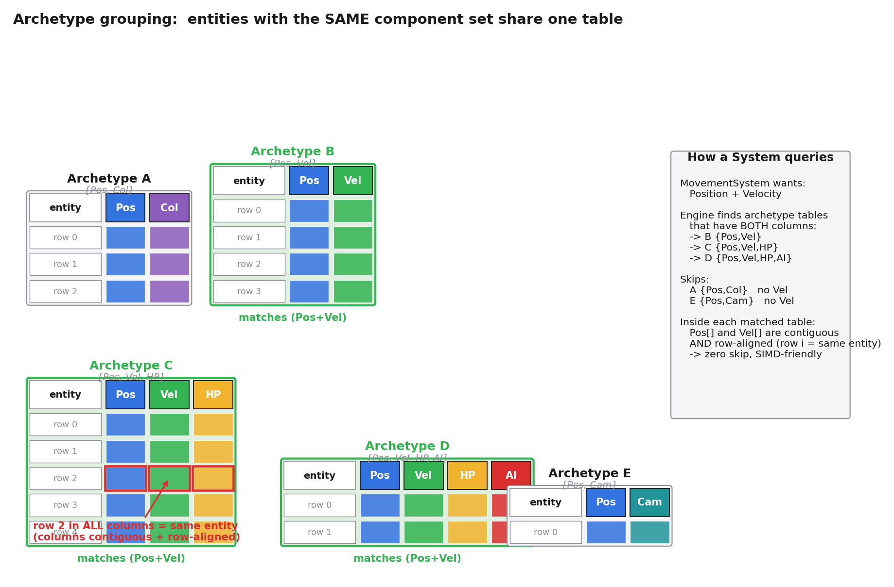
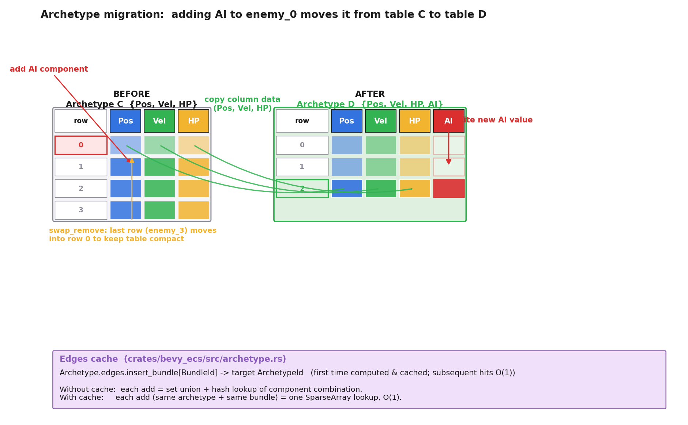
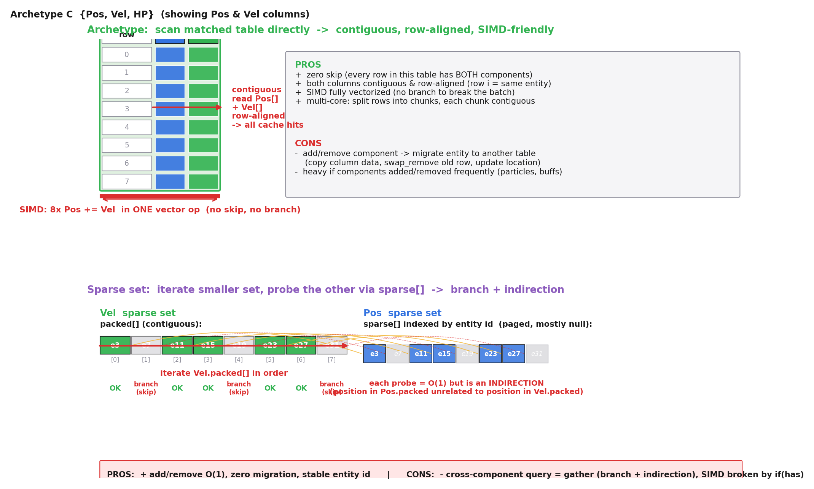

# 第 2 篇 · 第 8 章 · Archetype:现代 ECS 的内存布局

> **核心问题**:前两章(P2-06 SoA、P2-07 遍历)已经讲透了一件事——把所有实体的同一字段连续存成一条数组(SoA),System 遍历就能缓存友好、SIMD 友好、并行友好。可这里藏着一个没被回答的硬问题:**你的世界里,实体千差万别**。有的实体是 `Position + Velocity`(飞行的子弹),有的是 `Position + Velocity + Health`(会动的敌人),有的是 `Position + Velocity + Health + AI`(有脑子还会打架的敌人),还有的只是 `Position + Color`(静止的装饰物)。如果"每个组件类型一个大数组、整个世界共享一条 Position 数组",那这条 Position 数组里会混着各种实体——可一个只查 `Position + Health` 的 System,沿着 Health 数组遍历时,会发现数组里有的槽位属于"没有 Health 的实体"(它根本不该被这个 System 看到),遍历要不停跳过。这一跳,缓存和 SIMD 就都散了。本章就要解决这个"组件组合各异,怎么存才能让 System 遍历一路连续"的难题——答案就是 **Archetype(原型分组)**:把"组件组合相同"的实体分到同一组,组内每种组件连续存成一张 table(列=组件类型,行=实体),System 遍历时只扫匹配的 archetype table,全程连续无跳过。这是现代 ECS(Bevy、Unity DOTS、Flecs、EnTT 的 group)的内存布局集大成。

> **读完本章你会明白**:
> 1. 朴素"每组件一个大数组"在世界里组件组合各异时会撞什么墙:跨组件查询要跳过没某组件的实体,缓存和 SIMD 散。
> 2. Archetype 是什么:把"组件组合相同"的实体分到同一组,组内列式 table 存储(列=组件类型,行=实体),查询只扫匹配的 archetype,全程连续。
> 3. Archetype vs 稀疏集合(sparse set):两种范式。archetype 遍历极致快但加/删组件要迁移实体(搬数据);sparse set 加删 O(1) 但跨组件查询要 gather 交集、遍历稍逊。Bevy 选 archetype 为中心,EnTT 默认 sparse set + 可选 group 做 archetype-like。
> 4. Bevy 源码里 Archetype / Table 长什么样(zread 核实):Archetype 不存数据只存元信息(实体到 table_row 的映射 + 组件清单),真正的列式数据在 Table 里(Table 是 `columns: ImmutableSparseSet<ComponentId, Column>`)。★注意:Archetype 和 Table 是两层抽象,多个 archetype 可共享同一个 table——这是 Bevy 设计的一个关键细节,与"每个 archetype 一张表"的朴素印象不同。
> 5. 为什么 Archetype 让 SIMD / 数据并行更彻底:同组合实体连续,无跳过,可放心向量化、可放心按行切分给多核。

> **如果一读觉得太难**:先只记住三件事——① 朴素"每组件一个全局大数组"在组件组合各异时遍历要跳过没某组件的实体,这是问题;② Archetype 把"组件组合相同"的实体分到同一组(一张列式 table),System 遍历只扫匹配的 archetype,全程连续;③ 这个布局遍历飞快,但加/删组件会把实体"搬家"到新 archetype table,加删比 sparse set 慢——两种范式的权衡。

---

## 〇、一句话点破

> **Archetype 把"组件组合完全相同"的实体分到同一组,组内每种组件连续存成一张列式 table(列=组件类型,行=实体)。System 声明"我要 Position + Velocity",引擎只要找出所有同时含这两列的 archetype table,逐张扫过去——每张 table 内部 Position 列和 Velocity 列各自连续,行号对齐,遍历零跳过、零浪费,SIMD 和多核切分都能放心用。代价是:加/删组件会改变实体的"组件组合",得把它的数据从一张 table 搬到另一张(迁移)。这是"遍历极致快 vs 加删要搬数据"的一次典型权衡。**

这是结论。本章倒过来拆:先看清"朴素全局数组"撞的墙,再讲 Archetype 怎么漂亮拆掉它,然后对照 sparse set 另一种范式,最后用 Bevy / EnTT 源码把两种落地钉死。

---

## 一、问题:朴素"每组件一个全局大数组"撞的墙

### 复习:SoA 已经解决了什么

P2-06 讲透了 SoA(Structure of Arrays)。一句话:**别把每个对象的所有字段绑成一整块(AoS),而把所有对象的同一字段拆出来连续存(SoA)**。

```
AoS(面向对象):             SoA(数据导向):
[Ball_0: pos,vel,col,r]     pos[]:  [p0, p1, p2, p3, ...]   ← 连续
[Ball_1: pos,vel,col,r]     vel[]:  [v0, v1, v2, v3, ...]   ← 连续
[Ball_2: pos,vel,col,r]     col[]:  [c0, c1, c2, c3, ...]   ← 连续
                            r[]:    [r0, r1, r2, r3, ...]   ← 连续
```

P2-06 已经讲清:MovementSystem 只要 pos[] 和 vel[] 两条数组,一路连续读,缓存全命中、prefetcher 预测得准、SIMD 一次喂 8 个。这看起来已经完美。

### 但这里有个被藏着的问题:世界不是同质的

P2-06 的小例子有个隐含前提:**世界上所有实体都是"小球"——都有 pos、vel、col、r 四个组件**。所以 pos[] 里第 i 个就是 vel[] 里第 i 个,完全对齐,遍历零浪费。

真实游戏世界不长这样。真实世界里,**实体的组件组合千差万别**。一个游戏里同时存在:

- 静止装饰物(一棵树):`Position + Color`,无 Velocity,无 Health
- 飞行子弹:`Position + Velocity`,无 Health,无 AI
- 普通敌人:`Position + Velocity + Health`
- BOSS:`Position + Velocity + Health + AI`
- UI 元素:`Position + Color + Text`,无 Velocity
- 摄像机:`Position + Camera`,无 Velocity,无 Health

如果还按"每个组件类型一个全局大数组"存,那 **Position 这个全局数组里,会混着上面所有这些实体**——树、子弹、敌人、BOSS、UI、摄像机全挤在一条数组里,因为它们都有 Position。Position 数组长这样:

```
Position[]: [tree_0, bullet_0, enemy_0, boss_0, ui_0, tree_1, enemy_1, ...]
              ↑ 它们都有 Position, 所以全在这条数组里
```

Velocity 数组呢,只有子弹、敌人、BOSS 有:

```
Velocity[]: [bullet_0, enemy_0, boss_0, enemy_1, ...]
              ↑ 没有 tree / ui / camera, 它们没 Velocity
```

注意到了吗?**Position 数组第 0 个是 `tree_0`,可 Velocity 数组第 0 个是 `bullet_0`——两条数组的"第 0 个"指的根本不是同一个实体**。这是因为朴素全局数组里,每种组件的数组只装"有这个组件的实体",它们的下标不再天然对齐。

### 墙来了:MovementSystem 怎么遍历 Position + Velocity

现在 `MovementSystem` 要遍历所有 `Position + Velocity` 的实体。它面对的是两条**下标不对齐**的数组。它怎么知道 Position 数组里的 `bullet_0` 在 Velocity 数组的第几位?它没法直接知道。两种朴素做法:

**朴素做法 A:沿 Position 数组扫,每个实体查"它有没有 Velocity"**。

```python
for entity, pos in position_array:
    if has_velocity(entity):           # 查一下
        vel = velocity_array[index_of(entity)]   # 还要查它在 vel 数组的第几位
        pos += vel * dt
```

问题:① `has_velocity(entity)` 这一步,要查一个映射表(entity → 是否有 Velocity),每次一个分支 + 一次内存访问,缓存友好度立刻掉;② `index_of(entity)` 还要再查一次映射表,拿到 entity 在 Velocity 数组的下标——又一次间接访问;③ 那些**没有 Velocity 的实体(树、UI、摄像机),Position 数组里有它们,但 System 根本不感兴趣,却要为它们走一遍"查映射表 → 发现没有 → 跳过"**,白拉进缓存、白做判断。

> **钉死这件事**:朴素全局数组的根本问题——**数组下标和实体不再对齐**。Position 数组的第 i 个和 Velocity 数组的第 i 个,可能是完全不同的实体。System 想同时拿 Position + Velocity,要么"沿一个数组扫、每个实体查另一个数组有没有"(分支 + 间接访问),要么"算两个集合的交集"(额外开销)。无论哪种,都把 SoA 那条"连续读、SIMD 批量、零浪费"的美妙性质打掉了。组件组合越多样,这面墙越厚。

### 一个数字直觉:跳过浪费有多狠

假设世界里有 10000 个实体,其中:

- 7000 个有 `Position + Color`(静态装饰物、UI)
- 2000 个有 `Position + Velocity + Health`(敌人、子弹)
- 1000 个有 `Position + Camera / Position + Text`(摄像机、UI 文本)

`MovementSystem` 要遍历 Position + Velocity。在朴素全局数组下:

- Position 数组有 10000 项(所有实体都有 Position)。
- 沿它扫,8000 个实体(静态装饰 + UI + 摄像机)System 根本不要,却要为它们做"查 Velocity → 没有 → 跳过"。这 8000 次无用判断 + 可能的间接访问,全在浪费缓存和 CPU。
- 真正要处理的 2000 个,混在这 10000 个里,稀疏分布,SIMD 根本没法批量(`if has_velocity` 这个分支把向量化打断)。

理想情况应该是:**MovementSystem 只扫那 2000 个有 Position + Velocity 的实体,连续、零跳过、SIMD 一把梭**。这"理想情况",正是 Archetype 给的。

### 把两种遍历的伪代码并排看

把朴素全局数组和 Archetype 两种遍历写并排,差距更刺眼。朴素全局数组下,MovementSystem 长这样:

```python
# 朴素全局数组: Position[] 和 Velocity[] 下标不对齐, 必须靠映射表跳转
for i in range(len(position_array)):
    entity = position_array[i].owner         # 拿到这个 Position 属于哪个实体
    if entity not in velocity_index:         # 查映射表: 它有没有 Velocity?
        continue                              # 没 Velocity -> 跳过(浪费了一次循环)
    j = velocity_index[entity]               # 查映射表: 它的 Velocity 在 Velocity[] 第几位?
    position_array[i].x += velocity_array[j].vx * dt   # 间接访问
    position_array[i].y += velocity_array[j].vy * dt
```

注意这里每次循环做了**两次映射表查找**(`velocity_index` 哈希表或稀疏数组),还有**一次条件跳过**。SIMD 在这里完全断流——它没法对"有的实体跳过、有的处理"做向量化。

Archetype 下,同一逻辑长这样:

```python
# Archetype: 只扫匹配的 archetype table, 行号对齐, 零跳过
for archetype in archetypes_matching(Position, Velocity):   # 编译期/缓存期就找到的几个 archetype
    pos_col = archetype.column(Position)                    # 一条连续数组
    vel_col = archetype.column(Velocity)                    # 一条连续数组, 行号和 pos_col 对齐
    n = archetype.len()
    # 下面这个循环可以放心向量化: 无分支, 无间接, 数据连续
    for row in range(n):
        pos_col[row].x += vel_col[row].vx * dt
        pos_col[row].y += vel_col[row].vy * dt
```

差距一目了然:**朴素版每次循环 2 次映射查找 + 1 次条件分支;Archetype 版每次循环就是两个连续数组的对应项相加,零分支、零间接**。前者 SIMD 断流,后者 SIMD 满速。在几万个实体的规模下,这两版的性能差距可以到 5-10 倍。这就是"布局粒度匹配查询粒度"的威力——不是算法复杂度的差距(都是 O(N)),是数据访问模式的差距,是 CPU 缓存和 SIMD 能不能发力的差距。

> **钉死这件事**:把两种遍历的伪代码并排看,就明白 Archetype 凭什么快。朴素全局数组下,跨组件查询靠"映射表查找 + 条件跳过",SIMD 断流、缓存颠簸;Archetype 下,匹配的 archetype table 内部行号对齐、零跳过,SIMD 满速。差距不是 O(N) vs O(N log N),是常数项的几十倍——而这几十倍,全部来自"数据怎么躺"。

> **不这样会怎样**:如果坚持"每个组件一个全局大数组",组件组合多样的真实游戏里,System 遍历要不停跳过"没某组件的实体",缓存颠簸、SIMD 断流。组件类型越多、组合越多样,这面墙越厚。这是朴素 SoA 在 ECS 落地时必须迈过去的坎——而 Archetype 就是迈坎的方案。

---

## 二、Archetype 的答案:组件组合相同的实体分到同一组

### 直觉:别按"组件类型"分,按"组件组合"分

朴素全局数组的错,错在它**只按"组件类型"分**(所有 Position 一条、所有 Velocity 一条),可 System 是按"组件组合"查的(我要 Position **和** Velocity)。**布局和查询的粒度不匹配**——这正是 P0-01 技巧精解里那个"组织方式和访问方式错配"的老问题,又换了个马甲出现。

Archetype 的解法:**按"组件组合"来分组**。把世界上"组件组合完全相同"的实体,归到同一个 **archetype(原型)** 里。

```
世界上的实体按"组件组合"分组:

Archetype A = {Position, Color}              ← 静态装饰物、UI 元素
  实体: tree_0, tree_1, bush_0, ui_0, ui_1 ...

Archetype B = {Position, Velocity}           ← 子弹、抛射物
  实体: bullet_0, bullet_1, arrow_0 ...

Archetype C = {Position, Velocity, Health}   ← 普通敌人
  实体: enemy_0, enemy_1, enemy_2 ...

Archetype D = {Position, Velocity, Health, AI}  ← BOSS
  实体: boss_0, boss_1 ...

Archetype E = {Position, Camera}             ← 摄像机
  实体: camera_0
```

注意:**archetype 就是"组件类型的集合"**。一个 archetype 唯一描述"有且仅有这些组件"的一组实体。世界上组件组合相同的实体,全部归到同一个 archetype。

### 每个 archetype 内部:一张列式 table

分组之后,关键来了:**每个 archetype 内部,按列式 table 存储它的实体**。"列式 table"是什么意思?想象一张二维表:

- **每一行 = 一个实体**
- **每一列 = 一种组件类型**

```
Archetype C = {Position, Velocity, Health}   (3 列, N 行)

           ┌── Position ──┬── Velocity ──┬── Health ──┐
  行 0     │  enemy_0.pos │ enemy_0.vel  │ enemy_0.hp │
  行 1     │  enemy_1.pos │ enemy_1.vel  │ enemy_1.hp │
  行 2     │  enemy_2.pos │ enemy_2.vel  │ enemy_2.hp │
   ...     │     ...      │     ...      │    ...     │
  行 N-1   │  enemy_{N-1} │ enemy_{N-1}  │ enemy_{N-1}│
           └──────────────┴──────────────┴────────────┘
```

这张 table 的物理存储,正是 P2-06 讲过的 **SoA**:**每一列是一条连续数组**。也就是说:

- `Position` 列是一条连续数组:`[enemy_0.pos, enemy_1.pos, enemy_2.pos, ...]`
- `Velocity` 列是一条连续数组:`[enemy_0.vel, enemy_1.vel, enemy_2.vel, ...]`
- `Health` 列是一条连续数组:`[enemy_0.hp, enemy_1.hp, enemy_2.hp, ...]`

**关键**:**同一行号在三列里指的是同一个实体**。table 的行 0 在 Position 列是 enemy_0 的 pos,在 Velocity 列是 enemy_0 的 vel,在 Health 列是 enemy_0 的 hp——三列第 0 项全是 enemy_0,天然对齐。



### 现在 MovementSystem 遍历变得极度简单

回到刚才那个遍历 Position + Velocity 的难题。在 Archetype 布局下,它怎么跑?

`MovementSystem` 声明"我要 Position + Velocity"。引擎拿到这个声明,做两件事:

1. **找出所有同时含 Position 列和 Velocity 列的 archetype table**。一查就知道:Archetype B(`{Position, Velocity}`)、Archetype C(`{Position, Velocity, Health}`)、Archetype D(`{Position, Velocity, Health, AI}`)——这三个 archetype 都含 Position 和 Velocity 列。Archetype A(`{Position, Color}`)不含 Velocity,跳过。Archetype E(`{Position, Camera}`)也不含,跳过。
2. **逐张 table 遍历**:对每张匹配的 table,同时取它的 Position 列和 Velocity 列(两条连续数组),行号从 0 到 N-1 顺序扫:

```python
for archetype in archetypes_matching(Position, Velocity):   # 只扫匹配的 archetype
    pos_col = archetype.column(Position)                    # 一条连续数组
    vel_col = archetype.column(Velocity)                    # 一条连续数组
    for row in 0 .. archetype.len():                        # 行号连续
        pos_col[row] += vel_col[row] * dt                   # 同行号=同实体, 零跳过
```

对比刚才的朴素全局数组版本,注意三件美妙的事:

- **零跳过**:table 里每一行都是 System 想要的实体(因为这张 table 的实体"恰好同时有 Position 和 Velocity")。System 不再需要"查 has_velocity → 跳过",没有分支、没有判断、没有浪费。
- **下行连续**:Position 列和 Velocity 列各自连续,CPU 读 `pos_col[0]` 时整条缓存行(含 `pos_col[1..]`)进 L1,prefetcher 顺序预取;Velocity 列同理。缓存全命中。
- **行号天然对齐**:`pos_col[row]` 和 `vel_col[row]` 是同一实体,没有 `index_of(entity)` 这种间接查找。两条数组并行往前推就行。

> **钉死这件事**:Archetype 把"组件组合相同"的实体分到同一组,组内列式 table 存储(每列一条连续数组,行号对齐同一实体)。System 查询时,引擎只扫"含它要的所有列"的 archetype table,每张 table 内部连续、对齐、零跳过。这就是"组件组合多样时,怎么让遍历一路连续"的答案——**布局粒度匹配查询粒度**:System 按组合查,数据就按组合分组存。

### 为什么这让 SIMD 和并行更彻底

P2-07 讲过,SIMD 一次能对 8 个/16 个实体同时算 `pos += vel*dt`。但 SIMD 的前提是:**这 8 个实体的 pos 和 vel 要连续排布,且都是 System 真正要处理的**(不能中间夹一个"没 Velocity 的实体")。

- 朴素全局数组:Position 数组里夹着树、UI、摄像机(没 Velocity 的),SIMD 一次抓 8 个 pos,可能有 5 个根本不该被处理——向量化直接断流,只能退回标量逐个判断。
- Archetype:某张 archetype table 的 Position 列里全是"同时有 Position + Velocity"的实体,System 要的 SIMD 一次抓 8 个 pos,8 个全是它要的,对面 Velocity 列同步抓 8 个 vel,8 个 `pos += vel*dt` 一次完成。

并行同理。多核数据并行(P5-17 详讲)要把"对每个实体做同一件事"的循环切给多核。Archetype table 按行切分:核 0 处理行 0~999,核 1 处理行 1000~1999……切出来的每一段都是连续内存、都是同组合实体,没有"切到一半遇到个不匹配的实体"的尴尬。

> **承《内存分配器》**:P2-06 / P2-07 已经讲透"数据连续 + 同一操作 = SIMD 和并行友好"。Archetype 不是新东西,它是把这条思想在"组件组合多样"的真实世界里兑现——保证每张 table 内部都是"同组合、连续、对齐",让 SIMD 和并行放心用。本质还是那条[[alloc-series-project]]的主轴:**数据布局决定性能**。

---

## 三、Archetype 的代价:加/删组件要"搬家"

Archetype 把遍历做到了极致,但天下没有免费的午餐。它的代价藏在另一面:**加/删组件**。

### 加组件 = 改变"组件组合" = 跨 archetype 迁移

回想 ECS 的灵活性(P2-05 讲过):组件可以运行时随时加减,比如敌人被冰冻时移除 Velocity、解冻时加回来。在 Archetype 布局下,"加一个组件"意味着什么?

敌人 `enemy_0` 原来在 Archetype C(`{Position, Velocity, Health}`)。你给它加一个 `AI` 组件(它现在有脑子了)。它的"组件组合"从 `{Position, Velocity, Health}` 变成了 `{Position, Velocity, Health, AI}`——**这是一个不同的 archetype(变成了 Archetype D)**。所以加 `AI` 这件事,本质是:**enemy_0 要从 Archetype C 搬到 Archetype D**。

"搬家"具体要做什么?

1. **在目标 archetype(Archetype D)的 table 里,给 enemy_0 分配一个新行**(比如行 5)。
2. **把 enemy_0 在老 table 里的数据(Position、Velocity、Health 三列的值)逐列搬过去**,写到新 table 对应的列里(Position 列、Velocity 列、Health 列)。
3. **在新 table 的 AI 列写入新加的 AI 组件值**。
4. **从老 table 里删掉 enemy_0 的那一行**(通常用 swap-remove:把最后一行挪到 enemy_0 的位置,保持 table 紧凑)。
5. **更新 enemy_0 的位置元信息**(它现在属于 Archetype D,在新 table 的行 5)。

这是一次实实在在的数据搬运。如果组件很大(比如 AI 组件里装着一棵行为树),搬运成本不低。



### 删组件 = 同样要搬家

删组件同理。敌人被冰冻,移除 Velocity。它的组合从 `{Position, Velocity, Health}` 变成 `{Position, Health}`——这又是一个不同的 archetype(假设叫 Archetype F)。所以删 Velocity 也是一次跨 archetype 迁移:从 Archetype C 搬到 Archetype F。

### 这代价有多重?

要看场景。两种典型情况:

**情况一:组件加减频繁的场景**。比如:粒子系统每帧创建/销毁上万个临时实体(子弹打中后爆出一堆火花粒子,火花粒子有 lifetime,寿命到了就销毁)。或者:游戏里大量"上状态/解状态"(冰冻、中毒、燃烧、护盾……),每个状态都是一个组件,频繁加加减减。这些场景下,archetype 迁移的搬运成本会累积,可能成为瓶颈。

**情况二:组件加减不频繁,但遍历频繁的场景**。绝大多数游戏逻辑是这样的:敌人创建时就确定有 `{Position, Velocity, Health, AI}`,之后每帧都按这个组合被各 System 反复遍历(移动、AI 决策、战斗、渲染),直到死亡才销毁。这种"组合稳定 + 遍历频繁"的场景,archetype 一次创建时的迁移成本,被每帧成千上万次的快速遍历摊薄到可以忽略。

> **钉死这件事**:Archetype 的代价是**加/删组件要迁移实体**(把数据从一张 table 搬到另一张)。代价大小看场景:组件加减频繁的场景(粒子、状态 buff)迁移成本累积,可能是瓶颈;组合稳定 + 遍历频繁的场景(绝大多数游戏逻辑),迁移成本被海量快速遍历摊薄,几乎可忽略。这是 Archetype 范式的固有取舍——**用加删的代价,换遍历的极致速度**。

### 代价的另一面:Archetype 组合爆炸

讲完迁移代价,还有一面代价要提——它更隐蔽,但在真实游戏里同样重要:**archetype 数量的组合爆炸**。

Archetype 是"组件组合完全相同"的实体分组。一个游戏里有几种组件,理论上就能有 `2^N` 种 archetype(N 是组件类型数)。当然实际上绝大多数组合不会出现(没有哪个实体会同时挂"摄像机 + 武器 + 坐骑 + UI 文本"),但即使只看"合理组合",数量也不小。一个中等规模游戏运行一段时间后,几百到几千个 archetype 是常态。

更麻烦的是**稀疏 tag 组件**。假设你有个 `Poisoned`(中毒)tag 组件,游戏里几千个实体里只有几十个有。如果 `Poisoned` 强制走 table 存储,那每个"含 Poisoned 的组合"都是一个独立 archetype:`{Pos,Vel,HP,Poisoned}`、`{Pos,Vel,HP,AI,Poisoned}`、`{Pos,Vel,HP,AI,Weapon,Poisoned}`……原本一个敌人 archetype 加 Poisoned 就分裂出好几个新 archetype,每个新 archetype 一张 Table,每张 Table 的 Poisoned 列大部分还都浪费着(因为大多数实体没中毒)。组合爆炸 + 内存浪费同时出现。

> **钉死这件事**:Archetype 范式的另一个隐性代价——**组件组合数量爆炸**。组件类型越多、稀疏 tag 越多(中毒、燃烧、护盾、隐身……),archetype 数量爆炸式增长,每个 archetype 一张 Table,大量 Table 里大片空槽。这对查询本身影响不大(查询只扫匹配的 archetype,空 archetype 跳过很快),但对内存占用、archetype 元信息管理、缓存(几百上千个 archetype 的元信息塞不进 L1)都有压力。Bevy 的解法是下一节要讲的**两层抽象**——把"table 组件"和"sparse set 组件"分开,稀疏 tag 不计入 archetype 身份,避免组合爆炸。

---

## 四、另一种范式:Sparse Set(稀疏集合)

Archetype 不是唯一的解。还有一种主流范式叫 **sparse set(稀疏集合)**,EnTT 的默认存储就是它。两种范式权衡不同,各有适用场景。要看清 ECS 内存布局的全貌,必须把 sparse set 也讲透。

### Sparse set 是什么:每个组件类型一个 sparse set

Sparse set 的思路完全不同。**它不按"组件组合"分组,而是按"组件类型"分组**——但分组的方式,巧妙地避开了朴素全局数组那个"下标不对齐"的墙。

具体来说:**每种组件类型,维护一个独立的 sparse set**。一个 sparse set 内部是两条数组:

- **sparse 数组(稀疏数组)**:下标是 entity id,值是"这个 entity 在 packed 数组里的位置"(或 null 表示没有)。这条数组**按下标(实体 id)直接索引**,所以叫 sparse——数组里大部分槽位可能是 null(因为不是所有实体都有这个组件),但任何一个 entity 来,`sparse[entity]` 直接 O(1) 告诉你它在不在、在 packed 的第几位。
- **packed 数组(紧凑数组)**:连续存储所有"有这个组件"的实体 id(以及它们的数据)。这条数组**只装有这个组件的实体**,所以是紧凑的、连续的,遍历它就是遍历所有有这个组件的实体。

```
Velocity 这个组件类型的 sparse set:

  sparse 数组(下标=entity id):
  ┌───┬───┬───┬───┬───┬───┬───┬───┬───┬───┐
  │ 0 │ 1 │ 0 │ 2 │ - │ - │ 1 │ - │ 3 │ - │   ← 值 = 在 packed 的位置, - 表示没这组件
  └───┴───┴───┴───┴───┴───┴───┴───┴───┴───┘
    e0  e1  e2  e3  e4  e5  e6  e7  e8  e9
   (e0 没vel, e1 在 packed[0], e2 没vel, e3 在 packed[2], e6 在 packed[1], e8 在 packed[3])

  packed 数组(连续, 只装有 Velocity 的实体):
  ┌────────┬────────┬────────┬────────┐
  │  e1    │  e6    │  e3    │  e8    │   ← 连续存, 遍历它就是遍历所有有 Velocity 的
  │ +vel_1 │ +vel_6 │ +vel_3 │ +vel_8 │   ← 数据和 entity 绑一起(或并行存)
  └────────┴────────┴────────┴────────┘
```

`contains(entity)` 怎么实现?直接 `sparse[entity]` 看是不是 null——O(1)。`get<Position>(entity)` 怎么实现?`sparse[entity]` 拿到 packed 下标,`packed[下标]` 拿到数据——O(1)。

### Sparse set 的强项:加/删组件 O(1),零迁移

注意 sparse set 的精妙:**加一个组件,只是在对应 sparse set 的 packed 数组末尾追加一项 + 在 sparse 数组对应槽位写下标**。**不需要迁移实体**——因为 sparse set 压根没"实体属于哪个 archetype"这个概念,实体就是实体,它"有哪些组件"完全由"哪些 sparse set 的 packed 数组里有它"决定。

所以 EnTT 里:

- `registry.emplace<Velocity>(entity)`:Velocity 的 sparse set 的 packed 数组 push_back 一项,sparse 数组对应槽位写下标。**O(1),零迁移**。
- `registry.remove<Velocity>(entity)`:Velocity 的 sparse set 把 entity 从 packed 数组 swap-and-pop 掉(把最后一项挪到它位置,sparse 数组下标更新)。**O(1),零迁移**。

对比 Archetype:加/删组件要跨 table 迁移,搬一堆数据。这是 sparse set 相对 Archetype 的**核心优势**:**加删组件飞快,且实体 id 不变**(不迁移意味着 entity 的"身份"稳定,你攥着它的引用不会因为加组件而失效)。

### Sparse set 的弱项:跨组件查询要 gather

但 sparse set 也有自己的墙。回到 `MovementSystem` 要遍历 Position + Velocity 的场景。

在 sparse set 范式下,Position 是一个 sparse set,Velocity 是另一个 sparse set。MovementSystem 要"所有同时有 Position 和 Velocity 的实体"。怎么做?**算两个 sparse set 的交集**:

- 选一个较小的 sparse set(假设 Velocity 的 packed 数组更短,只有 2000 项;Position 的 packed 有 10000 项)。
- 沿较小的那个(Velocity 的 packed)遍历,每个 entity,查另一个 sparse set(Position)的 sparse 数组:`if position_sparse.contains(entity)`,有就处理。

```python
for entity in velocity.packed:                    # 沿小的扫
    if position.sparse.contains(entity):          # 查另一个
        pos = position.get(entity)                # O(1) 拿到
        vel = velocity.get(entity)
        pos += vel * dt
```

对比 Archetype 的版本(直接扫匹配的 archetype table,零跳过)。sparse set 这个版本有个小问题:**`if position.sparse.contains(entity)` 是个分支**。虽然 `contains` 本身 O(1)(直接查 sparse 数组),但它打断了 SIMD 的批量向量化——SIMD 一次抓 8 个 entity,这 8 个里可能有 2 个没有 Position,分支判断让向量化断流。

而且,`position.get(entity)` 要先查 sparse 数组拿到 packed 下标,再访问 packed 数组——这是一次**间接访问**(indirection)。entity 在 Velocity 的 packed 数组第 5 位,可它在 Position 的 packed 数组可能第 8372 位,两个位置毫无关系,访问模式不连续,prefetcher 难预测。这就是 sparse set 跨组件查询的本质代价:**每个组件的 packed 数组各自连续,但跨组件查询时要靠 sparse 数组做间接跳转,数据访问模式不再像 Archetype 那样"两条数组行号天然对齐"**。



### 两种范式的权衡表

把两种范式对照清楚:

| 维度 | Archetype(Bevy、Unity DOTS、Flecs) | Sparse set(EnTT 默认) |
|------|-----------------------------------|----------------------|
| 数据布局 | 同组合实体放一张列式 table | 每组件类型独立 sparse set(packed + sparse) |
| 跨组件查询(Position+Velocity) | **零跳过**,直接扫匹配 table,行号对齐 | **要算交集**,沿小 set 扫,逐个查大 set 的 sparse,有分支 + 间接访问 |
| SIMD 友好 | **极致**(同组合连续,无跳过,放心向量化) | **稍逊**(跨组件查询的 `contains` 分支打断向量化) |
| 加组件 | **慢**,要迁移到新 archetype table(搬数据) | **O(1)**,packed push_back + sparse 写下标 |
| 删组件 | **慢**,要迁移(搬数据) | **O(1)**,swap-and-pop |
| 实体 id 稳定性 | 加删组件时实体在新 table 新行,位置元信息变 | **稳定**(不迁移,entity 在各 sparse set 的位置不变) |
| 内存紧凑度 | **紧凑**(table 只装同组合实体,无空槽) | sparse 数组有大量 null 空槽(按下标索引的代价) |
| 适合场景 | 组合稳定 + 遍历频繁(绝大多数游戏逻辑) | 组件加减频繁 + 跨组件查询不密集(临时实体、tag 组件) |

> **钉死这件事**:Archetype 和 sparse set 是两种范式,权衡不同。**Archetype 用"加删组件要迁移"的代价,换"遍历极致快、SIMD 彻底";sparse set 用"跨组件查询要 gather、SIMD 受分支打断"的代价,换"加删 O(1)、实体 id 稳定"**。哪个更好,看你的 workload——组合稳定遍历频繁选 Archetype,组件加减频繁选 sparse set。这不是"谁更先进"的宗教问题,是工程权衡。

---

## 五、EnTT 的折中:Group(可选的 archetype-like)

讲到这里,有个细节要补:**EnTT 其实两种范式都有**。它的默认存储是 sparse set(刚讲的),但它还提供一个叫 **group(组)** 的机制,可以在 sparse set 之上,叠一层"archetype-like"的连续布局——给那些"组合稳定、遍历频繁"的场景用。

### Group 是什么:把跨 sparse set 的几个组件"own"到一起

EnTT 的 group 允许你声明"我要把 Position + Velocity(可能再加 Health)这几个组件,在存储层面绑定到一起"。一旦声明,**EnTT 会保证这几个组件的 sparse set 的 packed 数组,对属于这个 group 的实体,保持同步对齐**——也就是说,同一个实体在 Position.packed 的第 i 位,在 Velocity.packed 也是第 i 位。这样,遍历这个 group 时,就能像 Archetype 那样"两条数组行号天然对齐",零间接访问、SIMD 友好。

代价是:**一旦实体被纳入某个 group,它在这几个组件的 sparse set 里的位置就被"钉住"了对齐**。之后给这个实体加新组件(往 packed 末尾追加)时,EnTT 要保证 group 内几个 set 的对齐不被破坏——这引入了和 Archetype 类似的开销(加组件要维护 group 一致性)。所以 group 适合"组合稳定、遍历频繁"的场景,不适合"组合频繁变化"。

EnTT 文档里有个经典性能对照(基于 GitHub skypjack/entt 的 group.hpp 与文档):

- 运行时 view(等价于跨 sparse set 算交集,2 个组件):**最慢**
- 非 owning group(2 个组件):比 view 快约 2 倍
- Full owning group(2 个组件):比 view 快约 4-8 倍——接近 Archetype 的遍历速度

> **承接 EnTT 源码**:EnTT 的 group 定义在 `src/entt/entity/group.hpp`(基于 GitHub skypjack/entt)。它通过 `owned`(完全拥有,几个组件 packed 数组完全对齐)、`non_owning`(部分对齐)、`exclude`(排除某组件)几种模式,提供从"纯 sparse set 交集"到"接近 Archetype 连续遍历"的渐进优化。细节留给 P2-09(Query)和附录 A(源码路线图),这里只需记住:**EnTT 的 group,本质是在 sparse set 范式之上,可选地叠加 archetype-like 的连续布局**——给"组合稳定"的场景开个快车道。这印证了"Archetype vs sparse set"不是非此即彼,现代 ECS 库往往两者都支持。

### 补一个细节:EnTT sparse_set 的三种删除策略

讲 EnTT 的 sparse set,有个细节值得展开——它的 `basic_sparse_set` 支持**三种删除策略**(`deletion_policy` 枚举,src/entt/entity/sparse_set.hpp),不同策略对应不同 workload:

- **`swap_and_pop`(默认)**:删一个 entity,把 packed 数组最后一项挪到它的位置,pop_back 收回末尾。**最快**,但**改变了 packed 数组里其他实体的顺序**(被挪的那一项位置变了)。适合"不关心实体顺序、追求最快删除"的场景——绝大多数组件用这个。
- **`in_place`**:删一个 entity,在 packed 数组里留个 tombstone(墓碑)占位,不挪其他实体。**保持实体顺序稳定**,但 packed 数组里出现空洞,遍历时要么跳过 tombstone(分支),要么周期性 `compact()`(把 tombstone 紧凑掉)。适合"需要稳定顺序"的场景——比如某些渲染相关组件,顺序影响绘制层级。
- **`swap_only`**:专门给 entity pool 自己用的(entity 的 sparse set 是个特殊特化,`basic_storage<Entity, Entity, Allocator>`)。维护一个 `head` 指针把 packed 数组分成"存活区"和"回收区",删除只移动 head,不真正 pop。配合 version 机制(P2-05 讲过)实现实体的回收复用。

这三种策略的存在,本身就说明 sparse set 范式在"加删"这一面的成熟——它把"加删 O(1)"做到极致的同时,还给了"是否保序"的选择权。Archetype 范式要做类似的事就难得多(因为 Archetype 的删除本身就要迁移,谈不上"保序"还是"swap")。

> **钉死这件事**:EnTT 的 sparse_set 有三种删除策略——`swap_and_pop`(默认,最快,乱序)、`in_place`(保序,有 tombstone)、`swap_only`(entity pool 专用,配 version)。这是 sparse set 范式在"加删"这一面成熟度的体现:O(1) 删除还能选"要不要保序"。Archetype 范式的删除天然要迁移,没这个选择空间。

---

## 六、源码精解:Bevy 的 Archetype + Table,EnTT 的 sparse_set

讲透原理,现在用源码钉死。我们看 Bevy(archetype 范式)和 EnTT(sparse set 范式)的真实实现,对照两种范式的落地。

### Bevy 的 Archetype + Table:两层抽象

先看 Bevy。Bevy 的 ECS 内存布局,核心是两个类型:**`Archetype`** 和 **`Table`**。这是 zread 在 bevyengine/bevy 核实的关键发现,先看 `Archetype` 的定义(crates/bevy_ecs/src/archetype.rs,基于 GitHub bevyengine/bevy):

```rust
// 简化示意(突出核心字段, 非源码全文):
pub struct Archetype {
    id: ArchetypeId,                                          // 这个 archetype 的 id
    table_id: TableId,                                        // 指向它存储数据的 Table
    edges: Edges,                                             // 缓存"加/删 bundle 后去哪个 archetype"
    entities: Vec<ArchetypeEntity>,                           // 属于这个 archetype 的实体列表
    components: ImmutableSparseSet<ComponentId, ArchetypeComponentInfo>,  // 这个 archetype 含哪些组件
    flags: ArchetypeFlags,                                    // 钩子/观察者标志位
}

struct ArchetypeEntity {
    entity: Entity,        // 实体 id
    table_row: TableRow,   // 这个实体在 Table 里的行号
}
```

读这段代码,有一件**反直觉**的事要钉死:**`Archetype` 自己不存组件数据**!它的字段里没有 Position 数组、没有 Velocity 数组——它只存**元信息**:`table_id`(我的数据在哪张 Table 里)、`entities`(哪些实体属于我,以及它们在 Table 的第几行)、`components`(我含哪些组件类型)。**真正的组件数据,在 `Table` 里**。

那 `Table` 长什么样?(crates/bevy_ecs/src/storage/table/mod.rs):

```rust
// 简化示意(突出核心字段, 非源码全文):
pub struct Table {
    columns: ImmutableSparseSet<ComponentId, Column>,   // 列 = 组件类型, 每列一条 Column
    entities: Vec<Entity>,                              // 这张 table 里的实体(行)
}
```

注释里 Bevy 自己写得很清楚(原文):"A column-oriented structure-of-arrays based storage for Components of entities"。**每个 `Column` 就是一条类型擦除的 `Vec<T>`**(具体类型在 `ComponentInfo` 里记着,通过 `component_id` 索引到对应的 Column)。`Table.entities` 是这张表的"行"——`entities[row]` 是第 row 行的实体 id;`columns.get(Position 的 id)` 拿到 Position 那一列,`column[row]` 是第 row 行实体的 Position 数据。**行号在 entities 数组和所有 Column 之间天然对齐**——这正是我们前面讲的"列式 table,行=实体,列=组件"的字面落地。

#### ★关键修正:Archetype 和 Table 是两层抽象

这里有个**和朴素印象不一样**的细节,必须讲清(也是本章对总纲印象的一处修正):

朴素印象会以为"一个 archetype 一张 table,一一对应"。**实际不是**。Bevy 把"组件组合"和"存储布局"做成两层抽象:

- **Table** 只管"table 组件"(StorageType::Table,默认)的列式存储。Table 由"它含哪些 table 组件"唯一标识——多个实体只要 table 组件的集合相同,就共享同一张 Table。
- **Archetype** 管完整的"组件组合"(含 table 组件 + sparse set 组件)。**两个 archetype 只要它们的组件组合不同,就是不同的 archetype**——即使它们的 table 组件完全相同(因而共享同一张 Table),只要 sparse set 组件不同,就是两个 archetype。

Bevy 的组件有两种存储类型(在 `StorageType` 枚举里):

- `StorageType::Table`(默认):走 Table,列式连续存储,遍历最快。
- `StorageType::SparseSet`:走 `ComponentSparseSet`,给"少数实体才有"的标记组件用(比如 `Enemy` tag,世界上一万个实体里只有 50 个有,做成 sparse set 不浪费 table 空间)。

为什么这么设计?想象你有个 `Poisoned`(中毒)tag 组件,世界上一万个实体里只有 100 个有。如果强制走 Table,那"含 Poisoned 列"的 archetype 会非常多(因为 Poisoned 可以叠加在任何其他组合上:`{Pos,Vel,Health,Poisoned}`、`{Pos,Vel,Health,AI,Poisoned}`、`{Pos,Camera,Poisoned}`……每种组合都是一个新 archetype,每个 archetype 一张 Table,每张 Table 里 Poisoned 列大部分是空的——组合爆炸 + 内存浪费)。把 `Poisoned` 设成 sparse set 存储,就避免了这种 archetype 爆炸:**table 组件决定 Table(连续布局,给高频遍历用),sparse set 组件单独存(给稀疏 tag 用,不影响 archetype/table 数量)**。

> **★修正总纲印象**:总纲 P0-01 预告 Archetype 时说"组件组合相同的实体连续存放,每个 archetype 一个 component 列"——这个表述**不够精确**。Bevy 的实际设计是:**Archetype 和 Table 是两层抽象**。Archetype 描述完整组件组合(table 组件 + sparse set 组件),Table 只管 table 组件的列式存储;**多个 archetype 只要 table 组件相同就共享同一张 Table**,差异只在 sparse set 组件。这让 Bevy 既能享受 archetype 的遍历速度(高频组件在 Table 连续),又避免 tag 组件导致的 archetype 组合爆炸(稀疏组件单独 sparse set 存)。这是 Bevy 设计的一个精妙平衡。

#### Bevy 怎么做 archetype 迁移:move_row

实体加组件触发迁移,Bevy 的实现在 `Tables::move_row`(crates/bevy_ecs/src/storage/table/mod.rs):

```rust
// 简化示意(突出核心, 非源码全文):
pub(crate) unsafe fn move_row<const DROP: bool>(
    &mut self,
    old_table_id: TableId,
    new_table_id: TableId,
    row: TableRow,
) -> TableMoveResult<'_> {
    let [src_table, dst_table] = /* 拿到两张 table 的可变引用 */;
    // 1. 在新 table 分配一个新行, 把实体从老 table 的 entities 里 swap_remove
    let dst_row = dst_table.allocate(src_table.entities.swap_remove(row.index()));
    // 2. 遍历老 table 的每一列:
    for (src_component_id, src_column) in src_table.columns.iter_mut() {
        // 如果这列在新 table 也有(共同组件) → 把数据从老列搬到新列
        if 新 table 含这列 {
            dst_column.initialize_from_unchecked(src_column, last_index, row, dst_row);
        } else {
            // 如果这列在新 table 没有(被删的组件) → 从老列 swap_remove 掉
            src_column.swap_remove_unchecked::<DROP>(last_index, row);
        }
    }
    TableMoveResult { new_table: dst_table, new_row: dst_row, swapped_entity: ... }
}
```

注意几个细节:① 共同组件(Position、Velocity、Health 这种加 AI 时不变的那些)**逐列搬数据**,从老列拷到新列;② 被删的组件(AI 移除时)从老列 swap_remove 掉;③ 新加的组件(AI)在调用方写入新列的 dst_row 位置。④ swap_remove 保证 table 紧凑(把最后一行挪到空位,而不是留个洞)。这就是 Archetype 迁移的字面落地——**逐列拷数据 + swap_remove 收回空位**。

#### Bevy 怎么缓存迁移目标:Edges

每次加/删 bundle 都要找"目标 archetype 是哪个"。如果每次都现算(老组合 ∪ 新 bundle → 查 archetype 表),太慢。Bevy 在 `Archetype.edges` 里**缓存这个映射**:

```rust
pub struct Edges {
    insert_bundle: SparseArray<BundleId, ArchetypeAfterBundleInsert>,  // 加 bundle 后去哪
    remove_bundle: SparseArray<BundleId, Option<ArchetypeId>>,         // 删 bundle 后去哪
    take_bundle: SparseArray<BundleId, Option<ArchetypeId>>,           // 取走 bundle 后去哪
}
```

第一次给某 archetype 加某 bundle 时,算出目标 archetype 并缓存到 `insert_bundle` 里;之后再给同 archetype 的别的实体加同 bundle,直接查缓存,O(1) 拿到目标 archetype。这是把"组件组合图"的边缓存起来的典型技巧。

### EnTT 的 sparse_set:分页 sparse + 连续 packed

再看 EnTT 的 sparse set 范式。`basic_sparse_set` 的核心字段(src/entt/entity/sparse_set.hpp,基于 GitHub skypjack/entt):

```cpp
// 简化示意(突出核心字段, 非源码全文):
template<entity_like Entity, typename Allocator>
class basic_sparse_set {
    sparse_container_type sparse;   // 稀疏数组: 下标=entity, 值=在 packed 的位置
    packed_container_type packed;   // 紧凑数组: 连续存"有这组件"的 entity
    const type_info *descriptor;
    deletion_policy mode;
    size_type head;                 // 用于 in_place 删除策略的 free list 头
};
```

`sparse` 是个分页数组(`std::vector<pointer>`,每页 `traits_type::page_size` 项),目的是省内存——直接开一个"下标到 max_entity_id"的大数组太浪费(几百万实体的话数组好几 MB),分页后只有用到的页才分配。访问时:`pos_to_page(pos) = pos / page_size`,`fast_mod(pos, page_size)` 拿页内偏移。这是 sparse set 的标准内存优化。

`contains(entity)` 的实现,O(1):

```cpp
[[nodiscard]] bool contains(const entity_type entt) const noexcept {
    const auto *elem = sparse_ptr(entt);   // 查 sparse 数组
    constexpr auto cap = traits_type::entity_mask;
    constexpr auto mask = traits_type::to_integral(null) & ~cap;
    return elem && (((mask & traits_type::to_integral(entt)) ^ traits_type::to_integral(*elem)) < cap);
    // 同时校验 version(承 P2-05 讲过的 version 机制)
}
```

注意这里巧妙地把 P2-05 讲的 **version 校验**也一起做了——sparse 数组里存的是"entity 在 packed 的位置 + version"编码后的值,一次比较同时完成"在不在"和"version 对不对"。

`index(entity)` 拿到 packed 下标,也是 O(1):

```cpp
[[nodiscard]] size_type index(const entity_type entt) const noexcept {
    ENTT_ASSERT(contains(entt), "Set does not contain entity");
    return entity_to_pos(sparse_ref(entt));   // sparse 数组直接给 packed 下标
}
```

组件存储 `basic_storage` 继承 `basic_sparse_set`,再加一个 `payload`(分页数组存真正的组件数据,src/entt/entity/storage.hpp):

```cpp
// 简化示意(突出核心字段, 非源码全文):
template<typename Type, entity_like Entity, typename Allocator>
class basic_storage : public basic_sparse_set<Entity, ...> {
    container_type payload;   // 分页数组, 存组件数据
    // element_at(pos): payload[pos / page_size][fast_mod(pos, page_size)]
};
```

组件数据也分页,和 sparse 数组的分页逻辑一致。`emplace(entity, component)` 就是 sparse set 的 `try_emplace`(在 packed 末尾加 entity + sparse 写下标)+ 在 payload 对应位置构造组件。**全程 O(1),零迁移**——这是 sparse set 范式相对 Archetype 的核心优势,字面落地。

> **钉死这件事**:Bevy 和 EnTT 是两种范式的活样本。**Bevy = Archetype 中心**(Archetype 描述组件组合,Table 列式存数据,Edges 缓存迁移图,加组件走 move_row 逐列搬数据);**EnTT = sparse set 中心**(每组件一个 sparse set,分页 sparse + 连续 packed,加删 O(1) 零迁移,跨组件查询靠 sparse 间接跳转 + 可选 group 叠加连续布局)。两条路都通罗马,选哪条看 workload。

### 横向对照:Flecs、Unity DOTS 也是 Archetype 范式

讲完 Bevy 和 EnTT,顺带把另外两个主流 ECS 库的 archetype 实现点一下,给读者一个横向视野(细节留附录 A 源码路线图):

- **Flecs(C 库,Unity 的 ECS 原型之一)**:纯 archetype 范式,和 Bevy 类似——实体按组件组合分到不同 archetype table,列式存储。Flecs 有个特色是**关系型组件**(relationship),允许 `Likes(Alice, Bob)` 这种带目标的关系,本质上把"(组件类型, 目标)"也作为 archetype 身份的一部分——这让 archetype 数量进一步增长,但表达力极强(可以做"Bob 喜欢的所有人""Alice 拥有的所有物品"这种查询)。Flecs 的查询也是位掩码 + archetype 匹配(下一章 P2-09 讲)。
- **Unity DOTS(C# 的 ECS,Unity 官方主推)**:也是 archetype 范式。Unity 的 ECS 把"实体按 archetype 分组、列式存储"作为核心,大量借鉴了 Unity 引擎自己在 DOTS 之前的内部 ECS 实践。Unity DOTS 还有个特色是**Blob Assets**(不可变资产),给"多个实体共享只读数据"的场景(比如所有同种敌人共享一份"敌人配置")一个单独的存储通道,避免把这些只读数据复制到每个实体的 archetype table 里。
- **Bevy(Rust)**:前面详讲过,archetype + 两层抽象(table 组件 vs sparse set 组件)。

这三个主流 archetype 范式 ECS,核心思想一致——**按组件组合分组,组内列式连续**,只是各自在"关系表达""共享数据""存储分层"上有不同优化。EnTT 走 sparse set 范式,是另一条路。**没有"唯一正确"的 ECS 实现,只有"针对特定 workload 优化"的实现**。

> **钉死这件事**:Archetype 范式是现代主流 ECS 库(Bevy、Unity DOTS、Flecs)的共同选择,sparse set 范式以 EnTT 为代表。选 archetype 的根本原因:**真实游戏里绝大多数 workload 是"组合稳定 + 遍历密集",archetype 把遍历做到极致,正好踩在游戏引擎的核心痛点上**。EnTT 的 sparse set 更灵活、加删更快,在"组件生命周期复杂"的场景(工具、编辑器、逻辑层)有优势——这也是为什么 EnTT 在 Minecraft 等游戏里被用作逻辑层 ECS,而渲染/模拟层往往另用 archetype 范式。

---

## 六补、真实游戏里 archetype 长什么样,怎么选范式

讲了这么多原理和源码,落到一个新手最关心的问题:**真实游戏里 archetype 到底长什么样?我该选 Bevy(archetype)还是 EnTT(sparse set)?** 这一节用工程直觉收束。

### 真实游戏里的 archetype 分布:长尾

一个典型游戏运行起来,archetype 的分布通常是**长尾的**:

- **头部少数几个 archetype,装了绝大多数实体**。比如 `{Transform, GlobalTransform, Visibility}`(几乎所有可见物体都有这三个,可能占实体总数 60%)、`{Transform, Velocity, Health, AI}`(所有敌人,可能占 15%)、`{Transform, Velocity, Lifetime}`(子弹和粒子,可能占 20%)。这几个"大 archetype"里,每个都有成千上万个实体,table 的列很长。
- **尾部一大堆 archetype,每个只装几个甚至一个实体**。这些是"特殊组合"——某个特殊 BOSS 挂了一堆独特组件、某个剧情触发器挂了 `{Trigger, OnceOnly, Chapter3}` 这种一次性组合。这些 archetype 数量可能几百上千,但每个实体数极少,table 列很短。

这个长尾分布对查询性能很友好。System 遍历时:

- 查询 `{Transform}` 这种常见组合,只扫头部那几个大 archetype,每张 table 内部几千几万实体连续遍历,SIMD 全速运转——绝大多数时间花在这里,效率极高。
- 查询 `{Trigger, OnceOnly, Chapter3}` 这种罕见组合,匹配到的 archetype 实体数很少,遍历瞬间结束,即使那几个 archetype 列很短,也几乎不耗时。

**真正会出问题的,是"中间地带"——某个查询匹配到大量"实体数中等的 archetype"**。比如查询 `{Transform, Visibility}`,可能匹配到几十个 archetype(因为 Visibility 可以叠加在各种其他组件上),每个 archetype 几百个实体。这种情况下,System 要在几十个 archetype 之间跳转,每个 archetype 内部连续但跨 archetype 不连续,缓存效率下降。Bevy 的优化是把这种高频查询的组件做成 table 组件(共享 table,行号连续),减少跨 archetype 跳转的间接开销。

### 怎么选范式:看你的 workload

Archetype 和 sparse set 不是"谁更先进",是工程权衡。选哪个,看你的 workload:

**选 Archetype(Bevy、Unity DOTS、Flecs)如果**:

- 你的游戏**绝大多数实体组合稳定**(创建时确定,运行中很少加减组件)。
- 你的性能瓶颈在**每帧的海量遍历**(几千几万个实体每帧移动、AI、渲染剔除)。
- 你能接受**加/删组件时的迁移代价**(因为这种操作不频繁)。
- 典型场景:3D 动作游戏、开放世界、RTS(成千上万个单位)、模拟经营。

**选 Sparse set(EnTT 默认)如果**:

- 你的游戏**组件加减非常频繁**(大量临时实体、状态 buff 频繁切换、动态组合)。
- 你的查询多是**单组件或弱耦合跨组件**(不需要极致的跨组件连续遍历)。
- 你需要**实体 id 的稳定性**(加删组件不改变 entity 的位置身份)。
- 典型场景:工具类应用、编辑器、UI 框架、组件生命周期复杂的逻辑层。

**混合用法(EnTT 的 group / Bevy 的混合存储)如果**:

- 你既有"组合稳定 + 遍历密集"的热点(用 archetype / owning group / table 存储),又有"加减频繁"的冷数据(用 sparse set 存储)。
- 这是大多数真实游戏的实际做法——**不是非此即彼,而是按组件特性分配存储**。Bevy 的 `StorageType::Table` vs `StorageType::SparseSet` 就是这个思路的官方支持:默认 table 存储,但你可以给某个组件标注 `#[component(storage = "sparse_set")]`,让它走 sparse set,避免它导致的 archetype 爆炸。

> **钉死这件事**:选 Archetype 还是 sparse set,看 workload——**组合稳定 + 遍历密集选 Archetype;加减频繁 + 需要稳定 id 选 sparse set;混合 workload 用混合存储**(Bevy 的 StorageType 标注、EnTT 的 group)。真实游戏里,大多数组件走 archetype(table)给遍历加速,少数稀疏 tag 或频繁加减的组件走 sparse set 避免 archetype 爆炸——这是两种范式融合的工程实践。

---

## 七、技巧精解:Archetype 的"列式 table + 迁移图缓存"

本章最硬核的技巧,是 Archetype 范式两个相辅相成的设计:**① 列式 table 的存储布局 ② Edges 迁移图缓存**。两者一起,把"遍历极致快 + 加删虽慢但可摊销"做出来。

### 技巧一:列式 table——把"组合分组"和"SoA 连续"叠在一起

P2-06 讲的 SoA 是"所有实体的同一字段连续"。Archetype 在此之上,多走了一步:**先把实体按组件组合分组,组内再做 SoA**。

为什么这多一步是关键?因为 P2-06 的朴素 SoA(全局一条 Position 数组)在组件组合多样时撞墙——数组下标和实体不对齐,跨组件查询要跳过。Archetype 把"组合相同的实体"先归到一起,在组内做 SoA,**保证了组内每条列数组的下标和实体天然对齐**(因为这张 table 里所有实体都有同样的组件,Position 列的第 i 个就是 Velocity 列的第 i 个,都是第 i 行那个实体)。

这个"先分组再 SoA"的妙处在于:**它把 SoA 的连续性收益,限定在 System 真正会一起访问的实体子集上**。MovementSystem 要 Position + Velocity,它只扫含这两列的 archetype table,每张 table 内部 SoA 连续;它不扫 `{Position, Color}` 的 archetype table(那里没有 Velocity,System 不感兴趣)。所以 System 拿到的每一段连续内存,**都是它真正要处理的数据,零浪费**。

#### 反面对比:如果只做 SoA 不分组

P2-06 的朴素 SoA 就是"只做 SoA 不分组"。在世界组件组合多样时,Position 全局数组里混着所有有 Position 的实体(树、子弹、敌人、UI……)。MovementSystem 沿这条数组扫,要不停判断"这个实体有没有 Velocity",跳过没有的——连续性被打断,SIMD 断流。**SoA 的连续性在"全局"层面是连续的,但在"System 真正要的子集"层面是稀疏的**。Archetype 的分组,就是把这个稀疏性消除——让连续性落在"System 真正要的子集"上。

> **不这样设计会怎样**:如果只做全局 SoA 不分组(像 P2-06 朴素版),组件组合多样的真实游戏里,跨组件查询要算交集/跳过,SIMD 和缓存友好都打折。这就是为什么 P2-06 的 SoA 是"原理",而 Archetype 是"原理在 ECS 真实场景的工程落地"——多走一步"按组合分组",把 SoA 的连续性精确地投放到 System 要的子集上。

### 技巧二:Edges 迁移图缓存——把"找目标 archetype"摊销到 O(1)

Archetype 的代价是加组件要迁移。迁移本身(逐列搬数据)没法避免,但**"迁移到哪个 archetype"这一步可以 O(1)**——靠 Edges 缓存。

朴素做法:每次加 bundle,都要算"老 archetype 的组件组合 ∪ 新 bundle 的组件 → 新的组合 → 查 archetype 表找到目标 archetype id"。这涉及集合运算 + 哈希查表,每次加组件都要做一遍,慢。

Bevy 的做法:在 `Archetype.edges` 里缓存这个映射。第一次给 archetype A 加 bundle B 时,算出目标 archetype C,存到 `A.edges.insert_bundle[B] = C`;之后再给 A 加 B,直接 `A.edges.insert_bundle.get(B)` 拿到 C,O(1)。

这本质上是把"组件组合图"的边缓存起来。每个 archetype 是图的节点,加/删 bundle 是边,边的目标是另一个 archetype。第一次走一条边时算出来缓存,之后走同一条边直接查缓存。这是个典型的"用空间换时间"——每个 archetype 维护一个 SparseArray 缓存(按 bundle_id 索引),换 O(1) 的迁移目标查找。

#### 这个缓存为什么命中率高

因为游戏里"加什么组件"的模式是高度重复的。比如"造敌人"这个操作,可能就是给一个 `Position + Color` 的占位实体加 `SpawnAsEnemy` bundle(变成 `Position + Color + Velocity + Health + AI`)。这个 bundle 加到 `Position + Color` archetype 上,目标 archetype 总是同一个。第一次算出来缓存,之后每造一个敌人都命中缓存。所以 Edges 缓存命中率实际上非常高,迁移目标查找这一步几乎免费。

#### 技巧二的延伸:archetype 身份本身也可位运算匹配

Edges 解决了"加删时找目标 archetype"的 O(1) 问题。其实 archetype 范式还有个相关的技巧,顺带提一下(下一章 P2-09 详讲):**System 查询时找"匹配的 archetype"也可以位运算 O(1)**。

每个 archetype 可以用一个位掩码(bitset)表示它含哪些组件——第 i 位为 1 表示含第 i 种组件。System 的查询也编码成一个位掩码:要求含的组件位为 1,其余为 0。这样,一个 archetype 是否匹配一个查询,就是两个位掩码的位运算:`(archetype_mask & query_required_mask) == query_required_mask`——一次 AND + 一次比较,几十纳秒。世界里有几百个 archetype,System 启动时扫一遍,几百次位运算(几百纳秒)就能找出所有匹配的 archetype,缓存下来;之后每帧直接用缓存,匹配这一步几乎零开销。

这就是为什么 Archetype 范式不仅"遍历快",连"找该遍历哪些 archetype"都快——**整个查询-匹配-遍历链条,每一步都是 O(1) 或 O(N) 的连续扫描,没有 O(log N) 的树查找,没有哈希冲突,没有间接跳转**。这是数据导向设计把性能压榨到底的样子:不只是某一处快,是整条链路都快。

### 两个技巧合起来:遍历极致 + 加删可控

两个技巧合起来,Archetype 范式的全貌就清楚了:

- **列式 table**:让"组合相同的实体"在组内 SoA 连续,System 遍历零跳过、SIMD 彻底——这是 Archetype 的**收益面**。
- **Edges 缓存 + move_row**:让"加删组件的迁移"目标查找 O(1)、数据搬运逐列高效——这是 Archetype 的**代价控制面**。

两者一起,把 Archetype 范式的权衡点压到一个甜区:**遍历极致快(收益),加删虽比 sparse set 慢但被 Edges 缓存 + move_row 控制在可接受范围(代价)**。对于"组合稳定 + 遍历频繁"的绝大多数游戏逻辑,这个甜区非常合适。对于"组件频繁加减"的特殊场景(粒子、buff),可以用 sparse set 存储(Bevy 的 StorageType::SparseSet)或者避开 archetype(EnTT 直接用 sparse set)。

---

## 八、章末小结

### 回扣主线

本章是第 2 篇(ECS 灵魂)组织面的集大成。我们拆透了 ECS 内存布局的最后一个核心难题——**组件组合各异时,怎么存才能让 System 遍历一路连续**。答案是 **Archetype**:把"组件组合相同"的实体分到同一组,组内列式 table 存储(每列一条连续数组,行号对齐同一实体)。System 查询时只扫"含它要的所有列"的 archetype table,每张 table 内部连续、对齐、零跳过,SIMD 和多核切分都能放心用。代价是加/删组件要跨 table 迁移(逐列搬数据),但靠 Edges 缓存 + move_row 高效搬运,代价可控。我们也对照了另一种范式 **sparse set**(EnTT 默认):加删 O(1) 零迁移,但跨组件查询要 gather 交集、SIMD 受分支打断。两种范式各有适用场景——这是"遍历极致 vs 加删极致"的工程权衡,不是宗教。本章服务二分法的**组织**这一面,把"数据怎么躺"讲到极致;下一章 P2-09 讲"System 怎么快速找到匹配的 archetype"(Query),把组织面收尾。

### 五个为什么

1. **朴素"每组件一个全局大数组"撞什么墙?**——世界组件组合多样时,各组件数组的下标和实体不再对齐(Position 数组第 0 个和 Velocity 数组第 0 个可能是不同实体)。System 跨组件查询要算交集或逐个查 sparse,分支 + 间接访问打断 SIMD,缓存颠簸。
2. **Archetype 凭什么让遍历飞快?**——把"组件组合相同"的实体分到同一组,组内列式 table(每列连续,行号对齐同一实体)。System 只扫含它要的所有列的 archetype table,组内每条列数组连续且下标对齐,零跳过、零间接,SIMD 和多核放心用。布局粒度匹配查询粒度。
3. **Archetype 加/删组件为什么慢?**——加/删组件改变实体的"组件组合",得把它的数据从老 archetype table 搬到新 archetype table(逐列拷数据 + swap_remove 收空位 + 更新位置元信息)。组件越大、越频繁加减,搬运成本越高。
4. **Sparse set 凭什么加删 O(1)?**——每组件类型独立 sparse set(sparse 数组按下标 O(1) 索引 + packed 数组连续存有这组件的实体)。加组件 = packed push_back + sparse 写下标,删组件 = swap_and_pop,都 O(1),零迁移,实体 id 稳定。
5. **Bevy 选 Archetype,EnTT 选 sparse set,谁对?**——都对,看 workload。Bevy 选 Archetype(组稳定遍历频繁的游戏逻辑占主流,遍历极致快);EnTT 默认 sparse set + 可选 group(灵活,加删 O(1),需要时叠 group 拿连续布局)。Bevy 还把"table 组件"和"sparse set 组件"做成两层(StorageType::Table / SparseSet),避免 tag 组件导致 archetype 组合爆炸——这是它对两种范式的精妙融合。

### 想继续深入往哪钻

- 想搞懂 **System 怎么声明"我要哪些组件",引擎怎么快速找到匹配的 archetype**:第 2 篇 P2-09(Query / view,位掩码 + archetype 匹配)。
- 想搞懂 **Bevy 的 ComponentSparseSet**(sparse set 存储的组件在 Bevy 里怎么落)和 **StorageType 怎么选**:Bevy 文档 + crates/bevy_ecs/src/storage/sparse_set.rs。
- 想搞懂 **EnTT 的 group**(sparse set 之上叠 archetype-like 连续布局)三种模式(owned / non_owning / exclude):src/entt/entity/group.hpp + EnTT 文档"views and groups"。
- 想搞懂 **Flecs / Unity DOTS 的 archetype**(另外两个 archetype 范式实现,可横评):Flecs 文档(flecs.dev)、Unity ECS 文档。
- 想亲手用 EnTT / Bevy 跑一个 archetype vs sparse set 的性能对比:附录 B。

### 引出下一章

本章把"数据怎么躺"(Archetype / sparse set 两种布局)讲透了。但还有一个问题没回答:**System 怎么声明"我要 Position + Velocity",引擎怎么在成百上千个 archetype 里,快速找到所有同时含 Position 列和 Velocity 列的那些?** 朴素做法是每个 archetype 遍历一遍看含不含,太慢;真实做法是用**位掩码 + archetype 索引**——每个 archetype 用一个位掩码标记它含哪些组件,System 的查询也是个位掩码,两个掩码 AND 一下就知道匹不匹配。这就是下一章 P2-09《查询 Query:快速找"有这些组件的实体"》的题,把组织面收尾,然后我们就要从"组织"(数据怎么躺)转到"驱动"(主循环怎么跑)了。

> **下一章**:[P2-09 · 查询 Query:快速找"有这些组件的实体"](P2-09-查询Query-快速找有这些组件的实体.md)
