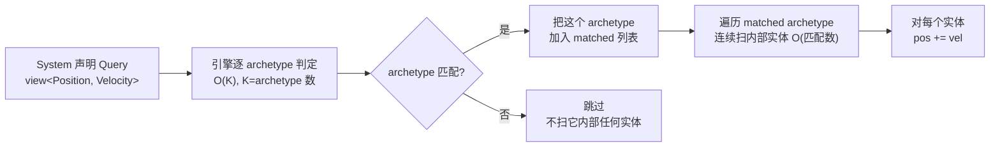
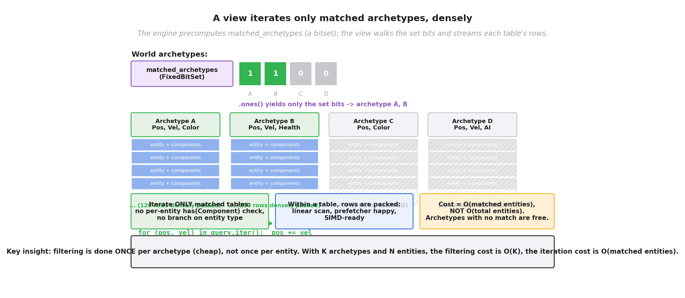
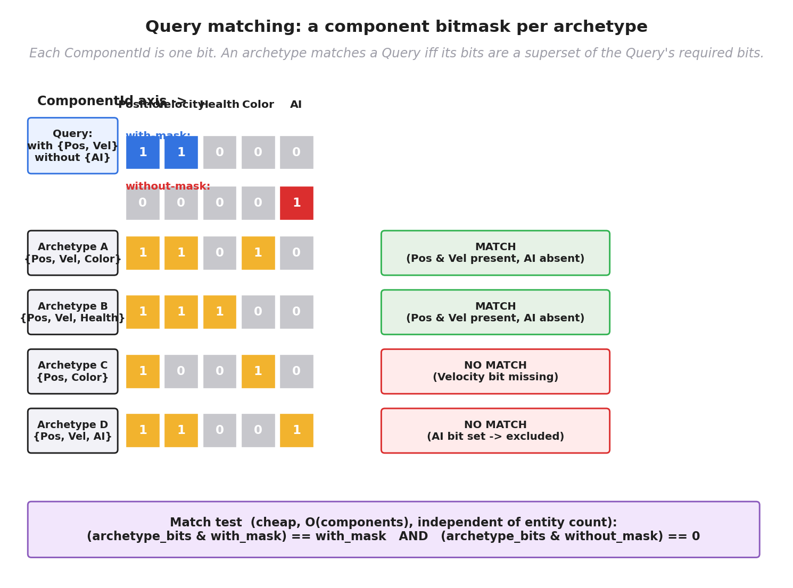
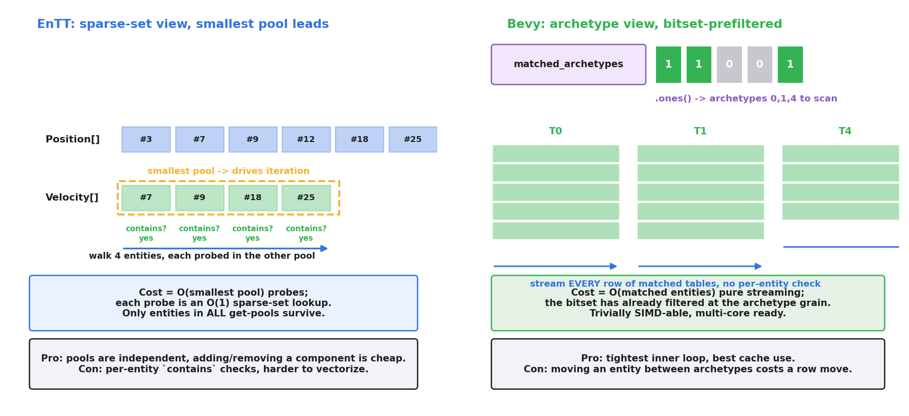
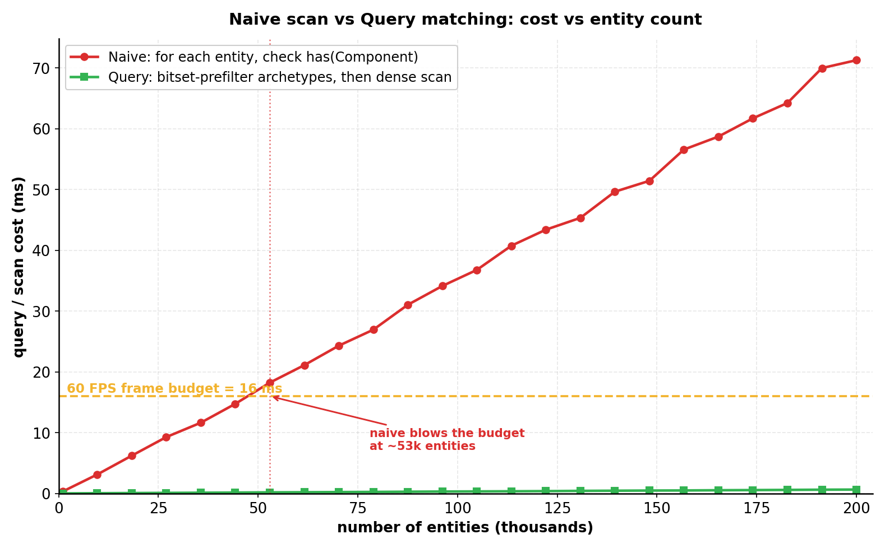
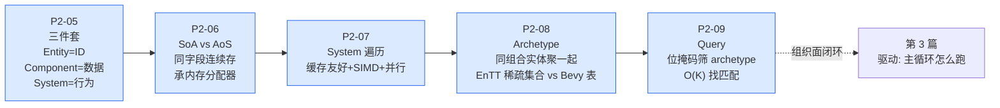

# 第 2 篇 · 第 9 章 · 查询 Query:快速找"有这些组件的实体"

> **核心问题**:前面三章(P2-06 / P2-07 / P2-08)把"组件怎么存、System 怎么遍历、Archetype 怎么把同组合实体连续摆放"都拆透了。可还差最后一块拼图:System 怎么**找到**它要遍历的那批实体?`MovementSystem` 上来就要一句"给我所有**同时**有 `Position` 和 `Velocity` 的实体",引擎拿到这句话,得在几万、几十万个实体里**快速**把这一小撮筛出来。朴素做法是遍历全部实体逐个 `has(Component)`——O(实体数 × 组件数),海量实体下直接卡死。本章拆透引擎凭什么把这个筛选从"按实体数"降到"按 archetype 数":**用组件位掩码一次性筛 archetype,只扫匹配的 archetype 内部的连续实体**。这是第 2 篇(ECS 组织面)的收束章——讲完它,组织面的整条链(三件套 → SoA → 遍历 → Archetype → Query)就闭环了。

> **读完本章你会明白**:
> 1. Query 是什么:System 用一行 `view<Position, Velocity>()` 或 `Query<(&Position, &mut Velocity)>` 声明"我要哪些组件",引擎怎么把这句话编译成一个可重复执行的"筛选器"。
> 2. 引擎怎么**快速找匹配实体**:不是逐实体检查,而是**按 archetype 级匹配**——每个 archetype 有一个组件类型集合,引擎判断"这个集合是不是 Query 要求的超集",只扫匹配的 archetype 内部的连续实体。一次筛选用 O(archetype 数),而不是 O(实体数)。
> 3. 位掩码是这个"超集判断"的最自然落地:每个组件一个 bit,archetype 一个掩码,Query 一个掩码,**一次按位 AND** 就判定匹配。
> 4. 两大真实载体怎么落地:**EnTT 的 `view`**(稀疏集合存储,挑最小池驱动迭代 + 逐实体 `contains` 过滤)和 **Bevy 的 `Query`**(archetype 存储,`matched_archetypes: FixedBitSet` 位集预筛 archetype,迭代只走置位项)。源码我们逐段拆。
> 5. 反例对比:朴素遍历 vs Query 匹配,耗时随实体数怎么涨(配数值模拟图),为什么 Query 能快几个量级。

> **如果一读觉得太难**:先只记住三件事——① System 用一句 Query 声明"我要哪些组件";② 引擎不是逐实体 `has` 检查,而是**先用位掩码筛 archetype**(O(archetype 数),很小),只扫匹配的 archetype;③ 匹配的 archetype 内部实体是连续摆放的(P2-08 讲过),所以扫起来缓存友好、能 SIMD。这就是 Query 的全部精髓。

---

## 〇、一句话点破

> **Query 的本质,是把"找有这些组件的实体"从"按实体数逐个检查"重写成"按 archetype 数批量筛选":每个 archetype 拿一个组件位掩码,Query 拿一个组件位掩码,一次按位 AND 判断这个 archetype 全部实体是否都匹配——匹配就整块连续扫,不匹配直接跳过。筛选用 O(archetype 数),迭代用 O(匹配实体数),都不碰"实体总数"这个大数。**

这是结论。本章倒过来拆:先讲 System 为什么需要 Query、朴素做法撞什么墙;再讲"按 archetype 级匹配 + 位掩码"这个核心技巧怎么把 O(实体数) 的筛选降到 O(archetype 数);然后对照 EnTT 的 `view` 和 Bevy 的 `Query` 两套真实落地,看清同一个思想在两种存储(稀疏集合 vs archetype 表)上的不同形态;最后用一张性能模拟图收束。

本章是第 2 篇的收尾。读完它,组织面这条链就闭合了——你会看见 Entity/Component/System(P2-05)→ Component 怎么连着存(P2-06 SoA)→ System 怎么连续遍历(P2-07)→ Archetype 怎么把同组合实体聚一起(P2-08)→ Query 怎么把这堆实体快速找到(P2-09)——五站串成"数据怎么躺,系统怎么找、怎么扫"的完整闭环。

---

## 一、System 为什么需要 Query

### 先回到上一章的MovementSystem

P2-05 给过这段 EnTT 的 `MovementSystem`:

```cpp
void movement_system(entt::registry &reg, float dt) {
    auto view = reg.view<Position, Velocity>();          // <- 这一句就是 Query
    for (auto [entity, pos, vel] : view.each()) {
        pos.x += vel.vx * dt;
        pos.y += vel.vy * dt;
    }
}
```

那章只立了三件套的概念,把 `reg.view<Position, Velocity>()` 这一句标了"这叫查询(Query)",但没拆它怎么工作。本章就来拆它。

System 是纯行为(P2-05),它**自己不持有数据**,数据全在 registry 管的组件池里。System 要更新世界,第一件事就是:**告诉世界"我要哪些组件",然后拿到这批组件的引用**。这一步,就是 Query。`reg.view<Position, Velocity>()` 翻译成人话就是:

> "registry,给我一个迭代器,它遍历**所有同时挂了 `Position` 和 `Velocity` 组件**的实体。每个实体,把它的 `Position` 和 `Velocity` 引用一起给我。"

注意三个细节:

1. **"同时"**:不是"有 Position 的"∪"有 Velocity 的",而是**交集**——实体必须**两个组件都有**才被返回。只有 `Position`(静态障碍物)、只有 `Velocity`(没位置的抽象速度概念)的实体都不要。
2. **"所有"**:不是找一个,是找**全部**符合条件的实体。一次 Query 可能返回几十、几百、上万个。
3. **只返回它要的**:Query 只要 `Position` 和 `Velocity`,实体的其他组件(`Health`、`Color`、`AI`...)就算有,**也不会被拉进迭代器**——System 看不见它们。这是数据导向"只取要的字段"的延续(P2-06)。

Bevy(Rust 引擎)里对应的写法是:

```rust
fn movement_system(mut query: Query<(&mut Position, &Velocity)>, time: Res<Time>) {
    let dt = time.delta_seconds();
    for (mut pos, vel) in &mut query {
        pos.x += vel.vx * dt;
        pos.y += vel.vy * dt;
    }
}
```

`Query<(&mut Position, &Velocity)>` 是同样的意思:System 参数里声明一个 `Query`,要"可写 `Position`、只读 `Velocity`",引擎把匹配的实体迭代器塞给它。Bevy 比 EnTT 多一层"可写/只读"的访问标注(`&mut` vs `&`),这层后面讲——它关系到多个 System 能不能并行(P5-17 详讲)。

### Query 不止"我要哪些",还有"我不要哪些"

实际游戏里,System 常常要表达"我要有 Position 和 Velocity 的实体,**但不要**已经死亡的(挂了 `Dead` 组件的)"。这种"排除"语义,Query 一样支持:

```cpp
// EnTT: 排除 Dead 组件
auto view = reg.view<Position, Velocity>(entt::exclude_t<Dead>{});
```

```rust
// Bevy: 用 filter 排除
fn movement_system(query: Query<(&mut Position, &Velocity), Without<Dead>>) {
    for (mut pos, vel) in &query { /* ... */ }
}
```

所以一个完整的 Query 其实是**两份组件清单**:

- **with(必须有)**:实体必须**都有**这些组件,才匹配。
- **without(必须没有)**:实体**只要有一个**这些组件,就不匹配(排除)。

本章后面讲位掩码匹配时,这两份清单就是 Query 的两个掩码:`with_mask` 和 `without_mask`。现在先记住:Query 不只是"我要哪些",还包括"我不要哪些",这影响匹配怎么算。

### with / without 在游戏里都怎么用

光讲概念空,看几个真实游戏里会出现的 Query:

1. **移动系统**:`Query<(&mut Position, &Velocity), Without<Dead>>`——要 Position 和 Velocity(会动的),排除 Dead(死了的别动)。
2. **渲染系统**:`Query<(&Position, &Mesh, &Material)>`——只要这三个,不管其他。挂在墙上的、地上的、角色身上的,只要有 Position+Mesh+Material 都画。
3. **AI 系统**:`Query<(&mut AIState, &Position, &Health), (Without<Dead>, Without<Petrified>)>`——要 AI 状态、位置、血量,排除死的和石化的。
4. **特效系统**:`Query<&Effect, Added<Effect>>`——只要 Effect 组件,且**只返回这一帧刚加上 Effect 的实体**(Bevy 的 `Added<T>` filter,本章后面会提)。

这些例子有个共同点:Query 的表达力远超"遍历所有对象然后 if 判断"。你声明要什么、不要什么,**引擎替你筛**,你的 System 函数只看见完全符合的实体——一行过滤代码都不用写。这是 ECS 把"数据筛选"从业务逻辑里抽出来、交给引擎统一的红利。

### 一个易混点:Query 不是数据库的 SELECT

有数据库背景的读者可能会想:这不就是个 `SELECT * FROM entities WHERE has(Position) AND has(Velocity)` 吗?长得像,本质不同:

- **数据库 SELECT 是解释执行**(解析 SQL、生成执行计划、运行时遍历),开销大,适合低频查询。
- **ECS 的 Query 是编译期定型 + 运行期缓存**——`view<Position, Velocity>()` 的"要哪些组件"在 C++ 模板里编译期就定了,运行期只是读缓存好的位集 / 池指针。Bevy 的 `Query<...>` 同理,泛型参数在编译期定型。
- **数据库面向通用查询**,ECS Query 面向**每帧 60 次的高频迭代**——所以它必须极快,缓存命中、连续扫,几十纳秒一次实体。

所以别把 ECS 的 Query 当数据库 SELECT 那样的"重"操作。它是被设计成**几乎零成本**的一层薄抽象,本章后半段你会看见它怎么做到。

> **钉死这件事**:Query 是 System 和世界之间的"查询接口"——System 声明"我要哪些组件(with)、不要哪些组件(without)",引擎返回一个**只遍历匹配实体**的迭代器。本章的核心问题就是:引擎拿到这句话,怎么**快速**算出"哪些实体匹配"。

---

## 二、朴素做法撞什么墙:逐实体 has 检查

### 最直白的实现:遍历所有实体,逐个查

如果让你写 Query 的实现,最直觉的做法是:

```cpp
// 朴素 Query 实现:遍历所有实体, 逐个检查 has(Component)
std::vector<Entity> naive_query_position_velocity(const Registry &reg) {
    std::vector<Entity> result;
    for (Entity e : reg.all_entities()) {              // 遍历所有实体
        if (reg.has<Position>(e) && reg.has<Velocity>(e)) {   // 逐个检查
            result.push_back(e);
        }
    }
    return result;
}
```

看起来没问题。逻辑也对。**那它撞什么墙?**

撞的是**实体数**这堵墙。游戏的实体规模,小则几千,大则几万、几十万(一个开放世界游戏,场景里的敌人、NPC、子弹、粒子、可互动物体加起来轻松上万)。每帧 16ms 预算里,光这一句"遍历所有实体逐个检查"就要烧掉多少?

算一笔账。假设场景里有 5 万个实体,Query 要"Position + Velocity"两个组件:

- 朴素做法要遍历 5 万个实体,每个实体查 2 次 `has`(一次 `has<Position>`,一次 `has<Velocity>`)。一共 **10 万次** `has` 检查。
- 每次 `has` 怎么实现?在面向对象或散落布局下,它得先定位这个实体的组件记录(可能是个哈希表查、可能跳指针),再判断对应位有没有——一次 `has` 几纳秒到几十纳秒,假设平均 10ns。10 万次 × 10ns = **1ms**。

看起来还好?但这是**单个 Query、单次**。真实引擎一帧要跑几十个 System,每个 System 都要 Query 一次(MovementSystem、GravitySystem、CollisionSystem、RenderSystem、AISystem...)。几十个 Query 都烧 1ms 光在"找实体"上(还没开始算!),16ms 预算就被光筛选筛掉一大半。更要命的是:

- **真正的 `has` 比这慢**。在面向对象布局下,实体散落在堆上,逐实体遍历是指针追逐(P2-06 / P2-07 讲过),缓存频繁 miss,`has` 实际开销远不止 10ns。真实场景里一次 `has` 要查实体的组件位图或哈希表,加上缓存未命中,常常是几十纳秒。10 万次检查实际可能烧 3 到 5ms,远超账面估算。
- **大多数 Query 匹配的实体只是一小撮**。比如"挂了 `SpellCaster` 法师组件的实体",整个场景可能就 50 个,可你为了找这 50 个,得遍历全部 5 万个实体——**99.9% 的检查都是白做的**。这种"大海捞针"型 Query 在游戏里非常常见(特效系统找刚加上燃烧特效的、成就系统找达成条件的、音效系统找刚发出声音的),朴素做法对它们特别亏。
- **每帧重复**。同一个 Query,主循环每帧都跑一次(MovementSystem 每帧都查一次 Position+Velocity),意味着这 1ms 开销每秒烧 60 次。一秒钟光筛选就烧掉 60ms 的 CPU 时间,而且这还是"什么有用的事都没干"的纯开销。
- **放大效应**:几十个 System 都这么干,几十个朴素 Query 叠加,每帧光筛选可能烧 20 到 30ms——**直接超出 16ms 预算**。游戏还没开始更新世界,光"找该更新谁"就把帧率拖垮了。

这就是为什么"朴素遍历逐实体检查"在真实游戏引擎里根本不可用。它不是"慢一点",是**结构性不可行**——复杂度拴在了最不该拴的那个大数(实体总数)上。

> **不这样会怎样**:朴素遍历的致命伤,是它的复杂度拴在**实体总数** N 上——O(N × 组件数)。N 涨到几万、几十万,光筛选就把帧率拖垮。更要命的是,真正匹配的实体可能只占百分之几,99% 的遍历是纯浪费。这是 Query 必须重写的根本动力。

### 那把"has 检查"做得更快行不行

你可能会想:那我把 `has` 优化一下,让它飞快——比如给每个实体预先存一个组件位掩码(每个组件一位,有就置 1),`has<Position>` 就退化成"看 Position 那一位是不是 1",一条按位与指令的事。

这想法对,但它只优化了"每次检查的常数",没改"O(N) 遍历"的本质——你还是得遍历 N 个实体,只是每次检查从 10ns 降到 1ns。N 涨到几十万,你还是被 N 拖死。

真正的破局,是**别按实体筛选**。下面这节就是核心。

---

## 三、破局:按 archetype 级筛选,不按实体

### 关键观察:匹配与否,由 archetype 决定,不由单个实体决定

回想 P2-08:archetype 是"组件组合相同"的一批实体。一个 archetype 就是一种组件组合——比如 archetype A 是 {Position, Velocity, Color},archetype B 是 {Position, Velocity, Health},archetype C 是 {Position, Color}。

现在盯着 Query "Position + Velocity" 看。**这个 Query 匹配哪些实体?** 答案是:所有处在 archetype A 和 archetype B 里的实体(它们都有 Position 和 Velocity)。而 archetype C 里的实体没有 Velocity,**整个 archetype C 没有一个实体匹配**。

这就是破局点:

> **一个 Query 匹配哪些实体,完全由"实体所在的 archetype 的组件组合"决定。同一个 archetype 里的所有实体,要么全匹配,要么全不匹配——不存在"archetype A 里有的实体匹配、有的不匹配"。**

为什么?因为 archetype 的定义就是"组件组合相同"——同一个 archetype 里的实体,挂的组件一模一样。Query 又是按"挂没挂某些组件"来筛的。所以匹配与否,**对 archetype 是个整体判定**:整个 archetype 的实体要么都过,要么都不过。

### 筛选从"按实体"重写成"按 archetype"

既然匹配与否是 archetype 级的整体判定,那筛选就不用逐实体做了——**逐 archetype 做就行**:

```cpp
// archetype 级 Query 实现 (概念):
std::vector<Archetype*> query_archetypes(const Query &q, const World &world) {
    std::vector<Archetype*> matched;
    for (Archetype *arch : world.all_archetypes()) {        // 遍历所有 archetype
        if (arch_matches(arch, q)) {                        // 这个 archetype 整体匹不匹配?
            matched.push_back(arch);                        // 匹配, 整块收下
        }
    }
    return matched;
}
```

这个改动看起来平淡,但复杂度天差地别:

- **遍历的不再是实体数 N,而是 archetype 数 K**。
- K 是多大?游戏的 archetype 数,取决于"组件组合的种类数"。一个中等复杂度的游戏,可能就几十种 archetype(K ≈ 30~50),哪怕很复杂的开放世界也难得上百(K ≈ 几百)。**K 通常比 N 小三四个数量级**(5 万个实体 vs 50 个 archetype)。
- 一次筛选用 O(K),就是 50 次判断。哪怕每次判断花 100ns,筛选总成本才 5μs,比朴素 O(N) 的 1ms 快了 200 倍。

> **钉死这件事**:Query 的核心洞察——**匹配与否是 archetype 级的整体判定,不是单个实体的事**。所以筛选从"遍历所有实体逐个 has"(O(实体数))重写成"遍历所有 archetype 整体判定"(O(archetype 数))。实体再多,archetype 数就那么几十上百个,筛选成本被彻底从大数 N 上解绑。

### 匹配了之后:整块连续扫

筛选这一步降到了 O(K)。但还差一步:**真正遍历匹配的实体,做 System 的工作**(比如 `pos += vel`)。这一步呢?

答案在 P2-08:archetype 内部的实体是**连续摆放**的(同组合的实体挤在一个紧凑表里)。所以"遍历 archetype A 里的所有实体"就是**连续内存扫描**——缓存命中、prefetcher 友好、SIMD 友好(P2-06 / P2-07 讲过的全套好处)。archetype A 有 120 个实体,你就连续读 120 个 Position + 120 个 Velocity,一气呵成。

所以完整的 Query 工作流是:



两个阶段:① **筛选** O(K),小常数;② **迭代** O(匹配实体数),连续扫。**两个阶段都不碰"实体总数 N"**——筛选只碰 archetype 数,迭代只碰匹配的实体。这就是 Query 凭什么快的全貌。



---

## 四、核心技巧:位掩码做"超集判断"

上面把"archetype 级匹配"讲透了,但还留了个扣:`arch_matches(arch, q)` 这个判定怎么实现?它要回答"这个 archetype 的组件集合,是不是 Query 要求的超集(Query 的 with 全在,without 全不在)"。最自然的实现,是**位掩码**。

### 每个组件一个 bit

引擎给每个注册过的组件类型,分配一个稠密的整数 ID(`ComponentId`)——`Position` 是 0,`Velocity` 是 1,`Health` 是 2,`Color` 是 3,`AI` 是 4...... 这个 ID 在整个 World 里是固定不变的(就像数据库里每张表有个 id)。Bevy 里这个 ID 叫 `ComponentId`,EnTT 里叫 `id_type`。

有了 ID,**一个 archetype 的组件组合,就可以表示成一个位掩码**:第 i 位为 1,表示这个 archetype 有第 i 号组件;为 0 表示没有。比如(用 5 个组件举例):

- archetype A = {Position, Velocity, Color} → 二进制 `11010`(位 0、1、3 为 1)
- archetype B = {Position, Velocity, Health} → `11100`(位 0、1、2 为 1)
- archetype C = {Position, Color} → `10010`(位 0、3 为 1)
- archetype D = {Position, Velocity, AI} → `11001`(位 0、1、4 为 1)

Query 也表示成两个掩码:

- `with_mask` = 必须有的组件:Query "Position + Velocity" → `11000`(位 0、1)
- `without_mask` = 必须没有的组件:Query "不要 AI" → `00001`(位 4)

### 一次按位 AND 判定匹配

现在判定"archetype A 匹不匹配 Query",就是两条按位运算:

```
匹配  <=>  (archetype_bits & with_mask) == with_mask        // A 必须包含 with 要求的所有位
      AND (archetype_bits & without_mask) == 0             // A 不能包含 without 的任何位
```

逐个 archetype 验证一下:

- **A `11010`**:with `11000`?`11010 & 11000 = 11000 == with_mask`,✓;without `00001`?`11010 & 00001 = 0`,✓。**匹配**。
- **B `11100`**:with?`11100 & 11000 = 11000 == with_mask`,✓;without?`11100 & 00001 = 0`,✓。**匹配**。
- **C `10010`**:with?`10010 & 11000 = 10000 ≠ 11000`,✗(Velocity 那位缺)。**不匹配**(算到这就能短路)。
- **D `11001`**:with?`11001 & 11000 = 11000 == with_mask`,✓;without?`11001 & 00001 = 00001 ≠ 0`,✗(AI 那位有,被排除)。**不匹配**。



> **钉死这件事**:位掩码匹配 = 两条按位运算,一条判断"with 全在",一条判断"without 全不在"。整型按位运算是 CPU 最快的指令之一,几十纳秒一次。一次筛选用 O(K)(K = archetype 数),就是 K 次按位 AND,几微秒搞定几万实体规模的 Query。这是 Query 把 O(N) 降到 O(K) 的字面落地。

### 再练一遍:换个 Query,带 without

为了确保你真掌握了,换一个 Query 再手算一遍。这次 Query 是"战斗系统"的:**要 Health,不要 Dead**(打活人,不打尸体)。同样在 5 个组件的位轴上(Position=0, Velocity=1, Health=2, Color=3, AI=4)。

- `with_mask` = 只要 Health → `00100`(位 2)
- `without_mask` = 不要 Dead。但等下,我们的 5 位轴里没有 Dead 这一位——这是为了举例清晰,假设 Dead 是第 5 号组件(位 5),那 `without_mask` = `100000`(位 5)。

把 archetype 列表扩到含 Dead(位 5),假设有这几个 archetype:

- archetype E = {Position, Health, Color} → 位 0、2、3 → `001101`
- archetype F = {Health, Dead} → 位 2、5 → `100100`(死尸,有 Health 残留 + Dead 标记)
- archetype G = {Position, Velocity, Health} → 位 0、1、2 → `001110`

逐个判定:

- **E `001101`**:with `00100`?`001101 & 00100 = 00100 == with_mask`,✓(Health 在);without `100000`?`001101 & 100000 = 0`,✓(Dead 不在)。**匹配**(活的,有血)。
- **F `100100`**:with `00100`?`100100 & 00100 = 00100 == with_mask`,✓(Health 在);without `100000`?`100100 & 100000 = 100000 ≠ 0`,✗(Dead 在,排除)。**不匹配**(虽然是尸体残留了 Health,但挂了 Dead,战斗系统不碰它)。
- **G `001110`**:with `00100`?`001110 & 00100 = 00100 == with_mask`,✓;without `100000`?`001110 & 100000 = 0`,✓。**匹配**(活人,有血能打)。

所以这个 Query 匹配 E 和 G,不匹配 F。注意一个细节:**F 也有 Health 组件**(尸体上残留的血量数据,可能是为了显示血迹),但因为挂了 Dead,被 `without` 排除。这正是 `without` 的价值——它精确表达"有 Health 但不是 Dead 的",而不是让 System 在迭代里手写 `if !has<Dead>`。引擎在筛选阶段一次性帮你排除,迭代器里压根不会出现 F 的实体。

把这个例子和上面的"Position + Velocity"例子对照看,你会发现:**不管 Query 要什么、不要什么,匹配判定的算法永远是那两条按位 AND——它对所有 Query 都通用**。这就是位掩码框架的优美之处:一个统一的判定机制,涵盖所有可能的 Query 表达。

### 一个常被混淆的点:位掩码不是"按实体"的

注意,这里的位掩码是**按 archetype**的,不是按实体的。每个 archetype 一个掩码(描述这个 archetype 有哪些组件),不是每个实体一个掩码。匹配是 archetype 整体的判定——一次 AND 决定整个 archetype 的所有实体匹不匹配。

有些资料说"ECS 用位掩码加速 Query",常被误读成"每个实体一个掩码,遍历实体时按位查"——那其实只是把朴素做法的 `has` 优化了一下,还是 O(N)。真正的 Query 加速,是**位掩码配 archetype**:位掩码描述 archetype 的组件组合,匹配在 archetype 这一层一次性完成,实体这层根本不参与筛选,只参与后续的连续迭代。这个区分,务必钉死。

---

## 五、两大真实载体怎么落地

原理讲透了,看两个真实引擎怎么落地这个思想。它们存储方式不同(P2-08 讲过稀疏集合 vs archetype 表两大学派),所以 Query 的具体形态也不同,但核心思想一致。

### 载体一:EnTT 的 `view`(稀疏集合存储)

EnTT 默认用**稀疏集合(sparse set)**存组件(P2-08 讲过):每个组件类型一个稀疏集合,集合里存"挂了这组件的实体"列表。`view<Position, Velocity>` 要做的就是:在这两个稀疏集合里,找出**同时存在**的实体。

EnTT 的源码在 `src/entt/entity/view.hpp`(GitHub skypjack/entt)。核心是 `basic_common_view` 类模板和它的迭代器 `view_iterator`。我们看几个关键点:

**关键点一:迭代器内部怎么判定一个实体匹配**

看 `view_iterator` 的 `valid()` 函数(view.hpp):

```cpp
template<typename It>
[[nodiscard]] bool all_of(It first, const It last, const entity_like auto entt) noexcept {
    for(; (first != last) && (*first)->contains(entt); ++first) {}
    return first == last;
}

// view_iterator::valid (简化, 突出逻辑):
[[nodiscard]] bool valid(const value_type entt) const noexcept {
    return (!Checked || (entt != tombstone))
           && ((Get == 1u) || (internal::all_of(pools.begin(), pools.begin() + index, entt)
                               && internal::all_of(pools.begin() + index + 1, pools.end(), entt)))
           && ((Exclude == 0u) || internal::none_of(filter.begin(), filter.end(), entt));
}
```

`pools` 是这个 view 涉及的所有"要"组件池(对 `view<Position, Velocity>` 就是两个池),`filter` 是所有"不要"组件池。`valid()` 干的事:

- `all_of(pools..., entt)`:遍历所有"要"组件池,看每个池是不是都 `contains(entt)`——也就是这个实体在每个"要"的池里都有记录。全都有,才算"有这些组件"。
- `none_of(filter..., entt)`:遍历所有"不要"组件池,看每个池是不是都**不**包含这个实体。全都不包含,才算"没那些组件"。

注意 EnTT 这里是**逐实体**检查的(对每个候选实体,逐个池 `contains`)。这是因为 EnTT 用稀疏集合存储——它**没有 archetype 这一层**(组件是按类型独立存的,不按组合分组),所以没法做 archetype 级的整体判定,只能在单个池里逐实体筛。但 EnTT 用了个聪明技巧把常数降到最小:

**关键点二:挑最小的池驱动迭代**

看 `basic_common_view` 的 `unchecked_refresh()`(view.hpp):

```cpp
void unchecked_refresh() noexcept {
    index = 0u;
    if constexpr(Get > 1u) {
        for(size_type pos{1u}; pos < Get; ++pos) {
            if(pools[pos]->size() < pools[index]->size()) {   // 找最小的池
                index = pos;
            }
        }
    }
}
```

`view<Position, Velocity>` 涉及两个池:Position 池(假设 200 个实体)和 Velocity 池(假设 120 个实体)。EnTT **挑最小的那个池(Velocity,120 个)做主迭代驱动**,只遍历这 120 个实体——每个去 Position 池查 `contains`,在的就保留。这样迭代次数被**两个池的最小者**卡住,而不是较大者。如果 Position 有 5 万个实体,但 Velocity 只有 50 个,view 只遍历 50 次——绝大多数 Position 实体根本不会被碰。

这是 EnTT 在没有 archetype 的情况下,把"逐实体筛"的常数压到最低的技巧:**用最小池驱动 + O(1) 稀疏集合查 `contains`**。

> **承接 P2-08**:EnTT 的稀疏集合存组件,所以 view 没法做 archetype 整体判定,只能逐实体 `contains` 过滤;但靠"挑最小池驱动 + O(1) 稀疏查",把常数压到很低。Bevy 的 archetype 存储走了另一条路——下面看。

**关键点三:`each()` 怎么把实体和组件一起给你**

`basic_view` 的 `each()`(view.hpp)负责把 `(entity, pos, vel)` 元组流式吐给用户:

```cpp
template<std::size_t Curr, typename Func, std::size_t... Index>
void each(Func func, std::index_sequence<Index...>) const {
    for(const auto curr: storage<Curr>()->each()) {              // 遍历驱动池的每个实体
        if(const auto entt = std::get<0>(curr);
           ((Curr == Index || base_type::pool_at(Index)->contains(entt)) && ...)  // 其他池都包含
           && base_type::none_of(entt)) {                                         // 且不被排除
            // ... 把 (entt, components...) 喂给 func
        }
    }
}
```

它遍历驱动池(`storage<Curr>()`,就是上面挑出的最小池),对每个实体用 `contains` 过滤,通过的才喂给用户的 lambda。P2-05 你看到的 `for (auto [e, pos, vel] : view.each())` 就是这个 `each()` 的语法糖。

### 载体二:Bevy 的 `Query`(archetype 表存储)

Bevy 走的是 archetype 表存储(P2-08 讲过):实体按组件组合分组到 archetype,每个 archetype 内部实体连续存放在一张"表(table)"里。Bevy 的 Query 实现在 `crates/bevy_ecs/src/query/state.rs`(GitHub bevyengine/bevy)。核心是 `QueryState` 结构体。

**关键点一:QueryState 预存"匹配了哪些 archetype"的位集**

`QueryState` 里有两个关键字段(state.rs):

```rust
pub(crate) struct QueryState<D: QueryData, F: QueryFilter = ()> {
    world_id: WorldId,
    pub(crate) archetype_generation: ArchetypeGeneration,
    /// Metadata about the Tables matched by this query.
    pub(crate) matched_tables: FixedBitSet,
    /// Metadata about the Archetypes matched by this query.
    pub(crate) matched_archetypes: FixedBitSet,
    pub(crate) component_access: FilteredAccess,
    pub(crate) fetch_state: D::State,
    pub(crate) filter_state: F::State,
    // ...
}
```

`matched_archetypes: FixedBitSet` 是个位集——第 i 位为 1,表示第 i 号 archetype 匹配这个 Query。`matched_tables` 同理(table 是 archetype 的内部存储,见 P2-08)。这个位集就是上一节讲的"archetype 级匹配结果"的字面落地:**匹配判定一次性算完,结果存进位集,之后迭代只走置位的那些 archetype**。

**关键点二:新 archetype 出现时,增量更新位集**

世界不是静态的——游戏运行中会不断产生新 archetype(实体挂了新组件,就迁移到一个新 archetype)。Bevy 在新 archetype 出现时,调用 `QueryState::new_archetype()`(state.rs)判定它匹不匹配,匹配就把位集对应位置 1:

```rust
pub unsafe fn new_archetype(&mut self, archetype: &Archetype) {
    if D::matches_component_set(&self.fetch_state, &|id| archetype.contains(id))
        && F::matches_component_set(&self.filter_state, &|id| archetype.contains(id))
        && self.matches_component_set(&|id| archetype.contains(id))
    {
        let archetype_index = archetype.id().index();
        if !self.matched_archetypes.contains(archetype_index) {
            self.matched_archetypes.grow_and_insert(archetype_index);   // 位集置 1
            // ...
        }
        // ... 同步 matched_tables
    }
}
```

`matches_component_set`(state.rs)就是上一节讲的"with 全在、without 全不在"判定,Bevy 的实现是:

```rust
pub fn matches_component_set(&self, set_contains_id: &impl Fn(ComponentId) -> bool) -> bool {
    self.component_access.filter_sets.iter().any(|set| {
        set.with.iter().all(set_contains_id)                       // with: 全在
            && set.without.iter().all(|index| !set_contains_id(index))   // without: 全不在
    })
}
```

注意:Bevy 这里**不是字面的一次按位 AND**(那是个抽象模型),而是用 `ComponentId` 的集合查 `archetype.contains(id)`——`with` 的每个组件 id 都要在 archetype 里(`.all(set_contains_id)`),`without` 的每个都不能在。但思想完全一致:**超集判断**。Bevy 用 `ComponentId` + `iter().all()` 实现,EnTT 用稀疏集合 `contains` 实现,殊途同归。

**关键点三:迭代只走位集的置位项**

Query 真正迭代时,引擎遍历 `matched_archetypes` 位集的"置位项"(`FixedBitSet::ones()` 只返回 1 的位),只扫这些 archetype 内部的表(state.rs):

```rust
pub fn matched_archetypes(&self) -> impl Iterator<Item = ArchetypeId> + '_ {
    self.matched_archetypes.ones().map(ArchetypeId::new)   // 只迭代置位的 archetype
}
```

`.ones()` 是位集的"稀疏迭代"——跳过所有 0 位,只产生 1 位的索引。这就是"只扫匹配的 archetype"的字面落地。配上 archetype 内部表的连续存储,迭代就是 P2-07 讲过的缓存友好连续扫描。

**额外细节:dense vs sparse**

Bevy 还有个 `is_dense` 标志(state.rs)。如果 Query 的所有组件都是"密集存储"(table 内连续),迭代就按 table 走(最快);如果有"稀疏存储"组件(比如 Bevy 的 `SparseSet` 组件),就按 archetype 走(更通用但略慢)。这是 Bevy 在两种存储间的微调,但和本章主线无关,知道有这事就行。

### 两种落地对照

EnTT 和 Bevy 走了两条不同的路,但殊途同归:

| | EnTT `view` | Bevy `Query` |
|---|---|---|
| 底层存储 | 稀疏集合(每组件类型一个池) | archetype 表(同组合实体连续存) |
| 匹配判定粒度 | **逐实体**(每个候选实体查 `contains`) | **逐 archetype**(整个 archetype 一次判定) |
| 怎么把常数压低 | **挑最小池驱动** + O(1) 稀疏查 | **位集预筛 archetype** + 连续扫表 |
| 迭代成本 | O(最小池大小) × O(1) 查 | O(匹配 archetype) → O(匹配实体) 连续扫 |
| 加/删组件 | 便宜(只动一个池) | 较贵(实体要迁移 archetype,挪表行) |



> **钉死这件事**:同一个"archetype 级匹配 + 位掩码"思想,在两种存储上形态不同。EnTT 没有显式 archetype 这层(稀疏集合按组件类型独立存),所以靠"挑最小池驱动 + 逐实体 contains"把常数压低;Bevy 有显式 archetype 表,所以能"位集预筛 archetype + 整表连续扫",真正做到了实体这一层完全不参与筛选。两者都把复杂度从 O(N) 降下来了,只是 Bevy 降得更彻底(实体层完全不参与筛选)。

### 还有一层:Query 的访问语义(读 vs 写)

到这里讲的 Query 都只关心"匹配哪些实体"。但真实引擎里,Query 还要回答第二个问题:**System 打算怎么访问这些组件——只读,还是要写?**

Bevy 在 Query 的类型参数里就把这事钉死了:`Query<&Position>` 是只读 Position,`Query<&mut Position>` 是可写 Position。这个区分不是花架子,它直接决定**多个 System 能不能并行跑**:

- 两个 Query 都**只读**同一个组件——可以并行(读读不冲突)。
- 一个**写**、另一个**读或写**同一个组件——**不能并行**(会数据竞争),调度器必须让它们排队。
- 两个 Query 访问**完全不同**的组件——可以并行(互不干涉)。

Bevy 怎么在编译期/启动期检测冲突?靠 Query 编译出的 `FilteredAccess`(state.rs 里 `component_access` 字段)——它记录这个 Query"读了哪些 ComponentId、写了哪些 ComponentId"。调度器把所有 System 的 access 两两比对,有写写或读写重叠的就排成串,没重叠的就并行。EnTT 的 `organizer` 干的是同一件事。

注意一个微妙点:**访问冲突的判定也是按 ComponentId(组件类型)的,不是按实体的**。如果 System A 写 Health,System B 读 Health,即使 A 和 B 实际上操作的是**完全不同**的实体,Bevy 也会判定它们冲突,排成串——因为它做的是保守的"组件级"判定,不去细查"具体哪些实体"。这是个保守但极快的策略(组件种类远少于实体,判定便宜),代价是放弃了一些其实可以并行的机会。Bevy 提供 `.allow_ambiguous_component` 之类的逃生口,让用户手动声明"我知道这俩实际不冲突,放并行"。这部分深入在 P5-17 多线程 job 系统。

> **承接**:Query 的访问语义(读/写哪些组件),是**多线程调度**判定"两个 System 能否并行"的依据。本章只点到,完整拆在 P5-17。

---

## 六、Query 的缓存:别每帧重新算

上面讲了"筛选 O(K)"——但 K 次筛选,每帧都重算一遍,还是浪费。引擎还有一层优化:**把筛选结果缓存起来,只在 archetype 集合变化时重算**。

### matched 列表是缓存的

Bevy 的 `matched_archetypes: FixedBitSet` 就是这个缓存——位集记下了"哪些 archetype 匹配",Query 第一次执行时算一遍,之后每帧直接读这个位集,不重算。只有当**世界出现新 archetype**时(实体挂了之前没出现过的组件组合),Bevy 才会调 `new_archetype()` 对这个新 archetype 做一次增量判定,把结果并入位集(见上面源码)。绝大多数帧,世界不产生新 archetype(组件组合就那几十种,游戏运行中变化极少),所以筛选几乎是零成本——读个位集而已。

`archetype_generation` 字段(state.rs)就是干这个的:它记录"这个 Query 的位集是对齐到哪个版本的世界算的"。世界出现新 archetype 时,generation 变化,Query 在下次执行前对齐一下(只判定新增的 archetype),位集就又是最新的。这是典型的**脏标记 + 增量更新**模式。

把这套机制展开看一遍,你会感受到它有多省:

- **第 1 帧**:世界刚启动,有 K 个 archetype(比如 40 个)。每个 Query 第一次执行,对这 40 个 archetype 各做一次匹配判定,结果存进自己的 `matched_archetypes` 位集。这是 O(K) 的一次性成本。
- **第 2 到 N 帧**:游戏稳定运行,世界没产生新 archetype(实体来来去去,但组件组合的种类不变——还是那 40 种)。每个 Query 直接读自己的位集,**零判定成本**——`matched_archetypes.ones()` 一把梭,只迭代置位项。
- **某帧产生新 archetype**:比如某个实体第一次同时挂了 `Frozen + Velocity`(之前从没出现过这个组合),世界新增一个 archetype 41。世界把 generation 从 G 推到 G+1。下次每个 Query 执行前,看见 `archetype_generation < world.archetype_generation()`,就只对**新增的** archetype 41 做一次判定(老的不重判),结果并入位集。又是 O(新增数),不是 O(总 K)。

这个脏标记机制,把"每帧重算匹配"的成本从 O(K × 查询数 × 60fps) 降到了"几乎零"。一个 World 的 archetype 种类极少(几十个),游戏运行中还常常**长时间稳定不变**(组件组合就那几种),所以绝大多数帧,所有 Query 都直接读缓存位集,连那点 O(K) 都不用花。这是 Query 在长期运行下依然高效的另一个隐藏支柱。

EnTT 这边,`view` 本身是轻量的(就是几个池指针的组合),它不缓存"匹配了哪些实体"——但每个稀疏集合内部的实体列表是持续维护的(实体挂组件就进对应池的列表,摘组件就出),所以 view 每次跑,遍历的就是当前最新的池。它的"缓存"在池本身:池的实体列表 O(1) 维护,view 只是来读。换句话说,EnTT 把"维护匹配关系"的成本分摊到了**每次组件增删**上(增删时 O(1) 更新池),而不是 Query 执行时。这也是一种缓存思想,只是缓存的粒度是池而不是 archetype。

### 组件索引:ComponentId 是稠密的

无论是 EnTT 还是 Bevy,组件类型都用**稠密整数 ID**(`ComponentId`,从 0 递增)。这个稠密性是位掩码/位集能工作的前提——位 i 对应 ComponentId i,位集的长度就是组件种类数。如果组件 id 是稀疏的(比如随机大整数),位掩码就得用哈希表,失去 O(1) 的优势。引擎在组件第一次注册时分配这个稠密 id,之后整个世界都用它索引。

---

## 七、性能对比:朴素遍历 vs Query 匹配

讲了一堆原理,拿一张性能模拟图把差距具象化。模拟一个场景:世界里有 N 个实体(从 1k 到 200k),Query 是"Position + Velocity"。两种做法:

- **朴素**:遍历所有 N 个实体,每个查 2 次 `has`(模拟指针追逐,每次约几十 ns,且随 N 增大缓存 miss 加剧)。
- **Query**:O(K)(K=40 个 archetype)筛 archetype,然后连续扫匹配的实体(约 35% 匹配),连续扫描每实体约几 ns。



(上图是按合理成本模型数值模拟的示意,绝对数字因引擎/硬件而异,但**两条曲线的形状和数量级差距**是真实的:朴素随 N 线性甚至超线性涨,Query 几乎不随 N 涨。)

读这张图:

- **朴素**(红)在约 5 万实体就冲破 16ms 预算——光筛选就花光整帧。实体继续涨到 20 万,筛选要烧 70ms,相当于 14 FPS,游戏卡成幻灯片。注意曲线不是纯线性,而是**微微超线性**——因为实体越多,工作集越大,缓存命中率越差,单次 `has` 的实际开销也跟着涨。这是指针追逐的致命处:它不像连续遍历那样有稳定的常数,而是随数据规模恶化。
- **Query**(绿)到 20 万实体还远低于 1ms——筛选 O(K≈40) 几乎是零成本,迭代 O(匹配数,约 7 万)连续扫也就零点几 ms。差距是**两个数量级**。而且 Query 曲线几乎**贴着 x 轴平缓上涨**——因为它的成本主要来自"迭代匹配的实体",而匹配实体数 = N × 匹配比例,只随 N 线性涨,常数极小(连续扫描每实体几纳秒)。

把这两条曲线的差异翻译成一句话:**朴素做法把成本拴在"实体总数"这个大数上,而且常数还随规模恶化;Query 把成本拴在"archetype 数"这个小数上(筛选)加上"匹配实体数"上(迭代),常数小且稳定**。这就是同样 20 万实体,一个烧 70ms、一个烧零点几 ms 的根本原因。

> **承接 P2-07**:Query 曲线那个平缓的"迭代成本",本质就是 P2-07 讲过的连续内存扫描——同组合实体在 archetype 表里紧凑摆放,CPU 缓存命中、prefetcher 预取、SIMD 可批量。如果 archetype 内部不是连续的(比如回到面向对象的散落布局),Query 哪怕筛选再快,迭代也会被缓存 miss 拖死。所以 Query 的高效,是建立在 P2-06 / P2-07 / P2-08 三章铺好的连续布局之上的——它只是这条链的最后一环,把"快速找"接到了"高效扫"上。

这就是 Query 存在的硬道理。朴素做法在海量实体下根本撑不住 60 FPS,Query 让"找有这些组件的实体"从帧率杀手退化成几乎免费的一步。

### 一个常被忽略的维度:加/删组件的开销

读这张图你可能有个疑问:既然 Query 这么快,为什么大家不都用 Bevy 的 archetype 表方案,而 EnTT 还保留稀疏集合?答案在**另一个维度**——加/删组件的开销。

游戏里组件是动态加减的(P2-05 讲过:冰冻 = 移除 Velocity,解冻 = 加回)。这个操作的开销,两种存储差别很大:

- **EnTT 稀疏集合**:给实体 e 加一个 Position 组件,就是在 Position 池的实体列表里**追加一条**——O(1) 搞定。删也是 O(1) 从池里移除。组件增删极便宜。
- **Bevy archetype 表**:给实体 e 加一个 Position 组件,可能让 e 从"无 Position 的 archetype A"迁移到"有 Position 的 archetype B"——**整个实体的所有组件数据,要从 A 的表里搬到 B 的表里**(挪一行)。这个搬迁是 O(组件数),还要更新实体的位置索引,比 EnTT 贵不少。

所以两种方案是**不同维度上的 trade-off**:Bevy archetype 表换来了"Query 迭代最快(连续扫、SIMD 友好)",代价是"组件增删较贵(要搬表行)";EnTT 稀疏集合换来了"组件增删最便宜(O(1) 池操作)",代价是"Query 迭代稍慢(逐实体 contains,常数更大)"。哪种更好,取决于游戏的访问模式——如果 Query 远多于组件增删(大多数游戏如此,组件组合相对稳定),Bevy 的方案更划算;如果组件频繁加减(比如大量"临时状态"组件),EnTT 的方案更稳。

> **承 P2-08**:P2-08 讲过这两种存储的取舍,本章从 Query 视角再印证一次——Query 的高效不是天上掉下来的,是建立在某种存储方案之上的,而每种存储方案都有自己的代价。理解这个 trade-off,你才能为具体场景选对 ECS 实现。

> **钉死这件事**:朴素遍历随实体数线性甚至超线性涨(缓存 miss 放大),几十万实体就烧光整帧预算;Query 把筛选从 O(N) 降到 O(K),迭代也只碰匹配的实体且连续扫——实体再涨,Query 成本涨得极慢。这是 ECS 凭什么撑得起"每帧更新几十万对象"的关键一环。

---

## 七点五、Query 的变体:可选组件与时间过滤器

到目前为止,Query 讲的都是"必须有哪些组件、必须没有哪些组件"这种二值筛选。真实游戏里还有两类常见需求,引擎同样在 Query 层面支持,而不是让用户在 System 里手写 if。

### 可选组件:Option<&T>

有时 System 想表达"我要所有有 Position 的实体,**如果**它还有 Velocity,就读 Velocity 一起处理;没有 Velocity 的也别排除,只是 Velocity 字段拿到 None"。Bevy 用 `Option<&Velocity>` 表达:

```rust
fn system(query: Query<(&Position, Option<&Velocity>)>) {
    for (pos, vel) in &query {
        match vel {
            Some(v) => /* 有速度, 移动 */,
            None    => /* 没速度, 静止 */,
        }
    }
}
```

注意可选组件的语义很微妙:**它扩大了匹配范围**——任何有 Position 的实体都匹配(不管有没有 Velocity),所以 Query 迭代的实体比"必须都有"多。Bevy 文档特别提醒:可选组件会损害性能,因为它让 Query 匹配更多 archetype(凡是有 Position 的 archetype 都算),迭代实体数变多。这是"灵活性 vs 性能"的典型取舍。

位掩码框架怎么容纳可选组件?在 Bevy 的实现里,可选组件不进 `with_mask`(不要求必须有),但进 `fetch_state`(取数据时的指令——"如果 archetype 里有就拿,没有就给 None")。匹配判定还是按 `with` 的硬要求,只是取数据时多一层 Option 处理。这把"可选"的代价准确地放到了"迭代阶段"而不是"筛选阶段"。

### 时间过滤器:Added<T> 与 Changed<T>

游戏里很多 System 只关心"**这一帧刚发生变化**的实体",而不是所有匹配的实体。比如:

- 音效系统:只对**这一帧刚加上 `Damaged` 组件**的实体播受伤音效(加过的别重复播)。
- 网络同步:只对**这一帧 `Transform` 被修改过**的实体发同步包(没改的别浪费带宽)。

Bevy 提供 `Added<T>` 和 `Changed<T>` 两个 filter:

```rust
// 只处理这一帧刚加上 Damaged 的实体
fn play_hurt_sound(query: Query<&Damaged, Added<Damaged>>) { /* ... */ }

// 只处理这一帧 Transform 被修改的实体
fn sync_transforms(query: Query<&Transform, Changed<Transform>>) { /* ... */ }
```

这俩 filter 怎么实现?靠 Bevy 的**变更检测(change detection)**机制——每个组件带一个"上次被修改时的 tick"(时钟计数),Query 比较组件 tick 和"这个 System 上次跑的 tick",就知道这帧改没改。`Added<T>` 更严,只匹配组件**第一次加上**的那一帧。

这层 filter 是 Query 框架的扩展,但思想一脉相承:**把"筛选条件"从业务逻辑里抽出来,交给引擎统一高效处理**。朴素做法是 System 自己遍历所有实体、自己判"刚加的吗",又慢又重复;Bevy 把它做成 Query filter,引擎在 archetype/表这一层就帮你筛掉,迭代器只产生真正变化的实体。这是 Query 思想的进一步红利。

> **钉死这件事**:Query 不止"必须有/必须没有"两种筛选,还支持可选组件(`Option<&T>`)和时间过滤器(`Added<T>` / `Changed<T>`)。这些变体都遵循同一原则——把筛选条件抽到引擎层统一高效处理,而不是让 System 手写 if 遍历。

---

## 八、技巧精解:EnTT "挑最小池"与 Bevy "位集预筛"

本章最硬核的两个技巧,单独拆透。

### 技巧一:EnTT 挑最小池驱动(view.hpp `unchecked_refresh`)

**它解决什么问题**:`view<Position, Velocity>` 涉及两个稀疏集合(池)。最直白的做法是:遍历较大的池(假设 Position 池 5 万个实体),每个去较小的池(Velocity 池 50 个)查 `contains`。问题是 5 万次遍历里,99.9% 都不在 Velocity 池里——白查了 5 万次。

**EnTT 的做法**:反过来,**遍历较小的池(Velocity,50 个),每个去较大的池查 `contains`**。这样只遍历 50 次,每次都大概率匹配(Velocity 池里的实体,大概率也有 Position)。迭代次数被两个池的最小者卡住。

源码(view.hpp `unchecked_refresh`):

```cpp
void unchecked_refresh() noexcept {
    index = 0u;
    if constexpr(Get > 1u) {
        for(size_type pos{1u}; pos < Get; ++pos) {
            if(pools[pos]->size() < pools[index]->size()) {
                index = pos;                            // 记下最小池的下标
            }
        }
    }
}
```

`index` 就是"驱动池"的下标,迭代从这个池开始(见 `begin()` 用 `pools[index]`)。这是个**极简但极妙**的技巧——一句话挑最小,把迭代次数从 max(|P1|, |P2|, ...) 降到 min(|P1|, |P2|, ...)。多组件 view 同理,挑所有池里最小的那个。

**反面对比**:如果不挑最小池,直接遍历最大的池逐个查,5 万个实体的 Position 池就要遍历 5 万次,每次去 Velocity 池查 `contains`(O(1),但毕竟要查)。挑最小池后,只遍历 50 次,常数差 1000 倍。这个差距,在海量实体下就是"能跑 60 FPS"和"卡成幻灯片"的区别。

### 技巧二:Bevy 位集预筛 + 增量更新(state.rs)

**它解决什么问题**:Bevy 用 archetype 表存储,有条件做 archetype 整体判定。但每帧 Query 跑时,总不能遍历所有 archetype 重新判定一遍吧?那就退化成 O(K) 每帧,虽然 K 小,但还是浪费。

**Bevy 的做法**:`QueryState` 预存 `matched_archetypes: FixedBitSet` 位集——位 i 为 1 表示 archetype i 匹配。位集**只在 archetype 集合变化时增量更新**,绝大多数帧不重算。迭代时 `matched_archetypes.ones()` 只产生置位的 archetype,跳过所有 0 位。

源码(state.rs):

```rust
pub unsafe fn new_archetype(&mut self, archetype: &Archetype) {
    if /* matches_component_set 判定通过 */ {
        let archetype_index = archetype.id().index();
        if !self.matched_archetypes.contains(archetype_index) {
            self.matched_archetypes.grow_and_insert(archetype_index);   // 增量置位
        }
        // ...
    }
}
```

```rust
pub fn matched_archetypes(&self) -> impl Iterator<Item = ArchetypeId> + '_ {
    self.matched_archetypes.ones().map(ArchetypeId::new)   // 稀疏迭代, 只走置位项
}
```

这是经典的**懒求值 + 缓存**模式:匹配判定只在新 archetype 出现时做(一个 World 的 archetype 种类极少,几十个,游戏运行中变化更少),迭代只读位集。两个阶段的成本都极低。

**为什么用 `FixedBitSet` 而不是 `HashSet`**:这里值得多问一句——存"匹配了哪些 archetype"的集合,为什么用位集(`FixedBitSet`,一串连续的位,每位对应一个 archetype id),而不是 `HashSet<ArchetypeId>`(哈希表)?答案是**密集性 + 缓存友好**:archetype id 是从 0 递增的稠密整数(P2-08 讲过),所以可以用位 i 直接对应 archetype i,无需哈希。位集相比哈希表有三个压倒性优势:① **更省内存**——一位一比特,40 个 archetype 才 5 字节,而哈希表每个 entry 几十字节;② **常数更小**——查"archetype i 在不在"位集是一条位测试指令(`bits[i/64] & (1 << i%64)`),哈希表要算哈希、定位桶、比较;③ **迭代更快**——`ones()` 用 CPU 的 `popcnt` 等位操作指令,一次能跳过整段 0,极快扫出所有置位项,哈希表只能逐 entry 迭代。这套"稠密 id + 位集"的组合,在内核(文件描述符位图)、数据库(锁位图)里也随处可见,是系统编程的通用技巧。

**反面对比**:如果不缓存,每帧重算匹配,几十个 archetype × 几十个 Query × 每帧 60 次,虽然每次便宜,但累加起来仍是非零开销;更糟的是 Bevy 还要靠 `matched_archetypes` 做"两个 Query 能不能并行"的冲突检测(看它们访问的 archetype 集合有没有重叠),没有这个位集,并行调度(P5-17)就没法高效实现。位集在这里一石二鸟。

### 一笔账:整套 Query 在大场景下的开销

把本章所有优化叠加起来,算一笔总账。假设一个开放世界游戏:20 万个实体,50 个 archetype,30 个 System 各一个 Query,每秒 60 帧。

- **筛选阶段**:每个 Query 的 `matched_archetypes` 位集是缓存好的(只在新 archetype 出现时增量更新),绝大多数帧**零成本**。即便偶尔产生新 archetype,只对新增项判定,O(新增数)。整个游戏一局可能就产生几十次新 archetype,总筛选成本可忽略。
- **迭代阶段**:每个 Query 迭代它匹配的实体(平均假设 35% 匹配,即 7 万个),连续扫表,每实体几纳秒,合计零点几毫秒。30 个 Query 一帧也就 10 毫秒量级。
- **每秒总成本**:30 Query × 0.几 ms × 60 帧 = 几十毫秒/秒,占 CPU 很小一部分。

对比朴素做法:30 Query × 5ms+(每个都遍历 20 万实体逐个 has)× 60 帧 = 几千毫秒/秒,完全不可行。这就是 Query 这套机制(archetype 级匹配 + 位掩码 + 位集缓存 + 连续扫表)叠加起来的效果——把"在 20 万实体里找匹配的"从**帧率杀手**降到**几乎免费**。

> **承接**:Bevy 的 `matched_archetypes` 位集,不只是为了"快速找匹配 archetype",还用于**多线程调度**——两个 System 的 Query 如果访问的 archetype 集合不重叠(或都是只读),就可以并行跑。这是 P5-17(job 系统)的基石。本章只点一下,深入在 P5-17。

---

## 九、第 2 篇收束:组织面闭环

本章是第 2 篇(ECS 数据导向的灵魂)的收尾章。把整篇串起来,你就看见组织面这条链是怎么一步步闭合的:



- **P2-05 三件套**:把面向对象"数据+行为绑一起"拆开,Entity 是 ID、Component 是纯数据、System 是纯行为。立了组织面的**逻辑骨架**。
- **P2-06 SoA**:数据怎么躺?同字段连续存(SoA),让遍历只取要的字段、缓存命中。**承《内存分配器》数据布局决定性能**。
- **P2-07 System 遍历**:连续内存怎么扫?顺序读、prefetcher、SIMD 批量、多核数据并行。**全靠 SoA 的连续布局**。
- **P2-08 Archetype**:同组合的实体聚一起,让连续扫描能"一扫一大片同类型"。两种实现:EnTT 稀疏集合(组件按类型独立存)、Bevy archetype 表(同组合实体连续存)。
- **P2-09 Query**:System 怎么快速找到它要的那批实体?**位掩码筛 archetype(O(K))+ 连续扫匹配的实体**。本章闭环这一步。

五站合起来,回答的就是全书组织面的那个总问题:**"海量对象的数据怎么布局,让 System 能高速遍历?"** 答案是:把数据拆成纯组件(P2-05)→ 按字段连续存(P2-06)→ 同组合实体聚一起(P2-08)→ System 用 Query 快速定位 + 连续扫(P2-07 + P2-09)。这条链的每一环,都是在为下一环铺路——没有 SoA 就没有缓存友好的遍历,没有 Archetype 就没有"同类型聚一起",没有 Query 就没有"快速找匹配"。环环相扣,缺一不可。

---

## 十、章末小结

### 回扣主线

本章是第 2 篇组织面的收束章,服务二分法的**组织**这一面。我们拆透了 Query:System 声明"我要哪些组件(with)、不要哪些组件(without)",引擎怎么**快速**返回匹配的实体。核心洞察是:**匹配与否是 archetype 级的整体判定,不由单个实体决定**——所以筛选从 O(实体数 N) 降到 O(archetype 数 K)。位掩码是这个判定的字面落地:每个 archetype 一个组件位掩码,Query 一个 with 掩码一个 without 掩码,一次按位 AND 判定。匹配后,archetype 内部实体连续摆放,迭代就是 P2-07 讲过的缓存友好连续扫。EnTT 的 `view`(稀疏集合 + 挑最小池 + 逐实体 contains)和 Bevy 的 `Query`(archetype 表 + 位集预筛 + 增量更新)是同一思想的两种落地。讲完本章,组织面这条链(三件套 → SoA → 遍历 → Archetype → Query)闭环。

回头看,这一章其实回答了一个贯穿全书组织面的元问题——**"凭什么 ECS 能撑起几十万对象每帧更新?"**。答案不是单点技巧,而是这条链的**协同**:三件套拆开数据和行为(让数据可重组)→ SoA 让数据按字段连续(让扫描缓存友好)→ Archetype 让同组合实体聚一起(让扫描能"一扫一大片同类型")→ Query 让 System 一句话定位到要扫的那一批(O(K) 而不是 O(N))。任何一环缺失,整条链都断了——没有 SoA,Query 再快迭代也被缓存 miss 拖死;没有 Archetype,Query 没法做整体判定,退化成逐实体筛;没有 Query,System 找实体就要烧光帧预算。五站是**一根绷紧的绳**,Query 是收尾的那个绳结。

### 五个为什么

1. **System 为什么需要 Query?**——System 是纯行为,不持有数据。它要更新世界,第一件事就是告诉世界"我要哪些组件",拿到这批组件的引用。Query 就是这个"声明 + 获取"的接口。
2. **朴素遍历(逐实体 has)撞什么墙?**——复杂度拴在实体总数 N 上(O(N × 组件数))。N 涨到几万几十万,光筛选就烧光整帧预算,且 99% 的检查是白做(真正匹配的实体可能只占百分之几)。
3. **Query 凭什么把筛选降到 O(K)?**——因为匹配与否是 archetype 级的整体判定(同一 archetype 的实体组件组合相同,要么全匹配要么全不匹配)。所以筛选不用逐实体,逐 archetype 判定就行——archetype 数 K 远小于实体数 N(几十 vs 几万)。
4. **位掩码怎么落地"超集判断"?**——每个组件一个稠密 ComponentId(对应一位),archetype 一个掩码,Query 一个 with 掩码一个 without 掩码。匹配 = `(arch_bits & with_mask) == with_mask`(with 全在)且 `(arch_bits & without_mask) == 0`(without 全不在)。两条按位运算,几十纳秒一次。
5. **EnTT 和 Bevy 的 Query 形态为什么不同?**——底层存储不同。EnTT 用稀疏集合(组件按类型独立存,没有显式 archetype 层),所以 view 只能"挑最小池驱动 + 逐实体 contains";Bevy 用 archetype 表(同组合实体连续存),所以能"位集预筛 archetype + 整表连续扫",实体层完全不参与筛选。两者都把复杂度从 O(N) 降下来了,Bevy 降得更彻底。

### 想继续深入往哪钻

- 想搞懂**多线程调度**(Query 怎么用于判定"两个 System 能不能并行):第 5 篇 P5-17(job 系统)。Bevy 用 `matched_archetypes` 位集 + `FilteredAccess` 算冲突,这是基石。EnTT 的 `organizer` 做类似的事,把不冲突的 System 自动并行起来。
- 想搞懂**访问冲突检测**(`Query<&mut A>` 和 `Query<&mut A>` 为什么不能同时跑,引擎怎么在编译期/启动期检测):Bevy 的 `FilteredAccess` / `access.rs`,EnTT 的 `organizer`。
- 想搞懂**World 的数据结构**(archetype 怎么注册、组件 id 怎么分配、实体怎么定位到 archetype):附录 A 源码路线图。
- 想搞懂**变体查询**(Bevy 的 `Added<T>`、`Changed<T>`、`Or<...>`、`Option<&T>` 这些 filter,怎么在位掩码框架上扩展):Bevy 的 `query/filter.rs`。
- 想亲手用 EnTT 跑一个 Query 性能测试,直观感受朴素遍历 vs view 的耗时差距:附录 B 提供了从零搭一个最小 ECS 并跑性能对比的完整步骤,强烈建议跟着做一遍。

### 引出下一篇

讲完本章,**第 2 篇(ECS 数据导向的灵魂)就全部收束了**。组织面这条链——三件套 → SoA → 遍历 → Archetype → Query——闭环了:你彻底搞懂了"海量对象的数据怎么布局,让 System 能高速找、高速扫"。但还有另一半没讲:**这个布局好的数据,每帧到底怎么被驱动起来?** 主循环长什么样?物理更新为什么用固定步长而渲染不用?delta time 怎么算?多核 job 系统怎么把一帧的活拆开并行?这些是"驱动"那一面的题。

下一章 P3-10《主循环:fixed update vs render》开篇第 3 篇,讲每帧 16ms 怎么跑——物理更新为什么必须固定步长(保证数值积分可复现、物理稳定),渲染为什么用可变步长,以及连接两者的 accumulator 模式。从"数据怎么躺"转向"循环怎么跑",这是全书二分法的另一面。

> **下一章**:[P3-10 · 主循环:fixed update vs render](P3-10-主循环-fixed-update-vs-render.md)
