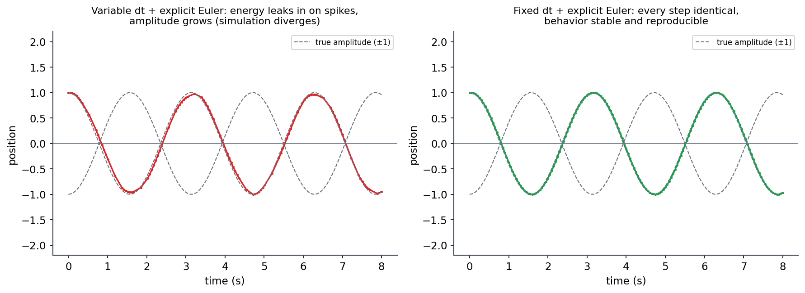
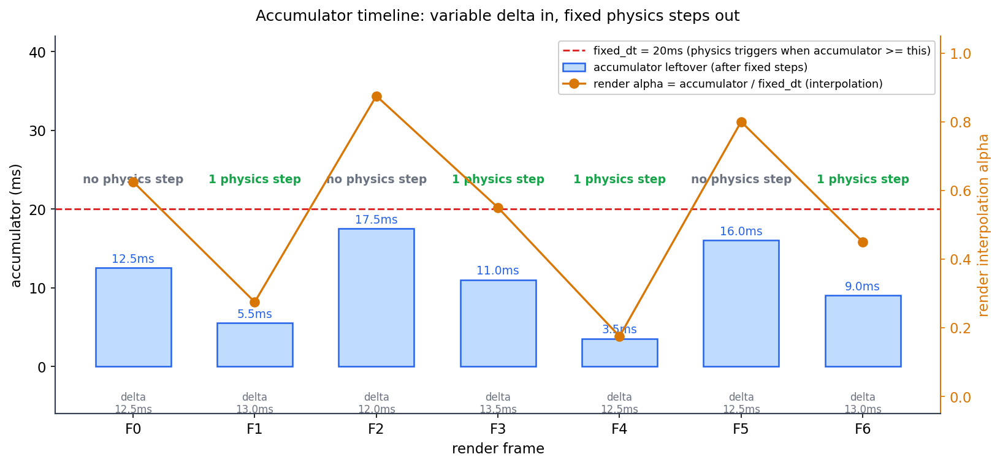
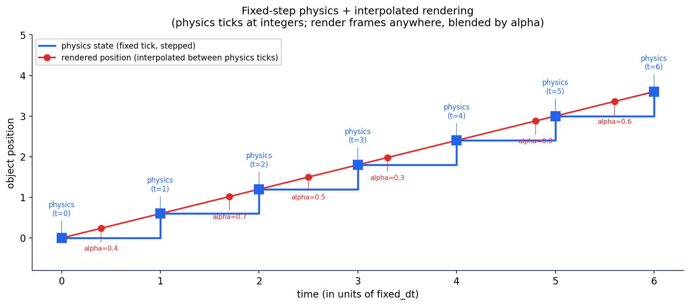
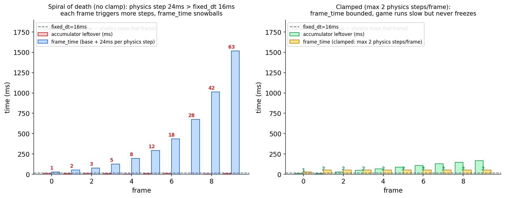

# 第 3 篇 · 第 10 章 · 主循环:fixed update vs render

> **核心问题**:上一章(P1-02)我们看清了主循环的三段式 input → update → render,也亲手摸到了"可变帧率陷阱"——同一份"每帧挪 1 像素"的代码,在 60 FPS 和 30 FPS 的机器上跑出来游戏速度差一倍。我们当时给出的解法预告是 delta time(`x += speed * dt`),并丢下一个悬念:delta time 还不够,物理更新要的是**固定步长**,这就引出了"accumulator 模式"。本章就来填这个坑。但这个坑比你想的深——它不是"加几行代码"那么简单,而是现代游戏引擎主循环的**核心招牌设计**:一帧里,物理更新用**固定步长**(永远 1/60 秒推进一次),渲染却用**可变步长**(跟着显示器 60/120/144 Hz 走),两者步长不一致,还要在一帧里协调起来。这听起来矛盾,引擎怎么做到的?答案就是 **accumulator(累加器)模式**——它把"可变的实际时间"攒起来,每攒够一个"固定步长"就跑一次物理,物理步长恒定,渲染帧率独立。本章把这个模式从动机到源码拆透。

> **读完本章你会明白**:
> 1. 为什么物理更新必须用**固定步长**:数值积分在变步长下不稳定、不可复现(承《物理引擎》显式欧拉不稳定的根,一句带过 + 指路);固定步长保证同样输入永远得到同样结果。
> 2. 为什么渲染用**可变步长**:画面刷新跟着显示器走(60/120/144 Hz),渲染要尽可能多画;渲染用插值把两个物理状态之间平滑地画出来。
> 3. **accumulator 模式**(本章核心):主循环每帧测 delta time 累加进 accumulator,`while(accumulator >= fixed_dt){ 物理 update(fixed_dt); accumulator -= fixed_dt; }`,渲染时用 `accumulator/fixed_dt` 当插值系数在两个物理状态间插值。物理步长恒定,渲染帧率独立。
> 4. **spiral of death(死亡螺旋)**:如果物理 update 本身耗时超过 fixed_dt,accumulator 越积越多、物理永远追不上,游戏卡死——对策是**钳位**(每帧最多跑 N 次物理,或钳位 delta)。
> 5. 真实引擎怎么做:用 Bevy 的 `RunFixedMainLoop` / `run_fixed_main_schedule` 源码,看 accumulator 循环怎么落地(它默认 64 Hz 而非 60 Hz,并用 `Time<Virtual>::max_delta` 防死亡螺旋)。

> **如果一读觉得太难**:先只记住三件事——① 物理用固定步长(数值稳定、可复现),渲染用可变步长(跟着显示器刷新率走);② 把可变的 delta time 攒进 accumulator,每攒够一个固定步长跑一次物理,渲染时用余数/步长当插值系数;③ 如果物理自己比固定步长还慢,accumulator 会爆炸,这叫死亡螺旋,要用钳位兜底。

---

## 〇、一句话点破

> **物理要的是"步长永远一样"(稳定、可复现),渲染要的是"想画多少次就画多少次"(流畅、跟着显示器走)——这两个诉求在一帧里是冲突的。accumulator 模式的妙处在于:它不让物理和渲染共用一个步长,而是让物理按固定步长"批量预演",渲染则在物理步之间用插值"平滑补帧"。具体做法:每帧把可变的 delta time 攒进累加器,每攒够一个固定步长就跑一次物理(物理永远不知道渲染帧率是多少),攒剩下的余数除以固定步长,就是渲染在两个物理状态之间插值的系数。**

这是结论。本章倒过来拆:先讲清物理为什么死活要固定步长(第一节),再讲清渲染为什么死活要可变步长(第二节),然后揭示"两个步长不一样"这个矛盾,最后用 accumulator 模式漂亮地解决它(第三节是核心),并把它在源码里落地(第四节 Bevy),最后讲死亡螺旋和它的钳位对策(第五节)。

---

## 一、为什么物理必须用固定步长

我们上一章结尾留的悬念是"delta time 让游戏速度和帧率解耦",看起来问题已经解决了——`x += speed * dt`,不管你 60 FPS 还是 30 FPS,一秒都走一样远。那为什么还要专门搞一个"固定步长"?因为 delta time 解决的是**移动一致性**,但物理仿真还有两个 delta time 解决不了、甚至会被它搞坏的要求:**数值稳定性**和**可复现性**。

### 要求一:数值稳定性——变步长会让物理"发疯"

物理仿真本质上是在做**数值积分**(numerical integration)。最朴素的积分是显式欧拉法(explicit Euler):已知当前位置 `x` 和速度 `v`,过一小段时间 `dt` 后,新位置 `x' = x + v * dt`,新速度 `v' = v + a * dt`(其中 `a` 是加速度)。这看起来就是"位置 += 速度 × dt",和上一章的移动公式一模一样。

问题在于:这个"乘 dt"的积分,是**近似**的,有误差。而且误差的大小**强烈依赖 dt**——dt 越大,误差越大;更要命的是,对于某些系统(比如弹簧、绳子、布料这种振荡系统),dt 一旦超过某个临界值,误差会**指数增长**,积分结果**发散**(amplitude 越来越大,最终爆炸)。

> **承接书讲过**:显式欧拉法为什么不稳定、为什么对振荡系统会发散、为什么物理引擎常用半隐式欧拉(Symplectic Euler)或 Verlet 替代它——这些是《物理引擎》那本书第 1 章和积分方法对应章的内核,本书**不重讲**,只承结论:**变步长下的数值积分不稳定**。你这里只要记住一条:**物理积分的稳定性,和 dt 的取值强相关;dt 越大越容易炸,dt 抖动(忽大忽小)更糟**。

我们用一个最简单的弹簧(x'' = -ω²x,ω=2)来看变 dt 和固定 dt 下显式欧拉的区别。左图模拟"每隔一帧来一个 0.18s 的卡顿 dt",右图固定 0.05s:



左图里,红色曲线本来应该老老实实在灰色虚线(±1 的真实振幅)之间振荡,但因为每隔一段时间来一个大 dt,显式欧拉的误差**单向地往系统里注入能量**,振幅越来越大,最后整个仿真"发疯"——这在游戏里就是:你堆的一摞箱子突然开始抖动、越抖越剧烈,最后"嘭"地飞上天;或者角色的绳子越拉越长、布料穿模。右图固定 dt,每一步完全相同,振幅稳定(轻微的能量增长也是固定可预测的,可以单独校正)。

> **不这样会怎样**:如果物理用可变步长(直接 `x += v * dt`,dt 用每帧实测),那么① 帧率不稳的机器(时不时卡一帧,dt 突然变大)上,物理会逐渐发散;② 哪怕帧率稳定,只要不同机器帧率不一样,同一份代码在不同机器上发散程度也不一样,有的机器炸了有的没炸。这就是为什么物理**绝不能直接用可变 dt**。

### 要求二:可复现性——同样输入,必须同样结果

物理还有一个比"稳定性"更隐蔽、但同样致命的要求:**可复现性**(determinism / reproducibility)。

设想一个场景:你做了一个网络游戏,用锁步同步(lockstep)——每个客户端把"自己这一帧按了什么键"广播给所有人,所有人本地跑物理,假设"同样输入 → 同样物理结果"。如果物理用固定步长,所有客户端每步 dt 都是 1/60 秒,同样的输入,浮点运算(在同样的指令集下)结果完全一致,世界状态永远对齐。

但如果物理用可变 dt,每个客户端帧率不一样,A 机器 60 FPS(dt=1/60),B 机器 45 FPS(dt=1/45),它们的 dt 不一样,浮点乘法的中间结果就有微小差异,这个差异在物理积分里每帧累积,**几分钟后,两个客户端看到的世界状态就完全对不上了**——你以为队友还在原地,他客户端上其实已经走出十米,技能对不上、碰撞对不上,游戏彻底崩坏。

哪怕不是网络游戏,可复现性也重要:调试一个"角色卡进墙里"的 bug,如果物理不可复现,你重放一次现场,可能因为帧率不同而**复现不出来**——这种 bug 能让团队抓狂一整周。固定步长保证:同样的初始状态 + 同样的输入序列 → **永远同样的演化轨迹**,bug 100% 可复现,可以录制回放,可以做单元测试。

> **钉死这件事**:物理仿真对步长有两个硬要求——**数值稳定性**(dt 太大或抖动会让积分发散)和**可复现性**(同样输入必须同样结果,这是网络同步和 bug 复现的前提)。这两个要求都指向同一个结论:**物理必须用固定步长**。可变 dt 满足不了它们。

### 那么"固定步长"和 delta time 矛盾吗

到这里你可能有个困惑:上一章不是说"要用 delta time,把游戏速度和帧率解耦"吗?现在又说"物理要固定步长,不能用 delta time"——这不矛盾吗?

不矛盾,要分清两件事:

1. **游戏逻辑**(角色移动、相机跟随、UI 动画、技能冷却):这些对数值稳定性不敏感(角色挪一格不会"发散"),对可复现性要求也不严(本地表现一致就行)。这类逻辑**可以用可变 dt**(`x += speed * dt`),跟着帧率走,简单自适应。
2. **物理仿真**(刚体动力学、碰撞响应、约束求解、绳布流体):这些对数值稳定性和可复现性**都严**,必须用**固定 dt**。

所以一帧的 update 段,其实是**混合**的:一部分用可变 dt(游戏逻辑),一部分用固定 dt(物理)。现代引擎的做法,通常是把物理相关的系统放进一个叫 `FixedUpdate`(或 `fixed_update`、`physics_step`)的调度里,用固定步长跑;其余逻辑放在 `Update` 里,每帧可变步长跑一次。本章讲的"固定步长 vs 可变步长",**聚焦在物理这一块**——它是最严格、也最值得单独拎出来讲的。

> **钉死这件事**:游戏逻辑可以用可变 dt(简单自适应),物理必须用固定 dt(稳定 + 可复现)。现代引擎通过两个独立的调度(`FixedUpdate` vs `Update`)把这两种步长分开。本章讲的 accumulator 模式,就是"怎么把固定步长的 `FixedUpdate` 嵌进可变帧率的主循环里"。

---

## 二、为什么渲染必须用可变步长

物理要固定步长,我们已经讲清了。那渲染呢?渲染为什么不用固定步长——比如"每 1/60 秒画一次",和物理一样?

因为渲染的关注点和物理**根本不同**:物理关心**每步算得准不准**,渲染关心**画得流畅不流畅、跟不跟得上显示器**。而"流畅"和"跟得上显示器"这两件事,都要求渲染**尽可能多画、可变步长地画**。

### 原因一:显示器刷新率五花八门,渲染要适配

显示器的刷新率不是固定的:老的 60 Hz,电竞屏 144 Hz,笔记本 120 Hz,iPad Pro 120 Hz(ProMotion),甚至 240 Hz。如果渲染强制固定 60 FPS("每 1/60 秒画一次"),那么在 144 Hz 的屏幕上,你会看到**画面每隔几帧重复一次**(因为 144 不是 60 的整数倍),出现**卡顿感**(stutter)——专业玩家一眼能看出来。

反过来,如果渲染用可变步长("尽可能多画,跟着显示器刷新走"),那么在 144 Hz 屏幕上渲染就 144 FPS,在 60 Hz 屏幕上就 60 FPS,**每个屏幕都流畅**。这是渲染必须可变步长的第一个原因:**适配不同刷新率的显示器**。

### 原因二:渲染要榨干性能,能画多少画多少

渲染还有个特点:它和物理不一样,**多画一帧不会出错**(物理多算一步可能发散,渲染多画一帧只是让画面更平滑)。所以渲染的策略是"**能画就画,有多少性能画多少帧**"——在 144 Hz 屏幕上,如果 GPU 跑得动,那就画 144 帧,让画面尽可能平滑;如果 GPU 跑不动,掉到 60 帧、30 帧,画面虽然不那么流畅,但也不会"算错"。

这种"自适应"的策略,要求渲染步长可变——你不知道下一帧 GPU 能不能跑动,所以不能预先固定"每 1/144 秒画一次",而要"每画完一帧,看 GPU 还有多少时间,接着画下一帧"。

### 原因三:渲染不要求可复现(画错了重来即可)

最后,渲染不需要可复现性。物理要可复现,是因为物理结果会**累积影响**世界状态(一步算错,后面全错)。渲染是**只读**地访问世界状态——它把当前世界状态画成画面,画完就丢,不影响下一步。所以渲染就算某一帧画"错"了(比如少画了一个粒子),下一帧重画一遍就修正了,不会有累积后果。这种"无累积后果"的性质,让渲染可以放心地用可变步长——步长抖动只会让画面轻微抖动,不会让游戏状态崩坏。

> **钉死这件事**:渲染用可变步长的三个原因——① 适配不同刷新率显示器(60/120/144 Hz 都要流畅);② 榨干性能,能画多少画多少(渲染多画一帧不出错);③ 渲染无累积后果(画错下一帧重画即可,不要求可复现)。这三个原因和物理的"必须固定步长"**正好相反**——所以渲染和物理,注定要用**不同的步长**。

---

## 三、矛盾来了:两个步长不一样,一帧里怎么协调

到这里我们撞上了本章的核心矛盾:

- **物理**:固定步长(比如永远 1/60 秒一步),稳定 + 可复现。
- **渲染**:可变步长(跟着显示器走,16.7ms / 6.9ms / 4.2ms 都可能),流畅。

问题是,这两者要在**同一个主循环里**协调。具体怎么冲突?看几个场景:

**场景一:渲染帧率 < 物理步长频率**。比如物理要 60 Hz(每 1/60 秒一步),但你的机器只能跑 30 FPS(每帧 33ms)。如果一帧只跑一次物理,那物理实际只跑了 30 Hz,慢了一半——游戏世界变成慢动作!

**场景二:渲染帧率 > 物理步长频率**。比如物理 60 Hz,但你的屏幕 144 Hz(每帧 6.9ms)。物理步长是 16.7ms,渲染一帧只过了 6.9ms,**根本不够攒一个物理步**。如果一帧还是跑一次物理,那物理就被强行提速到 144 Hz,游戏世界变成快进!

**场景三:渲染帧率刚好等于物理步长频率**。60 Hz 屏幕配 60 Hz 物理,看起来完美——一帧跑一次物理。但只要帧率**抖动**一下(某帧卡到 17ms,某帧又快到 16ms),物理步长就跟着抖,数值积分又开始不稳。

看出来了吗?"一帧跑一次物理"这个朴素做法,**不管在什么帧率下都会出问题**。问题根源是:**物理步长和渲染步长是两个独立的频率,不能简单地对齐**。

> **钉死这件事**:物理步长(固定,如 1/60 秒)和渲染步长(可变,跟着显示器)是**两个独立的频率**。朴素地"一帧跑一次物理"在渲染帧率 < 物理频率时会慢动作、> 时会快进、抖动时会数值不稳。怎么在一帧里协调这两个独立频率,就是 accumulator 模式要解决的问题。

### 一个会让你彻底坐住的极端例子:144 Hz 屏幕配 30 Hz 物理

为了让你对这个矛盾的"反直觉程度"有切身体会,我们再看一个极端例子。假设你的游戏设计目标是"物理 30 Hz 就够"(飞行模拟器、回合制策略这种不需要 60 Hz 物理精度的游戏),而你的玩家用的是 144 Hz 电竞屏。这时:

- 物理频率 30 Hz,fixed_dt = 33.3ms。
- 渲染频率 144 Hz,每帧 6.9ms。
- 一帧只过了 6.9ms,**离 fixed_dt 还差得远**(6.9 < 33.3)。

如果朴素地"一帧跑一次物理",那物理会被强行提到 144 Hz——飞行模拟器的物理会变成 4.8 倍速,飞机莫名其妙飞上天。

用 accumulator 模式呢?前 4 帧每帧攒 6.9ms,到第 5 帧时 accumulator = 5 × 6.9 = 34.5ms ≥ 33.3ms,**终于跑一次物理**,扣掉 33.3ms 剩 1.2ms。接下来 4 帧又攒不够,第 10 帧左右再跑一次……物理每 5 帧左右跑一次,折算下来正好 30 Hz 左右,**速度正确**。同时渲染每帧都画(144 FPS),用 alpha 在那两次物理状态之间平滑插值,玩家看到的是流畅的 144 帧画面,但物理世界以稳定的 30 Hz 演化。

这个例子说明 accumulator 模式的一个强大之处:**物理频率和渲染频率可以是任意的、互不相关的数值,accumulator 都能把它们协调好**。30 Hz 物理配 144 Hz 渲染可以,60 Hz 物理配 60 Hz 渲染可以,120 Hz 物理配 30 Hz 渲染也可以(这时一帧跑 4 次物理)。这就是"两个频率独立"的真正含义——**任何组合都能工作**。

> **钉死这件事**:accumulator 模式的威力不在于"物理 60 + 渲染 60"这种对齐场景(那种场景朴素做法也能凑合),而在于**任意组合都能协调**:30 Hz 物理配 144 Hz 渲染、120 Hz 物理配 30 Hz 渲染,都能正确工作。这种"频率任意组合"的鲁棒性,是它成为现代引擎标准解法的根本原因——你写一次循环,适配从 30 Hz 手机屏到 240 Hz 电竞屏的所有设备,不用为每个刷新率改代码。

---

## 四、accumulator 模式:把"可变"和"固定"用一个累加器调和

这一节是本章的核心。accumulator(累加器)模式是现代游戏引擎协调"固定物理步长"和"可变渲染帧率"的标准解法,思路极其优雅。

### accumulator 的核心思想:攒够一步,跑一步

accumulator 模式的核心,是引入一个**累加器**变量(就叫 `accumulator`),它扮演"时间蓄水池"的角色:

- 主循环每帧测一个 delta time(可变),**累加**进 accumulator;
- 然后**检查** accumulator:每攒够一个固定步长(fixed_dt),就**跑一次物理**(物理用 fixed_dt 推进,不用 delta time),同时从 accumulator 里**扣掉** fixed_dt;
- 这样反复,直到 accumulator < fixed_dt,剩下的余数留给下一帧继续攒;
- 最后渲染一帧,渲染时用 `accumulator / fixed_dt` 这个比例当**插值系数**(下一节讲为什么)。

伪代码:

```python
fixed_dt = 1 / 60          # 物理固定步长: 1/60 秒(也可以是 1/64, 见后文 Bevy)
accumulator = 0.0          # 时间蓄水池

while running:
    delta = measure_delta_time()    # 这一帧实际过了多久(可变)
    accumulator += delta            # 攒进蓄水池

    # 攒够一个固定步长就跑一次物理, 直到攒不够为止
    while accumulator >= fixed_dt:
        physics_update(fixed_dt)    # 物理永远用 fixed_dt, 数值稳定
        accumulator -= fixed_dt     # 扣掉一个固定步长

    alpha = accumulator / fixed_dt  # 余数 / 步长 = 插值系数(0~1)
    render(alpha)                   # 渲染用 alpha 在两个物理状态间插值
```

我们用一个具体例子走一遍。设 `fixed_dt = 20ms`,渲染帧率约 80 FPS(每帧 12.5ms,比 fixed_dt 小,所以单帧不够攒一次物理,要两帧凑一次):



- **F0**:delta 12.5ms,accumulator 从 0 涨到 12.5ms,< 20ms,**不跑物理**。alpha = 12.5/20 = 0.625,渲染时把物体画在"上一个物理状态"和"下一个物理状态"之间 0.625 的位置。
- **F1**:delta 13ms,accumulator = 12.5 + 13 = 25.5ms,≥ 20ms,**跑一次物理**(扣 20ms),剩 5.5ms。alpha = 5.5/20 = 0.275。
- **F2**:delta 12ms,accumulator = 5.5 + 12 = 17.5ms,< 20ms,**不跑物理**。alpha = 17.5/20 = 0.875。
- **F3**:delta 13.5ms,accumulator = 17.5 + 13.5 = 31ms,≥ 20ms,跑一次物理(剩 11ms),11ms 还 ≥ 20ms? 不,11 < 20,所以只跑一次。等等——你看图上 F3 标的是"1 physics step",对的。alpha = 11/20 = 0.55。

看出来了吗?**物理步数和渲染帧数完全解耦了**:有时一帧跑 0 次物理(F0、F2),有时一帧跑 1 次(F1、F3),极端情况下(渲染特别慢,一帧 delta 远大于 fixed_dt)一帧可能跑 2 次甚至更多物理。物理永远以 fixed_dt 的频率推进(频率由 fixed_dt 决定,和渲染帧率无关),渲染永远跟着显示器刷新率走。**两个频率独立,互不干扰**。

> **钉死这件事**:accumulator 模式用"时间蓄水池"把可变的 delta time 攒起来,每攒够一个固定步长跑一次物理。物理步数和渲染帧数解耦:渲染慢(帧率低)时一帧跑多次物理追上,渲染快(帧率高)时一帧跑零次物理不超速。物理步长永远固定(稳定 + 可复现),渲染帧率永远可变(流畅)。**这一个累加器,漂亮地解决了"两个频率独立"的矛盾**。

### 这个模式如何化解前面的三个场景

我们回头检验 accumulator 怎么化解前面三个冲突场景:

- **渲染帧率 < 物理频率(30 FPS 渲染,60 Hz 物理)**:每帧 delta = 33ms,accumulator 一帧攒 33ms,够跑 1 次 fixed_dt(20ms),剩 13ms;下一帧又攒 33ms 变 46ms,够跑 2 次,剩 6ms……平均下来,**物理每秒跑 60 次**,正好对上 60 Hz,游戏速度正常。不会慢动作。
- **渲染帧率 > 物理频率(144 FPS 渲染,60 Hz 物理)**:每帧 delta = 6.9ms,accumulator 每帧涨 6.9ms,大约每 2~3 帧才攒够一次 fixed_dt 跑物理。物理仍 60 Hz,渲染 144 FPS 顺畅,**不会快进**。
- **帧率抖动**:delta 忽大忽小,但 accumulator 平滑地把它们累加起来,物理步长始终是 fixed_dt,**不受抖动影响**,数值稳定。

这就是 accumulator 的威力——**不管渲染帧率怎么变,物理频率恒定**;**不管物理频率定多少,渲染跟着显示器走**。

> **承接书讲过**:为什么固定步长能保证数值稳定(显式欧拉在 dt 大时发散),为什么物理常用半隐式欧拉/Verlet——这些积分方法本身的稳定性分析,是《物理引擎》那本书第 1、6 章的内核,本书不重讲。本章只讲**引擎层面**怎么把"固定步长的物理"嵌进"可变帧率的循环",这是引擎和物理引擎的接口问题。

### 渲染插值:用 alpha 在两个物理状态之间平滑画面

accumulator 模式还有一个精妙的细节:渲染时那个 `alpha = accumulator / fixed_dt` 到底干嘛用?它是**插值系数**,用来在两个物理状态之间平滑画面。

问题来了:物理是离散地、每 fixed_dt 跑一次的,所以物理世界里物体的位置是**阶梯式**更新的——每跑一次物理,物体"咔"地跳一格。但渲染是连续地、每帧都画的(可能一帧里物理根本没跑),如果渲染直接画"物理最近一次的位置",那在 144 Hz 屏幕上,你会看到物体**卡 2~3 帧才动一下**,不平滑(虽然不掉帧,但物体像在"瞬移")。

解决办法:渲染时不画"物理最近一次的位置",而是画"**在最近一次物理位置和下一次物理位置之间,按 alpha 插值的位置**"。具体来说:

- 物理每次跑完,记下**当前状态**(`prev_state`)和**上一次状态**(`curr_state`,跑之前的)。
- 渲染时,`render_state = lerp(prev_state, curr_state, alpha)`,其中 `alpha = accumulator / fixed_dt` 是"这一帧渲染时,时间已经走完了当前物理步的多少比例"。

这样,即使一帧里物理没跑,渲染画出的物体也在**平滑地向前挪**(因为 alpha 在涨),不会有"卡几帧跳一下"的瞬移感。



看这张图:蓝色方块是物理状态,在整数时间点(t=0,1,2...)上阶梯式更新;红色圆点是渲染位置,在物理状态之间用 alpha 平滑插值。alpha=0.4 表示渲染时画在"上一个物理位置 + 40% 的(当前物理位置 - 上一个物理位置)";alpha=1.0 时渲染画在当前物理位置(下一帧物理就会推进,新的插值周期开始)。这样画面就连续平滑了。

> **钉死这件事**:物理是离散的(每 fixed_dt 跳一格),渲染是连续的(每帧画一次)。如果渲染直接画"物理最近的位置",高帧率屏幕上物体会"卡几帧跳一下"。解决办法是渲染用 `alpha = accumulator / fixed_dt` 在两个物理状态之间**线性插值**,让画面连续平滑。这是 accumulator 模式的画龙点睛——它不仅让物理频率恒定,还顺手解决了"物理离散、渲染连续"的画面平滑问题。

### 一个微妙但重要的问题:插值要用"上一帧和当前帧",不是"当前帧和下一帧"

插值系数 alpha 用起来有个坑:你是用"上一个物理状态 + alpha × (当前物理状态 - 上一个物理状态)",还是用"当前物理状态 + alpha × (下一个物理状态 - 当前物理状态)"?

数学上两者都行,但工程上**必须用前者**(prev → curr),不能用后者(curr → next)。为什么?因为"下一个物理状态"还没算出来——你要等下一次物理 update 才知道。如果你坚持用"当前 → 下一",那渲染就必须**提前**算一步物理,这一步物理的结果又会反过来影响游戏逻辑,逻辑全乱。

所以正确做法是:渲染永远画"**过去到当前**"这一段——它有一帧的延迟(渲染画的是"上一帧物理结束时的世界",而不是"这一帧物理刚算完的世界"),但这一帧延迟换来的是**物理和渲染的彻底解耦**:物理想怎么算怎么算,渲染只读"过去两个已知状态"插值,绝不预测未来。这一帧延迟(16ms)对人眼完全不可察觉,但换来的架构清晰度极大。

> **不这样会怎样**:如果渲染用"当前 → 下一"插值,就必须预测下一步物理,这要么破坏物理的可复现性(预测错了要回滚),要么破坏渲染和物理的解耦(渲染要等物理算完下一步)。用"上一帧 → 当前帧"插值,虽然画面滞后一帧(16ms,人眼不可察),但物理和渲染彻底解耦,架构干净。这是 accumulator 模式的一个工程细节,但是决定它能否落地的关键。

---

## 五、源码落地:Bevy 的 RunFixedMainLoop 怎么实现 accumulator

讲了这么多原理,我们看一个真实引擎怎么把 accumulator 模式写进代码。这里用 **Bevy**(bevyengine/bevy,Rust 数据导向 ECS 引擎)的源码,因为它把 accumulator 模式实现得**极其干净**,而且有几个设计细节值得专门讲透。

### Bevy 的主调度:把 FixedUpdate 嵌进 Main

先看 Bevy 的主调度(Main schedule)长什么样。在 Bevy 里,主循环每个 tick(对应一帧)跑一次 `Main` 调度,它按固定顺序执行一系列子调度:

```rust
// 简化示意, 改编自 crates/bevy_app/src/main_schedule.rs 的 MainScheduleOrder::default()
labels: vec![
    First.intern(),
    PreUpdate.intern(),
    RunFixedMainLoop.intern(),   // <-- 固定步长循环嵌在这里
    Update.intern(),             // <-- 可变步长游戏逻辑在这里
    SpawnScene.intern(),
    PostUpdate.intern(),
    Last.intern(),
],
```

(来源:[main_schedule.rs](https://github.com/bevyengine/bevy/blob/master/crates/bevy_app/src/main_schedule.rs) 的 `MainScheduleOrder::default()`,字段 `labels`。)

注意 `RunFixedMainLoop` 排在 `Update` **之前**:每一帧,先跑固定步长的物理/游戏逻辑(`RunFixedMainLoop` 内部会循环跑 `FixedMain` 零到多次),再跑一次可变步长的 `Update`(UI、相机跟随这类每帧一次的逻辑)。这正好对应我们讲的"物理固定步长 + 渲染前可变逻辑"的安排——物理先跑(可能跑多次),然后可变逻辑跑一次,最后渲染。

> **钉死这件事**:Bevy 用**两个独立调度**实现了"固定步长 + 可变步长"的分离:`RunFixedMainLoop`(内部循环跑 `FixedMain`,固定步长,物理在这里)和 `Update`(每帧一次,可变步长,游戏逻辑在这里)。这两个调度的存在,就是我们讲的"物理用固定步长、游戏逻辑用可变步长"在工程上的直接体现。

### 真正的 accumulator 循环:run_fixed_main_schedule

`RunFixedMainLoop` 这个调度本身只是个壳,真正干活的系统叫 `run_fixed_main_schedule`,它在 `crates/bevy_time/src/fixed.rs` 里。这个函数是 accumulator 模式的教科书级实现,我们逐行看:

```rust
// 来源: crates/bevy_time/src/fixed.rs 的 run_fixed_main_schedule
pub fn run_fixed_main_schedule(world: &mut World) {
    let delta = world.resource::<Time<Virtual>>().delta();
    world
        .resource_mut::<Time<Fixed>>()
        .accumulate_overstep(delta);                  // ① accumulator += delta

    // ② while accumulator >= fixed_dt { 跑物理; accumulator -= fixed_dt }
    let _ = world.try_schedule_scope(FixedMain, |world, schedule| {
        while world.resource_mut::<Time<Fixed>>().expend() {
            *world.resource_mut::<Time>() = world.resource::<Time<Fixed>>().as_generic();
            schedule.run(world);                       //   跑一次 FixedMain(物理)
        }
    });

    *world.resource_mut::<Time>() = world.resource::<Time<Virtual>>().as_generic();
}
```

逐行拆:

1. **① 累加**:`let delta = ...delta()` 取这一帧的可变 delta(从 `Time<Virtual>` 拿),然后 `accumulate_overstep(delta)` 把它加进 `Time<Fixed>` 的 `overstep` 字段——**`overstep` 就是我们的 accumulator**(Bevy 用了"超出固定步长的余数"这个更精确的命名)。
2. **② while 循环跑物理**:`try_schedule_scope` 里有个 `while expend()` 循环——`expend()` 是 `Time<Fixed>` 的方法,它干两件事:(a) 检查 `overstep >= timestep` 吗?是就 `overstep -= timestep`(扣掉一个固定步长),并 `advance_by(timestep)`(把固定时钟往前推一个固定步长),返回 `true`;(b) 否则返回 `false` 退出循环。每次 `expend()` 返回 `true`,就**把 `Time` 资源设成固定时钟**(`*world.resource_mut::<Time>() = ...as_generic()`),然后 `schedule.run(world)` **跑一次 `FixedMain` 调度**(物理系统们就在这里跑)。
3. **收尾**:循环结束后,把 `Time` 资源**切回**可变时钟(`Time<Virtual>`),让后面的 `Update` 调度用可变 delta。

> **钉死这件事**:Bevy 的 `run_fixed_main_schedule` 就是 accumulator 模式的直接落地——`accumulate_overstep(delta)` 对应"accumulator += delta",`while expend()` 对应"while accumulator >= fixed_dt",`schedule.run(world)` 对应"physics_update(fixed_dt)"。**原理和伪代码一一对应,工业级实现就是这么干净**。源码见 [crates/bevy_time/src/fixed.rs](https://github.com/bevyengine/bevy/blob/master/crates/bevy_time/src/fixed.rs)。

### 关键细节一:Bevy 默认 64 Hz,不是 60 Hz(★修正一个常见印象)

很多人(包括很多教程)想当然以为"固定步长就是 1/60 秒,60 Hz"。Bevy **不是**——它的默认固定步长是 **64 Hz,即 15625 微秒**(1/64 秒 ≈ 15.625ms)。源码:

```rust
// 来源: crates/bevy_time/src/fixed.rs
impl Time<Fixed> {
    /// Corresponds to 64 Hz.
    const DEFAULT_TIMESTEP: Duration = Duration::from_micros(15625);
    ...
}
```

为什么是 64 而不是 60?Bevy 的源码注释给了一个**极其精彩**的理由,值得完整引用:

> The default timestep is 64 hertz, or 15625 microseconds. **This value was chosen because using 60 hertz has the potential for a pathological interaction with the monitor refresh rate where the game alternates between running two fixed timesteps and zero fixed timesteps per frame** (for example when running two fixed timesteps takes longer than a frame). Additionally, the value is a power of two which losslessly converts into f32 and f64.

翻译 + 解读:如果你的物理步长正好是 60 Hz(16.67ms),而显示器也是 60 Hz(16.67ms),两者**完全同频**。这时只要物理稍微慢一点点(跑两次物理总耗时超过一帧),就会出现一种"病态交互":这一帧 accumulator 攒够了两个 fixed_dt(跑了两次物理,耗时超一帧),下一帧 accumulator 是空的(跑零次物理)。结果就是**物理步数在 2 和 0 之间剧烈抖动**——虽然平均还是 60 Hz,但每一帧的物理工作量忽多忽无,会让物理不稳定、画面有节奏地卡顿。

把固定步长设成 64 Hz(15.625ms),物理频率和 60 Hz 显示器**错开**一点,这种"病态同频共振"就不会发生。同时 15625 是 2 的幂(15625 = 10000... 二进制友好?其实 64=2⁶,1/64 秒转 f32/f64 是无损的),浮点转换无精度损失。这是一个**只有写过引擎的人才会撞到、撞到了才会记住**的细节——**固定步长不要和显示器刷新率同频**,否则会触发病态交互。

> ★**修正总纲印象**:总纲(以及很多教程)默认"固定步长 = 1/60 秒"。但 Bevy 的真实默认是 **64 Hz(15625µs)**,而且有非常具体的理由——**避开和 60 Hz 显示器的病态同频共振**,以及 2 的幂便于浮点无损转换。这是一个值得专门记住的源码事实。本书其他地方如果出现"60 Hz 物理",请理解为"示意性的固定步长",真实引擎的具体数值要查源码。

### 关键细节二:Bevy 用 Time<Virtual>::max_delta 防死亡螺旋,不是在 fixed 循环里钳位

讲到这里细心的读者会问:`run_fixed_main_schedule` 里那个 `while expend()` 循环**没有上限**——如果 delta 特别大,accumulator 攒了 10 个 fixed_dt,这帧就会跑 10 次物理。要是物理本身又慢,跑 10 次更慢,下一帧 delta 更大,accumulator 攒得更多……这不就是死亡螺旋吗?Bevy 在哪防的?

答案:Bevy 的死亡螺旋防御**不在 `run_fixed_main_schedule` 里**,而在**更上游**——`Time<Virtual>`(虚拟时钟)有一个 `max_delta`(默认 250ms),它在**测量 delta 之后、喂给 accumulator 之前**就把 delta 钳位了。源码在 `crates/bevy_time/src/virt.rs`:

```rust
// 来源: crates/bevy_time/src/virt.rs 的 advance_with_raw_delta (简化)
fn advance_with_raw_delta(&mut self, raw_delta: Duration) {
    let max_delta = self.context().max_delta;
    let clamped_delta = if raw_delta > max_delta {
        // 钳位: 单帧 delta 不超过 max_delta(默认 250ms)
        max_delta
    } else {
        raw_delta
    };
    ...
}

impl Time<Virtual> {
    const DEFAULT_MAX_DELTA: Duration = Duration::from_millis(250);
    ...
}
```

也就是说:无论真实过了多久(笔记本休眠一小时,raw_delta = 3600 秒),`Time<Virtual>::delta()` 返回的**最多是 250ms**。这个钳位后的 delta 才会被 `run_fixed_main_schedule` 拿去累加进 accumulator。所以一帧最多累加 250ms,按 fixed_dt=15.625ms 算,最多跑 `250 / 15.625 = 16` 次物理——**有上限,不会无限跑**。

这个设计的妙处在于:**钳位发生在 delta 这一层,而不是物理步循环里**。这样 `run_fixed_main_schedule` 本身可以写得很干净(就是一个朴素的 while 循环),不用操心防御;而 delta 钳位是个**通用机制**(不仅防死亡螺旋,还防"休眠醒来后游戏瞬移一小时"这种 bug),放在时间系统里更合理。Bevy 的源码注释把这一点讲得非常清楚:

> By limiting the maximum time that can be added at once, we also limit the amount of virtual time the game needs to compute for each frame. This means that the game will run slow, and it will run slower than real time, but **it will not freeze and it will recover as soon as computation becomes fast again**.

> **钉死这件事**:Bevy 防死亡螺旋,**不是**在 `while expend()` 循环里加"每帧最多 N 步"的钳位,而是在更上游的 `Time<Virtual>::max_delta`(默认 250ms)上钳位 delta。这样一帧最多累加 250ms,最多跑 16 次物理,有上限。**钳位 delta 而不是钳位物理步数**,是个更优雅的设计——`run_fixed_main_schedule` 保持干净,防御逻辑统一在时间系统里。源码见 [crates/bevy_time/src/virt.rs](https://github.com/bevyengine/bevy/blob/master/crates/bevy_time/src/virt.rs)。

### 关键细节三:渲染插值的 alpha,Bevy 直接给你 overstep_fraction

我们前面讲渲染要用 `alpha = accumulator / fixed_dt` 插值。Bevy 把这个 alpha 直接做成了 API——`Time<Fixed>::overstep_fraction()`(f32)和 `overstep_fraction_f64()`(f64):

```rust
// 来源: crates/bevy_time/src/fixed.rs
impl Time<Fixed> {
    pub fn overstep_fraction(&self) -> f32 {
        self.context().overstep.as_secs_f32() / self.context().timestep.as_secs_f32()
    }
    pub fn overstep_fraction_f64(&self) -> f64 {
        self.context().overstep.as_secs_f64() / self.context().timestep.as_secs_f64()
    }
}
```

`overstep` 就是 accumulator(扣完物理步后的余数),`timestep` 就是 fixed_dt,两者相除就是我们讲的 alpha。Bevy 还专门留了一个系统集 `RunFixedMainLoopSystems::AfterFixedMainLoop`,让你把**插值系统**放进去——它在所有物理步跑完之后、`Update` 之前运行,正好是拿 `overstep_fraction()` 做插值的时机:

```rust
// 来源: crates/bevy_app/src/main_schedule.rs (注释里的示例)
// 把"上一帧物理状态"和"当前物理状态"之间插值, 画出平滑画面
App::new()
  .add_systems(FixedUpdate, update_physics)
  .add_systems(
    RunFixedMainLoop,
    interpolate_transforms.in_set(RunFixedMainLoopSystems::AfterFixedMainLoop));
```

这正是我们讲的"渲染用 alpha 在两个物理状态间插值"在 Bevy 里的标准做法。注意:Bevy 把插值系统放在 `RunFixedMainLoop` 内部的 `AfterFixedMainLoop` 集合里(物理跑完之后),而真正的渲染(draw call 提交)在更后面的 `PostUpdate` / 渲染子 App 里——但插值系数的计算时机,就是在物理刚跑完、`overstep` 还是当前余数的时候。

> **钉死这件事**:Bevy 把我们讲的"alpha = accumulator / fixed_dt"直接做成了 `Time<Fixed>::overstep_fraction()` API,并提供了 `RunFixedMainLoopSystems::AfterFixedMainLoop` 系统集让你放插值系统。**原理(渲染插值) → API(overstep_fraction) → 系统集(AfterFixedMainLoop)**,三层对应,工业级引擎就是这么把一个原理干净地落地。

### 关键细节四:暂停、子弹时间、变速回放——accumulator 怎么和"虚拟时钟"配合

accumulator 模式还有一层设计常被忽略:**游戏时间不是真实时间**。玩家按暂停,游戏世界应该停下来(物理不跑),但主循环还在转(还要画暂停菜单)。或者游戏要做"子弹时间"(主角放慢动作),物理要变慢但不能发散。或者做回放系统,要按录制的速度重放物理。这些场景下,"喂给 accumulator 的 delta"不能是真实时间,得是**虚拟时间**(virtual time)。

Bevy 用三套时钟解决这个问题:`Time<Real>`(真实时间)、`Time<Virtual>`(虚拟游戏时间,可暂停/变速)、`Time<Fixed>`(固定步长时钟,跟虚拟时间)。`run_fixed_main_schedule` 第一行 `let delta = world.resource::<Time<Virtual>>().delta()` 取的是**虚拟**时间的 delta,不是真实时间。这意味着:

- **暂停**:`Time<Virtual>` 被 `pause()` 后,它的 `delta()` 返回 0,accumulator 不增长,`while expend()` 一次都不跑——物理完全停下,但主循环和渲染照常。玩家看到的是暂停画面,物理世界冻结。
- **子弹时间**:把 `Time<Virtual>` 的 `relative_speed` 设成 0.3(真实 1 秒 = 游戏 0.3 秒),delta 被缩放到 0.3 倍,accumulator 涨得慢,物理步触发得少——游戏世界以 30% 速度演化,但每步还是 fixed_dt(数值依然稳定)。这就是"子弹时间"的标准实现:**不是改 fixed_dt**(那会破坏物理稳定性),而是**改喂给 accumulator 的虚拟 delta**。
- **变速回放**:回放时把 `relative_speed` 设成 2.0,游戏世界以 2 倍速演化(物理跑得密),但每步仍是 fixed_dt,物理结果和原录制完全一致(因为每步输入相同、步长相同)。

这个设计的精妙之处:**fixed_dt 永远不变(物理稳定),变的是"虚拟 delta 喂给 accumulator 的速度"**。所有"暂停/变速/回放"的需求,都在虚拟时钟这一层解决,物理层完全不用改。这就是为什么 Bevy 要分三套时钟——真实时间(测墙钟)、虚拟时间(游戏逻辑用)、固定时间(物理用),各管各的,组合起来能表达任意复杂的速度控制。

> **钉死这件事**:游戏时间 ≠ 真实时间。暂停、子弹时间、变速回放这些需求,不能通过"改 fixed_dt"实现(那会破坏物理稳定),而要引入**虚拟时钟**——喂给 accumulator 的 delta 是虚拟 delta(可暂停、可变速),fixed_dt 永远不变。Bevy 用 `Time<Real>`/`Time<Virtual>`/`Time<Fixed>` 三套时钟分离这三个关注点,这是工业级引擎处理"时间"这个概念的标配做法。源码见 [crates/bevy_time/src/virt.rs](https://github.com/bevyengine/bevy/blob/master/crates/bevy_time/src/virt.rs) 的 `pause`/`set_relative_speed`。

---

## 六、死亡螺旋:accumulator 模式最大的坑,和怎么治

accumulator 模式优雅归优雅,但它有一个**致命的失败模式**,叫**死亡螺旋(spiral of death)**。这是每个写过主循环的人都撞过的坑,本章必须讲透。

### 什么是死亡螺旋

死亡螺旋的场景是:**物理 update 本身的耗时,超过了 fixed_dt**。

假设 fixed_dt = 16ms(60 Hz 物理),但你的物理 update(碰撞检测 + 约束求解)因为场景里物体太多,实际跑一次要 24ms。现在一帧发生了什么:

1. 主循环测到上一帧花了 24ms,delta = 24ms。
2. accumulator += 24 → accumulator = 24ms。
3. `while accumulator >= 16`:跑物理(耗时 24ms),accumulator -= 16 → accumulator = 8ms……等等,这一步**还没完**。注意,accumulator 一开始是 24ms,跑完一次物理后是 8ms,循环退出。但是!**这次物理本身花了 24ms**,意味着这一帧实际耗时变成了 24ms(物理)+ 渲染等 = 远超 16ms,所以**下一帧的 delta 会更大**——比如 30ms。
4. 下一帧 delta = 30ms,accumulator = 8 + 30 = 38ms,够跑 2 次物理(扣 32ms),剩 6ms。但跑 2 次物理耗时 48ms,这一帧实际耗时 48ms+,下一帧 delta 更大……
5. 再下一帧 delta = 50ms,accumulator = 6 + 50 = 56ms,够跑 3 次物理……
6. ……

看出来了吗?**accumulator 越积越多,每帧跑的物理步数越来越多,每帧耗时越来越长,delta 越来越大——这就是死亡螺旋**。游戏会越来越卡,最终完全冻结,只剩物理在拼命追,永远追不上。玩家看到的就是画面彻底卡死。

我们把它数值模拟出来。设 fixed_dt=16ms,物理单步耗时 24ms,每帧渲染基础开销 4ms,不钳位:



左图清清楚楚:从第 0 帧到第 9 帧,frame_time(蓝条)从约 28ms 单调飙升到 1500ms 以上,accumulator 余数(红条)也跟着爆炸。10 帧之内,游戏彻底冻结。这就是死亡螺旋——**物理自己比固定步长还慢,accumulator 永远追不上,游戏卡死**。

### 死亡螺旋的对策:钳位

死亡螺旋怎么治?根因是"accumulator 无限增长,物理步数无限增多"。对策就是**给 accumulator 或物理步数加一个上限**,让它不能无限涨:

**对策一:钳位 delta(上游钳位,Bevy 的做法)**。最干净的做法:在 delta 进入 accumulator 之前就钳位它——`delta = min(delta, max_delta)`。这样无论真实过了多久,accumulator 一帧最多涨 max_delta,物理步数有上限。Bevy 的 `Time<Virtual>::max_delta` 默认 250ms 就是这个(见上一节)。代价:如果机器真的跑不动物理,游戏会**慢动作**(实际过了 1 秒,游戏只推进 250ms),但**不会冻结**,等性能恢复就追回来。

**对策二:钳位物理步数(下游钳位,很多教程的做法)**。另一种做法:直接在 `while` 循环里加"最多跑 N 次"的限制:

```python
max_steps_per_frame = 5
steps = 0
while accumulator >= fixed_dt and steps < max_steps_per_frame:
    physics_update(fixed_dt)
    accumulator -= fixed_dt
    steps += 1
# 如果退出循环时 accumulator 还 >= fixed_dt, 说明追不上了, 直接清空(放弃追赶)
if accumulator >= fixed_dt:
    accumulator = 0   # 放弃追赶, 物理会"丢时间", 但不卡死
```

代价:如果物理追不上,会**丢时间**(accumulator 被强制清空,游戏时间会和真实时间偏离),但同样不冻结。这种做法更直接,很多教程和早期引擎用它。

> **钉死这件事**:死亡螺旋的根因是"物理自己比 fixed_dt 还慢,accumulator 无限增长"。对策是**钳位**——要么钳 delta(Bevy 的 `max_delta`,上游钳位,更优雅),要么钳物理步数(`max_steps_per_frame`,下游钳位,更直接)。两种代价都是"游戏慢动作 / 丢时间",但都比"卡死"好。**宁可慢,不可死**——这是实时系统的一个通用准则。

### 死亡螺旋本质上在提醒你:物理太慢了

最后说一句:钳位只是**症状治疗**,不是根治。死亡螺旋的本质是**你的物理 update 太慢了**——单次物理步的耗时已经超过了 fixed_dt,这本身就是个性能警报。真正的解法是:

- **简化物理**:减少碰撞体数量、降低约束求解迭代次数、用更简单的碰撞检测算法。
- **增大 fixed_dt**:如果不需要那么高的物理精度,把 fixed_dt 从 1/60 调到 1/30(物理频率减半,每步预算翻倍)。代价是物理精度下降(碰撞响应没那么细腻,快速运动物体可能穿透)。
- **优化物理实现**:用 SIMD 加速碰撞检测、用更高效的数据结构(BVH、空间划分)做宽相。这正是第 2 篇 ECS 数据导向的主战场——把碰撞体的位置数据连续存放、SIMD 批量处理,物理 update 能快好几倍。

钳位是**兜底**(防止卡死),性能优化才是**根治**。这也是为什么我们下一章(P3-11)讲 delta time 时会专门讲"delta 平滑、钳位"——它们都是主循环的防御工事,但真正的性能来自 update 段本身够快(那是第 2 篇 ECS 的主战场)。

### 一个常被忽略的中间方案:动态子步(substepping)

除了"钳位"和"优化物理",还有个中间方案值得知道:**动态子步(substepping)**。它的思路是:如果这一帧的 delta 实在太大(物理需要跑很多步才追得上),不要一次性全跑(怕触发死亡螺旋),而是**自适应地降低物理精度**——把原本应该跑 8 步的物理,合并成跑 2 步(每步 dt 变大,但还在稳定范围内)。这本质上是"宁可精度降,不要卡死也不要丢时间"。

很多专业物理引擎(Havok、PhysX、Box2D)内部就有 substepping 机制:它们接受一个"建议步长",但内部会根据需要自动拆分或合并。这种机制比单纯钳位更聪明,但实现也复杂得多。本书不展开,这里只让你知道有这么个中间方案,知道"钳位不是唯一解"。

> **钉死这件事**:死亡螺旋的解法谱系——① 钳位(最简单,慢动作或丢时间);② 优化物理(根治,但工作量大);③ 动态子步(中间方案,自适应降精度)。**这三者不是互斥的,真实引擎常常三者并用**:平时靠优化物理不触发死亡螺旋,极端情况(delta 爆炸)靠钳位兜底,日常大 delta 靠子步平滑过渡。理解这个谱系,你就理解了主循环防御工事的全貌。

---

## 七、技巧精解:accumulator 模式里两个容易被忽视的精妙之处

accumulator 模式看起来就一个 while 循环,没什么花样。但它有两个细节,新手容易写错、老手也要小心,这一节单独拆透。

### 技巧一:渲染插值必须用"上一帧 → 当前帧",不能预测未来

我们前面提过,渲染插值要用"上一个物理状态 → 当前物理状态"这一段,不能用"当前 → 下一"。这里展开讲为什么这个细节**决定架构能否成立**。

数学上,`alpha = accumulator / fixed_dt` 这个系数,你既可以用它插值"过去 → 当前"(向后看),也可以插值"当前 → 未来"(向前看)。两个方向的数学公式对称,看起来都行。但工程上,向前看要求**未来那一帧的物理状态已知**,而未来还没发生——你要么提前跑一步物理(破坏解耦),要么预测(破坏可复现)。

向后看就没这个问题:"上一帧物理状态"和"当前物理状态"都是**已知的历史**,渲染只读它们做插值,绝不预测。代价是渲染画面**滞后一帧**(约 16ms,人眼完全不可察),换来的是物理和渲染的**彻底解耦**:物理爱怎么算怎么算,渲染只读历史,互不干扰。

> **不这样会怎样**:如果渲染用"当前 → 下一"插值,就必须先算出下一步物理。这一步物理的结果如果和"真正下一帧"算出来的不一致(比如输入变了),就要回滚——物理回滚是噩梦(连带物理引擎、网络同步、录制回放全要改)。用"上一帧 → 当前帧"插值,虽然画面滞后 16ms,但**物理和渲染的接口是单向只读的**,架构干净到可以独立测试。这是 accumulator 模式能落地的工程基石。

很多新手第一次实现 accumulator,会本能地想"渲染要画最新画面,所以应该往前插值"——这个直觉是错的。**渲染永远画过去,不画未来**,这是实时系统的通用准则(预测总是危险,只读历史总是安全)。

### 技巧二:固定步长不要和显示器刷新率"完全同频"

这个技巧来自 Bevy 的设计(见第五节)。直觉上,物理 60 Hz 配显示器 60 Hz,看起来"完美匹配"。但实际上,**完全同频会触发病态交互**:

如果物理 60 Hz(16.67ms)和显示器 60 Hz(16.67ms)同频,只要物理稍微慢一点(跑两次物理总耗时 > 16.67ms),就会出现:**这一帧** accumulator 攒够两个 fixed_dt(跑两次物理,耗时超一帧,这帧 delta 变大),**下一帧** delta 大但 accumulator 已经被扣空(跑零次物理),再下一帧又攒够两个……物理步数在 **2 → 0 → 2 → 0** 之间剧烈震荡。虽然平均还是 60 Hz,但每一帧的物理工作量忽多忽无,会让物理积分不稳定(步长不均匀),画面有节奏地卡顿(每帧渲染的东西在"动很多 → 不动 → 动很多 → 不动"之间跳)。

Bevy 的解法:**固定步长设成 64 Hz(15.625ms),和 60 Hz 显示器错开**,这种病态同频共振就不会发生。这个技巧的本质是:**两个周期性系统(物理步长和显示器刷新率)的频率比,不要是有理数(尤其不要是 1:1),否则会触发共振**。这是信号处理里"混叠"(aliasing)思想在游戏循环里的体现。

> **钉死这件事**:固定步长不要设成和显示器刷新率**完全相同**的频率(60 Hz 物理配 60 Hz 显示器是错的)。要用 64 Hz、50 Hz 这种"错开"的频率,避免物理步数在"多次 ↔ 零次"之间震荡。Bevy 选 64 Hz,既是 2 的幂(浮点无损),又和 60 Hz 错开,一举两得。**这是一个只有踩过坑才会知道的细节**,真实引擎的源码注释里藏着无数这种"为什么是这个数"的智慧。

### 反面对比:为什么"一帧跑一次物理"的朴素做法全错

回到这一节的反面对比。如果你不用 accumulator 模式,朴素地"一帧跑一次物理,物理用 delta time",前面分析的三个场景全崩:

- **渲染帧率 < 物理频率**:物理被渲染帧率拖慢,游戏变慢动作。
- **渲染帧率 > 物理频率**:物理被渲染帧率拖快,游戏变快进。
- **帧率抖动**:物理 dt 抖动,数值积分不稳,弹簧绳子布料发疯。
- **可复现性**:不同机器帧率不同,物理结果不同,网络同步和 bug 复现全崩。

accumulator 模式用**一个累加器** + **固定步长循环** + **渲染插值**,把这四个问题**一次性全解决**——物理频率恒定(不慢不快不抖动可复现),渲染帧率独立(适配各种显示器),两者用插值平滑衔接。这就是为什么它是现代游戏引擎主循环的**招牌设计**,值得单开一章讲透。

---

## 八、章末小结

### 回扣主线

本章是"驱动"这一面的招牌章。我们把上一章(P1-02)留下的"delta time 还不够,物理要固定步长"的悬念填了。看清了:

1. **物理必须用固定步长**(数值稳定 + 可复现),渲染必须用可变步长(适配显示器 + 榨干性能 + 无累积后果),两个步长是**独立频率**,朴素"一帧一次物理"在三处都崩。
2. **accumulator 模式**漂亮调和这个矛盾:可变 delta 攒进累加器,每攒够一个固定步长跑一次物理(物理频率恒定),渲染用余数/步长当插值系数在两个物理状态间平滑(渲染帧率独立)。
3. **Bevy 的工业级实现**:`RunFixedMainLoop` 调度里嵌 `run_fixed_main_schedule`,用 `Time<Fixed>` 的 `overstep`(accumulator)+ `expend()`(while 循环)+ `overstep_fraction()`(插值 alpha)三件套落地;默认 64 Hz(非 60 Hz)避开显示器同频共振;用 `Time<Virtual>::max_delta`(250ms)在 delta 层钳位防死亡螺旋。
4. **死亡螺旋**:物理自己比 fixed_dt 还慢时 accumulator 爆炸,对策是钳位(钳 delta 或钳步数),宁可慢动作不可卡死。

本章服务的是二分法的**驱动**这一面——讲清"循环怎么跑、两个步长怎么协调"。下一章(P3-11)继续讲驱动的另一块(delta time 怎么算、怎么平滑),再下一章(P3-12)转到组织(场景图、空间划分)。

### 五个为什么

1. **为什么物理要固定步长,delta time 不行?**——两件事:① 数值稳定(dt 大或抖动时显式欧拉发散,弹簧布料发疯);② 可复现(同样输入必须同样结果,网络同步和 bug 复现的前提)。delta time(可变)两件都做不到。
2. **为什么渲染要可变步长,固定不行?**——三件事:① 适配 60/120/144 Hz 不同显示器(固定 60 在 144 屏上节奏乱);② 榨干性能能画就画(渲染多画不出错);③ 渲染无累积后果(画错下一帧重画,不要求可复现)。
3. **accumulator 模式怎么调和两个独立频率?**——把可变 delta 攒进累加器,每攒够一个固定步长跑一次物理(物理频率由 fixed_dt 决定,和渲染无关),渲染用余数/步长(alpha)在两个物理状态间插值(渲染跟着显示器走)。物理步数和渲染帧数完全解耦。
4. **渲染插值为什么要"向后看"(上一帧→当前),不能"向前看"(当前→下一)?**——向前看要求预测未来物理状态,要么提前算(破坏解耦)要么预测(破坏可复现)。向后看只读历史,虽然画面滞后一帧(16ms 不可察),但物理和渲染彻底解耦,架构干净。**实时系统通用准则:不预测未来,只读历史**。
5. **死亡螺旋是什么,怎么治?**——物理单步耗时 > fixed_dt 时,accumulator 无限增长、每帧物理步数越来越多、帧耗时雪崩,游戏冻结。对策是钳位:Bevy 在 delta 层钳(`Time<Virtual>::max_delta` 250ms),也有人在物理步循环钳(`max_steps_per_frame`)。代价是慢动作/丢时间,但比卡死好。**根治是优化物理本身(那是 ECS/数据导向的事)**。

### 想继续深入往哪钻

- 想搞懂 delta time 怎么算、怎么平滑、怎么钳位:下一章 P3-11。
- 想搞懂数值积分为什么变 dt 不稳定(显式 vs 半隐式 vs Verlet):《物理引擎》那本书的积分方法章(本书一句带过)。
- 想搞懂 Bevy 的时间系统全貌(`Time<Real>` / `Time<Virtual>` / `Time<Fixed>` 三套时钟):直接读 [crates/bevy_time/src/](https://github.com/bevyengine/bevy/blob/master/crates/bevy_time/src/) 的 `time.rs`、`virt.rs`、`fixed.rs`、`real.rs`。
- 想搞懂网络同步怎么依赖固定步长(锁步 lockstep / 状态同步):那是另一本书的话题,本书不展开。
- 想搞懂物理引擎本身(碰撞、约束、积分):《物理引擎》那本书。

### 引出下一章

本章我们把"固定步长 vs 可变步长"讲透了,但有个底层细节一直被我们当黑盒用——`measure_delta_time()` 这个函数,它到底怎么算"上一帧花了多久"?它要防哪些坑(系统时钟精度、休眠醒来、窗口拖动、GC 停顿)?delta time 要不要平滑(避免抖动)?这些是下一章 P3-11《delta time 与帧率》的主角。带着"delta time 这个数怎么算准、怎么用稳"的问题,我们进下一章。

> **下一章**:[P3-11 · delta time 与帧率](P3-11-delta-time-与帧率.md)
