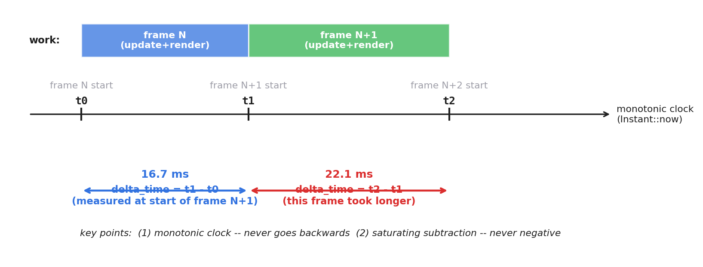
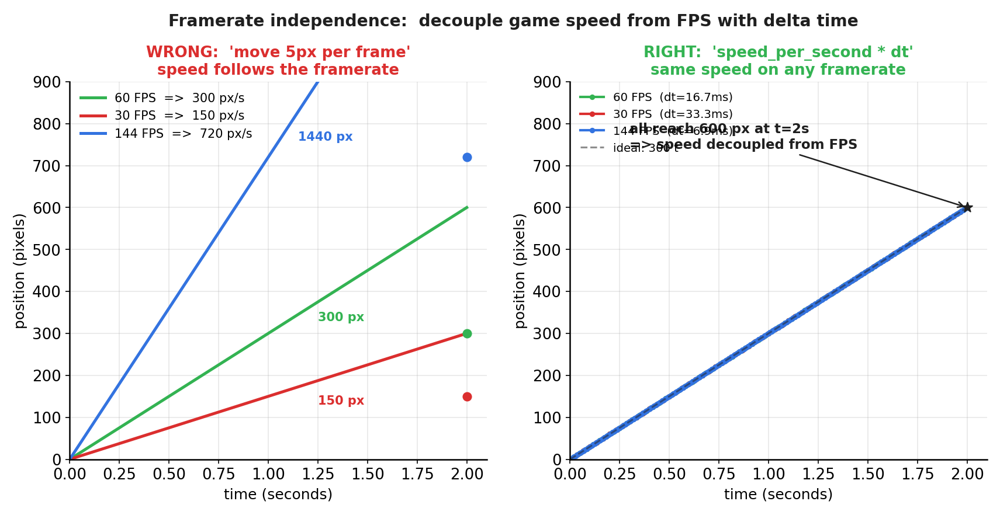
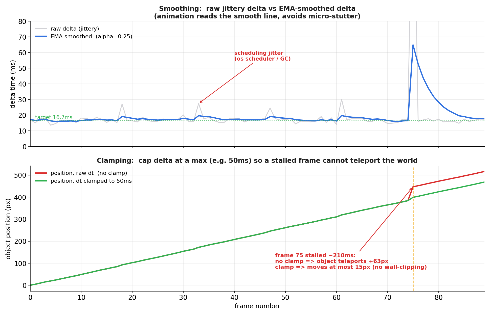
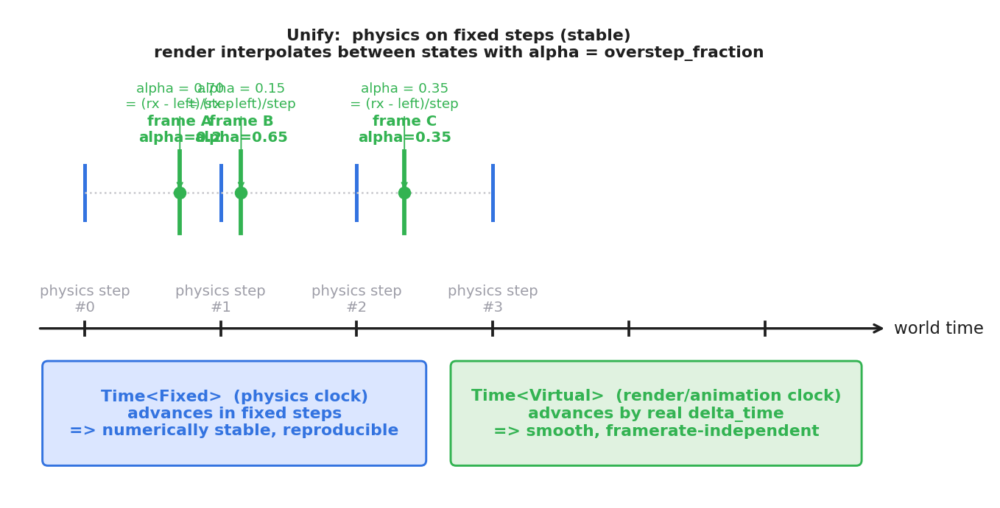

# 第 3 篇 · 第 11 章 · delta time 与帧率

> **核心问题**:上一章(P3-10)我们把 accumulator 模式讲透了——物理用固定步长、渲染用可变步长,可那个"可变步长"到底怎么算出来的?这一章正面回答:**"上一帧实际花了多久"这个数(delta time,简称 dt),到底怎么量、怎么用、怎么不让它坑你**。这个问题听起来简单——读个系统时钟、做个减法嘛——可它身后的坑层层叠叠:同一份"每帧挪 5 像素"的代码,在 144 Hz 屏上比 60 Hz 屏快两倍多;某一帧窗口切到后台,dt 突然变成 500ms,角色一帧穿墙穿到地图外;操作系统调度抖一抖,dt 在 14ms 和 19ms 之间乱跳,角色边缘像在抽搐。这些坑每一个都踩过无数游戏开发者。本章把上一章 P1-02 预告的"可变帧率陷阱"彻底兑现,讲清 delta time 怎么算、怎么平滑、怎么钳位、怎么和 P3-10 的固定步长在同一个主循环里和平共处。

> **读完本章你会明白**:
> 1. delta time 怎么算:本帧开始的时间戳减去上一帧开始的时间戳,用**单调高精度时钟**(monotonic clock),为什么绝不能用墙上时钟(`time(NULL)`)。
> 2. 为什么用 `speed * dt` 能让动画帧率独立:把"每帧移动多少"换成"每秒移动多少 × 实际经过时间",游戏速度就和帧率解耦——P1-02 预告的坑,这里彻底填平。
> 3. delta time 为什么不能裸用:实测 dt 会抖动(调度 / GC / 驱动),要平滑(EMA 指数移动平均);偶尔一帧会爆(窗口切后台 / 系统休眠),要钳位(clamp 到一个上限,Bevy 默认 250ms)。
> 4. 固定步长(P3-10)和 delta time(P3-11)在同一个主循环里怎么统一:**物理跑固定步长保数值稳定,动画 / 渲染插值用 delta time 保视觉平滑**——两者分工,不是二选一。
> 5. Bevy 怎么落地:三套时钟 `Time<Real>` / `Time<Virtual>` / `Time<Fixed>` 各管一摊,`time_system` 在 `First` 调度里串起来。

> **如果一读觉得太难**:先记住三件事——① delta time = 本帧时间戳 − 上一帧时间戳,用单调时钟;② 所有"移动 / 动画"逻辑写成 `位移 = 每秒速度 × delta_time`,不要写"每帧固定多少";③ delta time 要钳位(防止卡顿帧瞬移)和可选地平滑(防止抖动),物理则另用固定步长(P3-10)。

---

## 〇、一句话点破

> **delta time 是上一帧实际经过的真实时间。游戏里所有"按时间推进"的逻辑——移动、动画、粒子、计时器——都该写成"每秒速度 × delta time",这样无论机器跑 30 帧还是 144 帧,游戏世界的"时间流速"都一致。但 delta time 不能裸用:它实测会抖(调度 / GC),要平滑;它偶尔会爆(卡顿 / 切窗),要钳位。物理则另走固定步长这条路(P3-10),渲染在两个物理状态之间用 alpha 系数插值。**

这是结论。本章倒过来拆:先看 delta time 到底怎么量出来,再看为什么 `speed * dt` 能解帧率独立的毒,然后逐个拆掉它身后的三个坑(抖动、爆掉、和固定步长的关系),最后看 Bevy 怎么用三套时钟把这一切落地。

---

## 一、先把 delta time 算出来:本帧时间戳减上一帧时间戳

### 最朴素的问题:上一帧花了多久?

回到上一章 P1-02 的可变帧率陷阱。我们已经知道"每帧挪 5 像素"不行,得改成"每秒挪 300 像素 × 这一帧实际经过的时间"。可这个"实际经过的时间"从哪来?

最直觉的答案:量呗!游戏开始时记一下时刻,每帧再量一下时刻,两个时刻一减,不就知道"这一帧实际花了多久"了吗?——对,但这背后藏着一连串"量时间"的工程问题:用哪个时钟?那个时钟准不准?会不会往回跳?精度够不够?这一节就把这些问题一个个拆掉。

答案是:**在每帧开始时,量一下"现在是什么时刻",和"上一帧开始时是什么时刻"一减,就是上一帧实际花的时间**。这个时间差,叫 **delta time**(或简称 `dt`)。

```
   时间轴 (单调高精度时钟):

   t0 ──────────── t1 ──────────────── t2 ───>  now
   │   delta_time │       delta_time   │
   │   = t1 - t0  │       = t2 - t1    │
   ▼              ▼                    ▼
   帧 N 开始       帧 N+1 开始            帧 N+2 开始
   (16.7ms 后)    (22.1ms 后)
```



代码上,最朴素的写法是这样(伪代码):

```python
import time

last_time = monotonic_now()    # 单调时钟的当前时刻
while running:
    now = monotonic_now()
    dt = now - last_time       # delta time: 两帧开始时刻之差
    last_time = now

    process_input()
    update(dt)                 # 把 dt 传给 update
    render()
```

注意几个细节,新手特别容易写错:

1. **dt 是"两帧开始时刻的差",不是"update 段花的时间"**。它包含了上一帧从开始到结束的全部开销:input + update + render + swap buffers + 等垂直同步。所以 dt = 16.7ms(60 FPS 一帧的完整周期),而不是 update 那一段的耗时。
2. **量时刻要在帧的最开头做**,而不是 update 段开头。因为 dt 代表的是"从上一帧开头到现在过了多久",你量得越早,这个数越准。
3. **第一帧的 dt 是 0**(或 undefined),因为还没有"上一帧"。Bevy 的 `Time<Real>` 在第一次 update 时返回 `Duration::ZERO`,你写逻辑时要假设"dt 为 0 是合法的"(Bevy 源码注释明确说了这点)。

### 为什么必须用单调时钟(monotonic clock),不能用墙上时钟

这是一个特别经典的坑,而且坑过很多从 Web / 后端转过来的工程师——因为在后端服务里,大家随手就用 `time(NULL)` / `Date.now()` 拿时间,从来不出事。可游戏一帧才 16 毫秒,对时间精度和稳定性的要求比后端高几个数量级,墙上时钟的种种"小毛病"在游戏里会被放大成灾难。

量"现在是什么时刻",操作系统一般给你两种时钟:

- **墙上时钟(wall clock, `time(NULL)` / `gettimeofday` / `System.currentTimeMillis`)**:表示"日历时间",可以被用户改、被 NTP 校时调整、被夏令时拨动。**这个时钟会往回跳!**
- **单调时钟(monotonic clock, `CLOCK_MONOTONIC` / `QueryPerformanceCounter` / `mach_absolute_time` / Rust 的 `std::time::Instant::now()`)**:从某个未指定起点开始累加,**永远只往前走,绝不停顿绝不回退**,不受系统时间修改影响。

游戏必须用单调时钟。为什么?想象你用墙上时钟量 dt,这一帧量到 `t1 = 10:00:00.050`,上一帧是 `t0 = 10:00:00.033`,dt = 17ms,挺好。可这时 NTP 校时突然把系统时间往回拨了 1 秒(因为你的电脑时钟比标准时间快了 1 秒),下一帧你量到 `t2 = 10:00:00.020`——比 t1 还早!`dt = t2 - t1 = -30ms`。然后你的角色 `x += speed * dt`,速度是 300,speed * (-0.030) = -9,角色**倒退了 9 像素**。更糟的是,负的 dt 喂给物理积分,数值会直接发散,布料炸成碎片、堆叠的箱子满天飞。

> **钉死这件事**:量 delta time 必须用**单调时钟**,绝不能用墙上时钟。墙上时钟会被 NTP 校时、夏令时、用户手动改时间往回拨,导致 dt 变负,游戏状态错乱、物理发散。所有操作系统的游戏运行时都提供单调时钟:Linux 的 `CLOCK_MONOTONIC`、Windows 的 `QueryPerformanceCounter`、macOS 的 `mach_absolute_time`、Rust 的 `std::time::Instant`。Bevy 用的就是 `bevy_platform::time::Instant`(对 `std::time::Instant` 的封装),内部就是各平台的单调时钟。

### 承接:《Linux 内核机制》讲过的高精度定时器

这个"单调高精度时钟"是哪来的?它背后就是操作系统内核的高精度定时器(hrtimer)。我们在《Linux 内核机制》那本书里讲过 `hrtimer` 和 `clocksource` 子系统:内核维护一组 `clocksource`(基于 TSC / HPET / ACPI PM timer 等硬件),提供单调递增、纳秒级精度的读数;用户态通过 `clock_gettime(CLOCK_MONOTONIC, ...)` 读它(Windows / macOS 是各自的等价 API)。

> **承接书讲过**:单调时钟的内核实现(hrtimer / clocksource / TSC)详见《Linux 内核机制》时间与定时器一章,本书一句带过不重讲。这里你只要知道:**用户态拿到的是一个单调、高精度(纳秒级)、不受系统时间调整影响的时钟读数**,这就够游戏量 dt 用了。

Bevy 在 `Time<Real>::update_with_instant` 里读的就是这种时钟,而且用的是**饱和减法**(`saturating_duration_since`),即使因为某种极端原因导致后一个时刻小于前一个,也只会得到 0 而不是负数,这是第二道保险:

```rust
// crates/bevy_time/src/real.rs (Bevy 主干, 简化示意)
pub fn update_with_instant(&mut self, instant: Instant) {
    let Some(last_update) = self.context().last_update else {
        // 第一帧: 记下 first_update, delta 仍是 0
        self.context_mut().first_update = Some(instant);
        self.context_mut().last_update = Some(instant);
        return;
    };
    // 饱和减法: 即使 instant < last_update 也返回 Duration::ZERO, 不会 panic
    let delta = instant.saturating_duration_since(last_update);
    self.advance_by(delta);
    self.context_mut().last_update = Some(instant);
}
```

> **所以这样设计**:delta time 用单调时钟 + 饱和减法量出来。单调时钟防"时间往回跳",饱和减法防"减出负数"——双保险,确保 dt 永远是非负的、可信的。这是游戏时间系统的第一道地基。

---

## 二、为什么 `speed * dt` 能解帧率独立的毒(彻底兑现 P1-02 的预告)

### 回放 P1-02 的陷阱

上一章 P1-02 我们点破过那个经典的坑:同一份"每帧挪 5 像素"的代码,在 60 FPS 的机器上一秒走 300 像素,在 30 FPS 的机器上一秒只走 150 像素——游戏在慢机器上变成慢动作,在 144 Hz 屏上又变成快进。问题的根:**"每帧"不是一个稳定的时间单位**,你的逻辑绑在了"帧"上,而帧率飘。

这个坑的狡猾之处在于:**它在你的开发机上完全看不出来**。你的高配机跑 60 FPS,你测着一切正常,角色手感刚好、关卡难度刚好。可游戏发出去,玩家机器五花八门:有人用 30 FPS 的老笔记本,有人用 144 Hz 的高刷屏,有人开着省电模式帧率不稳。同一份代码,玩家 A 觉得"游戏太难了(敌人太快)",玩家 B 觉得"游戏太简单了(敌人太慢)",玩家 C 觉得"游戏一会儿快一会儿慢(帧率抖动)"——而你完全不知道问题出在哪,因为在你电脑上一切正常。这就是为什么"可变帧率陷阱"是游戏开发最阴险的坑之一:它**只在非开发环境的机器上暴露**,你必须从一开始就用 `speed * dt` 的写法预防它,不能等出了问题再修。

P1-02 给的解法预告是:**把"每帧移动多少"换成"每秒移动多少 × 实际经过时间"**。这一章我们把这条预告彻底兑现,而且用三种帧率(30 / 60 / 144 FPS)做数值模拟,亲眼看到曲线重合。

### 错误做法:每帧固定 5 像素

先看错误做法在不同帧率下长什么样。设三个玩家:

- 玩家 A,30 FPS,dt = 33.3ms,逻辑 `x += 5` ⇒ 每秒 `5 × 30 = 150 px/s`
- 玩家 B,60 FPS,dt = 16.7ms,逻辑 `x += 5` ⇒ 每秒 `5 × 60 = 300 px/s`
- 玩家 C,144 FPS,dt = 6.9ms,逻辑 `x += 5` ⇒ 每秒 `5 × 144 = 720 px/s`



玩家 C 的角色比玩家 A 快了近 5 倍!这不是 bug 又是什么?可代码逻辑明明没错——每帧加 5 啊。错就错在**"帧"不是稳定时间单位**。

### 正确做法:speed_per_second × dt

把逻辑改成"每秒速度 × delta time":

```python
speed_per_second = 300       # 设计意图: 每秒 300 像素
x += speed_per_second * dt   # 移动量 = 每秒速度 × 实际经过时间(秒)
```

验算三种帧率,假设 dt 稳定:

- 玩家 A,30 FPS,dt = 1/30 s:每帧 `300 × (1/30) = 10 px`,一秒 30 帧共 `10 × 30 = 300 px/s` ✓
- 玩家 B,60 FPS,dt = 1/60 s:每帧 `300 × (1/60) = 5 px`,一秒 60 帧共 `5 × 60 = 300 px/s` ✓
- 玩家 C,144 FPS,dt = 1/144 s:每帧 `300 × (1/144) ≈ 2.08 px`,一秒 144 帧共 `2.08 × 144 = 300 px/s` ✓

三种帧率下,角色**每秒都走 300 像素**!这就是图 2 右半边那三条重叠的曲线。游戏速度终于和帧率解耦了。

> **钉死这件事**:把所有"按时间推进"的逻辑写成 `量 = 每秒速率 × delta_time`,而不是"每帧固定多少"。这是游戏开发的铁律——移动、动画、粒子、计时器、冷却 CD、生命恢复,全都要用 dt 缩放。任何一行 `x += 5`(没乘 dt)都是 bug,它在不同帧率的机器上会跑出不同的速度。Unity 的 `Time.deltaTime`、Unreal 的 `DeltaSeconds`、Bevy 的 `time.delta_secs()`,干的全是这一件事:把这个 dt 递到你手里,逼你乘上。

### 这条规律不只适用于位移

把思路再展开一点,`speed * dt` 这个模式不止用于位移,所有"按时间变化"的量都该这么写:

| 逻辑 | 错误写法 | 正确写法 |
|------|----------|----------|
| 移动 | `x += 5` | `x += 300 * dt` |
| 旋转 | `angle += 1` | `angle += 60 * dt` |
| 冷却 CD | `cooldown -= 1` | `cooldown -= dt`(到 0 解锁) |
| 计时器 | `timer++` | `timer += dt` |
| 生命恢复 | `hp += 2` | `hp += 10 * dt` |
| 粒子寿命 | `life -= 1` | `life -= dt` |
| 动画帧 | `frame += 0.5` | `frame += fps * dt` |

> **不这样会怎样**:任何一个"每帧固定加多少"的逻辑,都是潜在 bug。在 60 FPS 的开发机上你测着没问题,发布到玩家那台 30 FPS 的老笔记本上,所有东西都慢一半;发布到 144 Hz 屏的高刷机身上,所有东西都快两倍多。冷却 CD 变长、计时器变慢、生命恢复变快——游戏平衡全毁。这就是为什么引擎要强迫你拿到 dt 并乘上它:**dt 是游戏世界时间和现实时间的换算系数**,不乘就等于假设"全世界所有机器帧率都和我开发机一样",这是脱离实际的。

### 一道思考题:为什么是乘而不是除?

有人会问:既然要让"每秒速度一致",我能不能反过来,写成"每帧移动 5 像素,然后假设帧率恒定,把游戏内所有数字按帧率缩放"?——这就是早期街机的"固定帧率"做法(P1-02 讲过)。它在硬件固定的时代能用,但在 PC / 手机这种帧率百花齐放的平台上就崩了。乘 dt 的做法是**让游戏时间与现实时间挂钩**(每秒多少),而不是**让游戏时间和帧挂钩**(每帧多少)——前者是绝对的(一秒就是一秒),后者是相对的(一帧时长飘)。这是思路的根本转向。

### 一个历史的注脚:从"每帧"到"每秒"花了好些年

值得讲一句的是,"所有逻辑都该乘 dt"这件事,在今天看来天经地义,但在游戏行业早期并不是。8 位 / 16 位机时代(红白机、世嘉 MD),硬件是固定的——所有玩家用同一台街机或同一种主机,CPU 频率恒定,帧率稳定 60 FPS。那时游戏的写法就是"每帧加 1",根本没 dt 这个概念,因为不需要(帧率不会变)。NTSC 区(美日)60 Hz,PAL 区(欧洲)50 Hz,游戏移植时常常要单独处理——早期很多 PAL 版游戏就是简单粗暴地"按 PAL 帧率重算一遍数字",这也是为什么 PAL 版有时感觉"不一样"。

PC 时代到来后,帧率开始飘忽(不同配置的机器帧率天差地别),开发者才痛苦地发现"每帧固定"不行,慢慢转向"每秒多少 × dt"的可变帧率模型。再到后来发现可变帧率对物理不友好,又发展出 P3-10 的"固定步长 + 可变渲染"的 accumulator 模式。这是游戏时间系统的三代演进:**固定帧率 → 可变帧率(纯 dt)→ 固定步长 + 可变渲染(accumulator)**。本书讲的"现代标准"是第三代,但理解这个演进能让你明白为什么每一步都这么设计——都是被现实逼出来的。

---

## 三、坑一:delta time 实测会抖,要平滑

到这里似乎一切都圆满了:量 dt,乘上 dt,帧率独立。可一旦你真的把这套跑到游戏里,会发现一个新的、更隐蔽的坑——**dt 实测会抖,导致动画抖**。

### dt 抖动从哪来

理想的 60 FPS,每帧 dt 都该是 16.667ms,纹丝不动。可现实里你打印一下连续 60 帧的 dt,会发现它在 14ms 到 19ms 之间乱跳。原因有好几个:

- **操作系统调度**:你的游戏线程不是独占 CPU 的,操作系统按时间片调度,你的线程可能被切走几百微秒到几毫秒。这一帧 dt 就偏大,下一帧又偏小。
- **驱动 / 中断**:键盘、鼠标、网卡的中断处理会偷走一点 CPU 时间。
- **GC(垃圾回收)**:Unity / C# 这种带 GC 的环境,GC 偶尔停一下几毫秒,这几毫秒就体现在 dt 里。
- **GPU 同步**:渲染段偶尔等 GPU(驱动提交、纹理上传阻塞),这一帧 dt 就窜上去。
- **电源管理 / 频率调节**:笔记本省电模式 CPU 降频,这一帧 dt 偏大。

这些因素叠加,dt 永远不是一条直线,而是上下抖动的锯齿。

### 抖动的 dt 怎么坑你

dt 抖动本身看起来不大(±2~3ms),但它会**直接喂给所有动画逻辑**。想象一个角色在屏幕上匀速移动,你写的是 `x += 300 * dt`。理想情况 dt 恒定 16.7ms,每帧走 5px,平滑。可如果 dt 在 14ms 和 19ms 之间跳,这一帧走 `300 × 0.014 = 4.2px`,下一帧走 `300 × 0.019 = 5.7px`——每帧的步长不一样,角色边缘就会出现**轻微的抖动 / 闪烁**(micro-stutter),在 144 Hz 屏上尤其明显。这就是为什么职业玩家对"帧时间稳定性"比"平均帧率"更敏感。

### 解法一:EMA 指数移动平均平滑

最常见的平滑方法是 **EMA(Exponential Moving Average,指数移动平均)**:每帧不直接用原始 dt,而是用 `smoothed = α × raw + (1 − α) × prev_smoothed`。α 越小越平滑(但延迟越大),α 越大越跟手(但越接近原始抖动)。典型 α 在 0.1 ~ 0.3 之间。

```python
alpha = 0.2
smoothed_dt = raw_dt   # 初始化
while running:
    raw_dt = measure_dt()
    smoothed_dt = alpha * raw_dt + (1 - alpha) * smoothed_dt
    # 用 smoothed_dt 而不是 raw_dt 喂给动画
    x += speed_per_second * smoothed_dt
```

EMA 的妙处是它**指数衰减地综合历史**:今天的 smoothed_dt 不只受上一帧影响,而是受过去若干帧的加权影响(越近权重越大),所以单帧的尖刺会被"稀释"。我们可以把递推展开看一下这个衰减:

```
smoothed_n     = α · raw_n + (1-α) · smoothed_(n-1)
               = α · raw_n + (1-α) · [α · raw_(n-1) + (1-α) · smoothed_(n-2)]
               = α · raw_n + α(1-α) · raw_(n-1) + (1-α)² · smoothed_(n-2)
               ...
               = α · [raw_n + (1-α)·raw_(n-1) + (1-α)²·raw_(n-2) + ...]
```

每一帧的权重是 `(1-α)` 的幂次,呈指数衰减。α=0.2 时,前一帧的权重是 0.8,前两帧是 0.64,前三帧 0.512……大约 5~6 帧后权重降到忽略不计。所以 EMA 等价于一个"权重指数衰减的滑动窗口",窗口大小由 α 决定——α 越小窗口越大越平滑,α 越大窗口越小越跟手。这是个非常便宜的算法(一次乘加,无需存历史数组),所以几乎所有实时系统(金融行情、传感器滤波、游戏 dt 平滑)都用它。

图 3 上半边画的就是这个过程:灰色锯齿是原始 dt,蓝色平滑曲线是 EMA 之后,明显稳定多了。注意 EMA 曲线对尖刺的响应——当原始 dt 突然窜上去,EMA 曲线缓慢上升,尖刺被"摊平"到后续几帧;当原始 dt 回落,EMA 也缓慢回落。这正是我们要的:**把高频抖动滤掉,保留低频的"真实帧率变化"**。



### 解法二:取最近 N 帧的最大值 / 中位数

EMA 是最常用的,但也有别的招:

- **取最近 N 帧的中位数**:对尖刺特别鲁棒(中位数不受单个异常值影响),但实现稍复杂,且对真实帧率变化的响应慢。
- **取最近 N 帧的最大值**:保守,dt 偏大,游戏整体偏慢一点但稳定。某些对"绝不能太快"敏感的场合(比如锁步多人游戏)会用。
- **直接用固定步长(P3-10 的方案)**:这是终极解法,dt 不抖是因为你根本不用真实 dt,而是用一个写死的固定 dt(比如 1/60 秒)。代价是要在 accumulator 里追跑——这就是下一节要解决的"物理固定步长 + 渲染可变步长"如何共存。

### 平滑的代价:延迟

平滑不是免费午餐。EMA 给 dt 加了一个"低通滤波",代价是**响应延迟**:真实帧率变了,smoothed_dt 要等几帧才跟上来。具体延迟多少?可以证明 EMA 的"等效平均延迟"是 `(1-α)/α` 帧——α=0.2 时是 4 帧(约 67ms@60FPS),α=0.5 时是 1 帧(约 16.7ms),α=1.0(不平滑)时是 0 帧。所以选 α 就是在"平滑度"和"延迟"之间权衡:想要更平滑就降低 α,但要多等几帧才反映真实帧率变化;想要跟手就提高 α,但抖动滤不掉。

对绝大多数游戏逻辑(移动、动画、粒子)这无所谓,但对**输入处理**(开火、跳跃)这种对延迟零容忍的逻辑,绝不能用平滑后的 dt——延迟一两帧手感就糊了。所以实践中常常是:**动画 / 移动用平滑 dt,输入处理用原始 dt**(或干脆不乘 dt,直接事件驱动)。这是为什么 Bevy 没有内置 dt 平滑——它把选择权交给开发者,让需要平滑的系统自己读 `time.delta_secs()` 后做 EMA,需要原始 dt 的系统直接读不用处理。这是个"把权力下放给系统"的清晰边界,避免了"全局平滑但输入也跟着糊"的隐藏陷阱。

值得提一句的是,dt 抖动的根源如果能在源头消灭,就不需要平滑了。所以有些引擎会在 swap buffers 时用 VSync 把帧率锁到刷新率的整数倍(60 / 120 / 144),这样每帧 dt 天然稳定(基本就是 1/刷新率),不需要平滑。这种"从源头稳定"的思路比"事后 EMA 平滑"更彻底,但代价是丢掉了一些自由度(你被刷新率绑定了)。本书不展开 VSync 锁帧的细节(P1-02 讲过 frame time quantization),你只要知道:**平滑是治标,VSync 锁帧是治本,两者常常结合用**。

> **钉死这件事**:dt 实测会抖(调度 / GC / 驱动),直接喂给动画会让画面微抖。解法是平滑(EMA 最常用),但平滑引入延迟,所以输入这类延迟敏感的逻辑不能用平滑 dt。这是 dt 的第一个坑——抖动。

---

## 四、坑二:dt 偶尔会爆,要钳位(clamp)

抖动是"小幅度高频"的问题。还有另一种更致命的问题——**dt 偶尔会爆到几百毫秒甚至几秒**。

### dt 爆炸的场景

什么情况下 dt 会突然变得特别大?

- **窗口切到后台**:玩家 Alt+Tab 切出去做别的事,过 30 秒切回来。游戏窗口被挂起,主循环没跑,这 30 秒没人量 dt。切回来第一帧量出来,dt = 30000ms(30 秒)。
- **系统休眠 / 睡眠**:笔记本合上一会儿再打开,dt 可能是几分钟甚至几小时。
- **调试器断点**:开发时你在 IDE 里打断点调试,游戏停在断点上 1 分钟,放行后第一帧 dt = 60000ms。
- **大卡顿**:某帧的 update 段因为某个昂贵的操作(加载资源、GC full、磁盘 IO 阻塞)花了 500ms。
- **VSync 降级**:60 FPS 错过 vblank,被 VSync 降到 30 FPS,这一帧 dt 从 16.7ms 跳到 33.3ms(P1-02 讲过 frame time quantization)。

### dt 爆炸会怎样:瞬移、穿墙、状态错乱

如果不处理,dt 爆炸会怎样?想象角色速度 300 px/s,这一帧 dt = 0.5 秒(500ms 卡顿),那 `x += 300 × 0.5 = 150 px`——角色一帧跳 150 像素。这会导致一连串灾难:

1. **穿墙**:角色本来该在这 500ms 里慢慢挪过一堵墙(墙厚 50px),碰撞检测每帧检查,慢慢挪的时候能检测到。可现在它一帧跳 150px,直接跨过了墙——碰撞检测漏检(因为中间帧没跑),角色瞬移到墙外。这叫 **tunneling(隧道效应)**,是连续碰撞检测(CCD)要解决的核心问题。
2. **抽搐**:镜头本来平滑跟随角色,角色一帧跳 150px,镜头也跟着抽一下,玩家看到画面突然闪一下。
3. **物理爆炸**:大量 dt 喂给物理积分(欧拉法 / Verlet),误差累积,绳子和布料会拉伸到非物理的长度,堆叠的物体抖动甚至飞出去。这就是物理为什么要用固定步长(P3-10)的根本原因。
4. **AI 失控**:AI 决策每帧跑一次,dt 爆炸等于 AI 一次决策推进了 500ms 的世界状态,可能做出荒谬的判断。
5. **Accumulator 雪崩**:如果你用 P3-10 的 accumulator 模式,accumulator += dt,dt = 0.5 秒意味着 accumulator 攒了 30 个 1/60 步长,这一帧要连跑 30 次 fixed update——主循环雪崩,这一帧又卡更久,dt 更大,雪崩继续。这叫 **death spiral(死亡螺旋)**。

### 解法:钳位(clamp)

几乎所有的游戏引擎都对 dt 做钳位:**设一个上限,超过就截断**。

```python
dt = measure_dt()
dt = min(dt, 0.05)    # 钳位: 单帧 dt 不超过 50ms(= 20 FPS 的最低保证)
x += speed * dt
```

这个 `min` 一行看着不起眼,但它是几乎所有游戏主循环的标配——你翻 Unity、Unreal、Godot、Bevy 任何一个引擎的源码,都会在主循环时间更新那一块找到类似的钳位。它的潜台词是:"我宁可让游戏在某帧慢半拍(实际时间过了 500ms 但游戏只推进 50ms),也不让 dt 爆炸毁掉整个世界状态。"这是一种**用时间不一致换状态一致性**的工程妥协——在实时系统里,这种妥协随处可见(网络游戏的延迟补偿、视频会议的丢帧策略,本质都是同类思想)。

钳位怎么选上限?本质上是在两个极端之间取平衡:

- **上限太小**(比如 16ms):游戏对卡顿极度敏感,任何一帧稍微卡一点(20ms)就被钳到 16ms,游戏世界开始落后真实时间,玩家会感觉"游戏有点慢"。
- **上限太大**(比如 1 秒):几乎等于不钳,卡顿帧还是会瞬移、穿墙。
- **合理值**:取"游戏还能正常玩所允许的最低帧率"对应的 dt。动作游戏可能取 50ms(20 FPS),策略游戏可能取 250ms(4 FPS),回合制游戏可以更大。

钳位的典型上限:

- **50ms(对应 20 FPS)**:比较激进,任何低于 20 FPS 的情况都被当作 20 FPS 处理。适合对响应要求高的游戏。
- **100ms(对应 10 FPS)**:中等,容忍较大的卡顿但不至于瞬移。
- **250ms(对应 4 FPS)**:比较宽松,**Bevy 的默认值**(`Time::<Virtual>::DEFAULT_MAX_DELTA = Duration::from_millis(250)`)。Bevy 的注释解释得很清楚:即使笔记本休眠一小时,恢复后也只当 250ms 处理,丢掉其余时间。

钳位的代价是那一帧游戏时间会"慢"——实际过了 500ms 但游戏只推进 50ms,游戏时钟落后现实 450ms。但这是可接受的折中:**宁可让游戏某帧慢半拍,也不能让它穿模 / 瞬移 / 状态错乱**。图 3 下半边画的正是这个对比:第 75 帧 dt = 210ms,不钳位时角色瞬移 +63px(可能穿墙),钳位到 50ms 后角色最多走 15px,安全。

### Bevy 的钳位实现:virt.rs

来看 Bevy 怎么在源码里做钳位。`Time<Virtual>` 的 `advance_with_raw_delta` 函数(`crates/bevy_time/src/virt.rs`)就是干这个的:

```rust
// crates/bevy_time/src/virt.rs (Bevy 主干, 简化示意)
fn advance_with_raw_delta(&mut self, raw_delta: Duration) {
    let max_delta = self.context().max_delta;       // 默认 250ms
    // 钳位: 超过 max_delta 的部分直接丢
    let clamped_delta = if raw_delta > max_delta {
        debug!(
            "delta time larger than maximum delta, clamping delta to {:?} and skipping {:?}",
            max_delta, raw_delta - max_delta
        );
        max_delta
    } else {
        raw_delta
    };
    // 再按 relative_speed 缩放(时间缩放, 比如 2 倍速 / 慢动作)
    let effective_speed = if self.context().paused {
        0.0
    } else {
        self.context().relative_speed
    };
    let delta = if effective_speed != 1.0 {
        clamped_delta.mul_f64(effective_speed)
    } else {
        clamped_delta      // 正常速度时避免浮点误差, 直接用原值
    };
    self.context_mut().effective_speed = effective_speed;
    self.advance_by(delta);     // 把钳位 + 缩放后的 delta 推进时钟
}
```

这段代码藏着 Bevy 时间系统的几个设计要点:

1. **钳位优先,缩放其次**:先 clamp 再 scale,这样即使时间缩放设成 10 倍速,也不会让一个爆炸的 dt 变成更大的爆炸。
2. **pause 让 effective_speed = 0**:暂停时 delta 直接变 0,时钟停住。`elapsed()` 不增长,`delta()` 返回 0,所有依赖 dt 的逻辑(移动、动画)自动停下——非常优雅的暂停实现。
3. **正常速度走快路径**:`if effective_speed != 1.0` 的分支,正常速度(1.0)时不做 `mul_f64`,避免引入浮点误差。这是性能 + 精度的双重考量。

> **钉死这件事**:dt 必须钳位,防止单帧 dt 爆炸(切后台 / 系统休眠 / 大卡顿)导致瞬移、穿墙、物理发散、accumulator 雪崩。Bevy 默认钳到 250ms(`Time::<Virtual>::DEFAULT_MAX_DELTA`),你也可以按游戏类型调。钳位是治标(丢掉卡顿帧的时间换稳定),但这个折中是必要的——没有比"游戏卡一下然后穿模崩坏"更糟的体验了。

---

## 五、坑三(也是 P3-10 的回响):固定步长 vs delta time,两者怎么统一?

到这里,初学者最容易撞的一个困惑是:**P3-10 说物理要用固定步长,这一章又说动画要用 delta time——这俩不是矛盾吗?一个主循环里到底用哪个?**

答案是个关键的统一:**两者不矛盾,它们分工不同,在同一个主循环里和平共处**。

### 回放 P3-10 的结论:物理必须固定步长

P3-10 讲过:物理积分(重力、碰撞、约束求解)对步长敏感,用可变 dt 会导致:

- **数值不稳定**:欧拉法 `x += v * dt` 在 dt 大时误差爆炸,绳子越拉越长、堆叠的箱子飞出去。
- **不可复现**:同样一段录像,在 60 FPS 和 144 FPS 上跑,因为 dt 不同,浮点累积误差不同,几秒后两个世界的状态完全对不上——这对网络多人游戏(锁步同步)是致命的。
- **碰撞 tunneling**:dt 大的时候,物体一步跨过障碍,碰撞检测漏检。

所以物理必须用**固定步长**(fixed timestep),比如永远 1/60 秒,无论真实帧率多少。这就是 P3-10 讲的 accumulator 模式:把每帧的真实 dt 累加到 accumulator,每攒够一个固定步长就跑一次 fixed update。

### 但动画 / 渲染不能固定步长

可问题是,**动画 / UI / 镜头平滑 / 粒子这些又不能固定步长**。为什么?

- **固定步长会让画面卡顿**:如果你 144 Hz 屏,但物理只在 60 Hz 跑,你 render 也只用 60 Hz 的状态画,那 144 Hz 屏每秒刷新 144 次,但游戏状态 60 次更新——多出来的 84 次刷新,画面纹丝不动,反而有顿挫感。
- **delta time 才能让动画丝滑**:动画的本质是"按时间插值",动画曲线告诉你"第 0.3 秒时角色手臂应该在哪个角度"。这个 0.3 秒是连续的,不该被固定步长量化。用真实 dt 推进动画,144 Hz 屏上每帧 dt 小、插值密,画面就丝滑;60 Hz 屏 dt 大、插值疏,但仍然正确。

### 统一:物理跑固定步长,渲染在两个物理状态之间用 alpha 插值

正确的做法是 P3-10 给的 accumulator 模式的**完整版**:物理用固定步长跑出离散的状态序列,渲染在两个相邻的物理状态之间用插值系数 **alpha** 做线性插值(或球面插值)。alpha 的值就是"accumulator 里剩下的零头 / 固定步长",代表"这一帧渲染时,真实时间位于第 N 个和第 N+1 个物理步之间的哪个位置"。

这里要插一句为什么渲染需要插值,而不是直接用"最新的物理状态"画。想象物理在 60 Hz 跑(每 16.67ms 一次),渲染在 120 Hz 跑(每 8.33ms 一次)。每个物理步会触发大约 2 次渲染。如果渲染永远用"最新的物理状态"画,那这两次渲染画的是同一帧——本来 120 Hz 该比 60 Hz 丝滑,结果和 60 Hz 一模一样,纯粹浪费了高刷屏。正确的做法是:**渲染时知道"现在距离上一次物理步过了多久"**,按这个比例(alpha)在"上一次物理状态"和"下一次物理状态"之间插值出一个中间状态来画。这样 120 Hz 屏每次渲染都看到略微不同的状态,画面连续平滑。这就是 alpha 插值的存在意义——把离散的物理状态"连续化",让渲染帧率真正发挥作用。

具体插值怎么做?最常见的是位置 / 旋转分开处理:

- **位置用线性插值(lerp)**:`render_pos = lerp(prev_pos, curr_pos, alpha) = prev_pos + (curr_pos - prev_pos) * alpha`。线性、便宜,效果够用。
- **旋转用球面线性插值(slerp)**:四元数不能直接 lerp(会破坏单位长度),要用 slerp 在两个朝向之间沿球面最短弧插值。
- **动画权重混合**:骨骼动画的两段动画之间的过渡权重,也可以用 alpha 插。

注意插值有个微妙的"延迟"问题:你要在 prev 和 curr 之间插值,意味着你画的是"上一物理步到当前物理步之间"的状态——这个状态在时间上比"最新物理步"还早一点点(最多早一个 fixed_dt)。换句话说,**插值让渲染滞后物理大约一个固定步长**。这是可接受的代价(一个固定步长 = 16.67ms,人眼几乎察觉不到),换来的是画面平滑。另一种叫 **extrapolation(外推)** 的做法是预测未来状态(用速度推),不引入延迟但更危险(预测错了画面会"弹回"),大多数引擎选插值不选外推。



回顾伪代码(承 P3-10):

```python
fixed_dt = 1/60          # 物理步长
accumulator = 0

while running:
    raw_dt = measure_dt()
    dt = min(raw_dt, 0.05)    # 钳位
    accumulator += dt

    # 物理用固定步长追跑
    while accumulator >= fixed_dt:
        physics_update(fixed_dt)   # 永远 1/60, 数值稳定
        accumulator -= fixed_dt

    # 渲染: 在 prev_physics_state 和 curr_physics_state 之间用 alpha 插值
    alpha = accumulator / fixed_dt    # 剩余零头占一个步长的比例
    render_state = lerp(prev_physics_state, curr_physics_state, alpha)
    render(render_state)
```

这里的 `alpha = accumulator / fixed_dt` 就是 P3-10 提到的插值系数,这一章我们把它和 dt 的关系讲透:

- **alpha ∈ [0, 1)**:它是个比例,代表"渲染时真实时间落在当前物理步的哪个位置"。0 = 正好在这个物理步开始,0.5 = 在中间,接近 1 = 快到下一个物理步。
- **alpha 越接近真实帧率 / 物理步长的比例**:如果你的真实帧率正好是物理步长的整数倍(比如 60 FPS 渲染、60 Hz 物理),那 alpha 总是接近 0,插值几乎没效果(因为渲染帧正好踩在物理步上)。如果你的真实帧率不是整数倍(比如 144 FPS 渲染、60 Hz 物理),alpha 会在 0~1 之间循环,插值让画面在两个物理步之间平滑过渡——这就是 144 Hz 屏上"看起来比 60 Hz 丝滑"的来源。
- **这个 alpha 也是 Bevy 的 `overstep_fraction()`**:Bevy 在 `Time<Fixed>` 里维护一个 `overstep` 累加器(`accumulate_overstep` / `expend`),`overstep_fraction()` 返回的就是这个 alpha。我们下一节会看到源码。

### 为什么不直接让物理跟着帧率跑(可变步长)?

有人会问:既然渲染可以用 dt,我让物理也用 dt 不就行了?——这正是 P3-10 反复警告过的坑。我们再用一个具体的例子说明:

想象一个简单的弹簧物理(弹簧连着重物),用显式欧拉法积分:`v += -k * x * dt; x += v * dt`。在 60 FPS(dt=1/60)下,弹簧稳定振荡。可如果某一帧 dt 突然变成 0.1 秒(10 倍大),`v += -k * x * 0.1`——速度增量变成 10 倍,下一帧位置跳一大截,再下一帧弹簧反拉力又大 10 倍……几帧之内弹簧能量爆炸,重物飞出屏幕。这就是可变 dt 喂给物理积分的灾难。

固定步长彻底消灭这个问题:无论真实帧率怎么抖,物理永远用 1/60 秒推进,积分稳定,结果可复现。代价是要在 accumulator 里追跑 + 渲染插值,但这个代价远小于物理不稳定的代价。

> **钉死这件事**:**固定步长(物理)和 delta time(动画 / 渲染)不矛盾,它们分工——物理用固定步长保数值稳定和可复现,动画 / 渲染 / UI 用 delta time 保视觉平滑**。两者通过 accumulator + 插值系数 alpha 衔接:物理在固定步长上推进出离散状态,渲染在两个状态之间用 alpha 插值。这是 P3-10 和本章 P3-11 的合流点——理解了这一点,你就理解了现代游戏引擎主循环"驱动"这一面的完整图景。

---

## 六、Bevy 怎么落地:三套时钟各管一摊

讲清原理,我们看 Bevy 怎么把这一切用源码落地。Bevy 的时间系统设计相当优雅,核心是**三套时钟 + 一个统一的 time_system**。

### 三套时钟:Real / Virtual / Fixed

Bevy 在 `crates/bevy_time/` 里定义了三套时钟,都是 `Time<T>` 这个泛型结构体的不同特化:

```rust
// crates/bevy_time/src/time.rs (Bevy 主干, 结构体定义)
pub struct Time<T: Default = ()> {
    context: T,                                    // 不同时钟的"上下文"
    wrap_period: Duration,                         // 环绕周期(默认 1 小时)
    delta: Duration,                               // 这一帧的 dt
    delta_secs: f32,                               // dt 的秒数(f32)
    delta_secs_f64: f64,                           // dt 的秒数(f64)
    elapsed: Duration,                             // 启动以来累计时间
    elapsed_secs: f32,
    // ... 还有 elapsed_wrapped 等
}
```

`Time<T>` 这个泛型的妙处是:**所有时钟共享同一套 delta / elapsed 的存储和访问方法(`delta()`, `delta_secs()`, `elapsed()`),区别只在 `context: T` 这个"上下文字段"——不同时钟往上下文里塞不同的状态**。

三套时钟的 context 各是什么:

| 时钟 | context 字段 | 职责 | dt 怎么算 |
|------|--------------|------|-----------|
| `Time<Real>` | `Real { startup, first_update, last_update: Option<Instant> }` | 真实时钟(墙上, 但用单调 Instant) | `Instant::now() - last_update`,**饱和减法**,不钳位不缩放 |
| `Time<Virtual>` | `Virtual { max_delta, paused, relative_speed, effective_speed }` | 游戏虚拟时钟(可暂停 / 缩放 / 钳位) | 用 Real 的 dt,**钳位到 max_delta(默认 250ms)**,按 relative_speed 缩放 |
| `Time<Fixed>` | `Fixed { timestep, overstep }` | 固定步长时钟(物理用) | **永远等于 timestep**(默认 64Hz = 15625µs),accumulator 用 overstep 追跑 |

这里要特别强调这三套时钟的**职责分离**有多优雅。一个新手写游戏引擎常常只搞一个 dt——量出来直接用。可一旦你想做"暂停游戏"(按下 ESC,世界停住但 UI 还在动)、"慢动作回放"(把速度调成 0.3 倍看刚才那个进球)、"加速跳过战斗动画"(把速度调成 4 倍),单一 dt 立刻不够用。Bevy 的设计是:

- **真实时间(Real)永不暂停、永不缩放**:它就是墙上真实流逝的时间,UI 动画(暂停菜单的按钮闪烁、提示文字淡入)用这个,保证暂停时 UI 还能动。
- **虚拟时间(Virtual)可暂停可缩放**:游戏世界里的角色移动、AI、粒子、镜头用这个。按 ESC 调 `pause()`,这些全停;开慢动作调 `set_relative_speed(0.3)`,这些全慢。
- **固定时间(Fixed)跟 Virtual**:物理用这个。Virtual 暂停,Fixed 也跟着不追跑(物理也不动);Virtual 慢动作,Fixed 也跟着慢(物理步长变稀疏)。

这个分层让你能用一行代码 `time.pause()` 暂停整个游戏世界(物理、AI、动画全停),而 UI(读 Real)继续正常工作。如果只有一个 dt,你得在每个系统里手动判断"现在是不是暂停了",代码侵入式地散落各处。这是 Bevy 用 ECS 资源(`Resource`)表达全局状态的妙处——时间是一个全局资源,改它就改了所有读它的系统。

还有一个泛型 `Time`(不带参数,默认 `Time<()>`)是"当前默认时钟"——在普通 `Update` 调度里它是 `Time<Virtual>` 的快照,在 `FixedUpdate` 调度里它是 `Time<Fixed>` 的快照。这样你的系统代码 `time.delta_secs()` 不用关心自己在哪个调度,拿到的永远是"当前该用的那个 dt"。这是个很优雅的设计——你的移动系统既可以在 `Update` 里跑(拿 Virtual 的 dt),也可以原封不动搬到 `FixedUpdate` 里跑(自动拿 Fixed 的 timestep),系统代码零修改。这种"用泛型 + 资源让系统对调度无感"的设计,是 ECS 范式的一个高阶技巧,本书 P2-09 讲 Query 时会再次遇到类似思路。

> **钉死这件事**:Bevy 用 `Time<Real>` / `Time<Virtual>` / `Time<Fixed>` 三套时钟分工——Real 是真相之源(量真实时间),Virtual 是游戏世界的时间(可暂停 / 缩放 / 钳位),Fixed 是物理的离散刻度(固定步长)。三者通过 `time_system` 串起来。这个分工正好对应本章讲的三个层次:**量时间(Real)→ 平滑 / 钳位 / 缩放(Virtual)→ 固定步长追跑(Fixed)**。

### time_system:三套时钟怎么串起来

`time_system` 这个系统在 `First` 调度里跑(也就是每帧最开始),它的任务是:**量真实时间 → 喂给 Virtual 做 clamp/scale → 把 Virtual 的快照写到泛型 `Time` 上**。来看源码(`crates/bevy_time/src/lib.rs`):

```rust
// crates/bevy_time/src/lib.rs (Bevy 主干, 简化示意)
pub fn time_system(
    mut real_time: ResMut<Time<Real>>,
    mut virtual_time: ResMut<Time<Virtual>>,
    fixed_time: Res<Time<Fixed>>,
    mut time: ResMut<Time>,                       // 泛型默认时钟
    update_strategy: Res<TimeUpdateStrategy>,
    #[cfg(feature = "std")] time_recv: Option<Res<TimeReceiver>>,
    #[cfg(feature = "std")] mut has_received_time: Local<bool>,
) {
    // 1. 量真实时间: 优先用渲染世界发来的 Instant(避免和渲染脱节),
    //    否则用本机的 Instant::now()
    let sent_time = /* 从 time_recv channel 收 Instant */;
    match update_strategy.as_ref() {
        TimeUpdateStrategy::Automatic => {
            real_time.update_with_instant(sent_time.unwrap_or_else(Instant::now));
        }
        TimeUpdateStrategy::ManualInstant(i) => real_time.update_with_instant(*i),
        TimeUpdateStrategy::ManualDuration(d)   => real_time.update_with_duration(*d),
        TimeUpdateStrategy::FixedTimesteps(n)   => {
            real_time.update_with_duration(fixed_time.timestep() * *n);
        }
    }

    // 2. 把 Real 的 dt 喂给 Virtual(clamp + scale 在 advance_with_raw_delta 里做)
    update_virtual_time(&mut time, &mut virtual_time, &real_time);
}
```

`update_virtual_time` 干的事就是上一节看过的 `advance_with_raw_delta` + 写回泛型 `Time`:

```rust
// crates/bevy_time/src/virt.rs (Bevy 主干)
pub fn update_virtual_time(current: &mut Time, virt: &mut Time<Virtual>, real: &Time<Real>) {
    let raw_delta = real.delta();                  // Real 的 dt(可能很大)
    virt.advance_with_raw_delta(raw_delta);        // clamp 到 max_delta + scale
    *current = virt.as_generic();                  // 把 Virtual 的快照写进泛型 Time
}
```

这段串起来的逻辑就是本章讲的全过程:**Instant → Real.delta → Virtual(clamp/scale)→ 泛型 Time.delta_secs()**,你的系统代码最后读的就是这个 `time.delta_secs()`。

### 一个特别值得讲的细节:为什么 Real 的 Instant 从渲染世界发过来?

看 `time_system` 里有这么一段:

```rust
let sent_time = match time_recv.map(|res| res.0.try_recv()) {
    Some(Ok(new_time)) => { *has_received_time = true; Some(new_time) }
    Some(Err(_)) => { /* warn */ None }
    None => None,
};
```

Real 时钟的 Instant 不是直接 `Instant::now()` 量的,而是**优先从渲染世界(render world)发过来的 channel 里收**。为什么?

这和 Bevy 的"主世界 / 渲染世界"双世界架构有关(本书 P5-18 会详谈)。渲染在独立的线程跑,主循环的 `First` 调度开始时,渲染线程可能正在画上一帧。如果主循环用 `Instant::now()` 量 dt,而渲染用自己当时的 `Instant::now()` 画帧,这两个时刻不一致——会导致主世界和渲染世界的时间不对齐,出现"渲染画的状态比主世界的状态旧/新半帧"的微小抖动。

Bevy 的解法是:**渲染世界在它的帧开头量一个 Instant,通过 channel(`TimeSender` / `TimeReceiver`,容量 2)发给主世界**,主世界用它作为 dt 的起点。这样主世界和渲染世界用同一个 Instant,时间对齐。这个 channel 容量是 2,注释解释是"流水线渲染时,渲染阶段可能在 time_system 跑之前就结束了",所以缓冲 2 个。

这是个很细腻的工程细节,体现了 Bevy 在时间一致性上的功夫。本书不展开(留给 P5-18 渲染提交),你只要知道:**Real 的 Instant 不只是 `Instant::now()`,而是和渲染世界对齐过的**。

### FixedUpdate 调度:固定步长追跑

最后看 `Fixed` 时钟怎么追跑。`run_fixed_main_schedule` 系统(`crates/bevy_time/src/fixed.rs`)在 `RunFixedMainLoop` 调度里跑,它的逻辑就是 P3-10 讲的 accumulator:

```rust
// crates/bevy_time/src/fixed.rs (Bevy 主干, 简化示意)
pub fn run_fixed_main_schedule(world: &mut World) {
    // 这一帧 Virtual 的 dt(已经 clamp + scale 过)
    let delta = world.resource::<Time<Virtual>>().delta();
    // 攒进 overstep 累加器
    world.resource_mut::<Time<Fixed>>().accumulate_overstep(delta);

    // 循环: 只要 overstep 够一个 timestep, 就跑一次 FixedMain 调度
    let _ = world.try_schedule_scope(FixedMain, |world, schedule| {
        while world.resource_mut::<Time<Fixed>>().expend() {
            // 把泛型 Time 设成 Fixed 的快照(FixedUpdate 里的系统看到的 dt = timestep)
            *world.resource_mut::<Time>() = world.resource::<Time<Fixed>>().as_generic();
            schedule.run(world);
        }
    });

    // 跑完所有固定步后, 把泛型 Time 设回 Virtual 的快照
    *world.resource_mut::<Time>() = world.resource::<Time<Virtual>>().as_generic();
}
```

`expend()` 函数做的事:如果 overstep 够一个 timestep,就 `overstep -= timestep`、`advance_by(timestep)`,返回 true(继续循环);不够就返回 false(退出循环)。所以 FixedUpdate 调度在一帧里可能跑 0 次(accumulator 不够)、1 次(正常)、或多次(追跑)。

而 `overstep_fraction()`(= overstep / timestep)就是这一章讲的插值系数 alpha——它告诉你"渲染时,真实时间落在当前物理步的哪个比例位置"。你要在渲染系统里插值时,就调 `fixed_time.overstep_fraction()` 拿到这个 alpha。

> **钉死这件事**:Bevy 的 `run_fixed_main_schedule` 就是 P3-10 accumulator 的源码实现——Virtual 的 dt 攒进 overstep,每够一个 timestep 就跑一次 FixedUpdate 调度,跑完后 overstep 剩下的零头除以 timestep 就是插值系数 `overstep_fraction()`(= alpha)。本章讲的"渲染在两个物理状态之间用 alpha 插值",在 Bevy 里就是调这个 `overstep_fraction()`。

---

## 七、技巧精解:两个容易被忽视的细节

### 技巧一:为什么 Bevy 的固定步长默认是 64 Hz 而不是 60 Hz?

这是个容易被忽略但很有讲究的细节。看 Bevy 源码:

```rust
// crates/bevy_time/src/fixed.rs
impl Time<Fixed> {
    /// Corresponds to 64 Hz.
    const DEFAULT_TIMESTEP: Duration = Duration::from_micros(15625);
    // ...
}
```

**Bevy 的默认固定步长是 64 Hz,不是 60 Hz**(15625 微秒 = 1/64 秒)。为什么?Bevy 的注释解释得很清楚:

> "This value was chosen because using 60 hertz has the potential for a pathological interaction with the monitor refresh rate where the game alternates between running two fixed timesteps and zero fixed timesteps per frame (for example when running two fixed timesteps takes longer than a frame). Additionally, the value is a power of two which losslessly converts into f32 and f64."

两个理由:

1. **避免和显示器刷新率的病态交互**:如果物理是 60 Hz、显示器也是 60 Hz,会发生一种叫 **beat frequency(拍频)** 的现象。两个频率非常接近但 not exactly 同步的周期信号叠加,会产生一个低频的"拍"——具体到游戏,就是某一帧物理跑 2 次(因为 accumulator 攒够了 2 个步长)、下一帧物理跑 0 次(因为上一帧 2 次物理花的时间超过了一帧时间,accumulator 没攒够)。这导致每隔几帧有一次"卡顿"。把物理设成 64 Hz(和 60 Hz 显示器有 ~6.67% 的频率差),这种 beat 现象就被打散了,变成"大多数帧跑 1 次,偶尔跑 2 次或 0 次"的均匀分布,体感更平滑。
2. **64 是 2 的幂**:`1/64` 秒 = `15625µs`,在 f32 和 f64 里都是**无损表示**(因为 64 是 2 的幂,`1/64 = 2^-6` 在 IEEE 754 里精确)。而 `1/60` 不是 2 的幂,转成浮点会引入舍入误差。长时间运行后(几千帧),60 Hz 的舍入误差累积,可能导致物理状态漂移;64 Hz 不会有这个问题。

这是个非常细腻的设计,体现了 Bevy 团队对"时间稳定性"的极致追求。**这是个值得修正的"总纲印象"**:很多老资料和教程默认物理固定步长是 60 Hz,但 Bevy 实际默认 64 Hz,理由是避免 beat frequency 和保证浮点精度。如果你在 Bevy 里要 60 Hz 物理,得显式调 `Time::<Fixed>::set_timestep_hz(60.0)`。

> **不这样会怎样**:如果用 60 Hz 物理配 60 Hz 显示器,你会偶尔观察到"每秒一两次的轻微卡顿",这正是 beat frequency。用 64 Hz 物理配 60 Hz 显示器,这个卡顿消失。这是个反直觉但重要的优化——**物理步长不应该和显示器刷新率同步,而应该错开一点**。

### 技巧二:用 clamp 防止 accumulator 死亡螺旋(death spiral)

P3-10 讲 accumulator 时提到一个陷阱:**死亡螺旋(death spiral)**。这一节我们用本章学到的 clamp 把它彻底解决,这也是为什么 dt 钳位在 accumulator 模式里特别重要。

死亡螺旋是怎么发生的?

1. 某一帧因为某种原因(加载资源、GC)花的时间超过了一个帧的时间(比如花 50ms,正常 16.7ms)。
2. 下一帧的 dt = 50ms,accumulator 攒了 50ms。
3. 50ms 够跑 3 个固定步长(3 × 16.7ms = 50ms),所以这一帧跑了 3 次 fixed update。
4. 但 3 次 fixed update 本身也要花时间(假设每次 10ms,3 次 30ms),加上 render,这一帧又花了 40ms。
5. 下一帧 dt = 40ms,accumulator 攒了 40ms,跑 2 次 fixed update……
6. 越跑越慢,每帧 dt 都很大,每帧都要追跑多个 fixed update,游戏卡死。

举个数字感受一下:假设正常一帧 16.7ms,其中物理每次 5ms。某天因为加载一个大模型,某一帧花了 50ms。下一帧 dt=50ms,accumulator 攒够 3 个步长,跑 3 次物理 = 15ms,加上 render 10ms,这一帧又花了 25ms。再下一帧 dt=25ms,跑 1 次物理 = 5ms,加 render 10ms = 15ms,回到正常。这个例子里系统**自我恢复了**——因为没有钳位,但物理相对便宜(5ms < 步长 16.7ms),追跑没失控。可如果物理本身很贵(每次 18ms,比一个步长还长),那一帧跑 3 次物理 = 54ms,下一帧 dt=54ms 跑 3 次(accumulator 还在涨),再下一帧还是 3 次……彻底失控,游戏卡死。死亡螺旋的本质是"追跑本身比实时还慢",这通常发生在物理很重或机器性能不够的场景。钳位把每帧最多追跑的次数封顶,就从机制上杜绝了螺旋。

解法正是钳位:**accumulator 里累加的不是 raw_dt,而是 clamp 过的 dt**。一旦 dt 被钳到 50ms,accumulator 每帧最多攒 50ms,最多跑 3 次 fixed update,即使机器真的卡了 500ms,也只跑 3 次 fixed update 就追上(虽然游戏时间会落后现实 450ms,但不会雪崩)。

```python
while running:
    raw_dt = measure_dt()
    dt = min(raw_dt, 0.05)         # 钳位: 防止死亡螺旋
    accumulator += dt
    while accumulator >= fixed_dt:
        physics_update(fixed_dt)
        accumulator -= fixed_dt
    # ...
```

Bevy 的 `Time<Virtual>` 默认 max_delta = 250ms,意味着每帧 accumulator 最多攒 250ms,最多跑 `250 / 15.625 = 16` 次 fixed update(64 Hz 物理下)。这给了一个"硬上限":即使机器真的卡了 1 秒,这一帧也最多跑 16 次物理步,不会雪崩;游戏时间落后现实 750ms,但下一帧就能恢复。Bevy 的注释把这一点讲得很清楚:

> "If the game lags for some reason... the game would enter a 'death spiral' where computing each frame takes longer and longer and the game will appear to freeze. By limiting the maximum time that can be added at once, we also limit the amount of virtual time the game needs to compute for each frame. This means that the game will run slow... but it will not freeze and it will recover as soon as computation becomes fast again."

> **钉死这件事**:**钳位不只是防瞬移,更是防 accumulator 死亡螺旋**。Bevy 的 max_delta 把每帧 accumulator 的增量上限锁死,即使机器短暂卡顿,游戏会"慢半拍"但不会"卡死",恢复后立刻追上。这是钳位在 accumulator 模式里的第二个、也是更重要的作用。新手常常只看到"防穿墙"这一面,忽略"防雪崩"这一面——但后者在主循环稳定性上更关键。

### 反面对比:为什么 dt 处理必须集中在主循环层,不能下放到对象

最后一个反面对比,呼应 P1-02 技巧精解里那个伏笔。dt 的钳位 / 平滑,为什么不放在每个对象 / 每个 System 里自己做,而要集中在 `time_system` 里做?

想象面向对象的做法:每个对象有个 `update(dt)`,每个对象自己量 dt、自己钳位、自己平滑。结果是什么?

- **每个对象的 dt 不一样**:对象 A 量 dt 在 update 段开头,对象 B 量 dt 在 update 段中间(因为 A 先跑了),两者的 dt 差几微秒。世界状态不一致——A 觉得这一帧过了 16.7ms,B 觉得过了 16.71ms,长此以往两个对象的状态漂移。
- **每个对象的钳位策略不一样**:对象 A 钳到 50ms,对象 B 钳到 100ms,卡顿帧时 A 走得少 B 走得多,世界状态错乱。
- **无法做时间缩放**:你想做慢动作(`relative_speed = 0.5`),要挨个告诉每个对象"你的 dt 减半"——而集中式做法只要把 Virtual 时钟的 relative_speed 改一下,所有读 `time.delta_secs()` 的对象自动跟上。
- **无法做暂停**:集中式做法只要 `pause()` 让 Virtual 的 dt 变 0,所有对象自动停下;分散式做法要挨个通知每个对象。

所以正确的设计是 Bevy 这种:**一个集中的 `time_system` 在帧开头量一次真实时间、做一次钳位 / 缩放 / 平滑,把结果写进一个全局的 `Time` 资源,所有系统读同一个 `Time`**。这其实是 ECS / System 这种"全局统一行为"范式相对于"每对象各自为政"的一个深层优势——和 P1-02 的伏笔呼应上了。

### 实践决策树:这一帧的 dt 该怎么用?

把本章讲的几条规则收束成一个决策树,你写游戏逻辑时按这个走就不会错:

```
你写一个 "按时间推进" 的逻辑 (移动 / 动画 / 计时器 / 粒子 / CD ...)
│
├─ 它是物理逻辑吗(重力 / 碰撞 / 约束)?
│   └─ 是 => 不要用 dt, 放进 FixedUpdate 调度, 用固定步长(P3-10)
│
└─ 不是 => 用 time.delta_secs() 写成 "每秒速率 * dt"
    │
    ├─ 它对延迟零容忍吗(开火 / 跳跃 / 输入响应)?
    │   └─ 是 => 用原始 dt, 不平滑(平滑会引入延迟)
    │
    └─ 不是 => 可以用平滑 dt(EMA)减少抖动
```

这个决策树把"物理用固定步长,动画用 dt,输入用原始 dt"这条主线讲清楚了。实践中绝大多数游戏逻辑都落在"用 dt"这一支,极少数对延迟敏感的(输入、网络发包)走原始 dt,物理单独走 FixedUpdate——三者井水不犯河水,各取所需。这就是为什么 Bevy 要搞三套时钟:不是过度设计,是因为这三类逻辑对时间的需求确实不同,一个 dt 满足不了所有场景。

---

## 八、章末小结

### 回扣主线

本章把上一章 P1-02 预告的"可变帧率陷阱"彻底兑现,并和 P3-10 的固定步长合流。我们看清了:

1. **delta time 怎么算**:本帧开始时间戳减上一帧开始时间戳,用单调高精度时钟(承《Linux 内核机制》hrtimer,饱和减法双保险)。
2. **为什么 `speed * dt` 让动画帧率独立**:把"每帧固定多少"换成"每秒多少 × dt",游戏速度就和帧率解耦——30 / 60 / 144 FPS 下曲线重合。
3. **dt 不能裸用,有三个坑**:① **抖动**(调度 / GC)→ EMA 平滑;② **爆炸**(切后台 / 休眠 / 大卡顿)→ 钳位(Bevy 默认 250ms);③ **物理不能用 dt**(数值不稳)→ 固定步长(P3-10)。
4. **固定步长 vs delta time 不矛盾,它们分工**:物理固定步长保数值稳定 + 可复现,动画 / 渲染用 dt 保视觉平滑,两者通过 accumulator + 插值系数 alpha 衔接。
5. **Bevy 三套时钟落地**:`Time<Real>`(真相之源)→ `Time<Virtual>`(钳位 / 缩放 / 暂停)→ `Time<Fixed>`(固定步长追跑),`time_system` 在 `First` 调度里串起来。

本章服务的是二分法的**驱动**这一面——讲清"循环里的时间怎么算怎么用"。下一章 P3-12 我们从驱动转回组织,讲场景图和空间划分。

### 五个为什么

1. **delta time 怎么算?**——本帧开始的时间戳减上一帧开始的时间戳,用单调高精度时钟(monotonic clock,承《Linux 内核机制》hrtimer),饱和减法保证不会减出负数。注意是两帧"开始时刻"的差,包含整帧 input + update + render + swap 的全部开销。
2. **为什么不能直接写 `x += 5`,要写 `x += 300 * dt`?**——"每帧"不是稳定时间单位,30 / 60 / 144 FPS 下"每帧 5 像素"换算成"每秒"差好几倍,游戏速度跟着帧率飘(可变帧率陷阱,P1-02 预告过)。写成"每秒速度 × dt",无论帧率,每秒移动量一致——这就是帧率独立。
3. **delta time 为什么不能裸用?**——实测 dt 会抖(调度 / GC / 驱动),喂给动画会让画面微抖,要 EMA 平滑;偶尔会爆(切后台 / 休眠 / 大卡顿),会让角色瞬移穿墙、物理发散、accumulator 死亡螺旋,要钳位(Bevy 默认 250ms)。
4. **固定步长和 delta time 矛盾吗?**——不矛盾,分工不同。物理用固定步长保数值稳定 + 可复现(P3-10),动画 / 渲染 / UI 用 dt 保视觉平滑。两者通过 accumulator 衔接:物理在固定步长上跑出离散状态,渲染在两个状态之间用 alpha = overstep_fraction 插值。
5. **为什么 dt 的钳位 / 平滑要集中在主循环,不下放到对象?**——每个对象自己量 dt 会世界状态不一致(每个对象的 dt 不一样),无法统一做时间缩放和暂停。集中式(一个 `time_system` 量一次、钳一次、写进全局 `Time` 资源)保证所有对象用同一个 dt,这是 ECS / System 范式相对于面向对象的一个深层优势。

### 想继续深入往哪钻

- 想搞懂 accumulator 模式的完整推导(本章反复引用的 P3-10):第 3 篇 P3-10。
- 想搞懂场景图(父子变换)和海量对象的空间划分(四叉树 / 八叉树 / BVH):下一章 P3-12。
- 想搞懂物理为什么对步长敏感(数值积分的稳定性):本子线另一本书《物理引擎》。
- 想搞懂 Bevy 的"主世界 / 渲染世界"双世界架构(本章提到的 TimeSender channel):第 5 篇 P5-18。
- 想搞懂连续碰撞检测(CCD)怎么解决 tunneling(本章提到的"一步跨过墙"):《物理引擎》。

### 引出下一章

本章把"主循环里时间怎么算怎么用"讲透了。但主循环每帧要更新的对象,在内存里是怎么组织的?角色的剑跟着手、手跟着身体、身体跟着坐骑——这种父子变换链(场景图)怎么表达?海量对象(几千上万个)每帧要做碰撞检测、视锥剔除,怎么不用两两比较(O(n²))?这些都是"组织"这一面的问题。下一章 P3-12,我们从驱动转回组织,讲**场景图与空间划分**:场景图怎么用一棵树表达父子变换、空间划分(四叉树 / 八叉树 / BVH)怎么把 O(n²) 的两两比较降到 O(n log n)——这是物理和渲染剔除的共同地基。

> **下一章**:[P3-12 · 场景图与空间划分](P3-12-场景图与空间划分.md)
