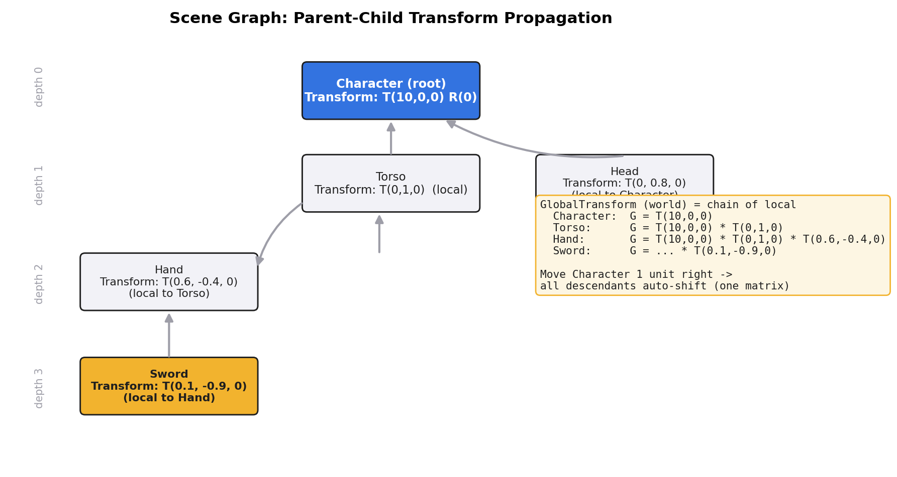
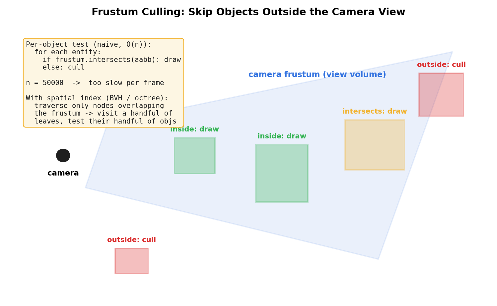
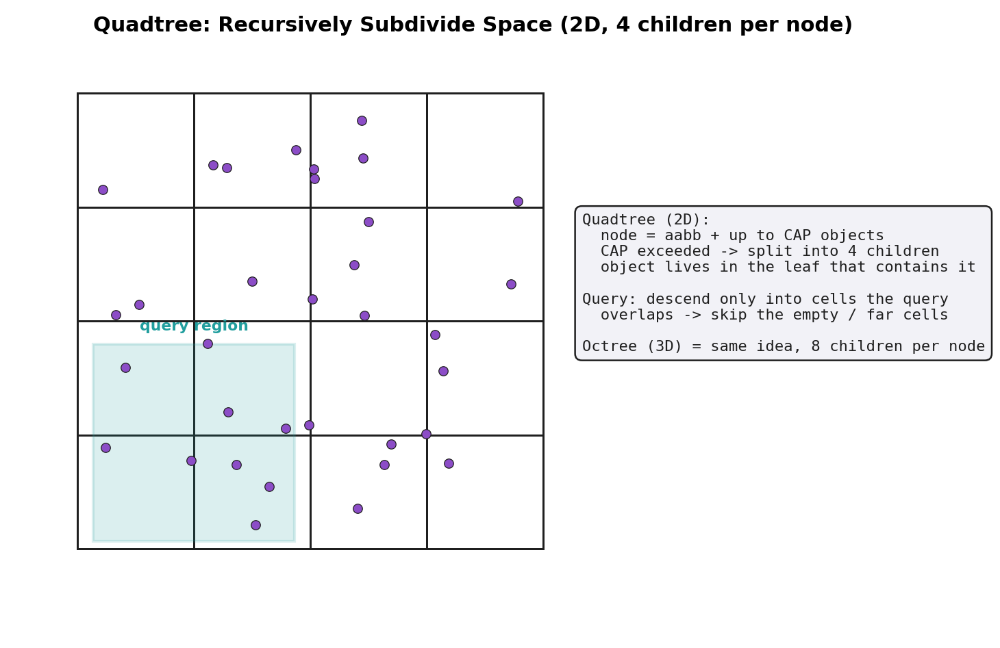
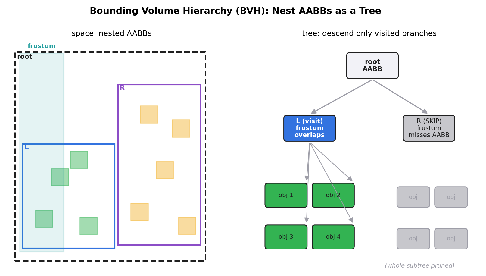

# 第 3 篇 · 第 12 章 · 场景图与空间划分

> **核心问题**:前面三章我们一直在拆"主循环怎么跑、时间怎么算"——这是"驱动"那一面。可本章回手一刀,切回"组织":海量对象在引擎里**怎么摆、怎么找**。具体两个问题:① 角色手里那把剑,凭什么角色一移动,剑就自动跟着手、手跟着躯干、躯干跟着角色?这种"父子跟随"用什么数据结构表达?② 场景里几万个对象,渲染前引擎凭什么能在 16ms 里判断出"哪些在摄像机视野外、可以不画"?逐个检查几万个 AABB 太慢,引擎靠什么空间数据结构加速?——本章就是回答这两个问题:**场景图(scene graph)表达父子变换的跟随关系,空间划分(spatial partitioning:四叉树 / 八叉树 / BVH)加速渲染前的剔除(culling)**。归属"组织"这一面。

> **读完本章你会明白**:
> 1. 场景图是什么:父子节点(角色 → 躯干 → 手 → 剑),子节点的**世界变换 = 父世界变换 × 子局部变换**(矩阵乘法链),更新时从根**深度优先**向下传播;为什么用层级(角色一动,整条链自动跟随)。
> 2. 场景图在 ECS 里怎么表达:不是个"SceneNode 类",而是 `ChildOf` / `Children` 这对**关系组件(Relationship 组件)** + 一个**传播系统**,每帧把局部 Transform 沿父子链乘上去,算出每个实体的 GlobalTransform。我们会对照 Bevy 的 `ChildOf` / `Children` / `Transform` / `GlobalTransform` 源码。
> 3. 为什么渲染前必须剔除:几万个对象,90% 在摄像机背后或视野外,逐个提交给管线就是浪费;剔除分**视锥剔除(frustum culling,不在视野内的不画)**和**遮挡剔除(occlusion culling,被前面挡住的不画)**。
> 4. 空间划分数据结构怎么把"逐个检查几万个 AABB"从 O(n) 降到接近 O(log n):**四叉树(2D 递归四分)、八叉树(3D 递归八分)、BVH(层次包围盒,对象聚类)** 各自的取舍。
> 5. 承接:空间划分的**动态 AABB 树**《物理引擎》宽相已经讲透(P2-09 那种动态树原理),本章讲"渲染剔除"场景下它怎么用,**不重讲动态树本身**;变换矩阵的乘法链,承《线性代数》"揉捏空间",**不重讲矩阵乘法**。

> **如果一读觉得太难**:先只记住三件事——① 场景图 = 父子节点树,子的世界变换 = 父世界变换 × 子局部变换,角色一动整条链(手、剑)自动跟着动;② ECS 里场景图不是 SceneNode 类,而是一对组件 `ChildOf`/`Children` + 一个传播系统,每帧把局部变换沿链乘成世界变换;③ 几万个对象渲染前要剔除视野外的(视锥剔除),逐个查太慢,用空间数据结构(四叉树/八叉树/BVH)只访问视野重叠的那几个叶子节点,把 O(n) 降到 O(log n)。

---

## 〇、一句话点破

> **场景里有两类"组织"问题:一类是"谁跟着谁动"——角色动,剑跟着手、手跟着躯干、躯干跟着角色,这种父子跟随用"场景图"表达,子的世界变换是父世界变换一路乘下来的结果;另一类是"哪些东西在视野外、可以不画"——几万个对象里大多数根本看不见,逐个检查太慢,用"空间划分"(四叉树 / 八叉树 / BVH)把空间递归切碎,只访问和摄像机视锥重叠的那几个叶子,把每帧的剔除从 O(n) 拉到接近 O(log n)。前者是"对象之间的拓扑关系",后者是"对象在空间里的分布",合起来就是引擎怎么把海量对象组织得既能跟随、又能快速挑出该画的。**

这是结论。本章倒过来拆:先把"为什么角色一动剑就跟着"讲透(场景图 = 父子变换链),再把"场景图在 ECS 里怎么落地"(Bevy 的 `ChildOf` / `Children` 组件 + Transform 传播系统),然后转到第二个问题——"几万个对象怎么快速剔除",从最朴素的逐个检查撞墙,讲到四叉树 / 八叉树 / BVH 怎么漂亮解决。最后用 Bevy 的可见性系统(`check_visibility_cpu_culling`)把这套机制在真实源码里对一遍。

> **承接书讲过**:本章两个最大承接——① **变换矩阵的乘法链,承《线性代数》"揉捏空间"** 那本讲的"矩阵 = 对空间的线性变换,矩阵相乘 = 变换的复合",这里**不重讲矩阵乘法本身**,只讲为什么世界变换是父 × 子的链式复合;② **动态 AABB 树(动态 BVH 的一种)的原理,承《物理引擎》宽相空间划分** 那本讲透的动态树(插入 / 删除 / 重平衡 / 旋转),这里**不重讲动态树本身**,只讲"渲染剔除"场景和"物理碰撞"场景用同一棵树的差别。两条承接,各自一句带过 + 指路,篇幅留给游戏引擎独有的部分。

---

## 一、第一个问题:角色的剑凭什么跟着手

### 1.1 一个再普通不过的需求

写游戏的人都会提一个需求:角色手里拿着一把剑。角色往前走,剑得跟着往前;角色转身,剑得跟着转;角色挥手,剑得跟着挥。

这需求看着普通,可它背后藏着一个深刻的问题:**剑的位置,是谁决定的?**

最朴素的写法,你可能会让剑自己管自己的世界坐标:

```cpp
struct Sword {
    float world_x, world_y;     // 剑在世界里的位置
    float angle;                // 剑的朝向
};
// 每帧, 剑自己根据"手在哪"算自己该在哪
void sword_update(Sword &s, Hand h) {
    s.world_x = h.world_x + offset_x;
    s.world_y = h.world_y + offset_y;
    s.angle   = h.angle + grip_angle;
}
```

这能跑。可一旦角色动起来,你要写一串"角色动了,所以手要跟着动,所以剑要跟着手动"的连锁更新代码;角色一转身,offset 还得跟着旋转矩阵重新算;策划突然说"剑要挂在腰上不是手上",你得把这套连锁逻辑整个改一遍。

> **不这样会怎样**:如果每个对象都自己存"世界坐标"、自己每帧根据依赖对象重算位置,那"谁跟着谁"这条拓扑关系就散落在各对象的 update 里,没法统一管理。改一个挂载点(剑从手换到腰)要重写连锁代码,加一个中间节点(角色 → 鞘 → 剑)要重新捋所有依赖。几万个对象这么搞,代码很快变成一团乱麻。我们需要一种**把"谁跟着谁"显式表达出来,并自动算跟随**的数据结构。

### 1.2 场景图:把"谁跟着谁"画成一棵树

这个数据结构就是**场景图(scene graph)**。它的核心思想极简:**把对象间的父子跟随关系组织成一棵树,子节点只存"相对父节点的局部变换",引擎从根开始,一路把局部变换乘下来,自动算出每个节点的世界变换。**

举个具体的例子。一个角色,内部分成:角色(Character,根)→ 躯干(Torso)→ 手(Hand)→ 剑(Sword)。角色的另一个孩子是头(Head)。这棵树长这样:



每个节点存两样东西:

- **局部变换(Transform)**:这个节点**相对它父节点**的位置 / 朝向 / 缩放。比如 Hand 的局部变换是"相对 Torso,往右下偏 (0.6, -0.4)",Sword 的局部变换是"相对 Hand,往下偏 (0.1, -0.9)"。注意:Hand 的 Transform **完全不知道** Torso 在世界哪儿,更不知道 Character 在世界哪儿——它只知道"我相对我爸在哪"。
- **世界变换(GlobalTransform)**:这个节点**在世界坐标系**里的最终位置 / 朝向 / 缩放。这个值**不是用户设的**,而是引擎**算出来**的:从根到这个节点,把路径上每个节点的局部变换一路乘起来。

> **钉死这件事**:场景图的核心契约——**子节点只关心"相对父节点的局部变换"(Transform),引擎负责算"在世界里的最终位置"(GlobalTransform)**。用户只设 Transform(我相对我爸在哪),GlobalTransform 引擎替你算。这一下解耦了:Hand 的逻辑只关心"我相对 Torso",完全不用知道 Character 在世界哪——Character 怎么乱动,Hand 的局部 Transform 一个字都不用改。

### 1.3 世界变换怎么算出来:矩阵乘法链(承《线性代数》)

那引擎怎么从 Transform 算出 GlobalTransform?靠**矩阵乘法链**。

先复习一下(只一句,矩阵乘法本身承《线性代数》"揉捏空间"那本讲透了,这里不重讲):一个 Transform(平移 + 旋转 + 缩放)可以表示成一个 4×4 的矩阵 M;两个 Transform 复合(先做 A 再做 B),对应的矩阵是 B × A(注意顺序,矩阵乘法不交换)。

那一个节点的 GlobalTransform 怎么算?**从根到这个节点,把路径上每个节点的局部矩阵一路左乘**:

```
Character 的 G = T_character                (根, 父变换 = 单位矩阵)
Torso     的 G = T_character × T_torso       (父 G × 自己 T)
Hand      的 G = T_character × T_torso × T_hand
Sword     的 G = T_character × T_torso × T_hand × T_sword
```

写成递归关系就是:

```
G(节点) = G(父节点) × T(节点)        // 父世界 × 我局部 = 我世界
```

> **承接书讲过**:这里那条"父世界 × 子局部 = 子世界"的矩阵乘法链,正是《线性代数》"揉捏空间"那本讲的"矩阵相乘 = 变换的复合"——把世界坐标系先经过父的局部变换挪到父的位置,再经过子的局部变换挪到子的位置,两次揉捏的复合。**矩阵乘法本身、为什么用 4×4 齐次坐标、为什么平移要齐次坐标,那本讲透了,这里不重讲**,指路 [[graphics-series-project]] / 线性代数那本。本章只关心:这条乘法链怎么组织成"从根深度优先传播"。

> **钉死这件事**:世界变换 = 从根到节点的局部变换乘法链。这个公式有两个直接后果:① **角色一动,整条链自动重算**——Character 的 T 变了,它下面所有节点的 G 都得重算(因为它们的 G 都含 T_character 这个因子);② **子的 T 不用改**——Hand 的 T 是"相对 Torso 往右下偏",这个值跟 Character 在世界哪无关,Character 怎么乱动,Hand 的 T 不动。这就是"父子跟随"的全部秘密。

### 1.4 更新:从根深度优先传播

那引擎每帧怎么把 GlobalTransform 都算出来?**深度优先遍历(DFS)整棵树**,从根开始,每到一个节点,就用"父 G × 我 T"算出我的 G,然后递归地往下算它的孩子。

```python
def propagate(node, parent_global):
    node.global_transform = parent_global @ node.local_transform   # 父 G × 我 T
    for child in node.children:
        propagate(child, node.global_transform)                   # 把我的 G 传给孩子当父 G
```

从根调起:`propagate(root, Identity)`。这一趟 DFS 走完,整棵树所有节点的 G 都算好了。

> **钉死这件事**:世界变换的更新 = 一趟从根开始的深度优先传播。父节点先算(它的 G 依赖它自己的父),子节点后算(它的 G 依赖父的 G)。所以场景图更新天然是个**树的 DFS**,复杂度 O(节点数)。

### 1.5 为什么用层级:角色移动,剑自动跟着

现在回看那个需求——"角色一动,剑自动跟着"。用场景图,这套逻辑**一行代码都不用写**:

- 你只要改 Character 的 Transform(局部变换,比如 translation.x += 1)。
- 引擎这一帧 propagate 时,会重新算 Character 的 G(因为它的 T 变了)。
- 算 Torso 的 G 时,用的是新的 Character G,所以 Torso 的 G 也跟着变。
- 算 Hand 的 G 时,用的是新的 Torso G,Hand 的 G 也跟着变。
- 算 Sword 的 G 时,用的是新的 Hand G,Sword 的 G 也跟着变。

整条链,自动跟随。你只改了一个数(Character 的 T),引擎顺着场景图自动把所有该动的都动了。这就是"父子跟随"在场景图里**零侵入**的根。

> **不这样会怎样**:如果不用层级(每个对象独立存世界坐标),角色移动时,你得手写"角色动了 → 把所有挂在角色上的东西(手、剑、头、盔甲、披风...)都按同一个偏移量平移一遍"。挂载点一变(剑从手换到腰),这段连锁代码整个重写。场景图把"谁跟着谁"显式编码成父子边,引擎自动算跟随,挂载点改了只需要改一条边(剑的父从 Hand 换成 Waist),其他一切照旧。

---

## 二、场景图在 ECS 里怎么表达:不是 SceneNode 类,是组件

到这里,场景图的概念讲透了。可问题来了:**前面 P2 篇讲过,现代引擎用 ECS,反对面向对象的"数据 + 行为绑一个对象里"。那场景图这个"父子树",在 ECS 里怎么表达?**

这是个非常关键的问题,也是新手最容易卡的地方。直觉上,场景图 = SceneNode 类(每个节点是个对象,有 parent 指针、children 列表)——这是面向对象引擎(Unreal、Ogre)的做法。可 ECS 不这么干。

### 2.1 面向对象的 SceneNode 类会撞什么墙

先看面向对象怎么做。每个场景节点是个对象,自带 parent 指针和 children 列表:

```cpp
class SceneNode {                       // 面向对象的场景图节点
    SceneNode *parent;
    std::vector<SceneNode *> children;
    Transform local;
    Transform global;
public:
    void update_global(Transform parent_global) {
        global = parent_global * local;
        for (auto *c : children) c->update_global(global);
    }
};
```

几万个 SceneNode,每个 new 出来,散落在堆上,parent / children 是裸指针。这撞两面墙:

- **数据散落,缓存差(承 P1-04 / P2-06)**:每个 SceneNode 一整块(含 parent 指针、children vector、两个 Transform),遍历时指针追逐,缓存全 miss。这和面向对象组织游戏对象的性能墙一模一样。
- **和 ECS 的数据导向冲突**:ECS 的灵魂是"数据按系统怎么遍历来布局"。可场景图如果用 SceneNode 类,Transform 数据就被锁死在节点对象里,系统没法按"所有 Transform 连续摆放"来遍历——这跟 P2 篇讲的数据导向直接打架。

> **不这样会怎样**:如果你坚持用 SceneNode 类,那 Transform 就被绑在节点对象里,散落堆上,TransformPropagate 系统遍历几万个节点更新 G 时,每个节点都缓存 miss。这违背了 ECS 的根本动机(数据导向、缓存友好)。所以现代 ECS 引擎(EnTT / Bevy / Unity DOTS)**都不用 SceneNode 类**——它们把"父子关系"拆成一对组件,让 Transform 数据仍然是按组件连续存的,父子关系只是组件之间的引用。

### 2.2 ECS 的答案:`ChildOf` / `Children` 这对关系组件

ECS 的做法:**父子关系本身,就是一种组件。** 一个实体挂个 `ChildOf(parent)` 组件,表示"我是 parent 的孩子";parent 那边自动有个 `Children` 组件,存"我有哪些孩子"。Transform 还是按 Transform 组件连续存,父子关系是另一对组件,各管各的。

这是 Bevy 的真实做法。看源码([bevy_ecs/src/hierarchy.rs](https://github.com/bevyengine/bevy/blob/master/crates/bevy_ecs/src/hierarchy.rs)):

```rust
/// 子节点挂在父节点上的"关系组件": 这是 source of truth (真相来源)
#[derive(Component, ...)]
#[relationship(relationship_target = Children)]   // 自动生成 Children 这一对端
#[doc(alias = "IsChild", alias = "Parent")]
pub struct ChildOf(#[entities] pub Entity);        // 就一个字段: 父节点的 Entity ID

impl ChildOf {
    #[inline]
    pub fn parent(&self) -> Entity { self.0 }
}

/// 父节点上自动出现的"关系目标组件": 镜像 ChildOf, 存所有孩子
#[derive(Component, Default, ...)]
#[relationship_target(relationship = ChildOf, linked_spawn)]
pub struct Children(Vec<Entity>);                  // 一组子节点 Entity ID
```

读这段代码,注意三件事:

1. **`ChildOf(Entity)` 就是"我挂在这个父节点上"的一对一关系**。它只存一个 Entity ID(就是 P2-05 讲的那个纯 ID)。一个实体挂了 `ChildOf(torso)`,就表示"我是 torso 的孩子"。
2. **`Children(Vec<Entity>)` 是自动维护的镜像**——你不用手动设它,只要哪个实体挂了 `ChildOf(me)`,我这边就自动多个 `Children` 组件把我加进去。源码注释明确写"`ChildOf` 是 source of truth(真相来源),`Children` 是它反射出来的镜像"。
3. **两个别名 `IsChild` / `Parent`**:这是给老文档留的兼容别名——老版本 Bevy 用的是 `Parent` 组件(子节点存 `Parent`),新版本统一改名叫 `ChildOf`(更符合"关系从子节点出发"的语义,且和泛型 Relationship 系统一致)。**这是对老资料的一个修正:别再死记 `Parent` 了,新版本是 `ChildOf`。**

> **钉死这件事**:ECS 里的场景图,不是 SceneNode 类,而是**一对关系组件**——`ChildOf(parent)` 挂在子节点上(真相来源),`Children(...)` 自动出现在父节点上(镜像)。Transform 数据还是按 Transform 组件连续存(P2-06 讲的 SoA),父子关系是另一对组件,各管各的。这样既有了"父子跟随"的拓扑,又没破坏数据导向。

### 2.3 构造场景:挂 `ChildOf` 就行

那怎么造一个"角色 → 躯干 → 手 → 剑"的场景?用 Bevy:

```rust
// 造一个角色, 它是根 (没挂 ChildOf, 没父)
let character = commands.spawn((
    Name::new("Character"),
    Transform::from_translation(Vec3::new(10.0, 0.0, 0.0)),   // 局部 = 在世界 (10,0,0)
    GlobalTransform::IDENTITY,                                // 引擎每帧会算
)).id();

// 躯干: 挂 ChildOf(character)
let torso = commands.spawn((
    Name::new("Torso"),
    Transform::from_xyz(0.0, 1.0, 0.0),                       // 相对角色: 上移 1
    ChildOf(character),                                       // 我是 character 的孩子
)).id();

// 手: 挂 ChildOf(torso)
let hand = commands.spawn((
    Name::new("Hand"),
    Transform::from_xyz(0.6, -0.4, 0.0),                      // 相对躯干: 右下
    ChildOf(torso),
)).id();

// 剑: 挂 ChildOf(hand)
let sword = commands.spawn((
    Name::new("Sword"),
    Transform::from_xyz(0.1, -0.9, 0.0),                      // 相对手: 下方
    ChildOf(hand),
)).id();
```

注意:**挂 `ChildOf` 那一刻,引擎的 component hook 自动给父节点塞个 `Children` 组件**(源码注释:"When `ChildOf` is inserted on a source entity, the target entity will automatically (and immediately, via a component hook) have a `Children` component inserted")。你不用手动维护 Children,挂 ChildOf 就够了。

这一下,场景图在 ECS 里就落地了:**每个实体还是个 ID(P2-05),Transform 还是按组件连续存(P2-06),父子关系只是 `ChildOf` / `Children` 这对额外组件**。拓扑和数据布局彻底解耦。

### 2.4 传播系统:把 Transform 沿父子链乘成 GlobalTransform

现在有了 `ChildOf` / `Children` 这对组件,Transform 还是局部的。那引擎每帧怎么把局部 Transform 乘成 GlobalTransform?靠一个**传播系统(propagation system)**——它查询所有有 `ChildOf` 的实体,沿父子链把 GlobalTransform 算出来。

看 Bevy 的真实源码([crates/bevy_transform/src/systems.rs](https://github.com/bevyengine/bevy/blob/master/crates/bevy_transform/src/systems.rs))。核心是 `TransformHelper`,它沿着 `ChildOf` 链向上走,递归算出某个实体的 GlobalTransform:

```rust
/// 通用传播系统: 对查询 F 命中的每个实体, 算它的 GlobalTransform
pub fn propagate_transforms_for<F: QueryFilter + 'static>(
    tf_helper: TransformHelper,
    mut query: Query<(Entity, &mut GlobalTransform), F>,
) {
    for (entity, mut gtf) in query.iter_mut() {
        // 沿 ChildOf 链向上, 把父链上所有局部 Transform 乘起来
        let result = tf_helper.compute_global_transform(entity);
        if let Ok(computed) = result {
            *gtf = computed;        // 写回这个实体的 GlobalTransform
        }
    }
}
```

`compute_global_transform(entity)` 内部干的事,本质上就是"从 entity 出发,沿 `ChildOf` 一直找到根,把路径上每个节点的 Transform 一路乘起来"。这正是第 1.3 节讲的矩阵乘法链,只不过在 ECS 里这条链是由 `ChildOf` 组件连起来的(不是面向对象的 parent 指针)。

> **钉死这件事**:ECS 里世界变换的传播,是**一个系统查询有 `ChildOf` 的实体,沿父子链把 Transform 乘成 GlobalTransform,写回组件**。没有 SceneNode 类,没有 parent 指针,没有虚函数——父子关系是组件数据,传播是系统行为,符合 ECS 的"数据 + 行为分离"。这正是 P2-05 三件套思想在"场景图"这个具体问题上的兑现。

---

## 三、第二个问题:几万个对象怎么快速剔除

讲完场景图(父子跟随),转本章第二个核心问题:**几万个对象,渲染前怎么快速剔除视野外的?**

### 3.1 渲染前为什么必须剔除

一个真实游戏场景,几万到几十万个可绘制对象(房子、树、草、敌人、子弹、特效)很常见。可摄像机一帧只看得到其中一小部分——大部分对象要么在背后,要么远到视野外,要么被前面挡住。把这几万个对象**全部**提交给渲染管线(画一遍),会发生什么?

- 每个 draw call 都有 CPU 提交开销(P5-18 详讲)。
- 顶点着色器对看不见的顶点白算一遍(虽然 GPU 有早期 z 测试,但前面顶点处理还是浪费)。
- 几万个 draw call,16ms 的 CPU 帧预算根本塞不下。

所以渲染前,引擎必须做**剔除(culling)**:把看不见的对象挑出来,**根本不提交给管线**。剔除分三类:

- **视锥剔除(frustum culling)**:对象不在摄像机的视锥(view volume,那个截头锥体)里——也就是在视野外或背后——直接不画。这是最基本也最有效的剔除。
- **遮挡剔除(occlusion culling)**:对象虽然在视锥里,但被前面的东西完全挡住,看不见——也可以不画。这比视锥剔除复杂得多(要算"谁挡住谁"),很多引擎只对大场景静态遮挡做。
- **距离剔除 / 细节剔除(distance culling / LOD)**:对象太远,小到几个像素,可以换低精度版本(LOD)或干脆不画。

本章主要讲**视锥剔除**,因为它是每帧必做、收益最大、也是空间划分数据结构最直接的应用。遮挡剔除的思路类似(也是个"快速挑出该画的"问题),但实现更复杂,我们只点一下。

### 3.2 视锥剔除的本质:AABB 和视锥相交测试

视锥剔除的核心,是一个**几何相交测试**:给定一个对象的包围盒(通常是 **AABB,Axis-Aligned Bounding Box,轴对齐包围盒**),判断它和摄像机的视锥(frustum,6 个平面围成的截头锥体)是否相交。

- **相交** → 对象(至少部分)在视野内 → **画**。
- **不相交** → 对象完全在视野外 → **剔除(不画)**。

> **承接书讲过**:AABB 这个东西《物理引擎》那本讲透了——它是个"对齐坐标轴的最小长方体",优点是存储小(中心 + 半边长)、相交测试快(几条比较)。**AABB 的定义、为什么用 AABB 而不是 OBB(有向包围盒),那本讲透了,这里不重讲**,指路 [[physics-engine-source-facts]]。本章只用 AABB 这个工具,关心的是"几万个 AABB 怎么快速挑出该测的"。

那一个对象怎么知道它的 AABB?引擎在加载模型时,会算出模型在**局部空间**的 AABB(顶点云的最小 / 最大坐标,存成 center + half_extents)。运行时,用对象的 GlobalTransform 把这个局部 AABB 变换到世界空间(变换后的 AABB 可能比原来大,因为旋转后的包围盒要重新对齐世界轴),就是它的世界 AABB。Bevy 给每个有 Mesh 的实体自动加 `Aabb` 组件,就是这个。

### 3.3 朴素做法:逐个检查,撞墙

那视锥剔除怎么实现?最朴素的做法:**遍历所有可绘制对象,逐个做"它的世界 AABB 和视锥是否相交"测试**,相交的留下画,不相交的剔除。

```python
visible = []
for obj in all_drawables:                          # 几万个对象
    if frustum_intersects_aabb(camera.frustum, obj.world_aabb):
        visible.append(obj)                        # 在视野内, 画
    # 否则剔除 (不进 visible 列表)
```

这看着没毛病。可问题是:**几万个对象,每帧逐个测一遍,O(n),n 是对象数**。每个相交测试本身不贵(几条比较 + 点乘),可 n = 50000 时,50000 次测试叠起来,光剔除这一步就要吃掉好几毫秒——而这只是 16ms 帧预算里的一小段。更糟的是,**绝大多数对象根本就在视野外**(典型场景,可见的可能只占 5%~10%),你花了 O(n) 把它们逐个判一遍"你不在视野内",纯属浪费。

> **不这样会怎样**:如果坚持逐个检查,50000 个对象每帧 50000 次相交测试,假设每次 100 纳秒(很乐观),光剔除就 5ms——占了 16ms 预算的三分之一。而真实场景里,50000 个对象里可能只有 3000 个在视野内,你花 5ms 把另外 47000 个判一遍"你不在",这 4.7ms 几乎全是浪费。我们需要一种"**先按空间快速跳过大块,再细查少数**"的数据结构。

### 3.4 空间划分:把"逐个检查"变成"先跳大块"

这就是**空间划分(spatial partitioning)**数据结构的用武之地。核心思想:**把空间递归切碎,对象分到叶子节点。查询时(比如"视锥里有哪些对象"),从根开始,如果某个节点的空间区域和查询区域(视锥)完全不重叠,这个节点和它下面所有对象一次性跳过——根本不用逐个检查。**

这把"逐个检查 O(n)"降到了"沿树走 O(log n + k)"(k 是结果数)。一图胜千言:



空间划分有三大经典结构,各有取舍:**四叉树(2D)、八叉树(3D)、BVH(层次包围盒)**。我们逐个看。

---

## 四、空间划分三剑客:四叉树、八叉树、BVH

### 4.1 四叉树(Quadtree):2D 的递归四分

**四叉树**是 2D 场景的空间划分:把一个 2D 区域**递归地四等分**(横切一刀、竖切一刀,得到 4 个象限),每个节点要么是叶子(存对象),要么有 4 个孩子(继续四分)。



四叉树的规则:

- 每个节点有一个**容量上限 CAP**(比如 8 个对象)。
- 插入对象时,沿树下降到包含它的象限。如果某叶子里的对象数超过 CAP,**把这个叶子再四分一次**,把对象分到 4 个新孩子里。
- 对象的 AABB 可能横跨多个象限——通常的做法是"**存到完全包含它的最深节点**"(如果它横跨两个象限的分界线,就存到它们的父节点)。

查询(比如"视锥里有哪些"):

- 从根开始。如果查询区域(视锥的 2D 投影)和当前节点的区域**完全不重叠**,直接返回(这个节点和它下面所有对象一次性跳过)。
- 如果重叠,递归下降到重叠的孩子;叶子节点则把它里面的对象逐个测一遍,挑出真正和查询区域相交的。

复杂度:理想情况下(对象均匀分布),树高 O(log n),查询只走几条路径,O(log n + k)。**这就是把 O(n) 拉到 O(log n) 的根。**

四叉树适合什么?**2D 游戏、2D 物理、UI 布局、卫星图像**——所有"对象分布在 2D 平面上"的场景。

### 4.2 八叉树(Octree):3D 的递归八分

把四叉树从 2D 推广到 3D,就是**八叉树**:把一个 3D 立方体**递归地八等分**(沿 x、y、z 各切一刀,得到 8 个卦限),每个节点要么是叶子,要么有 8 个孩子。

规则和四叉树一模一样,只是孩子数从 4 变成 8(每个节点 8 个子立方体)。插入、查询、CAP 触发分裂的逻辑都照搬。八叉树适合**3D 游戏、3D 体素数据、点云**——所有"对象分布在 3D 空间里"的场景。

> **钉死这件事**:四叉树和八叉树是同一个思想的 2D / 3D 版本——**把空间本身递归切碎,对象按位置分到叶子**。它们的本质是"**对空间的划分**"(切的是空间,不是对象)。查询时利用"空间区域不重叠就跳过"来加速。

### 4.3 BVH(Bounding Volume Hierarchy):层次包围盒

四叉树 / 八叉树切的是**空间**,可如果对象在空间里分布极不均匀(比如一群鸟挤在一个小区域,其他地方空荡荡),均匀切空间会让某些叶子爆满、某些叶子全空——树退化,查询效率掉。

另一种思路是 **BVH(Bounding Volume Hierarchy,层次包围盒)**:**不切空间,而是把对象本身聚类成一棵树**,每个内部节点的 AABB 是它所有孩子 AABB 的并集(包围盒)。



BVH 的构造:把所有对象当叶子(每个叶子一个对象的 AABB),然后用某种策略(比如按质心坐标排序后二分)把它们两两合并成内部节点,递归上去,直到根。根的 AABB 包住所有对象。

查询(视锥剔除)的流程:

- 从根开始。根的 AABB 包住整个场景,大概率重叠视锥,下降。
- 对每个内部节点,测它的 AABB 和视锥是否重叠。**不重叠 → 整棵子树一次性剪枝(prune),下面所有对象都不用看了**。重叠 → 递归下降到它的孩子。
- 到叶子,测叶子的 AABB(就是某个对象的 AABB)和视锥是否相交,相交的画。

BVH 的妙处:**剪枝发生在内部节点,一个内部节点剪掉,等于一次性跳过了它下面成百上千个对象**。这就是 O(n) → O(log n + k) 的来源。

> **承《物理引擎》宽相空间划分**:**动态 BVH(动态 AABB 树)的原理——《物理引擎》那本宽相已经讲透了**(插入 / 删除 / 重平衡 / 旋转 / 叶子重插)。本章**不重讲动态树本身**,只点出渲染剔除和物理碰撞用同一棵动态 AABB 树的差别:

| | 物理碰撞用(承《物理引擎》宽相) | 渲染剔除用(本章) |
|---|---|---|
| 查询类型 | "哪些对 AABB 可能相交"(找候选对) | "哪些 AABB 在视锥内"(找可见集) |
| 查询对象 | 一个动态 AABB(扫掠的) | 视锥(6 个平面) |
| 更新频率 | 每物理步(可能多次 / 帧) | 每帧一次 |
| 树的特点 | 必须**动态**(对象每帧都动,要频繁插入删除) | 静态对象用**静态 BVH**(构造一次,长期复用);动态对象可单独处理 |

**钉死**:渲染剔除用的 BVH 和物理宽相用的动态 AABB 树,**树本身是同一个数据结构**(原理承《物理引擎》),但用法不同——物理关心"碰撞候选对",渲染关心"可见集";物理每帧动得厉害要动态更新,渲染很多对象是静态的(房子、地形),可以预构造静态 BVH 长期复用。指路 [[physics-engine-source-facts]]。

### 4.4 三者取舍:什么时候用哪个

| 结构 | 切什么 | 维度 | 适合场景 | 动态更新成本 |
|------|--------|------|----------|------------|
| 四叉树 | 空间 | 2D | 2D 游戏、UI | 中(对象移动要重新分配叶子) |
| 八叉树 | 空间 | 3D | 3D 室内场景、体素 | 中(同上,但 8 个孩子) |
| BVH | 对象聚类 | 任意 | 通用 3D、动态场景、光线追踪 | 低(只更新祖先 AABB) |

实际引擎里,**BVH 是最通用的选择**——它不绑定维度,对动态场景更友好(对象动一点,只需更新它的祖先链 AABB,不用换叶子),也是现代光线追踪(RTX / DXR)的加速结构标配。**四叉树 / 八叉树**更多用在相对静态的场景(室内地图、棋盘)或特殊场景(2D)。Bevy 当前的可见性系统其实更接近"逐对象 CPU 剔除 + 可选 GPU 剔除",没有强制用 BVH——下一节我们会看到它怎么实现。

---

## 五、源码对照:Bevy 的可见性系统

讲完原理,我们把 Bevy 的真实可见性系统拆一遍,看场景图 + 空间划分 + 剔除在源码里怎么落地。这部分会密集引用 [bevyengine/bevy](https://github.com/bevyengine/bevy) 的源码,都经过实际核对。

### 5.1 可见性三件套:`Visibility` / `InheritedVisibility` / `ViewVisibility`

先说清楚一个新手最容易混的概念:Bevy 里一个实体"可见不可见",有三个不同的组件,各管各的。看源码([crates/bevy_camera/src/visibility/mod.rs](https://github.com/bevyengine/bevy/blob/master/crates/bevy_camera/src/visibility/mod.rs))的模块注释,它自己开篇就强调这个区分:

```rust
//! 三个表示可见性的组件:
//! - `Visibility`          用户设的可见性
//! - `InheritedVisibility` 沿父子层级传播下来的"继承可见性"
//! - `ViewVisibility`      是否该被提取去渲染 (每个 view 重算)
//!
//! `Visibility` 是用户定义的。这是用户通常唯一应该手动加的组件。
//! `InheritedVisibility` 是沿实体层级传播算出来的。
//!   设了 `Visibility::Inherited` 的实体, 复制它父节点的可见性。
//!   没父节点 (没 ChildOf) 的, 默认可见。
//!   传播在 `visibility_propagate_system` 里做, 跑在 PostUpdate。
//! `ViewVisibility` 表示这个实体是否该被提取去渲染。
//!   这个组件每帧在 PostUpdate 重算。
```

源码把三者的职责划得清清楚楚:

- **`Visibility`**——用户设的"我想让它可见 / 隐藏 / 继承父节点"。三个值(看源码 enum):

```rust
pub enum Visibility {
    /// 继承父节点的可见性; 根节点继承 = 可见
    #[default]
    Inherited,
    /// 无条件隐藏
    Hidden,
    /// 无条件可见 (哪怕父节点隐藏, 我也可见)
    Visible,
}
```

- **`InheritedVisibility`**——沿 `ChildOf` 层级传播下来的"我这一支可不可见"。这就是**可见性也走场景图传播**——和 Transform 传播一模一样,父节点隐藏,整条子链都隐藏。

- **`ViewVisibility`**——针对**每个 view(摄像机)**算出来的"该不该提取去渲染"。这个考虑了视锥剔除、遮挡剔除等。

> **钉死这件事**:Bevy 把"可见性"拆成三个组件,正是 ECS 思想的兑现——**用户输入(`Visibility`)、传播结果(`InheritedVisibility`)、最终决策(`ViewVisibility`)分开存**,各自被不同系统读写,数据清晰。`InheritedVisibility` 沿 `ChildOf` 链传播,就是第 1 节场景图传播在"可见性"上的翻版——父隐藏,整条子链隐藏,零侵入。

### 5.2 可见性传播系统:沿 `ChildOf` 递归

看传播系统的源码(同文件):

```rust
fn visibility_propagate_system(
    changed: Query<
        (Entity, &Visibility, Option<&ChildOf>, Option<&Children>),
        (With<InheritedVisibility>,
         Or<(Changed<Visibility>, Changed<ChildOf>)>),     // 只处理 Visibility 或 ChildOf 变了的
    >,
    mut visibility_query: Query<(&Visibility, &mut InheritedVisibility)>,
    children_query: Query<&Children, (With<Visibility>, With<InheritedVisibility>)>,
    mut removed_child_of: RemovedComponents<ChildOf>,
) {
    for (entity, visibility, child_of, children) in &changed {
        // 算这个实体自己"该不该可见"
        let is_visible = match visibility {
            Visibility::Visible => true,                   // 无条件可见
            Visibility::Hidden  => false,                  // 无条件隐藏
            // 继承: 看父节点的 InheritedVisibility
            Visibility::Inherited => child_of
                .and_then(|c| visibility_query.get(c.parent()).ok())
                .is_none_or(|(_, x)| x.get()),
        };
        // 写回自己的 InheritedVisibility
        let (_, mut inherited_visibility) = visibility_query.get_mut(entity)
            .expect("With<InheritedVisibility> 保证查得到");
        // 只在变了的时候更新 (避免同一帧递归传播重复写)
        if inherited_visibility.get() != is_visible {
            inherited_visibility.0 = is_visible;
            // 递归向下传播给孩子 (省略)
        }
    }
}
```

读这段代码,注意三件事:

1. **`Or<(Changed<Visibility>, Changed<ChildOf>)>`**——这个查询只命中"Visibility 或 ChildOf 这帧变了"的实体。这是 P2-09 讲过的**变更检测(Changed)**的实战:绝大多数实体每帧 Visibility 不变,系统只处理变了的少数,O(变更数) 而不是 O(总实体数)。
2. **`Visibility::Inherited` 分支查父节点的 `InheritedVisibility`**——这就是"沿 `ChildOf` 链传播"的代码字面落地。子节点继承父的可见性,父又继承祖父的,一路传到根。
3. **`if inherited_visibility.get() != is_visible`**——只在值真变了时才写回并向下传播。这避免"父没真变,但触发了 change detection"时的无意义递归传播,是个小但重要的优化。

### 5.3 视锥剔除:`check_visibility_cpu_culling`

现在看本章的重头戏——**视锥剔除系统**。这是把"几万个对象,挑出视野内的"那一步。看源码(同文件,函数名 `check_visibility_cpu_culling`):

```rust
pub fn check_visibility_cpu_culling(
    mut thread_queues: Local<Parallel<TypeIdMap<Vec<Entity>>>>,
    mut view_query: Query<(
        Entity,
        &mut VisibleEntities,
        &Frustum,                       // 视锥 (6 个平面)
        Option<&RenderLayers>,
        &Camera,
        Has<NoCpuCulling>,              // 摄像机可选"不做 CPU 剔除"
    )>,
    mut visible_aabb_query: Query<(
        Entity,
        &InheritedVisibility,           // 先看层级传播: 父隐藏的直接跳
        &mut ViewVisibility,
        Option<&VisibilityClass>,
        Option<&RenderLayers>,
        Option<&Aabb>,                  // 对象的包围盒
        Option<&Sphere>,
        &GlobalTransform,               // 用来把局部 AABB 变到世界
        Has<NoFrustumCulling>,          // 对象可选"不做视锥剔除"
        Has<VisibilityRange>,           // 距离剔除
    ), Without<NoCpuCulling>>,
    visible_entity_ranges: Option<Res<VisibleEntityRanges>>,
) {
    for (view, mut visible_entities, frustum, maybe_view_mask, camera, no_cpu_culling_camera)
        in &mut view_query
    {
        if !camera.is_active { continue; }       // 摄像机没激活, 跳过
        let view_mask = maybe_view_mask.unwrap_or_default();

        // 对每个候选对象, 并行地做剔除测试
        visible_aabb_query.par_iter_mut().for_each_init(
            || thread_queues.borrow_local_mut(),
            |queue, query_item| {
                let (entity, inherited_visibility, mut view_visibility,
                     visibility_class, maybe_entity_mask, maybe_model_aabb,
                     maybe_model_sphere, transform, no_frustum_culling,
                     has_visibility_range) = query_item;

                // 第 1 关: 层级可见性 — 父隐藏的直接跳 (零成本, 一个 bool)
                if !inherited_visibility.get() { return; }

                // 第 2 关: RenderLayers 不相交, 跳
                let entity_mask = maybe_entity_mask.unwrap_or_default();
                if !view_mask.intersects(entity_mask) { return; }

                // 第 3 关: 距离剔除 — 超出可见距离, 跳
                if has_visibility_range && visible_entity_ranges.is_some_and(|r| {
                    !r.entity_is_in_range_of_view(entity, view)
                }) { return; }

                // 第 4 关: 视锥剔除 — AABB / Sphere 和视锥相交测试
                if !no_frustum_culling && !no_cpu_culling_camera {
                    if let Some(model_aabb) = maybe_model_aabb {
                        let world_from_local = transform.affine();
                        // 先用球的快速测试 (便宜)
                        let model_sphere = Sphere {
                            center: world_from_local.transform_point3a(model_aabb.center),
                            radius: transform.radius_vec3a(model_aabb.half_extents),
                        };
                        if !frustum.intersects_sphere(&model_sphere, false) { return; }
                        // 再用 AABB(OBB)的精确测试
                        if !frustum.intersects_obb(model_aabb, &world_from_local, true, false) {
                            return;
                        }
                    } else if let Some(model_sphere) = maybe_model_sphere
                        && !frustum.intersects_sphere(model_sphere, false) {
                        return;
                    }
                }

                view_visibility.set_visible();      // 全过了, 标记为可见
                // (省略: 把它加进 visible_entities 列表, 供后续渲染提取)
            },
        );
    }
}
```

读这段代码,信息量极大,我们逐点拆:

**① 多关剔除的流水线**:剔除不是一次性的"测一下",而是**层层过滤的流水线**——先过最便宜的(层级可见性,一个 bool),再过中等的(RenderLayers 位掩码相交),再过视锥剔除(几何测试)。每一关都剔除一大批,剩下的才进下一关。这是个经典的"**早退出(early-out)**"优化——便宜的测试在前,贵的在后,绝大多数对象在便宜的关卡就被剔除了,根本走不到贵的视锥测试。

**② `par_iter_mut()` 并行**:看那个 `par_iter_mut().for_each_init(...)`——**对象级别的并行**。每个对象的剔除测试互不依赖(我只看自己的 AABB 和视锥,不碰别人的),所以可以多核并行。这正是 P2-07 讲的"数据并行"在剔除这里的兑现:海量对象同一操作(测 AABB vs 视锥),天然并行。

**③ 球先测,AABB 后测**:视锥剔除里,先用 `intersects_sphere`(球测试,最便宜,6 个平面各算一次点到平面距离),再用 `intersects_obb`(AABB / OBB 测试,更精确但更贵)。**球测试是粗筛,过得了再上精确的 AABB 测试**。又是一个 early-out。注意那个 `model_aabb` 是模型局部空间的,用 `transform.affine()`(GlobalTransform)把它变到世界空间——这正是第 3.2 节讲的"用 GlobalTransform 把局部 AABB 变到世界 AABB"。

**④ 没看到 BVH / 八叉树!** 这是本章一个**重要的事实修正**:你看这个 `check_visibility_cpu_culling`,它直接 `par_iter_mut()` 遍历**所有候选对象**,做"球测试 + AABB 测试"——**它没用 BVH / 八叉树这种空间索引!** 这和我们第 3.3 节讲的"逐个检查撞 O(n) 墙"听起来矛盾。

> **修正总纲印象**:总纲 / 提示词默认"渲染剔除一定用四叉树 / 八叉树 / BVH"。但 Bevy 的 CPU 剔除**当前并没有强制用空间索引**——它走的是**"对象级并行 + 多关早退出"**路线:① 用 `par_iter_mut` 多核并行(O(n) 但 n 个对象分到多核);② 用变更检测 + 层级可见性提前剔除大多数(层级隐藏的对象,父辈一次 `set_changed` 就把整棵子树标了);③ 球测试做粗筛,AABB 测试做精筛。这套"暴力并行 + 早退出"在几千到几万对象规模上够用,且实现简单。真正的超大规模场景(几十万对象)Bevy 走的是 **GPU 剔除**(`NoCpuCulling` 组件 + compute shader 在 GPU 上做,源码注释反复提到 `collect_gpu_culled_meshes`),把剔除压力丢给 GPU——这才是超大规模的标准做法。所以本章讲 BVH / 八叉树是**讲清楚"如果要做大规模 CPU 剔除,空间划分是答案"的第一性原理**,但要诚实告诉读者:Bevy 当前 CPU 剔除是"并行暴力 + 早退出",大规模才上 GPU 剔除;BVH 更常见的是**静态场景预构造**(地形、建筑的静态 BVH 长期复用)和**光线追踪加速结构**(RTX)。

> **钉死这件事**:Bevy 的 CPU 视锥剔除 = **多关早退出流水线**(层级可见性 → RenderLayers → 距离 → 视锥球测试 → 视锥 AABB 测试)+ **对象级并行**(`par_iter_mut`)+ **球先 AABB 后的早退出**。它当前没用 BVH / 八叉树这种空间索引,而是靠并行 + 早退出把 O(n) 摊平。大规模才上 GPU 剔除。这是对"渲染剔除必用 BVH"印象的修正——BVH 是答案之一,但不是唯一答案,也不是 Bevy 当前 CPU 路径的选择。

### 5.4 一个静态场景优化的彩蛋:脏树标记(TransformTreeChanged)

最后看一个本章最值得讲的高级优化——`mark_dirty_trees` 和 `TransformTreeChanged`。这玩意儿解决的问题是:**静态场景里大部分对象每帧不动,凭什么还要每帧传播 Transform?**

源码([crates/bevy_transform/src/systems.rs](https://github.com/bevyengine/bevy/blob/master/crates/bevy_transform/src/systems.rs)):

```rust
/// Optimization for static scenes.
///
/// Propagates a "dirty bit" up the hierarchy towards ancestors. Transform
/// propagation can ignore entire subtrees of the hierarchy if it encounters
/// an entity without the dirty bit.
pub fn mark_dirty_trees(
    changed: Query<Entity, Or<(Changed<Transform>, Changed<ChildOf>, Added<GlobalTransform>)>>,
    mut orphaned: RemovedComponents<ChildOf>,
    mut transforms: Query<&mut TransformTreeChanged>,
    parents: Query<&ChildOf>,
    static_optimizations: Res<StaticTransformOptimizations>,
    ...
) {
    if !static_optimizations.is_enabled() { return; }
    // 简化 (单线程版): 对每个"变了"的实体, 沿 ChildOf 向上把祖先都标脏
    for entity in changed.iter().chain(orphaned.read()) {
        let mut next = entity;
        while let Ok(mut tree) = transforms.get_mut(next) {
            if tree.is_changed() && !tree.is_added() {
                // 这一支已经处理过了, 跳过 (避免重复)
                break;
            }
            tree.set_changed();
            if let Ok(parent) = parents.get(next).map(ChildOf::parent) {
                next = parent;          // 继续向上
            } else {
                break;
            };
        }
    }
}
```

读这段,核心思想:**如果整棵子树这帧没一个对象的 Transform 变,那这棵子树的 GlobalTransform 全都不用重算**——它们和上一帧一模一样。`mark_dirty_trees` 就是把"有对象变了"的子树**从变更点向上标脏**(用一个 `TransformTreeChanged` 组件当脏标记),传播系统只对标脏的子树做重算。

这是个**把"逐个变更检测"升级到"子树级变更检测"的优化**。原本 Bevy 的变更检测是对象级的(`Changed<Transform>` 只命中 Transform 变了的实体),可问题是:某实体 Transform 没变,但它**父**的 Transform 变了,它的 GlobalTransform 还是得重算(因为它的 G 依赖父的 G)。所以单纯靠 `Changed<Transform>` 不够——父变了,子也得重标。`mark_dirty_trees` 就是干这个的:沿 `ChildOf` 向上把变更冒泡到祖先,这样传播系统一看"这个实体的 TransformTreeChanged 没被标脏,说明它和它所有祖先都没变,直接跳过",一次性跳过整棵静态子树。

> **钉死这件事**:`mark_dirty_trees` + `TransformTreeChanged` 是 Bevy 的**静态场景优化**:把"对象级变更检测"升级到"子树级变更检测",静态对象(房子、地形、装饰品)整棵子树一帧不动,传播系统一次性跳过,O(静态对象数) → O(动态对象数)。这个技巧的精髓是——**几万个静态对象,大部分每帧不动,凭什么全量重算?** 它用脏标记把不变的部分整体剪枝,和空间划分"剪掉不重叠的子树"是同一种思想,只不过一个剪在"变更域",一个剪在"空间域"。

### 5.5 遮挡剔除:本章没深讲,但该知道的事

视锥剔除解决的是"不在视野内的不画",可还有一类浪费:**对象在视锥里,但被前面的东西完全挡住**。一个最典型的场景:你站在一道墙后面,墙后面有座巨大的城市,城市里几万栋房子——这些房子全在视锥里(你没转身),但全被墙挡住,你根本看不见。视锥剔除救不了它们(它们都在视锥内),可全部画一遍就是浪费。

这就是**遮挡剔除(occlusion culling)**要解决的问题。它比视锥剔除难得多——视锥剔除只要测"对象和视锥是否相交"(几何测试,几条比较),遮挡剔除要测"对象是否被别的东西挡住"(涉及深度排序、可见性集合计算)。

主流的遮挡剔除方法有几种思路:

- **潜在可见集(PVS, Potentially Visible Set)**:离线预计算。把场景切成一个个"区域(cell)",对每个区域预先算好"站在这个区域里,可能看见哪些别的区域"。运行时,你站在哪个 cell,只画那个 cell 的 PVS 里列的区域。这是个**空间换时间**的方案——预计算量大(可能要跑几小时),但运行时极快(查表)。Quake 系列引擎的 BS P + PVS 是经典实现,室内场景效果拔群。
- **层次 Z 缓冲(HZB, Hierarchical Z-Buffer)**:把 GPU 的深度缓冲建成一棵**四叉树 / 金字塔**(每层是上一层 4 个像素 Z 值的最大值)。测遮挡时,把对象的 AABB 投影到屏幕,从 HZB 顶层开始比——顶层 Z 比对象远,说明这区域有更近的东西挡着,整块剪枝。这是个**实时 GPU 驱动**的方案,不需要预计算。
- **遮挡查询(Occlusion Query)**:GPU 硬件支持——画一个简单几何体(比如包围盒),GPU 数"实际写了多少像素到帧缓冲",0 像素 = 完全被挡。问题是查询有延迟(结果下一帧才回来),要搭配两帧延迟的优化。

> **钉死这件事**:遮挡剔除比视锥剔除难一个量级——视锥剔除是"几何相交测试"(O(1) per object),遮挡剔除是"深度可见性"问题(本质要排序)。所以它不是每帧必做的,很多引擎只对大场景静态遮挡做(用 HZB 或 PVS 预计算),小场景干脆不做(靠 GPU 自己的早期 Z 测试 EarlyZ 兜底)。Bevy 当前没有内置完整的遮挡剔除(源码里能看到 `VisibilityRange` 距离剔除,但没看到 HZB / PVS),这是个"诚实标注的缺口"——大规模遮挡剔除是商业引擎(Unreal Lumen / Nanite、Unity HDRP)的差异化功能,小引擎常常不做。

### 5.6 GPU 剔除:超大规模的标准答案

前面我们一直在讲 **CPU 剔除**——剔除在 CPU 上跑,挑出可见对象,再把可见的提交给 GPU 画。可当对象规模到几十万(开放世界、Nanite 那种),CPU 剔除本身就成瓶颈——光是 `check_visibility_cpu_culling` 的 `par_iter_mut` 都跑不动。

这就是 **GPU 剔除(GPU culling / GPU-driven rendering)** 的用武之地:**把剔除本身丢给 GPU,在 compute shader 里跑**。流程变成:

1. CPU 把所有候选对象的 AABB(连同其他剔除要用的数据)上传到一个 **GPU buffer**。
2. 一个 compute shader 读这个 buffer,**每个 GPU 线程处理一个对象**,做视锥 / 遮挡 / 距离剔除测试。GPU 几千个核并行,几十万对象一帧就跑完。
3. 通过测试的对象,把它们的 draw call 参数写进一个 **indirect draw buffer**。
4. CPU 发一个 **indirect draw call**(`vkCmdDrawIndirect` / `glMultiDrawElementsIndirect`),GPU 自己根据 indirect buffer 把所有可见对象画一遍。

这套"GPU 自己剔除 + 自己画"的范式,把 CPU 的提交开销和剔除开销都甩给了 GPU,几十万对象不再是问题。Bevy 的 `NoCpuCulling` 组件(我们前面源码里看到了)就是给"我想用 GPU 剔除"的对象打的标——CPU 路径跳过它们,统一交给 `collect_gpu_culled_meshes`(源码注释反复提到)在 GPU 上处理。

> **钉死这件事**:超大规模(几十万对象)的标准答案是 **GPU 剔除**——剔除本身在 compute shader 上跑,GPU 几千核并行,结果是 indirect draw buffer,CPU 只发一个 indirect draw call。这把 CPU 的剔除压力和提交压力一起甩掉。Nanite(Unreal 5)、Unity HDRP 的 GPU Resident Drawer、Bevy 的 `NoCpuCulling` 路径,都是这个范式。CPU 剔除 + 空间划分(BVH / 八叉树)适合中小规模(几千到几万),大规模才上 GPU 剔除——这是规模决定方案。

---

## 六、技巧精解:两个最硬核的设计

本章最值得单独拆透的两个技巧:① **场景图传播的"局部存 / 全局算"职责分离**;② **空间划分的"剪枝 = O(n) 到 O(log n)"第一性原理**。

### 6.1 技巧一:局部存 / 全局算的职责分离

场景图最反直觉、也最精妙的设计,是 **Transform(局部)和 GlobalTransform(全局)的职责分离**——用户只设 Transform(我相对父节点在哪),引擎算 GlobalTransform(我在世界哪)。

为什么这么设计?**因为"局部"和"全局"的变更频率完全不同。**

- **局部变换**:用户主动设的。角色移动 = 改 Character 的 Transform;挥手 = 改 Hand 的 Transform。变更频率低(每帧只有少数对象被用户改)。
- **全局变换**:传播算出来的。Character 的 Transform 一变,它下面所有子孙的 GlobalTransform 全得重算。变更频率高(一个局部变更触发整条链的全局变更)。

如果把这两者**混在一个矩阵里**(像面向对象 SceneNode 那样只有一个 `world` 矩阵),用户改哪个?改 world——可那样就丢了"相对父节点"的信息,角色一动,子节点没法知道"我该跟着挪多少"。改 local——可那样就没有世界坐标,渲染没法用。

Bevy 的做法:**拆成两个组件**(`Transform` 和 `GlobalTransform`),用户写 `Transform`,引擎填 `GlobalTransform`。这两个组件甚至有不同的组件级约束(`Transform` 是用户可写的,`GlobalTransform` 是引擎通过系统填的)。这把"用户意图"和"派生结果"彻底解耦——用户表达"我相对父在哪",引擎负责把它算到世界坐标,中间隔着一层传播系统,用户完全不用管传播细节。

> **不这样会怎样**:如果不拆,只有一个矩阵,用户既得表达"我相对父在哪"(给传播用),又得有"我在世界哪"(给渲染用),这两个需求打架。Unity 老版本(非 DOTS)就混过——`transform.localPosition` 和 `transform.position` 两个属性,用户改 position 时引擎内部要倒推 localPosition,逻辑复杂且容易出 bug。Bevy / Unity DOTS 都走向了"严格分离 local / global"的设计:用户只设 local,global 引擎算。这是 ECS 数据导向思想在"变换"上的兑现——**数据(用户设的 local)和行为(引擎算的 global)分离**。

### 6.2 技巧二:空间划分的剪枝第一性

空间划分为什么能把 O(n) 降到 O(log n)?第一性原理:**层次化的"不相交就剪枝"**。

想象你站在一棵 BVH 的根前,要查"视锥里有哪些对象"。根的 AABB 包住整个场景,大概率重叠视锥,下降。可它的两个孩子里,很可能一个完全在视锥外(比如视锥朝北,南半球那个孩子就完全不重叠)。**那个不重叠的孩子,你连看都不用看——它整棵子树(可能几万个对象)一次性剪枝**。

这就是 O(n) → O(log n) 的根:**剪枝发生在内部节点,一个内部节点剪掉 = 一次性跳过它所有后代**。树高 O(log n),所以最多走 O(log n) 条路径才到叶子,真正访问的叶子数 + 路径上的内部节点 = O(log n + k)(k 是和查询重叠的结果数)。

```mermaid
flowchart TD
    R["root AABB<br/>(whole scene)"]
    L["L: overlaps frustum<br/>-> descend"]
    RR["R: misses frustum<br/>-> PRUNE whole subtree"]
    L1["obj a"]
    L2["obj b"]
    R1["obj c (skipped)"]
    R2["obj d (skipped)"]
    R --> L
    R --> RR
    L --> L1
    L --> L2
    RR -.pruned.-> R1
    RR -.pruned.-> R2
    classDesc pruned fill:#eee,stroke:#999,stroke-dasharray: 4 3
    class R1,R2 pruned
```

> **反面对比**:**朴素逐个检查** = 每个对象都测一遍,50000 个测 50000 次,不管它在视野内还是外。**空间划分** = 自顶向下,视野外的大块一次性剪掉,只细查视野内的少数叶子。同样是"找出视野内的对象",前者是 O(n),后者是 O(log n + k)。当 n = 50000、k = 3000 时,前者 50000 次测试,后者约几十次内部节点测试 + 3000 次叶子测试——快了一个数量级。

> **钉死这件事**:空间划分的所有结构(四叉树 / 八叉树 / BVH),本质都是**把"逐个检查"换成"层次化剪枝"**。剪枝的单位是内部节点(它代表一整块空间或一簇对象),一次剪掉等于跳过它下面所有后代。树高 O(log n),所以访问的节点数 O(log n + k)。这是所有空间索引(不光游戏引擎,数据库的 R-Tree、文件系统的 B-Tree)加速的同一第一性原理。

---

## 七、章末小结

### 回扣主线

本章是第 3 篇(主循环与时间)里**唯一归属"组织"这一面**的一章——前两章(P3-10 主循环、P3-11 delta time)都是"驱动"。我们拆了引擎里两类"组织海量对象"的问题:① **对象之间的拓扑跟随关系**(角色动,剑跟着手、手跟着躯干)用**场景图**表达——子节点只存局部 Transform,引擎从根深度优先传播,把局部变换乘成世界变换 GlobalTransform;ECS 里场景图不是 SceneNode 类,而是一对关系组件 `ChildOf` / `Children`,Transform 数据仍按组件连续存,父子关系是另一对组件,各管各的。② **对象在空间里的分布**,几万个对象渲染前要剔除视野外的,逐个检查 O(n) 太慢,用**空间划分**(四叉树 2D / 八叉树 3D / BVH 层次包围盒)把空间递归切碎,查询视锥时只访问重叠的叶子,把 O(n) 降到 O(log n + k)。我们对照 Bevy 源码,看清了 `ChildOf` / `Children` 组件([hierarchy.rs](https://github.com/bevyengine/bevy/blob/master/crates/bevy_ecs/src/hierarchy.rs))、Transform 传播系统([systems.rs](https://github.com/bevyengine/bevy/blob/master/crates/bevy_transform/src/systems.rs))、可见性三件套和视锥剔除 `check_visibility_cpu_culling`([visibility/mod.rs](https://github.com/bevyengine/bevy/blob/master/crates/bevy_camera/src/visibility/mod.rs))的真实落地,并诚实修正了"渲染剔除必用 BVH"的印象——Bevy CPU 路径当前走"并行 + 多关早退出",大规模才上 GPU 剔除。

### 五个为什么

1. **场景图为什么用层级?**——因为"谁跟着谁动"是天然的拓扑关系:角色一动,挂在它身上的(手、剑、头)都得跟着。层级把这条拓扑编码成父子边,引擎从根传播自动算跟随,改一个挂载点(剑从手换到腰)只改一条边,不动其他逻辑。
2. **世界变换为什么是父 × 子的矩阵链?**——因为变换的复合就是矩阵相乘(承《线性代数》"揉捏空间")。子的世界 = 父世界 × 子局部,根的世界 = 单位矩阵,递归一路乘下来。角色一动,它这一支所有子孙的 G 都含它的 T 这个因子,自然全得重算——这就是"自动跟随"的数学根。
3. **ECS 里场景图为什么不用 SceneNode 类?**——因为 SceneNode 类把 Transform 锁在节点对象里,散落堆上,违背数据导向(P2 篇招牌)。ECS 把父子关系拆成 `ChildOf` / `Children` 这对组件,Transform 仍按组件连续存,传播是系统行为——拓扑和数据布局解耦,既有了父子跟随,又不破坏缓存友好。
4. **几万个对象渲染前为什么要剔除?**——因为典型场景 90% 对象在视野外,全提交给管线(draw call + 顶点处理)是浪费。视锥剔除把"它的世界 AABB 和视锥是否相交"作为判据,不相交的不画。逐个检查 O(n) 在 n = 50000 时吃几毫秒,空间划分(四叉树 / 八叉树 / BVH)层次化剪枝,降到 O(log n + k)。
5. **BVH 和四叉树 / 八叉树的本质差别?**——四叉树 / 八叉树**切空间**(均匀切碎,对象按位置分到叶子),BVH **切对象聚类**(把对象两两合并成树,内部节点的 AABB 是子树的并集)。BVH 对动态场景更友好(对象动一点只更新祖先链),也是光线追踪(RTX / DXR)的标配加速结构。Bevy 当前 CPU 剔除走"并行 + 早退出"没用 BVH,大规模才上 GPU 剔除。

### 想继续深入往哪钻

- 想搞懂**动态 AABB 树的原理**(插入 / 删除 / 重平衡 / 旋转):承《物理引擎》宽相那本,那里讲透了。本章只用了 BVH 这个工具,没重讲动态树本身。
- 想搞懂**遮挡剔除(occlusion culling)**:本章只点了视锥剔除。遮挡剔除要算"谁挡住谁",常用方法有潜在可见集(PVS,预计算)、层次 Z 缓冲(HZB)、硬件查询遮挡(Occlusion Query)。可以读 BitSquid / Dosvisit 的博客,或 Unreal 的文档。
- 想搞懂 **GPU 剔除**:Bevy 的 `NoCpuCulling` + compute shader 路径,在 GPU 上做剔除。这是超大规模场景(几十万对象)的标准做法,RTX / DXR 的光线追踪也用 GPU 上的 BVH。
- 想搞懂**变换矩阵的数学**:承《线性代数》"揉捏空间"那本,齐次坐标、4×4 矩阵、为什么平移要齐次坐标——那本讲透了。
- 想搞懂 **Bevy 的 Relationship 系统**:`ChildOf` / `Children` 只是 Bevy ECS 关系系统的一个特例。`#[relationship(relationship_target = ...)]` 这个宏能生成任意一对关系组件(不止父子,还有 Target / View 等)。读 [relationship/mod.rs](https://github.com/bevyengine/bevy/blob/master/crates/bevy_ecs/src/relationship/mod.rs)。

### 引出下一章

讲完场景图(父子变换)和空间划分(渲染剔除),第 3 篇"主循环与时间"就收尾了——我们已经把"驱动"(主循环 / delta / 固定步长)和本章的"组织"(场景图 / 空间划分)都拆透。下一章进入**第 4 篇·资源与脚本**——从"对象怎么组织 / 驱动"转向"**资产怎么管理、逻辑怎么热改**"。P4-13《资源管理:加载 / 异步 / 引用计数》讲贴图、模型、音频这些大资产怎么异步加载(不阻塞主循环)、怎么用引用计数在没人用时释放;P4-14《脚本系统:Lua 热重载》讲怎么把 Lua VM 嵌进引擎,让游戏逻辑不重编译引擎就能改(承《Lua 虚拟机》)。游戏引擎的灵魂(ECS + 主循环)已经立起来了,接下来要看它怎么和"外面的世界"(资产文件、脚本代码)打交道。

> **下一章**:[P4-13 · 资源管理:加载 / 异步 / 引用计数](P4-13-资源管理-加载异步引用计数.md)
