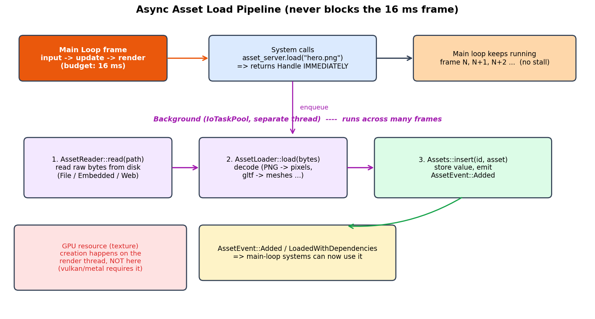
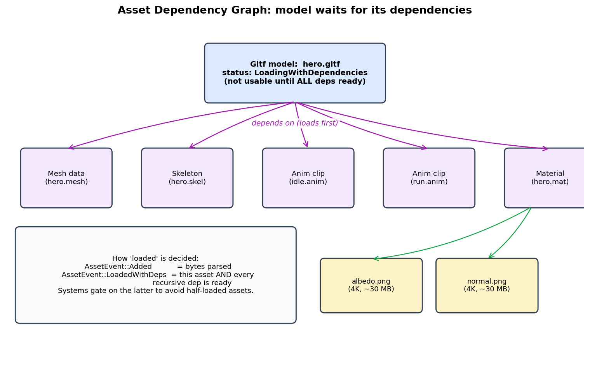
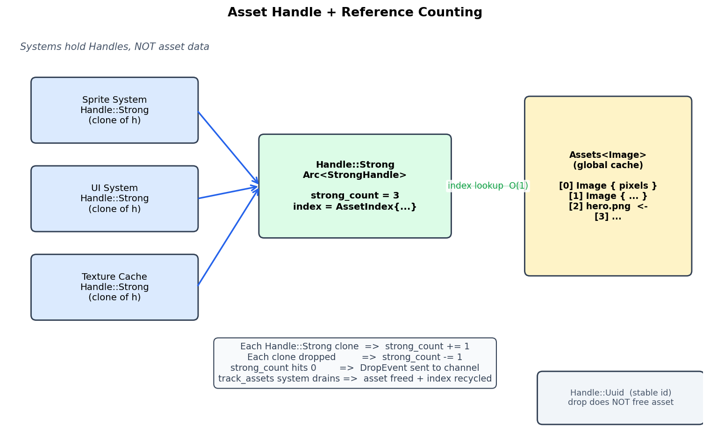

# 第 4 篇 · 第 13 章 · 资源管理:加载 / 异步 / 引用计数

> **核心问题**:前三篇我们一直在讲"每帧怎么把世界更新一遍"——ECS 三件套怎么组织数据、主循环怎么跑、物理怎么固定步长、delta time 怎么算。可这一帧帧更新渲染的世界里,有个东西一直被我们悄悄跳过:**那些贴图、模型、音频、动画这些"大块头数据",是从哪来的?** 一个角色模型,带着几十万三角面、几张 4K 贴图、一套骨骼、几十段动画,加起来上百 MB。这些东西要是真在每帧 16 毫秒预算里现场去磁盘读、现场解码,引擎早就卡死了。本章就是回答这一连串问题:**资产怎么加载而不卡帧(异步)、加载完了谁管它的生命周期(AssetServer + Assets<T> 缓存)、几百个对象都引用同一张贴图时怎么避免内存爆炸(资产句柄 + 引用计数)、一个模型依赖一堆贴图和动画时怎么等齐了再用(依赖图)**。

> **读完本章你会明白**:
> 1. 资产为什么是"大块数据",为什么**绝不能在 16ms 主循环里同步加载**——磁盘 IO + 解码 + GPU 上传动辄几十上百毫秒,同步加载等于卡帧。
> 2. 引擎怎么用**资产句柄(Handle)+ 全局缓存(Assets<T>)+ 引用计数**把资产的"逻辑引用"和"物理数据"解耦:几百个对象共享一份数据,引用归零就释放。
> 3. 异步加载流水线长什么样:**请求进队列→后台 IO 线程读字节 + 解码→加载完发事件通知主循环→GPU 资源在渲染线程创出来**。
> 4. 资产依赖图怎么处理:一个模型引用一堆贴图 + 骨骼 + 动画,引擎怎么等所有递归依赖就绪才标 `LoadedWithDependencies`,避免"半加载的资产"被用。
> 5. 真实引擎(Bevy)怎么落地这套设计:`AssetServer`/`Assets<T>`/`Handle`/`AssetEvent` 四件套的源码长什么样,以及一个本书要主动修正的事实——**Bevy 的 Handle 没有"弱引用"变体**。

> **如果一读觉得太难**:先记三件事——① 资产加载是**异步**的,你拿到的不是数据本身,是个**句柄(Handle)**,数据若干帧后在后台加载完;② 同一资产被多处引用时,引擎用**引用计数**管它的生命周期,引用归零就释放,引用计数的原理承《内存分配器》;③ 资产之间有**依赖**,加载一个模型要等它引用的所有贴图 / 动画就绪,引擎用 `LoadedWithDependencies` 这个状态区分"自己解析完了"和"全部依赖也好了"。

---

## 〇、一句话点破

> **资产管理的本质,是把"虚拟世界的逻辑引用"和"真实躺在内存 / GPU 里的数据"中间,塞一层间接——System 拿的是轻量句柄(Handle),数据集中躺在全局缓存(Assets<T>)里,加载在后台线程异步跑,生命周期靠引用计数自动收尾。这一层间接,换来三件事:数据不重复复制、加载不卡主循环、资产谁都不用了能自动释放。**

这是结论。本章倒过来拆:先看清资产到底"大"在哪、为什么同步加载是灾难,再讲资产句柄 + 全局缓存怎么解决"数据共享"和"生命周期",接着拆异步加载流水线,最后讲资产依赖图怎么处理。全程对照 Bevy 源码(`crates/bevy_asset/`),并修正一个普遍的误解——很多人以为 Bevy 的 `Handle` 有 `Strong` 和 `Weak` 两种,实际上没有 `Weak`,所谓"弱引用"在 Bevy 里是另一种东西(`Handle::Uuid`)。

> **承接书讲过**:本章核心技巧"引用计数"——`Arc`(atomic reference counted)的工作原理、为什么原子操作能让多线程安全共享——《内存分配器》那本已经讲透了。本书**一句带过引用计数本身的原理,只讲它在资产管理这个新场景里的落地**(怎么挂在 `Handle` 上、怎么和 `Assets<T>` 缓存配合、Drop 时怎么触发回收)。想搞懂 `Arc` 原子加减计数、`Weak` 怎么不阻止释放的底层,见《内存分配器》对应章节。

---

## 一、资产为什么是"大块数据",同步加载为什么是灾难

### 1.1 资产到底是什么

先把这个名词钉死。本书前面讲的对象——角色、敌人、子弹、相机、UI——它们**自身的数据**很小:一个 Transform 几个 float,一个 Health 一个 int,一个 Velocity 两个 float。ECS 把它们拆成 Component,Component 几十字节顶天。每帧更新几千上万个这种小对象,ECS 的连续布局 + SIMD 让它轻松跑进 16ms。**这些是"逻辑数据"。**

但游戏世界里还有另一类数据,完全不同量级:

- **贴图(Texture/Image)**:一张 4K(3840×2160)RGBA 贴图,原始像素 = 3840 × 2160 × 4 字节 ≈ **33 MB**。一个 PBR 角色要 albedo / normal / metallic-roughness / emissive 好几张,光贴图就一百多 MB。
- **网格(Mesh)**:一个精细角色模型几十万三角面,每顶点位置 + 法线 + 切线 + UV + 骨骼权重,几十 MB 起步。
- **动画(AnimationClip)**:一段几十秒的角色动画,每帧记几十根骨头的姿态,几十 MB。
- **音频(Audio)**:一段背景音乐,几分钟采样,几十 MB。

这些**大块数据**,在引擎术语里统称**资产(Asset)**。它们有几个共同特征,和 Component 那种"逻辑数据"完全两回事:

| 特征 | Component(逻辑数据) | Asset(资产) |
|------|---------------------|--------------|
| 单个体积 | 几十字节 | 几 MB 到几十 MB |
| 数量 | 几千上万个 | 几百到几千个 |
| 来源 | 运行时算出来 / 程序生成 | 从磁盘文件加载(.png/.gltf/.wav) |
| 生命周期 | 跟实体走,实体销毁就回收 | 跨多个实体共享,谁都不用才释放 |
| 加载代价 | 几乎零 | 几十到几百毫秒(磁盘 IO + 解码 + GPU 上传) |

> **钉死这件事**:资产 = 贴图、模型、动画、音频这些**大块头、从磁盘加载、跨多个对象共享**的数据。它和 Component 那种小尺寸逻辑数据,在体积、加载代价、生命周期上根本不在一个量级——所以引擎管它的方式,也完全不一样。

### 1.2 同步加载:一帧 16ms 怎么被吃光的

那最朴素的办法,直接在主循环里同步加载资产会怎样?你在 System 里写:

```rust
// 朴素(灾难性)做法:同步加载
fn setup(mut commands: Commands) {
    let texture = load_image_from_disk("hero.png");   // 阻塞, 直到读完解码
    commands.spawn(Sprite { image: texture, .. });
}
```

这一行 `load_image_from_disk`,背后发生的事:

1. **磁盘 IO**:从磁盘读 hero.png 的原始字节。一张几十 MB 的贴图,机械硬盘几毫秒到几十毫秒,SSD 也要 1-10ms。
2. **解码**:PNG / JPEG 是压缩格式,要解压成原始像素阵列。一张 4K PNG 解压,几十毫秒。
3. **GPU 上传**:把像素阵列从 CPU 内存上传到 GPU 显存,建一个纹理对象。这一步要调用图形 API(Vulkan / Metal / OpenGL),动辄几毫秒。

把这些加起来,加载一个资产**几十到几百毫秒**很正常。可一帧只有 **16 毫秒**(60 FPS)!也就是说,只要你在主循环里同步加载一个稍大的资产,这一帧就要花 100ms 以上,**画面直接卡 0.1 秒以上**。如果加载一个关卡,几百个资产一起同步加载,卡个十几秒都有可能——玩家看着画面冻住,体验崩盘。

> **不这样会怎样**:早期游戏引擎和某些简易框架,加载关卡时就是这么"同步堵"——画面冻住、声音卡住,玩家什么都干不了。某些怀旧 RPG 进战斗前那个"黑屏几秒",一大部分就是这么堵出来的。现代引擎一律异步,**绝不让磁盘 IO 和解码碰主循环的 16ms 预算**。

### 1.3 朴素方案撞的墙:总结

所以"在 System 里直接 `load_image` 同步加载"这条朴素路线,撞了三面墙:

- **墙一:磁盘 IO 阻塞**。读几十 MB 要几十毫秒,16ms 预算超支。
- **墙二:解码阻塞**。PNG / glTF 解压要几十毫秒,同样超支。
- **墙三:GPU 上传阻塞**。GPU 操作通常要在主线程或专门的渲染线程做(因为图形 API 对线程有限制),同步上传也卡主循环。

要绕过这三面墙,核心思路就一个字:**异步**——把"加载"这件事**从主循环里剥出去**,扔到后台慢慢干,主循环该怎么跑还怎么跑。但"异步"一开口,马上引出一连串新问题:既然加载是异步的,那 System 这帧拿不到数据怎么办?数据加载完了怎么告诉 System?数据加载完了放哪、谁管它?几百个对象引用同一资产,内存怎么不爆?——这些就是本章剩下的全部内容。

---

## 二、资产句柄(Handle):把"逻辑引用"和"物理数据"解耦

### 2.1 朴素做法:让 System 直接持有资产数据,会怎样

我们先看如果**不给中间加一层间接**,System 直接持有资产数据,会撞什么墙。

设想每个 Sprite 实体都自己持有一份贴图:

```rust
#[derive(Component)]
struct Sprite {
    image: Image,   // 直接持有几十 MB 的像素数据
}
```

然后场景里有 500 个用同一张 hero.png 的精灵。结果是什么?**500 份 hero.png 的副本,500 × 33 MB = 16.5 GB 显存**——显卡当场爆炸。这显然不行。

> **不这样会怎样**:如果让每个对象自己持有资产数据,几百个共享同一资产的对象,会把同一份数据复制几百份,内存 / 显存立刻爆掉。这是资产管理的第一面墙:**资产必须被共享,不能被复制**。

那把数据集中存一份,每个对象存个指针呢?

```rust
#[derive(Component)]
struct Sprite {
    image: Rc<Image>,   // 共享一份, 用引用计数指针
}
```

这样能省内存,但又撞另一面墙——**生命周期失控**:`Rc` 指针散落在几百个 Component 里,引擎根本不知道"这份资产现在到底有几个引用"。更糟的是,**资产是从磁盘异步加载的,加载完成的那一刻,可能引用它的对象还没被创建**——你没法用 `Rc` 指向一个"还没加载完"的东西。

### 2.2 解法:中间加一层间接——全局缓存 + 句柄

正确的设计,是在"System 想用的资产"和"资产的实际数据"中间,加一层**间接(indirection)**:

1. **全局缓存(`Assets<T>`)**:引擎维护一个全局的资产仓库,每种资产类型 T 对应一个 `Assets<T>` 资源(ECS 里的 Resource,见 P1-03)。资产数据集中躺在里面,用 `AssetId` 索引。**同一资产只有一份数据**,不会重复复制。
2. **句柄(`Handle<T>`)**:System / Component 不直接持有资产数据,而是持有这个资产的**句柄**——一个轻量的"引用凭证",内部只存一个 `AssetId`(几字节)。System 拿着句柄,要用数据时,去全局缓存里用这个 id 查。

```rust
#[derive(Component)]
struct Sprite {
    image: Handle<Image>,   // 句柄, 只存 id, 几字节
}
```

这样一拆,前面的墙全塌了:

- **资产不重复**:同一资产在 `Assets<T>` 里只存一份,500 个 Sprite 各持一个 `Handle`,但 Handle 只是 id,几乎不占内存。
- **生命周期可管**:句柄可以参与"引用计数",引擎靠数句柄知道"这个资产还有谁在用"(下一节详讲)。
- **适配异步加载**:句柄可以先于数据存在——你 `asset_server.load("hero.png")` 立刻拿到一个 Handle,数据若干帧后才在后台加载完。Handle 是个"先开票、后取货"的凭证。

> **钉死这件事**:资产管理的核心抽象 = **全局缓存(`Assets<T>`)+ 句柄(`Handle<T>`)**。资产数据集中躺在缓存里(只一份,不复制),System 持有轻量句柄(只存 id)。这一层间接,把"逻辑引用"和"物理数据"彻底解耦,让共享、生命周期、异步加载都成为可能。

### 2.3 直觉:取号系统

一个生活化的比喻(本章只用这一次,不喧宾夺主):这就像银行的取号系统。你想办业务(System 想用资产),但柜台(GPU / 解码器)现在忙,你**先取个号(Handle)**,票上写着"第 7 号"(AssetId=7),你拿着票该干嘛干嘛去(主循环继续跑)。若干分钟后,大屏显示"7 号请到 3 号窗口"(`AssetEvent::Added`),你拿着票去取数据(`assets.get(handle)`)。票本身轻如鸿毛(就一个号),业务的数据(几十 MB 的文件)在系统内部只存一份,谁取号谁都能查到。

### 2.4 顺带呼应:这是数据导向思想在资产上的再现

读者读完第 2 篇(ECS 数据导向)再回头看资产管理,会发现"句柄 + 全局缓存"本质是**数据导向设计**在资产这个场景里的再现。把数据(资产)按类型集中连续存放(`Assets<T>` 里的 `dense_storage`,本质是个 dense Vec),访问者(System)持轻量 id(Handle),访问时按 id 索引——这和 ECS 把 Component 按类型连续存放、System 用 Query 拿引用是同一种思想:**让数据按"被怎么访问"来布局,而不是按"属于谁"来散落**。

`Assets<T>::get(handle)` 内部是一次 Vec 下标访问 + 一次 generation 比较(下一节技巧精解详讲),O(1) 且缓存友好。如果资产数据散落在堆上(每个 Sprite 自己 new 一份),`get` 就退化成指针追逐,缓存全 miss。Bevy 把所有同类资产集中在 `dense_storage` 这个 Vec 里,正是承《内存分配器》和第 2 篇 ECS 的同一条数据导向血脉。

> **钉死这件事**:"句柄 + 全局 dense 缓存"是数据导向设计在资产管理上的落地——资产按类型连续排布在 `Assets<T>` 的 dense Vec 里,Handle 只是下标,访问缓存友好。这和 ECS 把 Component 按类型连续存放、System 用 Query 索引是同源思想。读者读懂第 2 篇的 SoA / dense 布局,资产这边的内存布局自然就懂了,完全不用再花额外力气重新建立直觉。

---

## 三、引用计数:资产的生命周期怎么自动收尾

### 3.1 新问题:加载完了放缓存里,什么时候释放

句柄 + 缓存解决了"共享"和"异步加载"的入口。但马上引出新问题:**资产加载完躺在 `Assets<T>` 缓存里,什么时候该释放?**

玩家从主菜单进了关卡 1,加载了 hero.png。打完关卡 1 回主菜单,再进关卡 2,关卡 2 不用 hero.png。这时候 hero.png 还躺在缓存里占着 33MB——永远不释放,内存越攒越多,最后 OOM。

那什么时候释放?直觉上有几个方案:

- **方案 A:进新关卡时,把上一关的资产全清掉**。问题:有些资产(全局 UI 贴图、通用音效)跨关卡共用,清掉就没了,要重加载,卡顿。
- **方案 B:引擎手动管理,谁加载谁负责调 `unload`**。问题:几百个对象引用同一资产,谁负责 unload?一个对象销毁了,它不该 unload 别人还在用的资产;最后销毁的那个对象,又怎么知道自己是"最后一个"?
- **方案 C:引用计数**。这正是 Bevy(和绝大多数现代引擎)的方案。

### 3.2 引用计数:数句柄,归零释放

**引用计数**(reference counting)的核心思想,任何"句柄系统"都在用——文件描述符、数据库连接池、内核对象,你将来在《Linux 内核机制》也会反复看到同款设计。**它的原理,承《内存分配器》已经讲透了,这里一句带过**:每个资产维护一个"当前有几个句柄指向它"的计数,每出一个新句柄 +1,每销毁一个句柄 -1,**计数归零就释放数据**。

在 Bevy 里,这个机制靠两个东西配合实现:

1. **`Arc<StrongHandle>`**:`Handle::Strong` 内部包了一个 Rust 标准库的 `Arc`(atomic reference counted,原子引用计数智能指针)。每 `clone` 一次 `Handle::Strong`,`Arc` 内部的原子计数 +1;每 drop 一个,计数 -1。
2. **`Assets<T>` 缓存的 drop 通道**:`StrongHandle` 析构时,往一个 crossbeam 通道发 `DropEvent`,主循环里有个专门的系统(`Assets::track_assets`)每帧抽干这个通道,处理真正的数据释放。

我们用 Bevy 源码逐段拆。

#### StrongHandle:Drop 时发消息

看 Bevy 的 `crates/bevy_asset/src/handle.rs`(GitHub `bevyengine/bevy` master 分支):

```rust
// crates/bevy_asset/src/handle.rs (简化, 突出核心)
pub struct StrongHandle {
    pub(crate) index: AssetIndex,
    pub(crate) type_id: TypeId,
    pub(crate) asset_server_managed: bool,
    pub(crate) path: Option<AssetPath<'static>>,
    pub(crate) meta_transform: Option<MetaTransform>,
    pub(crate) drop_sender: Sender<DropEvent>,
}

impl Drop for StrongHandle {
    fn drop(&mut self) {
        let _ = self.drop_sender.send(DropEvent {
            index: ErasedAssetIndex::new(self.index, self.type_id),
            asset_server_managed: self.asset_server_managed,
        });
    }
}
```

读这段源码注意几件事:

- **`StrongHandle` 持有 `index: AssetIndex`**(资产在缓存里的位置,下一节详讲)、`path`(可选的资产路径,用于热重载)、还有 `drop_sender`(一个通道发送端)。
- **`Drop for StrongHandle`** 是关键:Bevy 不在析构函数里**直接**释放资产数据,而是往通道里发一个 `DropEvent`,说"我这个句柄死了,你待会儿处理一下"。**为什么不直接释放?** 因为 Rust 的 `Arc` 析构可能在任何线程发生(资产管理是多线程的,异步加载在后台线程),而真正释放资产数据(`Assets<T>` 改 `dense_storage`)必须在主线程持有 `&mut Assets<T>` 的地方做——所以要"发消息回主线程,稍后集中处理"。这是典型的"延迟处理"模式,承《内存分配器》讲过的"释放不在 hot path 现场做,而是攒队列稍后批量"。

> **钉死这件事**:Bevy 的引用计数分两层——**`Arc` 的原子计数**(Rust 标准库给的多线程安全引用计数,原理承《内存分配器》)+ **Drop 通道 + track_assets 系统**(把"该释放了"这个信号从任意线程安全地传回主循环,延迟批量处理)。这两层加起来,实现了"句柄归零 → 资产释放"的自动生命周期管理,而且全程线程安全。

#### Assets::track_assets:每帧抽干 drop 通道

那"延迟批量处理"在哪做?在主循环的 `Assets::track_assets` 系统里:

```rust
// crates/bevy_asset/src/assets.rs (简化)
impl<A: Asset> Assets<A> {
    /// A system that synchronizes the state of assets in this collection
    /// with the AssetServer. This manages Handle drop events.
    pub fn track_assets(mut assets: ResMut<Self>, asset_server: Res<AssetServer>) {
        let mut infos = asset_server.write_infos();
        while let Ok(drop_event) = assets.handle_provider.drop_receiver.try_recv() {
            if drop_event.asset_server_managed {
                if !infos.process_handle_drop(drop_event.index) {
                    // 有新 handle 又被创建了, 或者资产不存在, 跳过
                    continue;
                }
            }
            assets.remove_dropped(drop_event.index.index);
        }
    }
}
```

这个系统每帧(由 AssetPlugin 注册进主调度)干的事:

- 从 drop 通道 `try_recv` 抽干所有 `DropEvent`(每帧攒了多少就处理多少)。
- 对每个 drop 事件,调 `remove_dropped`,真正从 `dense_storage` 里把数据搬走,并 **recycle 这个 AssetIndex**(下一节讲 generation)。

注意那个 `process_handle_drop` 检查——它先确认"这个资产自打发出 drop 事件后,有没有又被人新建了 handle"。如果有,就跳过(因为现在又有引用了,不该释放)。**这是引用计数在多线程异步加载下必须的兜底**:drop 事件是延迟处理的,期间可能这个资产又被重新加载了 / 又被新对象引用了,要二次确认。

> **钉死这件事**:资产释放**不是句柄 drop 的那一刻立刻发生**,而是攒在通道里,由 `Assets::track_assets` 系统每帧抽干。这种"延迟批量"既保证了线程安全(释放只在主线程的 `&mut Assets<T>` 上下文做),又让释放开销分摊到每帧,不会一次卡帧。

---

## 四、技巧精解(上):AssetIndex 的 generation——和 Entity 的 version 同源

本章第一个硬核技巧,是 Bevy 给资产编号用的 `AssetIndex{generation, index}` 设计。这套机制和 P2-05 讲的 Entity 的 "slot + version" 设计**思想同源**,但落地细节不同。我们拆透。

### 4.1 它解决什么问题

和 Entity 一样,资产销毁后,它在缓存里的"槽位"要不要复用?复用的话,旧引用怎么检测?具体场景:

- 玩家销毁了所有引用 hero.png 的 Sprite,**句柄归零,hero.png 从缓存释放**。
- 几秒后,玩家又重新加载 hero.png(走 `asset_server.load`)。新资产该占哪个槽位?
  - 要是**不复用旧槽位**(永远递增 index),缓存数组无限增长,几十万次加载销毁后,数组扩到几百万槽,内存浪费。
  - 要是**复用旧槽位**,但槽位编号没变,那万一有人手里攥着旧的 Handle(id=7),他去 `assets.get(handle)`,会拿到**新 hero.png 的数据**——明明是个悬空引用,却拿到了个看着正常的结果,**bug 极难复现**。

### 4.2 Bevy 的解法:AssetIndex = index + generation

Bevy 的方案:`AssetIndex` 拆成两段——`index`(槽位)+ `generation`(版本号)。看源码:

```rust
// crates/bevy_asset/src/assets.rs
#[derive(Debug, Copy, Clone, Eq, PartialEq, Hash, ...)]
pub struct AssetIndex {
    pub(crate) generation: u32,
    pub(crate) index: u32,
}

pub(crate) struct AssetIndexAllocator {
    next_index: AtomicU32,                          // 单调递增分配新槽
    recycled_queue_sender: Sender<AssetIndex>,      // 回收的 index 进队列
    recycled_queue_receiver: Receiver<AssetIndex>,
    recycled_sender: Sender<AssetIndex>,
    recycled_receiver: Receiver<AssetIndex>,
}

impl AssetIndexAllocator {
    pub fn reserve(&self) -> AssetIndex {
        if let Ok(mut recycled) = self.recycled_queue_receiver.try_recv() {
            recycled.generation += 1;               // 复用槽位, 但 generation +1
            self.recycled_sender.send(recycled).unwrap();
            recycled
        } else {
            AssetIndex {
                index: self.next_index.fetch_add(1, Ordering::Relaxed),
                generation: 0,
            }
        }
    }
    pub fn recycle(&self, index: AssetIndex) {
        self.recycled_queue_sender.send(index).unwrap();
    }
}
```

读这段源码:

- **`AssetIndex{generation, index}`**:和 Entity 的 `slot + version` 思想一模一样。`index` 是槽位编号,可复用;`generation` 是版本号。
- **`reserve()`**:分配新 `AssetIndex`。优先从回收队列复用(此时 `generation += 1`),否则递增 `next_index` 拿个新槽位。
- **`recycle()`**:把一个 index 扔回回收队列,等下次 `reserve` 复用。**复用时 generation +1**,这正是"区分同一槽位上新旧资产"的关键。

### 4.3 dense 存储 + generation 校验

那 `Assets<T>` 怎么用这个 `AssetIndex` 存数据?用 dense vec:

```rust
// crates/bevy_asset/src/assets.rs (简化)
enum Entry<A: Asset> {
    #[default]
    None,                                  // 这个槽位没有 live handle
    Some { value: Option<A>, generation: u32 },
}

struct DenseAssetStorage<A: Asset> {
    storage: Vec<Entry<A>>,                // dense vec, 按下标存
    len: u32,
    allocator: Arc<AssetIndexAllocator>,
}

impl<A: Asset> DenseAssetStorage<A> {
    pub(crate) fn get(&self, index: AssetIndex) -> Option<&A> {
        let entry = self.storage.get(index.index as usize)?;
        match entry {
            Entry::None => None,
            Entry::Some { value, generation } => {
                if *generation == index.generation {       // generation 校验
                    value.as_ref()
                } else {
                    None                                    // generation 不符 = 悬空引用
                }
            }
        }
    }
}
```

注意 **`get` 里的 generation 校验**:

- 你拿着旧 `Handle`(里面 index.generation = 0),去查缓存。
- 槽位当前 generation 已经是 1(因为旧资产释放过、复用过)。
- `*generation == index.generation` 不等 → 返回 `None` → **悬空引用被检测出来,不会拿到张冠李戴的数据**。

这套机制,本质就是 P2-05 讲 Entity 时拆的 version 机制——只是 Entity 把 version 塞在 id 高位(零额外内存),Bevy Asset 把 generation 作为结构体的一个字段分开存。**思想同源,落地略异**。

> **钉死这件事**:AssetIndex{index, generation} 和 Entity 的 {slot, version} 是同一招——槽位可复用,版本号区分新旧。任何"句柄系统"(文件描述符、连接池、ECS 实体、GPU buffer 句柄)都会遇到这同款问题,version/generation 是通用解。这是资产管理给"句柄"这个词注入的具体内涵。

### 4.4 反面对比:纯递增 id 不复用

要是不用 generation 机制(纯递增 id 永不复用):

- 玩家反复进出关卡,几万次加载销毁,id 涨到几万。`DenseAssetStorage::storage` 这个 Vec 要扩到几万槽,哪怕大部分槽位空着。
- 旧 Handle(id=7,已销毁)去查缓存,要么越界 panic,要么(更糟)返回个看起来正常的结果(因为槽位 7 现在住了别人),bug 极难定位。

generation 机制两件事一起解:槽位复用省内存 + 悬空引用可检测。零额外内存开销(就 generation 一个 u32 字段)。这就是这招的妙。

---

## 五、异步加载流水线:把磁盘 IO + 解码扔到后台

讲完了"加载完了数据怎么管"(缓存 + 句柄 + 引用计数),现在回到那三面墙——磁盘 IO、解码、GPU 上传都阻塞——引擎怎么漂亮地把它们挪出 16ms 主循环。

### 5.1 总体设计:请求立即返回 + 后台慢慢干 + 完成发事件

核心思路一句话:**System 调 `asset_server.load("hero.png")`,这一行立即返回一个 `Handle` 给你,然后真正的加载在后台线程慢慢跑,跑完用事件通知你**。System 不阻塞,主循环该怎么转还怎么转。

整个流程是一条流水线,涉及四个角色:



1. **AssetServer**:统一入口,接 `load` 请求,立即返回 Handle,把真正的加载任务扔后台。
2. **AssetReader**:负责从各种来源(File / Embedded / Web / Memory)读**原始字节**。这层抽象掉了"资产来自哪",PNG 文件来自磁盘、来自内存嵌入、来自 HTTP,对上层都一样。
3. **AssetLoader**:负责**解码**——把原始字节翻译成具体类型的资产。`ImageLoader` 把 PNG 字节解成像素阵列,`GltfLoader` 把 glTF 字节解成 mesh + material 的依赖树。
4. **Assets<T>::insert**:加载完的数据入库,发 `AssetEvent::Added` 事件。

### 5.2 后台在哪跑:IoTaskPool(承 P1-03)

P1-03 我们已经发现:Bevy 的 `AssetServer` 在 **IoTaskPool**(一个专门干 IO 的线程池)上异步加载。这里把"为什么是线程池、为什么不在主循环"讲透。

异步加载用 Rust 的 async/await 机制实现:`asset_server.load()` 内部 spawn 一个 async task 到 IoTaskPool。这个 task 长这样(伪代码):

```rust
// 伪代码(简化, 非源码原文)
async fn load_asset(path: AssetPath, loader: Arc<dyn AssetLoader>) {
    let bytes = asset_reader.read(path).await;        // await: 这一步真在等磁盘
    let asset = loader.load(bytes).await;             // await: 这一步真在解码
    assets.insert(id, asset);                          // 入库 + 发 AssetEvent::Added
}
```

关键在那两个 `.await`——**它们让这个 task 在等磁盘 / 等 CPU 解码时,主动让出 IoTaskPool 的线程,给别的 task 跑**。这就是 Rust 异步模型(Tokio 那一套)的核心,P5-17 多线程 job 系统会详讲异步任务调度。本章只需记住:**`.await` 让"等磁盘"这种本来阻塞的操作,变成"我先让出来,等磁盘好了 OS 会唤醒我继续"的非阻塞操作**。

> **承《Tokio》**:**`.await` 的本质——异步任务在等 IO 时让出线程、就绪后由 reactor 唤醒、executor 重新调度——是 Tokio 那套 reactor + executor 模型。本书 P5-17 多线程 job 系统详讲 Bevy 的 task pool,这里只点出"后台异步加载用的就是这套"。

### 5.3 加载完了怎么通知主循环:AssetEvent

后台加载完,数据要进 `Assets<T>` 缓存。这个"入库"操作,Bevy 用 **`AssetEvent`** 通知主循环里的 System。看几种事件:

| AssetEvent 变体 | 含义 |
|---|---|
| `Added` | 资产被首次插入缓存(字节解析完了) |
| `Modified` | 资产数据被改(运行时 `assets.get_mut` 改了像素,或热重载触发) |
| `Removed` | 资产被显式 `assets.remove` |
| `Unused` | 资产的最后一个 strong handle 被销毁(释放前一刻) |
| `LoadedWithDependencies` | 资产**及其所有递归依赖**都就绪了(下一节详讲) |

System 怎么消费这些事件?用 ECS 的 `EventReader`(本书 P5-19 输入事件系统会详讲事件机制,这里先用):

```rust
fn on_texture_loaded(mut events: EventReader<AssetEvent<Image>>) {
    for event in events.read() {
        match event {
            AssetEvent::Added { id } => {
                // 一张新贴图刚加载完, 可以拿来用了
            }
            AssetEvent::Modified { id } => { /* 热重载触发, 重新上传 GPU */ }
            _ => {}
        }
    }
}
```

> **钉死这件事**:异步加载 = **请求立即返回 Handle + 后台 IoTaskPool 三段流水线(read → load → insert)+ 完成用 AssetEvent 通知**。System 不阻塞主循环,数据加载完用事件解耦通知。这是 P1-03 讲的"子系统三种驱动模式"里"异步后台"那一类的招牌实现——和音频 / 网络那种"事件驱动"还不同,资产是"请求-句柄-事件"的三段式。

### 5.4 那 GPU 资源怎么办:不能在后台线程创

这里有个**新手最容易踩的坑**:数据加载完了,但 GPU 那边的纹理对象还没创呢。GPU 纹理对象(GPU texture)必须在**主线程或渲染线程**创建,因为图形 API(Vulkan / Metal / OpenGL)对线程有限制——大多数情况下,创建 GPU 资源必须在持有 GPU 上下文的线程做。所以即便像素数据在后台线程解码好了,**真正创建 GPU 纹理对象这一步,要拖回渲染线程做**。

在 Bevy 里,这一步发生在渲染子系统提取(extract)阶段——主循环把 Image 数据从主世界抽取到渲染世界,渲染子系统在那里把 CPU 端的像素阵列上传到 GPU 建纹理。这件事的细节属于 P5-18(渲染提交),本章只点出:**异步加载流水线里,字节读取和解码在后台线程,但 GPU 资源创建不在,它要回到渲染线程**。

> **钉死这件事**:异步加载流水线**不是全在后台**——磁盘 IO 和解码在后台 IoTaskPool,但 GPU 资源创建要回到主线程 / 渲染线程(图形 API 的线程约束)。这是异步资产加载里最容易被忽略的细节,也是为什么"加载完成"事件分两层:CPU 端数据好了(`Added`)和 GPU 端真正可用,可能差几帧。

### 5.5 没加载完就用怎么办:占位 / 跳过

那既然是异步,加载这一帧 System 拿到的 Handle 指向的资产可能**还没好**。System 用的时候怎么办?

- **查询是否就绪**:`assets.get(handle)` 返回 `Option<&T>`,没好就 `None`。
- **跳过 / 占位**:RenderSystem 遍历所有有 `Handle<Image>` 的实体,`get` 到 `None` 的就跳过(或显示一个粉色 / 默认占位贴图)。等加载完事件来了,下一帧自然就画出来了。

这就是为什么"加载中"的游戏画面里,角色有时先是个粉色模型,过几帧贴图"砰"地一下出现——**数据异步加载完,GPU 重新提取时才把贴图贴上**。这是异步加载的必然结果,不是 bug。

---

## 六、资产依赖图:一个模型要等一堆贴图 / 动画

### 6.1 资产不是孤岛

到目前为止我们好像默认每个资产是独立加载的——hero.png 一个、bgm.wav 一个。但真实世界的资产**互相引用**:一个角色模型(.gltf)不是孤立的,它引用一堆贴图(albedo.png、normal.png、...)、一堆动画(idle.anim、run.anim、attack.anim)、一套骨骼(hero.skel)、若干材质(hero.mat)。材质又引用贴图。**资产构成一张依赖图(dependency graph)**。



这张依赖图给加载流水线带来新约束:**模型 hero.gltf 加载完(字节解析完) ≠ 它能用了**。因为它的依赖可能还没加载完——mesh 解析完了,但 albedo.png 还在后台读磁盘。如果这时候就让 RenderSystem 用这个模型,会发现材质没贴图,渲染失败。

### 6.2 Bevy 的解法:LoadedWithDependencies 事件

Bevy 区分两个状态(用两个不同的 AssetEvent):

- **`AssetEvent::Added`**:这个资产**自己**的字节解析完了、入库了。
- **`AssetEvent::LoadedWithDependencies`**:这个资产**及其所有递归依赖**都就绪了。

依赖图怎么建?关键在 **AssetLoader**。当一个 `AssetLoader`(比如 `GltfLoader`)解析 .gltf 文件时,它发现里面引用了若干贴图路径、动画路径。它**对这些依赖路径也调 `asset_server.load()`,拿到它们的 Handle**,把这些 Handle 作为"依赖"挂在主资产上。

Bevy 怎么追踪这些依赖?用 `#[dependency]` 属性 + `VisitAssetDependencies` trait。看 `LoadedUntypedAsset` 这个资产:

```rust
// crates/bevy_asset/src/assets.rs
#[derive(Asset, TypePath)]
pub struct LoadedUntypedAsset {
    /// The handle to the loaded asset.
    #[dependency]
    pub handle: UntypedHandle,
}
```

`#[dependency]` 标记告诉 Bevy:"这个字段是依赖,加载我的人要等它就绪"。Bevy 在 AssetPlugin 里维护每个资产的"依赖列表",当一个资产的所有依赖都发过 `LoadedWithDependencies`,这个资产自己才发 `LoadedWithDependencies`。这是个**递归传播**:叶子资产(贴图)没依赖,自己 Added 完就 LoadedWithDependencies;上层资产(模型)要等所有依赖 LoadedWithDependencies 才自己 LoadedWithDependencies。

### 6.3 System 怎么消费:gate 在 LoadedWithDependencies 上

那 System 怎么避免用"半加载"的模型?**只用 `LoadedWithDependencies` 事件作为"可用了"的信号**,而不用 `Added`:

```rust
fn on_model_ready(mut events: EventReader<AssetEvent<Gltf>>) {
    for event in events.read() {
        if let AssetEvent::LoadedWithDependencies { id } = event {
            // 这个模型及其所有依赖都就绪, 可以真正 spawn 到场景了
        }
    }
}
```

场景实例化(`Commands::spawn_scene`)就 gate 在这个状态上——Bevy 的 `World::queue_spawn_scene` 会先注册场景的所有依赖,等依赖全就绪才真正 spawn 实体,避免"实体 spawn 了但缺资产"的尴尬。

> **钉死这件事**:资产构成依赖图,加载一个模型 ≠ 它能用了——要等它的所有递归依赖(贴图 / 动画 / 骨骼 / 材质)都就绪。Bevy 用 `LoadedWithDependencies` 事件区分"自己解析完"和"全部依赖就绪",System 应该 gate 在后者上判断"真正可用"。这是依赖图加载的核心约束,新手最容易在 `Added` 上判断导致"半加载 bug"。

---

## 六·补、为什么是 dense vec 而不是 hashmap:资产存储的内存布局

到这里读者可能会问一个很自然的性能问题:`Assets<T>` 内部用 `DenseAssetStorage`(就是个 `Vec<Entry<A>>`)存 strong handle 指向的资产,用 `HashMap<Uuid, A>` 存 uuid handle 指向的资产。**为什么不给所有资产都用 hashmap?** 答案又是《内存分配器》那条"数据布局决定性能"在资产管理场景的再现。

回看 `DenseAssetStorage::get`:

```rust
// crates/bevy_asset/src/assets.rs
pub(crate) fn get(&self, index: AssetIndex) -> Option<&A> {
    let entry = self.storage.get(index.index as usize)?;   // <- Vec 下标访问
    match entry {
        Entry::None => None,
        Entry::Some { value, generation } => {
            if *generation == index.generation { value.as_ref() } else { None }
        }
    }
}
```

`self.storage.get(index.index as usize)` —— **一次 Vec 下标访问,O(1),还是缓存友好的连续内存**。这就是为什么 strong handle 用 dense vec 存:资产数据按 index 连续排在 Vec 里,`get` 是一次数组下标 + 一次 generation 比较,极快。

对照 `Assets::get` 里 uuid 那条分支:`self.hash_map.get(&uuid)` —— hashmap 查找,要算 hash + 处理可能的冲突,虽然也是平均 O(1),但常数项大,且 hashmap 内部是链表 / 开放寻址,**缓存不友好**(指针追逐)。所以 Bevy 把 hashmap 留给"必须用稳定 UUID 引用"的少数场景,正常运行时资产一律走 dense vec。

> **承《内存分配器》**:这又是"数据布局决定性能"的落地——资产数据按 dense vec 连续排布,`get` 是缓存友好的数组下标访问;若塞 hashmap,每次访问都 hash + 指针追逐。Bevy 默认走 dense(vec),只在需要稳定 UUID 时才退到 hashmap,这是数据导向思想在资产管理里的体现。读者读完 P2-06(SoA vs AoS)再回头看这里,会发现同一思想。

这套设计还有一个妙处:**dense vec 的 index 复用 + generation,让资产销毁后槽位能回收但不无限增长**(技巧精解上拆过)。如果是纯 hashmap,uuid 永不重复,hashmap 只增不减,运行久了内存膨胀。dense vec + generation 同时解了"槽位复用"和"O(1) 缓存友好访问"两件事。

## 六·补二、Entity version vs AssetIndex generation:同源思想,不同落地

技巧精解(上)讲过 AssetIndex 的 generation 和 P2-05 Entity 的 version 思想同源。这一节把这个对照拆细,帮读者建立"句柄系统的通用招"这个抽象。

| 维度 | Entity(P2-05, EnTT) | Asset(Bevy AssetIndex) |
|------|---------------------|------------------------|
| 标识符 | `entity` 强类型枚举(32 位) | `AssetIndex{generation: u32, index: u32}` 结构体(64 位) |
| 槽位段 | 低 20 位(slot) | `index` 字段(u32) |
| 版本段 | 高 12 位(version) | `generation` 字段(u32) |
| 拆装方式 | 位运算(`& entity_mask`、`>> length`)位拼装 | 结构体字段直接访问 |
| 内存占用 | 一个 32 位整数(version 塞在 id 高位,零额外内存) | 64 位(两字段分开,稍多但更直观) |
| 复用机制 | destroy 时 version +1,create 复用 slot 时用新 version | recycle 扔回队列,reserve 复用时 generation +1 |
| 悬空检测 | 旧 id version ≠ 槽位当前 version | 旧 index.generation ≠ 槽位当前 generation |

两边干的是**同一件事**:槽位可复用(避免数组无限增长)+ 版本号区分新旧(悬空引用检测)。差别只在落地——EnTT 把 version 塞进 id 高位省内存(零额外开销,但要用位运算拆装),Bevy 用结构体两字段更直观(多花点内存换代码可读性,且 AssetIndex 不像 Entity 那样满天飞,64 位无所谓)。

> **钉死这件事**:"槽位 + 版本号"是**任何句柄系统的通用招**。Entity 用它区分"已销毁的旧实体"和"复用同槽的新实体",Asset 用它区分"已释放的旧资产"和"复用同槽的新资产"。你将来在文件描述符、内核对象、连接池、GPU buffer 句柄里都会看到同款设计——内核的 `generation` 计数、文件系统的 inode 版本、数据库的事务 ID,本质都是这套。游戏引擎里的 Entity 和 Asset 只是这个通用模式在两个场景下的落地。

## 六·补三、热重载:文件改了,资产怎么自动更新

本章还有一个能力没讲——**热重载(hot reloading)**。开发时策划改了 hero.png(在 Photoshop 里调了色),引擎能不能不重启就自动重新加载,让画面里立刻看到新贴图?Bevy 支持,而且用的是本章这套架构的自然延伸。

热重载的流程:

1. **文件监视(file watcher)**:Bevy 的 AssetPlugin 起一个后台线程监视资产目录(用 `notify` crate)。文件被改动,触发一个事件。
2. **重新走加载流水线**:被改动的资产路径,重新跑一遍 `AssetReader::read → AssetLoader::load`,得到新的资产数据。
3. **复用同一 AssetIndex**:`Assets::insert` 用**原来的 AssetIndex** 把新数据**替换**旧数据(`insert_with_index` 里 `if *generation == index.generation { *value = Some(asset); }`,generation 不变,index 不变,只是 value 被换)。
4. **发 `AssetEvent::Modified`**:不是 Added(因为不是首次),是 Modified,通知 System"这个资产数据变了"。
5. **System 响应 Modified**:RenderSystem 监听 Image 的 Modified 事件,把新像素重新上传 GPU,重新建纹理。画面里下一帧就看到新贴图。

关键洞察:**热重载不需要换 Handle**——Handle 里的 AssetIndex 没变,只是它指向的数据被换了。所有持有这个 Handle 的对象(Sprite、Material、UI),自动看到新数据,不用重新拿 Handle。**这正是"句柄 + 缓存"解耦的福利**:数据在缓存里被换,所有引用者零成本看到新值。

有个细节:zread 文档点出"hot reloading only updates assets that are currently held by at least one strong handle"——**只有当前还有 strong handle 持有的资产才会被热重载**。为什么?因为如果一个资产 strong handle 归零了,它早就被 track_assets 释放、AssetIndex 被 recycle 了。文件改动触发重载时,引擎要重新分配 AssetIndex,但这时候**没人持有旧 Handle**,重载出来也没人看。所以 Bevy 只对"还活着(有 strong handle)的资产"做热重载,符合引用计数管生命周期的整体设计。

## 六·补四、Unity / Unreal 怎么做资产管理:对照

为帮读者建立对照,看一眼 Unity 和 Unreal 怎么管资产。三者思路同源(异步 + 句柄 + 引用计数),细节有别。

| 维度 | Bevy | Unity | Unreal |
|------|------|-------|--------|
| 句柄类型 | `Handle<T>`(Strong / Uuid) | `AssetReference` / 路径字符串 | `T*` / `TSubclassOf<T>` / `FSoftObjectPath` |
| 加载入口 | `asset_server.load(path)` | `Resources.Load(path)` / `Addressables.LoadAssetAsync` | `LoadObject<T>(path)` / 异步 `LoadAsset` |
| 异步方式 | IoTaskPool + async/await | C# 的 `Task` / coroutine | `FStreamableManager` 异步 |
| 引用计数 | `Arc` + `duplicate_handles` | 内部引用计数(`Object.Destroy` 释放) | `UPROPERTY` 反射 + 引用计数 GC |
| 全局缓存 | `Assets<T>` Resource | `AssetDatabase` / `Resources` | `UObject` 系统 + `AssetManager` |
| 依赖 | `#[dependency]` + LoadedWithDeps | AssetBundle 依赖 / Addressables labels | `UPackage` 依赖 + `AssetManager` |

Unity 的 `Resources.Load` 在老版本里是**同步加载**(撞 1.2 节那三面墙),后来推 Addressables 走异步。Unreal 的 `LoadObject` 同步为主,异步要专门用 `FStreamableManager`。**Bevy 从一开始就是异步优先(async-first)**,这反映现代引擎设计的共识:同步资产加载是历史遗留,异步才是正路。

> **钉死这件事**:Unity / Unreal / Bevy 的资产管理**核心思路同源**(异步 + 句柄 + 引用计数),差异在落地——Unity 走 C# 的 Task / coroutine,Unreal 走自己的 FStreamableManager,Bevy 走 Rust 的 async/await + IoTaskPool。读者已读懂 Bevy 这套,去用 Unity Addressables 或 Unreal AssetManager 时,会发现底下的抽象几乎可以一一对应。

---

## 七、一句话修正:Bevy 的 Handle 没有 "Weak" 变体

本章最后一个硬核内容,是修正一个**普遍的误解**——包括很多网上资料和总纲的早期印象,都说 Bevy 的 `Handle` 有 `Strong` 和 `Weak` 两种变体。但这是**错的**(至少在当前 master 分支)。我们用源码钉死。

### 7.1 源码真相:Handle 是 Strong / Uuid 两变体

看 Bevy 的 `crates/bevy_asset/src/handle.rs`:

```rust
// crates/bevy_asset/src/handle.rs (源码原文)
pub enum Handle<A: Asset> {
    /// A "strong" reference to a live (or loading) Asset. If a Handle is Handle::Strong,
    /// the Asset will be kept alive until the Handle is dropped.
    Strong(Arc<StrongHandle>),
    /// A reference to an Asset using a stable-across-runs / const identifier.
    /// Dropping this handle will not result in the asset being dropped.
    Uuid(Uuid, #[reflect(ignore, clone)] PhantomData<fn() -> A>),
}
```

两个变体是 **`Strong`** 和 **`Uuid`**,**没有 `Weak`**。

那"弱引用"在 Bevy 里是什么?是这个 `Uuid` 变体——但它**不是**传统意义上的 `Weak` 指针(像 Rust 标准库 `Arc::downgrade` 得到的 `Weak`,那种弱指针不阻止释放但能 upgrade 回 strong)。`Handle::Uuid` 是个**稳定的、跨运行可复现的标识符**:它存一个 UUID,这个 UUID 在编译期就能定(`const IMAGE: Handle<Image> = uuid_handle!("...")`),用来引用"那种我用 UUID 注册的资产"。

- `Handle::Strong(Arc<StrongHandle>)`:正常情况从 `asset_server.load()` 或 `Assets::add()` 拿到的,参与引用计数,drop 影响生命周期。
- `Handle::Uuid`:不阻止资产释放,本身也不指向 dense storage,而是指向 `Assets<T>` 里另一个用 UUID 索引的 hashmap(`Assets` 内部有 `hash_map: HashMap<Uuid, A>` 字段)。它**主要用于编译期常量标识**,不是运行时"弱引用"。

证据,看源码注释(就是上面那段)和 `Assets<A>` 结构:

```rust
// crates/bevy_asset/src/assets.rs (源码原文)
pub struct Assets<A: Asset> {
    dense_storage: DenseAssetStorage<A>,     // 给 Handle::Strong 用
    hash_map: HashMap<Uuid, A>,              // 给 Handle::Uuid 用
    handle_provider: AssetHandleProvider,
    queued_events: Vec<AssetEvent<A>>,
    duplicate_handles: HashMap<AssetIndex, u16>,
    ...
}
```

两套存储——`dense_storage`(给 strong handle 用,有 generation 机制)和 `hash_map`(给 uuid handle 用)。`Assets::get_strong_handle` 那里源码明说 `// We don't support strong handles for Uuid assets.`——UUID handle 升不成 strong。

### 7.2 那历史上有没有过 Weak?

源码里有个 `#[deprecated]` 的 `weak_handle!` 宏:

```rust
// crates/bevy_asset/src/handle.rs (源码原文)
#[deprecated = "Use uuid_handle! instead"]
#[macro_export]
macro_rules! weak_handle {
    ($uuid:expr) => {
        $crate::uuid_handle!($uuid)
    };
}
```

历史上有过 `weak_handle!` 这个名字,后来**改名**成 `uuid_handle!`,语义也明确成了"稳定 UUID 标识符"。所以"Bevy Handle 有 Weak 变体"这个印象,大概率是**旧版本名字留下的、加上和标准库 `Arc/Weak` 类比产生的误解**。本书修正:**当前 Bevy 没有 Handle::Weak,有 Handle::Uuid(稳定 UUID 句柄,语义和 std::Weak 不同)**。

> **★修正总纲印象**:本章核实 Bevy master 分支源码,主动修正"Bevy Handle 有 Strong/Weak 两变体"这一普遍误解。实际是 Strong/Uuid 两变体。Uuid 变体不是传统 `Weak` 指针,而是稳定 UUID 标识符(用于编译期常量、跨运行复现)。读者若看其他资料提到 Bevy Weak Handle,要知道这是旧名(`weak_handle!` 宏已 deprecated 改名 `uuid_handle!`)或误解。

### 7.3 真正"弱"的语义怎么实现

那如果读者真要个"不阻止释放、但能升级回 strong"的弱引用(经典 `Weak` 语义),Bevy 怎么做?**用 `AssetId`**。`AssetId` 就是个轻量 id(不带 Arc,不参与引用计数),存它不阻止释放;要用时调 `Assets::get_strong_handle(id)` 升级回 strong handle(如果资产还活着)。这是 Bevy 风格的"弱":**用裸 AssetId 当弱引用,显式 upgrade**。

---

## 八、技巧精解(下):Assets::add 与 duplicate_handles——两套引用计数为什么并存

本章第二个硬核技巧,拆一个看源码容易困惑的点:`Assets<A>` 里**明明有 `Arc<StrongHandle>` 做引用计数了,为什么 `Assets` 自己又维护了一个 `duplicate_handles: HashMap<AssetIndex, u16>` 计数?** 这两套计数是干嘛的,为什么不统一?

### 8.1 两套计数的来源不同

回看 `Assets::add`:

```rust
// crates/bevy_asset/src/assets.rs
pub fn add(&mut self, asset: impl Into<A>) -> Handle<A> {
    let index = self.dense_storage.allocator.reserve();
    self.insert_with_index(index, asset.into()).unwrap();
    Handle::Strong(self.handle_provider.get_handle(index, false, None, None))
}
```

`add` 内部分配 `AssetIndex`、入库、返回一个 strong handle。**注意它返回的 strong handle 里的 `Arc<StrongHandle>` 是全新的,ref_count = 1**。

再看 `Assets::get_strong_handle`(把一个 `AssetId` 升级成 strong handle):

```rust
// crates/bevy_asset/src/assets.rs
pub fn get_strong_handle(&mut self, id: AssetId<A>) -> Option<Handle<A>> {
    if !self.contains(id) { return None; }
    let index = match id {
        AssetId::Index { index, .. } => index,
        AssetId::Uuid { .. } => return None,    // Uuid 资产不支持 strong
    };
    *self.duplicate_handles.entry(index).or_insert(0) += 1;   // <-- 这里 +1
    Some(Handle::Strong(
        self.handle_provider.get_handle(index, false, None, None),
    ))
}
```

看 `*self.duplicate_handles.entry(index).or_insert(0) += 1;`——**`get_strong_handle` 每被调一次,这个 `duplicate_handles[index]` 计数 +1**。这就是另一套计数的来源。

### 8.2 为什么需要两套

答案是:**这两个计数管的是不同的"释放语义"**。

- **`Arc<StrongHandle>` 的 ref_count**:Rust 标准库维护的"当前有几个 strong Handle 变量指向这个 `StrongHandle`"。它决定**何时**触发 `StrongHandle::drop`,往通道发 DropEvent。这套计数是 Rust 内存安全机制的一部分。
- **`duplicate_handles[index]`(u16)**:Bevy 自己维护的"这个 AssetIndex 被通过 `get_strong_handle` 显式升级过几次"。它管的是**释放时的协调**——因为同一个 AssetIndex 可能被升级出多个 strong handle(它们指向**不同的** `Arc<StrongHandle>`,但**同一个** `AssetIndex`),任何一个 strong handle 的 drop 都会发 DropEvent,但不能一个 drop 就释放——要等所有 duplicate 都 drop 完才真释放。

看 `remove_dropped` 怎么用 `duplicate_handles`:

```rust
// crates/bevy_asset/src/assets.rs
pub(crate) fn remove_dropped(&mut self, index: AssetIndex) {
    match self.duplicate_handles.get_mut(&index) {
        None => {}
        Some(0) => { self.duplicate_handles.remove(&index); }
        Some(value) => { *value -= 1; return; }     // 还有 duplicate, 先 -1 不释放
    }
    let existed = self.dense_storage.remove_dropped(index).is_some();
    self.queued_events.push(AssetEvent::Unused { id: index.into() });
    if existed {
        self.queued_events.push(AssetEvent::Removed { id: index.into() });
    }
}
```

读这段:`remove_dropped` 被 `track_assets` 调,每次收到 DropEvent 都会进这里。它先查 `duplicate_handles[index]`:

- `None` 或 `0`:**没有 duplicate(或最后一个 duplicate 刚 drop 完)**,真正去 `dense_storage.remove_dropped` 释放数据,发 `Unused` / `Removed` 事件。
- `>0`:**还有别的 duplicate strong handle 活着**,只是把计数 -1,**return,不释放**。

这就是 `duplicate_handles` 存在的理由:**当一个资产通过 `get_strong_handle` 被升级出多个独立 strong handle 时,Arc 的 drop 信号(每个 handle 各发一次)要和 duplicate_handles 计数对齐,确保所有 handle 都死了才真释放**。Bevy 资产管理有个微妙点:`asset_server.load()` 同一路径多次调用,返回的 strong handle 共享同一个 `Arc<StrongHandle>`(ref_count 自然累加);而 `Assets::get_strong_handle(id)` 每次创建**新的** `Arc<StrongHandle>`(每个独立计数,但指向同一 `AssetIndex`),需要 `duplicate_handles` 协调释放。

> **钉死这件事**:Bevy 资产有**两套计数**——`Arc` 自带的(ref_count,管 Rust 内存安全)+ `Assets::duplicate_handles`(u16,管同一 AssetIndex 被多个独立 strong handle 引用时的释放协调)。这是 Bevy 资产管理的精妙细节,直接读源码容易被绕晕,但本质是"两套计数管不同的释放语义"。

### 8.3 反面对比:如果只有 Arc 计数

要是不维护 `duplicate_handles`,只靠 Arc:`get_strong_handle` 每次新建 `Arc<StrongHandle>`,第一个 drop 就发 DropEvent 触发释放,但此时还有别的 strong handle(指向同一资产)活着——资产被过早释放,别的 handle 变成悬空引用。`duplicate_handles` 就是堵这个洞。

---

## 九、承接:本章在你已读 / 将读系列里的坐标

本章是"横切"这一面的开篇。它和系列其他书的关系:

- **★承《内存分配器》**:本章核心技巧**引用计数(Arc)+ 数据布局(dense vec + generation)**,本质是《内存分配器》讲透的"用计数管生命周期 + 用 dense 布局让访问 O(1)"在资产管理场景的落地。**Arc 原子计数的原理、缓存友好的 dense 存储,《内存分配器》已经讲透,本章一句带过 + 指路**。本章篇幅留给游戏引擎特有的:AssetServer / Assets<T> / Handle / AssetEvent 这套资产管理抽象。
- **承《Tokio》**:异步加载用的 IoTaskPool + async/await,底层是 Tokio 那套 reactor + executor。本章点出对照,P5-17 多线程 job 系统详讲 Bevy task pool。
- **承 P1-03**:P1-03 我们已经发现 Bevy AssetServer 在 IoTaskPool 异步加载,本章把它拆透。
- **承 P2-05**:Entity 的 version 机制(槽位 + 版本号)和本章 AssetIndex 的 generation 机制**思想同源**,本章技巧精解上专门对照拆,看到"句柄系统"通用技巧。
- **承《Linux 内核机制》**:本章的 DropEvent 通道 + track_assets 系统延迟批量处理释放,本质是"事件队列 + 主循环抽干"模式,和内核里的工作队列、deferred work 同源,P5-19 输入事件系统会再回到这套模式。

---

## 十、把整章串起来:一张全景

我们把整章的资产管理全景串一遍,这是本章最重要的"带走图":

1. **System 想用资产** → 调 `asset_server.load("hero.png")`。
2. **AssetServer 立即返回 Handle**(里面是 AssetIndex,数据还没加载)。System 把 Handle 存进 Component(`Sprite { image: Handle<Image> }`)。
3. **后台 IoTaskPool 跑异步任务**:`AssetReader::read` 读字节 → `AssetLoader::load` 解码 → 入 Assets<T> 缓存。
4. **入库时发 `AssetEvent::Added`**;如果是模型,递归等所有依赖就绪后再发 `AssetEvent::LoadedWithDependencies`。
5. **System 用 `assets.get(handle)` 取数据**:get 内部按 AssetIndex 索引到 dense_storage,generation 校验。没好就 None,System 跳过 / 占位。
6. **System 持有的 Handle 是 Arc<StrongHandle>**:clone +1,drop -1。
7. **Handle 归零**:StrongHandle drop → 发 DropEvent → track_assets 系统每帧抽干 → remove_dropped 释放数据 + recycle AssetIndex(generation +1 留给下次复用)。
8. **GPU 资源创建**:数据在后台解码完,但 GPU 纹理对象在渲染线程创(图形 API 线程约束),可能比 CPU 数据就绪晚几帧。

这条流水线,把"资产加载 + 共享 + 生命周期 + 异步"四件事一次性漂亮解决。每一环都是为绕开 1.2 节那三面墙(磁盘 IO / 解码 / GPU 上传阻塞)而存在。



---

## 十一、章末小结

### 回扣主线

本章服务"横切"这一面——它既不在"组织数据(ECS)"的主线上,也不在"驱动主循环"的主线上,而是横切两者:为 ECS 的 Component 提供大块共享数据(贴图 / 模型),为主循环提供"不阻塞 16ms 预算"的异步加载。我们从"资产为什么是大块数据、同步加载为什么是灾难"切入,引出**资产句柄 + 全局缓存 + 引用计数**这套核心抽象——System 持轻量 Handle,数据集中躺在 `Assets<T>` 缓存,引用计数自动收尾生命周期。然后拆了异步加载流水线(请求立即返回 Handle + 后台 IoTaskPool 三段 + AssetEvent 通知),讲清资产依赖图(`LoadedWithDependencies` 区分"自己解析完"和"全部依赖就绪")。技巧精解两个:**AssetIndex 的 generation 机制(和 Entity version 同源)**、**Assets 的两套计数(Arc + duplicate_handles)**。还主动修正了一个误解——Bevy 的 Handle 没有 Weak 变体,有的是 Strong / Uuid 两变体。全程对照 Bevy 源码,所有引用都从真实文件摘录。承接《内存分配器》的引用计数原理一句带过,篇幅留给游戏引擎特有的资产管理抽象。

### 五个为什么

1. **资产为什么不能在主循环里同步加载?**——资产是大块数据(4K 贴图几十 MB),磁盘 IO + 解码 + GPU 上传动辄几十到几百毫秒,而一帧只有 16ms。同步加载直接卡帧,现代引擎一律异步。
2. **System 为什么持有 Handle 而不是数据本身?**——直接持有数据,几百个对象共享同一资产会重复复制成百上千份,内存爆掉。Handle 是轻量 id,数据集中躺全局缓存只一份,共享零开销,且适配异步加载(Handle 可先于数据存在)。
3. **资产的生命周期怎么自动收尾?**——引用计数。Handle::Strong 包 Arc<StrongHandle>,clone +1、drop -1;归零时 StrongHandle 析构发 DropEvent,track_assets 系统每帧抽干通道,remove_dropped 真正释放 + recycle AssetIndex。原理承《内存分配器》。
4. **资产依赖怎么处理?**——资产构成依赖图(模型 → 贴图 / 动画 / 骨骼 / 材质,递归)。Bevy 的 AssetLoader 解析主资产时对每个依赖路径 load 拿 Handle,挂在 #[dependency] 字段上;只有这个资产**及其所有递归依赖**都就绪,才发 `AssetEvent::LoadedWithDependencies`。System 应 gate 在此事件上判断"真正可用"。
5. **AssetIndex 为什么有 generation 字段?**——和 Entity 的 version 同源:槽位可复用(避免 dense storage 无限增长)+ generation 区分同一槽位上新旧资产(悬空引用检测)。Bevy 用 AssetIndex{index, generation} 两段,任何"句柄系统"都用这招。

### 想继续深入往哪钻

- 想搞懂 `Arc` 原子计数底层(为什么多线程安全、内存序):《内存分配器》引用计数章节。
- 想搞懂 Bevy 异步任务的调度(IoTaskPool / reactor / executor):第 5 篇 P5-17 多线程 job 系统,承《Tokio》。
- 想搞懂 GPU 资源创建(为什么要在渲染线程、Bevy 的 extract 阶段):第 5 篇 P5-18 渲染提交。
- 想搞懂事件机制(EventReader / Messages / 队列抽干):第 5 篇 P5-19 输入与事件系统。
- 想看 Bevy 资产源码:[crates/bevy_asset/src/handle.rs](https://github.com/bevyengine/bevy/blob/master/crates/bevy_asset/src/handle.rs)(Handle / StrongHandle)、[crates/bevy_asset/src/assets.rs](https://github.com/bevyengine/bevy/blob/master/crates/bevy_asset/src/assets.rs)(Assets<T> / AssetIndex / DenseAssetStorage)、[crates/bevy_asset/src/asset_server.rs](https://github.com/bevyengine/bevy/blob/master/crates/bevy_asset/src/asset_server.rs)(AssetServer)。
- 想搞懂热重载(文件改动触发 AssetEvent::Modified):Bevy 的 file watcher,本章六·补三已点出大致流程,完整实现见 Bevy 源码 `crates/bevy_asset/src/io/file_watcher.rs`。

---

## 十·补、端到端走一遍:一张贴图从磁盘到屏幕

讲了这么多抽象,本节把一张 hero.png 从磁盘走到屏幕的完整生命周期走一遍,把本章所有概念串成一条线。这一节是把前面散落的零件"装回去"的章节,读者读完该能在脑子里放映出整条链路。

**第 0 帧:启动**。引擎启动,`AssetPlugin` 注册 `Assets<Image>` 这个 Resource、注册 ImageLoader、起 IoTaskPool。这时候 `Assets<Image>` 是空的(`dense_storage.storage` 是空 Vec,`len = 0`)。

**第 1 帧:System 请求加载**。一个 setup 系统跑:

```rust
fn setup(mut commands: Commands, asset_server: Res<AssetServer>) {
    let hero_tex: Handle<Image> = asset_server.load("textures/hero.png");
    commands.spawn(Sprite { image: hero_tex, ..default() });
}
```

这一行 `asset_server.load(...)` 干了什么?

1. AssetServer 查路径缓存——hero.png 第一次加载,没缓存。
2. 分配一个新 `AssetIndex`(reserve: 没有回收的,递增 `next_index` 拿到 `{generation: 0, index: 0}`)。
3. 构造一个 `StrongHandle { index, drop_sender, path: Some("textures/hero.png"), ... }`,包进 `Arc`。
4. 返回 `Handle::Strong(Arc<StrongHandle>)`——这一刻 `Arc::strong_count = 1`。
5. spawn 一个异步任务到 IoTaskPool:`async { reader.read(path).await; loader.load(bytes).await; assets.insert(...) }`。
6. 把 Handle 存进 Sprite 实体。

注意:**第 1 帧整个调用是同步立即返回的**,没等磁盘,主循环这帧照常 input → update → render 跑完。Sprite 已经在场景里了,但它的贴图数据还没在缓存里。

**第 1 帧:RenderSystem 试图画这个 Sprite**。RenderSystem 遍历所有有 `Handle<Image>` 的实体:

```rust
fn render_sprites(images: Res<Assets<Image>>, query: Query<&Handle<Image>>) {
    for handle in &query {
        if let Some(image) = images.get(handle) {
            // 真画
        } else {
            // hero.png 还没加载完, get 返回 None, 跳过(或显示占位)
        }
    }
}
```

第 1 帧 `images.get(handle)` 走 `dense_storage.get({0, 0})` —— `storage` Vec 此时可能还没扩到 index 0 的位置(flush 还没跑),或者那个槽位是 `Entry::Some { value: None, generation: 0 }`(value 还没填)。返回 None,跳过。

**第 1-30 帧:后台慢慢加载**。IoTaskPool 上那个异步任务在跑:

- `AssetReader::read("textures/hero.png").await` —— 在 await 点让出线程,等磁盘 IO。可能花几毫秒到几十毫秒(取决于磁盘)。
- `ImageLoader::load(bytes).await` —— PNG 解码成像素阵列。几十毫秒。
- 这期间主循环一直在跑(玩家根本感觉不到卡顿),其他 System 照常 update,RenderSystem 每帧都跳过这个还没好的 Sprite。

**第 N 帧:加载完成,入库**。异步任务最后一步 `assets.insert(id, image_value)`:

1. `insert_with_index(index, asset)` 走 `dense_storage.insert`:`storage[0]` 的 value 从 None 改成 Some(image),`len += 1`。
2. 发 `AssetEvent::Added { id }` 进 `queued_events`。
3. `asset_events` 系统把 queued_events 抽干,转发到 `Messages<AssetEvent<Image>>`,供 EventReader 读。

**第 N+1 帧:System 用上资产**。这一帧 RenderSystem 再跑,`images.get(handle)` 走 `dense_storage.get({0, 0})` —— 槽位 `Entry::Some { value: Some(image), generation: 0 }`,generation 匹配,返回 `Some(&image)`。**Sprite 第一次被画出来**。从第 1 帧到第 N+1 帧,主循环一帧没卡。

**第 N+1 帧:GPU 资源创建**。RenderSystem 拿到 CPU 端的像素数据,但 GPU 纹理还没创建。这一步发生在渲染子系统的 extract 阶段(渲染线程):把像素上传 GPU、建纹理对象。可能这一帧 GPU 没好,下一帧才真正画出来。所以"CPU 数据就绪"到"屏幕上看到"可能差一两帧,正是异步加载的天然代价。

**第 M 帧:玩家销毁 Sprite**。玩家回主菜单,场景里所有 Sprite 实体被 despawn:

```rust
fn cleanup(mut commands: Commands, q: Query<Entity, With<Sprite>>) {
    for e in &q { commands.entity(e).despawn(); }
}
```

despawn 时,Sprite Component 被销毁,它持有的 `Handle<Image>` 也跟着 drop。这一刻 `Arc::strong_count` 从 1 减到 0。`StrongHandle::drop` 触发,往 drop 通道发 `DropEvent { index: {0, 0}, ... }`。

**第 M+1 帧:track_assets 释放**。`Assets::track_assets` 系统每帧抽干 drop 通道:

1. 收到 `DropEvent { index: {0, 0} }`。
2. `process_handle_drop` 确认没有新 handle 又被创建(确认 OK)。
3. 调 `remove_dropped({0, 0})`:
   - `duplicate_handles` 里 `{0,0}` 没条目(这个资产是 `Assets::add` 或 `load` 创建的,不是 `get_strong_handle` 升级来的),直接走释放路径。
   - `dense_storage.remove_dropped({0, 0})`:把 `storage[0]` 的 value take 走、设 `Entry::None`、`len -= 1`、调 `allocator.recycle({0,0})` 把 index 扔回回收队列。
   - 发 `AssetEvent::Unused { id }` 和 `AssetEvent::Removed { id }`。

**hero.png 的 33MB 数据被释放,槽位 0 进入回收队列等下次复用**。

**第 P 帧:玩家又加载 hero.png**。玩家又进游戏,setup 系统又调 `asset_server.load("textures/hero.png")`:

1. AssetServer 查路径缓存——hero.png 之前加载过,缓存里有它对应的 AssetIndex 信息(但数据已被释放)。
2. 这次分配 AssetIndex 走 `reserve`:从回收队列拿到 `{0, 0}`,但 `generation += 1` → 新 index 是 `{generation: 1, index: 0}`。
3. 重新走异步加载流水线。

注意 **generation 从 0 涨到 1**:如果有人手里还攥着第 M 帧之前的老 Handle(里面 index = `{0, 0}`,generation = 0),他去 `assets.get(old_handle)` 时,槽位 0 当前 generation 是 1,old 的 generation 是 0,不等 → 返回 None → **悬空引用被检测出来**,不会拿到新加载的 hero.png 的数据。这就是技巧精解(上)拆的 generation 机制的价值。

**走完了**。从磁盘到屏幕、从加载到释放到复用,本章每个概念都落到了这一条时间线上。读者读完该能闭上眼放映出这条链路,这才是"读懂"资产管理。

### 引出下一章

我们搞清了资产怎么异步加载、怎么管生命周期、怎么处理依赖。但游戏引擎里还有一类"大块数据"本章没碰——**游戏逻辑本身**。游戏里 AI 决策、玩法规则、关卡脚本,这些"会变的逻辑"为什么常常用 Lua / C# 这种脚本语言写,而不直接编译进引擎 C++?怎么把一个 Lua 虚拟机嵌进引擎、怎么让 Lua 代码访问引擎里的 ECS Component?改脚本怎么不重启引擎就秒级热重载?下一章 P4-14《脚本系统:Lua 热重载》,承《Lua 虚拟机》,把这些讲透。

> **下一章**:[P4-14 · 脚本系统:Lua 热重载](P4-14-脚本系统-Lua热重载.md)
