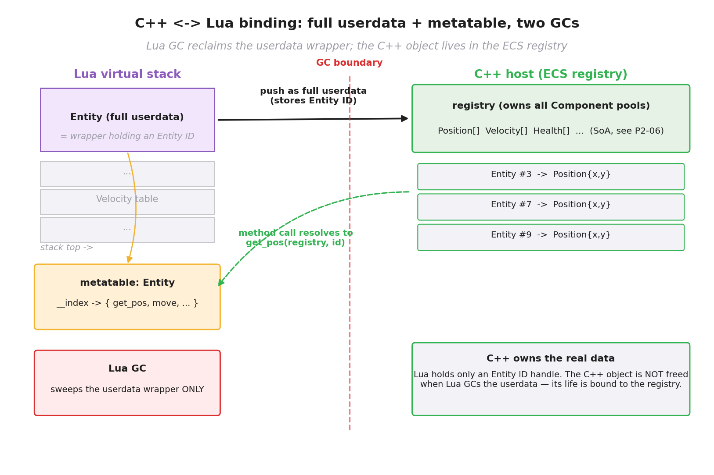
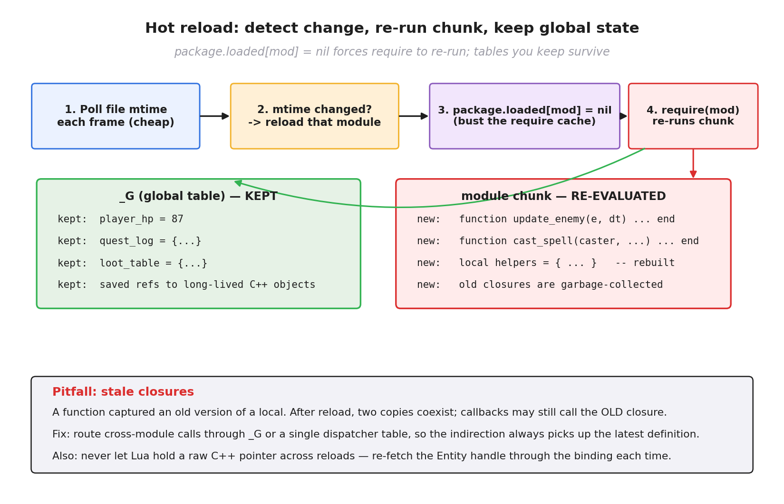

# 第 4 篇 · 第 14 章 · 脚本系统:Lua 热重载

> **核心问题**:第 2 篇我们把 ECS 三件套拆透了——Entity 是 ID、Component 是纯数据、System 是纯行为。一个 System 就是一个 C++ 函数,每帧被主循环调用,遍历它关心的组件。可这里立刻冒出来一个工程问题:**这些 System 的逻辑,全是用 C++ 写死在引擎里的**。策划想改一个数值——比如"火球术的伤害从 100 调成 120"——按 P2 的做法,他得打开引擎源码,改 `combat_system` 里那个常量,**重新编译整个 C++ 工程**(几分钟到十几分钟),再重启游戏。这在开发期是不能忍受的。本章要回答的就是:**游戏逻辑凭什么非得编译?能不能让策划改一个文本文件,保存,游戏里立刻就生效?**——答案是脚本系统,而游戏行业最经典的脚本方案,是**把一个 Lua 虚拟机(VM)嵌进引擎**,让游戏逻辑用 Lua 写,改 `.lua` 文件就能改逻辑,还能**热重载**(游戏跑着,改脚本,立刻生效,不用重启)。

> **读完本章你会明白**:
> 1. 为什么游戏逻辑要脚本化:C++ 编译慢、策划要秒级改数值和逻辑、不能每次都重编译引擎;脚本是解释执行,改 `.lua` 文件就改逻辑,运行时还能热重载。
> 2. 引擎怎么把 Lua VM 嵌进来:link Lua 库,创建 `lua_State`,引擎和脚本在**同一进程**,通过 Lua 的栈式 C API 互相调用;脚本里每帧调的 `update` 函数,就是引擎每帧 `lua_pcall` 进去的。
> 3. **C++ 对象怎么绑到 Lua**(本章核心):把引擎的 Entity / Component / Vec3 暴露给 Lua,让脚本能写 `entity.position.x = 5`——靠绑定库(sol2)或手写 C API;难点是 Lua 动态类型 + GC 和 C++ 静态类型 + 手动内存之间的**生命周期边界**。
> 4. 热重载怎么实现:引擎轮询 `.lua` 文件的修改时间(mtime),变了就清掉 `package.loaded` 缓存重新 `require` 那个 chunk,旧函数闭包被 GC,新函数立刻生效,而全局状态(`_G` 表)保持不动。
> 5. 脚本性能怎么看:Lua 解释执行比原生 C++ 慢一个量级,所以热点(物理、渲染)用 C++ System,业务逻辑(AI、技能、UI)用 Lua——这是脚本系统的**分工铁律**。

> **如果一读觉得太难**:先只记住三件事——① 脚本系统 = 把一个 Lua VM 当库 link 进引擎,引擎和脚本在同一进程里互相调;② 脚本能操作引擎对象,是因为引擎用绑定库(sol2)把 C++ 类(Entity / Vec3)暴露给了 Lua;③ 改 `.lua` 文件不用重启游戏,引擎检测文件变化重新加载,这叫热重载。脚本慢一个量级,所以热点用 C++、业务用 Lua。

> **★承接提示**:本章**强承《Lua 虚拟机深入浅出》**(深入浅出系列·语言运行时线)。那本书把 Lua VM 的字节码解释器、栈式 C API、`lua_State`、Table、metatable、GC 的原理全讲透了——**本章不再重讲 VM 本身**,只用一句话带过 + 指路 `[[lua-series-project]]`,篇幅全留给"**引擎怎么把 Lua 嵌进来、怎么把 C++ 对象绑过去、怎么热重载**"这些游戏引擎独有的事。如果你已经读过《Lua 虚拟机》,本章的 VM 细节你会一眼带过;如果没读过,只记住"Lua 是个能被 C 程序当库嵌入的小巧 VM,靠一个虚拟栈和宿主通信"就够了,细节去那本书里查。

---

## 〇、一句话点破

> **游戏引擎把一个 Lua 虚拟机当成普通 C 库 link 进自己(不另开进程),创建一个 `lua_State`,引擎每帧 `lua_pcall` 进脚本里的 `update` 函数;脚本反过来通过"绑定"操作引擎的 C++ 对象(Entity / Component / Vec3)。两边靠一个虚拟栈传值——栈怎么推怎么弹,这是《Lua 虚拟机》讲透的,本章不重讲。改 `.lua` 文件,引擎检测到 mtime 变了,清掉 `package.loaded` 缓存重新 `require`,新逻辑立刻生效——这叫热重载,是游戏行业**秒级迭代**的命脉。**

这是结论。本章倒过来拆:先讲"为什么游戏逻辑要脚本化"(编译慢这面墙),再讲"嵌入 Lua VM"长什么样(承《Lua 虚拟机》一句带过),然后讲本章真正的核心技巧——**C++ 对象怎么绑到 Lua**(生命周期边界这道难题),接着讲热重载怎么落地,最后讲脚本的性能分工。脚本本身(Lua 这门语言、VM 怎么跑字节码、栈怎么工作)是《Lua 虚拟机》那本书的题,本章一律一句带过 + 指路。

---

## 一、为什么游戏逻辑要脚本化:C++ 编译慢这面墙

### 策划要改一个数值,C++ 程序员要做的事

想象一个真实的开发场景。策划在调试一个 BOSS 战,他觉得"火球术的伤害 100 太低了,改成 120,我再打一次试试"。如果整个游戏逻辑是用 C++ 写在引擎里的(P2 那种 System),这个改动要走一遍:

1. 程序员打开引擎源码,找到 `combat_system.cpp` 里火球术的伤害常量。
2. 改 `100` 为 `120`,保存。
3. **重新编译整个 C++ 工程**——一个真实的游戏引擎,几十万到上百万行 C++,全量编译几分钟到十几分钟,增量编译也得几十秒。
4. 关掉正在跑的游戏(策划正在 BOSS 房里测呢),重启游戏,加载场景,策划再把 BOSS 打到出火球术那一段……才发现"120 还是低,再改 130"。

**回到第 1 步。** 这样改一次数值要十几分钟,策划一天能试几十次?改一次技能冷却时间也是这样,改一次 AI 行为也是这样。开发期的**迭代速度(iteration speed)**被这十几分钟的编译链彻底压死。

> **不这样会怎样**:如果游戏逻辑全用 C++ 写死,策划每改一个数值、一段 AI、一个技能效果,都要程序员陪着重编译重启。一天的调试时间大半耗在编译和加载上,策划拿不到试错的节奏,游戏的"手感"调不出来。**这在游戏行业是不可接受的**——游戏好不好玩,很大程度上是靠快速试错试出来的,而快速试错要求"改一下立刻能看见效果"。

### 脚本的答案:改一个文本文件,保存,立刻生效

脚本系统的答案简单粗暴:**把那些"经常要改"的逻辑——技能数值、AI 行为、UI 布局、任务流程——从 C++ 里挪出去,写成脚本(Lua)**。脚本是**解释执行**的:游戏跑着,它读一个 `.lua` 文本文件,逐行解释着跑,不需要编译。

策划要改火球术伤害:

1. 策划(或程序员)打开 `fireball.lua`,把 `damage = 100` 改成 `damage = 120`,保存。
2. 游戏里按一个快捷键(或者引擎自动检测到文件变了),**热重载**这个脚本。
3. 策划在游戏里再施放一次火球术,**立刻看到 120 的伤害**。

整个过程**几秒**,不重编译 C++,不重启游戏。这就是脚本系统给游戏开发带来的**根本性提速**:把"改一下"的成本从十几分钟压到几秒。游戏行业管这个叫**快速迭代(rapid iteration)**,它是脚本系统存在的第一性理由。

> **钉死这件事**:脚本系统的第一性动机 = **快速迭代**。C++ 编译慢(分钟级),策划要秒级改数值和逻辑,这个鸿沟用脚本来填——脚本是解释执行,改 `.lua` 文件就能改逻辑,还能热重载(游戏跑着就生效),不用重编译引擎。**脚本不是因为 C++ 不够强,而是因为 C++ 编译太慢、改动成本太高。**

### 为什么是 Lua:小巧、可嵌入、低门槛

脚本语言那么多(Python、JavaScript、Lua……),游戏行业为什么几十年如一日地偏爱 Lua?这不是偶然,几个第一性理由共同把它推到了这个位置:

- **小巧可嵌入**:Lua 的官方实现就一万多行 C,核心 VM 编译出来几百 KB,当一个普通 C 库 link 进引擎毫无压力。它**就是为"被嵌入宿主程序"设计的**——这是 Lua 的设计初心(巴西里约热内卢天主教大学,1993 年,本来是给嵌入式设备做配置脚本用的)。对比一下:Python 的 CPython 解释器几十兆,JavaScript V8 几十兆,Lua 几百 KB——嵌入开销差了两个量级,这对游戏引擎这种对体积敏感的客户端是决定性的。
- **栈式 C API 干净**:Lua 和宿主(C/C++)之间靠一个**虚拟栈**传值,API 简单(核心就 `lua_push*` / `lua_to*` / `lua_pcall` 这几十个函数)、稳定(5.1 到 5.4 跨版本几乎一致)、跨编译器(纯 C,任何能编译 C 的平台都能跑)。这部分是《Lua 虚拟机》那本书的重点,本章不展开。
- **极低的学习门槛**:Lua 只有 20 多个保留字,语法简单(没有 class、没有继承、没有泛型),策划和关卡设计师学一周就能写。这门语言的全部,可以用一页 A4 纸讲完——对比 C++ 的几十种特性、Python 的"不止一种做法",Lua 对非程序员友好。游戏行业有庞大的 Lua 程序员生态(下面会讲真实案例)。
- **足够快**:Lua 是解释型语言里最快的之一(《LuaJIT》那本会讲 LuaJIT 怎么再快一个量级,把 Lua 推到接近 C 的速度)。游戏脚本不需要 native 速度,但也不能慢到拖累帧率,Lua 在"够快 + 够小 + 够简单"这个三角上甜点。
- **协程(coroutine)原生支持**:Lua 从 5.0 起内置协程,这对游戏脚本写"分多帧执行的任务"(比如 AI 思考、剧情演出)特别方便——脚本可以 `coroutine.yield()` 暂停,下一帧接着跑。这部分也是《Lua 虚拟机》那本的题。

> **承《Lua 虚拟机》**:Lua 这门语言长什么样、Table 怎么用、metatable 怎么做面向对象、VM 怎么解释字节码——这些是《Lua 虚拟机深入浅出》那本书的全书内容,见 `[[lua-series-project]]`。本章从现在起,假设你知道"Lua 是一门小巧的、能被 C 程序当库嵌入的脚本语言",VM 细节一律不重讲。

### 真实案例:魔兽世界全 UI、Roblox 全游戏

不是空谈。两个世界上用户量最大的游戏,核心逻辑就是 Lua 写的:

- **魔兽世界(World of Warcraft)**:整个 UI 框架 + 全部玩家插件(addon)系统都是 Lua 写的。暴雪把引擎核心(渲染、物理、网络)用 C++ 写,把 UI 层完全暴露给 Lua——按钮怎么响应、伤害数字怎么飘、技能冷却图标怎么画,全都是 Lua 脚本驱动的。WoW 用的是 Lua 5.1(锁定在一个老版本上,长期不升级,因为生态都建立在上面),配了一套暴雪自己定的 WoW API 沙盒(把引擎的 C++ 对象按 WoW 的需求重新包了一层暴露给 Lua)。来源:[Warcraft Wiki · Introduction to Lua](https://warcraft.wiki.gg/wiki/Introduction_to_Lua)。
- **Roblox**:整个平台的游戏都是用 **Luau** 写的(这是 Roblox 自己 fork Lua 5.1 之后做的方言,加了渐进式类型系统、JIT 编译器、沙盒安全限制)。Roblox 把 Luau VM 嵌进客户端引擎,几百万个用户创作的游戏——从跑酷到射击到模拟经营——逻辑全是 Luau 脚本。Luau 是 Lua 这门语言在游戏行业的最大规模落地,可以看成《Lua 虚拟机》《LuaJIT》那两条线的延伸。来源:[Roblox 开源 Luau](https://luau.org/)。

这两个案例说明:Lua 不是一个边缘选择,它是游戏行业**事实上的标准脚本语言**(尤其是 MMO、大型客户端、游戏平台)。

---

## 二、嵌入 Lua VM:引擎和脚本在同一进程

### 不是另开一个进程,是把 Lua 当库 link 进引擎

新手最容易误解的一点:以为"引擎跑一个进程,Lua 跑另一个进程,中间用 IPC(管道/socket)通信"。**不是**。Lua 是被设计成**一个 C 库**,引擎把它 link 进自己的可执行文件里,创建一个 Lua 虚拟机实例(`lua_State`),这个 VM 就活在**引擎的同一个进程**里、同一段地址空间里。引擎调用 Lua,是一个普通的 C 函数调用;Lua 调用引擎暴露的函数,也是一个普通的 C 函数调用。**没有 IPC,没有序列化,没有跨进程开销。**


看这张图,把架构钉死:

- **左边是宿主 C++ 引擎**:它有自己的三层——C++ Systems(移动、战斗、渲染,这是 P2 那批 System)、ECS Registry(Entity / Component 池,这是 P2-05 / P2-06 讲的)、Binding layer(绑定层,把 C++ 对象暴露给 Lua,这是下一节的核心)。
- **右边是被嵌入的 Lua VM**:`lua_State`(Lua 的执行状态,含调用栈)、`.lua` 脚本(游戏逻辑的源代码文本)。
- **中间是 C API 边界**:Lua 的 C API(`lapi.c`)规定了一套**栈式协议**——引擎要调 Lua,先把函数和参数 push 到一个虚拟栈上,然后 `lua_pcall`;Lua 要调回引擎,调用的就是引擎事先注册进去的那些 C 函数。

> **钉死这件事**:Lua 是被**当库 link 进引擎**,VM 活在引擎的**同一进程、同一地址空间**。两边靠**栈式 C API**互相调用,没有 IPC、没有序列化。一个 Lua 函数调用,本质是引擎里的一次 C 函数调用;一个引擎 API 从 Lua 里被调用,本质也是一次 C 函数调用。这就是为什么 Lua 嵌入"几乎零开销"——它根本没跨任何边界。

### 三步嵌入:创建 VM、注册 API、调脚本

把 Lua 嵌进引擎,最朴素的三步(用 Lua 官方 C API 写):

```c
#include <lua.h>
#include <lualib.h>
#include <lauxlib.h>

// ---- 第 1 步:创建一个 Lua VM 实例(lua_State)
lua_State *L = luaL_newstate();      // 新建一个独立的 Lua 虚拟机
luaL_openlibs(L);                    // 打开标准库(print, math, string, ...)

// ---- 第 2 步:把引擎的 C++ 函数注册进 Lua,让脚本能调
lua_register(L, "engine_spawn_entity", l_spawn_entity);   // 脚本里写 engine_spawn_entity(...) 就能调到 C++ 的 l_spawn_entity
lua_register(L, "engine_move_entity",  l_move_entity);
// ... 还有几百个引擎 API,见下一节"绑定"

// ---- 第 3 步:加载并执行一个 .lua 脚本
if (luaL_dofile(L, "scripts/combat.lua") != LUA_OK) {
    const char *err = lua_tostring(L, -1);   // 出错信息在栈顶
    fprintf(stderr, "Lua error: %s\n", err);
}
```

这三步做完,`combat.lua` 这个脚本就被加载进 VM 了。脚本里定义的全局变量、函数,现在都在这个 `lua_State` 里活着。

> **承《Lua 虚拟机》**:`luaL_newstate` 内部怎么分配内存、怎么初始化主线程的 `lua_State`、`lua_State` 和 `global_State` 是什么关系(`global_State` 是整个 VM 共享的,含 GC 和字符串池;`lua_State` 是每个执行线程的,含调用栈)——这些是《Lua 虚拟机》那本第三章和第七章的内容,见 `[[lua-series-project]]`。本章只把它们当黑盒用:**`luaL_newstate` 给我一个 VM,我用它的 C API 跟它交互**。

### 每帧调用脚本里的 update:主循环和脚本的接缝

把脚本加载进 VM 还不够。游戏引擎是一个**每帧跑的大循环**(P0-01 / P1-02 讲的死循环),脚本逻辑也得**每帧被调一次**。怎么做?约定一个**全局函数**——比如脚本里定义一个 `function update(dt) ... end`,引擎每帧 `lua_pcall` 进去:

```c
// 引擎主循环(简化示意, 非源码原文)
while (running) {
    float dt = clock.last_frame_time();

    // ---- 这一段是 C++ 的 System,跑在引擎里(P2 那批)
    movement_system(registry, dt);
    physics_system(registry, dt);

    // ---- 这一段是脚本:把 dt 推到栈上,调 Lua 里的 update
    lua_getglobal(L, "update");        // 把全局变量 update 压栈(它是个 Lua 函数)
    lua_pushnumber(L, dt);              // 压入参数 dt
    if (lua_pcall(L, 1, 0, 0) != LUA_OK) {   // 调用, 1 个参数, 0 个返回值, 0 是无错误处理函数
        const char *err = lua_tostring(L, -1);
        log_error("Lua update failed: %s", err);
        lua_pop(L, 1);                  // 错误信息弹出栈, 保持栈平衡
    }

    render_system(registry);
}
```

注意三件事:

1. **`lua_getglobal` / `lua_pushnumber` / `lua_pcall`**——这三个调用全是在**操作那个虚拟栈**。`lua_getglobal` 把脚本里的 `update` 函数压栈,`lua_pushnumber` 把参数 `dt` 压栈,`lua_pcall` 把栈上的函数和参数弹掉、调函数、把返回值压栈。栈怎么推怎么弹、为什么这样设计,是《Lua 虚拟机》的核心题,本章不展开。
2. **`lua_pcall` 的 `p`**——`pcall` 是 **protected call(受保护的调用)**。Lua 脚本可能抛错(脚本 bug、nil 引用、除以零……),如果用普通的 `lua_call`,错误会沿着 C 调用栈一路抛上来把引擎崩掉。`lua_pcall` 把错误"兜住",出错时返回非 `LUA_OK`,错误信息作为字符串压在栈顶——**引擎不会被脚本错误搞崩**。这是嵌入式 Lua 的命脉:**脚本 bug 不能带崩宿主**。
3. **栈平衡**:Lua C API 的铁律是"调用前后栈要平衡",你 push 了几个东西、用完得 pop 回来。栈不平衡是 Lua C API 编程最常见的 bug,引出《Lua 虚拟机》那本反复强调的"栈顶管理"。

> **钉死这件事**:引擎和脚本的接缝 = 主循环每帧 `lua_pcall` 进脚本里的 `update(dt)` 函数。`pcall`(protected call)兜住脚本错误,**保证脚本 bug 不带崩引擎**。这种"C++ 主循环驱动 + 每帧回调 Lua"的模式,是嵌入式游戏脚本的标准结构。

### 两边怎么通信:虚拟栈(承《Lua 虚拟机》,一句带过)

引擎要传一个数(比如 `dt = 0.016`)给 Lua,不能直接 `lua_update(0.016)`——Lua 是动态类型,C 是静态类型,两边的函数签名对不上。Lua 的设计答案:**所有跨边界传值,都走一个虚拟栈**。C 这边 `lua_pushnumber(L, 0.016)` 把数压栈,Lua 那边函数的参数就从栈上取;反过来 Lua 函数返回值也压栈,C 这边 `lua_tonumber(L, -1)` 取走。

这套栈式协议是 Lua 设计的神来之笔(也是《Lua 虚拟机》那本的重点):

- **简单**:一套 API 操作一个栈,没有复杂的 ABI、没有 marshal/unmarshal 大段代码。
- **类型无关**:栈上能放任何 Lua 值(number、string、table、function、userdata……),C 这边按需取。
- **版本兼容**:Lua 5.1 / 5.2 / 5.3 / 5.4 的 C API 几乎一致,跨版本升级宿主代码改动很小。

> **承《Lua 虚拟机》**:虚拟栈怎么工作、`lua_push*` / `lua_to*` / `lua_pop` 的语义、栈索引(正数从底往上、负数从顶往下)、《Lua 虚拟机》那本第 17 章"C API and Stack Protocol"全拆了,见 `[[lua-series-project]]`。本章此后一律假设你看懂这套栈协议,不再解释 `lua_pushnumber` 是干嘛的。

---

## 三、C++ 对象怎么绑到 Lua:本章的核心技巧

到这里,引擎能创建 VM、能调脚本里的 `update` 函数了。可脚本里一片空白——它什么引擎对象都看不见,既不能 `entity.position.x = 5`,也不能 `entity:get_health()`。脚本要能驱动游戏,引擎必须把自己的对象(Entity / Component / Vec3 / 各种 System API)暴露给 Lua,这叫**绑定(binding)**。**这是本章的核心技巧**,也是最容易翻车的一段——因为 Lua 和 C++ 在两个根本维度上互相冲突,我们逐一拆。

### 冲突一:动态类型 vs 静态类型

Lua 是**动态类型**——一个变量可以是 number、可以是 string、可以是 table,运行时才确定;同一个变量上一秒是 5,下一秒可以变成 `"hello"`。C++ 是**静态类型**——`float x` 这个变量一辈子都是 float,编译时就钉死。

这个冲突,意味着你**不能**直接把一个 C++ `Vec3` 对象塞给 Lua 当 `Vec3` 用——Lua 根本不知道 `Vec3` 是什么类型(Lua 的类型系统里只有 nil / boolean / number / string / table / function / userdata / thread 八种)。Lua 把所有"来自 C 的、Lua 不认识的对象"统一表达成一种类型,叫 **userdata**(用户数据)。

- **userdata** 就是 Lua 给宿主开的口子:**一块由宿主 C 代码管理的原始内存,Lua 把它当成一个不透明的"对象句柄"**。Lua 不能直接读写 userdata 里的内容(Lua 不知道里面是什么结构),所有读写都得通过宿主事先注册的 C 函数。
- **full userdata vs light userdata**:Lua 有两种 userdata。**full userdata** 是 Lua 分配的一块内存,Lua GC 会回收它(对应绑定的"Lua 拥有"模式);**light userdata** 就是个裸指针(`void*`),Lua 不管它的生命周期(对应"宿主拥有"模式)。游戏引擎里绑定 Entity 句柄,通常用 light userdata 或者 full userdata 包一个 ID——因为 C++ 那边的对象归 ECS registry 管,不该让 Lua GC 来管。

> **钉死这件事**:Lua 把所有"宿主 C 对象"统一表达成 **userdata**——一块 Lua 不透明的内存。Lua 不能直接读写它,所有操作都得通过宿主注册的 C 函数(下面讲 metatable)。**这是动态类型的 Lua 和静态类型的 C++ 互相沟通的唯一桥梁。**

### 冲突二:Lua GC vs C++ 手动内存

Lua 是**带 GC 的**——Lua 创建的 table、字符串、userdata,Lua 的垃圾回收器会自动回收。C++ 这边(游戏引擎)**通常没有 GC**——对象的生命周期靠 RAII、智能指针、或者像 ECS registry 那样的中央管理器手动管(P2-05 讲过 Entity 的生成和销毁)。

这两套内存管理在 userdata 这里碰头,引出一个**所有权边界**的灵魂问题:**这块 userdata,生命归谁管?**

举个具体的危险场景。脚本里有个变量持有引擎传过来的 Entity:

```lua
-- Lua 脚本
local target = combat_system:get_target()   -- 返回一个 Entity userdata
-- ... 过了一会儿,目标死了,引擎那边 destroy 了这个 entity
-- target 这个变量还指向那个 userdata,它现在是个"悬空引用"
function attack_target()
    target:set_health(0)   -- 灾难:访问一个已经销毁的 entity!
end
```

如果绑定做错了(Lua 的 userdata 直接持有一个 C++ 的 `Entity&` 或者 `Entity*`,C++ 那边销毁后,Lua 这边还在用),就会访问已释放内存——典型的 use-after-free,游戏直接崩,而且极难调试。

> **不这样会怎样**:如果绑定时让 Lua 直接持有 C++ 对象的指针,C++ 那边一销毁对象,Lua 这边的 userdata 就成了悬空指针。下次脚本访问它就 use-after-free,游戏崩。这是 Lua 嵌入游戏引擎**最经典的崩溃源**,几乎每个引擎团队都踩过。

### 解法一:绑 Entity 句柄(用 ID,不直接持对象)

EnTT 的 Entity 是个**纯 ID**(P2-05 讲透的,低 20 位 slot + 高 12 位 version),这给了我们一个特别干净的解法:**Lua 不直接持有 C++ 对象,而是持有 Entity 的 ID 值**。

```cpp
// 简化示意(非源码原文,突出思路)
// 把一个 Entity 推到 Lua 栈,作为一个 light userdata(包一个 ID)
void push_entity(lua_State *L, entt::entity e) {
    // 把 entity ID 塞进 light userdata(就是个指针, 这里把它当 ID 容器)
    lua_pushlightuserdata(L, reinterpret_cast<void*>(static_cast<uintptr_t>(e)));
}
```

但这样还不够——Lua 拿到这个 light userdata 后,什么操作都不会(它不知道这是个 Entity)。Lua 怎么知道"这个 userdata 可以调 `get_pos`、`set_health` 这些方法"?靠 **metatable(元表)**。

> **承《Lua 虚拟机》**:metatable 是 Lua 实现面向对象、运算符重载、自定义访问行为的机制,核心是一组**元方法(metamethod)**——`__index`(查不到字段时怎么找)、`__newindex`(给不存在的字段赋值时怎么办)、`__add`(用 `+` 运算时怎么办)等。metatable 怎么工作、`__index` 怎么链式查找,是《Lua 虚拟机》那本 Table 和 metatable 章节的重点,见 `[[lua-series-project]]`。本章只把它当工具用:**给一个 userdata 设上 metatable,Lua 就知道怎么对这个 userdata 做操作**。

具体地,引擎在初始化时,给"Entity 这种 userdata"注册一个 metatable,metatable 里的 `__index` 字段指向一张表,这张表里全是 Entity 能用的方法:

```cpp
// 简化示意(非源码原文)
// 引擎启动时,创建一个 Entity 的 metatable
void register_entity_metatable(lua_State *L) {
    luaL_newmetatable(L, "EntityMeta");        // 新建一个 metatable, 注册名为 "EntityMeta"

    // metatable 的 __index 字段, 指向一张方法表
    lua_newtable(L);                            // 方法表
    lua_pushcfunction(L, l_entity_get_pos);     // C 函数: 取 Position
    lua_setfield(L, -2, "get_pos");             // 方法表里加 "get_pos" -> l_entity_get_pos
    lua_pushcfunction(L, l_entity_set_health);
    lua_setfield(L, -2, "set_health");
    // ... 一堆 entity 方法

    lua_setfield(L, -2, "__index");             // 把方法表设为 metatable 的 __index
    lua_pop(L, 1);                              // 弹出 metatable, 留在 registry 里
}

// 当脚本写 entity:get_pos() 时, Lua 查不到 get_pos, 触发 __index,
// __index 指向那张方法表, 找到 get_pos -> l_entity_get_pos, 调用它
static int l_entity_get_pos(lua_State *L) {
    // 从栈上取出 self(那个 userdata), 拆出 entity ID
    entt::entity e = (entt::entity)(uintptr_t)lua_touserdata(L, 1);
    // 去 ECS registry 查 Position 组件
    auto &pos = g_registry.get<Position>(e);
    // 把 Position 作为 Lua 值返回(假设已经绑了 Vec3)
    lua_pushnumber(L, pos.x);
    lua_pushnumber(L, pos.y);
    return 2;   // 返回 2 个值
}
```

这一整套机制,叫**手写 C API 绑定**。它的好处是零依赖、完全可控;坏处是**极其繁琐**——绑一个 Entity 几十个方法,绑 Vec3、绑 Component、绑 System API,几百上千个方法,每个都得手写一个 C 包装函数 + 注册到 metatable。维护噩梦。所以游戏行业几乎没人手写,而是用**绑定库**。

### 解法二:绑定库(sol2)——把繁琐自动化

绑定库就是帮你把"写 C 函数包装 + 注册 metatable"这件事自动化。游戏行业最主流的 C++/Lua 绑定库是 **sol2**(ThePhD/sol2),它用 C++ 模板元编程,让你写一行绑定顶手写几十行。下面把同一个"绑 Entity"用 sol2 重写一遍,你就看出差距了:

```cpp
#include <sol/sol.hpp>

// 引擎启动时绑定
sol::state lua;
lua.open_libraries(sol::lib::base, sol::lib::math);

// sol2 的 new_usertype: 一个调用就把一个 C++ 类型暴露给 Lua
auto entity_type = lua.new_usertype<entt::entity>("Entity");

// 给 Entity 加方法
entity_type.set_function("get_pos", [](entt::entity self) {
    auto &pos = g_registry.get<Position>(self);
    return std::make_tuple(pos.x, pos.y);     // sol2 自动转成 Lua 多返回值
});
entity_type.set_function("set_health", [](entt::entity self, float hp) {
    auto &h = g_registry.get<Health>(self);
    h.hp = hp;
});

// 甚至可以绑成员变量(属性)
auto vec3_type = lua.new_usertype<Vec3>("Vec3",
    "x", &Vec3::x,        // 脚本里写 v.x 直接读写 C++ 成员
    "y", &Vec3::y,
    "z", &Vec3::z,
    "length", [](const Vec3 &v) { return std::sqrt(v.x*v.x + v.y*v.y + v.z*v.z); }
);
```

读这段代码注意几件事:

1. **`lua.new_usertype<T>("name", ...)`** 是 sol2 的核心 API——它把一个 C++ 类型 `T` 注册成一个 Lua 里的"用户类型",自动创建对应的 metatable 并设好 `__index`。**底层它干的就是我们手写那一大坨**,但用模板元编程替你生成了所有 C 包装函数。来源:[sol2 文档 Binding Classes and Structs](https://zread.ai/ThePhD/sol2/21-binding-classes-and-structs)。
2. **lambda 当方法**:`entity_type.set_function("get_pos", [](entt::entity self) {...})`,你给一个 lambda,sol2 自动把它包成 `lua_CFunction`、自动处理参数从栈上取、返回值压栈。**栈操作你完全不用管**——sol2 替你管理栈。模板在编译期推断 lambda 的参数类型和返回类型,自动生成对应的栈读写代码。
3. **直接绑成员变量**:`"x", &Vec3::x`,脚本里写 `v.x = 5`,sol2 自动生成 getter/setter,直接读写 C++ 对象的成员。这是 sol2 的"零开销"承诺——绑定代码读起来像声明,但生成的代码高效(没有运行时反射,全在编译期生成)。来源:[sol2 文档 Member Variables and Properties](https://zread.ai/ThePhD/sol2/22-member-variables-and-properties)。
4. **继承也能处理**:sol2 支持声明基类(`usertype::set_base`),子类的 usertype 自动能调父类的方法(底层是 metatable 的 `__index` 链式查找),甚至能自动 upcast。这条对游戏引擎尤其重要——引擎里大量用继承(虽然 ECS 之后少了很多,但很多老代码还在用)。

写完这段绑定,脚本里就能直接这样写:

```lua
-- Lua 脚本里,像用本地类型一样用 C++ 的 Entity / Vec3
local e = engine.spawn_entity()       -- 调绑定的 C++ 函数, 返回一个 Entity userdata
local pos = e:get_pos()                -- 调绑定的方法, 实际跑到 C++ 的 lambda
print(pos.x, pos.y)                    -- 跨边界读, sol2 自动转
e:set_health(100)                      -- 跨边界写

local v = Vec3.new(1, 2, 3)            -- 用绑定的构造
local len = v:length()                 -- 调绑定的方法
```

读起来和写本地 Lua 对象几乎没区别——这就是好绑定库的威力:**把跨语言边界的存在感降到最低**,脚本程序员几乎感觉不到自己在操作 C++ 对象。

> **钉死这件事**:绑定库(sol2)的核心价值 = **把"手写 C 函数包装 + 注册 metatable"这件繁琐机械的事自动化**。底层跑的还是那套"userdata + metatable + `__index`"机制,但用 C++ 模板替你生成所有样板代码。你写一行 `new_usertype`,sol2 替你生成几十行 C 包装。绑定的本质(动态类型的 Lua 通过 userdata + metatable 操作静态类型的 C++ 对象)没变,变的是工程量。

### 生命周期管理:用 ID 而非裸指针

回到前面那个"use-after-free"的灾难。看 sol2 那段代码,Lua 持有的 `entt::entity` 实际上是个**纯 ID**(32 位整数),**不是 C++ 对象的指针**。这就漂亮地躲开了 use-after-free:

- Lua 这边持有的 userdata,里面装的是 `entity = 7`(假设),不是 `&registry.get<Position>(7)` 这种引用。
- 引擎那边 destroy 了 7 号实体,registry 把 7 号槽位的 version +1(P2-05 讲的 version 机制)。
- 脚本里下次调 `target:set_health(0)`,绑定的 C 函数拿 `target` 这个 ID(7)去 registry 查,registry 一看"槽位 7 的当前 version 和你这个 ID 自带的 version 不等",**`registry.valid(target)` 返回 false**——绑定的 C 函数检测到悬空引用,**优雅地报错而不是崩**。

```cpp
// 在 sol2 绑定的 lambda 里, 先检查 entity 是否还活着
entity_type.set_function("set_health", [](entt::entity self, float hp) {
    if (!g_registry.valid(self)) {
        // 抛一个 Lua 错误, 被 pcall 兜住, 不带崩引擎
        throw std::runtime_error("entity is dead");
    }
    g_registry.get<Health>(self).hp = hp;
});
```

这就是**承接 P2-05** 的地方:P2-05 讲的 Entity version 机制("槽位 + 版本号"区分已销毁的旧实体和复用同槽位的新实体),在这里漂亮地救了脚本绑定一命——**Lua 持有的是 ID 而非指针,引擎那边销毁了,这边检测 version 就知道**。如果你绑定时图省事直接传 C++ 对象的指针/引用,version 机制就用不上,use-after-free 就来了。



这张图把绑定的全貌画清了:**Lua 这边持有的只是一个 wrapper(里面是个 Entity ID),真正数据躺在 C++ 那边的 registry 里;Lua GC 只回收 wrapper,从不碰 C++ 对象;绑定的方法调用,每次都用 ID 去 registry 查——查得到就操作,查不到(Entity 已销毁)就优雅报错**。这就是生命周期边界的标准解法。

> **钉死这件事**:Lua 嵌入游戏引擎的**生命周期铁律**——**Lua 持有的是对象的"句柄"(ID),不是对象本身**。Lua GC 只回收 Lua 那边的 wrapper,从不动 C++ 那边的真对象;C++ 那边销毁对象,通过句柄的 version 机制让 Lua 这边能检测出来。**绝不让 Lua 直接持有 C++ 对象的指针**(否则 use-after-free 等着你)。这条铁律贯穿所有"GC 语言绑 C++ 对象"的场景(不止 Lua,C#/Python/JS 绑 C++ 都一样),承《JVM》(下一章 P4-15 讲 C# 绑 C++ 时会再撞到)。

---

## 四、热重载:改 `.lua`,游戏里立刻生效

到此,脚本能驱动引擎对象了。但脚本系统真正杀死 C++ 的杀手锏——**热重载**——我们还没讲。热重载的意思是:**游戏正在跑着,你改一个 `.lua` 文件保存,引擎立刻把新逻辑加载进来,游戏里马上生效,不用重启**。这是策划/程序员调试游戏时的神器,改一行代码看一眼效果,迭代速度压 C++ 几个量级。

### 热重载的难点:新逻辑要生效,旧状态要保住

新手以为热重载就是"重新 `dofile` 一遍脚本",这就够了。**不够**。考虑一个真实的场景:

游戏里玩家正在打 BOSS,BOSS 的血量、阶段、召唤的小怪数——这些都是 Lua 脚本里的状态(`boss_hp = 3500`、`phase = 2`、`minions_killed = 7`)。现在策划要改 BOSS 的一个技能逻辑,他改了 `boss_ai.lua` 里的 `function update_boss(boss, dt)`,保存。引擎检测到文件变化,重新加载这个脚本——**如果只是无脑重新加载,所有这些运行时状态(3500 血量、2 阶段、7 个小怪)全都会被重置回脚本里的初始值**。策划刚打到一半,BOSS 突然满血重置,他白打了。

所以热重载的难点不是"重新加载文件",而是:**新逻辑(函数定义)要生效,旧状态(运行时变量)要保住**。这两件事怎么同时做到?

### Lua 的 require 机制:缓存这把双刃剑

要懂热重载怎么实现,先得懂 Lua 的 `require` 机制。Lua 的标准库有个全局函数 `require("modname")`,用来加载模块——你写 `require("boss_ai")`,Lua 会去执行 `boss_ai.lua` 这个 chunk(把文件整个跑一遍,定义其中的函数和变量),返回这个模块的"导出值",**并且把这个结果缓存在 `package.loaded` 表里**。

```lua
-- 第一次 require
local boss_ai = require("boss_ai")    -- 执行 boss_ai.lua, 返回它的 exports, 缓存进 package.loaded["boss_ai"]
-- 第二次 require
local boss_ai2 = require("boss_ai")   -- 不再执行, 直接返回缓存里的那份
```

这个缓存机制(`package.loaded`)的存在意义是**幂等性**——不管你 require 同一个模块多少次,模块的代码只执行一次,所有 require 都拿到同一个 exports 表。这是模块化的基础。

但热重载要的恰恰相反:**我要让已经 require 过的模块,重新执行一遍**。Lua 的 `require` 不给你这个口子(它就是设计成幂等的)。怎么办?**清掉缓存**。

```lua
package.loaded["boss_ai"] = nil   -- 把缓存清掉, 强制下次 require 重新执行
local boss_ai = require("boss_ai") -- 因为缓存空了, 这次会重新执行 boss_ai.lua
```

这就是热重载的核心 trick:**`package.loaded[modname] = nil` 清缓存,下次 `require` 重新执行 chunk**。Lua 5.x 的 `require` 实现是 `ll_require`(`loadlib.c`),它第一步就是查 `package.loaded[modname]`,有就直接返回,没有才走 loader 路径去读文件——清掉这个表项就强制走 loader 路径。来源:Lua 源码 [`loadlib.c`](https://github.com/lua/lua/blob/master/loadlib.c) 的 `ll_require`,以及 zread 对 lua/lua 仓库的 [Dynamic Module Loading](https://zread.ai/lua/lua/21-dynamic-module-loading) 总结。

### 状态怎么保住:全局表 vs 模块局部

清掉缓存重新执行 chunk,新逻辑生效了。可运行时状态(BOSS 的血量、阶段、小怪数)怎么保住?这要看状态**存在哪里**。Lua 的状态有两种存在方式:

- **模块局部变量(`local`)**:写在模块 chunk 顶层的 `local`,只在这个模块内可见,模块重新执行时**会被重建**——`local boss_hp = 100` 这种,重新执行就回到 100。
- **全局表 `_G`**:不写 `local` 的变量(或者显式写 `_G.xxx = ...`),存在 Lua VM 的全局表里,**模块重新执行不会清掉它**——除非你显式 `_G.boss_hp = nil`。

所以热重载保状态的解法是:**把要保留的状态放进全局表(或一个专用的持久表),不要放在模块局部变量里**。模块里只放函数定义(重新执行时重新定义,正好是新逻辑),把状态隔离到全局/持久区。这是一个**代码组织纪律**:

```lua
-- boss_ai.lua
-- ---- 持久状态区: 放全局, 重载不丢 ----
_G.boss_state = _G.boss_state or { hp = 100, phase = 1 }   -- 第一次初始化, 以后保留

-- ---- 逻辑区: 函数, 重载时重新定义, 正好是新逻辑 ----
local function update_boss(dt)
    if _G.boss_state.hp <= 0 then
        -- 死亡处理
    end
    -- 这是策划刚改的逻辑, 重载后立刻生效
end

-- 导出
return { update = update_boss }
```

这样组织代码,热重载就漂亮了:重新执行 `boss_ai.lua` 时,`_G.boss_state` 因为是全局,**保留**(BOSS 的 3500 血量还在);`update_boss` 这个函数重新定义,正好是策划刚改的新版本;旧的 `update_boss` 函数闭包没人引用了,Lua GC 把它回收掉。



> **钉死这件事**:热重载的解法 = **`package.loaded[mod] = nil` 清缓存 + 重新 `require`**。状态要保住,靠**代码组织纪律**——把要保留的状态放进全局表或专门的持久表,模块里只放函数定义。新函数立刻生效,旧函数闭包被 Lua GC 回收,**运行时状态不动**。这是热重载的完整配方。

### 文件变化怎么检测:轮询 mtime

引擎怎么知道策划保存了文件?最朴素的办法是**轮询 mtime**:引擎每帧(或者每隔几百毫秒)检查一遍所有已知 `.lua` 文件的修改时间(`stat` 系统调用拿到的 mtime),如果某个文件的 mtime 比上次记录的新,就触发那个模块的热重载。

```cpp
// 简化示意(非源码原文)
// 引擎里维护一张表: 模块名 -> {文件路径, 上次 mtime}
std::unordered_map<std::string, FileWatch> watched_modules;

void check_hotreload(lua_State *L) {
    for (auto &[modname, watch] : watched_modules) {
        auto mtime = get_file_mtime(watch.path);
        if (mtime > watch.last_mtime) {
            watch.last_mtime = mtime;
            // 在 Lua 里执行: package.loaded[modname] = nil; require(modname);
            lua_getglobal(L, "require");
            lua_pushstring(L, modname.c_str());
            // 先清缓存
            lua_getglobal(L, "package");
            lua_getfield(L, -1, "loaded");
            lua_pushnil(L);
            lua_setfield(L, -2, modname.c_str());  // package.loaded[modname] = nil
            lua_pop(L, 2);
            // 再 require
            lua_pcall(L, 1, 1, 0);
            log_info("hot-reloaded module: %s", modname.c_str());
        }
    }
}
```

轮询 mtime 在文件数不大的情况下(几百个脚本)几乎零开销(一次 `stat` 调用),游戏行业普遍这么做。要做更精细的(跨平台、即时响应),可以用操作系统的文件监听 API(Linux inotify、macOS FSEvents、Windows ReadDirectoryChangesW),但复杂度上升,大多数游戏团队就老老实实轮询。

### 陈旧闭包陷阱(热重载的经典坑)

热重载最经典的坑,是**陈旧闭包(stale closure)**。看这个场景:

```lua
-- ai.lua
local function attack(target)
    -- ... 老版本的攻击逻辑
end

local function decide(boss)
    -- decide 函数里直接调用了 local 的 attack
    attack(boss.target)
end

return { decide = decide }
```

现在另一个模块 `boss.lua` 之前已经 `require("ai")` 过了,它手里攥着 `ai.decide` 这个函数的引用。你改了 `ai.lua` 里的 `attack` 函数,热重载 `ai.lua`,**新的 `attack` 函数定义了,但旧的 `decide` 函数还活着**(它被 `boss.lua` 持有,没被 GC),旧的 `decide` 里捕获的 `attack` 还是旧版本——**热重载看起来没生效**。

这是热重载最隐蔽的坑:有些"老引用"还在调旧函数,有些"新引用"调新函数,两份并存,行为诡异。

解法有几条:

1. **跨模块调用走全局表,不存函数引用**:在模块内部用 `local`,但跨模块调用通过 `_G.ai.attack(...)` 或者一个 dispatcher 表,**每次都重新查表**,这样总能拿到最新版本。
2. **全栈重载**:不只重载改动的那个模块,把依赖它的模块也级联重载一遍。简单粗暴但有效。
3. **设计纪律**:模块之间的耦合尽量通过共享数据(全局表),而不是直接持有对方的函数引用。

> **不这样会怎样**:如果不处理陈旧闭包,热重载会"看起来生效了但偶尔还在跑旧逻辑",bug 极难复现(因为哪份闭包被引用,取决于运行时的对象图)。这是热重载的工程难点,成熟的脚本框架(像 WoW 的插件框架、Roblox 的 Luau 工具链)都有自己的一套约定来规避。

---

## 五、脚本性能:慢一个量级,所以热点用 C++

到此,Lua 脚本能驱动引擎对象、能热重载,看起来无所不能。那为什么不把整个引擎都用 Lua 写?**因为 Lua 慢**。这是个根本性的 trade-off,我们必须讲清。

### Lua 解释执行 vs C++ 原生:慢一个量级

Lua 是**解释执行**的——每条 Lua 语句,VM 都要"读一条字节码、解释这条字节码是什么意思、分派到对应的执行函数、执行"。这个"读-解释-分派"的循环(叫 interpreter loop,《Lua 虚拟机》那本的核心题),本身就要花几十条机器指令。而 C++ 是**编译执行**——一条 C++ 语句直接编译成几条机器码,CPU 直接跑,没有解释开销。

具体数字:典型的 Lua 代码,比等价的 C++ 代码慢**一个量级(10 倍到 50 倍)**。LuaJIT(JIT 编译 Lua,把热点代码编译成机器码)能把这个差距压到 2-3 倍以内,但 vanilla Lua(绝大多数游戏用的)就是慢一个量级。

为什么慢这么多?拆一下 Lua 解释器跑一次加法 `a + b` 都干了什么:① 取下一条字节码 `OP_ADD`;② 分派到加法的处理函数;③ 检查 `a` 和 `b` 的类型(都是 number 吗?有 metatable 的 `__add` 吗?);④ 真正做加法;⑤ 把结果包装成 Lua 的 `TValue`(`number` 子类型 + 浮点值)写回栈。这一套下来,一条 Lua 加法要花几十条机器指令。而 C++ 的 `a + b`(float)编译后就是一条 `addss` 指令,一条机器指令搞定。差了一个数量级。

举一个更直观的例子。计算一万次向量加法:

- C++ 版本:开启优化后,SIMD 指令一次处理 4-8 个 float,一万次大约几万条指令,几百微秒。
- Lua 版本:每次加法都是"读字节码、分派、查 table、调元方法、push 栈、pop 栈",一万次加法几百万条指令,几毫秒。

差了一个量级以上。**这就是为什么不能把整个引擎都用 Lua 写**——物理、渲染、动画这些每帧要处理海量对象的子系统,Lua 的速度根本顶不住 16ms 的帧预算。

> **承《Lua 虚拟机》**:Lua 解释器的核心是个 switch 分派的字节码循环(`luaV_execute`),它怎么读指令、怎么分派、为什么慢,见《Lua 虚拟机》那本的执行子系统章节 `[[lua-series-project]]`。LuaJIT 怎么把这个循环换成 JIT 编译、把热点代码直接生成机器码、把性能差距压到几倍,见《LuaJIT 深入浅出》`[[luajit-series-project]]`。本章只关心结论:**vanilla Lua 慢一个量级,所以热点不能放脚本里**。

### 分工铁律:热点 C++,业务 Lua

那 Lua 写什么、C++ 写什么?游戏行业有一条成熟的**分工铁律**:

| 子系统 | 用 C++ 还是 Lua | 理由 |
|---|---|---|
| **物理模拟** | C++ | 每帧处理海量碰撞对,要 SIMD,要极致速度 |
| **渲染提交** | C++ | draw call 量大,数据紧凑,要贴近图形 API |
| **动画骨骼计算** | C++ | 几十根骨骼 × 几千个角色,每帧矩阵运算 |
| **资源加载** | C++ | IO 密集,要异步,要管内存 |
| **AI 行为树 / 决策** | Lua(或 C++) | 逻辑分支多,数据量小,改得勤 |
| **技能系统 / 战斗逻辑** | Lua | 数值和效果要秒级改,业务规则复杂 |
| **UI / HUD** | Lua | 布局和交互要秒级改,WoW 整个 UI 都 Lua |
| **任务系统 / 剧情流程** | Lua | 设计师要自己写,改得最勤 |
| **配置 / 数值表** | Lua(或 JSON/TOML) | 策划的主战场 |

规律很清楚:**重活累活(物理、渲染、动画)用 C++,贴近硬件、追求极致性能;业务逻辑(AI、技能、UI、任务)用 Lua,追求快速迭代和低门槛**。这条铁律的本质是:**让 C++ 干它擅长的(海量数据 + 极致速度),让 Lua 干它擅长的(灵活表达 + 秒级修改)**。

> **钉死这件事**:Lua 比 C++ 慢一个量级(解释执行 vs 编译执行)。所以**热点(物理、渲染、动画)用 C++ System,业务逻辑(AI、技能、UI)用 Lua 脚本**——这是脚本系统的分工铁律。违背它(把热点写进 Lua),16ms 帧预算顶不住;另一个极端(把业务逻辑写进 C++),迭代速度回到"重编译十几分钟"的噩梦。脚本系统在这两个极端之间找平衡,是这个设计的灵魂。

### 性能边界:调一次跨语言调用的成本

除了脚本本身慢,还有一个隐性成本:**跨语言调用(Foreign Function Call)本身有开销**。每次 Lua 调一个绑定的 C++ 函数,要做:压栈、查 metatable、调 C 函数、拆参数、压返回值——这一套下来,比直接调一个 C++ 函数慢几十倍。

所以绑定有一条性能纪律:**少跨边界,跨的时候批量传**。比如脚本要更新一千个实体的位置,不要这样写(每个实体都跨一次边界):

```lua
-- 糟糕: 1000 次跨语言调用
for i = 1, 1000 do
    entities[i]:move(dt)   -- 每次都跨 Lua->C++
end
```

而要这样(一次跨边界,传整批):

```lua
-- 好: 1 次跨语言调用, 内部 C++ 批量处理
move_all(entities, dt)    -- C++ 那边一个函数把整个数组遍历了
```

或者干脆**这段逻辑别用 Lua 写,直接写个 C++ System**(它本来就适合 C++)。

> **钉死这件事**:跨语言调用本身有开销(压栈、查表、分派),比 C++ 内部函数调用慢几十倍。所以**少跨边界、跨时批量**——这是脚本性能优化的核心纪律。这也解释了为什么"热点用 C++"是天然选择:热点本来就是"一个操作处理海量数据",跨语言调用的开销会在这里被放大成灾难。

### 能不能缩小这个差距:LuaJIT 和 Luau 的故事

游戏行业也没认这个"慢一个量级"的命运,有几条路在缩小 Lua 和 C++ 的差距,值得提一句:

- **LuaJIT**:Mike Pall 维护的 Lua 5.1 兼容 JIT 编译器。它在脚本运行时跟踪"热点"(频繁执行的代码段),把热点 Lua 字节码**即时编译成机器码**(x86 / ARM),下次直接跑机器码,跳过解释器循环。LuaJIT 把典型 Lua 代码的速度压到 C++ 的 2-3 倍以内,这已经接近"快得不像脚本"了。代价:LuaJIT 长期锁在 Lua 5.1 语法(5.2+ 的 goto、整数除法等不支持),维护基本靠 Mike Pall 一人。完整拆解见《LuaJIT 深入浅出》`[[luajit-series-project]]`。
- **Luau**:Roblox 自己 fork Lua 5.1 后做的方言,加了**渐进式类型系统**(可选的类型标注,工具能做静态检查)和**JIT 编译器**,以及严格的沙盒安全限制(防止用户脚本搞崩平台)。Luau 是 Lua 这门语言在游戏行业最大规模的落地,几百万创作者用它写游戏,把"脚本要快、要安全、要可类型检查"这三件事推到了新高度。开源在 [luau.org](https://luau.org/)。
- **AOT 编译**:少数引擎把 Lua 脚本**离线编译成 C 或机器码**,运行时不再带 Lua VM。这条路牺牲了热重载(编译过的代码改不动了),只在打包发布时用,开发期还是带 VM + 热重载。

这些方案各自有取舍,但**核心思路一致**:**保留 Lua 的开发期红利(灵活、热重载、低门槛),同时用 JIT/AOT 把运行期成本压下去**。WoW 锁定 Lua 5.1 长期不变,Roblox 自研 Luau,各自是这两条路的代表。

> **承《Lua 虚拟机》《LuaJIT》**:Lua VM 的解释器循环、LuaJIT 的 trace 编译、Luau 的渐进式类型——这三件事分别是那两本书的核心题。本章只把它们当"缩小 Lua/C++ 性能差距的工具"用,内部机制不展开,见 `[[lua-series-project]]` 和 `[[luajit-series-project]]`。

---

## 六、技巧精解:绑定的两难与 userdata 的两个版本

本章最硬核的两个技巧,一个是**绑定时生命周期边界**的处理(前面讲过,这里收束),另一个是 **Lua 的两种 userdata(full vs light)的选择**。我们分别拆透。

### 技巧一:对象句柄绑定(用 ID,不用指针)

**它解决什么问题**:Lua 持有的对象引用,如果直接是 C++ 对象的指针/引用,C++ 那边销毁对象后,Lua 这边的引用就成了悬空——use-after-free,崩溃。

**面向对象 / 朴素做法撞什么墙**:最朴素的绑定是"Lua 持有一个 `Entity*`":

```cpp
// 朴素(会翻车)的绑定
entity_type.set_function("get_pos", [](Entity *self) {
    return self->pos;   // 如果 self 已经被 destroy 了, 这里 use-after-free
});
```

Lua GC 不管 C++ 对象,你不知道 `self` 什么时候变成悬空的。一旦发生,游戏随机崩,bug 极难复现。

**漂亮的解法**:让 Lua 持有**对象的句柄(ID + version)**,而不是指针。每次绑定的方法被调用,先用句柄去 registry 查 `valid(self)`,有效才操作,无效就抛 Lua 错误(被 pcall 兜住)。

```cpp
// 正确的绑定: 用 ID, 每次校验
entity_type.set_function("get_pos", [](entt::entity self) {
    if (!g_registry.valid(self)) {              // version 不匹配 -> 已销毁
        throw std::runtime_error("stale entity");
    }
    auto &pos = g_registry.get<Position>(self);
    return std::make_tuple(pos.x, pos.y);
});
```

这个解法**承接 P2-05 的 Entity version 机制**——Entity 不是个指针,而是个"(slot, version)"编码的 ID(P2-05 拆透的:`entity_mask` 低 20 位 slot + `version_mask` 高 12 位 version)。Lua 拿到这个 ID,本身就是个 32 位整数,根本不是 C++ 对象的内存地址。C++ 那边 destroy 一个 entity,把这个 slot 的 version +1;Lua 这边下次拿这个旧 ID 去查 registry,version 对不上,立刻知道它失效了。

**反面对比**:如果不用 ID 而用裸指针,Lua 持有的 `Entity*` 没法判"是不是已销毁"——C++ 那边 destroy 后,这块内存可能已经被复用(给另一个新 entity),Lua 这边的 `Entity*` 指过去,**拿到的是张冠李戴的对象**,改了它的血量,其实是改了另一个新对象的血量,bug 极其诡异。ID + version 这套机制就是为了堵这个洞。

> **钉死这件事**:对象句柄绑定 = **Lua 持有 ID,不持有指针;每次方法调用先用 ID 校验 valid,有效才操作**。这是 GC 语言绑 C++ 对象的通用安全姿势,承 P2-05 的 version 机制。**绝不让 Lua 直接持有 C++ 对象指针**——这是绑定的第一条安全纪律。

### 技巧二:full userdata vs light userdata 的选择

Lua 的 userdata 有两个版本,绑定不同对象时该选哪个,是绑定的另一个硬核技巧:

- **light userdata**:本质就是个 `void*`(裸指针),Lua 完全不管它的生命周期,**不分配新内存,不参与 GC**。push 一个 light userdata 就是 `lua_pushlightuserdata(L, ptr)`,O(1),几乎零开销。
- **full userdata**:Lua 分配的一块内存,有独立 metatable,**参与 Lua GC**。push 一个 full userdata 要 `lua_newuserdata(L, size)`,Lua 给你一块 size 字节的内存,你往里面填东西,Lua GC 会在没人引用时回收这块内存。

什么时候用哪个?**核心判据是"这块对象的生命周期归谁管"**:

| 情形 | 用哪个 | 理由 |
|---|---|---|
| Lua 持有 C++ 这边的对象句柄(Entity ID) | **light userdata**(包一个 ID) | 真对象归 registry 管,Lua 不该 GC 它;ID 就是个数,塞 light userdata 里 |
| Lua 自己创建一个对象(Lua 拥有) | **full userdata** | Lua 创建、Lua 销毁,Lua GC 自然管 |
| 绑定 C++ 这边的全局单例(永远不销毁) | **light userdata** | 生命周期不在 Lua 这里,light 够了 |

游戏引擎里绝大多数情形,**Lua 持有的是引擎对象的句柄(不是 Lua 自己创建的)**,所以**light userdata 居多**。sol2 默认用 full userdata(为了能挂 metatable 做类型检查),但底层机制是一样的——重点是不让 Lua GC 去碰 C++ 那边的真对象。

> **钉死这件事**: userdata 的两个版本,判据是"生命周期归谁管"。**Lua 拥有的对象用 full userdata(Lua GC 管);C++ 拥有的对象用 light userdata(或者 full 但包一个 ID,Lua GC 只回收 wrapper,不动真对象)**。混错的后果是要么内存泄漏(Lua 不管,没人释放),要么 double-free(Lua 和 C++ 都想释放),都是崩溃级 bug。

### 反面对比:如果不用脚本会怎样

把这一章收束一下:**如果整个游戏逻辑都用 C++ 写,不用脚本**——会怎么样?

- **迭代速度灾难**:策划改一个数值要重编译几分钟,一天试不了几次,游戏手感调不出来。
- **职责混乱**:业务逻辑(技能效果、AI 行为、UI 布局)和引擎底层(物理、渲染)搅在一起,代码腐化快,改一处牵动全身。
- **门槛问题**:策划、关卡设计师不会写 C++,他们没法直接参与逻辑编写,所有改动都得排队等程序员。

脚本系统把这一切漂亮解决——**C++ 做重活(引擎底层)、Lua 做业务(易改易学)**,两者之间靠 userdata + metatable 绑定,生命周期用 ID 句柄安全隔离,改 Lua 不用重编译 C++,还能热重载。这就是脚本系统存在的全部理由。

---

## 七、章末小结

### 回扣主线

本章是第 4 篇(资源与脚本)的招牌横切章。我们讲清了**脚本系统**这个横切两面(既不纯组织、也不纯驱动)的子系统——它不改变"数据怎么躺"(组织),也不改变"主循环怎么跑"(驱动),它解决的是**另一个维度的问题:迭代速度**。游戏逻辑凭什么非得编译?凭什么改一个数值要重编译重启?脚本系统的答案:**把 Lua VM 当库 link 进引擎,把经常改的业务逻辑(AI、技能、UI、任务)用 Lua 写,改 `.lua` 文件就能改逻辑,还能热重载**。

我们承接《Lua 虚拟机》——VM 本身、栈式 C API、Table、metatable,那本书全讲透了,本章一律一句带过 + 指路。本章的篇幅全留给游戏引擎独有的三件事:① **嵌入 Lua VM**(创建 `lua_State`,每帧 `lua_pcall` 进脚本的 `update`);② **C++ 对象绑定到 Lua**(本章核心技巧, userdata + metatable + ID 句柄生命周期);③ **热重载**(`package.loaded` 清缓存 + 全局表保状态)。最后讲了脚本性能的分工铁律:热点用 C++,业务用 Lua。本章横切"组织 vs 驱动"两面——脚本既操作 ECS 的数据(组织),又被主循环每帧驱动(驱动),是连接两者的逻辑层。

### 五个为什么

1. **游戏逻辑为什么用脚本不用 C++?**——因为 C++ 编译慢(分钟级),策划要秒级改数值和逻辑,这个鸿沟只能用解释执行的脚本(Lua)来填。脚本能热重载(改文件立刻生效,不重启),迭代速度压 C++ 几个量级。**脚本不是因为 C++ 不够强,而是因为 C++ 编译太慢。**
2. **引擎怎么嵌入 Lua VM?**——Lua 是个 C 库,引擎 link 它、`luaL_newstate` 创建一个 VM,引擎和脚本在**同一进程**靠**栈式 C API**互相调用,没有 IPC。引擎每帧 `lua_pcall` 进脚本里的 `update(dt)` 函数,脚本通过绑定的 C++ API 操作引擎对象。VM 和栈协议本身是《Lua 虚拟机》的题,见 `[[lua-series-project]]`。
3. **C++ 对象怎么绑到 Lua?**——核心是 **userdata + metatable**。Lua 把所有宿主对象表达成 userdata(一块 Lua 不透明的内存),给它挂一个 metatable,metatable 的 `__index` 指向一张方法表(Lua 调方法时通过 `__index` 找到对应的 C 函数)。手写繁琐,游戏行业用 **sol2** 这种绑定库自动化(`new_usertype<T>` 一行搞定)。
4. **Lua 持有 C++ 对象,生命周期怎么管?**——**Lua 持有句柄(ID),不持有指针**。每次方法调用先 `registry.valid(self)` 校验(承 P2-05 的 version 机制),无效就抛 Lua 错误。Lua GC 只回收 userdata wrapper,从不碰 C++ 那边的真对象。**绝不让 Lua 持 C++ 裸指针**,否则 use-after-free。
5. **热重载怎么实现?**——引擎轮询 `.lua` 文件 mtime,变了就 `package.loaded[mod] = nil` 清掉 Lua 的 require 缓存,下次 `require` 重新执行 chunk。**状态保住靠代码组织纪律**:要保留的运行时状态放进全局表或持久表(重载不丢),模块里只放函数定义(重载时重新定义正好是新逻辑)。要警惕陈旧闭包——跨模块调用走全局表或 dispatcher,不直接持有函数引用。

### 想继续深入往哪钻

- 想搞懂 **Lua VM 本身**(字节码解释器、栈式 C API、Table、metatable、GC):读《Lua 虚拟机深入浅出》,见 `[[lua-series-project]]`。本章把它当黑盒用,VM 细节那本全拆了。
- 想搞懂 **LuaJIT**(怎么把 Lua 跑成 native 速度,缩小和 C++ 的性能差距):读《LuaJIT 深入浅出》,见 `[[luajit-series-project]]`。Luau(Roblox 那套)也带 JIT,思路类似。
- 想搞懂 **sol2 绑定库**(模板元编程怎么自动生成绑定代码,inheritance 怎么处理,metamethod 怎么自动注册):看 [ThePhD/sol2 仓库文档](https://github.com/ThePhD/sol2),特别是 [Binding Classes and Structs](https://zread.ai/ThePhD/sol2/21-binding-classes-and-structs) 和 [Member Variables and Properties](https://zread.ai/ThePhD/sol2/22-member-variables-and-properties)。
- 想看 **真实引擎怎么用 Lua**:魔兽世界的 UI/插件框架(用 Lua 5.1,几十万行 Lua 代码的 UI)、Roblox 的 Luau(开源,[luau.org](https://luau.org/),带 JIT 和渐进式类型)。
- 想搞懂 **C++ 对象生命周期 × GC 语言**(不止 Lua,C#、Python、JS 绑 C++ 都撞这个问题):下一章 P4-15 讲 Unity 的 C# 怎么绑 C++,GC 边界会更狠地撞。

### 引出下一章

本章讲的是 **Lua** 这条脚本路线——把一个解释型 VM 嵌进引擎,改脚本就能改逻辑,热重载。可游戏行业还有另一条主流脚本路线:**Unity 用 C#**。C# 不是 Lua 那种"小巧解释型脚本",它是一门**带 JIT/编译器、带 GC、跨平台**的成熟语言——Unity 把 C# 编译成中间语言(IL),再用 **IL2CPP** 把 IL 翻译成 C++ 代码,然后编译成 native,达到跨平台又快的目的。C# 绑 C++ 对象、GC 和原生内存的边界,比 Lua 这套更复杂。下一章 **P4-15《脚本绑定与跨语言:C# 与 IL2CPP》**,我们讲 Unity 这套方案——它和 Lua 路线的根本差异在哪、IL2CPP 凭什么让 C# 跨平台、跨语言边界的生命周期管理比 Lua 还难在哪。承《JVM / HotSpot》(C# 和 Java 同源、都是 IL/字节码 + GC + JIT)。

> **下一章**:[P4-15 · 脚本绑定与跨语言:C# 与 IL2CPP](P4-15-脚本绑定与跨语言-CSharp与IL2CPP.md)
