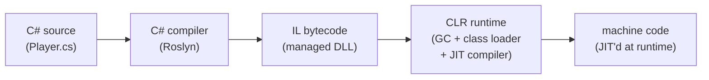
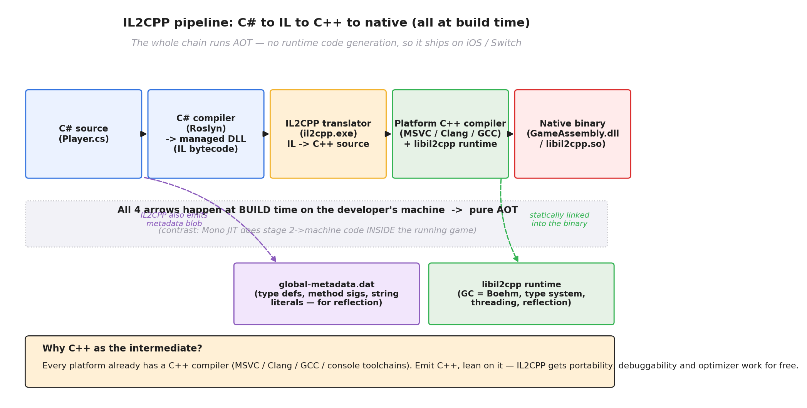
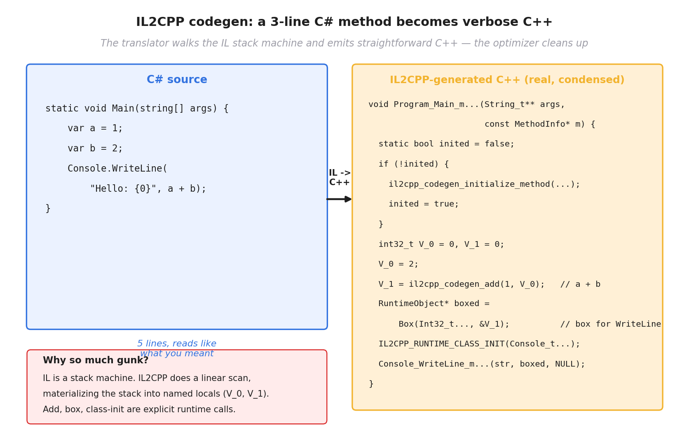
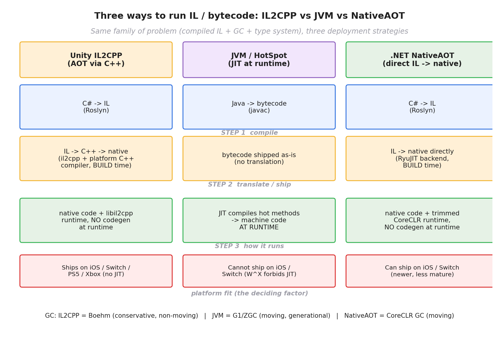
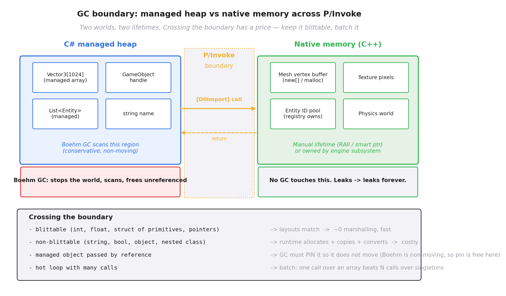

# 第 4 篇 · 第 15 章 · 脚本绑定与跨语言:C# 与 IL2CPP

> **核心问题**:上一章我们讲了 Lua 那条脚本路线——把一个解释型 VM 嵌进引擎,改 `.lua` 文件就能改逻辑,还能热重载。可游戏行业里还有另一条完全不同的主流脚本路线,而且**用户量比 Lua 大得多**:**Unity 用 C#**。问题立刻来了——C# 不是 Lua 那种"小巧解释型脚本",它是一门带 JIT、带 GC、本来跑在 CLR(Common Language Runtime)上的"正经语言"。可**游戏机平台(iOS / Switch / PS5 / Xbox)出于安全限制,禁止运行时生成可执行代码**,这意味着 C# 那套 JIT 在这些平台上**根本跑不起来**。那 Unity 凭什么让 C# 跑在 iPhone 和 Switch 上?答案就是 **IL2CPP**——它把 C# 编译出来的中间语言(IL)再**翻译成 C++ 源码**,然后用各平台已有的 C++ 编译器编成原生机器码,绕过 JIT 限制,达到"跨平台 + 够快"的双重目标。本章要讲透的就是这条链:**C# → IL → IL2CPP 翻译成 C++ → 平台编译器编成机器码**,以及随之而来的两个难点——**GC 与原生内存的边界**(C# 对象归 Boehm GC 管,C++ 对象手动管,跨边界的对象谁说了算?)和**跨语言调用的开销**(C# 调一次 C++ 的 marshal/pinvoke 边界)。

> **读完本章你会明白**:
> 1. Unity 为什么选 C# 做脚本语言(而不是 Lua):静态类型、性能更好、生态大、IDE 支持强;但 C# 需要 CLR 运行时,而游戏机禁止 JIT,这是 IL2CPP 出现的直接动因。
> 2. IL2CPP 到底是什么:它**不是 JIT 也不是直接 AOT 到机器码**,而是把 C# 的 IL **翻译成 C++ 源码**,再用平台 C++ 编译器编成原生——一种"借道 C++"的 AOT 方案。
> 3. 为什么不直接 AOT 到机器码(像 .NET NativeAOT 那样),非要多一道 C++ 中转?因为**每个平台都已经有 C++ 编译器**,IL2CPP 借力它,白嫖了可移植性、调试性和编译器优化。
> 4. ★承《JVM/HotSpot》:JVM 也是"IL(字节码)+ 运行时"架构(C# 和 Java 同源),IL2CPP 相当于把 JVM 的 JIT 换成"翻译成 C++ 再 AOT";对照 .NET NativeAOT、GraalVM Native Image 这些 AOT 方案,看清各自取舍。
> 5. GC 与原生内存的边界:C# 对象活在 GC 托管堆(IL2CPP 用**保守式 Boehm GC**,不移动对象),C++ 对象活在原生堆(手动管);跨 C#/C++ 边界的对象(P/Invoke、绑定)生命周期是难点,跨一次边界的 marshal 开销也不小。

> **如果一读觉得太难**:先只记住三件事——① Unity 用 C# 是因为它比 Lua 强,但 C# 本来要 JIT,游戏机不让 JIT,所以 Unity 搞了 IL2CPP;② **IL2CPP = 把 C# 编译出来的 IL,翻译成 C++ 源码,再用平台 C++ 编译器编成机器码**,全程 AOT(构建期完成),运行时不再需要 JIT;③ C# 对象归 Boehm GC 管,C++ 对象手动管,跨边界的对象生命周期和调用开销是难点。

> **★承接提示**:本章**强承《JVM/HotSpot 深入浅出》**(深入浅出系列·运行时线)。C# 和 Java 同源——都是"源码编译成中间语言(IL / 字节码)+ 虚拟机运行时 + GC"的架构,《JVM》那本书把字节码 IL、运行时、JIT 编译、GC、AOT(GraalVM Native Image)全讲透了。**本章不重讲这些**,只用一句话带过 + 指路 `[[jvm-series-project]]`,篇幅全留给"**IL2CPP 与 JVM 的对照、游戏机平台的特殊性、IL2CPP 借道 C++ 的设计、GC 边界**"这些 Unity/游戏引擎独有的事。如果你读过《JVM》,本章的 IL/GC/AOT 部分你会一眼带过;如果没读过,记住"IL 是一种平台无关的中间汇编,运行时再把它变成机器码"就够了。也承上一章 P4-14(Lua 是一种脚本方案,C# 是另一种,本章会和 Lua 路线反复对照)。

---

## 〇、一句话点破

> **Unity 用 C#,可游戏机禁止 JIT。Unity 的解法叫 IL2CPP——把 C# 编译出来的 IL,在构建期翻译成一堆 C++ 源码,再扔给各平台已有的 C++ 编译器(MSVC / Clang / GCC / 主机厂工具链)编成原生机器码。运行时跑的是纯原生代码,不需要 JIT,于是 C# 这门"本来要 JIT 的语言"就能跑在 iOS / Switch 上了。这条路比 JVM 的 JIT 简单粗暴,但代价是放弃了运行时性能自适应(IL2CPP 出来的代码,通常比一个成熟 JIT 的峰值慢),也继承了 C# 那套 GC(IL2CPP 用保守式 Boehm GC,不移动对象,这是它和 JVM 的一个关键差异)。**

这是结论。本章倒过来拆:先讲 Unity 为什么挑了 C# 而不是 Lua(它和 Lua 的根本差异在哪),再讲 C# 跨平台撞的那面墙(游戏机禁止 JIT),然后讲 IL2CPP 的核心设计(为什么走 C++ 中转而不是直接 AOT 到机器码),接着★对照《JVM》看清"IL + 运行时"家族的几种部署策略,最后讲跨语言边界(GC 与原生内存的边界、P/Invoke 调用开销)。中间穿插一段真实 IL2CPP 生成的 C++ 代码长什么样,让你直观感受"借道 C++"的代价。

---

## 一、为什么 Unity 选了 C#:不是 Lua 的对手

上一章我们讲了 Lua 那条脚本路线:小巧、可嵌入、热重载,魔兽世界和 Roblox 都用它。可 Unity——这个世界上用户量最大的游戏引擎——选的不是 Lua,而是 **C#**。这不是随便挑的,是 C# 在几个关键维度上比 Lua 强一截的必然结果。我们先看清楚这个选择,因为只有看清"为什么是 C#",才能理解后面 IL2CPP 那一系列麻烦从哪来。

### C# 相比 Lua 的四个根本优势

把 C# 和 Lua 摆在一起对照,差异是结构性的:

| 维度 | Lua | C# |
|---|---|---|
| **类型系统** | 动态类型(`x = 5; x = "hi"` 合法) | 静态类型(`int x; x = "hi"` 编译报错) |
| **性能** | 解释执行,慢 C++ 一个量级 | 编译成 IL 再 JIT/AOT,接近 native |
| **IDE 支持** | 几乎没有(动态类型,补全难做) | 极强(Visual Studio / Rider,完整补全/重构/调试) |
| **标准库 / 生态** | 极小(几百个函数) | 巨大(.NET BCL + NuGet 几十万个包) |
| **学习曲线** | 极低(20 个关键字,一周入门) | 中等(像 Java,有类/泛型/委托/async) |
| **跨平台** | 嵌 VM 才能跑 | 自己就跨平台(IL + 运行时) |

这五个差异里,有四个对"游戏引擎这种大型工程"是决定性的:

**①静态类型 = 编译期抓 bug,大型工程的命脉**。Lua 是动态类型,写 `entity.position.x = 5`,如果 `position` 字段不存在,**运行时才报错**(而且 Lua 不报错,它默默创建一个新字段)。C# 是静态类型,`entity.position.x = 5` 如果 `position` 字段名拼错了,**编译期就报错**。一个几十万行 C# 的 Unity 项目,编译期能抓出绝大多数低级错误;同样的项目用 Lua 写,这些错误全得靠运行时测试覆盖到才发现。Unity 项目规模一大,静态类型的好处压倒性地体现出来。

**②性能:C# 本来就比 Lua 快一个量级以上**。上一章讲过 Lua 解释执行比 C++ 慢 10~50 倍,所以热点不能放 Lua。C# 不一样——它编译成 IL 后,要么 JIT(运行时编译成机器码),要么 IL2CPP AOT(构建期编成机器码),**性能接近 native C++**(典型情况比 C++ 慢 1.5~3 倍,远好于 Lua 的 10~50 倍)。这意味着 Unity 项目里**几乎所有游戏逻辑都能用 C# 写**,只有最热的物理 / 渲染才下沉到 C++。而 Lua 项目必须严格分层(C++ 干重活,Lua 干业务),这个分层本身就是工程复杂度。C# 把这条分界线放松了。

**③IDE 支持:C# 是被 Visual Studio 偏爱的语言**。C# 的静态类型 + 元数据完整,让 IDE 能做到完美的代码补全、跳转定义、重构(改名一个字段,全工程所有引用同步改)。Lua 因为动态类型,IDE 几乎只能做关键字补全,变量方法补全基本靠猜。一个有几十万行 C# 代码的 Unity 项目,程序员离不开 IDE 的重构能力;Lua 项目你想重构都得手动 grep + 祈祷。

**④生态:.NET 是个巨大宝库**。C# 背后是整个 .NET 生态——NuGet 上几十万个包,从 JSON 解析到网络到数学库都有。Lua 的生态小得多,大多数东西得自己造轮子。对 Unity 这种要服务几十万开发者的平台,生态是黏住用户的关键。

> **钉死这件事**:Unity 选 C# 不是赶时髦,是**静态类型 + 接近 native 的性能 + 强 IDE + 巨大生态**这四个工程维度上,C# 都压倒性地强于 Lua。代价是——C# 这门语言**本来需要 CLR 运行时 + JIT 才能跑**,而游戏机平台不允许 JIT。这就是 IL2CPP 出现的全部背景。**IL2CPP 不是 Unity 喜欢 C# 的原因,而是 Unity 用了 C# 之后,为了让它跑在游戏机上而不得不补的那块拼图。**

### 但 C# 有个 Lua 没有的麻烦:它本来要 JIT

Lua 是解释型,改 `.lua` 文件就能跑,VM 几百 KB,嵌入引擎毫无压力——这些上一章讲透了。C# 的麻烦在于,它不像 Lua 那么"轻":C# 程序的正常运行模型是这样的(★承《JVM》,一句带过):



这套模型——"源码编成 IL,运行时 CLR 加载 IL,JIT 把热点方法编成机器码"——和 Java 几乎一模一样(《JVM》那本的核心题)。它有个**致命问题**:**JIT 要求运行时能生成可执行代码**(把机器码写进一块内存,然后跳进去执行)。这在 PC 上没问题,可游戏机平台不让。下一节讲这面墙。

> **承《JVM》**:IL(Intermediate Language,中间语言)是 .NET 的字节码,Java 那边叫 bytecode,本质都是一种平台无关的"中间汇编"。CLR(Common Language Runtime)是 .NET 的运行时,对应 Java 的 JVM。JIT(Just-In-Time)在运行时把 IL 编译成机器码。这些概念《JVM/HotSpot 深入浅出》全拆透了,见 `[[jvm-series-project]]`。本章只把它们当已知,不重讲运行时机制。

---

## 二、C# 跨平台撞的墙:游戏机禁止 JIT

### iOS / Switch / PS5 / Xbox 上的 W^X

要懂 IL2CPP 为什么必须存在,得先懂一个**游戏机平台的硬性安全限制**:**禁止运行时生成可执行代码**。这个限制的底层机制,在 iOS 上叫 **W^X(Write XOR Execute)**——一块内存,**要么可写,要么可执行,但不能同时既是可写又是可执行**。

为什么平台要这么限制?**安全**。如果一块内存既能写又能执行,恶意程序就可以:① 往这块内存里写一段恶意机器码;② 把指令指针跳过去执行它。这就是经典的 code injection 攻击向量。Apple 用 **W^X + 代码签名**两道防线堵住它:

- **W^X**:操作系统给每页内存打标记,要么 `PROT_WRITE`(可写),要么 `PROT_EXEC`(可执行),**互斥**。你要执行一段代码,它必须在只能执行、不能写的页里;你要写,它必须在只能写、不能执行的页里。JIT 要做的是"先写机器码到内存,再执行它"——**这在 W^X 下根本做不到**(那一页不能同时既写又执行)。
- **代码签名**:所有可执行代码必须经过 Apple 签名验证才能跑。JIT 运行时生成的代码,没签名,直接被拒。

来源:[Saagar Jha - Jailed Just-in-Time Compilation on iOS](https://saagarjha.com/blog/2020/02/23/jailed-just-in-time-compilation-on-ios/),以及 [Apple - Porting just-in-time compilers to Apple silicon](https://developer.apple.com/documentation/browserenginekit/protecting-code-compiled-just-in-time)(Apple 自己的文档明确说:"因为 JIT 编译器不会为其生成的代码签名,从技术上讲它违反了 Hardened Runtime 的规则")。

iOS 14.2 之后,Apple 给浏览器类应用开了个口子(通过 BrowserEngineKit,而且只给 Apple 自己的浏览器内核),**非浏览器应用仍然不能用 JIT**。

Nintendo Switch、PS5、Xbox 这些主机平台更狠:它们不仅有类似的 W^X,还有**严格的代码签名 + 沙箱**——你发布到这些平台的游戏,**所有可执行代码都必须在主机厂的构建系统里签过名**,运行时一律不准生成新代码。这是主机厂的命脉(防止破解和外挂),没有商量余地。

> **钉死这件事**:游戏机平台(iOS / Switch / PS5 / Xbox)**出于安全,禁止运行时生成可执行代码**——底层是 W^X(内存不能同时可写可执行)+ 代码签名。JIT 的本质就是"运行时生成可执行代码",**和这两道防线直接冲突**。所以**任何依赖 JIT 的语言(C#、Java、JavaScript V8),都没法直接跑在这些平台上**。这是 Unity 用 C# 之后必须解决的第一面墙。

### 这面墙对 Unity 意味着什么

Unity 想让用户用 C# 写游戏逻辑,可 C# 的正常运行模型依赖 JIT(运行时把 IL 编成机器码)。在 PC 上 Unity 用 **Mono**(一个开源的 .NET 实现,带 JIT)就能跑 C#——Mono 的 JIT 在运行时生成机器码,在 PC 上没问题。**可一旦要发布到 iOS / Switch,Mono 的 JIT 直接失效**——平台不让运行时生成代码。

Unity 的早期方案是 **Mono 的 AOT 模式**(Full AOT):构建期就把 IL 编成机器码,运行时不再 JIT。但这有几个问题:① Mono 的 AOT 在不同平台表现不一致,有些 C# 特性(反射、动态类型)AOT 后跑不起来;② Mono 的 AOT 工具链对主机平台支持不好;③ Mono 的运行时本身(C# 的 GC、类型系统)体积大,塞进游戏机这种内存敏感设备有压力;④ Mono 的 JIT 优化能力一般,峰值性能不如微软的 CoreCLR / .NET 5+,Unity 用 Mono 这条路本身就有性能天花板。

具体说,Unity 在 2015 年之前的日子里,移动端开发者的体验是这样的:**开发期在 PC 用 Mono JIT(快、能调试),发布到 iOS 用 Mono Full AOT(慢、有些代码跑不起来、构建容易出错)**。iOS 玩家偶尔遇到的"开发版能跑,装到手机上崩"的诡异 bug,一大半是 Mono AOT 模式和 JIT 模式语义不一致造成的。这种"开发体验和发布体验割裂"的局面,对 Unity 这种要服务几十万开发者的平台是致命的。

Unity 在 2015 年推出了 **IL2CPP**,彻底换了一条路:**不直接 AOT 到机器码,而是把 IL 翻译成 C++ 源码,再用平台 C++ 编译器编成机器码**。这条路看起来绕(多一道 C++ 中转),但实际上漂亮地解决了所有问题——开发期和发布期跑的是同一套编译产物(都是 IL2CPP 出来的原生代码),语义一致;iOS / Switch / PS5 这些原本 Mono AOT 支持稀烂的平台,IL2CPP 因为借道了平台官方 C++ 工具链,反而成了"第一公民"。下一节拆它的设计。

> **不这样会怎样**:如果 Unity 死守 Mono 的 JIT,它的游戏**永远没法发布到 iOS / Switch / PS5 / Xbox**——而这些平台是游戏行业最重要的发行渠道(尤其手游市场,iOS 占了巨大份额)。没有 IL2CPP(或类似 AOT 方案),Unity 就只能做 PC 引擎,而不是全平台引擎。**IL2CPP 是 Unity 从 PC 引擎变成"全平台引擎"的关键拼图。**

---

## 三、IL2CPP:把 C# IL 翻译成 C++ 再编译

终于到 IL2CPP 本身。它的全称是 "**Intermediate Language to C++**",名字就直说了它干什么:**把 C# 编译出来的 IL,翻译成 C++ 源码**。

### 全流水线:从 C# 到原生机器码

IL2CPP 的完整流水线长这样:



一步步走:

1. **C# 源码 → IL(Roslyn 编译器)**。你写的 `Player.cs`,用标准的 .NET 编译器(Roslyn)编成 IL 中间语言,放在一个 managed DLL 里(就是普通的 .NET 程序集)。**这一步和普通 C# 程序完全一样**——Unity 不改 Roslyn,你的 C# 代码在开发期用 Visual Studio / Rider 编辑、调试,和写普通 C# 程序没区别。来源:[Unity 手册 - IL2CPP Overview](https://docs.unity3d.com/6000.1/Documentation/Manual/scripting-backends-il2cpp.html)。

2. **IL → C++ 源码(IL2CPP 转译器,构建期)**。这是 IL2CPP 的核心。`il2cpp.exe` 这个工具,读入上一步的 managed DLL(里面的 IL),**为每个 C# 类型、方法、字段,生成对应的 C++ 代码**。一个 C# 类 `class Player { void Update() {...} }`,会变成一个 C++ 的 `Player` 结构体和一个 `Player_Update_mXXXX(...)` 函数(函数名后面那串哈希是 IL2CPP 加的唯一标识,后面讲)。这一步在**构建期**完成,在开发者机器上跑。

3. **C++ 源码 → 原生机器码(平台 C++ 编译器)**。上一步生成的一堆 `.cpp` 文件,扔给目标平台的 C++ 编译器——Windows 上是 MSVC,iOS / macOS 上是 Clang(Xcode 工具链),Android 上是 NDK 的 Clang,主机平台是主机厂提供的私有工具链。编译器把这些 C++ 编成原生机器码,链接上 `libil2cpp` 运行时库,生成最终的可执行文件(`GameAssembly.dll` on Windows,`libil2cpp.so` on Android,等等)。

4. **运行时**:游戏跑起来,这些 C# 方法**已经是原生机器码了**——不需要 JIT,不需要解释器。调一个 C# 方法,就是一次普通的函数调用(到那个 `Player_Update_mXXXX` 的机器码)。同时,`libil2cpp` 运行时还提供 GC、类型系统、反射支持(从 `global-metadata.dat` 里加载)等 C# 语义需要的运行时设施。

> **钉死这件事**:IL2CPP 的核心动作 = **IL → C++ → 机器码,全程构建期完成(AOT),运行时不需要 JIT**。C# 方法在运行时**已经是原生机器码**,直接函数调用,没有解释开销,不需要可写可执行的内存页——所以能跑在 iOS / Switch 上。**这就是 Unity 让 C# 跨过游戏机平台那道墙的解法。**

### 为什么不直接 AOT 到机器码?借道 C++ 的四个理由

读到这一步你可能问:**IL2CPP 为什么不直接把 IL 编成机器码(像 .NET NativeAOT 那样),非要多走一道 C++ 中转?** 这是个非常好的问题,也是 IL2CPP 设计上最容易被质疑的地方。Unity 的官方解释和工程实践给出的理由有几条:

**理由一:平台覆盖——每个平台都已经有 C++ 编译器**。iOS 有 Xcode 的 Clang,Android 有 NDK 的 Clang,Windows 有 MSVC,Switch / PS5 / Xbox 有主机厂自己的 C++ 工具链。**游戏行业已经把"用平台 C++ 编译器编出能在本平台跑的二进制"这件事做到极致了**——交叉编译、ABI 兼容、调试符号、性能优化,几十年积累。IL2CPP 只要生成 C++,就能**白嫖所有这些现成的工具链**,不用自己为每个平台写一个代码生成后端。如果 IL2CPP 直接生成机器码,它得自己实现 x86 / x64 / ARM32 / ARM64 / 主机平台私有指令集的代码生成,每加一个新平台就得加一个后端——工程量巨大。来源:[Unity 博客 - An introduction to IL2CPP internals](https://unity.com/blog/engine-platform/an-introduction-to-ilcpp-internals)(Josh Peterson,Unity Technologies)。

**理由二:调试性——生成的 C++ 可以用原生调试器调**。IL2CPP 生成的 C++ 代码,可以带完整的调试符号(函数名、行号映射),你可以在 Visual Studio / Xcode / LLDB 里**像调 C++ 程序一样调试 C# 程序**——下断点、看调用栈、查变量。如果 IL2CPP 直接生成机器码,调试体验会差很多(机器码层面的调试器看不到原始 C# 结构)。这条对 Unity 这种要支持几十万开发者的平台极重要。

**理由三:编译器优化——白嫖 C++ 编译器几十年的优化**。MSVC、Clang、GCC 的优化器是几十年积累的工程奇迹——内联、循环展开、常量折叠、死代码消除、自动向量化(SIMD)。IL2CPP 生成的 C++,经过这些优化器一遍,**优化质量接近手写 C++**(虽然实际因为生成的代码有大量 IL2CPP 运行时调用,优化不如手写,但已经不错)。如果 IL2CPP 自己生成机器码,它得自己实现这一整套优化器——再重复一遍,工程量巨大。

**理由四:工具链集成——主机平台本来就要求用 C++ 工具链**。Switch / PS5 / Xbox 这些主机平台,它们的构建系统本来就要求你提交 C++ 工程给主机厂签名打包。IL2CPP 生成 C++,能**无缝接入主机厂的构建流水线**。如果 IL2CPP 直接生成机器码二进制,反而会绕过主机厂的工具链,带来兼容和签名问题。

> **钉死这件事**:IL2CPP 借道 C++ 的根本原因 = **白嫖平台现成的 C++ 工具链(编译器 + 优化器 + 调试器 + 主机厂流水线)**,而不是自己为每个平台写代码生成后端。这是一个工程上极聪明的取舍——**用一道 C++ 中转,换来了"零成本支持所有平台"**。代价是生成的 C++ 代码不如手写 C++ 高效(下一节看真实例子),但相比自己实现 N 个平台的代码生成后端,这个代价划算得多。

> **不这样会怎样**:如果 IL2CPP 直接 AOT 到机器码(像 .NET NativeAOT),它得:① 自己实现 N 个 CPU 架构的代码生成;② 自己实现一个不输 Clang/MSVC 的优化器;③ 自己搞定每个主机平台的调试符号和签名集成。.NET NativeAOT 是微软在 .NET 8+ 才正式推出的,花了多年打磨,而且**.NET NativeAOT 至今在主机平台支持上还不如 IL2CPP 成熟**。Unity 在 2015 年就推出了 IL2CPP,选择"借道 C++"是当时最务实、最快落地全平台的路。

---

## 四、IL2CPP 生成的 C++ 长什么样

讲了这么多原理,我们看一段**真实的 IL2CPP 生成的 C++ 代码**,直观感受"IL → C++"翻译出来是个什么样。这个例子来自逆向工程师 Katy 把一个 Hello World C# 程序用 IL2CPP 编译的真实输出(来源:[KatysCode - IL2CPP Reverse Engineering Part 1](https://katyscode.wordpress.com/2020/06/24/il2cpp-part-1/))。

### 一段简单的 C#

```csharp
// 原始 C# 代码(HelloWorld)
class Program {
    static void Main(string[] args) {
        var a = 1;
        var b = 2;
        Console.WriteLine("Hello World: {0}", a + b);
    }
}
```

5 行,清清楚楚。你想象中,IL2CPP 翻译成 C++ 大概是这样:

```cpp
// 你想象中的 C++(实际不是)
#include <stdio.h>
int main(int argc, char **argv) {
    int a = 1, b = 2;
    printf("Hello World: %d\n", a + b);
}
```

**实际不是**。IL2CPP 翻译出来是这样(为了可读性,稍微精简了,但结构是真的):



```cpp
// IL2CPP 生成的真实 C++(简化,保留关键结构)
// System.Void HelloWorld.Program::Main(System.String[])
IL2CPP_EXTERN_C IL2CPP_METHOD_ATTR void
Program_Main_m7A2CC8035362C204637A882EDBDD0999B3D31776 (
        StringU5BU5D_t933FB07893230EA91C40FF900D5400665E87B14E* ___args0,
        const RuntimeMethod* method)
{
    // --- method 初始化守卫(每个方法第一次进时,加载元数据)
    static bool s_Il2CppMethodInitialized;
    if (!s_Il2CppMethodInitialized) {
        il2cpp_codegen_initialize_method(
            Program_Main_m7A2CC8035362C204637A882EDBDD0999B3D31776_metadata_index);
        s_Il2CppMethodInitialized = true;
    }

    // --- 把 IL 的求值栈具象化成命名局部变量(IL 是栈机,C++ 不是)
    int32_t V_0 = 0;
    int32_t V_1 = 0;
    {
        V_0 = 2;
        int32_t L_0 = V_0;
        // --- "a + b" 被翻译成运行时函数调用(处理溢出检查、运算符重载)
        V_1 = ((int32_t)il2cpp_codegen_add((int32_t)1, (int32_t)L_0));
        int32_t L_1 = V_1;
        int32_t L_2 = L_1;

        // --- WriteLine 的参数是 object,所以 int 要装箱(box)
        RuntimeObject * L_3 = Box(
            Int32_t585191389E07734F19F3156FF88FB3EF4800D102_il2cpp_TypeInfo_var,
            &L_2);

        // --- 触发 Console 类的静态构造器(C# 语义要求)
        IL2CPP_RUNTIME_CLASS_INIT(
            Console_t5C8E87BA271B0DECA837A3BF9093AC3560DB3D5D_il2cpp_TypeInfo_var);

        // --- 实际调用 Console.WriteLine
        Console_WriteLine_m22F0C6199F705AB340B551EA46D3DB63EE4C6C56(
            _stringLiteral331919585E3D6FC59F6389F88AE91D15E4D22DD4,
            L_3,
            /*hidden argument*/ NULL);
        return;
    }
}
```

读这段代码,把 IL2CPP 的"翻译风格"钉死:

1. **函数名带哈希后缀**:`Program_Main_m7A2CC803...`。C# 里同名的方法(比如多个类都有 `Main`),在 C++ 这边得有唯一名字。IL2CPP 用方法的全名 + 一串哈希(MD5 之类)生成唯一函数名。这串哈希看起来丑,但它保证了**任何 C# 方法在 C++ 这边都有唯一的、可链接的名字**。

2. **方法初始化守卫**:`if (!s_Il2CppMethodInitialized) { il2cpp_codegen_initialize_method(...); }`。每个 IL2CPP 生成的方法,开头都有这么一段。它做的是**懒加载元数据**——这个方法引用了哪些类型、字符串、其他方法,第一次进时才去 `global-metadata.dat` 里查并填好。这是 AOT 的一个 trick:**类型信息不一股脑全加载**(启动慢),而是**用到哪个方法才加载那个方法需要的元数据**。

3. **IL 的求值栈具象化成命名局部变量**:`int32_t V_0 = 0; int32_t V_1 = 0;`。IL 是**栈机**(指令往栈上 push/pop),C++ 不是。IL2CPP 做的是**线性扫描 IL,把栈上的虚拟位置翻译成 C++ 的局部变量**(命名成 `V_0`、`V_1`、`L_0`、`L_1` 等)。这导致生成的 C++ 有很多看起来冗余的中间变量(像 `L_0 = V_0; V_1 = ... L_0;`),**交给 C++ 编译器优化掉**。

4. **运算符翻译成运行时函数调用**:`il2cpp_codegen_add(1, 2)` 而不是 `1 + 2`。为什么?因为 C# 的 `+` 要处理**运算符重载**(用户自定义的 `operator +`)、**溢出检查**(`checked` 上下文)、**类型转换**。IL2CPP 不能简单地翻译成 C++ 的 `+`,得翻译成一个运行时函数,让运行时函数去判断这些情况。这是 IL2CPP 性能不如手写 C++ 的一个重要原因——**很多 C# 操作,IL2CPP 都加了运行时分派**。

5. **装箱(Box)是显式调用**:`Box(Int32_t..., &L_2)`。C# 里 `Console.WriteLine("{0}", a + b)`,`a + b` 是 int,但 `WriteLine` 要 object,所以隐式装箱。IL2CPP 把这个隐式操作**显式翻译成 `Box` 调用**——在托管堆上分配一个 object,把 int 塞进去。装箱在 C# 是性能坑(IL2CPP 这边更明显),Unity 优化建议里"少装箱"是经典一条。

6. **类初始化检查是显式的**:`IL2CPP_RUNTIME_CLASS_INIT(Console_t...)`。C# 语义要求:一个类第一次被用到之前,它的**静态构造器**(`static Console() {...}`)必须先跑。IL2CPP 把这个检查显式翻译出来——每次访问一个类,先检查它有没有初始化过,没有就触发静态构造器。

> **钉死这件事**:IL2CPP 的翻译风格 = **线性扫描 IL,机械地把每个 IL 操作翻译成对应的 C++ 代码 + 运行时调用**。它不做复杂优化(优化交给 C++ 编译器),所以生成的 C++ 代码冗长、有大量运行时调用(`il2cpp_codegen_*`、`Box`、`IL2CPP_RUNTIME_CLASS_INIT`)、中间变量冗余。这种"机械翻译"风格让 IL2CPP 工具本身简单可靠(就是一个 IL 解释器),代价是**生成的代码质量依赖 C++ 编译器去清理**,而且某些操作(运算符重载、装箱、类型检查)绕不开运行时分派,所以**IL2CPP 出来的代码通常比手写 C++ 慢,也比成熟 JIT 的峰值慢**。

### IL2CPP 输出的两个文件

除了生成那一堆 `.cpp` 源码,IL2CPP 还生成两个关键产物,游戏发布时带的:

- **`libil2cpp.so` / `libil2cpp.dll` / `GameAssembly.obj`**:把所有生成的 C++ 代码 + libil2cpp 运行时库,编进**一个原生二进制**。这是游戏运行时实际加载的东西——所有 C# 方法都在里面,以原生机器码形式存在。
- **`global-metadata.dat`**:一个二进制元数据文件,装着所有类型定义、方法签名、字符串字面量、字段布局等**反射需要的信息**。运行时你调 `typeof(Player).GetMethod("Update")`,IL2CPP 运行时就去这个文件里查。这个文件通常几 MB 到几十 MB,游戏的 `il2cpp_data/Metadata/global-metadata.dat` 就是它。

这两个文件是逆向工程师拆 Unity 游戏的入口——开源工具 [Il2CppInspector](https://github.com/djkaty/il2cppinspector) 和 Il2CppDumper 就是解析这两个文件,还原出原始 C# 的类型结构。来源:[Il2CppInspector GitHub](https://github.com/djkaty/il2cppinspector)。这也是 IL2CPP 的一个副作用:**虽然生成的 C++ 比原 C# 难读,但元数据结构是公开的**,逆向工具能把类型和方法关系还原得七七八八——IL2CPP 不是加密方案,只是部署方案。

---

## 五、★承《JVM》:IL + 运行时家族的几种部署策略

讲到这里,如果你读过《JVM/HotSpot》,你应该已经看出 IL2CPP 和 JVM 的关系了。本节把这条承接彻底兑现——**C# 和 Java 同源**,都是"源码编译成 IL + 运行时 + GC"的架构,《JVM》那本书把这个架构的原理全拆透了。我们这里只看:**同一个"IL + 运行时"架构,有几种部署策略?各自适合什么场景?**



### 策略一:JIT(经典 JVM / Mono JIT)——运行时编译

最经典的部署策略:**把 IL / 字节码原样发到设备,运行时 JIT 把热点方法编成机器码**。这是 JVM(HotSpot)和 Unity 早期用的 Mono 在 PC 上的做法。

- **优点**:运行时能根据**实际运行情况**做 profile-guided optimization(PGO)——JIT 看哪些方法调得多、虚方法实际指向哪个实现、分支往哪走,基于这些信息做比 AOT 更激进的优化。所以**成熟 JIT 的峰值性能往往比 AOT 好**。
- **缺点**:① **启动慢**(JIT 要边跑边编译);② **运行时开销大**(JIT 本身占 CPU 和内存);③ **最致命的——需要可写可执行的内存页**,游戏机平台不让。
- **适用场景**:PC / 服务器(没有 W^X 限制),长期运行的服务端应用(JIT 优化能回本)。

> **承《JVM》**:JVM 的 JIT(C1 / C2 编译器)、分层编译、逃逸分析、去虚化——这些都是《JVM/HotSpot 深入浅出》的核心题,见 `[[jvm-series-project]]`。本章不重讲。重点只记一句:**JIT 在运行时生成代码,所以和游戏机平台的 W^X 冲突,不能直接用**。

### 策略二:IL2CPP——构建期 AOT,借道 C++

Unity 的方案:**构建期把 IL 翻译成 C++,再编译成原生机器码**。运行时跑的是纯原生代码,不需要 JIT。

- **优点**:① **能在所有游戏机平台跑**(不违反 W^X);② **启动快**(没有运行时编译);③ **白嫖 C++ 工具链**(平台覆盖、调试、优化)。
- **缺点**:① **没有 PGO**(AOT 时不知道运行时热点在哪,只能保守优化);② **生成的代码质量依赖机械翻译 + C++ 编译器**,某些 C# 操作(运算符重载、装箱、虚方法分派)绕不开运行时分派;③ **构建慢**(IL2CPP 翻译 + C++ 编译,大项目构建几分钟到十几分钟);④ **二进制大**(所有 C# 类型和方法都生成 C++,加上 libil2cpp 运行时,一个空 Unity 项目的 `libil2cpp.so` 都上百 MB);⑤ **GC 是保守式 Boehm**(下一节讲),不如现代 JVM 的 GC。
- **适用场景**:游戏机平台(iOS / Switch / PS5 / Xbox)的**唯一选择**(对 Unity 而言),也常用于 Android / PC 发布版(为了启动快、防盗版)。

### 策略三:.NET NativeAOT / GraalVM Native Image——直接 AOT 到机器码

更新的方案:**构建期把 IL / 字节码直接编成机器码,不经过 C++ 中转**。微软的 .NET NativeAOT(.NET 8+ 正式支持)和 Oracle 的 GraalVM Native Image(Java 那边)走这条路。

- **优点**:① **没有 C++ 中转的开销**,代码质量更可控;② **启动极快 + 内存占用小**(GraalVM Native Image 主要为云原生微服务设计,启动时间从秒级压到毫秒级);③ **不依赖运行时 JIT**,也能跑在受限平台。
- **缺点**:① **要自己实现 N 个 CPU 架构的代码生成**,工程量大(.NET NativeAOT 花了多年才成熟);② **反射 / 动态代码生成受限**(AOT 时不知道运行时会反射哪些类型,要么砍掉,要么显式标注);③ **主机平台支持不如 IL2CPP 成熟**(微软没像 Unity 那样花十几年打磨主机厂关系)。
- **适用场景**:云原生微服务(GraalVM Native Image)、.NET 移动端 / 嵌入式(.NET NativeAOT)。

> **钉死这件事**:"IL + 运行时"这个架构家族,有三条部署策略——**JIT(运行时编译,峰值最快但需可执行内存)、IL2CPP(AOT 借道 C++,全平台覆盖但牺牲峰值)、NativeAOT(直接 AOT,质量好但要自己搞定所有平台)**。**Unity 选 IL2CPP 的根本原因,是它在 2015 年那个时间点,要最快地"让 C# 跑遍所有游戏机平台"——借道 C++ 是当时唯一务实的选择。** 时至今日,.NET NativeAOT 成熟了,但 Unity 已经在 IL2CPP 上积累了十年优化,迁移代价太大,所以 IL2CPP 仍是 Unity 的主力。

### GC 的差异:IL2CPP 继承了 Boehm(承《JVM》GC,一句带过)

除了部署策略,这几条路的 **GC** 也不一样,这直接关系到下一节的"GC 与原生内存边界":

- **IL2CPP 用 Boehm GC**:这是 Hans Boehm 写的一个**保守式(conservative)、非移动(non-moving)GC**。保守式意味着它**不能精确区分指针和整数**——扫描栈和堆时,看到一个看起来像指针的值,就保守地认为它可能指向一个活对象,不回收。非移动意味着**它不搬运对象**(不压缩堆,不做 compaction),对象分配在哪就一直在哪。这导致两个问题:① **假阳性**(把整数当指针,本该回收的对象被误保留,内存泄漏式增长);② **堆碎片化**(对象不搬,空间越分越散)。来源:[Unity 文档 - Garbage Collection](https://docs.unity3d.com/6000.1/Documentation/Manual/dotnet-garbage-collection.html),确认 Unity 在 Mono 和 IL2CPP 后端都用 Boehm GC;以及 [bdwgc GitHub 镜像](https://github.com/bonfirestudios/unity-bdwgc)(Unity 用的 bdwgc 版本 7.7.0)。
- **JVM 用 G1 / ZGC 等**:这些都是**精确式(precise)、移动式(moving、compacting)GC**。精确式能区分指针和整数,移动式会搬运对象(让活对象紧凑挨着),堆没碎片。现代 JVM 的 GC pause time 能压到毫秒级(ZGC),远好于 Boehm。
- **.NET NativeAOT 用 CoreCLR 的 GC**:也是精确式 + 移动式。

> **承《JVM》**:GC 算法(标记清除 / 标记压缩 / 分代 / 并发)、《JVM》那本书讲透了,见 `[[jvm-series-project]]`。本章只关心结论:**IL2CPP 用的 Boehm GC 是保守式 + 不移动,这是它和 JVM / CoreCLR 的一个关键差异**——后面讲 GC 边界时,这个"不移动"是 IL2CPP 跨语言调用比 JVM 简单的根本原因(对象不动,跨语言引用不用更新)。

Unity 也在迭代 GC——较新版本引入了**增量式 Boehm GC**(把 GC 工作分摊到多帧,减轻 spike),还在研发新的 Sgen-style 精确 GC。但截至本书写作,主流 IL2CPP 仍是 Boehm。

---

## 六、GC 与原生内存的边界:跨语言最难的一段

到这里,IL2CPP 的核心机制讲完了。但 Unity 项目里还有个绕不开的难点:**C# 代码和 C++ 代码之间的边界**。Unity 引擎本身是 C++ 写的(渲染、物理、资源系统),用户用 C# 写游戏逻辑——两边怎么通信?而且 C# 对象归 Boehm GC 管,C++ 对象归手动管 / 引擎子系统管,**跨边界的对象生命周期归谁管**?这是本章最硬核的一段。

### 两个世界:托管堆 vs 原生堆

Unity 运行时里,**内存分成两个世界**:



- **C# 托管堆(managed heap)**:所有 C# 对象(`new Player()`、`List<int>`、`string`)都分配在这里。**Boehm GC 扫描这个堆**,发现没人引用的对象就回收。这块内存 GC 全权管理,你不能手动 `delete`。
- **原生堆(native heap)**:所有 C++ 对象(`new Mesh()`、`malloc` 的 buffer、引擎子系统持有的对象)在这里。**没有 GC 碰这块**,生命周期靠 C++ 的 RAII、智能指针、或者引擎子系统(比如 ECS registry)手动管。
- **P/Invoke 边界**:C# 调 C++(或者反过来)的边界。C# 用 `[DllImport("libname")]` 声明一个外部 C++ 函数,调用时就跨了这条边界。Unity 引擎的 C++ API 暴露给 C#,走的就是这条边界。

> **钉死这件事**:Unity 运行时有两个内存世界——**C# 托管堆(Boehm GC 管)和原生堆(手动管)**。这两个世界的对象**生命周期规则完全不同**:C# 对象 GC 自动回收,C++ 对象必须手动释放。**跨 P/Invoke 边界的对象,生命周期归谁管,是跨语言最难的题。**

### 跨边界对象的生命周期:GCHandle 和 pin

考虑一个具体场景:C# 这边有一个 `byte[]` 数组(托管堆上),要传给 C++ 的一个图像处理函数(原生堆那边):

```csharp
// C# 侧
byte[] pixels = new byte[1024 * 1024];   // 在托管堆上, GC 管
NativePlugin.ProcessImage(pixels, 1024, 1024);   // 调 C++ 插件
```

这里立刻有几个问题:

**问题一:GC 会不会在我调用过程中把 `pixels` 回收?** 不会——只要 C# 这边还有引用(`pixels` 这个变量),GC 就不会回收。但**如果 C++ 那边异步处理,存了指针后立即返回,C# 这边 `pixels` 出作用域被 GC 回收了**,C++ 那边持有的指针就悬空了——use-after-free。

**问题二(只在精确式 + 移动式 GC 上才有,IL2CPP 没这个问题):GC 会不会移动 `pixels`?** 如果是 JVM 或 CoreCLR 那种**移动式 GC**,它在压缩堆时会把对象搬位置,C++ 那边持有的指针就指向了错误地址。所以移动式 GC 跨语言调用必须 **pin(钉住)** 对象——告诉 GC "这个对象别搬,有 C++ 在用"。**IL2CPP 用的 Boehm GC 是不移动的,所以不需要 pin,这是 IL2CPP 跨语言比 JVM 简单的一个意外好处**。

Unity 的解法是 **GCHandle(GC Handle)**——一个显式的句柄机制。C# 这边调 `GCHandle.Alloc(pixels, GCHandleType.Pinned)` 给对象一个固定句柄,这个句柄保证:① 对象不会被 GC 回收(句柄本身是根);② 对象不会被移动(虽然 IL2CPP 本来就不移动,但 GCHandle 的 Pinned 模式同时承诺这两点)。C++ 拿到这个句柄对应的地址,可以安全使用。用完 C# 调 `handle.Free()` 释放。

> **钉死这件事**:跨语言边界的对象生命周期难题有两个——**悬空引用**(C++ 持有的指针,C# 那边被 GC 回收)和**对象移动**(GC 搬位置让 C++ 指针失效)。**IL2CPP 的 Boehm GC 不移动,所以第二个问题天然没有**;第一个问题用 **GCHandle**(显式句柄)解决——给跨语言对象一个 GC 认可的引用,C++ 用期间不会回收,用完显式释放。这是 IL2CPP 跨语言比 JVM 简单的根本原因。

### 承上一章 P4-14:这和 Lua 那套生命周期管理异曲同工

上一章 P4-14 讲 Lua 绑定 C++ 时,我们撞到的是同一个问题:**GC 语言(C# 或 Lua)持有的对象引用,如果直接是 C++ 对象指针,C++ 那边销毁后就悬空**。Lua 那套的解法是——**Lua 持有的是 Entity 的 ID(句柄),不是指针**,C++ 销毁后通过 version 机制让 Lua 这边能检测出来(承 P2-05 的 version 机制)。

Unity 的 C# 这边,处理方式异曲同工:**C# 持有的引擎对象(GameObject、Component)是一个托管 wrapper,里面包的是 C++ 那边的 ID / 指针**,而不是 C++ 对象本身。Unity 的 `GameObject` C# 类,底层对应一个 `GameObject*` 原生指针,但这个指针归 C++ 那边的引擎管理——C# 这边的 wrapper 被 GC 回收时,只是回收 wrapper 这个壳,**不会去 delete C++ 那边的对象**(C++ 对象有自己的生命周期,通常和场景绑定,或者显式 `Destroy`)。

```csharp
// Unity 的 GameObject,底层是 C++ 指针的 wrapper
public sealed class GameObject : Object {
    // 内部持有的 m_CachedPtr 是 C++ 那边的 GameObject*
    // GC 回收这个 wrapper,不 delete C++ 对象
    // 要销毁 C++ 对象,显式调 Object.Destroy(this);
}
```

这就是 GC 语言绑 C++ 对象的**通用铁律**(承 P4-14 那条):**GC 语言持有的是"句柄 / wrapper",不是 C++ 对象本身**;GC 只回收 wrapper,从不 delete C++ 对象;C++ 对象的生命周期要么归引擎管(场景销毁时一并销毁),要么由用户显式销毁(`Object.Destroy`)。这条铁律在 Lua 那边是 `entity:set_health(...)` 持有 Entity ID,在 C# 这边是 `GameObject` wrapper 持有 `GameObject*`——**形不同,神相同**。

> **钉死这件事**:跨语言对象生命周期铁律(承 P4-14):**GC 语言(C# 或 Lua)持有的是对象的"句柄 / wrapper",不是 C++ 对象本身**。GC 只回收 wrapper,从不 delete C++ 真对象。C++ 真对象的生命周期要么归引擎管,要么显式销毁。**绝不让 GC 语言直接持有 C++ 裸指针并负责 delete**——否则要么悬空(C++ 提前销毁),要么 double-free(GC 和 C++ 都想 delete)。

### P/Invoke 调用开销:marshal 是真的贵

除了生命周期,跨语言调用本身还有**性能开销**。每次 C# 调一个 `[DllImport]` 声明的 C++ 函数,要做几件事:

1. **状态切换**:从托管代码(C#)切到非托管代码(C++),运行时要切一些状态(GC 状态、线程状态)。
2. **参数 marshal**:如果参数是 blittable(内存布局在 C# 和 C++ 完全一致,比如 `int`、`float`、struct of primitives),几乎零开销,直接传;如果是 non-blittable(`string`、`bool`、`object`、嵌套 class),运行时要**分配新内存 + 复制 + 转换格式**——这非常贵。
3. **栈帧建立**:正常的函数调用开销,但比 C++ 内部函数调用慢一截(多了上面两步)。

来源:[Microsoft Learn - Native interoperability best practices](https://learn.microsoft.com/en-us/dotnet/standard/native-interop/best-practices)明确建议:**P/Invoke 用 blittable 类型,避免 string/bool/object 在热路径上 marshal**。

具体数字:blittable 的 P/Invoke 调用,现代 .NET 上约几纳秒(已经很快);non-blittable 的(比如传 `string`),因为要复制转换字符串,可能贵几十倍到几百倍。

> **钉死这件事**:P/Invoke 调用开销的核心规律——**blittable(布局一致)几乎零开销,non-blittable(string/bool/object)贵几十倍**。所以跨语言调用的性能纪律和上一章 P4-14 讲 Lua 绑定时一模一样:**① 少跨边界;② 跨的时候用 blittable 类型;③ 批量传(一次传一个数组,而不是 N 次传单元素)**。这条纪律在 Lua 那边、在 C# 这边、在任何 GC 语言绑 C++ 的场景都成立——是跨语言优化的通用铁律。

### Unity 特有:`[DllImport("__Internal")]` 的特殊优化

Unity 移动端有个特别的优化:IL2CPP 模式下,C# 调引擎原生代码用 `[DllImport("__Internal")]`,这是**链接到当前二进制内部的函数**(因为 IL2CPP 把 C# 编译进了同一个 `libil2cpp.so`)。这种调用比跨 DLL 的 P/Invoke 更快(没有跨 DLL 的开销),接近普通 C++ 函数调用。这是 IL2CPP 相比 Mono 的一个性能优势——Mono 那边 C# 和引擎原生代码是分开的 DLL,跨过去要跨 DLL;IL2CPP 把它们编进了同一个二进制,调用更直接。

具体到 Unity 的 Native Plugin(原生插件)开发,这条规律很重要。当你写一个 C++ 插件给 Unity 用,有两种发布方式:

- **独立 `.dll` / `.so` / `.dylib`**:插件编成独立的动态库,C# 用 `[DllImport("pluginname")]` 调。每次调用跨一次 DLL 边界,有几纳秒到几十纳秒开销(取决于平台和参数)。
- **Static Native Plugin(IL2CPP 模式独有)**:把插件的 C++ 源码直接和 IL2CPP 生成的 C++ 一起编译,进同一个 `libil2cpp.so`。C# 用 `[DllImport("__Internal")]` 调,调用是**二进制内部直接函数调用**,没有跨 DLL 开销,几乎和手写 C++ 一样快。

来源:[Microsoft Learn - Native interoperability best practices](https://learn.microsoft.com/en-us/dotnet/standard/native-interop/best-practices)讲 P/Invoke 通用最佳实践,Unity 文档讲 IL2CPP 的 `[DllImport("__Internal")]` 模式。Unity 自己的官方建议是:**热点路径上的原生调用,优先用 static plugin + `[DllImport("__Internal")]`**——这是 IL2CPP 模式下一个被忽视的性能红利。

### 一个真实的性能坑:LINQ 和装箱

讲到这里,我们看一个 Unity C# 开发者最常踩的性能坑,把它和本章讲的 IL2CPP + 装箱 + GC 串起来:

```csharp
// 看起来人畜无害的 LINQ
var enemies = entities.Where(e => e.alive).OrderBy(e => e.hp).ToArray();
```

这一行 C# 代码,在 IL2CPP 编译后跑起来,会发生几件事:① `Where` 和 `OrderBy` 各创建一个 `IEnumerable` 包装对象(托管堆分配);② lambda `e => e.alive` 会被**装箱**(因为 `Where` 接受 `Func<T, bool>`,这是引用类型,lambda 闭包要装箱);③ `OrderBy` 内部用排序,创建临时数组;④ 最后 `ToArray` 再分配一个数组。**这一行代码可能在托管堆上分配了五六个对象**。

这些对象转眼就没人引用了,等下次 Boehm GC 跑的时候一并回收——可 Boehm GC 是保守式 + 非移动,**每次 GC 都是个 spike**(虽然 Unity 引入了增量 GC 减轻,本质没变)。游戏每帧都跑这行代码,每帧都分配一堆小对象,GC 就频繁触发,**帧率抖动**。这是 Unity 移动端游戏卡顿的头号原因。

Unity 性能优化的核心建议"**避免每帧在托管堆上分配**",根因就在这里——IL2CPP 的 Boehm GC 不如现代移动式 GC 高效,每帧分配 + 频繁回收 = 帧率不稳。解法是把 LINQ 改成手写 `for` 循环、预分配 List、用 struct 而不是 class(struct 在栈上,不进 GC 堆)。这条经验把本章三件事(IL2CPP 的代码生成风格、Boehm GC 的特性、托管堆 vs 原生堆的边界)全串起来了。

---

## 七、技巧精解:IL2CPP 的两个第一性洞察

本章最硬核的两个技巧,我们单独拆透。

### 技巧一:借道 C++,白嫖工具链

**它解决什么问题**:Unity 要让 C# 跑遍所有游戏机平台(iOS / Switch / PS5 / Xbox),每个平台的 CPU 架构(x86 / x64 / ARM32 / ARM64 / 主机私有)、操作系统、ABI、构建工具链都不一样。如果 IL2CPP 自己生成机器码,要为每个组合实现一个代码生成后端,工程量巨大。

**朴素做法撞什么墙**:① 直接用 Mono 的 JIT——游戏机不让。② Mono 的 AOT——对不同平台支持不一致,有些 C# 特性 AOT 后跑不起来。③ 自己实现一个直接 AOT 到机器码的工具(像 .NET NativeAOT)——要花多年,而且 2015 年那会儿 .NET NativeAOT 还没影。

**漂亮的解法**:**生成 C++,借力平台现成的 C++ 编译器**。理由前面讲过——每个游戏机平台都已经有成熟的 C++ 工具链(主机厂强制要求用),IL2CPP 只要生成 C++,就能接入这些工具链,白嫖编译器优化、调试符号、交叉编译、主机厂签名流水线。

**反面对比**:如果 IL2CPP 直接生成机器码,想想 Unity 要干多少活:

- x86 后端、x64 后端、ARM32 后端、ARM64 后端、Switch 私有架构后端……
- 每个后端的优化器(不输 Clang/MSVC 几十年积累的)
- 每个平台的调试符号格式(DWARF / PDB / 主机厂私有)
- 每个平台的 ABI、链接器、签名集成

这是好几个 .NET NativeAOT 团队的活。Unity 在 2015 年选"借道 C++",**用一个工程上极聪明的中转,换来了零成本的全平台覆盖**。代价是生成的代码质量受 IL2CPP 翻译质量 + C++ 编译器限制,但因为 C++ 编译器(尤其 Clang)优化极强,实际生成的代码质量已经相当不错。

**一个数据点**:Sebastian Schöner 在 [IL2CPP, but better](https://blog.s-schoener.com/2025-04-07-cpp2better/) 这篇博客里讲,他写了个工具 `cpp2better`,在 IL2CPP 生成的 C++ 上做一轮后处理(去掉冗余、简化结构),在一个 PS5 真实游戏上能省 2ms 帧时间(16ms 帧预算的 12%)。这说明 IL2CPP 生成的 C++ **还有优化空间**——但同时也说明它已经足够好,只是不够完美,真要榨性能还得手工打磨。

> **钉死这件事**:IL2CPP 的核心工程智慧 = **不重复造轮子**。平台 C++ 工具链几十年积累,Unity 不自己实现,而是生成 C++ 让这些工具链接着干活。一个工程上极聪明的取舍——**用一道中转,换来零成本覆盖所有平台**。这是 IL2CPP 设计的灵魂,也是它从 2015 年用到今天仍不可替代的原因。

### 技巧二:不移动 GC 意外简化了跨语言边界

**它解决什么问题**:跨语言调用时,GC 移动对象会让 C++ 持有的指针失效,这是 JVM 等移动式 GC 跨语言的噩梦(JNI 要 pin 对象、要 handle,复杂且慢)。

**JVM / CoreCLR 的做法(对比)**:这些移动式 GC,跨语言调用必须 pin 对象(`GCHandle.Alloc(..., Pinned)` 在 .NET,`NewGlobalRef` 在 JNI)。pin 一个对象意味着 GC 在压缩堆时**不能搬它**,这导致堆碎片化(pin 的对象散在各处,挡住 compaction)。所以移动式 GC 的跨语言调用是个工程噩梦,要么慢(pin 多了 GC 效率差),要么危险(忘记 pin 就崩)。

**IL2CPP 的意外好处**:IL2CPP 用的 Boehm GC **不移动对象**(non-moving),对象分配在哪就一辈子在哪。这意味着——**跨语言调用时,C++ 拿到的指针永远有效**(只要对象不被 GC 回收),不需要 pin。这是 IL2CPP 跨语言调用比 JVM 简单 + 快的根本原因。

**反面对比**:如果 IL2CPP 用了移动式 GC(比如 Unity 在研发的精确 GC),跨语言边界就要重做——所有 C++ 持有的 C# 对象引用,都得变成 handle(GC 移动时更新 handle),调用时再从 handle 解出当前地址。这是一大坨复杂度。IL2CPP 现在能这么简单地跨语言,**全靠 Boehm GC 不移动这条意外红利**。

> **钉死这件事**:IL2CPP 用 Boehm GC(不移动),意外简化了跨语言边界——**C++ 持有的 C# 对象指针永远有效(只要对象不回收),不需要 pin**。这是 IL2CPP 跨语言比 JVM(JNI)/ CoreCLR 简单 + 快的根本原因。代价是 Boehm GC 本身不如现代移动式 GC(假阳性、堆碎片),但在游戏这个场景下,**跨语言简洁性的红利 > GC 算法本身的劣势**。

### 反面对比:如果 Unity 当年没用 IL2CPP

把这一章收束一下:**如果 Unity 当年没搞 IL2CPP,会怎么样?**

- **死守 Mono JIT**:只能发 PC / Mac / Linux,失去 iOS / 主机市场——游戏行业最重要的发行渠道。Unity 不可能成为今天的 Unity。
- **用 Mono AOT**:不同平台表现不一致,某些 C# 特性跑不起来,而且 Mono 运行时本身体积大、性能一般。Unity 在移动端 / 主机端的体验会比现在差一截。
- **换语言(比如用 Lua)**:放弃 C# 的静态类型 + 性能 + IDE + 生态优势,回到上一章讲的 Lua 路线那种"业务用脚本、热点用 C++"的严格分层。这会让 Unity 的开发体验降级一个档次。

IL2CPP 是 Unity 让 **C# 跑遍所有平台、保持高性能 + 强开发体验**的关键工程。它不是最优雅的方案(借道 C++ 多此一举),但是 2015 年那个时间点最务实、最快落地的选择,而且十年积累让它成了游戏行业 AOT 的标杆。

---

## 八、章末小结

### 回扣主线

本章是第 4 篇(资源与脚本)的第二章,继续讲横切两面的"脚本"子系统——上一章讲了 Lua 那条路线,本章讲 **Unity 的 C# 路线**。这条路线和 Lua 根本不同:Lua 是"把小巧解释型 VM 嵌进引擎",C# 是"用一门正经的静态类型语言,通过 IL2CPP 编译成原生代码"。两者都解决"游戏逻辑要快速迭代"的问题(P4-14 开篇讲的 C++ 编译慢那面墙),但解决方案天差地别——**Lua 用解释执行换热重载,C# 用 IL2CPP 换跨平台 + 接近 native 的性能**。

我们承接《JVM/HotSpot》——IL、运行时、JIT、GC、AOT 的原理那本书全讲透了,本章一律一句带过 + 指路。本章的篇幅全留给游戏引擎 / Unity 独有的四件事:① **Unity 为什么选 C#**(静态类型 + 性能 + IDE + 生态);② **C# 跨平台撞的墙**(游戏机 W^X 禁止 JIT);③ **IL2CPP 的核心设计**(IL → C++ → 机器码,借道 C++ 白嫖工具链);④ **GC 与原生内存的边界**(Boehm GC 不移动意外简化跨语言)。本章横切"组织 vs 驱动"两面——脚本既操作引擎的数据(组织),又被主循环每帧驱动(驱动),是连接 C++ 引擎底层和游戏逻辑的桥梁。

### 五个为什么

1. **Unity 为什么用 C# 不用 Lua?**——C# 在静态类型、性能、IDE 支持、生态四个工程维度上压倒性地强于 Lua。静态类型能在编译期抓 bug(大型工程命脉),性能接近 native(几乎所有游戏逻辑都能用 C# 写,不必像 Lua 那样严格分层),IDE 支持强(Visual Studio / Rider 完整补全重构),生态大(.NET + NuGet)。代价是 C# 本来需要 CLR + JIT,游戏机不让 JIT,于是有了 IL2CPP。
2. **游戏机平台为什么禁止 JIT?**——出于安全,采用 **W^X(Write XOR Execute)+ 代码签名**两道防线。W^X 要求内存页要么可写要么可执行,互斥;JIT 要"写机器码再执行",在 W^X 下做不到。代码签名要求所有可执行代码先签名,JIT 运行时生成的代码没签名。iOS / Switch / PS5 / Xbox 都有类似限制。**任何依赖 JIT 的语言都没法直接跑在这些平台上。**
3. **IL2CPP 到底干什么?**——把 C# 编译出来的 **IL,在构建期翻译成 C++ 源码**,再用平台 C++ 编译器(MSVC / Clang / GCC / 主机厂工具链)连同 libil2cpp 运行时编成原生机器码。全程 AOT(构建期完成),运行时不需要 JIT。C# 方法在运行时是原生机器码,直接函数调用。产物是 `libil2cpp.so / .dll`(原生二进制)+ `global-metadata.dat`(反射元数据)。
4. **为什么不直接 AOT 到机器码,非要多一道 C++ 中转?**——**借道 C++,白嫖平台现成的 C++ 工具链**(编译器、优化器、调试器、主机厂签名流水线),不必自己为每个 CPU 架构 / 平台写代码生成后端。.NET NativeAOT 是直接 AOT 的方案,但要花多年实现多平台支持,而且主机平台支持仍不如 IL2CPP。**Unity 在 2015 年选"借道 C++",是最务实、最快落地全平台的路**。
5. **C# 和 C++ 跨语言边界,对象生命周期怎么管?**——两个内存世界:**C# 托管堆(Boehm GC 管,不移动)和原生堆(手动管)**。跨边界的对象,**C# 持有的是 wrapper / 句柄(里面是 C++ 指针或 ID),不是 C++ 对象本身**;GC 只回收 wrapper,从不 delete C++ 真对象(承 P4-14 的 Lua 铁律)。Boehm GC 不移动,意外简化了跨语言——C++ 拿到的指针永远有效(只要对象不回收),不需要 pin(JVM / CoreCLR 移动式 GC 的噩梦)。P/Invoke 调用开销:blittable 几乎零开销,non-blittable(string/bool/object)贵几十倍,纪律是"少跨、用 blittable、批量"。

### 想继续深入往哪钻

- 想搞懂 **JVM 的 IL / 字节码、运行时、JIT、GC、AOT**(本章承的那本书):读《JVM/HotSpot 深入浅出》,见 `[[jvm-series-project]]`。本章把这些当已知,C# 和 Java 同源,IL/CLR 对应 bytecode/JVM。
- 想看 **IL2CPP 真实生成的 C++ 代码**:读 [KatysCode - IL2CPP Reverse Engineering 系列](https://katyscode.wordpress.com/2020/06/24/il2cpp-part-1/),把一个 Hello World 用 IL2CPP 编译,逐行拆解生成产物。或者用 [Il2CppInspector](https://github.com/djkaty/il2cppinspector) 解析任意 Unity 游戏的 `libil2cpp.so` + `global-metadata.dat`,还原类型结构。
- 想看 **Unity 官方讲 IL2CPP**:读 [Unity 博客 - An introduction to IL2CPP internals](https://unity.com/blog/engine-platform/an-introduction-to-ilcpp-internals)(Josh Peterson,IL2CPP 的核心设计者),以及 [IL2CPP internals: A tour of generated code](https://unity.com/blog/engine-platform/il2cpp-internals-a-tour-of-generated-code)。
- 想搞懂 **Boehm GC 算法**(保守式、不移动、标记清除):读 [Hans Boehm - Conservative GC Algorithmic Overview](https://www.hboehm.info/gc/gcdescr.html),以及 [bdwgc GitHub](https://github.com/bonfirestudios/unity-bdwgc) 看 Unity 用的版本(7.7.0)。
- 想搞懂 **.NET NativeAOT / GraalVM Native Image**(对照 IL2CPP 的另一条 AOT 路):微软 [.NET NativeAOT 文档](https://learn.microsoft.com/en-us/dotnet/core/deploying/native-aot/),以及 GraalVM Native Image 文档。看它们怎么不借道 C++ 直接 AOT,以及各自的取舍。
- 想搞懂 **iOS W^X 和 JIT 限制**:读 [Saagar Jha - Jailed Just-in-Time Compilation on iOS](https://saagarjha.com/blog/2020/02/23/jailed-just-in-time-compilation-on-ios/),以及 [Apple - Porting just-in-time compilers to Apple silicon](https://developer.apple.com/documentation/browserenginekit/protecting-code-compiled-just-in-time)。

### 引出下一章

第 4 篇到此讲了两件横切的事:**资源管理**(P4-13,大资产加载 / 异步 / 引用计数)和**脚本系统**(P4-14 Lua、P4-15 C# / IL2CPP)。这两个都是"游戏跑起来时"的横切机制。可游戏还得**存盘 / 读盘**——玩家的进度、场景里对象的位置、ECS 里 Component 的数据,退出游戏后怎么保存,下次启动怎么恢复?这就引出第 4 篇最后一章:**P4-16《序列化与场景持久化》**。我们会看到 ECS 的数据导向设计(Component 是纯数据、连续存储)在序列化上的意外红利——**组件数据本来就连续,序列化天然友好**;以及跨 C# / C++ 边界的对象怎么序列化(承接本章的 GC 边界——wrapper 不能直接序列化,得序列化它指向的真数据)。

> **下一章**:[P4-16 · 序列化与场景持久化](P4-16-序列化与场景持久化.md)

---

**核实来源汇总**(本章基于以下 Unity 官方文档 / 博客 + 逆向工程公开资料):

- [Unity Manual - IL2CPP Overview](https://docs.unity3d.com/6000.1/Documentation/Manual/scripting-backends-il2cpp.html)(IL → C++ → native 流水线)
- [Unity Manual - Garbage Collection](https://docs.unity3d.com/6000.1/Documentation/Manual/dotnet-garbage-collection.html)(Mono 和 IL2CPP 都用 Boehm GC)
- [Unity Blog - An introduction to IL2CPP internals(Josh Peterson)](https://unity.com/blog/engine-platform/an-introduction-to-ilcpp-internals)(IL2CPP 设计动机,生成 C++ 的理由)
- [Unity Blog - IL2CPP internals: A tour of generated code](https://unity.com/blog/engine-platform/il2cpp-internals-a-tour-of-generated-code)
- [KatysCode - IL2CPP Reverse Engineering Part 1](https://katyscode.wordpress.com/2020/06/24/il2cpp-part-1/)(真实生成的 C++ 代码示例)
- [Sebastian Schöner - IL2CPP, but better](https://blog.s-schoener.com/2025-04-07-cpp2better/)(IL2CPP 生成代码质量分析,PS5 真实帧时间数据)
- [Il2CppInspector(GitHub)](https://github.com/djkaty/il2cppinspector)(IL2CPP 逆向工具,佐证产物结构)
- [bdwgc(GitHub 镜像)](https://github.com/bonfirestudios/unity-bdwgc)(Unity 用的 Boehm GC 7.7.0)
- [Hans Boehm - Conservative GC Algorithmic Overview](https://www.hboehm.info/gc/gcdescr.html)
- [Saagar Jha - Jailed JIT on iOS](https://saagarjha.com/blog/2020/02/23/jailed-just-in-time-compilation-on-ios/)(iOS W^X + 代码签名禁止 JIT)
- [Apple - Porting JIT compilers to Apple silicon](https://developer.apple.com/documentation/browserenginekit/protecting-code-compiled-just-in-time)
- [Microsoft Learn - Native interoperability best practices](https://learn.microsoft.com/en-us/dotnet/standard/native-interop/best-practices)(P/Invoke blittable / non-blittable)
