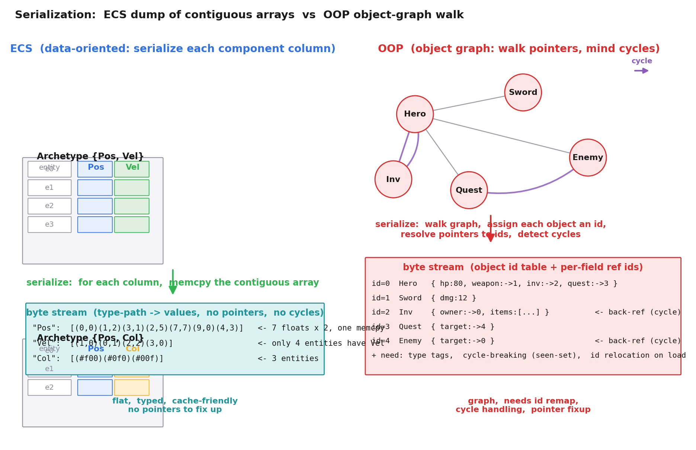
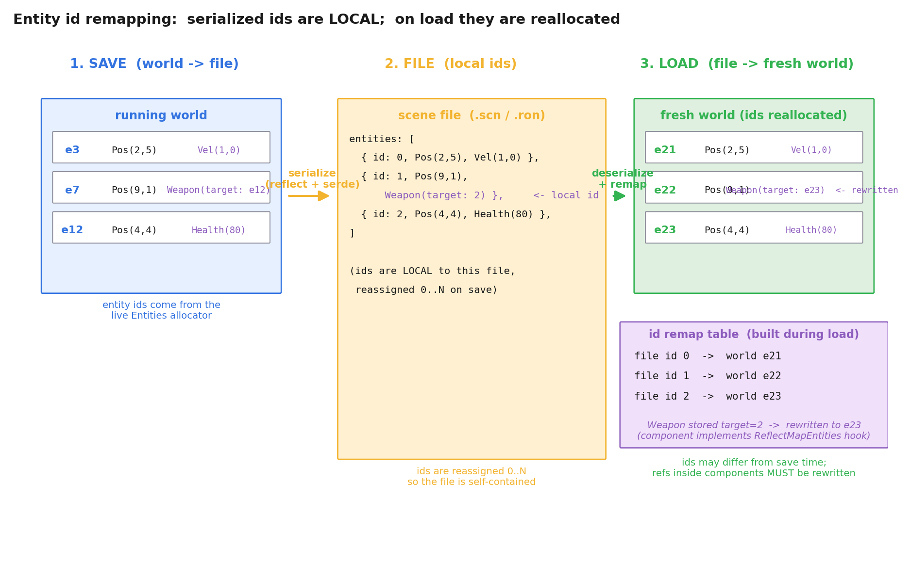

# 第 4 篇 · 第 16 章 · 序列化与场景持久化

> **核心问题**:前三篇讲的都是"每帧怎么把世界更新一遍"——ECS 三件套怎么组织数据、主循环怎么跑、资产怎么异步加载。可这一帧帧跑着的虚拟世界,有个最朴素的需求一直被我们跳过:**这个世界关掉再开,要能原样恢复**。玩家打到一半存档退出,明天再开,角色还在那个坐标、血量还是那么多、背包里的剑还在;编辑器里摆好的关卡,要能存成一个 `.scene` 文件,下次打开原样加载;多人游戏里服务器要把整个世界状态发给新进来的客户端——这三件事,本质都是同一件事:**把"当前的世界状态"序列化成字节流,存盘 / 传走 / 读回来**。本章要回答的核心问题就是:ECS 的组件数据,到底怎么存盘、怎么读盘?为什么 ECS 的数据布局,让序列化这件事比传统面向对象**天然友好得多**?读盘时那些藏在组件里的实体引用、资产句柄、老版本组件,怎么一个个收拾干净?

> **读完本章你会明白**:
> 1. 序列化的三大场景——**存档**(玩家进度)、**场景保存**(编辑器的 `.scene` 文件)、**网络同步**(把世界状态发给客户端)——本质都是"把世界状态拍扁成字节流",但侧重点不同。
> 2. ECS 的序列化**为什么天然友好**(承 P2-08):组件按类型连续存储,序列化就是 dump 连续数组;对比面向对象的**对象图序列化**——对象之间靠指针互相引用,要处理循环引用、指针重定位、类型信息,复杂度高一档。
> 3. 序列化的三大难点:① **Entity ID 重映射**(存盘时 id=5,读盘后可能变 id=21,组件里存的实体引用要跟着改)② **资产 Handle 不能存指针**(承 P4-13,要存成资产路径,读盘后由 AssetServer 重新加载)③ **组件版本兼容**(老存档读进新版本组件,字段增删怎么处理)。
> 4. ECS 要在**运行时**知道"一个组件有哪些字段、字段叫什么、是什么类型"——这靠**反射(reflect)**;Bevy 的序列化管线是 `具体值 → ReflectSerializer → RON/JSON → ReflectDeserializer → FromReflect → 具体值`。
> 5. 场景格式**文本(JSON/RON)vs 二进制**的取舍:文本可读可手改可 diff,二进制快小但不可读;以及一个本书要主动修正的事实——**Bevy 的场景系统在 0.19 经历了大重构**,老资料讲的 `DynamicScene` 在当前 master 已被全新的 `Scene` trait / `ScenePatch` 资产 / `bsn!` 宏取代,序列化的角色从"直接序列化组件 map"演变成了"序列化场景的资产表示"。

> **如果一读觉得太难**:先记四件事——① 序列化 = 把世界状态拍扁成字节流,三个场景(存档/场景/网络)本质一样;② ECS 因为组件按类型连续存,序列化就是 dump 连续数组,**天然比面向对象的对象图序列化友好**(没有指针、没有循环引用);③ 读盘时最大的坑是 **Entity ID 要重映射**(组件里存着别的实体的 id,读盘后这个 id 可能变了,要跟着改);④ 资产 Handle 不能存指针,**存成资产路径**(承 P4-13),读盘后 AssetServer 重新加载。

---

## 〇、一句话点破

> **ECS 的序列化之所以比面向对象友好,根在数据布局:组件按类型连续存储,序列化本质就是"对每条组件列,memcpy 一段连续内存";而面向对象的对象散落在堆上、靠指针互连,序列化得遍历整张对象图,还得处理循环引用、指针重定位、类型信息。代价是 ECS 多了三个特有的坑:Entity ID 读盘后要重映射(组件里存的实体引用得跟着改)、资产 Handle 要存成路径而非指针、组件要靠反射在运行时暴露字段信息——这三个坑收拾干净了,ECS 的序列化就比面向对象既快又简单。**

这是结论。本章倒过来拆:先看清"为什么序列化"的三个场景,再讲透 ECS 相对面向对象的序列化优势(承 P2-08 的连续布局),然后逐个攻破三大难点(ID 重映射、Handle、版本兼容),接着讲场景格式的文本/二进制取舍,最后用 Bevy 源码把整条管线钉死——并诚实交代 Bevy 0.19 场景系统的大重构,修正老资料里 `DynamicScene` 的过时印象。

> **承接书讲过**:本章核心的"连续内存 dump 比指针追逐快"——P2-06(SoA vs AoS)和 P2-08(Archetype 分组)已经讲透了**为什么连续布局遍历快**。本章**一句带过"连续 = 快"本身的原理**,只讲它在"序列化"这个新场景里兑现成什么(连续 dump vs 对象图遍历)。资产 Handle 的引用计数原理,P4-13 已经讲透,本章只讲"序列化时 Handle 怎么存"。想搞懂 SoA / Archetype 内存布局细节,见 P2-06 / P2-08;想搞懂 Handle / AssetServer 的运行时机制,见 P4-13。

---

## 一、为什么序列化:三个场景,同一件事

### 1.1 先把"序列化"这个词钉死

"序列化(serialize)"是个被滥用的词,先把它的含义钉死。**序列化 = 把内存里的结构化数据,转换成一段可以存盘 / 传输的线性字节流;反序列化(deserialize)是反过来,把字节流还原成内存里的结构化数据**。

```python
# 内存里: 一个对象(结构化, 字段分散在内存各处, 靠指针连)
hero = Hero(pos=(2,5), hp=80, sword=Sword(dmg=12))

# 序列化后: 一段字节流(线性, 可以存盘/传走)
b'\x02\x00\x00\x00\x05\x00\x00\x00\x50\x00\x00\x00\x0c...'   # 一串字节
# 或文本形式:
'{"pos":[2,5],"hp":80,"sword":{"dmg":12}}'
```

内存里的对象,字段可能散落在堆的不同位置,字段之间靠指针连;字节流是一维的、顺序的。序列化的本质,就是**把高维的、靠指针连的内存结构,拍扁成一维的、顺序的字节流**。反序列化反过来——读一段字节流,在内存里重建出原来的结构。

这听起来简单,但一旦对象之间互相引用(指针),事情就复杂了:这个指针指向的"另一个对象",在字节流里怎么表达?读回来怎么把"字节流里的引用"还原成"内存里的指针"?——这就是面向对象序列化的核心难题,我们后面详讲。

### 1.2 游戏引擎里,序列化的三个场景

游戏引擎里,序列化不是一件事,是三件表面不同、骨子里一样的事:

**场景一:存档(save / load)**。玩家打到一半,角色站在 (2,5),血量 80,背包里有把攻击力 12 的剑,任务进度做到第 3 章。玩家点"存档退出"。引擎要把**当前世界的状态**——所有实体的所有组件数据——拍扁存成一个文件。明天玩家点"继续游戏",引擎读这个文件,在内存里重建出昨天的世界:角色还站在 (2,5),血量还 80,剑还在,任务还在第 3 章。这就是存档。

存档的特点:**存的是"运行时状态"**——角色的当前坐标、当前血量、当前任务进度。这些是玩家操作积累下来的,不是设计时定好的。

**场景二:场景保存(.scene 文件)**。游戏开发阶段,策划在编辑器里摆了一个关卡:这里放一座山、那里放五个敌人、BOSS 站在房间深处、灯光调成暖色。摆好之后,**存成一个 `.scene` 文件**。下次打开编辑器加载这个 `.scene`,刚才摆的关卡原样出现。游戏打包发布时,这些 `.scene` 文件也打包进去,游戏运行时按需加载。

场景保存和存档的本质一样——都是"把世界状态存成文件"。但侧重点不同:**场景保存存的是"设计时内容"**(关卡怎么摆的),通常是静态的、开发阶段定的;**存档存的是"运行时状态"**(玩家玩到哪了),是动态的、玩家操作积累的。所以场景文件通常只存"实体 + 组件 + 资产引用",不存那些运行时算出来的临时状态(比如当前帧的动画进度、当前的物理速度)。

**场景三:网络同步**。多人游戏,服务器上跑着完整的世界。新客户端连进来,服务器要把**当前世界状态发给它**——地图上哪些实体、各自在哪、什么状态。这本质上也是序列化:服务器把世界状态拍扁成字节流,通过网络发给客户端;客户端收到字节流,在本地内存里重建出(它的视角下的)世界。

网络同步和前两个场景比,多了两个约束:① **带宽敏感**——字节流越小越好(不能每个包都发整个世界),所以网络同步通常只发"变化的部分"(delta),而且常用紧凑的二进制格式;② **实时性**——序列化/反序列化要快,不能卡住网络线程。但核心机制(把世界状态拍扁 / 还原)和前两个场景一样。

> **钉死这件事**:游戏引擎里的序列化,表面是三件事(存档 / 场景保存 / 网络同步),骨子里是同一件事——**把"当前世界状态"拍扁成字节流,存盘 / 传走 / 读回来**。三个场景的侧重点不同(存档存运行时状态、场景保存存设计时内容、网络同步发变化且要紧凑),但核心机制一致。本章主要用"场景保存"这个最典型的场景来讲(它涵盖了"存什么、怎么存、怎么读"的全部要点),顺带提存档和网络的差异。

### 1.3 那 ECS 出场之前:面向对象是怎么序列化的

要看清 ECS 序列化为什么友好,得先看它取代的面向对象是怎么序列化的——撞了什么墙。

面向对象组织游戏对象,世界就是一张**对象图(object graph)**:每个对象是一块内存,对象之间靠指针互相引用。Hero 持有一个指向 Sword 的指针,Sword 持有一个指向 Owner 的指针(指回 Hero),Inventory 也指着 Hero……指针四面八方,甚至成环(Hero 指 Inventory,Inventory 指 Hero——循环引用)。

把这张对象图序列化,得做四件麻烦事:

1. **遍历这张图**:从某个根对象(Hero)出发,沿着指针,深度优先或广度优先地走,把每个碰到的对象都序列化。可对象图里一个对象可能被多条路径引用(Hero 和 Inventory 都指向同一个 Sword),**得记住"这个 Sword 我序列化过没有"**,避免重复序列化——这叫**去重**,通常用一个"已序列化对象"的集合(seen-set)。
2. **处理循环引用**:Hero 指 Inventory,Inventory 又指回 Hero。深度优先走的时候,Hero → Inventory → Hero → Inventory……**无限循环**。靠 seen-set 检测"这个对象我正在序列化,跳过"来打破循环。
3. **把指针换成 id**:指针是内存地址(`0x7f3a...`),存进字节流没意义——读回来时内存布局完全不同,这个地址是别人的。所以序列化时,给每个对象分配一个**文件内的 id**(0, 1, 2...),指针在字节流里写成"指向 id=3 的对象"。
4. **读回来时重建指针**:反序列化时,先按 id 把所有对象建出来(这时候它们之间的指针还是空的),然后**第二趟**遍历,把每个对象字段里的"指向 id=3"还原成"指向内存里那个对象的指针"。这叫 **pointer fixup**(指针修正)。

这四件事——遍历图、处理循环、id 替换、pointer fixup——每一个都是面向对象序列化的固有复杂度。Java 的内置序列化、Python 的 pickle、C++ 的 boost::serialization,核心都在处理这堆事。

> **不这样会怎样**:如果你用面向对象组织游戏对象,要做存档,就得处理这一整套对象图序列化的复杂度:遍历图、seen-set 去重、循环引用检测、id 分配、pointer fixup。对象越多、引用越密(尤其是循环),这套机制越复杂、越慢、越容易出 bug(漏掉一个对象、循环引用爆栈、pointer fixup 写错指向野指针)。这是面向对象组织数据带来的**序列化税**。

### 1.4 ECS 的答案预告:组件连续,没有指针图

铺垫到这里,ECS 的优势就呼之欲出了。ECS 把面向对象"数据 + 行为绑一个对象、对象之间靠指针连"的模型,拆成了**三件套**(承 P2-05):Entity 是个 id、Component 是纯数据(按类型连续存)、System 是纯行为。

关键在 **Component 怎么存**。承 P2-08 讲透的:**组件按类型连续存储,每种组件类型的所有实例,在 Archetype table 里排成一条连续数组**(列 = 组件类型,行 = 实体,行号对齐)。

这意味着:**ECS 的世界里,根本没有"对象图"这回事**。Position 组件不持有"指向 Velocity 组件的指针"——它们只是躺在各自的列数组里,靠"行号相同"对齐到同一个实体。一个组件不知道也不关心别的组件在内存的哪里。**组件之间没有指针,只有"我在哪张 table 的第几行"这个元信息**。

没有指针图,序列化就简单多了:**对每张 archetype table 的每一列,把这条连续数组 dump 成字节**。不用遍历图、不用 seen-set、不用处理循环引用、不用 pointer fixup——**因为本来就没有指针**。这是 ECS 序列化友好的根。

> **钉死这件事**:面向对象序列化之所以复杂,根因是它用"对象图"组织数据——对象之间靠指针互连,序列化得遍历图、处理循环、替换指针为 id、读回来 fixup 指针。ECS 把这个根因铲掉了——**组件按类型连续存储,组件之间没有指针,只有"在 table 第几行"的元信息**。所以 ECS 序列化没有"对象图"这层复杂度,本质就是 dump 连续数组。承 P2-08:连续布局不只让遍历快,还让序列化简单——这是数据导向设计的又一收益。

---

## 二、ECS 的序列化优势:连续布局 = 天然序列化友好

### 2.1 直观对比:两种序列化的访问模式

把两种序列化并排看,差距一目了然。



左边 ECS:世界是几张 archetype table,序列化就是"对每张 table 的每一列,memcpy 这条连续数组"。Position 列是一条连续的 float 数组,dump;Velocity 列也是,dump;Health 列也是,dump。每条 dump 都是**连续内存的顺序拷贝**——承 P2-06 讲的,这是 CPU 最爱的访问模式(缓存全命中、prefetcher 满速、甚至可以 SIMD 批量)。而且 dump 出来的字节流是**扁平的、带类型的**:这块是 Position 的 7 个值,那块是 Velocity 的 4 个值,没有指针、没有循环、没有 id 表。

右边面向对象:世界是一张对象图,Hero 指着 Sword、Inventory 指回 Hero(循环)、Enemy 指着 Hero、Quest 指着 Enemy(又一个循环)。序列化得遍历这张图,给每个对象分配 id,把指针换成"指向 id=N",还得用 seen-set 检测循环。dump 出来的字节流里有个 **id 表 + 每个对象字段里嵌着 ref id**,读回来还得做 pointer fixup。

> **钉死这件事**:两种序列化的访问模式根本不同。ECS = **对每条组件列,memcpy 连续数组**(扁平、顺序、无指针);OOP = **遍历对象图,分配 id,替换指针,检测循环**(图遍历、有指针、有循环)。前者是 CPU 友好的顺序 IO,后者是缓存不友好的指针追逐 + 一堆额外机制。这就是 P2-08 讲的"连续布局"在序列化场景的兑现——**数据布局决定序列化的复杂度和速度**。

### 2.2 序列化的速度:连续 dump vs 图遍历

承 P2-06/P2-08 已经讲透:**连续内存访问比指针追逐快几十倍**(缓存命中 vs 缓存未命中、prefetcher 能不能预取)。这个原理在序列化场景完全成立。

ECS 序列化时,引擎遍历每张 archetype table,对每一列:

```python
for archetype in world.archetypes():
    for column in archetype.columns():
        # column.data 是一条连续数组, 直接 memcpy 到输出字节流
        output.write_bytes(column.data)   # 连续, 顺序, CPU 飞快
```

这是一段**纯顺序 IO**。CPU 顺序读连续内存,缓存全命中、prefetcher 满速;甚至可以用 SIMD 一次拷贝 16/32 字节。几万个实体的几千条列,dump 完可能只要几毫秒。

面向对象序列化时,引擎遍历对象图:

```python
seen = set()
def serialize(obj):
    if id(obj) in seen: return ref_id(id(obj))   # 循环检测
    seen.add(id(obj))
    file_id = allocate_id()
    for field in obj.fields:
        if is_pointer(field):
            serialize(field.value)               # 递归, 可能爆栈, 指针追逐
        else:
            write(field.value)
```

每个对象散落在堆的不同位置,访问它要**指针追逐**(缓存未命中)。而且要维护 seen-set(每次查"这个对象序列化过没")、分配 file id、递归遍历(可能爆栈)。这套机制的开销,在几千个对象时已经显现,几万个对象时和 ECS 的差距能到几十倍。

> **承 P2-06/P2-08**:连续内存 vs 指针追逐的速度差,P2-06(SoA vs AoS)和 P2-07(System 遍历的缓存友好)已经讲透。序列化只是这个原理的又一个应用场景——**同样的连续布局,既让 System 每帧遍历快(P2-07),又让序列化一次性 dump 快(本章)**。数据导向设计的收益是全方位的,不是只服务于"每帧更新"这一个场景。

### 2.3 反序列化的速度:连续 read vs 两趟 fixup

序列化快还不够,反序列化(读盘)也要快——毕竟玩家"读档"时,不希望等十秒。

ECS 的反序列化同样简单:**读字节流,按类型,把每条组件列的数据 memcpy 回连续数组**。Position 列的字节,memcpy 进 Position 的 Vec;Velocity 列的字节,memcpy 进 Velocity 的 Vec。还是纯顺序 IO,还是缓存友好。

面向对象的反序列化更慢,因为它要**两趟**:第一趟,读字节流,把所有对象按 id 建出来(这时候字段里的指针还都是空的);第二趟,再扫一遍,把每个字段里"指向 id=N"还原成"指向内存里那个对象的指针"——pointer fixup。这两趟都是指针追逐(对象散落在堆上),都缓存不友好。

> **不这样会怎样**:如果用面向对象组织游戏对象,几千个对象的关卡读盘,两趟指针追逐 + fixup,可能要几百毫秒到几秒(尤其对象在堆上散落时)。ECS 的连续布局让读盘就是连续 memcpy,几万组件几十毫秒搞定。这是为什么大型开放世界游戏(动辄几十万个实体)普遍转向 ECS——读盘速度是玩家体验的硬指标。

### 2.4 但 ECS 序列化也不是"零代价":三个特有的坑

讲到这里,读者可能以为 ECS 序列化就是"无脑 memcpy 连续数组",完美无瑕。不是。ECS 的连续布局消除了"对象图"这层复杂度,但引出了三个**面向对象没有的、ECS 特有的坑**:

1. **Entity ID 重映射**:组件里可能存着"别的实体的 id"(比如 `Weapon` 组件存着 `target: Entity`,指向攻击目标)。存盘时这个 id 是世界里的真 id(比如 e12),读盘后世界重新分配 id,这个 e12 可能变成了 e23——**组件里存的 id 得跟着改**。
2. **资产 Handle 不能存指针**(承 P4-13):`Sprite` 组件的 `texture: Handle<Image>`,这个 Handle 内部是个轻量 id,指向 AssetServer 缓存里的那份 30MB 贴图。存盘时这个 id 是当前进程的,没意义;**要存成资产路径**(`"sprites/hero.png"`),读盘后由 AssetServer 重新加载。
3. **运行时怎么知道组件有哪些字段**:面向对象的序列化,编译器知道每个类的字段(类型系统在编译期);ECS 的组件要在运行时被"通用地"序列化(引擎不能为每种组件写专门的序列化代码),得有个机制让引擎**运行时知道"这个组件有哪些字段、字段叫什么、什么类型"**——这就是**反射(reflect)**。

这三个坑,是本章剩下的核心内容。我们逐个拆。

---

## 三、难点一:Entity ID 重映射

### 3.1 问题:存盘时的 id,读盘后可能不一样

承 P2-05 讲过,Entity 是个 id,由世界的 `Entities` 分配器分配。世界运行时,id 是连续分配的:第一个实体 e0,第二个 e1……但实体会被销毁(敌人被打死、子弹消失),销毁后这个 id 会被**回收复用**(承 P2-05 的 version 机制)。

现在看序列化场景。玩家存档时,世界里的实体 id 可能是 e3、e7、e12(中间的 e0/e1/e2/e4/e5... 已经销毁回收了,或者正在被别的事用)。这些 id 是**当前这个进程、当前这次运行**的产物。

读盘时,会发生什么?你要在一个**新的、空的**世界里重建这些实体。新世界的 `Entities` 分配器从 e0 开始分配——所以"存盘时的 e3",读盘后**可能变成 e0**(如果新世界是空的,第一个 spawn 的就是 e0);如果读盘时新世界已经有 20 个实体了,那存盘时的 e3 可能变成 e21。

这就是 **Entity ID 重映射**:存盘时的实体 id,和读盘后的实体 id,**数值上不一样**。

### 3.2 坑:组件里存着"别的实体的 id",要跟着改

如果组件里只存自己的数据(Position、Health),id 重映射无所谓——引擎读盘时给每个实体分配新 id 就行,组件数据和 id 没关系。

但很多组件**存着别的实体的 id**:

```rust
#[derive(Component)]
struct Weapon {
    target: Entity,   // 攻击目标, 是另一个实体的 id
}

#[derive(Component)]
struct Parent {
    entity: Entity,   // 父节点(场景图里), 是另一个实体的 id
}

#[derive(Component)]
struct Follow {
    target: Entity,   // 跟随的目标
}
```

这些组件里存的 `Entity`,是**别的实体的 id**。存盘时,`Weapon.target = e12`(存盘那个世界里,目标实体的 id 是 e12)。读盘后,这个 e12 在新世界里可能变成了 e23——**组件里存的 e12 是错的,得改成 e23**。



### 3.3 解决:存盘时重新分配"文件内 id",读盘时建映射表

标准做法分两步:

**存盘时**:别直接存世界里的真 id(它和当前进程耦合)。而是**在序列化过程中,给每个实体重新分配一个"文件内的局部 id"**(0, 1, 2, ..., N-1,按序列化顺序)。存盘时,组件里存的 `target: e12`,查一下 e12 在文件里是几号——假设是 2 号——就存 `target: 2`。这样字节流里的 id 都是 0..N 的局部 id,自包含,和存盘那个进程的内存状态无关。

**读盘时**:读字节流,逐个建实体。第一个实体(文件 id=0),新世界给它分配一个真 id(假设 e21);第二个(文件 id=1),分配 e22;第三个(文件 id=2),分配 e23……**一边建,一边记一张映射表**:`file_id 0 -> e21, file_id 1 -> e22, file_id 2 -> e23`。

实体全建完之后,**第二趟**:扫每个组件,如果组件里有 `Entity` 类型的字段(存着文件 id),用映射表把它改成新世界的真 id。`Weapon.target = 2` → 查映射表 → `2 -> e23` → 改成 `Weapon.target = e23`。

### 3.4 第二趟怎么知道组件里哪些字段是 Entity:ReflectMapEntities

第二趟要"扫组件,改 Entity 字段",可组件有几十种,每种字段不同,引擎不可能为每种组件写专门的代码。这里就要靠**反射**——引擎运行时能知道"这个组件有哪些字段、哪些字段是 Entity 类型"。

Bevy 的做法是给组件加一个 type data 叫 **`ReflectMapEntities`**——组件声明"我知道怎么把自己的 Entity 字段映射成新 id",注册成反射 type data。读盘第二趟,引擎对每个组件查它的 `ReflectMapEntities`,如果有,就调它的 `map_entities` 钩子,把组件里的 Entity 字段都改掉。

```rust
// 简化示意(突出机制, 非源码原文):
// 组件 Weapon 声明: 我有一个 Entity 字段, 读盘时请帮我重映射
#[derive(Component, Reflect)]
#[reflect(MapEntities)]
struct Weapon {
    target: Entity,
}

impl MapEntities for Weapon {
    fn map_entities<M: EntityMapper>(&mut self, entity_mapper: &mut M) {
        // 把 self.target(文件内的旧 id) 映射成新世界的真 id
        self.target = entity_mapper.map_entity(self.target);
    }
}
```

读盘时,引擎对每个有 `ReflectMapEntities` 的组件调它的 `map_entities`,组件自己负责把自己的 Entity 字段映射掉。引擎不需要知道 Weapon 长什么样——它只要知道"这个组件实现了 MapEntities,调它的钩子"。

> **钉死这件事**:Entity ID 重映射是 ECS 序列化特有的坑(面向对象用指针,指针在 fixup 时统一处理,没有"id 数值变了"这回事)。解决分两步:① 存盘时把世界真 id 换成文件内局部 id(0..N),让字节流自包含 ② 读盘时建"文件 id -> 新世界真 id"的映射表,然后第二趟扫组件,用反射钩子(Bevy 的 `ReflectMapEntities`)把组件里的 Entity 字段改掉。组件声明"我有哪些 Entity 字段",引擎统一调度——这是反射在序列化里的第一个关键用途。

---

## 四、难点二:资产 Handle 不能存指针(承 P4-13)

### 4.1 复习:Handle 是什么,为什么不能直接存

承 P4-13 讲透:**资产(贴图、模型、动画)是大块数据,引擎用 `AssetServer` + `Assets<T>` 全局缓存 + `Handle<T>` 句柄三件套管理**。组件不直接持有几十 MB 的资产数据,而是持有一个轻量的 `Handle<T>`(内部就是个 id),要用数据时去全局缓存查。

序列化时,问题来了:`Sprite.texture = Handle<Image>`,这个 Handle 内部是个 id(比如 `AssetId(0xabc123)`),指向当前进程 `Assets<Image>` 缓存里的某份贴图。**这个 id 是当前进程的产物**,存进字节流没意义——读盘后是新进程,缓存里那个 id 指向的可能是完全不同的贴图,甚至根本不存在。

直接存 Handle 的内部 id 不行,那存什么?**存资产路径**。Handle 指向的那份贴图,是从 `"sprites/hero.png"` 这个路径加载来的。把这个路径存进字节流——读盘时,引擎拿这个路径,找 `AssetServer` 说"给我加载 `sprites/hero.png`",AssetServer 异步加载(P4-13 的流水线),加载完返回一个**新进程里的 Handle**,赋给 `Sprite.texture`。

### 4.2 序列化时 Handle 怎么表达

具体来说,序列化时,遇到组件里的 Handle 字段,要做两件事:

1. **查这个 Handle 对应的资产路径**。`AssetServer` 维护着"Handle -> AssetPath"的反向映射(或者 Handle 本身就携带路径信息)。序列化时,查出 `Handle<Image>(0xabc123)` 对应的路径是 `"sprites/hero.png"`。
2. **在字节流里存路径,不存 Handle 的内部 id**。字节流里,这个字段写成 `"sprites/hero.png"`(字符串),而不是 `0xabc123`(进程内的 id)。

反序列化时反过来:

1. 读字节流,遇到 Handle 字段,读到的是个路径字符串 `"sprites/hero.png"`。
2. 调 `AssetServer::load("sprites/hero.png")`,异步加载这份资产(P4-13 的流水线:排队 → 后台 IO 读字节 → 解码 → GPU 上传)。
3. 加载完成,拿到一个**新进程里的 Handle**,赋给组件的 texture 字段。

注意这里有个**异步**问题:反序列化是同步的(读字节流、建实体),但资产加载是异步的(几十毫秒后才完成)。所以反序列化时,组件拿到的 Handle 可能是个"还没加载完"的 Handle(承 P4-13,Handle 有几种状态:`Loading`、`Loaded`、`Failed`)。System 用这个 Handle 时,要检查资产加载完了没(P4-13 讲的 `Assets::get` 返回 `Option`,None 表示还没加载完)。这是序列化和资产管理交织的地方。

> **承 P4-13**:Handle 的"引用计数""异步加载""依赖图"机制,P4-13 已经讲透。本章只讲**序列化时 Handle 怎么存**——存成资产路径,读盘后由 AssetServer 重新加载。这条铁律:**任何跨进程的引用(Handle、Entity、指针),都不能存"当前进程的内存产物",要存成"自描述的标识"(路径、文件内 id),读盘后在新进程里重建**。Entity ID 重映射(存文件内 id)、Handle 存路径,都是这条铁律的体现。

### 4.3 一个细节:嵌套资产的依赖

承 P4-13 的"资产依赖图"——一个资产可能引用别的资产(一个 glTF 模型引用几张贴图 + 骨骼 + 动画)。序列化组件里的 Handle 时,只存这个 Handle 的路径;读盘时 AssetServer 加载这个路径的资产,会**递归加载它的依赖**(P4-13 的 `LoadedWithDependencies` 状态)。所以序列化时不用操心"这个 Handle 依赖的别的资产要不要也存"——只要 Handle 存成路径,AssetServer 读盘时会自动把整个依赖树加载进来。

---

## 五、难点三:运行时类型信息——反射(reflect)

### 5.1 问题:引擎怎么"通用地"序列化任意组件

前面讲 Entity 重映射时,提到"引擎用反射钩子调组件的 map_entities"。这里要把"反射"这个概念讲透,因为它是 ECS 序列化的地基。

问题是这样的:ECS 的组件类型有几十上百种(Position、Velocity、Health、Weapon、Camera、Sprite……),每种字段不同。序列化时,引擎要**通用地**遍历任意组件的所有字段、把每个字段序列化。可引擎不可能为每种组件写专门的代码(几十种 × 两个方向 × 维护成本)——它要一套**通用机制**:`serialize(component: &dyn SomeTrait)` 能序列化任意组件,不用知道它的具体类型。

这就要求:**运行时,引擎能知道"这个组件有哪些字段、每个字段叫什么名字、什么类型"**。

在面向对象里,这通常靠"每个类手写 `serialize`/`deserialize` 方法"(Java 的 `Serializable`、Python 的 `__getstate__`)。但 ECS 想要更通用的:组件只声明数据结构,序列化逻辑由引擎统一提供——这要求引擎**运行时拿到组件的字段布局**。

### 5.2 反射:运行时拿到类型的字段布局

这个机制叫**反射(reflection)**。Bevy 的 `bevy_reflect` crate 提供了完整的反射系统:

```rust
#[derive(Component, Reflect)]   // 派生 Reflect, 引擎运行时能"看进"这个结构
struct Health {
    max: i32,
    now: i32,
}
```

`#[derive(Reflect)]` 让 `Health` 在运行时自带一份**类型信息**——它的字段名(`max`、`now`)、字段类型(都是 `i32`)、字段在内存里的偏移。引擎拿到一个 `&dyn Reflect`(类型擦除的组件引用),能:

- 问它"你是什么类型"(类型路径 `"my_game::Health"`)
- 问它"你有哪些字段,每个字段叫什么、什么类型"
- 遍历它的字段,逐个读 / 写

有了反射,序列化就通用化了:

```python
# 伪代码: 通用地序列化任意组件
def serialize_component(comp: &dyn Reflect):
    type_path = comp.type_path()           # "my_game::Health"
    fields = comp.fields()                 # [("max", i32), ("now", i32)]
    write('"' + type_path + '": {')
    for name, value in fields:
        write(f'"{name}": {serialize_value(value)}')
    write('}')
```

不管组件是 Health、Weapon 还是 Camera,引擎都用这一套逻辑序列化——靠反射拿到字段布局,逐字段序列化。

### 5.3 TypeRegistry:运行时"我认识哪些类型"

反射还有一半:光知道一个组件的字段布局不够,**反序列化**时还得"根据类型路径,找到对应的类型、把它构造出来"。比如字节流里写着 `"my_game::Health": {max:100, now:80}`,反序列化读到 `"my_game::Health"`,得知道"哦,这是 Health 类型,我知道怎么构造它"。

这个"运行时认识哪些类型"的登记表,叫 **TypeRegistry**。游戏启动时,把所有可序列化的组件类型注册进去:

```rust
// 启动时注册(简化示意):
app.register_type::<Health>();
app.register_type::<Weapon>();
app.register_type::<Camera>();
// ... 每种要序列化的组件都注册
```

注册之后,TypeRegistry 就是一张"类型路径 -> 类型信息 + 构造函数 + 各种 type data"的表。反序列化时,读到一个类型路径,查这张表,拿到类型的构造信息,把字节流里的字段值填进去,构造出组件实例。

> **钉死这件事**:ECS 要"通用地"序列化任意组件,得在运行时拿到组件的字段布局——这靠**反射**(`#[derive(Reflect)]` 让组件自带类型信息)。还要在反序列化时"根据类型路径构造组件"——这靠 **TypeRegistry**(启动时注册所有可序列化组件,运行时按类型路径查构造信息)。反射 + TypeRegistry 是 ECS 序列化的地基:组件只声明数据结构,序列化/反序列化逻辑由引擎基于反射统一提供。Bevy 的这套在 `bevy_reflect` crate,后面源码精解详讲。

### 5.4 反射序列化的输出格式:类型路径 -> 值

基于反射的序列化,输出有个特点:**字节流里,每个值都带"类型路径"**。比如 Health 组件,序列化出来长这样(以 RON 格式为例):

```ron
"my_game::Health": (
    max: 100,
    now: 80,
)
```

注意 key 是 `"my_game::Health"`(类型路径)——这是个**带类型的序列化格式**。反序列化时,读到这个 key,查 TypeRegistry,知道要构造 Health;读到值 `(max:100, now:80)`,按 Health 的字段布局填进去。

为什么 key 是类型路径?因为反射序列化要支持**多态反序列化**:字节流里可能有任意类型的值,反序列化时引擎不知道下一个值是什么类型——靠"类型路径"自描述。读到 key 就知道类型,查 TypeRegistry 构造。这和 JSON 那种"无类型"格式不同——JSON 序列化 `{"max":100}` 时,反序列化端得自己知道这是 Health,反射序列化让字节流自带类型信息。

> **钉死这件事**:基于反射的序列化,输出格式是"**类型路径 -> 值**"的映射,每个值自带类型信息。这让反序列化能处理多态(字节流里有任意类型,靠 key 自描述)。代价是字节流稍大(每个值都带类型路径字符串),换来的是完全通用、不需要为每种类型写专门代码。

---

## 六、组件版本兼容:老存档读进新版本

### 6.1 问题:组件加了个字段,老存档怎么办

游戏更新了版本,`Health` 组件从 `{max, now}` 变成了 `{max, now, regen_rate}`(加了个回血速度字段)。玩家用旧版本的存档(`{max:100, now:80}`,没有 regen_rate)读到新版本,怎么办?

朴素做法会出错:反序列化时,引擎按新 Health 的字段布局读,期待 max、now、regen_rate 三个字段,可字节流里只有 max、now——缺 regen_rate,要么报错,要么 regen_rate 是垃圾值。

### 6.2 解决:默认值 + 字段可选

标准做法是给新字段**默认值**:

```rust
#[derive(Component, Reflect)]
struct Health {
    max: i32,
    now: i32,
    #[reflect(default = "default_regen_rate")]   // 老存档没这字段, 用默认值
    regen_rate: f32,
}

fn default_regen_rate() -> f32 { 1.0 }
```

反序列化时,如果字节流里没有 regen_rate 字段,引擎用 `default_regen_rate()` 给它填个 1.0。这样老存档能读进新组件,新字段有合理默认。

字段被删除(老存档有,新组件没有)的情况,反序列化时直接忽略那个多余的字段——字节流里的值读出来丢掉就行。

这个机制叫 **schema evolution**(模式演进)——组件结构随版本变化,但存档/场景文件能跨版本兼容。它的核心是:**反序列化时,容错地处理"字段多/少"的情况,缺的字段用默认值,多的字段忽略**。承《数据库内核》的读者会联想到 schema 迁移——本质思想一致,游戏引擎这里靠反射 + 默认值实现轻量版。

> **钉死这件事**:组件版本兼容的核心是 **schema evolution**——新版本加字段给默认值(`#[reflect(default = "...")]`),删字段反序列化时忽略。这套机制让老存档能读进新版本游戏,是长生命周期游戏(持续更新)的必需品。承《数据库内核》系列:数据库的 schema 迁移是同一思想在另一领域的落地,这里不重讲。

---

## 七、场景格式:文本 vs 二进制

### 7.1 两种格式,各有取舍

讲完序列化的机制,落到"存成什么格式的文件"。主流两种:

**文本格式(JSON / RON / YAML / TOML)**:字节流是人类可读的文本。

```ron
// RON(Rusty Object Notation)示例, Bevy 常用
(
    entities: {
        0: (  // Hero
            Transform((0.0, 0.0, 0.0), (0.0, 0.0, 0.0, 1.0), (1.0, 1.0, 1.0)),
            Health(100, 80),
            Sprite("sprites/hero.png"),
        ),
        1: (  // Sword
            Transform((1.0, 0.0, 0.0), (0.0, 0.0, 0.0, 1.0), (1.0, 1.0, 1.0)),
            Weapon(12, target: 0),   // target=0 是文件内局部 id
        ),
    },
)
```

文本格式的优点:① **人类可读**——开发者能直接打开 `.scene` 文件看内容、手改、grep;② **可 diff**——版本控制(git)里能看场景文件改了什么,代码 review 友好;③ **自描述**——不依赖外部 schema 就能读懂。缺点:① **大**——文本比二进制占空间(一个 float `1.0` 文本 3 字节,二进制 4 字节;但更糟的是字段名重复,每个实体都写一遍 `Transform`);② **慢**——解析文本(词法、语法)比解析二进制慢。

**二进制格式(postcard / bincode / 自定义)**:字节流是紧凑的二进制。

```
0x48 0x65 0x61 0x6c 0x74 0x68 0x00 0x00 0x00 0x64 0x00 0x00 0x00 0x50 ...
 "H"  "e"  "a"  "l"  "t"  "h"   max=100(小端)         now=80
```

二进制的优点:① **小**——紧凑,没有字段名重复;② **快**——解析就是 memcpy,不用词法语法。缺点:① **不可读**——打开是乱码,调试困难;② **不可 diff**——git 里看不出改了什么;③ **脆弱**——格式定义一变,老文件就读不了(版本兼容更难)。

### 7.2 怎么选:看场景

| 场景 | 推荐格式 | 理由 |
|------|---------|------|
| 编辑器存的 `.scene` | **文本(RON)** | 开发阶段频繁手改、diff、review;大小不敏感(开发机有空间) |
| 发布版打包的内置场景 | **二进制** | 玩家机器上加载要快、文件要小;不需要可读 |
| 玩家存档 | **二进制**(加密) | 玩家不应该手改存档(作弊);加载要快 |
| 网络同步 | **二进制** | 带宽敏感,越小越好 |

经验法则:**开发阶段用文本(可读可改),发布阶段转二进制(快小)**。很多引擎支持"开发时存文本,打包时自动转二进制"——两套格式,同一份序列化逻辑(只换最后的 serializer)。

### 7.3 Bevy 的选择:RON + serde

Bevy 默认场景格式是 **RON**(Rusty Object Notation),一种为 Rust 对象设计的文本格式(比 JSON 更适合 Rust 的 enum、tuple struct 等)。序列化通过 **serde**(`#[derive(serde::Serialize, serde::Deserialize)]`)+ reflect 的桥接完成。二进制格式靠 `postcard` crate(serde 的二进制 backend)。

注意 Bevy 的序列化要开 `serialize` feature(ECS、reflect、scene 各有 serde 支持,默认不开,按需启用)——这是 Rust 生态的惯例,把序列化能力做成可选 feature,不用的项目不付编译时间和二进制体积的代价。

---

## 八、源码精解:Bevy 的 reflect serde 管线 + Scene 演进

讲透原理,现在用源码钉死。我们看 Bevy 的两块:**① reflect 的 serde 管线**(序列化的地基)② Scene 系统的演进**(0.19 的大重构,本书要修正总纲印象)**。

### 8.1 reflect 的 serde 管线:具体值 ↔ 字节流

承第五节讲的,反射序列化的核心是 `具体值 → ReflectSerializer → RON/JSON → ReflectDeserializer → Box<dyn PartialReflect> → FromReflect → 具体值`。这条管线在 `crates/bevy_reflect/src/serde/`(基于 GitHub bevyengine/bevy):

```
bevy_reflect/src/serde/
├── ser/                 # 序列化端(Reflect -> 字节流)
│   ├── serializer.rs    # ReflectSerializer: 遍历 Reflect 的字段, 逐个序列化
│   ├── structs.rs       # 处理 struct 类型(命名字段)
│   ├── tuple_structs.rs # 处理 tuple struct(位置字段)
│   ├── enums.rs         # 处理 enum
│   ├── arrays.rs / lists.rs / maps.rs / sets.rs  # 处理容器类型
│   └── serialize_with_registry.rs  # 带 TypeRegistry 的序列化(带类型路径)
└── de/                  # 反序列化端(字节流 -> Reflect)
    ├── deserializer.rs  # ReflectDeserializer: 按类型路径查 registry, 构造具体类型
    ├── structs.rs / tuple_structs.rs / enums.rs / ...
    └── deserialize_with_registry.rs
```

序列化端的入口 `ReflectSerializer`(ser/serializer.rs):拿到一个 `&dyn PartialReflect`,根据它的种类(struct / tuple struct / enum / array / ...),调对应的子序列化器。对于 struct,遍历它的字段(靠反射拿到的字段布局),逐个序列化;每个字段的类型路径从 TypeRegistry 查,写到字节流的 key 里。输出就是"类型路径 -> 值"的映射(承第五节讲的格式)。

反序列化端的入口 `ReflectDeserializer`(de/deserializer.rs):读字节流,先读 key(类型路径),拿这个路径查 TypeRegistry,拿到类型的构造信息 + 反序列化器;然后用对应的反序列化器,读字段值,构造出一个 `Box<dyn PartialReflect>`(动态的、类型擦除的值);最后靠 `FromReflect` trait,把这个动态值转回具体类型(`Health`、`Weapon`)。

```rust
// 简化示意(突出机制, 非源码原文):
// 序列化: 具体值 -> ReflectSerializer -> RON
let serializer = ReflectSerializer::new(&health, &type_registry);
let ron_string = ron::to_string_pretty(&serializer, pretty_config)?;

// 反序列化: RON -> ReflectDeserializer -> Box<dyn PartialReflect> -> FromReflect -> 具体值
let mut deserializer = ron::Deserializer::from_str(&ron_string)?;
let dynamic = ReflectDeserializer::new(&type_registry).deserialize(&mut deserializer)?;
let health: Health = <Health as FromReflect>::from_reflect(&dynamic).unwrap();
```

这条管线的精妙在于:**两端都不依赖具体类型**。`ReflectSerializer::new` 接收 `&dyn PartialReflect`,任何实现了 Reflect 的类型都能传;`ReflectDeserializer::deserialize` 返回 `Box<dyn PartialReflect>`,反序列化时引擎不知道也不需要知道具体是什么类型——全靠 TypeRegistry 查。这让序列化逻辑完全通用化,加新组件类型只要 `#[derive(Reflect)]` + 注册到 registry,不用改引擎任何序列化代码。

### 8.2 Entity ID 重映射的落地:ReflectMapEntities

承第三节讲的 Entity ID 重映射,Bevy 用 `ReflectMapEntities` type data(基于 GitHub bevyengine/bevy)。组件声明 `#[reflect(MapEntities)]` 并实现 `MapEntities` trait:

```rust
// 简化示意(突出机制):
#[derive(Component, Reflect)]
#[reflect(MapEntities)]   // 注册 ReflectMapEntities type data
struct Weapon {
    target: Entity,
}

impl MapEntities for Weapon {
    fn map_entities(&mut self, mapper: &mut impl EntityMapper) {
        self.target = mapper.map_entity(self.target);
    }
}
```

读盘第二趟,引擎对每个有 `ReflectMapEntities` 的组件,从 TypeRegistry 拿到它的 type data,调 `map_entities`。`EntityMapper` 维护着"文件 id -> 新世界真 id"的映射表(承第三节),`map_entity(file_id)` 返回新世界的真 id。组件自己负责把所有 Entity 字段映射掉——引擎不关心 Weapon 有几个 Entity 字段、叫什么,只管调钩子。

这是反射的第二个关键用途(第一个是通用序列化):**让引擎在不知道组件具体结构的情况下,调用组件提供的"自定义处理逻辑"**。`ReflectMapEntities` 是其中一种 type data,Bevy 还有 `ReflectComponent`(动态读写组件)、`ReflectBundle`(动态插入 bundle)、`ReflectResource`(动态访问资源)等——都是用 type data 让引擎通用调度组件特定逻辑。

### 8.3 ★修正总纲印象:Bevy 0.19 的场景系统大重构

讲到这里,有个**必须诚实交代**的事实——Bevy 的场景系统在 0.19 版本经历了一次**大重构**,本书总纲和老资料里"DynamicScene 直接序列化组件 map"的印象,**在当前 master 已经过时**。

**老的设计(0.18 及之前)**:Bevy 有个 `DynamicScene` 类型,它直接持有一个"实体列表 + 每实体的组件 map"。序列化场景就是把这个 DynamicScene 用 reflect serde 序列化;反序列化就是读回来重建 DynamicScene,然后 spawn 进世界。`DynamicSceneBuilder::from_world(&world)` 可以从当前世界抽取出一个 DynamicScene。这套设计的思路是直接的:**场景 = 序列化友好的组件快照**。

**新的设计(0.19,master)**:Bevy 把场景系统重构成一套 **trait-based 的抽象**。核心类型变成了:

- **`Scene` trait**(crates/bevy_scene/src/scene.rs):描述"一个实体被 spawn 时应该长什么样"。它有个 `resolve` 方法,把自己"贡献"到一个 `ResolvedScene` 上。Scene 是可组合的——几个 Scene 可以拼成一个,可以 patch(部分覆写)。
- **`SceneList` trait**:多个根实体的列表(对应"spawn 出 N 个实体")。
- **`ResolvedScene`**(resolved_scene.rs):Scene 被 resolve 后的产物,真正存了实体的组件数据。
- **`ScenePatch` / `SceneListPatch`**(scene_patch.rs):**资产类型**(`#[derive(Asset)]`),持有 Scene + 依赖 + resolved 结果。这才是**序列化和存盘的对象**——一个 `.scn` 文件反序列化成一个 `ScenePatch` 资产。
- **`bsn!` 宏**(Bevy Scene Notation):0.19 的招牌特性,声明式宏,用类似代码的语法写场景,宏展开成 Scene 组合。

这套新设计的思路是:**场景不再是"组件快照",而是"描述如何构建实体的可组合抽象"**。`Scene` 是个 trait,可以有各种实现:一个 `bsn!` 展开的场景、一个从文件加载的 `ScenePatch`、一个程序化构造的场景函数……它们都能 `resolve` 成 `ResolvedScene`,然后 spawn 进世界。序列化的对象从"组件 map"变成了"Scene 的资产表示(ScenePatch)"——ScenePatch 内部持有 `Box<dyn Scene>`,它的 resolve 结果才是组件数据。

```rust
// crates/bevy_scene/src/scene_patch.rs(简化, 突出核心字段):
#[derive(Asset, TypePath)]
pub struct ScenePatch {
    pub scene: Option<Box<dyn Scene>>,        // 持有一个 Scene(可序列化的描述)
    #[dependency]
    pub dependencies: Vec<UntypedHandle>,      // 资产依赖(承 P4-13)
    pub resolved: Option<Arc<ResolvedSceneRoot>>,  // resolve 后的组件数据(运行时填)
}
```

`ScenePatch` 的生命周期:**`load`(注册依赖)→ 等依赖加载完 → `resolve`(把 Scene 解析成 ResolvedScene,填进 `resolved`)→ `spawn`(把 ResolvedScene spawn 进世界)**。序列化时,存的是 ScenePatch 的 `scene` 字段(描述如何构建);反序列化时,读出 scene,走 load → resolve → spawn 流程。

> **★修正总纲印象**:总纲和老资料讲的"DynamicScene 直接序列化组件 map",是 Bevy 0.18 及之前的设计。**当前 master(0.19)已经把场景系统重构成 trait-based 的 Scene/SceneList/ResolvedScene/ScenePatch/bsn! 宏**。序列化的对象从"组件快照(DynamicScene)"变成了"Scene 的资产表示(ScenePatch)"。新设计更强大(可组合、可 patch、声明式 bsn! 宏),但也更复杂——这也是为什么 0.19 发布后 BSN 还有不少文档和易用性问题(社区反馈)。本章讲序列化的**第一性原理**(连续布局友好、ID 重映射、Handle 存路径、反射)在新旧设计里都成立,但具体 API 要以 0.19 的 ScenePatch/bsn! 为准,老资料的 DynamicScene API 已过时。

### 8.4 一个收尾:序列化 ≠ 每帧的事

最后收一句:序列化是**横切**需求,不是每帧的主循环路径。主循环每帧更新渲染世界(P0~P3 讲的),序列化只在"存档 / 加载场景 / 网络同步"这些**特定时机**触发。所以序列化的性能优化方向和"每帧更新"不同——每帧更新追求 16ms 内做完,序列化追求"加载场景时几秒内读完、存档时几百毫秒写完"。但两者的**底层原理**是相通的:都是"数据怎么布局,决定了访问多快"(承 P2-06/P2-08)。ECS 的连续布局,让每帧遍历快,也让序列化快——一鱼两吃。

---

## 九、技巧精解:ECS 序列化的两个硬核设计

本章最硬核的两个设计,挑出来单独拆透:**① 连续布局消除对象图(为什么 ECS 序列化简单)② 反射 + type data 解耦"引擎"和"组件特定逻辑"**。

### 9.1 技巧一:连续布局消除对象图——把"指针图遍历"问题连根拔起

承第二节讲的,ECS 序列化比面向对象简单,根因是**连续布局消除了对象图**。这个技巧的精妙在于:**它不是"用更聪明的算法解决对象图序列化问题",而是"改变数据布局,让这个问题根本不存在"**。

面向对象的序列化,有大量精巧算法处理对象图——拓扑排序避免递归爆栈、seen-set 检测循环、id 分配策略、pointer fixup 的两趟算法……这些算法本身都很优雅。但它们解决的是一个**被错误的数据布局制造出来的问题**——如果数据不按"对象 + 指针"组织,这些问题压根不出现。

ECS 的连续布局(承 P2-08 的 archetype table),让组件按类型连续存储,组件之间没有指针。序列化时,引擎面对的是"几张 table,每张几条连续列数组"——没有图、没有指针、没有循环。dump 连续数组就行。

这是个**第一性原理的胜利**:**与其用精巧算法解决一个复杂问题,不如改变数据布局让问题消失**。这正是数据导向设计的精髓(承 P0-01、P2-06)。面向对象序列化的复杂度(图遍历、循环、fixup),根源在它的数据布局;ECS 改了布局,复杂度自然消解。

> **不这样设计会怎样**:如果坚持面向对象的对象图布局,序列化就得养着整套图遍历机制(seen-set、循环检测、fixup)。这套机制在几千个对象时还行,几万个对象 + 密集引用 + 深度循环时,既慢(指针追逐 + 递归)又脆(漏掉一个对象、循环爆栈、fixup 错位都是常见 bug)。ECS 的连续布局从根上铲掉了这套复杂度——这是"数据布局决定复杂度"的又一例证。

### 9.2 技巧二:反射 + type data——解耦"引擎通用调度"和"组件特定逻辑"

承第三、五、八节,ECS 序列化有几个地方需要"组件自己提供逻辑":

- Entity ID 重映射:组件知道"自己有哪些 Entity 字段",提供 `map_entities` 钩子
- 序列化:组件靠 `Reflect` 暴露字段布局,引擎通用序列化
- 版本兼容:组件用 `#[reflect(default)]` 声明新字段默认值

这些"组件特定逻辑",如果让引擎硬编码,得为每种组件写 switch case——几十种组件 × 几种逻辑 = 几百个 case,维护噩梦。

Bevy 的解法是 **type data**(承第八节):组件用 `#[reflect(XxxYyy)]` 把"我支持某项逻辑"的 type data 注册进 TypeRegistry;引擎运行时查 TypeRegistry,拿到 type data,调它的钩子。组件声明自己支持什么,引擎统一调度——**解耦**。

```rust
// 组件声明"我支持 Entity 重映射", 引擎不用知道 Weapon 长什么样
#[reflect(MapEntities)]
impl MapEntities for Weapon { ... }

// 引擎通用调度: 对每个组件, 查它有没有 MapEntities type data, 有就调
for component in entity.components() {
    if let Some(map_entities) = registry.get_type_data::<ReflectMapEntities>(component.type_id()) {
        map_entities.map(component, &mut mapper);   // 组件自己的逻辑
    }
}
```

这个模式的精妙:**引擎提供框架(遍历组件、查 type data、调度),组件提供具体逻辑(map_entities 怎么映射)**。新增一种组件特定逻辑(比如"组件迁移到新世界时的 hook"),只要定义一个新 type data,组件声明支持,引擎加一行调度——不用改几十个组件的代码。这是用 **trait + type data** 在动态分发下实现"开放-封闭原则":对扩展开放(新组件类型、新 type data),对修改封闭(引擎调度逻辑不变)。

> **钉死这件事**:ECS 序列化的几个"组件特定逻辑"(Entity 重映射、字段序列化、版本默认值),靠 **reflect + type data** 解耦——组件声明 type data(`#[reflect(MapEntities)]`),引擎通用调度(查 registry,调钩子)。这让引擎序列化逻辑完全通用,加新组件不改引擎。承 P2-05 讲的"ECS 拆开数据和行为的灵活组合",在序列化这里又兑现一次:组件的数据靠 reflect 暴露,组件的"序列化相关行为"靠 type data 提供,引擎统一调度——数据和行为的解耦,让序列化逻辑无限可扩展。

---

## 十、章末小结

### 回扣主线

本章是第 4 篇(横切三件套)的收尾。我们拆透了 ECS 序列化的全貌:① **为什么序列化**——三个场景(存档 / 场景保存 / 网络同步)本质都是把世界状态拍扁成字节流 ② **ECS 为什么序列化友好**——承 P2-08,组件按类型连续存储,序列化就是 dump 连续数组,消除了面向对象对象图序列化的整套复杂度(图遍历、循环、fixup)③ **三大难点**——Entity ID 重映射(存文件内 id,读盘建映射表 + 反射钩子改组件)、资产 Handle 存路径(承 P4-13)、组件版本兼容(默认值)④ **反射地基**——组件靠 `#[derive(Reflect)]` 暴露字段布局,TypeRegistry 登记可序列化类型,序列化逻辑通用化 ⑤ **格式取舍**——文本(RON)可读可改,二进制快小,看场景选 ⑥ **Bevy 落地**——reflect serde 管线 + `ReflectMapEntities` type data + 0.19 的 Scene/ScenePatch/bsn! 大重构(本书修正总纲对 DynamicScene 的过时印象)。

至此,第 4 篇横切三件套讲完:**资源管理(P4-13)管大块资产的异步加载与共享,脚本系统(P4-14/15)管游戏逻辑的热改,序列化(本章)管世界状态的存盘读盘**——三件都是横切每帧主循环的支撑性需求。它们和前 3 篇(引擎鸟瞰、ECS 灵魂、主循环与时间)一起,把"组织(ECS)+ 驱动(主循环)+ 横切(资源/脚本/序列化)"的全景补齐。下一章开始,我们回到**驱动**这一面,讲多核怎么用、渲染怎么提交、输入怎么进来——把"循环怎么跑得更快、子系统怎么协作"讲透。

### 五个为什么

1. **为什么 ECS 序列化比面向对象友好?**——ECS 组件按类型连续存储(承 P2-08),组件之间没有指针,序列化就是 dump 连续数组,扁平、顺序、CPU 友好;面向对象用对象图,序列化得遍历图、检测循环、分配 id、pointer fixup,复杂且慢。根因是数据布局——连续布局让对象图这个复杂度根本不存在。
2. **Entity ID 为什么要重映射?**——存盘时的实体 id 是当前进程的产物(id 由 `Entities` 分配器分配,可能回收复用),读盘后在新世界重新分配,id 数值会变。组件里存着别的实体的 id(Weapon.target),得跟着改。解决:存盘时换文件内局部 id,读盘建"文件 id -> 新世界 id"映射表,反射钩子(`ReflectMapEntities`)改组件里的 Entity 字段。
3. **资产 Handle 为什么不能直接存?**——Handle 内部 id 指向当前进程的 AssetServer 缓存,跨进程无意义(承 P4-13)。要存成资产路径(`"sprites/hero.png"`),读盘后 AssetServer 按路径重新异步加载,返回新进程的 Handle。铁律:跨进程引用(Entity、Handle、指针)都存自描述标识,不存进程内内存产物。
4. **引擎怎么"通用地"序列化任意组件?**——靠反射。`#[derive(Reflect)]` 让组件运行时自带字段布局(字段名、类型、偏移),引擎通用遍历字段序列化;TypeRegistry 登记所有可序列化类型,反序列化按类型路径查构造信息。组件只声明数据结构,序列化逻辑引擎统一提供——加新组件不改引擎。
5. **场景格式文本还是二进制?**——看场景。开发阶段 / 编辑器存的 `.scene` 用文本(RON),可读可改可 diff;发布打包 / 玩家存档 / 网络同步用二进制,快小。Bevy 默认 RON,二进制靠 postcard,序列化开 `serialize` feature。经验法则:开发用文本,发布转二进制。

### 想继续深入往哪钻

- 想搞懂 **Bevy 的反射系统全套**(Reflect trait 家族、TypeRegistry、type data、func 反射):`crates/bevy_reflect/`(基于 GitHub bevyengine/bevy),尤其是 `src/serde/`(serde 桥接)和 `src/type_data.rs`(type data 机制)。
- 想搞懂 **Bevy 0.19 的新场景系统**(Scene trait、ResolvedScene、ScenePatch、bsn! 宏):`crates/bevy_scene/src/` 的 `scene.rs` / `resolved_scene.rs` / `scene_patch.rs` / `spawn.rs`,以及社区文档的 "BSN" 章节。注意这是 0.19 招牌特性,文档还在完善中。
- 想搞懂 **序列化的 schema evolution 深水区**(字段重命名、类型迁移、向后兼容的版本号策略): serde 的 `[serde(default)]` / `#[serde(alias)]`,以及数据库领域的 schema 迁移思想(承《数据库内核》)。
- 想搞懂 **网络同步的紧凑二进制 + delta 编码**(比场景序列化更极致的带宽优化):后面 P5-19 输入与事件系统会涉及一部分,网络同步专题本书不深入(留待后续)。
- 想亲手跑一个 **ECS 序列化 vs OOP 序列化的性能对比**:附录 B,用 EnTT/Bevy 序列化几万个实体,对比面向对象图序列化的速度差。

### 引出下一章

第 4 篇(横切三件套)收束。从下一章开始,我们回到**驱动**这一面,讲主循环的高阶话题:**一帧的活怎么拆给多核并行(job 系统)、引擎怎么每帧把 ECS 的渲染数据提交给管线、输入怎么进主循环**。第 5 篇开篇 P5-17《多线程 job 系统》,讲"一帧的更新渲染活,怎么切成互不冲突的任务图,丢给多核同时跑"——这是把第 2 篇 ECS 的"数据并行"潜能彻底释放的关键,承《Linux 同步原语》《Tokio》。

> **下一章**:[P5-17 · 多线程 job 系统](P5-17-多线程job系统.md)
