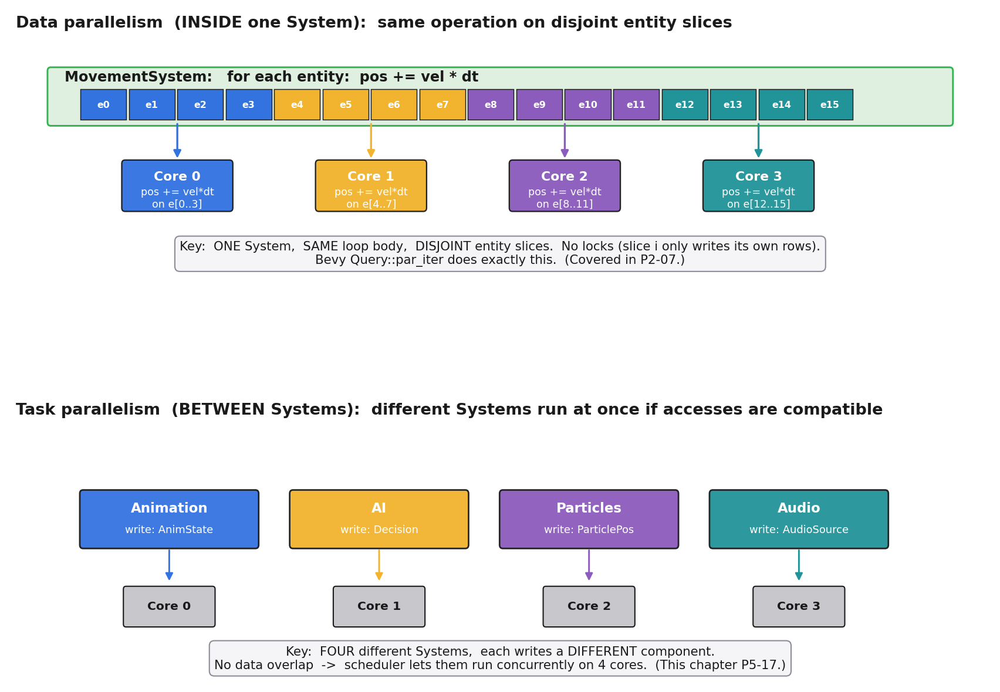
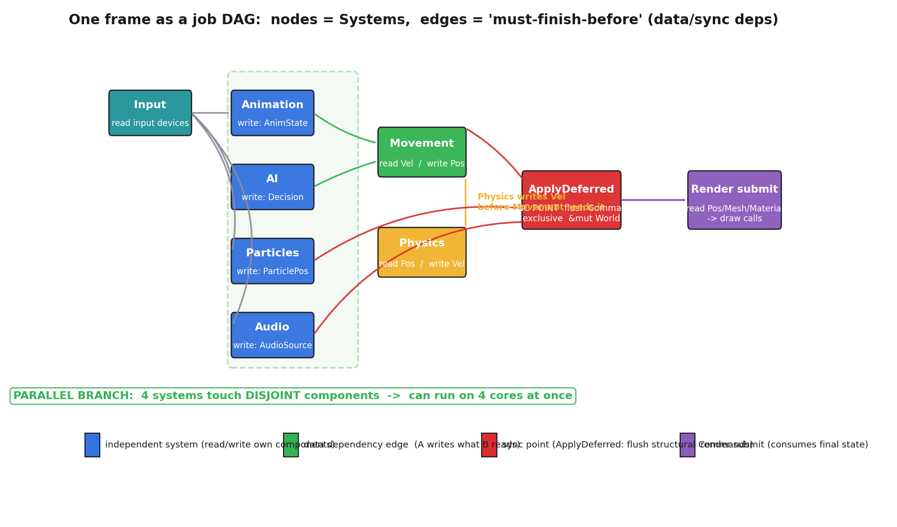
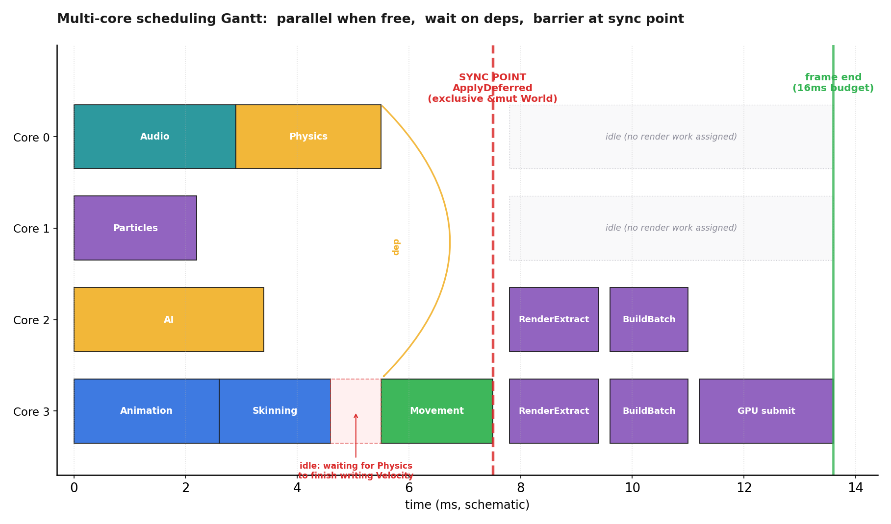
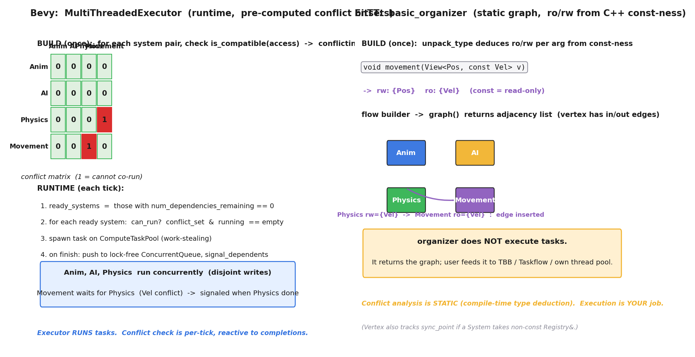
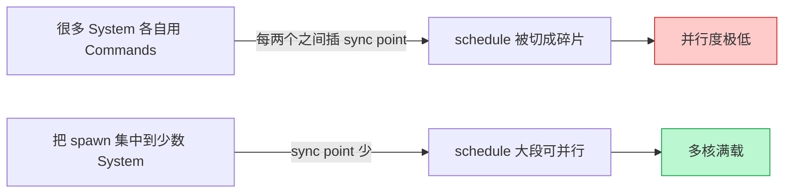

# 第 5 篇 · 第 17 章 · 多线程 job 系统

> **核心问题**:P2-07 把"一个 System 内部怎么并行遍历海量实体"讲透了——同一个 `pos += vel` 操作,实体之间互不依赖,切成 N 片分给 N 核。可一帧的活不止"一个 System 在跑"。动画系统、AI、物理、粒子、音频这些**不同的 System**,要不要也并行?要。但 System 之间有依赖:物理写 `Velocity`,移动系统读 `Velocity`;动画用 `Commands` 改了组件结构,渲染要等结构稳定才能跑。一帧的工作该怎么拆给多核、依赖怎么排队、结构修改怎么不把 Archetype 布局踩烂?本章把"**System 级的任务并行**"这件事一次拆到底:把一帧建成一个 **DAG 依赖图**,调度器把无依赖的 System 派给多核并行,有依赖的等前驱完成,结构修改卡在**同步点(sync point)**统一应用。

> **读完本章你会明白**:
> 1. **数据并行**(P2-07 讲过:一个 System 内部切实体片)和**任务并行**(本章重点:不同 System 之间并行)是两种不同的并行,粒度不同、依赖来源不同,可叠加。
> 2. 一帧的工作怎么建成一个 **DAG 依赖图**——节点是 System,边是依赖;依赖的根来源是**数据读写冲突**(两个 System 都写同一组件,不能并行)和**命令队列的同步点**(结构修改要统一应用,否则破坏 archetype 布局)。
> 3. 调度器怎么从 DAG 派活:**入度计数 + ready 集合 + 完成回调**;用 Bevy 的 `MultiThreadedExecutor` 源码看它怎么用预计算的 `conflicting_systems` 位集 + lock-free 完成队列,把无冲突的 System 派到 `ComputeTaskPool`(工作窃取线程池)并行跑。
> 4. `apply_deferred` 同步点为什么是并行的"代价"——它要拿**独占** `&mut World`,期间所有 System 都得停;Bevy 怎么自动在依赖边里插入它。
> 5. 承《Linux 同步原语》(锁/原子/false sharing/无锁)和《Tokio》(工作窃取/异步调度)——一句带过 + 指路,本章只讲"System 级任务并行"在这两本书基础上的落地。

> **如果一读觉得太难**:先记住三件事——① P2-07 讲的是"一个 System 内部并行",本章讲的是"不同 System 之间并行",两者叠加;② 一帧 = 一个 DAG,无依赖的 System 多核并行,有依赖的等前驱;③ 凡是用 `Commands` 改结构的 System,要等一个叫 `ApplyDeferred` 的同步点统一应用,这是并行的天然刹车。这三件事合起来,就是引擎怎么把一帧的活拆给多核。

---

## 〇、一句话点破

> **一帧的并行,不是"所有 System 一起上",而是把一帧建成一个 DAG 依赖图:数据读写不冲突的 System 多核并行,冲突的有依赖等前驱完成,结构修改卡在同步点统一应用。Bevy 的调度器在运行时按预计算的冲突位集和入度计数派活,EnTT 的 organizer 在编译期从 const-ness 推出 ro/rw 依赖图交给用户自己的线程池——两条路,同一个模型。**

这是结论。本章倒过来拆:先把"数据并行 vs 任务并行"分清(第一节),再把一帧的 DAG 怎么建讲透(第二节),然后拆依赖的两个来源——数据读写冲突(第三节)和命令队列同步点(第四节),接着看 Bevy 的 `MultiThreadedExecutor` 和 EnTT 的 `organizer` 源码怎么真把这件事做出来(第五节),最后在技巧精解里把"DAG 调度"和"同步点的代价"这两个最硬核的点单独拆透。

P2-07 已经讲过"一个 System 内部怎么并行遍历实体(`par_iter` 切 batch)"。本章**不重讲**那个,而是讲它**上面一层**:"一帧有几十个 System,它们之间怎么并行"。两者粒度不同,但都建立在 P2-07 那个结论之上——**ECS 的数据布局让并行天然无锁**。本章把这条结论从"系统内"推到"系统间"。

---

## 一、先分清:数据并行 vs 任务并行

P2-07 讲的是**数据并行(data parallelism)**。这里花一节把两种并行分清,因为读者最容易把两者混为一谈,而本章的题恰恰是任务并行。

### 数据并行(P2-07 已讲):同一个操作,不同数据

数据并行的特征是:**同一个 System 的同一个循环,作用在海量互不依赖的实体上**。`MovementSystem` 对 1024 个实体都做 `pos += vel * dt`,实体之间不依赖,把循环切成 8 片分给 8 个核,每片只写自己的 `pos_x[i..i+128]`,**无锁并行**。Bevy 的 `Query::par_iter` 就是干这件事的:它把单个 System 的遍历切成 batch,每 batch 一个任务派给 `ComputeTaskPool`。

数据并行的前提(P2-07 拆透的):① 计算互不依赖(第 i 次不依赖第 j 次);② 数据能干净切分(每片只写自己的槽)。System 遍历天然满足这两条——因为 ECS 把组件按字段连续存放(SoA),切片不相交。

> **承 P2-07**:数据并行的原理、SoA 为什么让切片干净、`par_iter` 怎么动态算 batch size,见 P2-07《System 的遍历:缓存友好与并行》。本章**引述**它的结论,不重讲。

### 任务并行(本章重点):不同 System,不同操作,但要并行

任务并行(task parallelism)是另一种并行模型:**不同的 System(做不同的事)在同一时刻并行跑**。看一帧的 update 段,典型有这些 System 同时存在:

- **AnimationSystem**:读 `AnimationState`,写 `Pose`
- **AISystem**:读 `Health`、`Position`,写 `Decision`
- **ParticleSystem**:读 `Emitter`,写 `ParticlePos`
- **AudioSystem**:读 `Position`、`AudioSource`,写 `AudioEmitter`

注意这四个 System **各写各的组件**——Animation 写 `Pose`、AI 写 `Decision`、Particle 写 `ParticlePos`、Audio 写 `AudioEmitter`。它们**读写的数据完全不相交**。那这四个 System 就可以**同时跑在四个核上**——Animation 在 Core 0、AI 在 Core 1、Particle 在 Core 2、Audio 在 Core 3。这就是任务并行。



> **钉死这件事**:数据并行和任务并行是**两种不同的并行,可叠加**。数据并行 = "同一个 System 内部,把实体数组切给多核";任务并行 = "不同的 System,各写各的组件,同时跑在多核上"。一个引擎帧,通常是**两层并行叠乘**:先做任务并行(把不冲突的 System 派到多核),每个 System 内部再做数据并行(`par_iter` 切实体)。本章的题是**任务并行这一层**。

### 两层并行怎么叠:一个具体的设想

为了把"两层叠乘"讲实,设想一帧有这么几个 System:Animation(8000 个角色)、AI(5000 个敌人)、Particle(20000 个粒子)、Audio(200 个声源),跑在一台 8 核机器上。

**纯任务并行**(只开任务并行,每个 System 内部串行):调度器看这 4 个 System 写的组件互不相交,把它们派到 4 个核上同时跑。每个核跑一个 System,串行遍历它的实体。8 核里只用 4 个核(另外 4 个闲着,因为没有第 5 个独立 System),提速 4 倍(理想)。Animation 那个核跑 8000 个角色,串行遍历,最慢;其他核早跑完了等着它。

**纯数据并行**(只开数据并行,所有 System 串行,每个 System 内部切 8 片):AnimationSystem 内部切 8 片,8 核各算 1000 个角色,提速 8 倍;但它跑完才能跑 AISystem,AI 跑完才能跑 Particle……System 之间完全串行。总时间 = 各 System 时间之和。

**两层叠乘**(任务并行 + 数据并行):调度器把 Animation、AI、Particle、Audio 同时派出去(任务并行,4 个独立 System);每个 System 内部,因为实体很多,自动用 `par_iter` 切 batch(数据并行)。但这里有个微妙之处——任务并行已经占了 4 个核,数据并行再切就只能在这 4 个核内部切,或者等某个 System 早跑完腾出核来给别的 System 的 batch 用。Bevy 的 `ComputeTaskPool` 是工作窃取池,某个核闲下来会自动偷别的 System 的 batch——**任务并行和数据并行在共享同一个线程池,工作窃取让它们动态平衡**。

> **承《Tokio》**:工作窃取(work-stealing)线程池——为什么不用固定分配(每个核固定一组任务)、为什么要让闲核偷忙核的任务、怎么实现无锁的偷取——这是《Tokio》那本的重头戏(Rust 异步运行时的调度核心)。本章把 `ComputeTaskPool` 当黑盒:它是一个 tokio-like 的工作窃取池,任务并行(System 级)和数据并行(par_iter 的 batch)共享它,工作窃取自动平衡负载。一句带过 + 指路 [[tokio-series-project]]。

这就是为什么现代引擎的并行是"**两层叠乘 + 工作窃取**"——任务并行榨 System 间的并行,数据并行榨 System 内的并行,工作窃取让两者动态共享核。本章的剩余部分聚焦任务并行这一层(System 之间怎么判断冲突、怎么排队),数据并行那一层已在 P2-07 讲透。

### 一个直观的对子:什么时候能并行,什么时候不能

那"哪些 System 能并行"怎么判断?核心就一条:**读写的数据(组件)有没有冲突**。把一帧的 System 和它们读写什么列成一张表:

| System | 读 | 写 |
|--------|-----|-----|
| Animation | AnimationState | Pose |
| AI | Health, Position | Decision |
| Particle | Emitter | ParticlePos |
| Audio | Position, AudioSource | AudioEmitter |
| Physics | Position | Velocity |
| Movement | Velocity | Position |

(简化示意,真实引擎的 System 远不止这些,每个读写的组件也更多)

并行规则很朴素——和读写锁的相容性矩阵一样:

- **两个都只读同一组件**:相容,可并行。
- **一个读、一个写同一组件**:冲突,**不能并行**(否则读到半新半旧)。
- **两个都写同一组件**:冲突,**不能并行**(写写冲突)。

用这条规则扫一遍上表:Animation、AI、Particle、Audio 四个写的组件互不相交(`Pose`、`Decision`、`ParticlePos`、`AudioEmitter`),所以它们四个**可以一起并行**。但 **Physics 和 Movement 冲突**:Physics 写 `Velocity` 读 `Position`,Movement 读 `Velocity` 写 `Position`——两者读写交叉,**必须串行**(且 Physics 要先于 Movement,因为 Movement 要用 Physics 算出来的新 `Velocity`)。

> **承《Linux 同步原语》**:这个"读写相容性矩阵"不是新东西——它就是《Linux 同步原语》那本讲的**读写锁(RWLock)的相容性语义**在 System 调度上的兑现:多读单写、写互斥一切。区别在于,引擎不是运行时动态加锁,而是**在调度阶段静态分析**每个 System 的读写集合,把"能不能并行"算清楚再派活——这样运行时**根本不加锁**,只靠调度顺序保证安全。锁的原理、内存屏障、cache 一致性,见 [[linux-sync-series-project]],本章一句带过。

### 小结:为什么 ECS 让任务并行天然友好

任务并行的前提是"两个 System 读写的数据不相交就能并行"。这件事,面向对象**做不到干净**,而 ECS **天然干净**:

- **面向对象**:对象之间常常隐式共享状态(一群敌人共享一个 `Pathfinder*` 单例,或者通过全局 `World` 访问),你根本说不清两个"系统"(在面向对象里可能是两个 `update()` 遍历)读写的数据边界。要并行就得加锁,锁一加,并行退化。
- **ECS**:每个 System 在签名里**显式声明**它读什么组件、写什么组件(`Query<&Position, &mut Velocity>`)。引擎拿到这些声明,就能**静态判断**两个 System 冲不冲突。组件存在 World 里,没有"对象间隐式引用"这回事——声明了什么就是什么。

> **不这样会怎样**:面向对象组织子系统,要任务并行就得手工分析每个对象访问了什么、和别的对象有没有共享——这种分析在大型代码库里几乎做不准,只能保守加锁,锁多了并行就退化。ECS 把"读写什么"做成 System 的**类型签名**,让冲突分析变成**类型推导**,从根上解决了这个问题。本章后面看 EnTT 怎么从 C++ 的 `const` 推 ro/rw、Bevy 怎么从 Rust 的 `&` / `&mut` 推读写——都是 ECS 把并行友好做进类型系统的兑现。

---

## 二、把一帧建成一个 DAG 依赖图

第一节讲清了"哪些 System 能并行"。这一节讲调度器怎么用这个信息把一帧的活排好。

### 把 System 和依赖画成一张图

一帧有几十个 System,每个有它的读写集合,有"必须先于谁"的顺序约束。把这些画出来,就是一张**有向无环图(DAG, Directed Acyclic Graph)**:

- **节点(node)** = 一个 System(或一个 job)。
- **边(edge)** = "A 必须在 B 之前完成"(A → B)。
- **图必须无环**:如果有环(A 依赖 B,B 依赖 A),就死锁了,谁也跑不了。Bevy 在构建 schedule 时就检查环,有环直接报 `DependencySort(Loop)` 错误(`crates/bevy_ecs/src/schedule/mod.rs` 的测试 `dependency_loop` 验证这一点)。



这张图里能看出三件事:

1. **可并行的分支**:Animation、AI、Particles、Audio 这四个节点(图里绿色虚线框)互相之间没有边,说明它们的数据读写不冲突,**可以同时跑在四个核上**。
2. **串行依赖**:Physics → Movement 这条边,说明 Movement 必须等 Physics 完成。Movement 不能和 Physics 并行,但它可以和 Animation、AI、Particles、Audio 这些不依赖 Physics 的 System 并行。
3. **同步点**:几个 System 汇聚到红色的 `ApplyDeferred` 节点,这是同步点(下一节详讲)。同步点之后才能 Render submit。

> **钉死这件事**:一帧的调度问题,本质是"在一个 DAG 上做**拓扑排序 + 并行派发**":任何时刻,所有**前驱都已完成**的节点(入度为 0)都可以并行派给多核;一个节点完成,就把它的后继的入度减一,减到 0 的后继又可以派出去。这是经典的 DAG 调度,操作系统课、《Tokio》异步调度都讲过它的变体——本章把它放到 ECS 的场景里兑现。

### DAG 调度的运行时算法:入度计数 + ready 集合

光有图不够,调度器要在运行时按这张图派活。算法很朴素,核心三个数据结构:

- **`num_dependencies_remaining[i]`**:每个 System 还剩多少个前驱没完成(入度计数)。
- **`ready_systems`**:入度降到 0、可以派出去跑的 System 集合。
- **`running_systems`**:正在跑的 System 集合。

主循环(每个 tick)做的事:

1. 从 `ready_systems` 里挑一个 System。
2. 检查它和 `running_systems` 里的 System **数据读写冲不冲突**(下一节详讲)。不冲突就派出去(派给线程池的一个核);冲突就跳过,等冲突的 System 跑完。
3. System 跑完,从 `running_systems` 移除,把它所有后继的 `num_dependencies_remaining` 减一,减到 0 的后继加入 `ready_systems`。
4. 重复,直到所有 System 都跑完。

> **钉死这件事**:DAG 调度的核心是"**入度计数 + ready 集合 + 完成回调**"。这和操作系统的进程调度、《Tokio》的异步任务调度是同一个模型——只不过这里的"任务"是 ECS 的 System,"依赖"来自数据读写冲突。Bevy 的 `MultiThreadedExecutor` 用的就是这个算法,下一节看它的源码。

---

## 三、依赖的第一个来源:数据读写冲突

DAG 的边从哪来?第一个、也是最直接的来源:**数据读写冲突**。

### 冲突怎么算:读写相容性矩阵

第二节末尾讲过相容性规则:两读相容,读写冲突,写写冲突。把这个规则程序化,就是:**遍历所有 System 对,看它们的读写集合有没有交**。Bevy 的 `MultiThreadedExecutor` 在 `init` 阶段就把这件事算清楚了,存成一个**预计算的冲突位集**。

看 Bevy 源码(`crates/bevy_ecs/src/schedule/executor/multi_threaded.rs`,`init` 方法,基于 bevyengine/bevy master):

```rust
// 简化示意(突出核心, 非源码全文):
for index1 in 0..sys_count {
    let system1 = &schedule.systems[index1];
    for index2 in 0..index1 {
        let system2 = &schedule.systems[index2];
        if !system2.access.is_compatible(&system1.access) {
            state.system_task_metadata[index1].conflicting_systems.insert(index2);
            state.system_task_metadata[index2].conflicting_systems.insert(index1);
        }
    }
    // ... (condition_conflicting_systems 类似)
}
```

`SystemTaskMetadata.conflicting_systems` 是个 `FixedBitSet`(位集),第 j 位为 1 表示"System i 和 System j 数据冲突,不能同时跑"。这是**一次性预计算**(schedule 初始化时做),运行时只需查位集,不用重新算冲突——这是性能的关键。

这个 O(N²) 预计算在 schedule 变化时重做一次(不是每帧),典型游戏一帧几十个 System,N² = 几千次位运算,微秒级。一帧 run 时,`can_run` 的冲突查询是 O(N/64) 的位 AND——N=64 时就是一次 64 位整数 AND,**1 个时钟周期**。对比"运行时加锁"的方案(每个 System 加几十把锁、每把锁一次原子 CAS、还要处理 cache 一致性流量),DAG 调度的运行时开销**低了几个数量级**。这就是为什么 Bevy 敢把并行调度做进引擎而几乎不增加每帧开销——预计算 + 位集查表,把"动态并发控制"变成了"静态分析 + 运行时常数时间查表"。

`is_compatible(access_a, access_b)` 干的就是相容性矩阵的检查:如果 a 写了某个组件,b 也读或写了同一个组件(或反过来),返回 false(不兼容)。Bevy 的访问模型把"读组件 X"、"写组件 Y"、"读资源 R"、"独占 World" 都统一进 `Access` 结构,`is_compatible` 一并检查。`crates/bevy_ecs/src/schedule/mod.rs` 的测试矩阵佐证了这一点,几个用例值得记住:

- `read_component_system` + `write_component_system`:**1 个冲突**(读写冲突)。
- 两个 `read_component_system`:**0 个冲突**(读读相容)。
- 两个 `write_world_system`(独占 `&mut World`):**3 个冲突**(独占和谁都冲突,包括它自己)。
- `resmut_system` + `entity_ref_system`:**1 个冲突**——因为 resource 在 Bevy 里也是 component,`EntityRef` 能读到 resource,所以和写 resource 的 System 冲突。但 `Query<EntityMut, Without<IsResource>>` 加了 `Without<IsResource>` 过滤后,和 `resmut_system` **0 冲突**——查询的 filter 把数据访问范围缩到了不相交的实体集。

最后这一条特别值得注意:**Bevy 的冲突分析是精确的,不是保守的**。一个 `Query<&mut A, With<B>>` 只写有 A(且必然有 B)的实体,它和另一个只读没 A 的实体的 System **不冲突**——因为它们访问的实体集不相交。这种基于 archetype/filter 的精确冲突分析,让 Bevy 能榨出比"按组件类型粗粒度判断"更多的并行度。

> **钉死这件事**:Bevy 的冲突分析不只是"两个 System 都碰组件 X 就算冲突",而是**精确到访问的实体集是否相交**。`With<B>` / `Without<B>` 这种 filter、`EntityRef`/`EntityMut` 的范围,都被纳入 `Access` 的计算。这意味着写得好的 Query(精确 filter)能让两个看似都碰同一组件的 System 并行——这是 Bevy 比"朴素按组件类型加锁"高明的地方。

> **钉死这件事**:Bevy 在 schedule **初始化时**(不是每帧)就把所有 System 两两的冲突关系算清楚,存成 N×N 的位集 `conflicting_systems`。运行时,调度器只需"位集 AND running_systems == 空"就能判断一个 System 现在能不能跑——**O(N/64)** 的位运算,极快。这是把"动态加锁"换成"静态分析 + 运行时查表"的关键工程决策。

### 运行时怎么用冲突位集:can_run 检查

调度器在派一个 System 出去之前,要检查"它和当前正在跑的 System 冲不冲突"。看 Bevy 的 `can_run`(`executor/multi_threaded.rs`):

```rust
// 简化示意(突出核心, 非源码全文):
fn can_run(&mut self, system_index: usize, conditions: &mut Conditions) -> bool {
    let system_meta = &self.system_task_metadata[system_index];
    // 独占 System 必须等其他全跑完
    if system_meta.is_exclusive && self.num_running_systems > 0 {
        return false;
    }
    // 非 Send 的 System 只能跑在主线程
    if !system_meta.is_send && self.local_thread_running {
        return false;
    }
    // ... (条件检查省略)
    // 核心: 这个 System 的冲突集, 和当前正在跑的 System, 有没有交?
    if !self.skipped_systems.contains(system_index)
        && !system_meta.conflicting_systems.is_disjoint(&self.running_systems)
    {
        return false;  // 有冲突, 等冲突的 System 跑完再说
    }
    true
}
```

`conflicting_systems.is_disjoint(&self.running_systems)` 这一句是核心——**位集求交集是不是空**。如果 System i 的冲突集和当前 running 集合有交(有某个正在跑的 System 和它冲突),`can_run` 返回 false,调度器跳过它,去 ready 集合里看下一个。等冲突的那个 System 跑完、从 `running_systems` 移除,这个 System 自然就能跑了。

> **钉死这件事**:Bevy 的并行调度**运行时根本不加锁**。它靠两件事保证安全:① schedule 初始化时静态算清楚冲突位集;② 运行时派活前用位集查"和正在跑的有没有冲突"。冲突的 System 永远不会被同时派出,所以不会真的撞数据——**用调度顺序代替了锁**。这是 ECS 把"读写相容性做进类型系统"换来的红利。

### 完成回调:signal_dependents

一个 System 跑完,要做两件事:① 把它从 `running_systems` 移除;② 通知它的后继"我又少了一个前驱"。看 `finish_system_and_handle_dependents` + `signal_dependents`:

```rust
// 简化示意:
fn finish_system_and_handle_dependents(&mut self, result: SystemResult) {
    let system_index = result.system_index;
    // ... (exclusive / local 标志复位, 计数减一)
    self.running_systems.remove(system_index);
    self.completed_systems.insert(system_index);
    self.unapplied_systems.insert(system_index);   // 它的 Commands 还没应用
    self.signal_dependents(system_index);
}

fn signal_dependents(&mut self, system_index: usize) {
    for &dep_idx in &self.system_task_metadata[system_index].dependents {
        let remaining = &mut self.num_dependencies_remaining[dep_idx];
        *remaining -= 1;
        if *remaining == 0 && !self.completed_systems.contains(dep_idx) {
            self.ready_systems.insert(dep_idx);   // 入度归零, 可以派了
        }
    }
}
```

这就是"入度计数 + ready 集合 + 完成回调"的源码兑现。注意 `unapplied_systems`——这是为下一节的同步点准备的:凡是用了 `Commands` 的 System,跑完后它的命令**还没应用到 World**,先记进 `unapplied_systems`,等同步点统一处理。

### 并发的协调:一个 Mutex + 一个 lock-free 队列

上面这套"完成回调改状态"的逻辑,在多线程下怎么保证本身的线程安全?Bevy 的做法很精巧:

- **`ExecutorState`** 用一个 `Mutex<ExecutorState>` 保护——任何线程要改状态(移除 running、加 ready、减入度)都得先拿这把锁。
- **完成事件**用一个 lock-free 的 `ConcurrentQueue<SystemResult>`——System 在线程池里跑完,往这个队列 push 一条"我完成了",**不直接抢锁**。
- **`tick_executor`** 循环:任何线程(完成的那个,或主线程)尝试拿锁,拿到就 drain 完成队列、跑 `tick`(更新状态、派新任务);拿不到就返回(说明别的线程在 tick)。

```rust
// 简化示意:
fn tick_executor(&self) {
    loop {
        let Some((conditions, mut guard)) = self.try_lock() else { return; };
        guard.tick(self, conditions);   // drain 完成队列 + 派新任务
        drop(guard);
        if self.environment.executor.system_completion.is_empty() {
            return;
        }
    }
}
```

这个设计的好处:lock-free 队列让"完成事件"的 push 不阻塞(快速路径),只有真正改调度状态时才抢锁,且抢锁的临界区(`tick`)很短。这是一种典型的"**无锁快速路径 + 短临界区**"模式——和《Linux 同步原语》里讲的高性能并发设计同源。

> **承《Linux 同步原语》《Tokio》**:lock-free 队列(`ConcurrentQueue`)的内存顺序、`Mutex` 的实现、false sharing 怎么避免(把热数据缓存行对齐)——这些是《Linux 同步原语》的重头戏;工作窃取线程池(`ComputeTaskPool` 基于 `async-executor`,tokio-like)的调度原理——这是《Tokio》的重头戏。本章**一句带过 + 指路**,只讲它们在 ECS 调度场景里怎么用:Bevy 把"完成事件"做成 lock-free 队列让 System 跑完快速通知,把"派活"放在短临界区里,把"任务实际执行"交给工作窃取线程池——三件事叠起来,让 System 级并行的协调开销极低。详见 [[linux-sync-series-project]] 和 [[tokio-series-project]]。

---

## 四、依赖的第二个来源:命令队列的同步点

数据读写冲突是 DAG 边的一个来源。还有一个**更隐蔽**、但对并行杀伤力更大的来源:**结构修改(structural changes)**造成的同步点。

### 结构修改是什么,为什么不能在 System 跑的时候做

P2-08 讲过 Archetype:Bevy 把"组件组合相同"的实体连续存进一个 Table,每列是一种组件。**结构修改**——生成/销毁实体、添加/删除组件——会**改变 archetype 的成员**,可能要往 Table 里插一行、删一行、甚至把实体从一个 Table 搬到另一个 Table。

问题来了:如果一个 System 在跑的时候,另一个 System 突然往 Table 里插一行,会发生什么?

- 正在 `par_iter` 遍历这个 Table 的 System,**它拿的 Column 指针可能失效**(Table 扩容搬迁了内存)。
- 正在跑的 System 拿的是 `UnsafeWorldCell`,它假设遍历期间 archetype 布局**稳定**。布局一变,这个假设崩了,UB(未定义行为)。

所以**结构修改不能在 System 并行跑的时候直接做**。那游戏逻辑里到处都要 spawn 实体(敌人死了爆装备、子弹发射、玩家招募 NPC),怎么办?

### Commands:把结构修改"记账",延迟应用

Bevy 的解法是**命令队列(Commands)**:System 在跑的时候,如果要 spawn 实体、加组件,它**不直接改 World**,而是把这些操作**记录**进一个 per-system 的命令队列(`CommandQueue`)。等这个 System 跑完,命令队列挂着;等到一个**同步点(sync point)**,调度器才把这些命令**统一、独占地应用**到 World。

```rust
fn spawn_enemies(mut commands: Commands) {
    // 这一行不是马上 spawn, 而是把 "spawn 一个 Enemy" 这个命令 push 进队列
    commands.spawn((
        Enemy,
        Health(100),
        Position { x: 10.0, y: 0.0 },
    ));
}
```

`Commands` 是 `CommandQueue` 的句柄。每个用 `Commands` 的 System 在并行跑的阶段,只是往自己的队列里 push 闭包,**不碰 World 的结构**。等同步点来了,调度器拿**独占** `&mut World`,把所有已跑完 System 的命令队列**顺序 replay**,这时 World 没人在读没人在写,结构修改安全。

### ApplyDeferred:同步点的真身

Bevy 把同步点做成一个**特殊的 System**:`ApplyDeferred`。它的特点:

- 它**不是真的 System**——它的 `run_unsafe` 是个 **no-op**(什么都不做)。它存在的意义不是"执行什么逻辑",而是**作为一个调度节点**,标记"在这里要应用命令队列"。
- 当调度器"运行"一个 `ApplyDeferred` 时,它做的事是:拿**独占** `&mut World`,把 `unapplied_systems` 里所有 System 的命令队列 replay 进 World。

看 Bevy 源码(`spawn_exclusive_system_task`,`executor/multi_threaded.rs`):

```rust
// 简化示意(突出核心, 非源码全文):
unsafe fn spawn_exclusive_system_task(&mut self, context: &Context, system_index: usize) {
    let system = /* ... */;
    if is_apply_deferred(&**system) {
        // 这是同步点 System: 拷一份 unapplied_systems, 清空, 然后独占应用
        let unapplied_systems = self.unapplied_systems.clone();
        self.unapplied_systems.clear();
        let task = async move {
            let world = unsafe { context.environment.world_cell.world_mut() };  // 独占 &mut World
            apply_deferred(&unapplied_systems, context.environment.systems, world, ...);
            context.system_completed(system_index, ...);
        };
        context.scope.spawn_on_scope(task);
    }
    // ... (其他情况)
    self.exclusive_running = true;   // 同步点运行期间, 别的 System 全停
    self.local_thread_running = true;
}
```

`apply_final_deferred` 标志默认是 true,意思是 schedule 跑完之后**最后再应用一次**残留的命令,保证 World 在一帧结束时处于一致状态。

> **钉死这件事**:`ApplyDeferred` 是一个**特殊 System**,它本身不执行逻辑,而是**作为一个调度节点**标记"在这里要应用命令队列"。它运行时拿**独占** `&mut World`,期间所有别的 System 都得停(`exclusive_running = true` 阻止 `can_run`)。这是结构修改的安全保证:**结构修改永远发生在没有别的 System 在读写的时刻**。

### 自动插入同步点:Bevy 怎么知道在哪插

写 Bevy 代码时,你**很少手动**加 `ApplyDeferred`——调度器会**自动**插。规则是(看 `crates/bevy_ecs/src/schedule/auto_insert_apply_deferred.rs`):

> 如果 System A 用了任何 Deferred 参数(`Commands`、`Deferred<T>` 等,即 `has_deferred() == true`),并且存在一条"A 必须先于 B"的依赖边,那么调度器**在 A 和 B 之间自动插入一个 `ApplyDeferred`**。

```rust
// auto_insert_apply_deferred.rs, build() 方法的核心逻辑(简化示意):
// 遍历拓扑序, 计算每个节点的 "distance"(离图首有多少个 sync point)
// 如果一条边 (key -> target) 两端 distance 不同, 就在这条边上插一个 sync point
let sync_point = distance_to_explicit_sync_node
    .get(&target_distance)
    .copied()
    .unwrap_or_else(|| self.get_sync_point(graph, target_distance));
dependency_flattened.add_edge(key, sync_point);
dependency_flattened.add_edge(sync_point, target);
dependency_flattened.remove_edge(key, target);
```

也就是说:你写了 `.after(spawn_enemies)` 这种顺序约束,而 `spawn_enemies` 用了 `Commands`,调度器自动给你变成 `spawn_enemies → ApplyDeferred → 你的 System`,**保证你的 System 看到的是 spawn 已经应用后的 World**。

> **钉死这件事**:Bevy 默认**自动**在需要的地方插同步点——只要一个用了 `Commands` 的 System 有后继,后继和它之间就会被插一个 `ApplyDeferred`。这个行为可以用 `ScheduleBuildSettings::auto_insert_apply_deferred = false` 关掉(适合你只想在 schedule 末尾统一同步的场景),或者用 `IgnoreDeferred` 标记某条边不插同步点。但默认开,是因为"后继 System 看到前驱的命令已应用"是绝大多数游戏逻辑的预期语义。

### 同步点是并行的代价

同步点保证了结构修改的安全,但它**是并行的天然刹车**。看那张 DAG 图里红色的 `ApplyDeferred` 节点——它**汇聚了所有用 Commands 的 System**(它们都依赖它前面、又被它后面的 Render 依赖),它运行时**独占 World**,所有别的 System 全停。如果一个 schedule 里同步点太多,并行就被切碎成一段一段的串行。

下面这张甘特图把这件事画得很直观:前半段 4 个核满载(Animation/AI/Particles/Audio 并行),中间一个 System(Movement)因为等 Physics 完成,Core 0 出现一段红色虚线框的 idle 空等;然后红色虚线的 SYNC POINT 同步点把所有核冻住,独占应用命令队列;同步点之后只有 2 个核跑 render 相关的活,Core 2/3 idle。**idle 就是浪费的核时**——同步点和依赖等待越多,idle 越多,多核越白费。



所以**减少同步点**是 Bevy 性能调优的重要主题:

- **尽量不用 `Commands` 做高频结构修改**:能用普通 `Query<&mut T>` 直接改组件的,就别走 `Commands`(改组件不是结构修改,可以无锁并行)。改一个实体的 `Health`、`Position`,直接 `Query<&mut Health>` / `Query<&mut Position>` 就行,不走 Commands,不触发同步点。
- **把结构修改集中**:与其每个 System 都 spawn 一点,不如把 spawn 逻辑集中到少数几个 System(比如一个 `SpawnSystem` 专门处理本帧所有 spawn 请求),让同步点数量少。这样 schedule 里只有少数几处独占,大段可以并行。
- **用 `IgnoreDeferred` 跳过不必要的同步**:如果你确信某个后继 System 不关心前驱 spawn 了什么(它查询的组件不受 spawn 影响),可以在这条依赖边上标 `IgnoreDeferred`,告诉调度器"别在这条边上插同步点"。这是高级用法,要确认安全才用。

> **钉死这件事**:同步点是结构修改安全的代价。一个 schedule 的并行度,大致等于"(总 System 时间 - 同步点独占时间 - 依赖等待 idle 时间) / 总时间"。减少 Commands、集中 spawn、按需关 auto_sync,都是在缩小后两项,让多核满载。这是 Bevy(以及任何用 ECS schedule 的引擎)性能调优的头条实践。

> **不这样会怎样**:如果一个 schedule 里每个 System 都用 `Commands` 改结构,且互相有顺序依赖,那每两个 System 之间都会被插一个同步点,整个 schedule 就退化成"System1 → sync → System2 → sync → System3 → ...",**完全串行**,多核白费。这是 Bevy 早期(0.x 版本)真实遇到的性能坑,后来社区总结出"少用 Commands、集中 spawn、按需关 auto_sync"这套实践。同步点是结构修改安全的代价,**它不是免费的**。

---

## 五、源码佐证:Bevy 怎么真把任务并行做出来

前面四节讲的都是模型和原理。这一节看 Bevy 的 `MultiThreadedExecutor` 怎么在源码里把"DAG 调度 + 数据冲突检查 + 同步点"三件事整合落地,以及 EnTT 的 `organizer` 走的另一条路。

### 先交代背景:为什么引擎要自建调度器,而不是用 OS 线程 / TBB / tokio

你可能会问:多核并行这事,操作系统有线程,TBB / Taskflow / tokio 有现成的任务调度框架,为什么游戏引擎还要自己搞一套 schedule + executor?答案是——**通用任务调度器不知道"哪些任务数据冲突"**。

TBB 的 `parallel_for` 你告诉它"切多少片",它切;但你要跑 30 个不同的 System,它不知道 System A 和 System B 冲不冲突——你得自己加锁,或者自己排序。tokio 的异步任务调度器也是,它调度 Future,不知道两个 Future 访问的数据有没有交。通用调度器的抽象层级是"任务(Future / closure)",看不到任务内部访问什么数据。

ECS 调度器的特殊之处在于:**它手里有每个 System 的读写声明**(Bevy 从 Rust 的 `&` / `&mut` 类型签名推,EnTT 从 C++ 的 `const` 推)。这个信息是通用调度器没有的。有了它,引擎能做**静态冲突分析**(哪些 System 能并行),把通用调度器做不了的"无锁并行"做出来。所以引擎的 schedule + executor 不是"重新发明 TBB",而是**在 TBB-like 的线程池之上,加一层"知道数据冲突的调度"**——底层执行还是用工作窃取池(Bevy 用 `async-executor`,tokio-like),上层调度是 ECS 自己的。这是"为什么自建"的答案。

> **钉死这件事**:ECS 调度器不是替代 TBB / tokio,而是**在它们之上**加一层"数据冲突感知"。底层任务执行(工作窃取、线程池)用通用框架,上层调度(谁和谁能并行)用 ECS 的读写声明做静态分析。两层各司其职,这就是为什么 Bevy 的 `MultiThreadedExecutor` 自己派活,但任务实际跑在 `ComputeTaskPool`(基于 `async-executor`)上。

### Bevy:运行时调度器,预计算冲突位集

Bevy 的 `MultiThreadedExecutor`(整个文件 `crates/bevy_ecs/src/schedule/executor/multi_threaded.rs`)是一个**运行时调度器**——它在每帧 `run()` 时真的派活、收完成事件、更新状态。前面几节已经贴了它的核心片段(`init` 算冲突、`can_run` 查冲突、`signal_dependents` 更新入度、`spawn_exclusive_system_task` 处理同步点)。这里把它们串成一条完整的运行时流程:

1. **`run`** 入口:重置 `num_dependencies_remaining`、把入度为 0 的 System 装进 `ready_systems`,然后在 `ComputeTaskPool` 上开一个 `scope`。
2. **`tick`**(在锁里):drain 完成队列、对每个完成事件跑 `finish_system_and_handle_dependents`(更新 running/ready/completed/unapplied)、再调 `spawn_system_tasks`。
3. **`spawn_system_tasks`**(在锁里):遍历 `ready_systems`,对每个跑 `can_run`(查冲突位集和 running 集合是否相交)+ `should_run`(跑条件),通过的就 `spawn_system_task`(派到线程池)或 `spawn_exclusive_system_task`(同步点/独占)。
4. **System 在线程池里跑**:跑完往 `system_completion`(lock-free 队列)push 一条,然后调 `tick_executor`(尝试拿锁再 tick)。
5. 所有 System 跑完,scope 结束;如果 `apply_final_deferred`(默认 true),最后再应用一次残留命令。

这里有几个**容易翻车**的点,值得专门点出来:

> **钉死这件事**(修正几个常见误解):
> ① **不是每实体一个任务**——是**每 System 一个任务**(System 内部的并行是 `par_iter` 的事,不是 executor 的事)。executor 的并行粒度是 System。
> ② **冲突检查不是运行时动态加锁**——是 schedule 初始化时**预计算**的 `conflicting_systems` 位集,运行时只做位集 AND。
> ③ **独占 System(包括 `ApplyDeferred`)运行时,所有别的 System 都得停**(`exclusive_running` 标志 + `can_run` 第一条检查)。这是同步点杀伤力的根源。
> ④ **非 Send 的 System 只能跑在主线程**(`spawn_on_external`,因为它的数据不能跨线程)。这是 Rust 类型系统(`Send`)和 ECS 调度的耦合点。

### 三类 System,三种派发路径

看 `SystemTaskMetadata` 的两个标志——`is_send` 和 `is_exclusive`——它们把所有 System 分成三类,每类走不同的派发路径。这是 Bevy 调度器的一个细节,但理解它能让你看清"什么能并行,什么不能":

| System 类型 | is_send | is_exclusive | 派发路径 | 能和谁并行 |
|---|---|---|---|---|
| 普通 System(多数) | true | false | `spawn_system_task` 派到 ComputeTaskPool 任意核 | 和任何 access 兼容的普通 System 并行 |
| 非 Send System(碰 NonSend 组件,如渲染资源) | false | false | `spawn_on_external` 钉在主线程 | 只能和主线程不占的 System 并行,`local_thread_running` 串行 |
| 独占 System(`&mut World`,包括 `ApplyDeferred`) | 任意 | true | `spawn_exclusive_system_task` + `exclusive_running=true` | **谁也不能并行**,世界冻结 |

`is_exclusive` 的 System(直接拿 `&mut World` 参数的)是核武器——它能改 World 的一切,所以它跑的时候,任何别的 System 都不能跑(`can_run` 第一条 `if system_meta.is_exclusive && self.num_running_systems > 0 { return false; }`)。`ApplyDeferred` 就是这种 System,所以它是同步点的真身。

`is_send = false` 的 System(碰了 `NonSend<T>` / `NonSendMut<T>` 组件——典型是渲染线程专用的 GPU 资源,不能跨线程)被钉在主线程(`spawn_on_external`),且同一时刻只能有一个(`local_thread_running` 标志)。这类 System 之间串行,但它们可以和跑在其他核上的 `is_send = true` 的 System 并行——只要主线程空得出来。

理解这三类,你就能在写 Bevy 代码时预判"我这个 System 会怎么被调度"——这是性能调优的直觉来源。

### EnTT:静态依赖图,执行交给用户

EnTT 走的是**另一条路**。它的 `basic_organizer`(`src/entt/entity/organizer.hpp`)不是一个运行时调度器,而是一个**静态依赖图生成器**。你把每个 System 注册进去,它**从 C++ 类型推导**出每个 System 读什么(ro)、写什么(rw),然后生成一个邻接表返回给你——**它不执行**。

P2-07 已经发现这一点,这里把它讲透。看 `organizer.hpp` 的关键模板 `unpack_type`(简化展示):

```cpp
// 简化示意(突出核心, 非源码全文):
template<typename Type, typename Override>
struct unpack_type {
    // 如果 Type 是 const 的(且没被 Override 标成可写), 那它是只读
    using ro = std::conditional_t<
        type_list_contains_v<Override, const Type> ||
        (std::is_const_v<Type> && !type_list_contains_v<Override, std::remove_const_t<Type>>),
        type_list<std::remove_const_t<Type>>,
        type_list<>>;
    // 如果 Type 不是 const 的(或被 Override 标成可写), 那它是可写
    using rw = std::conditional_t<
        type_list_contains_v<Override, std::remove_const_t<Type>> ||
        (!std::is_const_v<Type> && !type_list_contains_v<Override, const Type>),
        type_list<Type>,
        type_list<>>;
};
```

这个模板干的事:**从一个 System 函数的参数类型,推导出它读什么、写什么**。比如:

```cpp
// 这个 System 通过 view 读 Position 和 Velocity, 其中 Velocity 是 const -> 只读
void movement(entt::view<entt::get_t<Position, const Velocity>> v) { ... }
// organizer 推导: ro = {Velocity}, rw = {Position}
```

`const` 是 C++ 的类型修饰符,organizer 用它来判断"读 vs 写"。`Position` 没 const → 可写;`const Velocity` → 只读。这是把"读写语义做进类型系统"在 C++ 侧的兑现(Bevy 在 Rust 侧用 `&` vs `&mut` 兑现)。

organizer 把每个 System 的 ro/rw 集合,通过 `track_dependencies` 注册进一个内部的 `flow` builder(图构造器):

```cpp
// 简化示意:
template<typename... RO, typename... RW>
void track_dependencies(std::size_t index, const bool sync_point,
                        type_list<RO...>, type_list<RW...>) {
    builder.bind(static_cast<id_type>(index));
    builder.set(type_hash<Registry>::value(), sync_point || (sizeof...(RO) + sizeof...(RW) == 0u));
    (builder.ro(type_hash<RO>::value()), ...);   // 注册只读资源
    (builder.rw(type_hash<RW>::value()), ...);   // 注册可写资源
}
```

注意 `sync_point` 这个标志——`resource_traits` 里有一条:`(std::is_same_v<Args, Registry> || ...)`,意思是**如果一个 System 直接以非 const `Registry&` 为参数(要直接拿整个 registry 的可写引用),那它就是个同步点**(因为它能改一切)。这和 Bevy 的"独占 System / `&mut World` 是同步点"是同一个概念,只是触发条件不同。

最后,`graph()` 返回一个邻接表(`std::vector<vertex>`,每个 vertex 带 in/out 边列表):

```cpp
[[nodiscard]] std::vector<vertex> graph() const {
    std::vector<vertex> adjacency_list{};
    auto adjacency_matrix = builder.graph();
    for(auto curr: adjacency_matrix.vertices()) {
        std::vector<std::size_t> in{};
        std::vector<std::size_t> out{};
        for(auto &&edge: adjacency_matrix.in_edges(curr))  { in.push_back(edge.first); }
        for(auto &&edge: adjacency_matrix.out_edges(curr)) { out.push_back(edge.second); }
        adjacency_list.emplace_back(vertices[curr], std::move(in), std::move(out));
    }
    return adjacency_list;
}
```

关键注释(organizer 类文档原话):

> *Note that the resulting tasks aren't executed in any case. This isn't the goal of the tool. Instead, they are returned to the user in the form of a graph that allows for safe execution.*

organizer **只算图,不执行**。你拿到这个邻接表,自己交给 TBB、Taskflow、或者自写的线程池去跑。EnTT 的设计哲学是"ECS 库只管数据和依赖分析,执行交给用户选的并发框架"。

一个典型的使用流程长这样(简化伪代码):

```cpp
entt::organizer organizer;
// 注册几个 System, organizer 从函数签名推 ro/rw
organizer.emplace<&animation_system>("Animation");   // 写 Pose
organizer.emplace<&ai_system>("AI");                  // 写 Decision
organizer.emplace<&physics_system>("Physics");        // 写 Velocity, 读 Position
organizer.emplace<&movement_system>("Movement");      // 写 Position, 读 Velocity

// 一次性生成依赖图(邻接表)
auto graph = organizer.graph();
// graph 里: Movement 的 in_edges 包含 Physics(因为 Physics 写 Vel, Movement 读 Vel)

// 把图交给用户自己的线程池(TBB / Taskflow / 自写)
// 比如: 拓扑序遍历, 入度为 0 的 vertex 派给空闲线程, 完成后减后继入度
my_thread_pool.run(graph);
```

注意 `organizer.emplace<&animation_system>("Animation")` 这种写法——`&animation_system` 是函数指针,模板参数推导时,`free_function_to_resource_traits` 那个 `decltype` 探针会去看 `animation_system` 的参数类型,把 `view<get_t<Pose>>`(非 const)推成 `rw={Pose}`,把 `view<get_t<const Velocity>>` 推成 `ro={Velocity}`。整个推导在**编译期**完成,运行时零开销。这是 C++ 模板元编程在 ECS 并行里的精妙落地——把"读写语义"做进函数签名,编译器替你算依赖图。



> **钉死这件事**(承 P2-07 的发现,展开讲透):**EnTT 的 organizer 不执行任务,只算依赖图**。它从 C++ 的 `const` 推 ro/rw,把 System 注册进 `flow` builder,`graph()` 返回邻接表——到这里它的活就完了。执行是**用户的事**(交给 TBB / Taskflow / 自写池)。这和 Bevy 的 `MultiThreadedExecutor`(运行时调度器,System 真的在 `ComputeTaskPool` 上跑)是**两种不同的设计取舍**:Bevy 一站式(数据 + 调度 + 执行都在引擎里),EnTT 解耦(数据 + 依赖分析在 ECS 库,执行框架用户挑)。两者都建立在"数据冲突分析"这个共同模型上,区别只在**分析的时机**(静态 vs 运行时预计算)和**执行归谁**(用户 vs 引擎)。

---

## 六、技巧精解:DAG 调度 + 同步点的代价

本章最硬核的两个点,单独拆透。

### 技巧一:DAG 调度,用调度顺序代替锁

第一个技巧,是整个 job 系统的设计核心——**不加锁,用调度顺序保证并行安全**。

#### 朴素做法:运行时加读写锁

如果不用 DAG 调度,最直觉的做法是:每个 System 跑之前,对它要读写的组件加读写锁;跑完释放。这样两个读同一组件的 System 都能拿到读锁并行;一个写一个读的,写的那把写锁,读的等。这听起来很自然,问题有三:

1. **锁开销大**:每帧每个 System 都要加锁解锁几十次(每个组件一把锁),锁本身的原子操作、cache 一致性流量,在 60 FPS 下累加惊人。
2. **死锁风险**:System A 先锁 Position 再锁 Velocity,System B 先锁 Velocity 再锁 Position——经典 ABBA 死锁。
3. **粒度难调**:锁太粗(整个 World 一把锁),并行退化;锁太细(每个组件每把锁),开销爆炸。

#### DAG 调度:静态分析,运行时不加锁

DAG 调度的精妙在于:**把"两个 System 冲不冲突"在 schedule 初始化时算清楚(静态分析),运行时只派不冲突的 System 同时跑——冲突的永远不在同一时刻派出,所以根本不会撞数据,根本不用加锁**。

具体怎么做到"不加锁还安全"?三件事叠起来:

1. **静态冲突分析**:schedule 初始化时,把所有 System 两两算冲突(`is_compatible`),存进 N×N 位集 `conflicting_systems`。这一步是 O(N²),但**只在 schedule 变化时做一次**,不是每帧。
2. **运行时派活查位集**:`can_run` 用 `conflicting_systems.is_disjoint(&running_systems)` 判断"和正在跑的有没有冲突"。位运算,O(N/64),极快。
3. **冲突的 System 永远不同时跑**:既然冲突的 System 不会被同时派出,它们访问的数据就不会真的并发访问——**安全由调度顺序保证,不需要锁**。

#### 反面对比:为什么锁方案做不到这么干净

假设用锁方案,要达到同样的并行度,你得:

- 每个 System 在跑之前,**精确地**对它要读的组件加读锁、要写的组件加写锁。
- 加锁顺序必须全局一致(避免死锁),但这又限制了并行的灵活性。
- 每个组件一把锁,组件多了锁数量爆炸;或者按组件 ID 哈希到少数几把锁,但会增加假冲突。

而 DAG 调度**根本不分配锁**——它只分配"什么时候跑"。冲突的 System 排成串行(不同的时刻),不冲突的 System 并行(同一时刻)。**时间是天然的隔离手段**,比锁的"空间隔离"开销小得多。

> **钉死这件事**:DAG 调度的核心洞察是——**用"时间隔离"代替"锁的空间隔离"**。两个 System 冲突,不是"让它们同时跑但加锁保护",而是"让它们根本不在同一时刻跑"。这样运行时零加锁、零原子操作(除了完成队列),并行协调开销极低。这是把"读写相容性做进 ECS 类型系统"换来的最大红利——没有 System 显式声明读写,就不可能做静态冲突分析,就只能退回运行时加锁。

#### 这个技巧的边界:什么情况下 DAG 调度也救不了

诚实地说,DAG 调度不是万能的:

- **如果所有 System 都写同一个组件**(比如都写 `Transform`),那它们两两冲突,DAG 退化成一条链,完全串行。这就是为什么引擎设计要尽量让不同 System 写不同组件(ECS 数据导向的另一个动机)。
- **同步点(下一节)会强行串行化**:哪怕两个 System 数据不冲突,只要中间隔了一个同步点,它们也不能同时跑。
- **条件 System 的冲突**:Bevy 还要算 `condition_conflicting_systems`(条件的访问冲突),因为条件本身也要读组件,条件的访问也得和不冲突的 System 兼容。这是 Bevy 比朴素 DAG 调度更精细的地方。

#### 一个重要的工程细节:歧义告警(ambiguity warning)

静态冲突分析还有一个副作用,是引擎能在**编译期 / schedule 初始化时**告诉你"哪些 System 本可以并行但被你写成冲突了"。Bevy 在 schedule build 阶段会检测**未声明的冲突(ambiguity)**:两个 System 没有用 `.before()` / `.after()` 显式声明顺序,但它们的数据访问冲突——这意味着它们**必须串行,但你没说谁先谁后**,执行顺序不确定(在不同核的完成顺序影响下可能反过来)。

`crates/bevy_ecs/src/schedule/mod.rs` 的 `ambiguity` 测试就是验证这一点:`resmut_system`(写 Resource R)和 `res_system`(读 Resource R)放一起,schedule build 会报"R 上的歧义"。这是引擎在帮你**发现潜在 bug**:如果你的游戏逻辑其实依赖"resmut 先跑、res 后跑",但你忘了写 `.before()`,运行时可能偶发地反过来,出现难调的时序 bug。Bevy 的歧义告警默认在 debug build 里打 warning,在 `ScheduleBuildSettings::ambiguity_detection = LogLevel::Error` 下直接报错。

你可以用 `.ambiguous_with(other_system)` 或 `.ambiguous_with_all()` 显式声明"我知道它和某个 System 冲突,但顺序无所谓,别告警"——这通常用于你确认两个 System 虽然数据冲突但逻辑上不依赖对方的副作用。EnTT 那边没有等价的告警机制(因为它不算执行顺序,只给依赖图),这是 Bevy 一站式调度器的一个额外红利:**它帮你发现并行的潜在 bug**。

> **钉死这件事**:静态冲突分析除了换运行时零加锁,还顺手送了一个**编译期 bug 发现机制**——歧义告警。两个 System 数据冲突但你没声明顺序,引擎警告你。这是把"读写语义做进类型系统"的额外红利:类型系统能查的 bug,编译期就能查出来,不用等运行时偶发。

### 技巧二:命令队列 + 同步点,用延迟应用换并行

第二个技巧,是结构修改的安全保证——**命令队列延迟应用 + 同步点统一独占**。

#### 朴素做法:System 里直接改 World

如果不用命令队列,System 想要 spawn 实体就直接 `world.spawn(...)`,想要加组件就直接 `entity.insert(...)`。问题是:这些操作**改 archetype 布局**,而别的 System 可能正在 `par_iter` 遍历这个 archetype 的 Column——一改,Column 指针失效,UB。

那能不能给 World 加一把"结构锁",System 改结构前抢锁?可以,但:

- 这把锁是**写锁**,任何 System 想改结构都得抢它,粒度极粗(整个 World),一抢就阻塞其他所有想碰 World 的 System。
- spawn 是高频操作(子弹、特效、敌人刷新),频繁抢这把锁,并行频繁被打断。

#### 命令队列:延迟到同步点统一应用

Bevy 的解法:**System 在跑的时候,不直接改 World,而是把结构修改操作记录进 per-system 的命令队列**。等这个 System 跑完,命令队列挂着;等一个**同步点**(`ApplyDeferred`)来了,调度器拿**独占** `&mut World`,把所有已跑完 System 的命令队列**顺序 replay**。

这个设计妙在哪?

- **System 跑的阶段,World 结构稳定**。所有 `par_iter`、所有 Query 遍历,它们的 Column 指针都不会失效,因为没人改结构。System 之间可以放心并行(只受数据读写冲突约束,不受结构修改约束)。
- **结构修改集中到一个短临界区**。同步点运行时,所有别的 System 都停(独占),World 没人在读,结构修改一次性 replay,临界区短(只取决于命令队列有多长)。
- **System 之间不需要为结构修改协调**。System A spawn 了一个实体,System B 不需要知道——B 跑的时候 A 的命令还没应用,B 看到的 World 是上一同步点之后的状态。等同步点统一应用,A 和 B 都跑完了,新实体才出现在 World 里,下一组 System 能看到。

#### 反面对比:朴素做法的代价

朴素做法(System 直接改 World)的代价,不只是 UB,还有:

- **为了不 UB,得加结构锁**,粒度粗,并行退化。
- **System 之间的可见性乱**:A spawn 了一个实体,B 在另一核上同时跑,B 看不看得见这个新实体?取决于 A 的 spawn 是否已对 B 的核可见(内存顺序问题,《Linux 同步原语》讲过这种坑有多难调)。命令队列把这个问题一刀切——**同步点之前,谁也看不见新结构;同步点之后,大家都看得见**,语义清晰。

#### 同步点的代价:并行的刹车

但同步点不是免费的——**它是并行的天然刹车**。同步点运行时拿独占 World,所有别的 System 都得停。看那张 DAG 图里红色的 `ApplyDeferred` 节点:它**汇聚**了所有用 Commands 的 System,它运行时整张图静止。如果一个 schedule 同步点太多,并行就被切碎。

这就是为什么 Bevy 性能调优的头条建议是"**少用 Commands、集中 spawn**":能直接 `Query<&mut T>` 改组件的,别走 Commands(改组件不是结构修改,不需要同步点);必须 spawn 的,集中到少数几个 System,让同步点数量少。



> **钉死这件事**:命令队列 + 同步点,用"**延迟应用结构修改**"换来了 System 跑的阶段 World 稳定、可以放心并行。代价是同步点拿独占 World,是并行的刹车。这是 ECS 在"结构修改安全性"和"并行度"之间的**根本权衡**——少改结构(多用组件修改、少 spawn)、集中改结构(把 spawn 集中到少数 System),是把这个权衡往并行度一边推的工程实践。

---

## 七、章末小结

### 回扣主线

本章是第 5 篇(并发与协作)的第一块招牌,服务二分法的**驱动**这一面。我们把"一帧的活怎么拆给多核"这件事拆成了:**任务并行**(不同 System 之间并行,第一节分清它和数据并行的区别)→ **DAG 依赖图**(把一帧建成 DAG,节点是 System,边是依赖,第二节)→ **依赖的两个来源**(第三节:数据读写冲突,用静态冲突位集 + 运行时查表代替锁;第四节:命令队列同步点,结构修改延迟到独占时刻统一应用)→ **源码落地**(第五节:Bevy 的 `MultiThreadedExecutor` 用预计算冲突位集 + lock-free 完成队列 + `ApplyDeferred` 同步点把任务并行做出来,EnTT 的 `organizer` 从 C++ const-ness 推 ro/rw 静态依赖图交给用户线程池)。技巧精解里把"DAG 调度用时间隔离代替锁"和"命令队列 + 同步点用延迟应用换并行"这两个最硬核的点单独拆透。

承 P2-07(数据并行,System 内部切实体片)、承《Linux 同步原语》(锁/原子/false sharing/无锁队列,一句带过)、承《Tokio》(工作窃取线程池/异步调度,一句带过)——本章只讲"System 级任务并行"这一层在这两本书基础上的落地。

### 五个为什么

1. **数据并行和任务并行有什么区别?**——数据并行是"一个 System 内部,把实体数组切成 N 片给 N 核"(P2-07 讲过,`par_iter`);任务并行是"不同 System 之间,各写各的组件,同时跑在多核上"(本章)。两者粒度不同、依赖来源不同,**可叠加**——一帧通常是两层并行叠乘。
2. **一帧的 DAG 依赖图的边从哪来?**——两个来源:① **数据读写冲突**(两读相容、读写冲突、写写冲突),Bevy 在 schedule 初始化时预计算成 N×N 位集 `conflicting_systems`,运行时 `can_run` 查位集;② **命令队列的同步点**(用了 `Commands` 改结构的 System,要等 `ApplyDeferred` 同步点统一应用,因为结构修改会破坏 archetype 布局,不能在 System 并行跑时直接做)。
3. **为什么 Bevy 的并行调度运行时不加锁?**——靠 schedule 初始化时**静态分析**冲突位集 + 运行时派活前**查位集**保证:冲突的 System 永远不会被同时派出,所以不会真的撞数据。**用调度顺序(时间隔离)代替锁(空间隔离)**,运行时零加锁,协调开销极低。这是把"读写相容性做进 ECS 类型系统"的红利。
4. **同步点(ApplyDeferred)为什么是并行的代价?**——它要拿**独占** `&mut World` 应用命令队列(结构修改),期间所有别的 System 都得停(`exclusive_running` 标志)。一个 schedule 同步点太多,并行就被切碎成一段段串行。所以"少用 Commands、集中 spawn、按需关 auto_sync"是性能调优头条。Bevy 默认自动在"用了 Commands 的 System 和它的后继之间"插 `ApplyDeferred`。
5. **Bevy 和 EnTT 的并行模型有什么不同?**——Bevy 的 `MultiThreadedExecutor` 是**运行时调度器**:schedule 初始化预计算冲突位集,每帧 `run` 时真的在 `ComputeTaskPool`(工作窃取池)上派 System、收完成事件、更新状态,System 真的在引擎里跑。EnTT 的 `organizer` 是**静态依赖图生成器**:从 C++ const-ness 推 ro/rw,`graph()` 返回邻接表,**不执行**——用户自己把图交给 TBB/Taskflow/自写池。Bevy 一站式,EnTT 解耦(数据 + 依赖分析在 ECS 库,执行框架用户挑)。两者都建立在"数据冲突分析"这个共同模型上。

### 想继续深入往哪钻

- 想搞懂**数据并行**(一个 System 内部怎么切实体片):P2-07《System 的遍历:缓存友好与并行》。本章是其上层"任务并行"。
- 想搞懂**锁/原子/false sharing/无锁队列**(`ConcurrentQueue` 怎么实现、Mutex 临界区怎么调优、缓存行对齐怎么避免 false sharing):《Linux 同步原语》[[linux-sync-series-project]]。本章只讲了"为什么 ECS 任务并行能不加锁",底层原语在那本书。
- 想搞懂**工作窃取线程池**(`ComputeTaskPool` 基于 `async-executor`,tokio-like;为什么工作窃取比固定分配好、怎么实现):《Tokio》[[tokio-series-project]]。本章把 `ComputeTaskPool` 当黑盒用。
- 想搞懂 **Archetype / Table / Column**(为什么结构修改会破坏布局、为什么同步点要独占 World):第 2 篇 P2-08《Archetype:现代 ECS 的内存布局》。本章的同步点正是为了保护它。
- 想搞懂 **Bevy Schedule 全貌**(SystemSet、before/after、in_set、条件、build pass):Bevy 的 schedule 体系远不止本章讲的 executor,还有 SystemSet 的层级关系、条件系统的折叠、build pass 机制——本章只讲了和并行相关的部分。
- 想搞懂 **ECS 调度器的演进**(从 Bevy 早期到现在的变化):Bevy 的 schedule 在 0.10 前后经历过一次大重构(从 `Stage` 模型到 `Schedule` + `SystemSet` 模型),早期文档很多过时。

### 引出下一章

本章把"一帧的活怎么拆给多核"拆透了——任务并行 DAG + 数据冲突静态分析 + 命令队列同步点,Bevy 和 EnTT 各自怎么落地。但这里有个一直按着没讲的问题:一帧的 update 段并行跑完之后,渲染那一帧怎么提交给 GPU?这涉及 draw call 怎么发、怎么批处理(batching)、怎么视锥剔除(frustum culling)、CPU 和 GPU 怎么并行(渲染线程 vs 主线程)。这是下一章 P5-18《渲染提交:引擎怎么驱动管线》的题——它会把"update 完的世界,怎么画出来"这件事讲到 draw call 级别,而管线本身(变换/光栅化/着色)一句带过指路《图形渲染管线》。

> **下一章**:[P5-18 · 渲染提交:引擎怎么驱动管线](P5-18-渲染提交-引擎怎么驱动管线.md)
