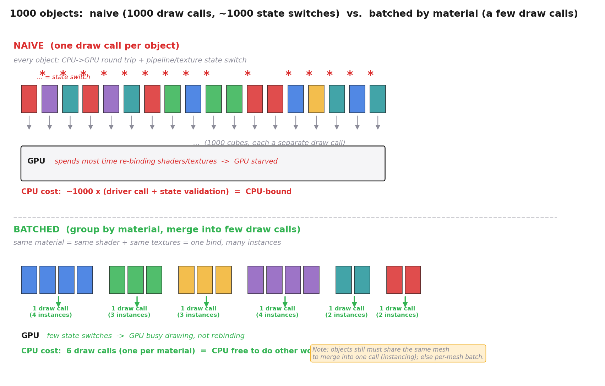
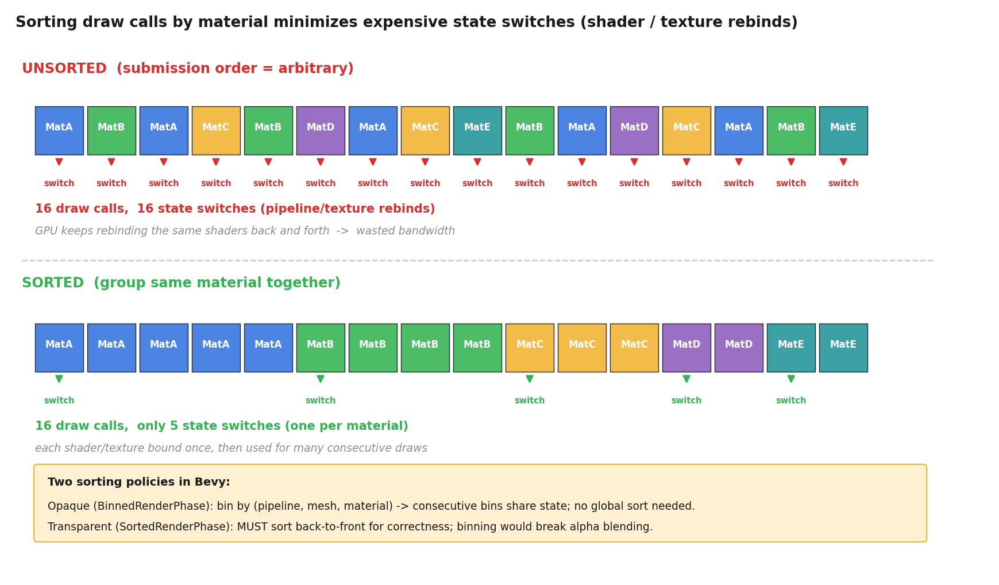
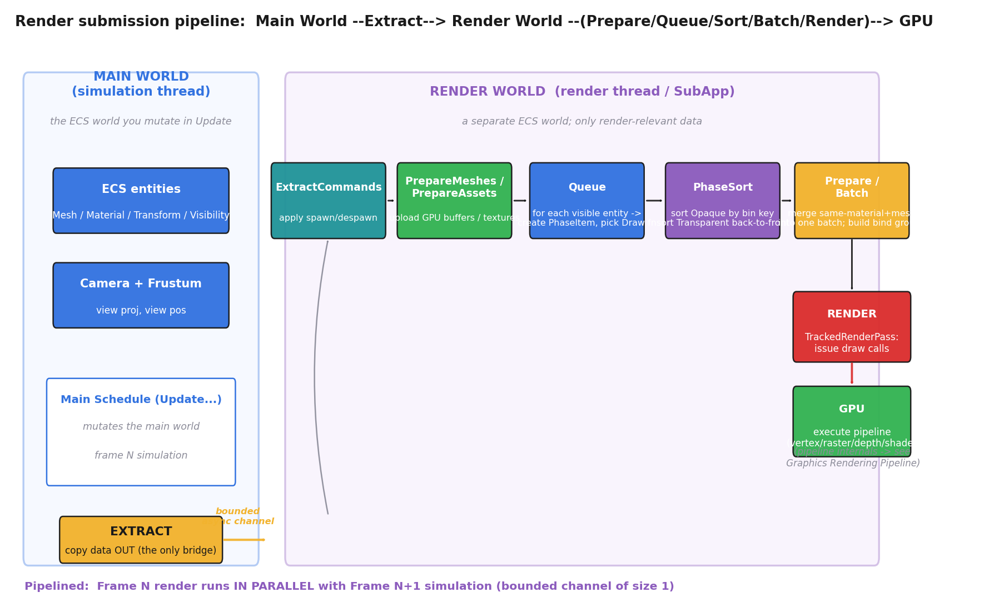
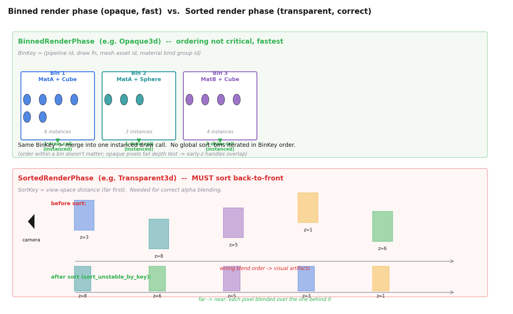

# 第 5 篇 · 第 18 章 · 渲染提交:引擎怎么驱动管线

> **核心问题**:前面十几章,我们一直在讲引擎怎么"组织"海量对象(ECS)、怎么"驱动"主循环让世界每帧前进一格。可这一切更新完之后,世界要**画出来**——而画一帧这件事,具体到代码层面,是引擎每帧把 ECS 里存着的 Mesh(网格)、Material(材质)、Transform(变换)数据,整理成 GPU 能执行的画图指令,提交给那条渲染管线。问题来了:ECS 里几千上万个可绘制实体,凭什么不能各自"喊一声 GPU 画我"?为什么非要在中间插一道"提取 / 剔除 / 排序 / 批处理 / 提交"的流水线?draw call 凭什么这么贵,贵到要把几千个对象合并成几十个才画?为什么 Bevy 的渲染干脆是另一个独立的 ECS 世界(SubApp),跑在另一条线程上,和模拟线程靠一个有界通道牵手?——本章要建立的就是这张图:**渲染提交是引擎里"驱动"那一面最重的一环,它不是"调一个画图函数",而是一条 Extract → Prepare → Queue → PhaseSort → Prepare/Batch → Render 的流水线,核心难题是把 ECS 数据高效喂给 GPU,而管线内部细节一律指路《图形渲染管线》**。

> **读完本章你会明白**:
> 1. **draw call 是什么、为什么贵**:每次"画一批"都要 CPU 往 GPU 发一个命令,还要做昂贵的状态切换(换着色器、换贴图);几千个对象各发一个 draw call,CPU 先成瓶颈。
> 2. **批处理(batching)**:相同 Material(相同着色器 + 相同贴图)+ 相同 Mesh 的对象,合并成一个 draw call(把它们的实例数据塞进一个数组),draw call 数大减。
> 3. **剔除**把看不见的根本不提交:视锥剔除(P3-12 讲透)在"提交给管线之前"就把视野外的对象干掉,本章把它放在提交流水线的正确位置。
> 4. **排序**:按 material / depth 组织提交顺序,让相同材质的连续画,把"状态切换"次数压到最少;不透明用 BinnedRenderPhase(按 BinKey 分桶),透明用 SortedRenderPhase(必须从远到近)。
> 5. **Bevy 的提交流水线**:主世界(Main World,模拟线程)→ Extract(唯一桥梁)→ 渲染世界(Render World,独立 SubApp + 独立线程)→ Queue / Sort / Batch → Render → GPU,而且**帧 N 的渲染 ∥ 帧 N+1 的模拟**(跨帧 pipeline,承 P1-03)。

> **如果一读觉得太难**:先只记三件事——① draw call 贵(每次都要 CPU→GPU 通信 + 状态切换),所以引擎要把相同材质的对象合并成少数几个 draw call(批处理);② 渲染提交不是"遍历 ECS 直接画",而是先提取到独立的渲染世界、再剔除、再排序、再批处理、再提交 GPU;③ Bevy 的渲染跑在独立线程上,和模拟线程并行,用一个有界通道传递数据,所以你看到的永远是"上一帧算完的画面"。**管线内部(顶点着色 / 光栅化 / 深度 / 着色)是《图形渲染管线》那本书的整条管线,本章一句带过 + 指路。**

---

## 〇、一句话点破

> **渲染提交,就是把 ECS 里"要画的东西"——每个可绘制实体的 Mesh、Material、Transform——每帧整理成 GPU 能执行的 draw call,提交给那条渲染管线。它的核心难题不是"怎么画",而是"怎么喂得够快":draw call 太贵(CPU→GPU 通信 + 状态切换),几千个对象各画一个 CPU 就死,所以要剔除(看不见的不喂)、批处理(同材质合并成少数几个 draw call)、按材质排序(连续画减少状态切换)。而整个提交过程在 Bevy 里跑在一个独立的渲染世界和独立的线程上,和模拟线程靠有界通道牵手,实现"帧 N 渲染 ∥ 帧 N+1 模拟"的跨帧 pipeline。**

这是结论。本章倒过来拆:先讲清 draw call 凭什么贵(这是整章的动机根),再讲批处理怎么把 draw call 数砍下去,然后讲排序和剔除怎么进一步压开销,最后把这一切落到 Bevy 的真实源码上——Extract → Render 世界 → Queue → PhaseSort → Prepare/Batch → Render 这条流水线,看清它怎么在真实引擎里落地。**管线本身(顶点变换、光栅化、深度测试、像素着色、输出合并)一句带过指路《图形渲染管线》,篇幅全留给"引擎怎么喂给管线"这件游戏引擎独有的事**。

> **★承《图形渲染管线》**:GPU 收到 draw call 之后做的事——顶点着色器把顶点变换到屏幕、光栅化把三角形扫成像素、深度测试决定谁挡谁、像素着色器算颜色、输出合并写回帧缓冲——是那本书的整条管线主题。本书讲到"GPU 执行管线"一律一句带过,指路 [[graphics-series-project]]。本章的舞台是管线**之前**的那段:从 ECS 数据到 draw call 的整条提交链路。

---

## 一、从 ECS 数据到画面:中间到底发生了什么

### 1.1 一个再普通不过的需求

假设你已经按第 2 篇讲的搭好了一个 ECS 世界:几千个实体,每个挂着 `Mesh`(网格资产句柄)、`Material`(材质句柄)、`Transform` / `GlobalTransform`(世界变换,P3-12 讲透)、`ViewVisibility`(可见性,P3-12 讲透)。相机也摆好了。现在你想让画面出来。

最直觉的写法,在主循环的 render 段直接这么干:

```python
# 朴素想法: 遍历所有可见实体, 每个发一个 draw call
for entity in query_entities_with(Mesh, Material, GlobalTransform, ViewVisibility):
    if not entity.view_visibility: continue        # 不可见, 跳过
    gpu.set_pipeline(material_of(entity).pipeline) # 装着色器
    gpu.set_bind_group(0, camera_bind_group)       # 装相机数据
    gpu.set_bind_group(1, material_of(entity).bind_group)  # 装材质贴图
    gpu.set_vertex_buffer(mesh_of(entity).vertex_buffer)
    gpu.draw()   # 画!
```

这段代码看着完全没问题。可一旦你真拿它去画几千个对象,帧率会立刻崩掉——不是因为 GPU 画不动,而是 **CPU 来不及给 GPU 发命令**。要讲清为什么,得先看清 **draw call 凭什么这么贵**。

### 1.2 draw call:一次昂贵的 CPU→GPU 通信

什么是 draw call?通俗讲,就是 **CPU 通过图形 API(Direct3D / Vulkan / Metal / WebGL)给 GPU 下一条"画一批三角形"的命令**。这条命令的代价远不止"发一条消息"那么简单,它包含三块开销:

**① 驱动层验证开销**:图形 API 不是直接把命令塞给 GPU 的,中间隔着 GPU 驱动。每次 draw call,驱动要做一堆状态校验——"你装的着色器和当前顶点格式匹配吗?""绑定的纹理格式对吗?""渲染目标的格式合法吗?"——这些校验在 CPU 上跑,且常常是同步的。一次 draw call 的 CPU 端开销,从几十微秒到几百微秒不等。

**② 状态切换开销**:这是更致命的一块。draw call 不是孤立的,它依赖一组"渲染状态"——当前装着哪个着色器(pipeline)、绑定了哪些贴图(bind group)、用的是哪个顶点缓冲。**每换一次状态,GPU 都要做一次"上下文切换"**:旧的着色器卸下来、新的装上去,贴图描述符表重写,渲染管线可能要刷新。状态切换的代价,远大于画几个三角形本身的代价。所以引擎圈有句行话:**"draw call 便宜,状态切换贵。"**

**③ 命令缓冲提交开销**:CPU 写进命令缓冲的指令,最终要跨 PCIe 总线送到 GPU。这条总线带宽有限,延迟高(纳秒到微秒级)。命令越多,提交越慢。

> **钉死这件事**:draw call 贵,贵在 **CPU→GPU 的驱动验证 + 状态切换 + 总线提交**。一次 draw call,画的三角形多寡其实无所谓(画 3 个还是 3000 个,GPU 一会儿就完),贵的是"发起这次 draw call"这个动作本身。所以引擎优化的核心目标从来不是"画得更少三角形",而是**"发更少的 draw call"**——把多个对象的三角形,合并进一次 draw call 里画。

把这三块开销想清楚,就明白为什么 1.1 那段朴素代码会崩:几千个对象,每个发一个 draw call,光 CPU 端的驱动验证就吃掉几十毫秒,**16ms 帧预算根本不够,而且 GPU 还在空等**。GPU 在大部分时间里没活干,因为 CPU 忙着一个个发命令——这就是所谓的 **CPU-bound**(瓶颈在 CPU 提交,不在 GPU 渲染)。

> **不这样会怎样**:如果一个游戏几千个可绘制对象各发一个 draw call,现代 GPU 画这些三角形本身只要 1~2 毫秒,可 CPU 发命令要 30~50 毫秒——你买再贵的显卡也没用,帧率被 CPU 卡死。这就是为什么所有现代引擎都在"怎么把 draw call 数压下去"上花大力气,这也是本章存在的根本动机。

### 1.3 draw call 数怎么压下去:批处理(batching)

既然 draw call 贵的不是"画几个三角形"而是"发起这个动作",那自然的优化思路就是:**把多个对象的三角形,塞进一次 draw call 里画**。这就是**批处理(batching)**。

批处理的核心契约极简:**只要一组对象共享同一组渲染状态(同一个着色器 + 同一组贴图,也就是同一个 Material)和同一个 Mesh,它们的三角形就能合并进一个 draw call**。理由是:同 Material 意味着状态切换为零(着色器和贴图都不变);同 Mesh 意味着顶点缓冲可以复用;不同的只是每个对象的世界变换(把 Mesh 摆到不同位置)——而这个差异用**实例数据(instance data)**表达,每个实例存一个 4×4 矩阵,放进一个数组,GPU 一次画完所有实例。这就是 GPU 的 **instancing(实例化)** 能力。

举个具体的例子。场景里 1000 个一模一样的箱子,都用同一个木质材质。朴素做法 1000 个 draw call;批处理后,把它们的世界变换塞进一个 1000 元素的数组,**一个 draw call 画完 1000 个箱子**。draw call 数从 1000 砍到 1。



那"同 Material + 同 Mesh"这个约束怎么满足?真实场景里,几百种对象千变万化,不是所有箱子都一样。这就引出**按 Material 分组批处理**的策略:引擎把所有可绘制对象按 Material(再按 Mesh)分桶,同一个桶里的对象合并成一个 draw call,桶与桶之间换一次状态。1000 个对象,如果分属 6 种材质、每种若干 Mesh,大致是几十个 draw call——比 1000 个少了一两个数量级。

> **钉死这件事**:批处理 = **把共享同一 Material(同着色器 + 同贴图)和同一 Mesh 的对象,合并进一个 instanced draw call**。draw call 数从"对象数"降到"材质×网格的种类数"。代价是桶与桶之间仍要换状态,但状态切换次数从"每对象一次"降到"每材质一次"——这就是下一节排序要解决的问题。

### 1.4 GPU instancing:一个 draw call 画一批的底层机制

批处理依赖 GPU 硬件的一个能力:**instancing(实例化)**。这是现代图形 API(Vulkan / Metal / DX12 / WebGL 2)都支持的特性,理解它能帮你看清"为什么合并进一个 draw call 是合法的"。

正常一个 draw call 画的是**一份**几何(一组三角形 + 一套世界变换)。instancing 让一个 draw call 画**多份**同一几何,每份用不同的"实例数据"。API 层面,你调用 `draw_indexed(vertices, index_count, instance_count)`,其中 `instance_count` 就是这次 draw call 要画多少份;在着色器里,你能拿到一个内置变量 `instance_index`(范围 0..instance_count),用它从一个**实例数据数组**里取出这一份的世界变换、颜色等参数。

这个"实例数据数组",正是 Bevy 批处理时往里塞东西的 `BatchedInstanceBuffer`。每个实例存一个 4×4 矩阵(世界变换)和可能的少量其他参数(如材质参数偏移),在 GPU 上是一个 storage buffer(现代平台)或 dynamic uniform buffer(WebGL 2)。着色器里,顶点着色器做这样的事:

```glsl
// 伪 WGSL: 每个顶点, 根据当前 instance_index 取对应世界变换
@vertex
fn vs_main(in: VertexInput, @builtin(instance_index) inst_idx: u32) -> ... {
    let world = mesh_instances[inst_idx].world_transform;  // 从实例数组取这一份的变换
    let world_pos = world * vec4(in.position, 1.0);
    // 后续: view_proj * world_pos -> 裁剪空间, 进管线 (《图形渲染管线》讲透)
    ...
}
```

关键点:**顶点缓冲(Mesh 的三角形数据)只绑一次,所有实例共用**;变化的只是每个实例的世界变换,从实例数组取。所以一个 draw call 能画 1000 个不同位置的箱子,顶点数据没复制 1000 份,GPU 也不重复加载同一份几何。这就是"画几个三角形几乎不贵,贵的是发起 draw call"的硬件根——只要你复用同一份几何,画 1 个和画 1000 个的 GPU 成本几乎一样。

> **钉死这件事**:instancing 是批处理的硬件基础——**顶点缓冲只绑一次,所有实例共用;每个实例的差异(世界变换等)从实例数据数组取**。所以一个 draw call 画 1000 个同 Mesh 对象,GPU 成本几乎等于画 1 个。这是"合并进一个 draw call"在 GPU 层面可行的根。instancing 内部的着色器细节(顶点变换怎么走、《图形渲染管线》讲的那条管线)指路 [[graphics-series-project]]。

### 1.5 不是所有对象都能批处理:unbatchable

讲完 instancing,要诚实说一句:**不是所有"同 Material + 同 Mesh"的对象都能并入同一 batch**。Bevy 在 BinnedRenderPhase 里专门留了一个 `unbatchable_meshes` 字段,装那些不能批的对象。什么情况会进这里?

- **着色器变体太多**:同一个 Material,如果它的着色器有大量 `#ifdef` / shader def,不同实例可能 specialize 出不同的 pipeline(不同的着色器编译产物),这些 pipeline 不能并入同一 batch(因为状态不同)。
- **需要 per-instance 特殊渲染状态**:某些对象有自定义的 render command(在 Draw function 里设了 per-instance 的特殊状态),没法简单塞进实例数组。
- **平台限制**:WebGL 2 不支持 storage buffer,uniform buffer 有大小限制,大 batch 装不下时只能拆。

这些对象每个自己一个 draw call,不并入。这呼应 4.7 节源码里 `unbatchable_meshes` 单独处理的逻辑——批处理不是无条件的,引擎要识别"能批的"和"不能批的",分别走两条路径。

---

## 二、按 Material 排序:让状态切换次数最小

### 2.1 状态切换次数由"提交顺序"决定

批处理按 Material 分桶解决了"同桶内不切状态",但桶和桶之间还是要切。问题是:**桶的提交顺序怎么排?**

假设有 1000 个对象,分属 6 种材质。如果提交顺序是 `MatA, MatB, MatA, MatC, MatB, MatD, MatA, ...`——同材质的对象**散落在提交序列里到处都是**,那每次相邻两个 draw call 的材质都不同,**每次都要切状态**,1000 个 draw call 里有 1000 次状态切换。批处理的"同桶合并"收益被提交顺序的混乱吃掉了。

但如果引擎**先按 Material 排序**,把所有 MatA 的对象画完、再画所有 MatB 的、再画所有 MatC 的……那么状态切换只发生在"换材质"的那几个边界上,1000 个 draw call 里只有 6 次状态切换(每个材质一次)。



这就是排序的动机:**排序让"相同状态"的 draw call 连续提交,把状态切换次数压到最少**。

> **钉死这件事**:状态切换次数由 **draw call 的提交顺序**决定。按 Material 排序,同材质的连续画,状态切换次数 = 材质种类数(而不是对象数)。这是数据导向思想在渲染提交上的兑现——**不是按"对象在场景里出现的位置"组织,而是按"提交给 GPU 时怎么连续"组织**(承 P2-06 SoA 的同一种思想:按访问方式布局数据)。

### 2.2 不透明 vs 透明:两种不同的排序策略

排序还有个更微妙的层面:**不同类型的对象,排序目标不一样**。

**不透明对象(opaque)**:不透明意味着它后面的东西会被它挡住。从 GPU 视角,不透明对象的画图顺序**不影响最终画面正确性**——因为深度测试(depth test,《图形渲染管线》讲透)会保证近的挡住远的,不管先画近还是先画远,结果一样。所以不透明对象,引擎追求"状态切换最少",按 Material 分桶连续画,完全不在乎桶之间的深度顺序。

**透明对象(transparent)**:透明对象就完全不同了。透明意味着你能透过它看到后面的东西,这就要求**后面的先画、前面的后画**——也就是从远到近画,这叫**画家算法(painter's algorithm)**。如果顺序错了,前面的透明物体先画了,后面的东西就再也没法"透过它"正确混合(因为帧缓冲里还没有"后面的东西"),画面会出现明显的视觉错误(透明物体变成实心,或者半透明物体边缘错乱)。

所以透明对象的排序**目标是正确性,不是性能**——必须按深度(到相机的距离)从远到近排。这和"按 Material 分桶"是冲突的:你不可能既按 Material 分桶(为了少切状态)又按深度排序(为了正确)。引擎的选择是:**透明对象牺牲一些性能,保证正确性,按深度全局排序**。

> **钉死这件事**:不透明对象按 Material 分桶(性能优先,顺序不影响正确性,深度测试兜底);透明对象按深度从远到近排(正确性优先,画家算法)。这两套策略在 Bevy 里对应两个不同的数据结构:`BinnedRenderPhase`(不透明,按 BinKey 分桶,无需全局排序)和 `SortedRenderPhase`(透明,按 SortKey 全局排序)。下一节源码对照里我们看清它们的区别。

### 2.3 为什么画家算法必须严格从远到近

把透明体的排序展开讲透,因为它有个不踩不知道的坑。透明物体之所以必须从远到近画,根在 **alpha 混合(blending)** 的数学。最常用的混合公式是:

```
结果色 = 源色 × 源alpha + 目标色 × (1 - 源alpha)
```

这里"源色"是这次 draw call 写入的颜色(当前透明体),"目标色"是帧缓冲里已有的颜色(它后面的东西)。注意公式是**不对称**的——`源alpha` 只乘以源色,`(1 - 源alpha)` 乘以目标色。这意味着:**先画的会被后画的"透过"看到,但后画的没法被先画的透过看到**(因为先画的已经把帧缓冲覆盖了,即使它是半透明)。

所以正确顺序必须是:**最远的先画(它后面没有更远的透明体了),然后次远,一层层往前画**。每画一个,帧缓冲里已经有了"它后面所有东西"的正确结果,它和这个结果做 alpha 混合,得到的就是"透过它看到后面"的正确画面。如果反过来(从近到远画),近的先画了,帧缓冲里还没有"它后面的东西",alpha 混合的"目标色"是错的,画出来就是错的——透明体会变成像是贴在一堵墙上,而不是真的"透明"。

这有个连带陷阱:**两个透明体在同一深度**(深度值相同或非常接近),画家算法会有歧义——谁先画都不一定对,这叫**深度冲突(z-fighting)** 在透明体的变种。真实引擎的处理是:要么艺术家手动避免这种重叠,要么引擎对同深度的透明体做稳定排序(同深度按 entity ID 排,保证每帧顺序一致,避免画面抖动)。Bevy 的 `SortedPhaseItem::sort` 默认用 `sort_unstable_by_key`,但注释提示"同类型批处理应该用 stable sort",就是因为这个——透明体的稳定排序有时比快更重要。

> **不这样会怎样**:如果透明体不排序(或排序错乱),画面会出现明显的视觉错误——玻璃杯变成实心的(后面没透过它)、半透明的烟雾边缘出现色块、烟雾从某些角度看像贴在墙上。这些 bug 在游戏开发里极其常见,根因全是排序。所以 Bevy 把透明体单独拎出来用 SortedRenderPhase 全局排序,牺牲一些性能换正确性。不透明体没有这个问题,因为深度测试保证"近的挡住远的",顺序无所谓。

> **钉死这件事**:透明体必须严格从远到近画,根在 alpha 混合公式的不对称(源色乘 alpha、目标色乘 1-alpha)——先画的会被后画的透过,反过来不行。这就是画家算法。同深度透明体有歧义,引擎要么靠稳定排序保证一致性,要么靠艺术家避免重叠。不透明体没有这个问题(深度测试兜底),所以能放心按 Material 分桶追求性能。

### 2.4 一个对老资料的修正:排序不只是按 Material

很多老教程会说"渲染前按 Material 排序就够了"。真实引擎里,"换一次状态"远不止换 Material 这一项——它包括换 pipeline(着色器编译产物)、换顶点缓冲(Mesh)、换 bind group(贴图 + uniform)。**Material 只是其中一类状态**,真实排序要考虑的是一个组合 key。

Bevy 的做法是用一个**复合 BinKey**,把"会影响状态切换的所有因素"都编码进去。我们到源码对照那节会看到 `BinnedPhaseItem::BinKey` 通常长这样(简化):

```
BinKey = (pipeline_id, draw_function_id, mesh_asset_id, material_bind_group_id, ...)
```

按这个复合 key 排序,意味着两个对象只有当**着色器相同 + draw 函数相同 + 网格相同 + 材质相同**时才能并入同一桶。这比"只看 Material"严格得多,但保证桶内真的零状态切换。源码注释甚至建议"按绑定顺序排 BinKey 的成员",以最大化复用。

> **钉死这件事**:排序的 key 不是单维的"Material",而是一个**复合 key**(pipeline + draw fn + mesh + material + ...),每个维度都对应一类状态切换。按这个复合 key 分桶 / 排序,才能真的把状态切换压到最小。这是对"按 Material 排序就够了"印象的修正——现代引擎排序的 key 是多维的。

---

## 三、剔除:看不见的根本不提交

讲完 draw call 和排序,还有一块同样重要的优化:**剔除(culling)**。它的思想一句话:**看不见的对象,根本不生成 PhaseItem、不参与批处理、不发 draw call**。

P3-12 已经把剔除的原理讲透了(视锥剔除的 AABB vs 视锥相交测试、空间划分数据结构怎么把 O(n) 降到 O(log n + k)、Bevy 的 `check_visibility_cpu_culling` 多关早退出流水线)。本章**不重讲**剔除本身,只关心它在渲染提交流水线里的位置和作用。

> **承 P3-12 讲透**:视锥剔除的几何原理(AABB vs 视锥 6 平面相交)、空间划分三剑客(四叉树 / 八叉树 / BVH)、Bevy 的 `check_visibility_cpu_culling` 多关早退出流水线(`层级可见性 → RenderLayers → 距离 → 球测试 → AABB 测试`)+ `par_iter_mut` 对象级并行,以及"Bevy CPU 路径当前没用 BVH,大规模才上 GPU 剔除"的事实修正,**全部在 P3-12 第 5 节讲透了,这里不重讲**,指路 [[P3-12-场景图与空间划分]]。

剔除放在提交流水线的哪一步?**在"生成 PhaseItem 之前"**。引擎遍历所有可绘制实体,先做剔除测试,只有通过测试(在视野内、没被层级隐藏、没超出距离)的实体,才会被生成一个 PhaseItem 进 render phase,参与后续的批处理和 draw call。被剔除的实体,在提交流水线里**根本不存在**。

这有一个非常重要的连带效应:**剔除做得越好,后面的批处理和 draw call 数就越少**。典型场景里,可见集只占总对象数的 5%~10%——也就是说,90% 的对象在剔除阶段就被干掉,根本不会进入"按 Material 分桶"的流程。批处理要处理的,只是那剩下的一小撮。

> **钉死这件事**:剔除在提交流水线的最前面,**只有通过剔除的对象才生成 PhaseItem**。它把"要喂给管线的对象数"从几万砍到几千,批处理和 draw call 数都跟着线性下降。剔除和批处理是两层独立的优化,但它们叠在一起才让 16ms 帧预算够用。剔除的原理 P3-12 讲透,本章只点出它在提交流水线里的位置。

---

## 四、Bevy 的提交流水线:Extract → ... → Render

讲完 draw call、批处理、排序、剔除四个核心概念,现在把它们落到 Bevy 的真实源码上。我们会看到,这些概念在 Bevy 里**不是散落的函数,而是一条严格分阶段的流水线**,跑在一个独立的渲染世界和独立的线程上。这是本章最硬的"源码对照"。

### 4.1 两个世界:Main World 和 Render World

P1-03 已经发现 Bevy 的渲染是独立 SubApp,这里我们把它彻底拆透。Bevy 里有两个 ECS 世界:

- **Main World(主世界)**:你写游戏逻辑时直接打交道的那个 ECS 世界。你的 `Update` schedule 在这里跑,你的 `Mesh` / `Material` / `Transform` 组件挂在这里的实体上,你的脚本系统、AI、动画、物理都在这里读写数据。这个世界跑在**主线程**(模拟线程)。
- **Render World(渲染世界)**:一个**独立**的 ECS 世界,专门用来存"渲染这一帧需要的数据"。它有自己的实体、组件、资源、schedule。这个世界跑在**渲染线程**上。

为什么要拆两个世界?核心原因是**渲染要能和模拟并行**。如果只有一个世界,模拟在写 `Transform`(角色移动了),渲染同时在读同一个 `Transform`,要么加锁(慢),要么数据竞争(bug)。Bevy 的解法是:**每帧,在模拟和渲染之间,只做一次"拷贝"——把模拟算好的、渲染需要的数据,复制一份到渲染世界;之后两个世界各跑各的,互不干扰**。这次"拷贝"就是下一节的 Extract。

两个世界的拆分还有一个微妙的好处:**渲染世界只存渲染相关数据**,不会因为主世界里挂了一堆游戏逻辑组件(AI 状态机、任务系统)而拖累渲染系统的遍历。这其实是 ECS 数据导向思想的极致延伸——**连"模拟用的世界"和"渲染用的世界"都按各自的访问方式分开布局**。

### 4.2 Extract:唯一的桥梁

Extract 是两个世界之间**唯一的数据交互点**。它在每帧模拟结束后跑一次,把主世界里渲染需要的数据(Mesh 句柄、Material 句柄、GlobalTransform、相机参数、灯光、可见性)拷贝到渲染世界对应的实体上。

源码看 `PipelinedRenderingPlugin`([crates/bevy_render/src/pipelined_rendering.rs](https://github.com/bevyengine/bevy/blob/master/crates/bevy_render/src/pipelined_rendering.rs)),它的注释里画了一张帧内时序图,我们直接抄过来:

```
|      |         | RenderExtractApp schedule | winit events | main schedule |
| sync | extract |---------------------------------------------------------|
|      |         | extract commands | rendering schedule                |
|-----------------------------------------------------------------------|
```

读这张图:`sync`(同步两个世界的实体映射)→ `extract`(把数据从主世界拷到渲染世界)→ 渲染线程开跑(apply extract commands → rendering schedule),与此同时主线程继续处理 winit 事件、跑 main schedule(下一帧的模拟)。**关键点:extract 是主线程干的活,它跑完之后主线程立刻可以进下一帧模拟,渲染在另一条线程上慢慢跑**——这就是跨帧 pipeline 的根。

extract 的具体实现,是一个 `renderer_extract` 函数(同文件):

```rust
// crates/bevy_render/src/pipelined_rendering.rs (简化)
fn renderer_extract(app_world: &mut World, _world: &mut World) {
    app_world.resource_scope(|world, main_thread_executor| {
        world.resource_scope(|world, mut render_channels| {
            // 1. 等渲染线程把 render app 还回来 (上一帧渲染完了)
            if let Some(mut render_app) = ComputeTaskPool::get()
                .scope_with_executor(true, Some(&*main_thread_executor.0), |s| {
                    s.spawn(async { render_channels.recv().await });
                })
                .pop()
                .unwrap()
            {
                // 2. 在主线程上, 把主世界的数据 extract 进 render app 的世界
                render_app.extract(world);
                // 3. 把装好数据的 render app 通过通道发回渲染线程
                render_channels.send_blocking(render_app);
            }
        });
    });
}
```

读这段,核心是一个**借还模式**:主线程通过通道"借"回 render app(上一帧渲染完了,渲染线程把 app 还回来了),在主线程上 extract 一帧的数据,再通过通道"还"给渲染线程去画。这个通道是什么?下一节看。

> **钉死这件事**:Extract 是 Main World 和 Render World 之间**唯一的数据桥梁**,每帧一次,在主线程上跑。它把渲染需要的数据拷贝一份到渲染世界,之后两个世界各跑各的。extract 跑完,主线程立刻进下一帧模拟,渲染在另一条线程上跑——这就是跨帧 pipeline 的实现基础。

### 4.3 跨帧 pipeline:有界通道 + 渲染线程

两个世界之间用什么传递数据?是一个**有界异步通道(bounded async channel)**,容量为 1。源码 `RenderAppChannels`:

```rust
// crates/bevy_render/src/pipelined_rendering.rs (简化)
pub struct RenderAppChannels {
    app_to_render_sender: Sender<SubApp>,      // 主线程 -> 渲染线程
    render_to_app_receiver: Receiver<SubApp>,  // 渲染线程 -> 主线程
    render_app_in_render_thread: bool,
}
```

容量 1 的有界通道意味着:**主线程往里塞了 render app,通道就满了,要再塞必须等渲染线程把上一个取走**。这天然实现了"一帧在画、一帧在模拟"的流水线节拍——主线程不会超前渲染线程两帧,也不会落后。源码注释里画的流水线时序图一目了然:

```
|--------------------|--------------------|--------------------|--------------------|
| simulation thread  | frame 1 simulation | frame 2 simulation | frame 3 simulation |
|--------------------|--------------------|--------------------|--------------------|
| rendering thread   |                    | frame 1 rendering  | frame 2 rendering  |
|--------------------|--------------------|--------------------|--------------------|
```

**第 N 帧的模拟 ∥ 第 N-1 帧的渲染**,两条线程都在干活,CPU 和 GPU 都不闲着。代价是:玩家看到的画面**永远是上一帧算完的**(有 1 帧延迟,约 16ms)。这个延迟对绝大多数游戏无感,但极追求低延迟的格斗 / 射击游戏会权衡是否启用 pipeline。

渲染线程本身是一个普通 OS 线程,源码里 `std::thread::spawn` 起:

```rust
// crates/bevy_render/src/pipelined_rendering.rs (简化)
std::thread::spawn(move || {
    loop {
        // 等主线程把 render app 发过来
        let sent_app = compute_task_pool.scope(|s| {
            s.spawn(async { app_to_render_receiver.recv().await });
        }).pop();
        let Some(Ok(mut render_app)) = sent_app else { break; };

        // 跑这一帧的渲染 schedule (ExtractCommands -> Prepare -> Queue -> ... -> Render)
        render_app.update();

        // 画完了, 把 render app 还给主线程
        if render_to_app_sender.send_blocking(render_app).is_err() {
            break;
        }
    }
});
```

注意那个 `render_app.update()`——它跑的就是渲染世界的 schedule,也就是下面要拆的那条流水线。

> **钉死这件事**:跨帧 pipeline 的实现 = **容量 1 的有界通道 + 一个独立的渲染线程**。主线程 extract 完把 render app 发过去,渲染线程取走跑一帧渲染,跑完再还回来。这天然把"一帧模拟 + 一帧渲染"串成一条流水线,两条线程并行,CPU/GPU 都不闲。代价是 1 帧显示延迟。这套机制承 P1-03(那里点出"渲染是独立 SubApp"),本章把它彻底拆透。

### 4.4 渲染世界的 schedule:Extract → Prepare → Queue → PhaseSort → Prepare → Render

渲染世界拿到一帧的数据后,跑自己的 schedule。这个 schedule 在 Bevy 里是一组顺序严格的 `RenderSystems` set。看源码([crates/bevy_render/src/lib.rs](https://github.com/bevyengine/bevy/blob/master/crates/bevy_render/src/lib.rs) 的 `RenderSystems` enum 和 `Render::base_schedule`):

```rust
// crates/bevy_render/src/lib.rs (RenderSystems enum, 简化)
pub enum RenderSystems {
    ExtractCommands,    // 应用 extract 阶段产生的 spawn/despawn 命令
    PrepareAssets,      // 准备本帧新建/修改/删除的资产
    PrepareMeshes,      // 把提取来的 mesh 数据上传成 GPU buffer
    CreateViews,        // 创建额外的 view (如阴影贴图的 view)
    Specialize,         // 根据 mesh + material 选定具体的着色器变体
    PrepareViews,       // 准备 view 相关资源
    Queue,              // 为每个可见实体生成 PhaseItem, 放进 render phase
    QueueMeshes,        // Queue 内的子段: 专管 mesh entity
    QueueSweep,         // Queue 内的子段: 清理已不可见 / 换 phase 的 entity
    PhaseSort,          // 排序: Opaque 按 BinKey, Transparent 按深度
    Prepare,            // 准备 GPU 资源 (bind group 等); 批处理也在这段
    PrepareResources,   // Prepare 子段: 初始化 buffer/texture/uniform
    PrepareResourcesBatchPhases,    // Prepare 子段: 给 render phase 建批
    PrepareResourcesWritePhaseBuffers, // Prepare 子段: 把批数据写 GPU
    PrepareResourcesCollectPhaseBuffers,
    PrepareResourcesFlush,
    PrepareBindGroups,  // Prepare 子段: 建 bind group
    Render,             // 真正画! 在这里发 draw call
    Cleanup,            // 清理本帧资源
    PostCleanup,        // 最终清理 (删 TemporaryRenderEntity)
}
```

而且 `Render::base_schedule()` 里明确用 `.chain()` 把这些 set **串成一条不可乱序的链**:

```rust
// crates/bevy_render/src/lib.rs (Render::base_schedule, 简化)
schedule.configure_sets(
    (ExtractCommands, PrepareMeshes, CreateViews, Specialize, PrepareViews,
     Queue, PhaseSort, Prepare, Render, Cleanup, PostCleanup).chain(),
);
```

这条链就是我们本章一直在拆的提交流水线的真实落地。把它和前几节的概念对应一下:

- **Extract**(主线程,4.2 节)把数据拷到渲染世界。
- **ExtractCommands** 应用 spawn/despawn,渲染世界的实体和主世界同步。
- **PrepareMeshes / PrepareAssets** 把 Mesh 顶点数据、Material 贴图等大资产上传到 GPU buffer。这一步是承 P4-13 资源管理的——大资产的 GPU 上传是一次性的,不是每帧重传。
- **Queue** 是本章的核心:**为每个通过剔除的可见实体,生成一个 PhaseItem,放进对应的 render phase**(不透明的进 BinnedRenderPhase,透明的进 SortedRenderPhase)。每个 PhaseItem 绑定一个 Draw function(下一节展开)。
- **PhaseSort** 排序:Binned 的按 BinKey 排(其实 BinKey 是 Ord,桶本身有序),Sorted 的按 SortKey 全局排序(默认 `sort_unstable_by_key`)。
- **Prepare**(尤其 `PrepareResourcesBatchPhases`)做**批处理**:把同 BinKey 的 entity 并入一个 batch,把每实例数据(如 MeshUniform)塞进 `BatchedInstanceBuffer`,写 GPU。
- **Render** 用 `TrackedRenderPass` 把每个 batch 发一个 draw call,GPU 执行管线。
- **Cleanup / PostCleanup** 清理临时实体。



> **钉死这件事**:Bevy 的渲染提交是一条**严格分阶段、用 `.chain()` 串起来的 schedule**,从 ExtractCommands 到 Render 共十余个 set,每个 set 干一件明确的事。这条链就是我们讲的"剔除 → 排序 → 批处理 → 提交"概念在真实引擎里的落地。其中 **Queue**(生成 PhaseItem)、**PhaseSort**(排序)、**Prepare/Batch**(批处理)、**Render**(发 draw call)是本章核心的四个阶段。

### 4.5 render phase:PhaseItem 和 Draw function

到这一步,我们该看清 render phase 这个核心数据结构了。它装的是"这一帧要画的全部指令",每个指令叫一个 **PhaseItem**。

看源码([crates/bevy_render/src/render_phase/mod.rs](https://github.com/bevyengine/bevy/blob/master/crates/bevy_render/src/render_phase/mod.rs))。模块开头的注释把整个抽象讲得清清楚楚:

```
//! In Bevy each view (camera, or shadow-casting light, etc.) has one or multiple
//! render phases (e.g. opaque, transparent, shadow, etc).
//! They are used to queue entities for rendering.
//! Multiple phases might be required due to different sorting/batching behaviors
//! (e.g. opaque: front to back, transparent: back to front) or because one phase
//! depends on the rendered texture of the previous phase.
//!
//! To draw an entity, a corresponding PhaseItem has to be added to one or multiple
//! of these render phases for each view that it is visible in.
//! This must be done in the RenderSystems::Queue.
//! After that the render phase sorts them in the RenderSystems::PhaseSort.
//! Finally the items are rendered using a single TrackedRenderPass, during
//! the RenderSystems::Render.
//!
//! Therefore each phase item is assigned a Draw function.
//! These set up the state of the TrackedRenderPass (i.e. select the RenderPipeline,
//! configure the BindGroups, etc.) and then issue a draw call, for the corresponding item.
```

读这段,几个关键事实:

1. **每个 view(相机 / 阴影投射光源)有一个或多个 render phase**(不透明、透明、阴影等)。同一个对象,在不同 view 里可能进不同的 phase。
2. **PhaseItem 是 Queue 阶段生成的**——遍历可见实体,每个生成一个 PhaseItem。
3. **PhaseSort 阶段排序**。
4. **每个 PhaseItem 绑定一个 Draw function**——这个 function 在 Render 阶段被调用,负责"装 pipeline、配 bind group、发 draw call"。

PhaseItem 本身的 trait 定义(同文件):

```rust
// crates/bevy_render/src/render_phase/mod.rs (简化)
pub trait PhaseItem: Sized + Send + Sync + 'static {
    /// 是否参与自动批处理 (默认 true)
    const AUTOMATIC_BATCHING: bool = true;

    /// 对应的 render 世界里的 entity
    fn entity(&self) -> Entity;
    fn main_entity(&self) -> MainEntity;

    /// 指定画这个 item 用哪个 Draw function
    fn draw_function(&self) -> DrawFunctionId;

    /// 这个 batch 覆盖的实例范围; 画完一个 batch 后跳过这么多 item
    fn batch_range(&self) -> &Range<u32>;
    fn batch_range_mut(&mut self) -> &mut Range<u32>;

    /// 额外索引 (dynamic offset 或 indirect parameters index)
    fn extra_index(&self) -> PhaseItemExtraIndex;
}
```

注意 `draw_function()` 和 `batch_range()`:**前者把"画法"参数化(可以组合多个 RenderCommand 成一个 Draw function),后者记录"这个 draw call 覆盖了哪几个实例"**——批处理合并后,`batch_range` 会跨越多个原始 item,Render 时跳过它们,实现"一个 draw call 画一批"。

> **钉死这件事**:render phase 是"这一帧要画的指令列表",每个指令是个 PhaseItem,绑定一个 Draw function(负责装 pipeline / 配 bind group / 发 draw call)。批处理通过扩展 PhaseItem 的 `batch_range` 实现——一个 batch 覆盖的 item 范围被合并,Render 时画一个 draw call 然后跳过这些 item。这是"draw call 怎么发出去"在数据结构层面的落地。

### 4.5.1 Draw function:可组合的 RenderCommand

Draw function 这个抽象值得单独展开,因为它体现了 ECS 思想在"渲染命令"层面的延伸。一个 Draw function 听起来像个函数,但其实它通常不是手写的一个大函数,而是**由若干个小的 RenderCommand 组合而成**。

看 Bevy 源码里最典型的例子——画一个带材质的 mesh,它的 Draw function 是这样的(简化):

```rust
// 简化: DrawMaterial 是一组 RenderCommand 的组合 (真实代码在 bevy_pbr)
type DrawMaterial = (
    SetItemPipeline,            // 1. 装 pipeline (选定着色器变体)
    SetMeshViewBindGroup<0>,    // 2. 绑 bind group 0: 相机 uniform (view proj)
    SetMeshBindGroup<1>,        // 3. 绑 bind group 1: mesh 顶点缓冲
    SetMaterialBindGroup<2>,    // 4. 绑 bind group 2: 材质贴图 + 材质参数
    DrawMesh,                   // 5. 真正发 draw call
);
```

每个 RenderCommand 是一个实现了 `RenderCommand<P>` trait 的小类型,它的 `render()` 方法只干一件事:要么设 pipeline、要么绑一个 bind group、要么发 draw call。这些小命令用元组组合起来,就是完整的 Draw function。Render 阶段,引擎对 PhaseItem 调它的 Draw function,本质是按顺序调这一串 RenderCommand。

这种"把一个大函数拆成小命令再组合"的设计,有几个好处:

- **可重用**:SetItemPipeline 这个命令,所有用 CachedRenderPipelinePhaseItem 的 phase 都复用;SetMeshViewBindGroup 所有 3D phase 都复用。新材质类型只需要换"SetMaterialBindGroup"那一段,其他照搬。
- **可插拔**:想加一个自定义渲染步骤(比如给某些对象加一个特殊的 stencil 操作),写个新 RenderCommand 插进元组,不动现有代码。这承 P1-03 讲的"子系统可扩展"思想。
- **类型安全**:每个 RenderCommand 声明它要查什么(`Param`)、要读 view 的什么(`ViewQuery`)、要读 item 实体的什么(`ItemQuery`),引擎在调度时能检查冲突(两个命令不能同时写同一资源),和 ECS 的 System 声明读写组件是同一套机制。

> **钉死这件事**:Draw function 不是手写的大函数,而是**由若干个 RenderCommand 组合而成的元组**——每个小命令只干一件事(装 pipeline / 绑 bind group / 发 draw call)。这种设计可重用、可插拔、类型安全,是 ECS"声明读写 + 组合"思想在渲染命令层面的兑现。读者读完会发现,Bevy 从 System(模拟层)到 RenderCommand(渲染层)用的是同一套抽象哲学。

### 4.6 两种 render phase:Binned vs Sorted

前面 2.2 节说,不透明和透明用不同排序策略。在源码里,它们对应两种不同的 render phase 类型。

**BinnedRenderPhase**(不透明,如 `Opaque3d`):不排序,按 BinKey 分桶。每个桶(bin)装一类"(pipeline, draw fn, mesh, material bind group)"完全相同的实体。桶和桶之间按 BinKey 的 Ord 序自然有序(也就是说 BinKey 自身就是排序 key),桶内 entity 不排序(反正不透明,顺序无所谓)。看 trait 定义:

```rust
// crates/bevy_render/src/render_phase/mod.rs (简化)
pub trait BinnedPhaseItem: PhaseItem {
    /// 用来分桶的 key. 注意成员要按绑定顺序排, 减少桶间 rebinding
    type BinKey: Clone + Send + Sync + PartialEq + Eq + Ord + Hash;

    /// 把若干 batch 合并成 batch set 的 key (用于 multi-draw indirect)
    type BatchSetKey: PhaseItemBatchSetKey;

    fn new(batch_set_key, bin_key, representative_entity, batch_range, extra_index) -> Self;
}
```

注释明说:"Order the members of `BinKey` by the order of binding for best performance. For example, pipeline id, draw function id, mesh asset id, lowest variable bind group id such as the material bind group id..."——这正是 2.3 节那个"复合 key"的源码落地。

**SortedRenderPhase**(透明,如 `Transparent3d`):必须全局排序,按 SortKey(通常是到相机的距离)从远到近。trait 定义:

```rust
// crates/bevy_render/src/render_phase/mod.rs (简化)
pub trait SortedPhaseItem: PhaseItem {
    /// 排序 key, 最小的先画
    type SortKey: Ord;

    fn sort_key(&self) -> Self::SortKey;

    /// 排序. 注释建议同类型批处理用 stable sort, 其他用 unstable sort
    fn sort(items: &mut IndexMap<(Entity, MainEntity), Self, EntityHash>) {
        items.sort_unstable_by_key(|_, value| Self::sort_key(value));
    }

    fn recalculate_sort_keys(items, view);  // 排序前重算 key (如 3D 透明体的距离)
    fn indexed(&self) -> bool;              // indexed mesh?
}
```

注意 `sort` 的默认实现是 `sort_unstable_by_key`——unstable sort 更快(承《数据结构》),且对透明体来说顺序的稳定性不重要(同一深度的两个透明物体,谁先画都差不多)。`recalculate_sort_keys` 是个细节优化:排序前把每个 item 的 SortKey(比如到相机的距离)算一次,避免排序时反复重算。



> **钉死这件事**:Bevy 的两种 render phase 对应两种渲染策略——`BinnedRenderPhase`(不透明,按 BinKey 分桶,无全局排序,最快)和 `SortedRenderPhase`(透明,按 SortKey 全局排序,保证 alpha 混合正确)。这是 2.2 节"不透明 vs 透明不同排序策略"在源码层面的落地。两种 phase 都继承自 `PhaseItem` trait,但内部数据结构和排序逻辑完全不同。

### 4.7 批处理源码:batch_and_prepare

最后看清批处理在源码里怎么落。函数 `batch_and_prepare_binned_render_phase`([crates/bevy_render/src/batching/no_gpu_preprocessing.rs](https://github.com/bevyengine/bevy/blob/master/crates/bevy_render/src/batching/no_gpu_preprocessing.rs))处理不透明(Binned)的批处理:

```rust
// crates/bevy_render/src/batching/no_gpu_preprocessing.rs (简化)
pub fn batch_and_prepare_binned_render_phase<BPI, GFBD>(
    gpu_array_buffer: ResMut<BatchedInstanceBuffer<GFBD::BufferData>>,
    mut phases: ResMut<ViewBinnedRenderPhases<BPI>>,
    param: StaticSystemParam<GFBD::Param>,
) {
    let gpu_array_buffer = gpu_array_buffer.into_inner();
    for phase in phases.values_mut() {
        // 处理可批的 mesh: 遍历每个 bin (一个 bin = 一组同 BinKey 的实体)
        for bin in phase.batchable_meshes.values_mut() {
            let mut batch_set: SmallVec<[BinnedRenderPhaseBatch; 1]> = smallvec![];
            for main_entity in bin.entities().keys() {
                // 取这个 entity 的实例数据 (如 MeshUniform)
                let Some(buffer_data) = GFBD::get_binned_batch_data(&system_param_item, *main_entity)
                else { continue; };
                let instance = gpu_array_buffer.push(buffer_data);  // 塞进实例 buffer

                // 只有 dynamic offset 变了才开新 batch
                if !batch_set.last().is_some_and(|batch| {
                    batch.instance_range.end == instance.index
                        && batch.extra_index == ...instance.dynamic_offset
                }) {
                    batch_set.push(BinnedRenderPhaseBatch {
                        representative_entity: (Entity::PLACEHOLDER, *main_entity),
                        instance_range: instance.index..instance.index,
                        extra_index: ...instance.dynamic_offset,
                    });
                }
                // 把当前 entity 并入最后一个 batch (扩展 instance_range.end)
                if let Some(batch) = batch_set.last_mut() {
                    batch.instance_range.end = instance.index + 1;
                }
            }
            // ... 把 batch_set 推进 phase.batch_sets
        }
    }
}
```

读这段,批处理的核心机制一目了然:**同一个 bin(同 BinKey)里的每个 entity,把实例数据 push 进 `BatchedInstanceBuffer`,然后并入当前 batch(扩展 `instance_range.end`)**。最终 Render 阶段,这个 batch 就发**一个 instanced draw call**,draw range 覆盖 `instance_range`,GPU 一次画完所有实例。

注意那个 `dynamic_offset` 检查——只有在 WebGL 2 这种不支持 storage buffer 的平台上,uniform buffer 有大小限制,要用 dynamic offset 切片,这时不同 offset 的 entity 不能并入同一 batch。支持 storage buffer 的现代平台(Vulkan / Metal / DX12),一个 bin 就是一个 batch,实例数据全塞一个 storage buffer。这呼应源码注释说的"On platforms that support storage buffers, a batch set always consists of at most one batch"。

透明的批处理走 `batch_and_prepare_sorted_render_phase`(同文件),机制类似,但作用在已排序的 phase item 列表上,用 `compare_data` 决定能否并入相邻 item。

> **钉死这件事**:批处理的源码机制 = **把同 bin(同 BinKey)的每个 entity 的实例数据 push 进 BatchedInstanceBuffer,并入当前 batch,扩展 instance_range**。Render 时一个 batch 发一个 instanced draw call,覆盖整个 instance_range。这是"同材质合并成一个 draw call"在源码层面的精确落地。在支持 storage buffer 的现代平台上,一个 bin = 一个 batch;WebGL 2 这种受限平台才按 dynamic offset 切 batch。

---

## 五、把整条链路串起来:一帧发生了什么

到这里,所有零件都讲完了。我们把本章的整条链路按"一帧发生了什么"串一遍,作为对前面零散概念的全景收束:

1. **模拟线程**(Main World)跑完 `Main` schedule:输入、脚本、动画、物理、变换传播。世界状态更新完毕——每个可绘制实体有了新的 GlobalTransform、新的 ViewVisibility。
2. **Extract**(主线程)把渲染需要的数据(Mesh 句柄、Material 句柄、GlobalTransform、相机、灯光、可见性)从 Main World 拷贝到 Render World 对应的实体上。这是两个世界唯一的数据交互。
3. 主线程把装好数据的 Render World 通过**容量 1 的有界通道**发给**渲染线程**,主线程立刻进下一帧模拟(第 N+1 帧)。
4. 渲染线程拿到 Render World,跑 `Render` schedule:
   - **ExtractCommands**:同步实体。
   - **PrepareMeshes / PrepareAssets**:把 Mesh 顶点、Material 贴图等大资产上传 GPU(承 P4-13,这些是提前异步加载好的,这里只是上传到 GPU buffer)。
   - **Queue**:遍历所有可绘制实体,**对每个通过剔除(视锥剔除 + 层级可见性 + 距离剔除,承 P3-12)的实体,生成一个 PhaseItem,放进对应 view 的 render phase**(不透明进 BinnedRenderPhase,透明进 SortedRenderPhase),并绑定一个 Draw function。
   - **PhaseSort**:Binned 的按 BinKey 有序(无需额外排序,桶本身有序),Sorted 的按 SortKey(到相机距离)`sort_unstable_by_key` 全局排序。
   - **Prepare / Batch**:把同 BinKey 的 entity 并入一个 batch,实例数据塞 `BatchedInstanceBuffer` 写 GPU;建 bind group(相机 uniform、材质贴图等)。
   - **Render**:用 `TrackedRenderPass`,对每个 batch 调它的 Draw function(装 pipeline、配 bind group、发 draw call)。GPU 收到 draw call,执行渲染管线(顶点变换 → 光栅化 → 深度测试 → 像素着色 → 输出合并,**这一段指路《图形渲染管线》**)。
5. 渲染线程画完,把 Render World 通过通道还回主线程,准备下一帧的 extract。
6. 第 N+1 帧的模拟和第 N 帧的渲染**并行**进行——这就是跨帧 pipeline。

整条链路,从 ECS 数据到屏幕像素,核心优化就四个:**剔除**(砍掉看不见的,承 P3-12)、**排序**(按材质 / 深度组织提交顺序)、**批处理**(同材质合并成少数 draw call)、**跨帧 pipeline**(模拟和渲染并行)。这四个优化叠在一起,才让几千上万个对象每帧都能在 16ms 内画完。

> **钉死这件事**:一帧的渲染提交 = 模拟算完 → Extract 拷贝 → 渲染线程跑 Queue(生成 PhaseItem,先剔除)→ PhaseSort(排序)→ Prepare/Batch(批处理)→ Render(发 draw call)→ GPU 执行管线。整个过程中,主线程已经进下一帧模拟,**两条线程并行**。这是"引擎怎么驱动渲染管线"的全景答案。

---

## 六、技巧精解:两个最硬核的设计

本章最值得单独拆透的两个技巧:① **draw call 的成本模型驱动出的"按 Material 分桶 + 排序"** 整套优化;② **双世界 + 跨帧 pipeline** 这个让模拟和渲染并行的架构。

### 6.1 技巧一:draw call 成本模型驱动的"分桶 + 排序 + 批处理"

回头看本章核心优化,它们全部源自一个第一性原理——**draw call 的成本不在"画几个三角形",而在"发起这次调用的状态切换开销"**。这个成本模型,直接推导出三件事:

- **批处理**:既然发起贵,那就少发起——同 Material + 同 Mesh 的对象合并成一次 instanced draw call。
- **排序**:既然状态切换贵,那就少切换——按 Material 排序,让同材质的连续画,状态切换次数从"对象数"降到"材质种类数"。
- **复合 BinKey**:既然"状态"是多维的(pipeline + mesh + material bind group),那就按一个复合 key 分桶,而不是单维的"Material"。

这三件事是同一个成本模型的三个推论,缺一不可。只做批处理不排序,同材质散落提交,状态切换还是多;只排序不做复合 key,按单维 Material 排,桶内还是切 pipeline / mesh。**Bevy 的 BinnedRenderPhase + BinKey 设计,是把这三件事一次性做对**。

> **反面对比**:最朴素的做法是"遍历 ECS 直接画",几千个对象各发 draw call——CPU 死在驱动验证上,GPU 空等。稍微好一点的做法是"按 Material 排序后画",但还是把不同 Mesh 当一个 batch,频繁切顶点缓冲。Bevy 的做法是"按复合 BinKey 分桶 + 同桶 instanced draw call + 桶间按 BinKey 有序",把状态切换真正压到最小。这个差距在几千对象规模下是"卡死 vs 流畅"的差别。

> **钉死这件事**:本章所有优化(draw call 数、批处理、排序、复合 BinKey)都源自同一个第一性原理——**draw call 贵在状态切换,不在画三角形**。把这个成本模型想清楚,所有优化都是它的直接推论。这是"驱动"这一面最该带走的洞察。

### 6.2 技巧二:双世界 + 跨帧 pipeline 的"借还"模式

第二个技巧是 Bevy 的双世界 + 跨帧 pipeline 架构。它的核心是一个**借还模式**:主线程通过容量 1 的有界通道,向渲染线程"借"Render World,extract 一帧数据后"还"回去;渲染线程拿到就跑,跑完再"还"回来。

这个设计的精妙之处有三:

- **天然的流水线节拍**:容量 1 的通道意味着主线程最多超前渲染线程一帧,既不会堆积(主线程疯狂 extract,渲染线程跟不上),也不会饿死(渲染线程没数据干等)。通道的容量就是这个流水线的"反压(backpressure)"机制——承《Tokio》异步流里讲过的反压思想,同源。
- **零锁并行**:两个世界完全独立,各自有自己的 ECS,不需要加锁保护共享数据。主线程写 Main World,渲染线程读写 Render World,数据只通过 extract 时的拷贝流动。这是 ECS 数据导向思想在"多线程"层面的极致延伸——**连"哪个世界归哪条线程"都按访问方式分好**。
- **故障隔离**:渲染线程崩了(GPU 设备丢失、shader 编译失败),不会直接拖垮模拟——主线程通过通道能感知到(`recv()` 返回 None),可以走错误恢复路径。这承 P1-03 讲的"子系统三种驱动模式",渲染这种重活单独拎出来,本质是把它和模拟解耦。

> **不这样会怎样**:如果只有一个世界,模拟和渲染要在同一条线程上串行跑(模拟 5ms + 渲染 10ms = 15ms,刚好够,但没余量);或者强行多线程共享一个世界,要加锁,锁竞争吃掉性能。双世界 + extract 拷贝,把"模拟用的数据"和"渲染用的数据"按各自的访问方式分开布局(数据导向!),用一次拷贝换两条线程的完全并行——这是"用数据冗余换并行度"的经典权衡,承《内存分配器》"数据布局决定性能"的同一种思想。

> **钉死这件事**:双世界 + 跨帧 pipeline 的"借还模式"——容量 1 的有界通道天然提供反压节拍,两个独立 ECS 世界零锁并行,extract 拷贝是"用数据冗余换并行度"的权衡。这套架构让模拟和渲染两条线程都不闲着,CPU 和 GPU 都吃满。承 P1-03"渲染独立 SubApp",本章把它彻底拆透。

### 6.3 一组常见疑问

讲完两个硬核技巧,这里集中回答几个新手最容易问的问题,作为对本章的查漏补缺。

**Q1:批处理后,每个对象还能有自己的动画 / 不同的材质参数吗?**

能,但有边界。批处理合并的是"同一份几何(Mesh)+ 同一份着色器变体(pipeline)"的对象,差异通过实例数据表达。实例数据不只能放世界变换,还能放少量 per-instance 参数(颜色 tint、动画时间偏移、材质参数 index)。所以 1000 个箱子可以各有不同的颜色 tint(塞进实例数组),只要它们用同一个着色器、同一份 Mesh、同一组贴图(只是贴图采样参数不同)。但**如果一个对象用了完全不同的贴图**(不是参数不同,是另一张图),那它的 material bind group 不同,不能并入同一 batch——它得进另一个桶。

**Q2:为什么 Bevy 用容量 1 的通道,不是容量 2 或 3?**

容量 1 是"严格一帧延迟"的保证。容量 2 意味着主线程最多超前渲染线程两帧,玩家看到的画面延迟变 2 帧(33ms),手感变差;容量 1 把延迟钉死在 1 帧(16ms),这是"并行收益"和"输入延迟"之间的平衡点。容量 0(无缓冲)则逼成同步——主线程 extract 完必须等渲染线程取走才能继续,退化成串行。所以容量 1 是唯一既并行又不堆积的选择。

**Q3:剔除在 CPU 上跑,几千对象逐个测会不会拖慢?**

会,但 P3-12 讲过 Bevy 的应对:**对象级并行(`par_iter_mut`)+ 多关早退出(层级可见性 bool → RenderLayers 位掩码 → 距离 → 球测试 → AABB 测试)**。便宜的测试在前,绝大多数对象在便宜关卡就被剔除,根本走不到贵的视锥 AABB 测试。这套"并行 + 早退出"在几千到几万对象规模够用;几十万对象才上 GPU 剔除(compute shader 在 GPU 上做,详见 P3-12 第 5.6 节)。

**Q4:为什么不把整个模拟都丢给 GPU,让 GPU 自己剔除 + 自己画?**

这是 GPU 驱动渲染(GPU-driven rendering)的方向,Unreal Nanite 就是这么干的。但它的复杂度极高(要把场景组织成 GPU 友好的 BVH、写 compute shader 做剔除、用 indirect draw 让 GPU 自己发 draw call),且不是所有场景都受益(小场景 CPU 路径更简单更快)。Bevy 当前以 CPU 路径为主、GPU 路径(NoCpuCulling)作为大规模场景的可选加速,是工程权衡——先把 95% 的中小规模场景做好,大规模再说。

**Q5:跨帧 pipeline 的 1 帧延迟,玩家会感觉到吗?**

绝大多数游戏感觉不到(16ms 在人类感知阈值附近)。但格斗游戏、高竞技射击游戏对输入延迟极其敏感(职业玩家能感知到 10ms 级差异),这类游戏可能关闭 pipeline(渲染和模拟同帧串行,延迟最低但帧率上限低),或用更激进的输入采样策略(在管线中间插入输入快照)。这是"帧率"和"延迟"的经典权衡,pipeline 牺牲一点延迟换并行收益。

---

## 七、承接:本章在你已读 / 将读系列里的坐标

本章是"驱动"这一面最重的一环,它和系列其他书的关系:

- **★承《图形渲染管线》**(最强承接):GPU 收到 draw call 之后做的事——顶点着色器变换、光栅化、深度测试、像素着色、输出合并——是那本书的整条管线主题。本章讲到"GPU 执行管线"一律一句带过,指路 [[graphics-series-project]]。篇幅全留给"引擎怎么把 ECS 数据喂给管线"。
- **承 P3-12**:视锥剔除的几何原理、空间划分数据结构、Bevy 的 `check_visibility_cpu_culling` 多关早退出流水线,P3-12 第 5 节讲透了。本章只点出"剔除在提交流水线的位置"(Queue 之前),不重讲剔除本身。
- **承 P2 ECS**:Mesh / Material / Transform 是 ECS 组件,本章讲"渲染提交怎么遍历这些组件生成 PhaseItem"——这是 P2 三件套 + Archetype 在"渲染"场景的应用。
- **承 P1-03**:P1-03 第 5.4 节点出"渲染是独立 SubApp,跨帧 pipeline",本章把它彻底拆透(extract 函数、有界通道、渲染线程源码)。
- **承 P4-13**:Mesh 顶点数据、Material 贴图这些大资产,是 P4-13 讲的"异步加载 + 引用计数"的资源,本章 PrepareMeshes / PrepareAssets 阶段只是把它们上传到 GPU buffer。
- **承《Tokio》**:跨帧 pipeline 的容量 1 有界通道,和 Tokio 异步流的反压机制同源。

---

## 八、章末小结

### 回扣主线

本章归属"驱动"这一面,而且是驱动这一面**最重的一环**——前面十七章都在讲"怎么更新世界"(ECS 组织、主循环、job 系统),本章讲"更新完之后怎么把世界画出来"。核心难题不是"怎么画",而是"怎么喂得够快":**draw call 贵(贵在 CPU→GPU 通信 + 状态切换,不在画三角形),几千个对象各发一个 draw call,CPU 先成瓶颈**。引擎的答案是四件套:**剔除**(看不见的根本不生成 PhaseItem,承 P3-12)、**排序**(按复合 BinKey 分桶 / 按深度排序,让状态切换次数最小)、**批处理**(同 Material + 同 Mesh 合并成一个 instanced draw call)、**跨帧 pipeline**(双世界 + 容量 1 有界通道,模拟和渲染并行)。我们对照 Bevy 源码看清了这条 Extract → Queue → PhaseSort → Prepare/Batch → Render 的完整链路,以及 `PhaseItem` / `BinnedRenderPhase` / `SortedRenderPhase` / `batch_and_prepare_*` 的真实落地。管线本身(顶点变换 / 光栅化 / 深度 / 着色)一句带过指路《图形渲染管线》,篇幅全留"引擎怎么喂给管线"。

### 五个为什么

1. **draw call 为什么贵?**——贵在 CPU→GPU 的驱动验证 + 状态切换(换 pipeline / 换贴图 bind group)+ 命令总线提交,不在画几个三角形。几千个对象各发一个 draw call,CPU 死在驱动验证上,GPU 空等,这就是 CPU-bound。
2. **批处理为什么能砍 draw call 数?**——同 Material(同着色器 + 同贴图)+ 同 Mesh 的对象,世界变换塞进实例数组,合并成一个 instanced draw call。draw call 数从"对象数"降到"材质×网格的种类数"。
3. **为什么不透明按 Material 分桶、透明按深度排序?**——不透明对象的画图顺序不影响正确性(深度测试兜底),所以追求状态切换最少,按复合 BinKey 分桶连续画;透明对象必须从远到近画(画家算法,保证 alpha 混合正确),所以牺牲性能按 SortKey 全局排序。两种策略对应 BinnedRenderPhase 和 SortedRenderPhase。
4. **Bevy 为什么用两个 ECS 世界(Main / Render)?**——为了让模拟和渲染并行。每帧一次 Extract 把渲染需要的数据从 Main World 拷到 Render World,之后两个世界各跑各的,零锁。Render World 跑在独立渲染线程上,通过容量 1 的有界通道和主线程借还,实现帧 N 渲染 ∥ 帧 N+1 模拟的跨帧 pipeline。
5. **剔除放在提交流水线的哪一步?**——在 Queue 阶段(生成 PhaseItem 之前)。只有通过剔除(视锥 + 层级可见性 + 距离,承 P3-12)的实体才生成 PhaseItem 进 render phase,被剔除的根本不参与批处理和 draw call。剔除做得越好,后面的 draw call 数越少。
6. **GPU instancing 凭什么让一个 draw call 画一批?**——顶点缓冲只绑一次,所有实例共用同一份几何;每个实例的差异(世界变换等)从实例数据数组取,GPU 着色器按 `instance_index` 索引。所以画 1 个和画 1000 个同 Mesh 对象的 GPU 成本几乎一样,贵的是发起 draw call 这个动作。
7. **透明体为什么不能和不透明体一样按 Material 分桶?**——因为透明体必须从远到近画(画家算法),否则 alpha 混合公式的不对称(源色乘 alpha、目标色乘 1-alpha)会导致透明体变成实心、烟雾像贴墙等视觉错误。所以透明体牺牲性能按 SortKey 全局排序(SortedRenderPhase),不透明体放心按 BinKey 分桶(BinnedRenderPhase)。
8. **Draw function 为什么是 RenderCommand 的组合,不是手写大函数?**——为了让渲染步骤可重用(装 pipeline、绑 bind group 这些命令跨材质复用)、可插拔(加新步骤只改元组)、类型安全(每个命令声明读写,引擎检查冲突)。这是 ECS"声明读写 + 组合"思想在渲染命令层面的兑现,和 System(模拟层)是同一套抽象哲学。

### 想继续深入往哪钻

- 想搞懂**渲染管线本身**(顶点着色 / 光栅化 / 深度 / 着色 / 输出合并):承《图形渲染管线》那本书,本章只是"喂给管线",管线内部细节那里讲透。
- 想搞懂**剔除的原理**(视锥剔除、空间划分、Bevy 的多关早退出):承 P3-12 第 5 节,那里讲透了 `check_visibility_cpu_culling`。
- 想搞懂**资源怎么异步加载**(Mesh / Material 这些资产从哪来):承 P4-13 资源管理,本章 PrepareMeshes 阶段只是把它们上传 GPU。
- 想搞懂**多线程 / job 系统**(本章的渲染线程只是其中一环):承 P5-17 多线程 job 系统。
- 想看 Bevy 源码:[pipelined_rendering.rs](https://github.com/bevyengine/bevy/blob/master/crates/bevy_render/src/pipelined_rendering.rs)(双世界 + 通道)、[render_phase/mod.rs](https://github.com/bevyengine/bevy/blob/master/crates/bevy_render/src/render_phase/mod.rs)(PhaseItem / Binned / Sorted)、[batching/no_gpu_preprocessing.rs](https://github.com/bevyengine/bevy/blob/master/crates/bevy_render/src/batching/no_gpu_preprocessing.rs)(CPU 批处理)、[lib.rs](https://github.com/bevyengine/bevy/blob/master/crates/bevy_render/src/lib.rs)(RenderSystems enum)。
- 想搞懂 **GPU 驱动渲染 / indirect draw**(超大规模几十万对象的标准做法,把剔除和提交都丢给 GPU compute shader):本章只点了 Bevy 的 `NoCpuCulling` 标记和 indirect draw buffer 的存在,深度展开要看 Unreal Nanite / Unity HDRP GPU Resident Drawer 的资料。

### 引出下一章

我们搞清了引擎怎么每帧把 ECS 数据提交给渲染管线——draw call、批处理、剔除、排序、双世界跨帧 pipeline,这是"驱动"这一面渲染那一块的完整答案。第 5 篇"并发与子系统协作"到这里就剩最后一章:引擎怎么把**外部输入**(键鼠 / 手柄 / 触摸)接进主循环?输入是事件驱动还是轮询?事件总线怎么和模拟解耦?下一章 P5-19《输入与事件系统》收尾驱动这一面,把"外部世界怎么和引擎的大循环握手"讲透。讲完那一章,第 5 篇就完整了,然后进入第 6 篇的全书收束。

> **下一章**:[P5-19 · 输入与事件系统](P5-19-输入与事件系统.md)
