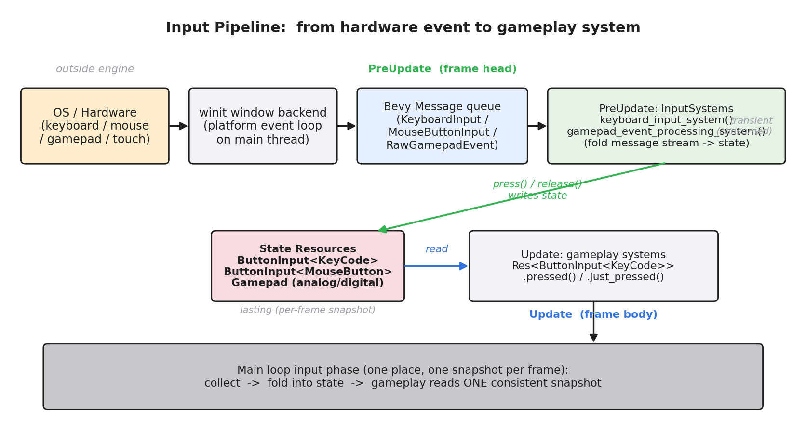
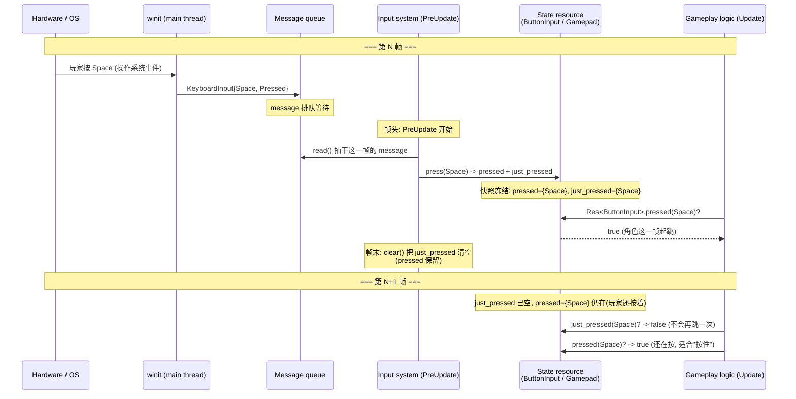
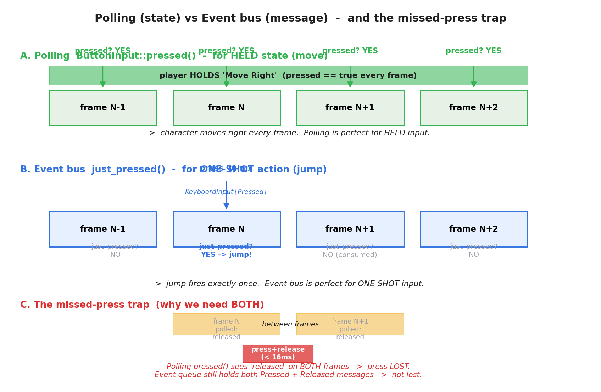
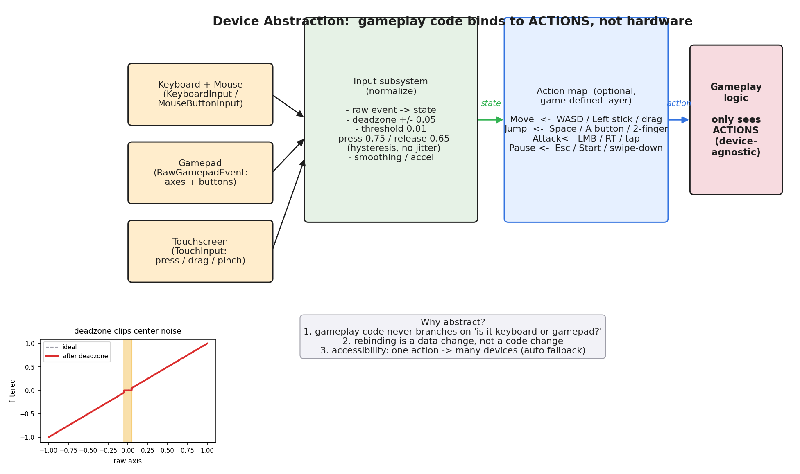
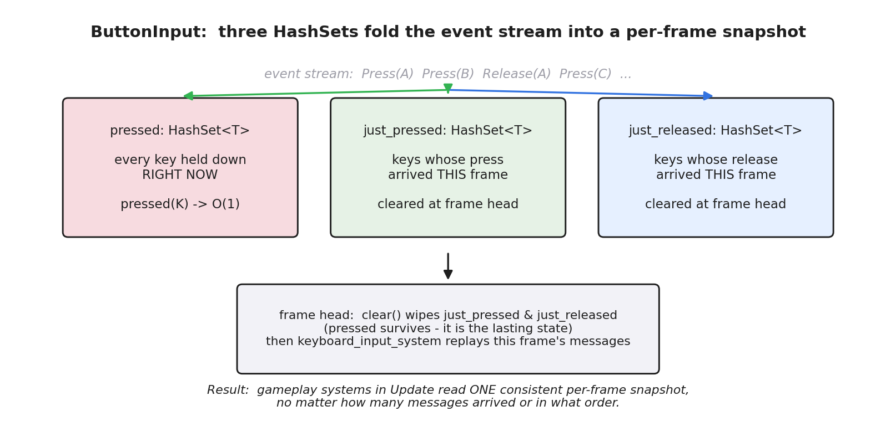

# 第 5 篇 · 第 19 章 · 输入与事件系统

> **核心问题**:从第 1 章(P1-02)起,我们一直在说主循环三段式 `input → update → render`,可那个 `input` 段一直是个黑盒——"读输入"三个字背后到底发生了什么?你按下空格键到角色跳起来,中间经过了哪几道手?为什么"按住方向键移动"和"按一下跳跃键跳一下"在引擎里要用两套完全不同的机制来读?为什么手柄摇杆永远在抖,引擎怎么把它变成稳定的移动?最微妙的是:同一个游戏,你接上键盘、手柄、触屏,游戏逻辑代码凭什么一行都不用改?——本章要拆开的就是这个黑盒:**键鼠 / 手柄 / 触屏的输入,是怎么从硬件事件一路走进主循环,变成游戏逻辑能读的状态的**。这是第 5 篇(并发与子系统协作)的收尾章——前面讲了多核 job 系统怎么把更新并行化、渲染怎么提交给管线,本章补上"驱动"这一面的最后一块拼图:外部世界的事件,怎么进入这个每秒转 60 圈的大循环。

> **读完本章你会明白**:
> 1. 输入怎么进主循环:操作系统把硬件事件(按键 / 鼠标移动 / 手柄摇杆)放进引擎的事件队列,引擎在主循环 input 段(对应 Bevy 的 `PreUpdate`)取出,折叠成一份"这一帧的输入快照",供全帧读取。
> 2. **轮询(polling)** 和 **事件总线(event bus)** 的根本区别:轮询查"这个键现在按下了吗"(`pressed`),适合持续状态(按住移动);事件总线消费"按下 / 抬起"这种瞬时事件(`just_pressed`),适合一次性动作(跳跃)。两者常并存,且必须并存——只轮询会漏掉短按。
> 3. 为什么只轮询会漏掉"短按"(两帧之间按下又抬起),而事件队列不漏——这是引擎必须同时提供两套机制的根本原因。
> 4. **设备抽象**:键鼠 / 手柄 / 触屏的原始事件千差万别,输入子系统把它们归一化成一套统一状态(`ButtonInput<KeyCode>` / `Gamepad`),游戏逻辑只查状态,不关心具体设备;更进一步可以用 Action 映射层,让逻辑只认"Jump / Move",设备切换是数据改动不是代码改动。
> 5. **死区 / 平滑 / 滞后**:手柄摇杆中心附近有噪声,要用死区(deadzone)把中心一段抹零;按下 / 松开阈值不同(滞后,hysteresis)防抖动——这些都是输入子系统替游戏逻辑挡掉的脏活。
> 6. 用 Bevy 源码(`crates/bevy_input/`)核实以上一切:`ButtonInput` 的三个 HashSet、`keyboard_input_system` 怎么把 message 折叠成状态、`AxisSettings` 的死区默认 ±0.05。

> **如果一读觉得太难**:先只记三件事——① 输入在主循环开头一次性采集,折叠成一份"这一帧的状态快照",全帧读同一份;② "按住"用轮询 `pressed`、"按一下"用事件 `just_pressed`,两者必须并存(只轮询会漏短按);③ 手柄摇杆有噪声,输入子系统用死区 + 滞后阈值把它洗干净,游戏逻辑拿到的已经是干净值。本章的源码引用都来自 Bevy `bevy_input` crate,行号以当前 master 为准。

---

## 〇、一句话点破

> **输入子系统的全部工作,就是把"一串随机的硬件事件流",在每帧开头折叠成"一份这一帧的输入快照",让后面的游戏逻辑不用关心事件什么时候来、来了几条、按什么顺序,只管查"这一帧按了什么"。在这个折叠过程里,它顺手做了三件脏活:归一化设备差异(键鼠手柄触屏都变成同一套抽象)、洗掉噪声(死区 + 滞后)、并提供两种读法(轮询查持续状态、事件查瞬时动作)——因为只查持续状态会漏掉短按,只查瞬时事件又没法表达"按住",两套机制必须并存。**

这是结论。本章倒过来拆:先看清输入怎么从硬件走进主循环(整条流水线),再拆"轮询 vs 事件总线"这对核心二元(以及为什么必须并存),然后讲设备抽象和死区平滑这两件"输入子系统替你挡的脏活",最后用 Bevy 源码佐证。

---

## 一、先接上前两章:input 段到底干什么

### 承接:第 1 章和第 3 章埋的伏笔

第 1 章(P1-02)讲主循环三段式时,我们说 input 段"把玩家这一帧的意图读进来",并且强调了两件事:

- input 必须**最先**跑——这一帧读到的输入,这一帧的 update 就用上,否则手感发黏。
- input 段**逻辑上最重要**(直接决定手感),但**性能上最廉价**(数据量小,通常不到一帧的 1%),所以引擎优化 input 时优化的是**延迟**不是**吞吐**。

第 3 章(P1-03)讲子系统全景时,把输入子系统定位成"七个子系统之一",职责是"把这一帧的外部事件,在帧开头一次性翻译成统一状态,供全帧读取",并明确说"输入的事件驱动 / 轮询取舍、事件总线,本书 P5-19 专章讲"。本章就是来兑现这个承诺的。

> **承接书讲过**:本章不重讲主循环三段式(P1-02 已讲透)、不重讲子系统全景(P1-03 已讲透),只把"输入子系统内部"这个黑盒打开。另外,操作系统怎么把硬件中断变成事件、事件驱动的底层机制(中断 / epoll / 事件循环),是《Linux 内核机制》那本书的整块主题——本章只用一句"操作系统把硬件事件变成引擎能读的事件"带过 + 指路,篇幅留给"引擎拿到事件之后怎么处理"。

### 输入子系统的一道核心难题:事件是"流",游戏逻辑要"快照"

输入子系统为什么不能简单地"游戏逻辑直接读操作系统事件"?这里有一道贯穿全章的核心难题,先点破它:

> **硬件输入是一串随机的事件流(随时来、密度不均、顺序不定),而游戏主循环是"一帧一帧"的(每 16ms 一拍)。游戏逻辑没法直接处理"流",它要的是"这一帧的快照"——这一帧按下了哪些键、摇杆推到哪。**

举个具体例子。假设玩家在 16ms 的一帧里,做了这些动作:按下空格(第 2ms)、松开空格(第 5ms)、又按下方向键(第 9ms)、移动鼠标(第 11ms)。这四件事是四条独立的事件,散落在一帧的 16ms 里。游戏逻辑(比如跳跃系统)怎么读?

- 如果游戏逻辑直接读操作系统的事件流,它得自己处理"这一帧里我看到了几条事件、按什么顺序、哪些是这一帧的哪些是上一帧剩的"——每个系统都要自己处理一遍,重复且容易出错。
- 更糟的是,同一帧里多个系统读事件,先跑的系统把事件"消费"了(或者没消费),后跑的系统读到的事件集合可能不一样——同一帧里输入状态不一致,这是 bug 的温床。

所以输入子系统的核心职责,是**把事件流折叠成一份这一帧的快照**:在帧的开头(对应 Bevy 的 `PreUpdate` 段),把这一帧所有事件一次性处理完,折成一份"这一帧按下了哪些键、松开了哪些键、摇杆现在在哪"的统一状态,之后整帧的所有系统都读这一份快照,谁都不再直接碰原始事件流。

> **钉死这件事**:输入子系统 = "把随机的事件流,在帧头折叠成一份这一帧的输入快照,供全帧一致读取"。这个"流 → 快照"的折叠,是本章一切设计的出发点。后面讲的轮询 / 事件总线 / 设备抽象 / 死区,全都是这个折叠过程的一部分。

---

## 二、输入流水线:从硬件事件到游戏逻辑

我们先看清整条流水线:一个按键事件,从你的手指按下,到游戏逻辑读到 `pressed(Space)`,中间经过了哪几道手。

### 流水线的五道关口



把这张图从左到右、从上到下读一遍:

**关口一:操作系统 / 硬件**。你按下空格键,键盘控制器产生一个扫描码(scancode),经 USB/蓝牙传给操作系统,操作系统把它翻译成"键码(keycode)+ 按下 / 松开状态",放进自己的事件队列。这一段完全是操作系统的事,游戏引擎管不到——引擎只能"向操作系统要事件"。

> **承接书讲过**:操作系统怎么把硬件中断变成事件(中断处理、输入驱动、事件队列),是《Linux 内核机制》那本书"中断 / 事件驱动"那一章的主题。这里我们只把它当成一个黑盒:"操作系统会给你一串事件",不展开它内部怎么把硬件电平变成事件的。

**关口二:窗口后端(winit)**。游戏引擎不直接和操作系统打交道,而是通过一个"窗口库"。Bevy 用的是 Rust 生态的 `winit`(跨平台窗口 / 输入库)。winit 在主线程上跑一个平台事件循环(Windows 的消息泵、macOS 的 NSApplication、Linux 的 X11/Wayland、Web 的 DOM 事件),把操作系统的原始事件翻译成统一的 `winit::WindowEvent`,再回调给引擎。**这一步必须在主线程**——所有主流操作系统的窗口事件都只能在主线程泵,这是硬约束。

**关口三:引擎的事件队列(Bevy 的 message)**。winit 回调引擎时,引擎不直接处理事件,而是把它们塞进一个**事件队列**(Bevy 里叫 message)。键盘事件变成 `KeyboardInput`,鼠标按键变成 `MouseButtonInput`,手柄事件变成 `RawGamepadEvent`。这些 message 就躺在队列里,等着帧开头被处理。

为什么先塞队列,不直接处理?两个原因:

- **winit 的回调和主循环不同步**。winit 可能在主循环跑 update 的中段就来送事件,这时引擎没法立刻处理(正在更新世界状态),只能先塞队列,等这一帧跑完、下一帧开头再统一处理。
- **解耦生产者和消费者**。winit(生产者)只管往队列塞,输入子系统(消费者)在帧头统一抽干。两边节奏独立,互不阻塞。

> **钉死这件事**:winit 把操作系统事件翻译成引擎自己的 message(`KeyboardInput` / `MouseButtonInput` / `RawGamepadEvent`),塞进队列,等帧头处理。这一步把"和操作系统 / 平台绑死的原始事件"翻译成了"引擎自己的、跨平台一致的事件类型"——设备抽象的第一层在这里完成。

**关口四:输入子系统(帧头的折叠)**。这是本章的主角。在主循环的 input 段(对应 Bevy 的 `PreUpdate`),专门的系统把队列里这一帧的事件抽干,折叠成"状态资源":

- `keyboard_input_system`:读 `MessageReader<KeyboardInput>`,对每条事件调 `ButtonInput::press` 或 `release`,更新 `ButtonInput<KeyCode>` 这个状态资源。
- `gamepad_event_processing_system`:读 `MessageReader<RawGamepadEvent>`,更新 `Gamepad` 资源(摇杆轴值、按键状态),顺手做死区过滤。
- `mouse_button_input_system`:类似的,把鼠标按键 message 折叠成 `ButtonInput<MouseButton>`。

这一步是"流 → 快照"的关键转换:输入流(message 队列)是"按下 A、抬起 A、按下 B"这种时序事件,折叠后变成"现在按下了哪些键"(持续状态)和"这一帧新按下了哪些键"(瞬时事件)两份查询表。

**关口五:游戏逻辑读取(Update 段)**。折叠完之后,游戏逻辑系统在 `Update` 段拿一个对状态资源的只读引用(`Res<ButtonInput<KeyCode>>`),用 `.pressed(KeyCode::Space)` / `.just_pressed(KeyCode::Space)` 查询。这时它读的是这一帧开头冻结的快照——一帧之内,不管多少个系统读,读到的都是同一份,状态一致。

### 一个时序的例子

把上面五道关口串成一个具体时序(两帧):



注意几个细节:

1. **winit 的回调可能在帧的任何时刻来**,但 message 一律先进队列,等下一个帧头处理。所以第 N 帧中段按下的键,要到第 N+1 帧的 input 段才被折叠——这就是"一帧输入延迟"的来源之一(另一个来源是显示延迟)。
2. **`just_pressed` 只活一帧**。第 N 帧 `press(Space)` 时,`just_pressed` 里塞了 `Space`;帧末 `clear()` 把 `just_pressed` 清空。所以第 N+1 帧 `just_pressed(Space)` 是 false——哪怕玩家一直按着,跳跃也只触发一次。这正是"瞬时事件"该有的语义。
3. **`pressed` 跨帧保留**。只要玩家不松手,`pressed(Space)` 在第 N、N+1、N+2... 帧都是 true。这是"持续状态"该有的语义。

> **钉死这件事**:输入流水线五道关口——硬件 / OS → winit(主线程事件循环)→ message 队列 → PreUpdate 的 input system(折叠成状态)→ Update 的游戏逻辑(读快照)。整条链的核心转换在关口四:"事件流"被折叠成"状态快照"。这个折叠让游戏逻辑彻底摆脱了"处理随机事件流"的负担,只管查"这一帧的状态"。

---

## 三、轮询 vs 事件总线:本章的核心二元

上一节我们看到,输入子系统折叠出了一份状态快照。可这份快照上有两种截然不同的读法,对应两种截然不同的输入需求。这一节拆透这对核心二元。

### 两种输入需求:持续状态 vs 瞬时动作

先把"玩家输入"分类。所有的游戏输入,粗略分两类:

**第一类:持续状态(held state)**——"玩家现在是不是按着这个键"。

- 例子:按住方向键移动、按住鼠标右键瞄准、按住扳机键射击、按住 Shift 跑步。
- 特征:**只要按着,效果就持续**;松开就停。游戏每一帧都要检查"现在还按着吗",按着就继续移动 / 瞄准 / 射击。
- 读法:**轮询(polling)**——每帧问一次"这个键现在按下没?"。在 Bevy 里就是 `button_input.pressed(KeyCode::Right)`。

**第二类:瞬时动作(one-shot action)**——"玩家刚刚是不是触发了一次这个动作"。

- 例子:按一下跳跃键跳一次、按一下攻击键挥一刀、按一下交互键拾取、按一下暂停键打开菜单。
- 特征:**触发一次,响应一次**;哪怕一直按着,也只触发一次(不能因为按住跳跃键就一直跳)。游戏要在"按下那一刻"响应,过了就不再响应。
- 读法:**事件(event)**——订阅"按下"这个事件,事件来了响应一次。在 Bevy 里就是 `button_input.just_pressed(KeyCode::Space)`,或者用 `MessageReader<KeyboardInput>` 直接读原始事件。

这两种需求本质不同,所以引擎必须提供两种读法。这就是本章标题里的"轮询 vs 事件总线"。

### 轮询(polling):查"现在按下了吗"

轮询的语义:**"现在(这一帧的快照里),这个键是不是按下的?"**。它查的是持续状态——只要玩家按着,每一帧的轮询都返回 true。

```rust
// Bevy 里轮询: 查"现在按着 Right 吗" -> 持续移动
fn move_player(keyboard: Res<ButtonInput<KeyCode>>, mut query: Query<&mut Velocity>) {
    let mut dir = 0.0;
    if keyboard.pressed(KeyCode::ArrowRight) { dir += 1.0; }   // 按住右
    if keyboard.pressed(KeyCode::ArrowLeft)  { dir -= 1.0; }   // 按住左
    // 每一帧: 只要按着, 速度就一直有; 松开就归零
    for mut vel in query.iter_mut() {
        vel.x = dir * SPEED;
    }
}
```

这段代码每一帧跑一次。只要玩家按住右键,`pressed(ArrowRight)` 每帧都 true,角色每帧都往右走;松开,立刻 false,角色停下。这正是"按住移动"该有的手感。

轮询的关键性质:**它查的是"这一帧开头冻结的状态快照",不是"这一帧期间发生了什么"**。这一点极其重要,下一节的"短按漏检"就是从这里来的。

### 事件总线(event bus):消费"按下那一刻"

事件的语义:**"这一帧里,这个键的'按下'事件有没有发生?"**。它查的是瞬时动作——只在按下的那一帧返回 true,之后哪怕一直按着,也不再返回 true(直到松开再按下)。

```rust
// Bevy 里用事件查瞬时动作: "这一帧按下了 Space 吗" -> 跳一次
fn jump_system(keyboard: Res<ButtonInput<KeyCode>>, mut query: Query<&mut Velocity>) {
    if keyboard.just_pressed(KeyCode::Space) {     // 只在按下的那一帧 true
        for mut vel in query.iter_mut() {
            vel.y = JUMP_SPEED;                     // 给一个向上的速度, 只给一次
        }
    }
}
```

这段代码也每一帧跑一次。但 `just_pressed(Space)` 只在"按下空格的那一帧"返回 true——下一帧哪怕玩家还按着,它也返回 false(因为 `just_pressed` 在帧末被 `clear()` 清空了)。所以跳跃速度只给一次,角色跳起来之后,按住空格也不会反复跳。这正是"按一下跳一次"该有的手感。

如果你想直接读原始事件流(而不是查折叠后的快照),Bevy 还提供了 `MessageReader<KeyboardInput>`,可以拿到每一条 message 的完整信息(按下还是松开、是不是重复键、产生了什么文本):

```rust
// 直接读 message 流(适合处理文本输入, 比如打字聊天框)
fn text_input_system(mut reader: MessageReader<KeyboardInput>) {
    for event in reader.read() {
        if event.state == ButtonState::Pressed {
            if let Some(text) = &event.text {
                println!("玩家输入了: {}", text);   // 拿到具体字符
            }
        }
    }
}
```

`MessageReader` 是"事件总线"的原汁原味:它读的是 message 队列里的原始事件,每条事件只被消费一次(同一个 reader 不会读到同一条 message 两次)。这种"消费一次就消失"的语义,正是事件总线的标志。

### 为什么两者必须并存:短按漏检陷阱

读到这里你可能想:既然有了轮询(查持续状态),那"瞬时动作"我用轮询也能做啊——`if pressed(Space) { jump(); }`,只要按下就跳。何必搞一套事件?

不行。我们来看一个致命的陷阱——**短按漏检(missed press)**。这就是为什么引擎必须同时提供两套机制。



看这张图的 C 段。假设玩家做了一个非常快的点击——按下空格又立刻松开,整个动作不到 16ms(比一帧还短)。这个动作恰好发生在第 N 帧和第 N+1 帧之间(第 N 帧的快照冻结之后、第 N+1 帧的快照冻结之前)。

现在分别看两种读法:

**轮询的视角**:

- 第 N 帧帧头冻结快照时,空格还没按(`pressed={}`)。
- 玩家在两帧之间按下又松开(两条 message 进队列)。
- 第 N+1 帧帧头冻结快照时,空格已经松开了(`pressed={}`)。
- 结果:第 N 帧 `pressed(Space)` = false,第 N+1 帧 `pressed(Space)` = false。**这次按下彻底丢了**。如果你用 `if pressed(Space) { jump(); }`,玩家按了跳,角色没跳——这是严重的手感 bug。

**事件总线的视角**:

- 第 N+1 帧帧头抽干 message 队列时,看到了两条:`Pressed(Space)` 和 `Released(Space)`。
- `keyboard_input_system` 处理第一条:`press(Space)` —— `pressed` 加 Space,`just_pressed` 加 Space。
- 处理第二条:`release(Space)` —— `pressed` 移除 Space,`just_released` 加 Space。
- 结果:第 N+1 帧的快照里,`pressed(Space)` = false(因为最后松开了),但 **`just_pressed(Space)` = true**(因为这一帧看到过 press 事件)。如果你用 `if just_pressed(Space) { jump(); }`,玩家按了跳,角色跳了——按下被忠实地记录下来。

这就是"短按漏检陷阱",也是为什么**轮询和事件总线必须并存**的根本原因:

- 轮询查的是"快照冻结那一刻的状态"。如果一个短按完全发生在两次快照之间(按下和松开都在同一帧的帧间),快照根本抓不到它,这个短按就丢了。
- 事件总线查的是"这一帧看到过哪些事件"。只要 message 进了队列,不管它持续时间多短,事件总线都能看到——因为 message 队列记的是"发生过"(按下是一次事件),不是"现在是什么状态"。

> **钉死这件事**:**只轮询会漏掉短按**。任何比一帧还短的快速点击(连射、快速点按、格斗游戏的快速输入),如果只用轮询 `pressed()`,可能整次按下都丢失。所以引擎必须同时提供事件机制(`just_pressed` / `MessageReader`),用来捕获那些"发生了但没持续到下一次轮询"的瞬时事件。反过来,**只看事件又没法表达"按住"**(因为"按住"是状态不是事件,玩家按住方向键 3 秒,只有第 1 帧有一个 Press 事件,后面 2 秒一个事件都没有,你只看事件根本不知道玩家还按着)。两套机制各管一半,缺一不可。

### 一条实用判断准则:什么时候用哪个

读者读完可能还是懵:那我写游戏逻辑时,到底什么时候用轮询、什么时候用事件?这里给一条简单准则:

> **凡是"按住生效、松开停止"的输入,用轮询 `pressed()`;凡是"按一下触发一次"的输入,用事件 `just_pressed()` 或 `MessageReader`。**

举一组对照:

| 输入需求 | 类型 | 读法 |
|---|---|---|
| 按住方向键移动 | 持续 | `pressed(ArrowRight)` |
| 按住 Shift 跑步 | 持续 | `pressed(Shift)` |
| 按住扳机射击(连发) | 持续 | `pressed(GamepadButton::RightTrigger)` |
| 按一下跳跃 | 瞬时 | `just_pressed(Space)` |
| 按一下攻击(挥一刀) | 瞬时 | `just_pressed(MouseButton::Left)` |
| 按一下交互(拾取) | 瞬时 | `just_pressed(KeyE)` |
| 文本输入(打字) | 瞬时(带字符) | `MessageReader<KeyboardInput>` |

这条准则不是死规定,是经验总结。有些游戏(比如射击游戏)对射击用 `pressed`(按住连发)还是 `just_pressed`(按一下一发)有不同设计,但那都是在这两类基础上的取舍。

---

## 四、设备抽象:让游戏逻辑不关心是键盘还是手柄

到这里我们一直在拿键盘举例。可真实游戏要支持键鼠、手柄、触屏,甚至 VR 手柄。这些设备的原始事件千差万别:键盘是离散的按键(keycode),鼠标有按键 + 移动 + 滚轮,手柄有连续的摇杆轴(0.0 到 1.0)加十几个按键,触屏有多个触摸点 + 手势(捏合 / 旋转 / 拖动)。如果游戏逻辑里到处是 `if keyboard.pressed(...) else if gamepad.pressed(...) else if touch.pressed(...)`,代码会变成一团乱麻,而且加一个新设备(比如从 Steam Deck 加回溯键)要改一堆地方。

输入子系统的第二件大事,就是**把这些设备差异归一化掉**,让游戏逻辑只面对一套统一的输入抽象。

### 归一化的两层



设备抽象分两层,从左到右:

**第一层:引擎内置的设备归一化(输入子系统做)**。这一层把每种设备的原始事件,翻译成引擎自己的一套统一类型:

- 键盘 → `ButtonInput<KeyCode>`(离散按键状态)。
- 鼠标 → `ButtonInput<MouseButton>`(按键状态)+ `AccumulatedMouseMotion`(这一帧鼠标移动量)+ `AccumulatedMouseScroll`(滚轮量)。
- 手柄 → `Gamepad` 资源(每个手柄的摇杆轴值存在 `Axis<GamepadAxis>` 里,按键状态存在 `ButtonInput<GamepadButton>` 里)+ 一组 Gamepad 事件。
- 触屏 → `Touches` 资源(每个触摸点的状态)+ 手势事件(`PinchGesture` / `RotationGesture` / `PanGesture` / `DoubleTapGesture`)。

这一层做完,游戏逻辑就已经不用直接碰操作系统了——它面对的是 `ButtonInput<KeyCode>`、`Gamepad`、`Touches` 这些引擎统一抽象。但这一层**还是按设备分开的**:`ButtonInput<KeyCode>` 是键盘的,`Gamepad` 是手柄的,游戏逻辑要"按 Jump"还是得分别查键盘的 Space 和手柄的 SouthButton。

**第二层:游戏自定义的 Action 映射(可选,游戏自己加)**。这一层不是引擎内置的,而是游戏根据自己的玩法,定义一组"抽象动作(Action)",再映射到具体设备:

- 定义 Action:`Move`(移动)、`Jump`(跳跃)、`Attack`(攻击)、`Pause`(暂停)。
- 映射:`Jump` ← 键盘 Space / 手柄 SouthButton / 触屏双指;`Move` ← 键盘 WASD / 手柄左摇杆 / 触屏拖动;`Attack` ← 鼠标左键 / 手柄 RT / 触屏点击;`Pause` ← 键盘 Esc / 手柄 Start / 触屏下拉。

做完这一层,游戏逻辑只查 Action:`if action.just_pressed(Jump) { ... }`。它根本不关心这个 Jump 是键盘按的、手柄按的、还是触屏点的——设备切换对它完全透明。玩家拔掉键盘插上手柄,游戏逻辑一行代码都不用改,只是 Action 映射层把数据源从键盘切到手柄。

> **钉死这件事**:设备抽象分两层——① 引擎把每种设备的原始事件归一化成统一类型(`ButtonInput<KeyCode>` / `Gamepad` / `Touches`);② 游戏自定义 Action 映射层,把"具体设备的某个输入"映射到"抽象动作"。做完这两层,游戏逻辑只认 Action,设备切换是数据改动(改映射表),不是代码改动。这是为什么同一个游戏能同时支持键鼠 / 手柄 / 触屏,而游戏逻辑代码一行不改。

### Bevy 现状:第一层内置,第二层靠生态

需要诚实说明的是:Bevy 主仓(到当前 master 为止)只做了第一层归一化(`ButtonInput<KeyCode>` / `Gamepad` / `Touches` 这些资源),**第二层 Action 映射没有内置**。Bevy 的 Action 映射靠生态里的第三方 crate(如 `leafwing-input-manager`),它做的就是"定义 Action 枚举 + 配置映射表 + 提供 `ActionState` 资源供游戏逻辑查询"。Unity 的旧输入系统(`Input.GetAxis("Horizontal")`)和新的 Input System(`InputAction`)倒是把两层都内置了,新 Input System 的 `InputAction` 就是 Action 映射的官方实现。

这个差异不影响原理——无论引擎内置还是第三方实现,Action 映射这一层做的事情都一样:把"设备相关的输入"翻译成"动作相关的查询",解耦游戏逻辑和具体设备。

---

## 五、死区 / 平滑 / 滞后:输入子系统替你挡的脏活

到这里我们好像把输入子系统讲得很干净——归一化设备、折叠状态、提供两种读法。可真实硬件没那么干净,它有三个让游戏逻辑头疼的毛病,输入子系统得替它擦干净。

### 毛病一:手柄摇杆的中心噪声 → 死区

拿起一个手柄,不碰摇杆,摇杆因为机械弹性、传感器精度,永远不是精确的 (0.0, 0.0),而是在中心附近抖动——读出来可能是 (0.02, -0.01)、(-0.03, 0.01)、(0.0, 0.02)... 这些值极小但非零。

如果游戏逻辑直接用这个原始值,会发生什么?角色会**自己慢慢漂移**——你没碰摇杆,但角色的速度是 `(0.02, -0.01) * SPEED`,他一点点往右下挪。这在所有用手柄的游戏里都是不能接受的 bug。

解决方法是**死区(deadzone)**:把摇杆值在一个中心范围内强制归零。比如死区设 0.05,那么摇杆值在 [-0.05, +0.05] 之间时,一律当成 0.0;只有超出这个范围的部分,才算玩家真的在推摇杆。

我们用 Bevy 的源码核实默认死区值。在 `crates/bevy_input/src/gamepad.rs` 里,摇杆轴的过滤设置叫 `AxisSettings`,它的默认值是(简化展示):

```rust
// crates/bevy_input/src/gamepad.rs (AxisSettings 的 Default, 简化)
impl Default for AxisSettings {
    fn default() -> Self {
        AxisSettings {
            livezone_upperbound: 1.0,       // 超过这个值, 视为推到底(+1.0)
            deadzone_upperbound: 0.05,      // 正向死区上界: (0, 0.05) 归零
            deadzone_lowerbound: -0.05,     // 负向死区下界: (-0.05, 0) 归零
            livezone_lowerbound: -1.0,      // 低于这个值, 视为推到底(-1.0)
            threshold: 0.01,                // 变化阈值: 小于这个量不算变(防抖)
        }
    }
}
```

> **★源码核实**:这段在 [bevyengine/bevy 的 `crates/bevy_input/src/gamepad.rs`](https://github.com/bevyengine/bevy/blob/master/crates/bevy_input/src/gamepad.rs) 的 `AxisSettings` 实现。默认死区是 **±0.05**,变化阈值(threshold)是 **0.01**。也就是说,Bevy 默认认为摇杆值在 ±0.05 以内是"中心噪声",一律归零;相邻两次读数差小于 0.01 不算变化(防抖)。这两个数是 Bevy 的默认值,游戏可以根据自己手柄调(有些手柄噪声大,死区要调到 0.1)。

死区的几何意义:把摇杆的二维值空间,中心挖一个洞(圆形或方形死区),洞里的值都当 (0,0)。这层过滤是输入子系统在 `gamepad_event_processing_system` 里做的(它会调 `AxisSettings::filter`),游戏逻辑拿到的 `Gamepad` 资源里的摇杆值**已经是过滤后的干净值**——它根本不知道原始值有多脏。

> **不这样会怎样**:不做死区,角色会因为摇杆中心噪声自己漂移(没碰摇杆也在动);死区做小了(比如 0.01),噪声大的手柄还是漂;死区做大了(比如 0.3),玩家轻轻推摇杆没反应,手感迟钝。0.05 是大多数手柄的经验值,兼顾"不漂"和"灵敏"。

### 毛病二:按键抖动 → 滞后阈值

第二个毛病是**按键抖动**。这里说的不是物理抖动(机械按键按下 / 松开时触点弹片会抖几下,操作系统和驱动已经用硬件 / 软件去抖了),而是**模拟量的阈值抖动**——主要是手柄的扳机键(L2 / R2)。

手柄的扳机键不是"按 / 没按"的二值,而是 0.0 到 1.0 的连续值(0.0 完全松开,1.0 按到底)。问题是:如果"按下"的阈值定死在一个值(比如 0.5),那么当玩家把扳机推到 0.5 附近时,手一抖、传感器一飘,值就会在 0.49 和 0.51 之间跳——按键状态就在"按下 / 松开"之间疯狂跳变,游戏以为是快速连按。

解决方法是**滞后(hysteresis)**:按下和松开用**不同的阈值**,且按下阈值高于松开阈值。看 Bevy 的源码:

```rust
// crates/bevy_input/src/gamepad.rs (ButtonSettings 的 Default, 简化)
impl Default for ButtonSettings {
    fn default() -> Self {
        ButtonSettings {
            press_threshold: 0.75,     // 按下阈值: 扳机值 > 0.75 才算"按下"
            release_threshold: 0.65,    // 松开阈值: 扳机值 < 0.65 才算"松开"
        }
    }
}
```

> **★源码核实**:这段在同文件的 `ButtonSettings::default()`。按下阈值 **0.75**、松开阈值 **0.65**,中间留了 0.1 的**滞后带**(hysteresis band)。意思是:扳机值从低往高走,超过 0.75 才标记为"按下";一旦标记为按下,值要跌回 0.65 以下才会标记为"松开"——在 0.65 到 0.75 之间,状态保持不变。这样玩家把扳机停在 0.7 附近抖动,状态不会跳变(因为 0.7 在滞后带里,状态维持上一次的)。

滞后是工程里抑制抖动的经典手段(温控器的恒温器、施密特触发器电路都是同一思想):**用两个阈值,升越过上限才开、降越过下限才关**,中间一段"不动"。这在所有有连续值转离散状态的场景里都用得上。

### 毛病三:鼠标加速度 / 平滑

第三个毛病是鼠标。鼠标的移动量(`MouseMotion`)是"这一帧鼠标移动了多少像素",但不同操作系统对鼠标的处理不一样:Windows 默认开"鼠标加速度"(鼠标移动越快,光标位移越大,鼓励玩家甩鼠标),Linux 一般没有,游戏里要不要这种加速度是个设计选择。另外,鼠标移动事件本身有抖动(手抖),有些游戏会做一阶低通滤波平滑。

手柄摇杆也有平滑需求:玩家推摇杆的角度有微小抖动,直接用会让角色速度忽快忽慢。一些游戏会对摇杆值做指数平滑(当前值 = 上一帧值 × 0.8 + 新值 × 0.2),让移动更顺滑。

这些平滑 / 加速度处理,Bevy 主仓做了一部分(`AccumulatedMouseMotion` 把一帧内多次鼠标移动事件累加成一个值),更复杂的平滑(低通滤波、加速度曲线)通常留给游戏自己加,或者用第三方 crate。原理都一样:**输入子系统在交给游戏逻辑之前,先做一层"信号处理",把硬件的脏数据洗干净**。

> **钉死这件事**:输入子系统在交给游戏逻辑之前,替它挡了三件脏活——① 死区(摇杆中心噪声归零,Bevy 默认 ±0.05);② 滞后阈值(模拟按键防抖,Bevy 默认按下 0.75 / 松开 0.65);③ 平滑 / 累加(鼠标移动累加、可选的滤波)。游戏逻辑拿到的值,已经是"干净、稳定、可用的状态",不用自己处理硬件毛刺。这是输入子系统的"附加值",也是为什么游戏逻辑不该绕过它直接读操作系统事件的另一个理由。

---

## 六、用 Bevy 源码核实:`ButtonInput` 的三态状态机

讲了这么多原理,现在用 Bevy 的真实源码把"折叠"这件事的内部机制拆透。这是本章最硬的源码部分。

### `ButtonInput` 的三个 HashSet

输入子系统折叠出来的状态快照,在 Bevy 里就是一个叫 `ButtonInput<T>` 的资源(`T` 可以是 `KeyCode` / `MouseButton` / `GamepadButton`)。它的定义极简——三个 HashSet:

```rust
// crates/bevy_input/src/button_input.rs (简化)
#[derive(Resource)]
pub struct ButtonInput<T: Clone + Eq + Hash + Send + Sync + 'static> {
    /// 当前正在按下的所有键
    pressed: HashSet<T>,
    /// 这一帧新按下的键(帧末清空)
    just_pressed: HashSet<T>,
    /// 这一帧新松开的键(帧末清空)
    just_released: HashSet<T>,
}
```

> **★源码核实**:这段在 [bevyengine/bevy 的 `crates/bevy_input/src/button_input.rs`](https://github.com/bevyengine/bevy/blob/master/crates/bevy_input/src/button_input.rs) 的 `ButtonInput` 结构体定义。三个字段,全是 `HashSet<T>`。这是"轮询 + 事件"二元在数据结构上的直接体现——`pressed` 服务轮询,`just_pressed` / `just_released` 服务事件。

> **★总纲印象修正**:总纲和写作提示词里提到 Bevy 的输入类型叫 `Input`(`Input::pressed(...)`)。核实源码发现,**`Input` 是 Bevy 0.13 及之前的旧名字;从 0.14 起(到当前 master),它已经重命名为 `ButtonInput`**。老资料 / 老博客里写的 `Input<KeyCode>` 在新版 Bevy 里全都是 `ButtonInput<KeyCode>`。同理,事件相关也变了——见下一节。

这三个 HashSet 怎么协作?我们跟着一个按键的生命周期看。

### 一帧内三个 HashSet 的演化



假设玩家在第 N 帧按下空格、第 N+1 帧还按着、第 N+2 帧松开。看 `ButtonInput<KeyCode>` 里 `Space` 这个键的状态怎么变:

**第 N 帧(按下空格)**:

- 帧头:`keyboard_input_system` 先调 `clear()`,把 `just_pressed` 和 `just_released` 清空(`pressed` 不动,保留上一帧的持续状态)。
- 读 message:`MessageReader<KeyboardInput>` 读到 `KeyboardInput{Space, Pressed}`。
- 调 `press(Space)`:源码里 `press` 做两件事——往 `pressed` 里插 Space,如果 Space 之前不在 `pressed` 里(说明是新按下),就往 `just_pressed` 里也插 Space。
- 帧中:游戏逻辑读到 `pressed(Space)=true`、`just_pressed(Space)=true`。跳跃系统 `if just_pressed(Space)` 触发,角色起跳。
- 帧末:`just_pressed` 里的 Space 还在,等下一帧帧头被清。

**第 N+1 帧(还按着)**:

- 帧头:`clear()` 清空 `just_pressed`(Space 从 `just_pressed` 移除)和 `just_released`。`pressed` 不动,Space 还在。
- 读 message:这一帧没有任何 Space 的事件(玩家一直按着没动,操作系统不会重复发 Press 事件,除非开了按键重复)。
- 帧中:游戏逻辑读到 `pressed(Space)=true`、`just_pressed(Space)=false`。跳跃系统不触发(不会重复跳),移动系统 `if pressed(Space)` 持续生效。
- 这正是"按住"的语义:持续状态保留,瞬时事件消失。

**第 N+2 帧(松开空格)**:

- 帧头:`clear()` 清空 `just_*`。`pressed` 里 Space 还在(还没处理松开事件)。
- 读 message:读到 `KeyboardInput{Space, Released}`。
- 调 `release(Space)`:源码里 `release` 做两件事——从 `pressed` 里移除 Space,如果 Space 之前在 `pressed` 里(说明是正常松开),就往 `just_released` 里插 Space。
- 帧中:游戏逻辑读到 `pressed(Space)=false`、`just_released(Space)=true`。如果有系统关心"刚刚松开"(比如松开扳机停止蓄力),它能响应。
- 帧末:`just_released` 里的 Space 等下一帧清。

整个生命周期的状态演化:`pressed` 在按下到松开期间一直是 true(跨帧存活),`just_pressed` 只在按下的那一帧 true(一帧即逝),`just_released` 只在松开的那一帧 true。这就是"持续状态 vs 瞬时事件"在数据结构层面的精确实现。

### `press` / `release` 的源码:为什么 `just_pressed` 不会重复

看一眼 `press` 的源码,它有一个不起眼但关键的细节:

```rust
// crates/bevy_input/src/button_input.rs (press, 简化)
pub fn press(&mut self, input: T) {
    // 如果 input 之前不在 pressed 里(返回 true), 才往 just_pressed 里插
    if self.pressed.insert(input.clone()) {
        self.just_pressed.insert(input);
    }
}
```

`HashSet::insert` 返回的是"这次插入是不是真的加了新元素"——如果元素已经在集合里,返回 false。所以 `press` 的逻辑是:**只有当这个键之前没被按下(insert 返回 true),才标记为 just_pressed**。

这个细节解决了一个微妙的边界情况:如果操作系统因为某种原因(按键重复、驱动 bug)对同一个键连发两条 Press 事件,第二条不会被当成"又一次 just_pressed"——因为第二条来的时候,Space 已经在 `pressed` 里了,`insert` 返回 false,不会进 `just_pressed`。所以 `just_pressed` 严格保证"每个 press 事件序列只标记一帧",不会因为重复事件而误触发多次。`release` 有对称的逻辑(只有之前在 pressed 里,才标 just_released)。

> **钉死这件事**:`ButtonInput` 用三个 HashSet + `clear()` 帧头清空 + `insert` 返回值的精妙配合,把"事件流"折叠成"持续状态(pressed,跨帧)+ 瞬时事件(just_pressed / just_released,一帧即逝)"两份查询表。其中 `press` 用 `insert` 的返回值保证 just_pressed 不因重复事件误触发,这种"用 HashSet 操作的副作用表达状态转换"的写法,是 ECS 风格输入系统的招牌技巧。

---

## 七、承接《Linux 内核机制》:事件驱动这一面

本章一直在说"事件"。读者读过《Linux 内核机制》,可能已经觉得眼熟——"事件队列 + 消费者"这套,不正是内核里的中断 / 事件驱动吗?对的,这一节把这条承接点破。

### 内核的中断 / 事件 ↔ 引擎的输入事件,同源不同层

操作系统的输入处理,本质就是一套事件驱动系统:

- 硬件产生中断(键盘控制器的 IRQ),CPU 跳到中断处理程序。
- 中断处理程序(顶半)把扫描码读进来,塞进一个缓冲区,立刻返回(中断要快)。
- 软中断 / 任务队列(底半)把缓冲区里的扫描码处理成事件,放进事件队列。
- 用户态程序(我们的引擎)通过系统调用(read / epoll / 事件循环)从队列里取事件。

这套"硬件中断 → 缓冲区 → 事件队列 → 消费者"的模式,是所有事件驱动系统的通用骨架。游戏引擎的输入子系统,只是这条链的**最后一棒**——它从操作系统的事件队列里取事件,翻译成游戏能用的状态。中间那些"硬件电平 → 中断 → 扫描码 → 事件"的脏活,全是内核干的。

> **承接书讲过**:这套"中断 / 事件驱动 / 事件循环"的底层机制(中断顶半底半、epoll、 reactor 模式),是《Linux 内核机制》那本书"中断 / 事件"那一章的主题。本章只把操作系统当成一个"给你事件的黑盒",篇幅留给"引擎拿到事件之后怎么折叠成状态、怎么归一化设备、怎么洗噪声"。两本书在这里无缝衔接——《Linux 内核机制》讲事件怎么从硬件到操作系统,本书讲事件怎么从操作系统到游戏逻辑。

### 一个关键差异:游戏要"每帧快照",内核 / 服务端要"实时响应"

虽然同源,但游戏引擎的输入处理和内核 / 服务端的事件驱动有一个根本差异,值得点出来:

- **内核 / 服务端**(epoll / Tokio reactor):事件来了**立刻处理**,目标是低延迟响应每个事件。一个 socket 可读事件来了,马上 read 处理。
- **游戏引擎**:事件来了**先攒着,帧头统一折叠**。目标是"全帧一致"——一帧之内,不管多少个系统读输入,读到的都是同一份快照。

为什么差异?因为游戏的更新是**批量**的(一帧更新几千上万个对象),如果每个对象各自实时响应事件,状态会乱套(同一帧里 A 对象读到"按下了"、B 对象稍晚读到"松开了",行为不一致)。所以游戏故意**牺牲一点延迟(把事件延迟到下一帧帧头处理),换取全帧一致**。这是"批量更新"模型和"实时响应"模型的根本取舍,承 P1-02 讲的"游戏循环 vs 请求-响应"。

---

## 八、技巧精解:把"事件流折叠成状态快照"的两层妙处

本章最该带走的技巧,就是"把事件流折叠成状态快照"这件事本身——它看似简单(不就是三个 HashSet 吗),实际解决了两个非平凡的问题。这一节拆透。

### 妙处一:全帧一致的快照,消灭"同帧状态漂移"

第一个妙处是**全帧一致**。回想我们前面说的:如果不折叠,让每个游戏逻辑系统各自从操作系统读事件,会出现"同帧状态漂移"——

```python
# 朴素做法: 每个系统自己读事件流(反面例子, 有 bug)
def jump_system(event_queue):
    for event in event_queue.read():       # 跳跃系统先读
        if event.key == SPACE and event.pressed:
            jump()

def menu_system(event_queue):
    for event in event_queue.read():       # 菜单系统后读 -- 队列可能已经空了!
        if event.key == ESCAPE and event.pressed:
            toggle_menu()
```

这里有两个致命问题:① 事件队列是"消费一次就消失"的(`event_queue.read()` 会把读过的标记掉),跳跃系统先读,可能把 ESC 事件也"消费"了,菜单系统后读就读不到——事件被错误的系统偷走;② 哪怕不消费,同一帧里事件可能在不同时刻到达(操作系统可能在两个系统之间又送了一条事件),跳跃系统和菜单系统读到的事件集合不一样,状态不一致。

折叠成状态快照后,这两个问题都消失:

```python
# 正确做法: 帧头折叠成快照, 全帧只读快照
def keyboard_input_system(event_queue, state):
    state.clear_just_pressed()              # 帧头清瞬时状态
    for event in event_queue.read():        # 一次性抽干, 折叠
        if event.pressed:  state.press(event.key)
        else:              state.release(event.key)
    # 此后 state 冻结, 这一帧不再变

def jump_system(state):                      # 只读快照, 不碰事件队列
    if state.just_pressed(SPACE): jump()

def menu_system(state):                      # 也只读快照
    if state.just_pressed(ESCAPE): toggle_menu()
```

快照是**只读**的(游戏逻辑只查不改),所有系统读的是同一份,不会有"谁先消费"的问题;快照是**冻结**的(帧头折叠完就不再变),所有系统读的是同一时刻的状态,不会有"中途又变"的问题。这就是"全帧一致"。

> **不这样会怎样**:如果不折叠、各自读事件流,事件会被错误的系统"偷走"(消费一次就消失),而且同帧不同系统读到的事件集合不一致,导致同一次按键在不同系统看来结果不同——这是难以复现的玄学 bug 温床。折叠成快照后,事件只被输入子系统消费一次(折成状态),游戏逻辑只读状态,彻底消灭这类问题。

### 妙处二:用"持续 + 瞬时"两份查询表,同时满足两类需求

第二个妙处是 `pressed` + `just_pressed` 这两份查询表的**精妙分工**。前面说过,游戏输入分"持续状态"和"瞬时动作"两类,一份查询表没法同时满足。`ButtonInput` 用两份表把它们都照顾到:

- `pressed`(持续状态):跨帧存活,只要按着就 true。服务"按住移动"。
- `just_pressed`(瞬时事件):一帧即逝,只在按下的那一帧 true。服务"按一下跳一次"。

而且这两份表是**从同一份事件流折叠出来的**——`press()` 同时更新 `pressed` 和 `just_pressed`,不需要事件流跑两遍。一份事件流,一次遍历,两份查询表,这是数据结构层面的高效。

> **钉死这件事**:`ButtonInput` 的设计妙在——它不是"提供轮询"或"提供事件"二选一,而是**从同一份事件流折叠出两份查询表**,一份服务持续状态、一份服务瞬时事件。一次遍历,两份产出,且两份天然一致(因为同源)。这个"用一份事件流同时供轮询和事件查询"的设计,是现代游戏引擎输入系统的标配(Unity 的 Input System、Unreal 的 EnhancedInput、Godot 的 Input 都是这个套路),Bevy 只是用三个 HashSet 把它表达得最干净。

### 反面对比:面向对象的输入系统撞什么墙

如果用面向对象组织输入,会撞什么墙?面向对象的本能写法是:每个游戏对象有一个 `on_key_pressed(key)` 回调,引擎遍历所有对象,把按键事件分发给它们。

```python
# 面向对象的输入分发(反面例子)
class Player:
    def on_key_pressed(self, key):
        if key == SPACE: self.jump()

class Enemy:
    def on_key_pressed(self, key):
        pass   # 敌人不响应键盘, 但还是要被调用

# 引擎遍历所有对象, 每个都调一次 on_key_pressed
for obj in all_objects:
    obj.on_key_pressed(pressed_key)
```

这套写法撞三面墙:

- **遍历开销大**:哪怕几万个对象里只有玩家响应空格,引擎也要遍历所有对象调 `on_key_pressed`,大多数调用是空操作。这违背了 ECS 的"按组件类型遍历"(只遍历关心输入的对象)。
- **事件分发顺序不可控**:谁先收到事件?如果玩家先收到跳跃了,敌人后收到,会不会有时序问题?面向对象里每个对象独立处理,全局顺序难以保证。
- **多对象抢同一个事件**:如果玩家和 UI 按钮都响应空格,谁该响应?面向对象里没有"事件被消费"的机制(除非手动加),容易重复响应。

ECS + 状态快照的解法:输入不是"分发给对象",而是"折成全局状态资源,系统自行查询"。关心输入的系统(跳跃系统)拿 `Res<ButtonInput>` 自己查,不关心的系统(渲染系统)根本不读输入。这同时解决了三个墙——只遍历关心的系统、查询是全局一致的、消费语义清晰(`just_pressed` 一帧后自动失效,不会重复触发)。

> **所以这样设计**:输入不是"分发给对象"的对象间消息,而是"折成全局状态、系统自行查询"的资源。这是 ECS 风格输入系统区别于面向对象回调式输入的根本设计,也是承 P2-05(ECS 三件套:输入是 Resource,System 查询它)的落地。

---

## 九、承接:本章在你已读系列里的坐标

本章是第 5 篇(并发与子系统协作)的收尾,也是"驱动"这一面在本书最后一次深入。它和系列其他书 / 章的关系:

- **承 P1-02(input 段)**:第 1 章把 input 当成主循环三段式的第一段先认识它,本章把那个黑盒彻底打开。input 段在 Bevy 里就是 `PreUpdate` + `InputSystems` 这一对。
- **承 P1-03(输入子系统)**:第 3 章把输入子系统定位成"七个子系统之一",本章兑现它"事件驱动 / 轮询取舍、设备抽象"的具体内容。
- **承《Linux 内核机制》(中断 / 事件)**:本章的"事件队列 + 消费者"和内核的中断 / epoll 同源。本章只用一句"操作系统给你事件"带过 + 指路,篇幅留引擎独有。
- **承 P2-05(ECS 三件套)**:`ButtonInput` 是 Resource,System 拿 `Res<ButtonInput>` 查询——这是 ECS 三件套在输入这一面的落地:输入不是 Component(它不是某个实体的数据),是全局 Resource(全帧共享的状态)。
- **承 P5-17(job 系统)**:输入子系统的折叠必须在帧头串行(因为它是后续一切系统的输入源,不能并行),这和 P5-17 讲的"主路径系统有的能并行、有的必须串行"呼应——输入折叠属于"必须串行"的那类。
- **承 P5-18(渲染提交)**:输入和渲染是主循环的两端——输入是起点(读外部世界)、渲染是终点(把世界画出来)。本章讲完输入,P5 这一篇就闭环了。

---

## 十、章末小结

### 回扣主线

本章服务"驱动"这一面,拆的是主循环 input 段这个黑盒。核心结论:

1. **输入流水线五道关口**:硬件 / OS → winit(主线程事件循环)→ message 队列 → PreUpdate 的 input system(折叠成状态)→ Update 的游戏逻辑(读快照)。核心转换在关口四:把"随机事件流"折叠成"这一帧的状态快照",让游戏逻辑摆脱处理事件流的负担,只管查"这一帧按了什么"。
2. **轮询 vs 事件总线,必须并存**:轮询(`pressed`)查持续状态(按住移动),事件总线(`just_pressed` / `MessageReader`)查瞬时动作(跳跃)。只轮询会漏掉两帧之间的短按(短按漏检陷阱),只看事件又没法表达"按住",两套机制各管一半,缺一不可。
3. **设备抽象分两层**:引擎把每种设备的原始事件归一化(`ButtonInput` / `Gamepad` / `Touches`),游戏自定义 Action 映射层把"设备的某个输入"映射到"抽象动作(Jump / Move)"。做完后游戏逻辑只认 Action,设备切换是数据改动不是代码改动。
4. **死区 / 平滑 / 滞后是输入子系统的脏活**:死区(摇杆中心噪声归零,Bevy 默认 ±0.05)、滞后阈值(扳机防抖,按下 0.75 / 松开 0.65)、平滑 / 累加(鼠标移动)。游戏逻辑拿到的已经是干净值。
5. **`ButtonInput` 三个 HashSet**:pressed(跨帧存活的持续状态)、just_pressed / just_released(一帧即逝的瞬时事件),帧头 `clear()` 清空 just_*、`press()` 用 `insert` 返回值保证 just_pressed 不因重复事件误触发。这是"流 → 快照"折叠在数据结构上的精确实现。

### 第 5 篇收束:驱动这一面的高阶全景

本章是第 5 篇(并发与子系统协作)的收尾。第 5 篇三章合起来,讲清了"驱动"这一面的高阶三件事:

- **P5-17 多线程 job 系统**:一帧的 update 段怎么拆给多核并行(数据并行 vs 任务并行,依赖调度)——把"算"这一面榨干。
- **P5-18 渲染提交**:引擎怎么把 ECS 里的场景数据,每帧提交给渲染管线(draw call、批处理、剔除,流水线渲染让 CPU / GPU 并行)——把"画"这一面榨干。
- **P5-19 输入与事件系统**:外部世界的事件怎么进入主循环(事件流折叠成状态快照,设备抽象,死区平滑)——把"听"这一面榨干。

这三章合起来,讲清了一帧里"算、画、听"三个高阶驱动环节。加上前面第 3 篇讲的主循环本身(P3-10 fixed update / P3-11 delta time / P3-12 场景图),第 4 篇讲的横切两面(P4-13 资源 / P4-14~15 脚本 / P4-16 序列化),本书"驱动"这一面的全部内容就齐了。剩下的第 6 篇,是把"组织(ECS)"和"驱动(主循环)"两面串成全书全景。

### 五个为什么

1. **输入子系统为什么要把事件流折叠成状态快照?**——因为硬件输入是随机事件流(随时来、密度不均),游戏逻辑是按帧更新的(每 16ms 一拍),没法直接处理流。折叠成快照后,全帧所有系统读同一份输入状态,消灭"同帧状态漂移"和"事件被错误系统偷走"两类 bug。
2. **轮询和事件总线为什么必须并存?**——轮询查持续状态(按住生效),事件总线查瞬时动作(按一下触发一次)。只轮询会漏掉两帧之间的短按(短按漏检陷阱),只看事件又没法表达"按住",两套机制各管一半的输入需求,缺一不可。
3. **同一个游戏怎么支持键鼠 / 手柄 / 触屏而逻辑代码不改?**——设备抽象两层:引擎把每种设备的原始事件归一化(`ButtonInput` / `Gamepad` / `Touches`),游戏加一层 Action 映射把"设备输入"映射到"抽象动作"。游戏逻辑只查 Action,设备切换是改映射表(数据),不是改代码。
4. **手柄摇杆不动时角色为什么会漂移?怎么解决?**——摇杆有中心噪声(传感器精度、机械弹性,中心附近抖动出 0.02、-0.03 这种小值),直接用角色会自己挪。解决是死区(deadzone):把中心一段(默认 ±0.05)的值强制归零,Bevy 在 `AxisSettings` 里默认就这么做。
5. **`ButtonInput` 的三个 HashSet 怎么协作?**——`pressed` 跨帧存活(只要按着就 true,服务轮询),`just_pressed` / `just_released` 一帧即逝(只在按下 / 松开那一帧 true,服务事件)。帧头 `clear()` 清空 just_*,然后 `keyboard_input_system` 读 message 调 `press` / `release` 重建。`press` 用 `HashSet::insert` 的返回值保证重复事件不误触发 just_pressed。

### 想继续深入往哪钻

- 想看 Bevy 输入系统全貌:[`crates/bevy_input/src/lib.rs`](https://github.com/bevyengine/bevy/blob/master/crates/bevy_input/src/lib.rs) 的 `InputPlugin`(看它怎么在 `PreUpdate` 注册各设备的 system)。
- 想看 `ButtonInput` 实现:[`crates/bevy_input/src/button_input.rs`](https://github.com/bevyengine/bevy/blob/master/crates/bevy_input/src/button_input.rs)(三个 HashSet + `press` / `release` / `clear`)。
- 想看死区 / 滞后阈值源码:[`crates/bevy_input/src/gamepad.rs`](https://github.com/bevyengine/bevy/blob/master/crates/bevy_input/src/gamepad.rs) 的 `AxisSettings` / `ButtonSettings`(默认死区 ±0.05、按下 0.75 / 松开 0.65)。
- 想搞懂 winit 怎么把 OS 事件翻译成 Bevy message:`crates/bevy_winit`(本书未深入,诚实标注)。
- 想搞懂 Action 映射怎么做:看生态里的 `leafwing-input-manager`(Bevy 主仓没内置)。
- 想搞懂操作系统底层的中断 / 事件驱动:《Linux 内核机制》"中断 / 事件"一章。

### 引出下一章

第 5 篇到这里就结束了。从第 0 篇建立"游戏引擎 = 大循环 + ECS"的全景,到第 1 篇打地基(引擎鸟瞰)、第 2 篇灵魂招牌(ECS 三件套 / SoA / Archetype / Query)、第 3 篇驱动地基(主循环 / delta time / 场景图)、第 4 篇横切两面(资源 / 脚本 / 序列化)、第 5 篇驱动高阶(job 系统 / 渲染提交 / 输入),本书的"组织"和"驱动"两面都讲透了。最后一章 P6-20,我们把这两面串成全书全景——看清"游戏引擎 = 数据导向的大循环"这句话在每个子系统里是怎么兑现的,以及这套思想为什么不只属于游戏(浏览器渲染、物理仿真、实时看板都是同源),并引出本子线的下一本《物理引擎》。

> **下一章**:[P6-20 · 全书收束:游戏引擎 = 数据导向的大循环](P6-20-全书收束-数据导向的大循环.md)
