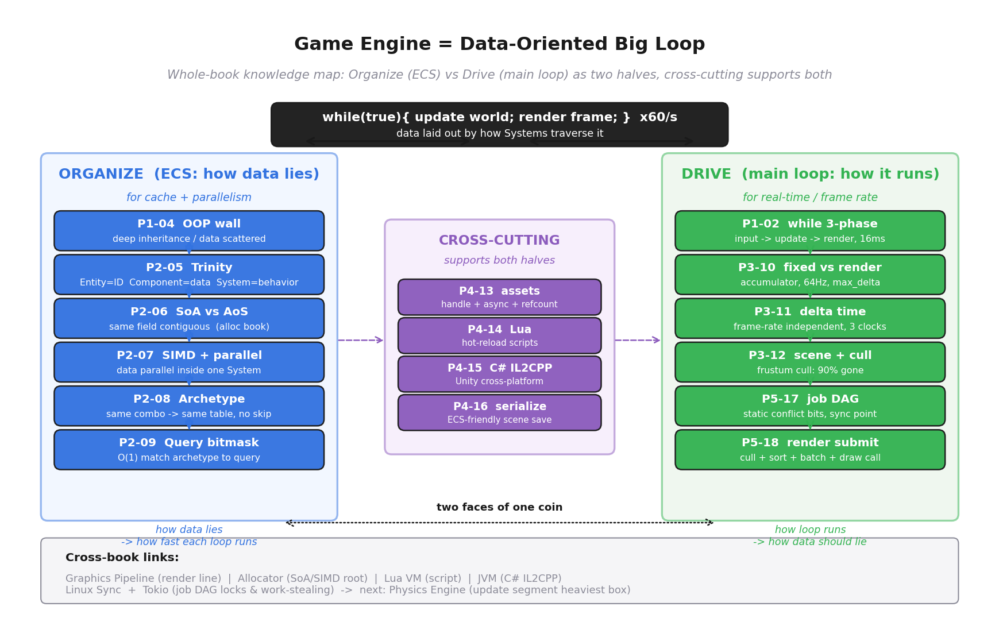
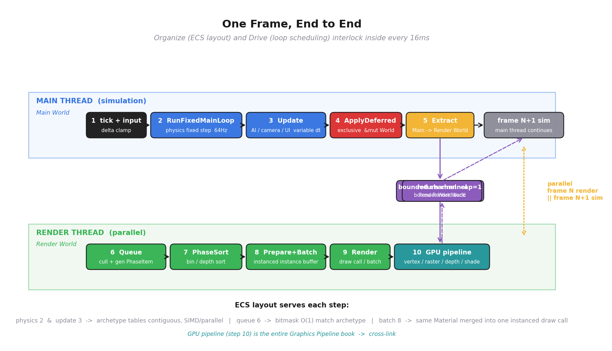
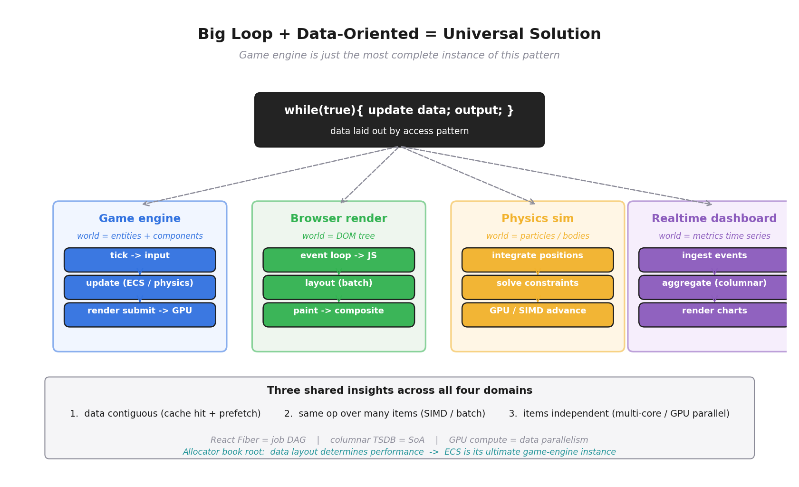

# 第 6 篇 · 第 20 章 · 全书收束:游戏引擎 = 数据导向的大循环

> **核心问题**:走完前十九章,你已经看清了游戏引擎的每一块拼图——ECS 三件套、SoA / Archetype 布局、Query 位掩码匹配、主循环 fixed update vs render、accumulator、delta time、job 系统 DAG 调度、渲染提交 draw call / 批处理 / 跨帧 pipeline、资源管理、Lua / C# 脚本、序列化。可拼图还是拼图,它们之间到底怎么连起来,把"一个虚拟世界每秒推进 60 次"这件事做出来?本章就是把所有拼图**拼成一张全景图**:你读完应该能在脑子里放映一帧——主循环 tick → 各 System 用 Query 查它关心的 Component → 在 Archetype 连续内存里 SIMD / 并行遍历更新 → 物理(fixed step)→ 提交渲染(剔除 + 排序 + 批处理 + draw call)→ 下一帧——以及这一切**为什么**必须这么组织。本章不再深入新源码,只把十九章已立的事实织成一张网,回扣全书"组织 vs 驱动"的二分骨架,点出这条思想的普适性,并引出本子线的下一本《物理引擎》。

> **读完本章你会明白**:
> 1. 全书一句话主旨再确认:游戏引擎 = 每秒推进世界 60 次并渲染的大循环;核心难题 = 组织海量对象;答案 = ECS + 数据导向设计。
> 2. **组织面**(ECS)的全景:从"对象是什么"撞墙(深继承 / 数据散落),到 Entity / Component / System 三件套拆开,到 SoA vs AoS(承分配器),到 Archetype / 稀疏集合两种布局范式,到 Query 位掩码匹配——一条线是"数据怎么躺才服从访问方式"。
> 3. **驱动面**(主循环)的全景:从 while 大循环三段式,到 fixed update vs render accumulator,到 delta time 帧率独立,到多线程 job 系统 DAG,到渲染提交四件套(剔除 / 排序 / 批处理 / draw call)——一条线是"每帧 16ms 怎么把海量对象更新渲染一遍"。
> 4. **横切**(资源 / 脚本 / 序列化)怎么支撑组织和驱动:资产句柄 + 异步加载 + 引用计数喂资源,Lua / C# IL2CPP 让逻辑热改,ECS 友好序列化让世界存盘读盘。
> 5. **一帧的全景时序**(全书高潮):主循环 tick 起的整条链路,你能在脑子里放映。
> 6. **思想的普适性**:浏览器渲染、物理仿真、实时数据看板——本质都是"大循环 + 数据导向";以及引出《物理引擎》——物理更新是主循环 update 段最重的一块,下一本书专门拆它。

> **如果一读觉得太难**:先只记三件事——① 全书就一句话,游戏引擎是个数据导向的大循环;② 组织面(ECS)解决"海量对象怎么躺",驱动面(主循环)解决"每帧怎么跑",横切(资源 / 脚本 / 序列化)支撑它们;③ 一帧 = 主循环 tick → System 查 Component → Archetype 连续内存并行遍历 → 物理 fixed step → 提交渲染(剔除 / 排序 / 批 / draw call)→ 下一帧。这三件事,是你该从整本书带走的"在脑子里放映一帧"的能力。

---

## 〇、一句话点破

> **游戏引擎,就是一个永不停止的 while 大循环——每秒把虚拟世界的状态推进 60 次,每次推进都更新所有对象、再渲染一帧。它的核心架构难题,是怎么组织海量对象让每帧够快;现代引擎的答案是 ECS + 数据导向设计:别按"对象是什么"组织数据(面向对象),而按"系统要怎么遍历数据"来布局数据。组织(ECS)和驱动(主循环)是同一枚硬币的两面——数据怎么躺,决定了循环每圈能跑多快;循环怎么跑,反过来决定了数据该不该这么躺。**

这是全书从 P0-01 立到现在的主旨,本章最后一次点它,然后**把它拆成一帧**。我们会把十九章的招牌结论一字排开,看清它们怎么互相咬合成一条每帧都跑的流水线。这一章不教新东西,只让你**重新认识你已经知道的东西**——看清它们是一张网,不是十九个孤岛。

> **钉死这件事**:全书就这一句话。任何一处你看不懂某个引擎机制,回到这句问:"这是在解决'数据怎么躺'(组织),还是在解决'循环怎么跑'(驱动),还是支撑它们的'横切'(资源 / 脚本 / 序列化)?"——三个问题答完,你就找到了这块拼图在全图上的位置。

---

## 一、先看清全图:组织 vs 驱动的二分骨架

本书一开篇(P0-01)就立了一个二分法,全书二十章都是它的展开。我们最后一次回扣它:

> **组织(ECS:数据怎么躺,面向缓存 / 并行) vs 驱动(主循环 / 时间 / 并发:循环怎么跑,面向实时 / 帧率)。**

- **组织这一面**:Entity / Component / System 三件套、Component 的 SoA 存储、Archetype 分组、Query 位掩码匹配——这些决定"海量对象的数据怎么布局,让 System 能高速遍历"。**这是本书灵魂招牌,承《内存分配器》**。
- **驱动这一面**:主循环(fixed update / render)、delta time 与固定步长、accumulator、多线程 job 系统 DAG、渲染提交(draw call / 批处理 / 跨帧 pipeline)、输入事件——这些决定"每帧 16 毫秒怎么把所有对象更新一遍并渲染"。
- **横切两面**:资源管理(资产加载 / 引用计数)、脚本系统(Lua / C# 热重载)、序列化(场景存盘)——支撑组织和驱动。

任何时候迷路,回到这个二分法。下面三节,我们分别把组织面、驱动面、横切面各织成一条线,把那条线上每章的招牌结论排出来。



> **钉死这件事**:这张知识地图就是你该带走的"全景"。组织面从"P1-04 OOP 撞墙"到"P2-09 Query 位掩码匹配"是一条线(数据怎么躺),驱动面从"P1-02 三段式"到"P5-18 渲染提交"是另一条线(循环怎么跑),横切(P4)穿在它们中间。两线交汇点就是 P0-01 那句"游戏引擎 = 数据导向的大循环"——组织决定数据怎么躺,驱动决定循环怎么跑,二者是同一件事的两面。

---

## 二、组织面全景:从"对象是什么"到"数据服从访问方式"

组织这一面是本书灵魂,占了全书近半篇幅(第 2 篇五章 + P1-04 + P3-12)。我们把它的五个台阶一字排开,看它们怎么一脉相承。

### 台阶一:P1-04,先把面向对象撞的墙钉死

一切都从这堵墙开始。读者你已经会写面向对象,可一旦用它组织**游戏对象**,会撞两面墙:

- **墙一,继承地狱**:游戏对象千变万化(会飞、会游、会施法、会隐身...),面向对象用继承表达,继承树越深越乱,出现钻石继承(同一基类被多条路径继承),加一个新组合要改整棵树。
- **墙二,数据散落缓存差**(本书真正关心的):面向对象把"数据 + 行为"绑在一个对象里,几百上千个对象 `new` 出来散落在堆上,主循环 update 段只要某个字段(比如 Position),却把整块(含无用的 Color、Radius)拉进缓存行,而且遍历是指针追逐,缓存几乎全 miss。

> **钉死这件事**(承 P1-04):面向对象组织游戏对象撞两面墙——继承墙(架构层)和数据散落墙(性能层)。前者让代码维护噩梦,后者让 16ms 帧预算根本不够。这双墙,是后面 ECS 全套设计要拆掉的目标。

### 台阶二:P2-05,三件套把"数据 + 行为"拆开

ECS 的第一拳:**Entity / Component / System 三件套**。它把面向对象"数据 + 行为绑在一个对象里"这条铁律拆了。

- **Entity = 一个 ID**。就一个数字,什么数据都没有,是"这个游戏对象存在"的凭证。EnTT 用 `enum class entity : id_type {}`,32 位里低 20 位塞 slot、高 12 位塞 version——销毁时 version +1,零额外内存同时实现槽位复用和悬空引用检测。
- **Component = 纯数据**。`Position{x,y}`、`Velocity{vx,vy}`——struct,无方法。一个 Entity"挂了哪些 Component"就"是什么"——**组合取代继承**,P1-04 的继承墙塌。组件还能运行时加减(冰冻 = 移除 Velocity),逻辑零侵入。
- **System = 纯行为**。一个函数,通过 Query 拿到它关心的组件,遍历,做同一件事。System 不持有数据,行为从对象身上彻底剥离——改一处全生效,加新行为不动现有数据。

> **钉死这件事**(承 P2-05):三件套拆了"数据 + 行为绑一起"的铁律——Entity 是 ID、Component 是数据、System 是行为。这一拆,继承墙塌了("是什么"由组件组合决定),性能墙松动了(数据和行为分开后,数据可以按访问方式重新摆——这是下一台阶的题)。

### 台阶三:P2-06 / P2-07,数据导向让 System 遍历缓存友好 + 可并行

三件套只是拆开,真正拆掉性能墙的是**数据导向设计(Data-Oriented Design)**:**Component 不按"属于哪个 Entity"存,而按"System 怎么遍历"存**。这就是 **SoA(Structure of Arrays)**:

- **AoS(面向对象)**:`[Ball_0: pos,vel,color,radius][Ball_1: pos,vel,color,radius]...`——每个对象一整块,遍历位置时把无用的颜色半径也拉进缓存。
- **SoA(数据导向)**:`pos[]:[p0,p1,p2...]`、`vel[]:[v0,v1,v2...]`——同一字段连续存。MovementSystem 只要 pos[] 和 vel[] 两条数组,一路连续读,**不碰 color/radius**。

SoA 凭什么快?承《内存分配器》"数据布局决定性能"——**数据连续(CPU 缓存行整块命中 + 硬件 prefetcher 顺序预取)+ 同一操作(SIMD 一次处理 8 / 16 个实体)+ 互不依赖(多核数据并行,每个核算一片不相交的实体)**。这三件事面向对象的对象散落全都做不到。

> **承《内存分配器》**(承 P2-06 / P2-07):ECS 的 SoA / 缓存行 / SIMD / 数据并行,本质是《内存分配器》讲的"数据布局决定性能"在游戏引擎的极致应用。读者会发现 ECS 不是新东西,是"为缓存友好重新组织数据"——同一思想在分配器里是 slab / 缓存行对齐,在 ECS 里是 SoA + Archetype。

### 台阶四:P2-08,Archetype 把"组件组合相同"的实体连续存

P2-06 的朴素 SoA(全局一条 Position 数组)在真实世界撞墙:**世界不是同质的**——树有 `Position + Color`,子弹有 `Position + Velocity`,敌人有 `Position + Velocity + Health`,BOSS 还有 AI。如果还按"每组件一个全局大数组",Position 数组第 0 个是树、Velocity 数组第 0 个是子弹,**下标和实体不再对齐**。MovementSystem 要遍历 Position + Velocity,要么沿一个数组扫、每个实体查"它有没有 Velocity"(分支 + 间接访问,SIMD 断流),要么算两个数组的交集。

**Archetype** 的解法:**按"组件组合"分组**。把"组件组合完全相同"的实体归到同一个 archetype,组内列式 table 存储(每一行是一个实体,每一列是一种组件,每列连续存)。System 查询时,引擎找出所有"同时含它要的所有列"的 archetype table,逐张扫——每张 table 内部 Position 列和 Velocity 列各自连续、行号天然对齐(同行号 = 同实体),**零跳过、零间接**,SIMD 满速。

代价是**加 / 删组件要迁移**(把数据从老 table 搬到新 table),Bevy 用 Edges 缓存把"迁移到哪个 archetype"摊到 O(1)。另一种范式 **sparse set**(EnTT 默认)反过来:加删 O(1) 零迁移,但跨组件查询要 gather 交集、SIMD 受分支打断。两种范式各有适用场景——**组合稳定 + 遍历密集选 Archetype,加减频繁选 sparse set**,现代 ECS 库常常两者都支持(Bevy 的 `StorageType::Table` vs `SparseSet`,EnTT 的 sparse set + 可选 group)。

> **钉死这件事**(承 P2-08):Archetype 是"布局粒度匹配查询粒度"——System 按组合查,数据就按组合分组存。每张 archetype table 内部连续对齐零跳过,SIMD 和多核切分放心用。代价是加删要迁移,靠 Edges 缓存 + move_row 高效搬运。这是 P2-06 朴素 SoA 在"真实世界组件组合多样"下的工程落地。

### 台阶五:P2-09,Query 用位掩码 O(1) 匹配 archetype

最后一块拼图:**System 怎么声明"我要 Position + Velocity",引擎怎么在成百上千个 archetype 里快速找到匹配的?**

朴素做法是遍历每个 archetype 看它含不含这两列,太慢。真实做法是**位掩码 + archetype 索引**:每个 archetype 用一个 bitset 标记它含哪些组件(第 i 位 = 1 表示含第 i 种组件);System 的查询也编码成一个 bitset(要求含的位 = 1)。一个 archetype 匹配一个查询,就是两个 bitset 的位运算:`(archetype_mask & query_required) == query_required`——一次 AND + 一次比较,几十纳秒。几百个 archetype 扫一遍,微秒级;System 启动时算一次缓存下来,之后每帧零开销。

整个组织面的链条到此闭环:**数据按组合分组(Archetype)→ System 用位掩码 O(1) 找到匹配的 archetype → 在匹配的 archetype table 内连续 SIMD / 并行遍历**。整条链每一步都是 O(1) 或 O(N) 的连续扫描,没有 O(log N) 的树查找,没有哈希冲突,没有间接跳转。这就是数据导向把性能压榨到底的样子。

> **钉死这件事**(承 P2-09):Query 的位掩码匹配让"找该遍历哪些 archetype"也快——整个"查询 → 匹配 → 遍历"链条每一步都是 O(1) 或 O(N) 连续扫描。组织面到此闭环:数据按组合分组,系统按组合查询,二者用位掩码 O(1) 对上,中间没有任何慢操作。

### 组织面的一条主线

把五个台阶串起来,组织面有一条清晰的主线:**从"对象是什么"(面向对象)到"数据怎么服从访问方式"(数据导向)**。

```
面向对象(按对象组织)──撞墙──> ECS 三件套(数据行为拆开)
   ──> SoA(按字段连续存, 承分配器)
   ──> Archetype(按组合分组, 同组合实体连续)
   ──> Query 位掩码(O(1) 找匹配 archetype)
```

每一步都在回答同一个问题:"数据该怎么躺,才能让 System 遍历得最快?"——而答案始终是 P0-01 那个洞察:**让数据布局服从访问方式**。ECS 不是什么新宗教,它就是这条洞察在游戏引擎场景的字面兑现。

> **钉死这件事**:组织面五台阶是一条主线——**从"按对象组织",一路走到"按系统遍历方式组织"**。面向对象的错,错在"按对象组织,却按字段遍历";ECS 的对,对在"你怎么遍历,我就怎么摆"。这条主线是本书灵魂,也是读者该从组织面带走的唯一一句话。

---

## 三、驱动面全景:从 while 三段式到一帧的完整流水线

组织面解决"数据怎么躺",驱动面解决"循环怎么跑"。我们把驱动面的六个台阶也排成一条线。

### 台阶一:P1-02,先把主循环三段式立起来

P0-01 / P1-02 立起的第一件事:游戏程序 = `while(true){ input → update → render; }` 的死循环,每秒 60 圈,每圈 16ms。和"请求-响应"的服务端根本不同——游戏是**主动**推进世界的,每时每刻都在更新,哪怕玩家不动手柄。这三段里,**update 段最耗时**(推进所有对象:移动、碰撞、AI、物理),是本书的主战场——ECS 就是为了让这一段够快;render 段就是《图形渲染管线》那本书的整条管线,本书 P5-18 讲"引擎怎么喂给它"。

> **钉死这件事**(承 P1-02):驱动面一切设计的起点,是 `while(true){ input → update → render; }` 这个三段式死循环。每圈 16ms 的预算,update 最耗时(ECS 的主战场),render 是把世界画一帧。后面所有驱动面的机制(fixed update、accumulator、job 系统、渲染提交),都是为了让这个循环每圈 16ms 跑得动。

### 台阶二:P3-10,物理用固定步长、渲染用可变步长,accumulator 调和

朴素"一帧跑一次物理"会在三处崩:渲染帧率 < 物理频率时游戏变慢动作、> 时变快进、帧率抖动时物理积分发散。根因是**物理要固定步长**(数值稳定 + 可复现),**渲染要可变步长**(适配 60/120/144 Hz 显示器 + 榨干性能 + 无累积后果)——两个独立频率。

**accumulator 模式**漂亮调和:每帧测 delta time 累加进 accumulator,每攒够一个固定步长 fixed_dt 就跑一次物理(`while accumulator >= fixed_dt: physics_update(fixed_dt); accumulator -= fixed_dt`),物理步长永远恒定;渲染时用余数 / 步长当插值系数 `alpha`,在两个物理状态之间平滑画。物理步数和渲染帧数完全解耦——任意组合(30Hz 物理 + 144Hz 渲染、120Hz 物理 + 30Hz 渲染)都能工作。Bevy 默认 **64Hz 而非 60Hz**(避开和 60Hz 显示器病态同频共振,且 15625µs 是 2 的幂浮点无损),并用 `Time<Virtual>::max_delta`(250ms)在上游钳 delta 防**死亡螺旋**(物理自己比 fixed_dt 还慢时 accumulator 爆炸)。

> **钉死这件事**(承 P3-10):物理要固定步长(稳定 + 可复现),渲染要可变步长(适配显示器 + 榨干性能),accumulator 用一个累加器调和这两个独立频率——攒够一步跑一步,渲染用余数插值。Bevy 默认 64Hz 避开显示器同频共振,max_delta 钳位防死亡螺旋。

### 台阶三:P3-11,delta time 让游戏逻辑帧率独立

物理用固定步长,游戏逻辑(角色移动、相机跟随、UI 动画)用可变步长——但要写成 `x += speed * dt`,这样不管 60FPS 还是 30FPS,一秒都走一样远。delta time 这个数本身要算准(防系统时钟精度坑、休眠醒来巨 delta、窗口拖动卡顿),还要平滑(避免抖动)、钳位(防死亡螺旋)。Bevy 用 `Time<Real>` / `Time<Virtual>` / `Time<Fixed>` 三套时钟分离真实 / 虚拟 / 固定三个关注点,暂停 / 子弹时间 / 变速回放都在虚拟时钟层解决,fixed_dt 永远不变。

> **钉死这件事**(承 P3-11):delta time 是游戏逻辑帧率独立的命脉——`x += speed * dt`,不管帧率多少一秒走一样远。delta 要算准、要平滑、要钳位。三套时钟(真实 / 虚拟 / 固定)分离让暂停 / 子弹时间 / 回放都在虚拟层解决,不动 fixed_dt。

### 台阶四:P3-12,场景图 + 空间划分服务组织和剔除

P3-12 是组织 / 驱动的交汇:父子变换(角色的剑跟着手)用场景图表达;海量对象用空间划分(四叉树 / 八叉树 / BVH)快速**剔除**——视锥剔除把看不见的根本不喂给后续流程。剔除放在渲染提交的 Queue 阶段之前(承 P5-18),典型场景可见集只占总对象的 5%~10%,90% 在剔除阶段就被干掉。这一节承《物理引擎》(物理引擎的宽相也用动态树做碰撞对查找),一句带过指路。

> **钉死这件事**(承 P3-12):场景图表达父子变换,空间划分(四叉树 / 八叉树 / BVH)做剔除——把看不见的提前干掉,后面所有流程(批处理、draw call)的开销都线性下降。剔除是组织和驱动的交汇:数据怎么组织(空间索引)决定循环跑多快(少处理多少对象)。

### 台阶五:P5-17,多线程 job 系统把一帧建成 DAG

一帧的活怎么拆给多核?**数据并行**(P2-07 讲过:一个 System 内部切实体片)和**任务并行**(P5-17:不同 System 之间并行)是两种可叠加的并行。任务并行的核心是**把一帧建成一个 DAG 依赖图**:节点是 System,边是依赖;依赖有两个来源——**数据读写冲突**(两个 System 都写同一组件,不能并行)和**命令队列的同步点**(结构修改 spawn / 加组件会破坏 archetype 布局,要等 `ApplyDeferred` 同步点统一应用)。

Bevy 的 `MultiThreadedExecutor` 在 schedule 初始化时**预计算**所有 System 两两的冲突关系存成 N×N 位集 `conflicting_systems`,运行时 `can_run` 用位集 AND 判断"和正在跑的有没有冲突"——**用调度顺序代替锁**(时间隔离 vs 空间隔离),运行时零加锁。结构修改(System 想 spawn)不直接改 World,而是 push 进 per-system 命令队列,等同步点拿独占 `&mut World` 统一 replay——代价是同步点是并行的天然刹车(运行时所有别的 System 都停)。EnTT 走另一条路:`organizer` 在编译期从 C++ 的 const-ness 推 ro/rw,**只返回依赖图不执行**,用户自己交给 TBB / Taskflow / 自写池。

> **钉死这件事**(承 P5-17):一帧的并行 = DAG 调度。Bevy 用预计算的冲突位集 + 运行时查位集,把"动态加锁"换成"静态分析 + 调度顺序",运行时零加锁;结构修改用命令队列延迟到同步点统一应用,代价是同步点是并行刹车(少用 Commands、集中 spawn 是性能头条)。ECS 把读写语义做进类型系统(Bevy 用 `&` / `&mut`,EnTT 用 const),是这套调度能成立的根。

### 台阶六:P5-18,渲染提交四件套把世界画出来

update 段算完,世界要画出来。可几千个对象不能各自喊 GPU 画——**draw call 贵**(贵在 CPU→GPU 驱动验证 + 状态切换 + 总线提交,不在画几个三角形),几千个 draw call CPU 先死。引擎的答案是四件套:

- **剔除**(承 P3-12):看不见的根本不生成 PhaseItem。
- **排序**:不透明按复合 BinKey(pipeline + draw fn + mesh + material bind group)分桶(状态切换最少),透明按深度从远到近全局排序(画家算法,保证 alpha 混合正确)。
- **批处理**:同 Material + 同 Mesh 的对象,世界变换塞进实例数组,合并成一个 instanced draw call(顶点缓冲只绑一次,所有实例共用;GPU 着色器按 `instance_index` 取每实例变换)。
- **跨帧 pipeline**:Bevy 用两个 ECS 世界(Main World 模拟线程 + Render World 渲染线程),每帧一次 Extract 是唯一桥梁,通过容量 1 的有界通道借还——帧 N 渲染 ∥ 帧 N+1 模拟,两条线程都不闲。

整条渲染提交链路在 Bevy 里是严格分阶段的 schedule:Extract → Queue(生成 PhaseItem + 剔除)→ PhaseSort(排序)→ Prepare / Batch(批处理)→ Render(发 draw call,GPU 执行管线——这一段指路《图形渲染管线》)。这条链路的核心优化全部源自一个第一性原理——**draw call 贵在状态切换,不在画三角形**。

> **钉死这件事**(承 P5-18):渲染提交 = 剔除 + 排序 + 批处理 + 跨帧 pipeline 四件套,全源自"draw call 贵在状态切换"这个成本模型。Bevy 用两个 ECS 世界 + 容量 1 通道实现帧 N 渲染 ∥ 帧 N+1 模拟的跨帧 pipeline,1 帧显示延迟换两条线程满载。管线本身(顶点变换 / 光栅化 / 深度 / 着色)指路《图形渲染管线》,本章只讲"引擎怎么喂给管线"。

### 驱动面的一条主线

把六个台阶串起来,驱动面也有一条清晰的主线:**每帧 16ms 怎么把海量对象更新一遍并渲染**。

```
while 大循环(三段式)──> fixed update vs render(accumulator)
   ──> delta time 帧率独立(三套时钟)
   ──> 场景图 + 空间划分(剔除)
   ──> 多线程 job 系统(DAG + 同步点)
   ──> 渲染提交(剔除 + 排序 + 批 + draw call + 跨帧 pipeline)
```

每一步都在回答同一个问题:"这一帧的预算怎么花,才能让海量对象都更新到、都画出来?"——答案始终是 P0-01 那个洞察:**让循环的每一段都服从数据的布局**。物理用固定步长是因为积分要稳定,渲染用批处理是因为 draw call 状态切换贵,job 系统用 DAG 是因为 ECS 把读写做进类型系统让冲突可静态分析。组织和驱动,从来是同一件事的两面。

> **钉死这件事**:驱动面六台阶是一条主线——**每帧 16ms 怎么把海量对象更新渲染一遍**。每一步的设计动机都和组织面呼应:物理固定步长(承数值稳定)、渲染批处理(承 draw call 成本模型)、job DAG(承 ECS 把读写做进类型系统)。**数据怎么躺决定了循环每圈能跑多快;循环怎么跑反过来决定了数据该不该这么躺**——这就是组织和驱动是同一枚硬币两面的含义。

---

## 四、横切面:资源、脚本、序列化怎么支撑组织和驱动

组织(ECS)和驱动(主循环)是骨架,横切面(第 4 篇)是血肉——它支撑骨架,让引擎能装下真实游戏的内容。我们把横切三章也排一下,看清它们怎么服务组织和驱动。

### 资源管理(P4-13):喂给 ECS 的大资产

游戏世界里满满都是大资产——贴图、模型(mesh)、音频、动画片段。这些资产**不能阻塞主循环**(一个 10MB 贴图同步加载,16ms 预算秒没),也**不能没人用时还占内存**(玩家离开关卡,这个关卡的资产该释放)。引擎的答案三件套:

- **资产句柄**:ECS 组件里存的不是贴图本身,是个 `Handle<Texture>`(一个 ID),真正的贴图在资产管理器里。这样组件数据紧凑(句柄就一个 ID),序列化友好(存 ID 不存大数据)。
- **异步加载队列**:资产从磁盘加载是 IO,放后台线程,加载完通过事件通知主线程;主循环拿到的句柄在加载完成前是"弱句柄"(用的时候查一下有没有准备好)。
- **引用计数**:每个资产记着"有多少句柄指向我",计数归零就释放。Bevy 的 `Assets<T>` 资源 + `Handle<T>` 自动管理这套。

承 P5-18 渲染提交:PrepareMeshes / PrepareAssets 阶段只是把异步加载好的资产**上传到 GPU buffer**(顶点数据、贴图),这一步不是每帧重传,资产第一次用的时候传一次,GPU 缓存住。

> **钉死这件事**(承 P4-13):资产管理的三件套——句柄(组件存 ID 不存大数据)、异步加载(不阻塞主循环)、引用计数(没人用就释放)——让大资产能被 ECS 引用又不拖累主循环。渲染提交时只是把加载好的资产上传 GPU,不是每帧重传。

### 脚本系统(P4-14 / P4-15):让逻辑热改,引擎不重编译

游戏逻辑(角色技能、剧情触发、UI 行为)变更极频繁——策划一天改几次。如果逻辑写死在 C++ 引擎里,每次改都要重编译引擎、重启游戏,开发效率噩梦。脚本系统的答案:**把高频变更的逻辑放到脚本里,引擎不重编译就能热改**。

- **Lua 嵌入**(承《Lua 虚拟机》):很多引擎(魔兽世界、Roblox、愤怒的小鸟)用 Lua 做热重载脚本。引擎把 Lua VM 嵌进来,C++ 对象通过绑定库( LuaBind / Sol2 )暴露给 Lua,策划改 Lua 文件,引擎热重载,逻辑立刻生效。Lua 的优势:VM 极小(几百 KB)、启动快、GC 短、和 C 的边界几乎零开销。承《Lua 虚拟机》那本讲的 TValue / Table / GC / 协程,这里只讲怎么把它嵌进引擎。
- **C# + IL2CPP**(承《JVM》):Unity 用 C# 做脚本。C# 凭什么跨平台?靠 **IL2CPP**——把 C# 编译的 IL 翻译成 C++ 代码,再和引擎一起编译。这样 C# 脚本跑起来接近原生速度(GC 和 JIT 都还在,但跨语言边界变薄)。承《JVM》讲的跨语言 VM、GC 和原生内存的边界,这里讲 IL2CPP 怎么把这条边界做薄。

脚本系统和 ECS 的接口:脚本函数通常注册成 System(在 update 段被调用),或注册成事件回调(玩家按键时触发)。脚本操作的是 ECS 组件数据——读 Position、写 Velocity——和原生 C++ System 走同一条数据通路,只是语言不同。

> **钉死这件事**(承 P4-14 / P4-15):脚本系统让游戏逻辑不重编译引擎就能热改——Lua 嵌入(承《Lua 虚拟机》,VM 极小,适合热重载)、C# + IL2CPP(承《JVM》,把 C# 跨平台)。脚本注册成 System 或事件回调,操作的是 ECS 组件数据,和原生 System 走同一条数据通路。

### 序列化与场景持久化(P4-16):把 ECS 世界存盘读盘

游戏要存档、关卡要加载、编辑器要保存场景——这些都要求把 ECS 世界(哪些 Entity、各挂什么 Component、Component 数据是什么)序列化到磁盘,再反序列化回来。

ECS 的序列化天然友好:**Component 本来就是纯数据 struct,连续存放在 archetype table 里**。序列化某个实体,就是把它所有 Component 的字节写出去;反序列化就是读回来重新挂到 Entity 上。没有面向对象的虚函数、循环引用、隐式状态这些坑。Bevy 的 `Reflect` trait + `Scene` / `DynamicScene` 就是干这件事——给 Component 加 `#[reflect(Component)]`,引擎就能自动序列化它。

> **钉死这件事**(承 P4-16):ECS 友好的序列化——Component 是纯数据,连续存放,序列化就是写字节、反序列化就是读回来重新挂。没有面向对象的虚函数和循环引用坑。这是"数据和行为分离"在持久化层面的额外红利。

### 横切面的角色

横切三章不直接解决"组织"或"驱动"的核心难题,但它们让引擎能装下真实游戏的内容:资源管理让大资产可用,脚本让逻辑可热改,序列化让世界可存读。**它们都是建立在 ECS 数据导向之上**——句柄是 ID(承 Entity 设计),脚本操作 Component 数据(承数据行为分离),序列化连续 Component 字节(承 SoA 布局)。横切面是组织面思想在"资产 / 逻辑 / 持久化"场景的延伸,不是另一套架构。

> **钉死这件事**:横切三章(资源 / 脚本 / 序列化)建立在 ECS 数据导向之上,是组织面思想在"资产 / 逻辑 / 持久化"场景的延伸。它们不另起架构,而是复用 Entity 是 ID、Component 是数据、连续存放这套设计。这就是为什么 ECS 是本书灵魂——它一旦立起来,横切的难题都顺势被它解决。

---

## 五、全书高潮:一帧的全景时序

前面四节我们把组织面、驱动面、横切面分别织成线。这一节把它们**交汇成一张时序图**——一帧从头到尾发生了什么。这是全书的最高潮:读者读完应该能在脑子里放映这一帧。

### 一帧的完整流程

假设一台 8 核机器,60Hz 显示器,游戏里有 10000 个实体(几千个静态装饰、几千个会动的敌人 / 子弹、几百个特效粒子、几个相机 / 光源)。主循环跑一圈(目标 16.6ms)发生了什么:



**① 主循环 tick**(P1-02):`while running` 转一圈。先测 delta time(承 P3-11)——上一帧实际过了多久(假设 16.8ms)。这个 delta 进入 `Time<Virtual>`,被 `max_delta`(250ms)钳位防死亡螺旋。

**② 输入事件**(P5-19):从 OS 的事件队列读这一帧的键鼠 / 手柄输入,转成引擎事件总线上的事件。脚本注册的输入回调(承 P4-14)在这里被触发——比如"按下空格 → 给玩家实体加一个 Jump 组件"(命令进 Commands,等同步点应用)。

**③ RunFixedMainLoop**(P3-10):accumulator 模式。`accumulate_overstep(delta)` 把 delta 攒进 `Time<Fixed>::overstep`,`while expend()` 每攒够一个 fixed_dt(15.625ms,Bevy 64Hz)就跑一次 `FixedMain` 调度——物理系统们在这里跑。这一帧 delta 是 16.8ms,够跑一次(剩 1.175ms 留给下一帧继续攒)。物理 update 是 update 段最重的一块——碰撞检测 + 约束求解,承 P2 数据导向:碰撞体的 Position / Velocity 在 archetype table 里连续存放,SIMD 批量处理(下一本《物理引擎》专讲这一块)。

**④ Update**(P3-11,可变步长):跑一次可变步长的游戏逻辑 System——AI 决策、技能冷却、相机跟随、UI 动画。这些 System 对数值稳定性不敏感,用 `Time<Virtual>::delta()`(可变 dt)。

**⑤ 同步点 ApplyDeferred**(P5-17):所有用了 Commands 的 System(spawn 实体、加 / 删组件)的命令队列,在这里拿独占 `&mut World` 统一 replay。期间所有别的 System 都停。这是这一帧里架构修改安全落地的唯一时刻。

**⑥ Extract**(P5-18):主线程把渲染需要的数据(Mesh 句柄、Material 句柄、GlobalTransform、相机参数、灯光、可见性)从 Main World 拷贝到 Render World。这是两个 ECS 世界唯一的桥梁,每帧一次。拷完,主线程通过容量 1 的有界通道把 Render World 发给渲染线程,**主线程立刻进下一帧模拟**。

**⑦ 渲染线程跑 Render schedule**(P5-18,和下一帧模拟并行):
   - **Queue**:遍历所有可绘制实体,对每个通过剔除(视锥 + 层级可见性 + 距离,承 P3-12)的实体生成一个 PhaseItem,放进对应 view 的 render phase(不透明进 BinnedRenderPhase,透明进 SortedRenderPhase)。
   - **PhaseSort**:Binned 的按 BinKey 有序,Sorted 的按深度全局排序。
   - **Prepare / Batch**:同 BinKey 的 entity 并入一个 batch,实例数据(世界变换)塞 `BatchedInstanceBuffer` 写 GPU;建 bind group。
   - **Render**:用 `TrackedRenderPass` 对每个 batch 调它的 Draw function(装 pipeline、配 bind group、发 draw call)。

**⑧ GPU 执行管线**(承《图形渲染管线》):GPU 收到 draw call,执行顶点着色 → 光栅化 → 深度测试 → 像素着色 → 输出合并——这一段是《图形渲染管线》那本书的整条管线主题,本书一句带过。10000 个实体经剔除后约 1000 个可见,经批处理后约几十个 draw call,GPU 几毫秒画完。

**⑨ 渲染线程画完**,把 Render World 通过通道还回主线程,准备下一帧的 Extract。

**⑩ 第 N+1 帧的模拟和第 N 帧的渲染并行进行**——跨帧 pipeline。玩家看到的画面永远是上一帧算完的(1 帧延迟,约 16ms,人眼基本无感)。

### 这十六毫秒里发生了什么

把这一帧放大看,你会惊异于里面发生的事:**10000 个实体被各 System 用位掩码 O(1) 找到匹配的 archetype、在连续内存里 SIMD 批量处理;物理按固定步长稳定推进;结构修改卡在同步点统一应用;不冲突的 System 多核并行、冲突的按 DAG 顺序串行;渲染线程在另一条线程上剔除 + 排序 + 批处理,把 10000 个对象压成几十个 draw call;GPU 几毫秒画完,主线程已经开始下一帧**。

这一切的根基,是 P0-01 立的那句话——**数据按"系统怎么遍历"布局,循环就能每圈 16ms 跑完**。组织面(数据怎么躺)和驱动面(循环怎么跑)在这一帧里完美咬合:ECS 的 Archetype 让 SIMD 和多核并行放心用(组织服务驱动),物理的固定步长和 job 的 DAG 让海量对象在 16ms 内都更新到(驱动服务组织),渲染提交的四件套把更新完的世界高效画出来(驱动消费组织)。一张大网,每个节点都在自己的位置上发力。

> **钉死这件事**(全书高潮):一帧 = 主循环 tick → 输入 → RunFixedMainLoop(物理 fixed step)→ Update(可变步长逻辑)→ ApplyDeferred 同步点 → Extract 到 Render World → 渲染线程 Queue/PhaseSort/Prepare+Batch/Render → GPU 执行管线 → 下一帧(模拟 ∥ 渲染跨帧 pipeline)。组织面(ECS 数据布局)和驱动面(主循环调度)在这一帧里完美咬合——这就是"游戏引擎 = 数据导向的大循环"的字面落地,也是读者该从全书带走的"在脑子里放映一帧"的能力。

---

## 六、技巧精解:全书最核心的两个洞察

十九章讲了几十个技巧,但最核心的洞察只有两个。这一节把它们单独拆透——这两个洞察是读者该从全书带走的"思维工具",将来在游戏之外的任何实时系统里都能用。

### 洞察一:ECS = 让数据布局服从访问方式

这是组织面的灵魂,也是本书最重要的一句话。面向对象组织游戏对象为什么慢?根因不是"面向对象不好",而是**它的数据布局和遍历方式不匹配**:对象按"它是什么"组织(一个 Ball 整块),可遍历是按"我要哪个字段"的(update 只要 Position+Velocity)。这种**组织方式和访问方式错配**,在几百个对象时无所谓,几万个对象每帧更新时就是灾难。

ECS 的数据导向,本质是**让数据布局服从访问方式**——你怎么遍历,我就怎么摆:

- **System 只要 Position+Velocity**?那就把所有 Position 连续存、所有 Velocity 连续存(SoA),System 遍历只碰这两个连续数组。
- **组件组合多样,系统按组合查**?那就按组合分组(Archetype),同组合实体连续存,System 只扫匹配的 archetype table。
- **加 / 删组件频繁**?那就用 sparse set,加删 O(1),代价是跨组件查询要 gather(权衡)。

每一步都不是新发明,都是"让数据布局服从访问方式"这条洞察在不同场景的兑现。这条洞察的根,在《内存分配器》那本书讲过——**数据布局决定性能**:不是算法复杂度的问题,是数据在内存里怎么排布的问题。ECS 把这条洞察在游戏引擎场景发挥到极致,因为它面对的是"几万个对象每帧遍历"这种对缓存和 SIMD 最敏感的 workload。

> **钉死这件事**(全书洞察一):**ECS = 让数据布局服从访问方式**。面向对象的错,错在按对象组织却按字段遍历,组织与访问错配;ECS 的对,对在你怎么遍历我就怎么摆。这条洞察的根在《内存分配器》"数据布局决定性能",ECS 把它在游戏场景发挥到极致。读者带走这条洞察,将来设计任何"海量数据 + 高频遍历"的系统,第一问就该是"我的数据布局服从我的访问方式吗"。

### 洞察二:大循环 + 数据导向,是所有实时系统的通用解

这是驱动面的灵魂,也是本书点出的最有普适性的一件事。游戏引擎的"while 大循环 + 数据导向",**不是游戏独有的**。任何"实时把海量数据推进一格并输出"的系统,本质都是这个模型:

- **浏览器渲染**(60Hz 刷新网页):每帧也是 `while(true){ 处理事件 → 布局(layout)→ 绘制(paint)→ 合成(composite) }`。布局阶段算每个 DOM 元素的位置,数据导向地说就是"遍历所有元素更新 Position / Size";绘制阶段把元素画出来,批处理同样适用(相同层叠上下文的元素合并成一个合成层)。React 的 Fiber 调度、虚拟 DOM diff,本质就是"把 DOM 更新建成一个 DAG 调度",和游戏引擎的 job 系统同源。
- **物理仿真**(每步推进所有粒子):更直白,就是一个大循环,每步把所有粒子的位置 / 速度按物理规则推进一格。流体仿真(SPH / PIC)、布料仿真、毛发仿真,本质都是 SoA 布局粒子数据 + 每步 SIMD / GPU 并行推进。
- **实时数据看板**(每秒刷新海量指标):监控大屏、股票行情、IoT 仪表盘——后端每秒推送几千个指标,前端要实时聚合 + 渲染。这也是一个"每帧 / 每秒 tick 一次,把海量指标数据更新并画出来"的大循环,数据导向地组织指标(按指标类型连续存)能让聚合和渲染都快。

这些系统,核心矛盾都是同一个:**怎么在固定的时间预算内(一帧 / 一秒),把海量数据更新一遍并输出**。答案都是同一个:**用大循环驱动,按访问方式布局数据**。

- "对象是什么"不重要(网页是 DOM、物理是粒子、看板是指标),但"系统怎么遍历它们"最重要——按遍历方式布局数据。
- "每次推多大"看场景(游戏物理要固定步长、浏览器布局要可变步长、看板每秒一次),但"循环要每圈预算内跑完"不变——循环设计服从时间预算。
- "并行多少"看核数和 workload,但"哪些能并行"看数据读写冲突——把读写语义做进类型系统,冲突可静态分析。

> **钉死这件事**(全书洞察二):**大循环 + 数据导向,是所有实时系统的通用解**。游戏引擎、浏览器渲染、物理仿真、实时看板——本质都是"每帧 / 每秒把海量数据更新一遍并输出"。游戏引擎只是这条洞察在"虚拟世界每秒推进 60 次"场景的最完整落地。读者读透本书,顺带理解了这一整类实时系统——这就是本书在读者已读系列里的最大价值:不是教你一个引擎,是教你一种思维。

### 两个洞察的关系

这两个洞察不是孤立的,它们是**同一件事的两面**:

- 洞察一(数据布局服从访问方式)是**静态**——它讲数据在内存里怎么躺。
- 洞察二(大循环 + 数据导向是通用解)是**动态**——它讲循环怎么跑,数据怎么被消费。

合起来就是本书的全书主旨:**一个数据导向的大循环**。数据按访问方式躺好(组织面),循环每圈把它们更新一遍并输出(驱动面),这就是游戏引擎,这也是所有实时系统。

> **钉死这件事**:全书两个核心洞察是一枚硬币的两面——洞察一(数据布局服从访问,静态)讲数据怎么躺,洞察二(大循环 + 数据导向通用,动态)讲循环怎么跑。合起来就是"一个数据导向的大循环",这是游戏引擎的本质,也是所有实时系统的本质。

---

## 七、思想的普适性:游戏之外的"大循环 + 数据导向"

上一节我们点出"大循环 + 数据导向"是所有实时系统的通用解。这一节稍微展开几个对照,让读者看清本书讲的思想在你已读 / 将读的其他领域里怎么兑现。



### 对照一:浏览器渲染 = 网页版的游戏引擎

浏览器(Chrome / Firefox)每秒刷新网页 60 次,本质就是一个游戏引擎,只不过"世界"是 DOM 树而不是 3D 场景:

- **主循环**:浏览器的 event loop 就是游戏主循环——每帧处理输入事件 → 跑 JS(脚本逻辑)→ 布局(layout,算每个元素位置)→ 绘制(paint,把元素画成像素)→ 合成(composite,把各层合成最终画面)。
- **数据导向**:现代浏览器把 DOM 重排(layout)做成"批量 + 增量"——一次 JS 调用改 100 个 DOM 元素,浏览器不是改一个排一个,而是把所有改动收集起来,一次 layout pass 批量处理。这就是"按访问方式布局数据"的变体——layout 系统要批量算,数据就批量收集。
- **React Fiber = job 系统**:React 16+ 的 Fiber 调度,把组件树更新拆成小任务,按优先级调度,能中断能恢复——本质就是游戏引擎的 job 系统,把"一帧的活"建成 DAG 调度。React 时间分片(Time Slicing)和游戏的"宁可慢不可卡"同源。

读透本书的读者,看浏览器架构会极其亲切——因为它就是另一个"数据导向的大循环"。

### 对照二:物理仿真 = 数据导向的极致

物理仿真(SPH 流体、PIC / FLIP 流体、布料、毛发、N 体引力)是数据导向设计的极致应用:

- **大循环**:每步把所有粒子按物理规则推进一格——和游戏物理 update 段一模一样,只是规模更大(几百万粒子 vs 几千对象)。
- **数据导向**:粒子数据用 SoA 布局(position[]、velocity[]、density[] 各自连续),每步用 SIMD 或 GPU compute shader 批量处理。空间划分(网格 / BVH)做邻居查找(承 P3-12 空间划分)。
- **GPU 并行**:大规模仿真直接上 GPU,几千个线程各算一片粒子——这是 P2-07 数据并行的极致版。

《物理引擎》那本书会讲 Box2D 这种 CPU 刚体引擎怎么用约束图着色做并行,本质就是"把约束按共享物体分组(数据导向)+ 同色并行解(并行调度)"——和本书 P5-17 的 job 系统同源。

### 对照三:实时数据看板 = 每秒 tick 一次的大循环

监控大屏( Prometheus + Grafana)、股票行情、IoT 仪表盘——这些系统的后端每秒推送几千到几万个指标,前端要实时聚合 + 渲染。这本质也是大循环:

- **大循环**:每秒 / 每几百毫秒 tick 一次,把所有指标更新一遍并重新渲染图表。
- **数据导向**:指标按类型连续存(时间序列数据库的列式存储,承 SoA),聚合(sum / avg / max)能 SIMD 批量处理。
- **剔除**:屏幕上只显示一小部分指标,大部分根本不画——和游戏的视锥剔除同构。

这个对照可能让读者意外,但架构本质就是这样。任何"实时把海量数据推进并输出"的系统,都跑不出"大循环 + 数据导向"这个框架。

> **钉死这件事**:游戏引擎不是孤岛,它是"大循环 + 数据导向"这种架构在"虚拟世界每秒推进 60 次"场景的最完整落地。浏览器渲染、物理仿真、实时看板——架构本质同源。读者读透本书,带走的是一种能识别和应用到所有实时系统的思维,不是一个引擎的具体 API。

---

## 八、承接:本书在你已读 / 将读系列里的坐标

本书不是孤立的,它在你的系列里有密集承接。最后一次把它们串起来:

- **★强承《图形渲染管线》**(本子线第一本):引擎的渲染子系统就是那本书的整条管线。本书 P5-18 讲"引擎怎么把 ECS 数据喂给管线",管线本身(顶点变换 / 光栅化 / 深度 / 着色)一句带过指路 [[graphics-series-project]]。两本书合起来,是从"一个像素怎么算出来的"到"一个虚拟世界怎么每帧画出来"的完整旅程。
- **★强承《内存分配器》**:ECS 的 SoA / 缓存行 / SIMD / 数据导向,本质是"数据布局决定性能"在游戏引擎的极致应用。本书第 2 篇把这条承接兑现——读者会发现 ECS 不是新东西,是分配器那本讲的思想在新场景的落地。
- **承《Lua 虚拟机》**:本书 P4-14 讲脚本系统,把 Lua VM 嵌进引擎、C++ 对象绑定到 Lua、热重载。承《Lua》那本讲的 TValue / Table / GC / 协程,这里讲怎么把它嵌入引擎。
- **承《JVM / HotSpot》**:本书 P4-15 讲 Unity 的 C# + IL2CPP,把 C# IL 编译成 C++。承《JVM》讲的跨语言 VM、GC 和原生内存边界,这里讲 IL2CPP 怎么把这条边界做薄。
- **承《Linux 内核机制》《Tokio》**:本书 P5-17 讲 job 系统 DAG 调度,承《Linux 同步原语》(锁 / 原子 / false sharing / 无锁队列)和《Tokio》(工作窃取线程池 / 异步调度)。
- **承《数学分析》《线性代数》**:主循环的数值积分(物理更新)、对象的变换(承渲染管线那本的 MVP)。

### 引出《物理引擎》(本子线下一本)

本书讲的是**引擎层面**——怎么组织海量对象(ECS)、怎么驱动主循环让世界每帧前进。但主循环 update 段里**最重的一块**——物理更新——本书只把它当一个黑盒:物理用固定步长跑(P3-10)、物理 update 在 RunFixedMainLoop 里(P5-17),可物理 update **内部**到底在干什么?

- 碰撞检测怎么从几万个物体里找出谁撞了谁(宽相动态树 + 窄相 SAT / GJK)?
- 碰撞响应怎么解算约束让物体不穿透不抖动(Sequential Impulse + 约束图着色并行)?
- 数值积分用显式欧拉还是半隐式欧拉还是 Verlet(承 P3-10 讲过的稳定性)?
- 子步进(substepping)怎么把大 dt 切小保稳定?
- CCD(连续碰撞检测)怎么防快速物体穿透(speculative contacts + TOI sweep)?

这些是**物理引擎**自己的事,不是通用游戏引擎的事。本子线的下一本《物理引擎:一个虚拟世界怎么不穿模不抖动》(基于 Box2D v3.2)就是专门拆这一块——它是本书 update 段那块"最重的黑盒"的展开。读那本书,你会看清主循环 update 段里物理 update 的每一毫秒在干什么,以及为什么物理引擎本身就是"数据导向 + 并行调度"的另一个极致样本(Box2D v3.2 的约束图 24 色着色并行求解器,和本书 P5-17 的 job 系统同源)。

> **钉死这件事**(承 [[physics-engine-source-facts]]):本书的 update 段把物理当黑盒(物理用固定步长 + 在 RunFixedMainLoop 里跑),物理引擎内部(碰撞检测 / 约束求解 / 积分方法 / CCD)是下一本《物理引擎》的主题。读完那本,本书 P3-10 的"物理要固定步长"、P5-17 的"物理 update 是 update 段最重的一块"会从黑盒变成白盒——你会看清那几毫秒的物理 update 内部每一拍在干什么,以及为什么 Box2D v3.2 是"数据导向 + 并行调度"的另一个极致样本(9 阶段求解器流水线 + 约束图 24 色着色并行)。

---

## 九、章末小结

### 回扣主线

本章是全书收束。我们把十九章的招牌结论一字排开,织成了一张全景图:

1. **一句话主旨再确认**(P0-01):游戏引擎 = 每秒推进世界 60 次并渲染的大循环;核心难题 = 组织海量对象;答案 = ECS + 数据导向。
2. **组织面**(第 2 篇 + P1-04 + P3-12):面向对象撞墙(深继承 / 数据散落)→ ECS 三件套(Entity / Component / System 拆开)→ SoA vs AoS(承分配器)→ Archetype 分组(组件组合相同连续存)→ Query 位掩码匹配。一条主线:**从"对象是什么"到"数据服从访问方式"**。
3. **驱动面**(第 1 篇 + 第 3 篇 + 第 5 篇):while 大循环三段式 → fixed update vs render(accumulator)→ delta time 帧率独立 → 多线程 job 系统 DAG → 渲染提交四件套(剔除 / 排序 / 批处理 / draw call)→ 跨帧 pipeline。一条主线:**每帧 16ms 怎么把海量对象更新渲染一遍**。
4. **横切**(第 4 篇):资源管理(句柄 / 异步 / 引用计数)、脚本(Lua / C# IL2CPP)、序列化(ECS 友好)——支撑组织和驱动。
5. **一帧的全景时序**(全书高潮):主循环 tick → 输入 → RunFixedMainLoop(物理 fixed step)→ Update → ApplyDeferred 同步点 → Extract 到 Render World → 渲染线程 Queue / PhaseSort / Prepare+Batch / Render → GPU 管线 → 下一帧。组织面和驱动面在这一帧里完美咬合。
6. **思想的普适性**:浏览器渲染、物理仿真、实时看板,本质都是"大循环 + 数据导向"。

### 全书五个为什么

1. **游戏引擎和 Web 服务根本区别?**——游戏是 `while(true)` 大循环主动推进世界,每秒 60 次;Web 服务是请求-响应被动等事件。这决定了游戏引擎所有架构(ECS、主循环、job 系统)都是为"每帧 16ms 把海量对象更新一遍"服务。
2. **为什么 ECS 取代面向对象组织游戏对象?**——面向对象撞两面墙:继承墙(深继承 / 钻石继承 / 改树)+ 数据散落墙(对象散落堆上,按对象组织却按字段遍历,缓存全 miss)。ECS 三件套(Entity 是 ID / Component 是数据 / System 是行为)拆掉继承墙,数据导向(SoA + Archetype)拆掉性能墙。**根因是"让数据布局服从访问方式"**。
3. **为什么数据导向快?**——数据连续(CPU 缓存行整块命中 + prefetcher 预取)+ 同一操作(SIMD 批量)+ 互不依赖(多核数据并行)。承《内存分配器》"数据布局决定性能"。
4. **物理为什么固定步长、渲染为什么可变步长,accumulator 怎么调和?**——物理要稳定(dt 大或抖动会让积分发散)+ 可复现(网络同步 / bug 复现前提);渲染要适配显示器 + 榨干性能 + 无累积后果。accumulator 把可变 delta 攒起来,每攒够一个固定步长跑一次物理,渲染用余数插值。两个独立频率用一个累加器调和。
5. **一帧的全景是什么?**——主循环 tick → 输入 → 物理固定步长 → 游戏逻辑可变步长 → 同步点应用结构修改 → Extract 到渲染世界 → 渲染线程剔除 + 排序 + 批处理 + 发 draw call → GPU 执行管线 → 下一帧(模拟 ∥ 渲染跨帧 pipeline)。组织面(ECS 数据布局)和驱动面(主循环调度)在这一帧里完美咬合——这就是"游戏引擎 = 数据导向的大循环"。

### 思想的普适性

本书讲的不是"Unity / Unreal 的功能怎么用",而是"一个游戏(以及任何实时交互客户端)的程序结构是什么、为什么现代引擎都用 ECS + 数据导向、一帧的发生过程是什么"。这套思想在你已读 / 将读的系列里反复出现:

- **承《图形渲染管线》《内存分配器》《Lua》《JVM》**(本书密集承接);
- **承《Linux 同步原语》《Tokio》**(job 系统的锁和工作窃取);
- **引出《物理引擎》**(本子线下一本,update 段最重黑盒的展开);
- **普适到浏览器渲染、物理仿真、实时看板**(都是"大循环 + 数据导向")。

读透本书,你带走的不是一个引擎的 API,是一种**识别和应用到所有实时系统的思维**——看到任何"海量数据 + 实时更新"的系统,第一问就是:"它的大循环在哪?它的数据布局服从访问方式吗?"

### 想继续深入往哪钻

- 想亲手用 EnTT 写一个最小 ECS,跑通几百个移动实体:附录 B。
- 想读 EnTT / Bevy 源码(数据布局、schedule、渲染):附录 A 源码阅读路线图。
- 想搞懂**物理 update 内部**(碰撞检测 / 约束求解 / 积分 / CCD):下一本《物理引擎》。
- 想搞懂**渲染管线本身**(顶点 / 光栅化 / 深度 / 着色):《图形渲染管线》(本子线第一本)。
- 想搞懂**数据布局 / 分配器**(SoA / 缓存行 / SIMD 的根):《内存分配器》。
- 想搞懂**脚本 VM**(Lua 嵌入的内部):《Lua 虚拟机》。

### 全书终,引出下一本

二十章走完,你已经在脑子里建起了一个完整的游戏引擎:它是一个永不停止的 while 大循环,每秒把虚拟世界推进 60 次、每次都渲染一帧;海量对象用 ECS + 数据导向组织,让每帧的更新和渲染都快到 16ms 以内。本书的任务到此完成。

但主循环 update 段里那块**最重的黑盒**——物理更新——我们一直按着没展开。它内部怎么找碰撞、怎么解约束、怎么积分、怎么防穿透?这些是物理引擎自己的事,是本子线下一本《物理引擎:一个虚拟世界怎么不穿模不抖动》的主题。带着本书建立的"数据导向 + 并行调度"的直觉,我们去拆那个黑盒——你会发现 Box2D v3.2 的 9 阶段流水线 + 约束图 24 色着色并行,就是本书思想在物理仿真场景的另一个极致样本。

> **下一本**:[《物理引擎:一个虚拟世界怎么不穿模不抖动》](../物理引擎设计与实现/全书规划-总纲.md)(本子线第三本,基于 Box2D v3.2.0@56edae79)

---

> 二十章,一句话收束:**游戏引擎,就是一个数据导向的大循环**。带走这句话,你就带走了整本书。
