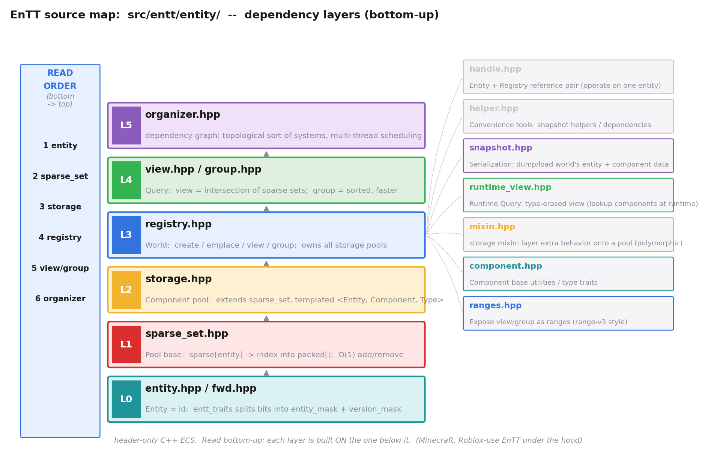
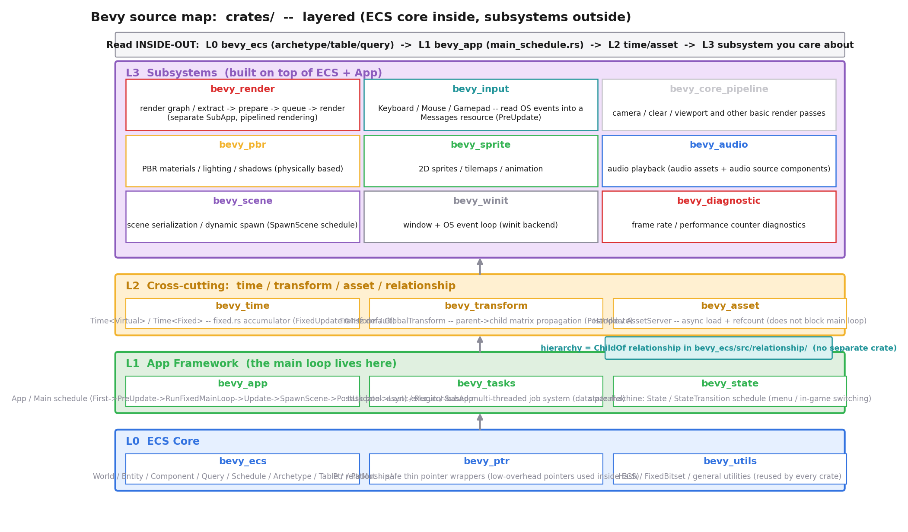
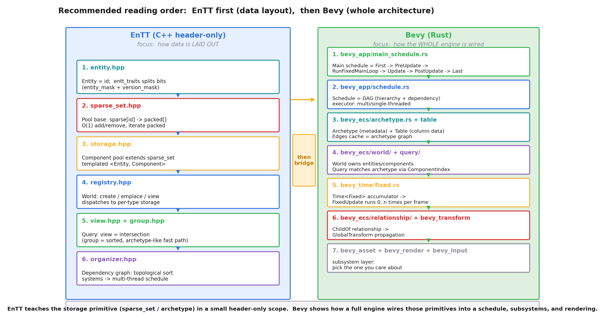
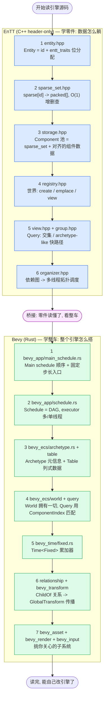

# 附录 A · 游戏引擎源码阅读路线图

> **这篇附录给什么**:全书 20 章讲完"游戏引擎 = 数据导向的大循环",你应该已经在脑子里建起了 `主循环 tick → 各 System 查询关心的 Component → 在连续内存里高速遍历 → 提交渲染 → 下一帧` 这套全景。可这还只是"懂原理",离"读得动真实引擎源码"还差最后一段路——**面对几十万行的 EnTT 或几百万行的 Bevy,从哪个文件下口、按什么顺序读、每个模块对应书里哪一章、读不懂时回到哪里补**。这篇附录就是给你这张"下口地图":把两大载体(EnTT 与 Bevy)的关键源码模块摊开,标清依赖层次和阅读顺序,并把它们一一回指到本书的章节和系列的其他书。读完,你能自己走进源码,不再迷路。

> **本附录不深入讲新机制**,只做三件事:① 给 EnTT(C++ ECS 标杆,讲数据布局怎么落地)的阅读顺序与模块地图;② 给 Bevy(Rust 数据导向引擎,讲整体架构怎么搭)的阅读顺序与模块地图;③ 把这两套源码回指到本书章节,以及《内存分配器》《Linux 同步原语》《Tokio》《Lua 虚拟机》《JVM》这些姊妹书——告诉你"读到这里卡住,去哪本补"。

> **难度提醒**:本附录假设你已经读完本书第 2 篇(ECS 三件套、SoA、Archetype、Query)和第 3 篇(主循环、固定步长)。如果直接跳到附录,前面概念会很模糊——尤其 EnTT 的 `sparse_set` 和 Bevy 的 `Archetype/Table` 两层抽象。

---

## 〇、一句话点破

> **读 ECS 源码,顺序永远是"先看数据怎么躺,再看怎么查,最后看怎么调度":EnTT 自下而上 entity → sparse_set → storage → registry → view/group → organizer;Bevy 自内而外 bevy_ecs → bevy_app → bevy_time/bevy_asset → bevy_render/bevy_input。前者在一个 header-only 的小Scope 里把"数据布局"这件难事讲到极致,后者在一个完整引擎里把"这些数据布局怎么被主循环驱动、怎么和渲染输入资产协作"展示给你看。先 EnTT 后 Bevy,等于先学零件再学整车。**

这是结论。本附录倒过来拆:先把 EnTT 的源码地图摊开,逐文件给阅读顺序;再把 Bevy 的源码地图摊开,逐 crate 给阅读顺序;最后用一张流程图把两条路线串起来,并配齐回指。

---

## 一、为什么先读 EnTT,再读 Bevy

在给具体顺序前,先回答一个常被问的问题:**EnTT 和 Bevy 不都是 ECS 吗,为什么要分两个载体、还分先后?**

答案在于两者的"作用域"差一个数量级:

- **EnTT(skypjack/entt)是一个 header-only 的 C++ ECS 库**。它的全部雄心就是"把 Entity / Component / System 这套数据布局做到极致",不碰渲染、不碰输入、不碰音频。源码集中在 `src/entt/entity/` 十几个头文件里,核心文件加起来不到一万行。Minecraft、Roblox 等大型项目在底层用它。**它是一把锋利的手术刀——讲"数据怎么躺"这件事,没有比它更纯粹的场景了。**
- **Bevy(bevyengine/bevy)是一个完整的 Rust 数据导向游戏引擎**。它内部当然有 ECS(就是 `bevy_ecs` 这个 crate),但它还包含主循环(`bevy_app`)、时间(`bevy_time`)、资产(`bevy_asset`)、渲染(`bevy_render`)、输入(`bevy_input`)、变换传播(`bevy_transform`)、UI、音频、PBR、sprite……整个 `crates/` 目录下有几十个 crate,总代码量数百万行。**它是一辆整车——讲"这些数据布局怎么被一个真实的主循环驱动、怎么和一堆子系统协作"这件事,没有比它更完整的场景了。**

所以本书(以及本附录)的策略是:**先读 EnTT 把"ECS 这块零件"看透,再读 Bevy 看"这零件怎么装进整车"**。这和你读《Linux 内核》先看 mm/slub.c 一个分配器再看整个内核,是同一种思路——先懂零件,再懂装配。

> **钉死这件事**:EnTT = 零件级(ECS 数据布局的极致),Bevy = 整车级(一个引擎怎么把 ECS 用起来)。先 EnTT 后 Bevy,等于先看发动机怎么看,再看车怎么装。

### 阅读前的两件准备

在动手 clone 之前,有两件事先做,会省掉后面大量踩坑的时间:

**第一件:版本钉死**。EnTT 和 Bevy 都在快速迭代——Bevy 还在 0.x,几乎每个 minor 版本都有 breaking change;EnTT 的 master 也不时重构(比如 `entity.hpp` 的 `entt_traits` 从老资料里的 `entity_mask`/`version_mask` 常量,到现在的 `basic_entt_traits` 模板类)。**本书所有源码引用都以 clone 当时的 commit 为准**;如果你读的版本行号对不上,以"文件名 + 函数名 + 关键结构体名"为锚——这些比行号稳定得多。建议你 clone 后立刻 `git log -1` 记下 commit hash,在笔记里标"我读的是这个版本"。

**第二件:配一个能跳模板的 IDE**。这点对 EnTT 尤其要紧——它是 header-only,模板嵌套深(`storage<Entity, Component>` 之上还有 mixin、有 storage 特化),光在 GitHub 网页上点,几跳就迷路。强烈建议配 clangd(LSP)的 C++ IDE,从 `registry::create` 或 `registry::emplace` 入口"跳到定义",顺着调用链一层层下钻。Bevy 用 rust-analyzer 即可,Rust 工具链开箱即用。**没有 IDE 跳转,读 ECS 源码效率会低一个数量级。**

> **钉死这件事**:读源码前先做两件事——版本钉死(记下 commit)、配 IDE 跳模板。这两件事不做,后面每一步都事倍功半。

---

## 二、EnTT 阅读路线:C++ ECS 标杆,自下而上六层

### 先看源码地图

EnTT 的源码几乎全在 `src/entt/entity/` 一个目录下(zread 核实:该目录共 15 个文件:`component.hpp, entity.hpp, fwd.hpp, group.hpp, handle.hpp, helper.hpp, mixin.hpp, organizer.hpp, ranges.hpp, registry.hpp, runtime_view.hpp, snapshot.hpp, sparse_set.hpp, storage.hpp, view.hpp`)。其中**核心是 6 个文件,自下而上构成一条依赖链**——每层都建在它下面那层之上。下图把这条依赖链和它周围的卫星文件一起摊开:



这张图的读法:**中间一列从下往上是主干依赖链(L0 到 L5),左边是阅读顺序提示(1 entity → 2 sparse_set → 3 storage → 4 registry → 5 view/group → 6 organizer),右边是 registry 协作的卫星文件**。下面逐层拆。

### 第 1 步 · entity.hpp / fwd.hpp —— Entity 就是个 ID

**这一层讲什么**:Entity 到底是什么、怎么用一个整数同时编码"实体编号"和"版本号"。这是全书 P2-05 第一节"Entity = ID"的源码落点。

zread 实读 `src/entt/entity/entity.hpp` 确认:EnTT 用一个强类型枚举 `enum class entity : id_type {}`(底层默认 `std::uint32_t`)表示 Entity——**它真的就是个数字,没有任何成员**。真正干活的是 `entt_traits`:

- 对 `std::uint32_t` 特化:`entity_mask = 0xFFFFF`(低 20 位存实体编号)、`version_mask = 0xFFF`(中 12 位存版本号)。也就是说,**一个 32 位整数被劈成两半:低 20 位是"这是第几号实体",高 12 位是"这个编号被复用到了第几代"**。
- 提供 `to_entity(value)` 取低 20 位、`to_version(value)` 取高 12 位、`construct(entity, version)` 拼回去、`next(value)` 把版本号加一(回收时调用)。
- 两个哨兵:`null`(全 1)和 `tombstone`(版本段全 1)。

这一段读起来很快,但它把 P2-05 讲过的"Entity 为什么能纯用 ID、为什么销毁后能区分老实体和新实体"用位运算漂亮兑现了——**就一个 32 位整数,同时编码编号和代数,零额外内存**。

> **对应本书**:P2-05(三件套,Entity = ID)、P2-05 的"ID 池 + version"小节。读不懂位分配就回 P2-05 复习。

### 第 2 步 · sparse_set.hpp —— Component 存储的地基

**这一层讲什么**:Component 存储的最底层抽象——sparse set。这是全书 P2-06(SoA vs AoS)和 P2-08(Archetype,稀疏集合这条支线)的源码根。

`sparse_set` 的核心结构是两条数组(这是 sparse set 数据结构的标配):

- **`sparse[]`**:以实体 ID 为下标的大数组(分页 `ENTT_SPARSE_PAGE`),每个槽位存"这个实体在 `packed[]` 里的第几项",没有这个实体则该槽为空。
- **`packed[]`**:连续数组,存"当前池子里有哪些实体",顺序就是加入顺序。

为什么这么设计?**加/删/查都是 O(1)**:查实体 e,先 `sparse[e]` 拿到下标 i,再 `packed[i]` 验证——O(1);加,往 `packed` 末尾 push、写 `sparse[e] = 下标`——O(1);删,把要删的项和 `packed` 最后一项交换(swap-remove),保持 `packed` 连续——O(1)。而遍历则直接扫 `packed[]`,**连续**。

读 `sparse_set.hpp` 时,有几个细节值得停下来看明白:**第一**,`sparse` 是分页的(`ENTT_SPARSE_PAGE` 常量控制页大小,默认很小),不是一上来就开一个超大数组——因为实体 ID 可能很稀疏(比如有 100 万号实体但你只用 1000 号),分页避免预分配巨大空间。**第二**,`packed` 里存的不是裸 entity,而是把 entity 和它的版本号打包在一起的"完整标识"——这样 swap-remove 之后,旧的下标对应的实体变了,版本号能帮你发现"我手上这个 entity 引用是不是已经过期了"。**第三**,`sparse_set` 还维护一个"是否有序"的状态(`polymorphic` 行为可选),这是为后面 `group` 的有序快路径埋的伏笔。这三个细节,第一个解释了"为什么 sparse set 不爆内存",第二个解释了"为什么 Entity 的版本号机制在存储层有用",第三个预告了 group——一次性把 sparse_set 看透,后面 storage / view / group 都顺。

> **钉死这件事**:sparse_set 是 EnTT 整个存储体系的"地基"。它用一个 sparse(稀疏索引)+ packed(连续实体)的对偶,同时拿到"按实体 O(1) 操作"和"连续遍历"两个好处。代价是 sparse 数组耗内存(以实体 ID 为下标,要分页),以及跨组件查询时要 gather(P2-08 讲过)。

> **对应本书**:P2-06(Component 存储)、P2-08(Archetype vs sparse set 的权衡)。这一步是"稀疏集合"那条支线的根,要和 Bevy 的 archetype/table 支线对照着读。

### 第 3 步 · storage.hpp —— Component 池:sparse_set 之上挂数据

**这一层讲什么**:sparse_set 只存"哪些实体在这个池子里",没存"这些实体的组件数据长什么样"。`storage.hpp` 把组件数据挂上去——这是 P2-06 的"Component 怎么存"真正落地的代码。

`sparse_set` 是个 base,`storage<Entity, Component>` 继承它,**在 packed 的每一项旁边再多挂一份 Component 数据**。逻辑上等价于:`packed[]` 存实体 ID,旁边有一条对齐的 `component_data[]` 存每个实体的组件值。遍历时,你既拿到实体 ID(从 packed),也拿到组件值(从对齐的 component_data)——**两者按同一个下标对齐,这正是 SoA 的一种实现**:把"实体 ID"和"组件值"拆成两条对齐的连续数组。

这一层还能看到 EnTT 对稀疏/密集组件的模板特化:有些组件类型可以用更紧凑的布局(例如 `entity_storage`),有些需要附加行为(通过 `mixin.hpp` 叠加)。这些细节第一次读可以略过,知道"`storage` = `sparse_set` + 一条对齐的组件数据数组"就够了。

> **对应本书**:P2-06(SoA 在 Component 存储里的落地)、P2-07(连续遍历为什么缓存友好)。

### 第 4 步 · registry.hpp —— 世界:create / emplace / view

**这一层讲什么**:前面三层拼出了"Entity 是 ID、Component 存在 sparse_set 之上的 storage 里",可这两样东西谁来管?**`registry` 就是那个中央管理者**——它是全书 P2-05 末尾预告过的"世界(World)"。

`registry` 干三件事:

1. **管实体生命周期**:`create()` 生成新实体(从池里取一个编号、版本号 +1)、`destroy(e)` 销毁(编号回池、下次 create 复用)。
2. **管组件存储**:对每种组件类型 `T`,`registry` 内部持有一个 `storage<Entity, T>`。`emplace<T>(entity, args...)` 就是找到 T 对应的 storage,把数据塞进去;`get<T>(entity)` 就是查 storage。
3. **发查询**:`view<T...>()` / `group<T...>()` 都从 registry 出(下一层讲)。

读 registry.hpp 时,**重点抓 `create` / `emplace` / `view` 三个函数的实现**,看它们怎么 dispatch 到内部那个"按组件类型分桶的 storage 集合"。这一层读通了,你就理解了"世界 = 实体池 + 一堆按类型分桶的 storage + 查询入口"。

registry 这一层还有几个值得留意的工程细节:**第一**,它内部不是用 `std::vector<storage*>` 这种 heterogenous 容器存所有组件池的(那样类型擦除很麻烦),而是用 `entt::meta` 或类型擦除的 `dense_map<id_type, std::unique_ptr<base_storage>>` ——每个组件类型在注册时分配一个 `id_type`(类型哈希),所有池按这个 id 索引。`emplace<T>` 时,registry 用 `type_id<T>()` 算出 id,找到对应池(没有就构造一个 `storage<Entity, T>` 插进去),再调池的 `emplace`。**第二**,实体销毁(`destroy`)有个微妙点:销毁一个实体时,registry 要遍历所有"含这个实体的池",把这个实体从每个池里删掉。怎么知道哪些池含这个实体?朴素做法是扫所有池,但 EnTT 用了一个"each [entity] -> 哪些池有它"的反向跟踪(在 pool 层面维护),让 destroy 不至于 O(池数)。**第三**,registry 还管 `context`(单例资源),这是给 System 放全局状态的——对应 Bevy 里的 `Resource`,概念上是一回事。这三个细节,把 registry 从"一个会 create/emplace 的黑箱"变成"一个精心设计的中枢"。

> **对应本书**:P2-05(三件套的"世界"概念)、P2-09(Query 怎么从世界里拿出匹配实体)。

### 第 5 步 · view.hpp / group.hpp —— Query:找"有这些组件的实体"

**这一层讲什么**:System 要工作,得能问世界"给我所有同时有 Position + Velocity 的实体"。这就是 Query,对应全书 P2-09。

EnTT 提供两种 Query,对应 P2-08 讲过的两种范式:

- **`view<T...>`(多 sparse_set 的交集)**:对每个 T 拿到它的 storage,选最小的那个遍历,逐实体在其它 storage 里 probe(查 sparse[])。这正是 P2-08 里"Archetype vs sparse set"那张图右侧的访问模式——**遍历连续,但跨组件查询是 gather(分支 + 间接)**。`runtime_view.hpp` 是它的类型擦除版(运行期动态指定组件类型),第一次读可略。
- **`group<T...>`(排序的、archetype-like 的快路径)**:这是 EnTT 的杀手锏。`group` 维护一份"同时拥有这些组件的实体"的有序子集,遍历它**零跳过、零 probe**,性能逼近 Bevy 的 archetype table。代价是 group 需要注册(`registry.group<...>()`),且组件 add/remove 时要维护这个有序子集——所以适合"查询频繁、组件组合稳定"的场景。

> **钉死这件事**:EnTT 默认走 sparse_set 路线,但 `group` 是它做 archetype-like 优化的入口。读 view.hpp 和 group.hpp,等于把 P2-08 那张"两种范式对比图"在源码里对上了号。

> **对应本书**:P2-09(Query)、P2-08(group 对应的 archetype-like 范式)。

### 第 6 步 · organizer.hpp —— 依赖图:把 System 拓扑排序

**这一层讲什么**:前面五层讲清了"数据怎么躺、怎么查"。可一个引擎里几十个 System,谁先跑谁后跑、哪些能并行、哪些有数据依赖——这是 P5-17(多线程 job 系统)的题。`organizer` 就是 EnTT 给的答案。

zread 文档搜索确认:`organizer` 把每个 System 的"读哪些组件、写哪些组件"登记下来,**构造一张依赖图,做拓扑排序,产出可多线程执行的任务序列**。两个 System 如果一个写 Position、另一个读 Position,就有依赖,串行;如果都只读、或访问不相交的组件,就可以并行。这是 ECS 数据导向带来的天然红利——**因为数据访问是声明式的(在 view/group 里就说了读什么写什么),调度器能静态推出依赖,这是面向对象对象里"方法黑箱"根本做不到的**。

读 organizer.hpp 时,重点是 `emplace<&system_fn>()` 怎么从函数签名推断依赖、`graph()` 怎么生成拓扑。这一层把"ECS 数据导向 → 可并行"这条逻辑链在源码里兑现。

> **对应本书**:P5-17(多线程 job 系统)、P2-07(数据并行的根)。

### EnTT 的卫星文件:扫一眼就够

主干六层之外,`src/entt/entity/` 还有几个卫星文件,**第一次读可以略过,知道它们存在即可**:

- `handle.hpp`:Entity + Registry 的引用对,方便操作单个实体(语法糖)。
- `helper.hpp`:snapshot 的便利工具。
- `snapshot.hpp`:序列化——把 world 的 entity/component 存盘读盘。对应本书 P4-16。
- `runtime_view.hpp`:运行期 Query(类型擦除,动态查组件)。
- `mixin.hpp`:storage 的 mixin,给 pool 叠加额外行为。
- `component.hpp`:Component 基础工具 / type traits。
- `ranges.hpp`:把 view/group 暴露成 C++ ranges。

> **★鼓励质疑/修正提示**:网上一些老博客把 EnTT 的 `sigh.hpp`(信号槽,在 `src/entt/signal/`,不在 `entity/`)算作 ECS 的一部分,但它其实是独立工具。如果你看到"EnTT 用信号槽做事件",那是它在 entity 之外另提供的设施,本附录不展开。

---

## 三、Bevy 阅读路线:Rust 引擎,自内而外四层

### 先看源码地图

Bevy 的源码在 `crates/` 下,数十个 crate(zread 核实:光顶层就有 `bevy_ecs, bevy_app, bevy_render, bevy_asset, bevy_time, bevy_input, bevy_transform, bevy_pbr, bevy_sprite, bevy_audio, bevy_scene, bevy_winit, bevy_tasks, bevy_state, bevy_reflect, bevy_ptr, bevy_utils, bevy_core_pipeline, bevy_diagnostic, bevy_remote, ...` 等)。**别被吓到——这些 crate 是分层的,你只需要自内而外读**。下图把层次摊开:



读法:**L0 是 ECS 内核(零件),L1 是主循环和调度(把零件装成车架),L2 是横切的资源/时间/变换(车身),L3 是具体子系统(座椅车灯)**。自内而外读。

### 第 1 步 · bevy_app/main_schedule.rs —— 主循环就在这里

**这一层讲什么**:Bevy 的主循环、所有 schedule 的定义。这是全书 P1-02(主循环三段式)、P3-10(fixed update vs render)、P1-03(子系统协作)的源码落点。

zread 实读 `crates/bevy_app/src/main_schedule.rs` 确认,Bevy 的 `Main` schedule 默认顺序是(由 `MainScheduleOrder` 资源定义):

```
First → PreUpdate → RunFixedMainLoop → Update → SpawnScene → PostUpdate → Last
```

几个关键洞察:

- **`Main`、`FixedMain`、`RunFixedMainLoop` 三个 schedule 都用 `SingleThreadedExecutor`**(源码里 `main_schedule.set_executor(SingleThreadedExecutor::new())` 明确写了)。这不是性能偷懒,而是**故意**——这三个是"facilitator schedule"(协调器),它们的工作就是按顺序依次触发子 schedule,本身没并行需求;真正的并行发生在 `Update` / `FixedUpdate` 这些子 schedule 里,它们用 `MultiThreadedExecutor`。
- **`RunFixedMainLoop` 是固定步长的累加器入口**:它根据 `Time<Fixed>` 累积的时间,决定这一帧把 `FixedMain` 跑 0 次、1 次还是多次。`FixedMain` 内部顺序是 `FixedFirst → FixedPreUpdate → FixedUpdate → FixedPostUpdate → FixedLast`。这正好对应 P3-10 讲的 accumulator 模式。
- **`RunFixedMainLoopSystems` 三个变体**(`BeforeFixedMainLoop` / `FixedMainLoop` / `AfterFixedMainLoop`):让你把"每帧一次、变步长"的系统(比如摄像机)插在固定更新的前后——这是 P3-10 末尾讲过的"变步长渲染 + 固定步长物理"的协作点。
- **渲染默认不在 Main schedule 里**(源码注释明确写了):渲染在另一个 `SubApp` 里跑,用 pipelined rendering。这是 P5-18 的题。

> **对应本书**:P1-02(主循环三段式)、P3-10(fixed update)、P3-11(delta time)、P1-03(子系统协作)。读 `main_schedule.rs` 这一个文件,就能把第 3 篇的主循环源码全对上号。

### 第 2 步 · bevy_app/schedule.rs —— Schedule = DAG

**这一层讲什么**:schedule 不是个简单列表,它是个 DAG(有向无环图)——这是 P5-17(job 系统、依赖调度)的根。zread 文档搜索确认:`ScheduleGraph` 内部有**两张 DAG**:一张 hierarchy DAG(哪些 system 属于哪个 set)、一张 dependency DAG(`before`/`after` 边)。执行时,executor(multi-threaded 或 single-threaded)按拓扑序+访问约束并发跑系统。

读这一层,重点是搞清 `Schedule` / `ScheduleLabel` / `SystemSet` / `IntoScheduleConfigs` 这几个概念,以及 `executor/multi_threaded.rs` 怎么把无依赖的系统丢给 task pool 并行。这一层和 EnTT 的 `organizer.hpp` 是同一种思路(声明式依赖 → 自动调度),但 Bevy 把它做成了一个完整的调度框架。

读 schedule.rs 这一层,务必把"两张 DAG"的设计想透——这是 Bevy 调度的精髓:**hierarchy DAG** 编码"哪些 system 属于哪个 SystemSet"(用 `.in_set(...)` 建立),配置可以沿这张图下传(给一个 set 加运行条件,等于给里面所有 system 加);**dependency DAG** 编码"谁必须在谁之前/之后跑"(用 `.before(...)` / `.after(...)` 建立)。两张图合在一起,executor 才能算出"这一帧哪些 system 可以并行、哪些必须等"。这里有个细节容易看漏:**system 之间的依赖,除了程序员显式写的 `.before/.after`,还有调度器从"组件访问约束"自动推出来的隐式依赖**——两个 system 都写 Position,即使你没写 `.before`,调度器也会强制串行它们。显式依赖管"我想表达的语义顺序",隐式依赖管"数据安全",两者合一才是完整的调度图。把这两张图和两类依赖钉死,你就理解了 Bevy 为什么能在多线程下安全又高效——它把"顺序"这件事从易错的运行期锁,上移到了编译期 / 调度期的图计算。

> **对应本书**:P5-17(多线程 job 系统)、P1-03(子系统协作里的 schedule)。**★配套回指**:Bevy 的 executor 多线程调度,呼应《Linux 同步原语》(并发安全)和《Tokio》(任务调度),见本附录第四节。

### 第 3 步 · bevy_ecs/archetype.rs + storage/table —— Archetype 是元信息,Table 才是数据

**这一层讲什么**:Bevy 的 ECS 内存布局——全书 P2-08(Archetype)的核心源码。zread 实读 `crates/bevy_ecs/src/archetype.rs` 确认了一个连很多老资料都讲错的关键事实:

> **Archetype 和 Table 是两层抽象,多个 archetype 可以共享同一个 table**。

具体看 `Archetype` 结构体字段:`id, table_id, edges, entities: Vec<ArchetypeEntity>, components: ImmutableSparseSet<ComponentId, ArchetypeComponentInfo>, flags`。注意:

- **`Archetype` 自己不存组件数据**,它只存元信息:这张 archetype 用的是哪个 table(`table_id`)、有哪些组件(`components` 这个 sparse set)、每个实体在 table 里的哪一行(`ArchetypeEntity { entity, table_row }`)。**真正的列式组件数据,在 `storage/table/` 里(`Table` 是 `columns: ImmutableSparseSet<ComponentId, Column>`,每个 `Column` 是一条连续数组)。**
- **为什么不一对一?** 模块文档原话:"multiple archetypes may store their table components in the same table. These archetypes differ only by the SparseSet components." 也就是说,如果两个 archetype 的"table 组件"完全一样、只在 sparse-set 组件上有别,它们就共享一张 table——节省内存、迁移更便宜。这是 Bevy 设计的一个精致之处,P2-08 重点讲过。
- **`Edges` 是 archetype 图的缓存**:每个 archetype 缓存"加某个 bundle 后会变成哪个 archetype",首次计算、之后 O(1) 命中。这就是 P2-08 那张"archetype 迁移图"里 `Edges` 框的源码根。具体看 `Edges` 结构体有三个 `SparseArray`:`insert_bundle`(加 bundle → 目标 archetype)、`remove_bundle`(删 bundle → 目标 archetype)、`take_bundle`(取走 bundle,要求源 archetype 必须含全部组件)。每次实体加/删组件,先查这张缓存表,命中就 O(1) 跳过去,不命中才算集合并/差 + 哈希查 `by_components` 建新 archetype。**没有这个缓存,每次加组件都要重算集合运算,频繁加删组件的场景(粒子、buff)会慢到不可用。**
- **`Archetypes` 还维护 `by_component: ComponentIndex`**(`HashMap<ComponentId, HashMap<ArchetypeId, ArchetypeRecord>>`)——这是 **Query 匹配的索引**:System 要查"有 Position 的实体",引擎不用扫所有 archetype,直接查这个 map 拿到所有含 Position 的 archetype 列表。这是 P2-09(Query)的源码根。注意 `ArchetypeRecord` 里有个 `column: Option<usize>` 字段(源码注释写了"planned to be used to improve performance of fragmenting relations"),这是为未来进一步加速预留的——当前主要靠 ComponentIndex 的两层 HashMap 已经够快。
- **`ArchetypeFlags` 用位标记记录"这张 archetype 里有没有组件注册了 hook/observer"**(ON_ADD_HOOK / ON_INSERT_OBSERVER 等十来个位)。这是个性能优化:如果一张 archetype 里所有组件都没 hook,那加实体时根本不用检查 hook,直接写数据即可;只有 flag 命中的 archetype 才走 hook 分支。这种"用位标记跳过整类工作"的思路,和《Linux 同核》里 percpu 状态、调度器里的 flag 是同一种工程哲学。

> **★鼓励质疑/修正提示**:很多博客讲 Bevy"每个 archetype 一张 table",这是不准确的。读 `archetype.rs` 的模块文档和 `Archetype` 结构体,你会看到两层抽象的真相。P2-08 已经把这个事实写进去了,这里再次确认。

> **对应本书**:P2-08(Archetype,全书最重)、P2-09(Query 用 ComponentIndex 匹配)。

### 第 4 步 · bevy_ecs/world/ + query/ —— World 拥有一切,Query 找出来

**这一层讲什么**:`World` 是 Bevy 的"世界",它拥有所有 entity、所有 archetype、所有 table、所有 resource。`Query` 是 System 拿来"在 world 里按组件组合找出实体"的入口。

读这一层,重点抓:

- `world/mod.rs`:`World` 结构体本身、`spawn` / `insert` / `remove` 怎么触发 archetype 迁移。
- `query/`:`Query<T, F>` 怎么从 `ComponentIndex` 找到匹配的 archetype,再在每个 archetype 的 table 里按列遍历。`par_iter.rs` 是数据并行入口(承 P2-07、P5-17)。

这一层和 EnTT 的 `registry.hpp + view.hpp` 是对应关系,但 Bevy 的 World 比 EnTT 的 registry 更重——它还管 resource、observer、hook 等一大堆设施,这些第一次读可以略。

> **对应本书**:P2-05(世界)、P2-09(Query)、P2-07(数据并行)。

### 第 5 步 · bevy_time/fixed.rs —— 固定步长累加器

**这一层讲什么**:`Time<Fixed>` 怎么实现固定步长。zread 核实 `crates/bevy_time/src/` 下有 `fixed.rs / real.rs / virt.rs / time.rs / timer.rs / stopwatch.rs`。

`fixed.rs` 的核心是**累加器**:每帧把 delta time 加到一个累积量上,`RunFixedMainLoop` 根据"累积量里还有几个固定步长"决定跑几次 `FixedMain`。默认固定步长是 64Hz(可在 `Time<Fixed>` 资源里改)。这把 P3-10 讲的 accumulator 模式在源码里兑现。`virt.rs` 是虚拟时间(可暂停、可加速),`real.rs` 是真实时间。

读 `fixed.rs` 有两个细节别错过:**第一**,累加器有个 `overstep` 概念——如果累积量里剩 1.5 个步长,这一帧跑 1 次 FixedMain,剩下的 0.5 步长留着下一帧;如果某帧 delta time 特别大(比如卡了一下),累积量里可能有 5 个步长,那这一帧就跑 5 次 FixedMain"追上"。这正是 P3-10 讲的"固定步长保证物理稳定,代价是偶尔一帧跑多次 update"的源码兑现。**第二**,"追上"有上限——如果累积量爆炸式增长(比如调试器断点停了 30 秒),Bevy 不会真的跑几千次 FixedMain 把游戏追上(那会卡死),而是有个上限丢弃部分时间。这是真实引擎里必须处理的工程细节,P3-10 没展开,源码里看得很清楚。这两个细节,把"accumulator 模式"从纸面公式落到了带边界条件的真实代码。

> **对应本书**:P3-10(fixed update,accumulator 模式)、P3-11(delta time)。

### 第 6 步 · bevy_ecs/relationship/ + bevy_transform —— ChildOf 关系与父子变换

**这一层讲什么**:Bevy 的"父子层级"不再是一个独立 crate,而是 ECS 里的一种**关系(Relationship)**。zread 核实:`crates/bevy_ecs/src/` 下有完整的 `relationship/` 目录(`mod.rs / related_methods.rs / relationship_query.rs / relationship_source_collection.rs`),`bevy_app/src/` 和 `bevy_ecs/src/` 下也各有 `hierarchy.rs`。

关键设计:**`ChildOf(parent_entity)` 是挂在子实体上的一个组件(一种 `Relationship`),对应的 `Children` 是挂在父实体上的 `RelationshipTarget`**。插入 `ChildOf` 时,通过组件 hook 自动在父实体上维护 `Children` 列表——这是"源(Relationship)是真相,目标(RelationshipTarget)是镜像"的设计,增删是 O(1) 的 hook,遍历父子则用 `relationship_query.rs`。

读 relationship 这一层,有几个设计要点值得品透:**第一**,为什么"源是真相、目标是镜像"?因为一个子实体只有一个父(一对一),但一个父可以有多个子(一对多)——把"父子"这条边的信息存在"一"这一端(子的 `ChildOf` 组件里),既表达了关系,又不会重复;父端的 `Children` 只是个缓存镜像,由 hook 自动维护,程序员不直接写它。这个"单点真相 + 自动镜像"的模式,和数据库里的"主表 + 物化视图"是同一种思路。**第二**,为什么用组件表达关系,而不是像老引擎那样用独立的"场景树节点"?因为一旦关系是组件,它就享受 ECS 的一切好处:可以用 Query 查"所有有 ChildOf 的实体"、可以批量改、可以序列化、可以加 observer 在关系变化时触发逻辑。**关系被统一进了 ECS 的数据模型,这是 Bevy 0.13+ 大重构的核心收益。** 第三,`ChildOf` 只是一对多关系的特例——Bevy 的 `Relationship` trait 是通用的,你可以定义自己的关系(比如 `Targeting` 表示"瞄准谁"),享受同样的设施。这个泛化,让"实体间的有向图"在 Bevy 里成了一等公民。

`bevy_transform` 建立在这之上:`Transform`(局部)+ `GlobalTransform`(世界),`PostUpdate` schedule 里有个系统把父的 `GlobalTransform` 传给子——这正是 P3-12(场景图)的源码落点。

> **★鼓励质疑/修正提示**:老资料里常看到一个独立的 `bevy_hierarchy` crate——**当前 master 已经没有了**,层级关系并入 `bevy_ecs` 的 `relationship/` 模块,这是 Bevy 0.13+ 的大重构。本附录以 master 为准。

> **对应本书**:P3-12(场景图、父子变换)。

### 第 7 步 · bevy_asset + bevy_render + bevy_input —— 挑你关心的子系统

走到这一步,ECS 内核(L0)、主循环调度(L1)、横切资源(L2 的 time/transform/asset)都读完了,**剩下 L3 的子系统,按你关心的挑**:

- **`bevy_asset`**:异步加载 + 引用计数。`Handle<T>` 是个引用计数句柄,`AssetServer` 管加载队列。对应 P4-13(资源管理)。这一层和 EnTT 的 `snapshot.hpp` 不同——Bevy 的资产是异步的、跨帧的,主循环不阻塞。
- **`bevy_render`**:渲染提交。它是个**独立的 SubApp**(pipelined rendering),内部 render graph 分 `extract → prepare → queue → render` 几阶段。对应 P5-18(渲染提交),**渲染管线本身一句话带过指路《图形渲染管线》**。
- **`bevy_input`**:键鼠/手柄。它在 `PreUpdate` schedule 里把 OS 事件读进一个 `Messages` 资源(注意:`Messages` 是 Bevy 新一代事件设施,在 `bevy_ecs/src/message/` 下,比老的 `Events` 更细粒度),`Update` 里的系统再消费。对应 P5-19(输入与事件系统)。

**其余子系统**(`bevy_pbr` 物理渲染、`bevy_sprite` 2D、`bevy_audio` 音频、`bevy_scene` 场景序列化、`bevy_winit` 窗口、`bevy_diagnostic` 帧率诊断),按需读。第一次通读 Bevy,**不建议读 bevy_render 内部**(它极其庞大,且依赖 wgpu),知道它在独立 SubApp 里跑就够了。

---

## 四、配套回指:读到这里卡住,去哪本补

本附录的最后一块拼图,是把 EnTT/Bevy 的关键模块**回指到系列其他书**。本书总纲讲过,游戏引擎不是孤岛——它的每一块都站在姊妹书的肩膀上。

### 回指 1:数据布局 → 《内存分配器》(最强承接)

读 EnTT 的 `sparse_set.hpp` / `storage.hpp`、Bevy 的 `table/column.rs`,如果你卡在"为什么连续数组就快、缓存行到底怎么命中、SIMD 怎么喂"——**那是《内存分配器》讲透的题**。本书 P2-06 / P2-07 已经把这条承接兑现过,但真要看源码级的数据布局,回那本书的"SoA/AoS""缓存行""SIMD"几章。ECS 本质就是"为缓存友好重新组织数据",这是同一思想在两个领域的落地。

具体怎么对应着读:**EnTT 的 sparse_set 里 `packed[]` 为什么连续遍历快,对应《分配器》里"指针追逐 vs 连续读"那张缓存命中图;Bevy 的 `Table::columns` 为什么按列存,对应那本讲的 SoA 布局;EnTT 的 group 为什么能放心 SIMD 化,对应那本讲的'同一操作批处理海量数据'**。把这几个对应点钉死,你会发现 ECS 的存储设计没有任何新概念,全是"数据布局决定性能"在游戏场景的极致应用。这也是为什么本书把第 2 篇当作"承分配器"的招牌——读完这本,你应该反过来更懂《分配器》为什么花那么大力气讲缓存行。

### 回指 2:并发与调度 → 《Linux 同步原语》《Tokio》

读 Bevy 的 `schedule/executor/multi_threaded.rs`、EnTT 的 `organizer.hpp`,如果你卡在"多线程怎么安全访问 world、原子操作/futex/mutex 怎么选、任务怎么调度"——**回《Linux 同步原语》(futex / 原子 / RCU)和《Tokio》(任务调度、work-stealing)**。Bevy 的 executor 是 `bevy_tasks`(基于 async-executor)驱动的,和 Tokio 的任务模型是同源思路;而 System 之间的数据竞争规避,靠的是声明式的"读 / 写组件访问约束"——这本质是编译期 / 调度期推出来的读写锁,和《Linux 同步》讲的读写锁、RCU 是同一类思想。本书 P5-17 已经搭过桥,源码级细节回那两本。

这里有个值得细品的对照:**ECS 的并发安全模型,和传统多线程编程根本不同**。传统多线程里,你要手动加锁保护共享数据,锁用错了就 data race;而 ECS 里,System 在签名时就声明了"我读 Position、写 Velocity",调度器(organizer / Bevy executor)看到两个 System 的访问约束冲突(都写 Position),就强制它们串行;看到不冲突(一个读 Position、一个写 Velocity 且不交叉),就让它们并行。**程序员几乎不用写锁**——锁的职责从"程序员手写"上移到了"调度器自动推导"。这和《Linux 同步》里 RCU 的哲学是同源的:**最好的锁是不用锁**——通过数据布局和访问约束的设计,让竞争在结构上就不发生。ECS 把"组件按类型分桶"的存储设计,天然让大多数 System 操作的数据不交叉,这是它能放心多线程的根。读懂这条,你对"并发安全"的理解会从"加锁技巧"升到"数据访问设计"——这也是本书 P5-17 想传达的核心。

### 回指 3:脚本嵌入 → 《Lua 虚拟机》《JVM》

读 Bevy 的脚本生态(Bevy 自身鼓励用 Rust 写系统,但也有 `bevy_mod_scripting` 等接 Lua/Rune)、Unity 的 C#(IL2CPP)——如果你卡在"VM 怎么嵌进宿主、C++/Rust 对象怎么绑到脚本、GC 和原生内存的边界"——**回《Lua 虚拟机》(嵌入式 VM、绑定)和《JVM / HotSpot》(GC、IL2CPP 把 C# 编成 C++)**。本书 P4-14(Lua 热重载)、P4-15(IL2CPP)讲过原理,真要写绑定,那两本是底座。

### 回指 4:渲染管线 → 《图形渲染管线》(子线第一本)

读 `bevy_render` 的 render graph、`bevy_pbr` 的光照阴影,如果你卡在"draw call 之后 GPU 干了什么、渲染管线各阶段"——**回本子线第一本《图形渲染管线》**。本书总纲定下铁律:渲染管线细节一句话带过指路,篇幅留引擎独有的"怎么每帧把场景数据喂给管线"。`bevy_render` 的 extract/prepare/queue/render 四阶段,就是"引擎怎么喂管线"的工程化答案。

### 回指 5:数学(变换/积分) → 《数学分析》《线性代数》

读 `bevy_transform` 的父子矩阵传播、物理更新的数值积分,如果你卡在"矩阵怎么乘、欧拉积分和辛欧拉差在哪"——**回《线性代数》(变换)和《数学分析》(数值积分)**。本书 P3-12(场景图)和 P3-10(固定步长)讲过为什么物理要固定步长(数值稳定性),底层数学回那两本。

`bevy_transform` 里那个"父的 GlobalTransform 乘上子的 Transform 得到子的 GlobalTransform"的系统,本质就是一条矩阵链的传播;`bevy_math`(在 crates/ 下,本附录没单列)提供 `Mat4` / `Quat` / `Transform` 这些类型。读这一层如果对四元数、齐次坐标、仿射变换觉得模糊,那是《线性代数》"揉捏空间"那几章的题——本书 P3-12 已经搭过桥,源码级细节回那本。

### 一句话总括配套

把上面五条回指捏成一句:**读引擎源码,真正"引擎特有"的部分(主循环、ECS 存储、调度)其实不多,大多数卡点都是数据布局 / 并发 / VM / 渲染 / 数学里的老问题,姊妹书早讲透了**。本书的定位就是把它们串进游戏引擎这个场景,本附录的作用是告诉你"卡在这一步,翻哪本"——把整套《深入浅出系列》当成一张知识网,而不是一堆孤岛。

> **钉死这件事**:读引擎源码卡住,90% 不是引擎特有的问题,而是数据布局 / 并发 / VM / 渲染 / 数学里的某一环——这些姊妹书都讲透了。本书的作用是把它们串起来,装进"游戏引擎"这个场景。

---

## 五、一张图串起两条路线

把第二节(EnTT 自下而上六层)和第三节(Bevy 自内而外四层)串成一张阅读流程图。**先 EnTT(零件),后 Bevy(整车),中间一个桥接**:



如果你更喜欢 mermaid 风格的流程图,下面这张等价(可点击放大):



两条路线的核心区别已在图里标清:**EnTT 学"数据布局怎么落地"(零件级),Bevy 学"这些数据布局怎么被主循环驱动、怎么和子系统协作"(整车级)**。先 EnTT 后 Bevy,等于先看发动机怎么看,再看车怎么装。

---

## 五半、按目标速查:只读你需要的

不一定每个读者都要把两大载体全读一遍。下面这张表按"你的目标"给出最小阅读子集——只想搞懂某一块,照表跳即可:

| 你的目标 | 最小必读(EnTT) | 最小必读(Bevy) | 配套本书章节 |
|---|---|---|---|
| 搞懂 Entity 为什么是纯 ID | `entity.hpp`(entt_traits) | `bevy_ecs/src/entity/mod.rs` | P2-05 |
| 搞懂 SoA / 数据布局(承分配器) | `sparse_set.hpp` + `storage.hpp` | `bevy_ecs/src/storage/table/` | P2-06、P2-07 |
| 搞懂 Archetype vs sparse set | `group.hpp` | `bevy_ecs/src/archetype.rs` | P2-08 |
| 搞懂 Query 怎么匹配 | `view.hpp` | `bevy_ecs/src/query/`(fetch.rs、state.rs) | P2-09 |
| 搞懂主循环 / 固定步长 | (EnTT 不管主循环) | `bevy_app/src/main_schedule.rs` + `bevy_time/src/fixed.rs` | P3-10、P3-11 |
| 搞懂多线程 / job 系统 | `organizer.hpp` | `bevy_app/src/schedule.rs` + `schedule/executor/multi_threaded.rs` | P5-17 |
| 搞懂父子层级 / 变换传播 | (EnTT 不管场景图) | `bevy_ecs/src/relationship/` + `bevy_transform` | P3-12 |
| 搞懂资源管理 / 异步加载 | (EnTT 不管资产) | `bevy_asset/src/` | P4-13 |
| 搞懂渲染提交(承渲染管线) | (EnTT 不管渲染) | `bevy_render/src/`(只看 render graph 主干) | P5-18 |
| 想亲手跑一个最小 demo | `registry.hpp` 的 create/emplace/view | 附录 B 直接给 | 附录 B |

> **用法**:先确定你这阵子想搞懂哪一块,然后在表里圈出最小必读,只读那几个文件。等这一块吃透了,再扩到相邻的。不要一上来就"我要把 EnTT 全读一遍"——那既不必要也不高效,本书的目标是让你**按需深入**,不是把两个仓库从头背到尾。

---

## 六、几条实战经验

最后给几条"读引擎源码不踩坑"的实战经验,都是踩出来的:

1. **不要从 `bevy_render` 开始读 Bevy**。它极其庞大、依赖 wgpu、跨 SubApp。先读 `bevy_ecs` + `bevy_app/main_schedule.rs`,把"世界 + 主循环"看透,再读横切层,最后才碰渲染。
2. **读 EnTT 一定要 clone 下来本地用 IDE 跳转**。它是 header-only,模板嵌套深,光看 GitHub 网页会迷路。配一个能跳 C++ 模板的 IDE(clangd),从 `registry::create` 跳进去,顺着调用链一层层下钻。
3. **行号会变**。EnTT 和 Bevy 都在快速迭代(Bevy 还在 0.x)。本书所有源码引用以 clone 当时的 commit 为准;如果你读的版本行号对不上,以**文件 + 函数名 + 关键结构体名**为锚——文件名和函数名比行号稳定。
4. **遇到看不懂的模块,先问"这是组织还是驱动"**。本书的二分法在这里依然有用:卡在 entity/storage/archetype/relationship,那是"组织"——回第 2 篇;卡在 schedule/time/executor/job,那是"驱动"——回第 3、5 篇。先定位归哪半,再决定回哪一章。
5. **动手改一处**。读完最有效的验证,是自己改一处:在 EnTT 写个 System 注册到 organizer、在 Bevy 加一个 `Update` 里的 system 打印所有有 `Transform` 的实体。能跑通,你就真的读懂了。附录 B(用 EnTT 写最小 ECS)就是为你准备的动手入口。

---

## 七、小结

### 回扣主线

本附录没讲新机制,只给了一张"读完本书怎么继续深入源码"的地图。核心两条路线:**EnTT(自下而上 entity → sparse_set → storage → registry → view/group → organizer)学数据布局怎么落地;Bevy(自内而外 bevy_ecs → bevy_app → time/relationship → 渲染/输入)学整体架构怎么搭**。两条路线用"先零件后整车"的顺序串起来,每个模块都回指到本书章节和姊妹书(《内存分配器》《Linux 同步》《Tokio》《Lua》《JVM》《图形渲染管线》)。

### 五个为什么

1. **为什么先读 EnTT 不先读 Bevy?**——EnTT 是 header-only 小Scope,专注 ECS 数据布局;Bevy 是整车,庞大复杂。先零件后整车,先懂发动机再懂装配。
2. **EnTT 主干六层是哪六层?**——L0 entity.hpp(Entity = id + 位分配)→ L1 sparse_set.hpp(存储地基)→ L2 storage.hpp(组件池)→ L3 registry.hpp(世界)→ L4 view/group.hpp(Query)→ L5 organizer.hpp(依赖图调度)。
3. **Bevy 自内而外四层是哪四层?**——L0 bevy_ecs(ECS 内核)→ L1 bevy_app(主循环 + schedule 调度)→ L2 bevy_time/bevy_transform/bevy_asset(横切资源)→ L3 bevy_render/bevy_input/...(子系统)。
4. **读 Bevy 为什么不要从 bevy_render 开始?**——它跨独立 SubApp、依赖 wgpu、极庞大;先把"世界 + 主循环"看透,最后才碰渲染。
5. **卡住怎么办?**——先问"这是组织还是驱动"定位归哪半,再回对应章节;数据布局回《内存分配器》,并发调度回《Linux 同步》《Tokio》,脚本回《Lua》《JVM》,渲染回《图形渲染管线》。

### 想继续深入往哪钻

- 想亲手实现一个最小 ECS:附录 B(用 EnTT 写一个最小 ECS,几百行 C++ 跑通几百个移动实体)。
- 想看 EnTT 的 group 怎么做到 archetype-like:读 `group.hpp` 的 owned/observed 组件分类,对照 P2-08。
- 想看 Bevy 怎么把渲染做成独立 SubApp:读 `bevy_render` 的 `RenderPlugin` 和 `PipelinedRenderingPlugin`,这是 P5-18 的进阶。
- 想看 Bevy 的"新一代事件" Messages 设施:读 `bevy_ecs/src/message/`,它比老的 `Events` 更细粒度,是 Bevy 近期大重构。
- 想看 Bevy 的 required components / hooks / observers:读 `bevy_ecs/src/component/` 和 `observer/`,这些是 Bevy 0.13+ 的新设施,老资料大片过时。

> **下一篇**:[附录 B · 动手实践:用 EnTT 写一个最小 ECS](附录B-动手实践-用EnTT写一个最小ECS.md)
