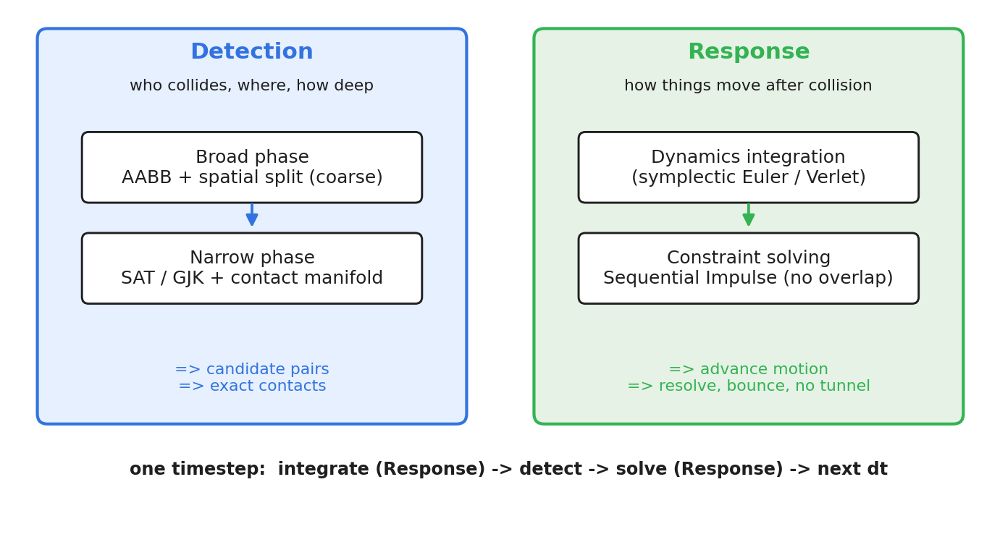
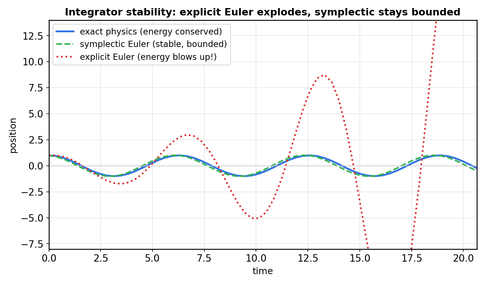
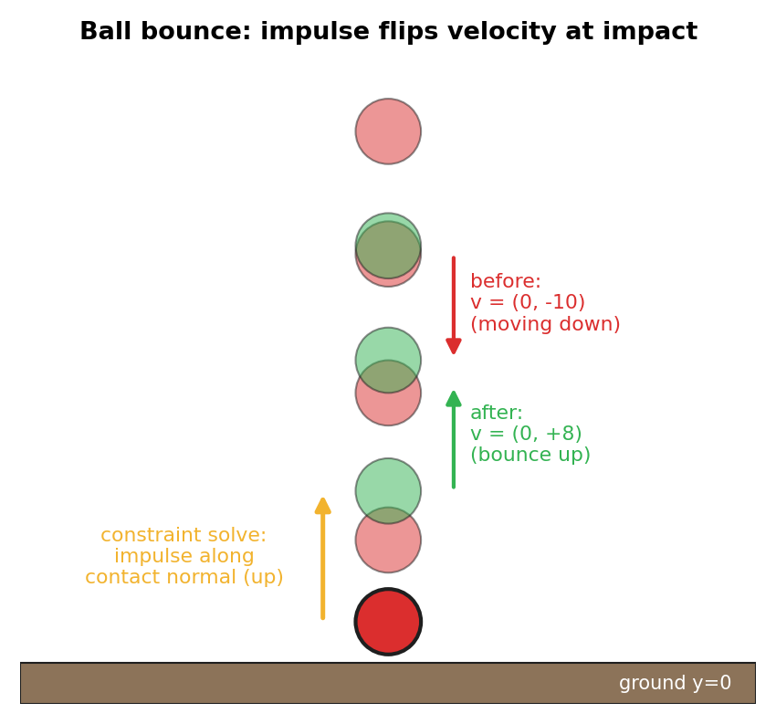

# 第 0 篇 · 第 1 章 · 第一性原理:虚拟物体凭什么看起来遵守物理

> **核心问题**:你在游戏里看到物体掉下来、撞墙反弹、堆叠不穿透,看起来"符合物理"。可这些"物理"到底是怎么实现的?是程序员写了一堆 `if(x < 地面) 反弹` 吗?当然不是——那做不出真实的弹性、堆叠、碰撞响应。真相是:游戏(和任何需要模拟真实物理的软件)用一个**物理引擎**,靠**数值方法**(数值积分推进运动、几何算法检测碰撞、约束求解器响应碰撞)让物体每帧"看起来"遵守物理。本章要建立的就是这张全景图:**物理引擎的"物理",本质是数值近似的"假"物理**。它的核心是"检测 vs 响应"二分。本章全程跟着一个"小球落地反弹"的例子,讲清这一切。

> **读完本章你会明白**:
> 1. 物理引擎的"物理"是假的——是数值方法做的近似,让物体每帧看起来符合物理,不是真物理。
> 2. 物理引擎一个时间步的完整流程:积分推进运动 → 检测碰撞(宽相粗筛 → 窄相精确)→ 约束求解响应。
> 3. 全书二分法:检测(判断谁碰了)vs 响应(碰了怎么动)。
> 4. 为什么物理运动必须用数值积分(承《数学分析》),积分器为什么会"发散爆炸"。
> 5. 一个小球从高处落下、撞地反弹,物理引擎在每一步到底干了什么。

> **如果一读觉得太难**:先只记住三件事——① 物理引擎的物理是数值近似的"假物理";② 每个时间步:积分推进运动 → 检测碰撞 → 约束求解响应;③ 全书二分法:检测(谁碰了)vs 响应(怎么动)。

---

## 〇、一句话点破

> **物理引擎,就是用数值方法让虚拟物体每帧"看起来"遵守物理:数值积分推进运动,几何算法检测碰撞,约束求解器响应碰撞。它的核心是"检测 vs 响应"二分。本质是数值近似的假物理——不是真物理。**

这是结论。本章倒过来拆,而且**全程跟着一个小球**:它从高处落下,撞地,反弹。看物理引擎在每个时间步到底对它干了什么。

---

## 一、先破除一个误解:物理引擎的"物理"是假的

### 游戏里的"物理"是怎么来的

你在游戏里看到一个小球掉下来、砸在地上弹起、几个箱子堆在一起不互相穿透。这些看起来"真实"的物理,程序员是怎么实现的?

最朴素的猜测:写一堆 `if`。`if 小球.y < 地面.y: 小球.速度.y = -小球.速度.y`。这能做出最粗糙的反弹。可它做不出:弹起的高度随材质不同(弹性系数)、箱子堆叠时彼此挤压但不穿透、关节连接的物体绕轴旋转、高速子弹不"穿墙"……

真实游戏(以及机器人仿真、CAD 装配干涉检查)用的,是一个**物理引擎**:一套用**数值方法**模拟物理的软件。它的输出看起来"符合物理",但**它内部跑的不是真物理,是数值近似**。

### "假物理"是什么意思

真实世界的物理是**连续**发生的:物体受力 → 加速度连续变化 → 速度连续变化 → 位置连续变化。这是连续的微分方程(F = ma,即 m·d²x/dt² = F)。

可计算机没法"连续"地算。计算机只能**一帧一帧**(一个一个离散的时间步)算:每隔一个固定时间 dt(比如 1/60 秒),把所有物体的状态**推进一步**。物理引擎做的事,就是把这个连续的物理方程,**离散化**成每步的更新:

```
   真实物理(连续):           物理引擎(离散, 每步 dt):
   
   F = m·d²x/dt²              每 dt 秒"咔哒"一步:
   (连续微分方程)              ① 用数值积分把速度/位置推进一步
                              ② 检测这一步里谁碰了谁
                              ③ 约束求解让它们不穿透、正确动
```

> **钉死这件事**:物理引擎的"物理"是**数值近似的假物理**——它不连续地解真实物理方程,而是每 dt 秒离散地推进一步(数值积分)、检测碰撞、求解约束。只要 dt 足够小、方法够稳,离散近似看起来就和连续物理一样。**这是理解一切物理引擎机制的起点。** 后面所有机制(积分器、AABB 树、SAT、Sequential Impulse),都是让这个"每步离散近似"又对又稳。

---

## 二、一个时间步的流程

物理引擎每 dt 秒(一个时间步)干的事,是个固定流程:


四步:

- **① 积分(响应·动力学)**:对每个物体,施加力(重力、用户施加的力),用**数值积分**更新它的速度和位置。小球受重力,每步速度向下加一点、位置向下移一点。
- **② 宽相检测(检测·粗筛)**:场景里可能有几千个物体,**两两精确检测**是 O(n²) 太慢。宽相用 **AABB 包围盒**(把每个物体包进一个轴对齐方框)+ 空间划分,快速排除绝大多数不可能碰的对,只留少数"可能碰"的候选。
- **③ 窄相检测(检测·精确)**:对宽相留下的候选对,用 **SAT**(分离轴)或 **GJK** 精确判断是否真相交,并算出**接触流形**(接触点、法线、穿透深度)。
- **④ 约束求解(响应·核心)**:对每个接触(以及关节),用 **Sequential Impulse** 反复迭代,修正速度让物体**不穿透**、按正确方向**弹开**。小球撞地,这一步把它的向下速度变成向上(反弹)。

每 dt 秒转一圈,物体就"看起来"连续地运动、碰撞、响应了。

### 我们的例子:小球落地反弹

本章全程跟着一个**小球**:它从高处(h=5)静止释放,受重力下落,撞地(y=0)后反弹。

```
   小球落地反弹的几个关键时刻:

   t=0      小球在 h=5, 速度=0, 受重力
    ●
    │  (积分: 每步速度+=g*dt, 位置下移)
    │
    ●  t=...  加速下落
    │
   ──────── 地面 y=0
    ●  t=碰  撞地! (检测: 小球AABB与地面AABB相交)
    │        (约束求解: 向下速度 -> 向上速度, 反弹)
    ●  t=...  弹起上升
    │
    ●  t=顶  到最高点, 速度=0, 又开始下落...
```

物理引擎对它每一步干的事:① 积分让它下落 → ② 检测发现它和地面"可能碰"(宽相) → ③ 窄相确认相交,算出接触法线(向上)、穿透深度 → ④ 约束求解把向下速度改成向上(反弹)。然后循环。

---

## 三、检测 vs 响应:全书二分法

上面四步,自然分成两半,这就是**全书二分法**:



- **检测(collision detection)这一面**——回答"谁碰了、碰在哪、多深"。分两步:
  - **宽相(broad phase)**:用 AABB + 空间划分,从海量物体对里**粗筛**出少数可能碰的候选。决定"哪些对值得仔细看"。
  - **窄相(narrow phase)**:对候选对**精确**判断相交(SAT/GJK),并算**接触流形**(法线、穿透深度、接触点)。决定"碰没碰、碰的几何细节"。
- **响应(response)这一面**——回答"碰了怎么动"。分两层:
  - **动力学积分**:数值积分施加力、更新速度位置(小球的下落)。
  - **约束求解**:碰撞约束(不穿透)+ 关节约束,Sequential Impulse 迭代(小球的反弹)。

任何时候迷路,回到这个二分法:**"这是在检测碰撞,还是在响应碰撞?"**

> **钉死这件事**:全书围绕**检测 vs 响应**二分法。检测讲"原理 + 怎么高效判断相交"(AABB 树 / SAT / GJK),响应讲"原理 + 为什么稳定不穿透"(积分器 / Sequential Impulse)。这是物理引擎最核心的切分。

---

## 四、为什么物理必须用数值积分(承《数学分析》)

物理引擎的灵魂,是**数值积分**——这一节讲清为什么。它直接承接你写过的《数学分析》。

### 为什么不能"精确"算出运动

小球受重力下落,真实物理是 m·d²x/dt² = -mg 这个微分方程。对自由落体,它有**解析解**(精确公式):x(t) = x₀ + v₀·t - ½gt²。能解析解的话,直接套公式就知道任意时刻位置,多好。

可真实物理引擎面对的运动**几乎没有解析解**:多个物体互相碰撞、受关节约束、受用户任意力、不规则形状……这些微分方程**解不出**精确公式。唯一办法,是**数值地、一步步地近似**(数值积分)——这正是《数学分析》"精确 vs 逼近"那条主线的应用。

### 数值积分:最朴素的显式欧拉,凭什么爆炸

最朴素的数值积分叫**显式欧拉**:每步用当前速度更新位置、当前加速度更新速度。

```
   显式欧拉(每步):
   速度_new = 速度_old + 加速度 * dt
   位置_new = 位置_old + 速度_old * dt     ← 用旧速度
```

看起来没问题。可它有个致命缺陷——**能量会发散爆炸**。看一张轨迹图:



- **真实物理**:一个钟摆,能量守恒,摆幅永远不变(连续轨迹)。
- **显式欧拉**:每步误差累积,能量**越积越多**,摆幅越来越大,最后飞掉——这就是"数值爆炸"。
- **半隐式欧拉**(Box2D 用的):换一个微妙的更新顺序,**能量有界**,摆幅稳定。

> **承《数学分析》**:这就是《数学分析》讲的"数值方法的稳定性"——不是算法对不对的问题,是**误差会不会被放大到爆炸**的问题。显式欧拉对物理系统不稳定(误差正反馈),半隐式 / Verlet 这些**辛积分器**(symplectic)能保能量、稳定。本书第 2 篇(P2-06~07)逐个拆透:为什么显式欧拉发散、半隐式凭什么稳、Verlet 怎么天然处理约束。

> **钉死这件事**:物理运动必须数值积分(大多解不出解析解);但数值积分有稳定性问题——选错积分器(显式欧拉),能量会爆炸,物体越蹦越高直到飞出屏幕。物理引擎用**稳定的积分器**(半隐式欧拉 / Verlet)。这是物理引擎的第一个灵魂,承《数学分析》。

---

## 五、碰撞响应:小球为什么反弹(约束求解预告)

积分让小球下落,检测发现它撞地了。那它怎么反弹的?这就是**约束求解**(第 5 篇 P5-15~16 详解,这里给直觉)。

撞地那一刻,小球正向下穿越地面(穿透)。物理引擎要做的:**消除穿透 + 改变速度让小球弹开**。



- 小球向下速度 `v=(0,-10)`,正要穿透地面。
- 约束求解器施加一个**冲量**(impulse,瞬间的速度变化),沿接触法线(向上)方向,把向下速度变成向上:`v=(0,-10) → (0,+8)`(乘以恢复系数 0.8,模拟非完全弹性)。
- 小球弹起上升。

单个接触好办。可真实场景是**多个约束同时存在**(一堆箱子互相挤压、多接触点),这时约束求解器要**同时满足所有约束**,靠 **Sequential Impulse**(顺序冲量法)反复迭代:每轮依次修正每个违反的约束,多轮后收敛到所有约束都满足。这是物理引擎最难的部分(本质是解一个线性互补问题 LCP),第 5 篇专攻。

> **钉死这件事**:碰撞响应靠**约束求解**——施加冲量改变速度,让物体不穿透、正确弹开;多约束用 Sequential Impulse 反复迭代收敛。这是物理引擎第二个灵魂(第 5 篇招牌)。

---

## 六、承接:本书在你已读系列里的坐标

- **★承《数学分析》**:数值积分(欧拉/半隐式/Verlet)、数值稳定性、约束求解(Sequential Impulse 解 LCP)——物理引擎的灵魂是数值方法,第 2 篇把这条承接兑现。
- **★承《线性代数》**:SAT 的向量投影、GJK 的闵可夫斯基差/凸集、惯性张量矩阵——第 4 篇呼应。
- **承《游戏引擎》**:物理是游戏引擎主循环 update 最重的一段,用固定步长(P2-08 一句带过指路)。
- **承《Linux 内核机制》《Tokio》**:宽相的空间划分、Sequential Impulse 的迭代,弱承接。

> **钉死这件事**:读本书,你不是从零学物理引擎,而是把你已有的数学功底(数值方法、向量、约束优化),装到物理引擎这个场景里。

---

## 七、技巧精解:两个第一性洞察

### 洞察一:物理引擎的本质矛盾——连续物理 vs 离散计算

物理引擎一切设计的根源,是一个矛盾:**真实物理连续,计算机离散**。这个矛盾催生了:数值积分(连续方程→离散步)、固定步长(保证离散近似稳定可复现)、连续碰撞检测 CCD(高速物体一离散步跨太远会"穿墙",要连续地检测)。理解了这个矛盾,就理解了物理引擎为什么有这些机制。

### 洞察二:检测的两步(宽相+窄相)= 精确性的分层

为什么碰撞检测分宽相窄相两步,不直接精确检测?因为**精确检测(SAT/GJK)对每对物体都算,几千个物体 O(n²) 次太贵**。宽相用便宜的 AABB 先排除 99% 不可能碰的对,只把 1% 候选交给贵的窄相。这是"用便宜的粗筛保护贵的精算"的分层思想——和数据库的"索引先粗筛再回表"、渲染的"视锥剔除先粗筛再精确"是同一种智慧。

> **不这么设计会怎样**:如果只有窄相(直接精确检测每对),几千个物体每帧 O(n²) 次 SAT,16ms 预算根本不够,游戏卡死。宽相把复杂度降到近 O(n),是实时物理的命脉。

---

## 八、章末小结

### 回扣主线

本章立起全书四个根基:① 物理引擎的"物理"是数值近似的假物理(连续物理→离散步);② 一个时间步的流程:积分→宽相检测→窄相检测→约束求解;③ 二分法:检测(谁碰了)vs 响应(怎么动);④ 数值积分是灵魂(承《数学分析》,积分器稳定性)。我们全程跟"小球落地反弹",看清了物理引擎每步对它干了什么。

### 五个为什么

1. **物理引擎的"物理"是真的吗?**——不是,是数值近似的假物理:每 dt 秒离散推进一步(积分)、检测碰撞、求解约束,近似连续物理。
2. **一个时间步干啥?**——施加力 → 数值积分更新速度位置 → 宽相粗筛可能碰的 → 窄相精确检测+接触流形 → 约束求解不穿透/反弹。
3. **检测为什么分宽相窄相?**——窄相精确但 O(n²) 贵,宽相用 AABB 先粗筛排除 99% 不碰的,只把候选交窄相,降复杂度。
4. **为什么必须数值积分?**——大多运动方程解不出解析解(碰撞/约束/任意力),只能数值近似;但积分器有稳定性,选错(显式欧拉)能量爆炸,用半隐式/Verlet。
5. **碰撞后怎么反弹?**——约束求解施加冲量改变速度(向下→向上),多约束用 Sequential Impulse 迭代收敛。

### 想继续深入往哪钻

- 想搞懂数值积分为什么稳定/爆炸(承数学分析):第 2 篇 P2-06 → P2-07。
- 想搞懂碰撞怎么检测:第 3 篇 P3-09(AABB)→ 第 4 篇 P4-12(SAT)→ P4-13(GJK)。
- 想搞懂堆叠为什么不穿透(最难):第 5 篇 P5-15 → P5-16(Sequential Impulse)。
- 想亲手跑通:附录 B"用 Box2D v3 搭堆叠箱子"。

### 引出下一章

我们搞清了物理引擎是"数值近似的假物理"、每步流程、检测 vs 响应二分。但**真实物理连续,计算机怎么把它变成离散的每步更新**?这个"连续→离散"的数学,以及为什么物理引擎用固定时间步,是下一章的主题。下一章 P1-02,**物理引擎在干什么:牛顿方程与离散时间**,我们从牛顿 F=ma 讲起,把连续物理方程变成离散的时间步更新。

> **下一章**:[P1-02 · 物理引擎在干什么:牛顿方程与离散时间](P1-02-物理引擎在干什么-牛顿方程与离散时间.md)
