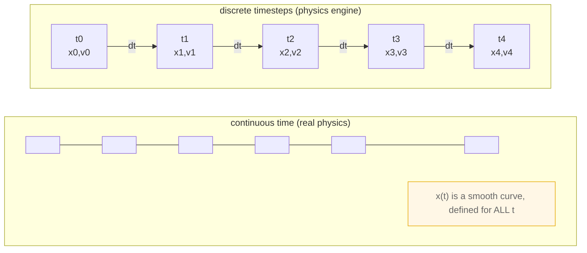
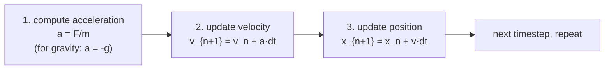
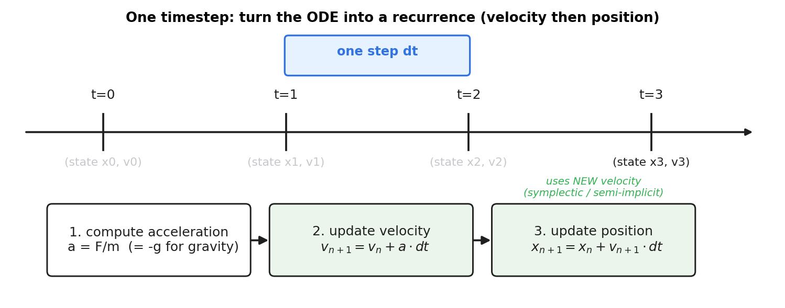
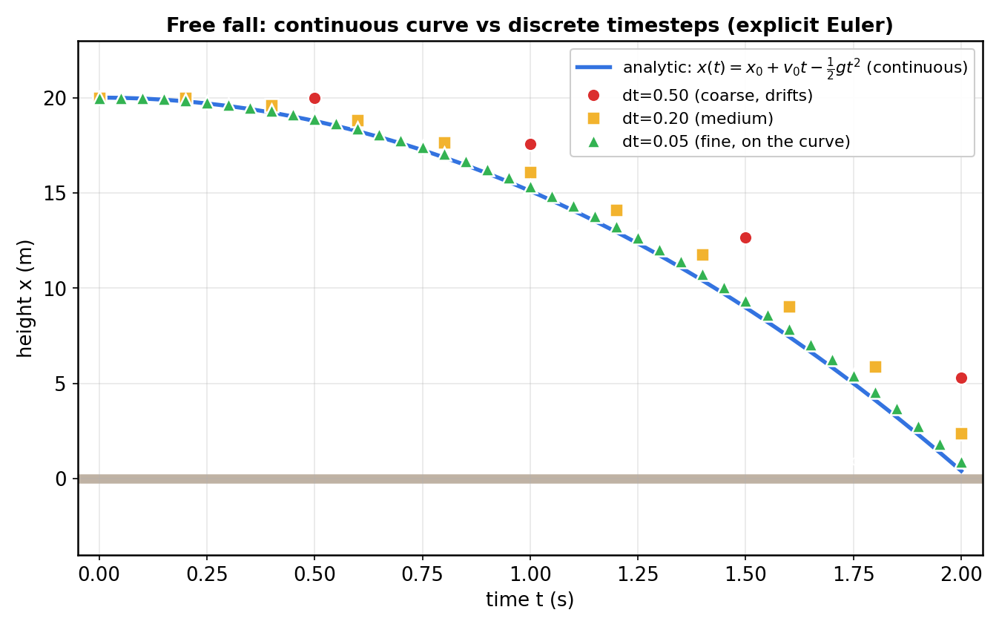
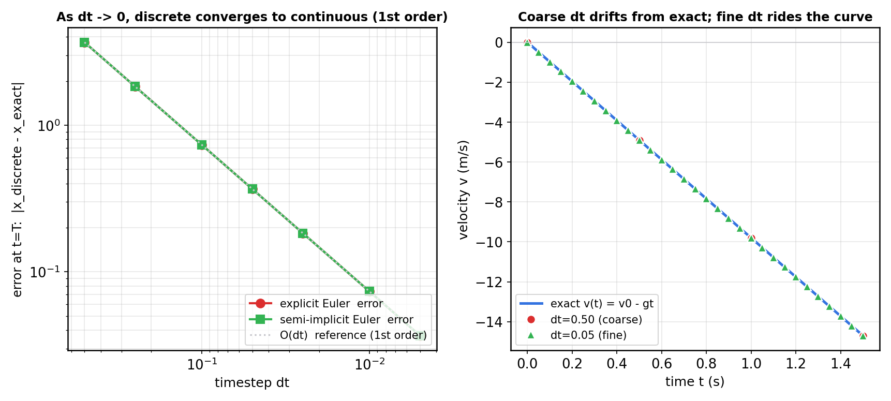

# 第 1 篇 · 第 2 章 · 物理引擎在干什么:牛顿方程与离散时间

> **核心问题**:真实世界的物理是**连续**发生的——一个物体受力,它的加速度、速度、位置随时间**连续**变化,这是牛顿第二定律 $F=ma$ 写成的微分方程 $m\cdot\dfrac{d^2 x}{dt^2}=F$。可计算机没法"连续"地算,它只能**一帧一帧**地、每隔一个固定时间 $dt$ 把所有物体的状态推进一步。物理引擎干的第一件事,就是把这条**连续的微分方程,变成每一步的离散更新**(差分递推)。本章就是要把这一步"连续→离散"的数学讲透:它凭什么成立、误差从哪来、为什么 $dt$ 越小越像真实物理、以及 Box2D v3 的源码里这件事是怎么落地的。我们全程用**自由落体** $x''=-g$ 这一个例子贯穿。

> **读完本章你会明白**:
> 1. 物理引擎里的"物理",起点是牛顿第二定律写成的一条**常微分方程(ODE)** $m\ddot x = F$,真实运动是它的解 $x(t)$。
> 2. 计算机不能"连续"解 ODE,只能把它**离散化**成差分递推:$x_{n+1}=x_n+v_n\cdot dt$,$v_{n+1}=v_n+a\cdot dt$。
> 3. 为什么离散递推是连续解的**近似**:$dt\to 0$ 时,离散点会收敛到连续曲线(本章用数值实验佐证);$dt$ 越大,离散越偏离真实。
> 4. 物理引擎里"一个时间步"到底是怎么把 ODE 推进一步的,以及 Box2D v3 的 `b2World_Step` 怎么把一个大步 `timeStep` 切成 `subStepCount` 个子步 `h`。
> 5. 为什么物理引擎用**固定时间步长**(而不是变步长)——这是离散近似稳定的命脉,也是承《游戏引擎》《数学分析》的交接点。

> **如果一读觉得太难**:先只记住三件事——① 真实物理是连续的微分方程,计算机只能离散地一步步推;② 离散递推 $x_{n+1}=x_n+v_n dt$ 是连续解的近似,$dt$ 越小越准;③ 物理引擎用固定 $dt$ 推进,源码里一个大步还能再切成几个子步。

## 读这章前,先破除三个常见误解

你可能带着几个直觉来读这章,它们都是错的,先破掉:

- **误解一:"物理引擎跑的是真物理"**。不是。真实物理连续发生(微分方程),引擎离散推进(差分递推)。它是**连续物理的数值近似**,只要 $dt$ 够小、方法够稳,看起来像真物理,本质是"假"的(P0-01 已点透)。
- **误解二:"离散点就是另一种物理,只是简化了"**。不是。离散递推不是"另一套物理规律",它**目标是逼近同一个连续解**。$dt\to 0$ 时离散点收敛到连续曲线,这是它的合法性根基(本章用数值实验 + 泰勒展开证明)。
- **误解三:"步长越小越好,所以物理引擎应该用极小的 $dt$"**。半对半错。$dt$ 越小越准没错,但每秒步数线性上涨、CPU 开销线性上涨;游戏有 16ms 实时预算,不可能用无穷小 $dt$。物理引擎在**精度**和**性能**间取折中($1/60$ 秒左右),并且**坚决固定**(变步长会破坏稳定性,见第六节)。

带着这三个破除后的认识,我们开始。

---

## 〇、一句话点破

> **物理引擎 = 把连续的牛顿微分方程,变成每个离散时间步上的差分递推。$dt$ 越小,这串离散点越逼近真实的连续运动;只要 $dt$ 够小、递推公式够稳,物体就"看起来"连续地遵守物理。这是从 P0-01 立起的"假物理"全景,拉近到响应侧的第一步——连续方程怎么变成离散步。**

这是结论。本章倒过来拆,而且**全程跟一个自由落体**:一个小球从 $20$ 米高静止释放,只受重力,真实物理里它的轨迹是一条漂亮的抛物线 $x(t)=20-\tfrac{1}{2}g t^2$。我们看物理引擎怎么用一串离散点去"拟合"这条抛物线。

---

## 一、先把镜头拉近:P0-01 立了全景,这章看"积分"那一步到底干了什么

P0-01 给了物理引擎一个时间步的完整流程:施加力 → ① 积分推进速度位置 → ② 宽相检测 → ③ 窄相检测 → ④ 约束求解。它还立了一条铁律:物理引擎的"物理"是**数值近似的假物理**——真实物理连续,引擎离散。

> **承接书讲过**:P0-01 已经把"连续 vs 离散"这个本质矛盾点透了,这一章不重复那个全景,而是**把镜头拉近到第 ① 步"积分"**——这步到底是怎么把"连续物理"变成"离散更新"的?这一步是整个**响应侧**(动力学 + 约束求解)的地基,后面 P2 一整篇(欧拉、半隐式、Verlet、固定步长)都在拆这一步的稳定性。本章先打地基:把"连续方程→离散递推"这个**动作**讲透。

我们从真实物理的起点讲起:牛顿第二定律。

---

## 二、真实物理的起点:牛顿第二定律是一条微分方程

### 2.1 $F=ma$ 你以为认得,可它其实是关于时间的微分方程

中学物理都学过 $F=ma$。可你有没有想过,把它**老老实实写开**,它其实是一条**微分方程**?

先把三个运动学量摆清楚,它们是一条**逐级求导的链**:

- **位置** $x(t)$:物体在哪儿。这是最基本的状态。
- **速度** $v(t)=\dot x(t)=\dfrac{dx}{dt}$:位置随时间的变化率(位置的**一阶导数**)。
- **加速度** $a(t)=\dot v(t)=\ddot x(t)=\dfrac{d^2 x}{dt^2}$:速度随时间的变化率(位置的**二阶导数**)。

加速度 $a$ 是位置 $x$ 对时间的**二阶导数**。而牛顿第二定律 $F=ma$ 里的 $a$ 就是它。代入进去:

$$
m\,\ddot x(t) \;=\; F(t,\,x(t),\,\dot x(t))
$$

这是一条**常微分方程(ordinary differential equation,ODE)**:未知函数是位置随时间的变化 $x(t)$,方程告诉你它的二阶导数(加速度)等于合力除以质量。所谓"物体的运动",数学上就是这条 ODE 的一个**解** $x(t)$——一条随时间延续的曲线。

> **钉死这件事**:物理引擎要模拟的"运动",数学本质就是**解一条常微分方程** $m\ddot x=F$。位置 $x(t)$ 是未知函数,方程给定它的二阶导。物理引擎的一切"推进运动",都是在**数值地解这条 ODE**。

#### 为什么是"二阶"方程?为什么需要两个初始条件?

注意这条 ODE 是**二阶**的(最高阶导数是 $\ddot x$,二阶导)。这有个直接的推论:**要确定一个解,需要两个初始条件**——初始位置 $x(0)=x_0$ 和初始速度 $\dot x(0)=v_0$。

直觉上:同样一个受力情况(比如自由落体),你从高处**静止释放**还是**往下扔**(给个初始向下的速度),后续轨迹完全不同;你从同一高度**往上抛**还是**往下抛**,轨迹也不同。决定后续运动的,不只是"受什么力",还有"**开始时位置在哪、速度多大**"——这就是两个初始条件。物理引擎里,每个物体的**状态(state)**就是用这两个量表达的:位置 + 速度。后面所有"推进",都是更新这个状态。

这个"二阶 ODE 拆成两个一阶量(位置、速度)"的视角,在数值方法里叫**状态空间表示**(state-space form),它让任何二阶 ODE 都能写成一组一阶递推——我们第三节正是这么做的。

### 2.2 自由落体:这条 ODE 极少数能"精确解"的情况

为了讲透,我们用最简单的例子:**自由落体**。小球质量 $m$,只受重力 $F=-mg$(取向上为正,重力向下),没有空气阻力,没有别的力。牛顿方程变成:

$$
m\ddot x = -mg \quad\Longrightarrow\quad \ddot x = -g
$$

(质量 $m$ 在等式两边消掉,这就是伽利略说的"轻重物体落得一样快"。)

这条 ODE 简单到能**解析解**(精确公式):对 $\ddot x=-g$ 积分两次,代入初始条件 $x(0)=x_0$、$\dot x(0)=v_0$,得到:

$$
\boxed{\,x(t) \;=\; x_0 \;+\; v_0\,t \;-\; \tfrac{1}{2}\,g\,t^2\,}
$$

这是自由落体的**解析解**——一条精确的抛物线。给定任意时刻 $t$,套公式就能算出精确位置。比如 $x_0=20$ m、$v_0=0$、$g=9.8$ m/s²,那么 $t=1$ 秒时 $x=20-4.9=15.1$ m,$t=2$ 秒时 $x=20-19.6=0.4$ m(快落地了)。

> **所以这样设计**:能解析解的物理,理论上你**根本不需要物理引擎**——直接套公式 $x(t)$ 就行,任意时刻位置精确到手到擒来。解析解是"连续的、精确的",没有误差。问题在于——

### 2.3 可真实物理引擎面对的运动,几乎都解不出解析解

自由落体能解,是因为它太简单(常加速度)。真实物理引擎要模拟的运动**几乎全都没有解析解**:

- 两个物体**碰撞**,接触力是瞬变的、非线性的,方程在碰撞瞬间根本不可微;
- 物体被**关节**约束(铰链、绳索),约束力是未知的"拉格朗日乘子",要联立求解;
- 受**用户任意施加的力**(游戏里风、爆炸、玩家推),力本身就是任意函数;
- 形状不规则,接触面复杂,接触点随运动变化……

这些情况下的 ODE,**数学上解不出**精确的 $x(t)$ 公式。唯一出路,是**数值地、一步步地近似**——这就叫**数值积分**(numerical integration)。

> **承接书讲过**:"微分方程大多解不出解析解,只能数值近似",这是《数学分析》"精确 vs 逼近"那条主线的核心论点之一,那里讲透了**为什么数值方法是必要的、它的误差和收敛怎么分析**。本书不重复那些,直接用它的结论:面对解不出的 ODE,用数值方法一步步逼近它的解。想深挖数值方法的理论(收敛阶、稳定性、误差估计),回看 [[math-analysis-series]]。本书篇幅留给**物理引擎特有的**:这套数值方法怎么用在一个会碰撞、有约束、要实时跑的系统上,以及为什么物理引擎偏偏选那几个积分器。

---

## 三、从连续到离散:把 ODE 变成差分递推

这一节是本章的核心动作:**怎么把一条连续的 ODE,变成计算机能一步步算的离散递推**。

### 3.1 计算机不能"连续",只能"一格一格"地算

先认清一个根本事实:计算机是**离散**的机器。它没法表示"连续的一段时间",也没法算"连续变化的函数"。它能做的,是:

- 把时间轴切成一段一段的小区间,每段长 $dt$(叫**时间步**或 **timestep**);
- 只在**离散的时刻** $t_0,\,t_0+dt,\,t_0+2dt,\dots$(记作 $t_n=t_0+n\,dt$)上,记录物体的状态(位置 $x_n$、速度 $v_n$);
- 每一步,用**当前状态**算出**下一步的状态**:$x_n,v_n \;\longrightarrow\; x_{n+1},v_{n+1}$。

这个"用当前状态算下一步状态"的公式,叫**递推关系(recurrence)**,或**差分方程(difference equation)**。物理引擎的"积分",本质就是**反复执行这个递推**。

时间轴被切成离散时刻,可以用下面这张图想象(连续的真实时间,被引擎"采样"成一串离散点):



真实物理在连续时间上有一条光滑曲线 $x(t)$;物理引擎只保留一串离散点 $(t_n, x_n)$,然后用递推把它们一个接一个算出来。

### 3.2 最朴素的离散化:用"差商"替掉"导数"

怎么从 ODE $\ddot x = -g$ 变出递推?关键思想是:**用差商(离散的差分比)去近似导数**。

#### 几何直觉:割线斜率逼近切线斜率

先回忆导数的几何意义。导数 $\dot x(t_0)$ 是 $x(t)$ 曲线在 $t_0$ 处的**切线斜率**。可计算机不会"画切线"——切线要用极限定义。计算机能算的,是曲线上**两点连成的割线斜率**:$\dfrac{x(t_0+dt)-x(t_0)}{dt}$。

当 $dt$ 很小时,这条割线和切线几乎重合(割线斜率 ≈ 切线斜率)。这就是导数定义 $\dot x=\lim_{dt\to 0}\dfrac{x(t+dt)-x(t)}{dt}$ 的几何含义:**让割线两点无限靠近,割线就变成切线**。离散化做的,就是**停在 $dt$ 不是零的地方,用割线斜率当切线斜率的近似**:

$$
\dot x(t) \;\approx\; \frac{x(t+dt)-x(t)}{dt}
$$

$dt$ 越小,割线越接近切线,近似越准——这正是第四节"步长是精度命脉"的几何根源。

#### 代数操作:差商替导数,得到递推

把"差商替导数"用到自由落体上。位置-速度-加速度三个量,每个的导数都换成差商:

- 加速度(速度的导数):$\ddot x(t) \;\approx\; \dfrac{v(t+dt)-v(t)}{dt}$
- 速度(位置的导数):$\dot x(t) \;\approx\; \dfrac{x(t+dt)-x(t)}{dt}$

代入 ODE $\ddot x=-g$ 和 $\dot x=v$,设 $x_n=x(t_n)$、$v_n=v(t_n)$、$t_{n+1}=t_n+dt$:

$$
\frac{v_{n+1}-v_n}{dt} = -g \quad\Longrightarrow\quad \boxed{\,v_{n+1} = v_n - g\,dt\,}
$$

$$
\frac{x_{n+1}-x_n}{dt} \approx v \quad\Longrightarrow\quad \boxed{\,x_{n+1} = x_n + v\,dt\,}
$$

这两行就是**显式欧拉(explicit Euler)**递推——最朴素、最直观的数值积分。

#### 关键技巧:二阶 ODE 拆成两个一阶递推

注意一个关键动作:原本的 ODE 是**一条二阶**方程 $\ddot x=-g$,我们没硬解它,而是把它**拆成了两条一阶递推**(一条管速度更新、一条管位置更新)。这不是偷懒,是数值方法的标准操作——**任何高阶 ODE 都能拆成一组一阶方程组**(把每个低阶导数都当成一个独立变量),然后每个一阶方程各自用一个一阶递推推进。这就是为什么 2.1 节强调"状态 = 位置 + 速度两个量":把二阶 ODE 降成一阶系统后,要追踪的就是这两个一阶变量。

给定初始值 $x_0,v_0$,反复套这两行递推,就能算出 $x_1,v_1,x_2,v_2,\dots$ 一串离散状态。

> **钉死这件事**:**数值积分 = 把微分方程的导数,换成离散的差商,得到一个一步步算的递推**。导数 $\dot x$ 换成 $\dfrac{x_{n+1}-x_n}{dt}$,微分方程 $\ddot x=-g$ 就变出差分方程 $v_{n+1}=v_n-g\,dt$、$x_{n+1}=x_n+v_n dt$。计算机只会算这个——它不会"连续",只会"一步步"。

### 3.3 一个时间步到底干了什么:递推的"三幕戏"

把递推展开,一个**时间步**内,物理引擎对每个物体其实在做三件事(对应 P0-01 流程的第 ① 步"积分"):



1. **算加速度**:从受力算出加速度 $a=F/m$。自由落体就是 $a=-g$。
2. **更新速度**:$v_{n+1}=v_n+a\,dt$。这一步把"力的影响"加进速度。
3. **更新位置**:$x_{n+1}=x_n+v\,dt$。这一步把"速度的影响"加进位置。

> **不这样会怎样**:注意第 3 步有个微妙的选择——用**旧速度** $v_n$ 还是**新速度** $v_{n+1}$ 去推位置?

- 用旧速度 $v_n$:$x_{n+1}=x_n+v_n\,dt$。这叫**显式欧拉**(explicit Euler)。
- 用新速度 $v_{n+1}$:$x_{n+1}=x_n+v_{n+1}\,dt$。这叫**半隐式欧拉**(semi-implicit Euler,也叫 symplectic Euler)。

这俩看起来只差一个下标,可后果天差地别。先用自由落体给个直观对比(第四节有图):

- **显式欧拉**(用旧速度):位置用"这一步开始时的速度"推。可自由落体的速度一直在变(向下加速),用"过时的、较慢的"速度算位置,物体**落得比真实慢**——离散点偏高。这是**系统性的"滞后"误差**。
- **半隐式欧拉**(用新速度):位置用"这一步结束时的速度"推。相当于**超前**用了一个更新过的速度。对自由落体,这反而部分抵消了滞后,误差更小(第四节 log-log 图上绿线略低于红线)。

更关键的是**稳定性**的差别(不是精度,是"会不会发散"):换成弹簧-质量系统(物理引擎里关节/软约束的模型)后,显式欧拉**能量单调增长**(每步往系统里注入一点能量,几秒后振幅爆炸),半隐式欧拉是**辛积分器**(symplectic),能量有界、长期稳定。Box2D v3 选的就是半隐式。这个"更新顺序"的微妙差异,是下一章 P1-03 和第 2 篇 P2-06~07 的招牌主题(积分器稳定性),这里先记住:**离散化不是唯一的,递推公式怎么写、用旧值还是新值,直接决定结果稳不稳**。

下面这张图把这三幕戏画出来(注意第 3 步用的是**新速度**,这是 Box2D 选的半隐式欧拉):



---

## 四、自由落体数值实验:离散点到底像不像连续解

光讲公式不够。这一节用**真实数值**看:离散递推算出来的点,和解析解的抛物线比,到底有多像?$dt$ 大小又怎么影响?

### 4.1 三种 $dt$ 的离散点 vs 解析抛物线

我们让小球从 $x_0=20$ m 高静止释放($v_0=0$),取 $g=9.8$ m/s²,看 $t$ 从 $0$ 到 $2$ 秒。解析解是 $x(t)=20-4.9t^2$。然后用显式欧拉递推,分别取 $dt=0.5$、$0.2$、$0.05$,看离散点落在哪里:



这张图说明三件事:

1. **离散点确实在逼近连续解**。尤其是 $dt=0.05$ 的绿色三角,几乎贴在蓝色解析曲线上——肉眼看不出差别。这说明**离散递推是连续解的有效近似**,这个思路成立。
2. **$dt$ 越大,离散点越偏离**。$dt=0.5$ 的红色圆点(只有 5 个点)明显偏离曲线,而且**偏高**。为什么偏高?因为显式欧拉用**旧速度** $v_n$ 推位置,而自由落体的速度一直在变小(向下加速,若取向上为正则速度持续减小),用"过时的(较大的)速度"算位置,位置就**落得比真实慢**,所以偏高。这是离散化的**系统误差**。
3. **$dt\to 0$ 时,离散点收敛到连续曲线**。这是关键:$dt$ 越小,离散点越密、越贴曲线。理论上 $dt\to 0$ 时,离散递推的极限就是解析解。这就是数值方法的**收敛性**。

> **钉死这件事**:离散递推不是"另一个物理",它是**连续解的逼近**。$dt$ 越小,越像真实;$dt$ 太大,就跑偏。物理引擎之所以"看起来符合物理",靠的就是 **$dt$ 够小**——游戏里 $dt$ 常取 $1/60$ 秒甚至更小,小到肉眼分不清离散和连续。

### 4.2 收敛性:误差随 $dt$ 怎么变

把上一节的观察量化:固定一个终止时刻 $T$(比如 $T=1.5$ 秒),看离散递推算出的 $x(T)$ 和解析解 $x_{\text{exact}}(T)$ 的**误差** $|x_{\text{discrete}}(T)-x_{\text{exact}}(T)|$,随 $dt$ 怎么变化。下面这张图左边是这个误差的**对数-对数图**,右边是粗细两种 $dt$ 的速度轨迹对比:



左图的两条误差曲线(红=显式欧拉、绿=半隐式欧拉)都**紧贴**那条灰色的 $O(dt)$ 参考线——意思是:**$dt$ 减半,误差也大致减半**。这在数值方法里叫**一阶收敛**(first-order convergence)。把 $dt$ 从 $0.5$ 缩到 $0.005$(缩小 100 倍),误差也缩小约 100 倍。这就量化地回答了"为什么 $dt$ 越小越准"。

> **承接书讲过**:"数值方法的**收敛阶**(order of convergence)和**误差估计**,$O(dt)$ 为什么叫一阶、$O(dt^2)$ 为什么叫二阶,龙格-库塔(RK4)为什么是四阶——这些是《数学分析》数值方法篇的核心内容,那里用泰勒展开严格证明了**离散递推的局部截断误差**和**全局误差**的关系。本书不重证,直接用结论:**欧拉类递推是一阶方法**($dt$ 减半,误差减半),所以 $dt$ 不能太大;想更准可以用高阶方法(但物理引擎有别的顾虑,见下)。理论细节回看 [[math-analysis-series]]。

右图换了个角度:看**速度**的离散点 vs 解析直线。粗 $dt=0.5$(红圆)只有 4 个点,稀疏但还在直线附近;细 $dt=0.05$(绿三角)密密麻麻贴在直线上。这再次印证:**步长是精度的命脉**。

> **不这样会怎样**:那 $dt$ 取多小才够?直觉是"越小越好",可 $dt$ 越小,**每秒要算的步数越多**($dt=1/60$ 每秒 60 步,$dt=1/240$ 每秒 240 步),CPU 开销线性上涨。游戏要实时跑(每帧 16ms 预算),不可能把 $dt$ 取到无穷小。物理引擎在**精度**和**性能**之间取折中:通常 $dt=1/60$ 或 $1/30$ 秒,够小到肉眼分不清,又够大跑得动。这个折中,以及"为什么不能再大"(变步长撞墙),是 P2-08(固定步长)的主题。

### 4.3 换个视角看误差:能量守恒被离散化破坏了

精度问题还有另一个更深刻的视角——**能量**。这是物理引擎选积分器时最关心的量,这里先埋个伏笔。

自由落体的真实物理是**能量守恒**的:动能 $E_k=\tfrac{1}{2}mv^2$ + 势能 $E_p=mgx$ 之和是常数($\tfrac{1}{2}mv^2+mgx=\text{const}$)。把解析解 $x(t)=x_0-\tfrac{1}{2}gt^2$、$v(t)=-gt$ 代进去,你也能验证总能量恒等于初始势能 $mgx_0$,不随时间变。

可离散递推呢?每一步的 $x_{n+1}=x_n+v\,dt$ 和 $v_{n+1}=v_n-g\,dt$ 都是**近似**,每步都往总能量里注入(或抽走)一点点误差。以显式欧拉的自由落体为例(第四节那张图的红点偏高),位置系统性偏高,意味着**势能被高估**——也就是离散递推**凭空多给了系统能量**。这就是"误差"的能量面目:**离散化破坏了能量守恒**。

对自由落体这点能量偏差肉眼无感(物体只是落得稍慢)。可换成**振荡系统**(弹簧、钟摆、堆叠箱子的微小晃动),能量被持续注入意味着**振幅越来越大**,几秒后物体飞掉——这就是 P0-01 那张"显式欧拉爆炸"图的能量解释,也是 P2-06 的招牌。**物理引擎选积分器的头号标准,不是"算得准",而是"不往系统里灌能量(或至少能量有界)"**——这叫**数值稳定性**,比精度更重要。半隐式欧拉之所以被选中,就是因为它对哈密顿系统(能量守恒的物理系统)是**辛的**(symplectic),长期总能量有界。

> **钉死这件事**:离散化会**破坏能量守恒**——每步注入或抽走一点点能量。对单调运动(自由落体)这点偏差无害,对振荡系统(弹簧、堆叠)却可能被放大成爆炸。物理引擎选积分器的头号标准是**长期能量有界**(稳定性),其次才是精度。这是承《数学分析》数值稳定性理论的关键交接点,P2-06~07 专攻。

---

## 五、源码佐证:Box2D v3 怎么把连续时间切成离散步

讲透了原理,现在看 Box2D v3 的源码是怎么落地的。这是基础原理章,源码点到即止,只看最核心的一处:**一个时间步是怎么切出来的**。

### 5.1 入口 `b2World_Step`:连续时间进来,离散步出去

Box2D v3 的公共 API 是 **C 句柄 API**(不是 v2 的 C++ 类,老资料讲的 `b2World::Step` 已过时)。模拟一步的入口是:

```c
void b2World_Step( b2WorldId worldId, float timeStep, int subStepCount );
```

([src/physics_world.c:828](../box2d/src/physics_world.c#L828),v3.2.0 commit `56edae79`。)

`worldId` 是世界的句柄,`timeStep` 是这一步要推进的连续时间(比如 `1.0f/60.0f`),`subStepCount` 是把这一步切成几个**子步**。函数内部第一件事,就是把这个 `timeStep` 翻译成离散的步长参数。看真实的几行(简化展示,非源码原文排版):

```c
// src/physics_world.c:890 附近(简化示意)
b2StepContext context = { 0 };
context.world = world;
context.dt = timeStep;                              // line 892: 整个大步
context.subStepCount = b2MaxInt( 1, subStepCount ); // line 893: 子步数, 至少 1

if ( timeStep > 0.0f )
{
    context.inv_dt = 1.0f / timeStep;                       // line 897
    context.h = timeStep / context.subStepCount;            // line 898: ★ 子步步长
    context.inv_h = context.subStepCount * context.inv_dt;  // line 899
}
```

> **钉死这件事**:注意 `context.h = timeStep / context.subStepCount` 这一行([physics_world.c:898](../box2d/src/physics_world.c#L898))。这就是**连续时间被切成离散步的真实落地**:用户传进来的连续时间 `timeStep=1/60`,被 `subStepCount` 切成 `subStepCount` 个长 `h` 的子步。比如 `b2World_Step(world, 1.0f/60.0f, 4)`,内部真正用来积分的步长是 `h = (1/60)/4 = 1/240` 秒。Box2D 不是用一个粗 $dt$ 推进,而是**把一个大步细分成多个更稳的子步**——这是 v3.2 的"子步进软约束求解器"的基础(细节在 P5-16 约束求解)。`b2StepContext` 结构体里,`dt` 字段注释写"time step",`h` 字段注释写"sub-step"([solver.h:157-167](../box2d/src/solver.h#L157-L167)),名字就直说了。

#### 源码细节:为什么还要存倒数 `inv_dt`、`inv_h`?

你可能注意到,`b2StepContext` 里除了 `dt`、`h`,还存了它们的**倒数** `inv_dt`、`inv_h`([physics_world.c:897-899](../box2d/src/physics_world.c#L897-L899))。这看似冗余(用的时候算 `1.0f/h` 不就行了),其实是物理引擎一贯的**性能约定**:

约束求解里大量公式(冲量、effective mass、软约束的 bias)长这样:$\text{某量} = \dfrac{c}{h}$、$\dfrac{k}{dt}$,处处要除以步长。除法在 CPU 上比乘法**慢一个量级**(几十周期 vs 几周期)。所以 Box2D 一开始就把 $1/h$、$1/dt$ 算好存起来,后面所有"除以步长"的地方全换成"乘以预存的倒数"——一次除法换 N 次乘法。同理,物体存的是 `invMass = 1/mass` 而不是 `mass`(P2-05 详谈),也是为了把每步的除法变乘法。

这是个不起眼但很重要的工程习惯:**把热点循环里的除法,提到循环外算一次倒数**。物理引擎每帧跑几万次约束求解,这种约定累积省下的 CPU 相当可观。

### 5.2 切完之后:子步内跑半隐式欧拉递推

`b2World_Step` 把 `context` 算好之后,调用 `b2Solve(world, &context)`([physics_world.c:931](../box2d/src/physics_world.c#L931))。`b2Solve` 内部把每个子步 `h` 跑一遍我们第三节讲的三幕戏(算加速度 → 更新速度 → 更新位置)。其中**更新速度**这一步,源码是这样的([src/solver.c:101-102](../box2d/src/solver.c#L101-L102)):

```c
// lvd = h * im * f + h * g     (linear velocity delta)
b2Vec2 linearVelocityDelta = b2Add( b2MulSV( h * sim->invMass, sim->force ),
                                    b2MulSV( h * gravityScale, gravity ) );
float angularVelocityDelta = h * sim->invInertia * sim->torque;
```

第一行拆开看,正好是 $v_{n+1}=v_n + h\cdot(F/m) + h\cdot g$——这就是**半隐式欧拉的速度更新**(用步长 $h$、质量倒数 $1/m$、力 $F$、重力 $g$ 算速度增量)。`invMass` 就是 $1/m$,这是 Box2D 一贯用**质量倒数**的约定(避免每步做除法,P2-05 详谈)。

**更新位置**这一步在 [src/solver.c:157-158](../box2d/src/solver.c#L157-L158):

```c
state->deltaPosition = b2MulAdd( state->deltaPosition, h, state->linearVelocity );
state->deltaRotation = b2IntegrateRotation( state->deltaRotation, h * state->angularVelocity );
```

`deltaPosition += h * linearVelocity`——位置用**新速度**(因为速度刚在上一阶段更新过)推进一步。**这正是半隐式欧拉**:先用加速度更新速度,再用新速度更新位置。我们在第三节说"Box2D 用半隐式",源码这里就是铁证。

> **钉死这件事**:把第三节的三幕戏和源码对上——① 算加速度 $a=F/m$(隐含在 `force`/`gravity` 里);② 更新速度 `v += h*(invMass*force + gravity)`(solver.c:101);③ 更新位置 `x += h*v`(solver.c:157)。**连续的牛顿 ODE,在源码里就是这两行差分递推**。这就是"连续→离散"在物理引擎里的真实落地。下一章 P1-03 会专门讲"为什么偏偏是半隐式欧拉,不是显式欧拉、不是高阶 RK4"——稳定性。

---

## 六、为什么物理引擎用"固定"步长(承《游戏引擎》《数学分析》)

讲到这里,细心的读者会问:既然 $dt$ 越小越准,那为什么不让 $dt$ 自适应——画面卡的时候用大 $dt$,流畅的时候用小 $dt$?这一节回答这个要害。

### 6.1 变步长的两个致命问题

听起来自适应很合理(很多通用 ODE 求解器,比如 MATLAB 的 `ode45`,就是变步长的)。可物理引擎**坚决不用变步长**,原因有二:

**第一,数值稳定性**。离散递推的稳定性**依赖 $dt$**——某些积分器(显式欧拉对弹簧系统)在 $dt$ 大时会发散爆炸。这里有个关键概念叫**临界步长**(critical step size):对于给定的积分器 + 给定的系统(比如某根弹簧的刚度 $k$、质量 $m$),存在一个 $dt$ 上限,$dt$ 小于它递推稳定,大于它递推发散。这个上限由系统的"最快振动模式"决定(弹簧越硬、质量越轻,振动越快,临界 $dt$ 越小)。如果 $dt$ 忽大忽小,你可能某帧 $dt$ 超过临界值,递推瞬间发散,物体"嘭"地飞出屏幕。下一帧 $dt$ 再小也救不回来——状态已经毁了。固定 $dt$ 保证每步都在稳定区间内(只要固定的 $dt$ 小于场景里最快振子的临界步长)。

**第二,可复现性**。物理引擎是**交互式**的(游戏、机器人仿真),同一组输入应该跑出同样的结果(bug 才能复现、网络同步才可能)。变步长依赖每帧的实际耗时,而实际耗时受 CPU 负载、其他进程、散热降频影响——**同一场景两次跑,结果不一样**。固定 $dt$ 让模拟完全确定、可复现。

> **不这样会怎样**:用变步长会怎样?最直接的就是**"抽风"**——画面偶尔卡一帧,那一帧 $dt$ 变大,物体突然跳一大步,可能直接穿墙(tunneling)、或者堆叠的箱子突然炸开。网络多人游戏里,变步长更是灾难:两台机器跑出不一样的物理状态,谁也说服不了谁。所以物理引擎**一律固定步长**,哪怕画面卡,物理步长也不变(用"固定步长 + 累加器"把渲染帧率和物理步长解耦,这套机制 P2-08 详谈)。

### 6.2 承接:《游戏引擎》讲过固定步长,《数学分析》讲过稳定性

固定步长这件事,横跨两本承接书:

> **承接书讲过**:① **为什么游戏引擎主循环用固定步长**(把 update 和渲染解耦、保证逻辑帧率稳定),这是《游戏引擎》P3-10 的主题,那里讲透了"固定步长 + 累加器"的工程实现。本书 P2-08 一句带过指路 [[graphics-series-project]],篇幅留物理特有的(固定步长怎么保数值稳定)。② **数值方法的稳定性理论**(刚性方程、A-稳定、绝对稳定域),是《数学分析》数值方法篇的内容,那里用特征方程分析了"哪些 $dt$ 下递推收敛、哪些发散"。本书直接用结论:**物理引擎面对的弹簧-质量系统是刚性的,$dt$ 必须小于某个临界值才稳定**,理论推导回看 [[math-analysis-series]]。

本书在 P2-08 会把这两条接起来:固定步长既是工程需要(可复现、解耦渲染),更是**数值稳定性的硬要求**。

#### 一句直觉:固定步长和渲染帧率怎么共处?

读者会问:游戏画面帧率会波动(30 帧到 144 帧都常见),可物理要用固定 $dt$,这俩怎么协调?答案是**固定步长 + 累加器**:渲染循环每帧把"自上次物理步以来流逝的真实时间"累加到一个缓冲里,缓冲够一个 $dt$ 就跑一次物理步,不够就不跑,多了就连续跑两步追上。这样**物理始终以固定 $dt$ 推进,渲染以任意帧率刷新**,两者解耦。这套机制的工程实现是《游戏引擎》P3-10 的内容,本书 P2-08 一句带过指路;本章只要记住结论——**物理引擎的 $dt$ 是固定的,不随画面帧率波动**。

---

## 七、技巧精解:微分方程 → 差分方程,为什么 $dt\to 0$ 离散趋近连续

这一节是本章钦定的硬核技巧,要把"连续 ODE → 离散递推"这一步**为什么对**讲透——也就是**收敛性**的直觉。这是承《数学分析》极限与收敛的核心思想在物理引擎场景的兑现。

### 7.1 核心技巧:用差商替导数,是泰勒展开一阶近似的必然结果

为什么 $v_{n+1}=v_n-g\,dt$、$x_{n+1}=x_n+v_n\,dt$ 这套递推,在 $dt\to 0$ 时会趋近连续解?直觉来自**泰勒展开**。

把 $x(t+dt)$ 在 $t$ 处泰勒展开:

$$
x(t+dt) = x(t) + \dot x(t)\,dt + \tfrac{1}{2}\ddot x(t)\,dt^2 + \tfrac{1}{6}\dddot x(t)\,dt^3 + \cdots
$$

保留到一阶(把 $O(dt^2)$ 的高阶项扔掉):

$$
x(t+dt) \approx x(t) + \dot x(t)\,dt \quad\Longrightarrow\quad x_{n+1} \approx x_n + v_n\,dt
$$

这就是显式欧拉的位置更新公式!它**不是拍脑袋想出来的**,而是泰勒展开**砍掉二阶及以上项**的自然结果。被砍掉的那一项 $\tfrac{1}{2}\ddot x\,dt^2$(以及更高阶),就是**每一步的局部截断误差**(local truncation error),它是 $O(dt^2)$ 量级。

每步误差 $O(dt^2)$,走 $N=T/dt$ 步到时刻 $T$,累积的全局误差(global error)大约是 $N\times O(dt^2) = \dfrac{T}{dt}\times O(dt^2) = O(dt)$——这就是上一节图里看到的"**一阶收敛**"($dt$ 减半,全局误差减半)的数学根源。

> **钉死这件事**:**离散递推是连续解的近似,这个近似有严格的误差阶**。显式/半隐式欧拉是**一阶方法**(局部误差 $O(dt^2)$、全局误差 $O(dt)$)。$dt\to 0$ 时误差趋于零,所以**离散收敛到连续**——这不是经验观察,是泰勒展开保证的数学事实。物理引擎的"看起来符合物理",根基就是这个收敛性:$dt$ 够小,误差肉眼无感。

### 7.2 反面对比一:$dt$ 太大,离散严重偏离真实

收敛性是"$dt\to 0$ 时"的极限性质。可物理引擎 $dt$ 不是零,是个有限值(1/60 秒)。$dt$ 太大时会怎样?第四节那张图已经给了直观答案——$dt=0.5$ 的红点明显偏离曲线。这里从**误差累积**的角度再强调一遍:

自由落体这种简单情况,大 $dt$ 只是"落得偏慢"(系统误差,还能看)。可一旦换成**弹簧-质量系统**(弹簧把两个物体连起来,这是物理引擎里关节、软约束的模型),显式欧拉在大 $dt$ 下会**能量发散**——振幅每步变大,几秒内物体飞出屏幕。这就是 P0-01 那张"显式欧拉爆炸"图的来源,也是 P2-06 的招牌主题。**离散化不是无害的:步长太大,或选错积分器,离散解可以和真实物理差到面目全非,甚至发散到无法使用。**

### 7.3 反面对比二:同样的 $dt$,显式 vs 半隐式欧拉,稳定性天差地别

更微妙的是:**同样大小的 $dt$,不同的离散化方式,稳定性可以完全不同**。看第四节左图那个 log-log 误差图——对自由落体,显式(红)和半隐式(绿)的误差**几乎重合**,都是一阶收敛。看起来没差别。

可换成弹簧系统(振荡),差距就爆发了:显式欧拉在弹簧系统上**能量单调增长**(每步往系统里注入能量),不管 $dt$ 多小都不稳定;半隐式欧拉是**辛积分器**(symplectic),能量有界(虽然有小振荡,但不发散)。这就是 Box2D 选半隐式的根本原因——它对**物理系统(哈密顿系统)**稳定,保能量。

> **钉死这件事**:**离散化不是唯一的,怎么离散直接决定稳定性**。同样是 $v$ 和 $x$ 的更新,先更速度还是先更位置、用旧值还是新值,差一个下标,后果是"发散爆炸" vs "稳定保能量"。这是数值方法的精妙,也是物理引擎选积分器的核心考量。这个主题太大,本章只埋下伏笔,招牌拆解在 P2-06(显式欧拉发散)和 P2-07(半隐式凭什么稳)。

> **承接书讲过**:为什么"辛积分器保能量"、什么是"哈密顿系统"、辛性(symplecticity)怎么定义、为什么辛积分器长期稳定——这些是《数学分析》数值方法篇(以及一点理论力学)的硬核内容,那里从**修正方程**(modified equation)和**后向误差分析**角度解释了辛性。本书 P2-07 会从物理引擎视角再讲一遍直觉,严格理论回看 [[math-analysis-series]]。

---

## 八、章末小结

### 回扣主线

本章把镜头从 P0-01 的全景,拉近到**响应侧**的第一步——**积分**(数值地推进运动)。核心动作就一个:**把连续的牛顿微分方程 $m\ddot x=F$,变成每个离散时间步上的差分递推** $v_{n+1}=v_n+a\,dt$、$x_{n+1}=x_n+v\,dt$。我们用自由落体 $x''=-g$ 贯穿,看到了:① 真实物理是连续 ODE,它的解是位置随时间的曲线 $x(t)$;② 计算机只能离散,用差商替导数把 ODE 变成递推;③ 离散点是连续解的近似,$dt\to 0$ 时收敛(一阶),$dt$ 太大就跑偏;④ Box2D v3 的 `b2World_Step` 把连续的 `timeStep` 切成 `subStepCount` 个子步 `h`,子步内跑半隐式欧拉;⑤ 物理引擎用固定步长保稳定和可复现。本章服务**响应**这一面(运动推进),为下一章"为什么必须数值积分"和第 2 篇(积分器稳定性)打地基。

### 五个为什么

1. **物理引擎模拟的"运动",数学本质是什么?**——是一条常微分方程 $m\ddot x=F$ 的解 $x(t)$;位置是未知函数,方程给定它的二阶导(加速度)。
2. **为什么不能直接精确解?**——自由落体这种极简单情况能解析解;可碰撞、约束、任意力的 ODE 数学上解不出,只能数值近似。
3. **离散递推怎么来的?**——把 ODE 里的导数 $\dot x$ 换成差商 $\dfrac{x_{n+1}-x_n}{dt}$(泰勒展开一阶近似的必然),微分方程就变出差分方程 $v_{n+1}=v_n-g\,dt$、$x_{n+1}=x_n+v_n\,dt$。
4. **离散递推凭什么逼近真实?**——泰勒展开保证每步局部误差 $O(dt^2)$,累积全局误差 $O(dt)$(一阶收敛)。$dt\to 0$ 时误差趋于零,离散收敛到连续。$dt$ 太大则偏离甚至发散。
5. **为什么物理引擎用固定步长?**——两个硬要求:① 数值稳定性(变步长可能某帧 $dt$ 太大发散爆炸);② 可复现性(变步长依赖实际帧耗时,结果不确定)。固定步长保稳定和可复现。

### 想继续深入往哪钻

- **想搞懂为什么不能只用解析解**(大多数情况解不出):下一章 P1-03 专讲这个,以及数值积分的动机。
- **想搞懂积分器稳定性**(显式欧拉为什么爆炸、半隐式为什么稳):第 2 篇 P2-06(显式欧拉发散)→ P2-07(半隐式欧拉与 Verlet)→ P2-08(固定步长)。
- **想看 Box2D v3 真实积分代码**:本章已点过 `solver.c:101-102`(速度)、`solver.c:157-158`(位置)、`physics_world.c:898`(子步切分);第 2 篇会逐行拆。
- **想深挖数值方法理论**(收敛阶、稳定性、辛积分器):承《数学分析》数值方法篇,[[math-analysis-series]]。
- **想搞懂固定步长怎么和渲染帧率解耦**:承《游戏引擎》P3-10,本书 P2-08 一句带过指路。

### 引出下一章

我们搞清了"连续 ODE → 离散递推"这个动作,以及 Box2D v3 怎么把它落地。可还有个根本问题没正面回答:**为什么物理非用数值积分不可?** 自由落体能解析解,那物理引擎里有没有能解析解的情况?为什么物理引擎面对的几乎所有运动(碰撞、约束、堆叠)都解不出解析解,非得一步步数值逼近?这个问题,加上"数值积分到底在逼近什么",是下一章的主题。下一章 P1-03,**为什么物理要数值积分**,我们从"哪些 ODE 能解、哪些解不出"讲起,正面确立数值方法在物理引擎里的必然性。

> **下一章**:[P1-03 · 为什么物理要数值积分](P1-03-为什么物理要数值积分.md)
