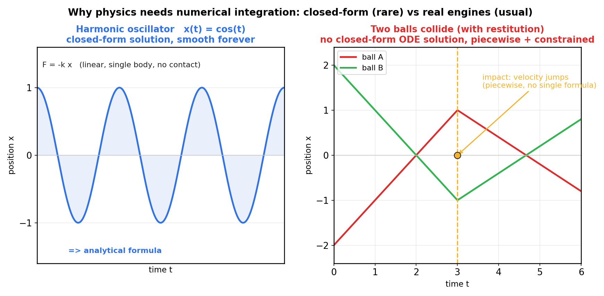
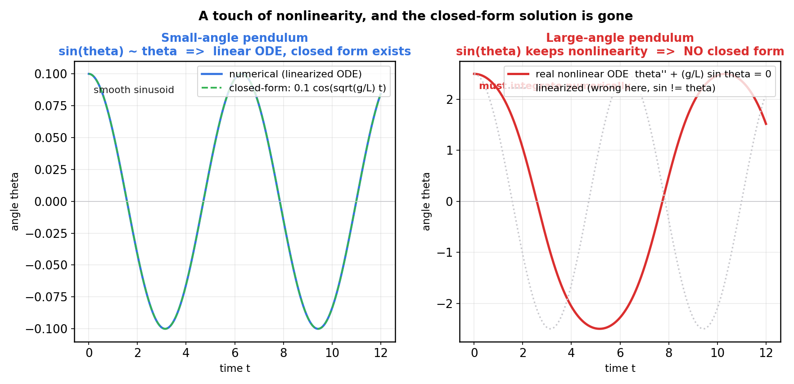
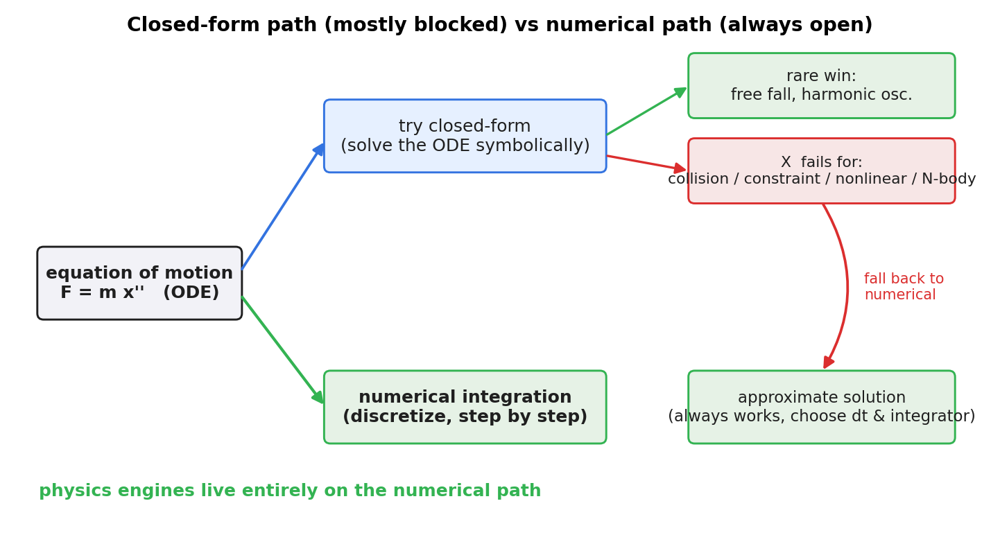

# 第 1 篇 · 第 3 章 · 为什么物理要数值积分

> **核心问题**:上一章我们把"连续的真实物理"掰成了"每 dt 一步的离散更新"。可是问题来了——既然已经离散成了递推式,为什么不直接把那个递推式"精确"地解出来,得到一个像 `x(t) = x₀ + v₀t − ½gt²` 那样的闭式公式 (closed-form solution),每帧套公式就行?为什么非要用**数值积分**这种"一步近似一步、误差会累积"的办法?答案一句话:**绝大多数真实物理引擎面对的运动方程,根本没有解析解**。多体碰撞、约束、任意力、不规则形状——这些微分方程解不出闭式公式,唯一活路是数值地、一步一步地逼近。这一章就把"解析解可达"和"解析解走不通"这两类系统彻底掰开,让你看清物理引擎为什么只能待在"数值逼近"这条道上。

> **读完本章你会明白**:
> 1. 什么是**解析解**(闭式公式),什么是**数值解**(一步一步递推),它们的根本差别在哪。
> 2. 哪些运动方程有解析解(自由落体、谐振子),它们为什么"简单到无聊";而真实引擎面对的(多体碰撞 + 约束 + 非线性 + 任意力)为什么**解不出**闭式解。
> 3. 为什么"加一点非线性"就让解析解消失(以大角度单摆为反例)。
> 4. 为什么物理引擎**只能**数值积分,以及这与《数学分析》"精确 vs 逼近"那条主线是什么关系。
> 5. 在 Box2D v3 的真实源码里,数值积分到底落在哪几行——它真的在用,不是嘴上说说。

> **如果一读觉得太难**:只记住三件事——① 解析解 = 能写成公式的精确解,但真实引擎的方程几乎都没有;② 所以只能数值积分(每步近似,误差可控就行);③ 这就是《数学分析》"数值方法"那条主线在物理场景的直接应用。细节随你跳。

---

## 〇、一句话点破

> **物理引擎之所以用数值积分,不是因为它"更高级",而是因为绝大多数运动方程根本解不出解析解——多体、约束、碰撞、非线性把它们变成了无法写成闭式公式的怪物。数值积分不是选择题,是没得选。这一章就是讲清楚"为什么没得选"。**

这是结论。本章倒过来拆:先看那些**有**解析解的"乖孩子"系统(它们少得可怜),再看真实引擎面对的"野孩子"系统(它们解不出),最后落到"所以只能数值逼近"这条唯一可行的路上。这一整章服务全书二分法的**响应**这一面——它是"动力学积分"这一层为什么存在的根本理由。

---

## 一、先回顾:解析解是什么,数值解又是什么

为了讲清"为什么不能解析地解",得先把"解析解"和"数值解"这两个词钉死。这两个概念在《数学分析》里讲透过,这里只用一小节对齐语言,不重复展开。

### 解析解(closed-form / analytical solution)

所谓**解析解**,就是你能把未知量写成一个**由已知量和基本运算(加减乘除、三角、指数等)组成的显式公式**。代入 t 就直接得到 x(t),不需要一步一步递推。

最经典的例子:自由落体。一个小球只受重力,牛顿第二定律写成:

```
   m · d²x/dt² = -m g
```

这是一个二阶常微分方程 (ODE)。它的解析解是你在中学物理就背过的:

```
   x(t) = x₀ + v₀·t - ½ g t²        (自由落体的解析解)
   v(t) = v₀ - g·t
```

有了这个公式,**任意时刻** t 的位置和速度,你都能一秒钟算出来,精确无误。这叫"解析地解出了运动方程"。

> **钉死这件事**:解析解是**一锤定音的公式**——给你 t,我直接吐出 x(t),精确、一步到位、不存在"一步一步推进的累积误差"。这是数学家最想要的东西。

### 数值解(numerical solution)

可真实世界里,大量微分方程**解不出**这样的公式。唯一办法是**数值地、一步一步地逼近**:把时间切成无数个小步长 dt,从初始状态 `x(0), v(0)` 出发,每一步用一个**递推公式**把状态往前推一小格,得到 `x(dt), v(dt)`,再推到 `x(2dt), v(2dt)`……一直推到你想知道的时刻。

```
   从 (x₀, v₀) 出发, 每步 dt:
       v_{n+1} = v_n + a(x_n, v_n) · dt     ← 用当前位置算加速度, 更新速度
       x_{n+1} = x_n + v_n · dt             ← 用速度更新位置
   得到一串离散点:  x(0), x(dt), x(2dt), ...  这是方程的数值解
```

这串离散点不是"精确答案",它是"近似答案"——每一步都有个小误差,误差会随步数累积(但好的方法能让误差有界、可控)。

> **承《数学分析》**:这就是《数学分析》"精确 vs 逼近"那条主线的全部张力——**精确**(解析解)是理想,**逼近**(数值解)是现实。什么时候能精确、什么时候只能逼近、逼近的误差怎么估计、怎么不让误差放大到爆炸,那本书讲透了。本章只把它**搬到物理引擎这个场景里**:物理引擎每帧推进运动,本质上就是在做《数学分析》讲过的数值积分。后面 P2-06~07 会把"误差会不会爆炸"(数值稳定性)接着拆透,这一章先解决"为什么非数值不可"。

> **钉死这件事**:数值解是**一步一步递推的近似**——从初值出发,每步用一个小公式推一小格,得到一串离散点。它不是精确公式,有累积误差,但适用于任何方程(不管多野)。物理引擎的"运动推进"就是数值解。

### 一张图看清两者的差别

下面这张图把这个差别画在了一起:左边是"乖孩子"(谐振子,有解析解,光滑正弦),右边是"野孩子"(两球碰撞,速度在碰撞瞬间跳变,没有统一公式)。



左边那条蓝色正弦曲线,你可以用一个公式 `x(t) = cos(t)` 整段描述,平滑、精确、永不变样。右边那两条红绿折线,在碰撞那一刻速度**突然跳变**(这是约束求解施加的冲量造成的,第 5 篇专攻),轨迹被切成"碰前 / 碰后"两段,每段公式还不一样——而且你**事先不知道碰撞发生在哪个时刻**(那要靠碰撞检测算出来),所以根本写不出一个统一的闭式公式。

> **不这样会怎样**:如果你坚持要"精确算"右边这种碰撞系统,你会发现:① 碰撞时刻 t_hit 是状态依赖的(取决于两球什么时候接触),它本身就**没有公式**,得数值地搜索;② 碰后速度由恢复系数和约束求解决定,是**分段**的;③ 每多一次碰撞,分段就翻倍。你想写一个贯穿全程的解析公式,写不出来。

这就是物理引擎面对的现实。下面我们把"为什么解不出"这件事彻底拆透。

---

## 二、哪些运动方程有解析解:少得可怜的"乖孩子"

先看乐观的一面:到底什么样的系统能解出解析解?把这一类认清,你才能看清"为什么真实引擎不在这一类里"。

### 例子 1:自由落体(匀加速运动)

上面已经说过:`m·d²x/dt² = -mg`,解出 `x(t) = x₀ + v₀t - ½gt²`。这是中学物理。

为什么它能解?因为这个方程是**线性常系数**的:右边的力 `-mg` 是个**常数**,不依赖位置 x、不依赖速度 v、不依赖时间 t。这种方程的解就是多项式(或指数、三角),可以套公式积出来。

### 例子 2:谐振子(弹簧振子)

一个质量块挂在弹簧上,弹力 `F = -kx`(位移越大,回复力越大,方向相反):

```
   m · d²x/dt² = -k x
```

这同样是**线性常系数** ODE(右边是 x 的线性函数,系数 k/m 是常数)。它的解析解是正弦/余弦:

```
   x(t) = A cos(ω t + φ)        其中 ω = sqrt(k/m)
```

一个永不停歇的完美正弦摆动。谐振子是物理里最经典的"可解析"系统,几乎所有教科书都拿它开头。

### 例子 3:开普勒二体问题(行星绕太阳)

两个物体之间只有万有引力,这是一个经典的**可积系统**:轨道是圆锥曲线(椭圆/抛物线/双曲线),有解析的轨道方程(开普勒方程)。这是天体力学的骄傲。

### 这三个例子的共同点——"乖"在哪

仔细看这三个能解出解析解的系统,它们都满足一个苛刻条件:**方程是"线性"或"可分离变量"的,而且右边的力是位置/速度的简单函数**。满足这些条件的微分方程,数学家发展出了一整套求解技巧(分离变量法、常系数线性 ODE 的特征方程、拉普拉斯变换……),能套出闭式公式。

> **钉死这件事**:能解出解析解的系统,几乎都是**线性、常系数、可分离变量**的"乖孩子"。这种系统在教科书里铺天盖地,但它们**恰恰不是物理引擎面对的现实**。物理引擎面对的,是"乖孩子"的反面。

### "乖孩子"为什么无趣

更要命的是,这些有解析解的系统,大多是**单物体、无力耦合、无碰撞、无约束**的。一个永远做正弦摆动的谐振子,你套公式画出来就完了,**不需要物理引擎**——它没有碰撞,没有堆叠,没有关节,没有任何"游戏里好玩的东西"。物理引擎存在的全部理由,就是模拟那些**解析解管不了**的场景。

> **不这样会怎样**:如果你的游戏只需要一个永远做正弦运动的弹簧,你根本不用物理引擎,直接 `x = A*cos(omega*t + phi)` 一行代码就完事。可游戏要的是角色踩在地上不穿过去、箱子堆起来不塌、铰链门绕轴转——这些场景的方程,没有一个能解出解析解。

下面看真实引擎面对的那一面。

---

## 三、真实引擎面对的:解不出解析解的"野孩子"

现在看物理引擎每天打交道的方程长什么样。你会看到它们一个比一个"野",解析方法在它们面前几乎全军覆没。

### 野孩子 1:多体耦合(N-body)

游戏场景里往往有几百几千个物体,它们两两之间都可能碰撞、挤压。即便每个物体单独看是"好解"的(比如都受重力),可一旦它们之间有相互作用(碰撞时互相施加冲量、通过关节连起来),整个系统的微分方程就**耦合**在一起了:N 个物体的位置 `(x₁, x₂, ..., xₙ)` 共同进一个方程组,谁也解耦不开。

三体问题就是 N=3 的经典例子——三个天体在万有引力下互相拉扯,**庞加莱早就证明了三体问题没有通用的解析解**,轨道混沌、对初值极度敏感。N 再大一点,更是天方夜谭。

> **钉死这件事**:多体耦合让方程从"一个物体的 ODE"变成"N 个物体联立的 ODE 组",而且相互作用项(碰撞冲量、关节约束)往往是**状态依赖的分段函数**。这种方程,解析方法直接投降。

### 野孩子 2:碰撞和约束(分段 + 不等式)

这是物理引擎最核心的"野"。碰撞和约束让运动方程里出现了两件让数学家皱眉的东西:

**第一件,分段性**。一个物体在没碰撞时,受重力,方程是 `m·d²x/dt² = -mg`,好解。可一旦它碰到墙,墙给它一个**冲量**(瞬间的速度改变),方程在这一瞬间**不连续**——速度从向下突变到向上。这种"分段函数"让任何想统一描述的闭式公式都写不出来:你得先知道"什么时候碰"(碰撞时刻本身是状态依赖的、要数值搜索的),才能决定用哪一段公式。

**第二件,不等式约束**。物理引擎的"不穿透"约束写成数学是:`接触法线方向的相对速度 ≥ 0`(物体只能分开,不能继续钻进去),并且 `法向冲量 ≥ 0`(墙只能推你,不能拉你)。这种**不等式**进到方程里,让问题从"解方程"变成了"解一个**线性互补问题 (LCP)**"——这是第 5 篇 P5-16 的招牌,LCP 在一般情况下**没有解析公式**,只能靠 Sequential Impulse 这种迭代法数值逼近。

> **不这样会怎样**:如果你想"精确"地解一个堆叠场景(10 个箱子互相压着,每个接触点都是一个不等式约束),你面对的是一个**含几十上百个不等式的互补问题**,数学上没有闭式公式可解。唯一的办法,是 Sequential Impulse 那种"反复迭代修正违反的约束、多轮收敛"——这本质就是数值方法。

### 野孩子 3:任意用户力(非解析形式)

游戏里,玩家施加的力往往是**任意的**:手柄推多大、引擎施加多大推力、爆炸冲击波的形状……这些力 `F(t, x, v)` 可能根本没有解析表达式(可能来自一张查找表、一段脚本、甚至机器学习的输出)。运动方程 `m·d²x/dt² = F(t, x, v)` 的右边都不是个"好函数",你连写下来都困难,更别提解。

### 野孩子 4:非线性(解析方法的头号天敌)

这是最隐蔽也最致命的一条。即便系统只有一个物体,只要方程里出现了 `sin`、`x²`、`x·v` 这种**非线性项**,解析解往往就没了。下一节单看这一条。

> **钉死这件事**:真实物理引擎面对的方程,**多体耦合 + 碰撞约束分段 + 不等式 + 任意力 + 非线性**——这五件武器联合起来,把"解析解"这条路彻底堵死。这不是数学家不够聪明,是方程本身就不存在闭式公式(已被严格证明,比如三体问题、LCP 一般情形)。剩下的唯一活路,就是数值地、一步一步逼近。

---

## 四、关键反例:大角度单摆——加一点非线性,解析解就没了

上一节列了五个"野",其中"非线性"这一条值得单独深挖,因为它最反直觉:**仅仅把方程里一个 `θ` 换成 `sin θ`,解析解就凭空消失了**。这是理解"为什么解析方法脆弱"的最佳教材。

### 小角度单摆:线性化后有解析解

一个单摆,摆长 L,摆角 θ,重力 g。它的运动方程(由牛顿第二定律在切向投影得到)是:

```
   θ'' = -(g/L) · sin θ        (单摆的精确方程)
```

注意那个 `sin θ`。当摆角 θ 很小的时候(比如 θ < 0.1 弧度,约 6°),有一个经典近似 `sin θ ≈ θ`(泰勒展开第一项)。代入进去:

```
   θ'' ≈ -(g/L) · θ            (小角度线性化方程)
```

这就变成了一个**线性常系数** ODE(和弹簧振子一模一样!),解析解直接出来:

```
   θ(t) = θ₀ · cos(√(g/L) · t)        (小角度单摆的解析解)
```

一条完美的正弦曲线。这是中学物理里"单摆周期 T = 2π√(L/g)"那个公式的来源。

### 大角度单摆:保留 sin θ,解析解就没了

可一旦摆角**变大**(比如 θ₀ = 2.5 弧度,约 143°,摆几乎举到水平以上),`sin θ ≈ θ` 这个近似就**完全失效**了(`sin(2.5) ≈ 0.598`,而 `θ = 2.5`,差了四倍多)。你必须保留原始的非线性方程:

```
   θ'' = -(g/L) · sin θ        (大角度单摆, 保留非线性)
```

这个方程里的 `sin θ` 是非线性的——它**没有初等函数的闭式解**。你能写出来的解,必须借助**椭圆积分**(一种特殊函数),而且即便写了出来,周期 T 本身**随初始角度变化**(不再是个常数),摆动曲线也不再是纯正弦。换句话说,这个看起来人畜无害的方程,解析方法已经搞不定了。

下图把这个反例画了出来:左边是小角度(线性化),数值解和解析解完美重合;右边是大角度(保留 sin θ),只有数值解,而且对照的"线性化近似"已经严重失真。



> **不这样会怎样**:如果你硬要在右边这种大角度场景里用"解析公式",你能做的只有"假装它还是小角度"——把 `sin θ` 换成 θ,套那个余弦公式。可图里的灰色虚线就是这种"假装"的下场:它和真实非线性轨迹(红色实线)越差越远,完全不能用。这就是"用错工具"的代价。

### 这个反例的分量

大角度单摆只是一个**单物体、只受重力、没有碰撞**的系统,它都已经没有解析解了。把它换成物理引擎的真实场景——加上碰撞、加上关节、加上几百个物体——解析解消失得就更彻底、更毋庸置疑了。

> **钉死这件事**:非线性是解析方法的头号天敌。一个方程只要在"力"那一端出现 `sin`、`x²`、`x·v` 这种非线性项,解析解往往就没了。物理引擎面对的方程几乎全是非线性的,所以解析方法在这里几乎没有用武之地。

---

## 五、所以:物理引擎只能数值积分,这是"没得选"

把前面几节串起来,结论就清楚了。下图是一张决策流:给定一个运动方程,你能走的只有两条路——试解析解、走数值积分。解析解那条路对真实引擎几乎全是"此路不通"。



- **解析路径**:先尝试把 ODE 符号地解成闭式公式。这条路对**线性、常系数、可分离变量**的"乖孩子"系统(自由落体、谐振子、二体问题)走得通,但对真实引擎面对的"野孩子"(多体碰撞、约束、非线性、任意力)全部失败。
- **数值路径**:不追求闭式公式,直接把时间离散化,从初值一步一步递推。这条路**对任何方程都走得通**(只要右边的力能算出来),代价是结果带误差——但误差可以被好方法(辛积分器)控制得有界。

> **所以这样设计**:物理引擎之所以用数值积分,不是一道选择题,而是被现实逼出来的唯一解。运动方程的解析解在真实场景里不存在,所以只能离散化、一步一步逼近。这是物理引擎一切"积分器"机制(显式欧拉、半隐式欧拉、Verlet)存在的根本理由——不是"为了好玩",是"没别的路"。

> **钉死这件事**:数值积分不是物理引擎的"实现细节",而是它的**存在前提**。没有数值积分,就没有物理引擎——因为真实物理场景的方程,根本解不出解析解。这一句话是理解整个第 2 篇(运动与积分)的钥匙。

### 这正是《数学分析》那条主线在物理里的兑现

这一节最值得深挖的承接,是和《数学分析》的呼应。那本书的整套主线就是**精确 vs 逼近**:数学家想要精确(闭式解、精确积分),但绝大多数现实问题只能逼近(数值积分、数值微分、迭代法)。物理引擎是这条主线最极致的应用场景之一——它**整本**都在逼近,从不精确,因为没得精确。

- 数值积分(显式 / 半隐式欧拉、Verlet、RK4)是《数学分析》数值方法在**离散时间上的直接应用**。
- 约束求解(Sequential Impulse / PGS)本质是解 LCP,是《数学分析》数值线性代数的应用。
- 积分器稳定性(显式欧拉能量发散)是《数学分析》数值稳定性理论的应用。

本书第 2 篇(P2-06~07)会把数值积分的稳定性接着拆透——为什么显式欧拉爆炸、半隐式欧拉凭什么稳,这些都是《数学分析》讲过的"误差会不会被放大"的物理兑现。这一章只先钉死一件事:**物理引擎的数值积分,就是数分那条主线在物理场景的应用**——指路 [[math-analysis-series]]。

> **承接书讲过**:数值方法的基础(误差、收敛阶、稳定性)在《数学分析》里讲透了,这里一句带过,篇幅留给物理引擎独有的(积分器怎么选、稳定性怎么用在刚体上、约束怎么进积分器)。

---

## 六、源码轻点:数值积分在 Box2D v3 里真的在用

讲到这里你可能要问:说了这么多"必须数值积分",那真实物理引擎里,它到底落在哪?这一节我们点一下 Box2D v3 的源码,让你看到数值积分不是空话——它就在 `solver.c` 的几行代码里。本章只"轻点"(点到为止),第 2 篇 P2-07 会把这段源码逐行拆透。

### 入口:`b2World_Step` 把时间切成子步

物理引擎的一个时间步,从用户调 [`b2World_Step`](../box2d/src/physics_world.c#L828) 开始:

```c
void b2World_Step( b2WorldId worldId, float timeStep, int subStepCount )   // physics_world.c:828
```

它的关键动作,是把用户传进来的 `timeStep`(比如 1/60 秒)切成 N 个**子步**,每个子步长 `h = timeStep / subStepCount`。这一步在 [physics_world.c:892-898](../box2d/src/physics_world.c#L892-L898):

```c
context.dt = timeStep;                                              // 总时长
context.subStepCount = b2MaxInt( 1, subStepCount );                 // 子步数
// ...
context.h = timeStep / context.subStepCount;                        // 子步步长(积分真正用的步长)
```

> ★**诚实标注(承源码事实锚点)**:这里有个老资料常错过的细节——Box2D v3.2 不是"一个 dt 跑一遍求解",而是"把一个 dt 切成 subStepCount 个 h 子步",每个子步跑一遍约束求解迭代。`context.h` 才是数值积分真正用的步长。这是 v3.2 的**子步进软约束求解器**。讲第 5 篇 P5-16 时会回来细讲这个分阶段流水线。

### 积分本体:半隐式欧拉的两行代码

真正"数值积分"的那几行,在 [solver.c:100-102](../box2d/src/solver.c#L100-L102)(速度积分)和 [solver.c:158](../box2d/src/solver.c#L158)(位置积分):

```c
// solver.c:100-102 —— 速度积分 (semi-implicit Euler)
b2Vec2 linearVelocityDelta = b2Add( b2MulSV( h * sim->invMass, sim->force ),
                                    b2MulSV( h * gravityScale, gravity ) );
float angularVelocityDelta = h * sim->invInertia * sim->torque;
```

```c
// solver.c:158 —— 位置积分
state->deltaRotation = b2IntegrateRotation( state->deltaRotation,
                                            h * state->angularVelocity );
```

读懂这两行只需要中学物理 + 上一章的离散化:力 `force` 除以质量(`invMass = 1/mass`)是加速度,加速度乘步长 `h` 是速度增量——这就是数值积分"用加速度更新速度"。位置积分同理,用速度乘步长更新位置。这两行加起来,就是一个**半隐式欧拉 (semi-implicit / symplectic Euler)**。

> **钉死这件事**:在 Box2D v3 的真实源码里,数值积分就实打实地落在 `solver.c:100-102` 和 `solver.c:158` 这几行。它不是教科书里的抽象概念,是物理引擎每帧都在跑的真实代码。这一章只点到这里——为什么用的是**半隐式**欧拉而不是显式欧拉,那是下一章 P2-06(显式欧拉发散)和 P2-07(半隐式稳定)的招牌主题,这里不抢戏。

> ★**认准 v3 C API**:注意上面的入口是 `b2World_Step`(C 函数,句柄 `b2WorldId` 解引用到内部 `b2World*`),**不是** v2 的 `b2World::Step`(C++ 类成员函数)。v3 是 C 重写,老资料讲 v2 的写法在这里全过时。这是本系列一贯的"诚实标注版本演进"要求。

---

## 七、技巧精解:为什么大多运动方程没有解析解

这一章最值得单独拆透的"硬核技巧",其实是**理解为什么解析解会消失**这件事本身——它不是一句"太难了",背后有清晰的数学根。理解了这个根,你才能在后面看到 Sequential Impulse、CCD 这些数值办法时,心里有底:它们不是凑合,是面对"没有解析解"这个事实的正当工程回应。

### 技巧一:非线性——`sin θ` 凭什么杀死了闭式解

第一节到第四节已经把这条线铺开了,这里收成一句:微分方程 `x' = f(x)` 有没有闭式解,极大程度上取决于 `f` 是不是**线性**的。

- `f` 是线性的(`f(x) = ax + b`):解是指数/三角函数,有闭式公式。这是常系数线性 ODE 的特征方程法,所有教科书的开头都讲它。
- `f` 是非线性的(`f(x) = sin x`、`f(x) = x²`、`f(x) = x · x'`):**几乎没有通用的求解方法**。每一个非线性方程都得"碰运气"——少数有特殊技巧(比如某些可分离变量的、某些有守恒量的),绝大多数没有,只能数值积分。

物理引擎面对的方程几乎全是非线性的(碰撞冲量分段、约束是不等式、关节耦合速度和位置),所以解析方法在这里几乎全军覆没。这背后的数学事实,叫**非线性微分方程一般无初等解**,这是 19 世纪 Liouville 就严格证明过的事(比三体问题更早)。

> **反面对比(承 P0-01)**:还记得 P0-01 那张图吗?显式欧拉的能量发散。那里讲的"数值稳定性"问题——误差会不会被放大到爆炸——和这里讲的"解析解存不存在"是两件事:前者是"数值方法选得好不好",后者是"有没有精确解这回事"。本章讲后者(没得精确),P2-06 讲前者(数值方法也会爆炸,要选稳的)。两件事合起来,才完整解释了物理引擎为什么"既必须数值、又要选稳定的数值方法"。

### 技巧二:状态依赖的事件——碰撞时刻本身就没公式

这条更隐蔽。前面说"碰撞让运动方程分段",其实还有一个更深的麻烦:**碰撞发生在哪个时刻,本身就没有解析公式**。

为什么?因为碰撞时刻 `t_hit` 取决于"两物体什么时候接触",而接触是几何检测出来的——它依赖于两物体的整个运动历史。你**事先不知道** `t_hit` 是多少,只能一边数值推进、一边检测"碰了没",碰了才知道。这种**事件由状态决定、事件时刻无闭式表达**的特性,让任何"统一描述全程的解析公式"从根本上不可能。

这就是为什么物理引擎除了积分器,还需要一整套**碰撞检测**(第 3、4 篇)和**连续碰撞检测 CCD**(P5-18)——它们就是为了"数值地找出碰撞时刻和碰撞细节",这是解析方法完全管不了的事。

> **不这样会怎样**:如果你想"解析地"找一个高速子弹什么时候穿过一面墙,你面对的是一个**隐式方程**(子弹轨迹 = 墙平面,且子弹轨迹本身由一个可能非线性的 ODE 决定)。这个隐式方程没有闭式解。你只能数值地推进子弹、每步检测、必要时用 CCD 回溯——这正是 Box2D v3.2 的 mover 系统 + speculative contacts 在干的事(承源码锚点第 6 节)。

### 两个洞察合成一句话

把这两个技巧合起来:物理引擎的运动方程**既非线性(没闭式解)、又含状态依赖事件(连事件时刻都没公式)**,所以解析方法彻底退场,数值方法(数值积分 + 数值碰撞检测 + 数值约束求解)是唯一可行解。这一句话是第 2~5 篇一切机制的存在理由。

---

## 八、章末小结

### 回扣主线

本章服务全书二分法的**响应**这一面——它回答的是"动力学积分这一层为什么存在"。答案链是:真实物理连续 → 离散化成递推(上一章)→ 可这个递推对应的微分方程**解不出闭式公式**(多体、约束、碰撞、非线性、任意力五件武器联合堵死)→ 所以只能数值积分 → 这正是《数学分析》"精确 vs 逼近"在物理场景的兑现。一句话:**数值积分不是选择题,是没得选**。

### 五个为什么

1. **为什么不直接解析地解运动方程?**——因为真实引擎面对的方程(多体耦合 + 碰撞约束分段 + 不等式 + 任意力 + 非线性)**没有闭式解**,数学上已被严格证明(三体、LCP、Liouville 非线性无初等解)。唯一活路是数值逼近。
2. **哪些系统有解析解,哪些没有?**——线性、常系数、可分离变量的"乖孩子"(自由落体、谐振子、二体)有;非线性、多体、含碰撞约束的"野孩子"没有。物理引擎只面对后者。
3. **大角度单摆为什么没有解析解?**——它的方程 `θ'' = -(g/L)sin θ` 里的 `sin θ` 是非线性的,小角度近似 `sin θ ≈ θ` 一失效,闭式解就消失,只能用椭圆积分或数值积分。
4. **数值积分和解析解的差别是什么?**——解析解是一锤定音的公式,精确无累积误差;数值解是一步一步递推的近似,有误差但适用于任何方程。物理引擎用数值,是因为精确那条路被堵死了。
5. **这和《数学分析》什么关系?**——物理引擎的数值积分、约束求解(LCP)、稳定性,就是《数学分析》"精确 vs 逼近"那条主线在物理场景的直接应用。本书第 2 篇(P2-06~07)会把数值积分的稳定性接着拆透。

### 想继续深入往哪钻

- **想搞懂积分器为什么稳定 / 爆炸**(承数学分析):第 2 篇 P2-06(显式欧拉发散)→ P2-07(半隐式欧拉 / Verlet 凭什么稳)。
- **想搞懂 Box2D 那两行积分代码的来龙去脉**:第 2 篇 P2-07 会逐行拆 `solver.c:100-102, 158`,讲清半隐式欧拉为什么是辛积分器 (symplectic)、为什么保能量。
- **想搞懂约束为什么是 LCP、为什么也没解析解**:第 5 篇 P5-16(Sequential Impulse)。
- **想从数学上深挖"非线性方程为什么无闭式解"**:这是《数学分析》和微分方程教材的正题,本章只点到 Liouville,深挖请回那条线。

### 引出下一章

到这里,第 1 篇打地基的活儿基本齐了:你知道了物理引擎在干什么(连续 → 离散,P1-02),也知道了它为什么必须数值逼近(P1-03 本章)。但还有最后一块拼图——**这一个时间步里,积分、检测、约束求解到底按什么顺序串起来,才能让物体"每帧看起来遵守物理"?** 这正是全书二分法(检测 vs 响应)落地的关键。下一章 P1-04,**物理引擎的两半:检测 vs 响应**,我们回到全景,把一个时间步的完整流程立在桌面上,正式竖起全书的骨架。

> **下一章**:[P1-04 · 物理引擎的两半:检测 vs 响应](P1-04-物理引擎的两半-检测vs响应.md)
