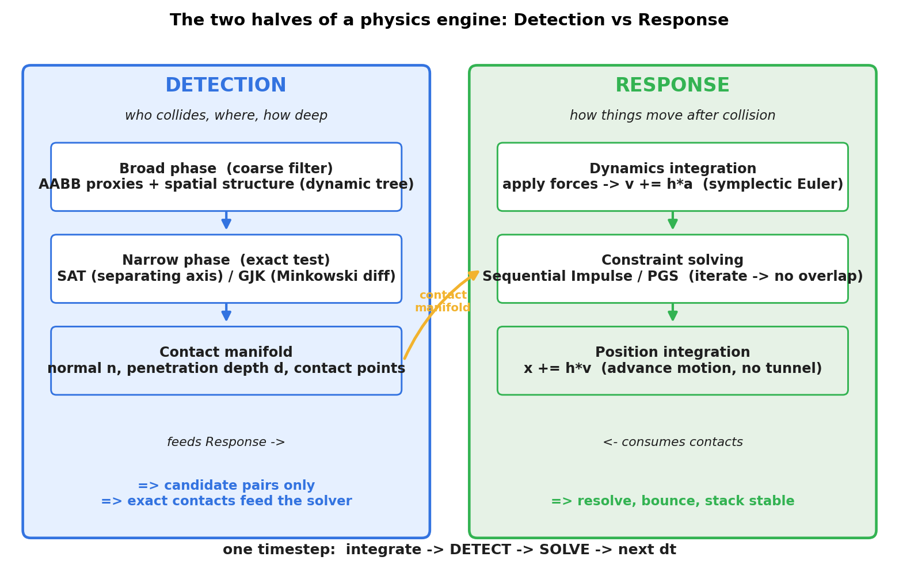
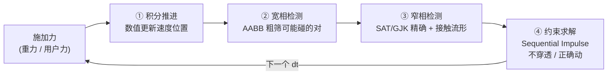
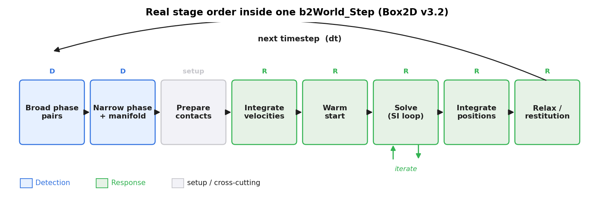
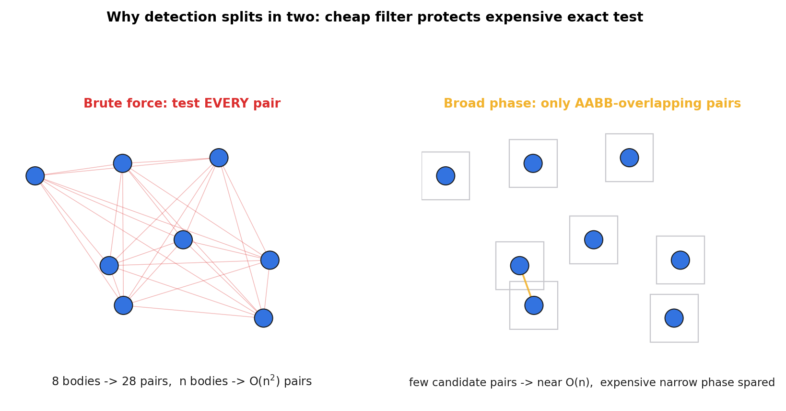

# 第 1 篇 · 第 4 章 · 物理引擎的两半:检测 vs 响应

> **核心问题**:前两章我们一直待在"响应"这一侧——讲清了真实物理是连续的微分方程(F = ma),计算机只能一帧一帧离散地推进,所以运动必须用**数值积分**近似(P1-02 连续→离散、P1-03 为什么数值积分)。可是,光会把物体"推下去"还不够:物体下落时会**碰到**别的东西,你得先知道**谁碰了谁、碰在哪、穿多深**,然后才能让它们不穿透、正确弹开。这就引出物理引擎真正的两半——**检测**(判断谁碰了)和**响应**(碰了怎么动)。本章是第 1 篇的收尾总览章:我们要跳出"响应"这一侧,鸟瞰**一个时间步的完整流程**(积分推进 → 宽相检测 → 窄相检测 → 约束求解),把全书"检测 vs 响应"二分法的**骨架**立起来。从下一章(P2-05)起,我们才真正进入响应侧第一块——刚体动力学。所以,本章是全书的**导航图**:读完它,你该能在脑子里放映出一个时间步从头到尾发生了什么,以及后面每一章在这个流程上的位置。

> **读完本章你会明白**:
> 1. 物理引擎真正的两半是**检测**和**响应**,它们各自又分两层——检测分**宽相(粗筛)**和**窄相(精确)**,响应分**动力学积分**和**约束求解**。这是全书骨架。
> 2. 一个时间步的完整流程:积分推进运动 → 宽相粗筛可能碰的对 → 窄相精确判断相交 + 算接触流形 → 约束求解让物体不穿透、正确动。
> 3. 为什么检测非要分宽相、窄相两步——**用便宜的粗筛保护昂贵的精算**,把 O(n²) 降到近 O(n),这是实时物理的命脉。
> 4. Box2D v3.2 在一个 `b2World_Step` 里到底按什么**阶段顺序**跑这些事(`b2Solve` 的 stage 流水线),源码就是流程的真实对应。
> 5. 后续 15 章每一章分别服务"检测"还是"响应",在时间步流程上的哪个位置——你将带着这张地图读完整本书。

> **如果一读觉得太难**:先只记三件事——① 物理引擎 = 检测(谁碰了)+ 响应(怎么动)两半;② 检测分宽相粗筛 → 窄相精确两步,响应分动力学积分 → 约束求解两层;③ 一个时间步:积分 → 宽相 → 窄相 → 约束求解 → 下一步。三件事记牢,后面每一章都是这个流程上的一环。

---

## 〇、一句话点破

> **物理引擎 = 检测(谁碰了、碰在哪、多深)+ 响应(碰了怎么动、不穿透)。检测分宽相粗筛 → 窄相精确两步,响应分动力学积分 → 约束求解两层。一个时间步就是这四块按固定顺序跑一遍:积分推进 → 宽相粗筛 → 窄相精确 → 约束求解,然后进入下一步。全书 15 章都在讲清楚这四块凭什么存在、原理是什么、源码怎么实现。**

这是结论,本章倒过来拆。我们先把这两半的分工讲清,再走一遍一个时间步的完整流程,最后去 Box2D v3.2 的源码里印证这个流程——你会看到 `b2World_Step` → `b2Solve` 的阶段顺序,和我们这里画的几乎一一对应。

---

## 一、为什么要分两半:一个直观的拆分

### 1.1 只会"推下去"还不够

前两章我们解决的只是"运动怎么推进":物体受重力,每步用数值积分更新速度和位置。这能解释小球为什么往下掉。

可真实场景里,物体不可能永远自由下落——它会**碰到**地面、撞到墙、压在别的箱子上。这时只靠积分就会出大问题:

```
   只有积分, 没有检测/响应:

    ●  小球下落
    │
    │  (积分: 每步位置下移)
    │
    ●  穿进地面! ← 积分不管"地面", 只管算位置
    │
    ●  继续下沉 ← 物体穿透了, 这不"物理"
    │
   ─── 地面 ───
```

积分器只关心"受什么力、怎么变速度位置",它**不知道**世界上还有别的物体。要让小球落地后**停住**或**弹起**,物理引擎还得做两件额外的事:

1. **检测**:小球和地面到底碰没碰?碰在哪个点?穿进去多深?
2. **响应**:碰了之后,把小球的速度/位置**改一改**,让它不穿透、按正确方向弹开。

这两件事,合起来就是物理引擎除"积分推进运动"之外的全部工作。它们天然分成两半——**检测**回答"谁碰了",**响应**回答"怎么动"。

> **钉死这件事**:物理引擎 = 检测 + 响应。**检测**判断碰撞(谁碰了、碰在哪、多深),**响应**处理碰撞(不穿透、正确动)。光会积分(推进运动)远远不够——没有检测,物体互相无视;没有响应,物体互相穿透。这两半是物理引擎除运动推进之外的全部。

### 1.2 两半各自的内部再分两层

光说"检测"和"响应"还太粗。真正动手做时,每一半都再分成两层,原因都是"如果只做一层,代价太大或不够准":



**检测这一面**,分两步:

- **宽相(broad phase)**——**粗筛**。场景里可能有几千个物体,**两两**精确检测是 O(n²),太贵。宽相用便宜的 **AABB 包围盒**(把每个物体包进一个轴对齐方框,只比几个数就知有没有重叠)+ 空间划分(动态 AABB 树 / 网格 / 扫掠剪枝),快速排除绝大多数不可能碰的对,只留下少数"可能碰"的候选对。
- **窄相(narrow phase)**——**精确**。对宽相留下的候选对,用 **SAT**(分离轴)或 **GJK**(闵可夫斯基差)精确判断是否真相交,并算出**接触流形**(contact manifold):接触法线(沿哪个方向弹)、穿透深度(多深)、接触点(碰在哪)。

> **不这样会怎样**:如果只有窄相(对每对物体都直接精确检测),几千个物体每帧要做几百万次 SAT,16 毫秒的帧预算根本不够,游戏直接卡死。宽相先粗筛掉 99% 不可能碰的对,只把 1% 候选交给贵的窄相——这就是"用便宜的粗筛保护昂贵的精算",把复杂度从 O(n²) 降到近 O(n)。本章技巧精解会专门拆它。

**响应这一面**,分两层:

- **动力学积分**——施加力(重力、用户力),用**数值积分**(Box2D 用半隐式欧拉)更新速度和位置。这是前两章讲的内容:让物体"动起来"。
- **约束求解**——对每个接触(以及关节),用 **Sequential Impulse**(顺序冲量法,Erin Catto 的招牌算法)反复迭代修正速度,让物体**不穿透**、按正确方向**弹开**。这是全书最难的部分(第 5 篇),本质是解一个线性互补问题(LCP)。

> **钉死这件事**:检测再分**宽相(粗筛)→ 窄相(精确 + 接触流形)**两步,响应再分**动力学积分 → 约束求解**两层。这四个细分块,就是全书除"积分推进运动"之外的全部主题。任何时候迷路,回到这张全景图:**"我在检测(谁碰了)还是响应(怎么动)?在它的宽相还是窄相、积分还是求解?"**

---

## 二、一个时间步的完整流程

把上面四块按真实的执行顺序串起来,就是一个时间步的完整流程。

### 2.1 四步流程



四步:

- **① 积分推进(响应·动力学)**:对每个醒着的物体,施加力(重力、用户力),用**数值积分**更新它的速度和位置。小球受重力,每步速度向下加一点。这一步让物体"动起来",是前两章的全部内容。
- **② 宽相检测(检测·粗筛)**:场景里几千个物体,**两两精确检测**是 O(n²),太慢。宽相用 AABB 包围盒 + 空间划分,快速排除绝大多数不可能碰的对,只留少数"可能碰"的候选对。决定"哪些对值得仔细看"。
- **③ 窄相检测(检测·精确)**:对宽相留下的候选对,用 SAT 或 GJK 精确判断是否真相交,并算出**接触流形**(法线、穿透深度、接触点)。决定"碰没碰、碰的几何细节"。
- **④ 约束求解(响应·核心)**:对每个接触(以及关节),用 Sequential Impulse 反复迭代,修正速度让物体**不穿透**、按正确方向**弹开**。小球撞地,这一步把它的向下速度变成向上(反弹)。

每 dt 秒(一个时间步)转一圈,物体就"看起来"连续地运动、碰撞、响应了。

### 2.2 跟着"小球落地反弹"走一遍

把前两章的小球拿来,把检测、响应这两半补全,看一个时间步对它干了什么:

- **① 积分**:小球受重力,速度向下加一点,位置向下移一点。
- **② 宽相**:把小球包进一个 AABB 方框,把地面也包进一个 AABB 方框,两个方框一比,**可能碰**(方框重叠)→ 这对(小球, 地面)进入候选。
- **③ 窄相**:对(小球, 地面)这对精确判断——小球是圆,地面是线段,精确算相交,得**接触流形**:法线向上(n = (0, +1))、穿透深度 d、接触点在小球底部。
- **④ 约束求解**:小球正向下穿入地面(向下速度 v = (0, -10))。约束求解器沿接触法线(向上)施加一个**冲量**,把向下速度变成向上(v = (0, +8),乘以恢复系数 0.8 模拟非完全弹性)。小球弹起。

然后下一个 dt,小球上升、减速、到顶、又下落……循环。**这就是物理引擎对"小球落地反弹"一个时间步的完整处理**,四步缺一不可。

> **钉死这件事**:一个时间步 = 积分 → 宽相 → 窄相 → 约束求解,四步按固定顺序跑一遍,然后进入下一个 dt。任何一步缺失都会"不物理":没有积分物体不动;没有宽相/窄相物体互相无视(碰了也不知道);没有约束求解物体互相穿透。全书后面 15 章,就是把这四步每一块讲透。

### 2.3 这四步在时间轴上是什么样

值得注意一个细节:**积分和约束求解都是"响应",但它们被检测隔开了**。真实的顺序不是"先响应完再检测",而是:

```
   一个 dt 内的真实顺序:

   [响应:积分]  →  [检测:宽相+窄相]  →  [响应:约束求解]  →  下一个 dt
        ↑                  ↑                      ↑
     让物体动起来     发现谁碰了            让碰了的别穿透/弹开
```

也就是说,**检测夹在两段响应中间**:先积分把物体推到新位置(可能推得过头,造成穿透),再检测发现这些穿透,最后约束求解把穿透消除掉。这个"先推过头再拉回来"的节奏,是物理引擎一个时间步的内在节拍。后面看 Box2D 源码时,你会看到这个顺序精确地体现在 `b2Solve` 的阶段(stage)流水线里。

---

## 三、检测这一面:宽相 → 窄相,为什么要分两步

本节是本章的重点之一(也是后续第 3、4 篇的引子)。我们要回答一个关键问题:**为什么检测非要分宽相、窄相两步,不直接精确检测每对?**

### 3.1 朴素做法:暴力两两精确检测

最朴素的检测办法是:**对每一对物体,直接做精确相交判断**。场景里有 n 个物体,就有 n(n-1)/2 对。对每一对,用精确算法(SAT 或 GJK)算相交。

```
   暴力两两精确检测:

   物体  ─精确检测─>  物体 0
     0   ─精确检测─>  物体 2
         ─精确检测─>  物体 3
         ─ ...        (n-1 对)
     1   ─精确检测─>  物体 2
         ─ ...
         ...
   共 n(n-1)/2 对, 每对一次精确(SAT/GJK)
```

> **不这样会怎样**:这个做法在 n 小时(几个物体)没问题。可物理引擎场景常常有几百几千个物体——n = 1000 时,每帧要做约 50 万次精确检测;每次精确检测(SAT 要对每条边投影、GJK 要迭代)都不便宜。16 毫秒(60Hz 一帧)的预算根本撑不住,游戏卡死。

### 3.2 关键观察:绝大多数物体对根本碰不着

暴力两两的浪费在哪?在于**它对每一对都付出精确检测的代价,可绝大多数物体对根本不可能碰**——它们隔得老远。

想象一个游戏关卡:几百个物体散布在大地图各处。任何一瞬间,每个物体只可能和它**附近**的少数物体碰,和远处那几百个完全不碰。可暴力两两不知道"谁在附近",无差别地对所有对做精确检测——绝大部分算力浪费在"隔了半个地图的两个物体当然不碰"上。

> **所以这样设计**:先做一次**便宜的粗筛**,把"绝对不可能碰"的对(它们连包围盒都不重叠)排除掉,只把"可能碰"的少数候选对交给精确的窄相。便宜粗筛用 **AABB 包围盒**:把每个物体包进一个轴对齐的方框,两个方框重不重叠只需要比几次大小(极便宜),远比精确检测(SAT/GJK)便宜得多。

### 3.3 宽相:AABB 粗筛 + 空间划分

宽相(broad phase)做的事:**用便宜的 AABB 包围盒,从海量物体对里粗筛出少数可能碰的候选对**。

- **AABB 包围盒**:给每个物体算一个**轴对齐包围盒**(axis-aligned bounding box)——一个边和坐标轴平行的最小方框,正好把物体包住。两个 AABB 相不相交,只要在每个坐标轴上比 lower/upper 边界(2D 比 x、y 两轴),全部重叠才算相交。比精确相交检测便宜几个数量级。
- **空间划分**:即使 AABB 相交判断很便宜,n² 对还是太多。宽相再用**空间划分**数据结构(动态 AABB 树 / 均匀网格 / 扫掠剪枝),只对**空间上邻近**的物体做 AABB 配对,把配对本身也降到近 O(n)。Box2D v3 用的是**动态 AABB 树**(每种物体类型一棵,后面第 3 篇专讲)。

宽相的输出是一份**候选对列表**(candidate pairs):这些对"可能碰",但宽相不保证一定碰——因为 AABB 是粗略的包围盒,两个物体的 AABB 重叠了,物体本身可能没碰(AABB 比物体大)。要不要进一步确认,是窄相的活。

### 3.4 窄相:精确判断 + 接触流形

窄相(narrow phase)做的事:**对宽相留下的候选对,精确判断是否真相交,并算出接触的几何细节**。

- **精确相交判断**:用 **SAT**(分离轴定理:两个凸形状,如果存在一条轴把它们投影分开,就不相交)或 **GJK**(闵可夫斯基差 + 单纯形迭代)精确判断两个形状到底碰没碰。这步比 AABB 贵得多,但因为只对少数候选对做,总代价可控。
- **接触流形(contact manifold)**:如果相交,还要算出碰撞的几何细节——**接触法线**(normal,沿哪个方向弹)、**穿透深度**(penetration depth,穿多深)、**接触点**(contact points,碰在哪)。这些几何量是约束求解的输入:约束求解器要沿法线施加冲量、按穿透深度做位置修正。

窄相的输出是一组**接触**(contacts),每个接触带法线、深度、接触点。这些接触喂给下一步——约束求解。

> **钉死这件事**:检测 = 宽相(便宜 AABB 粗筛,从 n² 降到近 n 个候选对)→ 窄相(精确 SAT/GJK 判相交 + 算接触流形)。两步分工的本质是**精确性的分层**:用便宜的粗筛先排除绝大部分不可能碰的,只把少数候选交给昂贵的精算。这是实时物理的命脉——没有宽相,几千个物体每帧做几百万次精确检测,根本跑不动。

---

## 四、响应这一面:动力学积分 → 约束求解

响应这一面的两层,前两章和后续第 2、5 篇会分别深讲,这里只做骨架交代(承接铁律:不重复)。

### 4.1 动力学积分:让物体动起来

**动力学积分**做的事:施加力(重力、用户力),用**数值积分**更新速度和位置。这是前两章的全部内容:

- 真实物理是连续的(F = ma 是微分方程),计算机每帧离散推进(P1-02)。
- 大多数运动方程解不出解析解,只能数值积分近似(P1-03,承《数学分析》数值方法)。
- Box2D 用**半隐式欧拉**(symplectic Euler):先用加速度更新速度、再用新速度更新位置。这个积分器**保能量、稳定**,不像显式欧拉会能量发散爆炸(P2-06~07 会逐个拆透)。

动力学积分让物体"动起来"——小球下落、箱子受推力滑动。但它不管碰撞:积分器只看力,不看世界上别的物体。碰撞由约束求解处理。

> **承接前两章**:动力学积分的"为什么"(连续→离散、为什么数值积分)前两章已讲透,这里一句带过。本章只把它放进时间步流程,标明它是响应的第一层。积分器的稳定性(为什么半隐式欧拉保能量)是第 2 篇招牌(P2-06~07)。

### 4.2 约束求解:让碰了的别穿透、正确动

**约束求解**做的事:对每个接触(以及关节),用 **Sequential Impulse** 反复迭代,修正速度让物体**不穿透**、按正确方向**弹开**。

单个接触好理解:小球向下穿入地面,求解器沿接触法线(向上)施加一个**冲量**(impulse,瞬间的速度变化),把向下速度变成向上,小球弹起。

可真实场景是**多个约束同时存在**:一堆箱子互相挤压、一个物体多个接触点、还有关节(铰链、距离)连着别的物体。这时约束求解器要**同时满足所有约束**,光对单个接触施冲量不够——修好这个可能违反那个。**Sequential Impulse**(顺序冲量法 / PGS)就是为此而生:多轮迭代,每轮依次修正每个违反的约束,多轮后收敛到所有约束都大致满足。这是物理引擎最难的部分(本质是解一个线性互补问题 LCP),第 5 篇专攻(P5-15~16)。

> **钉死这件事**:响应 = 动力学积分(让物体动起来)+ 约束求解(让碰了的别穿透、正确动)。约束求解用 Sequential Impulse 反复迭代收敛,本质是解 LCP——全书最难,第 5 篇招牌。本章只把它放进时间步流程,标明它是响应的第二层。

---

## 五、源码印证:`b2World_Step` 的真实阶段顺序

讲完概念流程,我们去 Box2D v3.2 的源码里印证一下——看一个真实的物理引擎,是不是真的按"积分 → 宽相 → 窄相 → 约束求解"这个顺序跑。结论是:**几乎是,但比概念流程更细**,而且 v3.2 加了一些真实工程里才有的阶段(子步进、warm start、relax)。这一节既是流程的源码印证,也是诚实标注 v3.2 演进的机会。

### 5.1 入口:`b2World_Step`

用户调一次 `b2World_Step(worldId, timeStep, subStepCount)`,物理引擎就推进一个时间步。入口在 [src/physics_world.c:828](../box2d/src/physics_world.c#L828):

```c
// (摘自 Box2D v3.2.0 src/physics_world.c, 简化展示关键行)
void b2World_Step( b2WorldId worldId, float timeStep, int subStepCount )
{
    b2World* world = b2GetWorldFromId( worldId );
    // ... 清空事件缓冲、记录 profile ...

    // ① 更新碰撞配对 = 宽相 + 窄相(检测这一面在这里发生)
    b2UpdateBroadPhasePairs( world );                    // physics_world.c:886

    b2StepContext context = { 0 };
    context.dt = timeStep;
    context.subStepCount = b2MaxInt( 1, subStepCount );
    if ( timeStep > 0.0f )
    {
        context.inv_dt = 1.0f / timeStep;
        context.h = timeStep / context.subStepCount;     // 子步步长! physics_world.c:898
        context.inv_h = context.subStepCount * context.inv_dt;
    }
    // ... 软约束参数(contactSoftness / staticSoftness, 用 hertz + 阻尼比)...

    b2Solve( world, &context );                          // physics_world.c -> solver.c:1272
}
```

几个要点:

- **检测在 `b2World_Step` 一开头就做了**:`b2UpdateBroadPhasePairs(world)`([src/physics_world.c:886](../box2d/src/physics_world.c#L886),实现在 [src/broad_phase.c:412](../box2d/src/broad_phase.c#L412))把宽相(动态 AABB 树配对)+ 窄相(精确相交 + 创建 contact)一口气做完。这是检测这一面在源码里的位置。
- **★子步进(subStepCount)**:用户传一个大 `timeStep`(如 1/60),内部真正积分用的步长是 `h = timeStep / subStepCount`([physics_world.c:898](../box2d/src/physics_world.c#L898))。比如 `subStepCount=4`,就把一个大步切成 4 个 h 子步,每个子步跑一遍约束求解迭代。这是 v3.2 的**子步进软约束求解器**,概念上的"固定 dt"在源码层是"一个大步切成 N 个 h 子步"。后面会看到,约束求解阶段是被这个子步循环包起来的。
- 之后调用 `b2Solve(world, &context)`([src/solver.c:1272](../box2d/src/solver.c#L1272)),响应这一面(积分 + 约束求解)在里面发生。

> **承接铁律**:固定时间步长的"为什么稳定"是《游戏引擎》P3-10 讲过的,这里一句带过。本章只点明 v3.2 的子步进把大步切小步这个真实工程细节,稳定性本身留到 P2-08。

### 5.2 `b2Solve` 的阶段流水线

`b2Solve(world, stepContext)`([src/solver.c:1272](../box2d/src/solver.c#L1272))是响应这一面的核心。它把一个时间步切成一连串**阶段(stage)**,每个阶段做一类事,阶段之间有严格顺序。阶段类型定义在 [src/solver.h:75](../box2d/src/solver.h#L75):

```c
// (摘自 Box2D v3.2.0 src/solver.h, 真实枚举)
typedef enum b2SolverStageType
{
    b2_stagePrepareJoints,
    b2_stagePrepareContacts,         // 准备接触约束: 算 effective mass / bias / softness
    b2_stageIntegrateVelocities,     // ① 积分速度: v += h*a  (symplectic Euler!)
    b2_stageWarmStart,               // warm start: 用上一步累积冲量当初值
    b2_stageSolve,                   // ② Sequential Impulse 主体(迭代)
    b2_stageIntegratePositions,      // ③ 积分位置: x += h*v
    b2_stageRelax,                   // 软约束松弛(TGS 风味)
    b2_stageRestitution,             // 恢复系数(反弹)
    b2_stageStoreImpulses            // 存累积冲量供下一步 warm start
} b2SolverStageType;
```

执行顺序在 [src/solver.c:1039](../box2d/src/solver.c#L1039) 的注释里写得很清楚(源码用注释列出了 stage sequence),主循环按这个顺序在 `b2SolverTask`([solver.c:1007](../box2d/src/solver.c#L1007))里逐阶段推进:

```
   b2Solve 的阶段顺序(一个子步内):

   PrepareJoints / PrepareContacts   ← 准备: 把接触/关节算成"约束"(effective mass 等)
            ↓
   IntegrateVelocities               ← 响应·积分: v += h*a  (symplectic Euler)
            ↓
   WarmStart                         ← 用上一步冲量当初值, 加速收敛
            ↓
   ┌─> Solve  (Sequential Impulse)   ← 响应·约束求解: 迭代修正速度, 不穿透
   │      ↓
   └── iterate (subStepCount 轮)      ← 子步循环把一个大步切 N 份反复求解
            ↓
   IntegratePositions                ← 响应·积分: x += h*v  (推进位置)
            ↓
   Relax / Restitution / StoreImpulses ← 软约束松弛 + 反弹 + 存冲量
```



把这个真实顺序和我们本章的概念流程对照:

| 概念流程 | Box2D v3.2 真实阶段 | 源码位置 |
|---|---|---|
| (检测·宽相+窄相) | `b2UpdateBroadPhasePairs` | physics_world.c:886 |
| (准备约束) | `PrepareJoints` / `PrepareContacts` | solver.h:77-78 |
| **响应·动力学积分(速度)** | `IntegrateVelocities` | solver.h:79, solver.c:66 |
| (warm start,加速收敛) | `WarmStart` | solver.h:80 |
| **响应·约束求解** | `Solve`(Sequential Impulse,迭代) | solver.h:81 |
| **响应·动力学积分(位置)** | `IntegratePositions` | solver.h:82, solver.c:114 |
| (软约束松弛 + 反弹) | `Relax` / `Restitution` | solver.h:83-84 |

可以看到,**概念流程"积分 → 检测 → 约束求解"在源码里是真实存在的**,只是:

1. **检测在 `b2Solve` 之前**(`b2UpdateBroadPhasePairs` 在 `b2World_Step` 开头),不在 `b2Solve` 里——这和概念图把检测画在中间一致(检测夹在两段响应之间,只是源码里"第一段响应·积分"挪到了 `b2Solve` 内部、检测之后)。
2. **积分被拆成两段**:`IntegrateVelocities`(先用加速度更新速度)在前,`IntegratePositions`(再用新速度更新位置)在约束求解**之后**。这正是半隐式欧拉的精髓——先用 a 算 v、再用新 v 算 x,中间夹着约束求解修正 v。
3. **★v3.2 多了 warm start、relax、restitution 等真实工程阶段**:这些是 v3.2 相比早期 v3 的演进——warm start 用上一步冲量当初值加速收敛、relax 做软约束松弛避免堆叠抖动、restitution 处理反弹。概念上它们都属于"约束求解"这块的工程优化,本书第 5 篇会逐一讲透。

### 5.3 半隐式欧拉的源码铁证

我们说 Box2D 用半隐式欧拉,源码怎么证?看 `b2IntegrateVelocitiesTask`([src/solver.c:66](../box2d/src/solver.c#L66)):

```c
// (摘自 Box2D v3.2.0 src/solver.c:100-108, 真实源码)
// lvd = h * im * f + h * g
b2Vec2 linearVelocityDelta = b2Add( b2MulSV( h * sim->invMass, sim->force ),
                                    b2MulSV( h * gravityScale, gravity ) );
float angularVelocityDelta = h * sim->invInertia * sim->torque;

v = b2MulAdd( linearVelocityDelta, linearDamping, v );   // v_new = lvd + damping * v_old
w = angularVelocityDelta + angularDamping * w;
state->linearVelocity = v;                               // 先更新速度
state->angularVelocity = w;
```

这就是"先用加速度更新速度"。再看 `b2IntegratePositionsTask`([solver.c:114](../box2d/src/solver.c#L114)):

```c
// (摘自 Box2D v3.2.0 src/solver.c:157-158, 真实源码)
state->deltaPosition = b2MulAdd( state->deltaPosition, h, state->linearVelocity );  // x += h * v_new
state->deltaRotation = b2IntegrateRotation( state->deltaRotation, h * state->angularVelocity );
```

这是"再用**新**速度更新位置"。两段合起来就是**半隐式欧拉**(又称 symplectic Euler):先用 a 更新 v、再用新 v 更新 x。注意位置积分在 `Solve`(约束求解)之后——也就是说,约束求解先修正了速度(让物体不穿透),修正后的速度才用来推进位置。这就是为什么物体不会穿透:位置是用"已经被约束修正过的、不穿透的速度"推的。

> **钉死这件事**:概念流程"积分 → 检测 → 约束求解"在 Box2D v3.2 源码里是真实的——`b2World_Step` 先做检测(`b2UpdateBroadPhasePairs`),再进 `b2Solve` 跑响应(PrepareContacts → IntegrateVelocities → WarmStart → Solve → IntegratePositions → Relax → Restitution)。积分被拆成速度积分(约束求解前)和位置积分(约束求解后),中间夹着 Sequential Impulse 修正速度——这就是半隐式欧拉 + 约束求解配合的真实节拍。★诚实标注:v3.2 还多了 warm start / relax / restitution 这些早期 v3 没有的工程阶段,概念上它们都属于"约束求解"这块的优化,第 5 篇详讲。

---

## 六、源码细节锚点(给后续章节埋线)

本章是总览,不深挖每块源码(那是后续各篇的活),但把几处关键源码位置钉死,给后续章节埋线(也修正一处老印象):

- **检测·宽相**:`b2UpdateBroadPhasePairs`([broad_phase.c:412](../box2d/src/broad_phase.c#L412))→ 内部 `b2FindPairsTask`(broad_phase.c:333)。★`b2BroadPhase` 结构里有 `b2DynamicTree trees[b2_bodyTypeCount]`([broad_phase.h:29](../box2d/src/broad_phase.h#L29))——**每种物体类型(static/kinematic/dynamic)各维护一棵动态树**,不是单一一棵树。第 3 篇(P3-09~11)详讲。
- **检测·窄相**:不是独立的 `b2SAT()` 函数,而是融在每个 `b2CollideXxx` 里(找"最小分离边/轴"),在 [src/manifold.c](../box2d/src/manifold.c)(如 `b2CollideCircles`:36、`b2CollidePolygonAndCircle`:127、"Find the min separating edge" @138)。第 4 篇(P4-12~14)详讲。
- **响应·动力学积分**:`b2IntegrateVelocitiesTask`(solver.c:66)、`b2IntegratePositionsTask`(solver.c:114),半隐式欧拉。第 2 篇(P2-06~07)详讲。
- **响应·约束求解**:`b2Solve`(solver.c:1272)的 stage 流水线,Sequential Impulse 用约束图着色并行化(`src/constraint_graph.c`)。第 5 篇(P5-15~16)详讲。
- **★v3.2 演进诚实标注**:总纲/老资料说"Box2D 用 Sequential Impulse / PGS",这是**算法概念主线**(对的,Erin Catto 的 Sequential Impulse 就是这个算法的祖师)。但 v3.2 的**真实实现**是"分阶段(stage)+ 约束图着色并行 + warm start + soft constraint + speculative contacts"——把 SI 用约束图着色并行化了、加了子步进软约束(TGS 风味)。两者不矛盾:SI 是算法,v3.2 是它的高性能工程化。第 5 篇讲透 SI 概念后,会展示 v3.2 的真实并行实现。

---

## 七、技巧精解:为什么检测分宽相窄相两步

本章最值得单独拆透的技巧,是**检测为什么分宽相、窄相两步**。它是"分层思想"在物理引擎里的经典体现,后面第 3、4 篇整篇都在讲这两步,这里先把"为什么非要分两步"讲清。

### 7.1 朴素做法:暴力两两 SAT

假设我们不要宽相,直接对每对物体做精确检测(SAT)。n 个物体,n(n-1)/2 对,每对一次 SAT。看图:



左图是暴力两两:8 个物体两两配对就有 28 条连线(每条是一次精确检测)。n = 1000 时,这个数是约 50 万——每帧 50 万次 SAT,16 毫秒预算根本不够。

问题不在 SAT 本身太慢(SAT 单次并不慢),问题在**绝大多数配对根本不可能碰**:隔了半个地图的两个物体,当然不碰,可暴力两两不知道"谁离谁近",无差别地对所有对做精确检测,绝大部分算力浪费在"显然不碰"的对上。

### 7.2 宽相的妙处:便宜粗筛 + 空间划分

宽相做了两件事,把"显然不碰"的对在精确检测之前就排除掉:

1. **AABB 包围盒做便宜相交判断**:给每个物体算一个轴对齐包围盒,两个包围盒重不重叠只需比几次大小(2D 比 x、y 两轴的 lower/upper),比 SAT(要对每条边投影)便宜几个数量级。AABB 重叠 ≠ 物体相交(包围盒比物体大),但 **AABB 不重叠 ⇒ 物体一定不相交**——这个单向的排除性质,正是粗筛的依据:凡 AABB 不重叠的对,直接排除,不用进窄相。
2. **空间划分避免 n² 配对**:即使 AABB 相交判断很便宜,n² 对还是太多。宽相再用空间划分数据结构(Box2D 用动态 AABB 树),只对**空间上邻近**的物体做 AABB 配对,把配对本身降到近 O(n)。

右图就是宽相的效果:同样 8 个物体,粗筛后只剩少数 AABB 重叠的候选对(琥珀色连线),这些才送窄相精确检测。绝大多数"显然不碰"的对在宽相就被排除了。

### 7.3 为什么妙:精确性的分层

宽相 + 窄相的本质,是**精确性的分层**:

- 宽相用**便宜的、保守的**(可能误报"碰"、但绝不漏报)AABB 粗筛,把候选对从 n² 降到近 n。
- 窄相用**昂贵的、精确的** SAT/GJK,只对候选对做,算出真相交 + 接触流形。

这种"用便宜的粗筛保护昂贵的精算"的分层思想,在工程里到处都是:

- **数据库**:索引先粗筛(走 B+ 树定位少量候选行)再回表(精确读行)。先粗筛后精算,避免全表扫描。
- **渲染管线**:视锥剔除(粗筛谁在视锥外,不画)→ 遮挡剔除(精确判断被挡住)→ 光栅化(精确着色)。先粗后精。
- **编译器**:词法分析(粗筛 token)→ 语法分析(精确结构)→ 语义分析。先粗后精。
- **物理引擎**:宽相(AABB 粗筛)→ 窄相(SAT/GJK 精确)。同一种智慧。

> **钉死这件事**:检测分宽相、窄相两步,本质是**精确性的分层**——用便宜的粗筛(AABB,保守不漏报)先把绝大多数不可能碰的排除,只把少数候选交给昂贵的精算(SAT/GJK)。这把检测从 O(n²) 降到近 O(n),是实时物理的命脉。没有宽相,几千个物体每帧做几百万次精确检测,游戏卡死。这种"先粗筛后精算"的分层思想,和数据库索引、渲染视锥剔除、编译器多遍分析是同一种工程智慧。

### 7.4 反面:只有窄相会怎样

把反面再钉死一次:如果只有窄相(对每对物体直接 SAT),n = 1000 的场景每帧约 50 万次 SAT。假设每次 SAT 花 1 微秒(乐观),光检测就 500 毫秒一帧——而一帧预算只有 16 毫秒(60Hz)。游戏直接卡成幻灯片。宽相把候选对降到几百个(近 O(n)),窄相只做几百次 SAT,几毫秒搞定——这才是实时物理能跑起来的原因。

---

## 八、全书地图:后续每章在流程的哪里

本章是全书导航图。把后续 15 章在时间步流程上的位置标出来,你读后面每一章时都知道自己在哪:

| 章 | 主题 | 服务哪一面 | 在时间步流程的位置 |
|---|---|---|---|
| P2-05 | 刚体动力学:质量、惯性、力矩 | 响应 | 积分这一步的物理量基础 |
| P2-06 | 显式欧拉及其不稳定 | 响应(招牌) | 积分器:为什么不能选它 |
| P2-07 | 半隐式欧拉与 Verlet | 响应(招牌) | 积分器:Box2D 用的稳定积分 |
| P2-08 | 固定步长与稳定性 | 响应 | dt 本身怎么选 |
| P3-09 | AABB:轴对齐包围盒 | 检测 | 宽相的包围盒 |
| P3-10 | 宽相:空间划分 | 检测(招牌) | 宽相的配对策略 |
| P3-11 | 动态 AABB 树 | 检测(招牌) | 宽相的数据结构(Box2D 实现) |
| P4-12 | SAT:分离轴定理 | 检测(招牌) | 窄相的精确判断 |
| P4-13 | GJK 与闵可夫斯基差 | 检测(招牌) | 窄相的精确判断 |
| P4-14 | 接触流形:法线、穿透、接触点 | 检测 | 窄相的输出(喂给约束求解) |
| P5-15 | 冲量法碰撞响应 | 响应(招牌) | 约束求解的基础(单接触) |
| P5-16 | Sequential Impulse 约束求解 | 响应(招牌) | 约束求解主体(多约束迭代,Box2D 实现) |
| P5-17 | 关节约束 | 响应 | 约束求解(关节也是约束) |
| P5-18 | 休眠、连续碰撞 CCD 与稳定性 | 横切 | 跨整个流程(休眠省算力、CCD 防穿透) |
| P6-19 | 全书收束 | 总览 | 把四块串成全景 |

读完本书,你该能在脑子里放映出一个时间步从头到尾的发生过程,并讲清每一步**为什么必须存在、原理是什么、源码怎么实现**。

---

## 九、章末小结

### 回扣主线

本章是第 1 篇的收尾总览章,立起全书骨架:物理引擎 = **检测**(谁碰了、碰在哪、多深)+ **响应**(碰了怎么动、不穿透)。检测分**宽相粗筛 → 窄相精确 + 接触流形**两步,响应分**动力学积分 → 约束求解**两层。一个时间步的完整流程:积分推进 → 宽相粗筛 → 窄相精确 → 约束求解,然后进入下一个 dt。我们用 Box2D v3.2 的 `b2World_Step` → `b2Solve` 源码印证了这个流程(检测在前、响应在后,积分被拆成速度积分和位置积分夹着约束求解),并诚实标注了 v3.2 相比早期 v3 多出的 warm start / relax / restitution 等工程阶段。前两章我们一直在响应侧(积分),本章跳出响应侧鸟瞰全局,后续 15 章分别把这四块讲透。

### 五个为什么

1. **物理引擎为什么要分检测和响应两半?**——积分只管"受什么力、怎么动",不管世界上别的物体。没有检测,物体互相无视;没有响应,物体互相穿透。检测回答"谁碰了",响应回答"怎么动",两半缺一不可。
2. **检测为什么分宽相、窄相两步?**——窄相精确(SAT/GJK)但 O(n²) 贵,几千个物体每帧做几百万次太慢。宽相用便宜的 AABB 粗筛先排除绝大部分不可能碰的,只把少数候选交给窄相,把复杂度降到近 O(n)。本质是"用便宜的粗筛保护昂贵的精算"的分层思想。
3. **响应为什么分动力学积分和约束求解两层?**——动力学积分让物体动起来(施加力、更新速度位置),但它不管碰撞。约束求解处理碰撞(沿接触法线施冲量,让物体不穿透、正确弹开)。两层分工:一个管运动,一个管碰撞约束。
4. **一个时间步的真实顺序是什么?**——积分(响应)→ 宽相+窄相(检测)→ 约束求解(响应),然后下一个 dt。检测夹在两段响应中间:先积分把物体推到新位置(可能推过头造成穿透),再检测发现穿透,最后约束求解消除穿透。
5. **Box2D v3.2 源码里这个流程怎么体现?**——`b2World_Step` 先调 `b2UpdateBroadPhasePairs`(宽相+窄相,检测),再调 `b2Solve` 跑响应:PrepareContacts → IntegrateVelocities(速度积分)→ WarmStart → Solve(Sequential Impulse)→ IntegratePositions(位置积分)→ Relax/Restitution。积分被拆成速度积分(约束求解前)和位置积分(约束求解后),中间夹着 Sequential Impulse 修正速度——这就是半隐式欧拉 + 约束求解配合的真实节拍。★v3.2 还多了 warm start / relax / restitution 等工程阶段。

### 想继续深入往哪钻

- **想搞懂响应侧第一块(刚体动力学)**:下一章 P2-05,讲质量、惯性张量、力与力矩——积分这一步的物理量基础。
- **想搞懂积分器为什么稳定/爆炸**:P2-06(显式欧拉发散)→ P2-07(半隐式欧拉/Verlet 稳定),承《数学分析》数值稳定性。
- **想搞懂宽相怎么粗筛**:第 3 篇 P3-09(AABB)→ P3-10(空间划分)→ P3-11(动态 AABB 树,Box2D 实现)。
- **想搞懂窄相怎么精确判断**:第 4 篇 P4-12(SAT,承《线性代数》投影)→ P4-13(GJK,承凸集)→ P4-14(接触流形)。
- **想搞懂堆叠为什么不穿透(最难)**:第 5 篇 P5-15(冲量)→ P5-16(Sequential Impulse/PGS,Box2D 招牌)。
- **想亲手跑通一个时间步**:附录 B"用 Box2D v3 搭堆叠箱子"。

### 引出下一章

第 1 篇到此收尾:我们鸟瞰了物理引擎全貌——检测 vs 响应二分、一个时间步的完整流程、为什么检测分宽相窄相、为什么响应分积分和约束求解。从下一章起,我们正式进入**响应侧**的第一块:**刚体动力学**。前两章我们说"数值积分更新速度位置",可"速度""加速度""质量""力矩"这些物理量在物理引擎里到底怎么表示?刚体的转动(角速度、惯性张量)和平动(线速度、质量)怎么统一?下一章 P2-05,**刚体动力学:质量、惯性、力矩**,我们从牛顿 F = ma 出发,把刚体运动的物理量讲清,为后面所有积分器章节打好物理地基。

> **下一章**:[P2-05 · 刚体动力学:质量、惯性、力矩](P2-05-刚体动力学-质量惯性力矩.md)
