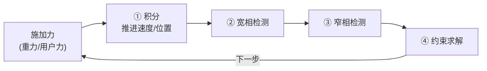
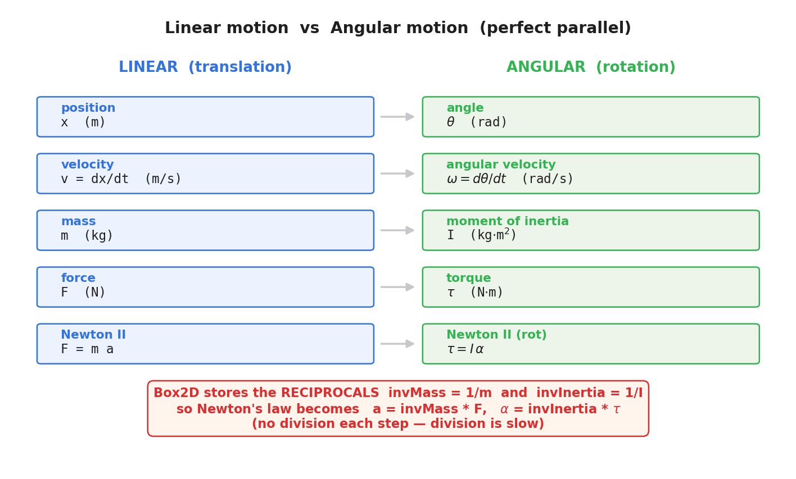
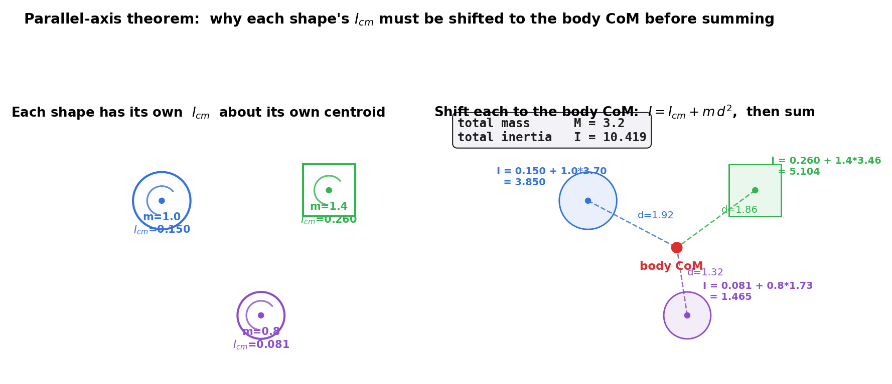
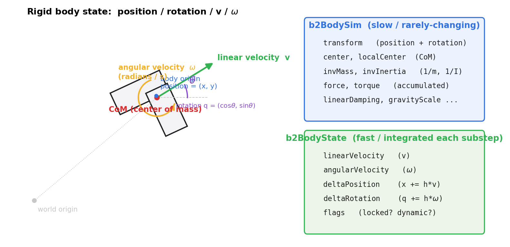

# 第 2 篇 · 第 5 章 · 刚体动力学:质量、惯性、力矩

> **核心问题**:上一章(P1-04)我们鸟瞰了一个时间步的完整流程——积分推进运动 → 宽相检测 → 窄相检测 → 约束求解。可这个流程要"推进"的到底是什么?换句话说:**一个刚体(rigid body),到底由哪些物理量描述?物理引擎每一步要对哪些量做积分?** 这一章不碰积分算法本身(那是 P2-06~08 的事),先把"被积分的对象"定义清楚:位置、速度、加速度,质量(mass),转动惯量(moment of inertia),力(force)与力矩(torque)。这是响应侧(动力学)的地基——后面所有积分、所有约束求解,操作的都是这一章定义的状态量。本章还是全篇第一处真正贴上 Box2D 源码的地方,我们会钻进 `body.c`,看 Erin Catto 怎么从你给的一堆 shape 算出整刚体的质量、质心、转动惯量。

> **读完本章你会明白**:
> 1. 一个 2D 刚体由哪些状态量描述:位置、朝向、线速度、角速度,以及质量、转动惯量、力、力矩——平动量(linear)和转动量(angular)成对出现,完全对称。
> 2. 为什么物理引擎要存**倒数**(inverse mass `invMass = 1/m`、inverse inertia `invInertia = 1/I`),而不是直接存质量和转动惯量。
> 3. 一个由多个 shape 拼成的复合刚体,它的总质量、总质心、总转动惯量是怎么算出来的——为什么各 shape 的转动惯量**必须先用平行轴定理平移到整刚体质心,再相加**,直接相加是错的。
> 4. 力和力矩怎么累加到一个刚体上(`ApplyForce` / `ApplyTorque`),力矩为什么是"力作用点到质心"的叉积 `r × F`。
> 5. Box2D v3.2 把刚体状态拆成 `b2BodySim`(慢变量:位置、质量、力)和 `b2BodyState`(快变量:速度、增量)两个结构体——这不是写法洁癖,是并行求解架构的产物。

> **如果一读觉得太多物理**:先只记三件事——① 刚体状态 = 位置/朝向/线速度/角速度 + 质量/转动惯量 + 力/力矩,平动和转动一一对应;② 物理引擎存倒数 `invMass`/`invInertia` 是为了把"除法"提前到创建时做一次,积分时只做乘法;③ 多 shape 的总转动惯量靠平行轴定理 `I = I_cm + m·d²` 累加。源码细节可以先跳过,下一章起积分才是主线。

---

## 〇、一句话点破

> **刚体的运动,平动量和转动量完全对称:位移↔角度、速度↔角速度、质量↔转动惯量、力↔力矩、F=ma↔τ=Iα。物理引擎的活,就是每一步用力和力矩,通过这两条牛顿第二定律,把速度和角速度推进一步,再用速度更新位置和朝向。而质量、转动惯量这两个"对运动的抵抗力",被预先算成倒数(invMass / invInertia)存起来,让每步的牛顿定律变成一次乘法而不是除法。**

这是结论。本章倒过来拆:先讲清每个量是什么、为什么需要它,再用 Box2D 的真实源码佐证。

---

## 一、从上一章接过来:积分要推进的到底是什么

上一章 P1-04,我们看清了一个时间步的完整流程:



可第①步"积分推进速度/位置",推进的到底是什么?一个朴素的想法:物体有位置 `(x, y)`,有速度 `(vx, vy)`,每步 `x += vx·dt` 不就完了?

这只描述了**平动**(translation)。真实世界里的物体还会**转动**(rotation)——一个落下的箱子会翻滚、一个被踢中的车轮会旋转。要描述转动,光有位置和线速度不够,还得有朝向和角速度。而要让转动服从物理(不是随心所欲地转),还得有"对转动的抵抗力"——这就是转动惯量,以及驱使它转动的力矩。

所以一个完整的 2D 刚体状态,远不止 `x, y, vx, vy` 这四个数。本章的任务,就是把这全套状态量定义清楚,并讲清它们之间的物理关系。这些量定下来,后面 P2-06~08 的积分器才有"被积分的对象",P5 篇的约束求解器才有"施加冲量改变的对象"。

> **钉死这件事**:刚体的运动分**平动**(translation)和**转动**(rotation)两套,二者**完全对称**,每一个平动量都有一个转动量与之对应。理解了这套对称,刚体动力学就懂了一半。

### 1.1 一个关键澄清:刚体(rigid body)是什么

顺便澄清一个贯穿全书的概念——**刚体**(rigid body)。物理引擎里,刚体是一个**理想化**的物体:它由无数质点组成,但这些质点之间的距离**永远不变**(刚性)。无论你怎么推、怎么撞、怎么转,刚体本身不会变形、不会断裂。

真实世界里没有真正的刚体(任何东西受力都会形变,哪怕微小),但刚体是个极好的近似:石头、箱子、台球这些东西,在常见受力下形变可以忽略,用刚体模拟既准确又高效。物理引擎用刚体模型,省掉了"计算物体内部形变"这一大坨开销(那是软体物理 soft body / 有限元 FEM 的领域,复杂得多)。

刚体的"刚性"有一个重要数学后果:既然内部点之间距离不变,那么**描述一个刚体此刻的姿态,只需要六个数**(2D 里其实是三个:位置 x、位置 y、朝向 θ;3D 里是六个:三个位置 + 三个朝向)。你不需要记录刚体上每个点的位置——只要知道整体在哪、朝哪,每个点的位置都能推出来(用刚体变换)。这就是为什么物理引擎能用那么少的内存,描述成千上万个物体:每个刚体只存几个状态量,不存内部点。

> **钉死这件事**:**刚体** = 内部点之间距离永远不变的理想物体。它的姿态只用少数几个量描述(2D 是位置 + 朝向共三个自由度),内部点位置由整体姿态推出来。物理引擎的主力模型就是刚体,本书讲的都是刚体动力学。非刚体(软体、布料、流体)是另一类引擎,复杂得多,本书不涉及。

---

## 二、刚体的运动学状态:位置、朝向、速度

### 2.1 平动量:位置与线速度

最直观的状态量,是物体的**位置**(position)。在 2D 里,位置是一个二维向量 `p = (x, y)`,表示物体(的某个参考点)在世界坐标系里的坐标。

物体动了,位置就随时间变化,它的变化率就是**线速度**(linear velocity):

```
v = dp/dt        线速度 = 位置对时间的导数
```

线速度也是个二维向量 `(vx, vy)`,单位通常是米/秒(m/s)。`v` 的方向就是物体此刻的运动方向,大小就是速率(speed)。

> **承 P1 讲过**:上一章 P1-02 我们已经把"真实物理是连续的(F = m·d²x/dt² 这个微分方程),计算机每帧离散推进"讲透了。这里说的 `v = dp/dt` 是连续意义下的导数,物理引擎做的事就是把它离散化成 `p_new = p_old + v·dt`。这一节我们只定义状态量本身,怎么离散积分是下一章 P2-06 的事。

### 2.2 转动量:朝向与角速度

只描述平动还不够。一个刚体还能转动——它在世界里的**朝向**(orientation)会变。

2D 里,朝向就是一个**角度** θ:物体相对某个参考方向(通常是 +x 轴)转了多少弧度。θ = 0 表示没转,θ = π/2 表示逆时针转了 90 度。

朝向的变化率,就是**角速度**(angular velocity),记作 ω(omega):

```
ω = dθ/dt       角速度 = 朝向对时间的导数
```

角速度是个**标量**(2D 里),不是向量。它的单位是弧度/秒(rad/s)。ω > 0 表示逆时针转,ω < 0 表示顺时针转。之所以 2D 里角速度是标量(而 3D 里是三维向量),是因为 2D 里的转动只有一根轴——垂直于屏幕的那根轴,所以"转得多快"这一个数就够描述了。

为什么角速度是标量、朝向是一个角度?这背后有个更深的事实:**2D 的所有转动都共享同一根轴**(垂直于平面的那根),所以"转得多快"一个数就够。3D 不一样——3D 的转动可以绕任意方向的轴,所以 3D 的角速度是三维向量,朝向要用四元数(quaternion)这种更复杂的对象描述。本书聚焦 2D,转动退化为标量,数学大大简化——这也是为什么 2D 物理引擎(Box2D、Chipmunk)比 3D 的(Bullet、PhysX)好懂得多:少了一整个维度的旋转代数。

> **承《线性代数》**:角度 θ 看起来是个标量,但"转动"本身是一个**线性变换**——把物体的每个点绕轴旋转。在 2D 里这个旋转变换可以用一个 2×2 旋转矩阵 `[[cosθ, −sinθ], [sinθ, cosθ]]` 表示,也可以等价地用**单位复数** `(cos θ, sin θ)` 表示(Box2D 选的就是后者,下一节有源码)。复数表示和矩阵表示本质等价——复数乘法 `(c₁+is₁)(c₂+is₂)` 对应旋转的复合,矩阵乘法对应旋转的复合,算出来一模一样。转动的线性代数描述(旋转群 SO(2)、复数乘法即旋转、3D 里的四元数与 SO(3))是《线性代数》的正题,这里一句带过,详见《线性代数入门》——本书只关心:物理引擎用什么数据结构存朝向,以及怎么用它把"局部坐标"和"世界坐标"互相转换。

### 2.3 Box2D 怎么存朝向:`b2Rot = {c, s}`

讲源码前,先看一个反直觉但关键的细节:Box2D **不直接存角度 θ**,而是存 `(cos θ, sin θ)` 这一对数。

看 Box2D v3.2 的头文件([include/box2d/math_functions.h#L37-L41](../box2d/include/box2d/math_functions.h#L37-L41)):

```c
/// 2D rotation
/// This is similar to using a complex number for rotation
typedef struct b2Rot
{
	/// cosine and sine
	float c, s;
} b2Rot;
```

注释写得很直白:"This is similar to using a complex number for rotation"——这相当于用复数表示旋转。存 `(c, s) = (cos θ, sin θ)` 而不是 θ 本身,有几个好处:

1. **避免反复算三角函数**。每帧要做的"把局部点变到世界坐标"这种变换,本质是旋转 + 平移,需要 cos/sin。预先存好 `c, s`,直接拿来用,省掉每帧 `cosf`/`sinf` 的开销。
2. **数值更稳**。θ 可以无限增大(物体转个不停,θ 累加到几百弧度),浮点精度会损失;而 `(c, s)` 永远在单位圆上,值域有界,只要偶尔归一化就很稳。
3. **复合旋转只要复数乘法**。两个旋转叠加(先转 θ₁ 再转 θ₂),在复数表示下就是一次乘法 `(c₁c₂ − s₁s₂, c₁s₂ + s₁c₂)`,比"两个角度相加再算 cos/sin"快。

> **不这样会怎样**:如果直接存角度 θ,每帧把物体的每个顶点从局部坐标转到世界坐标时,都要对每个顶点算一次 `cos(θ)`、`sin(θ)`——一个有几百万顶点的场景,这是天文数字的三角函数调用。存 `(c, s)` 让三角函数只在朝向变化时算一次(而且积分旋转还有专门的高效近似,P2-07 会讲),其余全是乘加。

朝向和位置合起来,叫**变换**(transform):位置 + 朝向,完整描述了一个刚体在世界里的摆放姿态。Box2D 里就是 `b2Transform = { p (位置), q (朝向) }`([include/box2d/math_functions.h#L44-L48](../box2d/include/box2d/math_functions.h#L44-L48))。

> **钉死这件事**:2D 刚体的"运动学状态"有四个量——位置 `p=(x,y)`、朝向 θ(以 `b2Rot={c,s}` 形式存)、线速度 `v=(vx,vy)`、角速度 ω。前两个描述"此刻在哪、朝哪",后两个描述"此刻怎么动"。积分器每步推进的就是这四个量(P2-06 起)。

---

## 三、平动与转动的对称:一套完美的对照

现在把上一节的运动学量,和接下来要讲的动力学量(质量、转动惯量、力、力矩)放在一起,你会看到一个极其整齐的画面——**平动量和转动量一一对应,公式形式完全对称**。

| 平动(translation) | 转动(rotation) |
|---|---|
| 位置 x(或 p) | 角度 θ |
| 速度 v = dx/dt | 角速度 ω = dθ/dt |
| 加速度 a = dv/dt | 角加速度 α = dω/dt |
| 质量 m(对平动的惯性) | 转动惯量 I(对转动的惯性) |
| 力 F | 力矩 τ(torque) |
| 牛顿第二定律 **F = m·a** | 转动版牛顿第二定律 **τ = I·α** |

这张对照表是整个刚体动力学的"骨架"。读懂它,你会发现转动根本不是什么新东西——它是平动的"翻译",每一个平动公式都有一个形式完全一样的转动对应物:

- 平动动量 `p = m·v`,对应转动动量(角动量)`L = I·ω`。
- 平动动能 `½mv²`,对应转动动能 `½Iω²`。
- 平动的牛顿第二定律 `F = m·a`,对应转动的 `τ = I·α`。
- 质量 m 是"对加速的抵抗"(同样大的力,质量大的加速度小),转动惯量 I 是"对角加速的抵抗"(同样大的力矩,转动惯量大的角加速度小)。



> **钉死这件事**:刚体动力学有一套**完美的平动—转动对称**。每碰到一个转动量,先问"它的平动对应物是谁",立刻就能猜出它的物理意义和公式形式。这张对照表是本章最该记住的东西。

### 3.0 这套对称不是巧合:物理定律的空间对称性

读到这里你可能好奇:为什么平动和转动能凑出这么整齐的一一对应?这不是凑出来的,它根植于一个深刻的物理事实——**空间的对称性**。

物理定律不因为你"换一个位置"而改变(空间平移不变性),由此守恒的是**动量** `p = mv`,对应的是平动。物理定律也不因为你"转一个角度"而改变(空间旋转不变性),由此守恒的是**角动量** `L = Iω`,对应的是转动。这两条都是诺特定理(Noether's theorem)的推论:每一种连续对称性,对应一个守恒量。平移对称 ↔ 动量守恒,旋转对称 ↔ 角动量守恒——这就是为什么平动和转动有完全平行的一套物理量。

这个洞察在物理引擎里有实际后果:一个**好**的积分器,应该同时保住这两个守恒量(动量守恒、角动量守恒),否则物体就会"莫名其妙地加速"或"莫名其妙地越转越快"。下一章 P2-06 讲显式欧拉为什么会爆炸,根子就是它**保不住能量**(也不太保得住动量);P2-07 讲半隐式欧拉(辛积分器)为什么稳,根子是它**保得住能量**——这些稳定性问题,本质都是"积分器能不能近似地保住这些守恒量"。

> **承《数学分析》**:守恒律和积分器稳定性的关系,是《数学分析》"数值方法的稳定性"和"辛几何积分"的正题。本书 P2-06~07 会把它们落到物理引擎场景,但根源(诺特定律、对称性↔守恒律)是物理,这里点到为止。

### 3.1 质量:对平动的抵抗

质量 m 大家熟——它是物体含有多少物质的度量,单位千克(kg)。在动力学里,它的角色是**对加速的抵抗**:同样一个力 F,质量大的物体加速度小(推一辆卡车比推一辆自行车难)。这就是 F = m·a。

### 3.2 转动惯量:对转动的抵抗

转动惯量 I(moment of inertia,也叫 rotational inertia)是质量的"转动版"。它的角色是**对角加速的抵抗**:同样一个力矩 τ,转动惯量大的物体角加速度小。

转动惯量不只取决于质量大小,还取决于**质量怎么分布**。直觉:一根长杆两端挂重物,握住中间转,比把同样的重物聚在中间转,要费劲得多——因为质量离转轴越远,对转动的"抵抗"越大。

数学上,转动惯量定义为质量元到转轴距离的平方,乘以质量,再积分(对连续物体)或求和(对离散质点):

```
对离散质点:  I = Σ mᵢ · rᵢ²        (rᵢ 是第 i 个质点到转轴的距离)
对连续物体:  I = ∫ r² · dm          (r 是质量微元 dm 到转轴的距离)
```

注意是**距离的平方**——质量离轴远一倍,对转动惯量的贡献大四倍。这就是为什么花样滑冰运动员收起手臂转得更快:手臂收回,质量往轴靠拢,转动惯量变小,角动量 `L = Iω` 守恒(没有外力矩),所以角速度 ω 变大。

> **承《线性代数》**:在 3D 里,转动惯量是一个 3×3 矩阵,叫**惯性张量**(inertia tensor),因为绕不同轴的转动惯量不同,且轴之间有惯量积耦合。在 2D 里,转动只有一根轴(垂直于平面),所以"惯性张量"退化成一个标量——这就是我们这里的 I。本书聚焦 2D,所以转动惯量是标量;惯性张量作为矩阵的线性代数本质,见《线性代数入门》。

### 3.3 两个常见的转动惯量公式

物理引擎里,刚体是由基本 shape(circle / polygon / capsule)拼成的。每个 shape 的转动惯量有标准公式。两个最常用的:

- **圆盘**(半径 r,质量 m),绕过圆心垂直于盘面的轴:`I = ½·m·r²`
- **细圆环**(半径 r,质量 m),所有质量集中在圆周:`I = m·r²`
- **矩形**(宽 w,高 h,质量 m),绕过中心垂直于面的轴:`I = (1/12)·m·(w² + h²)`

下面我们会看到,Box2D 的源码正是用这些公式,给每个 shape 算出它自己绕自己质心的转动惯量 `I_cm`,然后再用**平行轴定理**平移累加到整刚体的质心——这是本章技巧精解的重点。

---

## 四、力、力矩,以及它们怎么累加

讲完了"状态量"和"对运动的抵抗",现在讲"驱动物体运动的东西"——力和力矩。

### 4.1 力:改变线速度

**力**(force)F 是改变物体线速度的原因,单位牛顿(N),`1 N = 1 kg·m/s²`。牛顿第二定律 `F = m·a`,即加速度 `a = F/m`。力是向量 `(Fx, Fy)`,作用在物体上,产生同方向的加速度。

物理引擎里最常见的力是**重力**(gravity),它恒定向下(通常 `g = 9.8 m/s²` 向下,游戏里常取 `g = 10` 凑整)。还有用户施加的力:推一个箱子、给火箭一个推力、弹簧的拉力等等。

### 4.2 力矩:改变角速度

**力矩**(torque)τ 是力"转动版"。它的角色是改变角速度,正如力改变线速度。

一个力 F 作用在物体上的某点 P,物体绕质心 C 转动的效果,取决于力的大小、方向,以及**作用点相对质心的位置**。这就是力矩:

```
τ = r × F       力矩 = (作用点相对质心的位置向量) 叉乘 (力)
```

在 2D 里,r 和 F 都是二维向量,它们的"叉积"是一个标量(就是 3D 叉积的 z 分量):

```
τ = rₓ·Fᵧ − rᵧ·Fₓ       (2D 叉积,结果是个标量,正负代表逆时针/顺时针)
```

力矩的直觉:推门时,力作用在离门轴远的地方(扶手处)比作用在离门轴近的地方(铰链处)更容易把门推开——同样的力,作用点离轴越远,力矩越大,门转得越快。

### 4.2.1 为什么力矩是叉积:几何直觉

为什么力矩公式是 `τ = r × F`(叉积),而不是别的形式?这里有清晰的几何直觉。

把力 F 拆成两部分:一部分沿 r 方向(从轴指向作用点的方向),叫**径向分量**;一部分垂直于 r,叫**切向分量**。径向分量是"沿着 r 推",作用线正好穿过转轴,这种力只会把轴往外拽(或往里压),**不会产生转动效果**——就像你沿着门轴方向推门,门纹丝不动。只有**切向分量**(垂直于 r 的那部分)才真正推动物体绕轴转。

数学上,叉积 `r × F` 的几何意义,正是"`F` 在垂直于 `r` 方向上的分量"乘以"|r|"。换句话说,叉积自动帮你**剔除了不产生转动效果的径向分量**,只留下切向分量再乘以力臂——这就是为什么力矩是叉积。

这也能解释一个反直觉的现象:你用一根杆撬东西,力垂直于杆(纯切向)最省力;力顺着杆方向(纯径向)完全撬不动。前者力矩最大,后者力矩为零。Box2D 的 `b2Cross(r, F)` 一行代码,就把这个物理直觉精确兑现了。

> **承《线性代数》**:2D 的叉积 `r × F = rₓFᵧ − rᵧFₓ` 看起来是个奇怪的公式,但它的线性代数本质是"`F` 在 `r` 的垂直方向上的投影大小"(带正负号表示逆时针/顺时针)。叉积、投影、正交分解,都是《线性代数》向量的正题,这里一句带过。

> **不这样会怎样**:如果力直接作用在**质心**上(r = 0),那力矩 `r × F = 0`,不产生转动效果,只产生平动。这就是为什么"`ApplyForceToCenter`"(把力加到质心)这个 API 只改变线速度、不改变角速度——源码里它只累加 `force`,不算 `torque`(下一节有源码)。反过来的推论:要让物体转起来,力必须作用在**偏离质心**的地方。

### 4.3 Box2D 怎么累加力和力矩:源码佐证

讲清了物理,看 Box2D v3.2 的真实源码。施加力的公共 API 在头文件([include/box2d/box2d.h#L437-L451](../box2d/include/box2d/box2d.h#L437-L451)):

```c
B2_API void b2Body_ApplyForce( b2BodyId bodyId, b2Vec2 force, b2Pos point, bool wake );
B2_API void b2Body_ApplyForceToCenter( b2BodyId bodyId, b2Vec2 force, bool wake );
B2_API void b2Body_ApplyTorque( b2BodyId bodyId, float torque, bool wake );
```

三个 API:`ApplyForce`(力 + 作用点)、`ApplyForceToCenter`(力加到质心,不产生附加力矩)、`ApplyTorque`(直接加力矩)。注意它们都接收一个 `bool wake`——如果物体正在休眠(sleeping,见 P5-18),施加力要顺便把它唤醒,否则力被忽略。

看 `b2Body_ApplyForce` 的实现([src/body.c#L937-L959](../box2d/src/body.c#L937-L959)):

```c
void b2Body_ApplyForce( b2BodyId bodyId, b2Vec2 force, b2Pos point, bool wake )
{
	b2World* world = b2GetWorld( bodyId.world0 );
	// ... 校验、唤醒逻辑省略 ...

	if ( body->setIndex == b2_awakeSet )
	{
		b2BodySim* bodySim = b2GetBodySim( world, body );
		bodySim->force = b2Add( bodySim->force, force );
		bodySim->torque += b2Cross( b2SubPos( point, bodySim->center ), force );
	}
}
```

最后两行是物理核心:

- `bodySim->force = b2Add( bodySim->force, force )` —— 把力累加到刚体的 `force` 字段。
- `bodySim->torque += b2Cross( b2SubPos( point, bodySim->center ), force )` —— 力矩 = `(point − center) × force`,即作用点相对**质心**的叉积。**源码里减的是 `center`(质心),不是 `transform.p`(body origin)**——这点很关键,后面讲质心时还会回来。

> **钉死这件事**:力和力矩在 Box2D 里是**累加**到刚体的 `force`/`torque` 字段(存在 `b2BodySim` 里,后面会看到)。一个时间步内多次 `ApplyForce`,它们会叠起来;积分时一起用;积分完后清零(下一帧重新累加)。这就是"力的累积"模型——和真实物理一样,多个力同时作用,效果是合力。

对比 `b2Body_ApplyForceToCenter`([src/body.c#L961-L982](../box2d/src/body.c#L961-L982)):

```c
void b2Body_ApplyForceToCenter( b2BodyId bodyId, b2Vec2 force, bool wake )
{
	// ... 校验、唤醒逻辑省略 ...
	if ( body->setIndex == b2_awakeSet )
	{
		b2BodySim* bodySim = b2GetBodySim( world, body );
		bodySim->force = b2Add( bodySim->force, force );
	}
}
```

它只加了 `force`,**没有碰 `torque`**——因为力作用在质心,r = 0,力矩为零。这就是"加到质心不产生转动效果"的源码体现。

---

## 五、质量的"倒数"技巧:为什么存 invMass 而不是 mass

到这里,刚体的状态量基本齐了。但物理引擎在存质量和转动惯量时,有一个看似古怪、实则精妙的技巧:**它存的是倒数 `invMass = 1/m`、`invInertia = 1/I`,而不是 m 和 I 本身**。

### 5.1 牛顿第二定律:用倒数把除法变乘法

牛顿第二定律 `F = m·a`,反过来求加速度:

```
a = F / m          除法
```

物理引擎每一步积分,都要对每个刚体算一次加速度(用当前力除以质量)、角加速度(用当前力矩除以转动惯量)。一个场景几千个刚体,每帧 60 次,这是海量的除法。

可除法在 CPU 上**比乘法慢好几倍**(现代 CPU 乘法 3~5 周期,除法 20~40 周期)。聪明的做法:**把除法提前到创建刚体时做一次**——存 `invMass = 1/m`。之后每步求加速度:

```
a = F * invMass     乘法!(invMass 在创建时算好,固定不变)
```

一次乘法,搞定。转动同理:`α = τ * invInertia`。

### 5.2 还有两个意外的好处:无穷大质量,和"零质量即不动"

存倒数还有两个 bonus:

**Bonus 1:用 `invMass = 0` 表示"无穷大质量"(不可动的物体)**。静态物体(地面、墙壁)质量无穷大,任何力都不能让它动。如果存 `mass`,得用 `FLT_MAX`(浮点最大值),既不优雅又容易在计算中溢出。存 `invMass`,无穷大质量的倒数就是 0,干净利落:`a = F * 0 = 0`,力加进来加速度永远是 0。

**Bonus 2:碰撞响应里"两个物体的有效质量"公式更简洁**。两个物体碰撞,决定它们怎么分开的"有效质量"(effective mass),是个形如 `1/(invMass_A + invMass_B)` 的量。如果存倒数,直接 `invMass_A + invMass_B` 相加就行;如果存质量,要算 `m_A·m_B / (m_A + m_B)`,又除又乘。P5-15 讲冲量法时会用到这个。

> **所以这样设计**:物理引擎全局存倒数 `invMass`/`invInertia`,把每步最频繁的运算(牛顿第二定律)从除法变乘法,顺带用 0 表示无穷大质量。这是物理引擎的"经典技巧"之一,几乎所有实时物理引擎(Box2D、Bullet、PhysX、Chipmunk)都这么干。

### 5.4 倒数技巧的伏笔:碰撞响应里的"有效质量"

这个倒数技巧的威力,要等到 P5-15(冲量法)才完全展现,这里先埋个伏笔。

两个物体 A 和 B 碰撞,约束求解器要算"该给它们各施加多大的冲量,才能让它们沿接触法线分开"。这个冲量的大小,取决于两个物体沿法线方向"有多难被推动"——也就是它们的**有效质量**(effective mass)。沿法线方向,两个物体串联(就像两个弹簧串联),有效质量的倒数是各自倒数之和:

```
1 / m_eff = invMass_A + invMass_B
```

你看,如果存的是倒数 `invMass`,这个公式直接是**两个倒数相加**——一次加法。如果存的是质量,得算 `m_eff = m_A·m_B / (m_A + m_B)`,又乘又除,还分两种情况(其中一个无穷大时怎么处理)。

更妙的是,转动也有对应的"有效转动惯量"——接触点不在质心上时,转动也会贡献到沿法线方向的抵抗力,公式同样是各自 `invInertia` 相关项相加。所以 P5 篇你会反复看到 `invMass`、`invInertia` 相加的式子,那都是这个倒数技巧在发力。本章先把这两个量定义清楚、算出来存好,P5 篇直接拿来用。

> **钉死这件事**:`invMass`/`invInertia` 不只是"省一次除法"的小优化,它重塑了整个碰撞响应的数学——所有"两个物体串联"的有效量,都变成简单的倒数相加。这是物理引擎从"逐物体算"到"逐接触算"的关键,记着它,P5 篇会豁然开朗。

### 5.3 源码佐证:invMass 怎么算出来

看 Box2D v3.2 怎么算 `invMass`([src/body.c#L596-L600](../box2d/src/body.c#L596-L600),`b2ComputeBodyMass` 函数内部):

```c
// Compute center of mass.
if ( body->mass > 0.0f )
{
	bodySim->invMass = 1.0f / body->mass;
	localCenter = b2MulSV( bodySim->invMass, localCenter );
}
```

`invMass = 1.0f / body->mass`——倒数就这么算出来。转动惯量同理([src/body.c#L622-L630](../box2d/src/body.c#L622-L630)):

```c
if ( body->inertia > 0.0f )
{
	bodySim->invInertia = 1.0f / body->inertia;
}
else
{
	body->inertia = 0.0f;
	bodySim->invInertia = 0.0f;
}
```

注意那个 `else` 分支:如果转动惯量为 0(比如一个点,或退化情况),`invInertia` 直接置 0——表示"对这个轴的转动是无穷大惯性",力矩加进来角加速度为 0。这正是 bonus 1 的体现。

---

## 六、从 shape 到刚体:质量、质心、转动惯量怎么累加出来

现在到本章的硬核部分:一个刚体往往由**多个 shape** 拼成(比如一个 L 形物体,可能是两个矩形 shape 组合;一个角色,可能是几个 capsule 拼起来)。Box2D 怎么从这些 shape,算出整刚体的总质量、总质心、总转动惯量?

这是本章第一处真正贴源码的地方,我们逐段拆 `b2ComputeBodyMass`(在 `body.c` 里,约 560 行起)。

### 6.1 每个 shape 各自带一份"质量数据":b2MassData

先看数据结构。Box2D 给每个 shape 算好的"质量数据",打包成一个结构 `b2MassData`([include/box2d/collision.h#L111-L121](../box2d/include/box2d/collision.h#L111-L121)):

```c
/// This holds the mass data computed for a shape.
typedef struct b2MassData
{
	/// The mass of the shape, usually in kilograms.
	float mass;

	/// The position of the shape's centroid relative to the shape's origin.
	b2Vec2 center;

	/// The rotational inertia of the shape about the shape center.
	float rotationalInertia;
} b2MassData;
```

每个 shape 贡献三样东西:
- `mass`:这个 shape 的质量(由密度 × 面积/体积算出)。
- `center`:这个 shape 的**质心**(centroid),相对 shape 原点的局部坐标。
- `rotationalInertia`:这个 shape **绕自己质心**的转动惯量(注意是绕自己的质心,这点很关键)。

### 6.2 shape 的转动惯量公式:源码佐证

看 Box2D 怎么给圆盘算转动惯量([src/geometry.c#L221-L233](../box2d/src/geometry.c#L221-L233)):

```c
b2MassData b2ComputeCircleMass( const b2Circle* shape, float density )
{
	float rr = shape->radius * shape->radius;

	b2MassData massData;
	massData.mass = density * B2_PI * rr;
	massData.center = shape->center;

	// inertia about the center of mass
	massData.rotationalInertia = massData.mass * 0.5f * rr;

	return massData;
}
```

逐行:
- `mass = density * π * r²` —— 密度乘圆面积,得质量。标准的 `m = ρV`(2D 里 V 是面积)。
- `center = shape->center` —— 圆盘的质心就是它的圆心。
- `rotationalInertia = mass * 0.5 * r²` —— `I = ½mr²`,正是圆盘转动惯量的标准物理公式!注释写得很清楚 "inertia about the center of mass"(绕质心的转动惯量)。

多边形的转动惯量公式更复杂(要把多边形剖成三角形,对每个三角形算积分),但思想一样:用密度乘面积算质量,用标准积分公式算绕自己质心的转动惯量。Box2D 在 `b2ComputePolygonMass`([src/geometry.c#L274](../box2d/src/geometry.c#L274))里有一段详尽的注释,讲它怎么通过三角形剖分 + 坐标变换算 `I = ρ·∫(x² + y²)dA`,这里不展开——你只要记住:**每个 shape 产出的 `rotationalInertia`,都是它绕自己质心的转动惯量 `I_cm`**。

### 6.3 累加质量:加权平均出质心

现在看整刚体怎么从一堆 shape 累加出总质量和总质心。Box2D 的 `b2ComputeBodyMass` 第一遍循环([src/body.c#L575-L600](../box2d/src/body.c#L575-L600),简化展示):

```c
// Accumulate mass over all shapes.
b2Vec2 localCenter = b2Vec2_zero;
int shapeId = body->headShapeId;
int shapeIndex = 0;
while ( shapeId != B2_NULL_INDEX )
{
	const b2Shape* s = b2Array_Get( world->shapes, shapeId );
	shapeId = s->nextShapeId;

	if ( s->density == 0.0f )
	{
		masses[shapeIndex] = (b2MassData){ 0 };
		shapeIndex += 1;
		continue;          // 密度为 0 的 shape 不贡献质量(如 sensor)
	}

	b2MassData massData = b2ComputeShapeMass( s );
	body->mass += massData.mass;                              // 总质量 = 各 shape 质量之和
	localCenter = b2MulAdd( localCenter, massData.mass, massData.center );  // 加权累加质心

	masses[shapeIndex] = massData;
	shapeIndex += 1;
}

// Compute center of mass.
if ( body->mass > 0.0f )
{
	bodySim->invMass = 1.0f / body->mass;
	localCenter = b2MulSV( bodySim->invMass, localCenter );   // 除以总质量 = 加权平均
}
```

两步:

1. **总质量 = 各 shape 质量直接相加**:`body->mass += massData.mass`。质量是标量,直接加。
2. **总质心 = 各 shape 质心的质量加权平均**:`localCenter = Σ(mᵢ · centerᵢ) / M`。先在循环里累加 `Σ(mᵢ · centerᵢ)`(那行 `b2MulAdd` 就是 `localCenter += mass * center`),循环外再除以总质量 M。这就是质心的定义——质量加权的几何中心。

注意 `density == 0` 的 shape 被跳过——密度为零的 shape 不贡献质量(它们通常用作 sensor 触发器,只检测碰撞不参与物理响应)。

### 6.3.1 质心 vs body origin:为什么这个区别很重要

这里要强调一个新手极易混淆、但在源码里无处不在的区别:**body origin**(物体的"原点",也就是你创建 body 时 `b2BodyDef.position` 指定的那个点)和**质心**(center of mass,质量分布的加权中心)**不一定是同一个点**。

为什么?body origin 是你"放"物体时随手定的参考点(比如你创建一个箱子,可能把 origin 放在箱子的几何中心,也可能放在左下角);而质心是物理决定的——它由各 shape 的质量和位置加权平均出来,你定不了。一个质量均匀的对称物体,质心正好在几何中心,这时 origin 和质心可能重合。可一旦物体不对称(比如 L 形,一边重一边轻),质心就偏向重的那边,和 body origin 错开。

这个区别在物理引擎里有三个实务后果,都是源码里能看到的:

1. **转动绕质心,不绕 origin**。前面 `ApplyForce` 算力矩时,源码是 `b2Cross(point − center, force)`,减的是 `center`(质心),不是 `transform.p`(origin)。物理上,自由刚体一定绕质心转(否则会有"自驱动"的奇怪行为)。
2. **平行轴定理的 d 是到质心的距离**。累加转动惯量时,`offset = localCenter − massData.center`,这里也是质心。如果你误以为转动绕 origin,会用错距离,转动惯量算错。
3. **线速度 v 存的是质心的速度**。Box2D 里 `linearVelocity` 描述的是质心的移动(不是 origin 的移动)。这一点和物理一致——自由刚体的平动,严格说是"质心的运动",其他点既平动又跟着转。

源码里 `b2BodySim` 同时存了 `transform.p`(origin 的世界坐标)和 `center`(质心的世界坐标),还有 `localCenter`(质心相对 origin 的偏移,局部坐标)。三者的关系:`center = transform(origin) applied to localCenter`。看 `b2ComputeBodyMass` 末尾([src/body.c#L632-L636](../box2d/src/body.c#L632-L636)):

```c
// Move center of mass.
b2Pos oldCenter = bodySim->center;
bodySim->localCenter = localCenter;
bodySim->center = b2TransformWorldPoint( bodySim->transform, bodySim->localCenter );
bodySim->center0 = bodySim->center;
```

质心算出来后,`localCenter`(质心相对 origin 的局部偏移)存起来,`center`(质心的世界坐标)由 origin 的世界变换 + localCenter 算出。每帧 origin 动了,center 跟着重算。

> **钉死这件事**:Box2D 里 **body origin**(创建时定的参考点)和**质心**(物理决定的质量中心)是两个不同的点,源码里分别叫 `transform.p`/`center`/`localCenter`。所有"转动"相关的计算(力矩、转动惯量、角速度)都围绕**质心**,不是 origin。新手把两者搞混,是物理引擎里最常见的概念错误之一。

> **钉死这件事**:整刚体的**总质量 = 各 shape 质量之和**(直接加);**总质心 = 各 shape 质心的质量加权平均**(质量大的 shape 对总质心位置影响大)。这两步直观,没陷阱。

### 6.4 累加转动惯量:这里有个大坑(平行轴定理)

质量直接加,质心加权平均,都很直观。**转动惯量却不能直接加**——这是本章最容易踩的坑,也是技巧精解的主角。

朴素的想法:整刚体的转动惯量 = 各 shape 的转动惯量之和?`I_total = I₁ + I₂ + I₃`?

**错**。各 shape 的 `rotationalInertia` 是它**绕自己质心**的转动惯量。可整刚体转动时,是绕**整刚体的质心**转——不是绕每个 shape 自己的质心转。各 shape 的自转轴(它自己的质心)和整刚体的转轴(整刚体质心)不重合,差了一段距离。直接相加,等于默认它们绕同一根轴转,物理上不对。

正确的做法是:先用**平行轴定理**(parallel-axis theorem),把每个 shape"绕自己质心"的转动惯量,换算成"绕整刚体质心"的转动惯量,然后才能相加。这个换算公式是:

```
I(绕任意轴) = I_cm(绕质心) + m · d²

其中 d 是"任意轴"到"过质心的平行轴"的垂直距离
```

看 Box2D 的源码,第二遍循环([src/body.c#L602-L615](../box2d/src/body.c#L602-L615)):

```c
// Second loop to accumulate the rotational inertia about the center of mass
for ( shapeIndex = 0; shapeIndex < shapeCount; ++shapeIndex )
{
	b2MassData massData = masses[shapeIndex];
	if ( massData.mass == 0.0f )
	{
		continue;
	}

	// Shift to center of mass. This is safe because it can only increase.
	b2Vec2 offset = b2Sub( localCenter, massData.center );
	float inertia = massData.rotationalInertia + massData.mass * b2Dot( offset, offset );
	body->inertia += inertia;
}
```

最关键的一行:

```c
float inertia = massData.rotationalInertia + massData.mass * b2Dot( offset, offset );
```

这就是平行轴定理 `I = I_cm + m·d²` 的直接落地:
- `massData.rotationalInertia` —— shape 绕自己质心的转动惯量 `I_cm`。
- `massData.mass * b2Dot(offset, offset)` —— `m · d²`,其中 `offset = localCenter − massData.center` 是整刚体质心到 shape 质心的向量,`b2Dot(offset, offset)` 就是 `|offset|² = d²`(2D 里点到点的距离平方就是向量点自己)。
- 两者相加,得到这个 shape **绕整刚体质心**的转动惯量,然后再 `body->inertia += inertia` 累加。

注释 `// Shift to center of mass. This is safe because it can only increase.`(平移到质心,这只会增大,安全)——因为 `m·d² ≥ 0`,平移后转动惯量只增不减,符合物理(物体绕非质心轴的转动惯量,永远大于等于绕质心轴的转动惯量)。

> **钉死这件事**:整刚体的转动惯量**不能**直接把各 shape 的转动惯量相加。必须先用平行轴定理 `I = I_cm + m·d²`,把每个 shape 的转动惯量从"绕自己质心"平移到"绕整刚体质心",然后才能相加。Box2D 的 `body.c:613` 这行 `inertia = rotationalInertia + mass * dot(offset, offset)` 就是这条定理的铁证。为什么必须这么做、直接相加会错成什么样,下一节"技巧精解"单独拆透。

---

## 七、技巧精解:转动惯量与平行轴定理

这一节单独拆本章最硬核的技巧——**为什么累加转动惯量非用平行轴定理不可,直接相加会错**。配数学推导 + 反例。

### 7.1 问题:三个 shape,各自的转动惯量,怎么合成一个?

假设一个 L 形刚体,由三个 shape 拼成:两个圆盘(在 L 的两端),一个矩形(L 的拐角)。每个 shape 我们都能用标准公式算出它绕自己质心的转动惯量 `I_cm`(圆盘 `½mr²`,矩形 `(1/12)m(w²+h²)`)。

现在这个 L 形刚体要作为一个整体转动——绕它的整刚体质心转。问:整刚体的转动惯量是多少?

### 7.2 反例:直接相加,为什么错

最朴素的想法:把三个 `I_cm` 直接加起来。

```c
// 错误做法!
I_total = I_cm_circle1 + I_cm_rect + I_cm_circle2;
```

**为什么错?** 因为这三个 `I_cm` 各自绕的轴**不一样**——`I_cm_circle1` 绕的是第一个圆盘自己的圆心,`I_cm_rect` 绕的是矩形自己的中心,`I_cm_circle2` 绕的是第二个圆盘自己的圆心。三根不同的轴,三个数直接加,等于默认它们绕同一根轴——物理上不成立。

打个比方:三个人各自在自己家附近跑步,你问"他们三个加起来跑了多远",得先把他们跑到同一个起点(整刚体质心)再算。转动惯量也一样,得先"对齐"到同一根转轴(整刚体质心),才能相加。



### 7.3 正解:平行轴定理 `I = I_cm + m·d²`

**平行轴定理**(parallel-axis theorem,也叫 Huygens-Steiner theorem)说:一个物体绕**任意一根轴**的转动惯量,等于它绕**过自己质心的平行轴**的转动惯量,加上"质量乘以两轴距离的平方":

```
I(绕任意轴) = I_cm(绕过质心的平行轴) + m · d²
```

其中 d 是这两根平行轴之间的垂直距离。

这个定理的物理意义:把物体的转动,拆成"绕自己质心转"(贡献 `I_cm`)加上"整体绕那根外轴公转"(贡献 `m·d²`,就像把全部质量集中在质心上算它绕外轴的转动惯量)。

### 7.4 推导:为什么是 `+ m·d²`

简单推导(让你看到"为什么对",而不是死记公式)。设转轴过原点 O,物体某个质量微元 dm 在物体坐标系里的位置是 `r'`(相对于物体质心 C),质心 C 相对 O 的位置是 `d`。那么这个质量微元相对 O 的位置是 `r = d + r'`。

转动惯量定义是 `I = ∫ |r|² dm`(距离平方乘质量微元积分):

```
I(绕O) = ∫ |d + r'|² dm
       = ∫ (|d|² + 2 d·r' + |r'|²) dm
       = |d|² · ∫dm  +  2d · ∫r' dm  +  ∫|r'|² dm
       = m·d²      +  2d · 0        +  I_cm
       = I_cm + m·d²
```

关键一步:`∫r' dm = 0`,因为 `r'` 是相对**质心**的位置,而质心的定义就是 `∫r' dm / ∫dm = 0`(质心相对自己为零)。所以交叉项消失,只剩 `I_cm + m·d²`。

> **钉死这件事**:平行轴定理不是凑出来的公式,它是"质心相对自己为零"这个定义的必然推论。`I = I_cm + m·d²` 里的 `+ m·d²`,本质是把"绕外轴的转动"拆成"绕质心自转"+"质心绕外轴公转"两部分。这就是为什么 Box2D 源码 `body.c:613` 那行 `rotationalInertia + mass * dot(offset, offset)` 是对的——它精确实现了这个定理。

### 7.4.1 一个推论:绕质心的转动惯量永远最小

平行轴定理有个重要推论:对同一个物体,**绕过质心的轴的转动惯量,是所有平行轴里最小的**。

为什么?因为 `I = I_cm + m·d²`,其中 `m·d² ≥ 0`(平方项非负),只有当 `d = 0`(轴正好过质心)时它才为零。所以绕任何非质心轴的转动惯量,都比绕质心的大,而且至少大 `m·d²`。

这就是 Box2D 源码里那句注释 `// Shift to center of mass. This is safe because it can only increase.` 的物理含义——把每个 shape 的转动惯量从"绕自己质心"平移到"绕整刚体质心",平移距离 d 非零,所以每项只会增大,不会减小,加出来的总转动惯量是各个"绕同一根外轴"的值的和,物理正确且永远非负。

这个推论在生活里也常见:一根匀质杆,握住正中间(过质心)抡,比握住一头抡要省力——前者转动惯量小(轴过质心),后者转动惯量大(轴偏离质心,d 大,`m·d²` 让转动惯量暴涨)。棒球棍的握把在端点而非中点,正是因为挥击时要的就是"轴远离质心、转动惯量大"所带来的大末端线速度(同一角速度下,杆端线速度 `v = ω·r`,r 越大越快)——但那需要更大的力矩来驱动,所以棒球棍挥起来费劲。

### 7.4.2 连续物体:转动惯量是积分,shape 公式是积分的结果

回头看本章 3.3 节给的那些 shape 转动惯量公式(圆盘 `½mr²`、矩形 `(1/12)m(w²+h²)`),它们是怎么来的?它们都是转动惯量定义 `I = ∫ r² dm` 在特定形状上的**积分结果**。

以圆盘为例:质量均匀分布在半径 r 的圆上,密度 `ρ = m/(πr²)`。取一个半径 s、厚度 ds 的圆环微元,它的面积是 `2πs·ds`,质量是 `ρ·2πs·ds`,到轴的距离是 s。积分:

```
I = ∫₀ʳ s² · ρ · 2πs ds = 2πρ ∫₀ʳ s³ ds = 2πρ · r⁴/4
  = 2π · (m/πr²) · r⁴/4 = m·r²/2 = ½mr²
```

正好是 `½mr²`。Box2D 的 `b2ComputeCircleMass` 里那行 `massData.rotationalInertia = massData.mass * 0.5f * rr`(`rr = r²`),就是这个积分结果的落地。

多边形更复杂——它不能像圆盘那样用对称性简化,得把多边形剖成三角形,对每个三角形在 (u,v) 坐标下积分。Box2D 的 `b2ComputePolygonMass`([src/geometry.c#L274](../box2d/src/geometry.c#L274))开头那一大段注释,就是在推导这个三角形积分:`I = ρ·∫(x² + y²)dA`,通过坐标变换 `x = x₀ + e₁ₓu + e₂ₓv` 把三角形上的积分变成单位三角形 (u,v)∈[0,1] 上的多项式积分。本书不展开这个推导(它纯属积分技巧,和物理引擎原理无关),你只要知道:**每个 shape 公式,都是转动惯量定义在那种形状上的解析积分结果,Box2D 直接套用**。

> **承《数学分析》**:这个"转动惯量是积分、shape 公式是积分结果"的事实,正是《数学分析》"精确 vs 逼近"的一个有趣对照——shape 的转动惯量我们能**精确**积分出来(因为形状规则),但整刚体的运动方程我们只能**数值**积分(因为运动太复杂解不出解析解)。同一个引擎里,精确积分和数值积分各司其职:前者算不变的"属性"(质量、转动惯量),后者推进变化的"状态"(位置、速度)。

### 7.5 数值反例:直接相加 vs 平行轴定理

用一个具体数字让你感受差距有多大。假设三个 shape,质心都离整刚体质心 1 米(d = 1):

| | m (kg) | I_cm (绕自己质心) | d² | I_cm + m·d²(平行轴定理) |
|---|---|---|---|---|
| 圆盘1 | 1.0 | 0.150 | 1.0 | 0.150 + 1.0 = **1.150** |
| 矩形 | 1.4 | 0.260 | 1.0 | 0.260 + 1.4 = **1.660** |
| 圆盘2 | 0.8 | 0.081 | 1.0 | 0.081 + 0.8 = **0.881** |

- **直接相加(错)**:I_total = 0.150 + 0.260 + 0.081 = **0.491 kg·m²**
- **平行轴定理(对)**:I_total = 1.150 + 1.660 + 0.881 = **3.691 kg·m²**

直接相加得到的 0.491,只有正确值 3.691 的 **13%**!差了 7.5 倍。用这个错的转动惯量去积分,物体会比真实物理**转得快 7.5 倍**——一碰就疯狂打转,完全失真。这就是为什么 Box2D 源码里那行 `+ mass * dot(offset, offset)` 不可或缺。

> **不这样会怎样**:如果 Box2D 直接 `body->inertia += massData.rotationalInertia`(忘了平行轴定理),那么由多个分离 shape 组成的刚体,转动惯量会被严重低估,物体一受力矩就过度旋转——像滑冰运动员永远"张开手臂"转(转动惯量小)却以为自己在"收拢手臂"转(角速度该小却算成大)。任何有拼装刚体的物理引擎,这步都不能省。

---

## 八、Box2D v3.2 的状态拆分:b2BodySim 与 b2BodyState(诚实标注)

本章最后,讲一个 v3.2 相对早期版本的重要演进——它和本章的状态量定义直接相关,值得诚实标注。

你可能注意到,前面贴源码时,质量和转动惯量存在 `b2BodySim`,而速度和角速度存在 `b2BodyState`。这不是笔误,是 v3.2 的真实设计:它把一个刚体的状态**拆成两个结构体**。

### 8.1 两个结构体的分工

看 Box2D 内部头文件([src/body.h#L153-L208](../box2d/src/body.h#L153-L208)):

```c
// 32 bytes
typedef struct b2BodyState
{
	b2Vec2 linearVelocity;   // 线速度 v
	float angularVelocity;   // 角速度 ω
	uint32_t flags;
	b2Vec2 deltaPosition;    // 位置增量(积分用)
	b2Rot deltaRotation;     // 旋转增量(积分用)
} b2BodyState;

typedef struct b2BodySim
{
	b2WorldTransform transform;   // 变换(位置 + 朝向)
	b2Pos center;                 // 质心世界坐标
	b2Pos center0;                // 上一帧质心(给 TOI 用)
	b2Rot rotation0;
	b2Vec2 localCenter;           // 质心相对 body origin
	b2Vec2 force;                 // 累积力
	float torque;                 // 累积力矩
	float invMass;                // 倒数质量
	float invInertia;             // 倒数转动惯量
	// ... 阻尼、gravityScale、flags 等
} b2BodySim;
```

分工很清晰:
- **`b2BodySim`(慢变量)**:质量、转动惯量、变换、力/力矩、阻尼——这些量**很少变**(质量、转动惯量在创建时算好基本不动;位置每步变但相对独立;力每步累加)。注释叫它 "Body simulation data used for integration"。
- **`b2BodyState`(快变量)**:线速度、角速度、位置增量、旋转增量——这些量**每个子步(substep)都被积分器读写**。注释强调 "32 bytes",是刻意控制大小的。

### 8.2 为什么拆:v3.2 的并行求解架构

为什么要费劲拆成两个?这是 v3.2 引入**并行求解架构**(solver sets / constraint graph / 多线程)的产物。

v3.2 的求解器是多线程的(见源码事实锚点第 2 节,求解分 stage,接触约束按图着色并行解)。多线程最怕**缓存不友好**——如果每个刚体的状态是个几百字节的大结构,多个线程同时改不同刚体的速度,CPU 缓存行会频繁失效(false sharing),性能崩盘。

拆分后,把**积分器每步高频读写**的量(速度、增量)塞进一个**紧凑的 32 字节结构** `b2BodyState`,单独存成连续数组(SOA,structure of arrays)。这样积分器遍历所有刚体更新速度时,内存访问是连续的、缓存友好的,多个线程各改各的 `b2BodyState` 数组段,互不干扰。而那些低频访问的量(质量、变换)放在 `b2BodySim`,偶尔读一下就行。

> **★诚实标注(v3.2 演进)**:这种 "BodySim / BodyState" 拆分,是 v3.2 为并行求解做的设计,早期 Box2D(v2,以及早期 v3)是单个 `b2Body` 结构把所有状态放一起。老资料讲 Box2D,刚体就是"一个 `b2Body` 类,里面 m_mass / m_invMass / m_linearVelocity / m_angularVelocity 都在一起"——那是 v2 的 C++ 写法,**v3 已经不是这样了**。读 v3.2 源码,要适应这种"状态拆家 + SOA 数组"的并行架构。这是 v3.2 区别于老资料的核心演进之一,和求解器的"约束图着色并行""warm start""soft constraint"是一套体系(详见 P5-16)。

> **钉死这件事**:v3.2 把刚体状态拆成 `b2BodySim`(慢变量,质量/变换/力)和 `b2BodyState`(快变量,速度/增量,32 字节紧凑)——这是为多线程并行求解的缓存友好性做的设计。本章定义的所有状态量,在源码里就散落在这两个结构体里。

---

## 九、把状态量画在一张图里

把本章定义的所有状态量,画在一个刚体上,一目了然:



一个 2D 刚体的完整状态:
- **位置**(position):body origin 在世界坐标的位置 `(x, y)`。
- **朝向**(rotation):绕 +x 轴转的角度 θ,存成 `b2Rot = {cos θ, sin θ}`。
- **质心**(center of mass):质量分布的加权中心,可能偏离 body origin(由 `localCenter` 描述相对位置)。**转动是绕质心转,不是绕 body origin 转**——这是上一节 `ApplyForce` 算力矩时减的是 `center` 而不是 `transform.p` 的原因。
- **线速度** v:质心的移动速度(向量)。
- **角速度** ω:绕质心转动的快慢(标量,2D)。

加上动力学量:质量 m(存成 `invMass`)、转动惯量 I(存成 `invInertia`)、力 F(累积在 `force`)、力矩 τ(累积在 `torque`)。

这全套状态量,就是物理引擎每一步积分和约束求解操作的对象。下一章 P2-06 起,我们看积分器怎么用 `force/invMass` 更新 `v`,用 `v` 更新 `position`,用 `torque/invInertia` 更新 `ω`,用 `ω` 更新朝向——把这套状态往前推。

---

## 十、章末小结

### 回扣主线

本章定义了刚体的**全部状态量**,服务全书二分法的**响应**(response)这一面。具体说,这些状态量是响应侧两层——**动力学积分**(P2-06~08)和**约束求解**(P5-15~16)——共同的操作对象:积分器每步用力和力矩推进速度/角速度,再用速度更新位置/朝向;约束求解器每步施加冲量(瞬时的速度变化)改变速度/角速度,让物体不穿透、正确弹开。没有本章的状态量定义,这两层都无从谈起。

我们从上一章 P1-04 的全景接过来,聚焦"积分要推进的对象",把它定义清楚:平动量(位置、线速度、质量、力)和转动量(朝向、角速度、转动惯量、力矩)**完全对称**,公式形式一一对应(`F=ma` ↔ `τ=Iα`)。物理引擎存倒数 `invMass`/`invInertia` 把每步的除法变乘法。多 shape 拼成的刚体,总质量直接相加、总质心加权平均,但**总转动惯量必须用平行轴定理 `I = I_cm + m·d²` 把各 shape 的转动惯量平移到整刚体质心再相加**(Box2D `body.c:613` 源码铁证)。最后,Box2D v3.2 把状态拆成 `b2BodySim`(慢变量)和 `b2BodyState`(快变量),这是并行求解架构的产物,老资料讲的"单个 b2Body 结构"已过时。

### 五个为什么

1. **刚体的状态量有哪些?**——平动量:位置 `p`、线速度 `v`、质量 `m`、力 `F`;转动量:朝向 θ、角速度 ω、转动惯量 `I`、力矩 τ。两套完全对称。Box2D 用 `b2Rot={c,s}` 存朝向,用 `invMass=1/m`、`invInertia=1/I` 存倒数。
2. **为什么存倒数(invMass)而不是质量(mass)?**——牛顿第二定律每步要算 `a = F/m`,存倒数后变成 `a = F·invMass`,把每步的除法(慢)变成乘法(快);顺带用 `invMass=0` 表示无穷大质量(静态物体)。
3. **为什么转动惯量不能直接相加?**——各 shape 的转动惯量是绕**自己质心**的(`I_cm`),整刚体转动是绕**整刚体质心**,转轴不同。必须先用平行轴定理 `I = I_cm + m·d²` 平移到同一根轴(整刚体质心),才能相加。直接相加会把转动惯量严重低估(示例里差 7.5 倍),物体过度旋转。
4. **力矩怎么算?为什么 `ApplyForceToCenter` 不产生转动?**——力矩 `τ = r × F`,r 是力作用点相对**质心**的向量。力作用在质心上(r=0),力矩为零,只产生平动不产生转动——这就是 `ApplyForceToCenter` 只加 `force` 不加 `torque` 的原因(body.c:961)。
5. **v3.2 为什么把刚体状态拆成两个结构体?**——为并行求解的缓存友好性:`b2BodyState`(速度/增量,32 字节紧凑)高频读写,单独连续存储(SOA),让多线程积分时缓存行不冲突;`b2BodySim`(质量/变换/力)低频访问。这是 v3.2 区别于 v2"单个 b2Body"的核心演进。

### 想继续深入往哪钻

- **想看积分器怎么用这些状态量往前推**:下一章 P2-06(显式欧拉)→ P2-07(半隐式欧拉,Box2D 用的)→ P2-08(固定步长)。尤其 P2-07 会贴 Box2D `solver.c` 里 `a = F·invMass`、`v += a·h`、`x += v·h` 的真实积分代码,把本章的 `invMass`/`v`/`force` 用起来。
- **想搞懂转动惯量的线性代数本质(惯性张量是矩阵)**:见《线性代数入门》——本书 2D 里它是标量,3D 里它退化成 3×3 矩阵,绕不同轴的转动惯量不同。
- **想看力和力矩怎么被冲量取代(碰撞响应)**:P5-15(冲量法)。碰撞时不用"力"而用"冲量"(瞬时的速度变化),冲量同样遵守 `Δv = invMass · impulse`,本章的倒数技巧在那里大显身手。
- **想搞懂质心为什么重要(body origin vs center)**:本章的 `ApplyForce`、平行轴定理都围绕质心。P5-16(Sequential Impulse)会更深地用到"绕质心转"这个事实。

### 引出下一章

本章定义了刚体的全部状态量——位置、朝向、线速度、角速度,以及质量、转动惯量、力、力矩。这些是"被积分的对象"。**下一章 P2-06,我们终于开始积分**:最朴素的积分器——**显式欧拉(explicit Euler)**——怎么用这些状态量,每步把速度和位置往前推?以及,这个看似没毛病的最朴素方法,凭什么会让**能量发散爆炸**,物体越蹦越高直到飞出屏幕?那是《数学分析》"数值稳定性"在物理引擎里的第一个翻车现场,也是理解 Box2D 为什么改用半隐式欧拉的起点。

> **下一章**:[P2-06 · 显式欧拉及其不稳定](P2-06-显式欧拉及其不稳定.md)
