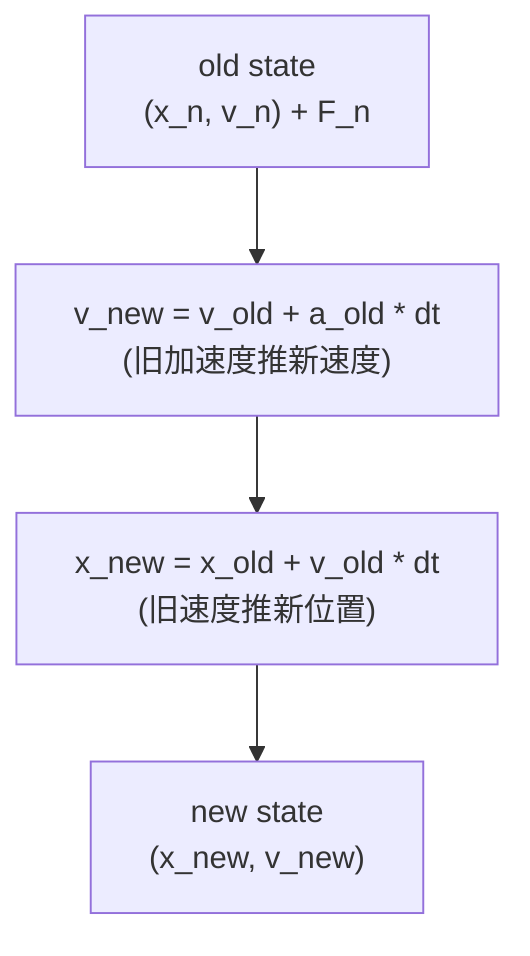
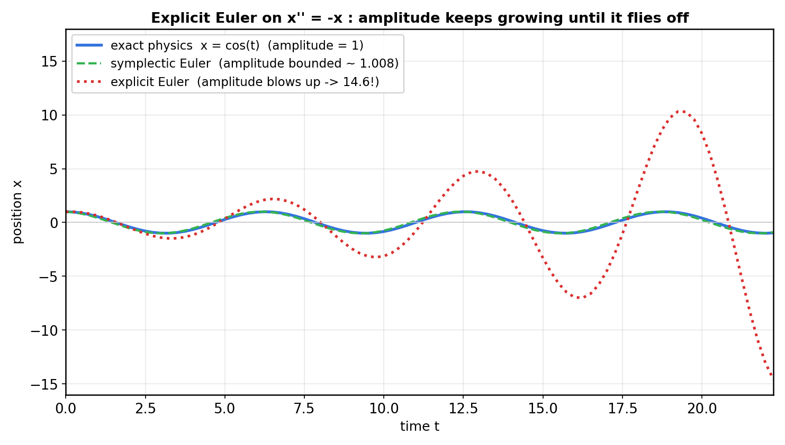
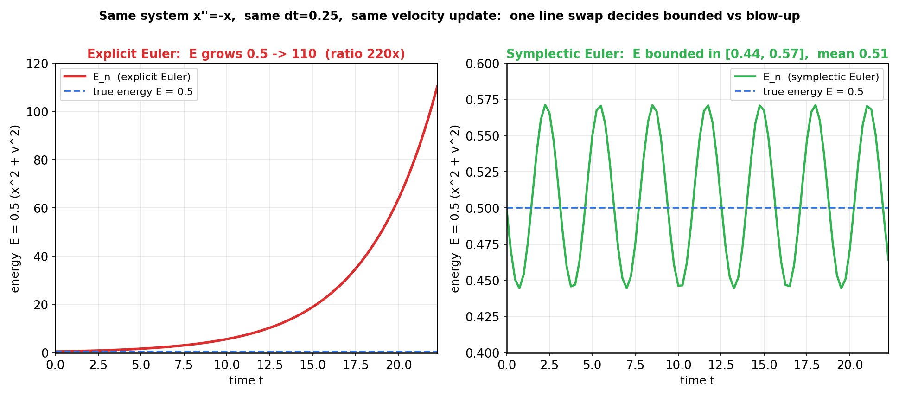
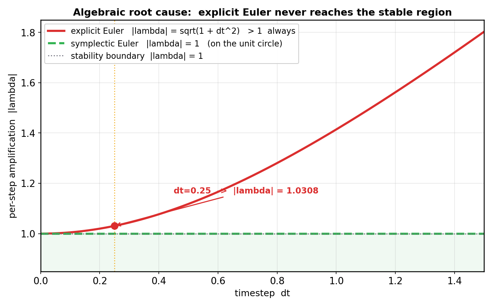
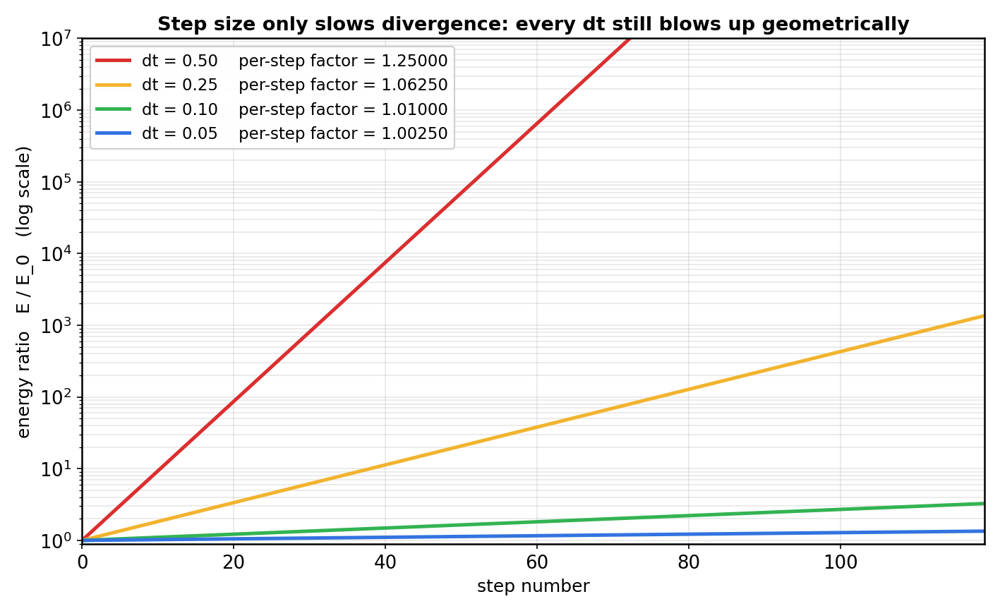
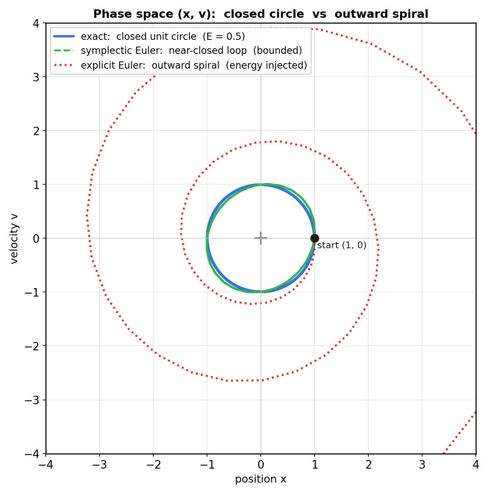
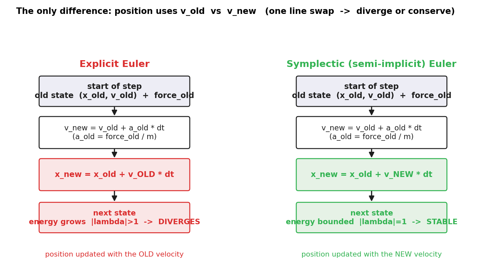

# 第 2 篇 · 第 6 章 · 显式欧拉及其不稳定

> **核心问题**:上一章我们给刚体凑齐了全部状态量——位置 `x`、速度 `v`、质量 `m`、转动惯量 `I`。现在有了状态,最朴素地怎么把它"每步往前推一格"?最直觉的答案是**显式欧拉**(explicit Euler):每一步用旧速度更新位置、旧加速度更新速度。它简单到只有两行加减乘,任何一个初学编程的人写得出来。可这一章要讲的是一个**反直觉的硬事实**:这个最朴素的积分器,在一个**没有任何外力输入、本该能量守恒**的保守系统(弹簧振子、单摆、轨道)上,会把能量**一步一步往里灌**,直到物体越摆越大、最后**飞出屏幕**。物理引擎里有句行话——"显式欧拉发散"。这一章就是把这句话拆到骨头:它为什么发散,凭什么发散,以及为什么 Box2D 压根不用它。

> **读完本章你会明白**:
> 1. 显式欧拉是什么:最朴素的"用旧值更新"的数值积分,以及它为什么是大多数人的第一直觉。
> 2. **它为什么会发散**:每步误差被**正反馈**放大,放大因子 `|λ| = sqrt(1 + dt²) > 1`(对任何 `dt` 都成立),能量按几何级数 `1+dt²` 每步递增——这是代数铁证,不是"经验"。
> 3. 怎么用 **numpy 把发散过程跑出来看**:弹簧振子 `x'' = -x` 用显式欧拉跑 90 步,轨迹越摆越大、能量曲线 `E(t)` 单调几何增长——这是发散的直接证据。
> 4. 为什么"换一个更新顺序"就能治住它(为下一章半隐式欧拉铺路),以及 Box2D 在源码里**确实没用显式欧拉**。
> 5. 这一切和《数学分析》里"数值方法的稳定性"是**同一件事**——显式欧拉发散,就是数分课上讲的数值不稳定,在物理场景里的活教材。

> **如果一读觉得太难**:只抓三件事——① 显式欧拉 = "用旧速度更新位置、旧加速度更新速度";② 它对保守系统不稳定,能量会被**注入**(图 fig-p206-3 是铁证);③ 根因是放大因子 `|λ| > 1`,治法是换更新顺序(下一章)。其余推导是给"想搞懂为什么"的人。

---

## 〇、一句话点破

> **显式欧拉发散,不是因为它"算错了",而是因为它对保守系统做了一个能量**单向往里灌**的近似——每步把系统推得比真实物理更"猛"一点点,这点多余的振幅下一步又被进一步放大,正反馈失控,最终爆炸。根因一句话:它的每步放大因子 `|λ| = sqrt(1 + dt²)` 永远大于 1,无论你把步长 `dt` 取多小。**

这是结论。本章倒过来拆:先从"最朴素的积分"长什么样讲起,再让它在你眼前一步步爆炸,再钻到代数根因里看那个 `sqrt(1+dt²)` 是怎么冒出来的,最后说清楚为什么物理引擎(包括 Box2D)从来不裸用显式欧拉。

---

## 一、从上一章的状态量,到"怎么把它往前推一格"

### 1.1 我们手里有什么

上一章(P2-05)我们花了一整章给刚体凑状态量。一个 2D 刚体在某时刻的"全部运动状态",可以压成这么几个数:

- 位置 `x ∈ R²`(质心坐标),朝向 `θ ∈ R`(转了多少弧度);
- 线速度 `v ∈ R²`,角速度 `ω ∈ R`;
- 质量 `m`(或它的倒数 `invMass = 1/m`),转动惯量 `I`(或 `invI = 1/I`)。

牛顿第二定律把这些状态量串起来:

```
   F = m · a    →    a = F / m    (线运动)
   τ = I · α    →    α = τ / I    (转动,τ 是力矩,α 是角加速度)
```

也就是说:**这一帧**物体受的力 `F`(重力、用户施加的力、弹簧力……)决定了它**这一帧**的加速度 `a = F/m`;加速度再连续地改速度、速度再连续地改位置。这是**连续**的微分方程 `dx/dt = v, dv/dt = F/m`。

> **承接书讲过**:`F = ma` 是个连续微分方程,真实物理里加速度、速度、位置**连续地**变化,这件事《数学分析》"常微分方程"那章讲透了,本书 P1-02 也已经把"连续 → 离散"那一步铺过。这里不重复,我们直接进"离散地怎么推"。

### 1.2 计算机只能离散地推

计算机没法"连续地"积分。它能做的,是把时间切成一段一段长度为 `dt` 的小步,每一步把所有物体的状态**推进一步**:

```
   t = 0       t = dt      t = 2dt     t = 3dt     ...
   state_0  -> state_1  -> state_2  -> state_3  -> ...
```

每一步,我们手里是"**旧状态**"`(x_n, v_n)`,目标是算出"**新状态**"`(x_{n+1}, v_{n+1})`。问题是:**怎么算?**

这就是**数值积分**(numerical integration)要回答的核心问题。`dx/dt = v, dv/dt = a` 这两个微分方程,在"一步之内"怎么近似?

### 1.3 最朴素的第一直觉:用旧值往前走

任何懂点微积分的人,第一直觉都差不多:**这一步的加速度用旧时刻的 `a_n = F_n/m` 算,这一步的速度也用旧时刻的 `v_n` 算,时间乘上 `dt`,加到旧值上,就是新值。**

具体到刚体平动(转动同理),这就是**显式欧拉**(explicit Euler,又叫前向欧拉 forward Euler):



写成两行:

```
   显式欧拉(每步):
   v_new = v_old + a_old · dt        (a_old = F_old / m)
   x_new = x_old + v_old · dt        ← 注意:用的是 v_old,不是 v_new
```

> **钉死这件事**:显式欧拉的关键特征是**"新值全靠旧值算"**——新速度用旧加速度、新位置用旧速度。所有的右侧都是 `n` 时刻的已知量,没有一项是 `n+1` 时刻的未知量。所以它叫"**显式**"(explicit):新值被旧值**显式地**表达出来,直接套公式就行,不用解方程。这是它最大的优点:**简单、不用解方程、每步开销极小**。

也正因为这么简单,它几乎是所有数值积分教材里讲的**第一个**方法。如果世界对它足够友好,我们就不用写这一章了。

> **不这样会怎样**:如果连"用旧值往前走"这种朴素办法都不存在,数值积分就无从谈起——你连"离散步"都没法迈。所以显式欧拉不是"错的方法",它是**起点**,是一切积分器的第零个版本。问题不在它"会不会算",而在它**对某些系统会不会稳**。下面我们就让它在最该老实的系统上,当场表演爆炸。

---

## 二、让显式欧拉当场爆炸:numpy 实验一

### 2.1 实验对象:弹簧振子 `x'' = -x`(最"干净"的保守系统)

为了把显式欧拉的毛病暴露得最清楚,我们挑一个**最不该出问题**的系统当试金石:**无阻尼弹簧振子**(也叫简谐振子, simple harmonic oscillator)。

一个质量 `m=1` 的物块拴在弹簧上(劲度系数 `k=1`),弹簧另一端固定。位移 `x` 的运动方程:

```
   m · x'' = -k · x       取 m = k = 1
   x'' = -x
```

这个系统好在哪里?

- **没有外力**(没有人在推它)、**没有阻尼**(没有摩擦耗能)、**没有非线性**(`-x` 是最干净的线性函数)。
- 它有**解析解**(精确公式):给定初值 `x(0)=1, v(0)=0`,解就是 `x(t) = cos(t), v(t) = -sin(t)`。
- 它的**总能量** `E = 0.5·(v² + x²)`(动能 + 弹性势能)**严格守恒**:`cos²(t) + sin²(t) = 1`,所以 `E(t) ≡ 0.5` 恒定不变。

一句话:这是个**能量一分不多一分不少、永远在 0.5 的闭环上转**的系统。任何"看起来对"的积分器,起码要让它的能量在 `0.5` 附近**有界振荡**,不能越跑越多。

> **钉死这件事**:我们之所以用弹簧振子,是因为它**真值已知**(能量恒为 0.5),任何积分误差都会被立刻看出来。这是数值方法教材里最经典的"试金石系统"——保守、线性、有解析解。它若在这里出问题,在更复杂的真实物理(碰撞、约束、非线性)里只会更糟。

### 2.2 把显式欧拉套上去

把显式欧拉那两行套到 `x'' = -x` 上(加速度 `a = -x`):

```python
# 显式欧拉 on x'' = -x   (x0=1, v0=0)
import numpy as np

n  = 90
dt = 0.25
x  = np.zeros(n);  v = np.zeros(n)
x[0], v[0] = 1.0, 0.0
for i in range(1, n):
    x[i] = x[i-1] + v[i-1] * dt     # 新位置用旧速度
    v[i] = v[i-1] - x[i-1] * dt     # 新速度用旧加速度(= -x_old)
```

就这五行。我们来跑,然后看它的**轨迹**(位置随时间)和**能量**曲线。

### 2.3 结果:轨迹越摆越大,飞了

把显式欧拉的位置轨迹,和精确解 `cos(t)` 画在一起(图 fig-p206-2):



三条曲线:

- **蓝色精确解** `x = cos(t)`:振幅永远是 1,在 `[-1, 1]` 之间规规矩矩地振荡。这是真物理。
- **红色显式欧拉**(点线):振幅**随时间肉眼可见地增长**——前 30 步峰值的绝对值还只有 2.2 左右,后 30 步已经窜到 14.6。摆得越来越凶,最后会**飞出屏幕**。
- **绿色半隐式欧拉**(虚线):同样 `dt=0.25`,同样两行公式——**唯一差别是位置更新用新速度**——振幅稳定在 1.008 附近,几乎贴着精确解。这是下一章的主角,这里先放它出来当对照组。

这就是物理引擎圈里说的"**显式欧拉发散**"(explicit Euler diverges)。注意:**这个系统没有任何外力往里灌能量**,弹簧只把它自己的势能和动能来回换,真实物理能量永远 0.5。可显式欧拉**自己**就把能量造出来了——而且造得越来越多,几何级数式地失控。

> **不这样会怎样**:如果你真的用显式欧拉写一个物理引擎,那游戏里挂着的吊灯会越摆幅度越大(几分钟后甩飞),绑在弹簧上的角色会被弹簧越弹越高直到撞穿天花板,**月球绕地球的轨道会越转半径越大直到月球飞离地球**。没有任何"外力",纯粹是积分器自己在制造能量。这不是 bug,是**方法本身的稳定性缺陷**。

### 2.4 一个更扎心的反例:圆周运动(轨道)也发散

弹簧振子是**一维**的,你可能还在怀疑:会不会只是这个例子取巧?我们换一个**二维**的最干净保守系统——**匀速圆周运动**,把怀疑彻底打掉。

一个质点在中心引力下做圆周运动(简化成 `x'' = -x, y'' = -y`,初值 `x=1, y=0, vx=0, vy=1`),真实解是 `x(t)=cos(t), y(t)=sin(t)`——一个**半径恒为 1 的圆**。总能量 `E = 0.5(vx²+vy²+x²+y²)` 严格守恒为 `1`。

套上显式欧拉,跑同样的 90 步:

```python
# 显式欧拉 on 圆周运动 x''=-x, y''=-y  (起点 (1,0), 切向速度 (0,1))
x,y,vx,vy = 1.0, 0.0, 0.0, 1.0
traj = []
for _ in range(90):
    traj.append((x,y))
    x_new  = x  + vx*dt        # 旧速度
    y_new  = y  + vy*dt
    vx_new = vx - x *dt        # 旧位置算的加速度
    vy_new = vy - y *dt
    x,y,vx,vy = x_new,y_new,vx_new,vy_new
```

结果:轨迹不再是闭合圆,而是一条**向外旋开的螺线**——质点每转一圈半径就大一圈,几十圈后飞出视野。能量曲线同样几何增长,每步乘 `1+dt²`,和一维情形**完全一样**。

这不是巧合。原因在第四节会讲清:二维圆周运动的状态矩阵 `A` 是个 `4×4` 的反对称块对角矩阵,特征值还是 `±i`(二重),显式欧拉的放大因子照样是 `sqrt(1+dt²)>1`。**只要系统的特征值是纯虚数(即只要是"振荡型"保守系统),显式欧拉的发散就无可避免**——和维度无关、和具体形式无关,只和"系统是不是振荡保守"有关。

> **钉死这件事**:一维弹簧振子会发散,二维圆周运动也发散,**任何一个"无阻尼振荡型"保守系统都会发散**。这就是为什么物理引擎不敢用显式欧拉:游戏里到处都是"振荡型"系统——绳索约束(弹簧)、轨道运动(角色绕点转)、堆叠时的微小回弹、布料/柔体的弹性……每一个都会被显式欧拉注入能量。一个积分器只要在任何一个子系统上发散,整个仿真就崩了。

---

## 三、铁证二:能量曲线 `E(t)` 单调几何增长

光看轨迹你可能还会怀疑:"是不是初值取巧?是不是 `dt` 太大?"。我们换一个**更狠、更无可辩驳**的视角:**把每一步的总能量 `E_n = 0.5(v_n² + x_n²)` 画出来**,看它随时间怎么变。

### 3.1 能量是积分器质量的最严格裁判

轨迹好不好看,还能被"画图比例"骗过去。但**能量**不一样:对一个保守系统,真实物理的能量是**常数**。任何积分器让能量偏离这个常数,就是在制造/损耗能量。所以数值积分教材里,衡量一个积分器在保守系统上**质量好坏**的标准判据,就是看它的能量曲线:

- 能量在真值附近**有界振荡** → 好积分器(误差有上限,长期跑也不会失控);
- 能量**单调增长或单调衰减** → 坏积分器(能量被持续注入或抽走,长期必然爆炸或坍塌)。

### 3.2 显式欧拉 vs 半隐式欧拉的能量曲线

把两种欧拉的 `E_n` 都画出来,左右对照(图 fig-p206-3):



**左图(显式欧拉,红色)**:能量从初始的 `0.5`,一步一步**单调往上爬**,跑到第 90 步已经窜到 **110**——是初始能量的 **220 倍**。这条曲线没有任何"快要平"的意思,它是**几何级数**形状(在半对数图上是直线,见后面图 fig-p206-6)。能量被无情地、持续地注入系统。

**右图(半隐式欧拉,绿色)**:同一个系统、同一个 `dt=0.25`、同一种"欧拉"——能量在 `0.44` 到 `0.57` 之间**有界振荡**,均值 `0.51`,死死贴着真值 `0.5`。短期看有误差(毕竟 `dt=0.25` 不算小),但**长期不会失控**。

> **钉死这件事**:这两张图是本章的核心铁证。同一个保守系统、同一种"用旧加速度更新速度"的策略,差别**只在位置更新用了旧速度还是新速度**——能量行为却天差地别:一边几何级数发散,一边有界振荡。**显式欧拉的不稳定不是"算错了某一步",而是它每一步都在系统里造一点点能量,这点能量被下一步继续放大,正反馈失控。**

---

## 四、为什么会发散:钻到代数根因里

到目前为止我们"看见"了发散,但还没"解释"它。一个守纪律的工程师会追问:**凭什么**?凭什么同一个 `dt=0.25`,换个更新顺序就从爆炸变成稳定?这一节把那个"凭什么"挖到根上。

### 4.1 把二阶方程叠成一阶方程组,看清楚放大矩阵

弹簧振子 `x'' = -x` 是个二阶方程。我们把它拆成两个一阶方程(状态向量 `z = (x, v)ᵀ`):

```
   dx/dt = v
   dv/dt = -x

   即   d/dt [ x ]   =  [ 0   1 ] [ x ]
          [ v ]      [-1   0 ] [ v ]

   记   A = [ 0   1 ]
           [-1   0 ]
   则   dz/dt = A · z
```

`A` 是个**反对称矩阵**(skew-symmetric),它的特征值是**纯虚数** `±i`——这正是"振荡"的代数画像(实数特征值对应指数增长/衰减,纯虚特征值对应等幅振荡)。真实物理里,`z(t)` 永远在一个固定半径的圆上转,能量(半径平方)恒定。

### 4.2 显式欧拉是 `(I + dt·A)` 这个线性映射

把显式欧拉那两行写成矩阵形式:

```
   [ x_{n+1} ]   [ x_n ]     [ 0   1 ]      [ x_n ]     [      1        dt ] [ x_n ]
   [ v_{n+1} ] = [ v_n ] + dt·[-1   0 ] · dt·?  
                 〰其实是直接代入〰
   [ x_{n+1} ]   [ 1   dt ] [ x_n ]        ← x_new = x_old + dt · v_old
   [ v_{n+1} ] = [-dt   1 ] [ v_n ]        ← v_new = v_old + dt · (-x_old)
```

也就是说,**显式欧拉每一步,等价于状态向量左乘矩阵 `M_explicit = I + dt·A`**。这是一个**线性**的固定映射——每步都乘同一个矩阵。

每一步状态变成上一步的 `(I + dt·A)` 倍,跑 `n` 步就是 `(I + dt·A)ⁿ`。问题立刻归约为一个纯代数问题:**这个矩阵的"每步放大倍数"——也就是它的特征值的模 `|λ|`——是多少?**

### 4.3 算它的特征值:`|λ| = sqrt(1 + dt²) > 1`,永远大于 1

求 `M_explicit = [1, dt; -dt, 1]` 的特征值:解 `det(M - λI) = 0`:

```
   det( [1-λ,  dt;  -dt, 1-λ] ) = (1-λ)² + dt² = 0
   λ = 1 ± i·dt
```

两个特征值都是**复数** `1 ± i·dt`。它们的**模**(到原点的距离,即每步对状态的放大倍数):

```
   |λ| = sqrt(1² + dt²) = sqrt(1 + dt²)
```

**关键事实**:`sqrt(1 + dt²)`,对**任何** `dt > 0` 都**严格大于 1**。

- `dt = 0.25` 时,`|λ| = sqrt(1.0625) ≈ 1.0308`,每步把状态(因而把能量 `∝ |z|²`)放大 `|λ|² = 1.0625` 倍;
- `dt = 0.05` 时,`|λ| = sqrt(1.0025) ≈ 1.00125`,每步放大 `1.0025` 倍——慢,但还是**放大**;
- 你把 `dt` 取到 `0.001` 也是 `> 1`,只是发散得更慢而已,**永远逃不开**。

图 fig-p206-4 把这条曲线画了出来:



红色曲线(显式欧拉)整条**悬在 `|λ|=1` 这条稳定线之上**——没有任何 `dt` 能让它碰到稳定区。绿色直线(半隐式欧拉)则恰好**贴在 `|λ|=1`** 上(下一节解释为什么)。

> **钉死这件事**:`|λ| > 1` 意味着每一步状态向量(以及能量)都被乘以一个大于 1 的因子。`n` 步后总放大是 `|λ|^n`——这是**几何级数**,几何级数一旦底数大于 1,再小也会趋向无穷。这就是显式欧拉发散的**代数根因**:它给保守系统的每一步,都做了一个**严格放大**的线性近似,无论你把 `dt` 调多小,放大因子都 > 1,只是放大得快慢的差别。**这不是"经验现象",这是定理。**

### 4.4 能量按 `1 + dt²` 几何增长,和实验数字精确吻合

把 `|λ|²` 摊开来,正好是每步的能量放大倍数:

```
   |λ|² = 1 + dt²
```

也就是说:**显式欧拉每跑一步,系统能量乘以 `(1 + dt²)`**。`dt = 0.25` 时,每步乘 `1.0625`;跑 89 步,理论放大 `1.0625^89`。

回头核对我们 numpy 实验的数字:能量从 `E_0 = 0.5` 跑到 `E_89 = 110.22`,实测每步平均放大 `(110.22/0.5)^(1/89) = 1.0625`,**精确等于 `1 + dt² = 1.0625`**——理论和实验逐位吻合。这就是为什么图 fig-p206-3 左图那条红色能量曲线长得像指数曲线:它**就是**指数曲线,几何级数 `0.5 · (1+dt²)^n`。

图 fig-p206-6 把不同 `dt` 下的能量比值 `E/E₀` 画在半对数坐标上:



每条线都是**直直的上升线**(几何级数在半对数图上就是直线),斜率由 `dt` 决定——`dt` 越大,发散越快;`dt` 越小,发散越慢,但**没有任何一条线是平的**。这给了一个非常重要的工程结论:

> **不这样会怎样**:你可能想"那我把 `dt` 取得很小,比如 `0.0001`,不就发散得很慢,几百步内看不出来?"。理论上对——`dt=0.0001` 时每步只放大 `1.00000001` 倍。但物理引擎要**长时间**跑(一个游戏跑几分钟就是上万步),几何级数哪怕底数只比 1 大一丁点,长期都必然爆炸;而且 `dt` 越小每帧要跑的步数越多,算力撑不住。"把 `dt` 调小"压不住显式欧拉的发散,只能**延缓**。治本的办法是**换积分器**。

### 4.5 相空间画像:闭合圆 vs 向外旋开的螺线

把 `(x_n, v_n)` 这些状态点画在二维平面上(相空间, phase space),发散这件事会有一个**极其直观的几何画像**(图 fig-p206-5):



- **蓝色精确解**:`(cos t, -sin t)` 是**闭合的单位圆**——能量是"到原点的距离平方",圆的半径不变 = 能量守恒。真实物理永远在这个圆上转。
- **绿色半隐式欧拉**:描出一个**几乎闭合的环**(略微变形的椭圆),始终贴在单位圆附近——有界。
- **红色显式欧拉**:从 `(1, 0)` 出发,每转一圈半径就**大一圈**,画出一条**向外旋开的螺线**。这条螺线就是 `|λ| > 1` 的几何具象——状态向量每步都被拉长一点点,几十步下来就从单位圆旋出去了。

这张图可能是本章最值得记住的一张:**显式欧拉让保守系统的轨道"漏"出去,半隐式欧拉把轨道锁在能量等值线附近**。

---

## 五、为什么"换顺序"就稳了:为下一章铺路

到这里我们立起了两个事实:① 显式欧拉发散,根因 `|λ| = sqrt(1+dt²) > 1`;② 半隐式欧拉(同一个系统、同一个 `dt`)稳定。这一节解释**那个神奇的"换顺序"为什么这么有效**——但只是点破,完整推导留给下一章。

### 5.0 一个自然的疑问:既然显式欧拉这么糟,为什么还要先讲它?

读到这你可能会问:既然显式欧拉在保守系统上必炸,为什么这一章还要花这么大力气讲它,不直接上半隐式欧拉?三个理由:

**第一,它是所有数值积分的起点,绕不开。** 任何一个写过游戏循环或物理仿真的人,第一次实现"物体受力 → 更新速度 → 更新位置",写出来的几乎一定是显式欧拉——因为它和人的直觉完全吻合:"现在的力改现在的速度,现在的速度改现在的位置"。它是**默认答案**。不讲它,读者遇到"我随手写了个积分,为什么吊灯越摆越大"这种真实坑,根本不知道毛病在哪。讲透了它为什么坏,读者才真正理解为什么物理引擎要用那些"反直觉"的积分器。

**第二,它的失败是数值稳定性最好的活教材。** "数值不稳定"这个词,在《数学分析》里是用抽象算子语言定义的——误差传播矩阵的谱半径大于 1 之类。这种定义对没踩过坑的人是空的。但当你亲眼看见一个**没有任何外力的弹簧**,在显式欧拉下能量从 0.5 飙到 110,这个词就**长在身上**了。本章的目标之一,就是让读者把"数值不稳定"从抽象概念变成肌肉记忆。显式欧拉是最干净、最无可辩驳的反例——换成更复杂的积分器,反而讲不清。

**第三,理解了它为什么坏,才能理解半隐式欧拉为什么好。** 半隐式欧拉和显式欧拉的差别,小到只有"位置更新用新速度还是旧速度"这一行。如果你没先看清显式欧拉的发散机理(放大因子 > 1、能量几何增长),你看见半隐式欧拉的稳定也不会有"原来如此"的感觉——你会以为"这只是个调参的好运气"。先见识坏,才能赏识好。这是认知的顺序。

> **所以这样设计**:本书的讲法是"先把最朴素的办法推到它撞墙的地方,再引出巧妙办法",这是动机-技巧双线的体现。显式欧拉是"动机"那一半(朴素的笨办法撞什么墙),半隐式欧拉是"技巧"那一半(用什么数学漂亮解决)。不先撞墙,读者不知道为什么要这技巧。

---

### 5.1 半隐式欧拉只改一件事:位置用新速度更新

把显式欧拉那两行,**只调一行**:

```
   半隐式欧拉(symplectic / semi-implicit Euler):
   v_new = v_old + a_old · dt        (完全不变,新速度还是用旧加速度)
   x_new = x_old + v_new · dt        ← 改这一行:用新速度 v_new,不是 v_old
```

更新顺序示意图(图 fig-p206-1)把这一交换画得清清楚楚:



左边显式欧拉:位置更新用 `v_old`(陷阱);右边半隐式欧拉:位置更新用 `v_new`(解药)。其余完全一样。

### 5.2 这一交换让放大矩阵的特征值**正好落在单位圆上**

把半隐式欧拉写成矩阵形式(同样代入 `x'' = -x`):

```
   v_new = v_old - dt · x_old
   x_new = x_old + dt · v_new = x_old + dt·(v_old - dt·x_old) = (1-dt²)·x_old + dt·v_old

   [ x_new ]   [ 1-dt²    dt ] [ x_old ]
   [ v_new ] = [  -dt      1 ] [ v_old ]
```

新矩阵 `M_sym = [1-dt², dt; -dt, 1]`。求它的特征值:`det(M_sym - λI) = (1-dt²-λ)(1-λ) + dt² = 0`,展开整理得 `λ² - (2-dt²)λ + 1 = 0`。两个根 `λ₁, λ₂` 的乘积(由韦达定理)是 `1`,也就是说 `|λ₁| · |λ₂| = 1`。更细致地看,只要 `dt < 2`,这两个特征值是**模恰好为 1 的复共轭**——它们**正好落在复平面的单位圆上**。

```
   |λ_symplectic| = 1     (当 dt < 2)
```

这就是图 fig-p206-4 里那条**贴在 1 上**的绿色直线。`|λ|=1` 意味着每步状态向量被旋转但不被拉伸——半径不变——能量守恒(更严格地说,能量在一个**修改过的能量函数**(shadow Hamiltonian)附近有界振荡,见下一章)。

> **钉死这件事**:`|λ| = 1`(特征值在单位圆上)是**保守系统数值稳定**的代数判据。显式欧拉 `|λ| > 1` 落在圆外 → 发散;半隐式欧拉 `|λ| = 1` 落在圆上 → 稳定。两者的差别,完全可以用矩阵特征值的位置讲清楚——这是数值线性代数的标准语言,不是玄学。

### 5.3 辛积分器:为什么"恰好落在单位圆上"不是巧合

`|λ| = 1` 看着像运气好,其实不是。半隐式欧拉属于一类有专门名字的积分器——**辛积分器**(symplectic integrator)。"辛"是个微分几何/哈密顿力学的概念,大致意思是:**这个积分器保留了保守系统相空间的某种几何结构**(辛结构,symplectic structure)。

凡是辛积分器,在保守系统上都有一个关键性质:**它逼近的不是一个普通的能量函数,而是一个"扰动过的"能量函数(叫 shadow Hamiltonian),真实能量在这个扰动能量附近有界振荡——永远有界,永远不会单调发散**。

这就是半隐式欧拉、Verlet、leapfrog 这些方法稳定的根本原因。它们的"稳"不是参数调出来的,是**结构上保证了**的。

> **承接书讲过**:什么是"数值方法的稳定性"?显式欧拉发散,正是《数学分析》里讲的"**数值不稳定的典型例子**"——一个方法在局部截断误差很小、看着很准的情况下,因为**误差被正反馈放大**,长期把解推到无穷远。这不是"算法逻辑错了",是"误差传播方式错了"。本书反复呼应的这条主线——精确 vs 逼近——在这里兑现得最直接:显式欧拉对 `x''=-x` 这种线性保守系统的**局部**截断误差是 `O(dt²)`,`dt` 越小越准;但它的**全局**误差是发散的(几何增长),`dt` 再小也压不住。局部准 vs 全局炸,正是数值方法稳定性要研究的核心矛盾。想看稳定性更系统的展开(收敛性、相容性、稳定性 Lax 等价原理),翻《数学分析》"数值微分方程"那章,见 [[math-analysis-series]]。这里不重复——我们专注它在物理引擎里的具体后果。

---

## 六、回到物理引擎:Box2D 压根不用显式欧拉

讲完原理,看一眼真实源码——确认物理引擎界对这个问题的工程共识。

### 6.1 Box2D 用的是半隐式欧拉,不是显式欧拉

物理引擎的招牌实现 Box2D(v3.2.0,C 重写)的积分器,在 [src/solver.c](../box2d/src/solver.c) 里。它的速度积分函数 `b2IntegrateVelocitiesTask`([src/solver.c#L66](../box2d/src/solver.c#L66)),核心两行是:

```c
// [src/solver.c:100-102](../box2d/src/solver.c#L100-L102)
// levd = h * im * f + h * g
b2Vec2 linearVelocityDelta = b2Add( b2MulSV( h * sim->invMass, sim->force ),
                                    b2MulSV( h * gravityScale, gravity ) );
float  angularVelocityDelta = h * sim->invInertia * sim->torque;
```

也就是说:**新速度 = 旧速度 + h · 加速度**(加速度来自外力 `force / invMass` 和重力)。这就是半隐式欧拉的第一步——`v_new = v_old + a_old · h`(对应本章符号,`h` 是子步步长)。

然后是位置积分,函数 `b2IntegratePositionsTask`([src/solver.c#L114](../box2d/src/solver.c#L114)),核心这一行:

```c
// [src/solver.c:157](../box2d/src/solver.c#L157)
state->deltaPosition = b2MulAdd( state->deltaPosition, h, state->linearVelocity );
```

`deltaPosition += h · linearVelocity`——而这里的 `linearVelocity` 是**已经被上一步更新过的"新速度"**(同一个 `state` 在 `b2IntegrateVelocitiesTask` 里被写新值,然后在 `b2IntegratePositionsTask` 里被读)。也就是说:**位置更新用的是新速度**。

> **钉死这件事**:Box2D 的积分器,**正是半隐式欧拉**——速度用旧加速度更新,位置用**新**速度更新。本章那个"换顺序"的解药,Box2D 从第一天就用着。**Box2D 从来没用过显式欧拉**——一个能在保守系统上把能量造到无穷的积分器,物理引擎不可能采用。

### 6.2 一个工程细节:Box2D 还把大步切成子步

这里诚实标注一个 Box2D v3.2 的非显然细节(承自本系列的源码锚点)。Box2D 的步进函数 `b2World_Step`([src/physics_world.c#L828](../box2d/src/physics_world.c#L828))签名是:

```c
void b2World_Step( b2WorldId worldId, float timeStep, int subStepCount );
```

它不是"用户给一个 `dt` 就积分一次",而是把 `timeStep` **切成 `subStepCount` 个子步**,每个子步长 `h = timeStep / subStepCount`,在 [src/solver.c](../box2d/src/solver.c) 的求解流水线里跑 `subStepCount` 轮(约束图着色并行 + warm start + 软约束,见 P5-16)。也就是说,你调一次 `b2World_Step(dt=1/60, subStepCount=4)`,内部真正积分用的是 `h = 1/240` 秒。

这把"积分稳定性靠小步长 + 好积分器"这件事做到了底:**外层**给一个游戏友好的 `1/60` 秒大步(游戏引擎固定帧率),**内层**切成更细的子步让每个积分步的 `h` 更小、误差更小。但请注意——**子步再细,Box2D 用的还是半隐式欧拉,不是显式欧拉**。细子步是锦上添花(让误差更小),辛积分器才是保命的(让能量有界)。如果 Box2D 把积分器换成显式欧拉,子步再细,长时间跑一个吊灯也会越摆越大。

> **钉死这件事**:物理引擎处理稳定性的两手——① **结构稳定**的积分器(半隐式欧拉 / Verlet,辛),保证能量有界;② **足够小**的步长(子步进),保证局部误差小。两者缺一不可,但前者是命脉,后者是精度。本章聚焦前者为什么是命脉;P2-08 会专门讲后者(固定步长)。

### 6.3 一个诚实的细节:显式欧拉不是"对所有系统"都不稳定

讲到这里,需要补一个诚实的细节,免得读者形成"显式欧拉任何时候都不稳"的误解——这是错的,而且《数学分析》里的标准例子恰恰显示它有时稳。

显式欧拉的稳定与否,**取决于被积系统的特征值**。`x'' = -x` 这种**纯振荡**系统(特征值是纯虚数 `±i`)是显式欧拉的**死穴**——稳定区间根本不覆盖纯虚轴。但对**带阻尼**的系统,比如 `x'' = -x - 0.5·x'`(一个有摩擦的弹簧,特征值是 `-0.25 ± 0.999i`,带负实部),显式欧拉在 `dt` 足够小的时候**是稳定的**——它的稳定区间 `|1 + λ·dt| ≤ 1` 能覆盖一部分左半复平面。

所以严格的说法是:

- **对纯振荡型保守系统**(无阻尼弹簧、轨道、约束回弹),显式欧拉**永远不稳定**(`|λ|=sqrt(1+dt²)>1`);
- **对带足够阻尼的耗散系统**,显式欧拉**可能稳定**,但稳定步长有上限,`dt` 大了仍炸。

> **钉死这件事**:物理引擎里的麻烦在于——**引擎里到处都是"几乎无阻尼的振荡型"子系统**。一根绳子(距离约束)是一个无阻尼弹簧;两个堆叠箱子之间的接触,在求解器看来也是一个高刚度的弹簧(软约束,contact hertz);关节约束同样。这些子系统的"等效阻尼"很小甚至为零(阻尼比由用户设定的 `dampingRatio` 控制,默认常常很低),正好落在显式欧拉的死穴里。所以"显式欧拉在某些耗散系统上能稳"这个细节,**救不了物理引擎**——引擎里的核心约束都是低阻尼振荡型,显式欧拉必炸。这也是 Box2D 必须用半隐式/辛积分器的根因:它的稳定性**不依赖**系统的阻尼大小,结构上对一切哈密顿系统都保能量有界。

---

## 七、技巧精解:为什么显式欧拉对保守系统永远不稳定

这一节把本章最硬的一个结论单独拆透——它是物理引擎"积分器选型"的根,也是承接《数学分析》数值稳定性的高潮。

### 7.1 三个层次的"为什么"

**第一层(现象)**:显式欧拉在 `x'' = -x` 上,振幅随时间几何增长,能量曲线 `E(t)` 单调上扬(图 fig-p206-3 左)。这是"看得见"的发散。

**第二层(代数根因)**:把方程叠成 `z' = A·z`,显式欧拉每步等价于乘矩阵 `M = I + dt·A`,该矩阵特征值 `λ = 1 ± i·dt`,模 `|λ| = sqrt(1+dt²) > 1`(对任何 `dt>0` 成立,图 fig-p206-4)。每步放大 `|λ|`,`n` 步放大 `|λ|ⁿ` → 几何级数发散。这是"算得出来"的根因。

**第三层(数值方法本质)**:为什么 `|λ| > 1`?因为显式欧拉对**振荡型**系统(纯虚特征值的 `A`)做了一个**显式的、向前差分**的近似——它把"连续旋转"近似成"每步先沿当前方向走一段再修正",这个"先走"的步骤**系统性地过冲**(overshoot),每步都过冲一点点,过冲量被下一步继续过冲,正反馈。反对称矩阵 `A` 的纯虚特征值意味着真实解是"原地转圈",而显式欧拉的 `(I + dt·A)` 把这个转圈变成了"螺旋外扩"——这就是图 fig-p206-5 那条向外旋开的红色螺线。这是"想得通"的物理直觉。

### 7.2 反面对比:同一个系统,半隐式欧拉为什么稳

把上面三层套到半隐式欧拉上对照:

| 维度 | 显式欧拉 | 半隐式欧拉 |
|---|---|---|
| 现象 | 振幅几何增长,能量发散 | 振幅有界,能量在 0.5 附近振荡 |
| 每步放大矩阵 | `M = I + dt·A = [1, dt; -dt, 1]` | `M = [1-dt², dt; -dt, 1]` |
| 特征值模 `|λ|` | `sqrt(1+dt²) > 1`(永远) | `1`(当 `dt<2`) |
| 在复平面位置 | 单位圆**外** | 单位圆**上** |
| 几何画像 | 相空间向外旋开的螺线 | 相空间近似闭合环 |
| 数值方法本质 | 向前差分,系统过冲 | 隐式位置更新,抵消过冲 |
| 是不是辛积分器 | **否** | **是** |

这个表是本章的精华浓缩。一句话总结:**两者的全部差别,是位置更新用了旧速度还是新速度;而正是这一交换,把放大矩阵的特征值从单位圆外,挪到了单位圆上**。

### 7.3 一个常被忽略的点:稳定 ≠ 精确

最后澄清一个初学者容易混淆的点。半隐式欧拉**稳定**(能量有界),不代表它**精确**(能量严格等于 0.5)。看图 fig-p206-3 右:半隐式欧拉的能量在 `0.44` 到 `0.57` 之间振荡,均值 `0.51`——它**有误差**,误差还不小(`dt=0.25` 时偏离真值最大 12%)。

稳定和精确是两件事:

- **稳定**(stability):误差会不会失控爆炸。半隐式欧拉稳——能量有界,长期不发散。
- **精确**(accuracy):每步的局部误差多大。半隐式欧拉的局部截断误差也是 `O(dt²)`,和显式欧拉同级;`dt` 越小越准。

物理引擎**首要选稳定**(因为不稳定 = 直接爆炸,游戏崩了),**其次在算力允许下尽量精确**。Box2D 选半隐式欧拉(稳)+ 子步进(提精度),正是这个权衡。显式欧拉连第一关(稳定)都过不了,所以出局。

> **承接书讲过**:这就是《数学分析》"数值微分方程"里那个核心区分——**收敛性**(方法是否随 `dt→0` 趋近真解)和**稳定性**(固定 `dt` 时误差是否随步数有界)是两个**独立**的性质。显式欧拉对 `x''=-x` **是收敛的**(`dt→0` 时确实逼近 `cos(t)`),但**不稳定**(固定 `dt` 时长期发散)——收敛不蕴含稳定。Lax 等价定理告诉我们:对适定的线性问题,收敛 ⟺ 相容 + 稳定。显式欧拉相容(局部截断误差 `→0`),但不稳定,所以长期不收敛。这个区分在《数学分析》里是用抽象的算子语言讲的,本章用弹簧振子的能量曲线把它**画给你看**了。详见 [[math-analysis-series]]。

---

## 八、章末小结

### 回扣主线

本章是第 2 篇"运动与积分"里**响应侧**的招牌章。它回答的核心问题是:有了上一章(P2-05)凑齐的刚体状态量,**最朴素怎么把它往前推一格**,以及这个最朴素的办法(显式欧拉)为什么不能用。

我们走了一条完整的论证链:**最直觉的积分(显式欧拉,用旧值更新)→ 让它在最干净的保守系统(弹簧振子 `x''=-x`)上跑 → 看见它能量发散(轨迹图 fig-p206-2 + 能量曲线图 fig-p206-3 铁证)→ 钻到代数根因(放大因子 `|λ|=sqrt(1+dt²)>1`,图 fig-p206-4)→ 解释为什么换个更新顺序就稳(半隐式欧拉 `|λ|=1` 落在单位圆上)→ 在 Box2D 源码里确认物理引擎确实用半隐式、不用显式**。

这一章全部服务**响应**(动力学积分)这一面,是 P2-05(状态量)到 P2-07(稳定积分器)的桥:**有了状态,最朴素的推法不行,下一章给出能行的推法**。它也兑现了全书最强承接——**显式欧拉发散,就是《数学分析》讲的数值不稳定,在物理场景里的活教材**。

### 五个为什么

1. **显式欧拉长什么样?**——两行:`v_new = v_old + a_old·dt; x_new = x_old + v_old·dt`。新值全靠旧值,显式,不用解方程。是数值积分最朴素的第一直觉。
2. **它为什么会发散?**——对保守系统(如 `x''=-x`),每步放大因子 `|λ| = sqrt(1+dt²) > 1`(对任何 `dt>0` 成立),每步把能量乘以 `1+dt²`,几何级数累积,长期爆炸。根因是它对振荡系统做了过冲的向前差分近似。
3. **怎么"看见"它发散?**——跑 numpy 实验:弹簧振子用显式欧拉推 90 步,轨迹振幅从 1 涨到 14+(图 fig-p206-2),能量从 0.5 涨到 110(图 fig-p206-3 左),实测每步放大 `1.0625` 精确等于理论 `1+dt²`。
4. **为什么换更新顺序就稳?**——半隐式欧拉把"位置用旧速度"改成"位置用新速度",放大矩阵变成 `M=[1-dt²,dt;-dt,1]`,特征值模 `|λ|=1`(落在单位圆上),不再放大。它是**辛积分器**,结构上保证能量有界振荡。
5. **Box2D 用哪个?**——半隐式欧拉([solver.c:100-102](../box2d/src/solver.c#L100-L102) 速度积分 + [solver.c:157](../box2d/src/solver.c#L157) 位置积分用新速度)。它从来没用过显式欧拉,因为显式欧拉会让吊灯越摆越凶直到飞掉。

### 想继续深入往哪钻

- **想把半隐式欧拉、Verlet 的稳定性讲透**:下一章 P2-07,半隐式欧拉与 Verlet——为什么辛积分器保能量、Verlet 怎么天然处理约束,以及它们的精度和代价。
- **想搞懂步长和稳定性的关系**:P2-08,固定步长与稳定性——为什么物理引擎用固定步长(稳定可复现),变步长会怎样。
- **想看数值稳定性的系统理论**(收敛/相容/稳定/Lax 等价原理):《数学分析》"数值微分方程"那章,[[math-analysis-series]]。本章是它在物理场景的可视化注脚。
- **想看 Box2D 的完整积分步**:附录 B 的堆叠箱子 demo,亲手跑一次 `b2World_Step`,观察子步进 `h = dt/subStepCount` 怎么把稳定性做实。

### 引出下一章

我们这一章让显式欧拉在最干净的保守系统上当场爆炸,挖出了它发散的代数根因(放大因子永远 `>1`),并指出"换个更新顺序"就能治——但我们**只是点破**了半隐式欧拉为什么稳,没展开。下一章 P2-07,**半隐式欧拉与 Verlet**,正面拆透:**辛积分器凭什么保能量(单位圆上的特征值 + shadow Hamiltonian)、Verlet 积分怎么天然处理约束(位置递推不显式出现速度)、它们的精度等级和代价**。那个"换顺序"的解药,下一章给出完整的数学证明和源码落地。

> **下一章**:[P2-07 · 半隐式欧拉与 Verlet](P2-07-半隐式欧拉与Verlet.md)
