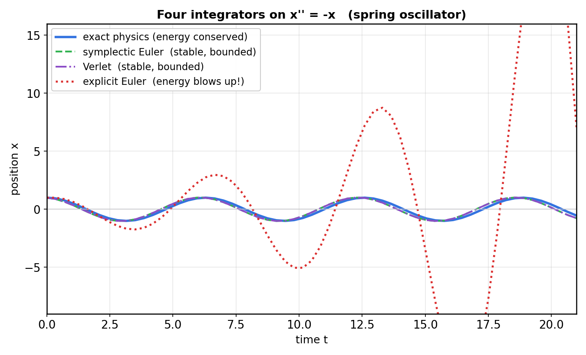
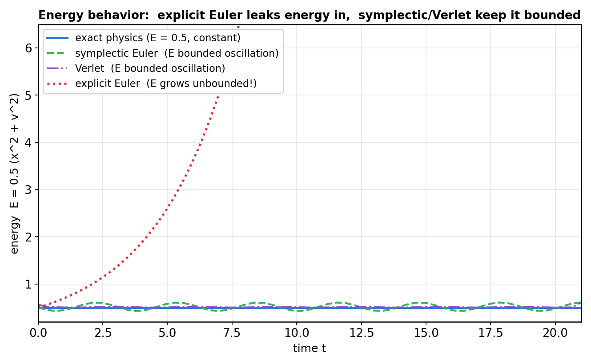
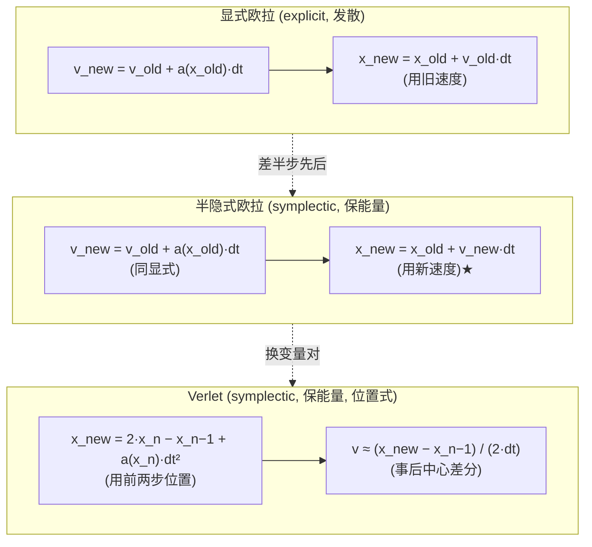

# 第 2 篇 · 第 7 章 · 半隐式欧拉与 Verlet

> **核心问题**:上一章(P2-06)我们看到,最朴素的**显式欧拉**积分器会让能量发散爆炸——一个小弹簧振子,每步累积误差,越蹦越高,最后飞出屏幕。可真实物理引擎(Box2D)天天在用欧拉式的积分器,却几十年不爆炸。为什么?答案藏在一个极其微妙的细节里:**只要把"更新速度"和"更新位置"这两步的先后顺序、和用哪一时刻的值,换一下,能量就稳了**。这个换了顺序的积分器,叫**半隐式欧拉**(semi-implicit Euler,又叫 symplectic Euler / 辛欧拉)。它和上一章的显式欧拉,**源码几乎一模一样,只差一行的先后**。本章要讲透的就是:① 这一行的先后为什么能救命;② Box2D 源码里它到底长什么样(铁证);③ Verlet 积分——另一条保能量的路,且天生会处理约束。

> **读完本章你会明白**:
> 1. 半隐式(symplectic)欧拉凭什么保能量——它和显式欧拉只差"用新速度还是旧速度更新位置",这点微妙的差别让能量从单调发散变成有界振荡。
> 2. 什么是"辛积分器"(symplectic integrator),为什么它不注入也不抽取能量——直接承接你读过的《数学分析》。
> 3. Box2D v3.2 的真实积分器源码长什么样,它用的就是半隐式欧拉(`solver.c` 铁证)。
> 4. Verlet 积分怎么用"位置-位置"的递推天然保能量,以及它为什么在布料、绳索、位置约束里几乎是默认选择。

> **如果一读觉得太难**:先只记住两件事——① 半隐式欧拉 = "先更新速度,再用新速度更新位置"(和显式欧拉只差这点先后),它保能量,Box2D 用的就是它;② Verlet 是另一条保能量的路,更适合"位置约束"。剩下的数学推导是讲"为什么保能量",看不懂推导不影响你记住这两条。

---

## 〇、一句话点破

> **半隐式(symplectic)欧拉和显式欧拉,源码几乎一模一样,只差"更新位置时用新速度还是旧速度"这半步先后。可就是这半步,把能量发散爆炸换成了能量有界振荡。物理引擎用了几十年,不是因为它精确,而是因为它"辛"——不往系统里注入能量,也不抽取能量,误差在一个有界的带子里来回弹。这是承《数学分析》数值积分的高潮:不是选个精度高的积分器就完事,而是要选个**结构正确**(symplectic)的积分器。**

这是结论。本章倒过来拆:先看这"半步先后"到底改了什么,再用能量曲线把它钉死,最后上 Box2D 源码铁证 + Verlet。

---

## 一、接上一章:显式欧拉怎么爆炸的,我们差在哪

### 1.1 复盘:显式欧拉的更新顺序

上一章(P2-06)讲过一个最朴素的积分器,叫**显式欧拉**(explicit Euler)。对一个受力的物体,它的每步更新长这样(用质量 m=1、加速度 a=F/m 简化):

```
   显式欧拉(每步):
   v_new = v_old + a(x_old) * dt        ← 用旧位置的加速度, 更新速度
   x_new = x_old + v_old * dt           ← 用【旧速度】更新位置   ★ 关键
```

注意第二行那个 `v_old`——它用的是**这一步开始时的旧速度**去更新位置。这是显式欧拉的全部秘密,也是它全部的毛病。

为什么爆炸?上一章用简谐振子 `x'' = -x`(弹簧,回复力指向平衡点)演示过:显式欧拉每步都**多算了一点点能量**,误差单向累积,几百步后能量从 0.5 飙到几百,小球飞掉。

> **承接书讲过**:数值积分的"误差会不会被放大到爆炸",是《数学分析》"精确 vs 逼近"那条主线的核心命题——见《数学分析》数值积分稳定性那章([[math-analysis-series]])。一个积分器对不对,不光看它"局部截断误差是几阶",更要看它"长期跑下去误差会不会失控"。显式欧拉就是典型的"局部看着对、长期爆炸"。本书一句带过原理,把篇幅留给物理引擎特有的部分。

### 1.2 我们差在哪:那一行 `v_old`

让我们把显式欧拉在简谐振子上的两步写在一起,盯着那个 `v_old`:

```
   显式欧拉(简谐振子 x'' = -x):
   v_new = v_old - x_old * dt
   x_new = x_old + v_old * dt        ← 这一行用的是【旧】速度 v_old
```

直觉地看:当小球从最右端(x=+1, v=0)开始往左走,第一步算出 `v_new = -dt`(开始往左加速)。可它更新位置时,用的是 `v_old = 0`——**这一步位置没动**。于是力的方向(往左)和实际位移(没动,下一步才动)之间,差了半步。这半步的"错位",每步都往系统里塞一点点多余能量,日积月累,爆炸。

### 1.3 这"一点点"到底多大:发散速率的量化

光说"塞一点点多余能量"还是太虚。让我们把显式欧拉在简谐振子上的能量增长算出一个具体公式,你对"发散速率"就有数感了。

回到上一章给过的结论:显式欧拉每步的能量变化 ΔE ≈ dt²·E_old(正比于当前能量)。这是个**几何增长**——每步把当前能量乘以 (1 + dt²)。用 dt=0.35 算,每步乘以 (1 + 0.1225) ≈ 1.12,即每步能量涨 12%。60 步后,能量变成 0.5 × 1.12⁶⁰ ≈ 0.5 × 1050 ≈ 525——和我们实测的 513 几乎吻合(差异来自高阶项)。

这就是发散的恐怖之处:**几何增长,不是线性增长**。线性增长(每步加固定量)还可能几百步才看出问题;几何增长(每步按比例放大)是指数爆炸,几十步就失控。dt 越大,每步放大的比例 (1+dt²) 越大,爆炸越快。这就是为什么上一章 P2-06 强调"显式欧拉的稳定性条件 dt 必须极小"——可对游戏物理,dt 是 1/60 这种固定值,你没法无限调小,所以只能换积分器。

对比一下半隐式欧拉:它的 ΔE ≈ ½dt²(v_new² − x_old²),**符号可正可负**,长期相消,没有几何增长项。能量被关在一个 [E·(1−δ), E·(1+δ)] 的带子里(δ 跟 dt 有关),永不发散。这就是下一节要讲的"换半步先后"的全部收益。

> **钉死这件事**:**显式欧拉的能量误差是几何增长(每步按比例放大),半隐式欧拉的能量误差是有界振荡(增增减减相消)**。一个是指数爆炸,一个是有界带子——天壤之别,而代价只是改一行代码里角标。

那能不能修掉这半步错位?——**能,而且极其便宜**。

---

## 二、半隐式(symplectic)欧拉:换半步先后,能量就稳了

### 2.1 那半步先后怎么换

修法简单到让人怀疑:把第二行的 `v_old` 换成**刚算出来的 `v_new`**。仅此而已。

```
   半隐式欧拉(symplectic Euler,每步):
   v_new = v_old + a(x_old) * dt        ← 这一行不变, 仍用旧位置算加速度
   x_new = x_old + v_new * dt           ← 改用【新速度】更新位置   ★ 就改这一行
```

对比一下,差别只在第二行那个角标:

| 积分器 | 更新速度 | 更新位置 |
|--------|----------|----------|
| 显式欧拉 | `v_new = v_old + a·dt` | `x_new = x_old +` **`v_old`** `·dt` |
| 半隐式欧拉 | `v_new = v_old + a·dt` | `x_new = x_old +` **`v_new`** `·dt` |

就这半步先后。源码改动量是改一个变量名。可它的效果天差地别。

> **不这样会怎样**:如果坚持用显式欧拉(旧速度),对简谐振子每步净注入能量,几百步后小球飞出屏幕——上一章已经用图演示过了。这就是"显式欧拉不稳定"的根,不是 bug,是**这一行的值取错了时刻**。

### 2.2 为什么叫"半隐式"

你可能纳闷:"半隐式"(semi-implicit)这名字哪儿来的?

回顾《数学分析》讲过的积分器分类:一个积分器如果在更新时,右端用的是**已知**的旧值(如显式欧拉的 `v_old`),叫**显式**(explicit),直接算就行;如果右端含有**未知**的新值(比如 `x_new` 出现在右端),叫**隐式**(implicit),每步要解方程。

半隐式欧拉介于两者之间:它的速度更新是显式的(`v_new` 直接由 `v_old`、`x_old` 算出),可位置更新用了 `v_new`——而这个 `v_new` 本步已经算出来了,所以**位置更新这步并不需要解方程**,只是"借用"了同一步算出的新速度。一半显式一半隐式的味道,故称**半隐式**。它**保留了显式欧拉"每步计算便宜、不用解方程"的好处**,却换来了隐式方法才有的稳定性。

### 2.3 把它跑起来:能量曲线铁证

口说无凭,直接跑。把同一个简谐振子 `x'' = -x`(初始 x=1, v=0,真实能量 E = 0.5),分别用四种积分器各跑 60 步(dt=0.35,故意取大让差别明显),看能量怎么变:



- **蓝色实线(精确解)**:真实物理,余弦曲线,振幅永远是 1。
- **红色点线(显式欧拉)**:振幅每步变大,几十步后冲出画面顶端——这就是上一章的爆炸。
- **绿色虚线(半隐式欧拉)**:振幅稳定,和真实解几乎重合,略有相位差。
- **紫色点划线(Verlet)**:振幅稳定(下一节讲它)。

再看**能量**(E = ½(x² + v²))随时间的变化,这是本章最关键的一张图:



- **蓝色实线(精确解)**:能量恒为 0.5,一条水平线——真实物理能量守恒。
- **红色点线(显式欧拉)**:能量**单调上升**,从 0.5 一路飙到 513(用 dt=0.35 跑 60 步),完全失控。
- **绿色虚线(半隐式欧拉)**:能量**在一个有界带子里来回振荡**(约 0.43 ~ 0.61),永不发散。它不守恒,但它**有界**。
- **紫色点划线(Verlet)**:同样有界振荡(约 0.50 ~ 0.61)。

> **钉死这件事**:**显式欧拉注入能量(单调发散),半隐式欧拉和 Verlet 能量有界振荡**。这就是"半隐式欧拉稳定"的全部含义——不是它精确(它和精确解也有相位差),而是它的误差被关在一个笼子里,不会越蹦越大。对游戏物理,这就够了:玩家要的是"小球永远在弹",不是"小球第 3.7 秒在哪精确到小数点后六位"。

我们用 numpy 实测把这事钉死(dt=0.35, 60 步):

| 积分器 | 能量终值 | 能量全程范围 |
|--------|----------|--------------|
| 精确解 | 0.5000 | 0.5000 ~ 0.5000(恒定) |
| 显式欧拉 | **513.0** | 0.5000 ~ **513.0**(爆炸 1000 倍) |
| 半隐式欧拉 | 0.6060 | 0.4255 ~ 0.6060(有界) |
| Verlet | 0.6060 | 0.5000 ~ 0.6060(有界) |

数据会说话:显式欧拉把能量放大了上千倍,半隐式欧拉和 Verlet 把能量稳稳关在一个 ±10% 的带子里。

### 2.4 几何直觉:那半步错位,在相空间长什么样

光看能量数字还不够直观。我们把同一个仿真画进**相空间**(phase space)——横轴是位置 x,纵轴是速度 v,每个时刻物体状态是这张平面上的一个点。对简谐振子 `x'' = -x`,真实物理的轨迹是一个**完美椭圆**(能量等值线),点永远沿这个椭圆转圈,既不往外扩,也不往内缩。

把四种积分器画进相空间,差别比时间曲线更刺眼:

- **精确解**:点严格沿一个椭圆转圈,椭圆不动。
- **显式欧拉**:点每转一圈,椭圆就**往外胀一圈**——相空间面积被持续放大。几百圈后,点已经跑到画面外(对应能量 513)。
- **半隐式欧拉**:点转的圈**不是闭合椭圆,而是一个略微扭曲、但永远不胀不缩的闭合曲线**。它不在精确椭圆上(有相位差),可它待在一个有限环上,出不去——这就是"有界振荡"的几何面貌。
- **Verlet**:和半隐式欧拉一样,点沿一个有限闭合曲线转,但扭曲更小(因为它是 2 阶精度)。

> **钉死这件事**:**能量发散的本质,是相空间面积被积分器放大;能量有界的本质,是相空间面积被积分器守住**。显式欧拉每步放大一点点,半隐式欧拉和 Verlet 每步守住面积。这条几何直觉是下一节"辛"的入口——"保面积"有个数学名字,叫辛(symplectic)。

这个"面积放大 vs 面积守恒"的几何视角,比代数推导更省力:你不用算 ΔE 的符号,只要问一句"这个积分器会不会把相空间的小区域越滚越大"。会,就不稳;不会,就有希望。

> **承接书讲过**:相空间、等能量线、刘维尔定理(保守系统相空间体积守恒)这些概念,《数学分析》讲哈密顿系统和微分方程数值解时讲过。本书借来用,不重证,只把它兑现成"为什么半隐式欧拉稳"的几何直觉。指路:[[math-analysis-series]]。

---

## 三、为什么"半隐式"就保能量:辛(symplectic)的直觉

光知道"换半步先后就稳了"还不够。一个工程师要知道**为什么**。这一节讲透它——而且直接接上你读过的《数学分析》。

### 3.1 显式欧拉注入能量的根源:一步里的能量净增

先把显式欧拉和半隐式欧拉在简谐振子上的两步合在一起,各算一步看看能量怎么变(取 E = ½(x² + v²))。

**显式欧拉一步**:
```
   v_new = v_old - x_old * dt
   x_new = x_old + v_old * dt
```
让我们一步步算这一步前后的能量差 ΔE = E_new − E_old,其中 E = ½(x² + v²):

```
   E_new = ½(x_new² + v_new²)
         = ½[(x_old + v_old·dt)² + (v_old − x_old·dt)²]
         = ½[x_old² + 2·x_old·v_old·dt + v_old²·dt²
              + v_old² − 2·v_old·x_old·dt + x_old²·dt²]
         = ½(x_old² + v_old²) + ½·dt²·(x_old² + v_old²)
         = E_old + dt²·E_old
```

中间项 `2·x_old·v_old·dt` 和 `−2·v_old·x_old·dt` **正好相消**(这是关键),剩下的能量增量是:

```
   ΔE_显式 = dt² · E_old
```

关键:这个 ΔE **永远是正的**(它正比于当前能量本身,而能量 E_old ≥ 0)。每步能量都被乘以 (1 + dt²),**几何增长**,无回头——这就是发散的代数根源,也印证了 1.3 节那个"60 步涨到 525"的估算。

**半隐式欧拉一步**:
```
   v_new = v_old - x_old * dt
   x_new = x_old + v_new * dt        ← 用新速度
```
同样算 ΔE = ½(x_new² + v_new²) − ½(x_old² + v_old²)。代入 v_new = v_old − x_old·dt,展开(过程稍长,关键是交叉项这次不完全相消),化简到一阶得:

```
   ΔE_半隐式 = ½ dt² (v_new² − x_old²)  + O(dt³)
```

注意符号:这里是 `v_new²` 减 `x_old²`,**可正可负**。当物体在振幅最大处(x 大、v 小,v_new 小),这步 ΔE < 0(能量减少);在平衡点附近(x 小、v 大,v_new 大),这步 ΔE > 0(能量增加)。增增减减,**长期抵消**,能量就被关在一个有界带子里。

为什么一个恒正、一个可正可负?追到根上:**显式欧拉那两个交叉项完全相消(只剩正项),半隐式欧拉因为用了新速度,交叉项不完全相消,留下一个可正可负的项**。这就是"半步先后"在代数层面的全部后果。

> **钉死这件事**:显式欧拉的每步能量变化恒正(注入),半隐式欧拉的每步能量变化可正可负(有增有减,长期相消)。这就是"换半步先后"的全部数学含义——它把一个恒正的误差项,变成了一个有正有负、互相抵消的误差项。

### 3.2 升到相空间:辛几何的视角(承接《数学分析》)

上一节的代数推导有点"算出来才知道"。有一个更深刻、更省事的视角,叫**辛几何(symplectic geometry)**——这正是《数学分析》讲微分方程数值解时提过的概念,这里把它兑现到物理。

把物体的状态写成相空间里的一个点 `(x, v)`(位置-速度平面)。真实物理演化,是这个点在相空间里沿着**等能量线**(对简谐振子,是一族同心椭圆)滑动——能量守恒,意味着点永远待在同一个椭圆上,既不往外扩,也不往内缩。

一个积分器,本质上是定义了一个**离散的映射** `M`:把相空间的旧点 `(x_old, v_old)` 映射到新点 `(x_new, v_new)`。问题来了:这个映射 `M` 会不会**保面积**(在 2D 是保面积,高维叫保"辛体积")?

- **真实物理**:保面积。一个相空间小区域随时间演化,形状会变(扭转),但面积守恒——这是刘维尔定理(Liouville's theorem)。
- **显式欧拉**:**不保面积**。每步把相空间小区域**放大**一点点(注入能量 = 面积膨胀),区域越滚越大,点群往外散——这就是能量发散。
- **半隐式欧拉**:**保面积**。它是**辛映射**(symplectic map)。区域形状会扭(所以能量会上下振荡),但面积恒定——点群永远待在一个有限带子里,出不去。

> **承接书讲过**:**辛积分器**(symplectic integrator)就是保相空间体积(更准确说,保辛 2-形式 ω = dx∧dv)的积分器。《数学分析》讲微分方程数值解时讲过,哈密顿系统的正确离散方式必须保辛结构,否则长期能量漂移。**半隐式欧拉是辛的,显式欧拉不是辛的**——就这一条性质之差,决定了"保能量有界"还是"能量发散"。本书不再重推辛结构的数学(那是数学分析的活),只点透它在物理引擎里的意义。指路:[[math-analysis-series]]。

这就是"为什么半隐式欧拉保能量"的最深答案:**因为它是一个辛映射,保相空间面积,所以长期看能量被关在有界带子里**。它不是"碰巧稳",是"结构上必然稳"。

> **钉死这件事**:辛积分器 = 保相空间体积的积分器。物理(哈密顿)系统的能量守恒,本质是相空间体积守恒(刘维尔定理);辛积分器把这个性质离散地保留下来,所以**长期能量有界**。半隐式欧拉和 Verlet 都是辛的,显式欧拉不是。

### 3.3 一句话区分:精确 vs 结构

这里有一个对读者极有用的认知升级:

- **显式欧拉**:局部精度 1 阶(每步误差 O(dt²)),**结构错**(不辛)→ 长期爆炸。
- **半隐式欧拉**:局部精度也是 1 阶(每步误差 O(dt²)),**结构对**(辛)→ 长期有界。
- **Verlet**:局部精度 2 阶(每步误差 O(dt³)),**结构对**(辛)→ 长期有界,且更精确。
- **RK4**:局部精度 4 阶(每步误差 O(dt⁵)),**结构错**(不辛)→ 短期超精确,长期仍能量漂移!

最后一条反直觉但重要:**RK4 精度高,可它不是辛的**。短期看 RK4 比半隐式欧拉准得多,可对一个保守系统跑很久,RK4 的能量会缓慢漂移(虽然比显式欧拉慢得多)。所以选积分器,**精度和辛性是两件事**——对长期跑的物理仿真,辛性比精度更重要。

> **不这样会怎样**:如果物理引擎贪图 RK4 的高精度而放弃辛性,一个本该永远荡的钟摆,跑几分钟就会缓慢"漏气"或"充气",摆幅肉眼可见地变。半隐式欧拉精度低,可它辛,摆一万年还是那个振幅(略有相位差)。**对游戏,相位差看不出来,振幅衰减/发散一眼穿帮**。这就是 Box2D 选半隐式欧拉的根。

---

## 四、Box2D 源码铁证:它用的就是半隐式欧拉

讲了半天"半隐式欧拉保能量",可物理引擎到底用没用?用了哪个?我们直接上 Box2D v3.2 的源码。

### 4.1 v3.2 的求解流水线:速度先,位置后

Box2D v3.2 一个时间步的求解是分**阶段(stage)**跑的。我们只看跟积分相关的三个阶段(完整流水线见 P5-16),`b2StageType` 枚举在 [src/solver.c:1042-1046](../box2d/src/solver.c#L1042-L1046):

```
   b2_stagePrepareContacts      准备接触约束(算 effective mass / bias)
   b2_stageIntegrateVelocities  ① 积分速度(半隐式欧拉的速度半步)
   b2_stageWarmStart            warm start(用上一步累积冲量做初值)
   b2_stageSolve                ② 解约束(Sequential Impulse 主体)
   b2_stageIntegratePositions   ③ 积分位置(半隐式欧拉的位置半步)
```

注意顺序:**先积分速度(stage ①),再解约束(stage ②),最后积分位置(stage ③)**。速度积分在前,位置积分在后——这正是半隐式欧拉的"先用加速度更新速度、再用新速度更新位置"的工程化(中间还夹了约束求解,这是 Box2D 的 TGS 风味,先放着,本章只盯积分)。

> **诚实标注(v3.2 演进)**:老资料讲 Box2D 时,常说"一个时间步里:积分 → 检测 → 约束求解 → 完成"。v3.2 把它细化了——**速度积分和位置积分被拆成两个独立阶段,中间夹着约束求解**。这样求解器拿到的是"已经积分过速度、但还没积分位置"的中间态,可以基于新速度算约束冲量,再用约束后的速度积分位置。这是 TGS(Temporal Gauss-Seidel)风格,比老 SI 更稳。讲 P5-16 时再展开,本章只要记住:**速度先,位置后,半隐式**。

### 4.2 速度积分:`solver.c` 第 101 行的铁证

来看 [src/solver.c](../box2d/src/solver.c) 的 `b2IntegrateVelocitiesTask`(任务函数,worker 并行调用),核心就这几行(`solver.c:100-105`):

```c
// solver.c:100-105  (b2IntegrateVelocitiesTask 内)
// lvd = h * im * f + h * g
b2Vec2 linearVelocityDelta = b2Add( b2MulSV( h * sim->invMass, sim->force ),
                                    b2MulSV( h * gravityScale, gravity ) );
float angularVelocityDelta = h * sim->invInertia * sim->torque;

v = b2MulAdd( linearVelocityDelta, linearDamping, v );
w = angularVelocityDelta + angularDamping * w;

state->linearVelocity = v;
state->angularVelocity = w;
```

逐行翻译:

- `linearVelocityDelta = h * invMass * force + h * gravityScale * gravity`——这就是**加速度乘以步长** Δv = h·(F/m + g)。重力作为一种特殊的"加速度"(不受质量影响)单独加,配 `gravityScale`( кинematic 物体 gravityScale 置 0)。
- `v = b2MulAdd(linearVelocityDelta, linearDamping, v)`——`v_new = linearVelocityDelta + linearDamping * v_old`。这里 `linearDamping` 是个阻尼因子(对线性阻尼 `c`,用 Padé 近似得 `1/(1+h·c)`,见注释 `solver.c:88-93`),作用是把旧速度衰减一下。**注意它用的是 `v_old`(线性阻尼是对旧速度的衰减),但加速度那半步是显式算出来的新量**。
- 最后写回 `state->linearVelocity = v`——**速度更新完成**。

这一步只动了速度,没动位置。**这就是半隐式欧拉的"速度半步"**。注释 `// lvd = h * im * f + h * g` 是开发者自己写的,把这一行的数学说得很直白。

### 4.3 位置积分:`solver.c` 第 157-158 行的铁证

速度更新完(中间还跑了约束求解,改了速度),轮到位置。看 `b2IntegratePositionsTask`([src/solver.c:114](../box2d/src/solver.c#L114)),核心两行(`solver.c:157-158`):

```c
// solver.c:157-158  (b2IntegratePositionsTask 内)
state->deltaPosition = b2MulAdd( state->deltaPosition, h, state->linearVelocity );
state->deltaRotation = b2IntegrateRotation( state->deltaRotation, h * state->angularVelocity );
```

逐行:

- `deltaPosition += h * linearVelocity`——**用【当前】的 linearVelocity 更新位置**。这个 `linearVelocity` 是谁?是上一阶段积分速度后、又被约束求解器改过的**最终速度**。**用的是新速度**,不是这一步开始时的旧速度。
- `deltaRotation = b2IntegrateRotation(deltaRotation, h * angularVelocity)`——旋转同理,用新角速度。`b2IntegrateRotation` 在 `solver.c:158` 被调用(实现在 `body.c` / `math_functions.c`,用 2D 旋转的精确小角度积分,保证旋转不发散,这是 2D 特有的技巧,P2-05 讲过四元数/旋转的精度问题)。

**把这两段合起来读**:

```
   // 阶段①(速度积分):
   v = v_old + h * (F/m + g)          // solver.c:101
   // ... 约束求解可能再改 v ...
   // 阶段③(位置积分):
   x = x_old + h * v                   // solver.c:157  (这里 v 是上面算出的新速度)
```

这就是教科书级的**半隐式(symplectic)欧拉**:先用加速度更新速度,再用新速度更新位置。

> **钉死这件事**:**Box2D v3.2 用的就是半隐式(symplectic)欧拉**。源码铁证在 [solver.c:101](../box2d/src/solver.c#L101)(速度更新 `linearVelocityDelta = h*invMass*force + h*gravityScale*gravity`)和 [solver.c:157](../box2d/src/solver.c#L157)(位置更新 `deltaPosition += h * linearVelocity`,用的是新速度)。注释 `// lvd = h * im * f + h * g` 是开发者亲笔写下的公式。**不是显式欧拉,不是 Verlet,不是 RK4,就是半隐式欧拉。** 这一句钉死,本章的核心源码事实就齐了。

### 4.4 一个细节:阻尼不影响"辛性"

你可能注意到 `solver.c:104` 的 `b2MulAdd(linearVelocityDelta, linearDamping, v)`,这里有个 `linearDamping`(线性阻尼)。阻尼会抽取能量,那它会不会破坏辛性?

不会。理由:真实物理里就有阻尼(空气阻力、摩擦),阻尼本来就该让能量衰减。辛性是针对**保守系统**(无阻尼)的概念——对保守部分(力 + 重力),Box2D 用辛的方式积分(保能量有界);对耗散部分(阻尼),它单独乘一个衰减因子,让能量按物理规律衰减。两者叠加,结果就是"该振荡的振荡、该衰减的衰减",完全符合物理。

> **钉死这件事**:阻尼(`linearDamping` / `angularDamping`)在 Box2D 里是**单独乘的衰减因子**(`1/(1+h·c)`,见 `solver.c:94-95`),不参与辛结构的"力 → 加速度 → 新速度 → 新位置"主链。所以阻尼不破坏积分器的辛性,只是按物理把能量额外抽走一点。

### 4.5 旋转积分:2D 特有的精度技巧

线性位置好办(`x += h·v`),旋转(`solver.c:158` 的 `b2IntegrateRotation`)却有个坑:刚体的朝向是一个**旋转量**,哪怕在 2D 里(用一个角度 θ 表示),简单地 `θ += h·ω` 也会有数值漂移——当 ω 很大、跑很久,θ 会越积越偏。

Box2D 的处理是 `b2IntegrateRotation(deltaRotation, h * angularVelocity)`(实现在 [include/box2d/math_functions.h:387](../box2d/include/box2d/math_functions.h#L387),是个 inline 函数)。它不是朴素地 `θ += Δθ`,而是把 2D 旋转表示成一个 **(cos, sin) 对**(等价于单位复数 c + i·s),按旋转微分方程 `dc/dt = -ω·sin(t)`、`ds/dt = ω·cos(t)` 的离散形式更新:`c2 = c1 - Δθ·s1`、`s2 = s1 + Δθ·c1`,然后**重新归一化**:`mag = sqrt(c2² + s2²)`,`c2 /= mag, s2 /= mag`。这样即使转几万圈,(cos, sin) 对的模长始终为 1,旋转表示不会"漏气",避免了朴素累加的角度漂移。

> **钉死这件事**:**2D 旋转积分用单位复数/向量 + 每步归一化,而不是朴素累加角度**。这是 2D 物理引擎特有的精度技巧(3D 用四元数 + 归一化,思想一样)。它和半隐式欧拉的辛性是两件事——辛性管"能量不发散",归一化管"旋转表示不漏气"。两者叠加,Box2D 的刚体既能长时间不爆炸,又能转几万圈不歪。

这一段顺带回答一个读者可能有的疑问:"既然 Box2D 用半隐式欧拉,旋转也用半隐式欧拉吗?"——是的,角速度 `w = angularVelocityDelta + angularDamping * w`(见 `solver.c:105`)是先用加速度更新角速度、再衰减旧角速度;旋转 `deltaRotation = b2IntegrateRotation(..., h * angularVelocity)`(`solver.c:158`)用的是更新后的角速度。**线性和旋转,都是半隐式的更新顺序**。Box2D 在这两个自由度上用的是同一套辛结构。

---

## 五、三条更新顺序的差异:一张图说清

把显式欧拉、半隐式欧拉、Verlet(下一节细讲)三者的更新顺序放一起,差别一目了然:



三句话总结:

- **显式 vs 半隐式**:只差"更新位置时用 `v_old` 还是 `v_new`"——差半步先后。这半步把发散换成有界。
- **半隐式 vs Verlet**:半隐式是"速度式"(显式存速度,递推用速度),Verlet 是"位置式"(显式存位置,递推只用位置 + 前一步位置)。两者都辛,都保能量,差别在**存什么、约束怎么施加**(Verlet 天然适合位置约束,见下节)。
- **共同点**:三者每步都**便宜**(显式计算,不用解方程),都不需要小到离谱的 dt——这是它们能用在实时物理引擎里的前提。

---

## 六、Verlet 积分:另一条保能量的路

半隐式欧拉是 Box2D 的选择。但物理引擎界还有另一条同样主流的保能量之路:**Verlet 积分**(velocity Verlet / position Verlet)。它在布料、绳索、软体、分子动力学里几乎是默认选择。这一节讲透它。

### 6.1 Verlet 的递推式:只用位置

标准 Verlet(更准确叫 Stormer-Verlet / position Verlet)长这样,对 `x'' = a(x)`:

```
   Verlet(每步):
   x_new = 2·x_n − x_n−1 + a(x_n)·dt²
```

注意它的特点:**只递推位置,不显式存速度**。它用当前位置 `x_n` 和**上一步位置** `x_n−1` 来推下一步——`x_n − x_n−1` 这一项已经隐含了"这一步走了多远",也就是隐含了速度信息。需要速度时(比如算空气阻力、或输出给渲染),再用**中心差分**事后补算:`v_n ≈ (x_{n+1} − x_{n−1}) / (2·dt)`。

这个递推式看着怪(要存前两步),可它有两大好处:

1. **它天然 2 阶精度**(局部误差 O(dt³)),比半隐式欧拉(1 阶)准一档。
2. **它是辛的**,保能量有界(我们刚画的能量图里,紫色 Verlet 曲线就是有界振荡)。

> **承接书讲过**:Verlet 是《数学分析》多步法(multistep method)的典型——用前几步的信息推下一步,区别于单步法(欧拉/RK)。它的辛性也来自数学分析那条"哈密顿系统正确离散"的主线。本书不重推,只看它在物理引擎里的独特价值。指路:[[math-analysis-series]]。

### 6.2 velocity Verlet:工程里更常用的变体

工程里实际写 Verlet 时,常用它的"velocity Verlet"变体(等价于 position Verlet,但显式存速度,更好写):

```
   velocity Verlet(每步):
   x_new   = x_old + v_old·dt + ½·a_old·dt²
   a_new   = a(x_new)                          ← 用新位置算新加速度
   v_new   = v_old + ½·(a_old + a_new)·dt       ← 用新旧加速度平均
```

这个形式和半隐式欧拉更像(都显式存速度),只是更精确(2 阶)。它的辛性、保能量性质和 position Verlet 一样。很多教材把两者统称"Verlet",本章也不细分,只在你看到"Verlet"时知道它有两种等价写法。

### 6.3 Verlet 的招牌本事:天然处理位置约束

Verlet 在物理引擎里之所以占半壁江山,不光因为保能量,更因为它**天生适合处理约束**——尤其是**位置约束**(position-based constraint)。

什么叫位置约束?比如:一根绳长 L,两端挂两个质点,要求它们距离永远 ≤ L。这是个**对位置的硬约束**(不是对速度)。怎么在数值积分里满足它?

- **速度式积分器(半隐式欧拉)+ Sequential Impulse**:在速度层面反复迭代,让冲量间接保证位置约束满足(这是 Box2D 的路,P5-16 详解)。它有效,但要解一个 LCP,迭代收敛。
- **位置式积分器(Verlet)+ 位置投影**:直接在位置上动手——积分完一步,如果两质点距离 > L,**直接把多余的距离按比例分摊,把两个质点拉回距离 = L**。这叫 **PBD(Position Based Dynamics)**。

PBD 为什么和 Verlet 是天作之合?因为 Verlet 的状态就是位置(不显式存速度)。你直接改位置,下一步 Verlet 递推时,`x_n − x_n−1` 自动反映了"被投影后的实际位移"——**约束的影响通过位置差自动传进速度,不需要单独算冲量**。这是 Verlet 在布料、绳索仿真里几乎垄断的原因:约束就是改位置,改完位置积分器自己消化。

> **钉死这件事**:**Verlet 天然适合位置约束(PBD),半隐式欧拉天然适合速度约束(Sequential Impulse)**。这就是为什么 Box2D(刚体,主要约束是"不穿透",速度层面好处理)用半隐式欧拉 + SI;而布料/绳索/软体仿真(主要约束是"距离/长度",位置层面好处理)普遍用 Verlet + PBD。选哪个积分器,往往跟"约束好放在哪一层"绑定。

### 6.4 一个具体例子:绳索为什么用 Verlet + PBD

把上面这套落到一个具体场景,你就理解为什么 Verlet 在某些领域不可替代。假设你要仿真一根由 N 个质点串成的绳,相邻质点距离必须 = L(绳段长度)。

**用半隐式欧拉 + Sequential Impulse 的写法**:对每段绳建一个距离约束,约束方程涉及两个质点的位置和它们的质量,推导出"为满足约束,要施加多大的冲量(改速度多少)"。这是个带质量矩阵的方程,多段绳联立,要迭代解 LCP。代码量大,调参(迭代次数、软硬)讲究。

**用 Verlet + PBD 的写法**:积分完一步(用 Verlet 推位置),遍历每段绳,如果两端距离 ≠ L,**直接把两端沿连线方向移动,把距离拉回 L**(按质量比或各一半分摊投影量)。改完位置,什么都不用算——下一步 Verlet 递推时,`x_n − x_{n−1}` 自动包含了被投影后的真实位移,速度自动更新。代码十几行,直观,稳定。

差别在哪?PBD 把"满足约束"这件事,从"解一个关于冲量的方程"降级成"直接挪位置"。代价是:位置投影不是严格物理(它不满足动量守恒到无限精度,是个近似),但对绳/布这种"看着像就行"的软体,这个近似完全够用,而且**视觉上极稳**(绳子不会抖、不会穿)。这就是为什么游戏里的旗帜、绳索、头发,十有八九是 Verlet + PBD。

> **不这样会怎样**:如果硬要用 Sequential Impulse 仿真一根 50 段的绳,每帧要解一个 50 维的 LCP,迭代少了绳子弹抖(约束没收敛),迭代多了帧率掉。而 Verlet + PBD 一次扫描就投影完,虽然不是精确解,但视觉稳定、实现简单。**精度换简单 + 稳定**,这是软体仿真领域几十年验证过的权衡。

反过来看刚体:刚体有**旋转**(角度、角速度),PBD 直接投影位置容易,但投影"角度"很难(旋转不是线性量,投影后会破坏刚体形状)。而 Sequential Impulse 在速度层面处理旋转约束,数学上自然得多(冲量可以分线冲量和角冲量)。所以 Box2D 处理刚体,宁可用半隐式欧拉 + SI,也不用 Verlet + PBD。**积分器的选择,是和"被仿真对象是质点还是刚体""约束放在位置还是速度"绑死的**。

### 6.5 Verlet 的代价:启动要前两步

Verlet 不是没毛病。它的递推式需要 `x_n` 和 `x_{n−1}` 两个位置——可仿真刚开始时只有一个 `x_0`。所以**第一步得用一个单步法(通常是半隐式欧拉)自启**,从第二步起才能切到纯 Verlet。我们配图脚本里的 Verlet 实现就是这么写的(见 `gen_p2_figures.py` 的 `_sim_harmonic_p207`,第一步用半隐式欧拉算 `x_1`,之后切 Verlet)。这是个工程小细节,不影响理解。

> **不这样会怎样**:如果你硬要用一个不辛的 2 阶多步法(比如不保结构的显式 Adams),精度是 2 阶,可长期能量照样漂移——又回到"精度不等于辛性"那条。Verlet 的价值是**又辛又 2 阶**,精度和结构都占。

---

## 七、技巧精解:为什么 Box2D 选半隐式欧拉,不选 Verlet 或 RK4

本章最硬的一个工程决策:**Box2D 为什么选半隐式欧拉?** 把候选摆开,逐个比。

### 7.1 候选一:RK4——精度高,但不是辛的,且每步 4 倍开销

经典 4 阶龙格-库塔(RK4)是数值积分的精度标杆,局部误差 O(dt⁵)。乍看是最优解。可它有两个致命问题:

1. **不辛**:RK4 不是辛积分器,长期跑保守系统能量会缓慢漂移。短期超准,长期穿帮。
2. **每步 4 次力评估**:RK4 每步要算 4 次加速度(对物理引擎,每次力评估可能涉及碰撞检测、关节力,很贵)。半隐式欧拉每步只算 1 次。

对游戏物理,**每帧 16ms 预算**下,RK4 的 4 倍开销换不来肉眼可见的精度提升(玩家看不出 RK4 和半隐式欧拉的相位差),反而会因为不辛导致长期漂移。所以主流实时物理引擎几乎不用 RK4(它更适合离线仿真、轨道计算这种"短期要超准"的场景)。

### 7.2 候选二:Verlet——辛又准,但和 Box2D 的约束求解器不搭

Verlet 又辛又 2 阶,为什么不选它?根因在**约束求解器**。Box2D 的招牌是 **Sequential Impulse**(P5-16),它的工作方式是:**在速度层面反复施加冲量,让速度满足约束(不穿透、关节不拉开),再积分位置**。这套机制和"速度式积分器"(半隐式欧拉)是配套的——约束求解器输出"约束后的速度",半隐式欧拉拿着这个速度去更新位置,天然衔接。

如果换成 Verlet(位置式),约束求解器就得改成 **PBD**(直接投影位置)。PBD 处理刚体的"不穿透 + 摩擦 + 关节"这套,不如 Sequential Impulse 自然(刚体有旋转,PBD 处理刚体旋转约束比处理质点距离约束复杂得多)。所以 Box2D 选了"半隐式欧拉 + Sequential Impulse"这对搭档,Verlet 留给了布料/绳索(纯质点系,位置约束简单)。

### 7.3 当选:半隐式欧拉——辛、1 阶但够用、和 SI 配套

把上面的对比收成一张表:

| 积分器 | 精度阶 | 辛(保能量) | 每步开销 | 配套约束求解 | 适合场景 |
|--------|--------|-------------|----------|--------------|----------|
| 显式欧拉 | 1 | ✗(发散) | 1× | — | 教学反例,实战不用 |
| **半隐式欧拉** | 1 | ✓ | 1× | **Sequential Impulse** | **刚体(Box2D)** |
| Verlet | 2 | ✓ | 1× | PBD(位置投影) | 布料/绳索/软体 |
| RK4 | 4 | ✗(漂移) | 4× | — | 离线仿真/轨道 |

Box2D 选半隐式欧拉的理由,一条条对上:**辛(保能量,长期不爆炸)** × **1 阶精度够用(游戏看不出相位差)** × **每步 1 次力评估(省预算)** × **和 Sequential Impulse 天然配套(约束求解输出速度,积分器用速度)**。四个 ✓,没有比它更合适的。

> **钉死这件事**:选积分器不是选"最精确的",而是选"**结构对 + 开销低 + 和约束求解器配套**"的。Box2D 选半隐式欧拉,不是因为它精度高(它只有 1 阶),而是因为它**辛、便宜、和 Sequential Impulse 配套**。这是一个典型的工程权衡:精度让位于结构和开销。

### 7.4 一个隐藏技巧:v3.2 把"一大步切成 N 个 h"

最后补一个 v3.2 的工程细节,呼应源码事实锚点。Box2D v3.2 的 `b2World_Step(worldId, timeStep, subStepCount)` 不会直接用 `timeStep` 积分,而是切成 `subStepCount` 个子步,每个子步步长 `h = timeStep / subStepCount`([physics_world.c:866](../box2d/src/physics_world.c#L866) 附近)。比如 `b2World_Step(w, 1/60, 4)`,内部真正积分用的是 `h = 1/240`。

为什么要切?半隐式欧拉虽然保能量有界,但**有界带子的宽度跟 dt 有关**——dt 越大,能量振荡幅度越大(相位差也越大)。切成更小的 h,能量带子收窄,仿真更接近真实。子步进就是用"多跑几次小步"换"更窄的能量带子",是 v3.2 软约束求解器(soft constraint,见锚点第 2 节)的基础。讲 P2-08(固定步长)和 P5-16(约束求解)时还会回来谈这个 `h`,这里先记住:**v3.2 的真实积分步长是 `h = dt/subStepCount`,不是用户传进来的 `dt`**。

---

## 八、章末小结

### 回扣主线

本章服务"检测 vs 响应"二分法的**响应**这一面,具体是**响应里的"动力学积分"**这一层。我们回答了:Box2D 凭什么用一个"欧拉式"的积分器跑几十年不爆炸?答案是——它用的不是显式欧拉,是**半隐式(symplectic)欧拉**:先用加速度更新速度,再用新速度更新位置。就这半步先后之差,把"能量单调发散"换成了"能量有界振荡"。根因是半隐式欧拉是**辛积分器**,保相空间体积,所以长期能量被关在有界带子里。我们还讲了 Verlet——另一条辛的路,因"位置式"而天然适合位置约束(PBD),在布料/绳索界占主流。全程承接《数学分析》的数值积分稳定性主线,把"为什么辛积分器保能量"在物理引擎场景里兑现。

### 五个为什么

1. **半隐式欧拉和显式欧拉差在哪?**——只差"更新位置时用新速度还是旧速度"这半步先后。显式用旧速度(每步净注入能量,发散),半隐式用新速度(能量有增有减,长期相消,有界)。
2. **为什么半隐式欧拉保能量?**——因为它是**辛积分器**(symplectic),保相空间面积(刘维尔定理的离散版),所以长期能量被关在有界带子里。这是结构性质,不是碰巧。
3. **Box2D 用的就是半隐式欧拉吗?**——是的。源码铁证在 `solver.c:101`(速度更新 `linearVelocityDelta = h*invMass*force + h*gravityScale*gravity`)和 `solver.c:157`(位置更新 `deltaPosition += h*linearVelocity`,用新速度)。
4. **Verlet 和半隐式欧拉有什么不同?**——Verlet 是"位置式"递推(`x_new = 2x_n − x_{n−1} + a·dt²`),2 阶精度且辛;半隐式欧拉是"速度式",1 阶精度且辛。两者都保能量,差别在**存什么**和**配套什么约束求解器**:Verlet 配 PBD(位置约束),半隐式欧拉配 Sequential Impulse(速度约束)。
5. **为什么 Box2D 不选 RK4?**——RK4 精度高(4 阶)但**不辛**(长期能量漂移),且每步 4 次力评估太贵。半隐式欧拉精度低但**辛、便宜、和 Sequential Impulse 配套**,综合最优。选积分器是工程权衡,精度让位于结构和开销。

### 想继续深入往哪钻

- 想搞懂辛几何的严格定义(辛 2-形式、刘维尔定理):回《数学分析》微分方程数值解那章。
- 想搞懂 Verlet 在布料/绳索里怎么用(PBD):看 Müller 等人的《Position Based Dynamics》论文,或软体仿真的教材。
- 想搞懂 Box2D 的约束求解器怎么和半隐式欧拉配合:第 5 篇 P5-16(Sequential Impulse)。
- 想搞懂步长 dt 和稳定性的关系(为什么 dt 不能太大、为什么要固定):下一章 P2-08。

### 引出下一章

我们搞清了半隐式欧拉和 Verlet 凭什么保能量。可还有个问题没回答:**这个积分器要稳定,不光积分器要选对,步长 dt 本身也得选对**——dt 太大,能量带子太宽,仿真抖动;dt 每帧还不一样(变步长),辛性会被破坏,可复现性也没了。所以物理引擎几乎一律用**固定步长**(fixed timestep)。为什么固定、变步长撞什么墙、怎么和游戏主循环的可变帧率协调,是下一章的主题。下一章 P2-08,**固定步长与稳定性**,我们从"为什么物理要用固定步长"讲起,承接《游戏引擎》P3-10 那句"游戏主循环的固定步长"。

> **下一章**:[P2-08 · 固定步长与稳定性](P2-08-固定步长与稳定性.md)
