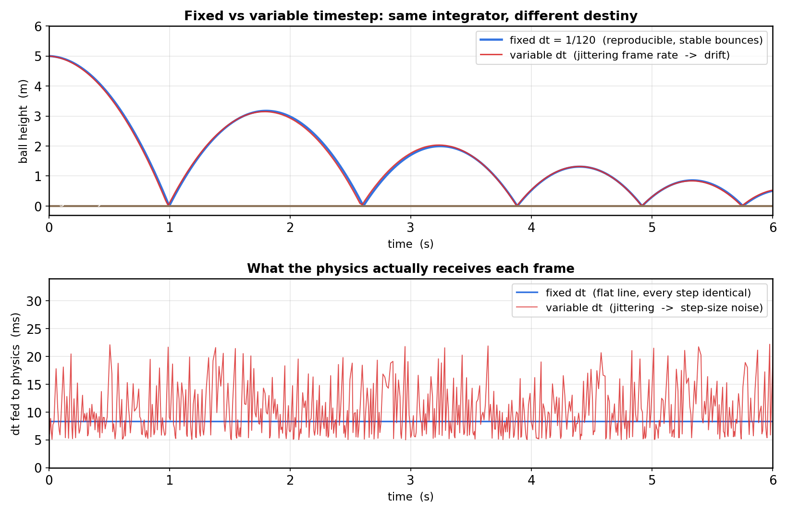
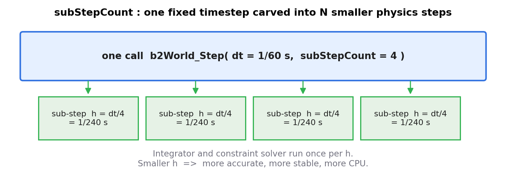
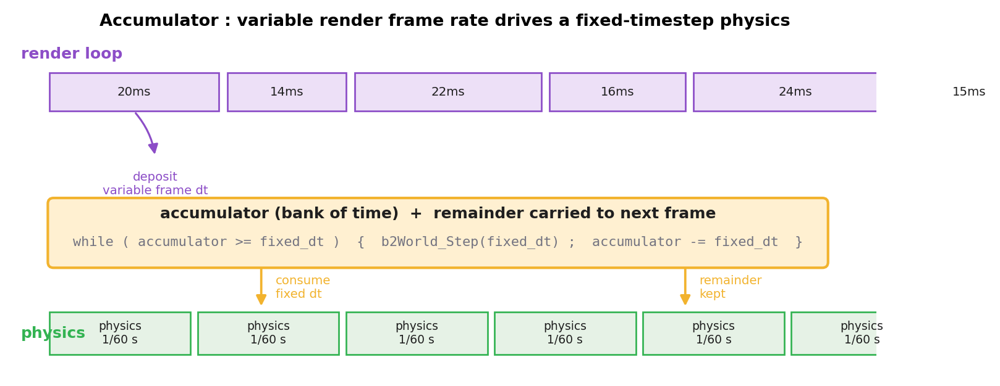
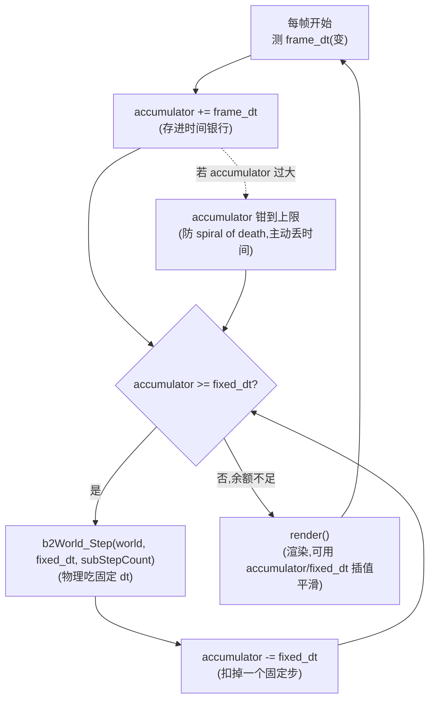
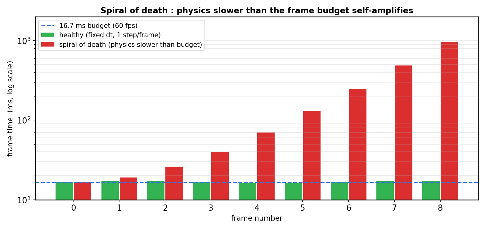

# 第 2 篇 · 第 8 章 · 固定步长与稳定性

> **核心问题**:前两章我们盯着积分器——为什么显式欧拉能量发散,为什么半隐式欧拉保能量。可还有一个更隐蔽的敌人:**步长 dt 本身**。如果每一帧喂给物理的 dt 都在变(渲染卡了一下 dt 变大,渲染太快 dt 又变小),哪怕你用的是最稳的半隐式欧拉,箱子也会抖动、堆叠会塌、约束求解会发散。为什么?这一章回答:**为什么物理引擎必须用固定步长,渲染帧率却可以变,以及怎么用一个时间累计器(accumulator)把两者调和。** 这是第 2 篇(运动与积分)的收尾章。

> **读完本章你会明白**:
> 1. 为什么物理引擎用**固定步长**(fixed timestep),而不是直接拿渲染帧的 dt 推进物理。
> 2. 变步长会撞什么墙——可复现性丢失、约束求解发散、堆叠抖动、能量泄漏。
> 3. Box2D v3 的真实做法:用户调一次 `b2World_Step(dt, subStepCount)`,内部把这一个 dt **切成 subStepCount 个更小的 h 子步**(`h = dt / subStepCount`),每个 h 才是积分和约束求解真正用的步长。
> 4. **累计器(accumulator)** 模式:怎么用"存余量、消费固定 dt"的小技巧,让变帧率的渲染驱动一个固定步长的物理,还躲开"螺旋死亡(spiral of death)"。

> **如果一读觉得太难**:先只记三件事——① 物理用**固定 dt**(不变),渲染 dt 可变,两者用**累计器**调和;② Box2D 的 `subStepCount` 是把一个固定 dt 再切成更小的 h(不是把 dt 拉长);③ 变 dt 最致命的是**不可复现 + 约束求解发散**,不是积分器爆炸。

---

## 〇、一句话点破

> **物理引擎要稳,必须固定步长;可玩家看到的帧率是变的。解法是:物理永远吃固定 dt,渲染吐出的变 dt 先存进一个"时间银行"(accumulator),银行够一个固定 dt 就消费一次物理步,余款留到下一帧。Box2D v3 进一步把每一个固定 dt 再切成 subStepCount 个更小的 h 子步,让积分和约束求解跑在更细的网格上,更稳更准。**

这是结论。本章倒过来拆:先看变步长到底撞了什么墙,再看固定步长为什么救命,最后看 Box2D 的源码怎么落地、累计器怎么调和帧率和物理。

---

## 一、从上一章接过来:积分器稳了,步长不稳也得崩

第 7 章(P2-07)我们讲透了:Box2D 用的**半隐式欧拉**(symplectic Euler)是**辛积分器**(symplectic integrator),它保能量、轨迹有界,不会像显式欧拉那样越蹦越高飞出屏幕。源码铁证在 [src/solver.c](../box2d/src/solver.c) 的速度积分任务里(锚点文件第 2 节核过):

```c
// 简化示意(非源码原文,逻辑来自 src/solver.c 速度积分任务):
linearVelocityDelta  = h * invMass * force + h * gravityScale * gravity;
angularVelocityDelta = h * invInertia * torque;
// 位置积分用 NEW 速度  -> 这就是"半隐式"
deltaRotation = b2IntegrateRotation(deltaRotation, h * angularVelocity);
```

到这里你也许会想:积分器选对了,稳了,物理引擎该靠谱了吧?

**还差一步**。注意上面那段代码里反复出现的 `h`——那是**步长**,也就是"这一步推进多少时间"。辛积分器保能量的结论,有一个**前提**:步长 `h` 是固定的、足够小的。如果 `h` 每一步都在变,辛积分器的"保能量"性质会**被破坏**;如果 `h` 偶尔变得很大,再辛的积分器也救不了你。这一章就来拆:**步长本身**为什么必须固定,以及游戏里帧率会波动时,怎么既保住"固定 dt"又保住"画面流畅"。

> **钉死这件事**:积分器稳定性(第 6~7 章)和步长稳定性(本章)是**两件事**。前者回答"用什么公式更新速度位置不爆炸",后者回答"喂给这个公式的 dt 必须是什么样"。两者都得稳,物理才靠谱。本章专门处理后一件。

---

## 二、变步长撞的三堵墙

我们先看反面教材:如果**直接拿渲染帧的 dt 喂给物理**,会撞什么墙。这是初学者最容易踩的坑——"渲染每帧给我一个 deltaTime,我直接 `world.step(deltaTime)` 不就完了?"——结果游戏一卡顿,箱子就抖。

### 墙一:不可复现——同样的输入,不同的结果

物理引擎一个被严重低估的属性,叫**可复现性**(determinism / reproducibility):**同样的初始状态 + 同样的输入,必须跑出完全一样的轨迹**。

为什么可复现性重要?

- **联网多人游戏**:十个玩家各自的机器跑同一个物理模拟,如果不可复现,你的机器上箱子落在 A,队友的机器上箱子落在 B,两边状态对不上,只能不停同步,带宽爆炸。可复现的引擎可以"只传输入,各自模拟",状态天然一致。
- **回放 / 录像**:电竞游戏的录像、调试时的 bug 复现,都依赖"喂同样输入 → 跑出同样画面"。dt 一变,轨迹就漂,录像对不上。
- **自动化测试**:物理引擎自己的回归测试(给定场景,箱子应该停在某个确定位置),dt 一抖,结果变,测试没法写。

固定步长是可复现性的**地基**。看一张模拟图:



上图是同一个球、同一个重力、同一个半隐式欧拉,唯一区别是**喂给它的 dt 序列**:蓝色用固定 `dt = 1/120`,红色用一串抖动的 `dt`(模拟帧率在 45~200 fps 之间随机波动)。看清楚两件事:

- **上图的轨迹**:蓝色的每次弹起高度干净一致(可复现),红色的弹起高度飘忽不定(同一颗球,因为 dt 抖动,弹得时高时低)。
- **下图的 dt 序列**:蓝色的 dt 是一条平直的线(每一步都一样),红色的 dt 在 5~30 毫秒间乱跳。

这就是第一堵墙:**变 dt 让物理模拟不可复现**。同一份代码、同一份输入,在不同机器、不同帧率下,跑出不同的物理。

> **不这样会怎样**:如果物理直接吃渲染 dt,那么"显卡快的时候球弹得高、显卡慢的时候球弹得低"——这显然不是物理。联网对战时,帧率不同的两台机器会跑出两个不同的世界。

### 墙二:约束求解发散——堆叠的箱子会塌

第二堵墙更狠,它直接打到**第 5 篇要讲的约束求解**(Sequential Impulse)的命门。

约束求解器(Sequential Impulse / PGS)在每个时间步里,要解的是"让所有接触点不穿透、让所有关节不被拉开"这一组约束。它的求解过程依赖 `h`(以及 `1/h`)——具体地,约束的"有效质量"(effective mass)和"软度"(softness)都是 `h` 的函数(锚点文件第 1 节核过 Box2D 的 `b2MakeSoft(hertz, dampingRatio, h)`)。

```c
// src/physics_world.c (简化,见 #L892-L914):
context.dt = timeStep;
context.subStepCount = b2MaxInt( 1, subStepCount );
context.h = timeStep / context.subStepCount;           // 子步步长
context.inv_h = context.subStepCount * context.inv_dt;
// ...
context.contactSoftness = b2MakeSoft( contactHertz, world->contactDampingRatio, context.h );
context.staticSoftness  = b2MakeSoft( 2.0f * contactHertz, world->contactDampingRatio, context.h );
```

注意 `context.h` 直接进了 `b2MakeSoft`——接触约束的刚度(弹簧 hertz)和阻尼,是按 `h` 调的。**如果 `h` 每步都在变**,接触约束的刚度就在变:这一步箱子之间是硬弹簧,下一步突然变软弹簧,再下一步又变硬。一堆箱子叠在一起,底部箱子每一步感受到的"支撑力"在剧烈波动,结果就是**整个堆叠在抖,甚至直接塌掉**。

这跟积分器稳不稳定无关——这是**约束求解器对 `h` 的敏感性**。哪怕你的积分器是辛的、保能量的,只要 `h` 在抖,约束求解就稳不下来。这一点很多初学者没意识到的:他们以为换了半隐式欧拉就万事大吉,结果堆叠还是抖,根因是 dt 在变。

> **不这样会怎样**:一摞箱子叠着,渲染帧率突然掉到 30fps(手机发烫降频、后台有进程抢 CPU),dt 翻倍,接触约束的有效质量和软度全变,箱子之间的接触刚度突变,整摞箱子塌成一堆。

### 墙三:数值精度与边界条件——穿透和隧穿(tunneling)

第三堵墙更隐蔽,但更致命。物理引擎里很多阈值是按"一个标准 dt"标定的:

- **连续碰撞检测(CCD)** 的扫掠距离按 `v * dt` 算,dt 一变大,高速物体一帧跨过的距离变大,更容易**穿透(tunnel)**——子弹穿过薄墙。
- **穿透修正**(position correction)的速率按"每个 dt 修正多少"标定,dt 突然变大,修正过冲,物体被瞬移。
- **休眠判定**(sleep threshold)按"连续 N 步速度低于阈值就睡",dt 一变,N 步对应的真实时间变了,该睡的不睡、不该睡的乱睡。

这些机制都假设"dt 是一个固定的、已知的量"。一旦 dt 漂移,这些按 dt 标定的边界条件全都失准,各种诡异的 bug(穿墙、抖动、卡顿)就冒出来。

> **所以这样设计**:物理引擎把 dt 当成一个**常量**(固定步长),所有按 dt 标定的东西(积分器系数、约束软度、CCD 扫掠距离、休眠阈值)都基于这个常量,引擎才能在一个稳定的"参考系"里工作。这就是为什么所有严肃的物理引擎(Box2D、PhysX、Bullet、Havok、Chipmunk)都用固定步长。

---


## 三、为什么固定步长才稳:把 dt 当成一个已知的常量

现在正面讲:**固定步长(fixed timestep)为什么是物理稳定性的基石**。一句话——**它让物理引擎在一个已知的、不变的时间网格上工作**,所有按 dt 标定的东西都有了可靠的参考。

### 固定 dt 把"对 dt 的敏感性"整个消掉

回想第二堵墙:约束软度是 `h` 的函数。如果 `h` 固定(比如永远是 `1/240`),那么接触约束的刚度永远是那一个值,一堆箱子叠着,每一步的接触刚度都一样,堆叠就稳。这是固定 dt 最直接的收益:**把 dt 从一个变量降为一个常量,所有依赖 dt 的东西都不再随帧率波动**。

同样地:

- **积分器的能量误差**有界且确定(辛积分器在固定 h 下,能量在一个固定的微小区间内振荡,不会漂)。
- **CCD 的扫掠距离**固定,穿墙判定稳定。
- **休眠阈值**对应的真实时间固定,该睡的稳定地睡。

固定 dt 让物理引擎的行为**可预测、可标定、可复现**。这是稳定性的第一块基石。

### 固定 dt 让"可复现性"自然成立

回到墙一。如果 dt 是常量 `1/60`,那么"同样的初始状态 + 同样的输入序列"必然跑出**逐位相同(bit-identical)**的轨迹——因为每一步推进的时间一样、用的公式一样、浮点运算的顺序一样,结果当然一样。这就是物理引擎可复现性的来源:**固定 dt + 确定的积分公式 + 确定的浮点顺序 = 完全可复现**。

这一点对联网游戏、录像、自动化测试都至关重要。Box2D 默认开**双精度**(`#define b2CreateWorld b2CreateWorldDoublePrecision`,见 `include/box2d/box2d.h`),正是为了在更长的时间跨度上保住可复现性(单精度浮点误差累积更快,长跑会漂)。

> **钉死这件事**:固定 dt 的三大收益——① 消掉约束求解对 dt 的敏感性(堆叠不抖);② 让积分误差有界确定(能量不漂);③ 让整个模拟可复现(同输入同输出)。这三件,变 dt 全都做不到。

---

## 四、Box2D v3 的真实做法:固定 dt + subStepCount 切子步

讲了这么多"为什么固定",现在看 Box2D v3.2 源码**怎么落地**。这里有个**容易踩的误解**(连一些老资料都讲错),我们要讲清楚。

### 误解:Box2D 内部会自动适应变 dt

错。Box2D **不做帧率适配**。它的 API 就是吃一个你给的 `timeStep`,你给什么它用什么。它**假设你给的是固定 dt**(或者你至少知道自己在干什么)。帧率适配是**调用方**(你的游戏主循环)的责任——这正是下一节"累计器"要讲的。

### 真相:一个 dt 被切成 subStepCount 个更小的 h 子步

看 `b2World_Step` 的签名(锚点文件第 1 节逐行核过):

```c
void b2World_Step( b2WorldId worldId, float timeStep, int subStepCount )
//                                ^^^^^^^^^^^^      ^^^^^^^^^^^^^^^
//                                你给的固定 dt      把这个 dt 切成几份
```

在 [src/physics_world.c:828](../box2d/src/physics_world.c#L828) 里,它干了这件事:

```c
// src/physics_world.c:890-899 (已逐行核):
b2StepContext context = { 0 };
context.world = world;
context.dt = timeStep;                                    // 你给的固定 dt
context.subStepCount = b2MaxInt( 1, subStepCount );       // 至少 1

if ( timeStep > 0.0f )
{
    context.inv_dt = 1.0f / timeStep;
    context.h = timeStep / context.subStepCount;          // ★ 子步步长
    context.inv_h = context.subStepCount * context.inv_dt;
}
```

**关键的一行**:`context.h = timeStep / context.subStepCount;`

这一行的意思是:**你调一次 `b2World_Step(dt = 1/60, subStepCount = 4)`,Box2D 内部真正积分和求解约束用的步长是 `h = (1/60)/4 = 1/240`**。它把这一个固定 dt **切成 4 份**,每份 `1/240` 秒,然后**每个 h 子步跑一遍完整的"积分速度 → 解约束 → 积分位置"**(详见第 5 篇 P5-16 的 `b2Solve` 分阶段流水线)。

看一张示意图:



为什么要把一个 dt 再切小?这背后是 v3.2 的**子步进软约束求解器(sub-stepping soft constraint solver)**——把接触和关节做成有 hertz 和阻尼比的"软弹簧"(soft constraint),hertz 越高弹簧越硬、越接近刚性,但 hertz 太高又需要更小的 h 才能稳定积分(`b2MinFloat(world->contactHertz, 0.125f * context.inv_h)` 这一行,physics_world.c:912,就是按 h 把 hertz 钳住,避免 h 太小时硬弹簧发散)。这是"用子步换稳定性"的工程权衡:

- **subStepCount = 1**:h = dt,一次积分,快但约束可能不稳(堆叠抖)。
- **subStepCount = 4**:h = dt/4,四次积分,慢一点但约束稳得多(默认值附近)。
- **subStepCount = 8+**:更稳,但 CPU 翻倍,留给渲染的预算就少了。

> **承接书讲过**:[[graphics-series-project]] 的《游戏引擎》P3-10 讲过"游戏主循环用固定步长 update",那个"固定 dt"的概念这里一句带过。**物理引擎特有的、本书要讲的是**:`subStepCount` 这个二次切分——它不是"把 dt 拉长或缩短去匹配帧率",而是"在已经固定的 dt 内部,再切成更小的 h,让约束求解跑在更细的网格上"。这是物理引擎(尤其 v3.2 的软约束求解器)的独门设计,游戏引擎那本不涉及。

### 诚实标注:这跟老资料讲的"固定 dt"有出入

很多老资料(包括一些 Box2D v2 时代的教程)讲固定步长,只说"用一个不变的 dt 推进物理",没提 subStepCount。这是**简化**——概念主线没错(dt 固定是基调),但 v3.2 的源码层是**"固定 dt + 子步切分"双层结构**。讲源码必须讲清 `context.h = timeStep / subStepCount` 这一层,否则读者看源码会困惑"明明 API 叫 dt,为什么内部还有个 h"。这是本系列"诚实标注版本演进"的一贯要求(同 go1.27、Box2D-v3 之于老 v2)。

> **钉死这件事**:Box2D v3 的步长结构是**双层**——外层 `dt`(你给的固定步,通常 1/60)由调用方保证固定;内层 `h = dt / subStepCount`(每个子步的步长)由 Box2D 自己切。积分和约束求解真正用的是 `h`,不是 `dt`。这是 v3.2 软约束求解器的工程实现。

---


## 五、累计器(accumulator):变帧率驱动固定物理

现在到一个关键的工程问题:**玩家看到的帧率是会变的**(显卡快就 144fps,手机发烫就掉到 30fps),可物理又必须吃固定 dt。怎么调和?

答案是 **累计器(accumulator)模式**,由 Glenn Fiedler 在《Fix Your Timestep!》一文里讲透,是游戏开发里几乎人手一份的经典模式。

### 思路:时间银行

核心比喻是一个**时间银行**:

- 每一帧,渲染层告诉你"离上一帧过了多久"(变量 `frame_dt`)。你把这笔时间**存进**银行(accumulator += frame_dt)。
- 然后,只要银行里的余额够一个**固定 dt**(accumulator >= fixed_dt),就**消费一次**:跑一遍 `b2World_Step(fixed_dt)`,从银行扣掉 fixed_dt。
- 不够一个 fixed_dt 的零头,**留在银行里**,等下一帧凑齐。

这样,物理永远吃固定 dt(可复现、约束稳),但渲染层该多快就多快。看一张示意图:



### 伪代码

这是累计器模式的典型实现(简化示意,非源码原文——Box2D 的 API 是被调用的,这段是**调用方**的游戏主循环):

```c
// 简化示意(非源码原文):游戏主循环里的累计器
float fixed_dt = 1.0f / 60.0f;     // 物理固定步长
float accumulator = 0.0f;           // 时间银行

while ( game_running )
{
    float frame_dt = get_frame_time();   // 渲染层测的帧间隔(变)
    accumulator += frame_dt;              // 存进银行

    // 关键:限制 accumulator 别无限涨(防 spiral of death,见下节)
    if ( accumulator > 0.25f )
        accumulator = 0.25f;

    while ( accumulator >= fixed_dt )
    {
        b2World_Step( worldId, fixed_dt, 4 );   // 物理吃固定 dt
        accumulator -= fixed_dt;                 // 扣掉一个 fixed_dt
    }

    render();   // 渲染(可用 accumulator/fixed_dt 做插值平滑,见下)
}
```

读这段代码,注意三件事:

1. **`b2World_Step` 永远拿同一个 `fixed_dt`** —— 物理吃的是常量,可复现、约束稳。
2. **一帧可能跑 0 次、1 次或多次 `b2World_Step`** —— 渲染太快(比如 144fps)时,很多帧 accumulator 不够一个 fixed_dt,这帧 0 次物理步;渲染慢(比如掉到 30fps)时,一帧可能跑 2~3 次物理步追进度。物理的"节奏"和渲染解耦。
3. **余款(`accumulator`)留在银行** —— 它代表"物理还没追上的那点时间",下一帧继续用。

把这套逻辑画成流程图,看它怎么把"变帧率"适配到"固定物理步":



这张图把累计器模式的核心讲清了:**变 frame_dt 进来 → 存银行 → 够一个 fixed_dt 就跑一次固定物理步 → 余额留下帧**。物理永远吃同一个 fixed_dt(可复现、约束稳),变帧率的波动全被银行吃掉了。

### 插值平滑:别让物体"卡"在离散位置上

累计器有个小副作用:渲染发生在物理步之间,渲染那一刻物体可能"卡"在最后一次物理步算出的位置上,画面看起来一卡一卡的(尤其高刷新率屏幕)。常见解法是**插值(interpolation)**:渲染时,用 `alpha = accumulator / fixed_dt`(0 到 1 之间)在"上一步的位置"和"这一步的位置"之间线性插值:

```c
// 简化示意:渲染插值
float alpha = accumulator / fixed_dt;
Vec2 render_pos = prev_pos * (1 - alpha) + curr_pos * alpha;
draw_at( render_pos );
```

这样画面完全平滑,物理又稳。Box2D v3 没有内置插值(API 不关心渲染),这是**调用方**该做的——但这是成熟的游戏引擎标配。这一点不展开,知道有这个机制即可。

> **所以这样设计**:累计器把"渲染节奏"和"物理节奏"解耦——渲染随硬件快慢浮动,物理按固定 dt 一步一步稳稳走。这是"在变帧率的硬件上保住固定步长物理"的标准工程模式。

---

## 六、累计器的暗坑:螺旋死亡(spiral of death)

累计器很好用,但有一个著名的暗坑叫**螺旋死亡(spiral of death)**,必须讲。

### 什么是螺旋死亡

螺旋死亡的剧本:**物理步本身比 fixed_dt 还慢**。比如 `fixed_dt = 1/60`(16.7ms),但你场景里物体太多,一次 `b2World_Step` 要花 25ms。会发生什么?

1. 这一帧渲染花了 25ms,accumulator 存进 25ms。
2. 累计器消费一个 16.7ms,跑一次物理步……物理步又花 25ms。
3. 现在累计器还剩 8.3ms,但下一帧的 frame_dt 又是 25ms,accumulator 涨到 33.3ms。
4. 累计器这次要消费 2 次(33.3 / 16.7 ≈ 2)……但每次物理步要 25ms,2 次就是 50ms。
5. 下一帧 frame_dt 涨到 50ms,accumulator 涨到 ~75ms,要消费 4~5 次……
6. 雪崩。每帧要跑的物理步指数级增长,帧时间指数级膨胀,游戏彻底卡死。

看一张图:



注意这是**对数轴**——螺旋死亡的帧时间从 16ms 一路涨到接近 1000ms,指数爆炸。

### 怎么躲:钳住 accumulator

解法很朴素,就是上面伪代码里那一行:

```c
if ( accumulator > 0.25f )
    accumulator = 0.25f;   // 钳住,别让它无限涨
```

**钳住 accumulator**意味着:如果物理追不上,就**主动丢弃一部分时间**——物理会"慢放"(游戏里的时间过得比真实时间慢),但不会卡死。这是"宁可慢放也不要卡死"的工程权衡。

还有别的缓解手段:

- **降低 subStepCount** —— 把 `subStepCount` 从 4 降到 1,物理步变快(但约束求解精度下降,堆叠可能抖)。这是"用精度换性能"。
- **动态降级** —— 检测到帧率掉,临时禁用某些昂贵的特性(CCD、软约束的高 hertz)。
- **场景分块 / 休眠** —— 让远处的物体休眠(第 5 篇 P5-18 讲),减少每步要算的物体数。

> **钉死这件事**:累计器不是银弹。如果物理步本身比 fixed_dt 还慢,会螺旋死亡。生产代码必须钳住 accumulator(主动丢时间换不卡死),并准备好性能降级方案(降 subStepCount、开休眠、关昂贵特性)。这是"在现实硬件上跑物理"的硬经验。

---

## 七、技巧精解:固定步长 + 累计器,两个第一性洞察

这一章最硬核的两个技巧,单独拆透。

### 洞察一:为什么物理步长必须固定,而渲染帧率可以变

这是一个**不对称**:物理要固定,渲染要可变。为什么?

**物理要固定**,因为物理引擎里的数学(积分器、约束求解、CCD)对 dt 敏感,dt 一变,这些数学的全局性质(保能量、收敛、不穿透)就破坏。固定 dt 让这些数学在一个已知的、标定好的网格上工作。

**渲染可以变**,因为渲染的本质是"把当前状态画出来",画一帧不需要任何累积性质——这一帧画什么,只取决于"当前物体在哪",跟"上一帧画了什么"无关(顶多加一点运动模糊之类的后处理)。所以渲染帧率浮动,只是"画得快慢",不影响状态正确性。

累计器的精妙,正是利用了这种**不对称**:**让对 dt 敏感的(物理)吃固定 dt,让对 dt 不敏感的(渲染)承担变帧率的波动**。这是"把不稳定的部分隔离起来"的工程智慧——和数据库的"写日志顺序 + 异步刷盘"(把强一致的部分顺序化、把性能的部分异步化)是同一种思路。

> **不这样设计会怎样**:如果反过来,让物理吃变 dt(对 dt 敏感的东西吃了波动),渲染吃固定 dt(对 dt 不敏感的东西反而被锁死)——那物理不稳(箱子抖、不可复现),渲染又没法适配硬件(144Hz 屏幕被锁 60fps 卡顿)。两边都坏。

### 洞察二:subStepCount 的本质——用子步换约束稳定性

第二个洞察是 Box2D v3.2 的 `subStepCount`。它的本质是**"用更多的计算,换更稳的约束求解"**。

为什么子步能让约束更稳?回到锚点文件第 1、2 节核过的源码:Box2D v3.2 把接触和关节做成**软约束(soft constraint)**——一根有 hertz(刚度)和阻尼比的"弹簧"。软约束比刚性约束更稳(不会因为硬碰撞瞬间产生巨大冲量导致求解发散),但软弹簧有个要求:**积分它的步长 h 必须足够小**(经验法则:h 至少比弹簧周期的 1/10 还小)。

源码里这一行([src/physics_world.c:912](../box2d/src/physics_world.c#L912))就是这条法则的落地:

```c
float contactHertz = b2MinFloat( world->contactHertz, 0.125f * context.inv_h );
```

`0.125f * inv_h` 就是 `1/(8h)`——把接触 hertz 钳在 `1/(8h)` 以下,保证一个弹簧周期至少被切成 8 个子步。如果用户给的 `dt` 大(比如 `1/30`)、`subStepCount` 又小(比如 1),那么 `h = 1/30`,`1/(8h) = 3.75Hz`,hertz 被钳到 3.75,接触变得很软(箱子陷进地面);要恢复硬度,就得**增大 subStepCount**(比如 4,那 `h = 1/120`,`1/(8h) = 15Hz`,接触硬得多)。

这就是 subStepCount 的本质:**用更多的子步,换更小的 h,换更硬(更接近刚性)但仍稳定的接触约束**。这是个**性能 vs 精度**的旋钮,用户(游戏开发者)根据场景调:

- 休闲游戏、物体少:`subStepCount = 1`,省 CPU。
- 堆叠多、要求稳:`subStepCount = 4`(常见默认)。
- 高精度仿真、机器人:`subStepCount = 8+`,牺牲性能换精度。

这个旋钮的设计,体现了物理引擎的核心张力:**你想让约束多硬(真实),就得让 h 多小,就得跑多少子步(贵)**。这是物理引擎"稳定性 vs 性能"的根本权衡,贯穿全书。

> **钉死这件事**:Box2D 的步长不是"一个 dt"而是"dt + subStepCount 双层"。`subStepCount` 是个旋钮——用户用更多的子步换更硬更稳的接触约束。这是 v3.2 软约束求解器的工程精髓,也是"物理引擎稳定性 vs 性能"张力的具体体现。

---

## 八、章末小结

### 回扣主线

本章是第 2 篇(运动与积分)的收尾,服务**响应**这一面(动力学积分的稳定性)。我们把稳定性拆成了**两层**:① 积分器稳不稳定(第 6~7 章,显式欧拉发散 vs 半隐式保能量);② **步长稳不稳定(本章,固定 dt vs 变 dt)**。两层都稳,物理引擎的运动模拟才靠谱。

具体来说,本章立起三件事:① 物理引擎必须用**固定步长**(消掉约束对 dt 的敏感性、让积分误差有界、保可复现性);② Box2D v3.2 用**双层步长**(`dt` + `subStepCount` 切 `h` 子步),用子步换约束稳定性;③ 渲染帧率可变,用**累计器(accumulator)**调和——物理吃固定 dt,渲染吃变 dt,中间一个时间银行吃余量,还要防"螺旋死亡"。

到这一章为止,第 2 篇"运动与积分"全部讲完:第 5 章动力学物理量、第 6 章显式欧拉发散、第 7 章半隐式辛欧拉、第 8 章固定步长。你已经懂了**物理引擎怎么把运动稳稳地推进一步**。接下来,本书进入**检测侧**——物体运动起来了,怎么知道它跟谁碰了。

### 五个为什么

1. **为什么物理必须用固定步长?**——物理引擎里的积分器、约束求解、CCD、休眠阈值都按 dt 标定,dt 一变这些全失准(约束软度变、能量漂、不可复现、穿墙)。固定 dt 把 dt 降为常量,让引擎在已知网格上稳定工作。
2. **变 dt 最致命的是什么?**——不是积分器爆炸(辛积分器在变 dt 下也大致保能量),而是**约束求解发散**(接触刚度随 dt 抖动,堆叠塌)+ **不可复现**(同输入不同输出,联网/录像/测试全废)。
3. **Box2D 的 subStepCount 是干啥的?**——把一个固定 dt 切成 subStepCount 个更小的 h 子步,每个 h 跑一遍积分和约束求解。h 越小,接触约束可以越硬(更真实)但仍稳定。这是"用子步换约束稳定性"的旋钮,本质是 v3.2 软约束求解器对"hertz/h 比值"的要求。
4. **渲染帧率会变,怎么调和固定 dt?**——用**累计器**:每帧把变 frame_dt 存进时间银行,银行够一个 fixed_dt 就消费一次 `b2World_Step(fixed_dt)`,余款留下帧。物理吃固定 dt(可复现、约束稳),渲染承担变帧率。
5. **什么是螺旋死亡,怎么躲?**——物理步本身比 fixed_dt 还慢时,accumulator 不断堆积,每帧要跑的物理步指数增长,帧时间指数爆炸。躲法:钳住 accumulator(主动丢时间换不卡死)+ 性能降级(降 subStepCount、开休眠、关 CCD)。

### 想继续深入往哪钻

- **累计器的进阶**:Glenn Feldler《Fix Your Timestep!》——累计器模式 + 插值平滑的奠基文章,游戏开发必读。
- **可复现性**:搜"physics engine determinism"——联网游戏的 lockstep 同步、状态同步都建立在物理可复现性上。Box2D 默认开双精度(`b2CreateWorldDoublePrecision`)也是为这个。
- **软约束与 hertz**:`b2MakeSoft(hertz, dampingRatio, h)` 的数学(锚点文件第 1 节),第 5 篇 P5-16 讲 Sequential Impulse 时会深入。本章点一下"hertz 钳到 1/(8h)"的工程含义即可。
- **CCD 与 dt 的关系**:第 5 篇 P5-18 讲连续碰撞检测(CCD),dt 大时高速物体穿墙,那是 dt 影响检测精度的另一面。

### 引出下一章

第 2 篇到这里收尾——你已经懂了物理引擎怎么**稳稳地把运动推进一步**(动力学物理量、辛积分器保能量、固定步长)。但物体运动起来只是故事的一半:**物体动起来之后,怎么知道它跟谁碰了?** 这是物理引擎的**检测**那一半。下一章 P3-09 进入第 3 篇(碰撞检测·宽相),从最基础的几何工具讲起——**AABB(轴对齐包围盒)**:用一个轴对齐的矩形"包住"任意形状,快速判断两个物体"可能碰"。这是检测侧的地基,也是检测 vs 响应二分法里"检测"那一面的第一步。

> **下一章**:[P3-09 · AABB:轴对齐包围盒](P3-09-AABB-轴对齐包围盒.md)

---

> **承接说明**:本章涉及游戏主循环固定步长的概念,见 [[graphics-series-project]]《游戏引擎》P3-10(已一句带过)。物理引擎特有的内容(为什么物理尤其要固定:约束求解稳定性、可复现性;Box2D 的 subStepCount 双层步长;累计器调和帧率;螺旋死亡)是本章重点,篇幅都留给了这些。涉及积分器稳定性,回扣第 6~7 章(承《数学分析》数值方法)。涉及约束求解对 dt 的敏感性,预告第 5 篇 P5-16(Sequential Impulse)。
