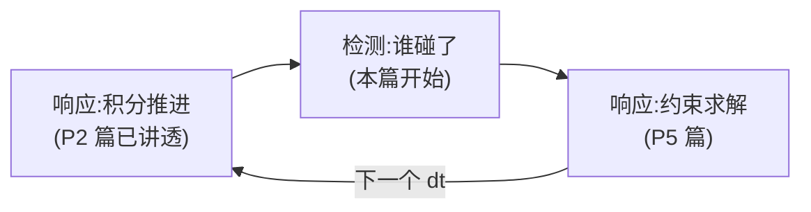
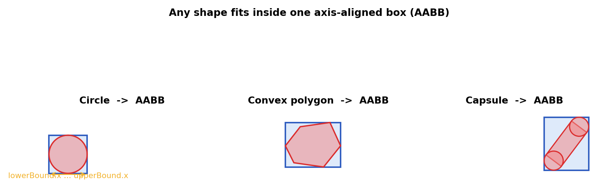
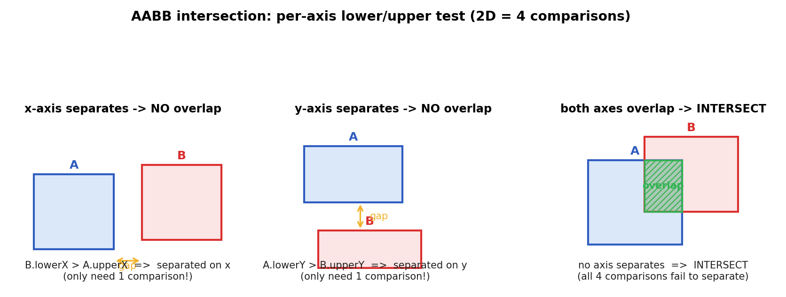
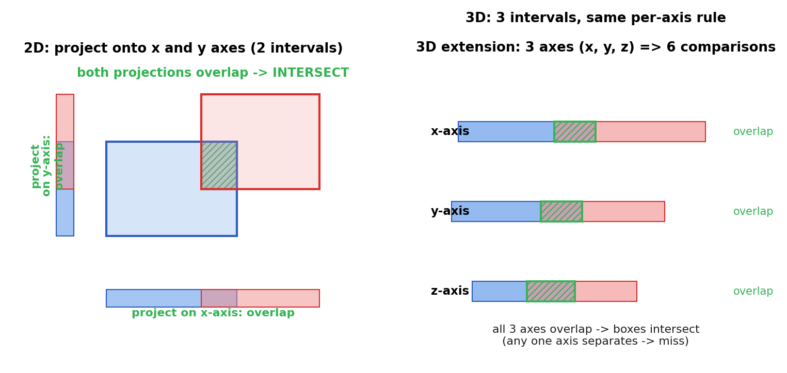
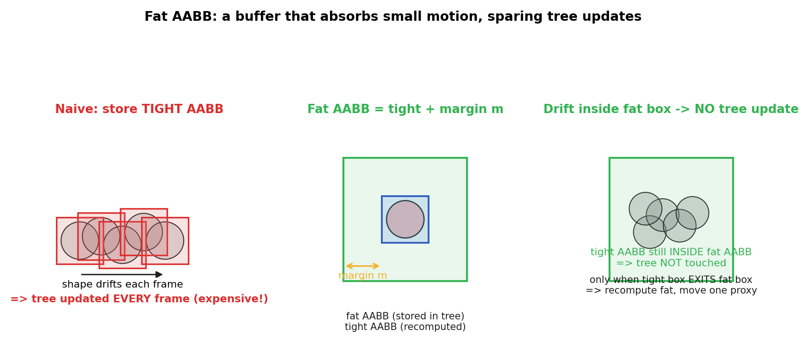

# 第 3 篇 · 第 9 章 · AABB:轴对齐包围盒

> **核心问题**:第 2 篇我们把运动侧(响应)讲透了——半隐式欧拉保能量、固定步长保稳定。可物体动起来只是故事的一半:它动起来之后,**怎么知道它跟谁碰了?** 这就跨进了**检测**那一半。检测的第一步叫**宽相(broad phase)**,要做的事一句话:从几千个物体里,快速排除掉绝大多数不可能碰的对,只留少数"可能碰"的候选。可每个物体形状千奇百怪(圆、多边形、胶囊、线段),两两精确检测太贵——你得先给每个物体套上一层**便宜的外壳**,只比这层外壳就能粗筛。这层外壳就是 **AABB(axis-aligned bounding box,轴对齐包围盒)**:一个边和坐标轴平行的最小矩形(2D)/长方体(3D),把任意形状严严实实包住。两个 AABB 重不重叠,只要在每个坐标轴上比几次 lowerBound / upperBound——O(1),极便宜。本章是检测侧的地基,也是宽相的第一块砖:先讲清单个 AABB 是什么、怎么从任意形状算出来,再讲清两个 AABB 怎么判相交(逐轴投影),最后讲一个工程上极关键的优化——**fat AABB**(把真 AABB 外扩一层缓冲,让运动的物体不必每帧都更新宽相树)。

> **读完本章你会明白**:
> 1. 什么是 AABB,为什么它必须是**轴对齐**的(轴对齐换来 O(1) 的相交判断,代价是它比真形状"松"),以及怎么从圆 / 多边形 / 胶囊 / 线段各类形状算出各自的 AABB。
> 2. 两个 AABB 怎么判相交——**逐轴投影**法:2D 只需 4 次大小比较,3D 只需 6 次,无需任何形状细节,这就是它"廉价"的根源。
> 3. Box2D v3.2 怎么存 AABB(`b2AABB` 结构 = lowerBound + upperBound 两个 `b2Vec2`)、相交 / 包含 / 合并函数长什么样(★诚实标注:这些函数不在 `src/aabb.c`,而是 `B2_INLINE` 在 `include/box2d/math_functions.h`)。
> 4. **fat AABB** 为什么能省树更新:把真 AABB 外扩一层 margin,物体在小范围内游走时 tight AABB 还在 fat AABB 里,宽相树就不用动——一次 `b2BroadPhase_MoveProxy` 都不必调。
> 5. AABB 是检测的"廉价外壳",但它是**保守**的:它绝不会漏报相交(AABB 不重叠 ⇒ 一定不碰),但会**误报**(AABB 重叠 ≠ 真碰)——误报交给窄相去精确确认。

> **如果一读觉得太难**:先只记三件事——① AABB 就是给每个物体套一个边和坐标轴平行的最小方框;② 两个方框重不重叠,只要在 x、y(3D 再加 z)每个轴上比 lowerBound / upperBound,全重叠才算碰,**4(或 6)次比较搞定**;③ 物体动起来时,存一个**放大版的 fat AABB**,真 AABB 还在 fat AABB 里就不更新树。三件事记牢,本章就通了。

---

## 〇、一句话点破

> **AABB 是检测的廉价外壳:把任意形状套进一个轴对齐的最小方框,两个方框重不重叠只需在每个坐标轴上比 lower / upper(2D 4 次比较)。它保守——AABB 不重叠 ⇒ 一定不碰,但 AABB 重叠 ≠ 真碰(误报交给窄相)。物体运动时再套一层 fat AABB 吸收小位移,让宽相树不必每帧重建。**

这是结论。本章倒过来拆:先看 AABB 是什么、为什么必须轴对齐,再看怎么从形状算 AABB、怎么判两个 AABB 相交,最后去 Box2D v3.2 源码里印证,并拆透 fat AABB 这个省更新的工程技巧。

---

## 一、从上一章接过来:响应稳了,转入检测

第 2 篇(P2-05 ~ P2-08)我们一直待在**响应**这一侧:讲清了刚体动力学物理量(P2-05)、显式欧拉为什么能量发散(P2-06)、半隐式欧拉凭什么保能量稳定(P2-07)、固定步长 + subStepCount 为什么让约束求解不抖(P2-08)。一句话,我们已经知道物理引擎怎么把运动**稳稳地推进一步**。

可物体动起来之后呢?第 4 章(P1-04)那张全景图提醒我们:一个时间步里,积分推进之后紧接着的就是**检测**——



积分把物体推到新位置(可能推得过头、和别的物体重叠),这时**检测**要回答:谁和谁碰了?碰在哪个点?穿进去多深?这些信息再喂给**约束求解**,把穿透消除掉。

> **承接前文**:检测 vs 响应二分法、一个时间步的完整流程、为什么检测分宽相窄相两步——这些在第 4 章(P1-04)已立起骨架。本章只从那张全景图里取出"宽相 · AABB"这一块砖往下拆,不重复骨架。

检测这一半自己又分两步——这是第 4 章讲过的:**宽相(粗筛)**用便宜的 AABB 把不可能碰的对排除掉,只留候选;**窄相(精确)**用 SAT / GJK 对候选对精确判断,算出接触流形。本章只讲宽相用到的**第一块砖**——AABB 本身。宽相怎么用空间划分把 n² 配对降到近 O(n),是下一章(P3-10);Box2D 用什么数据结构(动态 AABB 树)做这件事,是 P3-11。

> **钉死这件事**:本章的范围**只是 AABB 这一个数据结构**——它是什么、怎么算、两个怎么判相交、fat AABB 怎么省更新。它服务检测·宽相,是宽相的"货币":宽相里所有的判断、所有的数据结构,底层都在比 AABB。把这块砖立稳,后面 P3-10 / P3-11 才有地基。

---

## 二、AABB 是什么:给任意形状套一个轴对齐方框

### 2.1 朴素问题:精确检测太贵,先来一层便宜的"外壳"

想象一个游戏场景:几百个箱子、小球、胶囊形的人物散布在地图各处。任何一瞬间,我们要知道**谁和谁可能碰**。最朴素的做法是对每对物体做精确相交判断(两个多边形相交?圆和胶囊相交?)——可精确判断贵:两个多边形相交要算 SAT(对每条边投影),圆和胶囊要算距离,每个形状对的处理逻辑还不一样。

> **不这样会怎样**:几千个物体两两精确检测是 O(n²) 次、每次还贵——n = 1000 时每帧约 50 万次精确检测,16ms 帧预算根本不够,游戏卡死。这堵墙第 4 章的技巧精解里已经撞过一次。

聪明办法是:**先给每个物体套一层便宜的外壳,只比外壳就能粗筛**。这层外壳要满足两个要求:

1. **比外壳极便宜**:两个外壳重不重叠,要比精确相交检测便宜几个数量级。
2. **保守不漏报**:外壳说"不重叠" ⇒ 物体一定不相交(绝不放过任何真碰);外壳说"重叠",才可能真碰(允许误报,误报交给窄相)。

这层外壳,就是 **AABB(axis-aligned bounding box,轴对齐包围盒)**。

### 2.2 AABB 的定义:轴对齐的最小方框

**AABB** 是一个**边和坐标轴平行**的、把物体完全包住的最小方框(2D 是矩形,3D 是长方体)。它只存两个点:

- **lowerBound**(左下角):每个坐标轴上的**最小**值。
- **upperBound**(右上角):每个坐标轴上的**最大**值。

2D 里 `lowerBound = (minX, minY)`、`upperBound = (maxX, maxY)`,方框就是这两个点界定的矩形。3D 同理,加一个 z 维:`lowerBound = (minX, minY, minZ)`、`upperBound = (maxX, maxY, maxZ)`。

> **钉死这件事**:AABB 只用两个点存(lowerBound + upperBound),因为它**轴对齐**——边都平行于坐标轴,所以两个对角点就完全确定一个方框。换一个朝向(OBB,oriented bounding box,有向包围盒)就得额外存旋转,相交判断也复杂得多。AABB 用"轴对齐"这个约束,换来"只存两点 + 极便宜的相交判断"。



这张图里三种形状——圆、凸多边形、胶囊(带半径的线段)——都被套进各自的 AABB:

- **圆**:中心 `c`、半径 `r`,AABB 就是 `(c.x - r, c.y - r) ~ (c.x + r, c.y + r)`。圆是最简单的:每个轴上 ±r。
- **凸多边形**:遍历所有顶点,每个轴取 min / max。比如 x 轴上 `lowerBound.x = min(所有顶点的 x)`、`upperBound.x = max(所有顶点的 x)`,y 轴同理。注意多边形**旋转**时(刚体转动),AABB 会随之变化——转动后顶点坐标变了,极值也变。
- **胶囊(线段 + 半径)**:胶囊 = 一根线段两端各加半径 r 的圆。它的 AABB = 两个端点圆的 AABB 的**并集**:先算线段两端点的"圆 AABB",再取每轴的 min / max。

关键观察:**AABB 比真形状"松"**——尤其是斜着摆的多边形,AABB 里有大片空白(真形状是斜的,AABB 是正的)。这个"松"就是 AABB 的代价:它便宜(只存两点 + 比几次大小),但会误报(两个 AABB 重叠了,真形状未必碰)。误报是宽相可接受的——后面窄相会精确确认。

### 2.3 一个手算例子:把 AABB 算出来

把上面这套落到实处,我们手算一个。假设有个凸多边形,刚体没旋转(transform 单位),世界坐标下 5 个顶点是:

```
   顶点:  (2.0, 0.5)  (4.0, 0.3)  (4.8, 1.5)  (3.5, 2.6)  (1.8, 1.4)
```

逐轴取极值:

- x 轴:lowerBound.x = min(2.0, 4.0, 4.8, 3.5, 1.8) = **1.8**;upperBound.x = max(...) = **4.8**。
- y 轴:lowerBound.y = min(0.5, 0.3, 1.5, 2.6, 1.4) = **0.3**;upperBound.y = max(...) = **2.6**。

所以这个多边形的 AABB 是 `lowerBound = (1.8, 0.3)`、`upperBound = (4.8, 2.6)`,宽 3.0、高 2.3。

注意两件事:

1. **算 AABB 不需要知道多边形是凸是凹**——只要遍历顶点取极值。Box2D 的形状都是凸的(凸性是窄相 SAT/GJK 的前提),但"算 AABB"这一步对任何点集都成立。
2. **旋转改变 AABB**。如果这个刚体转了 90 度,顶点坐标变了(x、y 互换),AABB 也变(原本宽 3.0 高 2.3,转 90 度后变成宽 2.3 高 3.0)。这就是为什么每帧物体动了都得重算 AABB——旋转和位移都会让极值变。

> **钉死这件事**:从形状算 AABB 就是"遍历特征点 + 每轴取 min / max"。这一步**与形状是凸是凹无关**(任何点集都能算极值),但**与刚体的旋转强相关**(旋转改变顶点世界坐标,从而改变极值)。所以动态物体的 AABB 每帧都得重算——这是宽相每帧的开销大头之一,也是为什么后面要发明 fat AABB 来省掉"重算后的树更新"。

### 2.4 为什么必须"轴对齐":这一条约束换来了什么

AABB 的全名里,"axis-aligned(轴对齐)"是命脉。这一条约束换来三件好事:

1. **只存两点**:轴对齐 ⇒ 边平行坐标轴 ⇒ 两个对角点(lowerBound / upperBound)完全确定方框。换有向包围盒(OBB),要额外存一个旋转矩阵或朝向角。
2. **相交判断 O(1)**:两个轴对齐方框重不重叠,每个轴只需比一次 lower / upper(下一节细讲),2D 一共 4 次比较、3D 6 次,**无需任何旋转、投影、形状细节**。OBB 相交要算 SAT(15 条分离轴),贵得多。
3. **合并 / 包含极便宜**:两个 AABB 的合并(union)就是每轴取 min / max;一个 AABB 包不包含另一个就是每轴比 lower / upper——都是 O(1)。

代价就是"松":轴对齐的方框套在斜的形状上,必然有空白。**但这个代价在宽相值得**——宽相要的是"又快又不漏报",不要求精确;精确留给窄相。

> **所以这样设计**:物理引擎的宽相选 AABB 而不是 OBB,是因为宽相要的是**廉价的保守外壳**(便宜、不漏报),不是精确。AABB 用"轴对齐"这一条约束,把相交判断压到 4~6 次比较,把存储压到两个点——这是宽相能跑得动的根本。OBB 更紧、更精确,但相交判断贵一个数量级,留给需要精确的场景(比如某些物理引擎的窄相用 OBB)。

---

## 三、怎么从形状算 AABB

原理很简单:遍历形状的特征点(圆心、多边形顶点、胶囊端点),每个坐标轴取 min / max。我们看 Box2D v3.2 怎么对四类形状做这件事。

### 3.1 公共 API:每类形状一个 `b2ComputeXxxAABB`

Box2D v3.2 在 [include/box2d/collision.h](../box2d/include/box2d/collision.h) 给每类形状暴露了一个"算它在世界坐标下的 AABB"的函数(collision.h:257-266 附近):

```c
// (摘自 Box2D v3.2.0 include/box2d/collision.h, 公共 API 声明)
B2_API b2AABB b2ComputeCircleAABB( const b2Circle* shape, b2WorldTransform transform );
B2_API b2AABB b2ComputeCapsuleAABB( const b2Capsule* shape, b2WorldTransform transform );
B2_API b2AABB b2ComputePolygonAABB( const b2Polygon* shape, b2WorldTransform transform );
B2_API b2AABB b2ComputeSegmentAABB( const b2Segment* shape, b2WorldTransform transform );
```

注意每个函数都带一个 `b2WorldTransform transform`——刚体是有位置和**旋转**的,形状在"刚体局部坐标"里定义,要算它在世界坐标下的 AABB,得先用刚体的 transform 把形状变换到世界。这就是为什么前面说"多边形旋转时 AABB 会变":同一个多边形,刚体转 30 度和转 60 度,世界坐标下的顶点不同,AABB 也不同。

### 3.2 实现:每类形状的极值

以圆为例([src/geometry.c:465](../box2d/src/geometry.c#L465)):

```c
// (摘自 Box2D v3.2.0 src/geometry.c:465-468)
b2AABB b2ComputeCircleAABB( const b2Circle* shape, b2WorldTransform xf )
{
    return b2ComputeCircleFatAABB( shape, xf, 0.0f );
}
```

它委托给 `b2ComputeCircleFatAABB`(`extra = 0.0f`,即不外扩)。圆的中心在 transform 之后的世界位置 `c`,半径 `r`,AABB 就是 `(c.x - r, c.y - r) ~ (c.x + r, c.y + r)`,再在每个轴上做一次 round-up / round-down(Box2D 用 `b2RoundUpFloat` / `b2RoundDownFloat` 把边界往**外**舍入到浮点可表示值,保证 AABB 一定**真包住**圆,不会因浮点误差漏一小条缝)。

多边形、胶囊、线段同理——都是"先变换到世界,再每轴取 min / max,再往外舍入"。所有四类的 AABB 计算最终都走 `b2ComputeXxxFatAABB(..., 0.0f)` 这条路(就是不带外扩的版本,见 [geometry.c:470-483](../box2d/src/geometry.c#L470-L483))。

> **钉死这件事**:从形状算 AABB = **遍历特征点 + 每轴取极值 + 往外舍入防浮点漏缝**。圆用中心±半径,多边形遍历顶点,胶囊取两端点圆 AABB 的并集。这套计算每帧每个 shape 跑一次(物体动了就得重算),所以它必须**便宜**——遍历顶点是 O(顶点数),圆和胶囊是 O(1)。

### 3.3 一个刚体有多个 shape:并集

一个刚体(body)可以挂多个 shape(比如一个角色 = 一个胶囊身体 + 一个圆形脑袋)。整个刚体的 AABB 就是它所有 shape 的 AABB 的**并集**(`b2AABB_Union`,每轴取 min / max)。这在 [src/body.c:515-523](../box2d/src/body.c#L515-L523):

```c
// (摘自 Box2D v3.2.0 src/body.c:515-523, 简化)
b2Shape* shape = b2Array_Get( world->shapes, body->headShapeId );
b2AABB aabb = shape->aabb;
while ( shape->nextShapeId != B2_NULL_INDEX )
{
    shape = b2Array_Get( world->shapes, shape->nextShapeId );
    aabb = b2AABB_Union( aabb, shape->aabb );   // 每轴 min/max
}
return aabb;
```

后面会看到,`b2AABB_Union` 不光在这里用——动态 AABB 树里,父节点的 AABB 就是它两个子节点 AABB 的并集,建树 / 更新时反复调它。所以"每轴取 min / max"这个 O(1) 操作,是宽相最高频的原子操作之一。

---

## 四、两个 AABB 怎么判相交:逐轴投影

这是 AABB 的核心招式,也是它"廉价"的根源。一句话:**两个轴对齐方框相交,当且仅当它们在每一个坐标轴上的投影(区间)都重叠**。

### 4.1 直觉:投影到每根轴上比区间

把两个 AABB 想象成两根正交的"区间管子"。在 x 轴上,每个 AABB 投影成一个区间 `[lowerBound.x, upperBound.x]`;在 y 轴上投影成 `[lowerBound.y, upperBound.y]`。两个 AABB 相交,**当且仅当它们在 x 和 y 两个轴上的区间都重叠**。

为什么?因为"轴对齐":AABB 在 x 方向的边界就是 `lowerBound.x` 和 `upperBound.x`,这两个值界定了它在 x 方向占据的范围。如果两个方框在 x 方向的区间不重叠(一个完全在另一个的左边),那它们在 x 方向就**分开了**,不可能相交——不管 y 方向怎么重叠。同理,y 方向分开也不相交。**只有两个方向都不分开,才算相交。**



这张图画了三种情况:

- **左:x 轴分开**。A 在左、B 在右,`B.lowerBound.x > A.upperBound.x`(B 的左边在 A 的右边之外)。这一条单独成立就够——x 方向分开了,不管 y 怎么样,两个方框**不相交**。
- **中:y 轴分开**。A 在上、B 在下,`A.lowerBound.y > B.upperBound.y`(A 的下边在 B 的上边之外)。同样,这一条单独成立就够——y 方向分开了,**不相交**。
- **右:x、y 都重叠**。没有任何一个轴能把它们分开,这时两个方框**相交**(图中绿色阴影区是重叠部分)。

### 4.2 一个手算例子:四个比较走一遍

把上一节那个多边形的 AABB `A = (1.8, 0.3) ~ (4.8, 2.6)` 拿来,假设场景里还有一个圆,圆心 (5.5, 1.5)、半径 0.4,它的 AABB `B = (5.1, 1.1) ~ (5.9, 1.9)`。判这两个 AABB 相交吗?套公式:

```
   B.lowerX (5.1) > A.upperX (4.8) ?   是!  -> x 轴分开了
```

第一个比较就为真,**立即返回"不相交"**,后面三个比较根本不用算。这就是"提前退出"的威力:绝大多数不相交的物体对,常常第一个比较就判定完了。

换个例子:圆心 (4.0, 1.5)、半径 0.6,`B = (3.4, 0.9) ~ (4.6, 2.1)`:

```
   B.lowerX (3.4) > A.upperX (4.8) ?  否
   A.lowerX (1.8) > B.upperX (4.6) ?  否    -> x 轴重叠 (区间 [3.4,4.6] 在 [1.8,4.8] 内)
   B.lowerY (0.9) > A.upperY (2.6) ?  否
   A.lowerY (0.3) > B.upperY (2.1) ?  否    -> y 轴也重叠
   四个全否 -> 相交!
```

这次四个比较全为假,两个 AABB 相交(圆有一部分插进了多边形的 AABB)。注意:**AABB 相交 ≠ 真形状相交**——这里圆可能真碰到多边形,也可能只是碰到多边形 AABB 的空白角(多边形是凸的,AABB 的角是空的)。到底真碰没碰,是窄相的事。AABB 只负责说"这对可能碰,值得仔细看"。

### 4.3 形式化:分离轴特例

"两个轴对齐方框相交,当且仅当每个轴的投影都重叠",其实是第 12 章(SAT 分离轴定理)的一个**特例**。SAT 说:两个凸形状相交,当且仅当**不存在任何一条轴**能把它们的投影分开。对轴对齐方框来说,"候选分离轴"就是坐标轴本身(x、y、z)——因为方框的边都平行于坐标轴,只需要在这些轴上投影就够了(这是 SAT 在 AABB 这种特殊形状上的退化,候选轴从"任意方向"降到"只有坐标轴")。

> **承接书讲过**:完整的 SAT(任意凸形状,候选轴是每条边的法线)是第 12 章的主场,这里只是它最简单的特例。本章只点一句"AABB 相交是 SAT 在轴对齐退化下的特例",细节留 P4-12。一句话:**AABB 相交判断 = 只在坐标轴上做 SAT**。

把"相交 = 每个轴投影都重叠"翻译成代码,就是逐轴比 lower / upper。在 2D:

```
   相交(A, B) =  NOT (
       B.lowerBound.x > A.upperBound.x   OR    // x 轴: B 完全在 A 右边
       A.lowerBound.x > B.upperBound.x   OR    // x 轴: A 完全在 B 右边
       B.lowerBound.y > A.upperBound.y   OR    // y 轴: B 完全在 A 上边
       A.lowerBound.y > B.upperBound.y         // y 轴: A 完全在 B 上边
   )
```

四个比较 + 逻辑或/非。**任何一个比较为真(某个轴分开了),就立即判定不相交**——这叫"提前退出":只要发现一个轴能分开,就不用比剩下的了。

### 4.4 Box2D 的实现:`b2AABB_Overlaps`

> **★诚实标注(修正锚点印象)**:本书配套的源码事实锚点文件(_源码事实-anchor.md 第 4a 节)里写"AABB 相交判断在 `src/aabb.c` / 头里逐轴 lower/upper 比较"。这条**不够精确**——现场 Grep 后核实:**`src/aabb.c` 只有 `b2IsValidAABB`(校验 AABB 合法)和 `b2AABB_RayCast`(射线和 AABB 求交)两个函数,没有两 AABB 相交判断**。两个 AABB 的相交 / 包含 / 合并 / 中心 / 范围函数,实际是 `B2_INLINE` 定义在 [include/box2d/math_functions.h](../box2d/include/box2d/math_functions.h)(作为内联小工具函数,跟数学原语放一起)。下面贴的就是真实位置。

相交判断函数叫 `b2AABB_Overlaps`,在 [math_functions.h:785-789](../box2d/include/box2d/math_functions.h#L785-L789):

```c
// (摘自 Box2D v3.2.0 include/box2d/math_functions.h:784-789, 真实源码)
/// Do a and b overlap
B2_INLINE bool b2AABB_Overlaps( b2AABB a, b2AABB b )
{
    return !( b.lowerBound.x > a.upperBound.x || b.lowerBound.y > a.upperBound.y ||
              a.lowerBound.x > b.upperBound.x || a.lowerBound.y > b.upperBound.y );
}
```

四个比较,逻辑或起来再取反——和上一节手写的公式**一模一样**。`B2_INLINE` 让它内联进调用处(宽相热路径),没有函数调用开销。

### 4.5 一族 AABB 小工具:`b2AABB` 结构 + 包含 / 合并 / 中心 / 范围

先把 `b2AABB` 结构体钉死([math_functions.h:82-86](../box2d/include/box2d/math_functions.h#L82-L86)):

```c
// (摘自 Box2D v3.2.0 include/box2d/math_functions.h:82-86, 真实源码)
/// Axis-aligned bounding box
typedef struct b2AABB
{
    b2Vec2 lowerBound;
    b2Vec2 upperBound;
} b2AABB;
```

就两个 `b2Vec2`,共 16 字节(每个 `b2Vec2` 是两个 float)。极简——这是它能内联、能大量存储(动态 AABB 树里每个节点一个 AABB)的前提。

围绕这个结构,Box2D 提供一族小工具函数(全是 `B2_INLINE`,都在 math_functions.h):

```c
// (摘自 Box2D v3.2.0 include/box2d/math_functions.h:749-789, 真实源码)

// a 是否完全包含 b (每轴 a.lower <= b.lower 且 b.upper <= a.upper)
B2_INLINE bool b2AABB_Contains( b2AABB a, b2AABB b )
{
    bool s = true;
    s = s && a.lowerBound.x <= b.lowerBound.x;
    s = s && a.lowerBound.y <= b.lowerBound.y;
    s = s && b.upperBound.x <= a.upperBound.x;
    s = s && b.upperBound.y <= a.upperBound.y;
    return s;
}

// 中心点 = (lower + upper) / 2
B2_INLINE b2Vec2 b2AABB_Center( b2AABB a )
{
    b2Vec2 b = { 0.5f * ( a.lowerBound.x + a.upperBound.x ),
                 0.5f * ( a.lowerBound.y + a.upperBound.y ) };
    return b;
}

// 范围(半宽 / half-widths)= (upper - lower) / 2
B2_INLINE b2Vec2 b2AABB_Extents( b2AABB a )
{
    b2Vec2 b = { 0.5f * ( a.upperBound.x - a.lowerBound.x ),
                 0.5f * ( a.upperBound.y - a.lowerBound.y ) };
    return b;
}

// 并集: 每轴取 min / max
B2_INLINE b2AABB b2AABB_Union( b2AABB a, b2AABB b )
{
    b2AABB c;
    c.lowerBound.x = b2MinFloat( a.lowerBound.x, b.lowerBound.x );
    c.lowerBound.y = b2MinFloat( a.lowerBound.y, b.lowerBound.y );
    c.upperBound.x = b2MaxFloat( a.upperBound.x, b.upperBound.x );
    c.upperBound.y = b2MaxFloat( a.upperBound.y, b.upperBound.y );
    return c;
}

// 相交: 逐轴分离判断 (上面贴过)
B2_INLINE bool b2AABB_Overlaps( b2AABB a, b2AABB b ) { /* 见 4.3 */ }
```

这五个函数是宽相的"原子操作"——动态 AABB 树的建树(父 = 子的 Union)、更新(Contains 判断要不要 MoveProxy)、查询(Overlaps 判断要不要下钻)、重建(Center / Extents 算启发式)全都靠它们。每个都是 O(1),全部内联。

> **钉死这件事**:Box2D 的 AABB 工具就这五个——`b2AABB_Contains`(包含)、`b2AABB_Center`(中心)、`b2AABB_Extents`(半宽)、`b2AABB_Union`(并集)、`b2AABB_Overlaps`(相交)。它们是 `B2_INLINE` 在 math_functions.h,不在 aabb.c。宽相树的所有几何判断都由这五个原子操作拼出来。

### 4.6 校验与射线:AABB 还有一个 `b2IsValidAABB` 和 `b2AABB_RayCast`

虽然不是相交判断,顺带交代 `src/aabb.c` 里那两个真有的函数,把这一节的版图补全:

- **`b2IsValidAABB`**([src/aabb.c:10-16](../box2d/src/aabb.c#L10-L16)):校验一个 AABB 是否"合法"——`upperBound - lowerBound` 每个分量 ≥ 0(不是退化的、lower 不在 upper 之上),且 lower / upper 都是合法浮点(不是 NaN / Inf)。动态树插入代理前会 `B2_VALIDATE(b2IsValidAABB(aabb))` 自检。
- **`b2AABB_RayCast`**([src/aabb.c:19-137](../box2d/src/aabb.c#L19-L137)):一根射线(p1 → p2)和 AABB 求交,返回命中点、法线、分数。它逐轴算射线进入 / 离开 AABB 的参数 t,取所有轴进入时刻的最大值 tMin 和离开时刻的最小值 tMax,tMin ≤ tMax 才相交。这个函数注释里写着 "From Real-time Collision Detection, p179"——出自 Ericson 那本经典游戏物理书的 slab 法。它服务"鼠标拾取 / 射线检测"这类需求(用户点到哪个物体?子弹射线命中谁?),不是宽相两 AABB 相交判断。

> **钉死这件事**:`src/aabb.c` 里**只有** `b2IsValidAABB`(校验)和 `b2AABB_RayCast`(射线和单 AABB 求交)两个函数。两 AABB 相交判断不在 aabb.c,在 math_functions.h 的 `b2AABB_Overlaps`。这是本章对锚点文件的一处修正——写源码书最忌凭印象,现场 Grep 比记忆可靠。

### 4.7 AABB 的保守性:为什么"误报可以,漏报不行"

到这一节,我们要钉死 AABB 作为宽相外壳的**根本性质**——它是**保守的(conservative)**,而且必须保守在一个特定方向:**绝不漏报,可以误报**。

先说清楚两个词:

- **漏报(false negative)**:两个物体真相交了,可宽相说"不碰"——把它俩排除了。这是**致命的**:真碰了的物体没进候选对,窄相根本不会看它们,约束求解也不会处理它们,结果物体直接穿透,物理彻底错乱。
- **误报(false positive)**:两个物体没相交,可宽相说"可能碰"——把它俩放进候选对。这是**无害的**:窄相对这对候选精确一算,发现没真碰,丢弃就行,只是白做了一次精确检测。

AABB 的几何性质保证了它**只会误报,绝不漏报**:

> **如果两个形状相交,那么它们的 AABB 一定相交。**(逆否命题:如果两个 AABB 不相交,那么它们各自的形状一定不相交——因为形状完全在 AABB 里,AABB 都不重叠了,形状更不可能碰到。)

这是"形状 ⊂ AABB"的直接推论。所以宽相敢放心用 AABB 做粗筛:凡是被 AABB 排除的对,真的一定不碰,绝不会漏。代价是反过来不成立——AABB 相交不代表真形状相交(误报),但误报交给窄相处理就行。

> **不这样会怎样**:如果用一个"会漏报"的外壳(比如为了紧,故意把 AABB 往里缩),那两个刚好擦边相碰的物体,外壳可能还没重叠,宽相就把它们排除了——结果物体穿透,而且很难 debug(物理偶尔穿墙,因为只在特定角度漏报)。所以**宽相外壳必须保守在"绝不漏报"这一侧**。AABB 之所以合适,不只是因为它便宜,更因为它**几何上保证不漏报**(形状在 AABB 内,AABB 不重叠 ⇒ 形状不重叠)。

这个"保守方向"的性质,是宽相一切设计的基石:动态 AABB 树(P3-11)用 fat AABB 而不是 tight AABB,本质上就是为了**保证不漏报**——fat AABB 比 tight AABB 更大,物体动一点不会立刻让外壳失效,只要 fat AABB 还包得住 tight AABB,就一定还包得住真形状,粗筛就还保守。margin 越大越保守(越不漏报),但误报越多——这是个连续权衡,fat AABB 选了个中间值。

---

## 五、AABB 相交判断凭什么这么廉价

这一节单独拆透这个最硬核的技巧——它为什么廉价,以及它的反面(精确检测)贵在哪。

### 5.1 廉价的根源:轴对齐让"相交"退化成"区间重叠"

AABB 相交判断只花 4 次比较(2D)/ 6 次(3D),根源在**轴对齐**这一条约束。它把"两个二维形状相交"这个本来需要几何运算的问题,退化成了"在每个坐标轴上比两个区间重不重叠"——区间重叠判断是 2 次比较,2D 两个轴就是 4 次。**没有旋转、没有投影、没有形状细节、没有浮点三角运算**。



这张图的左半边把 2D 两个 AABB 的相交,画成了"x 轴上一对区间 + y 轴上一对区间"。右半边是 3D 类比:再加一个 z 轴,就是 3 对区间、6 次比较。**不管维度多少,每个轴都是同一个"区间重叠"判断**——这是 AABB 的可扩展性。

### 5.2 反面:精确检测贵在哪

精确相交检测(窄相用的 SAT / GJK)贵在哪?以两个**多边形**的 SAT 为例:

- **SAT** 要对**每条边的法线**做投影(2D 里两个多边形各有 n 条边,候选轴约 2n 条),每条轴上把两个多边形的所有顶点都投影上去、取 min / max,再看投影区间重不重叠。一次 SAT 是 O(顶点数 × 边数) 量级,远比 4 次比较贵。
- **GJK** 要迭代地构造单纯形(支撑点计算 + 收敛判断),每次支撑点计算本身是 O(顶点数)。

> **不这样会怎样**:如果宽相不用 AABB(4 次比较),而是直接对每对物体跑 SAT / GJK,那 n = 1000 的场景每帧 50 万次精确检测,光检测就几百毫秒一帧,游戏卡成幻灯片。第 4 章技巧精解里已经撞过这堵墙。AABB 把"绝大多数不碰的对"用 4 次比较就排除了,只留少数候选给窄相——这就是"用便宜的粗筛保护昂贵的精算"。

### 5.3 量级对比

给个直观的量级(粗估,真实硬件有差异):

| 判断 | 单次成本(2D) | n=1000 全场景 |
|---|---|---|
| AABB 相交(`b2AABB_Overlaps`) | ~4 次比较,几纳秒 | 配对本身还要空间划分降到近 O(n),整个宽相几万次 AABB 比较,亚毫秒 |
| SAT(两多边形) | ~几十次乘加 + 比较,几百纳秒 | 直接两两 50 万次,几百毫秒,卡死 |
| GJK(两凸形状) | 迭代几次,每次 O(顶点),微秒级 | 同上 |

AABB 比 SAT / GJK 便宜**两到三个数量级**。这就是宽相敢对海量物体两两过一遍 AABB 的底气——配合空间划分(下一章),宽相整体是亚毫秒级。

> **钉死这件事**:AABB 相交判断廉价的根源是**轴对齐**——它把"形状相交"退化成"每个坐标轴上的区间重叠",区间重叠只需 2 次比较,2D 共 4 次、3D 共 6 次。没有旋转、投影、形状细节。这比精确检测(SAT / GJK)便宜两到三个数量级,是宽相能跑得动的命脉。

---

## 六、fat AABB:运动的物体怎么省树更新

到这里 AABB 本身讲完了。但真实物理场景里,物体是**动的**——每帧位置都变,AABB 也跟着变。如果宽相的数据结构(动态 AABB 树,P3-11 详讲)每帧都因为这个物体动了而更新一次,代价不小(树要重平衡)。Box2D 用一个简单但精妙的技巧避开大部分更新——**fat AABB(胖包围盒)**。

### 6.1 朴素做法:存 tight AABB,每帧更新

最朴素的办法:宽相树里存每个物体的**紧贴 AABB(tight AABB)**——正好包住物体的那个。物体一动,tight AABB 就变了,树就得把这个物体的节点拆下来重新插入(MoveProxy),代价是 O(log n) 还附带树质量下降。

> **不这样会怎样**:场景里几百个动态物体,每帧每个都动一点,每帧每帧都要 MoveProxy 几百次,树不停地拆装,平衡性越来越差,查询越来越慢。更要命的是,**绝大多数"动了一点点"根本不影响碰不碰**——物体在自己附近小范围游走,周围的邻居没变,候选对没变,可树却被无谓地折腾了一遍。

### 6.2 fat AABB:存一个放大版,tight AABB 还在里面就不动树

fat AABB 的招:**给每个动态物体算一个 tight AABB,再往外扩一层 margin,得到 fat AABB;宽相树里存的是 fat AABB,不是 tight AABB**。

物体动的时候,每帧重算 tight AABB(便宜),然后检查:**新的 tight AABB 还在旧的 fat AABB 里吗?**

- **在** ⇒ 物体只在小范围游走,fat AABB 还包得住它,**树什么都不用做**。这一帧这个物体完全跳过树更新。
- **不在**(tight AABB 顶出了 fat AABB 的边界)⇒ 物体跑远了,重新算一个 fat AABB(以新的 tight AABB 为基础再扩 margin),**这时才调一次 MoveProxy** 更新树。



这张图三幅:

- **左(朴素)**:存 tight AABB,物体每帧动一点,每帧都要更新树(红色一连串 tight AABB,每个都触发一次 MoveProxy)。
- **中(fat AABB 构造)**:tight AABB(蓝)外扩一层 margin m,得到 fat AABB(绿,半透明)。margin 就是图中琥珀色标的那段。宽相树里存的是绿色那个大的。
- **右(fat AABB 生效)**:物体在 fat AABB 里游走好几个位置(灰色一连串小圆),tight AABB 始终没顶出 fat AABB 的边界,**树一次都不更新**。只有当某帧 tight AABB 顶出去了,才重算 fat AABB + 一次 MoveProxy。

### 6.3 Box2D 怎么实现:两个 AABB 字段 + Contains 判断

Box2D v3.2 里,每个 shape 同时存**两个** AABB:`shape->aabb`(tight,带 speculative 边)和 `shape->fatAABB`(外扩 margin)。每帧更新逻辑在 [src/body.c:744-762](../box2d/src/body.c#L744-L762)(以及 shape.c:89-106 的 `b2UpdateShapeAABBs`):

```c
// (摘自 Box2D v3.2.0 src/body.c:740-762, 简化展示关键逻辑)
int shapeId = body->headShapeId;
while ( shapeId != B2_NULL_INDEX )
{
    b2Shape* shape = b2Array_Get( world->shapes, shapeId );
    // ① 每帧重算 tight AABB (带 speculative 边, 防高速穿透, 见 P5-18)
    b2AABB aabb = b2ComputeFatShapeAABB( shape, transform, speculativeDistance );
    shape->aabb = aabb;

    // ② tight AABB 还在旧 fat AABB 里吗?
    if ( b2AABB_Contains( shape->fatAABB, aabb ) == false )
    {
        // ③ 不在了: 重算 fat AABB (tight 外扩 margin), 才更新树
        float margin = shape->aabbMargin;
        b2AABB fatAABB;
        fatAABB.lowerBound.x = aabb.lowerBound.x - margin;
        fatAABB.lowerBound.y = aabb.lowerBound.y - margin;
        fatAABB.upperBound.x = aabb.upperBound.x + margin;
        fatAABB.upperBound.y = aabb.upperBound.y + margin;
        shape->fatAABB = fatAABB;

        if ( shape->proxyKey != B2_NULL_INDEX )
        {
            b2BroadPhase_MoveProxy( broadPhase, shape->proxyKey, fatAABB );  // 唯一更新点
        }
    }
    shapeId = shape->nextShapeId;
}
```

读这段代码,把 fat AABB 的机制钉死:

1. **tight AABB 每帧都算**(`b2ComputeFatShapeAABB`,这里名字带 Fat 但 extra 是 speculativeDistance,实际算的是带推测边的紧贴盒)——它便宜(O(顶点数)),且是后续接触检测用的"真"位置。
2. **判断要不要更新树,只看 `b2AABB_Contains(fatAABB, tightAABB)`**——就是第 4.4 节那个 Contains 函数,4 次比较。tight 还在 fat 里 ⇒ 跳过整个 MoveProxy。
3. **真要更新时**,重算 fat AABB(每个分量 ± margin),调一次 `b2BroadPhase_MoveProxy`。这是**唯一**的树更新入口。

### 6.4 margin 怎么定:Box2D 的两个旋钮

margin 多大合适?太大 ⇒ fat AABB 过分松,误报多(两个物体的 fat AABB 重叠了,但真物体离得远,窄相白做功);太小 ⇒ 物体动一点就顶出去,每帧都更新树,fat AABB 失去意义。Box2D 的做法([src/shape.c:36-86](../box2d/src/shape.c#L36-L86) 的 `b2ComputeShapeMargin`,以及 shape.c:99 的选用):

```c
// (摘自 Box2D v3.2.0 src/shape.c:86 + 99, 简化)
// margin = min( B2_MAX_AABB_MARGIN, B2_AABB_MARGIN_FRACTION * shapeExtent )
//   B2_MAX_AABB_MARGIN      = 0.05  (5cm, 假设 1 meter 单位)
//   B2_AABB_MARGIN_FRACTION = 0.125 (1/8)
return b2MinFloat( B2_MAX_AABB_MARGIN, B2_AABB_MARGIN_FRACTION * margin );

// 选用时:
float m = proxyType == b2_staticBody ? speculativeDistance : aabbMargin;
```

两个旋钮的意思:

- **动态物体**:margin = `min(0.05, 0.125 × shapeExtent)`。`shapeExtent` 是形状的"半径"(圆就是半径,多边形就是质心到最远顶点的距离,胶囊就是半长 + 半径)。意思是 margin 取"形状尺寸的 1/8"和"5cm 上限"的较小者。一个 1m 的箱子,margin = min(0.05, 0.125) = 0.05m(5cm)。
- **静态物体**:margin = `speculativeDistance` = `4 × B2_LINEAR_SLOP` = `4 × 0.005` = **0.02**(2cm)。静态物体不动,不需要大 margin 吸收位移,只要一点点 speculative 边防接触检测的浮点误差(注释里写 "Cannot be zero due to TOI tolerance")。

> **钉死这件事**:fat AABB 的 margin 是"动态物体取较大(吸收运动,~5cm),静态物体取极小(只够防浮点误差,~2cm)"。这个差异体现了一个洞察:**只有会动的物体才需要缓冲**——静态物体的 AABB 永远不变,给它大 margin 纯属浪费(只会增加误报)。Box2D 的 `proxyType == b2_staticBody ? small : big` 一行,把这个洞察落了地。

### 6.5 为什么 fat AABB 妙:用"误报多一点"换"更新少很多"

fat AABB 是个典型的**工程权衡**:它让存在树里的盒子比真形状松一圈(误报略增——两个 fat AABB 重叠了,真物体可能还隔 5cm),换来**树更新次数大幅下降**。对一个动得平缓的物体(大多数时候在自己附近小范围游走),可能几十帧才触发一次 MoveProxy,而不是每帧一次。

> **钉死这件事**:fat AABB = tight AABB 外扩 margin,存在宽相树里。物体每帧重算 tight AABB(便宜),只要 tight 还在 fat 里就跳过树更新;只有 tight 顶出 fat 才重算 fat + 一次 MoveProxy。它用"误报略增"换"树更新大降",是动态物体能在宽相里高效更新的关键。margin 大小因物体类型而异:动态取 ~5cm、静态取 ~2cm。

---

## 七、AABB 在物理引擎里的全景:它在哪儿、不在哪儿

讲完 AABB 本身和 fat AABB,我们把它放进物理引擎的全景,看它在哪儿用、哪儿不用——这对理解它的定位很重要。

### 7.1 AABB 在宽相:每物体一个 fat AABB,挂在动态树上

在 Box2D v3.2 的宽相里:

- 每个 shape 存一个 **fat AABB**(`shape->fatAABB`)。
- 宽相的数据结构是**动态 AABB 树**(P3-11 详讲),内部每个节点存一个 AABB——叶子节点存 shape 的 fat AABB,内部节点存它两个子节点 AABB 的并集(`b2AABB_Union`)。
- 宽相配对:对每个动态物体,拿它的 fat AABB 去**查询**动态树,找出所有 fat AABB 和它重叠的物体(`b2DynamicTree_Query`),这些就是候选对。
- 候选对里的判断全是 `b2AABB_Overlaps`——O(1),海量调用。

★一个小细节(锚点文件第 4a 节核过):Box2D 的宽相**按物体类型各维护一棵动态树**(`b2BroadPhase.trees[b2_bodyTypeCount]`,static / kinematic / dynamic 各一棵),配对时跨树查询。这个细节本章点到为止,P3-11 详讲。

### 7.2 AABB 不在窄相:窄相用真形状

宽相留下候选对(两 fat AABB 重叠)后,**窄相不再用 AABB**——它用真形状(圆 / 多边形 / 胶囊)精确判断。比如候选对是(圆 A, 多边形 B),窄相调 `b2CollidePolygonAndCircle`(manifold.c:127),用真圆和真多边形算相交 + 接触流形。AABB 只服务宽相的粗筛,不进窄相。

### 7.3 AABB 也用在别处:射线检测 / 视锥剔除 / CCD

AABB 不光宽相用,物理引擎别处也用:

- **射线检测**:`b2World_CastRay` 这类 API,先用 AABB 做"粗筛射线命中哪些物体的 AABB"( slab 法,就是 4.5 节的 `b2AABB_RayCast`),再对命中的物体精确算射线和真形状的交点。鼠标拾取、子弹射线都走这条路。
- **CCD(连续碰撞检测)**:高速物体一帧跨太远会"穿墙",CCD 把它这一帧的位移当成一根"扫掠体"(Box2D v3.2 用胶囊 mover),扫掠体的 AABB 就是起点 AABB 和终点 AABB 的并集(`b2AABB_Union`,solver.c:442 附近),用来粗筛可能的碰撞。P5-18 详讲。
- **世界边界 / 录像回放**:累加所有物体的 AABB 算"世界总范围"(physics_world.c:1400 的 `b2AABB_Union` 累加),用于相机定位、录像范围。

> **钉死这件事**:AABB 在物理引擎里**主要服务宽相**(粗筛谁可能碰),也用在射线粗筛、CCD 扫掠体边界、世界范围计算。它**不进窄相**——窄相用真形状精确判断。AABB 是"廉价的几何外壳",凡是要"先粗筛后精算"的地方,都有它的身影。

---

## 八、技巧精解:为什么 AABB 相交判断这么廉价

本章最值得单独拆透的技巧,就是 **AABB 相交判断凭什么只需 4 次比较**。我们把它和几个反面摆在一起,看清楚"廉价"是怎么来的。

### 8.1 廉价的三层来源

AABB 相交判断的廉价,来自三层叠加:

1. **轴对齐 ⇒ 只存两点**:`b2AABB` 只有 lowerBound / upperBound,共 16 字节。没有旋转矩阵、没有朝向角。这让"读出边界"零成本。
2. **轴对齐 ⇒ 相交退化成区间重叠**:两个轴对齐方框相交,当且仅当每个坐标轴上投影的区间都重叠。区间重叠判断 = 2 次比较。2D 两个轴 = 4 次比较,3D 三个轴 = 6 次。**没有三角运算、没有投影(投影在 SAT 里是点乘,这里因为轴就是坐标轴,投影退化成"取那个坐标分量",连乘法都省了)**。
3. **提前退出**:四个比较里任何一个为真(某个轴分开了),立即返回"不相交",不用比剩下的。平均情况下(大多数物体对根本不碰),常常第一个比较就退出了。

三层叠加,让 AABB 相交判断稳定地是几纳秒、几条 CPU 指令的事。

### 8.2 反面一:精确检测(SAT / GJK)贵在哪

精确检测贵,贵在它**不能靠"轴对齐"退化**:

- **SAT(任意凸多边形)**:候选分离轴是"每条边的法线",两个 n 边形约 2n 条候选轴。每条轴上,要把两个多边形的所有顶点投影到这条轴上(每个投影是一次点乘),取 min / max,再看区间重叠。一次完整 SAT 是 O(顶点数 × 边数)。AABB 是它的退化特例:候选轴只有坐标轴(2D 是 2 条),投影退化成"取坐标分量",所以从 O(n²) 量级压到 4 次比较。
- **GJK**:用闵可夫斯基差 + 单纯形迭代,每次迭代要算支撑点(O(顶点数)),迭代几次才收敛。比 SAT 灵活(能算距离 / 最近点,不只判相交),但单次比 AABB 贵两三个数量级。

### 8.3 反面二:OBB(有向包围盒)相交贵在哪

如果外壳不轴对齐,而是跟着物体旋转(OBB,oriented bounding box),相交判断立刻变贵:两个 OBB 相交,候选分离轴最多有 **15 条**(每个 OBB 的 3 个面法线 × 2 + 两个 OBB 边的两两叉乘 3×3×2 = 9,2D 退化但 3D 是 15),每条轴上要做投影(点乘)。比 AABB 的 6 次比较(3D)贵一个数量级。所以物理引擎宽相宁可用"松但便宜"的 AABB,也不用"紧但贵"的 OBB——精确留给窄相。

### 8.4 这个廉价带来的后果:宽相才跑得动

把廉价量化一下。一个 n = 1000 物体的场景,假设空间划分把配对降到约 n 个候选对(每个物体平均和 1~2 个邻居配对,这是稀疏场景的典型):

- **宽相**:约 1000~2000 次 AABB 比较,每次 4 次比较 ≈ 几纳秒,总共**几微秒到几十微秒**。亚毫秒,完全在帧预算内。
- **窄相**(只对候选对):约 1000~2000 次 SAT/GJK,每次几百纳秒到微秒,总共**几百微秒到几毫秒**。可控。
- **如果只有窄相(暴力两两)**:50 万次 SAT,每次几百纳秒,总共**几百毫秒**。卡死。

AABB 的廉价,是宽相能把 n² 降到近 n、让整个检测在帧预算内完成的根本。它不是"快一点",是"快两三个数量级"——这是物理引擎能实时的命脉。

> **钉死这件事**:AABB 相交判断的廉价来自三层叠加——轴对齐只存两点、相交退化成区间重叠(2D 4 次 / 3D 6 次比较)、提前退出。它比精确检测(SAT / GJK)便宜两三个数量级,比有向包围盒(OBB)相交便宜一个数量级。这个廉价是宽相能跑得动的命脉——没有它,几千个物体每帧做几百万次精确检测,游戏卡死。

---

## 九、章末小结

### 回扣主线

本章是第 3 篇(碰撞检测 · 宽相)的第一章,服务**检测**这一面。我们立起了检测侧的第一块砖——**AABB(轴对齐包围盒)**:一个边和坐标轴平行的最小方框,把任意形状严严实实包住,只存 lowerBound / upperBound 两个点。两个 AABB 相交,当且仅当每个坐标轴上的投影区间都重叠——2D 4 次比较、3D 6 次,无需旋转 / 投影 / 形状细节,这就是它廉价的根源(比精确检测便宜两三个数量级)。AABB 是**保守**的:它不重叠 ⇒ 一定不相交(绝不漏报),但它重叠 ≠ 真相交(允许误报,误报交给窄相)。

物体动起来时,Box2D 给每个 shape 存一个**放大版的 fat AABB**(tight AABB 外扩 margin),只要 tight 还在 fat 里就跳过树更新,用"误报略增"换"树更新大降"。我们在源码里印证了这一切——`b2AABB` 结构(math_functions.h:82)、`b2AABB_Overlaps` / `Contains` / `Union` / `Center` / `Extents` 一族 `B2_INLINE` 工具(math_functions.h:749-789)、fat AABB 逻辑(body.c:744-762),并★修正了一处锚点印象(相交函数不在 aabb.c,在 math_functions.h)。

AABB 是宽相的"货币"——下一章(P3-10)讲的空间划分(网格 / 树 / 扫掠剪枝),以及 P3-11 的动态 AABB 树,底层都在比 AABB。把这块砖立稳,宽相的地基就有了。

### 五个为什么

1. **AABB 为什么必须"轴对齐"?**——轴对齐这一条约束,换来了三件好事:只存两个点(lowerBound / upperBound)、相交判断退化成区间重叠(2D 4 次 / 3D 6 次比较)、合并 / 包含都 O(1)。代价是它比真形状"松"(误报),但宽相要的是廉价保守外壳,不要精确,值得。
2. **两个 AABB 怎么判相交,为什么这么便宜?**——逐轴投影:每个坐标轴上比两个区间重不重叠(2 次比较 / 轴),所有轴都重叠才算相交。2D 4 次、3D 6 次比较,可提前退出。没有旋转 / 投影 / 形状细节,比 SAT / GJK 便宜两三个数量级。本质是 SAT 在轴对齐退化下的特例。
3. **AABB 是精确的吗?**——不是,它**保守**:AABB 不重叠 ⇒ 一定不相交(绝不漏报),但 AABB 重叠 ≠ 真相交(会误报,因为 AABB 比真形状大)。误报交给窄相(SAT / GJK)精确确认。宽相要的是"又快又不漏报",不是精确。
4. **fat AABB 为什么能省树更新?**——存一个外扩 margin 的 fat AABB,物体每帧重算 tight AABB(便宜),只要 tight 还在 fat 里就跳过 MoveProxy;只有 tight 顶出 fat 才重算 fat + 一次 MoveProxy。用"误报略增"换"树更新大降"。margin 大小因类型而异:动态 ~5cm、静态 ~2cm。
5. **Box2D 的 AABB 工具函数在哪?**——★修正锚点印象:`b2AABB` 结构和 `b2AABB_Overlaps` / `Contains` / `Union` / `Center` / `Extents` 五个工具都是 `B2_INLINE` 在 `include/box2d/math_functions.h`(82、749-789),不在 `src/aabb.c`。aabb.c 只有 `b2IsValidAABB`(校验,aabb.c:10)和 `b2AABB_RayCast`(射线求交,aabb.c:19)。

### 想继续深入往哪钻

- **想搞懂宽相怎么把 n² 配对降到近 O(n)**:下一章 P3-10,讲空间划分(均匀网格 / 扫掠剪枝 / 树),底层都在比 AABB。
- **想搞懂 Box2D 宽相的数据结构**:P3-11 动态 AABB 树,讲怎么把这堆 fat AABB 组织成一棵随物体运动增量更新的平衡树(MoveProxy + 定期 Rebuild)。
- **想搞懂窄相精确判断**:第 4 篇 P4-12(SAT,本章相交判断的"完整版",承《线性代数》投影)→ P4-13(GJK 闵可夫斯基差)→ P4-14(接触流形)。
- **想搞懂 AABB 相交是 SAT 的特例**:直接读 P4-12,SAT 那章会把"AABB = 只在坐标轴上做 SAT"这点彻底讲透。
- **想看射线和 AABB 求交的 slab 法**:`b2AABB_RayCast`(aabb.c:19)+ Ericson《Real-time Collision Detection》p179。

### 引出下一章

本章我们立起了 AABB 这块砖——它是廉价的、保守的、O(1) 相交判断的几何外壳。可光有 AABB 还不够:**几千个物体,每两个之间都要比一次 AABB,还是 n² 次**——即使每次只要 4 次比较,n = 1000 时也是 50 万次,还是太多。怎么把这 n² 次配对降到近 O(n)?答案是**空间划分**:只对空间上邻近的物体做 AABB 配对,远的根本不进候选。下一章 P3-10,**宽相:空间划分**,讲均匀网格、扫掠剪枝(sweep and prune)、树这三种空间划分策略,看它们怎么用 AABB 把宽相配对从 O(n²) 压到近 O(n)。再下一章 P3-11,我们钻进 Box2D 的真实实现——动态 AABB 树,看 Erin Catto 怎么把一堆 fat AABB 组织成一棵增量更新的平衡树。

> **下一章**:[P3-10 · 宽相:空间划分](P3-10-宽相-空间划分.md)

---

> **承接说明**:本章承接很轻——只在开头呼应第 4 章(P1-04)的全景图里"宽相用 AABB"那一句,把那块砖取出来往下拆。检测 vs 响应二分法、宽相窄相分工、为什么检测分两步,这些第 4 章已立起骨架,本章一句带过指路,篇幅全留给 AABB 本身(它是什么、怎么算、怎么判相交、fat AABB)。涉及 SAT,只点一句"AABB 相交是 SAT 在轴对齐退化下的特例",细节留 P4-12 承《线性代数》。涉及动态 AABB 树(MoveProxy / Rebuild),只点到 fat AABB 是树的叶子,数据结构本身留 P3-11。
