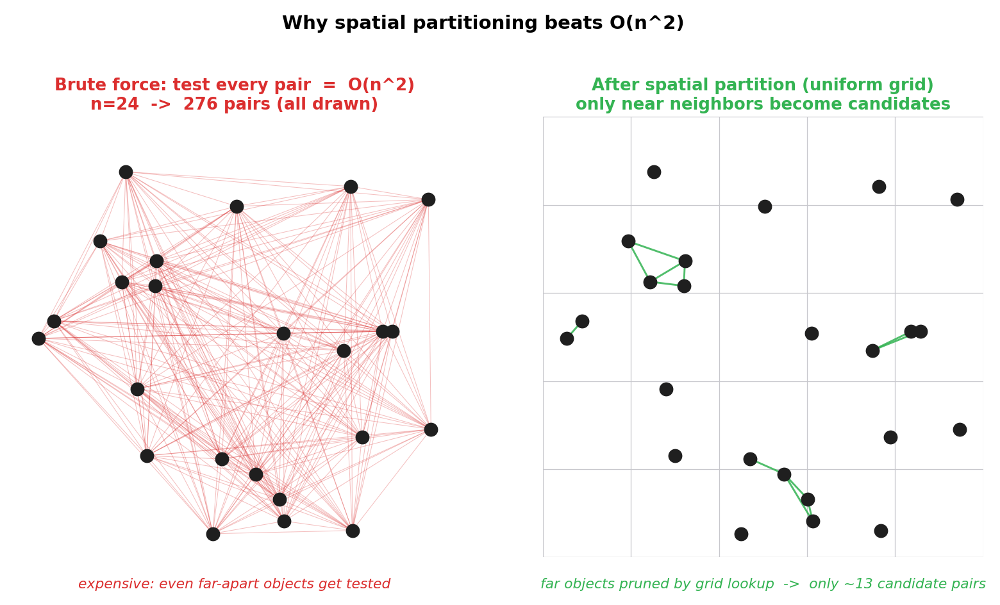
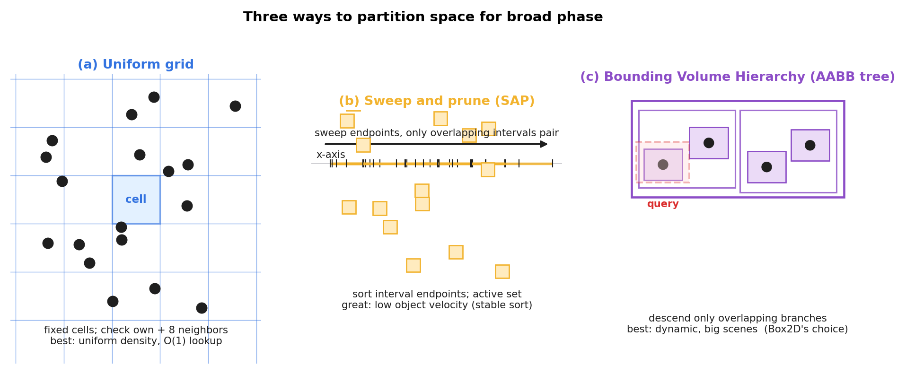
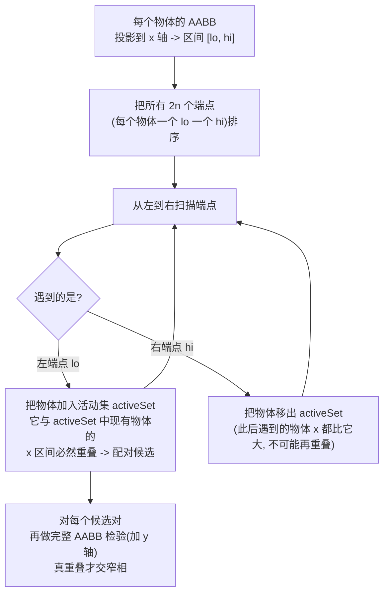
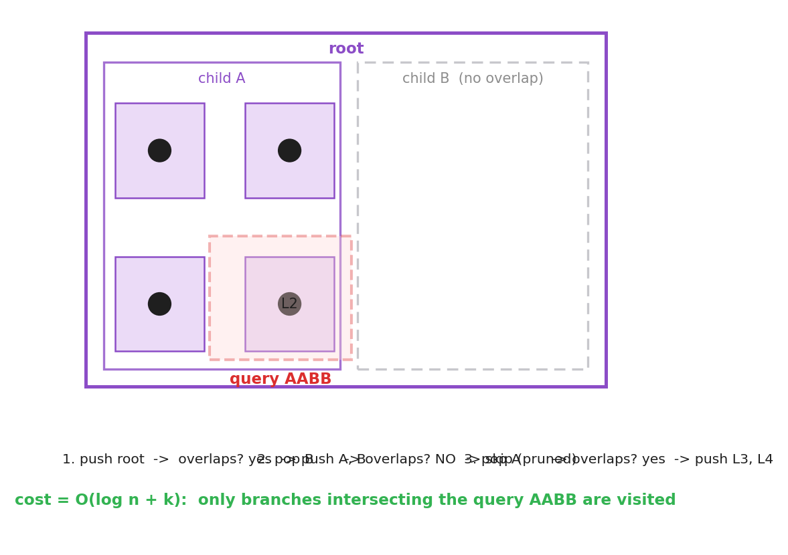
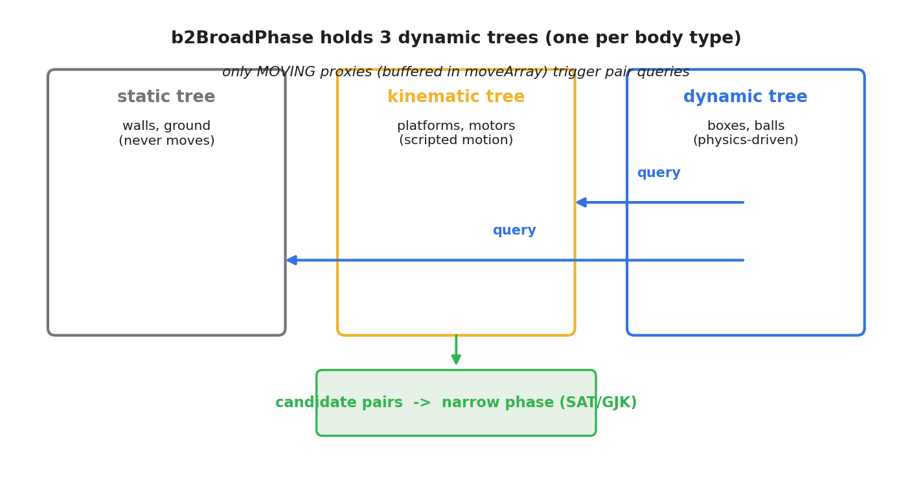

# 第 3 篇 · 第 10 章 · 宽相:空间划分

> **核心问题**:上一章我们把"任意形状"包进了一个轴对齐包围盒(AABB),于是"两个物体可能不可能碰"被简化成了"两个 AABB 相不相交"——一次逐轴比较就能判出来,便宜得很。可真实游戏场景里有成百上千,甚至上万个物体,每帧都要回答"这一帧谁和谁可能碰":如果老老实实地把每一对 AABB 都比一遍,那是 **O(n²)** 次比较,n=1000 就是一百万次,n=10000 就是一亿次,16 毫秒的帧预算瞬间吃光。本章要解决的就是这个复杂度爆炸:怎么用**空间划分(spatial partitioning)**——均匀网格、扫掠剪枝(sweep and prune)、层次包围盒树(BVH / 动态 AABB 树)——把"两两配对"的复杂度从 O(n²) 降到近 O(n),只把极少数"可能碰"的候选对交给窄相去精确判断。

> **读完本章你会明白**:
> 1. 为什么宽相必须做空间划分——暴力两两配对的 O(n²) 在真实规模下根本跑不动,得靠"空间局部性"先把绝大多数远在天边的对排除掉。
> 2. 三种主流空间划分各自的脾气:均匀网格(均匀分布好)、扫掠剪枝 SAP(运动小好)、层次包围盒树(运动大、动态场景好),以及它们各自撞什么墙。
> 3. 空间划分为什么能把复杂度降到近 O(n)——把"全局配对"变成"局部查询",远的物体根本不进候选集。
> 4. Box2D v3 的宽相选了什么:不是单一一棵树,而是**按 body type 分了三棵动态 AABB 树**(static / kinematic / dynamic 各一棵),并且**只让"动了的"代理去查树**,静止物体不重复配对。

> **如果一读觉得太难**:先只记住三件事——① 暴力两两配对是 O(n²),空间划分利用"远的物体不可能碰"把它降到近 O(n);② 三种划分各有适用场景,没有银弹;③ Box2D 用动态 AABB 树,而且是每种 body type 一棵树,下一章专讲这棵树怎么随物体运动增量更新。

---

## 〇、一句话点破

> **宽相的核心矛盾是:精确判断相交(SAT / GJK)很贵,而绝大多数物体对根本不可能碰。空间划分的任务,就是用一种便宜的数据结构,在精确判断之前先把"远在天边"的对统统剪掉,只留下"挤在一起、可能碰"的少数候选对。它把"全局两两配对"的 O(n²) 变成了"只查局部邻居"的近 O(n)。Box2D v3 的选择是动态 AABB 树——而且按物体类型分了三棵。**

这是结论。本章倒过来拆:先看暴力配对为什么必然爆炸,再看"空间局部性"这件事怎么被三种数据结构各显神通地利用,最后落到 Box2D 的真实实现上。

---

## 一、从上一章接过来:AABB 让"可能碰"变得便宜,但量太大

上一章(P3-09)我们讲清楚了 AABB:任意形状(圆、多边形、胶囊)都被一个轴对齐的方框"包住",两个形状可能不可能碰,先看两个方框相不相交就行。AABB 相交判断极其便宜——逐轴做一次分离判断,两个 AABB 不相交当且仅当**某个轴上它们投影的区间不重叠**:

```c
// Box2D v3, include/box2d/math_functions.h:785(逐字摘录)
B2_INLINE bool b2AABB_Overlaps( b2AABB a, b2AABB b )
{
    return !( b.lowerBound.x > a.upperBound.x || b.lowerBound.y > a.upperBound.y ||
              a.lowerBound.x > b.upperBound.x || a.lowerBound.y > b.upperBound.y );
}
```

> **承接上一章**:这段代码就是 P3-09 讲的"逐轴投影分离判断"的直接落地——只要 x 轴或 y 轴上有一方完全在另一方的"外侧"(lowerBound 大于对方的 upperBound),就分离,不相交;否则相交。一次比较 + 几个浮点判断,纳秒级。

到这里,问题好像已经解决了:"判断两个物体可能不可能碰"已经这么便宜,那直接把场景里所有物体两两比一遍 AABB 不就行了?

**不行。** 这一章就是讲为什么不行,以及怎么真正解决。

### 宽相在整个检测流程里的位置

在往下讲之前,先让宽相在全书流程里对号入座。回到 P0-01 / P1-04 立起的一个时间步四步流程:**积分 → 宽相检测 → 窄相检测 → 约束求解**。宽相是检测这一面的**第一步(粗筛)**,它的产出是"候选对"——一堆"AABB 相交、可能碰,但还没精确判断"的物体对。这些候选对接着交给**窄相(第二步)**,由 SAT / GJK 精确判断形状真相交与否,并算出接触流形(法线、穿透深度、接触点);接触流形再交给**约束求解(响应)**,由 Sequential Impulse 迭代求解,让物体不穿透、正确弹开。

为什么一定要分宽相、窄相两步,不直接对所有对做窄相?因为**窄相的 SAT/GJK 比 AABB 相交判断贵几十倍**(SAT 要对每条边的法线做投影,GJK 要迭代构造单纯形)。几千个物体,如果全部两两做窄相,即便每对只要几微秒,O(n²) 乘上去也是灾难。宽相先用便宜的 AABB 把 99% 不可能碰的对排除,只把 1% 候选交给贵的窄相——这是"用便宜的粗筛保护贵的精算"的分层思想。

> **承接 P0-01**:P0-01 技巧精解里讲过"检测的两步(宽相+窄相)= 精确性的分层",宽相用便宜的 AABB 粗筛,窄相用贵的 SAT/GJK 精算。本章就是把这个"宽相粗筛"这一半讲透——它怎么做到又快又全(不漏检),靠的就是空间划分。窄相(SAT/GJK)是下一篇 P4 的事。

这个分层还有个隐含要求:**宽相不能漏检**。漏检意味着两个真要碰的物体没进候选对,窄相根本没机会看它们,结果物体直接穿透——这是物理引擎的严重 bug。所以空间划分的设计,必须在"快"和"不漏"之间精确平衡:它可以用便宜判据排除远物体,但对"可能碰"的对必须一个不漏地交给窄相。后面讲的三种打法,都遵守同一个契约——**宁可多报(误报候选,让窄相白做一次),绝不漏报**。

---

## 二、暴力两两配对:为什么 O(n²) 是个无底洞

### 朴素做法:双重循环,每个对都比一次

最朴素的宽相,是两层循环:

```
for i in 0 .. n-1:
    for j in i+1 .. n-1:        # j 从 i+1 起,避免 (i,i) 和重复
        if AABB_overlaps(AABB[i], AABB[j]):
            candidate_pairs.add( (i, j) )   # 交给窄相
```

配对总数是 `C(n,2) = n(n-1)/2`,**O(n²)**。n 小的时候没感觉,可物体数一上去就恐怖:

| 物体数 n | 配对次数 n(n-1)/2 | 每帧 16ms 预算下…… |
|---------|------------------|--------------------|
| 10      | 45               | 毫无压力 |
| 100     | 4 950            | 还行 |
| 1 000   | 499 500(约 50 万)| 已经吃力 |
| 10 000  | 49 995 000(约 5000 万)| 单这一项就吃光好几帧 |

> **不这样会怎样**:一个稍微像样的游戏场景——地面、几面墙、一堆可破坏的箱子、几十个 NPC、子弹、碎片——轻轻松松上千个物理体。O(n²) 的两两 AABB 比较,每帧 50 万次,叠加窄相(SAT/GJK,每次比 AABB 贵几十倍),游戏直接卡成幻灯片。n=10000 的开放世界更是想都别想。

### 为什么 O(n²) 这么"贵":它不分远近,一视同仁

O(n²) 的真正毛病,不在于"次数多",而在于**它在做无用功**:绝大多数物体对根本离得老远,绝无可能碰,可暴力法照样老老实实地把它们比一遍。想象一个场景:1000 个物体散布在一张大地图上,任意时刻真正"挤在一起、可能碰"的对,也许只有几十个;可暴力法每帧都比了 50 万次,其中 99.99% 是"两个隔了半个地图的物体,显然碰不了"的废话比较。

这就是 O(n²) 的本质浪费:**它没有利用空间局部性**。两个物体要碰,它们在空间上必须靠近;隔了十万八千里的物体,根本不可能碰。可暴力法把"远近"这个信息完全扔了,把所有对当成同等可能。

> **钉死这件事**:O(n²) 之所以爆炸,不是算法"错",而是它**浪费了"空间局部性"这个免费的先验**——能碰的物体必然在空间上邻近。空间划分的全部目的,就是把这个先验用起来:**先按空间位置把物体分桶/排序/建树,配对时只看"邻近"的,远的根本不进候选集**。

下面三节,就是三种把"空间局部性"变成性能的不同打法。先用一张图直观看一下"暴力 vs 空间划分"的差别。



左图是 24 个物体,暴力法连了 276 条线(所有对),一团乱麻;右图同样 24 个物体,经过均匀网格分桶后,只有真正挤在一起的少数对才连了线,稀疏得多。这就是空间划分省下的功夫。

---

## 三、打法一:均匀网格——把空间切成棋盘格子

### 直觉:棋盘分桶,只跟同格和邻格比

最直观的空间划分是**均匀网格(uniform grid)**:把整个空间按固定边长切成一张棋盘,每个物体按它的位置(或 AABB 中心)算出落在哪个格子里(`cell_x = floor(x / cell_size)`)。要找"谁可能和我碰",不用扫全场,只看**自己这一格 + 周围 8 格**里的物体就行——因为格子边长是按"物体最大半径"定的,真要碰的物体必然落在自己或邻格里。

```
cell_size = 2 * max_object_radius      # 保证能碰的都在邻格内
for each object o:
    cell = (floor(o.x / cell_size), floor(o.y / cell_size))
    grid[cell].append(o)

# 配对:对每个物体,只跟自己格 + 8 邻格里的物体比 AABB
for each object o in cell C:
    for each neighbor cell C' in {C} ∪ 8-neighbors(C):
        for each object o' in grid[C']:
            if AABB_overlaps(o, o') and not_already_counted(o, o'):
                candidate_pairs.add( (o, o') )
```

### 复杂度:为什么是近 O(n)

如果物体在空间里**分布均匀**,每格平均装 `k = n / 总格数` 个物体(通常很小,几个而已),那么每个物体只跟 `9k` 个邻居比,总比较次数是 `9kn`——**O(n)**,只要每格密度恒定。这就是均匀网格的魔力:它把"全局 n²"压缩成了"局部常数 × n"。

> **所以这样设计**:均匀网格用"固定大小格子 + 邻格查询",把配对的复杂度从"跟全场比"降到了"跟周围 9 格比",每格密度恒定时就是 O(n)。它特别适合**物体大小差不多、分布比较均匀**的场景——比如粒子系统、一群飞虫、一堆同样大的积木。

### 撞什么墙:物体大小差异、分布不均

均匀网格的命门有两个:

1. **物体大小差异大**。格子边长得按"最大物体"定,可如果场景里有一堵超长围墙(几百格长)和一堆小弹珠混在一起,围墙的 AABB 会横跨几百个格子——它要么被塞进一个格(那邻格查询就漏了它),要么登记到所有横跨的格子(更新代价爆炸)。大小差异越大,网格越尴尬。
2. **分布不均匀**。如果所有物体都挤在地图一角的几个格子里(比如一群人挤在一个房间里),那几个格子的密度暴涨,`k` 不再是常数,O(n) 就退化。空旷地图上格子白占内存,密集处格子又爆——两头不讨好。

> **不这么设计会怎样**:在大小均匀、分布均匀的粒子场景,网格几乎是完美的。可一旦遇到"大围墙 + 小弹珠"或"全挤一角",网格要么漏检、要么退化成 O(n²),得不偿失。这就是为什么通用物理引擎(Box2D)不选网格,而选了更鲁棒的树。

均匀网格在专门的场景(粒子、流体 SPH、大规模同类 agent)里至今是首选,因为它实现极简、常数因子极小。看一眼它的样子:



---

## 四、打法二:扫掠剪枝(Sweep and Prune, SAP)——排序一根轴

### 直觉:投影到一根轴上排序,只看区间重叠的

均匀网格的毛病是"格子固定大小不适应物体差异"。扫掠剪枝换了个思路:**不切格子,而是把所有物体的 AABB 投影到一根轴(比如 x 轴)上,变成一根轴上的一堆区间** `[lower_x, upper_x]`。然后把这些区间的**端点排序**,从左到右扫一遍:

- 扫到一个区间的**左端点**(begin),把这个物体放进"活动集";
- 扫到一个区间的**右端点**(end),把它移出"活动集";
- 每次新加入活动集的物体,和活动集里现有的物体配对——它们的 x 区间必然重叠。

为什么这样能剪?因为**两个物体要在二维里相交,它们在任何一根轴上的投影区间都必须重叠**(这其实就是上一章 AABB 相交判断的"逐轴"思想)。所以如果两个物体在 x 轴上的投影区间都不重叠,那它们二维上必然不相交,x 轴这一关就把它们排除了。SAP 只把"x 区间重叠"的对留下来,再对它们做一次完整 AABB 检验(加上 y 轴),剩下的才是真候选。



### 复杂度:排序是 O(n log n),扫描看"活动集"多大

SAP 的代价分两块:① 排序 2n 个端点,O(n log n);② 扫描时,每个左端点要跟活动集里的物体配对。如果场景里物体在 x 方向上**不太堆叠**(大多数物体的 x 区间互不重叠),活动集平均很小,扫描近乎 O(n);可如果所有物体在 x 方向上都堆在一起(比如一面墙后面站一排人),活动集暴涨到 O(n),扫描退化成 O(n²)。

> **所以这样设计**:SAP 把"二维相交"先降成"一维区间重叠"(投影到一根轴),用排序 + 扫描把"全局配对"变成"只跟活动集配对"。它的甜区是**物体运动幅度小**——因为端点排序在帧与帧之间几乎不变(物体只挪了一点点),用**插入排序**就能在近乎 O(n) 内完成排序维护,总代价逼近 O(n)。

### SAP 的招牌技巧:帧间一致性(insertion sort 的温床)

SAP 最聪明的地方,是利用了**时间一致性(temporal coherence)**:物理场景里,物体一帧之内通常只移动一点点,所以这帧的端点顺序和上一帧几乎一样。这种"几乎排好序"的序列,正是**插入排序**的最好战场——插入排序对"几乎有序"的输入是 O(n) 的(每个元素只需挪几步就位),只有对完全乱序的输入才退化到 O(n²)。

我们来算一笔账,看时间一致性为什么这么值。设物体一帧内沿 x 轴最多移动 `d`,场景宽度 `W`,物体数 `n`。最坏情况下,一个物体的端点要"越过"的邻居数,正比于它移动距离占场景的比例乘以物体数,即 `d/W × n`。物理场景里 `d/W` 通常极小(物体一帧挪几像素,场景几千像素),所以"越过的邻居数"是个远小于 1 的小数 × n——大多数物体根本不动位置,插入排序每帧只挪常数次,总维护代价 `O(n)`。这正是 SAP 在"运动平缓"场景逼近 O(n) 的数学根。

可一旦物体剧烈运动(`d/W` 不再小,端点顺序每帧大乱),插入排序就退化成 O(n²),SAP 的甜区失守。这就是 Box2D v3 放弃 SAP 换成动态树的核心原因:通用物理引擎不能假设物体运动平缓(爆炸、高速碰撞、传送带突然启动都是常态),需要一种对"任意运动"都鲁棒的结构。

所以 SAP 的工程实现通常是:**第一帧用 O(n log n) 的快排建立端点顺序,之后每帧用插入排序增量维护**——只要物体没剧烈跳动,排序代价就是 O(n),加上扫描,整体逼近 O(n)。这是"利用问题结构把复杂度降下来"的经典案例,和数据库索引维护、堆的增量更新是同一种智慧。

> **不这么设计会怎样**:SAP 在**物体运动平缓、分布相对均匀**的场景表现极佳。可一旦物体运动剧烈(端点顺序每帧大变,插入排序退化成 O(n²)),或者所有物体挤在一根轴上(活动集永远满),它就崩了。Box2D 早期版本(v2)用过 SAP,但 v3 换成了动态树,正是因为 SAP 在"动态、运动幅度大"的通用场景不够鲁棒。

---

## 五、打法三:层次包围盒树(BVH / 动态 AABB 树)——递归套娃

### 直觉:把物体递归地分组,每组套一个 AABB

第三种打法是**层次包围盒树(Bounding Volume Hierarchy, BVH)**,在 2D 物理引擎里通常具体化为**动态 AABB 树**:把物体两两(或几几)分组,每组套一个"父 AABB"包住它的所有成员;父 AABB 再分组、再套更大的父 AABB……最后形成一棵树,根节点的 AABB 包住全场。

查询时,从根开始往下走:查询 AABB 和某个节点的 AABB 不相交?那这个节点**下面整棵子树**都不用看了——一刀剪掉一大片。只有相交的分支才继续下探,直到叶子(单个物体的 AABB)。这就是 BVH 的核心收益:**一次"不相交"判断,剪掉的不是一对,而是一整棵子树**。

> **承接渲染管线**:BVH 这个数据结构,你在《图形渲染管线》里见过了——光追里射线和场景求交,靠的就是 BVH 加速(把"射线和几百万个三角形求交"降到 O(log n))。游戏引擎的空间划分(四叉树 / 八叉树 / BVH)也是同一族思想。这里一句带过指路 [[graphics-series-project]],篇幅留给物理引擎特有的:为什么物理用**动态** AABB 树、怎么随物体运动增量更新。

### 复杂度:查询是 O(log n + k)

一棵平衡的 BVH,从根到叶子的深度是 O(log n)。查询一个 AABB 和哪些叶子相交,最多下探 O(log n) 个节点就能定位到候选区域,再加上实际相交的 k 个叶子,总代价是 **O(log n + k)**——k 是真候选对数,通常很小。把 n 个物体都查一遍,就是 **O(n log n + nk)**,实际中 k 是小常数,逼近 O(n log n),比 O(n²) 好太多了。

> **所以这样设计**:BVH 用"递归分组 + 嵌套包围盒",把查询复杂度从"扫全场"降到"沿树根下探 log n 层 + 报告 k 个命中"。它最大的优势是**鲁棒**——不管物体大小差异多大、分布多不均,只要树平衡,查询就稳定在 O(log n + k)。这是为什么通用物理引擎(Box2D、Bullet、PhysX)清一色选了 BVH / 动态 AABB 树。

看一棵 BVH 的查询过程:红色虚线是查询 AABB,它只和"child A"分支相交,"child B"整棵子树被一刀剪掉,不用下探。



### 撞什么墙:树会随物体运动"变丑",要维护

BVH 的命门是**树的质量会随物体运动下降**。物体一动,它的 AABB 就变了,原来把它归在某个父节点下很紧凑,现在可能跑偏了,父 AABB 不得不"撑大"包住它——撑着撑着,父 AABB 变得松松垮垮,查询时该剪的剪不掉,树退化成接近线性扫描。

这里要引入一个衡量 BVH 好坏的关键指标:**树的"表面积启发式(Surface Area Heuristic, SAH)**。直觉是——一个内部节点的 AABB 越大,查询时它越容易被"相交"判中(因为它占的地方大),于是越容易被迫下探它的子树,剪不掉。所以一棵好树,应该是"叶子 AABB 紧贴物体,内部节点 AABB 尽量小、尽量平衡"。SAH 用每个节点 AABB 的表面积(2D 里就是周长)作权重,衡量"随机一个查询框平均要访问多少节点"——这个值越小,树越好。物体运动让 AABB 撑大,SAH 就涨,查询代价就涨。

这就引出了 BVH 的核心工程问题:**怎么维护一棵高质量的动态树**。两条路:

1. **增量更新(MoveProxy)**:物体 AABB 变化超阈值时,把它从旧位置摘下来,重新插入到树里合适的位置(沿途可能旋转一下保持平衡)。代价小,但树会慢慢"积垢"——每次插入只能局部修正,长年累月 SAH 缓慢上升。
2. **定期批量重建(Rebuild)**:每隔几帧或当树质量(SAH / 高度)下降到阈值,把整棵树推倒重建一遍,重新得到一棵紧凑平衡的树。代价集中但效果好——一次重建把累积的"垢"全清掉。

Box2D v3 的做法是**两者结合**,而且非常明确——在 `b2UpdateBroadPhasePairs` 里,配对查询的同时,顺手用 `b2UpdateTreesTask`([src/broad_phase.c:401](../box2d/src/broad_phase.c#L401))对 dynamic 和 kinematic 树每步做一次 `b2DynamicTree_Rebuild(..., fullBuild=false)`([src/broad_phase.c:406-407](../box2d/src/broad_phase.c#L406-L407)):

```c
// (摘自 src/broad_phase.c:401-410, 略去 Tracy 性能区宏)
static void b2UpdateTreesTask( void* context )
{
    b2World* world = context;
    b2DynamicTree_Rebuild( world->broadPhase.trees + b2_dynamicBody,   false );
    b2DynamicTree_Rebuild( world->broadPhase.trees + b2_kinematicBody, false );
}
```

`fullBuild=false` 表示"增量重建"——不是每步推倒重来(那太贵),而是每次重建一部分叶子,渐进地改善树形。这个"MoveProxy 日常维护 + 每步增量 Rebuild"的搭配,是 Box2D 宽相能在动态场景里长期保持 O(log n + k) 查询性能的关键。这正是下一章(P3-11)要专讲的——动态 AABB 树怎么随物体运动增量更新 + 定期重平衡。本章先把"为什么要用树"讲透。

---

## 六、三种打法对比:没有银弹,各有甜区

把三种空间划分放一起比一比(这也是上面那张三联图的文字版):

| 维度 | 均匀网格 | 扫掠剪枝 SAP | 动态 AABB 树(BVH) |
|------|---------|-------------|-------------------|
| 数据结构 | 二维数组(每格一个桶) | 一根轴上的端点表 + 活动集 | 嵌套 AABB 组成的树 |
| 查询复杂度 | O(1) 单格定位 + O(k) 邻格 | O(n) 排序(帧间一致性)+ 扫描 | O(log n + k) |
| 甜区 | 物体大小均匀、分布均匀 | 物体运动平缓、分布相对均匀 | 物体大小差异大、运动剧烈、动态场景 |
| 命门 | 大小差异 / 分布不均 | 运动剧烈 / 轴向堆叠 | 树质量随运动下降,需维护 |
| 典型场景 | 粒子、流体、同类 agent | 早期 Box2D(v2) | Box2D v3、Bullet、PhysX、光追 |
| 实现复杂度 | 极简 | 中等(排序 + 扫描) | 较高(树的插入 / 旋转 / 重建) |

> **钉死这件事**:没有"最好的"空间划分,只有"最适合场景的"。均匀网格在它擅长的领域(均匀、同质)常数因子最小;SAP 在运动平缓时利用帧间一致性极漂亮;动态 AABB 树最鲁棒,代价是要处理树的维护。**通用物理引擎选 BVH,是因为它要对"任意场景"都表现稳定**——不能假设物体大小均匀,也不能假设运动平缓。

---

## 七、Box2D v3 的宽相:三棵动态 AABB 树

讲完原理,我们看 Box2D v3 真实怎么落地。**它选了动态 AABB 树,但有一个非显然的设计:不是一棵树,而是按 body type 分了三棵树。**

### 数据结构:`b2BroadPhase` 持有三棵树

打开 `broad_phase.h`,看 `b2BroadPhase` 结构体的第一个字段([src/broad_phase.h:29](../box2d/src/broad_phase.h#L29)):

```c
typedef struct b2BroadPhase
{
    b2DynamicTree trees[b2_bodyTypeCount];   // b2_bodyTypeCount == 3

    // Per body-type bit sets indexed by proxyId, marking proxies moved this step.
    b2BitSet movedProxies[b2_bodyTypeCount];
    b2Array( int ) moveArray;

    b2MoveResult* moveResults;
    b2MovePair*   movePairs;
    int           movePairCapacity;
    b2AtomicInt   movePairIndex;

    b2HashSet pairSet;   // 已存在 contact 的 shape 对,去重用
} b2BroadPhase;
```

★**诚实标注(非显然事实)**:很多资料讲 Box2D 宽相会说"一棵动态 AABB 树"。但 v3 的真实源码是 **`b2DynamicTree trees[b2_bodyTypeCount]`——三种 body type(static / kinematic / dynamic)各维护一棵独立的动态树**,不是单一一棵树。这是源码事实,见 [src/broad_phase.h:29](../box2d/src/broad_phase.h#L29) 和 `b2CreateBroadPhase` 里 [src/broad_phase.c:48-54](../box2d/src/broad_phase.c#L48-L54) 逐棵 `b2DynamicTree_Create`。

### 为什么分三棵树:避免 static 物体被反复配对

为什么要按 body type 分树?这要回到物理引擎的分类常识(下一节 P5 系列会详讲,这里先点一下):

- **static body**:静止的墙、地面,永远不动;
- **kinematic body**:脚本驱动的平台、传送带,有速度但不受力;
- **dynamic body**:受物理驱动的箱子、小球,会被推动、下落、碰撞。

关键的物理事实是:**static 和 static 永远不会碰**(两个都不动,除非手动改);**kinematic 和 kinematic 也不碰**(都是脚本驱动,引擎不管它们之间);真正需要检测的是 **dynamic ↔ dynamic**、**dynamic ↔ kinematic**、**dynamic ↔ static** 这三类对。

分三棵树后,配对查询的规则就清晰了([src/broad_phase.c:373-393](../box2d/src/broad_phase.c#L373-L393) 的 `b2FindPairsTask`):

```c
// (简化示意, 非源码原文; 摘自 broad_phase.c:373-393 的逻辑)
if ( proxyType == b2_dynamicBody )
{
    // 动的代理要去查 kinematic 树和 static 树
    b2DynamicTree_Query( bp->trees + b2_kinematicBody, fatAABB, ... );
    b2DynamicTree_Query( bp->trees + b2_staticBody,    fatAABB, ... );
}
// 所有代理(含 static/kinematic, 只要它"动了")都查 dynamic 树
b2DynamicTree_Query( bp->trees + b2_dynamicBody, fatAABB, ... );
```

也就是:**只有"动了的"代理(无论它是什么类型)才发起查询,而且它去查另外两类(或一类)的树**。static 物体放进 static 树后,只要它不动,就永远坐在树里被别人查,自己从不发起查询——这省下了海量的重复配对。这正是分树的收益。

> **所以这样设计**:分三棵树不是炫技,是把"哪些 body type 之间需要配对"这个物理先验直接编码进数据结构。static 物体永远不动,放进自己的树里被别人查就行,从不主动配对;只有动了的物体才去查别的树。这把配对次数从"所有对"进一步压到了"动了的物体 vs 可能碰到它的物体"。



### 代理的生命周期:CreateProxy / MoveProxy / 配对

每个 shape 在宽相里对应一个"代理(proxy)",它的生命周期:

1. **创建**:`b2BroadPhase_CreateProxy`([src/broad_phase.c:104](../box2d/src/broad_phase.c#L104))把 shape 的 AABB 插进对应 body type 的那棵树,并(如果它不是 static,或要求强制配对)把它标记为"动了的",塞进 `moveArray`:

   ```c
   int b2BroadPhase_CreateProxy( b2BroadPhase* bp, b2BodyType proxyType, b2AABB aabb,
                                 uint64_t categoryBits, int shapeIndex, bool forcePairCreation )
   {
       B2_ASSERT( 0 <= proxyType && proxyType < b2_bodyTypeCount );
       int proxyId = b2DynamicTree_CreateProxy( bp->trees + proxyType, aabb, categoryBits, shapeIndex );
       int proxyKey = B2_PROXY_KEY( proxyId, proxyType );
       if ( proxyType != b2_staticBody || forcePairCreation )
       {
           b2BufferMove( bp, proxyKey );   // 标记"动了", 塞进 moveArray
       }
       return proxyKey;
   }
   ```

   注意 `proxyKey` 这个小技巧([broad_phase.h:20-22](../box2d/src/broad_phase.h#L20-L22)):它把"body type(2 bit)+ proxyId(30 bit)"打包成一个 int,这样遍历时一眼就知道这个代理属于哪棵树。

2. **移动**:物体动到 AABB 变化超阈值时,`b2BroadPhase_MoveProxy`([src/broad_phase.c:128](../box2d/src/broad_phase.c#L128))更新树里这个代理的 AABB,并再次 `b2BufferMove` 把它标记为"这步动了":

   ```c
   void b2BroadPhase_MoveProxy( b2BroadPhase* bp, int proxyKey, b2AABB aabb )
   {
       b2BodyType proxyType = B2_PROXY_TYPE( proxyKey );
       int proxyId = B2_PROXY_ID( proxyKey );
       b2DynamicTree_MoveProxy( bp->trees + proxyType, proxyId, aabb );
       b2BufferMove( bp, proxyKey );
   }
   ```

3. **配对查询**:每个时间步,`b2UpdateBroadPhasePairs`([src/broad_phase.c:412](../box2d/src/broad_phase.c#L412))拿出 `moveArray` 里所有"这步动了"的代理,对每个发起上述的三树查询,把候选对收集起来。关键代码在 `b2FindPairsTask`([src/broad_phase.c:333](../box2d/src/broad_phase.c#L333)):

   ```c
   // (简化示意, 非源码原文; 摘自 broad_phase.c:333-396 的逻辑)
   for ( int i = startIndex; i < endIndex; ++i )
   {
       int proxyKey = bp->moveArray.data[i];        // 这步动了哪个代理
       ...
       b2AABB fatAABB = b2DynamicTree_GetAABB( baseTree, proxyId );   // 用 fat AABB 查
       ...
       if ( proxyType == b2_dynamicBody ) {
           b2DynamicTree_Query( bp->trees + b2_kinematicBody, fatAABB, ..., b2PairQueryCallback, ... );
           b2DynamicTree_Query( bp->trees + b2_staticBody,    fatAABB, ..., b2PairQueryCallback, ... );
       }
       b2DynamicTree_Query( bp->trees + b2_dynamicBody, fatAABB, ..., b2PairQueryCallback, ... );
   }
   ```

   每次查询用的是 `fatAABB`(比真实 AABB 略大的"胖包围盒")——这是一个关键的工程技巧,留到技巧精解讲。

### 候选对的去向:交给窄相

`b2PairQueryCallback`([src/broad_phase.c:172](../box2d/src/broad_phase.c#L172))是查询时每个命中叶子调用的回调。它做一系列**便宜的过滤**(去重、同 body 跳过、sensor 跳过、碰撞过滤 `b2ShouldShapesCollide`、关节屏蔽、自定义过滤),通过的对才被收进 `movePairs`,最后由 `b2UpdateBroadPhasePairs` 在 [broad_phase.c:482](../box2d/src/broad_phase.c#L482) 调 `b2CreateContact` 创建接触——这些接触才进入**窄相**(SAT/GJK 精确判断 + 接触流形)。

所以宽相的输出就是:**一盒候选对**(shapeA, shapeB),每对都通过了"AABB 相交 + 各种过滤",但还没有精确判断形状真相交。精确判断是下一篇(P4)窄相的事。

> **钉死这件事**:Box2D 宽相 = 三棵动态 AABB 树(按 body type 分)+ moveArray(只查动了的代理)+ 三树查询规则(动态查静态/运动学/动态)+ 一系列便宜过滤。输出是候选对,交给窄相。它把"全局两两配对"变成了"动了的代理 × 它可能碰到的少数叶子",实测复杂度逼近 O(n + k log n),k 是候选对数。

---

## 八、技巧精解:为什么空间划分把 O(n²) 降到近 O(n)

这一节我们把本章最硬的一个问题单独拆透:**空间划分凭什么能把复杂度从 O(n²) 降到近 O(n)?** 答案的核心是三个字——**空间局部性**。

### 反面:暴力法为什么是 O(n²)

暴力法对所有 n 个物体做两两配对,复杂度是组合数 C(n,2) = O(n²)。它的代价**和物体分布无关**——不管这 n 个物体是挤成一团还是散布在银河系,它都比 n² 次。换句话说,暴力法对"空间"这个维度是盲的,它只看"物体数"。

### 正面:空间划分利用了"能碰的必然邻近"

物理世界有一个暴力的免费先验:**两个物体要碰,它们在空间上必须靠近**。准确说,它们的 AABB 必须相交,而 AABB 相交意味着在每一根轴上它们的投影区间都重叠——这要求它们在空间上是"挤在一起"的。隔了十万八千里的物体,AABB 八竿子打不着,绝无可能碰。

空间划分就是把这个先验用起来:**先按空间位置把物体组织起来(分桶 / 排序 / 建树),配对时只看"空间上邻近"的少数,远的根本不进候选集**。

- **均匀网格**:每个物体只跟同格 + 8 邻格比,远格的物体压根不被访问。每格密度恒定时,每格平均 k 个物体,总比较 9kn = O(n)。
- **扫掠剪枝 SAP**:每个物体只跟"x 区间重叠"的活动集比,区间不重叠(绝大多数远物体)的直接被一根轴排除了。
- **动态 AABB 树**:查询时,每个不相交的内部节点**一刀剪掉一整棵子树**,远在天边的物体整片区域一次访问就被排除,只下探相交分支,代价 O(log n + k)。

三种打法的共同精神,都是:**用一个便宜的空间判据(在哪格 / x 区间是否重叠 / AABB 是否相交),在精确配对之前先把绝大多数远物体一次性排除,只留极少数"邻近"的候选**。

### 关键洞察:复杂度取决于"候选对数 k",不是"物体数 n"

仔细看三种打法的复杂度,都有一个 `k`——**真正的候选对数**。网格是 O(kn) 的常数倍(k 是每格密度),SAP 扫描代价正比于活动集大小(也是局部密度),BVH 是 O(log n + k)。只要场景不是"所有物体全挤在一个点"(那种病态情况任何算法都救不了),k 都是个不大的数,远小于 n。

所以空间划分的本质,是把复杂度从"取决于物体总数 n"变成"取决于候选对数 k"——而 k 由场景的**空间稀疏度**决定,不由 n 决定。物体再多,只要它们在空间上散得开,k 就小;只有它们全挤在一起,k 才大(那种情况物理上本来也就得算这么多,任何算法都省不了)。

> **钉死这件事**:空间划分把 O(n²) 降到近 O(n) 的根本原因,是它把"全局配对"换成了"局部查询"——利用"能碰的必然邻近"这个先验,远物体一次性整片排除,只留邻近候选。复杂度从取决于 n 变成取决于真候选对数 k,而 k 由场景空间稀疏度决定,不由物体数决定。这是宽相的灵魂。

### 工程佐证:Box2D 的"fat AABB"——进一步压缩查询次数

Box2D 在查询时用了一个聪明的小技巧叫 **fat AABB(胖包围盒)**,体现在 `b2FindPairsTask` 的 `b2AABB fatAABB = b2DynamicTree_GetAABB(...)`([broad_phase.c:367](../box2d/src/broad_phase.c#L367))。树的叶子存的不是物体的真实 AABB,而是一个**略大一点的胖 AABB**。物体运动时,只要真实 AABB 还在胖 AABB 里,就**不算"动了"**,不重新插入树,也不进 `moveArray`。

> **技巧精解**:fat AABB 利用了时间一致性——物体一帧之内只动一点点,绝大多数时候真实 AABB 还在上一帧的胖包围盒里,不需要更新树。只有它跑出胖包围盒了才算"动了大动作",才 `MoveProxy` + 重新配对。这把每帧需要查询的代理数(`moveArray` 的长度)从 n 压到了"真动了的那一小撮",查询总代价进一步逼近常数 × k。这是"用预测换计算"的典型工程技巧,和 hysteresis(迟滞)一个道理——宁可让包围盒松一点,换取大多数帧不更新。

结合"只查动了的代理" + "fat AABB 抑制虚假移动",Box2D 的宽相在真实场景里跑得飞快,实测远低于理论最坏情况。

### 宽相的工程权衡:误报可忍,漏报不行

讲完复杂度,最后补一个工程上极重要、却容易被忽略的点:**宽相的契约是"宁可误报,绝不漏报"**。

回到宽相在整个流程里的位置——它是粗筛,产出候选对交给窄相。窄相(SAT/GJK)是"真相之口",它说相交才是真相交。所以宽相**多报了**(把两个其实不相交的对报给窄相),代价只是窄相白做一次精确判断,浪费一点 CPU;可宽相**漏报了**(两个真要碰的对没进候选集),窄相根本看不到它们,结果物体直接穿透,物理就崩了。

这个"误报可忍、漏报不行"的不对称,直接决定了空间划分数据结构的一个关键设计:**所有判据都必须是"保守的(conservative)"**——用可能比真实 AABB 大一点的包围盒(比如 fat AABB),宁可多查几个,也不能让真要碰的物体被误判为"远"。均匀网格的格子要"足够大"(至少 2 倍最大物体半径),保证能碰的必在邻格;SAP 用一根轴的区间重叠作必要条件,绝不在某轴单独判不相交就排除(必须两轴都重叠才算);BVH 查询时内部节点的 AABB 要包住所有子叶子,稍有溢出就保守地下探。所有这些,都是为了那个铁律——**不漏报**。

> **钉死这件事**:宽相的数据结构和判据都是"保守的"——宁可包围盒松一点、候选对多一点,也绝不让真要碰的物体被漏掉。误报的代价是窄相多算几次(可接受),漏报的代价是物体穿透(不可接受)。这个不对称贯穿所有空间划分的设计。

### 常数因子也不容忽视:为什么"理论上 O(n)"还不够

理论上三种打法都能降到近 O(n),可实际选型时,常数因子(隐藏在大 O 里的系数)同样关键。均匀网格每次查询就是几次数组取下标 + 9 格遍历,常数极小(可能就 20-50 次比较),在它擅长的场景里跑得比 BVH 快好几倍——这就是为什么粒子系统、流体仿真至今首选网格,哪怕 BVH 理论复杂度更优。BVH 每次查询要遍历树(每次访问一个节点是一次 AABB 比较 + 栈操作),常数中等;SAP 的排序 + 扫描常数也中等。所以选型不能只看大 O,要看**实际场景的常数 + 数据分布**:小规模均匀分布选网格,大规模动态场景选 BVH,运动平缓的中等规模选 SAP。Box2D 作为通用引擎,选了最鲁棒的 BVH,牺牲了一点常数因子,换来"任意场景都不崩"的保证。

---

## 九、章末小结

### 回扣主线

本章服务的是**检测**这一面——具体说是检测的第一步:**宽相粗筛**。我们承接上一章的 AABB(把"任意形状可能不可能碰"简化成"两个 AABB 相不相交"),解决"海量物体两两配对 O(n²) 跑不动"的复杂度爆炸。答案是**空间划分**:用均匀网格 / 扫掠剪枝 / 动态 AABB 树,把"全局配对"变成"局部查询",利用空间局部性一次性排除绝大多数远物体,只把极少数候选对交给窄相。Box2D v3 的落地是**三棵动态 AABB 树**(按 body type 分)+ moveArray(只查动了的代理)+ fat AABB(抑制虚假移动)。

### 五个为什么

1. **宽相为什么不能直接两两比 AABB?**——O(n²),n=1000 就 50 万次,n=10000 就 5000 万次,叠加窄相,16ms 预算吃光。暴力法对"空间"这个维度是盲的,把所有对一视同仁。
2. **空间划分凭什么降复杂度?**——利用"能碰的必然邻近"这个先验,用便宜的空间判据(分桶 / 区间重叠 / AABB 相交)在精确配对前一次性排除远物体。复杂度从取决于物体数 n 变成取决于真候选对数 k。
3. **三种打法各自甜区?**——均匀网格:物体大小均匀、分布均匀(粒子、流体);扫掠剪枝 SAP:运动平缓、分布相对均匀(利用帧间一致性,插入排序 O(n));动态 AABB 树:物体大小差异大、运动剧烈、通用场景(Box2D/Bullet/PhysX 都选它)。
4. **Box2D 为什么分三棵树?**——把"哪些 body type 之间需要配对"这个物理先验编码进数据结构:static 永远不动,放进自己的树被别人查;只有动了的代理才发起查询。省下海量重复配对。
5. **fat AABB 干嘛用?**——树里存的是略大的胖包围盒,物体只要还在胖盒里就不算"动了",不重新插树也不配对。利用时间一致性,把每帧要查的代理数从 n 压到"真动了的一小撮"。

### 想继续深入往哪钻

- 想搞懂动态 AABB 树怎么随物体运动增量更新(MoveProxy 的插入 / 旋转)+ 定期 Rebuild:下一章 **P3-11 动态 AABB 树**,专讲 Box2D 宽相这棵树的维护。
- 想搞懂候选对交给窄相后怎么精确判断相交:**第 4 篇** P4-12(SAT 分离轴)、P4-13(GJK 闵可夫斯基差)。
- 想横向对照光追里的 BVH(同一族数据结构,场景是"射线 vs 三角形"):《图形渲染管线》的 BVH 章节 [[graphics-series-project]]。
- 想看 SAP 在 Box2D v2 时代的实现(历史对照):Erin Catto 的 GDC 演讲和 Box2D v2 源码 `b2PairManager` / `b2BroadPhase`(本系列聚焦 v3,v2 仅作演进对照)。

### 引出下一章

本章讲了三种空间划分的取舍,以及 Box2D v3 选用动态 AABB 树(而且是三棵)的整体设计。可我们留了一个关键问题没展开:**这棵树怎么随物体运动增量更新,还保持平衡?** 物体一动,AABB 就变,原来紧凑的树会"变丑",查询剪不下去。Box2D 用 MoveProxy(增量插入)+ 定期 Rebuild(批量重建)搭配解决。这正是下一章的主题。下一章 **P3-11 动态 AABB 树**,我们钻进 `dynamic_tree.c`,讲透一棵会随物体运动生长、变形、再平衡的 BVH 是怎么造出来的。

> **下一章**:[P3-11 · 动态 AABB 树](P3-11-动态AABB树.md)
