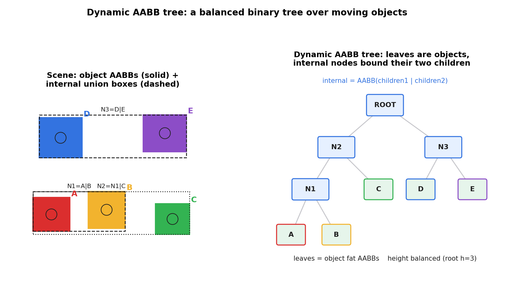
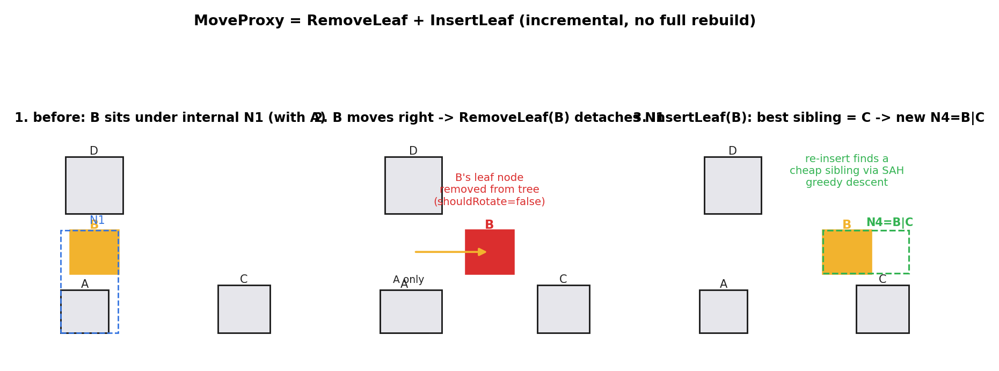
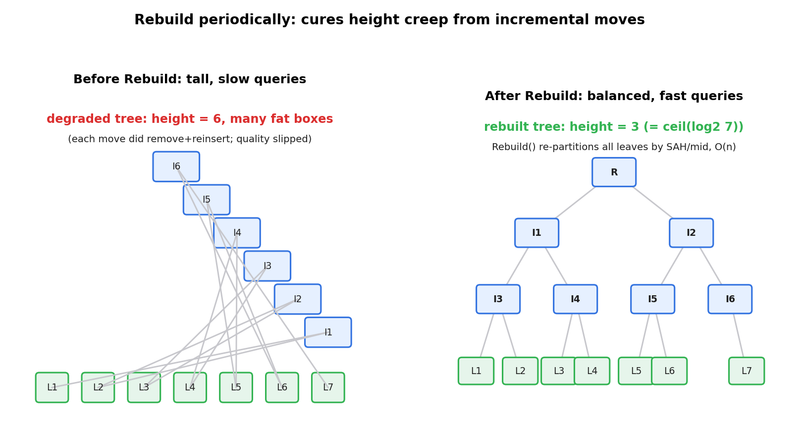
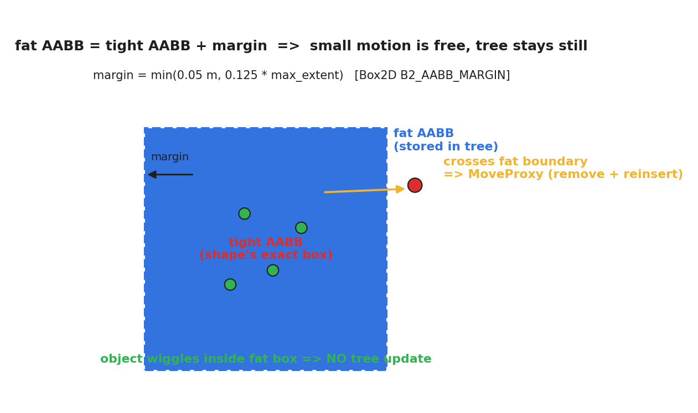

# 第 3 篇 · 第 11 章 · 动态 AABB 树

> **核心问题**:上一章我们盘点了宽相的三种空间划分利器——网格、扫掠剪枝、动态 AABB 树。网格对均匀分布的物体最快,扫掠剪枝对一维运动占优,可 Box2D 选了**动态 AABB 树**。为什么?因为游戏里物体在**不停运动**:一堆箱子被砸飞、一群敌人涌过来、一辆车撞进墙。每帧每个物体的位置都在变,它们身上的 AABB 也在变。如果用一棵**静态**的树(每帧从零重建),重建本身就要 O(n log n),几千个物体每帧重建一次,16 毫秒的帧预算扛不住;可如果**根本不维护**树,让它自由退化,查询会越来越慢。Box2D 的答案是:**一棵随物体运动增量更新的平衡二叉树**——叶子是物体的"胖 AABB",内节点是包住两个孩子的并集;物体动一下,只动它那片叶子(remove + re-insert),不碰整棵树;动得多了,树质量下降,再**定期 Rebuild** 一次性重建降高度。这就是 Box2D 宽相的招牌数据结构,本章把它拆透。

> **读完本章你会明白**:
> 1. 为什么宽相要选动态 AABB 树而不是网格或扫掠剪枝——它对**任意运动、任意分布**的场景都稳,且支持**增量更新**(物体动了只改局部,不全量重建)。
> 2. 动态 AABB 树的结构:叶子 = 物体的胖 AABB(fat AABB),内节点 = 两个孩子 AABB 的并集,整棵树按"表面积启发"(SAH)保持矮胖平衡。
> 3. ★**增量更新**怎么做到便宜:`MoveProxy` = remove 旧叶子 + re-insert(沿 SAH 贪心找最佳兄弟),`shouldRotate=false` 跳过旋转;再配 **fat AABB + 位移阈值**,让小幅运动**根本不碰树**。
> 4. ★**定期 Rebuild** 治退化:增量更新久了树会"长高"(内节点 AABB 越并越胖),`b2DynamicTree_Rebuild` 把所有叶子收集起来、按 SAH/mid 重新分箱建一棵矮树,O(n) 摊销。
> 5. ★**诚实标注**:Box2D v3.2 的 broad phase **按 body type(static/kinematic/dynamic)各维护一棵动态树**,配对查询时跨树;fat AABB 不在树里算,而是由 shape 层(`shape.c` / `body.c`)算好再喂给树。

> **如果一读觉得太难**:先只记三件事——① 动态 AABB 树 = 叶子是物体 AABB、内节点包俩孩子的平衡二叉树;② 物体动了用 MoveProxy 增量更新(便宜),动多了用 Rebuild 重建(治退化);③ 给 AABB 加一圈 margin(fat AABB),小幅运动不碰树。三件事记牢,源码细节慢慢看。

---

## 〇、一句话点破

> **动态 AABB 树是一棵随物体运动增量更新的平衡二叉树:叶子是物体的胖 AABB,内节点包住俩孩子;物体动一下只 remove+re-insert 那片叶子(增量,便宜),配 fat AABB 让小幅运动免更新,再定期 Rebuild 重建降高度(治退化)。它把"每帧维护几千个运动物体配对"这件事,从 O(n²) 或 O(n log n) 全量重建,压到接近 O(n) 的增量维护。**

这是结论。本章倒过来拆:先看树长什么样、为什么这么长,再看物体动了它怎么只动局部,最后看退化时怎么治。

---

## 一、为什么宽相要一棵"会动"的树

### 1.1 朴素做法:每帧重建一棵静态树,撞什么墙

上一章讲空间划分时,我们提过一种朴素的 BVH(bounding volume hierarchy)思路:**每帧把所有物体的 AABB 收集起来,从零建一棵平衡树,然后查询**。建树是 O(n log n),查询每个物体 O(log n),总共 O(n log n)。听起来不错?

> **不这样会怎样**:游戏是实时的,每秒 60 帧,每帧 16 毫秒。一个有 5000 个物体的场景,每帧从零建一棵树,O(n log n) ≈ 5000 × 13 ≈ 6 万次操作,加上查询又是 6 万次,光宽相就吃掉可观的帧预算。更要命的是——**绝大多数物体这一帧根本没怎么动**:地上堆着的箱子、静止的墙、没动的敌人。每帧把它们拆了重建,纯属浪费。

问题出在"静态树 + 每帧重建"对**动态场景**不友好。我们需要的是一棵**能跟着物体一起动**的树:大多数物体没动,树就原封不动;少数物体动了,只动它们那一片。

### 1.2 动态 AABB 树:增量维护的平衡二叉树

动态 AABB 树(dynamic AABB tree)就是这个思路。它的核心承诺:**物体动了,只更新它那片叶子及其祖先,不碰整棵树**。这样一帧里大多数物体不动 → 树几乎不变;少数物体动 → 每个动一次开销很小(O(log n))。

但要兑现这个承诺,树得满足两个条件:

1. **结构是平衡二叉树**:叶子都在差不多深的层,查询每个物体 O(log n)。如果退化成链表(每个内节点只有一个孩子),查询退化到 O(n)。
2. **能增量插入/删除叶子而不破坏平衡**:加一片叶子、删一片叶子,都只影响从那片叶子到根的一条路径,不会牵动整棵树。



看这张图。左边是一个 2D 场景,5 个物体 A-E 各有一个 AABB。右边是建出来的动态 AABB 树:

- **叶子**(绿色框)= 物体的 AABB。叶子没有孩子,`height = 0`。
- **内节点**(蓝色框)= 包住两个孩子的 AABB 并集。比如 `N1 = A ∪ B`,`N3 = D ∪ E`,`ROOT = N2 ∪ N3 = {A,B,C,D,E}`。内节点有 `height = 1 + max(孩子 height)`。
- **根**= 包住所有物体的最大 AABB。

> **钉死这件事**:动态 AABB 树是**二叉树**:每个内节点恰好两个孩子,每个叶子是一个物体的 AABB,内节点的 AABB = 两个孩子 AABB 的并集。树越**矮胖**(高度接近 log₂ n),查询越快——查询时从根往下,某个内节点的 AABB 和查询框不相交,整棵子树直接剪掉。

### 1.3 为什么选它而不是网格或扫掠剪枝

上一章讲了三种宽相空间划分,Box2D 为什么独独选了动态 AABB 树?

- **网格(grid)**:物体分布**均匀**且**大小接近**时最快(O(1) 查邻格)。可游戏里物体大小差异巨大(一颗子弹 vs 一面墙),大物体会跨很多格,网格退化;物体运动快时还得频繁换格。
- **扫掠剪枝(sweep and prune)**:沿一个轴排序 AABB 端点,维护活跃集。对**一维运动占优**的场景(比如横版游戏)快,可二维运动复杂时,排序的增量维护代价上升,且对大小差异敏感。
- **动态 AABB 树**:**对任意运动、任意大小分布都稳**。无论物体怎么动、多大,插入/删除/查询都是 O(log n)。它没有网格和扫掠剪枝的"最适场景",但也**没有它们的短板**——通用、鲁棒,这正是物理引擎要的。

> **所以这样设计**:Box2D 面向通用 2D 物理(各种大小、各种运动、堆叠、关节),动态 AABB 树的**通用性 + 增量可维护性**胜过网格和扫掠剪枝的特定场景优势。代价是常数因子略大,但 O(log n) 的渐近保证换来的是"任何场景都不崩"。

> **承接书讲过**:树的平衡/旋转、堆的堆化,是数据结构课的老朋友——Linux 调度器用 rbtree 按 deadline 排任务、分配器用 size class 树找空闲块。动态 AABB 树是同一种"用平衡树把查找降到 O(log n)"的智慧,只不过它的 key 不是单一数值,而是**二维 AABB 的空间位置**,用 SAH(表面积启发)衡量"放哪最省"。这里不展开 SAH 的数学,只讲它怎么用。

---

## 二、树是怎么建出来的:SAH 贪心插入

理解了树的结构,下一个问题是:**给一片新叶子(一个物体的 AABB),插到树的哪里?** 这决定了树平不平衡、查询快不快。

### 2.1 朴素做法:随便挂,撞什么墙

最朴素的插入:从根开始,沿着"和新叶子 AABB 重叠面积最小的孩子"往下走,走到一个叶子,把新叶子和它挂在一个新内节点下。

> **不这样会怎样**:这种"纯贪心向下"不考虑全局,容易把树带偏——比如新叶子其实该和某个远处的叶子做兄弟,纯贪心却把它塞进了第一个看起来还行的子树。久而久之树越来越深、内节点 AABB 越来越胖(并集越并越大),查询时剪不掉子树,退化。

### 2.2 SAH(表面积启发):用"代价"量化放哪最好

Box2D 用的是 **SAH(surface area heuristic,表面积启发)** 的贪心版本。核心思想:**树的质量,可以用"所有内节点 AABB 的周长(2D 用周长,3D 用表面积)之和"来衡量**——这个和越小,说明内节点包得越紧,查询时越容易剪枝。

基于此,给新叶子 D 找位置,有三种选择(对一个内节点 A-(B,C)):

1. 给 A 和 D 造个新父节点:`E-(A-(B,C), D)`——D 和 A 并列。
2. 把 D 挂到 B 下面(若 B 是叶子):`A-(E-(B,D), C)`。
3. 把 D 挂到 C 下面(若 C 是叶子):`A-(B, E-(C,D))`。

每种选择的代价 = `周长(并集(H, D)) + 祖先增加的周长`。Box2D 沿着树**从根贪心向下**:每一步比较"在当前节点当兄弟的代价" vs "下探到某个孩子可能更优的下界代价",取更优的方向走。走到一个叶子或确定无法更优,就停下。这就是 `b2FindBestSibling`:

```c
// Greedy algorithm for sibling selection using the SAH
// Descend the tree from root, following a single greedy path.
static int b2FindBestSibling( const b2DynamicTree* tree, b2AABB boxD )
{
    ...
    int index = rootIndex;
    while ( nodes[index].height > 0 )
    {
        ...
        // Cost of creating a new parent for this node and the new leaf
        float cost = directCost + inheritedCost;
        if ( cost < bestCost ) { bestSibling = index; bestCost = cost; }
        ...
        // Can the cost possibly be decreased?
        if ( bestCost <= lowerCost1 && bestCost <= lowerCost2 ) break;
        // Descend into the cheaper child ...
    }
    return bestSibling;
}
```
> 摘自 [`b2FindBestSibling`](../box2d/src/dynamic_tree.c#L164-L302)(简化示意,非源码原文,行号区间已核)。

> **钉死这件事**:插入新叶子时,Box2D 用 **SAH 贪心**从根向下走一条路径,每步比较"停在这里当兄弟的代价"和"下探能拿到的代价下界",取优。这是 O(log n) 的局部决策,不是全局最优,但对动态场景够好——它保证树整体偏矮胖,内节点 AABB 偏紧。

### 2.3 插入和旋转:CreateProxy 的三阶段

找到了最佳兄弟,插入分三阶段(`b2InsertLeaf`,[`dynamic_tree.c:602`](../box2d/src/dynamic_tree.c#L602)):

1. **找兄弟**:`b2FindBestSibling`(上面讲的)。
2. **造新父**:分配一个新内节点,把新叶子和兄弟挂它下面,接回祖父。
3. **沿父链回填**:从新叶子的父亲往上走到根,每个祖先重新算 `aabb = child1.aabb ∪ child2.aabb`、`height = 1 + max(children height)`。如果 `shouldRotate=true`,顺便尝试**旋转**。

旋转(`b2RotateNodes`,[`dynamic_tree.c:315`](../box2d/src/dynamic_tree.c#L315))是 AVL/红黑树那种"发现局部不平衡就转一下"的思路在 AABB 树上的 cousin。Box2D 的旋转有 4 种(`b2_rotateBF/BG/CD/CE`),对一个内节点 A-(B,C),看 B 和 C 哪边高、哪边矮,把高侧的一个孙子和矮侧换一下位置,目标还是**降低 SAH 代价**(转完若代价不降就不转)。

> **关键区分(易翻车点)**:旋转只在 `b2DynamicTree_CreateProxy`(首次插入,`shouldRotate=true`)时做,**`MoveProxy`(运动更新)`shouldRotate=false`,不旋转**。这是 Box2D 刻意的取舍——首次建树要尽量平衡,所以旋转;运动时追求便宜,remove + re-insert 不旋转,留给定期 Rebuild 来收拾质量。

---

## 三、物体动了:MoveProxy 的增量更新

树建好了。现在场景动起来——一个箱子被砸飞,它的 AABB 变了,树怎么跟上?这就是 `b2DynamicTree_MoveProxy`,Box2D 宽相增量更新的核心。

### 3.1 朴素做法:每次动都重建整棵树,撞什么墙

最朴素:物体一动,把整棵树拆了重建。上面算过,O(n log n) 每帧,几千物体扛不住。

> **不这样会怎样**:退一步,哪怕不重建整棵树,只重建那个物体所在的子树?还是太贵——你得找到子树、收集它的叶子、重排。每个物体每帧动一次都这么搞,累计还是 O(n log n)。我们需要的是**只动那一片叶子,代价 O(log n)**。

### 3.2 MoveProxy = RemoveLeaf + InsertLeaf(不旋转)

Box2D 的做法非常直接:**把动了的叶子从树里摘下来,再用新 AABB 插回去**。这就是 `b2DynamicTree_MoveProxy` 的全部:

```c
void b2DynamicTree_MoveProxy( b2DynamicTree* tree, int proxyId, b2AABB aabb )
{
    B2_VALIDATE( b2IsValidAABB( aabb ) );
    ...
    b2RemoveLeaf( tree, proxyId );             // ① 摘下旧叶子

    tree->nodes[proxyId].aabb = aabb;          // ② 更新这片叶子的 AABB

    bool shouldRotate = false;
    b2InsertLeaf( tree, proxyId, shouldRotate ); // ③ 用新 AABB 重新插入(不旋转)
}
```
> 摘自 [`b2DynamicTree_MoveProxy`](../box2d/src/dynamic_tree.c#L782-L796),逐字核实。

三步:

1. **`b2RemoveLeaf`**([`dynamic_tree.c:675`](../box2d/src/dynamic_tree.c#L675)):把这片叶子摘掉,让它的兄弟顶替父节点的位置(祖父现在直接指向兄弟),释放父节点。然后从祖父往上回填 AABB/height。
2. **改叶子自己的 AABB** 为新值。
3. **`b2InsertLeaf(shouldRotate=false)`**:用新 AABB 走一遍 SAH 贪心找新兄弟,造新父,回填——但**跳过旋转**。



看这张图。物体 B 从左边(和 A 同属 N1)移到右边(靠近 C):

- **面板 1**:B 在原位,`N1 = A ∪ B`。
- **面板 2**:B 向右移出原来的区域。`RemoveLeaf(B)` 把 B 摘下来,N1 只剩 A,B 成了游离节点(还在节点池里,但不在树结构上)。
- **面板 3**:`InsertLeaf(B)` 用 B 的新 AABB 跑 SAH 贪心,发现 C 是最佳兄弟(并集周长最小),造新内节点 `N4 = B ∪ C`。

整个过程只动了 B 这一片叶子 + 从 B 的旧父和新父到根的两条路径,**完全不碰 A、D、E 那些子树**。代价 O(log n)。

> **钉死这件事**:`MoveProxy` 不是"原地改 AABB 然后调整",而是 **remove + re-insert**——摘下旧叶子、用新 AABB 重新找位置插回去。`shouldRotate=false` 保证这一步便宜(O(log n),不旋转)。这就是动态 AABB 树"增量更新"的实现真相。

### 3.3 代价与质量:为什么不能只靠 MoveProxy

`MoveProxy` 便宜,但它**不旋转**,只是把叶子挪到当前 SAH 认为最优的位置。问题在于:物体持续运动,叶子反复 remove + re-insert,**树的整体质量会缓慢下降**——内节点的 AABB 越并越胖(因为旧的并集痕迹还在)、高度悄悄爬升。久而久之,查询时剪不掉本该剪掉的子树,查询变慢。

这就是为什么 Box2D 还需要第二道工序:**定期 Rebuild**。

---

## 四、树退化了:定期 Rebuild 重建降高度

### 4.1 退化长什么样

想象一个场景跑了几百帧,物体们反复运动。每帧 `MoveProxy` 都在 remove + re-insert,可从不旋转。结果:

- **树悄悄长高**:叶子被摘了重插,有时插得不是最矮的位置,内节点层层叠叠,高度从 log₂ n 爬到接近 n。
- **内节点 AABB 变胖**:旧的并集痕迹没清,内节点包的范围越来越大,查询时和查询框相交的概率上升,剪枝失效。



看这张对比。左边是退化了的树(7 个叶子 L1-L7),因为反复 remove + re-insert 不旋转,退化成了一条斜链,高度 6,查询从 O(log n) 退化到接近 O(n)。右边是 Rebuild 之后,同样的 7 个叶子重新分箱,高度回到 3(= ⌈log₂ 7⌉),矮胖平衡。

### 4.2 Rebuild:批量重建,治退化

`b2DynamicTree_Rebuild`([`dynamic_tree.c:1879`](../box2d/src/dynamic_tree.c#L1879))干的就是这件事——把所有"需要重建的"叶子收集起来,从零用 SAH/mid 分箱建一棵矮树。关键逻辑:

```c
int b2DynamicTree_Rebuild( b2DynamicTree* tree, bool fullBuild )
{
    int proxyCount = tree->proxyCount;
    if ( proxyCount == 0 ) return 0;
    ...
    // 遍历树,收集叶子:
    //   - 所有真正的叶子(物体)
    //   - 所有"没被 enlarge 过"的内节点(当作大叶子保留)
    //   - "被 enlarge 过"的内节点:拆掉(它的孩子会被单独收集)
    while ( true )
    {
        if ( node->height == 0 ||
             ( ( node->flags & b2_enlargedNode ) == 0 && fullBuild == false ) )
        {
            leafIndices[leafCount++] = nodeIndex;   // 当叶子收集
            node->parent = B2_NULL_INDEX;
        }
        else
        {
            // 这个内节点被 enlarge 过,质量不行,拆掉,继续往下收集孩子
            b2FreeNode( tree, doomedNodeIndex );
            ...
        }
        ...
    }
    tree->root = b2BuildTree( tree, leafCount );   // 用收集到的叶子重建
    return leafCount;
}
```
> 摘自 [`b2DynamicTree_Rebuild`](../box2d/src/dynamic_tree.c#L1879-L1996)(简化示意,行号区间已核)。

这里的精妙之处是**"增量重建"**——不是无脑全量重建,而是**只拆"脏"的子树**:

- 每次某个内节点因为孩子运动被 enlarge(它的 AABB 被撑大了),会被打上 `b2_enlargedNode` 标志。
- Rebuild 时,被 enlarge 的内节点 = 质量不行,拆掉;**没被 enlarge 的内节点,整体当一个大叶子保留**(它的子树质量还行,不值得拆)。
- `fullBuild = true` 时强制全拆。

这样,如果一帧里只有少数物体动,只有少数子树被 enlarge,Rebuild 只拆那几棵,大部分树原样保留——**摊销代价远低于全量重建**。

`b2BuildTree` 用 `B2_TREE_HEURISTIC` 选两种分箱策略之一:`b2PartitionMid`(按最长轴中位数分)或 `b2PartitionSAH`(按表面积启发分箱),递归二分,建出一棵平衡树。

### 4.3 谁来触发 Rebuild,多久一次

Rebuild 不是每次 `MoveProxy` 都做(那就和全量重建一样贵了),而是**每帧末尾、与窄相并行**地做一次。看 broad phase 怎么调度:

```c
static void b2UpdateTreesTask( void* context )
{
    b2World* world = context;
    // 只重建 dynamic 和 kinematic 树(static 树不动,不用重建)
    b2DynamicTree_Rebuild( world->broadPhase.trees + b2_dynamicBody, false );
    b2DynamicTree_Rebuild( world->broadPhase.trees + b2_kinematicBody, false );
}
```
> 摘自 [`b2UpdateTreesTask`](../box2d/src/broad_phase.c#L401-L410),逐字核实。

这个 task 在 `b2UpdateBroadPhasePairs` 里被**派发成一个并行任务**,和窄相(创建 contact)同时跑([`broad_phase.c:449-459`](../box2d/src/broad_phase.c#L449-L459))——因为 Rebuild 不依赖窄相结果,两者可以并行。`fullBuild = false` 表示每帧只增量重建(拆 enlarge 的子树),不全量。

> **钉死这件事**:`MoveProxy`(增量,每物体动一次,O(log n))+ 定期 `Rebuild`(治退化,每帧一次,摊销 O(被 enlarge 的节点数))是**搭配使用的两道工序**。前者保证"物体动一下很便宜",后者保证"动多了树不会塌"。两者缺一:只靠 MoveProxy,树慢慢退化查询变慢;每次都全量 Rebuild,重建本身吃光帧预算。

---

## 五、fat AABB:让小幅运动根本不碰树

到这里,增量更新的逻辑已经很省了。但 Box2D 还嫌不够——**绝大多数物体每帧只动了那么一丁点**(一个静止箱子被轻推、一个缓慢滚动的球),为这点小动也要 remove + re-insert 一次,还是浪费。于是有了 **fat AABB(胖包围盒)**。

### 5.1 思路:给 AABB 加一圈 buffer,小幅运动免费

fat AABB 的思路极其朴素:**存进树里的不是物体的紧贴 AABB(tight AABB),而是给它外扩一圈 margin 的胖 AABB**。物体只要还在这个胖盒子里,树就**完全不动**;只有当物体运动**超出**胖盒子的边界,才触发一次 `MoveProxy`(并重新外扩一圈新的胖盒子)。



看这张图。红色实线是物体的紧贴 AABB,蓝色虚线是外扩了 margin 的 fat AABB(存进树里的)。绿色小点是物体在 fat 盒内 Wiggle 的几个位置——这些位置下,**树完全不动**,免费。只有红色小点那个位置(物体跨出了 fat 边界),才触发一次 `MoveProxy`,并重新算一个更大的 fat 盒。

### 5.2 margin 多大,谁算 fat AABB

★**诚实标注(易翻车点)**:fat AABB **不是在 dynamic_tree.c 里算的**。树只负责存和查询。fat AABB 的计算在 **shape 层**——`shape.c` 在创建 shape 时算初始 fat AABB,`body.c` 在每步检测物体是否跨出 fat 边界时更新它。

```c
// shape.c: 创建 shape 时算初始 fat AABB
static void b2UpdateShapeAABBs( b2Shape* shape, b2WorldTransform transform, b2BodyType proxyType )
{
    const float speculativeDistance = B2_SPECULATIVE_DISTANCE;
    const float aabbMargin = shape->aabbMargin;
    b2AABB aabb = b2ComputeFatShapeAABB( shape, transform, speculativeDistance );
    shape->aabb = aabb;

    // static 物体 margin 更小(不能为0,因 TOI 容差)
    float margin = proxyType == b2_staticBody ? speculativeDistance : aabbMargin;
    b2AABB fatAABB;
    fatAABB.lowerBound.x = aabb.lowerBound.x - margin;
    fatAABB.lowerBound.y = aabb.lowerBound.y - margin;
    fatAABB.upperBound.x = aabb.upperBound.x + margin;
    fatAABB.upperBound.y = aabb.upperBound.y + margin;
    shape->fatAABB = fatAABB;
}
```
> 摘自 [`b2UpdateShapeAABBs`](../box2d/src/shape.c#L89-L106),逐字核实。

margin 大小由 shape 的 `aabbMargin` 决定,它是个**自适应值**([`shape.c:86`](../box2d/src/shape.c#L86)):

```c
return b2MinFloat( B2_MAX_AABB_MARGIN, B2_AABB_MARGIN_FRACTION * margin );
```

其中常量([`include/box2d/constants.h`](../box2d/include/box2d/constants.h#L67-L70)):

```c
#define B2_MAX_AABB_MARGIN        ( 0.05f * b2GetLengthUnitsPerMeter() )  // 上限 0.05 m
#define B2_AABB_MARGIN_FRACTION   0.125f                                  // 物体最大边长的 1/8
```

即 **margin = min(0.05 米, 物体最大边长 × 0.125)**。大物体(一面墙)用 0.05 米,小物体(一颗子弹)用自身边长的 1/8——这样小物体也有相对足够的 buffer。

### 5.3 每帧检测:跨出 fat 才更新

每帧推进后,`body.c` 检查每个 shape 的新紧贴 AABB 是否还落在旧 fat AABB 里:

```c
// body.c: 每步更新 body 后,检查 shape 是否跨出 fat AABB
b2AABB aabb = b2ComputeFatShapeAABB( shape, transform, speculativeDistance );
shape->aabb = aabb;

if ( b2AABB_Contains( shape->fatAABB, aabb ) == false )   // 跨出了!
{
    float margin = shape->aabbMargin;
    b2AABB fatAABB;
    fatAABB.lowerBound.x = aabb.lowerBound.x - margin;     // 重新外扩一圈
    ...
    shape->fatAABB = fatAABB;

    if ( shape->proxyKey != B2_NULL_INDEX )
    {
        b2BroadPhase_MoveProxy( broadPhase, shape->proxyKey, fatAABB );  // 才真正动树
    }
}
```
> 摘自 [`body.c:744-762`](../box2d/src/body.c#L744-L762),逐字核实。

> **钉死这件事**:fat AABB 的本质是**用空间换时间**——给每个物体的 AABB 外扩一圈 margin,小幅运动(绝大多数帧)落在 fat 盒内,**树完全不动**,零开销;只有运动跨出 fat 边界(少数帧)才触发 `MoveProxy`。这让动态 AABB 树在"大量物体、大多数静止或缓动"的真实游戏场景里,每帧真正要更新的叶子极少。

### 5.4 MoveProxy vs EnlargeProxy:两条更新路径

★**诚实标注(总纲没提的细节)**:Box2D v3.2 其实有**两条**更新树的路径,分工不同:

- **`b2BroadPhase_MoveProxy`** → `b2DynamicTree_MoveProxy`(remove + re-insert,**不旋转**):物体正常运动跨出 fat 边界时用。每帧 body 更新后走这条([`body.c:760`](../box2d/src/body.c#L760))。
- **`b2BroadPhase_EnlargeProxy`** → `b2DynamicTree_EnlargeProxy`(**只扩大叶子 AABB + 沿父链扩大祖先,不 remove 不 re-insert**):用于 **speculative contact**(投机接触)路径——求解器预判某物体这一帧可能撞上别人,提前把它的 AABB 撑大,确保配对查询能查到可能碰的对。见 [`solver.c:1895`](../box2d/src/solver.c#L1895) 和 [`solver.c:1974`](../box2d/src/solver.c#L1974)(TOI/CCD 路径)。

`EnlargeProxy` 的实现([`dynamic_tree.c:798`](../box2d/src/dynamic_tree.c#L798))只是沿父链扩大 AABB 并打 `b2_enlargedNode` 标志(给 Rebuild 用),**不动树结构**——比 MoveProxy 还便宜,代价是树质量下降更快(所以更要靠 Rebuild 收拾)。

```c
void b2DynamicTree_EnlargeProxy( b2DynamicTree* tree, int proxyId, b2AABB aabb )
{
    ...
    nodes[proxyId].aabb = aabb;
    int parentIndex = nodes[proxyId].parent;
    while ( parentIndex != B2_NULL_INDEX )
    {
        bool changed = b2EnlargeAABB( &nodes[parentIndex].aabb, aabb );
        nodes[parentIndex].flags |= b2_enlargedNode;   // 标记"脏",留给 Rebuild
        parentIndex = nodes[parentIndex].parent;
        if ( changed == false ) break;                 // 祖先没变,提前停
    }
    ...
}
```
> 摘自 [`b2DynamicTree_EnlargeProxy`](../box2d/src/dynamic_tree.c#L798-L837)(简化示意)。

> **承接 CCD**:speculative contact 是连续碰撞检测(CCD)的一环——高速物体一帧跨太远会"穿墙",求解器用 speculative bias 预判接触。这条路径和 enlarge 的关系,第 5 篇 P5-18(CCD)详讲,这里点到。

---

## 六、broad phase 怎么用树:每 body type 一棵

到此,单棵动态树的机制讲完了。但 broad phase 不是只用一棵树——这是★**总纲需要修正的源码印象**。

### 6.1 ★诚实标注:每 body type 维护一棵树

很多老资料讲 Box2D 宽相,默认"一棵动态树管所有物体"。**v3.2 不是**——它按 **body type(static / kinematic / dynamic)各维护一棵动态树**:

```c
void b2CreateBroadPhase( b2BroadPhase* bp, const b2Capacity* capacity )
{
    _Static_assert( b2_bodyTypeCount == 3, "must be three body types" );
    ...
    int staticCapacity = b2MaxInt( 16, capacity->staticShapeCount );
    bp->trees[b2_staticBody]    = b2DynamicTree_Create( staticCapacity );

    int kinematicCapacity = 16;
    bp->trees[b2_kinematicBody] = b2DynamicTree_Create( kinematicCapacity );

    int dynamicCapacity = b2MaxInt( 16, capacity->dynamicShapeCount );
    bp->trees[b2_dynamicBody]   = b2DynamicTree_Create( dynamicCapacity );
}
```
> 摘自 [`b2CreateBroadPhase`](../box2d/src/broad_phase.c#L27-L55),逐字核实。`bp->trees[b2_bodyTypeCount]` 是三棵树的数组。

为什么按 body type 分树?因为三类物体的**运动特征截然不同**:

- **static(静态)**:永远不动(墙、地面)。它们的 fat AABB 一旦算好就不再更新,树也**从不 Rebuild**(`b2UpdateTreesTask` 只重建 dynamic 和 kinematic)。把 static 和会动的 dynamic 混在一棵树里,dynamic 每帧动来动去会反复触发 static 子树的 enlarge/重建——纯浪费。分开后 static 树稳定如山,查询 O(log n) 不变。
- **kinematic(运动学)**:代码控制运动(平台、传送带),不受力。会动,但比 dynamic 规律。单独一棵树,定期 Rebuild。
- **dynamic(动态)**:受力的普通物体(箱子、角色)。运动最频繁,树最需要增量维护 + Rebuild。

### 6.2 配对查询:跨树

分了三棵树,怎么查"谁和谁可能碰"?看 `b2FindPairsTask`([`broad_phase.c:333`](../box2d/src/broad_phase.c#L333))——对每个"动了的"代理(moved proxy),用它的 fat AABB 去**查询别的树**:

```c
// 只对 dynamic 代理:查 kinematic 树和 static 树
if ( proxyType == b2_dynamicBody )
{
    queryContext.queryTreeType = b2_kinematicBody;
    b2DynamicTree_Query( bp->trees + b2_kinematicBody, fatAABB, ... );
    queryContext.queryTreeType = b2_staticBody;
    b2DynamicTree_Query( bp->trees + b2_staticBody, fatAABB, ... );
}
// 所有代理都查 dynamic 树
queryContext.queryTreeType = b2_dynamicBody;
b2DynamicTree_Query( bp->trees + b2_dynamicBody, fatAABB, ... );
```
> 摘自 [`b2FindPairsTask`](../box2d/src/broad_phase.c#L358-L396)(简化示意,行号区间已核)。

规则很清晰:

- **dynamic 代理**查 kinematic 树 + static 树 + dynamic 树(它能碰所有人)。
- **kinematic / static 代理**只查 dynamic 树(因为 static-static、kinematic-kinematic、static-kinematic 之间不会产生需要响应的碰撞——static 不动、kinematic 受代码控制不互相响应)。

这样大幅减少了无用的配对查询。一个 static 墙永远不会主动去查别的 static 墙,只有 dynamic 物体动过来查它时才参与配对。

> **钉死这件事(修正总纲印象)**:Box2D v3.2 的 broad phase **按 body type 各维护一棵动态 AABB 树**(`bp->trees[3]`),配对时跨树查询。这比"单一一棵树管所有物体"高效得多——static 树稳定不动、dynamic 树增量维护 + Rebuild,各得其所。讲宽相树,务必认准这个"三棵树"的事实。

### 6.3 查询本身:栈迭代 + AABB 剪枝

单棵树的查询 `b2DynamicTree_Query`([`dynamic_tree.c:1085`](../box2d/src/dynamic_tree.c#L1085))是教科书式的 BVH 查询:用一个栈,从根开始,某个节点的 AABB 和查询框**不相交**就整棵子树剪掉;相交且是叶子,回调;相交且是内节点,把孩子压栈继续。

```c
b2TreeStats b2DynamicTree_Query( const b2DynamicTree* tree, b2AABB aabb, ...)
{
    int stack[B2_TREE_STACK_SIZE];
    int stackCount = 0;
    stack[stackCount++] = tree->root;
    while ( stackCount > 0 )
    {
        int nodeId = stack[--stackCount];
        const b2TreeNode* node = tree->nodes + nodeId;
        if ( b2AABB_Overlaps( node->aabb, aabb ) && ( node->categoryBits & maskBits ) != 0 )
        {
            if ( b2IsLeaf( node ) )
            {
                bool proceed = callback( nodeId, node->userData, context );  // 回调
                if ( proceed == false ) return result;
            }
            else
            {
                stack[stackCount++] = node->children.child1;   // 压两个孩子
                stack[stackCount++] = node->children.child2;
            }
        }
    }
    return result;
}
```
> 摘自 [`b2DynamicTree_Query`](../box2d/src/dynamic_tree.c#L1085-L1135)(简化示意,行号区间已核)。

这就是树"矮胖就快"的根源——每层都能用 `b2AABB_Overlaps` 剪掉一半左右的子树,树高 log₂ n,一次查询平均访问 O(log n) 个节点。

---

## 七、技巧精解:动态场景下树怎么保持高效

这一章最硬核的技巧,是 Box2D 怎么让一棵平衡树在**物体持续运动**的场景下,既便宜地跟上运动、又不退化崩掉。答案是个**三层防线**:

### 第一层:fat AABB —— 让绝大多数帧零开销

游戏场景的真相:**大多数物体大多数帧几乎不动**,或动得极小。fat AABB 用一圈 margin 把"小幅运动"完全吸收——只要物体的紧贴 AABB 还在 fat 盒里,树一行代码都不改。这一层挡掉了 90% 以上的潜在更新。

> **反面对比**:如果不用 fat AABB,每次物体哪怕挪一像素都要 remove + re-insert。几千个物体每帧各动一次,就是几千次 O(log n) 操作,累积可观。fat AABB 把这个开销压到"只有真正跨边界的少数物体"才付。

### 第二层:MoveProxy 增量更新 —— 跨边界时 O(log n) 便宜

真跨边界了,`MoveProxy` = remove + re-insert(不旋转),只动那片叶子及其到根的路径,O(log n)。不碰别的子树。

> **反面对比(两种错误的极端)**:
> - **极端 A:每次跨边界都全量重建整棵树**。O(n log n) 每帧,几千物体扛不住。
> - **极端 B:只改叶子 AABB,不 remove + re-insert**(即"原地改")。这样叶子可能跑到了和它的兄弟/父节点完全不匹配的位置(比如 B 从左边跑到右边,还挂在 N1=A|B 下),内节点 AABB 失真,查询剪枝失效。Box2D 选 remove + re-insert,正是为了保证叶子始终挂在"和它当前位置匹配"的父节点下。

### 第三层:定期 Rebuild —— 治增量更新的累积退化

增量更新久了,树质量下降(enlarge 标志累积、高度爬升)。`b2DynamicTree_Rebuild` 每帧末尾(和窄相并行)做一次**增量重建**——只拆 enlarge 过的脏子树,没脏的保留,摊销代价远低于全量重建。

> **反面对比(两种错误的极端)**:
> - **极端 A:从不 Rebuild**。树慢慢退化成斜链,查询从 O(log n) 爬到 O(n),帧率塌。
> - **极端 B:每帧 fullBuild = true 全量重建**。O(n log n) 每帧,又回到朴素做法的坑。Box2D 选 `fullBuild = false` 增量重建,只拆脏子树,在"治退化"和"重建代价"之间取平衡。

### 摊销分析:整体接近 O(n)

三层配合下来,一帧的开销大致是:

- fat AABB 挡掉 90%+ 物体 → 实际触发 MoveProxy 的物体很少。
- 每个 MoveProxy 是 O(log n)。
- Rebuild 每帧一次,但只拆脏子树,脏子树数量 ≈ 触发 MoveProxy 的物体数,每个摊销 O(log n)。

整体每帧宽相树维护 ≈ O(动了的物体数 × log n),而"动了的物体数"在大多数游戏场景里远小于总物体数。这就是动态 AABB 树把"维护几千个运动物体配对"压到接近 O(n) 的真相——不是单次操作多神,而是**三层防线层层削减工作量**。

> **钉死这件事**:动态 AABB 树的高效不是某一个技巧的功劳,而是 **fat AABB(挡小幅运动)+ MoveProxy 增量(跨边界时便宜)+ 定期 Rebuild(治退化)** 三层配合。每一层都对应一种"朴素做法会撞的墙",Box2D 的设计就是把这些墙一一拆掉。

---

## 八、章末小结

### 回扣主线

本章服务**检测**这一面、宽相这一步。上一章(P3-10)我们盘点了宽相的三种空间划分利器,本章聚焦 Box2D 实际选用的那一种——**动态 AABB 树**。它是一棵随物体运动增量更新的平衡二叉树:叶子是物体的 fat AABB,内节点包住俩孩子;物体动一下用 MoveProxy 增量更新(remove + re-insert,不旋转,O(log n)),配 fat AABB 让小幅运动免更新,再定期 Rebuild 重建降高度(治退化)。broad phase 按 body type 各维护一棵树(static/kinematic/dynamic),配对时跨树查询。它把"维护几千个运动物体配对"从 O(n²) 或每帧全量重建,压到接近 O(n) 的增量维护——这是实时物理宽相的招牌。

### 五个为什么

1. **为什么宽相选动态 AABB 树,不选网格或扫掠剪枝?**——它对任意运动、任意大小分布都稳,且支持增量更新(物体动了只改局部)。网格对均匀分布最快但有大小/跨格短板,扫掠剪枝对一维运动占优但二维复杂时退化。动态 AABB 树通用、鲁棒。
2. **树长什么样?**——二叉树:叶子 = 物体的 fat AABB(height=0),内节点 = 两个孩子 AABB 的并集(height = 1 + max 孩子高度)。树越矮胖,查询越快(每层剪一半子树)。
3. **物体动了树怎么跟上?**——`MoveProxy` = RemoveLeaf + InsertLeaf(shouldRotate=false,不旋转),只动那片叶子及其到根的路径,O(log n)。不碰别的子树。
4. **为什么还要定期 Rebuild?**——增量更新不旋转,久了树退化(高度爬升、内节点变胖)。Rebuild 把脏子树(enlarge 过的)拆掉重建,治退化。每帧末尾和窄相并行做一次,fullBuild=false 只拆脏的。
5. **为什么 fat AABB 让小幅运动免费?**——存进树的是外扩 margin 的胖 AABB,物体只要还在胖盒里,树完全不动;只有跨出边界才 MoveProxy。这让"大多数物体大多数帧几乎不动"的真实场景,每帧真正更新的叶子极少。

### 想继续深入往哪钻

- 想**亲手玩动态树**:Box2D 仓库有 `test/test_dynamic_tree.c` 和 `samples/sample_collision.cpp`,可以直接调 `b2DynamicTree_CreateProxy` / `MoveProxy` / `EnlargeProxy` / `Rebuild`,观察树高和查询性能。
- 想**深挖 SAH**:Catto 的 SAH 贪心来自图形学 BVH 文献(如 Wald、MacDonald-Booth)。`b2FindBestSibling` 的"下界代价"剪枝是 SAH 的工程优化,值得对照阅读。
- 想**理解 speculative contact(EnlargeProxy 的用途)**:第 5 篇 P5-18(CCD)详讲——高速物体一帧跨太远会穿墙,speculative bias 预判接触。
- 想**对照其他空间划分**:`broad_phase.c` 的设计可以对照 Bullet(btDbvt)、PhysX(PxBoundsTree)的动态树实现,思路同源。

### 引出下一章

宽相(动态 AABB 树)给了我们一堆"可能碰"的候选对——两个物体的 fat AABB 相交了。可 AABB 相交**不代表物体真碰了**(AABB 是保守的外包框,两个物体可能 AABB 重叠但实际形状有缝)。下一步,窄相(narrow phase)要对每个候选对**精确**判断:这两个形状到底真相交了没?碰在哪?穿多深?第一个工具是 **SAT(分离轴定理)**——两个凸形状,如果存在一条轴能把它们的投影分开,就不相交。下一章 **P4-12 · SAT:分离轴定理**,我们从这里接。

> **下一章**:[P4-12 · SAT:分离轴定理](P4-12-SAT-分离轴定理.md)
