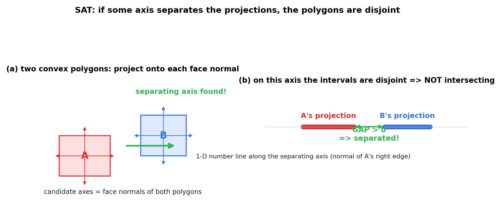
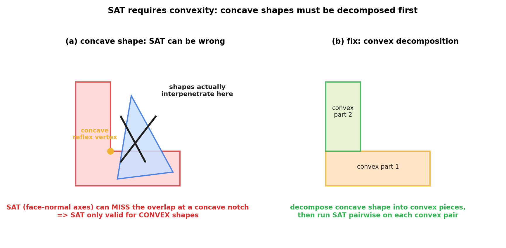
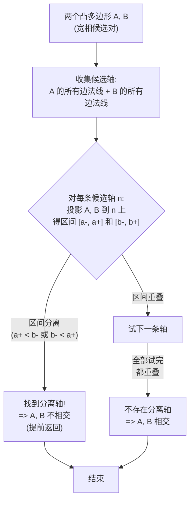
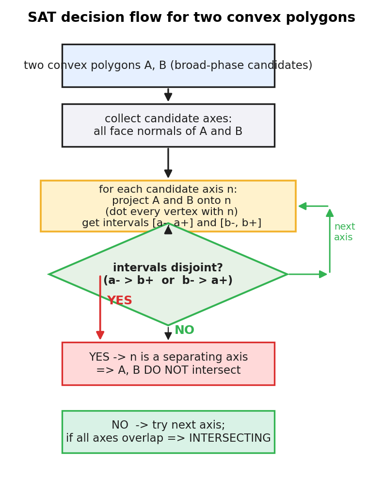
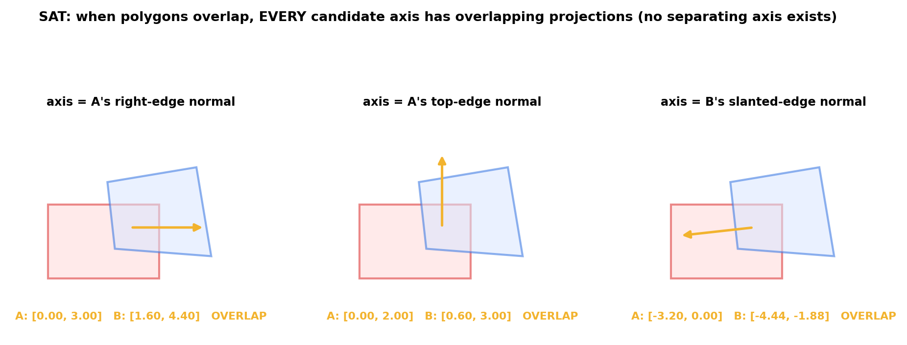
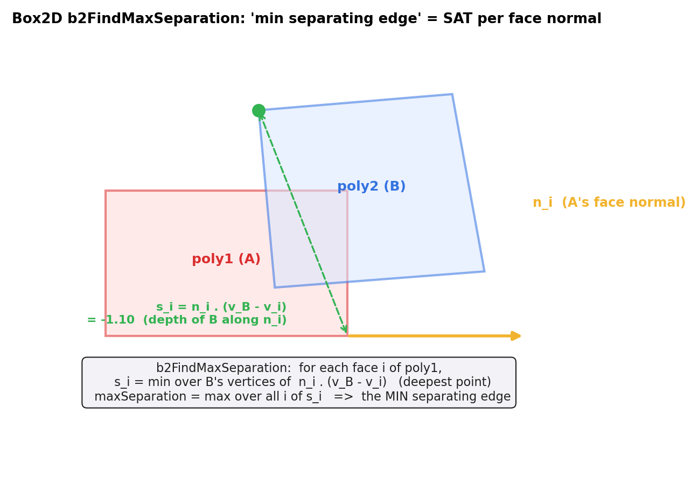

# 第 4 篇 · 第 12 章 · SAT:分离轴定理

> **核心问题**:宽相(AABB 树)已经把"不可能碰"的对排除了,留下少数候选对。现在要**精确**回答:这一对凸形状(两个多边形、或多边形与圆)**到底碰了没有**?最直接的笨办法是逐边求交点,可它既贵又数值脆弱。本章讲一条更漂亮的几何判据——**SAT(Separating Axis Theorem,分离轴定理)**:**两个凸形状不相交,当且仅当存在一条轴,把它们投影上去后区间不重叠**。投影这件事你在《线性代数入门》里早就学透(向量点乘就是投影长度),本章只把它**用在碰撞上**,并把"为什么凸多边形只需查有限条边法线"讲清。

> **读完本章你会明白**:
> 1. SAT 定理:两凸形状不相交 ⟺ 存在一条"分离轴",投影到它上面的两个区间不重叠;对凸多边形,候选轴只需取**每条边的外法线**,数量有限。
> 2. 为什么这个判据成立——背后的凸集分离超平面定理(二维版),以及为什么"凸"是命门、凹形状 SAT 会失效。
> 3. 投影怎么算:一个形状投影到单位向量 **n** 上就是一个数 `dot(顶点, n)`,所有顶点取 min/max 得到区间(承《线性代数入门》向量投影)。
> 4. SAT 在 Box2D v3 里**不是一个独立的 `b2SAT()` 函数**,而是融化在每个 per-shape-pair 的 `b2CollideXxx` 里,落地形式叫 **"最小分离边(min separating edge)" / 参考边(reference edge)**。

> **如果一读觉得太难**:先只记三件事——① 两凸形状只要**存在一条边法线**把投影分开,它们就不相交;② 全部边法线投影都重叠,才说它们相交;③ Box2D 在 `manifold.c` 里把这套叫 "min separating edge",不是独立函数。

---

## 〇、一句话点破

> **两个凸形状,要么交在一起,要么中间能塞进一条直线把它们隔开——这条直线的方向,就是一条分离轴。沿这条轴把两个形状投影成两段区间,这两段区间必然不重叠。凸多边形的妙处在于:这条隔开它们的直线(若存在),方向必是某条边的外法线,所以候选轴只有有限条,挨个试投影即可。**

这是结论。本章倒过来拆:先看笨办法撞什么墙,再看 SAT 凭什么用"投影"漂亮替代"求交点",最后落到 Box2D 的 `manifold.c` 看它真实怎么实现。

---

## 一、从宽相进窄相:笨办法撞什么墙

上一章(P3-11)的动态 AABB 树,做的是**宽相**:用最便宜的轴对齐包围盒(AABB),把场景里几千个物体筛成少数"可能碰"的候选对。可 AABB 是矩形外壳,两个 AABB 重叠**绝不等于**两个真形状相交——可能只是外壳蹭到了,内核还差得远。

> **钉死这件事**:宽相只回答"**可能**碰",窄相才回答"**真的**碰了没"。P4 这一篇(P4-12~14)整个在干窄相的活:本章(SAT)判相交/不相交,P4-13(GJK)算没碰时的距离,P4-14 算碰上后的接触流形(法线、穿透、接触点)。

### 朴素做法:逐边求交点

判两个多边形 A、B 相交,最朴素的想法:**它们有边相交吗?或者一个完全包在另一个里吗?** 这就要对每对边(A 的边 × B 的边)算线段交点,最坏 O(eA·eB);还要处理"一个含于另一个"这种边交点为零但确实相交的情况;更要命的是**数值不稳定**——两条边几乎平行时交点算得稀烂。

> **不这样会怎样**:逐边求交点,既要写一堆分支(端点重合、共线、平行),又对浮点误差极度敏感(两条边夹角很小时,交点坐标能飞到天上去)。物理引擎每帧要判几百几千对,这种又慢又脆的办法是灾难。

### SAT 的思路:不找交点,找"能不能塞进一条缝"

SAT 换了个角度。它问的不是"两条边在哪儿交",而是更聪明的:**"能不能找到一条直线,把 A、B 分别塞在它的两侧,谁也不碰谁?"** 如果能找到这样一条缝,它们就不相交;如果怎么都塞不进去(每个方向投影都重叠),它们就相交。

这条缝的"方向",就是**分离轴(separating axis)**。



左图把所有候选边法线画成细箭头(红的来自 A,蓝的来自 B),绿色加粗的就是找到的分离轴。右图是关键:**把 A、B 分别投影到这条分离轴(+x 方向)上,各得到一段区间**。A 的区间在 [0, 2],B 的区间在 [3.2, 5.0],中间有 1.2 的间隙——两段区间不重叠,所以 A、B 不相交。

> **所以这样设计**:SAT 把"判相交"这个二维几何问题,**降维成一维的"两段区间是否重叠"**。一维区间比较就是两个浮点数比大小,又快又稳,完美绕开逐边求交的脆性。这是整章的精髓。

---

## 二、投影:承《线性代数》一句带过

把一个形状投影到一条轴上、得到一段区间,这件事在《线性代数入门》讲向量投影时已经讲透。这里只做最小回顾,把篇幅留给物理特有的。

> **承《线性代数入门》**:把顶点 **v** 投到单位向量 **n** 上,投影长度就是**点乘(dot product)** `dot(v, n)`——这正是向量投影的代数定义。投影长度是个标量,于是把"二维平面上的点"变成了"一维数轴上的一个数"。详见《线性代数入门》"向量投影 / 点乘"一节,这里不重讲。

对一个多边形,把它的每个顶点都投到 **n** 上,得到一堆标量;它们的 **min 和 max** 就是这个多边形在 **n** 方向上的投影区间:

```
   interval(多边形, n) = [ min_v dot(v, n) ,  max_v dot(v, n) ]
```

两个多边形 A、B 投到同一根 **n** 上,得到两段区间 `[a-, a+]`、`[b-, b+]`。它们**不重叠**的条件(假设 A 的区间偏左)是:

```
   a+ < b-      (A 的最大投影 < B 的最小投影,中间有缝)
```

只要存在某根 **n** 使得这个成立,就说 **n** 是一条**分离轴**,两形状不相交。一维区间比大小,O(顶点数) 算一遍,干净利落。

> **钉死这件事**:SAT 把"两形状相交"判据转写成:**不存在任何分离轴 ⟺ 相交**。也就是:把候选轴挨个试,**只要找到一条**使投影区间分离的轴,立刻判定"不相交",提前返回;**全部**候选轴投影都重叠,才判定"相交"。

---

## 三、SAT 定理:为什么成立

光会算投影还不够,得知道**凭什么**这样判是对的、凭什么"凸"是命门。这一节讲清定理本身和它背后的凸集分离超平面定理。

### 定理(二维 SAT)

> **两个凸形状 A、B(在平面上)不相交,当且仅当存在一条直线 l,使 A、B 完全落在 l 的两侧(可贴边但不交叉)。这条直线的法线方向 **n**,就是一条分离轴:把 A、B 沿 **n** 投影,得到的两个区间不重叠。**
>
> 进一步,**若 A、B 都是凸多边形**,则分离轴(若存在)的方向 **n**,必是 A 或 B 的**某条边的外法线**。

后半句是 SAT 在游戏/物理引擎里能实用的关键:它把候选轴从"无穷多条方向"收敛到"**有限条边法线**"。一个八边形和一个六边形,候选轴最多 8+6=14 条,挨个试投影,判一次相交最多做 14 次投影运算。

### 为什么成立:凸集分离超平面定理

这个判据不是魔法,它的根在凸几何里一条基本定理——**凸集分离定理(separating hyperplane theorem)**:

> **两个不相交的凸集,一定可以用一个超平面(二维里就是一条直线)把它们分开。**

这条定理在《线性代数入门》讲凸集时给过几何直觉(凸集没有"凹进去"的缺口,所以不相交时总能从中间插进一把"刀")。它的逆否命题就是 SAT:

- 如果存在分离超平面(直线)⟹ 沿这条直线的法线投影,两凸集必落在直线的两侧,投影区间不重叠 ⟹ 找到分离轴 ⟹ 不相交。
- 反过来,如果两凸集不相交,分离超平面定理保证这条直线**存在**,于是分离轴也**存在**。

所以"不相交 ⟺ 存在分离轴"对凸集是个**充要**判据,不是近似。这就是 SAT 严谨的数学根。

### 为什么"凸"是命门:凹形状反例

定理的关键前提是"**凸**"。凹形状有"凹进去的缺口",分离超平面定理失效,SAT 也会出错。



左图那个 L 形多边形有个凹角(amber 标的 reflex vertex),蓝色三角形正插在这个凹口里——两形状明显互相穿透(黑 X 标出穿透区)。可是 L 形的每条"外法线"投影都和三角形重叠,没有任何一条边法线能把它们分开,SAT 会**误判为"相交可能"或彻底失效**。

> **不这样会怎样**:对凹形状直接套 SAT,要么漏判(把相交判成不相交),要么乱判(凹口里的穿透根本探测不到)。物理引擎绝不允许漏判——漏判就是物体穿模(tunneling),肉眼可见的 bug。

### 补救:凸分解

凹形状的正确处理是**凸分解(convex decomposition)**:把它拆成若干个**凸**块,对每对凸块分别跑 SAT。右图把 L 拆成两个矩形,每个矩形都是凸的,SAT 在它们身上又准又快。

> **承接书讲过**:凸集的定义、凸包(convex hull)的算法,见《线性代数入门》"凸集 / 凸包"一节。Box2D 的多边形 API(`b2MakePolygon`、`b2MakeBox`)只接受**凸**多边形——这就是为什么:`b2Polygon` 结构体里直接预存了每条边的外法线(下节源码会看到),默认形状就是凸的,凹形状必须由用户自己凸分解后再喂给引擎。

---

## 四、SAT 算法:凸多边形 × 凸多边形

把定理翻译成算法,就是遍历候选轴、挨个投影、看分离。



完整流程图也画成一张 PNG,把"循环试轴 + 决策分支"画清:



值得注意的几个工程细节:

1. **提前返回(early exit)**:找到第一条分离轴就够了,不必把所有轴试完。两形状真不相交时,往往第一条或第二条边法线就分开了,极快。
2. **相交要全检**:判定"相交"必须**所有**候选轴投影都重叠,没法提前返回——这正是 SAT 判相交比判分离略贵的原因(但凸多边形边数少,仍很便宜)。
3. **最小分离边(min separating edge)**:即使相交,SAT 顺手把"投影重叠最小"的那条轴记下来——这条边就是两形状最可能分离的方向,后面算接触流形(P4-14)和约束求解(P5-16)的接触法线,基本就来自它。Box2D 源码里正是这么做的。

> **钉死这件事**:SAT 不只是判"碰没碰"。它顺带给出的"最小分离边"和那上面的投影重叠量,正是后面接触流形(法线、穿透深度)的原料。SAT 一鱼两吃:判相交 + 给接触方向。

下面这张图把相交情形画出来:两个重叠的凸多边形,**每条**候选边法线投影都重叠,找不到分离轴。



---

## 五、Box2D v3 里 SAT 的真实落地

读完原理,看 Box2D v3 源码里它怎么落地。这里有个**必须诚实标注**的关键事实,先点破:

> **★诚实标注**:Box2D v3 里**没有一个独立的 `b2SAT()` 函数**。SAT 的思想("投影到每条边法线、找最小分离边")**融化**在每个 per-shape-pair 的 `b2CollideXxx` 函数里,落地形式叫 **"最小分离边(min separating edge)"** 和 **"参考边 / 入射边(reference / incident edge)"**。这和很多教程里"先写个通用 SAT"的讲法不同——Box2D 把它和后续的接触流形计算**缝在一起**,一次过:既判相交,又算接触。

> **承接书讲过**:总纲 / 锚点文件 `_源码事实-anchor.md` 第 4b 节专门标了这条。讲 SAT 时**绝不编造** `b2SAT()`,而指 `manifold.c` 里的 `b2CollideXxx`。

### 5.1 多边形结构:预存了每条边的外法线

先看 `b2Polygon` 结构体——它**预先**把每条边的外法线存好了,这是 SAT 在 Box2D 里能 O(边数) 跑的命脉:

```c
// include/box2d/collision.h:153-169(摘录)
typedef struct b2Polygon
{
    b2Vec2 vertices[B2_MAX_POLYGON_VERTICES];  // 顶点
    b2Vec2 normals[B2_MAX_POLYGON_VERTICES];   // 每条边的外法线(预存!)
    b2Vec2 centroid;                            // 质心
    float radius;                               // 外接圆半径(圆角多边形用)
    int count;                                  // 顶点数
} b2Polygon;
```

> **技巧**:多边形在**创建时**(`b2MakePolygon` / `b2MakeBox`)就把每条边的外法线算好存进 `normals[]`。运行时做 SAT,直接读 `normals[i]`,**不必每帧重算法线**。这是把"准备期"和"热路径"分开的经典优化——预计算 amortize 到创建期,热路径只剩查表 + 点乘。

`B2_MAX_POLYGON_VERTICES` 在 [include/box2d/collision.h:25](../box2d/include/box2d/collision.h#L25) 定义为 **8**:Box2D 的凸多边形最多 8 条边,所以候选轴最多 16 条(两个多边形),SAT 的循环有上界。

### 5.2 核心:`b2FindMaxSeparation`(SAT 的真身)

多边形 × 多边形的 SAT,核心落在一个 static 函数里:[src/manifold.c:646-682](../box2d/src/manifold.c#L646-L682) 的 `b2FindMaxSeparation`。它干的事就是上面流程图里的"对每条边法线投影、找最小分离边":

```c
// src/manifold.c:645-682(摘录,简化示意保留逻辑)
// Find the max separation between poly1 and poly2 using edge normals from poly1.
static float b2FindMaxSeparation( int* edgeIndex, const b2Polygon* poly1, const b2Polygon* poly2 )
{
    int count1 = poly1->count;
    int count2 = poly2->count;
    const b2Vec2* n1s = poly1->normals;   // 预存的边法线
    const b2Vec2* v1s = poly1->vertices;
    const b2Vec2* v2s = poly2->vertices;

    int bestIndex = 0;
    float maxSeparation = -FLT_MAX;
    for ( int i = 0; i < count1; ++i )             // 遍历 poly1 的每条边法线
    {
        b2Vec2 n  = n1s[i];                        // 第 i 条边的外法线(候选轴)
        b2Vec2 v1 = v1s[i];                        // 第 i 条边的一个端点

        // Find the deepest point for normal i.
        // 把 poly2 的每个顶点投到 n 上,取最小值 = poly2 沿 n 钻得最深的点
        float si = FLT_MAX;
        for ( int j = 0; j < count2; ++j )
        {
            float sij = b2Dot( n, b2Sub( v2s[j], v1 ) );   // 投影 = 点乘
            if ( sij < si ) si = sij;
        }

        if ( si > maxSeparation )                  // 记录"最不那么穿透"的那条边
        {
            maxSeparation = si;
            bestIndex = i;
        }
    }
    *edgeIndex = bestIndex;
    return maxSeparation;
}
```

把这个函数和上一节讲的 SAT 算法逐行对照:

- **外层 for**(`i` 遍历 `poly1->normals`):就是"**遍历候选轴**"。Box2D 直接读预存的法线,不重算。
- **内层 for**(`j` 遍历 `poly2->vertices`):对每个 poly2 顶点,用 `b2Dot(n, v2s[j] - v1s[i])` 算投影。注意这里**没归一化地去比 min**——它算的是"poly2 的顶点相对于 poly1 第 i 条边的端点、沿法线 n 的有向投影距离",取 min 就是 poly2 沿这条法线**钻得最深**的那个顶点的投影。
- **`maxSeparation`**:外层把每条边的 `si`(poly2 沿这条边的最深投影)取最大——这个最大值叫**"最小分离量"**:它越大,说明 poly1 的某条边越能把 poly2 挡在外面;它若为正,poly2 整个在 poly1 这条边的外侧,**分离轴找到了**。
- **`bestIndex`**:对应的那条边,就是**最小分离边(min separating edge)**,后面当**参考边**用。

> **承接书讲过**:`b2Dot` 就是向量点乘,`b2Sub` 是向量减法——向量投影/点乘的几何意义见《线性代数入门》。这里每一处 `b2Dot` 都是在做"把顶点投到候选轴上"。

这个 `b2FindMaxSeparation` 的几何,画成一张图:



注意函数名叫 `b2FindMaxSeparation`(找最大分离),它返回的 `maxSeparation` 是 poly1 **每条边**上 poly2 钻入深度的**最大值**(即"最不穿透"那条边)。它若 ≥ 0,说明 poly2 整个落在 poly1 某条边的外侧,**poly1 侧找到分离轴**。

### 5.3 多边形 × 多边形:`b2CollidePolygons`

把 SAT 用在两个多边形上,入口是 [b2CollidePolygons](../box2d/src/manifold.c#L702)(src/manifold.c:702 起)。它算法的注释挂得很清楚(manifold.c:687):

```
// compute edge separation using the separating axis test (SAT)
// if (separation > speculation_distance)  return;   // 分离了,直接返回不相交
// find reference and incident edge
// ... 算接触流形(裁剪入射边)
```

关键几步(摘自 manifold.c:732-743):

```c
int edgeA = 0;
float separationA = b2FindMaxSeparation( &edgeA, &localPolyA, &localPolyB );  // 用 A 的边法线查
int edgeB = 0;
float separationB = b2FindMaxSeparation( &edgeB, &localPolyB, &localPolyA );  // 用 B 的边法线查
float radius = localPolyA.radius + localPolyB.radius;
if ( separationA > speculativeDistance + radius || separationB > speculativeDistance + radius )
{
    return (b2LocalManifold){ 0 };   // 任一边上找到分离轴 => 不相交,返回空 manifold
}
```

> **钉死这件事**:`b2CollidePolygons` 调 `b2FindMaxSeparation` **两次**:一次用 A 的边法线(`separationA`),一次用 B 的边法线(`separationB`)。这正是 SAT 定理说的"候选轴 = 两个多边形所有边法线"——只不过分成两次扫,每次扫一个多边形的法线。**任一**为正(超过 `speculativeDistance + radius` 这个阈值),就判定不相交,返回空 manifold。这就是 SAT 的"找到分离轴 ⟹ 不相交"判据在源码里的直接落地。

`separationA`、`separationB` 都不大(都"穿透"了),才往下走:取**分离量较大**那条边作**参考边(reference edge)**,对面那条边作**入射边(incident edge)**,然后裁剪入射边得到接触点——那是 P4-14 接触流形的活。本章只盯 SAT 判据这一段。

### 5.4 多边形 × 圆:简化的 SAT

圆没有"边",SAT 怎么用?看 [b2CollidePolygonAndCircle](../box2d/src/manifold.c#L127)(manifold.c:127),注释 manifold.c:138 写着 **"Find the min separating edge"**:

```c
// src/manifold.c:138-153(摘录)
// Find the min separating edge.
int normalIndex = 0;
float separation = -FLT_MAX;
int vertexCount = polygonA->count;
const b2Vec2* vertices = polygonA->vertices;
const b2Vec2* normals = polygonA->normals;
for ( int i = 0; i < vertexCount; ++i )
{
    float s = b2Dot( normals[i], b2Sub( center, vertices[i] ) );  // 圆心投到每条边法线
    if ( s > separation ) { separation = s; normalIndex = i; }
}
if ( separation > radius + speculativeDistance )
    return manifold;   // 圆心在多边形所有边外侧 => 不相交
```

> **技巧**:圆退化成一个点(圆心),SAT 变得更简:**只需遍历多边形的边法线,看圆心是否落在每条边的外侧**。圆心投影到法线上的距离都大于半径,圆就在多边形外面(不相交)。这是 SAT 在"多边形 vs 点/圆"上的特化——候选轴只剩多边形的边法线(圆没有边)。

### 5.5 胶囊 × 胶囊:用 SAT 找参考边

[b2CollideCapsules](../box2d/src/manifold.c#L237)(manifold.c:237) 在两胶囊线段不平行、相互投影落在对方范围内时,注释 manifold.c:327 明说 **"find reference edge using SAT"**:

```c
// src/manifold.c:327(注释)
// find reference edge using SAT
b2Vec2 normalA;
float separationA;
{
    normalA = b2LeftPerp( u1 );   // 胶囊 A 的边法线(线段的左垂直)
    float ss1 = b2Dot( b2Sub( p2, p1 ), normalA );  // B 的端点投到 A 的法线
    float ss2 = b2Dot( b2Sub( q2, p1 ), normalA );
    ...
}
```

这里 SAT 的候选轴退化成胶囊(本质是"胖线段")的垂直方向,用点乘判分离,逻辑和多边形完全同源——只是边数更少。

> **钉死这件事**:Box2D 里**所有 per-shape-pair 函数**(`b2CollidePolygons` / `b2CollidePolygonAndCircle` / `b2CollideCapsules` / …)都内嵌了同一套 SAT 思想:**遍历候选边法线 → 点乘投影 → 找最小分离边/参考边**。它不是一个共享的 `b2SAT()` 函数,而是**按形状对特化**、和接触流形计算缝在一起。这是 Box2D 工程化 SAT 的方式:为了性能(每种形状对走最快路径)和精度(数值上各自优化),宁可复制思想,也不抽公共函数。

---

## 六、技巧精解:为什么 SAT 成立 + 三个工程加速

### 技巧一:定理成立的最小证明(承凸集分离定理)

为什么"两凸形状不相交 ⟺ 存在分离轴"?给个最短直觉证明(严格证明见凸分析教材,这里讲清**为什么对**):

1. **不相交 ⟹ 存在分离直线**(凸集分离定理):两个不相交的**凸**集 A、B,必能找到一条直线 l 把它们分在两侧。直觉:凸集没有"凹口",所以它们不挨着时,中间总有缝隙能插进一条直线。凹集就不行——凹口里嵌着对方,怎么插也插不进。
2. **分离直线 ⟹ 投影区间分离**:沿这条直线 l 的法线 **n** 投影,A 整个落在 l 的一侧(投影都 < 某值),B 落在另一侧(投影都 > 某值),两段区间天然不重叠。**n** 就是分离轴。
3. **凸多边形的额外福利**:若 A、B 是凸多边形,分离直线(若存在)可以**贴着 A 或 B 的某条边**——所以分离轴方向必是某条边的外法线,候选轴有限。证明的关键是:凸多边形每条边的外法线"指向外",如果有一条任意方向的直线能分开,把它平移到恰好贴着某条边,仍能分开(凸性保证)。

> **不这样(不凸)会怎样**:凹形状在第 1 步就崩——分离超平面定理要求凸。前面那张凹形 L 图就是反例:凹口里嵌着对方,没有直线能分开,SAT 失效。

### 技巧二:三个工程加速

SAT 的朴素实现(每对都遍历所有边法线)已经够好,Box2D 还加了三个加速:

**① 预存边法线**(见 5.1):多边形创建时算好 `normals[]`,热路径直接读,O(1) 查表,不重算。这是把每帧的 O(边数) 法线计算 amortize 到创建期一次。

**② 提前返回**:判"不相交"时,`b2FindMaxSeparation` 一旦发现某条边 `si > 0`(或超阈值),其实就能判定分离。Box2D 的实现是把整个多边形扫完取 max(因为它还要顺带算"最小分离边"给接触流形用),但概念上 SAT 是 "first separating axis wins"——找到一条就够。

**③ skin radius + speculative distance**:看 `b2CollidePolygons` 那个判断:

```c
if ( separationA > speculativeDistance + radius || ... )
    return (b2LocalManifold){ 0 };
```

`radius` 是每条多边形的"皮肤厚度"(把多边形当圆角处理,避免共边共点的数值抖动),`speculativeDistance` 是 [B2_SPECULATIVE_DISTANCE](../box2d/include/box2d/constants.h#L55)(= `4.0f * B2_LINEAR_SLOP`)——它让 SAT **提前一点**判定"将碰未碰",给下一帧的约束求解留缓冲,配合 CCD 防高速穿透(P5-18 详讲)。这是 SAT 从"纯判相交"扩展成"判将相交",是物理引擎防 tunneling 的一环。

> **钉死这件事**:SAT 在 Box2D 里**不是孤立判相交**,而是和"圆角多边形(skin radius)""投机接触(speculative contact)"缝在一起。这种"判相交顺便给接触方向 + 投机阈值"的一体化设计,是物理引擎把数学定理工程化的典型样貌。

### 技巧三:为什么 SAT 比"逐边求交"好

回顾开头的笨办法(逐边求交点),SAT 凭什么赢:

| 维度 | 逐边求交 | SAT(投影判分离) |
|------|---------|----------------|
| 复杂度(两多边形 eA×eB 边) | O(eA·eB) 对边求交 | O(eA+eB) 条轴 × 每条 O(eA+eB) 投影 |
| 数值稳定性 | 差(平行/共线时交点飞掉) | 好(只比浮点区间) |
| "不相交"提前退出 | 难(得把边都查完) | 易(找到一条分离轴就返回) |
| 顺带产出 | 仅交点 | 最小分离边(=接触法线方向)+ 穿透量 |

SAT 在每一栏都赢,这是它成为 2D 凸形状相交判断**事实标准**的原因。3D 里 SAT 要查的面法线 + 边叉积数量暴涨,所以 3D 物理引擎更多用 GJK(下一章)。

---

## 七、章末小结

### 回扣主线

本章服务二分法的**检测**面、且是窄相(narrow phase)的招牌。从宽相(P3-11 AABB 树粗筛)留下的候选对出发,本章用 SAT **精确**判"两个凸形状真的相交没有"。SAT 的精髓:把"二维形状相交"降维成"一维投影区间是否分离",用向量点乘(承《线性代数》)算投影、用凸集分离定理(承《线性代数》凸集)保证判据充要。在 Box2D v3 里,SAT **不是独立函数**,而是融化在每个 `b2CollideXxx` 里,落地叫"最小分离边 / 参考边"。判完相交,SAT 顺给的"最小分离边"就是下一章接触流形(P4-14)和约束求解(P5-16)要用的接触法线方向。

### 五个为什么

1. **SAT 凭什么判相交?**——两个凸形状不相交 ⟺ 存在一条分离轴把它们投影分开(凸集分离定理)。凸多边形的分离轴必是某条边的外法线,候选有限,挨个投影比区间即可。
2. **为什么要"凸"?**——分离超平面定理只对凸集成立;凹形状有凹口,SAT 会漏判(凹口里的穿透探测不到),必须先凸分解。
3. **投影怎么算?**——把每个顶点点乘单位法线(承《线性代数》向量投影),取 min/max 得区间;两区间不重叠就找到分离轴。
4. **SAT 在 Box2D 里是独立函数吗?**——**不是**。它融化在每个 `b2CollideXxx` 里(manifold.c),核心是 `b2FindMaxSeparation`(manifold.c:646)找"最小分离边",**没有** `b2SAT()`。
5. **SAT 还顺手给了什么?**——最小分离边(= 接触法线方向)+ 沿它的投影量(= 穿透深度)。这两样是 P4-14 接触流形和 P5-16 约束求解的原料,SAT 一鱼两吃。

### 想继续深入往哪钻

- 想搞懂没碰时怎么算"离多近"(距离):下一章 **P4-13 GJK 与闵可夫斯基差**——另一条用闵可夫斯基差 + 单纯形迭代判相交/算距离的路,承《线性代数》凸集。
- 想搞懂 SAT 给的"最小分离边"怎么变成接触点/法线/穿透:**P4-14 接触流形**。
- 想看 3D 怎么判相交:3D SAT 候选轴(面法线 + 边叉积)暴涨,改用 GJK(本系列聚焦 2D,3D 只概念对照)。
- 想看凸分解算法(凹→凸):查"convex decomposition / Hertel-Mehlhorn / Bayazit"——Box2D 不内置,要求用户喂凸多边形。

### 引出下一章

SAT 解决了"两个凸形状碰没碰"——碰了,顺给接触方向;没碰,它**不知道离多远**(只知道"分离了")。可物理引擎有时要算"没碰的两个物体之间还差多少"(比如关节的长度约束、避免穿模的预警距离)。这就要另一条路:**GJK(Gilbert-Johnson-Keerthi)算法**,用**闵可夫斯基差(Minkowski difference)** 把"两形状距离"变成"差集是否含原点",再用单纯形迭代逼近最近点。下一章 **P4-13 GJK 与闵可夫斯基差**,我们从闵可夫斯基差讲起,看它怎么补上 SAT 算不了距离的缺口。

> **下一章**:[P4-13 · GJK 与闵可夫斯基差](P4-13-GJK与闵可夫斯基差.md)
