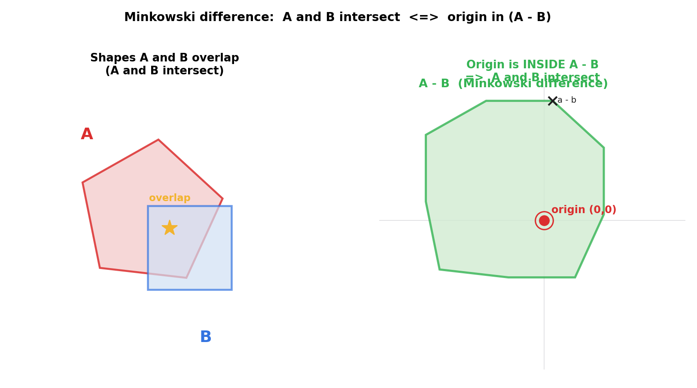
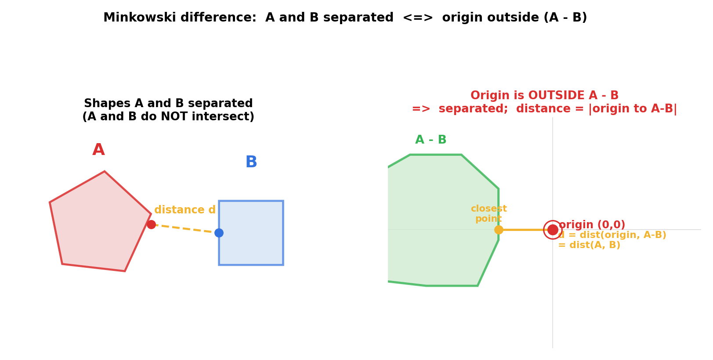
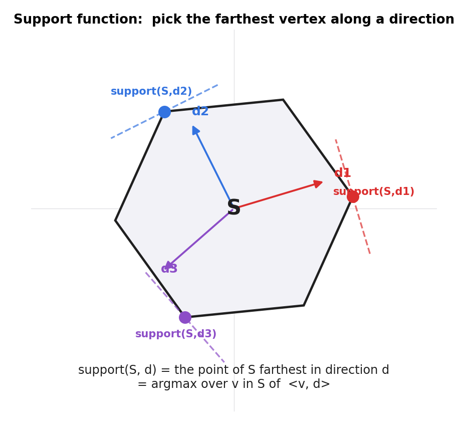
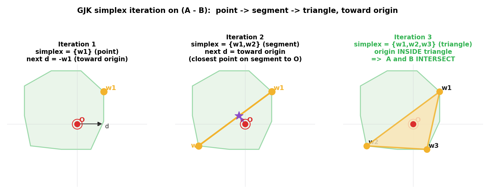
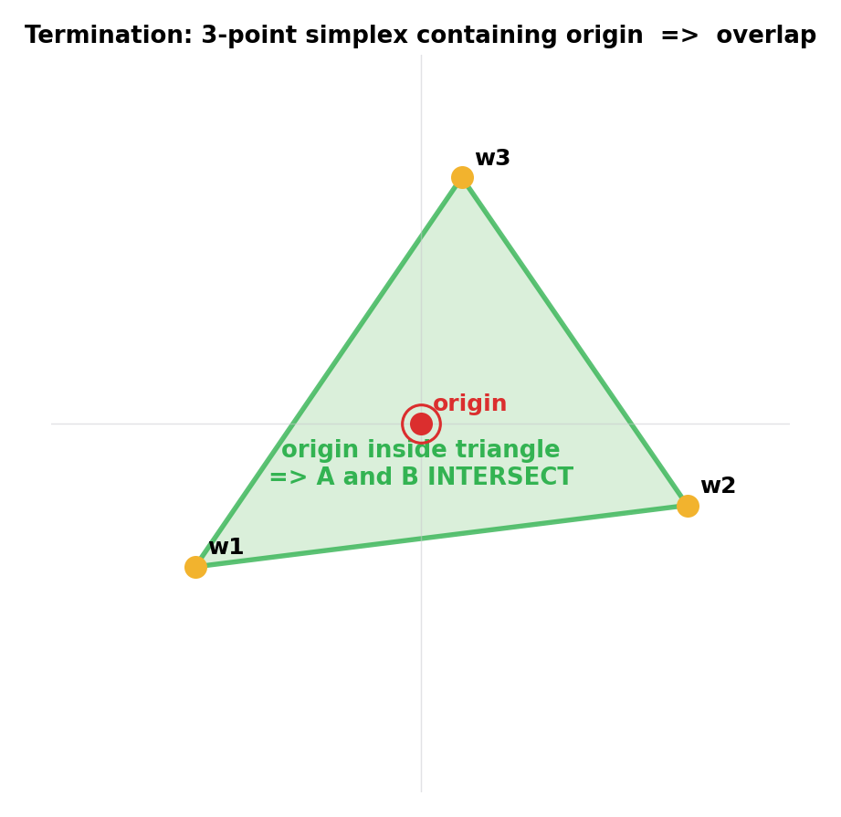
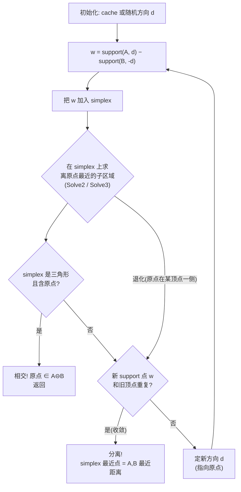

# 第 4 篇 · 第 13 章 · GJK 与闵可夫斯基差

> **核心问题**:上一章 SAT 解决了"两个凸形状碰没碰"——只要找到一条把它们投影分开的轴,就判分离。可 SAT 有两个短板:① 它只回答"碰没碰",**没碰时不知道离多远**;② 它的"分离轴"是逐边扫描找出来的,对两个形状的边要逐条试,效率随边数增长。这一章换一条完全不同的路——**GJK 算法**(Gilbert–Johnson–Keerthi)。GJK 的核心是一个让人拍案的数学变换:**把"两个形状 A, B 相不相交"的问题,变成"一个形状(它们的闵可夫斯基差 A⊖B) 包不包含坐标原点"的问题**。一旦做完这个变换,判相交就退化成"原点在不在这个形状里",而求最近距离就退化成"原点离这个形状的边界多远"——而且这两件事,都能用**支撑函数(support)** 配合**单纯形(simplex)** 迭代,在不显式构造 A⊖B 的前提下高效完成。GJK 是窄相检测的另一根招牌:对任意**凸**形状(不限于多边形,圆、胶囊都行),既能判相交又能算最近距离,而且只依赖一个 `support` 函数。

> **读完本章你会明白**:
> 1. **闵可夫斯基差 A⊖B** 是什么、为什么"A⊖B 包含原点 ⟺ A, B 相交"——这一条等价性是 GJK 的全部地基。
> 2. **支撑函数 support(S, d)** 怎么用 O(n) 沿方向 d 取到凸形状 S 的最远点,以及为什么它是 GJK 唯一需要的形状接口。
> 3. **GJK 主循环**:从原点出发,反复用 support 在 A⊖B 上取点、构建单纯形(点 → 线段 → 三角形)、让单纯形朝原点收敛,**不显式构造 A⊖B**,几步之内判出"原点在不在 A⊖B 内"或算出"原点到 A⊖B 边界的最近距离"。
> 4. 为什么 GJK 比"显式构造 A⊖B 顶点再判原点"高明得多(隐式查询 vs 显式构造),以及为什么它在 Box2D v3.2 里既是**判相交**的工具(sensor/point overlap),又是**算最近距离**的工具(CCD 的保守前进)。
> 5. Box2D v3.2 源码里 `b2ShapeDistance` 怎么落地这套算法:simplex 缓存 `b2SimplexCache` 跨帧 warm start、主循环最多 20 次迭代、用"重复 support 点"作主终止判据防循环。

> **如果一读觉得太难**:先记三件事——① A⊖B 是个新形状,"A 和 B 相交" 等价于 "原点在 A⊖B 里";② support 沿一个方向取形状上最远的点,GJK 全靠它;③ GJK 用 support 一点一点搭单纯形(点 → 线 → 三角),朝原点逼近,搭出包含原点的三角就判相交。其余都是把这三件事讲透。

---

## 〇、一句话点破

> **两个凸形状 A, B 相交,当且仅当它们的闵可夫斯基差 A⊖B = {a − b | a∈A, b∈B} 包含坐标原点。GJK 做的事,就是用支撑函数 support 隐式地、一点一点地在 A⊖B 上"试探",搭出一个单纯形(点 → 线段 → 三角形)朝原点收敛——若搭出包含原点的三角形,就判相交;若 support 再取不出更近原点的点,就判分离,并顺带把最近距离算出来。它从不显式构造 A⊖B,这正是它高明的地方。**

这是结论。本章倒过来拆:先讲清那个神奇的等价性("相交 ⟺ 原点在 A⊖B 内")从哪来,再讲 support 这个唯一接口,最后讲 GJK 怎么靠这两件搭起整个算法,并在 Box2D v3.2 的源码里落地。

---

## 一、换一条路:把"两形状相交"变成"一个形状含不含原点"

上一章 SAT 的思路是:**直接**对两个形状找分离轴——投影到每条边法线上看能不能分开。这条路走得通,但有两个不爽的地方,正是 GJK 要补的:

1. **SAT 只判碰没碰,不算离多远**。两个形状明明没碰,SAT 说"找到分离轴,分离"就完事了,可物理引擎常常需要知道**它们最近有多远**(下一章接触流形要用、CCD 要用、休眠判断也要用)。SAT 想顺便算距离,得额外费功夫。
2. **SAT 的分离轴要逐边扫**。对两个多边形,SAT 把每条边法线当候选轴试一遍,边数多就慢。而且 SAT 本质是为多边形(有"边")设计的,圆和胶囊这种没有离散"边"的形状,SAT 得打补丁。

GJK 换了一个完全不同的视角:**别再盯着 A 和 B 两个形状看了,把它们"减"成一个新形状,问题立刻简化**。这个新形状,就是**闵可夫斯基差**(Minkowski difference),记作 A⊖B。

> **承接铁律**:闵可夫斯基和 / 差、凸集、支撑向量这些概念,在《线性代数入门》凸集与支撑超平面一节已讲透——凸集的支撑超平面、闵可夫斯基和把两个凸集"加"成更大的凸集、凸集的顶点是支撑向量的取值点。本章只用结论:**两个凸集的闵可夫斯基差仍是凸集,且 A⊖B 的支撑函数 = A 的支撑函数 − B 的反向支撑函数**。详细推导见《线性代数入门》;本章篇幅留给这条等价性**怎么用于相交判断**,以及 GJK 怎么**隐式**用它。

### 1.1 闵可夫斯基差是什么:把 A 的每个点减去 B 的每个点

定义很简单:

> A⊖B = { a − b | a ∈ A, b ∈ B }

也就是:A 里随便取一个点 a,B 里随便取一个点 b,把它们的**差向量** a − b 收集起来,所有这些差向量组成的集合,就是 A⊖B。

直觉上,你可以这样想:A⊖B 是把 B "反过来",然后让 A 在 B(已反转)上"扫一遍"——扫出来的轨迹形状。因为 A 和 B 都是凸的,扫出来的 A⊖B 还是凸的(凸性对闵可夫斯基运算封闭,见《线性代数入门》)。

为什么叫"差"?因为 a − b 就是一个差向量。注意这个差向量从哪指到哪:它从 b 指向 a(或者说,它表示 a 相对于 b 的位置)。

### 1.2 招牌等价性:A, B 相交 ⟺ 原点 ∈ A⊖B

这是 GJK 的地基,值得单独钉死。我们要证明:

> **两个凸形状 A, B 有公共点(相交),当且仅当坐标原点 O 落在 A⊖B 内部(或边界上)。**

证明非常短,只用到"A⊖B 是所有 a − b 的集合"这一条定义:

- **(⟹) 设 A, B 相交**:那么存在一个点 p,**p 既在 A 里又在 B 里**。取 a = p(它是 A 的点),取 b = p(它也是 B 的点),则 a − b = p − p = **0**(零向量,即原点)。而 a − b 是 A⊖B 的元素,所以 **0 ∈ A⊖B**,即原点在 A⊖B 里。
- **(⟸) 设原点 0 ∈ A⊖B**:那么存在 a ∈ A, b ∈ B,使得 a − b = 0,即 **a = b**。这个 a(= b)既在 A 里又在 B 里,是 A, B 的公共点,所以 **A, B 相交**。

证毕。两句话,干干净净。这个等价性的几何味道是:A⊖B 里每一个点都是"a 相对于 b 的位置向量",原点对应 a = b——也就是"a 和 b 是同一个点"。A⊖B 里有原点,就说明 A 和 B 共享至少一个点。



> **钉死这件事**:**A, B 相交 ⟺ 原点 ∈ A⊖B**。这条等价性是 GJK 的全部地基——它把"两个形状相交"这个二维问题,变成了"一个形状(A⊖B)包不包含原点"这个(同样二维但更好处理的)问题。一旦接受这个变换,后面 GJK 要做的,就只剩"判原点在不在 A⊖B 里"。

### 1.3 分离情形:原点在 A⊖B 外,距离也现成

如果 A, B 没相交呢?那原点在 A⊖B **外面**。但这里有个额外的礼物:**原点离 A⊖B 的边界有多远,A, B 之间就有多近**。

道理是这样的:A⊖B 里的每个点都是一个差向量 a − b,它的长度 |a − b| 就是 a 到 b 的距离。整个 A⊖B 里离原点最近的那个点,对应的 |a − b| 就是"在所有 a∈A, b∈B 的组合里,a 和 b 能达到的最近距离"——这正是 A, B 之间的最近距离。换句话说:

> **A, B 的最近距离 = 原点到 A⊖B 边界的最近距离。**



这就是 GJK 比 SAT 强的地方:同一个变换,既判相交(原点在不在里面),又算距离(原点离边界多远),**一条算法两个答案**。SAT 想顺便算距离要额外做功课,GJK 是天然的。

### 1.4 一个朴素但糟糕的想法:显式构造 A⊖B

既然 A⊖B 这么好用,最朴素的想法是:**先把 A⊖B 的顶点显式构造出来,再判原点在不在它里面**。

构造 A⊖B 的顶点:取 A 的每个顶点,减去 B 的每个顶点,得到一堆差向量点;这些点(取凸包)就是 A⊖B 的顶点。两个 n 顶点的多边形,这一步是 O(n²) 个差向量,再求凸包 O(n² log n²)。

> **不这样会怎样**:这个朴素做法有两个致命问题:
> 1. **顶点爆炸**:两个 8 边形,要算 64 个差向量;边数一多,顶点数平方增长。物理引擎场景形状不大(多边形顶点 ≤ 8),但圆、胶囊这种"连续"形状根本没有离散顶点,显式构造无从下手。
> 2. **多此一举**:物理引擎大多数时候**只需要一个答案**——"碰没碰?"或"离多远?"。可显式构造把整个 A⊖B 都建出来,绝大部分顶点根本用不上。这就像查词典时把整本词典背下来再找一个词——大错。
> 3. **每帧都要重建**:物体每帧都在动,A⊖B 每帧都不同,每帧都得重新构造整个形状,O(n²) 地烧算力。

GJK 的洞察是:**根本不用显式构造 A⊖B**。我们只需要 A⊖B 上的**特定几个点**(在特定方向上最远的点),而这几个点可以用支撑函数 support **按需、隐式地**查到。这就是下一节的主角。

---

## 二、支撑函数 support:GJK 唯一的形状接口

GJK 最妙的设计,是它对形状提出了**唯一一个**要求:提供一个**支撑函数** support。只要你能写出一个形状的 support,GJK 就能在它(以及它的闵可夫斯基差)上跑。这一节讲清 support 是什么、为什么它对闵可夫斯基差特别友好。

### 2.1 support(S, d):沿方向 d 取形状 S 上最远的点

定义:

> **support(S, d) = argmax over v ∈ S of ⟨v, d⟩**

也就是:在形状 S 的所有点里,找一个让点积 ⟨v, d⟩ 最大的那个点 v。几何上,这就是**沿方向 d 最远的那个点**——你站在原点往 d 方向看,S 里离你"在 d 方向上"最远的那个顶点。

为什么是"最远"?点积 ⟨v, d⟩ = |v|·|d|·cosθ,在 d 方向上的投影长度。投影越长,就是在 d 方向上越远。所以 support 取的是 S 在 d 方向上"探得最远"的点。

对**凸多边形**,这特别好算:遍历每个顶点,算它和 d 的点积,取最大的——O(n)。对**圆**,直接圆心加半径乘以 d 的单位向量:support(circle, d) = center + radius · d̂,O(1)。对胶囊,在两端的圆和中间的矩形上各算再取最远。无论什么凸形状,support 都是一个便宜、局部的查询。



注意图里每个 support 点都画了一条**垂直于 d 的虚线**——这就是《线性代数入门》讲的**支撑超平面**:在 support 点,这条垂直于 d 的线"托住"了整个 S(S 全在这条线的一侧)。这就是"支撑"二字的来历。

### 2.2 招牌性质:A⊖B 的 support = A 的 support − B 的反向 support

这一条是 GJK 能"隐式"工作的关键。我们要算 A⊖B 在方向 d 上的 support:

> **support(A⊖B, d) = support(A, d) − support(B, −d)**

也就是说:**想查 A⊖B 沿 d 方向最远的点,不用构造 A⊖B,只要分别查 A 沿 d 的最远点、B 沿 −d(反方向)的最远点,两者相减**。

为什么?用定义推一下:

- support(A⊖B, d) = argmax over (a−b) of ⟨a−b, d⟩ = argmax of (⟨a, d⟩ − ⟨b, d⟩)。
- 要让 ⟨a, d⟩ − ⟨b, d⟩ 最大,就要 ⟨a, d⟩ 尽量大、⟨b, d⟩ 尽量小。
- ⟨a, d⟩ 最大 ⇒ a = support(A, d)。
- ⟨b, d⟩ 最小 ⇒ b 让 ⟨b, d⟩ 最小。而 ⟨b, −d⟩ = −⟨b, d⟩,⟨b, d⟩ 最小等价于 ⟨b, −d⟩ 最大 ⇒ b = support(B, −d)。

所以 support(A⊖B, d) = support(A, d) − support(B, −d)。证毕。

这一条性质是 GJK 的"隐式"魔法:**GJK 全程只调 support(A, d) 和 support(B, −d),从不在内存里构造 A⊖B 的任何顶点**。它每一步用 support "探"出 A⊖B 上的一个点,用这个点去逼近原点。整个算法不需要 A⊖B 的全貌,只需要"在某个方向上 A⊖B 长什么样"这一个局部信息。

> **钉死这件事**:**support(A⊖B, d) = support(A, d) − support(B, −d)**。这一条让 GJK 可以**完全隐式地**在 A⊖B 上工作——从不构造 A⊖B 的顶点,只在需要时用 support "探"一下。这是 GJK 相比"显式构造 A⊖B"的根本高明之处:把 O(n²) 的构造换成 O(n) 的按需查询,而且只查真正需要的几个点。

### 2.3 支撑函数对各种形状统一:圆、胶囊、多边形一视同仁

support 的另一个好处是**统一**。SAT 要对多边形逐边扫,圆和胶囊得专门打补丁(圆没边,胶囊的"边"是两端的圆弧)。support 不挑食:

- 多边形:遍历顶点取最大点积。
- 圆:`center + radius · d̂`。
- 胶囊:两端的圆 + 中间矩形,各算 support 再取最远。
- 任意凸形状(甚至没有解析表达的点云):只要能给出一组点和 support 查询,GJK 都能用。

Box2D v3.2 把所有形状统一抽象成 **`b2ShapeProxy`**——一个点数组 + 半径(见 `b2MakeProxy`,[src/distance.c:108](../box2d/src/distance.c#L108))。GJK 只对 proxy 工作,不关心 proxy 背后到底是圆、胶囊还是多边形。这就是为什么 Box2D 的 GJK 是一个**通用**的距离/相交函数,被 sensor overlap、point-in-shape、CCD 等多处复用。

---

## 三、GJK 主循环:搭单纯形朝原点收敛

有了 support 这个隐式接口,接下来就是 GJK 的核心:**怎么用 support 判出原点在不在 A⊖B 里**。答案是迭代地搭一个**单纯形(simplex)**,让它一步步朝原点逼近。

### 3.1 单纯形是什么:点、线段、三角形

在 2D 里,**单纯形(simplex)** 就是**最简单的、张满维度的几何体**:0 维是一个点,1 维是一条线段,2 维是一个三角形。GJK 在 A⊖B 上搭的单纯形,顶点数最多 3(2D 里 3 个点张满一个三角形)。

为什么是单纯形?因为判"原点在不在一个凸区域里",最简单的做法是**用凸区域里的几个点搭一个凸壳(单纯形),看原点在不在这个凸壳里**。1 个点:原点就是它?2 个点:原点在线段上?3 个点:原点在三角形里?随着顶点增多,单纯形"包住"的区域越来越大,总有一天能包住原点(如果原点确实在 A⊖B 里的话)。

GJK 的迭代,就是反复做三件事:

1. **用 support 在 A⊖B 上取一个新点** w(沿某个方向 d 查 `support(A⊖B, d)`,用上一节的等式隐式算)。
2. **把 w 加进单纯形**,得到一个 1/2/3 个点的单纯形。
3. **更新单纯形**:在新的单纯形上,找**离原点最近的那个点**(或子区域),并据此决定下一个 support 方向 d(总是指向原点)。如果单纯形已经是三角形且包含原点——相交,结束。

### 3.2 三步迭代:点 → 线段 → 三角形

看一张图把这三步走完。假设 A⊖B 是图里那个绿色凸形状,原点在它内部(相交情形):



**迭代 1(点)**:随便选个初始方向 d(比如 (1, 0)),查 `w1 = support(A⊖B, d)`。现在单纯形是 1 个点 {w1}。原点不等于 w1(大概率),所以没判出相交。下一步方向:**从 w1 指向原点**,即 d = −w1。

**迭代 2(线段)**:查 `w2 = support(A⊖B, −w1)`。单纯形变成 {w1, w2},一条线段。现在问题变成:**原点离这条线段最近的是哪一段?** GJK 在线段上找离原点最近的点(线段上离原点最近的点,用重心坐标算,见下文技巧精解),得到一个新方向 d(从该最近点指向原点)。如果最近点就是 w1 或 w2(原点"在 w1 或 w2 那一侧"),单纯形退化成单点,继续。

**迭代 3(三角形)**:查 `w3 = support(A⊖B, d)`。单纯形变成 {w1, w2, w3},一个三角形。现在判:**原点在不在这个三角形里?** 如果在——**原点在 A⊖B 里,判相交,结束**。如果不在,GJK 把单纯形"裁剪"到离原点最近的那条边(三角形的一个子区域),继续下一轮(顶点数不会无限增长,因为 support 取的点不会重复——见终止判据)。

### 3.3 终止判据:三角形含原点 / 取到重复 support 点

GJK 怎么知道该停?有两个判据:

1. **三角形包含原点**(相交判据):一旦单纯形有 3 个点(2D)且原点在三角形内部(或边界上),**判相交,立即返回**。这一条对应"原点 ∈ A⊖B"。

   

2. **取到重复的 support 点**(分离判据 + 收敛):如果某一轮查到的 support 点和上一轮的某个 simplex 顶点**完全相同**(同样的 indexA, indexB),说明 A⊖B 在这个方向上"探"不出新的、更接近原点的点了——**原点不可能被包进来了,判分离**。同时,此刻单纯形上离原点最近的点,给出的就是 A⊖B 边界上离原点最近的点,距离 = A, B 的最近距离。

第二条是 GJK 收敛的关键:**凸性保证 support 在每个方向上只有一个点,所以单纯形顶点不会无限增长——一旦 support 开始重复,就是收敛信号**。Box2D 的注释把这个判据写得明明白白,我们后面看源码。

> **钉死这件事**:GJK 主循环 = 反复(用 support 在 A⊖B 取点 → 加入单纯形 → 在单纯形上找离原点最近的子区域 → 定新方向)。终止于两个判据之一:① 三角形包含原点 ⇒ 相交;② support 取到重复点 ⇒ 分离,此时单纯形上离原点最近的点给出最近距离。**整个过程不构造 A⊖B 的顶点**,全靠 support 隐式查询。

### 3.4 一个完整走通的例子:线段上的最近点(`b2SolveSimplex2`)

光讲流程太抽象,我们把"在 simplex 上求离原点最近的子区域"这一步,用最简单的两顶点(线段)情形**用数字走一遍**——这正是 Box2D `b2SolveSimplex2`([distance.c:274](../box2d/src/distance.c#L274))干的事。

假设 simplex 现在有两个顶点 w1 = (−1, −2)、w2 = (3, 1)(都在 A⊖B 上,原点在它俩张成的线段附近)。我们要找**线段 w1–w2 上离原点 O 最近的那个点 p**,以及从 p 指向 O 的方向 d(下一轮 support 用)。

数学上,p 是原点在线段上的垂足,可用**重心坐标**算:p = a1·w1 + a2·w2,约束 a1 + a2 = 1,且 p·e = 0(e = w2 − w1 是线段方向,垂足条件是 Op 垂直于线段)。Box2D 的注释([distance.c:249-273](../box2d/src/distance.c#L249-L273))把这个 2×2 线性方程组写得很清楚:

```
   [1      1     ][a1]   [1]
   [w1·e   w2·e ][a2] = [0]

   定义 d12_1 =  w2·e,  d12_2 = −w1·e,  d12 = d12_1 + d12_2
   解:  a1 = d12_1 / d12,   a2 = d12_2 / d12
```

代我们的数:e = w2 − w1 = (4, 3);w1·e = (−1)·4 + (−2)·3 = −10,所以 d12_2 = −(−10) = 10;w2·e = 3·4 + 1·3 = 15,所以 d12_1 = 15;d12 = 25。于是 a1 = 15/25 = 0.6,a2 = 10/25 = 0.4。p = 0.6·(−1,−2) + 0.4·(3,1) = (0.6, −0.8)。验证:|p| = 1,且 p·e = 0.6·4 + (−0.8)·3 = 2.4 − 2.4 = 0 ✓(垂足)。下一轮方向 d = −p = (−0.6, 0.8)(指向原点)。

但有两个**边界情形**得处理(Box2D 的两个 early return):

- 若 a2 ≤ 0(即 d12_2 ≤ 0,原点在 w1 的"外侧"):线段上离原点最近的点就是 w1 本身,simplex 退化为单点 {w1},d = −w1。
- 若 a1 ≤ 0(即 d12_1 ≤ 0,原点在 w2 的"外侧"):同理 simplex 退化为 {w2},d = −w2。

这就是 `b2SolveSimplex2` 三个分支的来历([distance.c:281-307](../box2d/src/distance.c#L281-L307)):先判两个端点区域(退化),再算线段内部区域(重心坐标)。`b2SolveSimplex3` 同理,只不过三角形有 7 个子区域(3 顶点 + 3 边 + 1 内部),要判更多分支——但思路完全一样:用重心坐标定位原点在哪个子区域,据此简化 simplex 并给新方向。

> **钉死这件事**:GJK 每轮"在 simplex 上求最近子区域",数学本质是**解一个 2×2 线性方程组求重心坐标**(线段情形),或 3×3(三角形情形)。Box2D 的 `b2SolveSimplex2/3` 就是这组方程组的解析解 + 边界退化处理。原点在不同子区域 ⇒ simplex 简化掉远离的顶点(退化)、或保持并定新方向。这就是 GJK"在 simplex 上求最近点"这一步的真身。

---

## 四、GJK 主循环的流程图

把上面三步画成流程:



注意两条收敛路径:**左路(三角形含原点)判相交,右路(重复 support 点)判分离并给距离**。无论哪条,GJK 都在很少几步内收敛(Box2D 限制最多 20 次迭代,实际往往 2~5 次)。这就是为什么 GJK 又快又通用。

---

## 五、源码印证:Box2D v3.2 的 `b2ShapeDistance`

讲完原理,去 Box2D v3.2 的源码里看 GJK 怎么落地。主角是 `b2ShapeDistance`,挂在 [src/distance.c:424](../box2d/src/distance.c#L424),注释直接挂 Erin Catto 的 GJK GDC 2010 slides(<https://box2d.org/files/ErinCatto_GJK_GDC2010.pdf>)。这是 Box2D 全仓唯一一个 GJK 实现,被多处复用。

> **承接铁律**:`b2Simplex`、`b2SimplexVertex`、`b2SimplexCache` 这几个结构体,概念上就是"单纯形的点 / 单纯形本身 / 跨帧缓存",《线性代数入门》凸集一节讲过单纯形。这里只看 Box2D 怎么把它们用 C 落地。

### 5.1 数据结构:simplex / vertex / cache

先看几个核心结构([include/box2d/collision.h:367-425](../box2d/include/box2d/collision.h#L367-L425)):

```c
// (摘自 Box2D v3.2.0 include/box2d/collision.h, 真实定义)
// 单纯形的一个顶点: 记录它在 A 和 B 上的来源, 以及差向量 w = wA - wB
typedef struct b2SimplexVertex
{
	b2Vec2 wA;   // support 点在 proxyA 上
	b2Vec2 wB;   // support 点在 proxyB 上
	b2Vec2 w;    // w = wA - wB  (这就是 A⊖B 上的一个点!)
	float  a;    // 重心坐标(求最近点用)
	int    indexA; // wA 在 proxyA 里的索引
	int    indexB; // wB 在 proxyB 里的索引
} b2SimplexVertex;

// 单纯形: 最多 3 个顶点(v1,v2,v3), count 记有效顶点数
typedef struct b2Simplex
{
	b2SimplexVertex v1, v2, v3;
	int count;
} b2Simplex;

// 跨帧缓存: 只存顶点的 index(不存坐标), 供下一帧 warm start
typedef struct b2SimplexCache
{
	uint16 count;     // 缓存的顶点数
	uint8  indexA[3]; // A 上的索引
	uint8  indexB[3]; // B 上的索引
} b2SimplexCache;
```

三个要点:

- **`b2SimplexVertex.w` 字段就是 `wA − wB`**——这正对应我们说的 `support(A⊖B, d) = support(A, d) − support(B, −d)`。Box2D 不存 A⊖B 的顶点,它存的是"wA 和 wB 各是 A, B 上的哪个点",用的时候相减。这就是隐式。
- **`b2Simplex` 只有 v1, v2, v3 三个固定槽位**——2D 单纯形最多 3 个顶点,写死成结构体字段(不是动态数组),零分配,极快。
- **`b2SimplexCache` 只存 index,不存坐标**——这是 warm start 的关键。物体每帧只动一点点,上一帧 GJK 收敛时的 simplex 顶点,这一帧大概率还是好的初始猜测。存 index 而非坐标,是因为坐标每帧变(物体动了),但"哪几个顶点构成好的初始 simplex"这个拓扑信息基本不变。下一帧用 index 去 proxy 里重新取**当前坐标**,得到一个高质量的初始 simplex。

### 5.2 support:`b2FindSupport`

Box2D 的 support 就是 [distance.c:148](../box2d/src/distance.c#L148) 的 `b2FindSupport`,对 proxy(点数组)遍历取最大点积,返回**索引**(不是坐标):

```c
// (摘自 Box2D v3.2.0 src/distance.c:148-166, 真实源码)
static inline int b2FindSupport( const b2ShapeProxy* proxy, b2Vec2 direction )
{
	const b2Vec2* points = proxy->points;
	int count = proxy->count;

	int bestIndex = 0;
	float bestValue = b2Dot( points[0], direction );
	for ( int i = 1; i < count; ++i )
	{
		float value = b2Dot( points[i], direction );
		if ( value > bestValue )
		{
			bestIndex = i;
			bestValue = value;
		}
	}
	return bestIndex;   // 返回索引, 不返回坐标
}
```

就是遍历 proxy 的顶点,取 `⟨v, d⟩` 最大的那个的**索引**。返回索引(而不是坐标)是有意的——索引才能进 `b2SimplexCache` 做跨帧 warm start。O(n),n 是顶点数(物理引擎多边形 ≤ 8)。

注意这个 support 是对 `b2ShapeProxy`(点数组)的,不是直接对 A⊖B。GJK 调它两次(一次查 A,一次查 B),相减得到 A⊖B 上的点——隐式的精髓。

### 5.3 主循环:`b2ShapeDistance`

现在看主角 [distance.c:424](../box2d/src/distance.c#L424)。我们逐段拆,先看入口和初始化:

```c
// (摘自 Box2D v3.2.0 src/distance.c:421-448, 简化展示关键行)
// Uses GJK for computing the distance between convex shapes.
// https://box2d.org/files/ErinCatto_GJK_GDC2010.pdf
b2DistanceOutput b2ShapeDistance( const b2DistanceInput* input, b2SimplexCache* cache,
                                  b2Simplex* simplexes, int simplexCapacity )
{
	// ... 断言 proxyA/proxyB 非空, 半径非负 ...
	const b2ShapeProxy* proxyA = &input->proxyA;

	// ★优化: 把 proxyB 预先变换到 A 的坐标系(frame A)
	// 这样主循环里不用反复做坐标变换, 8 个点以内仍有收益
	b2ShapeProxy localProxyB;
	{
		localProxyB.count = input->proxyB.count;
		localProxyB.radius = input->proxyB.radius;
		for ( int i = 0; i < localProxyB.count; ++i )
		{
			localProxyB.points[i] = b2TransformPoint( input->transform, input->proxyB.points[i] );
		}
	}

	// ★用 cache 初始化 simplex(warm start)
	b2Simplex simplex = b2MakeSimplexFromCache( *cache, proxyA, &localProxyB );
	// ...
}
```

两个优化点:

1. **把 proxyB 变换到 A 的坐标系(frame A)**:整个 GJK 在 A 的局部坐标系里跑,B 的所有点预先变换好。这样主循环里不再反复做世界坐标变换,只在初始化做一次。注释说"8 个点以内仍有收益"。这也是为什么 `b2DistanceInput.transform` 是"B 在 A 坐标系下的相对位姿"(`b2InvMulTransforms(worldA, worldB)`),不是世界位姿。
2. **warm start**:用 `b2MakeSimplexFromCache` 把上一帧的 simplex 索引恢复成当前 simplex([distance.c:168](../box2d/src/distance.c#L168))。如果 cache 是空的(第一次调用),退化成取 proxyA 和 proxyB 的第 0 个顶点作初始 simplex 顶点。

现在看主循环:

```c
// (摘自 Box2D v3.2.0 src/distance.c:466-567, 简化展示关键逻辑)
const int maxIterations = 20;
int iteration = 0;
while ( iteration < maxIterations )
{
	// ① 保存当前 simplex 顶点的 index, 供后面判重复
	int saveCount = simplex.count;
	for ( int i = 0; i < saveCount; ++i )
	{
		saveA[i] = vertices[i]->indexA;
		saveB[i] = vertices[i]->indexB;
	}

	// ② 根据当前 simplex 的顶点数, 求离原点最近的子区域, 得到新方向 d
	b2Vec2 d = { 0 };
	switch ( simplex.count )
	{
		case 1: d = b2Neg( simplex.v1.w ); break;          // 单点: d = -w1, 指向原点
		case 2: d = b2SolveSimplex2( &simplex ); break;    // 线段: 求线段上最近原点的点
		case 3: d = b2SolveSimplex3( &simplex ); break;    // 三角形: 求三角内最近原点的点
	}

	// ③ ★相交判据: simplex 到了 3 个点, 说明原点在三角形内 => 重叠, 返回
	if ( simplex.count == 3 )
	{
		b2ComputeWitnessPoints( &simplex, &localPointA, &localPointB );
		output.pointA = localPointA; output.pointB = localPointB;
		return output;   // 重叠, distance = 0
	}

	// ④ 方向 d 太小(数值退化): 原点被线段/三角包住, 也算重叠
	if ( b2Dot( d, d ) < FLT_EPSILON * FLT_EPSILON )
	{
		// ... 算 witness point, 返回 overlap ...
	}

	// ⑤ ★核心: 用 support 隐式取 A⊖B 上的新点
	b2SimplexVertex* vertex = vertices[simplex.count];
	vertex->indexA = b2FindSupport( proxyA, d );                 // support(A, d)
	vertex->wA     = proxyA->points[vertex->indexA];
	vertex->indexB = b2FindSupport( &localProxyB, b2Neg( d ) );   // support(B, -d)
	vertex->wB     = localProxyB.points[vertex->indexB];
	vertex->w      = b2Sub( vertex->wA, vertex->wB );             // w = wA - wB ∈ A⊖B
	++iteration;

	// ⑥ ★分离判据(主终止): 新 support 点和旧顶点重复 => 收敛, 退出
	bool duplicate = false;
	for ( int i = 0; i < saveCount; ++i )
	{
		if ( vertex->indexA == saveA[i] && vertex->indexB == saveB[i] )
		{ duplicate = true; break; }
	}
	if ( duplicate ) break;   // 收敛, 退出主循环(分离)

	// ⑦ 新顶点有效, simplex 顶点数 +1
	simplex.count += 1;
}
```

把这段和我们第三节讲的流程对上:

| 概念流程 | 源码对应 | 行号 |
|---|---|---|
| 在 simplex 上求最近子区域,得方向 d | `switch(count)` → `b2SolveSimplex2` / `b2SolveSimplex3` | 479-495 |
| 三角形含原点 ⇒ 相交 | `if (count == 3) return overlap` | 498-506 |
| 用 support 隐式取 A⊖B 新点 | `b2FindSupport(A, d)` − `b2FindSupport(B, -d)`,w = wA − wB | 538-543 |
| 重复 support ⇒ 分离收敛 | `duplicate` 检测 + `break` | 548-563 |
| simplex 顶点 +1 | `simplex.count += 1` | 566 |

**两个判据都在**:`count == 3`(三角形包原点 ⇒ 相交)和 `duplicate`(support 重复 ⇒ 分离)。和我们讲的完全一致——这就是 GJK 的标准落地。

循环结束后(分离情形),Box2D 算最近距离:

```c
// (摘自 Box2D v3.2.0 src/distance.c:577-603, 简化)
b2Vec2 normal = b2Normalize( nonUnitNormal );   // 单位法向(A 指向 B)
b2ComputeWitnessPoints( &simplex, &localPointA, &localPointB );  // simplex 上最近原点的点
output.normal    = normal;
output.distance  = b2Distance( localPointA, localPointB );       // ★A, B 最近距离
output.pointA    = localPointA;   // A 上最近点
output.pointB    = localPointB;   // B 上最近点
output.iterations = iteration;

*cache = b2MakeSimplexCache( &simplex );   // ★缓存 simplex 索引供下一帧 warm start
// ... 若 useRadii, 把形状半径算进距离 ...
```

**`b2ComputeWitnessPoints`**([distance.c:220](../box2d/src/distance.c#L220))用 simplex 的重心坐标 `a`,把 simplex 上离原点最近的点"投影回"A 和 B 上,分别得到 A 上的最近点 `pointA` 和 B 上的最近点 `pointB`。这两个点之间的距离,就是 A, B 的最近距离——完美兑现我们第一节的论断"原点到 A⊖B 边界的距离 = A, B 最近距离"。最后 `b2MakeSimplexCache` 把 simplex 的索引缓存起来,下一帧 warm start。

> **钉死这件事**:Box2D v3.2 的 `b2ShapeDistance` 就是标准 GJK 的 C 落地——主循环里用 `b2SolveSimplex2/3` 求 simplex 上离原点最近的子区域,用 `b2FindSupport(A,d) − b2FindSupport(B,-d)` 隐式取 A⊖B 新点,两个判据(`count==3` 相交 / `duplicate` 分离)结束循环。warm start(simplex cache)+ frame A 优化(proxyB 预变换)是两个工程加速。整个 GJK **从不构造 A⊖B**,只在 proxyA/proxyB 上查 support。

### 5.4 GJK 在 Box2D 里被谁调用:既是判相交,又是算距离

`b2ShapeDistance` 在 Box2D v3.2 里被**多处**复用,正好体现 GJK 的"既判相交又算距离"双重身份:

- **判相交(重叠)**:[src/sensor.c:105](../box2d/src/sensor.c#L105) 的 sensor overlap 检查——两个 sensor 形状有没有重叠,调 `b2ShapeDistance`(useRadii=true),若 `output.distance < 10·FLT_EPSILON` 判重叠。还有 [geometry.c:550](../box2d/src/geometry.c#L550) 的"点在不在形状里"(point overlap),同样的判据。
- **算距离**:`b2ShapeDistance` 本身返回 `pointA`, `pointB`, `distance`,凡是需要"最近距离"的地方都调它。
- **CCD 的保守前进(conservative advancement)**:[distance.c:609](../box2d/src/distance.c#L609) 的 `b2ShapeCast` 在循环里反复调 `b2ShapeDistance`([distance.c:643](../box2d/src/distance.c#L643)),用 GJK 算每一步的最近距离,逐步推进 B 直到碰到 A。这是高速物体防穿透(CCD)的核心,第 5 篇 P5-18 详讲。
- **TOI(time of impact)**:[distance.c:1193](../box2d/src/distance.c#L1193) 的 `b2TimeOfImpact` 同样循环调 `b2ShapeDistance` 算扫掠过程中的分离轴。

> **钉死这件事**:GJK 在 Box2D v3.2 是**一个通用距离/相交函数,多处复用**——sensor 判重叠、point-in-shape、`b2ShapeCast`(CCD 保守前进)、`b2TimeOfImpact`(扫掠求交)都建立在它之上。这印证了 GJK 的核心价值:它不只判相交(那是 SAT 也能做的),还天然给距离,而距离是 CCD 和 TOI 的命脉。SAT 做不到这点,这就是为什么窄相检测除了 SAT 还要 GJK。

### 5.5 两个工程优化:为什么 warm start 和 frame A 都重要

`b2ShapeDistance` 有两个不那么显眼、但体现工程功力的优化,值得单独点出来。

**优化一:warm start(simplex cache)。** 物理引擎是**每帧**调 GJK 的——同一对物体,这一帧和上一帧的相对位姿只差一点点(物体一帧只动几个像素)。上一帧 GJK 收敛时搭出来的 simplex(哪几个 A 的顶点配哪几个 B 的顶点),这一帧**大概率还是一个好的初始 simplex**。Box2D 用 `b2SimplexCache` 把 simplex 的**索引**(不存坐标,因为坐标每帧变)存起来,下一帧 `b2MakeSimplexFromCache` 用这些索引重新取当前坐标,恢复出一个高质量的初始 simplex。

效果立竿见影:**没有 warm start,GJK 可能要 3~5 次迭代收敛;有了 warm start,往往 1~2 次就收敛**——因为初始 simplex 已经很接近最终解了。这就是 `b2SimplexCache.count`、`indexA[3]`、`indexB[3]` 三个字段的全部意义([collision.h:367](../box2d/include/box2d/collision.h#L367))。注意 cache 只存**索引**(拓扑信息),不存坐标(几何信息)——这是有意为之:坐标每帧变,但"哪几个顶点配对"基本不变。这是"存不变量、重算变化量"的典型工程智慧。

> **承接铁律**:这种"用上一步解作下一步初值加速收敛"的 warm start 思想,在 Box2D v3.2 的约束求解器里也用了(P5-16 Sequential Impulse 用上一步累积冲量当初值,见 `_源码事实-anchor.md` 第 2 节 warm start)。同一个工程套路,在 GJK 和 PGS 两处都出现。

**优化二:frame A(在 A 的局部坐标系里算)。** `b2ShapeDistance` 一进来就把 proxyB 的所有点用 `b2TransformPoint(input->transform, ...)` 变换到 A 的坐标系([distance.c:437-445](../box2d/src/distance.c#L437-L445)),之后整个 GJK 主循环**全在 A 的坐标系里跑**,不再做任何坐标变换。

两个好处:

1. **省变换**:主循环每次 `b2FindSupport` 都要查 proxyB 的点。如果每次都从世界坐标变换,20 次迭代 × n 个顶点,白白烧算力。预先变换一次,主循环里直接用,只花 O(n) 一次。
2. **数值精度**:`b2DistanceInput.transform` 注释明确说是"B 在 A 坐标系下的相对位姿"(`b2InvMulTransforms(worldA, worldB)`),不是世界位姿。在 A 的坐标系里算,A 的顶点坐标是"局部小数"(物体自身坐标原点附近),B 的顶点变换到 A 坐标系后也是"相对 A 的小数"。两个小数相减(A⊖B 上的点),**不会出现"两个世界大坐标相减丢精度"的问题**。物理引擎跑几个小时,浮点误差累积能让物体"无故颤抖";frame A 这种"在局部算"的设计是抗误差的一环。

> **钉死这件事**:Box2D 的 GJK 有两个工程优化——**warm start**(用上一帧 simplex 索引当初值,迭代次数砍半)和 **frame A**(在 A 的局部坐标系算,省变换 + 抗浮点误差)。两者都不改 GJK 算法本身,只是把同一个标准 GJK 跑得又快又稳。这是"算法是对的,工程让它飞"的范例——也是为什么读源码不能只看算法,还要看这些"不起眼的优化"。

### 5.6 GJK 的边界:它能做什么、不能做什么

读完上面,你可能会问:既然 GJK 这么通用,为什么 Box2D 窄相不全用 GJK,还要 SAT?这要讲清 GJK 的**能力边界**。

**GJK 能做的**:

- 判任意两个**凸**形状相交 / 分离(O(1)~O(n) 每次 support,几次迭代)。
- 算任意两个凸形状的**最近距离** + 最近点对(witness points)。
- 支持任意凸形状(多边形、圆、胶囊、甚至点云),只要能写 support。

**GJK 不能(直接)做的**:

1. **不算接触流形的细节**。GJK 在相交时返回 `distance = 0` 和一对重合的 witness points,但**不给接触法线、穿透深度、多个接触点**。而约束求解器要的恰恰是这些(沿法线施冲量、按深度做位置修正)。所以 Box2D 在"已经碰了"的场景,用 SAT(`b2CollideXxx` 找最小分离边)算接触流形,**不用 GJK**。GJK 只在"问碰没碰 / 离多远"的场景出场。
2. **不处理非凸形状**。A⊖B 是凸的前提是 A, B 都凸。非凸形状得先拆成凸 pieces(凸分解)再逐对 GJK,或用别的算法。Box2D 的所有原生形状(circle/polygon/capsule/segment)都是凸的,所以这不是问题;但读者若做非凸碰撞,要知道 GJK 不直接适用。
3. **相交时数值不稳**。GJK 在"刚好相交"的边界情形,主循环可能因 `b2Dot(d,d) < FLT_EPSILON²`([distance.c:517](../box2d/src/distance.c#L517))提前判 overlap——这是数值兜底,不是干净结果。所以 Box2D 的策略是:**GJK 管分离/距离,SAT 管相交细节**,各取所长。

这就是为什么 Box2D 窄相是 **SAT + GJK 双轨**:SAT 在 `b2CollideXxx` 里算接触流形(碰撞已发生),GJK 在 `b2ShapeDistance` 里算距离/重叠(分离或 CCD)。两条线分工,合起来覆盖窄相的全部需求。

> **钉死这件事**:GJK 的边界——**能判相交、能算距离,但不给接触流形细节(法线/穿透/多点)**。所以 Box2D 在"碰了要算接触"用 SAT,在"问碰没碰/离多远"用 GJK。窄相是 SAT + GJK 双轨,不是二选一。理解这个分工,就理解了为什么本书第 4 篇要花两章(SAT + GJK)讲窄相。

---

---

---

## 六、技巧精解:为什么 GJK 收敛、为什么判原点

本节拆透两个最硬核的问题:① **GJK 凭什么收敛**(为什么不会无限循环)?② **为什么"原点在不在 simplex 里"这个判据是对的**?再加一个反面对比:GJK 比朴素做法妙在哪。

### 6.1 为什么 GJK 收敛:凸性 + 支撑函数的唯一性

GJK 主循环看起来"随意地"取点、加 simplex,凭什么保证它一定会停下来(收敛到相交或分离),而不是无限循环?

答案是两条数学性质联手保证的:

1. **A⊖B 是凸的**(闵可夫斯基运算保凸,见《线性代数入门》)。凸集有个好性质:从任意一个点(比如 simplex 上的某个点)出发,朝原点的方向"走",要么走进原点(相交),要么走到凸集边界上某个唯一最近点(分离)。中间不会绕圈。
2. **支撑函数在每个方向上取到的是唯一的点**(凸集的支撑超平面在给定方向上唯一——严格凸时唯一,有平边时取到边上任一点,但 Box2D 用 index 去重,把"取到同一 index"当作重复)。所以 simplex 顶点不会无限增长——每个方向至多贡献一个新点,2D simplex 顶点 ≤ 3。

合起来:**GJK 每一步要么让 simplex 朝原点"包"得更紧(顶点向原点靠近),要么取到重复点(收敛信号)**。Box2D 进一步用 `maxIterations = 20` 兜底,确保最坏情况也停([distance.c:466](../box2d/src/distance.c#L466))。实际场景里 GJK 往往 2~5 步就收敛——这就是为什么它又快又稳。

> **钉死这件事**:GJK 收敛靠**凸性 + support 唯一性**两条联手——凸集保证朝原点的搜索不绕圈,support 唯一性保证 simplex 顶点不重复增长。Box2D 再用 `maxIterations=20` 和"重复 support 点"判据双保险。这就是 GJK "为什么不会无限循环"的数学根基。

### 6.2 为什么"原点在 simplex 里"判相交:重心坐标的几何

GJK 判相交靠"simplex 是 3 个点且原点在三角形里"。为什么这一条等价于"原点在 A⊖B 里"?

逻辑链:

- A⊖B 是凸集,simplex 的 3 个顶点是 A⊖B 里的 3 个点。
- 这 3 个点张成的三角形,**完全包含在 A⊖B 里**(凸性:凸集里任意几个点的凸组合还在凸集里)。
- 所以"原点在这个三角形里"⇒ "原点在 A⊖B 里"。但反过来不一定:simplex 只取了 A⊖B 的 3 个点,可能这 3 个点的三角形没包住原点,但 A⊖B 别处包住了。
- **关键**:GJK 不是随便取 3 个点,而是**朝原点的方向**迭代地取——每次让 simplex 更靠近原点。如果原点真的在 A⊖B 里,这个朝原点的迭代**一定会**让 simplex 的三角形最终包住原点(因为 A⊖B 凸,原点可以被 A⊖B 里的有限个点张成的三角形包住,GJK 的方向选择保证能找到这些点)。如果原点不在 A⊖B 里,迭代朝原点走但永远包不住,最后 support 重复,判分离。

具体到"原点在不在三角形里"怎么判?Box2D 用**重心坐标**。看 `b2SolveSimplex3`([distance.c:309](../box2d/src/distance.c#L309)):它把三角形划分成几个区域——3 个顶点区域、3 条边区域、1 个内部区域。用叉积判断原点落在哪个区域:

```c
// (摘自 Box2D v3.2.0 src/distance.c:345-418, 极简化)
// Triangle123 的法向
float n123 = b2Cross( e12, e13 );
// 三个子区域的重心坐标
float d123_1 = n123 * b2Cross( w2, w3 );
float d123_2 = n123 * b2Cross( w3, w1 );
float d123_3 = n123 * b2Cross( w1, w2 );

// ... 一连串 if 判原点在哪个子区域 ...
// 如果三个重心坐标都 > 0, 原点在三角形内部:
float inv_d123 = 1.0f / ( d123_1 + d123_2 + d123_3 );
s->v1.a = d123_1 * inv_d123;
s->v2.a = d123_2 * inv_d123;
s->v3.a = d123_3 * inv_d123;
s->count = 3;
return b2Vec2_zero;   // ★返回零向量 = "原点在三角形里, 无搜索方向"
```

返回 `b2Vec2_zero`(零向量)就是相交信号——主循环看到 `count==3` 立刻判重叠返回([distance.c:498](../box2d/src/distance.c#L498))。重心坐标的几何是《线性代数入门》讲过的(三角形内一点的坐标分解),这里不重讲,只点出 Box2D 用它判"原点在哪个子区域"。

> **钉死这件事**:"原点在 simplex 三角形里 ⟹ 原点在 A⊖B 里"靠凸性(三角形 ⊂ A⊖B)。GJK 的方向选择保证,只要原点真在 A⊖B 里,朝原点的迭代终会让 simplex 三角形包住它。判"原点在不在三角形"用重心坐标(`b2SolveSimplex3`),原点在内时返回零向量,主循环据此判相交。

### 6.3 反面对比:GJK 比朴素做法妙在哪

把 GJK 和两个朴素做法对比,看它妙在哪:

**朴素做法一:显式构造 A⊖B 再判原点**(第一节提过)。

- 构造 A⊖B 顶点:两个 n 顶点多边形,O(n²) 个差向量 + 凸包 O(n² log)。
- 每帧物体动了,A⊖B 全变,每帧重建,O(n²) 烧算力。
- 圆/胶囊没离散顶点,显式构造无从下手。
- **GJK 的妙处**:从不构造 A⊖B,只按需用 support 查 O(n) 一次,查 2~5 次就收敛。复杂度从 O(n² log n) 降到 O(n·iter),iter ≈ 3。而且对任意凸形状统一(只看 support)。

**朴素做法二:暴力两两比顶点距离**。

- 想"算 A, B 最近距离",朴素做法是对 A 的每个顶点、B 的每个顶点两两算距离,取最小——O(n²)。
- **GJK 的妙处**:用 simplex 迭代,几步收敛,顺带把最近点对(witness points)算出来,O(n·iter)。

> **钉死这件事**:GJK 的两个高明——① **隐式 vs 显式**:不构造 A⊖B,只 support 查询;② **迭代 vs 暴力**:不两两比,O(n·iter) 收敛。两者都把复杂度从 O(n²) 降到近 O(n),且统一支持任意凸形状。这就是 GJK 几十年不衰的根本。

---

## 七、GJK vs SAT:什么时候用哪个

上一章讲了 SAT,这一章讲 GJK,两者都判凸形状相交,Box2D 什么时候用哪个?这是个值得讲清的问题。

- **SAT(找分离轴)**:Box2D 用在**已经大概率相交、要算接触流形**的场景——`b2CollideXxx` 一族函数([src/manifold.c](../box2d/src/manifold.c))里找"最小分离边(reference edge)",本质是 SAT 的落地。SAT 的强项是它顺带给出接触法线(分离轴就是法线)和穿透深度,正好喂给下一章接触流形。所以 **SAT 主攻"相交 + 算接触细节"**。
- **GJK(闵可夫斯基差)**:Box2D 用在**要算距离 / 判重叠(不算接触细节)**的场景——sensor overlap、point-in-shape、CCD 的保守前进(`b2ShapeCast`)、TOI。这些场景要么不在乎接触细节(只问碰没碰 / 离多远),要么物体还没碰(分离),需要距离。所以 **GJK 主攻"距离 + 重叠判断"**。

简言之:**碰了要算接触细节 → SAT;问碰没碰 / 离多远 → GJK**。下一章 P4-14 接触流形会接着 SAT 这条线讲法线、穿透、接触点;GJK 这条线则往 CCD(P5-18)延伸。两者各管一头,合起来覆盖窄相的全部需求。

---

## 八、章末小结

### 回扣主线

本章是第 4 篇窄相检测的第二根招牌,服务**检测**这一面。GJK 走了一条和 SAT 完全不同的路:它用**闵可夫斯基差 A⊖B** 把"两个凸形状 A, B 相交"变成"原点在不在一个新形状(A⊖B)里"——这条等价性是 GJK 的全部地基(第一节两句话证完)。然后它用**支撑函数 support** 隐式地(从不构造 A⊖B 顶点)在 A⊖B 上"探"点,搭起**单纯形**(点 → 线段 → 三角形)朝原点收敛:三角形包住原点 ⇒ 相交;support 取到重复点 ⇒ 分离,顺带给出最近距离。Box2D v3.2 的 `b2ShapeDistance`([src/distance.c:424](../box2d/src/distance.c#L424))是标准 GJK 的 C 落地,被 sensor overlap、point-in-shape、`b2ShapeCast`(CCD)、`b2TimeOfImpact`(TOI)多处复用——一个通用距离/相交函数。GJK 收敛靠凸性 + support 唯一性,最多 20 次迭代,实际 2~5 步搞定。承接《线性代数入门》(闵可夫斯基和/差、凸集、支撑超平面、单纯形、重心坐标),本章把篇幅留给"这条等价性怎么用于相交判断"和"GJK 怎么隐式工作"。

### 五个为什么

1. **为什么 A⊖B 能把"两形状相交"变成"判原点"?**——A⊖B = {a − b}。原点对应 a − b = 0 即 a = b,而 a = b 意味着 A, B 有公共点。所以原点 ∈ A⊖B ⟺ A, B 相交。两句话证完,这是 GJK 地基。
2. **为什么不显式构造 A⊖B,要用 support 隐式查?**——显式构造 O(n²) 顶点 + 凸包,每帧重建太贵,且圆/胶囊没离散顶点。support(A⊖B, d) = support(A, d) − support(B, −d) 让 GJK 按需 O(n) 查一个点,查 2~5 次收敛,且统一支持任意凸形状。
3. **GJK 主循环在干什么?**——反复三步:① 用 support 在 A⊖B 取点;② 加入 simplex;③ 在 simplex 上求离原点最近的子区域(Solve2/Solve3),定新方向。终止于两个判据:三角形含原点 ⇒ 相交;support 重复 ⇒ 分离(给距离)。
4. **GJK 凭什么收敛不循环?**——凸性保证朝原点的搜索不绕圈,support 在每个方向的唯一性保证 simplex 顶点不无限增长。Box2D 再用 maxIterations=20 和重复 support 判据双保险。实际 2~5 步收敛。
5. **GJK 和 SAT 各管什么?**——SAT 主攻"相交 + 算接触细节"(给法线/穿透,喂接触流形);GJK 主攻"距离 + 重叠判断"(sensor/point/CCD/TOI)。碰了要算接触 → SAT;问碰没碰/离多远 → GJK。Box2D 两者都用,各管一头。

### 想继续深入往哪钻

- **想搞懂上一章 SAT(对照)**:P4-12 SAT 分离轴定理——同样是判凸形状相交,但思路是投影找分离轴,顺带给接触法线。
- **想搞懂接触流形(SAT 的下游)**:下一章 P4-14——相交后算接触法线、穿透深度、接触点,为约束求解准备。
- **想搞懂 GJK 怎么用于 CCD**:第 5 篇 P5-18——`b2ShapeCast` 用 GJK 的保守前进,让高速物体不穿墙。
- **想深挖数学**:《线性代数入门》凸集与支撑超平面一节(闵可夫斯基和/差的凸性证明、支撑超平面定理、重心坐标)。GJK 的每一步都是那节的几何落地。
- **想看 GJK 的"祖先"**:Gilbert–Johnson–Keerthi 1988 原论文,以及 Erin Catto GJK GDC 2010 slides(<https://box2d.org/files/ErinCatto_GJK_GDC2010.pdf>,Box2D 源码注释挂的就是它)。

### 引出下一章

本章 GJK 解决了"两凸形状碰没碰、离多远"。可如果**碰了**,物理引擎还要知道更细的东西:沿**哪个方向**弹(接触法线)、穿**多深**(穿透深度)、具体碰在**哪些点**(接触点)。这些几何细节组成**接触流形**(contact manifold),是约束求解器的直接输入。GJK 只告诉你"碰了 / 离多远",不告诉你这些接触细节——那是 SAT(`b2CollideXxx` 找最小分离边)的活。下一章 P4-14,**接触流形:法线、穿透、接触点**,我们从相交的那一刻接上,讲清窄相检测最后一步:把"碰了"这个布尔答案,展开成约束求解需要的完整接触几何。

> **下一章**:[P4-14 · 接触流形:法线、穿透、接触点](P4-14-接触流形-法线穿透接触点.md)
