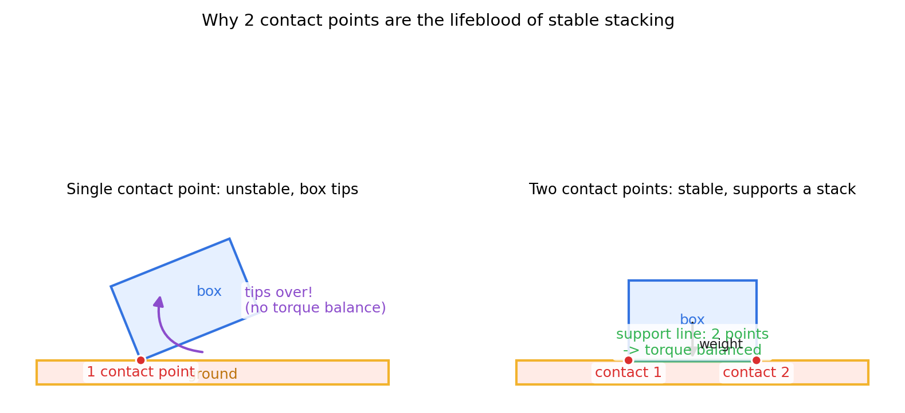
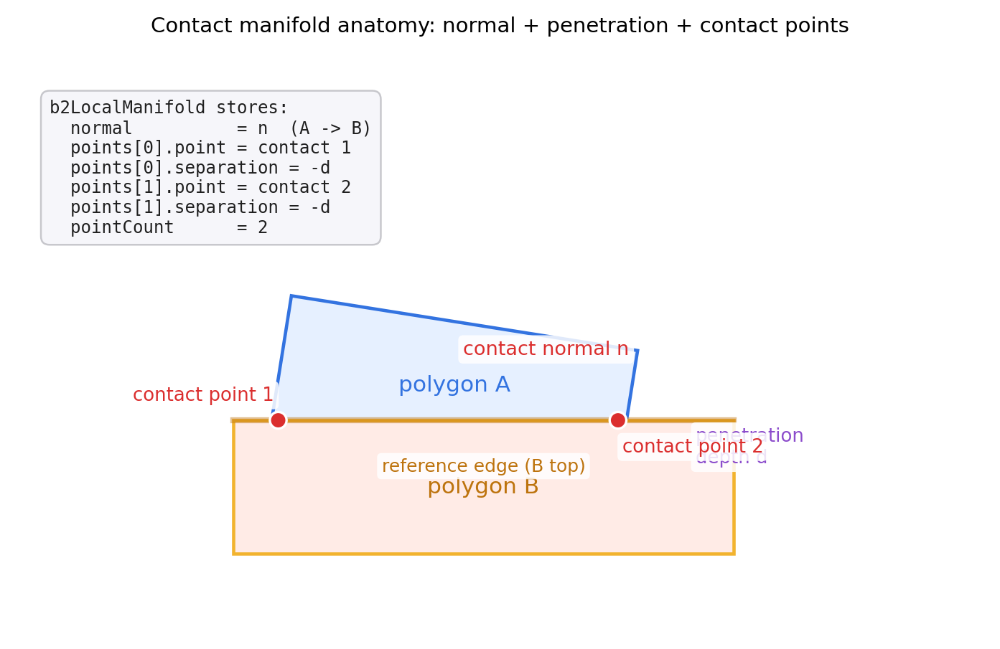
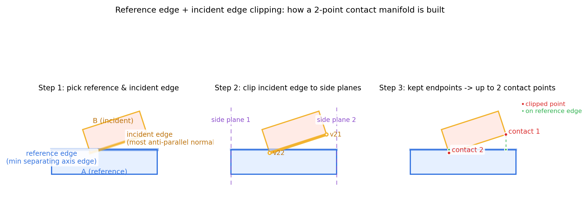
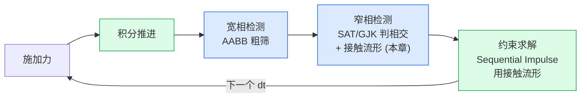

# 第 4 篇 · 第 14 章 · 接触流形:法线、穿透、接触点

> **核心问题**:前两章(P4-12 SAT、P4-13 GJK)我们终于能回答一个最基本的问题——"两个形状**碰没碰**?"。可真实物理引擎光知道"碰了"远远不够。你坐在椅子上,椅子知道你和它碰了就能让你不掉下去吗?不能——它得知道**碰在哪**(哪个点)、**多深**(穿进去多少)、**沿哪个方向弹**(法线朝哪)。这三个几何细节合起来,叫做**接触流形(contact manifold)**。约束求解器(第 5 篇的主角)就靠它干活:沿法线施冲量让物体弹开、按穿透深度做位置修正、在每个接触点上分别算约束力。本章要讲的就是:**两个形状相交之后,怎么把"碰了"升级成"碰在哪、多深、几个点、朝哪弹"这一组几何细节**。这是检测这一面的最后一站,也是检测喂给响应的"接口"。

> **读完本章你会明白**:
> 1. 接触流形是什么、为什么必须算它——SAT/GJK 只回答"碰没碰",约束求解要的是"碰的几何细节",中间这一步就是接触流形。
> 2. 一个接触流形存三样东西:**接触法线**(沿哪个方向弹)、**穿透深度**(穿多深)、**接触点**(碰在哪,2D 里 1 到 2 个)。
> 3. 2D 多边形相交为什么最多两个接触点,以及这两个点是怎么用 **reference edge(参考边)+ incident edge(入射边)+ 边裁剪(clipping)** 稳健算出来的。
> 4. 为什么不能只取一个接触点(堆叠会翻),也不能取太多点(贵且冗余)——多接触点是**堆叠稳定**的命脉。
> 5. Box2D v3.2 在 `b2CollidePolygons` 里怎么把 SAT(找 reference edge)、anti-parallel 法线(找 incident edge)、clip(裁剪出接触点)串成一条流水线,以及它怎么把这一切打包成 `b2LocalManifold` 喂给约束求解器。

> **如果一读觉得太难**:先只记三件事——① 接触流形 = 法线 + 穿透深度 + 接触点(1~2 个);② 两个接触点用 reference edge + incident edge + clipping 算出来;③ 接触流形是检测喂给响应的接口,第 5 篇约束求解全靠它。

---

## 〇、一句话点破

> **SAT/GJK 回答"碰没碰",接触流形回答"碰在哪、多深、朝哪弹"。一个 2D 接触流形就是三个几何量:一条法线(弹的方向)、一个穿透深度(穿多深)、一到两个接触点(碰在哪)。两个接触点不是凭空取的——是用 reference edge(最小分离轴那条边)当主,把 incident edge(对面那条最反平行的边)按参考边的两个侧平面裁剪,留在窗口里的端点就是接触点。多接触点是堆叠稳定的命脉。**

这是结论。本章倒过来拆:先讲为什么"知道碰了"还不够,再讲接触流形这三样东西分别是什么、为什么是这几个量,然后拆透 reference edge + incident edge + clipping 这套"稳健地取出 1~2 个接触点"的算法,最后去 Box2D v3.2 的 `manifold.c` 里印证。你会看到 Erin Catto 把 SAT、clip、speculative distance 缝在一个 `b2CollidePolygons` 函数里,干净得像教科书。

---

## 一、为什么"判相交"还不够

### 1.1 SAT/GJK 留下的半截子活

P4-12 讲 SAT(分离轴定理):两个凸形状,如果存在一条轴能把它们的投影分开,就不相交;否则相交。P4-13 讲 GJK(闵可夫斯基差 + 单纯形迭代):两个凸形状的闵可夫斯基差包含原点就相交,否则算出最近距离。两个算法都回答了同一个问题——**"碰没碰"**。

可"碰没碰"是个 yes/no 问题,真实物理引擎需要的远不止 yes/no。看一个最简单的例子:一个方块从空中落下,底面就要碰到地面。

```
   方块落地(底面贴地):

      ┌──────────┐
      │          │   方块(正以 v=(0,-5) 下落)
      │          │
      └──────────┘
   ════════════════ 地面

   SAT/GJK 告诉你:碰了!  ← 这就是它们全部的输出
```

光知道"碰了",约束求解器什么都做不了。它要消穿透、要算反弹速度,得知道:

- **沿哪个方向消穿透、施冲量?**——这条方向叫**接触法线** `n`。
- **穿进去多深,要推出来多少?**——这个距离叫**穿透深度** `d`(或等价地,contact point 的 separation,负值表示穿透)。
- **冲量作用在哪个点上?**——这(几)个点叫**接触点** `p`。冲量作用点决定了会产生多少**力矩**(让物体转还是不转)。

这三个量——法线、深度、接触点——合起来,就是一个**接触流形**。它把"碰了"这个布尔结论,升级成一组约束求解器能直接用的几何输入。

> **钉死这件事**:SAT/GJK 回答"碰没碰"(布尔),接触流形回答"碰在哪、多深、朝哪弹"(几何)。约束求解器需要后者——它沿法线施冲量、按穿透深度做位置修正、在每个接触点算约束力。接触流形是**检测这一面喂给响应那一面的接口**。

### 1.1.1 术语澄清:为什么叫"流形(manifold)"

"manifold"这个词容易让零基础读者卡住——它是个数学术语(拓扑/微分几何里指"局部像欧氏空间的空间"),为什么物理引擎借它来命名接触信息?

直觉上你可以这样理解:**两个物体相交,相交区域在 2D 里通常是一小块面(或一条线段、一个点),这块"相交的形状"就是一个局部的几何对象**——数学家管这种"局部几何对象"叫 manifold。物理引擎不存整个相交区域(形状可能复杂、退化),而是**用一组离散的代表点(2D 里 1~2 个)加一条法线,把这个相交区域"参数化"地表示出来**。这组离散表示,就借用了 manifold 这个名字——它是"接触区域的离散参数化表示"。

所以读到"contact manifold"时,脑子里不要飘到微分几何,把它理解成"**一组描述接触的离散几何量(法线 + 接触点 + 穿透)**"就行。Box2D 的结构体名字 `b2Manifold` / `b2LocalManifold`,字面就是这个意思。

### 1.2 朴素做法的诱惑:随便取一个接触点行不行

那为什么不让 SAT/GJK 顺便把接触流形也算出来?或者更朴素——既然知道相交了,**随便取一个相交点**当接触点,法线取 SAT 的最小分离轴,深度取最小分离距离,不就行了?

不行。这一节的"不这样会怎样",是本章最重要的反面。看下面这张图——一个方块平放在地面上,我们故意只用**一个**接触点(比如就取方块左下角):



左图:一个接触点在方块左下角。方块的质心在中间偏右,重力往下拽,接触点支在左边——这就成了一个**跷跷板**:重力产生一个让方块顺时针翻转的力矩。方块会绕着这一个接触点**翻倒**。这在物理上完全错了——真实方块平放在地上是不会翻的。

右图:**两个**接触点,分别在方块底面的左右两角。两个点之间连起来是一条**支撑线**,方块的质心正好落在这条线上,重力穿过支撑线,力矩平衡——方块稳稳停住。

这就是为什么 2D 物理引擎**必须给一个面-面接触算出两个接触点**:一个点撑不住一个面,两个点才构成一条稳定的支撑线。这一点会贯穿到第 5 篇(P5-16 Sequential Impulse)——堆叠的箱子能不穿透地摞起来,本质就是因为每一层接触都给了两个点,两个点撑住上一层。

> **不这样会怎样**:只取一个接触点,平放的方块会绕它翻倒(跷跷板效应),堆叠的箱子根本摞不起来——这不是"准不准"的问题,是"完全错"。两个接触点是 2D 物理引擎让物体**稳稳停住、稳稳堆叠**的命脉。

### 1.3 那为什么是两个,不是更多

反过来,为什么 2D 只取两个点,不取三个、四个?

因为 2D 里两个凸多边形的接触,几何上最多就是**两条边的一段重叠**。两条线段相交,重叠部分是一条线段——线段有两个端点,所以最多两个接触点。再多就是冗余:第三个点要么在前两个点之间(被前两个线性表出),要么在重叠窗口外(不该算接触)。

3D 不一样——3D 里两个凸体的接触可能是面-面(一个多边形接触区域)、边-面、点-面,接触点可能有好几个,所以 3D 物理引擎(Bullet/PhysX)要用更复杂的 manifold 简化算法(典型是取几个代表点)。本书聚焦 2D,2D 就是干净的"最多两个点"。

> **所以这样设计**:2D 接触流形 = 1 条法线 + 1 个穿透深度 + 1 或 2 个接触点。一个点够用(圆-圆、点-面)就一个,需要两个(面-面)就两个。这是几何本身决定的,不多不少。

---

## 二、接触流形:三个几何量到底是什么

这一节把接触流形的三样东西逐一讲透:法线、穿透深度、接触点。它们在 Box2D 里被一个叫 `b2LocalManifold` 的结构体打包——我们先看它长什么样,再回头讲每个字段为什么这么定义。

### 2.1 Box2D 的 `b2LocalManifold` 长什么样

Box2D v3.2 把接触流形定义在 [include/box2d/collision.h:602](../box2d/include/box2d/collision.h#L602):

```c
// (摘自 Box2D v3.2.0 include/box2d/collision.h:602-613, 真实源码)
typedef struct b2LocalManifold
{
    /// The unit normal vector in frame A, points from shape A to shape B
    b2Vec2 normal;

    /// The manifold points, up to two are possible in 2D
    b2LocalManifoldPoint points[2];

    /// The number of contacts points, will be 0, 1, or 2
    int pointCount;

} b2LocalManifold;
```

里面那个 `b2LocalManifoldPoint`([collision.h:589](../box2d/include/box2d/collision.h#L589))是单个接触点的细节:

```c
// (摘自 Box2D v3.2.0 include/box2d/collision.h:589-599, 真实源码)
typedef struct b2LocalManifoldPoint
{
    /// Contact point in frame A
    b2Vec2 point;

    /// Separation along the normal, negative if overlapping, positive if separated
    float separation;

    /// Uniquely identifies a contact point between two shapes
    uint16_t id;

} b2LocalManifoldPoint;
```

四个字段一目了然,正好对应我们说的三样东西加一个身份牌:

- `normal`:**接触法线**,单位向量,在 shape A 的局部坐标系里,**从 A 指向 B**。
- `points[i].point`:第 i 个**接触点的位置**(在 A 的局部坐标系里)。
- `points[i].separation`:第 i 个接触点**沿法线的分离量**。负值表示穿透(穿多深),正值表示分离(还差多远才碰)。**穿透深度 `d` 就是 `-separation`**(separation 为负)。
- `points[i].id`:这个接触点的**身份牌**(下面单独讲为什么需要它)。
- `pointCount`:接触点个数,2D 里是 0、1、2。

注意一个关键设计:**法线是共享的(一条),分离量是每个点各存一份**。为什么?因为两个接触点共用同一条法线(它们都在同一条 reference edge 上,法线就是这条边的法向),但每个点的穿透深度可能不一样——比如方块斜着压在地面上,一个角穿得深、一个角穿得浅。所以法线提一个、separation 存两个,这是最紧凑的表示。

> **钉死这件事**:Box2D 的 `b2LocalManifold` 把接触流形打包成 `normal` + `points[2]` + `pointCount`。法线一条(共享),每个接触点存自己的 `point`(位置)、`separation`(沿法线分离,负=穿透)、`id`(身份)。穿透深度 `d = -separation`。

把这三样东西画在一张图里,直观地看一下"一个接触流形长什么样":



这张图把本章全部主角一次性摆出来:两个多边形相交,reference edge 是 B 的顶边(下面会讲为什么是它),两个红点接触点都在 reference edge 上,红色法线垂直于 reference edge 从 A 指向 B,紫色穿透深度量出 A 的最低角陷进 B 顶面多深。左侧那个文本框就是 `b2LocalManifold` 这一帧实际存的东西——一个 `normal`、两个 `points[i].point` / `separation`、一个 `pointCount = 2`。这就是检测这一面交给响应那面的"完整交接单"。本章剩下所有内容,都是讲这张图里的每个量**凭什么这么算**。

### 2.2 接触法线:弹的方向

接触法线 `n` 是一条单位向量,**从 shape A 指向 shape B**。它是约束求解器施加冲量的方向——冲量就沿这条法线推,把两个物体沿法线方向分开。

法线从哪来?在 SAT 那一章(P4-12)我们已经埋下伏笔:SAT 找的**最小分离轴**(minimum separating axis),就是接触法线。回忆 SAT 的逻辑:对两个凸多边形,把它们的每条边法线都当候选轴,投影看能否分开。如果所有轴都分不开(相交),那条**穿透最小**的轴(投影重叠最少的方向)就是最小分离轴——物体在这个方向上"卡得最紧",沿这个方向把它们推开,推得最近就能分开。

所以接触法线 = SAT 的最小分离轴方向。在 Box2D 里,这个"找最小分离轴"的活,落到一个叫 `b2FindMaxSeparation` 的函数上(下面源码精解会看到)。

一个细节:法线**从 A 指向 B**,这个约定是为了让约束求解器的公式对称——冲量沿 `+n` 方向作用在 B 上(把 B 推开 A),反作用沿 `-n` 作用在 A 上。A/B 的角色由 Box2D 在创建 contact 时定下,本章后面会看到 `flip` 标志处理这个对称性。

### 2.3 穿透深度:穿多深

穿透深度 `d`(penetration depth)是两个形状沿法线方向**互相嵌入的距离**。在 `b2LocalManifoldPoint` 里它存成 `separation`(分离量),约定是**负值表示穿透**——所以 `d = -separation`。

穿透深度干嘛用?两个用途:

1. **位置修正(position correction)**:物体已经穿进去了,光改速度不够,得直接把位置拔出来一点。拔多少?就按穿透深度。Box2D 用一种叫 **Baumgarte stabilization** 的技巧(在第 5 篇 P5-16 讲),按穿透深度的一个比例把物体沿法线推开,既消除大部分穿透,又不至于一次推过头引入新穿透。
2. **speculative contact 的 bias**:v3.2 支持推测接触——如果两个物体**快碰到了**(separation 是个小的正值,小于 `B2_SPECULATIVE_DISTANCE`),也提前生成一个"准接触",用未来的相对速度预判,防止下一帧穿透。这个 bias 也和 separation 挂钩。

这里有个数值上很 Box2D 的常量,顺便交代:`B2_SPECULATIVE_DISTANCE = 4.0 * B2_LINEAR_SLOP`,而 `B2_LINEAR_SLOP = 0.005 * lengthUnitsPerMeter`([constants.h:35](../box2d/include/box2d/constants.h#L35)、[:55](../box2d/include/box2d/constants.h#L55))。也就是说 Box2D 默认允许 2 厘米的"提前量"——两个物体还差 2 厘米碰上,就当作接触处理了。这是 v3.2 speculative contact 的尺度,我们后面源码会看到 `if (separation > speculativeDistance) return;` 这种判断到处都是。

### 2.4 接触点:碰在哪

接触点是冲量**作用的位置**。在 2D 里它是平面上一个点(2D 向量),在 `b2LocalManifoldPoint.point` 里存着(局部坐标系)。

接触点的位置为什么重要?因为**冲量作用在哪里,决定了产生多少力矩**。同样一个向上的冲量,作用在物体正下方(质心正下方),物体只往上平移不转;作用在物体边上,物体除了平移还会转。约束求解器要正确模拟"方块平放在地上不翻",就必须知道冲量作用在两个底角——接触点。

2D 里接触点的个数:

- **1 个**:圆-圆、圆-多边形、点-边这些"点接触"——几何上就是一个点在碰,只有一个接触点。看 Box2D 的 `b2CollideCircles`([manifold.c:36](../box2d/src/manifold.c#L36)),永远是 `manifold.pointCount = 1`。
- **2 个**:多边形-多边形、胶囊-多边形这些"边接触"——两条边重叠,裁剪出两个端点。这是本章下半场的重头戏。

### 2.5 接触点的 `id`:为什么需要身份牌

最后那个 `uint16_t id` 容易被忽略,但它至关重要——它是**接触点的身份牌**,用来在**帧之间追踪同一个接触点**。

为什么需要追踪?因为约束求解器用 **warm start**(热启动):这一帧的迭代,用上一帧算出的累积冲量当初始值,能显著加速收敛。但要用上一帧的冲量,得知道"这一帧的接触点 1,对应上一帧的哪个接触点"——物体在动,接触点数组里的顺序可能变,光靠下标对不上。`id` 就解决这个:它把"这个接触点是由 shape A 的哪条边、哪个顶点 和 shape B 的哪条边、哪个顶点 构成的"编进一个 16 位整数,只要几何特征不变,id 就不变,warm start 就能跨帧匹配上。

看 Box2D 怎么编这个 id——在 `b2ClipPolygons` 里([manifold.c:609](../box2d/src/manifold.c#L609)):

```c
// (摘自 Box2D v3.2.0 src/manifold.c:609, 简化)
cp->id = B2_MAKE_ID( i11, i22 );
```

那个 `B2_MAKE_ID` 宏([manifold.c:14](../box2d/src/manifold.c#L14)):

```c
#define B2_MAKE_ID( A, B ) ( (uint8_t)( A ) << 8 | (uint8_t)( B ) )
```

把两个 8 位的"边/顶点索引"拼成一个 16 位 id——高 8 位是 shape A 的特征索引,低 8 位是 shape B 的。只要这两个索引不变(同一条 reference edge、同一个 incident 顶点),id 就稳定,warm start 跨帧就能匹配。这个小技巧是 Sequential Impulse 能 warm start 的前提,第 5 篇(P5-16)会用上它。

> **钉死这件事**:接触流形三件套 + 一个身份牌:法线 `normal`(SAT 最小分离轴,从 A 指向 B)、穿透 `separation`(负=穿透,深度 d = -separation)、接触点 `point`(冲量作用位置,1~2 个)、身份 `id`(跨帧追踪供 warm start)。这套数据结构是检测喂给响应的标准接口。

---

## 三、reference edge + incident edge + clipping:稳健地取出两个接触点

上半场讲清楚"接触流形是什么、为什么需要它"。下半场讲最硬核的算法问题:**两个多边形相交,怎么稳健地算出那 1~2 个接触点**。这是本章技巧精解的主角,也是 Box2D `b2CollidePolygons` 的核心。

### 3.1 问题:为什么不能直接取所有相交点

最朴素的办法:**找出两个多边形边界的所有交点**,当接触点。看起来自然——两个多边形相交,边界相交的地方就是接触嘛。

可这个朴素办法会撞三堵墙:

1. **退化情况不稳定**:两个多边形边平行(面-面接触,正是最常见的堆叠场景!),边界可能整段重合,交点"无穷多"或退化为整条线段。直接取交点,数值上飘忽不定——这一帧取这两个、下一帧取那两个,接触点抖动,warm start 失配,堆叠就抖。
2. **接触点可能不在接触区域**:两个多边形相交,边界交点可能在远离实际接触面的地方(比如一个角戳进另一边的内部,边界交点在边上但不是接触中心)。约束求解器需要的是**接触区域里的代表点**,不是几何上随便一个交点。
3. **取太多点贵且冗余**:2D 两个凸体接触最多需要 2 个点就够支撑稳定(见 1.3)。取一堆点,约束求解器要解更多约束,白白浪费——而且这些约束很多是线性相关的(冗余),数值上反而病态。

我们需要一种**稳健、确定、最多两个点**的算法。这就是 reference edge + incident edge + clipping。

### 3.2 关键洞察:用 SAT 找到的"最小分离轴那条边"当主

回忆 SAT(P4-12):两个凸多边形相交时,有一条**最小分离轴**——投影重叠最少的方向。这条轴,一定是两个多边形**某一条边的法线**(凸多边形的所有候选轴都是边法线)。我们管这条边叫 **reference edge(参考边)**——它属于那个"最小分离轴所在的多边形"。

为什么用 reference edge 当主?因为它就是**接触法线所在的那条边**——法线垂直于它,接触就在它附近。把这条边当作"接触面",接触点就分布在这条边附近。这条边确定了,接触法线也就确定了(它的法向)。

Box2D 在 `b2CollidePolygons` 里这么找 reference edge([manifold.c:733](../box2d/src/manifold.c#L733)):

```c
// (摘自 Box2D v3.2.0 src/manifold.c:732-736, 真实源码)
int edgeA = 0;
float separationA = b2FindMaxSeparation( &edgeA, &localPolyA, &localPolyB );

int edgeB = 0;
float separationB = b2FindMaxSeparation( &edgeB, &localPolyB, &localPolyA );
```

`b2FindMaxSeparation`([manifold.c:646](../box2d/src/manifold.c#L646))干的就是 SAT 的活:遍历 poly1 的每条边法线,对每条法线找 poly2 在它上面投影最深的点,记录"最浅的深穿透"——这就是最小分离轴,返回对应的边索引 `edgeIndex` 和分离量。函数对 A 和对 B 各调一次,因为我们还不知道 reference edge 在 A 上还是 B 上。

### 3.3 第二步:找 incident edge(最反平行的边)

reference edge 定了,接下来找 **incident edge(入射边)**——属于**另一个**多边形的那条边,它是真正"撞上去"的边。

怎么找?在另一个多边形的所有边里,找**法线方向最反平行于 reference edge 法线**的那条边。最反平行 = 两个法线点乘最小(最接近 -1)——也就是说,这条边的朝向"最对着"reference edge 撞过来。

为什么这么找?因为撞上 reference edge 的那条边,它的法线方向几乎和 reference edge 法线相反(一个朝外一个朝里,刚好对撞)。Box2D 在 `b2CollidePolygons` 里这么写([manifold.c:751-766](../box2d/src/manifold.c#L751-L766)):

```c
// (摘自 Box2D v3.2.0 src/manifold.c:751-766, 真实源码, A 是 reference 的分支)
b2Vec2 searchDirection = localPolyA.normals[edgeA];

// Find the incident edge on polyB
int count = localPolyB.count;
const b2Vec2* normals = localPolyB.normals;
edgeB = 0;
float minDot = FLT_MAX;
for ( int i = 0; i < count; ++i )
{
    float dot = b2Dot( searchDirection, normals[i] );
    if ( dot < minDot )
    {
        minDot = dot;
        edgeB = i;
    }
}
```

这就是"在 polyB 里找法线和 reference 法线点乘最小的边"。一行话:**incident edge = argmin_i (n_ref · n_B[i])**。

> **钉死这件事**:reference edge 是 SAT 找的最小分离轴那条边(接触法线 = 它的法向);incident edge 是另一个多边形里法线最反平行于 reference 法线的那条边(真正撞上来的边)。两者找到后,接触就在这两条边的交汇区域。

### 3.4 第三步:clipping——把 incident edge 裁出接触点

现在有两条边:reference edge(在多边形 1 上)和 incident edge(在多边形 2 上)。**接触点,就是 incident edge 落在 reference edge "侧面窗口"里的那一部分**。

什么叫"侧面窗口"?reference edge 是一条线段,它有两个端点 v11、v12。过这两个端点,做 reference edge 法线的**垂直线**(也就是沿着 reference edge 切线方向的"侧平面" side plane)。这两个侧平面之间夹一个长条窗口——incident edge 落在这个窗口里的部分,就是接触区域。

把 incident edge 用这两个侧平面**裁剪(clip)**:窗口内的端点保留,窗口外的部分切掉。裁完剩下的:

- 如果两个端点都在窗口内 → 保留两个端点 → **2 个接触点**(典型的面-面接触)。
- 如果只有一个端点在窗口内,另一个被切掉 → 计算切点 → 还是可能得到 2 个点(一个原端点 + 一个切点),或者退化成 1 个点。
- 如果 incident edge 整个在窗口外 → 两个形状其实没真的面接触(可能只是顶点擦到),回退到单点接触。

这就是 **Sutherland-Hodgman 线段裁剪** 在接触流形上的应用——把 incident edge 当被裁线段,reference edge 的两个侧平面当裁剪窗口,裁出来的就是接触点。

看一张完整的 clipping 过程图:



三幅子图:

- **左(Step 1)**:蓝色多边形 A 在下,它的顶边被选为 reference edge(SAT 最小分离轴那条边);橙色多边形 B 在上斜插下来,它最反平行于 A 顶边法线的那条边被选为 incident edge。
- **中(Step 2)**:在 reference edge 的两个端点上立起两条紫色虚线(侧平面 side plane 1、2),把 incident edge 裁剪。淡掉的橙色线段是被切掉的部分,加粗的橙色线段是留在窗口里的部分。
- **右(Step 3)**:留下来的两个端点(红点),投影到 reference edge 上(绿点),就是最终的 2 个接触点。

这里要紧的是想清楚:**为什么裁出来的正好是接触区域的边界?** 想象你站在 reference edge 上方往下看——incident edge 是一根斜插下来的棍子,reference edge 是一条水平的桌面。桌面的两个端点是桌子的左右边缘。棍子只有"压在桌面正上方"的那一段才算接触,伸出桌面左右边缘之外的部分根本没碰到桌面。两个侧平面就是桌子的左右边缘——裁剪就是"把棍子伸出桌面的部分砍掉",砍完后棍子两端正好搭在桌面左右边缘之内,这两端就是接触区域的边界。这个几何直觉让 clipping 不再是黑盒:它就是在算"incident edge 真正压在 reference edge 上的那一段的两个端点"。

一个常被忽略的细节:裁剪是**沿 reference edge 切线方向**(不是法线方向)做的。法线方向上分离量(穿透深度)是另一回事,clip 完之后才算。所以 clip 决定接触点的**个数和沿参考边的位置**,穿透深度是事后对每个点单独量。这就是为什么 `b2LocalManifoldPoint` 里 `point`(位置,由 clip 决定)和 `separation`(深度,事后算)是分开存的——它们由算法的不同阶段产生。

> **钉死这件事**:接触点 = incident edge 被 reference edge 两个侧平面裁剪后,留在窗口里的端点(再投影到 reference edge 上)。这套"reference edge + incident edge + clipping"是 2D 物理引擎算接触点的标准做法,稳健、确定、最多两个点。clip 沿参考边切线方向决定接触点位置和个数,穿透深度事后对每个点单独算——这正是 manifold 里 `point` 与 `separation` 分开存的算法根源。

### 3.5 接触点的位置:为什么放在两物体"皮肤"的中间

还有一个细节源码里反复出现——接触点的最终位置不是直接取裁剪后的端点,而是经过一次沿法线的微调。看 `b2ClipPolygons`([manifold.c:596](../box2d/src/manifold.c#L596)):

```c
// (摘自 Box2D v3.2.0 src/manifold.c:589-597, 真实源码)
float separationLower = b2Dot( b2Sub( vLower, v11 ), normal );
float separationUpper = b2Dot( b2Sub( vUpper, v11 ), normal );

float r1 = poly1->radius;
float r2 = poly2->radius;

// Put contact points at midpoint, accounting for radii
vLower = b2MulAdd( vLower, 0.5f * ( r1 - r2 - separationLower ), normal );
vUpper = b2MulAdd( vUpper, 0.5f * ( r1 - r2 - separationUpper ), normal );
```

为什么?因为 Box2D 的多边形有 **skin(皮肤)**——每个多边形有一个小的 `radius`(由 `B2_LINEAR_SLOP` 决定),相当于把多边形的边往外撑一点点。这是为了**避免数值抖动**(让接触在几何上有一点余量,不要恰好卡在边上)。两个多边形的真实"皮肤"接触,发生在两个 radius 之间的中点。所以接触点位置 = 裁剪端点 + 沿法线移到两个皮肤的中点。

同时,`separation = dot(vLower - v11, normal) - (r1 + r2)`([manifold.c:608](../box2d/src/manifold.c#L608))——分离量也是扣掉两个 radius 算的。这就是为什么源码里到处是 `radius = polyA.radius + polyB.radius`、`separation - radius` 这种写法:Box2D 把所有多边形都当作"圆角多边形"处理,皮肤厚度进分离量。

> **钉死这件事**:Box2D 的多边形带一层薄的"皮肤"(radius ≈ B2_LINEAR_SLOP),接触点位置放在两物体皮肤的中点,分离量扣掉两个 radius。这个设计让接触在数值上有一点余量,避免边对边的精确相交所带来的抖动。这也是为什么 v3.2 注释里说"Due to speculation, every polygon is rounded"([manifold.c:684](../box2d/src/manifold.c#L684))。

---

## 四、源码精解:`b2CollidePolygons` 的完整流水线

讲完原理,我们去 Box2D v3.2 的源码里印证。`b2CollidePolygons`([manifold.c:702](../box2d/src/manifold.c#L702))是本章的主角——它把"找 reference edge(局部 SAT)、找 incident edge(反平行法线)、clip 裁剪出接触点"四步,缝进一个 700 行的函数里。我们把它拆成五段看。

### 4.1 第零步:数值健壮性的坐标平移

函数一开头做了一件容易被忽略、但对数值精度至关重要的事——**把坐标系平移到 shape A 的第一个顶点**([manifold.c:704-730](../box2d/src/manifold.c#L704)):

```c
// (摘自 Box2D v3.2.0 src/manifold.c:704-730, 真实源码, 简化)
b2Vec2 origin = polygonA->vertices[0];
// Shift to the origin in frame A for round-off, a pure translation in A's frame
b2Transform xfs = { b2Sub( xf.p, origin ), xf.q };

b2Polygon localPolyA;
localPolyA.vertices[0] = b2Vec2_zero;     // A 的第一个顶点变原点
for ( int i = 1; i < localPolyA.count; ++i )
    localPolyA.vertices[i] = b2Sub( polygonA->vertices[i], origin );

// Put polyB in polyA's frame to reduce round-off error
for ( int i = 0; i < localPolyB.count; ++i )
{
    localPolyB.vertices[i] = b2TransformPoint( xfs, polygonB->vertices[i] );
    ...
}
```

为什么?因为物理引擎里物体可能离世界原点很远(比如关卡坐标 (10000, 5000)),float32 在远离原点处精度下降(浮点数的"间距"随绝对值增大)。把局部坐标系平移到 A 的第一个顶点,所有后续计算(AABB、SAT、clip)都在"靠近原点"的局部坐标里做,精度大幅提升。这是物理引擎数值健壮性的基本功——**所有几何计算都在局部坐标系里做,远离世界原点**。

### 4.2 第一步:双向 SAT 找 reference edge

接着是双向 SAT——对 A 找最小分离轴,再对 B 找最小分离轴,谁分离量更大谁是 reference([manifold.c:732-743](../box2d/src/manifold.c#L732)):

```c
// (摘自 Box2D v3.2.0 src/manifold.c:732-743, 真实源码)
int edgeA = 0;
float separationA = b2FindMaxSeparation( &edgeA, &localPolyA, &localPolyB );

int edgeB = 0;
float separationB = b2FindMaxSeparation( &edgeB, &localPolyB, &localPolyA );

float radius = localPolyA.radius + localPolyB.radius;

if ( separationA > speculativeDistance + radius ||
     separationB > speculativeDistance + radius )
{
    return (b2LocalManifold){ 0 };    // 太远了, 没接触(含 speculative 提前量)
}
```

注意两点:

1. **A 和 B 各算一次** `b2FindMaxSeparation`。两次的结果 `separationA`、`separationB` 比较——**分离量更大的那个多边形是 reference**(它的某条边"卡得更浅",更适合当接触面)。这就是下面 `flip` 标志的来源。
2. **speculative 提前量**:判断条件不是"分离量 > 0(相交)",而是"分离量 > `speculativeDistance + radius`(2 厘米 + 皮肤)"。这意味着即使两个多边形还差一点点(小于 2 厘米)没碰,也提前当接触处理。这是 v3.2 的 speculative contact,防高速穿透,第 5 篇(P5-18 CCD)会用到。

### 4.3 第二步:定 reference + 找 incident edge + flip 标志

确定谁是 reference 后,定 `flip` 标志(记住 A/B 是否要换位),并在另一个多边形上找 incident edge([manifold.c:745-788](../box2d/src/manifold.c#L745)):

```c
// (摘自 Box2D v3.2.0 src/manifold.c:746-788, 真实源码, 简化)
bool flip;
if ( separationA >= separationB )
{
    flip = false;                       // A 是 reference, 法线 A -> B
    b2Vec2 searchDirection = localPolyA.normals[edgeA];
    // 在 polyB 里找 incident edge (法线最反平行 searchDirection)
    edgeB = 0; float minDot = FLT_MAX;
    for ( int i = 0; i < localPolyB.count; ++i )
    {
        float dot = b2Dot( searchDirection, localPolyB.normals[i] );
        if ( dot < minDot ) { minDot = dot; edgeB = i; }
    }
}
else
{
    flip = true;                        // B 是 reference, 法线要翻转
    ...  // 对称地在 polyA 上找 incident edge
}
```

`flip` 标志后面在 `b2ClipPolygons` 里决定法线方向要不要取反、接触点身份 id 怎么编。这是处理"A/B 角色对称性"的标准技巧——同一套 clipping 代码,通过一个布尔标志服务两种情况。

### 4.4 第三步:分情况——overlap 走 clip,差点碰走 segment distance

这里 v3.2 做了一个比早期 v3 更精细的分支([manifold.c:794-821](../box2d/src/manifold.c#L794)):

```c
// (摘自 Box2D v3.2.0 src/manifold.c:794-821, 真实源码, 简化)
if ( separationA > 0.1f * linearSlop || separationB > 0.1f * linearSlop )
{
    // Edges are disjoint (还差一点没真碰到). Find closest points between
    // reference edge and incident edge
    b2SegmentDistanceResult result = b2SegmentDistance( v11, v12, v21, v22 );
    float distance = sqrtf( result.distanceSquared );
    float separation = distance - radius;

    if ( distance - radius > speculativeDistance )
        return manifold;                  // 真的没碰

    // Attempt to clip edges (speculative 接触也走 clip)
    manifold = b2ClipPolygons( &localPolyA, &localPolyB, edgeA, edgeB, flip );

    // 检查 clip 出来的接触点 separation, 如果 vertex-vertex 更近, 退化成单点
    ...
}
else
{
    // Polygons overlap (真重叠了) -> 直接 clip
    manifold = b2ClipPolygons( &localPolyA, &localPolyB, edgeA, edgeB, flip );
}
```

两条路径:

- **真重叠(分离量极小)**:直接 clip,正常出 1~2 个接触点。
- **speculative 接触(还差一点,但在 speculativeDistance 内)**:先算 reference edge 和 incident edge 的**线段最近点**(`b2SegmentDistance`)。如果最近点是"顶点-顶点"(两个端点最近),就退化成**单点接触**(vertex-vertex,典型的角对角擦碰);否则也走 clip。这个分支是 v3.2 处理 speculative + 退化情况的精细逻辑——早期 v3 走的是 `#else` 分支那种更直接的"先算最近点决定单点/边接触"。

> **★诚实标注 v3.2 演进**:总纲/老资料讲接触流形算法,一般是经典的"reference edge + incident edge + 两步 side-plane clip(先 clip incident edge 到 reference edge 的两个侧平面,再保留 separation < 0 的点)"。这是 Box2D v2 和早期 v3 的写法。**v3.2 的 `b2ClipPolygons` 用了一个更紧凑的一步式切线坐标 clip**——直接在 reference edge 的切线方向上算出 incident edge 两端点的"切线坐标"(lower2/upper2),和 reference edge 的窗口 [0, len] 求交集,一步到位得到裁剪后的两个端点。算法本质相同(都是用 reference edge 的两个端点定义侧平面去裁 incident edge),但 v3.2 把它写成了一次性的"切线坐标求交",更短、更稳。读者看老资料(包括 Box2D v2 源码)和 v3.2 源码会对不上,这里点明。

### 4.5 第四步:clip 出接触点,编 id

核心 clip 在 `b2ClipPolygons`([manifold.c:511](../box2d/src/manifold.c#L511))里,上一节技巧精解已经拆透,这里只点它最后怎么写入 manifold([manifold.c:601-619](../box2d/src/manifold.c#L601)):

```c
// (摘自 Box2D v3.2.0 src/manifold.c:601-619, 真实源码)
if ( flip == false )
{
    manifold.normal = normal;             // 法线 A -> B
    b2LocalManifoldPoint* cp = manifold.points + 0;
    cp->point = vLower;                   // 接触点 1 (裁剪下端)
    cp->separation = separationLower - radius;
    cp->id = B2_MAKE_ID( i11, i22 );      // id = (ref 边起点, inc 边终点)
    manifold.pointCount += 1;
    cp += 1;
    cp->point = vUpper;                   // 接触点 2 (裁剪上端)
    cp->separation = separationUpper - radius;
    cp->id = B2_MAKE_ID( i12, i21 );      // id = (ref 边终点, inc 边起点)
    manifold.pointCount += 1;
}
else  // flip 分支: 法线取反, id 字节序交换
{
    manifold.normal = b2Neg( normal );
    ...
}
```

注意 id 的编码:`B2_MAKE_ID(i11, i22)` —— 高字节是 reference edge 的起点索引 `i11`,低字节是 incident edge 的终点索引 `i22`。为什么是 `i11` 配 `i22`、`i12` 配 `i21`(交叉)?因为 CCW(逆时针)绕向下,reference edge 的方向和 incident edge 的方向相反(一个朝外一个朝里),所以裁剪窗口的下端(`vLower`)对应 reference 的起点 `i11`、incident 的终点 `i22`,上端反之。这种交叉编码让 id 在几何上对应正确的顶点对,warm start 才能稳定匹配。

至此,`b2LocalManifold` 已经填好:normal、两个 point、各自的 separation 和 id、pointCount=2。这个 manifold 就是这一对多边形相交的全部几何细节,准备好喂给约束求解器。

---

## 五、从 manifold 到 contact:`b2UpdateContact` 的包装

`b2CollidePolygons` 算出的是 `b2LocalManifold`——**在 shape A 局部坐标系里**的接触流形。但约束求解器要的是**世界坐标系**下的接触(法线、anchor 点)。中间这一步包装,在 `b2UpdateContact`([contact.c:519](../box2d/src/contact.c#L519))里:

```c
// (摘自 Box2D v3.2.0 src/contact.c:519-545, 真实源码, 简化)
bool b2UpdateContact( b2World* world, b2ContactSim* contactSim,
                      b2Shape* shapeA, b2WorldTransform transformA, ...,
                      b2Shape* shapeB, b2WorldTransform transformB, ... )
{
    b2Manifold oldManifold = contactSim->manifold;       // 保存上一帧 (warm start 用)

    // 把 B 变换到 A 的局部坐标系(窄相在 A 的局部跑, 保精度)
    b2Transform relativeTransform = b2InvMulWorldTransforms( transformA, transformB );
    b2ManifoldFcn* fcn = s_registers[shapeA->type][shapeB->type].fcn;
    b2LocalManifold local = fcn( shapeA, shapeB, relativeTransform, &contactSim->cache );

    contactSim->manifold = ( b2Manifold ){ 0 };
    // 法线: 从 A 局部旋到世界
    contactSim->manifold.normal = b2RotateVector( transformA.q, local.normal );
    contactSim->manifold.pointCount = local.pointCount;

    b2Vec2 originDelta = b2SubPos( transformA.p, transformB.p );
    for ( int i = 0; i < local.pointCount; ++i )
    {
        b2ManifoldPoint* mp = contactSim->manifold.points + i;
        // anchorA = 接触点相对 A 质心的位置 (世界系下)
        mp->anchorA = b2RotateVector( transformA.q, local.points[i].point );
        mp->anchorB = b2Add( mp->anchorA, originDelta );    // 相对 B 质心
        mp->separation = local.points[i].separation;
        mp->id = local.points[i].id;
    }
    ...
}
```

几个要点:

1. **窄相在 A 的局部坐标系跑**(relativeTransform 把 B 变到 A 的局部)——这和我们前面讲的"为了数值精度远离世界原点"一脉相承。
2. **分发函数表 `s_registers`**([contact.c:97](../box2d/src/contact.c#L97)):shape 类型对(circle/capsule/polygon/segment)× 类型对,一共一张二维表,每格存对应的 `b2CollideXxx` 函数指针。这是经典的 double dispatch——用查表代替 switch,加新形状只改表不改调用方。看 `b2PolygonManifold`([contact.c:130](../box2d/src/contact.c#L130))就是直接转发到 `b2CollidePolygons`。
3. **从 `b2LocalManifold` 到 `b2Manifold`**:`b2LocalManifold` 是局部系下的中间结果,`b2Manifold` 是世界系下、约束求解器直接用的最终形态——法线旋到世界、接触点变成相对两个物体**质心**的 anchor(A 的 anchor + A/B 质心位置差 = B 的 anchor,这一行 `mp->anchorB = b2Add(mp->anchorA, originDelta)` 干的就是这个)。
4. **保存上一帧 manifold**(`oldManifold`):为了 warm start——下一帧求解时,要拿上一帧的累积冲量当初值,得先知道哪些接触点"持续存在"(id 匹配上)。这就是 `id` 字段的用武之地。

`b2UpdateContact` 出来的 `b2ContactSim`,带着世界系下的 `b2Manifold`(法线 + 接触点 anchor + separation + id),连同摩擦系数、恢复系数(也在这个函数里算,见 [contact.c:548-551](../box2d/src/contact.c#L548))一起,送进第 5 篇的约束求解器。

### 5.1 这一步在整个时间步流程里的位置

回忆 P1-04 画的那张时间步全景图,我们把这一章的位置标出来:



本章服务的二分法是 **检测**(detection)这一面的最后一站——窄相内部"判相交(SAT/GJK)"之后,加上"算接触流形(manifold)"这一步。它的输出(接触流形)是检测喂给响应的**接口**:没有它,约束求解器不知道沿哪推、推多深、在哪推。

> **钉死这件事**:`b2CollidePolygons` 算局部系 `b2LocalManifold`,`b2UpdateContact` 把它包装成世界系 `b2Manifold`(法线旋到世界、接触点变相对质心 anchor),连同摩擦/恢复系数送进约束求解器。这一步是检测→响应的桥,接触流形是桥上运送的货物。

---

## 六、技巧精解:为什么是 reference edge + clipping,不是别的

本章最值得单独拆透的技巧,是"**为什么用 reference edge + incident edge + clipping 算接触点**",而不是朴素地取相交点或单点。我们把它和几个反例放在一起对比,把这个设计选择钉死。

### 6.1 反例一:只取一个接触点 → 堆叠翻倒

第一个反例我们在 1.2 节已经看过:一个方块平放在地上,如果只用一个接触点,方块会绕它跷跷板式翻倒。这是因为单点接触无法提供**力矩平衡**——重力作用在质心,接触点支在边上,产生翻转力矩。

这听起来像个"小瑕疵",但它实际上是 2D 物理引擎能不能做堆叠的**命脉**。想象一个码得高高的箱子堆:每一层箱子压在下一层上,每一层接触都必须给两个点(底面两角),才能让上面那层稳稳停住、不翻。只要任何一层接触退化成单点(比如算法 bug、或退化情况没处理好),整个堆就会从那一层开始翻塌。

这就是为什么 2D 接触流形**最多两个点**不是省事,是**正好够用且必须**:一个点撑不住一个面,两个点构成支撑线,力矩平衡。约束求解器(P5-16)在这两个点上分别算约束力,合起来等效于"面支撑"。

### 6.2 反例二:取所有相交点 → 不稳定、冗余、贵

第二个反例:朴素地取两个多边形边界的**所有**交点。撞三堵墙:

- **退化不稳定**:边平行(面-面接触,最常见)时边界整段重合,交点"无穷多"或退化为线段,数值上飘忽。这一帧取这两个、下一帧取那两个,接触点抖动,warm start 失配,堆叠抖。
- **冗余**:2D 两个凸体接触,几何上最多两个点就够(支撑线)。多取的点要么在前两个之间(线性相关,数值病态),要么在接触区外(不该算)。
- **贵**:约束求解器每多一个接触点,就多解一个约束方程。多取一倍没用的点,求解器慢一倍,还没好处。

### 6.3 反例三:用 GJK 的最近点当接触点 → 几何上不对

第三个反例更微妙:既然 GJK(P4-13)能算两个形状的最近点,直接拿 GJK 的最近点当接触点行不行?

不行,两个问题:

1. **GJK 的最近点是"没相交时"的最近**——相交后(闵可夫斯基差包含原点),GJK 给的是单纯形上的点,几何意义不再是"接触点",而是"闵可夫斯基差里的点"。拿它当接触点,几何上不对。
2. **GJK 只给一个最近点对**——一个点,撑不住面接触(回到反例一)。

GJK 在 Box2D 里是给"没相交时算多近"用的(为 speculative contact 和 CCD 服务),算接触流形时 Box2D 直接走 SAT-based 的 `b2CollideXxx`,不用 GJK。这是分工:**GJK 算距离,SAT+clip 算接触流形**。

### 6.4 正解:reference edge + clipping 凭什么稳

对比完反例,正解为什么稳:

1. **以 reference edge 为主,接触点天然落在它附近**。reference edge 是 SAT 最小分离轴那条边——它就是接触法线所在边,接触几何上就在它身上。以它为坐标系,接触点的计算变成"沿它的切线方向裁剪窗口",一个干净的 1D 问题。
2. **incident edge 的反平行法线确定唯一**。argmin 点乘是确定性运算——只要 reference edge 定了,incident edge 唯一确定(平局时取第一个,也稳定)。不依赖"边界交点"这种几何上可能退化(平行、重合)的运算。
3. **clip 出来的端点最多两个,几何上正好是接触区域的边界**。reference edge 两个侧平面裁 incident edge,留下的端点就是"incident edge 落在 reference edge 窗口内的部分"——这正是接触区域的两个边界点。两个点,不多不少,撑得住面接触。
4. **id 编码让 warm start 跨帧稳定**。每个接触点的 id 由(reference 边索引, incident 顶点索引)编成,只要几何特征不变 id 就不变,接触点跨帧能匹配,warm start 能用上上一步的冲量。
5. **退化情况有兜底**。reference/incident 边平行、点接触、speculative(差一点没碰)等情况,源码里都有专门分支处理(单点接触、segment distance),不会在退化时崩或抖。

把这几条合起来:reference edge + clipping 是**确定性、最多两点、几何正确、跨帧稳定**的接触点算法。它不是唯一做法(3D 物理引擎用更复杂的近似),但在 2D 凸多边形场景下,它是教科书级的标准解,Box2D/Bullet/Chipmunk/ODE 的 2D 部分都用它的变体。

> **钉死这件事**:reference edge + incident edge + clipping 凭四点稳赢:① 以 reference edge 为主,接触点天然落在它附近;② incident edge 反平行法线唯一确定;③ clip 出最多两点,正好是接触区域边界;④ id 编码让 warm start 跨帧稳定。反例(单点翻倒、取所有点冗余抖动、GJK 最近点几何不对)各自撞墙。这是 2D 凸多边形接触流形的标准解,也是堆叠稳定的几何根基。

---

## 七、章末小结

### 回扣主线

本章是第 4 篇(窄相)的收尾,也是**检测这一面的最后一站**。前两章(P4-12 SAT、P4-13 GJK)回答了"碰没碰",本章回答"碰在哪、多深、朝哪弹"——把 yes/no 升级成一组几何细节,叫**接触流形**。一个 2D 接触流形就是三样东西:一条**接触法线**(SAT 最小分离轴,从 A 指向 B)、一个**穿透深度**(沿法线分离量的负值)、一到两个**接触点**(用 reference edge + incident edge + clipping 算出来)。我们拆透了 Box2D v3.2 的 `b2CollidePolygons`:双向 SAT 找 reference edge、反平行法线找 incident edge、切线坐标 clip 出最多两个接触点、id 编码供 warm start。还看到 `b2UpdateContact` 把局部系 manifold 包装成世界系,送进约束求解器。这一步是检测→响应的桥,接触流形是桥上运送的货物——没有它,第 5 篇的 Sequential Impulse 无从下手。

### 五个为什么

1. **SAT/GJK 已经能判相交了,为什么还要接触流形?**——SAT/GJK 只回答"碰没碰"(布尔),约束求解器要的是"碰在哪、多深、朝哪弹"(几何):沿法线施冲量、按穿透深度做位置修正、在接触点上算约束力。接触流形就是这三个几何量,检测喂给响应的标准接口。
2. **2D 接触流形为什么最多两个接触点?**——2D 两个凸多边形接触,几何上就是两条边的一段重叠,重叠线段有两个端点,所以最多两个点。一个点撑不住面接触(跷跷板翻倒),两个点构成支撑线正好力矩平衡。3D 才可能更多点。
3. **reference edge 和 incident edge 是怎么选的?**——reference edge 是 SAT 找的最小分离轴那条边(双向各找一次,分离量更大的那个多边形上的边);incident edge 是另一个多边形里法线最反平行于 reference 法线的那条边(argmin 点乘)。前者是接触面,后者是撞上来的边。
4. **clipping 怎么算出接触点?**——用 reference edge 两个端点立侧平面,把 incident edge 裁剪,留在窗口内的端点(再投影到 reference edge、放到两物体皮肤中点)就是接触点。Box2D v3.2 把它写成一次性的"切线坐标求交"(比早期 v3 的两步 side-plane clip 更紧凑),本质相同。
5. **接触点的 `id` 是干什么的?**——16 位整数,高 8 位是 reference 边/顶点索引,低 8 位是 incident 边/顶点索引。它跨帧追踪同一个接触点,让 warm start 能用上一帧的累积冲量当初值,加速 Sequential Impulse 收敛。没有它,warm start 配不上对。

### 想继续深入往哪钻

- **想看完整源码**:[src/manifold.c](../box2d/src/manifold.c)(一族 `b2CollideXxx`,1640 行)、[include/box2d/collision.h:527-613](../box2d/include/box2d/collision.h#L527-L613)(`b2Manifold` / `b2LocalManifold` 结构定义)、[src/contact.c:519](../box2d/src/contact.c#L519)(`b2UpdateContact` 包装层)。
- **想搞懂 3D 接触流形为什么更复杂**:Bullet / PhysX 的 `btManifoldResult` / `PxContactBuffer`,3D 接触可能是面-面(多点),需要 manifold 简化算法(取代表点)。本书聚焦 2D,3D 只概念对照。
- **想搞懂 speculative contact 和皮肤 radius**:重读 `b2CollidePolygons` 里所有 `speculativeDistance` / `radius` 判断,以及 `constants.h` 的 `B2_SPECULATIVE_DISTANCE`、`B2_LINEAR_SLOP`。这关系到第 5 篇 P5-18(CCD)。
- **想搞懂 warm start 怎么用 id 匹配**:第 5 篇 P5-16(Sequential Impulse)会用 `id` 跨帧匹配接触点,把上一帧累积冲量灌进这一帧的迭代初值。
- **想亲手验证**:附录 B 搭一个堆叠箱子 demo,用 `b2World_GetContacts` 打印每个接触的法线、穿透、接触点个数,观察平放箱子是 2 个点、角碰是 1 个点。

### 引出下一章

第 4 篇到此收尾:我们能用宽相(AABB 树)粗筛谁可能碰、用窄相(SAT/GJK)精确判相交、再用接触流形(reference edge + clipping)算出碰的几何细节。检测这一面完整了。从下一章起,我们跨过检测→响应的桥,正式进入**响应这一面**的核心:**碰撞响应**。有了接触流形(法线、穿透、接触点),碰上之后物体该沿哪个方向、变多少速度、弹多高?约束求解器怎么用这组几何输入,让物体不穿透、正确弹开?下一章 P5-15,**冲量法碰撞响应**,我们从"冲量瞬间改变速度"讲起,把单个接触的响应公式推清楚,为 P5-16 的多约束 Sequential Impulse 打地基。

> **下一章**:[P5-15 · 冲量法碰撞响应](P5-15-冲量法碰撞响应.md)
