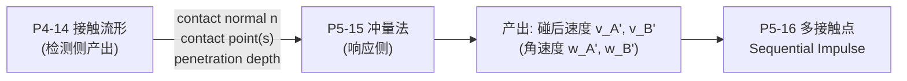
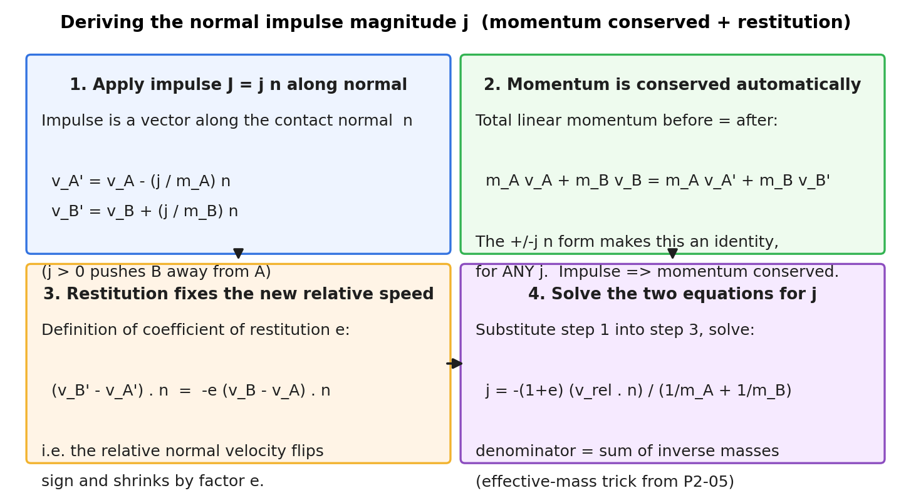
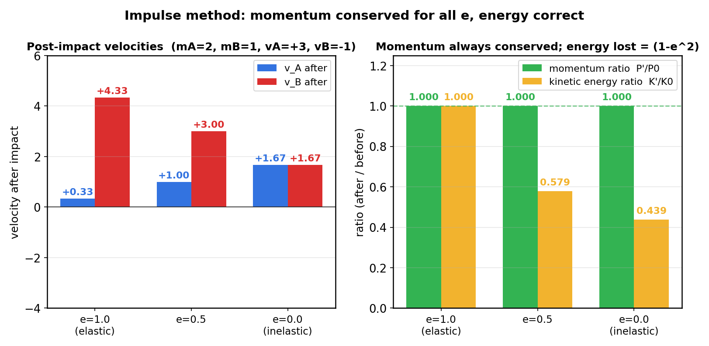
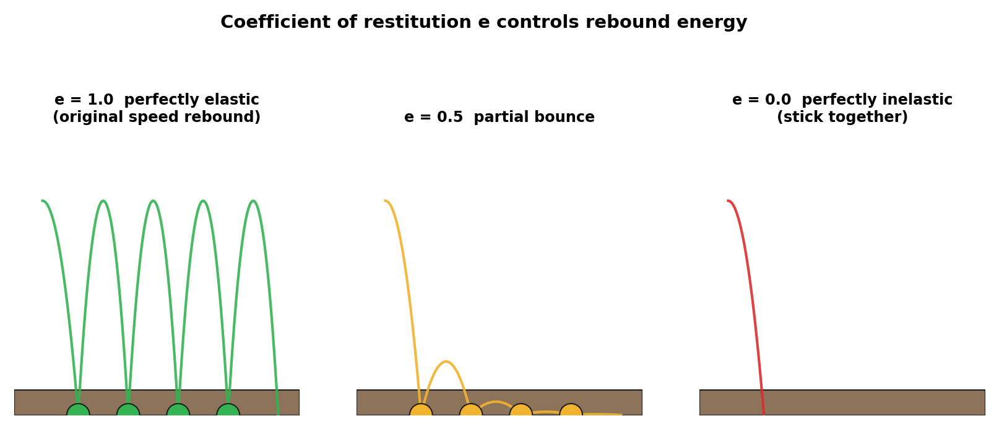
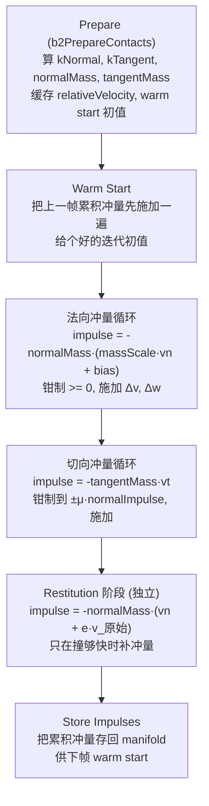

# 第 5 篇 · 第 15 章 · 冲量法碰撞响应

> **核心问题**:前面 P4-14 我们已经能算出"谁碰了、碰在哪、多深"——接触法线、接触点、穿透深度。可检测只是告诉引擎"撞了",**撞完之后两个物体的速度到底怎么变?** 一个向下砸的箱子,撞地之后怎么变成向上弹?一个被撞的台球,怎么从静止变成飞出去?**力**(force,连续作用一段时间)在这里派不上用场——碰撞发生在极其短暂的时间里(毫秒级),用"力 × 时间"去描述既不直观也不可控。物理引擎用的是另一个量:**冲量**(impulse)——一个瞬时的、直接改变速度的"速度增量"。本章回答:碰撞那一刻,该沿哪个方向、给两个物体各施加多大的冲量,才能让它们既**不穿透**、又按**正确的弹性**弹开?这就是**冲量法**(impulse method),整个第 5 篇(约束求解)的单点版——先讲透一个接触点怎么响应,下一章 P5-16 再讲多个接触点(堆叠、多约束)怎么一起求解。

> **读完本章你会明白**:
> 1. 为什么碰撞响应用**冲量**(impulse,瞬时的速度增量)而不是**力**(force,持续的加速度来源)——碰撞时间极短,力难以刻画,冲量直接对应"速度变了多少",干净利落。
> 2. **法向冲量公式** `j = -(1+e)·(v_rel·n) / (1/mA + 1/mB)` 怎么从两条物理定律(动量守恒 + 恢复系数定义)一步步推出来,为什么它**自动保证动量守恒**,而朴素做法"直接 `v = -v`"不守恒。
> 3. **恢复系数**(coefficient of restitution)e 控制弹性:e=1 完全弹性(原速弹回,能量守恒)、e=0 完全非弹性(粘在一起)、0<e<1 真实材质(每次碰撞耗散能量)。为什么"按 e 损失能量"才是物理对的,直接反转速度错在哪。
> 4. **切向冲量 + 摩擦锥**:碰撞不只沿法线弹开,还有沿切向的摩擦——切向冲量被库仑摩擦 `|J_t| ≤ μ·J_n` 钳制,这就是箱子落地后能停住、不一直滑的原因。
> 5. Box2D v3.2 在 `contact_solver.c` 里**真实**怎么算单个接触的冲量:有效质量倒数 `normalMass = 1/kNormal`(其中 `kNormal = invMassA + invMassB + invIA·rnA² + invIB·rnB²`)、增量式冲量 `impulse = -normalMass·(vn + bias)`、以及 ★**v3.2 把经典公式里的恢复系数 e 从主求解循环里抽出来,放到独立的 `b2_stageRestitution` 阶段后处理**——这是它和教科书公式最大的出入,本章诚实标注。

> **如果一读觉得太难**:先只记三件事——① 碰撞用冲量(瞬时改速度)不用力;② 法向冲量 `j = -(1+e)·v_rel·n / (1/mA+1/mB)`,自动守恒动量、按 e 损失能量;③ 切向还有摩擦冲量,被 `μ·法向冲量` 钳制。Box2D 把 e 挪到独立阶段是工程优化,原理不变。

---

## 〇、一句话点破

> **碰撞响应用冲量(impulse):一个沿接触法线方向、大小由"两个物体的有效质量"和"恢复系数 e"共同决定的瞬时速度增量。法向冲量把"相向"的相对法向速度翻成"分离",且乘以 e 控制反弹力度——e=1 原速弹回(能量守恒),e=0 粘一起(能量全耗散)。冲量法之所以是物理引擎的标准做法,是因为它从"动量守恒 + 恢复系数定义"两条定律推出来,天然守恒动量、天然按 e 损失能量;而朴素的"直接 `v = -v`"既不守恒动量、也不尊重质量、弹性还全错。切向再加一个被库仑摩擦钳制的切向冲量,碰撞响应就完整了。**

这是结论。本章倒过来拆:先讲为什么是冲量而不是力,再从两条物理定律把冲量公式推出来,然后讲恢复系数和切向摩擦,最后钻进 Box2D v3.2 的 `contact_solver.c` 看它真实怎么算——并诚实标注 v3.2 相比教科书公式的演进。

---

## 一、从上一章接过来:检测给出了什么,响应要做什么

上一章 P4-14(接触流形)的产出,是碰撞响应的全部输入。先把这份"交接清单"列清楚:



P4-14 给每个接触对打包了一份 `b2Manifold`(流形),里面有:

- **接触法线** `normal`(一个单位向量,通常规定从 A 指向 B)——它就是冲量要施加的方向。碰撞响应"沿法线弹开",这个法线是 P4-14 算出来的。
- **接触点** `anchorA`、`anchorB`(两个物体上发生接触的那个点的位置,相对各自质心)——冲量作用在哪里,决定了它产生多大的力矩、改变多少角速度。
- **穿透深度**(penetration)——两个物体已经互相陷进去多深,响应时要把它消除(位置修正,本章末尾和 P5-16 详谈)。

加上两个物体各自的状态(P2-05 定义过):质量 `mA`、`mB`(实际存倒数 `invMassA`、`invMassB`),转动惯量 `IA`、`IB`(存 `invIA`、`invIB`),线速度 `vA`、`vB`,角速度 `wA`、`wB`。

> **承接 P2-05 讲过**:物理引擎全局存倒数 `invMass = 1/m`、`invInertia = 1/I`,把每步的除法变乘法,顺带用 0 表示无穷大质量(静态物体)。P2-05 还埋了个伏笔:"碰撞响应里的有效质量是 `1/(invMassA + invMassB)`,存倒数直接相加就行"。本章就把这个伏笔兑现——你会看到法向冲量公式的分母,正好是两个倒数质量相加。

响应侧要做的事,一句话:**在接触法线方向上,给两个物体各施加一个冲量,让它们从"相向运动"变成"分离运动",且分离的相对速度由恢复系数 e 决定。** 怎么算这个冲量的大小,就是本章的全部内容。

---

## 二、为什么用冲量(impulse)而不是力(force)

碰撞响应最反直觉的第一步:为什么不用我们 P2-05 花一整章讲的**力**(force)?

### 2.1 力适合"持续作用",不适合"瞬间碰撞"

回顾 P2-05:力 `F` 通过牛顿第二定律 `a = F/m` 产生加速度,加速度在一段时间里积累成速度变化:`Δv = ∫a dt = ∫(F/m) dt`。这个模型适合**持续作用**的力——重力持续向下拉、弹簧持续拉、火箭持续推。引擎每步积分时,把这些力累加、除以质量、乘以步长,得到速度增量。

可碰撞不是持续作用。两个台球相撞,接触时间在**微秒到毫秒级**——在这个极短的时间里,两球之间产生了一个**极大**的力(峰值可达几千牛),然后迅速消失。这个力的形状(随时间怎么变)极其复杂,既难测量也难建模,而且我们其实**不关心**力的形状——我们关心的只是"撞完之后两球各以什么速度飞出去",也就是力在碰撞那段时间里的**积分**,而不是力本身。

力对时间的积分,有个专门的名字:**冲量**(impulse),记作 `J`(大写,区别于单个力 F):

```
J = ∫ F dt       冲量 = 力对时间的积分
```

由牛顿第二定律 `F = m·a = m·dv/dt`,有 `J = ∫m·dv dt = m·Δv`(质量不变时),所以:

```
J = m · Δv       冲量 = 质量 × 速度变化量
Δv = J / m = J · invMass      速度变化 = 冲量 / 质量
```

> **钉死这件事**:**冲量**是力对时间的积分,它的效果是直接改变速度:`Δv = J·invMass`。碰撞发生在极短时间内,力的形状不可知也不重要,我们只关心"速度变了多少"——而那正是冲量。所以碰撞响应用冲量,不用力。这是物理引擎的第一个关键选择。

### 2.2 冲量的几何:一个向量,沿接触法线

冲量是个**向量**(2D 里是二维向量)。但碰撞响应里,我们关心的冲量主要沿一个特定方向——**接触法线** `n`(P4-14 算出来的)。所以法向冲量可以写成:

```
J_normal = j · n        j 是标量(冲量大小), n 是单位法向量
```

`j` 是个标量(可正可负),`n` 是单位向量。施加这个冲量后,两个物体的速度变化:

```
ΔvA = -(j / mA) · n        A 速度变化(负号: A 被推向 -n 方向)
ΔvB = +(j / mB) · n        B 速度变化(正号: B 被推向 +n 方向)
```

为什么 A 是减、B 是加?因为接触法线 `n` 规定从 A 指向 B,冲量要把它们**推开**——把 B 往 `+n` 推、把 A 往 `-n` 推。两个物体受到的冲量**大小相等、方向相反**(牛顿第三定律),这正是动量守恒的来源(下一节推导会看到)。

加上转动(接触点不在质心上,冲量还产生力矩,改变角速度):

```
ΔwA = -invIA · (rA × J) = -invIA · j · (rA × n)       A 角速度变化
ΔwB = +invIB · (rB × J) = +invIB · j · (rB × n)       B 角速度变化
```

其中 `rA`、`rB` 是接触点相对各自**质心**的向量(P2-05 强调过,转动永远绕质心),`×` 是 2D 叉积(标量)。这一项是"接触点偏离质心"带来的转动效果——正面撞一个箱子的正中心,它不转(`r=0`,力矩为零);擦边撞它的角,它就转起来。

> **钉死这件事**:碰撞响应施加的冲量,沿接触法线 `n` 方向,大小为标量 `j`。它对两个物体的效果:`ΔvA = -(j·invMassA)·n`、`ΔvB = +(j·invMassB)·n`(平动),加上 `ΔwA = -invIA·j·(rA×n)`、`ΔwB = +invIB·j·(rB×n)`(转动)。整个问题归结为:**算出标量 `j` 到底多大**。这正是下一节的主角。

---

## 三、法向冲量公式:从两条定律推出来

现在到本章的核心:那个标量 `j` 到底怎么算?它不是拍脑袋定的,而是从两条物理定律**推**出来的。这个推导是冲量法的灵魂,理解了它,你就理解了"为什么冲量法天然对、而朴素做法错"。

### 3.1 推导的起点:两条物理定律

推导用到两条定律。

**定律一:动量守恒**(conservation of momentum)。两个物体碰撞,如果没有外力(碰撞力是内力,大小相等方向相反,互相抵消),它们的**总动量**在碰撞前后不变:

```
mA·vA + mB·vB = mA·vA' + mB·vB'
```

(`vA'`、`vB'` 是碰后速度)。这条定律**自动满足**——只要两个物体受到的冲量大小相等方向相反(上一节那个 +/- 写法),总动量就不变。代入 `vA' = vA - (j/mA)·n`、`vB' = vB + (j/mB)·n`:

```
mA·vA' + mB·vB' = mA·vA - j·n + mB·vB + j·n = mA·vA + mB·vB  ✓
```

`-j·n + j·n = 0`,两项抵消,动量守恒**对任意 j 都成立**。这就是说,**用冲量(大小相等方向相反)做碰撞响应,动量守恒是免费的**——这是冲量法相对于朴素做法的第一个巨大优势(下一节对比)。

**定律二:恢复系数定义**(definition of coefficient of restitution)。光动量守恒还不够——它只约束了"总动量不变",但碰后速度有无限种可能都满足动量守恒(比如 e=1 弹回、e=0 粘一起,都守恒动量)。要确定**具体**的碰后速度,还需要一条定律,这就是**恢复系数** e(coefficient of restitution)。

恢复系数 e 定义为:碰后两物体的**相对法向速度**,等于碰前相对法向速度的**反向,再乘以 e**:

```
(vB' - vA') · n = -e · (vB - vA) · n
```

物理含义:碰撞前两物体沿法线方向"相向"(相对法向速度 `(vB-vA)·n < 0`,假设 B 在 +n 方向);碰撞后它们"分离"(相对法向速度翻正)。e 控制这个"翻转 + 缩放"的程度:

- **e = 1**:碰后相对法向速度 = 碰前的相反数,**完全弹性**(perfectly elastic),能量守恒。
- **e = 0**:碰后相对法向速度 = 0,两物体沿法线方向**粘在一起**(相对法向速度为零),**完全非弹性**(perfectly inelastic),能量损失最大。
- **0 < e < 1**:中间情况,真实材质(橡皮 e≈0.5、木头 e≈0.3、钢球 e≈0.7),每次碰撞耗散一部分能量。

> **钉死这件事**:恢复系数 e 定义了"碰后相对法向速度 = -e × 碰前相对法向速度"。它不是凭空来的——真实材质碰撞时,接触面的形变、内摩擦、声波辐射会把一部分动能变成热、声、形变能,这些损耗就用 e 来概括。e=1 意味着没有损耗(理想弹性),e=0 意味着损耗最大(粘一起)。

### 3.2 把两条定律联立,解出 j

现在把两条定律联立。定律二(恢复系数)写成:

```
(vB' - vA')·n = -e · (vB - vA)·n
```

把 `vA' = vA - (j/mA)·n`、`vB' = vB + (j/mB)·n` 代入左边:

```
(vB + (j/mB)·n - vA + (j/mA)·n)·n = -e·(vB - vA)·n

(vB - vA)·n + j·(1/mA + 1/mB)·(n·n) = -e·(vB - vA)·n
```

注意 `n·n = 1`(n 是单位向量)。记 `v_rel·n = (vB - vA)·n`(相对法向速度),移项:

```
j · (1/mA + 1/mB) = -e·(v_rel·n) - (v_rel·n) = -(1+e)·(v_rel·n)

j = -(1+e)·(v_rel·n) / (1/mA + 1/mB)
```

这就是**法向冲量公式**(暂时忽略转动,转动版下一节补):

```
┌─────────────────────────────────────────────────────────┐
│                                                         │
│   j = -(1+e) · (v_rel · n) / (1/mA + 1/mB)            │
│                                                         │
│   v_rel · n = (vB - vA) · n   相对法向速度(标量)      │
│   1/mA + 1/mB                  有效质量的倒数           │
│                                                         │
└─────────────────────────────────────────────────────────┘
```

用倒数质量写更干净(P2-05 的伏笔在这里兑现):

```
j = -(1+e) · (v_rel · n) / (invMassA + invMassB)
```



注意几个细节:

1. **负号** `-`:因为相向碰撞时 `v_rel·n < 0`(B 在 +n 方向但相对 A 在靠近,即 `(vB-vA)·n < 0`),`(1+e)>0`,分母 `>0`,所以 `-(...)` 让 j 为**正**。j 为正意味着"把 B 往 +n 推、A 往 -n 推",正好是分开的方向。如果忘了负号,冲量方向反了,两物体反而被吸到一起。

2. **(1+e) 而不是 e**:这是新手最容易困惑的地方——为什么是 `(1+e)` 不是 `e`?因为我们要把相对法向速度从"相向 `v_rel·n`"变成"分离 `-e·v_rel·n`",总变化量是 `-e·v_rel·n - v_rel·n = -(1+e)·v_rel·n`。这个**总变化量**才对应冲量的大小。换句话说:冲量不仅要"抵消"原来的相向速度(贡献 `-1·v_rel·n`),还要"额外"产生大小为 `e` 的分离速度(贡献 `-e·v_rel·n`),合起来就是 `-(1+e)·v_rel·n`。

3. **分母是有效质量的倒数** `1/mA + 1/mB`:两个物体"串联"地抵抗这个冲量,就像两个弹簧串联——串联弹簧的有效劲度系数的倒数,是各自倒数之和。这里同理,有效质量 `m_eff = 1/(invMassA + invMassB)`,所以 `j = -(1+e)·(v_rel·n)·m_eff`。如果其中一个物体是静态的(地面、墙壁,`invMassB = 0`,即"无穷大质量"),分母就只剩 `invMassA`,`j = -(1+e)·(v_rel·n)·mA`,这正好是小球撞墙的情况——墙不动,所有"分离"都靠小球的速度变化。

> **钉死这件事**:法向冲量 `j = -(1+e)·(v_rel·n) / (invMassA + invMassB)`,从动量守恒 + 恢复系数定义两条定律推出来。它有三个关键:**负号**(让相向变分离)、**(1+e)**(既要抵消相向、又要产生 e 倍分离)、**分母是有效质量倒数**(两物体串联抵抗)。这个公式天然守恒动量(定律一保证)、天然按 e 损失能量(定律二保证),所以物理是对的。

### 3.3 把转动补上:完整的有效质量

上面的推导忽略了转动——假设接触点正好在质心上,冲量不产生力矩。可真实碰撞,接触点几乎总偏离质心(擦边撞、斜着撞),冲量产生力矩,改变角速度,而角速度的变化又会反过来影响接触点的速度。完整的有效质量要把这个转动贡献算进去。

接触点的速度 = 质心速度 + 角速度 × 接触点相对质心的向量。2D 里:

```
v_contact_A = vA + wA × rA        (rA 是接触点相对 A 质心的向量)
v_contact_B = vB + wB × rB
```

(`w × r` 在 2D 里是 `b2CrossSV(w, r)`,角速度标量叉乘向量,得到一个垂直于 r 的向量)。相对法向速度变成:

```
v_rel·n = (v_contact_B - v_contact_A)·n = (vB - vA)·n + (wB×rB - wA×rA)·n
```

多了一项 `(wB×rB - wA×rA)·n`,这是转动贡献到接触点法向速度的部分。重复上一节的推导(冲量改变 v 和 w,代入恢复系数定义),分母不再是简单的 `invMassA + invMassB`,而是:

```
1 / m_eff = invMassA + invMassB + invIA·(rA×n)² + invIB·(rB×n)²
```

记 `rnA = rA × n`、`rnB = rB × n`(标量,2D 叉积),那么有效质量倒数:

```
kNormal = invMassA + invMassB + invIA·rnA² + invIB·rnB²
```

法向冲量(完整版,含转动):

```
j = -(1+e)·(v_rel·n) / kNormal
```

多了 `invIA·rnA² + invIB·rnB²` 这两项——它们是"转动对法向方向的抵抗力"。直觉:接触点离质心越远(`rA` 大),`rnA = rA×n` 越大,这一项越大,有效质量倒数越大,冲量算出来越小——也就是说,擦边撞(力臂大)比正撞(力臂小)需要的冲量小,因为转动帮忙"卸掉"了一部分相对速度(物体被撞得转起来,而不是整体平移)。

> **钉死这件事**:完整有效质量倒数 `kNormal = invMassA + invMassB + invIA·(rA×n)² + invIB·(rB×n)²`,比纯平动版多了两个转动项。这两项体现"接触点偏离质心时,转动会贡献到法向抵抗力"。Box2D 的 `contact_solver.c` 用的就是这个完整版(下一节贴源码)。

### 3.4 三个常见误区:把公式吃透

公式 `j = -(1+e)·(v_rel·n) / kNormal` 看着简单,新手却常在三个地方栽跟头。这里逐一拆透,每个配几何直觉。

**误区一:以为 (1+e) 里的 "1" 多余。** 有人觉得"碰撞后反弹速度是 e 倍,那冲量不就该正比于 e 吗,为什么是 (1+e)?"。混淆点在于:**冲量改变的是"速度的总变化量",不是"碰后的速度"**。举个一维的例子:小球以 v=-10 撞墙,e=0.5。碰后速度是 +5(反弹,大小是原来的 e=0.5 倍)。速度从 -10 变到 +5,**总变化量是 +15**(向 -10 加 15 才得到 +5)。这个 15 是怎么来的?`15 = 10(抵消原有的 -10) + 5(额外产生 +5 的反弹) = (1+0.5)×10 = (1+e)×|v_原|`。看,那个 "1" 是用来"抵消原有相向速度"的,e 才是"额外反弹"的部分,合起来 (1+e)。如果你误用 e,算出冲量只够产生 5 的速度变化,那 -10+5=-5,小球还在往墙里钻(没抵消完),完全错了。

**误区二:质量悬殊时不知道谁动。** 想象一粒沙子(m=0.001)以 v=-100 撞一个铁球(m=1000,静止)。直觉可能觉得"沙子弹开,铁球不动"。用公式验证:`kNormal ≈ invMass_沙 = 1000`(铁球倒数质量 0.001 可忽略),`j = -(1+e)·(-100)/1000 = 0.1(1+e)`。沙子速度变化 `Δv_沙 = -j·invMass_沙 = -0.1(1+e)×1000 = -100(1+e)`,碰后 `v_沙' = -100 - (-100(1+e)) = +100e`(反弹)。铁球速度变化 `Δv_铁 = +j·invMass_铁 = +0.1(1+e)×0.001 = 0.0001(1+e)`,几乎为零。**结论和直觉一致**:轻物反弹、重物微动。但这个结论不是"猜"的,是公式从有效质量(分母里轻物倒数占主导)推出来的。反过来,如果两物质量相当(mA=mB),`kNormal = 2·invMass`,`j = -(1+e)·v_rel·n·m/2`,两物速度变化大小相等方向相反——动量均分。质量比决定了"谁吃掉更多冲量",这是有效质量倒数公式的核心洞察。

**误区三:静态物体怎么处理。** 地面、墙壁是静态的(static body),`invMassB = 0`、`invIB = 0`(P2-05 讲过,倒数质量 0 表示无穷大质量)。代入公式:`kNormal = invMassA + 0 + invIA·rnA² + 0 = invMassA + invIA·rnA²`,冲量 `j = -(1+e)·(v_rel·n) / (invMassA + invIA·rnA²)`。施加时 `ΔvB = +j·invMassB·n = 0`(地面不动),`ΔvA = -j·invMassA·n`(小球全变)。这就是小球撞墙的标准情况:**所有"分离"都体现在动态物体上,静态物体岿然不动**。Box2D 源码里,静态物体的 `invMass`/`invInertia` 都是 0,接触约束准备时直接读到这些 0,公式自然退化成单物体版——不需要为静态物体写特殊代码,倒数技巧让"无穷大质量"成了普通情况的一个特例。这是 P2-05 倒数技巧 bonus 1("用 0 表示无穷大质量")在碰撞响应里的直接兑现。

> **钉死这件事**:吃透冲量公式要避开三个误区:① **(1+e) 里的 1 是"抵消原有相向速度"**,e 是"额外反弹",合起来才是速度的总变化量,不能只用 e;② **质量悬殊时,有效质量倒数由轻物主导**(轻物倒数大),所以轻物速度变化大、重物几乎不动,这是公式推出来的不是猜的;③ **静态物体 `invMass=0`**,公式自动退化成单物体版,无需特殊代码——倒数技巧让"无穷大质量"成了普通特例。

---

## 四、为什么不能"直接 v = -v":冲量法 vs 朴素做法

这一节是本章技巧精解的反面对比——为什么物理引擎费劲推冲量公式,而不是最朴素地"碰撞了就把速度反过来"?

### 4.1 朴素做法:直接反转速度

最朴素的碰撞响应,是 P0-01 开篇就提过的那个 `if`:

```python
# 朴素做法(错误!)
if 小球和地面碰撞:
    小球.v.y = -小球.v.y * 0.8      # 速度反过来, 乘个衰减系数
```

这个做法看起来"也反弹了",但它错得离谱。我们逐一拆它的三个致命问题。

### 4.2 致命问题一:不守恒动量

想象两个物体相撞:A(质量 2,速度 +3)撞 B(质量 1,速度 -1)。碰撞前总动量 `2·3 + 1·(-1) = 5`。

朴素做法:把 A 速度变 `-3·0.8 = -2.4`,B 速度变 `+1·0.8 = +0.8`。碰后总动量 `2·(-2.4) + 1·(0.8) = -4`,**完全不是 5**!动量凭空变了 9。

这违反了最基本的物理定律(动量守恒)。在单物体撞固定墙的场景里这个问题被掩盖了(墙"无穷大质量",你怎么改小球速度都"守恒"),可一旦两个有限质量的物体相撞,朴素做法立刻穿帮——总动量不守恒,物体要么凭空加速、要么凭空减速,模拟完全失真。

冲量法不会有这个问题:上一节推导看到,冲量(大小相等方向相反)**自动保证**动量守恒,对任意 j 都成立。这是冲量法的第一个碾压优势。

### 4.3 致命问题二:不尊重质量

朴素做法"把速度乘 0.8",完全忽略了两个物体的**质量**。可物理上,同样一次碰撞,质量大的物体速度变化小,质量小的物体速度变化大(动量守恒下,`Δv = J/m`,m 大则 Δv 小)。

想象一辆卡车(质量 1000)撞一个皮球(质量 1)。朴素做法把两者速度都"反过来乘 0.8"——卡车从 +3 变 -2.4,皮球从 -1 变 +0.8。可真实物理是:卡车几乎不受影响(速度还是接近 +3),皮球被弹飞(速度变成很大的 +值)。朴素做法把卡车也反弹了,完全错误。

冲量法通过分母 `invMassA + invMassB` 自动尊重质量:质量大的物体 `invMass` 小,同样的冲量 j 对它的 `Δv = j·invMass` 小,所以重物速度变化小、轻物速度变化大。这正是物理对的。

### 4.4 致命问题三:弹性(能量)全错

朴素做法的"乘 0.8"是个魔法数,它和真实的恢复系数 e 不是一回事。真实物理里,能量损失由 e 决定:`K_after / K_before`(法向动能比)对单物体撞墙是 `e²`。可朴素做法"两边速度都乘 0.8",能量的变化是个混乱的函数,既不是 `e²` 也不守恒,完全不讲道理。

冲量法通过 `(1+e)` 项,精确地把恢复系数嵌进冲量大小,能量损失严格按照物理定律来(下一节用数字验证:e=1 能量守恒、e=0 能量损失最大)。



### 4.5 用数字说话:冲量法的守恒验证

用一组具体数字让上面的对比落地。设 A(质量 2,速度 +3)正面撞 B(质量 1,速度 -1),1D 情况(法线沿 x 轴)。碰前总动量 `P0 = 5`,总动能 `K0 = 9.5`。

| 恢复系数 e | 冲量 j | vA' | vB' | 动量比 P'/P0 | 动能比 K'/K0 |
|---|---|---|---|---|---|
| 1.0(完全弹性) | +5.333 | +0.333 | +4.333 | **1.000** | **1.000** |
| 0.5(真实材质) | +4.000 | +1.000 | +3.000 | **1.000** | 0.579 |
| 0.0(完全非弹性) | +2.667 | +1.667 | +1.667 | **1.000** | 0.439 |

(冲量 `j = -(1+e)·(vB-vA)/(1/mA+1/mB)`,`vA' = vA - j/mA`、`vB' = vB + j/mB`。)

几个观察:

1. **动量比恒为 1.000**——三种 e 下,动量都精确守恒。这是冲量法从定律一推出来的保证,铁律。
2. **e=1 能量守恒**(K'/K0 = 1.000)——完全弹性碰撞,没有能量损失。A 把大部分动量传给 B,A 减速到 +0.333,B 加速到 +4.333。
3. **e=0 两物体同速**(`vA' = vB' = 1.667`)——完全非弹性,两物体"粘在一起",以共同速度运动。这正是 e=0 的物理含义(相对法向速度为零)。
4. **e=0.5 介于中间**——A、B 都还在前进,但相对速度变小了,损失了一部分动能(变成热、形变)。

如果用朴素做法"两边速度乘 0.8",e=0.5 那行会算出 vA'=-2.4、vB'=+0.8,动量比 -0.84(完全不守恒),能量比混乱。这就是冲量法存在的理由。

> **不这样会怎样**:如果碰撞响应用朴素做法"直接反转速度",在单物体撞墙的玩具场景里看起来"也反弹了",可一旦扩展到两有限质量物体相撞、堆叠、关节连接,立刻三个问题一起爆:动量不守恒(物体凭空加减速)、不尊重质量(重物也被反弹)、弹性全错(能量损失不可控)。冲量法从两条定律推出来,把这三个问题一次性解决。

> **钉死这件事**:冲量法相对于朴素做法,有三大优势:① **自动守恒动量**(冲量大小相等方向相反,动量守恒是恒等式);② **自动尊重质量**(分母是有效质量倒数,重物速度变化小、轻物大);③ **弹性精确可控**(`(1+e)` 项把恢复系数嵌进冲量,能量损失严格按物理来)。这就是为什么所有主流物理引擎(Box2D、Bullet、PhysX、Chipmunk)都用冲量法,没有一个用"直接反转速度"。

---

## 五、恢复系数 e:弹性的数学刻度

上一节反复出现的恢复系数 e,值得单独讲透——它是控制碰撞"弹性"的唯一旋钮,理解了它,你就理解了碰撞响应的"手感"。

### 5.1 e 的物理含义:能量耗散的概括

真实世界里,两个物体碰撞,动能不会凭空消失(能量守恒),而是一部分变成**别的形式**:接触面的形变(橡皮球撞地凹陷)、内摩擦(分子层面的振动)、声波(撞地的"砰"声)、热。这些损耗的总量,取决于材质——橡皮损耗多(e 小),钢球损耗少(e 大)。

物理引擎不可能逐个模拟这些微观过程(那要解固体力学方程,远超实时),所以用一个**经验常数** e 来概括它们:碰撞后相对法向速度,是碰撞前的 -e 倍。e 越大,损耗越少,反弹越强;e 越小,损耗越多,反弹越弱。

| e 值 | 名称 | 物理含义 | 典型材质 |
|---|---|---|---|
| 1.0 | 完全弹性 | 无能量损失,原速弹回 | 理想台球、台球理论模型 |
| 0.7~0.9 | 高弹性 | 少量损失 | 钢球、超级弹力球 |
| 0.3~0.6 | 中等 | 中等损失 | 木头、塑料 |
| 0.1~0.3 | 低弹性 | 大量损失 | 橡胶、泥土 |
| 0.0 | 完全非弹性 | 法向动能全损,粘一起 | 湿泥、粘土、子弹入墙 |



### 5.2 为什么 e 控制"能量损失"而不是"速度损失"

新手常误以为 e 是"速度的衰减系数"(碰后速度 = e × 碰前速度)。**不是**。e 定义的是**相对法向速度**的比值,而能量是速度的**平方**。所以能量损失不是 `1-e`,而是 `1-e²`。

具体说,单物体撞固定墙(墙不动,所有法向速度变化都在物体上),碰前法向速度 `v`,碰后 `-e·v`。法向动能 `½mv²`,碰前 `½mv²`,碰后 `½m(ev)² = e²·½mv²`。所以法向动能比 `K_after/K_before = e²`,法向动能损失 `1 - e²`:

- e=1:损失 `1-1=0`,能量守恒。
- e=0.5:损失 `1-0.25=0.75`,损失 75% 的法向动能。
- e=0:损失 `1-0=1`,法向动能全损。

注意是**法向动能**,切向动能(摩擦那个方向)由切向冲量单独管(下一节)。这也解释了上一节数字验证里 e=0.5 时总动能比是 0.579 而不是 0.75——因为总动能里还有切向部分和转动部分,法向动能损失 75% 不等于总动能损失 75%。但法向那部分严格按 `1-e²` 损失。

> **钉死这件事**:恢复系数 e 控制的是**相对法向速度**的比值(碰后 = -e × 碰前),由此推出**法向动能**损失 = `1-e²`。e=1 能量守恒,e=0 法向动能全损。e 不是简单的"速度衰减系数"——把它和能量损失的关系理清,才能正确调出想要的"弹性手感"。

### 5.3 Box2D 怎么定 e:材质组合 + 阈值

在 Box2D 里,e 不是物体自己的属性,而是**两个物体碰撞时组合出来**的。每个 shape 有一个 `restitution` 字段(0 到 1),两个 shape 碰撞时,Box2D 取它们的**最大值**或某个混合规则(`b2MixRestitution`,通常是 `max(rA, rB)`,避免一个软一个硬时弹不起来)。

还有一个工程上的细节:**e 只在"撞得够快"时才生效**。Box2D 有个 `restitutionThreshold`(恢复系数阈值),如果相对法向速度的绝对值小于这个阈值,就不施加恢复冲量(当作 e=0 处理)。为什么?因为真实场景里,物体轻轻接触(相对速度很小)时不该反弹——比如箱子摞在地上,轻微的下沉接触如果按 e 弹,箱子会一直抖。阈值过滤掉这些"软接触",只让"真撞"(相对速度大)才反弹。

公共 API `b2World_SetRestitutionThreshold`([include/box2d/box2d.h#L130](../box2d/include/box2d/box2d.h#L130))就是调这个阈值:

```c
B2_API void b2World_SetRestitutionThreshold( b2WorldId worldId, float value );
```

默认值通常是 1 m/s 量级(意味着相对速度低于约 1 m/s 时不反弹)。这个阈值是 Box2D 避免"堆叠抖动"的工程手段之一,本章末尾和 P5-18(稳定性)会再提。

---

## 六、切向冲量与摩擦:碰撞不只沿法线

到这里,法向响应(弹开)讲透了。可碰撞还有一个维度——**切向**(tangent,沿接触切线方向)。这就是摩擦。

### 6.1 切向相对速度:滑动

接触法线 `n` 定义了"弹开方向"。垂直于 `n` 的方向,叫**切线** `t`(2D 里只有一个切线方向,`t = perp(n)`,法线逆时针转 90 度)。两个物体在接触点的相对速度,可以分解成法向分量 `(v_rel·n)` 和切向分量 `(v_rel·t)`:

```
v_rel = (v_rel·n)·n + (v_rel·t)·t
        └─ 法向 ─┘   └─ 切向 ─┘
         (弹开)        (滑动)
```

法向分量由法向冲量处理(弹开),切向分量就是**滑动**——一个箱子斜着砸在地上,除了竖直反弹,还有水平滑动;一个球擦着墙滚下来,除了不穿墙,还有沿墙的摩擦。切向滑动由**切向冲量**处理。

### 6.2 切向冲量公式:和法向同构

切向冲量的推导,和法向完全一样,只是把法线 `n` 换成切线 `t`,把恢复系数 e 设为 0(摩擦不反弹,只阻尼):

```
j_tangent = -(v_rel·t) / (invMassA + invMassB + invIA·(rA×t)² + invIB·(rB×t)²)
```

分母 `kTangent` 结构和 `kNormal` 一样,只是 `rnA = rA×n` 换成 `rtA = rA×t`。Box2D 在准备接触时,把法向有效质量和切向有效质量一起算好缓存(下一节源码)。

切向冲量的效果:消除切向相对速度(让两个物体在切向方向"同步")。物理上,这就是摩擦——摩擦阻止接触面之间的滑动。

### 6.3 库仑摩擦锥:切向冲量不能无限大

可切向冲量有个上限,不能无限大——这就是**库仑摩擦定律**(Coulomb friction)。真实物理里,摩擦力 `f ≤ μ·N`,其中 `N` 是法向支持力,`μ` 是摩擦系数。冲量同理:**切向冲量的绝对值,不能超过摩擦系数乘以法向冲量**:

```
|j_tangent| ≤ μ · j_normal
```

(`μ` 是两个物体摩擦系数的组合,通常 `sqrt(μA·μB)`)。

为什么有这个上限?因为摩擦的本质是接触面的微观凹凸啮合——法向压得越紧(`j_normal` 大),啮合越深,能提供的切向阻力越大(`μ·j_normal` 大)。如果切向冲量按公式算出来超过了这个上限,就**钳制**到上限(这叫"动摩擦"或"滑动摩擦");如果没超过,就全用(叫"静摩擦",物体不滑)。

这个钳制是摩擦"粘滑"(stick-slip)行为的来源:轻推一个箱子(切向冲量小于 `μ·j_normal`),箱子不动(静摩擦);使劲推(超过上限),箱子开始滑(动摩擦,切向冲量钉在上限)。

> **钉死这件事**:碰撞响应除了法向(弹开),还有切向(摩擦)。切向冲量公式和法向同构(把 `n` 换 `t`,e 设 0),但被**库仑摩擦锥**钳制:`|j_tangent| ≤ μ·j_normal`。这个钳制让物体能"停住"(静摩擦)或"滑动"(动摩擦),是堆叠、行走、抓握这些行为的基础。没有摩擦,所有东西都会像在冰面上一样滑个不停。

---

## 七、Box2D v3.2 源码:单个接触的冲量怎么算

原理讲透了,现在钻进 Box2D v3.2 的真实源码,看它怎么落地。本章贴的是 v3.2 的**标量求解路径**(`b2PrepareContacts_Overflow` / `b2SolveContacts_Overflow` / `b2ApplyRestitution_Overflow`,在 `contact_solver.c` 里),它逻辑最清晰、最贴近教科书公式,适合讲原理。v3.2 还有一条 **SIMD 宽化主路径**(`b2PrepareContactsTask` @ 1573 等),把同样的逻辑用 SIMD 一次处理多个接触,数学等价但代码可读性差——本章讲原理用标量版,P5-16 讲并行求解时再点 SIMD 版。

### 7.1 准备阶段:算有效质量倒数、缓存冲量

求解的第一步是"准备"(prepare),把每个接触的有效质量、初始冲量缓存好。看 `b2PrepareContacts_Overflow`([src/contact_solver.c#L24-L160](../box2d/src/contact_solver.c#L24-L160))的核心循环(逐行已核):

```c
// 接触法线和切线
b2Vec2 normal = constraint->normal;
b2Vec2 tangent = b2RightPerp( constraint->normal );

for ( int j = 0; j < pointCount; ++j )
{
    const b2ManifoldPoint* mp = manifold->points + j;
    b2ContactConstraintPoint* cp = constraint->points + j;

    // warm start: 用上一帧的累积冲量做初值
    cp->normalImpulse = warmStartScale * mp->normalImpulse;
    cp->tangentImpulse = warmStartScale * mp->tangentImpulse;
    cp->totalNormalImpulse = 0.0f;

    // 接触点相对各自质心的向量 (转动贡献)
    b2Vec2 rA = mp->anchorA;
    b2Vec2 rB = mp->anchorB;

    // 法向有效质量倒数 kNormal = invMassA + invMassB + invIA·rnA² + invIB·rnB²
    float rnA = b2Cross( rA, normal );
    float rnB = b2Cross( rB, normal );
    float kNormal = mA + mB + iA * rnA * rnA + iB * rnB * rnB;
    cp->normalMass = kNormal > 0.0f ? 1.0f / kNormal : 0.0f;       // 缓存有效质量(倒数已翻)

    // 切向有效质量倒数 kTangent, 结构同 kNormal
    float rtA = b2Cross( rA, tangent );
    float rtB = b2Cross( rB, tangent );
    float kTangent = mA + mB + iA * rtA * rtA + iB * rtB * rtB;
    cp->tangentMass = kTangent > 0.0f ? 1.0f / kTangent : 0.0f;

    // 保存碰前相对法向速度 (恢复系数用)
    b2Vec2 vrA = b2Add( vA, b2CrossSV( wA, rA ) );
    b2Vec2 vrB = b2Add( vB, b2CrossSV( wB, rB ) );
    cp->relativeVelocity = b2Dot( normal, b2Sub( vrB, vrA ) );
}
```

逐行对应原理:

- **`rA`、`rB`**:接触点相对各自质心的向量(P2-05 强调转动绕质心)。源码变量名 `anchorA/anchorB`(接触锚点)就是 `rA/rB`。
- **`rnA = b2Cross(rA, normal)`**:2D 叉积 `rA × n`,标量。这就是上一节完整有效质量里的 `rnA`。
- **`kNormal = mA + mB + iA*rnA*rnA + iB*rnB*rnB`**:完整法向有效质量倒数!和原理公式 `kNormal = invMassA + invMassB + invIA·rnA² + invIB·rnB²` **逐字对应**(这里 `mA` 是 `invMassA`、`iA` 是 `invIA`,变量名简写)。源码铁证。
- **`cp->normalMass = 1.0f / kNormal`**:把有效质量倒数 `kNormal` 再取倒数,缓存成 `normalMass`。求解时直接乘 `normalMass`,省一次除法。注意 `kNormal > 0` 的保护——退化情况(两个静态物体)kNormal 可能为 0,这时 `normalMass = 0`,冲量也算成 0,避免除零。
- **`kTangent`**:切向有效质量倒数,结构和 kNormal 一样,只是 `rn` 换成 `rt`。
- **`cp->relativeVelocity`**:保存**碰前**相对法向速度 `(vB+ωB×rB - vA-ωA×rA)·n`。注意这是"碰前"的——后面恢复系数阶段要用它(因为求解循环里速度已经被改了好几次,恢复系数要回到"原始撞击速度")。
- **`cp->normalImpulse = warmStartScale * mp->normalImpulse`**:**warm start**(热启动)——用上一帧的累积冲量做这一帧的初值。这能极大加速迭代收敛(P5-16 详谈),`warmStartScale` 是个缩放因子(默认 1.0,关闭热启动时为 0)。

> **钉死这件事**:Box2D 在准备阶段([contact_solver.c#L142-L155](../box2d/src/contact_solver.c#L142-L155))把完整有效质量倒数 `kNormal = invMassA + invMassB + invIA·rnA² + invIB·rnB²` 算出来,**正是本章推导的公式**(P2-05 的倒数技巧伏笔在这里兑现——`mA/iA` 就是倒数质量和倒数转动惯量)。同时还缓存切向有效质量、碰前相对法向速度、warm start 初值,为后面的求解循环备好所有数据。

### 7.2 求解阶段:增量式冲量施加

准备完,进入求解循环,真正施加冲量。看 `b2SolveContacts_Overflow` 的法向冲量段([src/contact_solver.c#L288-L342](../box2d/src/contact_solver.c#L288-L342)):

```c
// Non-penetration
for ( int j = 0; j < pointCount; ++j )
{
    b2ContactConstraintPoint* cp = constraint->points + j;
    b2Vec2 rA = cp->anchorA;
    b2Vec2 rB = cp->anchorB;

    // 当前穿透量 (用于 bias)
    b2Vec2 ds = b2Add( dp, b2Sub( b2RotateVector( dqB, rB ), b2RotateVector( dqA, rA ) ) );
    float s = cp->baseSeparation + b2Dot( ds, normal );

    // velocity bias (Baumgarte / speculative)
    float velocityBias = 0.0f;
    float massScale = 1.0f;
    float impulseScale = 0.0f;
    if ( s > 0.0f )
    {
        velocityBias = s * inv_h;                       // speculative: 预测未来穿透
    }
    else if ( useBias )
    {
        velocityBias = b2MaxFloat( softness.massScale * softness.biasRate * s, -contactSpeed );
        massScale = softness.massScale;                 // soft constraint
        impulseScale = softness.impulseScale;
    }

    // 当前相对法向速度
    b2Vec2 vrA = b2Add( vA, b2CrossSV( wA, rA ) );
    b2Vec2 vrB = b2Add( vB, b2CrossSV( wB, rB ) );
    float vn = b2Dot( b2Sub( vrB, vrA ), normal );

    // 增量式法向冲量
    float impulse = -cp->normalMass * ( massScale * vn + velocityBias ) - impulseScale * cp->normalImpulse;

    // 钳制累积冲量 >= 0 (不能拉, 只能推)
    float newImpulse = b2MaxFloat( cp->normalImpulse + impulse, 0.0f );
    impulse = newImpulse - cp->normalImpulse;
    cp->normalImpulse = newImpulse;
    cp->totalNormalImpulse += impulse;

    // 施加冲量: Δv = ∓impulse·invMass·n, Δw = ∓invI·(r×impulse·n)
    b2Vec2 P = b2MulSV( impulse, normal );
    vA = b2MulSub( vA, mA, P );          // vA -= invMassA * P
    wA -= iA * b2Cross( rA, P );
    vB = b2MulAdd( vB, mB, P );          // vB += invMassB * P
    wB += iB * b2Cross( rB, P );
}
```

这段信息量很大,逐行拆:

- **`impulse = -cp->normalMass * (massScale * vn + velocityBias)`**:这是**增量式**法向冲量。和本章推导的经典公式 `j = -(1+e)·vn·m_eff` 对比——结构一样(`-normalMass·vn`,`normalMass = 1/kNormal = m_eff`),但**有两个关键不同**(下面单独讲):`velocityBias`(偏置项)替代了恢复系数,`massScale/impulseScale` 是软约束缩放。

- **`newImpulse = max(cp->normalImpulse + impulse, 0.0f)`**:钳制累积冲量非负。法向冲量只能"推"(把两物体分开),不能"拉"(把它们吸到一起)。如果某次迭代算出负冲量(意味着想拉),直接钳到 0。这是**非穿透约束**的物理要求——接触面没有胶水,不能拉。

- **`impulse = newImpulse - cp->normalImpulse`**:算"本次迭代的增量"——累积冲量从旧值变到新值,差就是这次真正施加的量。这是 **Sequential Impulse**(P5-16 主角)的核心写法:每轮迭代只施加增量,累积冲量单调不减(被钳制),多轮后收敛。

- **`vA = b2MulSub(vA, mA, P)`**:施加冲量,`vA -= invMassA · P`。`P = impulse·n` 是冲量向量,`mA` 是倒数质量。这正是原理里的 `ΔvA = -(j·invMassA)·n`。`b2MulSub` 是 SIMD 友好的"`a - s·b`"融合运算。

> **★诚实标注(v3.2 的关键演进)**:对比经典教科书公式 `j = -(1+e)·vn / kNormal` 和源码 `impulse = -normalMass·(massScale·vn + velocityBias)`,你会发现**恢复系数 e 不在主求解循环里**!经典公式里,`(1+e)` 是冲量大小的核心;可 v3.2 主循环里,既没有 `(1+e)`,也没有 `e`——它用的是 `velocityBias`(穿透偏置)和 `massScale/impulseScale`(软约束缩放)。这是 v3.2 相比早期 Box2D(以及大多数教科书)的**重大演进**:它把碰撞响应从"刚性冲量 + 恢复系数"改成了"**软约束**(soft constraint)"——把接触建模成一个有 hertz(频率)和阻尼比的虚拟弹簧,通过 `b2MakeSoft(hertz, dampingRatio, h)` 算出 `massScale/impulseScale/biasRate` 三个参数,让接触"软软地"推开,而不是"硬硬地"弹开。这种做法能避免堆叠抖动(刚性冲量在多接触点时容易震荡),代价是恢复系数 e 被挪到独立阶段处理(下一节)。这是 v3.2 的工程取舍,原理(冲量改变速度、有效质量倒数)不变,但"怎么算冲量大小"的具体公式,比教科书复杂得多。

### 7.3 恢复系数阶段:e 的独立后处理

那 e 跑哪去了?它在独立的 `b2_stageRestitution` 阶段。看 `b2ApplyRestitution_Overflow`([src/contact_solver.c#L410-L514](../box2d/src/contact_solver.c#L410-L514)):

```c
void b2ApplyRestitution_Overflow( b2StepContext* context )
{
    // ...
    float threshold = context->world->restitutionThreshold;     // 恢复系数阈值

    for ( int i = 0; i < contactCount; ++i )
    {
        b2ContactConstraint* constraint = constraints + i;
        float restitution = constraint->restitution;
        if ( restitution == 0.0f )                              // e=0 直接跳过, 不反弹
        {
            continue;
        }
        // ... 取 mA, iA, mB, iB, vA, wA, vB, wB ...

        for ( int j = 0; j < pointCount; ++j )
        {
            b2ContactConstraintPoint* cp = constraint->points + j;

            // 只有"真撞"(碰前相对速度够快)才反弹
            if ( cp->relativeVelocity > -threshold || cp->totalNormalImpulse == 0.0f )
            {
                continue;                                       // 没撞够快, 或没产生冲量, 跳过
            }

            // 当前相对法向速度
            b2Vec2 vrB = b2Add( vB, b2CrossSV( wB, rB ) );
            b2Vec2 vrA = b2Add( vA, b2CrossSV( wA, rA ) );
            float vn = b2Dot( b2Sub( vrB, vrA ), normal );

            // 恢复冲量: 把当前 vn 拉回到 -e × 原始撞击速度
            float impulse = -cp->normalMass * ( vn + restitution * cp->relativeVelocity );

            // 同样钳制累积冲量 >= 0
            float newImpulse = b2MaxFloat( cp->normalImpulse + impulse, 0.0f );
            impulse = newImpulse - cp->normalImpulse;
            cp->normalImpulse = newImpulse;

            // 施加冲量 (同主循环)
            b2Vec2 P = b2MulSV( impulse, normal );
            vA = b2MulSub( vA, mA, P );
            wA -= iA * b2Cross( rA, P );
            vB = b2MulAdd( vB, mB, P );
            wB += iB * b2Cross( rB, P );
        }
        // ... 写回速度 ...
    }
}
```

这里的 `impulse = -cp->normalMass * (vn + restitution * cp->relativeVelocity)`,才是恢复系数 e 的真正落地。拆开看:

- `cp->relativeVelocity`:准备阶段保存的**碰前**相对法向速度(原始撞击速度)。
- `restitution * cp->relativeVelocity`:目标碰后相对法向速度 `-e·v_原始`(负号因为 relativeVelocity 本身是负的相向速度)。
- `vn`:**当前**相对法向速度(主循环已经改过几次)。
- `vn + restitution * cp->relativeVelocity`:当前相对法向速度距离目标的偏差——如果当前 `vn` 还没达到 `-e·v_原始`,就再补一个冲量把它拉过去。
- `-cp->normalMass * 偏差`:补的冲量大小,同样用有效质量倒数换算。

注意两个保护:

1. **`restitution == 0` 直接跳过**——e=0 完全不反弹,这个阶段对 e=0 的接触什么都不做(它们的反弹完全由主循环的 bias 处理,等于不反弹)。
2. **`cp->relativeVelocity > -threshold` 跳过**——碰前相对速度不够快(没超过阈值),不反弹。这就是上一节说的"堆叠不抖动"的工程手段——轻轻接触不反弹。
3. **`cp->totalNormalImpulse == 0` 跳过**——如果这个接触点主循环根本没产生冲量(比如 speculative 接触没真撞上),也不反弹。

> **钉死这件事**:v3.2 把恢复系数 e 从主求解循环里**抽出来**,放到独立的 `b2_stageRestitution` 阶段后处理([contact_solver.c#L410](../box2d/src/contact_solver.c#L410))。主循环用软约束(bias + massScale + impulseScale)处理"不穿透",恢复阶段用经典公式 `impulse = -normalMass·(vn + e·v_原始)` 补上反弹。这种"两段式"是为了兼顾稳定性(软约束避免堆叠抖动)和弹性手感(独立阶段精确控制反弹)。★这是 v3.2 相比教科书公式最大的出入,讲源码必须诚实标注。

### 7.4 切向冲量与摩擦:库仑锥钳制

最后看切向(摩擦)冲量,在主循环里紧接法向之后([src/contact_solver.c#L346-L379](../box2d/src/contact_solver.c#L346-L379)):

```c
// Friction
for ( int j = 0; j < pointCount; ++j )
{
    b2ContactConstraintPoint* cp = constraint->points + j;
    b2Vec2 rA = cp->anchorA;
    b2Vec2 rB = cp->anchorB;

    // 当前相对切向速度 (减去 tangentSpeed: 传送带等表面速度)
    b2Vec2 vrB = b2Add( vB, b2CrossSV( wB, rB ) );
    b2Vec2 vrA = b2Add( vA, b2CrossSV( wA, rA ) );
    float vt = b2Dot( b2Sub( vrB, vrA ), tangent ) - constraint->tangentSpeed;

    // 切向冲量 (e=0, 只阻尼)
    float impulse = cp->tangentMass * ( -vt );

    // 库仑摩擦锥: |j_tangent| <= mu * j_normal
    float maxFriction = friction * cp->normalImpulse;
    float newImpulse = b2ClampFloat( cp->tangentImpulse + impulse, -maxFriction, maxFriction );
    impulse = newImpulse - cp->tangentImpulse;
    cp->tangentImpulse = newImpulse;

    // 施加切向冲量
    b2Vec2 P = b2MulSV( impulse, tangent );
    vA = b2MulSub( vA, mA, P );
    wA -= iA * b2Cross( rA, P );
    vB = b2MulAdd( vB, mB, P );
    wB += iB * b2Cross( rB, P );
}
```

逐行:

- **`vt = dot(vrB - vrA, tangent) - tangentSpeed`**:当前相对切向速度。`tangentSpeed` 是"表面速度"(传送带、跑步机这种,接触面本身在动),正常情况为 0。
- **`impulse = cp->tangentMass * (-vt)`**:切向冲量,把切向相对速度消除。注意这里 `tangentMass = 1/kTangent`,公式结构 `impulse = -tangentMass·vt` 和法向 `impulse = -normalMass·vn` 完全同构,只是法向多了 bias 和恢复系数。
- **`maxFriction = friction * cp->normalImpulse`**:库仑摩擦上限——摩擦系数乘以(累积)法向冲量。`friction` 是两个物体摩擦系数的组合(Box2D 用 `sqrt(μA·μB)`)。
- **`newImpulse = clamp(cp->tangentImpulse + impulse, -maxFriction, maxFriction)`**:**钳制到库仑锥**。累积切向冲量被限制在 `[-μ·J_n, +μ·J_n]` 之间。如果公式算出的冲量超过这个范围,就钉在上限(动摩擦);没超过,全用(静摩擦)。这是上一节讲的粘滑行为的源码落地。

注意一个细节:摩擦冲量的钳制用的是 `cp->normalImpulse`(**累积**法向冲量),不是当前迭代的增量。这是因为摩擦上限取决于"总法向压力",不是单次冲量。而 `normalImpulse` 在法向循环里已经被更新过(累积),所以这里读到的是最新的累积值。

> **钉死这件事**:切向(摩擦)冲量在 Box2D 主循环里([contact_solver.c#L346-L379](../box2d/src/contact_solver.c#L346-L379))紧接法向之后。公式结构和法向同构(`impulse = -tangentMass·vt`),但被**库仑摩擦锥**钳制:`|累积切向冲量| ≤ μ·累积法向冲量`。这个钳制是物体能"停住"(静摩擦)或"滑动"(动摩擦)的物理来源。源码 `clamp(..., -maxFriction, maxFriction)` 一行,精确实现了库仑摩擦定律。

### 7.5 把单接触的求解流程画出来

把上面三段(法向、切向、恢复)串成一个完整流程:



这就是 Box2D v3.2 处理**单个接触**的完整流程。注意主循环(法向 + 切向)在 P5-16 里会被**迭代多次**(subStepCount × iterationCount 轮),每轮修正违反的约束,多轮收敛——那就是 Sequential Impulse。本章先看懂单接触单轮怎么做,P5-16 再看多轮迭代。

---

## 八、技巧精解:为什么冲量法守恒动量,以及 v3.2 的软约束演进

这一节单独拆本章最硬核的两个技巧:① 冲量法为什么天然守恒动量(数学证明,不只是"看起来对");② v3.2 为什么把刚性冲量改成软约束(工程动机)。

### 8.1 技巧一:冲量法守恒动量的数学本质

上一节说"冲量法自动守恒动量",这里给出严格的数学证明,让你看到**为什么对**,而不只是信结论。

碰撞前后总动量:

```
P_after = mA·vA' + mB·vB'
       = mA·(vA - (j/mA)·n) + mB·(vB + (j/mB)·n)
       = mA·vA - j·n + mB·vB + j·n
       = mA·vA + mB·vB + (j - j)·n
       = P_before
```

关键的 `(j - j)·n = 0`——两个物体受到的冲量大小相等(`j`)、方向相反(`-n` 和 `+n`),在总动量里**精确抵消**。这不是巧合,是**牛顿第三定律**(作用力 = 反作用力)的直接推论:碰撞力是内力,内力不改变系统总动量。

这个证明揭示了冲量法的一个深层性质:**动量守恒不依赖于 j 的具体值**。无论 j 是按 `(1+e)` 算、按软约束算、还是随便给个数,只要两个物体受到的冲量大小相等方向相反,动量就守恒。这就是为什么物理引擎可以放心地用各种复杂的冲量公式(软约束、 speculative、warm start),而不用担心破坏动量守恒——动量守恒是**结构上**保证的,只要保持"+/- 冲量配对"这个写法。

反过来,这也解释了朴素做法"直接 `v = -v`"为什么不守恒动量——它没有"两个物体受到大小相等方向相反的冲量"这个结构,而是各自独立地改速度,总动量自然不守恒。

> **钉死这件事**:冲量法守恒动量的数学本质,是"两个物体受到大小相等方向相反的冲量",在总动量里精确抵消(`(j-j)·n = 0`)。这是牛顿第三定律的体现,**不依赖 j 的具体值**。所以物理引擎可以用各种复杂的冲量公式(软约束、speculative、warm start),动量守恒始终成立——只要保持"+/- 冲量配对"的写法。这是冲量法相对于"直接改速度"的根本优势。

### 8.2 技巧二:v3.2 的软约束演进——为什么把刚性冲量变软

第二个技巧是 v3.2 的工程演进:为什么主求解循环不用经典 `j = -(1+e)·vn/kNormal`,而改用软约束(`bias + massScale + impulseScale`)?

**动机**:经典刚性冲量在**单接触点**时完美,可在**多接触点**(堆叠、多约束)时会出问题。想象一个箱子摞在地上,有 4 个接触点。每轮迭代,求解器对每个接触点施加冲量消除穿透——可施加一个点的冲量,会改变其他点的相对速度(因为它们共享同一个刚体)。这导致"按下一个葫芦浮起瓢":这个点不穿透了,那个点又穿透了。刚性冲量(像无限硬的弹簧)在这种耦合下容易**震荡**(overshoot),物体抖个不停。

**软约束的思路**:把接触建模成一个**有有限劲度的虚拟弹簧**(hertz 频率 + 阻尼比),而不是无限硬的墙。弹簧有"柔性",允许微小穿透,通过 `bias`(偏置,类似弹簧的恢复力)和 `massScale`(质量缩放,类似弹簧的劲度)渐进地把物体推开,而不是一步到位。这种"软软地推"能吸收震荡,让堆叠稳定。

具体怎么软化?Box2D 用 `b2MakeSoft(hertz, dampingRatio, h)`([src/solver.h#L239](../box2d/src/solver.h#L239))算出三个参数:

```c
static inline b2Softness b2MakeSoft( float hertz, float zeta, float h )
{
    float omega = 2.0f * B2_PI * hertz;
    float a1 = 2.0f * zeta + h * omega;
    float a2 = h * omega * a1;
    float a3 = 1.0f / ( 1.0f + a2 );

    return (b2Softness){
        .biasRate = a2 * a3,        // 偏置率 (类似 Baumgarte)
        .massScale = a2 * a3,       // 质量缩放 (劲度)
        .impulseScale = a3,         // 冲量缩放 (阻尼)
    };
}
```

这三个参数对应一个**离散化的弹簧-阻尼器**(spring-damper),`hertz` 是弹簧频率(硬软),`zeta` 是阻尼比(震荡大小),`h` 是子步步长。它们一起决定了接触"多硬、多缓"。v3.2 默认 `contactHertz` 约 6 Hz、`dampingRatio` 约 1.0(临界阻尼,不振荡)。

这三个参数怎么用?回到主循环的法向冲量公式:

```
impulse = -normalMass * (massScale * vn + velocityBias) - impulseScale * cp->normalImpulse
```

- `massScale * vn`:把当前法向速度乘以一个缩放(< 1,因为 `massScale = a2·a3 < 1`),相当于"只消除一部分法向速度",而不是全消——这就是"软"。
- `velocityBias`:穿透偏置,`biasRate·s`(s 是穿透量),相当于弹簧的恢复力,渐进推物体出穿透。
- `impulseScale * cp->normalImpulse`:阻尼项,把累积冲量按比例衰减(`impulseScale < 1`),抑制震荡。

这套机制让接触像一个"有阻尼的软弹簧",而不是"无限硬的墙",在多接触点耦合下能稳定收敛,不抖动。代价是经典恢复系数 e 被挪到独立阶段(7.3 节),因为软约束本身不直接控制弹性。

> **★诚实标注(v3.2 演进)**:v3.2 用软约束(soft constraint,`b2MakeSoft` 算 `massScale/impulseScale/biasRate`)替代经典刚性冲量,这是它和早期 Box2D(以及大多数教科书)的核心差异。动机是多接触点耦合下的稳定性——刚性冲量在堆叠时容易震荡,软约束通过"有限劲度弹簧 + 阻尼"渐进推开,避免抖动。代价是恢复系数 e 挪到独立阶段。讲物理引擎源码,这是必须诚实标注的演进,不能拿早期教科书的 `j = -(1+e)·vn/kNormal` 硬套 v3.2 主循环。

> **钉死这件事**:v3.2 的软约束(`b2MakeSoft`)把接触建模成有 hertz/阻尼比的虚拟弹簧,通过 `massScale/impulseScale/biasRate` 三个参数软化刚性冲量,避免多接触点震荡。原理(冲量改变速度、有效质量倒数)不变,但"怎么算冲量大小"的具体公式,比经典教科书复杂,且恢复系数 e 被挪到独立阶段。这是物理引擎在"原理正确"和"工程稳定"之间的权衡。

---

## 九、单接触搞定了,多接触怎么办:引出下一章

本章把**单个接触**的冲量响应讲透了:法向冲量(弹开,带恢复系数)、切向冲量(摩擦,带库仑锥)、有效质量倒数(含转动)、增量式求解。可真实物理引擎面对的从来不是单个接触——一个箱子摞在地上有 4 个接触点,一堆箱子互相挤压有几十个接触,加上关节约束(铰链、距离)更是上百个约束同时存在。

问题来了:这些约束**互相耦合**——改一个接触的冲量,会改变共享刚体的速度,进而影响其他接触的相对速度。你不能独立地解每个接触(解完 A 再解 B,A 又被 B 带歪了)。怎么让所有约束**同时**满足?

这就是下一章 P5-16 的主题:**Sequential Impulse**(顺序冲量法 / PGS)。它的思路极其简洁——既然不能一次性解所有约束,那就**一轮一轮地迭代**:每轮依次对每个约束施加冲量(用本章的单接触公式),修正违反最厉害的;多轮之后,所有约束都收敛到满足。这是物理引擎最经典、最优雅的算法,本质是解一个线性互补问题(LCP)。本章的单接触冲量公式,就是 Sequential Impulse 每一轮对每个约束施加的那个冲量——讲透单个,才能讲透多个怎么迭代。

---

## 十、章末小结

### 回扣主线

本章服务全书二分法的**响应**(response)这一面,具体说是响应侧"约束求解"层的**单点版**。从 P4-14(接触流形,检测侧的产出)接过来,我们回答了"撞了之后速度怎么变":用**冲量**(impulse,瞬时的速度增量)沿接触法线方向改变两个物体的速度。法向冲量 `j = -(1+e)·(v_rel·n) / (invMassA + invMassB + invIA·rnA² + invIB·rnB²)` 从动量守恒 + 恢复系数定义两条定律推出来,天然守恒动量、天然按 e 损失能量;切向再加一个被库仑摩擦钳制的切向冲量,碰撞响应就完整了。

我们钻进 Box2D v3.2 的 `contact_solver.c`,看到它把完整有效质量倒数 `kNormal = invMassA + invMassB + invIA·rnA² + invIB·rnB²` 算出来缓存(准备阶段)、用增量式冲量 `impulse = -normalMass·(vn + bias)` 施加(求解阶段)、把恢复系数 e 挪到独立的 `b2_stageRestitution` 阶段后处理、用库仑锥钳制切向冲量。并诚实标注了 v3.2 相比经典教科书公式的两大演进:**软约束**(soft constraint,`b2MakeSoft` 替代刚性冲量,避免堆叠抖动)和**恢复系数独立阶段**(主循环只管不穿透,反弹单独处理)。

承接方面,P2-05 的倒数质量(`invMass`/`invInertia`)伏笔在本章兑现——法向冲量公式的分母就是倒数质量相加;P4-14 的接触流形(法线、接触点、穿透)是本章的全部输入。本章是 P5-16(Sequential Impulse)的单点版,把单个接触讲透,下一章才能讲多个接触怎么迭代求解。

### 五个为什么

1. **碰撞响应用冲量还是力?为什么?**——用冲量(impulse,力对时间的积分,直接改变速度 `Δv = J·invMass`)。碰撞时间极短,力的形状不可知也不重要,只关心"速度变了多少"——那就是冲量。力适合持续作用,不适合瞬间碰撞。

2. **法向冲量公式怎么推出来?为什么天然守恒动量?**——`j = -(1+e)·(v_rel·n) / (invMassA + invMassB + invIA·rnA² + invIB·rnB²)`。从动量守恒(定律一,冲量大小相等方向相反,自动满足)和恢复系数定义(定律二,碰后相对法向速度 = -e × 碰前)联立解出。动量守恒是结构保证——两个物体受到 +/- 冲量,在总动量里精确抵消 `(j-j)·n = 0`,不依赖 j 的具体值。

3. **恢复系数 e 控制什么?e=1 和 e=0 分别什么场景?**——e 控制相对法向速度的缩放(碰后 = -e × 碰前),由此法向动能损失 = `1-e²`。e=1 完全弹性(无损耗,原速弹回,能量守恒,如理想台球);e=0 完全非弹性(法向动能全损,两物体粘一起,如湿泥撞墙)。真实材质 0<e<1。

4. **切向冲量为什么有上限(库仑锥)?**——切向冲量是摩擦,真实物理里摩擦力 `f ≤ μ·N`,冲量同理 `|j_t| ≤ μ·j_n`。上限由法向压力(累积法向冲量)和摩擦系数决定。没超过上限时全用(静摩擦,物体停住),超过了钉在上限(动摩擦,物体滑动)。这个钳制是堆叠、行走、抓握的基础。

5. **v3.2 主循环为什么不用经典公式 `j = -(1+e)·vn/kNormal`?**——v3.2 用软约束(`b2MakeSoft` 算 `massScale/impulseScale/biasRate`)替代刚性冲量,把接触建模成有 hertz/阻尼比的虚拟弹簧。动机是多接触点(堆叠)耦合下的稳定性——刚性冲量容易震荡抖动,软约束渐进推开避免抖。代价是恢复系数 e 挪到独立 `b2_stageRestitution` 阶段后处理。这是 v3.2 相比教科书的核心演进。

### 想继续深入往哪钻

- **想搞懂多个接触点怎么同时满足(本章的单点版升级)**:下一章 P5-16(Sequential Impulse)。本章的冲量公式是它每轮迭代对每个约束施加的那个冲量,讲透单个,才能讲透多个怎么迭代收敛(本质解 LCP)。
- **想搞懂软约束的数学(spring-damper 离散化)**:看 `b2MakeSoft`([solver.h#L239](../box2d/src/solver.h#L239))的推导,以及 Erin Catto GDC 演讲"Soft Constraints"(2011)。本质是把连续弹簧-阻尼器离散化到时间步 h 上。
- **想搞懂 warm start 为什么加速收敛**:P5-16 会讲。本质是用上一帧的累积冲量做这一帧的初值,让迭代从一个"接近解"的点开始,少跑几轮。
- **想搞懂高速物体防穿透(speculative contacts)**:P5-18(CCD)。本章提到的 `velocityBias = s·inv_h`(speculative bias,7.2 节)就是 speculative contact 的源头——用未来一帧的相对速度预判穿透。

### 引出下一章

本章讲透了**单个接触**的冲量响应——法向弹开(带恢复系数)、切向摩擦(带库仑锥)、有效质量倒数(含转动)、增量式求解。可真实物理引擎面对的是**多个接触同时存在**(箱子摞在地上 4 个接触点、一堆箱子几十个接触、加关节上百个约束),而且它们**互相耦合**——改一个冲量,其他接触的相对速度跟着变。怎么让所有约束**同时**满足?下一章 P5-16,**Sequential Impulse 约束求解**(顺序冲量法 / PGS),我们看 Box2D 怎么用"一轮一轮迭代,每轮依次修正违反最厉害的约束,多轮收敛"这个优雅算法,解这个多约束耦合问题——本质是解一个线性互补问题(LCP),也是物理引擎最难、最精华的部分。

> **下一章**:[P5-16 · Sequential Impulse 约束求解](P5-16-Sequential-Impulse约束求解.md)
