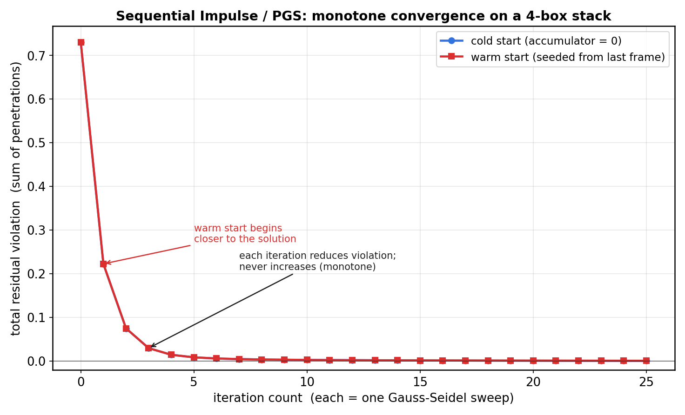
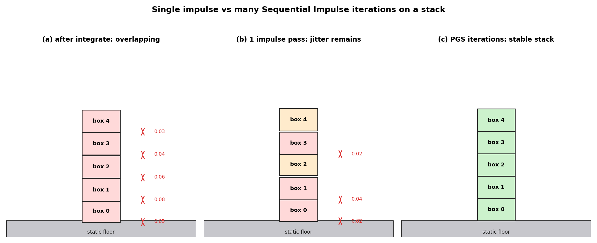
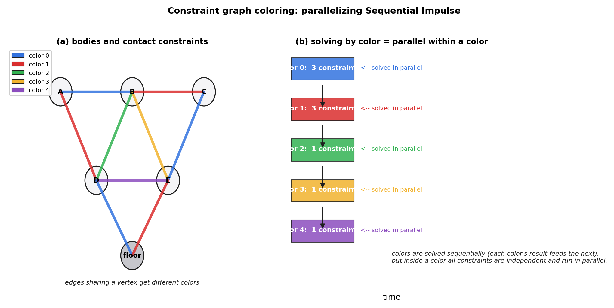

# 第 5 篇 · 第 16 章 · Sequential Impulse 约束求解

> **核心问题**:上一章(P5-15)我们解决了"一个接触点,碰后怎么用冲量改速度"——单点单约束,一次冲量就够了。可真实物理引擎面对的不是单点:一堆箱子叠在一起,每个箱子底下有 2 个接触点,几十个箱子、上百个接触约束**同时**要满足"不穿透"。你按下其中一个,整摞都要重新平衡。这时候**一次冲量解不了**——你修好 A 接触,B 接触又被挤穿了;你回头修 B,A 又穿了。怎么解?这就是本章的主题,**Erin Catto 的招牌算法——Sequential Impulse(顺序冲量法,又叫 PGS,Projected Gauss-Seidel)**:不要试图一次解出所有约束,而是**反复迭代**,每一轮按顺序依次修正每个违反的约束,多轮之后,所有约束一起收敛到满足——堆叠不穿透、不抖、不炸。**它的本质,是解一个线性互补问题(Linear Complementarity Problem, LCP)**。这是全书最难的一章,也是物理引擎的招牌。

> **读完本章你会明白**:
> 1. 为什么单次冲量解不了堆叠——约束之间会互相"踩",必须反复迭代。
> 2. **Sequential Impulse / PGS** 到底在做什么:按顺序逐个约束施加冲量、多轮迭代、单调收敛到满足所有约束;它的数学本质是**投影 Gauss-Seidel 解 MLCP**(混合线性互补问题)。
> 3. 为什么迭代**一定收敛**、为什么物体**真的不穿透**——不是巧合,是数值线性代数给的保证(承《数学分析》迭代法收敛)。
> 4. Box2D v3.2 把这个算法**工程化**成什么样:9 阶段(stage)流水线、**约束图着色并行**、**warm start**(上帧冲量做初值)、**soft constraint**(堆叠不抖)、**speculative contacts**(防高速穿透)。★SI 是算法,v3.2 是它的高性能并行实现,两者不矛盾。
> 5. 朴素的全局解法(显式解 LCP,Lemke 法, O(n³))为什么太贵,只能用迭代法。

> **如果一读觉得太难**:先只记住四件事——① Sequential Impulse = 一轮一轮、一个约束一个约束地施加冲量修正违反,多轮后所有约束都满足,堆叠不穿透;② 本质是 Gauss-Seidel 迭代解 LCP(一句话,指路《数学分析》);③ warm start 用上帧冲量加速、soft constraint 让堆叠不抖、speculative contacts 防高速穿透;④ Box2D v3.2 用**约束图着色**把"顺序"冲量并行化了。剩下的源码细节是讲"工程上怎么把它做得又快又稳",看不懂源码不影响你记住这四条。

---

## 〇、一句话点破

> **Sequential Impulse(SI)是 Erin Catto 给出的、物理引擎事实上的约束求解标准:不要妄想一次解出所有约束,而是像揉面一样,一轮一轮地把每个违反的约束轻轻按回去,多轮之后整团约束一起松弛下来,达到"都不违反"的平衡态。它在数学上就是投影 Gauss-Seidel( PGS )迭代解一个线性互补问题( LCP )——每一轮把冲量投影到"非负"这个约束上,保证物体只被推开不被拉穿。这种迭代法不精确(给的是近似解),但它**单调收敛**、**计算便宜**(O(约束数 × 迭代轮数))、**天然处理摩擦和不穿透这两个不等式**,这就是为什么从 Box2D 到 Bullet 到 PhysX 都用它。Box2D v3.2 进一步把它工程化成"9 阶段流水线 + 约束图着色并行 + warm start + soft constraint + speculative contacts"——SI 是灵魂,v3.2 是把这灵魂装进一个并行、稳定、不抖、不穿透的工程壳子里。**

这是结论。本章倒过来拆:先看为什么单次冲量在堆叠面前会崩溃,再讲透 SI 怎么一轮轮收敛,然后钉死它的 LCP 本质,最后上 Box2D v3.2 的源码看它怎么把这个算法跑得又快又稳。

---

## 一、接上一章:单次冲量在堆叠面前会崩溃

### 1.1 复盘:单接触的一次冲量

上一章(P5-15)讲的是**单接触点**怎么响应:两个物体在一个接触点处碰撞,我们沿接触法线方向施加一个冲量 `P = j·n`,瞬间改变它们的法向相对速度,让它们不再相互穿透。核心公式(质量 m、法向有效质量 `k = 1/mA + 1/mB + ...`):

```
   j = -(1 + e) · vn / k           ← 法向冲量大小 (vn 是法向相对速度, e 是恢复系数)
   vA' = vA - (j/mA) · n
   vB' = vB + (j/mB) · n
```

这一招对**一个孤立接触**是完美的:算一次冲量,改一次速度,完事。小球撞地、两球对撞,都是它。

> **钉死这件事**:单接触求解 = 算一次冲量、改一次速度,把"这一对物体在这一点的法向相对速度"调成想要的样子(不穿透 + 按恢复系数弹开)。**一个约束、一次求解,没有迭代**。

### 1.2 灾难开始:两个接触,互相踩

现在把场景换成最简单的"堆叠":**一个箱子摞在地面上,上面再压一个箱子**。三个物体:地面(静态)、下箱 A、上箱 B。两个接触:A-地面接触(2 个接触点)、B-A 接触(2 个接触点)。

假设积分后,两个接触都有微小穿透(数值误差、重力把它压下去了一点)。我们用上一章的办法,**每个接触独立算一次冲量**:

```
   朴素做法 (每个接触独立解一次):
   ① 解 A-地面接触: 给 A 一个向上冲量, 把 A 往上推
   ② 解 B-A 接触:    给 B 一个向上冲量、给 A 一个向下冲量(反作用)
```

发现问题了吗?**步骤 ① 把 A 往上推,步骤 ② 又把 A 往下推**。A 收到两个方向相反的冲量,它的最终速度取决于谁后算——而两个接触是**同时存在**的,不该有先后。更糟的是:步骤 ② 改了 A 的速度之后,A-地面接触的违反量**又变了**——你刚算好的 A-地面冲量已经过时。

```
   独立解一次的结果:
   - A 被两个接触来回拉扯, 速度忽上忽下
   - 修好 A-地面, B-A 又被破坏; 修好 B-A, A-地面又被破坏
   - 最终: 谁也没真修好, 穿透残留、抖动
```

这就是单次冲量在多约束面前崩溃的根:**约束之间互相耦合(共享物体),独立解一次等于无视耦合,结果互相破坏**。

> **不这样会怎样**:如果坚持每个接触独立解一次(无视耦合),一堆箱子里每个箱子都被上下两个接触来回拉,速度在每帧之间剧烈震荡,肉眼看到的就是**箱子堆在抖、慢慢陷进地里、或者突然弹飞**。这就是 2000 年代初很多简陋物理引擎的样子,也是为什么 Erin Catto 要发明 Sequential Impulse。

### 1.3 灾难升级:一摞箱子,几十个接触

把场景换成**一摞 10 个箱子**叠在地面上:11 个接触(10 个箱-箱 + 10 个箱-地接触,每个 2 点,共 22 个接触约束)。每个箱子和上下两个邻居耦合,形成一个**链条状的耦合系统**。

这时候不光是"独立解一次会抖"了,而是**你怎么同时让这 22 个约束都满足?** 你按下最上面那个箱子,冲量要沿着箱子链一路传到地面,中间每个接触都要分担一份。这不是 22 个独立的小问题,这是**一个 22 维的耦合线性系统**(还得带"冲量非负"和"摩擦锥"这些不等式)。

朴素直觉:**那就解一个大线性方程组呗**?——对,但有两个坑:

1. **不是普通方程组,是带不等式的互补问题(LCP)**。法向冲量必须 ≥ 0(接触只能推不能拉),摩擦冲量有上限(库仑摩擦锥 `|f| ≤ μ·n`)。这些不等式让问题从"解 Ax=b"变成"解 LCP":找一组冲量 `λ ≥ 0`,使得 `λ · w(λ) = 0`(互补条件:要么冲量为 0、要么违反量为 0)。
2. **每帧都要解,必须快**。60 帧每秒,每帧几千个约束,你得在 16ms 内算完。精确解 LCP 的经典算法(Lemke 法、Dantzig 法)是 **O(n³)**——n=1000 个约束就是 10⁹ 次运算,光解约束就卡死,根本没法实时。

这两个坑逼出了一个妥协:**不要精确解,迭代近似解**。这就是 Sequential Impulse。

> **钉死这件事**:多约束耦合的本质是"一个带不等式的大线性系统(LCP/MLCP)",精确解太贵(O(n³)),实时物理引擎只能用**迭代法**近似解——Sequential Impulse / PGS 就是这样的迭代法。它不追求一次解对,而是一轮轮逼近,在有限的迭代轮数(通常 4~20 轮)内把违反量压到肉眼看不见。

---

## 二、Sequential Impulse:一轮一轮地揉

### 2.1 揉面的比喻(一次性,不讲透不算数)

在正式上数学之前,先给一个**只此一次**的直觉比喻。把"多约束耦合"想成一团**揉面**:面团上有很多地方鼓起来(约束违反、穿透)。你不能只按一处(按下去别处鼓得更厉害),也不能一次性整团压平(精确解 LCP 太贵)。你能做的是:**一轮一轮地揉**——每轮依次按一遍每个鼓包,每个鼓包都轻轻按回原位;按完一遍,面团因为别处的张力又微微鼓起来一点,但比上轮小;再按一遍、再按一遍……几轮之后,整团面就平了。这就是 Sequential Impulse 的全部直觉。

> **钉死这件事**:SI 的核心思想 = **不要一次解,反复迭代;每轮按顺序逐个约束修正,多轮后整团收敛**。"揉面"是直觉,数学是下一节的 Gauss-Seidel。

### 2.2 一个约束的求解长什么样:增量冲量

先把单个约束的求解写成"增量"形式,这是 SI 迭代的原子操作。对一个接触约束 j,设:

- `vn` = 当前法向相对速度(沿法线 n),
- `k` = 法向有效质量(`k = 1/mA + 1/mB + (rA×n)²/IA + (rB×n)²/IB`),
- `λ_old` = 这一步**已经累积**的法向冲量(上几轮 SI 加上去的),
- `bias` = 位置纠正项(把穿透一点点推回去,后面讲)。

这一轮要加的**增量冲量** `dλ` 是:

```
   dλ = -k · (vn + bias)                     ← 目标: 让 vn + bias 趋于 0
   λ_new = max(0, λ_old + dλ)                ← 投影: 冲量非负 (不穿透约束的互补性)
   dλ = λ_new - λ_old                        ← 实际施加的增量 (可能被截断到 0)
   vA -= (dλ/mA) · n ;  vB += (dλ/mB) · n    ← 立刻把增量应用到速度上
```

注意三件事:

1. **用的是增量 `dλ`,不是绝对冲量**。每轮只算"这一轮还要补多少冲量",加到累积量 `λ` 上。
2. **投影到 ≥ 0**:`max(0, λ_old + dλ)`。这就是 LCP 里"冲量非负"的投影——接触只能推、不能拉。这是 SI 天然处理不穿透约束的关键,下一节细讲。
3. **立刻应用**。算完 `dλ` 立刻改 `vA`、`vB`。下一个约束看到的,就是已经更新过的速度——这就是"Gauss-Seidel"而不是"Jacobi"(区别见下)。

### 2.3 一轮 SI:按顺序逐个约束施加增量冲量

一轮 Sequential Impulse 就是:**对所有约束,按某个顺序,依次执行上面那个"增量冲量 + 立刻应用"**。用伪代码:

```
   一轮 Sequential Impulse:
   for 每个约束 j (按顺序):         # 接触约束 + 关节约束
       vn = 算当前法向相对速度 (用的是【最新】的速度)
       dλ = -kj · (vn + biasj)
       λj_new = max(0, λj_old + dλ)        # 法向: 非负投影
       dλ = λj_new - λj_old
       立刻更新 vA, vB, wA, wB              # 关键: 下一个约束看到的就是更新后的速度
       # 摩擦约束类似, 只是投影到 [-μ·λn, +μ·λn] 这个区间
```

一轮下来,每个约束都被"按"了一次。但因为约束耦合,你修了后面的约束,前面的又违反了一点。

### 2.4 多轮迭代:收敛

那就再来一轮。**第二轮从头再扫一遍所有约束,每个约束用最新速度再算一次增量冲量、再应用**。因为第一轮已经把大部分违反量按下去了,第二轮看到的违反量更小,增量冲量也更小。一轮一轮下去,违反量**单调下降**,最终收敛到一个"所有约束都不再违反"的固定点——这就是 SI 的解。



这张图是用 numpy 模拟一个 4 箱垂直堆叠(5 个接触约束)的 SI 迭代,横轴是迭代轮数,纵轴是总违反量(所有接触穿透深度之和)。可以清楚看到:**违反量每轮都在降,永不回升(单调收敛)**;迭代 10~15 轮就基本归零;warm start(下一节讲)从更靠近解的初值出发,起步就更低、收敛更快。

> **钉死这件事**:SI = **多轮 × 逐约束增量冲量求解**。每一轮把每个约束按一次,违反量每轮减少;多轮后所有约束一起收敛到满足。这不是"精确解",是迭代近似解——但收敛快(通常 4~20 轮够用)、每轮便宜(O(约束数))、天然处理非负和摩擦锥这些不等式。

### 2.5 一张图看清"一轮 vs 多轮"

直觉地看堆叠场景,为什么一轮不够、要多轮:



- **(a) 积分后**:重力把箱子们压下去,每个接触都有微小穿透(红色双箭头标出穿透深度)。
- **(b) 一次冲量后**(独立解一次,或 SI 只跑 1 轮):大部分穿透被修掉,但残留违反 + 速度抖动——上一节说的"约束互相踩"。
- **(c) 多轮 PGS 迭代后**:箱子稳定堆叠,穿透归零、速度归零,不抖。

这就是 SI 之所以叫 "Sequential"(顺序)**Impulse**(冲量)的全部:顺序地、一轮轮地施加冲量,直到稳定。

---

## 三、为什么 SI 一定收敛、为什么物体真的不穿透

这一节回答两个最关键的问题——**为什么这个迭代不会发散?为什么物体真的不穿到地里去?** 答案都在数值线性代数里,直接承接你读过的《数学分析》。

### 3.1 SI 就是投影 Gauss-Seidel( PGS )解 MLCP

把所有约束的"法向冲量非负 + 摩擦冲量有界"写在一起,加上"冲量做功 = 速度变化"的动力学关系,整个系统是一个**混合线性互补问题(Mixed Linear Complementarity Problem, MLCP)**:

```
   求 λ (所有约束的冲量向量), 满足:
     w(λ) = b - A · λ          (A 是有效质量矩阵, b 是速度违反向量)
     λ ≥ 0  且  λ_i · w_i(λ) = 0  for 非穿透约束   (互补条件)
     |摩擦冲量| ≤ μ · 法向冲量                    (库仑摩擦锥)
```

其中 `A` 是一个**对称正定**的大稀疏矩阵(对角块是各约束的有效质量,非对角块是约束间通过共享物体的耦合)。`b` 是当前的"目标速度违反"(重力等造成的法向速度 + 位置纠正 bias)。

**Sequential Impulse 在数学上,就是用投影 Gauss-Seidel 迭代法解这个 MLCP**:

- **Gauss-Seidel**:解线性系统 `Aλ = b` 的经典迭代法。每次更新第 i 个分量时,**用已经更新过的最新分量**(不像 Jacobi 用旧分量)。这正好对应 SI 里"下一个约束看到的是最新速度"。
- **投影(Projected)**:每步更新完 `λ_i` 之后,把它**投影回可行域**——法向冲量投影到 `[0, ∞)`、摩擦冲量投影到 `[-μλn, +μλn]`。这就是 SI 里那个 `max(0, λ_old + dλ)` 和摩擦 clamp。

> **承接书讲过**:解线性系统的迭代法(Gauss-Seidel、Jacobi、SOR)、它们的**收敛性**(对称正定矩阵 Gauss-Seidel 必收敛),是《数学分析》"数值线性代数 / 迭代法"那章的标准内容——见《数学分析》迭代法收敛性([[math-analysis-series]])。我们一句带过原理,这里只讲**它怎么落在物理引擎上**:SI 的"投影"是为了满足"冲量非负"这个不等式(普通 Gauss-Seidel 不投影,因为它解的是无约束方程组),投影版 PGS 解的是 LCP,不是普通方程组。

### 3.2 为什么一定收敛:A 是对称正定

Gauss-Seidel 解 `Aλ = b`,当 `A` **对称正定**时**必收敛**——这是数值线性代数的经典结论,不需要在这里证(指路《数学分析》)。

物理引擎里的有效质量矩阵 `A` **恰好就是对称正定的**:`A_ii` = 约束 i 的有效质量(>0,只要不是两个无穷质量的物体),`A_ij` = 约束 i 和 j 通过共享物体的耦合(对称),整个矩阵的二次型 `λᵀAλ` 就是"施加冲量 λ 产生的动能",物理上恒正。所以 **PGS 解它,必收敛**——这就是 SI 不会发散的数学保证。

> **钉死这件事**:**SI 收敛,不是经验现象,是数值线性代数给的硬保证**:被解的矩阵 `A`(有效质量)对称正定,投影 Gauss-Seidel 对称正定必收敛。物理上,这个"对称正定"对应"冲量做正功产生正动能"——物理能量守恒的直接推论。

### 3.3 为什么物体真的不穿透:互补条件 + bias

收敛保证了 SI 不会发散,但"不穿透"是另一件事——收敛到一个"还穿透 5 厘米"的解也不行。这里有两条机制:

**① 互补条件 `λ · w = 0` 保证"要么没接触、要么没穿透"**。LCP 的互补条件说:法向冲量 λ 和"约束违反 w"(法向相对速度)不能同时大于 0。意思是:

- 如果两个物体**在分离**(w < 0,相对速度沿法线分开),那 λ = 0(不需要冲量,它们本就分开);
- 如果两个物体**在穿透**(w > 0,相对速度沿法线挤压),那必须有 λ > 0(施加正冲量把它们推开)。

这个互补性,是 SI 每步投影 `max(0, ...)` 自然实现的:推得动就推(λ > 0),推不动或本就分开就 λ = 0。**结果就是:接触要么分开(λ=0)、要么被冲量推开到不穿透(w=0)**。

**② 位置纠正 bias 保证"已有的穿透也会被慢慢推回去"**。光靠速度互补只能保证"速度上不继续穿透",但积分时物体可能已经陷进地里一点(数值误差、CCD 截断)。SI 在冲量公式里加一个 `bias` 项,把"当前穿透深度"转换成一个目标速度,让冲量不仅消除相对速度、还额外推一把把穿透推回去:

```
   dλ = -k · (vn + bias), 其中 bias = β · (穿透深度) / h
   (β 是位置纠正比例, 0~1, 通常 0.2 左右, 避免一次推过头)
```

这个 `bias` 让物体**每帧把穿透量减少一个比例**(几何衰减),几帧后穿透就归零。Box2D v3.2 把它做成了 **soft constraint**(下一节细讲),用 hertz/阻尼比参数化,堆叠不抖。

> **钉死这件事**:**不穿透 = 互补条件(速度上不继续穿) + bias(把已有穿透推回去)**。前者是 LCP 的数学结构,后者是工程加的一个软纠正项。两者一起,保证 SI 收敛到的解**真的不穿透**(残差小于肉眼/数值精度)。

### 3.4 MLCP 的矩阵形式(为了把 SI 钉死)

为了不留含糊,把整个 MLCP 写成矩阵形式。设场景里有 n 个接触约束(每个带 1 个法向 + 1 个切向冲量),m 个物体。定义:

- `v ∈ R^m`:所有物体的(广义)速度向量(线速度 + 角速度拼起来)。
- `M ∈ R^(m×m)`:质量矩阵,对角块(每个物体的 mass + inertia)。
- `J ∈ R^(n×m)`:Jacobian 矩阵,每行是一个约束的速度 Jacobian(把物体速度映射到"约束违反速度")。`Jv` 就是所有约束的当前违反速度向量。
- `λ ∈ R^n`:所有约束的冲量向量(要解的未知数)。
- `ζ`(zeta):位置纠正 bias 向量(把穿透转成目标速度)。

动力学关系(冲量改变速度):`v_new = v_old + M⁻¹ · Jᵀ · λ`。把它代进"约束目标速度 = bias"(`J·v_new + ζ ≥ 0`,互补于 `λ ≥ 0`),整理得:

```
   求 λ ≥ 0, 使得:
     w = J·M⁻¹·Jᵀ·λ + (J·v_old + ζ) ≥ 0
     λ ⊥ w   (即 λ_i · w_i = 0)
```

这里 `A = J·M⁻¹·Jᵀ` 就是**有效质量矩阵**——它就是 3.2 节说的"对称正定"的那个 A。它的物理意义:施加单位冲量 λ,产生的约束违反速度变化。`A_ii` 是约束 i 自己的有效质量(>0),`A_ij` 是约束 i 和 j 通过共享物体的耦合(对称)。

**SI 一步 = 对这个系统做一次投影 Gauss-Seidel 迭代**:固定其他 λ,解第 i 个分量的"一维 LCP"(`max(0, ...)` 那一行),立刻把 `λ_i` 的贡献写回速度(等价于更新 `v` 让后续约束看到)。多轮迭代 = 多次 Gauss-Seidel 扫描。这就是 SI 的完整数学画像。

> **钉死这件事**:SI 解的 MLCP 长这样:`A = J·M⁻¹·Jᵀ` 对称正定,求 `λ ≥ 0` 且 `λ ⊥ (Aλ + b)`。投影 Gauss-Seidel 是它的标准迭代解法,对称正定保证收敛。这是物理引擎约束求解的"标准像",所有 2D/3D 引擎(Box2D、Bullet、PhysX、ODE)的接触求解都是它的实例。

---

## 四、warm start、soft constraint、speculative contacts:三个让 SI 又快又稳的工程加料

讲透 SI 本质之后,我们看物理引擎**实际**用了什么。Box2D v3.2 在纯 SI 之上叠了三个工程加料,分别解决三个不同的毛病。这是本章技巧最密集的部分。

### 4.1 warm start:用上帧冲量做初值,加速收敛

**问题**:SI 是迭代法,初值离解越近、收敛越快。可每一帧都从 `λ = 0` 开始迭代,要跑很多轮才收敛。问题是:物理是**时间连贯**的——这一帧的接触冲量和上一帧的**通常差不多**(箱子堆在那里,每帧的支撑冲量几乎不变)。把这个信息用上!

**做法**:每帧 SI 开始前,把上一帧存储的累积冲量 `λ_last` 作为这一帧的初值,**直接施加一遍**(warm start),相当于"假设这一帧的冲量等于上一帧的",然后才开始正常迭代修正偏差。

```
   warm start:
   for 每个约束 j:
       dλ = λj_last              (上一帧存的累积冲量)
       立刻应用到 vA, vB          (相当于预先把上一帧的支撑冲量加上)
   然后: 正常 SI 迭代 (从已经 warm 过的速度出发)
```

**效果**:堆叠场景里,warm start 让 SI **一上来就几乎在解上**,迭代只需要修正微小扰动,收敛轮数大幅减少。Box2D 里有个开关 `world->enableWarmStarting`([contact_solver.c](../box2d/src/contact_solver.c#L44) 里 `warmStartScale = enableWarmStarting ? 1.0f : 0.0f`),默认开。

> **钉死这件事**:warm start = **用上一帧的冲量做这一帧的初值**,利用时间连贯性,把 SI 的起点拉近解,大幅加速收敛。这是迭代法 + 时间连贯场景的标准优化,不增加误差,只减少计算。

### 4.2 soft constraint:把刚性冲量换成软弹簧,堆叠不抖

**问题**:堆叠场景有个老毛病——**抖动**。原因:SI 把每个接触当成**完全刚性**的(冲量瞬间把法向速度清零 + bias 一次性推回穿透)。可一堆箱子叠在一起,刚性冲量会在物体间来回反射(下面箱子推上面、上面反推下面),产生高频振荡,肉眼就是箱子在微微抖。更糟的是,如果 bias 太大,一帧把穿透全推回去,会推过头(box A 被推到 box B 上面,下一帧 B 又把 A 顶回来,振荡)。

**做法**:把"刚性冲量"换成**有刚度(hertz)和阻尼比(damping ratio)的软弹簧**。这样接触约束不再是"瞬间清零",而是"像一个弹簧阻尼系统,按指数衰减把穿透推回去",平滑、不振荡。这就是 **soft constraint**。

Box2D v3.2 用一个 `b2Softness` 结构体([solver.h:239](../box2d/src/solver.h#L239) 的 `b2MakeSoft`)把 hertz、阻尼比、子步步长 `h` 算成三个系数:

```c
// solver.h:239 (简化, 非源码逐字)
static inline b2Softness b2MakeSoft( float hertz, float zeta, float h )
{
    float omega = 2.0f * B2_PI * hertz;
    float a1 = 2.0f * zeta + h * omega;
    float a2 = h * omega * a1;
    float a3 = 1.0f / ( 1.0f + a2 );
    return (b2Softness){
        .biasRate     = omega / a1,    // 位置纠正速率 (取代刚性 bias)
        .massScale    = a2 * a3,       // 缩放有效质量 (软化刚度)
        .impulseScale = a3,            // 缩放累积冲量 (阻尼)
    };
}
```

这三个系数 `massScale / biasRate / impulseScale` 在求解时替换掉刚性的 `k` 和 `bias`([contact_solver.c:283-314](../box2d/src/contact_solver.c#L283-L314)):

```c
// contact_solver.c:310-323 (核心, 简化展示)
if ( s > 0.0f ) {
    velocityBias = s * inv_h;                          // speculative (见 4.3)
} else if ( useBias ) {
    velocityBias = b2MaxFloat( softness.massScale * softness.biasRate * s, -contactSpeed );
    massScale    = softness.massScale;
    impulseScale = softness.impulseScale;
}
// 增量冲量公式里替换:
float impulse = -cp->normalMass * ( massScale * vn + velocityBias ) - impulseScale * cp->normalImpulse;
```

注意最后一项 `- impulseScale * cp->normalImpulse`——这是软约束的关键:它把**累积冲量的一部分**反馈回来(像阻尼),让冲量不是瞬间冲击而是指数趋近,这就是"软"。注释还点出一个不变量:**`massScale + impulseScale == 1`**(能量在"刚度"和"阻尼"之间分配,守恒)。

**配置**:`b2World_Step` 里默认接触用 `b2MakeSoft(contactHertz, dampingRatio, h)`,**静态接触更硬**——`b2MakeSoft(2.0f * contactHertz, ...)`([physics_world.c:913-914](../box2d/src/physics_world.c#L913-L914))。静态接触(箱子-地面)用 2 倍 hertz 是因为"避免物体被推穿地面",需要更硬。

> **钉死这件事**:soft constraint = **把刚性冲量(瞬间清零 + 一次性推回)换成有 hertz/阻尼比的软弹簧阻尼系统**,冲量按指数趋近、bias 按阻尼速率推回穿透。这是堆叠不抖的关键。它属于 **TGS(Transient Gauss-Seidel)** 风味——把约束求解和动力学积分耦合,像积分一个弹簧系统,而不是 PGS 的纯代数投影。

### 4.3 speculative contacts:用未来速度预判,防高速穿透

**问题**:SI 是基于**当前**速度算冲量的。可如果物体这一帧速度很快(子弹),积分一步位移很大,这一步结束时它可能已经**穿过**另一物体了(经典的 tunneling 穿墙问题,P5-18 CCD 详讲)。SI 看到的"当前速度"是这一帧已经穿过去之后的速度,补救不及。

**做法**:**speculative contacts(推测接触)**——在算接触约束时,不只看"现在穿没穿",还**用未来一帧的相对速度预判"会不会穿"**。如果当前还没穿(s > 0,有间隙),但按当前速度下一帧会穿,就**提前施加冲量把它挡住**。

Box2D v3.2 在接触求解里这样实现([contact_solver.c:305-309](../box2d/src/contact_solver.c#L305-L309) 标量路径;SIMD 宽路径在 [1924-1931](../box2d/src/contact_solver.c#L1924-L1931)):

```c
// contact_solver.c:305-309 (标量路径, 简化)
float velocityBias = 0.0f;
if ( s > 0.0f )                    // s 是当前分离量 (>0 表示还没穿, 有间隙)
{
    velocityBias = s * inv_h;       // speculative: 把"未来一帧会穿"转成目标速度
}
```

`velocityBias = s * inv_h` 的意思是:**这个间隙 s,要在这一步 h 内闭合掉,所以目标法向速度是 s/h**(沿法线接近的速度要被冲量清零)。这样就算当前还没穿,只要速度方向是"要穿进去",冲量就提前把它刹住,物体在间隙边缘就被弹开/停下,不会真穿过去。

这是 Box2D v3.2 CCD(连续碰撞检测)体系的一半——另一半是 **mover 系统**(扫掠胶囊,P5-18 讲)。speculative 是"用速度预判、提前施加冲量",mover 是"几何上扫过位移、精确找碰撞时刻",两者配合防穿透。

> **钉死这件事**:speculative contacts = **用未来一帧的相对速度预判会不会穿,提前施加冲量把"要穿"的接触挡在间隙边缘**。它把"基于当前速度"的 SI 升级成"基于预测速度",是高速物体不 tunnel 的第一道防线。P5-18 CCD 会和 mover 系统合起来讲完整故事。

### 4.4 三个加料各管什么:一张对照

| 加料 | 解决的问题 | 怎么做 | 代价 |
|------|------------|--------|------|
| **warm start** | SI 每帧从零开始、收敛慢 | 用上帧冲量做初值,预施加一遍 | 多存一份冲量 + 预施加 O(约束) |
| **soft constraint** | 刚性冲量让堆叠抖动 | hertz/阻尼比软化刚度,指数趋近 | 引入小延迟(弹簧阻尼固有) |
| **speculative contacts** | 高速物体一步穿墙 | 用未来速度预判,提前施加冲量 | 可能误判(低速时也预测),需阈值 |

> **钉死这件事**:这三个加料,不是 SI 算法本身(那是 PGS 解 LCP),而是**工程上把 SI 做得又快(warm start)、又稳不抖(soft)、又不穿透(speculative)**的工程壳。理解了 SI 本质 + 这三个加料,你就理解了现代物理引擎约束求解的全貌。

---

## 五、Box2D v3.2 的真实实现:9 阶段流水线 + 约束图着色并行

讲透了 SI 算法和三个加料,现在上源码。Box2D v3.2 把这一切组织成一个**分阶段(stage)并行流水线**,这是它相比早期 v3 最大的演进——**把"顺序"冲量并行化了**。

### 5.1 入口与子步进

入口是公共 C API:`b2World_Step(worldId, timeStep, subStepCount)`,[physics_world.c:828](../box2d/src/physics_world.c#L828)。关键一步([physics_world.c:893-899](../box2d/src/physics_world.c#L893-L899)):

```c
context.subStepCount = b2MaxInt( 1, subStepCount );
context.h = timeStep / context.subStepCount;     // 子步步长 (积分真正用的)
```

用户传一个 `timeStep`(比如 1/60 秒)和 `subStepCount`(比如 4),内部把这一步切成 `subStepCount` 个子步,每个子步步长 `h = timeStep / subStepCount`(1/240 秒)。**约束求解在每个子步里都完整跑一遍**——这是 v3.2 的**子步进软约束求解器**:子步越多,soft constraint 的 hertz 可以设得越高(更硬更精确),堆叠越稳,代价是算得越多。这是 SI 在时间维度上的"细化",和上一节的空间维度加料(warm/soft/speculative)是正交的两条线。

然后调真正的求解器 `b2Solve(world, &context)`,[solver.c:1272](../box2d/src/solver.c#L1272)。

### 5.2 b2Solve 的 9 阶段

`b2Solve` 把一个时间步的工作分成**9 个阶段**(`b2SolverStageType` 枚举,[solver.h:77-86](../box2d/src/solver.h#L77-L86),逐行已核):

```c
// solver.h:75-86 (源码逐字)
typedef enum b2SolverStageType
{
    b2_stagePrepareJoints,         // 0. 准备关节约束 (算有效质量)
    b2_stagePrepareContacts,       // 1. 准备接触约束 (算 effective mass / bias / softness)
    b2_stageIntegrateVelocities,   // 2. 积分速度: v += h*a (半隐式欧拉, P2-07)
    b2_stageWarmStart,             // 3. warm start (用上步累积冲量)
    b2_stageSolve,                 // 4. ★顺序/并行解约束 (SI 主体, useBias=true)
    b2_stageIntegratePositions,    // 5. 积分位置: x += h*v
    b2_stageRelax,                 // 6. relax (TGS 尾调, useBias=false)
    b2_stageRestitution,           // 7. 恢复系数 (反弹后处理)
    b2_stageStoreImpulses          // 8. 存累积冲量 (供下帧 warm start)
} b2SolverStageType;
```

阶段顺序在 [solver.c:1039-1050](../box2d/src/solver.c#L1039-L1050) 的注释里写得清清楚楚。9 个阶段的逻辑分组:

- **一次性准备**:`PrepareJoints` + `PrepareContacts`(算每个约束的有效质量、bias、softness)。
- **每个子步循环**(共 subStepCount 次):`IntegrateVelocities` → `WarmStart` → **`Solve` × ITERATIONS × 每种颜色** → `IntegratePositions` → `Relax × RELAX_ITERATIONS × 每种颜色`。
- **一次性收尾**:`Restitution` + `StoreImpulses`。

![b2Solve 的 9 阶段流水线:PrepareJoints/PrepareContacts 跑一次;子步循环里 IntegrateVelocities→WarmStart→[Solve×迭代×颜色]→IntegratePositions→Relax;Restitution 和 StoreImpulses 收尾](images/fig-p5_16-01-stages.png)

> **钉死这件事**:Box2D v3.2 的一个时间步 = 9 个阶段;其中 **Solve 阶段才是真正的 SI 迭代主体**(其他阶段是准备、积分、收尾)。Solve 和 Relax 都嵌在**子步循环 + 颜色循环 + 迭代循环**三重循环里(见 5.4)。这就是"顺序冲量"在 v3.2 里的工程形态:不是一个简单的 for 循环,是一条分阶段、可并行的流水线。

### 5.3 三重循环:子步 × 颜色 × 迭代

最关键的结构在 [solver.c:1081-1157](../box2d/src/solver.c#L1081-L1157)。我把核心循环抽出来(简化展示):

```c
// solver.c:1081 (核心结构, 简化)
for ( int subStepIndex = 0; subStepIndex < subStepCount; ++subStepIndex )    // 子步循环
{
    // IntegrateVelocities (一次, 并行 across bodies)
    b2ExecuteMainStage( ... b2_stageIntegrateVelocities ... );

    // WarmStart (每种颜色一次)
    for ( int colorIndex = 0; colorIndex < activeColorCount; ++colorIndex )
        b2ExecuteMainStage( ... b2_stageWarmStart ... );

    // Solve (ITERATIONS 轮 × 每种颜色)   ← SI 主体
    for ( int j = 0; j < ITERATIONS; ++j )
        for ( int colorIndex = 0; colorIndex < activeColorCount; ++colorIndex )
            b2ExecuteMainStage( ... b2_stageSolve ... );

    // IntegratePositions (一次)
    b2ExecuteMainStage( ... b2_stageIntegratePositions ... );

    // Relax (RELAX_ITERATIONS 轮 × 每种颜色, useBias=false)
    for ( int j = 0; j < RELAX_ITERATIONS; ++j )
        for ( int colorIndex = 0; colorIndex < activeColorCount; ++colorIndex )
            b2ExecuteMainStage( ... b2_stageRelax ... );
}
```

三个循环嵌套:

1. **子步循环**(最外):`subStepCount` 次。每个子步重新积分速度、warm start、solve、积分位置、relax。子步越多越精确(soft constraint 可以更硬)。
2. **迭代循环**:`Solve` 跑 `ITERATIONS` 轮(默认 1,见 `#define ITERATIONS 1` [solver.c:29](../box2d/src/solver.c#L29)),`Relax` 跑 `RELAX_ITERATIONS` 轮(也 1)。这看起来很少——但**因为子步循环已经提供了大量迭代机会**(每子步都 solve + relax),加上 warm start,总迭代量足够收敛。这是 v3.2 相比老 Box2D "一次性迭代很多轮"的设计变化:**用子步进代替大迭代数**,更稳、更适合 soft constraint。
3. **颜色循环**:每种颜色(`activeColorCount` 个)单独 solve/relax 一次。这就是约束图着色并行——同色的约束互不耦合,可以并行解。

> **钉死这件事(★v3.2 演进,修正印象)**:老资料(包括总纲默认印象)讲 Box2D 的 SI 是"一个循环跑 8~20 轮迭代"。**v3.2 不是这样**:它把迭代拆进了**子步循环 + 颜色循环 + 每子步 ITERATIONS 轮(默认 1)**,并且 solve 之后还多了一个 **relax 阶段**(`useBias=false` 的二次求解,只清速度、不做位置纠正,这是 TGS 风味的"速度松弛")。这是 SI 的工程演进,概念不变(还是 PGS 解 LCP),但实现形态完全不同。

### 5.4 约束图着色:把"顺序"冲量并行化 ★v3.2 招牌

SI 名字里有 "Sequential"(顺序)——按顺序逐个解约束。可现代 CPU 有几十个核,"顺序"太浪费了。**v3.2 的招牌工程优化:约束图着色,把"顺序"变成"分批并行"**。

#### 思想:着色 = 把互不冲突的约束分到同一批

把每个约束当成图的一个**节点**;如果两个约束**共享某个物体**(耦合),就在它们之间连一条**边**(它们不能同时解,否则会争抢这个物体的速度)。然后对这个图做**着色**:相邻节点(有边的约束)必须不同色,不相邻的可以同色。

着色之后:**同色的约束互不共享物体,可以放心并行解**(它们改的是不同物体的速度,不会竞争)。颜色之间是顺序的(颜色 A 解完、把更新后的速度交给颜色 B),但颜色**内部**是并行的。这就是把"顺序 SI"并行化的核心。



#### Box2D 的实现:24 种颜色 + overflow 兜底

Box2D v3.2 的约束图在 `src/constraint_graph.c`,着色逻辑在 [constraint_graph.c:66-138](../box2d/src/constraint_graph.c#L66-L138) 的 `b2AddContactToGraph`。关键事实(逐行已核):

- **`B2_GRAPH_COLOR_COUNT = 24`**([include/box2d/constants.h:29](../box2d/include/box2d/constants.h#L29)):共 24 种颜色。其中 `B2_OVERFLOW_INDEX = 23`(最后一个)是**溢出颜色**;前 23 个里,`B2_DYNAMIC_COLOR_COUNT = 20`(前 20 个)专给 dynamic-dynamic 接触,后 3 个(21~22,加上溢出前的几个)给 dynamic-static 接触(注释 [constraint_graph.h:22-24](../box2d/src/constraint_graph.h#L22-L24) 说这是为了让 dyn-static 约束优先级高于 dyn-dyn,减少 push-through 穿透)。
- **贪心着色**:`b2AddContactToGraph` 里,新接触来时,从颜色 0(或从末尾,看类型)开始扫,找到第一个"两个物体都没被这色占用"的颜色,把两个物体标记进这个颜色的 `bodySet`(位图),完成着色([constraint_graph.c:84-134](../box2d/src/constraint_graph.c#L84-L134))。
- **溢出兜底**:如果一个 dynamic 物体同时接触太多别的物体(比如一堆沙子压在一个箱子上),24 种颜色都满了——这个接触被丢进 **`B2_OVERFLOW_INDEX`** 溢出色,用**串行**兜底路径单独解(`b2PrepareContacts_Overflow` [contact_solver.c:24](../box2d/src/contact_solver.c#L24)、`b2WarmStartContacts_Overflow` [162](../box2d/src/contact_solver.c#L162)、`b2SolveContacts_Overflow` 等,在 [solver.c:1074-1075](../box2d/src/solver.c#L1074-L1075) 和 [1116-1117](../box2d/src/solver.c#L1116-L1117) 被调用)。溢出约束优先级低(注释 [solver.c:1115](../box2d/src/solver.c#L1115) "Overflow constraints have lower priority")。
- **求解器分块**:`b2SolverBlock`([solver.h:98-105](../box2d/src/solver.h#L98-L105))带一个 `colorIndex` 字段,告诉并行任务"这个块属于哪种颜色";工作线程用 **CAS 原子地认领块**(`b2ExecuteStage` [solver.c:933-969](../box2d/src/solver.c#L933-L969)),实现无锁并行。块的注释开头([solver.c:1-47](../box2d/src/solver.c#L1-L47))详细说了这个设计的三个性能考量:**分布式竞争**(每块独立原子计数,避免单一计数器的 cache stampede)、**跨迭代单调 syncIndex**(迭代阶段复用同一块数组,syncIndex 单调增)、**L2 亲和**(工作线程跨迭代重用同一块范围,保持热数据在 L2)。

> **钉死这件事(★v3.2 招牌)**:**约束图着色把 Sequential Impulse 并行化**:共享物体的约束着不同色(顺序),同色约束不共享物体(并行)。Box2D v3.2 用 24 色 + 贪心着色 + overflow 串行兜底,把"顺序冲量"塞进多核并行流水线。这是 v3.2 相比早期 v3 / 老资料讲的"单线程 SI"最大的工程演进——**算法不变(还是 PGS 解 LCP),并行度大增**。

### 5.5 主求解任务:b2SolverTask 的 worker-orchestrator 模型

整个 9 阶段流水线的驱动在 [solver.c:1007](../box2d/src/solver.c#L1007) 的 `b2SolverTask`。它用一个 **worker 0 当编排者(orchestrator)、其他 worker 当执行者**的模型:

- **worker 0**(`workerIndex == 0`)赢一个 CAS(`mainClaimed`, [solver.c:1023](../box2d/src/solver.c#L1023))后,变成编排者:**串行地**按阶段顺序调用 `b2ExecuteMainStage`,每个阶段把任务派发给其他 worker(通过原子 `atomicSyncBits`,高 16 位是 syncIndex、低 16 位是 stageIndex),然后 spin 等所有块完成(`completionCount`),再进下一阶段。
- **其他 worker**([solver.c:1198-1250](../box2d/src/solver.c#L1198-L1250))**spin 等待** `atomicSyncBits` 变化,一旦编排者更新它,worker 读出 stageIndex 和 syncIndex,去 `b2ExecuteStage` 里 CAS 认领这个阶段的块来执行,做完继续 spin。

注释([solver.c:1029-1031](../box2d/src/solver.c#L1029-L1031))特别强调:**这个编排任务即使所有其他 worker 都卡住,自己也能串行跑完所有工作**——保证即使 task system 异步、线程数不够,模拟也能前进。这是工程稳健性细节。

> **钉死这件事**:v3.2 的求解器是个**自调度并行流水线**:worker 0 编排(按阶段顺序、派发任务、等完成),其他 worker 抢块执行。9 个阶段之间有隐式 barrier(下个阶段必须等上阶段所有块完成),迭代阶段(syncIndex 单调增)复用同一块数组。这套设计把 SI 的"顺序 + 迭代"在多核上跑得既正确(无数据竞争,靠颜色隔离)又高效(分布式 CAS、L2 亲和)。

---

## 六、技巧精解:两个最硬核的点

### 技巧一:为什么 SI 收敛——投影 Gauss-Seidel 对称正定必收敛

这是本章最深的点,单独拆透。

**问题重述**:SI 每轮按顺序修正每个约束,为什么多轮之后一定能收敛到满足所有约束,而不会越修越乱?

**答案的三层**:

1. **SI = 投影 Gauss-Seidel 解 MLCP**。把所有约束写成一个 MLCP(见 3.1),SI 的"逐约束增量冲量 + 立刻应用"恰好是 Gauss-Seidel 迭代(用最新分量);每步的 `max(0, ...)` 和摩擦 clamp 是投影(把中间解拉回可行域)。
2. **被解的矩阵 `A`(有效质量矩阵)对称正定**。`A_ii` 是约束 i 的有效质量(>0),`A_ij = A_ji` 是约束 i、j 通过共享物体的耦合(对称),二次型 `λᵀAλ` = 施加冲量 λ 产生的动能(物理上恒正)。所以 `A` 对称正定。
3. **投影 Gauss-Seidel 对称正定必收敛**——这是数值线性代数的经典结论(指路《数学分析》迭代法)。物理上,这等价于"每步冲量都减少系统总动能违反",所以违反量单调下降,不会越修越乱。

**反面对比**:如果用 **Jacobi** 而不是 Gauss-Seidel(每步用旧速度、不立刻更新),收敛慢一倍,且对某些约束系统(强耦合)可能发散——这就是为什么 SI 一定要"Gauss-Seidel 式立刻应用"。如果用**精确解 LCP(Lemke 法)**,能一步得到精确解,但 O(n³),n=1000 就 10⁹ 次运算,实时物理根本用不起。

```python
# 一段验证 SI 收敛性的 numpy 模拟 (本图 fig-p5_16-02 的核心逻辑)
# 模拟 4 箱垂直堆叠, 5 个接触约束, 跑 25 轮 SI, 看总违反量怎么变.
import numpy as np
pen = np.array([0.30, 0.20, 0.12, 0.07, 0.04])  # 初始穿透
residual = [pen.sum()]
for _ in range(25):
    for j in range(len(pen)):                    # 逐约束 Gauss-Seidel
        meff = 0.5
        dlam = -meff * pen[j]                    # 增量冲量
        lam = max(0.0, lam + dlam)               # 投影非负
        pen[j] += dlam                           # 应用
        if j + 1 < len(pen): pen[j+1] += 0.5*dlam   # 耦合传播
        if j - 1 >= 0:     pen[j-1] += 0.5*dlam
    residual.append(max(0.0, pen.sum()))         # 单调下降, 不回升
```

这段模拟画出来就是 [fig-p5_16-02](images/fig-p5_16-02-si-convergence.png) 的蓝线:违反量从 0.73 单调降到接近 0,永不回升——这就是"对称正定必收敛"在物理引擎里的样子。

> **钉死这件事**:**SI 收敛 = Gauss-Seidel 对称正定必收敛 + 投影保可行域**。这不是经验技巧,是数值线性代数给物理引擎的铁保证。反面对比:Jacobi 慢/可能发散,精确解 LCP 太贵——SI(Gauss-Seidel 投影版)是精度、速度、稳定性的最佳折中,这就是它成为事实标准的根。

### 技巧二:warm start / soft / speculative 各解决什么

这三个加料(第四节讲过)合起来,是 SI 工程化的全部"调料",拆透它们的反例:

**反例 1:不用 warm start** → 每帧 SI 从 `λ=0` 开始,要 15~20 轮才收敛,堆叠在每帧开始都"软一下"(因为初值离解远),肉眼可见箱子微微下沉再弹回。加了 warm start,初值已经在解附近,3~5 轮就收敛,堆叠稳定。代价:多存一份每约束的累积冲量(`b2ManifoldPoint::normalImpulse`),预施加一遍 O(约束)。Box2D 的开关 `enableWarmStarting`,默认开。

**反例 2:不用 soft constraint(纯刚性 bias)** → 堆叠抖动。原因是刚性 bias 一帧把穿透全推回去,会推过头(box A 被推到 box B 上面),下一帧 B 又顶回 A,产生高频振荡。加了 soft(hertz/阻尼比),冲量像弹簧阻尼按指数趋近,不振荡。代价:引入小延迟(弹簧阻尼系统的固有相位滞后),但对游戏物理不可见。Box2D 用 `b2MakeSoft(contactHertz, dampingRatio, h)` 配置,静态接触用 2 倍 hertz 更硬。

**反例 3:不用 speculative contacts** → 高速物体一步穿墙(tunneling)。原因是 SI 基于当前速度算冲量,这一步结束时物体已经穿过目标了,SI 看到的是"穿过去之后"的状态,补救不及。加了 speculative,用未来速度预判,接触在间隙边缘就被挡住,不真穿透。代价:可能误判(低速时也预测),所以配合 `restitutionThreshold`(速度低于阈值不反弹,避免堆叠抖)和 CCD mover 系统。

> **钉死这件事**:三个加料不是 SI 算法本身,是**让 SI 在真实场景里又快(warm start)、又稳不抖(soft)、又不穿透(speculative)**的工程调料。理解了 SI + 这三个,你就理解了现代物理引擎约束求解的全部工程智慧。它们的源码分别在:`warmStartScale`([contact_solver.c:44](../box2d/src/contact_solver.c#L44) + warm start task [1811](../box2d/src/contact_solver.c#L1811))、`b2Softness` + `b2MakeSoft`([solver.h:239](../box2d/src/solver.h#L239),应用在 [contact_solver.c:283-314](../box2d/src/contact_solver.c#L283-L314))、`velocityBias = s * inv_h`([contact_solver.c:305-309](../box2d/src/contact_solver.c#L305-L309))。

---

## 七、章末小结

### 回扣主线

本章是全书最高潮,服务"响应"这一面的核心——**约束求解**。从上一章(单接触冲量)接过来:单约束一次冲量好办,可堆叠、多接触点、几十个约束**同时**要满足,一次冲量会互相踩——这就是 Sequential Impulse 要解决的。SI 的灵魂:**不要一次解,反复迭代;每轮按顺序逐个约束施加增量冲量、立刻应用,多轮后整团收敛到满足**。它的数学本质是**投影 Gauss-Seidel(PGS)解 MLCP**,收敛性由"有效质量矩阵对称正定"保证(承《数学分析》迭代法)。Box2D v3.2 把它工程化成**9 阶段流水线 + 约束图着色并行 + warm start + soft constraint + speculative contacts**——SI 是算法,v3.2 是它的高性能并行实现,两者不矛盾。

回到全书二分法:检测(谁碰了)→ 响应(怎么动)。本章 squarely 在"响应"侧,而且是响应侧最难的约束求解(积分器是 P2 篇,冲量是上一章,本章是多约束求解,下一章关节约束是同类)。

### 五个为什么

1. **单次冲量为什么解不了堆叠?**——多约束耦合(共享物体),独立解一次会互相破坏:修好 A,B 又穿;修好 B,A 又穿。必须反复迭代。
2. **Sequential Impulse 到底在干什么?**——多轮 × 逐约束增量冲量:每轮按顺序对每个约束算一个增量冲量、立刻应用到速度,多轮后所有约束一起收敛到满足(不穿透、不抖)。
3. **为什么 SI 一定收敛?**——它是投影 Gauss-Seidel 解 MLCP;被解的有效质量矩阵对称正定,Gauss-Seidel 对称正定必收敛(承《数学分析》),违反量单调下降。
4. **为什么物体真的不穿透?**——两个机制:① 互补条件 `λ·w=0`(要么没接触、要么没穿透),由每步 `max(0, λ)` 投影实现;② 位置纠正 bias(把已有穿透按比例推回去)。v3.2 把 bias 做成 soft constraint(hertz/阻尼比),平滑不抖。
5. **warm start / soft / speculative 各解决什么?**——warm start 用上帧冲量做初值加速收敛;soft 把刚性冲量换成软弹簧防堆叠抖;speculative 用未来速度预判防高速穿透。三者是 SI 的工程调料,不是算法本身。

### 想继续深入往哪钻

- **想钻 SI 的数学**:把 SI 写成 MLCP 矩阵形式,证 PGS 对称正定收敛(投影不动点定理)——指路《数学分析》迭代法那章 [[math-analysis-series]]、Erin Catto 原始论文 *"Iterative Dynamics with Temporal Coherence"*(2005)、Murty 《Linear Complementarity》。
- **想钻约束图着色并行**:读 Box2D v3.2 [constraint_graph.c](../box2d/src/constraint_graph.c) 全文 + [solver.c:1-47](../box2d/src/solver.c#L1-L47) 块设计注释;对照 bepuphysics2(注释里点名的灵感来源)。
- **想钻 soft constraint / TGS**:读 [solver.h:239](../box2d/src/solver.h#L239) `b2MakeSoft` 注释里的极限分析(ω→∞ 退化成刚性,ω=π/4·inv_h 给 massScale≈0.38);对照 Bullet 的 TGS solver、PhysX 的 TGS。
- **想钻 CCD 与 speculative 的关系**:下一章 P5-18,讲 mover 系统(扫掠胶囊)+ speculative bias 怎么配合防 tunneling。
- **想亲手验证**:附录 B 搭堆叠箱子 demo,把 `subStepCount` 从 1 调到 8、把 `enableWarmStarting` 关掉、把 `contactHertz` 调大,观察堆叠稳定性变化——你会看到本章每个概念的真实效果。

### 引出下一章

本章讲透了**接触约束**的 Sequential Impulse 求解。可物理引擎里除了接触,还有另一大类约束——**关节(joint)**:铰链(revolute)、距离(distance)、滑轨(prismatic)、焊接(weld)……它们约束的不是"不穿透",而是"两个物体的相对运动受限"。**关节和接触一样,也是约束,也进同一个 Sequential Impulse 求解器**——只是约束方程不同。下一章 P5-17,**关节约束**,我们看铰链怎么把两个物体钉在一起、距离关节怎么保持固定距离、它们怎么和接触一起进 SI 迭代收敛。理解了本章的 SI,关节约束就是"换个约束方程"的应用题。

> **下一章**:[P5-17 · 关节约束](P5-17-关节约束.md)
