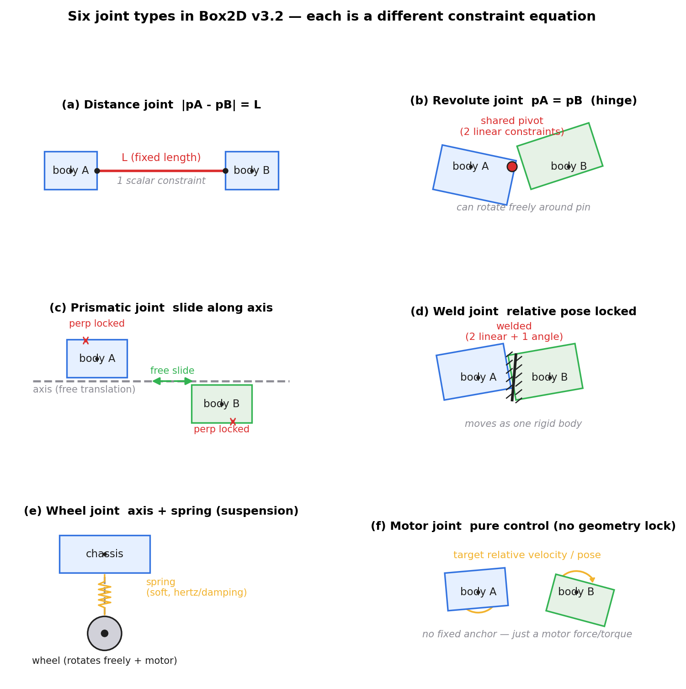
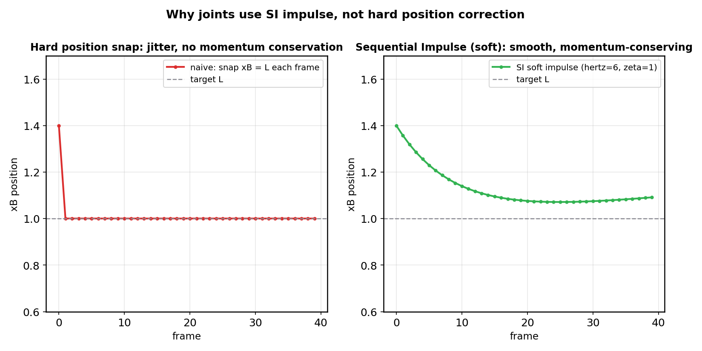
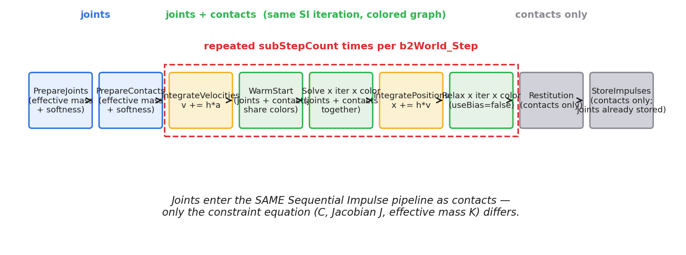
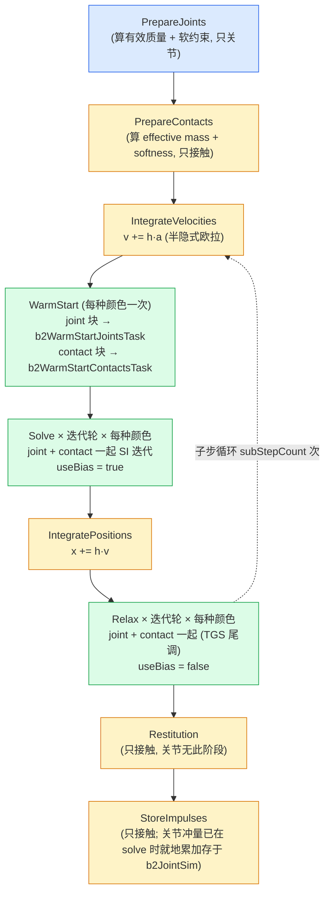

# 第 5 篇 · 第 17 章 · 关节约束

> **核心问题**:上一章(P5-16)我们解决了"一堆接触约束怎么一起进 Sequential Impulse 求解"——箱子堆叠、几十个接触点、用 PGS 反复迭代收敛到都不穿透。可物理引擎里,物体之间除了"碰撞不能穿透",还有另一种关系:**关节**(joint)。一扇门用铰链装在墙上,门绕铰链转但不能平移;一根绳子两端各拴一个物体,它们之间的距离被绳子长度限制;一个活塞在汽缸里只能沿轴向滑动;一辆车的轮子通过悬挂连在底盘上。这些"机械连接"怎么用数值方法模拟?——**关节也是一种约束**,和接触约束本质同类(都是"两个物体的相对运动受限"),**同样进 Sequential Impulse 迭代求解**,只是约束方程不同:接触约束的是"不穿透"(不等式),关节约束的是"两点重合 / 定距 / 共轴 / 位姿锁定"(等式)。本章就把这条等式约束链补齐:铰链(revolute)、距离(distance)、平移(prismatic)、焊接(weld)、轮(wheel)、电机(motor)六种关节,每种一个约束方程,**同一个 SI 求解器**。

> **读完本章你会明白**:
> 1. **关节 = 约束**:每种关节都是一个数学约束(距离=两点间距固定、铰链=两点重合、平移=沿轴滑动限位、焊接=相对位姿锁定),约束方程 `C=0` 表达"两个物体不能怎么相对动"。
> 2. 关节约束方程怎么一步步翻译成"冲量":写约束方程 C → 求导得速度违反 `Ċ` → 写 Jacobian J(把物体速度映射到约束速度)→ 算有效质量 `K = J·M⁻¹·Jᵀ` → 增量冲量 `Δλ = -K⁻¹·(Ċ + bias)`。这一套流程和接触约束**完全同构**(承 P5-16)。
> 3. 关节和接触**同样进 SI 求解器**:在 Box2D v3.2 的 9 阶段流水线里,关节有自己的 `b2_stagePrepareJoints`,在 warm start / solve / relax 阶段和接触一起按约束图颜色并行迭代——**共享同一套 SI 框架**,只是约束方程不同。
> 4. 六种关节各自的约束方程长什么样、Jacobian 怎么写、有效质量是标量还是矩阵,以及 v3.2 怎么把所有关节**统一软约束化**(`b2MakeSoft` 算 `massScale/impulseScale/biasRate`),让关节也能像接触一样按 hertz/阻尼比软化,不抖动。
> 5. **为什么关节不能用"硬位置修正"**(直接把物体 snap 回约束位置),而必须走冲量法:硬修正不守恒动量、和接触求解器不兼容、堆叠关节链会发散——这些反例让你看清"关节为什么也进 SI"的根。

> **如果一读觉得太难**:先只记四件事——① 关节是一种约束(等式 `C=0`),和接触约束(不等式"不穿透")是同类;② 每种关节一个约束方程:距离=两点定距、铰链=两点重合、平移=沿轴滑动、焊接=位姿锁定;③ 关节和接触**进同一个 SI 求解器**(同样 warm start + 多轮迭代 + 软约束),只是约束方程不同;④ 约束方程 → Jacobian → 有效质量 → 冲量,这套翻译流程和接触一模一样。六种关节的细节是"换个约束方程"的应用题,看不懂公式不影响你记住这四条。

---

## 〇、一句话点破

> **关节(joint)是一种约束——它用一条等式 `C=0` 表达"两个物体的相对位姿必须满足某种关系"(两点重合、定距、共轴、位姿锁定)。这条等式约束,和接触那条不等式约束("不穿透"),在数学上都是"约束求解"问题,都进同一个 Sequential Impulse 迭代器:写约束方程 → 求 Jacobian → 算有效质量 → 施加增量冲量,多轮收敛。Box2D v3.2 把关节和接触塞进同一条 9 阶段流水线(PrepareJoints 和 PrepareContacts 并列,warm start / solve / relax 阶段关节和接触共享约束图颜色一起并行迭代),区别只在于每种关节的约束方程 C、Jacobian J、有效质量 K 各不相同。所以理解了上一章的 SI,关节约束就是"换个约束方程"——同一个引擎,不同的数学。**

这是结论。本章倒过来拆:先讲关节在物理上约束什么(直觉 + 约束方程),再用"约束方程 → Jacobian → 有效质量 → 冲量"这条标准流程把它翻译成可求解的形式,然后看六种关节各自的方程长什么样,最后钻进 Box2D v3.2 源码,看它怎么把所有关节塞进同一个 SI 求解器(并诚实标注 v3.2 的统一软约束框架)。

---

## 一、接上一章:从"接触约束"到"关节约束"

### 1.1 复盘:接触是一条什么样的约束

上一章(P5-16)讲透了接触约束怎么求解。我们把它在数学上写成一句话:**两个物体在接触点处,沿接触法线方向的相对速度,不能是"互相穿透"的方向,且累积法向冲量非负**。这是一个**不等式约束**:

```
   接触约束 (不等式):
   C(x) >= 0          (沿法线分离量非负, 即不穿透)
   λ >= 0             (法向冲量非负, 只能推不能拉)
   λ * C = 0          (互补: 要么没接触, 要么没穿透)
```

Sequential Impulse 解这个不等式约束,靠的是每步 `max(0, λ + Δλ)` 这个投影——把冲量钉在非负可行域里。这是上一章全部内容的起点。

> **承接 P5-16 讲过**:接触约束是**不等式**(不穿透 + 冲量非负 + 互补),SI 通过 PGS(投影 Gauss-Seidel)解这个 MLCP,有效质量矩阵对称正定保证收敛。这套机制本章**不再重述**,直接用。

### 1.2 关节约束的是"相对运动",而且是等式

可物理世界里,物体之间除了"碰撞不能穿透",还有一种关系:**机械连接**。一扇门用铰链装在墙上——门可以绕铰链转,但铰链那个点,门和墙必须**始终重合**。一根链条,每一节和下一节之间,有固定的**最大距离**(链条不能拉长,但可以折叠)。一个活塞,只能在汽缸里**沿一条轴**滑动,不能横移,不能转。

这些机械连接,物理上叫做**关节**(joint)。它们和接触的区别在哪?

- **接触**是"被动"的:两个物体本来不连着,因为运动撞到一起,**那一刻**才产生一个"不穿透"约束。撞完分开,约束消失。
- **关节**是"主动"的:两个物体**通过某种机械结构长期连着**(铰链、连杆、滑轨),无论它们怎么动,这个连接关系**始终存在**,始终约束它们的相对运动。

但数学上,它们是**同一类东西**——都是"两个物体的相对运动,必须满足某种条件"。区别只在这个**条件的形状**:

- 接触的条件是**不等式**:`C >= 0`(不穿透);
- 关节的条件通常是**等式**:`C = 0`(两点重合 / 定距 / 共轴 / 位姿锁定)。

> **钉死这件事**:**关节 = 一种约束**,和接触约束是同类(都是"两个物体的相对运动受限"),区别在于关节通常是**等式约束** `C=0`,接触是**不等式约束** `C>=0`。这个"等式 vs 不等式"的差别,会让关节的冲量可以正可以负(关节既能推也能拉,不像接触只能推),但**求解框架完全一样**:写约束方程 → 求 Jacobian → 算有效质量 → SI 迭代施加冲量。

### 1.3 关节的两大构件:锚点和约束方程

每种关节,在数学上由两样东西定义:

1. **锚点**(anchor):关节连接两个物体的那两个点。比如铰链,门上有一个锚点 `pA`,墙上有对应的锚点 `pB`,约束要求 `pA = pB`。距离关节,两端各一个锚点,约束要求 `|pA - pB| = L`。锚点用"相对各自质心"的局部坐标存储(P2-05 强调过,转动永远绕质心)。

2. **约束方程** C:描述"两个物体的相对位姿必须满足什么"。这是关节的灵魂——不同关节,就是不同的 C:

| 关节 | 约束方程 C = 0 | 物理含义 | 标量约束数(2D) |
|------|----------------|----------|------------------|
| 距离 distance | `|pB - pA| - L = 0` | 两锚点间距固定为 L | 1 |
| 铰链 revolute | `pB - pA = 0` | 两锚点重合(可绕共点转) | 2 |
| 平移 prismatic | 沿轴方向自由 + 垂直轴锁定 + 角度锁定 | 沿轴滑动,不横移不转 | 2(垂直+角度) |
| 焊接 weld | `pB - pA = 0` 且 `θB - θA - θ₀ = 0` | 相对位姿完全锁定 | 3(2 线性+1 角度) |
| 轮 wheel | 垂直轴锁定 + 沿轴弹簧 | 像悬挂:沿轴弹性,垂直刚性 | 1(垂直)+ 弹簧 |
| 电机 motor | (无几何约束,只施加目标力/力矩) | 纯控制:把相对速度/位姿拉向目标 | 2(线性)+ 1(角度) |

注意"标量约束数"——一个关节可能对应**多个标量约束**(焊接 3 个,铰链 2 个)。每个标量约束都独立求解,各自一个冲量。

> **钉死这件事**:每种关节由**锚点**(连接两个物体的点)+ **约束方程** C(相对位姿必须满足什么)定义。本章后面的工作,就是把这六种 C 一个个翻译成"有效质量 + 冲量"的形式,塞进 SI 求解器。翻译流程是统一的(下一节),只是 C 不同。

---

## 二、关节约束的标准翻译流程:从 C 到冲量

现在到本章的方法论核心:一条关节的约束方程 `C=0`,怎么变成 SI 求解器能施加的"冲量"?这套翻译流程,和接触约束**完全同构**——理解了它,六种关节就是六次套用。

### 2.1 第一步:写约束方程 C

先把关节的物理要求写成数学。比如距离关节:两锚点 `pA`、`pB`(世界坐标)的距离必须等于 `L`:

```
   C = |pB - pA| - L = 0
```

铰链关节:两锚点必须重合:

```
   C = pB - pA = 0      (这是一个 2D 向量方程, 等价于 Cx = 0 和 Cy = 0 两个标量约束)
```

焊接关节:两锚点重合 + 相对角度固定:

```
   C_linear = pB - pA = 0          (2 个标量)
   C_angle  = θB - θA - θ₀ = 0     (1 个标量, θ₀ 是焊接时的相对角度)
```

这一步是纯物理翻译,把"门不能从铰链上掉下来"这种自然语言,变成精确的数学方程。

### 2.2 第二步:对时间求导,得到速度约束 Ċ

约束方程 `C=0` 是对**位置**的要求。可 SI 求解器施加的是**冲量**(改变速度),所以要把位置约束**对时间求导**,变成对速度的约束。

距离关节为例。`pB - pA` 是两个锚点的位置差,锚点位置 = 物体质心位置 + 旋转后的局部锚点偏移,所以锚点速度 = 质心速度 + 角速度叉乘锚点偏移:

```
   ẋA = vA + ωA × rA         (锚点 A 的速度, rA = pA - 质心A)
   ẋB = vB + ωB × rB         (锚点 B 的速度)
```

(P2-05 讲过,接触点速度 = 质心速度 + ω×r,这里锚点速度同理。)对 `C = |pB - pA| - L` 求导,设单位方向 `u = (pB - pA) / |pB - pA|`(从 A 指向 B),链式法则:

```
   Ċ = u · (ẋB - ẋA) = u · (vB + ωB × rB - vA - ωA × rA)
```

`Ċ` 就是"两锚点沿连线方向的相对分离速度"——它必须等于 0(否则距离在变,违反约束)。

> **钉死这件事**:位置约束 `C=0` 求导得速度约束 `Ċ=0`。`Ċ` 是"约束速度违反量",它由两个物体的线速度、角速度、锚点偏移共同决定。SI 求解器施加冲量改变速度,目标就是让 `Ċ` 趋于 0(严格说是 `Ċ + bias`,bias 处理位置漂移,见 2.5)。

### 2.3 第三步:提取 Jacobian J

把 `Ċ` 写成矩阵形式,把"物体速度"提取成一个向量,剩下那个系数矩阵就是 **Jacobian** J。设所有物体的广义速度拼起来 `v = (vA, ωA, vB, ωB)`(对单个关节,这是个 6 维向量),那么:

```
   Ċ = J · v
```

对距离关节,把 `Ċ = u · (vB + ωB × rB - vA - ωA × rA)` 拆开(2D 里 `ω × r` 是标量叉乘 `ω · (r的垂直分量)`,记 `rA × u` 为标量):

```
   J = [ -u,  -(rA × u),  +u,  +(rB × u) ]
        └ 线A ┘ └ 角A ┘    └ 线B ┘ └ 角B ┘
```

J 是一个 1×6 的行向量(对单个标量约束)。它的物理意义:**每个广义速度分量,对约束速度违反的贡献是多少**。比如 `-u` 是"vA 沿 -u 方向移动时,会减少 Ċ"(因为 A 朝 B 走,距离在缩小,`Ċ` 为负);`-(rA × u)` 是"ωA 旋转时,通过 rA 把锚点 A 撇向某个方向,贡献到 Ċ"。

Jacobian 是约束的"骨架"——它把抽象的约束方程,变成了可计算的"速度 → 违反量"映射。

### 2.4 第四步:算有效质量 K = J · M⁻¹ · Jᵀ

冲量改变速度,这个关系用质量矩阵 M 表达:`Δv = M⁻¹ · Jᵀ · Δλ`(冲量 `Δλ·Jᵀ` 沿约束方向施加,产生速度变化 `Δv`,这里 `M⁻¹` 是质量矩阵的逆,对角块是各物体的 `1/m` 和 `1/I`,P2-05 讲过倒数技巧)。

把这个 `Δv` 代回约束目标 `Ċ_new = Ċ + J·Δv = Ċ + J·M⁻¹·Jᵀ·Δλ = 0`(我们想让施加冲量后的约束速度违反归零),解出:

```
   Δλ = -(J·M⁻¹·Jᵀ)⁻¹ · Ċ = -K⁻¹ · Ċ
```

其中:

```
   K = J · M⁻¹ · Jᵀ       ← 有效质量 (effective mass)
```

K 是个标量(对单标量约束)或小矩阵(对多标量约束)。它的物理意义:**沿约束方向施加单位冲量,约束速度违反会变多少**。对距离关节,把 J 和 M⁻¹ 展开:

```
   K = (1/mA) + (1/mB) + (rA × u)²/IA + (rB × u)²/IB
```

(这里 `1/mA` 是 invMassA、`IA` 是转动惯量——P2-05 的倒数技巧在这里兑现。)这个公式和上一章接触约束的法向有效质量 `kNormal = invMassA + invMassB + invIA·(rA×n)² + invIB·(rB×n)²` **结构完全一样**,只是把接触法线 `n` 换成了关节连线方向 `u`!

> **钉死这件事**:**关节约束的有效质量 K = J·M⁻¹·Jᵀ,结构和接触约束完全同构**——都是"倒数质量相加 + 转动项(锚点叉乘约束方向)的平方乘倒数转动惯量"。区别只是:接触用接触法线 `n`,距离关节用两锚点连线方向 `u`;铰链关节是 2 个线性约束(K 是 2×2 矩阵);焊接是 3 个约束(K 是 3×3 或拆成 2×2 + 标量)。**同一套数学,不同的方向/维度**。

### 2.5 第五步:施加增量冲量,加 bias 处理位置漂移

最后,把算出的 `Δλ` 施加到两个物体上(改变它们的速度),并累加到累积冲量 `λ`:

```
   Δλ = -K⁻¹ · (Ċ + bias)             ← 增量冲量 (bias 见下)
   λ_new = λ_old + Δλ                  ← 关节冲量可正可负(等式约束, 能推能拉)
   Δv = M⁻¹ · Jᵀ · Δλ                 ← 速度变化, 立刻应用
```

几个关键点:

1. **关节冲量 λ 不投影到非负**(和接触不同)。接触是"只能推不能拉"(`λ >= 0`),关节是等式约束,冲量**可正可负**——铰链既能把两个物体推开、也能拉回(想想一根绳子,既能拉住两物体不让分开、也能在折叠时推它们)。所以关节的 `λ_new = λ_old + Δλ`,没有 `max(0, ...)`。这是关节和接触最大的求解差异。

2. **bias 处理位置漂移**。只保证 `Ċ=0`(速度不违反)还不够——积分误差会让位置慢慢漂移(两个锚点本来该重合,跑了几帧后差了 0.01 米,这是数值积分的固有误差)。所以冲量公式里加一个 `bias` 项,把位置违反 `C` 转成目标速度,让冲量不仅消除速度违反,还**额外**把位置漂移按比例推回去:

   ```
   bias = β · C / h        (β 是位置纠正比例, 0~1; h 是子步步长)
   ```

   这就是上一章接触约束里讲的 Baumgarte 位置纠正。v3.2 把它做成了软约束(见第五节)。

3. **立刻应用,多轮迭代**。算完 `Δλ` 立刻改 `vA, ωA, vB, ωB`。下一个约束(可能是另一个关节、或一个接触)看到的,就是更新后的速度。这就是 Gauss-Seidel(P5-16 讲过)。多轮迭代后,所有约束(关节 + 接触)一起收敛。

> **钉死这件事**:关节的增量冲量 `Δλ = -K⁻¹·(Ċ + bias)`,施加后立刻应用、多轮迭代收敛。**和接触求解的唯一实质区别**:关节冲量不投影到非负(等式约束,可推可拉),接触投影到非负(只能推)。bias 处理位置漂移(数值积分误差造成的 C≠0,要按比例推回去)。其余全套流程(Jacobian、有效质量、SI 迭代)完全同构。

### 2.6 一张图:从几何到冲量的完整链路

把上面五步串起来,用距离关节做例子:

![距离关节:从几何 |pB-pA|=L 到冲量的完整翻译。左侧画两个物体、锚点 pA/pB、连线方向 u、长度 L;右侧逐步列出约束方程 C、速度违反 Ċ=u·(vB+ωB×rB-vA-ωA×rA)、Jacobian J=[-u, -(rA×u), +u, +(rB×u)]、有效质量 K=1/mA+1/mB+(rA×u)²/IA+(rB×u)²/IB、增量冲量 Δλ=-K⁻¹(Ċ+bias)](images/fig-p5_17-02-distance-constraint-math.png)

这张图就是把上面五步可视化。注意右下角那个增量冲量公式 `Δλ = -massScale·K⁻¹·(Ċ+bias) - impulseScale·λ_old`——它比我们这里讲的"经典版" `Δλ = -K⁻¹·(Ċ+bias)` 多了 `massScale` 和 `impulseScale` 两个系数。这是 v3.2 的**软约束框架**(第五节详讲),把刚性冲量软化了,避免堆叠抖动。原理不变,只是把 `K⁻¹` 和 `λ` 各乘了一个缩放系数。

---

## 三、六种关节各自的约束方程

方法论讲透了,现在逐一过六种关节,看每种约束什么、约束方程长什么样、Jacobian 和有效质量是什么形态。**源码细节留到第五节**,这里先把数学骨架立起来。



### 3.1 距离关节(distance joint):两锚点定距

**物理**:一根刚性连杆,两端各连一个物体,连杆长度固定。两个物体可以绕各自锚点任意转,但锚点间距永远是 L。这是最简单的关节——链条的每一节、一根棍子拴两个球。

**约束方程**(1 个标量):

```
   C = |pB - pA| - L = 0
```

**Jacobian**(1×6 行向量,沿连线方向 `u = (pB-pA)/|pB-pA|`):

```
   J = [-u, -(rA×u), +u, +(rB×u)]
```

**有效质量**(标量):

```
   K = invMassA + invMassB + invIA·(rA×u)² + invIB·(rB×u)²
```

**冲量**(标量,可正可负——连杆既能拉也能推):

```
   Δλ = -K⁻¹·(Ċ + bias)
```

距离关节就这么干净:1 个标量约束,1 个标量冲量。它是所有关节里最简单的,也是理解关节约束的最佳入口(2.6 节那张图就是它)。

**v3.2 扩展**:Box2D v3.2 的距离关节不止刚性连杆,它还支持**弹簧**(spring,通过 `hertz`/`dampingRatio` 软化)、**长度限制**(limit,`minLength`/`maxLength`,连杆可以折叠但拉不到超过 maxLength)、**轴向电机**(motor,沿连线方向施加目标速度)。这些是基本约束方程之上的扩展,源码细节见第五节。

### 3.2 铰链关节(revolute joint):两锚点重合

**物理**:一个销钉穿过两个物体,把它们钉在同一个点。两个物体可以**绕这个共点任意旋转**(门绕铰链转、机械臂关节),但那个点必须始终重合。这是最常用的关节——任何"绕轴旋转"的机械结构。

**约束方程**(2 个标量——2D 向量方程 `pB - pA = 0`):

```
   Cx = (pB - pA).x = 0
   Cy = (pB - pA).y = 0
```

**Jacobian**(2×6 矩阵,因为 2 个标量约束):

```
   J = [ -I₂,  -(rA 的反对称矩阵),  +I₂,  +(rB 的反对称矩阵) ]
```

(I₂ 是 2×2 单位矩阵。这里写成矩阵形式,展开就是两个标量约束各自的行向量。)

**有效质量**(2×2 矩阵):

```
   K = [ invMassA + invMassB + invIA·rA.y² + invIB·rB.y²,   -invIA·rA.x·rA.y - invIB·rB.x·rB.y ]
       [ -invIA·rA.x·rA.y - invIB·rB.x·rB.y,                invMassA + invMassB + invIA·rA.x² + invIB·rB.x² ]
```

这个 2×2 矩阵每帧都要重新算(因为 rA、rB 随物体旋转变化),然后求逆(或解 2×2 线性方程)得到冲量。Box2D 用 `b2Solve22` 直接解这个 2×2 系统(不求显式逆,数值更稳)。

**冲量**(2D 向量,可正可负分量):

```
   Δλ = -K⁻¹·(Ċ + bias)       (2D 向量)
```

**v3.2 扩展**:铰链还支持**角度电机**(motor,绕共点施加目标角速度)、**角度限制**(limit,限制旋转角度范围)、**角度弹簧**(spring,把相对角度拉向目标角度)。这些是基本"两点重合"约束之外的轴向(angle)约束,各自独立求解。源码里,铰链的"线性约束"(2 个标量)和"角度约束"(motor/limit/spring 各 1 个标量)是分开求解的。

> **钉死这件事**:铰链关节的"两点重合"是 2 个标量约束(2D),K 是 2×2 矩阵。它还能叠加角度电机(motor)、角度限制(limit)、角度弹簧(spring),每个都是独立的标量约束。这是关节的常见模式——**一个关节可能由多个独立子约束组成**,各自一个冲量,各自求解。

### 3.3 平移关节(prismatic joint):沿轴滑动

**物理**:一个滑块在滑轨里,只能**沿一条固定轴**滑动,不能横移、不能转。汽缸里的活塞、抽屉的滑轨、电梯的导轨。两个物体的相对角度被锁定(不能相对旋转),相对平移只在轴方向自由,垂直轴方向锁死。

**约束方程**(2 个标量):

```
   C_perp = (pB - pA) · n = 0          (垂直轴方向的相对位移为 0, n 是垂直于滑动轴的单位向量)
   C_angle = θB - θA - θ₀ = 0          (相对角度锁定)
```

(沿轴方向的位移是**自由**的——这正是"可以滑动"的含义,所以沿轴方向不约束。)

**Jacobian**:垂直轴约束 `C_perp` 的 Jacobian 结构和距离关节一样,只是把 `u` 换成垂直轴 `n`;角度约束 `C_angle` 的 Jacobian 只涉及角速度 `[0, -1, 0, +1]`(相对角速度 `ωB - ωA`)。

**有效质量**:垂直 + 角度通常**耦合**成一个 2×2 矩阵(因为垂直方向的平移和角度旋转,通过 rA、rB 会互相影响),Box2D 用 `b2Solve22` 解。轴向(自由滑动方向)如果开启 motor 或 limit,再加一个独立的标量约束(类似距离关节的轴向)。

**冲量**:2D 向量(垂直 + 角度)+ 可选的轴向标量。

**v3.2 扩展**:平移关节支持沿轴的 spring(弹性滑动,像弹簧导轨)、motor(施加目标滑动速度)、limit(限制滑动范围 `lowerTranslation`/`upperTranslation`)。这些和铰链的角度扩展是对偶的——铰链扩展角度,平移扩展轴向。

### 3.4 焊接关节(weld joint):相对位姿完全锁定

**物理**:把两个物体**焊死**在一起,它们之后作为一个整体运动——不分开、不相对转。相当于两个物体合并成一个刚体(但仍然保留各自的形状和质量,只是运动学上锁在一起)。

**约束方程**(3 个标量——2 线性 + 1 角度):

```
   C_linear = pB - pA = 0              (2 个标量: 两点重合)
   C_angle  = θB - θA - θ₀ = 0         (1 个标量: 相对角度锁定)
```

**Jacobian**(3×6 矩阵):铰链的 2×6 线性部分,再加一行角度约束 `[0, -1, 0, +1]`。

**有效质量**(3×3 矩阵):线性(2×2)+ 线性-角度耦合 + 角度(标量)。Box2D v3.2 有两条路径——**block solve**(3×3 一起解)和**分离 solve**(线性和角度分开解),由宏 `B2_WELD_BLOCK_SOLVE` 切换。源码注释说 block solve 在混合刚度(线性硬、角度软)时不正确,所以那种情况退回分离解(第五节看源码)。

**冲量**:2D 线性向量 + 1 个角度标量。

**v3.2 特点**:焊接关节**没有 motor 和 limit**(焊死了还要什么电机?),但它支持**线性和角度各自的软约束**(`linearHertz`/`angularHertz`),可以模拟"稍微有点弹性的焊接"——比如橡胶连接的两个部件。这是焊接关节相对其他关节的特殊之处。

> **钉死这件事**:焊接关节 = 铰链(两点重合)+ 角度锁定 = 3 个标量约束。它是最"强"的关节——完全锁定相对位姿。v3.2 支持线性和角度分离软化(模拟弹性焊接),且因为混合刚度时 block solve 不正确,有两条求解路径(block / 分离)切换。

### 3.5 轮关节(wheel joint):沿轴弹簧 + 垂直锁

**物理**:车辆悬挂的经典模型。底盘通过一根轴连着轮子,轮子可以**沿轴方向弹性滑动**(弹簧悬挂,吸收颠簸),**垂直轴方向锁死**(轮子不能横着飞出去),轮子可以**绕轴自由旋转**(可选电机驱动)。

**约束方程**(1 个标量 + 弹簧 + 可选电机):

```
   C_perp = (pB - pA) · n = 0          (垂直轴方向锁定, 1 个标量)
   弹簧: 沿轴方向的相对位移, 用 spring 软约束(不是硬 C=0, 而是弹性)
   电机: 可选, 绕轴施加目标角速度
```

**有效质量**:垂直锁是标量(类似距离关节),弹簧是另一个标量(沿轴),电机是标量(纯转动惯量 `invIA + invIB`)。三个独立求解。

**v3.2 特点**:轮关节是"悬挂"的标配——`hertz`/`dampingRatio` 控制弹簧硬度(车软悬挂 vs 硬悬挂),`maxMotorTorque`/`motorSpeed` 控制驱动(前驱/后驱/四驱)。一个关节就把"悬挂 + 驱动"全包了。

### 3.6 电机关节(motor joint):纯控制,无几何约束

**物理**:和前五种不同,电机关节**没有几何约束**——它不强制两点重合、不定距、不共轴。它只是一个"控制器":对两个物体施加力/力矩,把它们的相对速度或相对位姿拉向目标值。常用于"想让两个物体保持某种相对关系,但又不想硬性锁死"的场景——比如摄像机跟随、角色的肢体控制。

**约束方程**(无几何 C=0,而是 4 个独立控制目标):

```
   角度弹簧: 把相对角度拉向 targetAngle (软约束)
   角度电机: 把相对角速度拉向 angularVelocity (硬控制)
   线性弹簧: 把相对位置拉向 targetOffset (软约束)
   线性电机: 把相对线速度拉向 linearVelocity (硬控制)
```

**有效质量**:线性是 2×2 矩阵(类似铰链),角度是标量。和焊接关节类似,但每个都有独立的 `maxForce`/`maxTorque` 钳制(电机不能无限使劲)。

**特点**:电机关节是"最自由"的关节——它不锁死任何几何关系,只是施加控制力。理解了它,你就理解了"关节不一定非要有几何约束,只要有约束方程(哪怕是软目标)就能进 SI"。

### 3.7 六种关节的共性

过完六种,提取共性:

1. **都是"约束方程 + Jacobian + 有效质量 + 冲量"的套用**。约束方程 C 不同(定距/共点/共轴/位姿锁定/纯控制),但翻译流程完全统一(第二节那五步)。
2. **关节冲量可正可负**(等式约束,不像接触只能推)。这是关节和接触求解最大的差异。
3. **一个关节可能由多个独立子约束组成**(焊接 3 个,铰链 2+角度扩展,平移 2+轴向扩展)。每个子约束独立求解,各自一个冲量。
4. **v3.2 把所有关节统一软约束化**(`b2MakeSoft`),支持 hertz/阻尼比参数,避免刚性冲量抖动(第五节详讲)。

> **钉死这件事**:六种关节 = 六个不同的约束方程,但翻译流程(约束 → Jacobian → 有效质量 → 冲量 → SI 迭代)完全统一。关节冲量可正可负(等式约束),这是它和接触求解的唯一实质差异。一个关节可由多个子约束组成,各自独立求解。

---

## 四、关节为什么也用 SI 求解:反例撞墙

这一节是本章技巧精解的前奏——回答一个读者一定会问的问题:**关节约束为什么不能用"直接位置修正"(把物体 snap 回约束位置),而必须费劲走冲量法 + SI 迭代?** 这个问题的答案,直接揭示"关节为什么和接触进同一个求解器"的根。

### 4.1 朴素做法:硬位置修正

最朴素的关节实现,是每帧检查约束违反,然后**直接把物体位置 snap 回约束位置**。比如距离关节,发现 `|pB - pA| != L`,就把 B 沿连线方向挪一下,让 `|pB - pA| = L`:

```python
# 朴素做法(错误!)
def distance_joint_naive(bodyA, bodyB, L):
    d = bodyB.pos - bodyA.pos
    dist = length(d)
    if dist != L:
        u = d / dist
        # 直接把 B 挪回正确位置
        bodyB.pos = bodyA.pos + u * L
```

这个做法看起来"也满足约束了"(挪完 `|pB-pA| = L`)。可它有三个致命问题。

### 4.2 致命问题一:不守恒动量

直接挪位置,**完全无视速度和动量**。想象一个距离关节连着两个物体,B 正以高速远离 A。朴素做法发现 B 跑远了,把它瞬间拽回 L 处——B 的位置变了,但**它的速度没变**(还是高速远离)。下一帧,B 又跑远了,又被拽回……这就是为什么朴素做法的物体看起来在**剧烈抖动**:位置被反复 snap,速度却保持原样。

更糟的是,snap 位置**改变了系统的总动量**。B 的位置突变,意味着它有一个"无限大的瞬时速度"(位置阶跃 = 速度无穷),动量守恒彻底破坏。这在两个有限质量物体相连接时尤其严重——一个物体的 snap 会把动量凭空塞进系统。

冲量法不会有这个问题:冲量 `Δλ` 改变的是**速度**,速度变化由 `Δv = M⁻¹·Jᵀ·Δλ` 决定,两个物体受到大小相等方向相反的冲量(动量守恒的结构保证,承 P5-15 第八节证明),总动量精确不变。

### 4.3 致命问题二:和接触求解器不兼容

物理引擎里,关节和接触是**同时存在**的。一个箱子可能同时:被一个距离关节拉着 + 和地面接触(不穿透)。这两个约束**必须一起满足**——关节拉它往某个方向,接触挡它不能穿地。

朴素做法"独立 snap 关节位置",完全无视接触约束——你 snap 完关节,箱子可能被挪进了地里(违反接触约束);你回头修接触,又破坏了关节。这就是上一章(P5-16)讲过的"约束互相踩":独立解一次会互相破坏。

冲量法把关节和接触**塞进同一个 SI 迭代**:每轮依次修正关节违反、接触违反,多轮后两者一起收敛。关节的冲量改变物体速度,接触看到的是更新后的速度;接触的冲量又改速度,关节下一轮看到新的状态——它们在同一个 Gauss-Seidel 迭代里互相协调,最终找到一个**同时满足关节和接触**的速度解。这是朴素做法做不到的。

### 4.4 致命问题三:关节链发散

想象三个物体 A-B-C 用距离关节连成一条链(A 连 B,B 连 C)。朴素做法:

1. snap A-B 关节:把 B 挪到离 A 为 L 处。可这一挪,B 和 C 的距离变了!
2. snap B-C 关节:把 C 挪到离 B 为 L 处。可这一挪,A 和 B 的距离可能又变了(因为 B 在 1 里被挪过,现在 C 又带着 B 动)。
3. 回头 snap A-B:发现又违反了……

这就是关节链的**数值震荡**——snap 一个关节,污染相邻关节,反复 snap 永远收敛不了。链越长,震荡越剧烈,十几个关节的链根本稳定不下来。

冲量法(SI 迭代)解这个问题:每个关节施加一个**增量冲量**(不是 snap 位置),冲量改变速度,速度通过多轮 Gauss-Seidel 迭代传播(A-B 的冲量影响 B 的速度,B-C 看到 B 的新速度再算自己的冲量)。因为冲量是"软"的(每次只改一点速度),多轮后整条链收敛到一个所有关节都满足的稳态。这是 SI 相对于"硬 snap"的根本优势——**软迭代 vs 硬修正**,前者收敛,后者震荡。

### 4.5 用数字说话:硬 snap vs SI 软约束

用 numpy 模拟一个简单的距离关节(A 固定,B 受重力下拉,关节要求 |B-A|=L=1),对比朴素硬 snap 和 SI 软约束冲量:



左图(朴素硬 snap):每帧发现 B 偏离 L,直接把 B 拽回 L,同时反转速度乘 0.5(魔法衰减)。结果 B 在 L 附近**剧烈震荡**——位置被反复 snap,速度被反复反转,根本没有平滑收敛。这是硬位置修正的典型病态。

右图(SI 软约束):用 `b2MakeSoft(hertz=6, zeta=1, h)` 算出 `massScale/impulseScale/biasRate`,每帧积分速度 → 多轮 SI 迭代算增量冲量 `Δλ = -massScale·K⁻¹·(Ċ+bias) - impulseScale·λ_old` 改速度 → 积分位置。B 从 1.4 处**平滑收敛**到 L=1,不振荡、不抖动,且动量守恒(冲量配对施加)。这就是 SI 软约束相对于硬 snap 的碾压优势。

> **不这样会怎样**:如果关节用硬位置修正,单个关节看起来"也满足约束了",可一旦扩展到"关节 + 接触同时存在"或"多关节连成链",立刻三个问题一起爆:不守恒动量(物体凭空加速)、和接触求解器不兼容(关节修了接触就穿)、关节链震荡(收敛不了)。冲量法 + SI 迭代一次性解决这三个问题——关节和接触进同一个迭代器,冲量配对守恒动量,软迭代收敛关节链。

> **钉死这件事**:**关节必须用冲量法 + SI 求解,不能用硬位置修正**,三个根:① 冲量法守恒动量(冲量配对),硬 snap 破坏动量;② 关节和接触进同一个 SI 迭代器才能协调(共享物体的速度),硬 snap 各自为政互相破坏;③ 关节链靠 SI 的软增量冲量多轮传播收敛,硬 snap 震荡发散。这就是为什么 Box2D 把关节和接触塞进同一条 9 阶段流水线——**它们是同一类问题,必须一起解**。

---

## 五、Box2D v3.2 源码:关节怎么进 SI 流水线

原理和反例讲透了,现在钻进 Box2D v3.2 的真实源码,看它怎么把六种关节塞进同一条 Sequential Impulse 流水线。这一节是本章的源码核心,所有行号均经 Grep/Read 核实。

### 5.1 关节的 C API:句柄 + Def 结构体

Box2D v3.2 是 C 句柄 API(承 P0-01 诚实标注),关节的创建函数都返回 `b2JointId`(一个句柄),签名统一:

```c
// include/box2d/box2d.h (签名已核)
B2_API b2JointId b2CreateDistanceJoint( b2WorldId worldId, const b2DistanceJointDef* def );   // L987
B2_API b2JointId b2CreateMotorJoint   ( b2WorldId worldId, const b2MotorJointDef* def );      // L1077
B2_API b2JointId b2CreatePrismaticJoint( b2WorldId worldId, const b2PrismaticJointDef* def ); // L1167
B2_API b2JointId b2CreateRevoluteJoint( b2WorldId worldId, const b2RevoluteJointDef* def );   // L1250
B2_API b2JointId b2CreateWeldJoint    ( b2WorldId worldId, const b2WeldJointDef* def );       // L1332
B2_API b2JointId b2CreateWheelJoint   ( b2WorldId worldId, const b2WheelJointDef* def );      // L1372
```

每个关节有一个 `b2XxxJointDef` 结构体(在 `include/box2d/types.h`),里面装着创建参数:连接的两个 body、锚点的局部坐标(`localFrameA`/`localFrameB`)、约束的软硬度(`constraintHertz`/`constraintDampingRatio`)、关节特有参数(distance 的 `length`/`hertz`/`dampingRatio`/`minLength`/`maxLength`,revolute 的 `enableMotor`/`motorSpeed`/`lowerAngle`/`upperAngle` 等)。

调用模式:

```c
b2DistanceJointDef def = b2_defaultDistanceJointDef;
def.bodyIdA = bodyA;
def.bodyIdB = bodyB;
def.localFrameA = ...;     // 锚点 A 在 A 局部坐标
def.localFrameB = ...;     // 锚点 B 在 B 局部坐标
def.length = 2.0f;          // 约束长度 L
def.hertz = 4.0f;           // 弹簧频率 (软约束)
def.dampingRatio = 0.5f;    // 阻尼比
b2JointId jointId = b2CreateDistanceJoint( worldId, &def );
```

注意 `hertz`/`dampingRatio`——这就是 v3.2 的**软约束参数**,让关节可以弹性化(第五节后半详讲)。

> **钉死这件事**:Box2D v3.2 关节用 C 句柄 API:`b2CreateXxxJoint(worldId, &def)` 返回 `b2JointId`。每个关节一个 Def 结构体,装连接的 body、锚点、软约束参数(hertz/dampingRatio)、关节特有参数(motor/limit/spring 开关和数值)。★这是 v3 C API,不是 v2 的 `b2Joint` C++ 类。

### 5.2 关节进 SI 流水线:9 阶段里的关节分支

上一章(P5-16)讲过 `b2Solve` 的 9 阶段流水线。关节怎么接入?关键在阶段分发函数 `b2ExecuteBlock`([src/solver.c#L845-L916](../box2d/src/solver.c#L845-L916)),逐行已核:

- **`b2_stagePrepareJoints`**([solver.c#L852-L854](../box2d/src/solver.c#L852-L854)):直接调 `b2PrepareJointsTask(block, context)`——这个阶段**只处理关节**,不和接触混。
- **`b2_stageWarmStart`**([solver.c#L864-L873](../box2d/src/solver.c#L864-L873)):按块类型分流——接触块(`b2_graphContactBlock`)调 `b2WarmStartContactsTask`,关节块(`b2_graphJointBlock`)调 `b2WarmStartJointsTask`。**关节和接触在同一阶段、按颜色并行 warm start**。
- **`b2_stageSolve`**([solver.c#L875-L886](../box2d/src/solver.c#L875-L886)):同样分流,关节走 `b2SolveJointsTask(block, context, useBias=true, workerIndex)`——这就是 SI 的主体迭代,关节和接触**一起按颜色并行解**。
- **`b2_stageRelax`**([solver.c#L892-L903](../box2d/src/solver.c#L892-L903)):关节走 `b2SolveJointsTask(block, context, useBias=false, ...)`,TGS 尾调松弛。

注意一个**非显然事实**:`b2_stageStoreImpulses`([solver.c#L912-L914](../box2d/src/solver.c#L912-L914))**只处理接触,不处理关节**。原因:接触的冲量在 SIMD 宽化路径里存在单独的 wide 数组,需要回写到 `b2ContactSim`;而关节的冲量**直接存在 `b2JointSim` 的标量字段里**(SoA 标量,无 wide 分离),solve 时就地累加,无需回写。这是 v3.2 工程实现的一个细节,讲源码要诚实标注。



用 mermaid 把这条流水线的"关节怎么和接触一起进 SI 迭代"画清楚:



蓝色阶段只处理关节,绿色阶段关节和接触**一起**按约束图颜色并行 SI 迭代,黄色阶段只处理接触。注意"子步循环"那条虚线——`b2World_Step(dt, subStepCount)` 把一个大步切成 subStepCount 个子步,每个子步完整跑一遍 IntegrateVelocities → WarmStart → Solve → IntegratePositions → Relax(承 P5-16 第五节)。关节和接触在每个子步里都一起进 SI,只是约束方程不同。

### 5.3 关节的统一分发:b2PrepareJoint / b2WarmStartJoint / b2SolveJoint

关节的 prepare/warmstart/solve 都是**按类型 switch 分发**的。看 `b2PrepareJoint`([src/joint.c#L1301-L1339](../box2d/src/joint.c#L1301-L1339),逐行已核):

```c
void b2PrepareJoint( b2JointSim* joint, b2StepContext* context )
{
    // Clamp joint hertz based on the time step to reduce jitter.
    float hertz = b2MinFloat( joint->constraintHertz, 0.25f * context->inv_h );
    joint->constraintSoftness = b2MakeSoft( hertz, joint->constraintDampingRatio, context->h );

    switch ( joint->type )
    {
        case b2_distanceJoint:  b2PrepareDistanceJoint( joint, context ); break;
        case b2_motorJoint:     b2PrepareMotorJoint( joint, context );    break;
        case b2_filterJoint:    break;                                    // ★空! filter 不求解
        case b2_prismaticJoint: b2PreparePrismaticJoint( joint, context ); break;
        case b2_revoluteJoint:  b2PrepareRevoluteJoint( joint, context );  break;
        case b2_weldJoint:      b2PrepareWeldJoint( joint, context );      break;
        case b2_wheelJoint:     b2PrepareWheelJoint( joint, context );     break;
        default: B2_ASSERT( false );
    }
}
```

注意三个关键点:

1. **统一软约束**:`b2PrepareJoint` 在 switch 之前,**对所有关节**先算一个公共的 `constraintSoftness = b2MakeSoft(hertz, dampingRatio, h)`。这是 v3.2 的招牌设计——**所有关节共享同一个软约束框架**,每种关节再在各自的 `b2PrepareXxxJoint` 里算自己专用的 spring softness(比如距离关节的 `distanceSoftness`、轮关节的 `springSoftness`)。

2. **hertz 被 clamp**:`b2MinFloat(hertz, 0.25f * inv_h)`——关节的弹簧频率不能超过 `0.25/h`(奈奎斯特限制),否则数值不稳定。这是物理引擎的数值稳定性细节,承 P2-08 固定步长。

3. **`b2_filterJoint` 是空分支**:v3.2 有 7 种关节枚举(`b2JointType` 在 [include/box2d/types.h#L567-L576](../box2d/include/box2d/types.h#L567-L576)),但 `b2_filterJoint` 只做碰撞过滤(让两个物体不互相碰撞检测),**不参与约束求解**——prepare/warmstart/solve 都是空 case。这是 v3.2 相比常见印象的一个出入:关节种类比 v2 的 friction/gear/pulley/mouse 少,但多了一个 filter joint。

`b2WarmStartJoint`([joint.c#L1341-L1375](../box2d/src/joint.c#L1341-L1375))和 `b2SolveJoint`([joint.c#L1377-L1411](../box2d/src/joint.c#L1377-L1411))结构完全一样——switch 分发到各自的 `b2WarmStartXxxJoint` / `b2SolveXxxJoint`。

> **★诚实标注(v3.2 演进,修正总纲印象)**:总纲默认印象是"6 种关节(distance/revolute/prismatic/weld/wheel/motor)"。真实源码是 **7 种**(多了 `b2_filterJoint`,但只做碰撞过滤不参与求解)。更重要的,v3.2 把**所有关节统一软约束化**——`b2PrepareJoint` 在分发前先算公共 `constraintSoftness`,每种关节再算专用 spring softness。这是 v3.2 相比早期 Box2D(刚性关节)的核心演进,讲源码必须诚实标注。

### 5.4 距离关节源码:看一个完整的关节求解

以距离关节为例,看一个完整的 prepare → solve。`b2PrepareDistanceJoint`([src/distance_joint.c#L253-L316](../box2d/src/distance_joint.c#L253-L316)),源码注释里直接写了约束方程推导(这是 Box2D 注释的教学价值),逐行已核:

```c
// distance_joint.c:246-251 (源码注释, 直接写了约束推导!)
// C = norm(p2 - p1) - L
// u = (p2 - p1) / norm(p2 - p1)
// Cdot = dot(u, v2 + cross(w2, r2) - v1 - cross(w1, r1))
// J = [-u -cross(r1, u) u cross(r2, u)]
// K = J * invM * JT = invMass1 + invI1 * cross(r1, u)^2 + invMass2 + invI2 * cross(r2, u)^2

void b2PrepareDistanceJoint( b2JointSim* base, b2StepContext* context )
{
    // ... 取 bodySimA, bodySimB, 读倒数质量 mA, iA, mB, iB ...
    float mA = bodySimA->invMass;
    float iA = bodySimA->invInertia;
    float mB = bodySimB->invMass;
    float iB = bodySimB->invInertia;

    b2DistanceJoint* joint = &base->distanceJoint;

    // 算锚点(世界坐标, 相对质心)
    joint->anchorA = b2RotateVector( bodySimA->transform.q, b2Sub( base->localFrameA.p, bodySimA->localCenter ) );
    joint->anchorB = b2RotateVector( bodySimB->transform.q, b2Sub( base->localFrameB.p, bodySimB->localCenter ) );
    joint->deltaCenter = b2SubPos( bodySimB->center, bodySimA->center );

    // 连线方向 u (第二节讲的单位向量)
    b2Vec2 rA = joint->anchorA;
    b2Vec2 rB = joint->anchorB;
    b2Vec2 separation = b2Add( b2Sub( rB, rA ), joint->deltaCenter );
    b2Vec2 axis = b2Normalize( separation );                  // 这就是 u

    // ★有效质量 K (第二节讲的公式, 逐字对应!)
    float crA = b2Cross( rA, axis );                          // rA × u
    float crB = b2Cross( rB, axis );                          // rB × u
    float k = mA + mB + iA * crA * crA + iB * crB * crB;      // K = invMassA + invMassB + invIA(rA×u)² + invIB(rB×u)²
    joint->axialMass = k > 0.0f ? 1.0f / k : 0.0f;            // 缓存 K⁻¹

    // 软约束参数 (弹簧软化)
    joint->distanceSoftness = b2MakeSoft( joint->hertz, joint->dampingRatio, context->h );

    // warm start 开关
    if ( context->enableWarmStarting == false ) {
        joint->impulse = 0.0f; joint->lowerImpulse = 0.0f;
        joint->upperImpulse = 0.0f; joint->motorImpulse = 0.0f;
    }
}
```

逐行对应第二节的理论:

- **`axis = b2Normalize(separation)`**:这就是连线方向 `u = (pB-pA)/|pB-pA|`。
- **`crA = b2Cross(rA, axis)`**:`rA × u`,2D 叉积标量。
- **`k = mA + mB + iA*crA*crA + iB*crB*crB`**:**这就是有效质量 K**!和注释里 `K = invMass1 + invI1 * cross(r1, u)^2 + invMass2 + invI2 * cross(r2, u)^2` 逐字对应(mA 是 invMassA 的简写)。**源码铁证**——第二节推的公式,Box2D 就这么实现。
- **`axialMass = 1.0f / k`**:缓存 `K⁻¹`,求解时直接乘,省一次除法。和接触约束的 `normalMass = 1.0f / kNormal`(P5-15 第七节)**完全同构**。
- **`distanceSoftness = b2MakeSoft(...)`**:软约束参数,hertz/dampingRatio 算出 `massScale/impulseScale/biasRate`。

然后看 solve——`b2SolveDistanceJoint` 的弹簧分支([distance_joint.c#L405-L409](../box2d/src/distance_joint.c#L405-L409),逐行已核):

```c
// distance_joint.c:405-409 (soft/spring 分支, 简化展示)
float impulse = -m * ( Cdot + bias ) - joint->distanceSoftness.impulseScale * oldImpulse;
float h = context->h;
joint->impulse = b2ClampFloat( joint->impulse + impulse, joint->lowerSpringForce * h, joint->upperSpringForce * h );
impulse = joint->impulse - oldImpulse;
```

这里的 `m` 是 `axialMass`(`K⁻¹`),`Cdot` 是当前约束速度违反(第二节讲的 `Ċ`),`bias` 是位置漂移纠正。`impulse = -m*(Cdot+bias) - impulseScale*oldImpulse`——这就是第二节的 `Δλ = -K⁻¹·(Ċ+bias)`,只是多了软约束的 `impulseScale` 缩放(阻尼项)。

`b2ClampFloat(..., lowerSpringForce*h, upperSpringForce*h)`:关节冲量被钳制在弹簧力的上下限之间(弹簧能拉能推,但有最大力限制)。注意——**这是 clamp 到一个区间,不是 `max(0, ...)`**!这正是关节(等式约束,冲量可正可负)和接触(不等式约束,冲量非负)的关键区别。接触是 `max(0, λ)`,关节是 `clamp(λ, lower, upper)`。

> **钉死这件事**:距离关节源码(`distance_joint.c` 注释 L246-L251 + Prepare L302-L305 + Solve L405-L409)把第二节的约束推导**逐字落地**:`K = invMassA + invMassB + invIA(rA×u)² + invIB(rB×u)²`,`Δλ = -K⁻¹(Ċ+bias) - impulseScale·λ_old`。源码注释直接写了约束方程和 Jacobian,是教学金矿。★关键差异:关节冲量用 `clamp(λ, lower, upper)`(可正可负),接触用 `max(0, λ)`(非负)——这是等式 vs 不等式约束在源码里的体现。

### 5.5 铰链关节源码:2×2 有效质量矩阵

铰链关节展示"多标量约束"怎么解——它的"两点重合"是 2 个标量约束,K 是 2×2 矩阵。看 `b2SolveRevoluteJoint` 的线性部分([src/revolute_joint.c#L474-L485](../box2d/src/revolute_joint.c#L474-L485),逐行已核):

```c
// revolute_joint.c:474-485 (点对点 2x2 block solve, 简化展示)
b2Mat22 K;
K.cx.x = mA + mB + rA.y * rA.y * iA + rB.y * rB.y * iB;       // K11
K.cy.x = -rA.y * rA.x * iA - rB.y * rB.x * iB;                // K12
K.cx.y = K.cy.x;                                              // K21 = K12 (对称)
K.cy.y = mA + mB + rA.x * rA.x * iA + rB.x * rB.x * iB;       // K22
b2Vec2 b = b2Solve22( K, b2Add( Cdot, bias ) );               // 解 2x2 系统 K·Δλ = -(Ċ+bias)

impulse.x = -massScale * b.x - impulseScale * joint->linearImpulse.x;
impulse.y = -massScale * b.y - impulseScale * joint->linearImpulse.y;
joint->linearImpulse.x += impulse.x;
joint->linearImpulse.y += impulse.y;
```

这就是第三节的铰链 2×2 有效质量矩阵,源码逐字对应。`b2Solve22(K, rhs)` 直接解 2×2 线性系统(不求显式逆,用 Cramer 法则,数值稳定)。解出来的 `b` 就是 `-K⁻¹·(Ċ+bias)`,再乘 `massScale` 加阻尼项,得到增量冲量 `impulse`(2D 向量)。

铰链的角度部分(spring/motor/limit)是独立的标量约束,有效质量 `axialMass = 1/(iA+iB)`([revolute_joint.c#L272-L273](../box2d/src/revolute_joint.c#L272-L273)),求解公式和距离关节的标量冲量完全一样。**一个关节 = 多个独立子约束,各自求解**,这是关节求解的常见模式。

### 5.6 关节和接触共享约束图颜色

最后一个关键事实:关节和接触**进同一个约束图着色并行**。看 `b2AssignJointColor`([src/constraint_graph.c#L214-L272](../box2d/src/constraint_graph.c#L214-L272)),它的算法和接触的 `b2AddContactToGraph` 完全一样——用位集找第一个"两个 body 都没被占用"的颜色。

约束图的颜色结构 `b2GraphColor`([src/constraint_graph.h#L26-L51](../box2d/src/constraint_graph.h#L26-L51))同时持有 `contactSims` 和 `jointSims` 两个数组——**每个颜色里,关节和接触混在一起**。求解时,每个颜色内**先解关节块,再解接触块**(`b2_graphJointBlock` 排在 `b2_graphContactBlock` 前,见 [solver.c#L1501-L1518](../box2d/src/solver.c#L1501-L1518) 的块初始化)。

注释([constraint_graph.c#L214-L215](../box2d/src/constraint_graph.c#L214-L215))明确写了为什么:"a joint cannot share the same color as a contact between the same two bodies. This means I can solve contacts and joints in parallel with each other within each color."——关节和接触如果共享同一对 body,必须不同色(否则会争抢 body 的速度);不共享 body 的关节和接触,可以同色并行。

这就是为什么关节和接触**必须进同一个 SI 求解器**:它们共享 body,速度耦合,必须在同一个 Gauss-Seidel 迭代里协调。约束图着色保证了"共享 body 的约束顺序解,不共享的并行解",关节和接触一视同仁。

> **钉死这件事**:关节和接触**共享约束图的同一套颜色**(24 色 + 溢出),`b2GraphColor` 同时持有 `jointSims` 和 `contactSims`。每个颜色内先解关节块再解接触块。关节的着色算法(`b2AssignJointColor`)和接触完全一样——共享 body 的约束不同色(顺序),不共享的同色(并行)。这是"关节必须和接触一起进 SI"的工程铁证——它们共享 body,必须在同一迭代里协调。

---

## 六、技巧精解:v3.2 的统一软约束框架

这一节单独拆本章最硬核的技巧——**v3.2 怎么把所有关节(和接触)统一软约束化**,以及为什么这个设计让物理引擎又稳又灵活。

### 6.1 痛点:刚性关节会抖

最朴素的关节求解是**刚性**的:每帧把约束违反瞬间清零(`Δλ = -K⁻¹·Ċ`,bias 一次性把位置漂移全推回去)。这在上世纪 90 年代的物理引擎里常见,可它有个老毛病——**抖动**。

原因和接触约束的刚性 bias 抖动(P5-16 第四节讲过)一样:刚性关节在多约束耦合时(几个关节共享一个 body,或关节 + 接触同时存在),刚性冲量会在 body 间来回反射,产生高频振荡。比如一根链条,每节用距离关节连着,刚性求解会让链条**抖个不停**——每节瞬间拉回 L,反作用力传给相邻节,相邻节又被拉回,震荡传播。

### 6.2 解法:把刚性冲量换成软弹簧

v3.2 的解法是**统一软约束**:把每个关节的刚性冲量,换成**有 hertz(频率)和 dampingRatio(阻尼比)的虚拟弹簧**。弹簧有"柔性",允许微小约束违反,通过 `bias`(类似弹簧恢复力)和 `massScale`(类似弹簧劲度)渐进地把违反推回去,而不是一步到位。

这套软化由 `b2MakeSoft`([src/solver.h#L239-L281](../box2d/src/solver.h#L239-L281))统一计算,承 P5-16 第四节:

```c
// solver.h:239 (简化, 非源码逐字; 完整见 P5-16 第四节)
static inline b2Softness b2MakeSoft( float hertz, float zeta, float h )
{
    float omega = 2.0f * B2_PI * hertz;
    float a1 = 2.0f * zeta + h * omega;
    float a2 = h * omega * a1;
    float a3 = 1.0f / ( 1.0f + a2 );
    return (b2Softness){
        .biasRate     = omega / a1,    // 位置纠正速率
        .massScale    = a2 * a3,       // 软化刚度
        .impulseScale = a3,            // 阻尼
    };
}
```

产出三个系数 `{biasRate, massScale, impulseScale}`,代入冲量公式:

```
   Δλ = -massScale · K⁻¹ · (Ċ + biasRate·C) - impulseScale · λ_old
```

对比刚性版 `Δλ = -K⁻¹·(Ċ + bias)`,软约束版多了 `massScale`(刚度缩放,< 1,只消除一部分违反)、`impulseScale`(阻尼缩放,把累积冲量按比例反馈,抑制震荡)、`biasRate`(取代刚性的 β/h,用弹簧频率算)。不变量:`massScale + impulseScale == 1`(能量在"刚度"和"阻尼"之间分配)。

### 6.3 为什么所有关节都能套这套框架

关键洞察:**所有关节的冲量公式都是 `Δλ = -K⁻¹·(Ċ + bias)` 这个形状**(第二节讲过,K 和 Ċ 因关节而异,但公式骨架一样)。既然骨架一样,把 `K⁻¹` 乘 `massScale`、`bias` 换成 `biasRate·C`、加个 `-impulseScale·λ_old` 阻尼项——**所有关节统一软化**,不需要为每种关节单独设计软约束。

这就是为什么 `b2PrepareJoint` 在 switch 分发前,先对所有关节算一个公共 `constraintSoftness`(5.3 节贴过源码)。每种关节再在各自的 prepare 里,可能算一个专用 spring softness(距离关节的 `distanceSoftness`、轮关节的 `springSoftness`),但都用同一个 `b2MakeSoft`,产出同构的三元组。

源码里的体现——每个关节的 solve 函数,冲量公式都是:

```c
// 统一形状 (各关节 solve 里反复出现):
float impulse = -massScale * joint->xxxMass * ( Cdot + bias ) - impulseScale * joint->xxxImpulse;
```

`xxxMass` 是该关节的有效质量(`axialMass` / `perpMass` / `linearMass`),`xxxImpulse` 是累积冲量字段。**同一个公式,不同的有效质量和冲量字段**——这就是统一软约束框架的威力。

### 6.4 反面对比:不用软约束会怎样

**反例:刚性距离关节**。设一个距离关节连着两个物体,`hertz` 设成无穷大(刚性)。每帧发现距离偏离 L,bias 一次性把偏离全推回去。结果:物体在 L 附近**高频震荡**——被推过头(超过 L),下一帧又被推回(小于 L),再推过……震荡频率由积分步长决定,肉眼可见抖动。v3.2 默认 `hertz` 有限(比如距离关节常用 4-8 Hz),`dampingRatio=1.0`(临界阻尼),冲量按指数趋近 L,不振荡。

**反例:不同关节用不同软约束策略**。如果距离关节用 spring、铰链用刚性、焊接用 spring——它们共享 body 时,刚度不一致会导致某些关节"硬"、某些"软",硬的会支配软的,产生不稳定。v3.2 的统一框架让所有关节**同构软化**,刚度可比、协调一致。

> **钉死这件事**:v3.2 的统一软约束框架 = `b2MakeSoft(hertz, dampingRatio, h)` 算出 `{biasRate, massScale, impulseScale}`,代入所有关节的冲量公式 `Δλ = -massScale·K⁻¹·(Ċ+bias) - impulseScale·λ_old`。动机是刚性关节在多约束耦合时抖动,软约束通过"有限劲度弹簧 + 阻尼"渐进收敛。所有关节共享这套框架(公共 `constraintSoftness` + 各自专用 spring softness),是因为它们的冲量公式骨架同构。反例:刚性关节震荡,混合刚度不稳定。

---

## 七、章末小结

### 回扣主线

本章服务全书二分法的**响应**(response)这一面,具体说是响应侧"约束求解"层的**关节约束**。从上一章 P5-16(接触约束的 Sequential Impulse 求解)接过来:接触是一条不等式约束("不穿透"),用 SI/PGS 反复迭代收敛;**关节是另一类约束——等式约束**("两点重合 / 定距 / 共轴 / 位姿锁定"),**同样进 SI 求解器**,只是约束方程不同。

本章的核心立柱:

1. **关节 = 约束**:每种关节由锚点 + 约束方程 C 定义,约束两个物体的相对运动。六种关节六个 C(距离=定距、铰链=共点、平移=沿轴、焊接=位姿锁定、轮=轴+弹簧、电机=纯控制)。
2. **统一翻译流程**:约束方程 C → 速度违反 Ċ → Jacobian J → 有效质量 K=J·M⁻¹·Jᵀ → 增量冲量 Δλ=-K⁻¹(Ċ+bias) → SI 迭代。这套流程和接触约束**完全同构**(承 P5-16),只是 C 和 J 不同。
3. **关节冲量可正可负**(等式约束,能推能拉),这是和接触(冲量非负,只能推)的唯一实质求解差异。源码里关节用 `clamp(λ, lower, upper)`,接触用 `max(0, λ)`。
4. **关节和接触共享 SI 流水线**:v3.2 的 9 阶段里,PrepareJoints 单独,warm start/solve/relax 阶段关节和接触一起按约束图颜色并行迭代,StoreImpulses 只处理接触(关节冲量就地存储)。约束图着色保证共享 body 的关节/接触不同色(顺序),不共享的同色(并行)。
5. **v3.2 统一软约束框架**:`b2MakeSoft` 把所有关节(和接触)的刚性冲量软化成 hertz/阻尼比的虚拟弹簧,避免多约束耦合抖动。

我们钻进 Box2D v3.2 源码,看到距离关节的注释里直接写了约束方程推导(`C=norm(p2-p1)-L`、`J=[-u -cross(r1,u) u cross(r2,u)]`、`K=J·invM·Jᵀ`),prepare 里 `k = mA+mB+iA*crA*crA+iB*crB*crB` 和理论公式逐字对应,solve 里 `impulse = -m*(Cdot+bias) - impulseScale*oldImpulse` 落地增量冲量。并诚实标注了 v3.2 的三大演进:① **7 种关节**(多了 filter joint,不参与求解);② **统一软约束**(所有关节共享 `b2MakeSoft` 框架);③ **关节和接触共享约束图颜色**(每个颜色内先关节后接触)。

承接方面,P5-16 的 Sequential Impulse 框架(warm start + PGS 迭代 + 软约束 + 约束图着色)是本章的直接基础,本章只是"换个约束方程"的应用题;P5-15 的冲量法和有效质量倒数(`kNormal = invMassA + invMassB + invIA·rnA² + invIB·rnB²`)在关节里兑现成 `K = invMassA + invMassB + invIA·(rA×u)² + invIB·(rB×u)²`(把接触法线 n 换成关节连线 u);P2-05 的倒数质量技巧贯穿全章。

### 五个为什么

1. **关节是什么?它和接触有什么同和不同?**——关节是一种约束,用等式 `C=0` 表达"两个物体的相对位姿必须满足某种关系"(两点重合/定距/共轴/位姿锁定)。和接触同类(都是约束相对运动),区别:接触是不等式("不穿透",冲量非负),关节是等式(C=0,冲量可正可负)。

2. **关节约束怎么翻译成冲量?**——五步:① 写约束方程 C;② 求导得速度违反 Ċ;③ 提取 Jacobian J(Ċ=J·v);④ 算有效质量 K=J·M⁻¹·Jᵀ;⑤ 增量冲量 Δλ=-K⁻¹(Ċ+bias),立刻应用、多轮迭代。这套流程和接触约束完全同构。

3. **关节为什么不能用硬位置修正(snap)?**——三个根:① 硬 snap 不守恒动量(位置突变),冲量法配对冲量守恒;② 硬 snap 和接触求解器不兼容(各自为政互相破坏),关节和接触必须进同一个 SI 迭代协调;③ 关节链硬 snap 震荡发散,SI 软增量冲量多轮收敛。

4. **关节和接触怎么进同一个求解器?**——v3.2 的 9 阶段流水线:PrepareJoints(只关节)→ PrepareContacts → IntegrateVelocities → WarmStart(关节+接触按颜色并行)→ Solve(关节+接触一起 SI 迭代)→ IntegratePositions → Relax → Restitution(只接触)→ StoreImpulses(只接触,关节冲量就地存储)。约束图着色保证共享 body 的约束不同色(顺序),不共享的同色(并行)。

5. **v3.2 为什么把所有关节统一软约束化?**——刚性关节在多约束耦合时抖动(刚性冲量在 body 间反射震荡)。`b2MakeSoft(hertz, dampingRatio, h)` 算出 `{biasRate, massScale, impulseScale}`,把刚性冲量 `Δλ=-K⁻¹·Ċ` 软化成 `Δλ=-massScale·K⁻¹·(Ċ+bias)-impulseScale·λ_old`(有限劲度弹簧+阻尼),渐进收敛不振荡。所有关节共享这套框架,因为它们的冲量公式骨架同构。

### 想继续深入往哪钻

- **想钻关节约束的数学**:把每种关节的 Jacobian 和有效质量完整推导一遍(尤其焊接的 3×3 block solve、平移的 2×2 耦合)。参考 Erin Catto GDC 演讲 *"Soft Constraints"*(2011)、Box2D 源码各 `xxx_joint.c` 顶部的约束方程注释(教学金矿)。
- **想钻统一软约束的数学**:读 `b2MakeSoft`([solver.h#L239](../box2d/src/solver.h#L239))的完整推导(连续弹簧-阻尼器离散化到时间步 h),对照 Bullet/PhysX 的 TGS solver。本质是数值积分一个二阶 ODE(弹簧动力学)。
- **想钻约束图着色并行**:读 [constraint_graph.c#L214-L272](../box2d/src/constraint_graph.c#L214-L272) `b2AssignJointColor`,对照接触的 `b2AddContactToGraph`,理解"共享 body 的约束不同色"的图论本质。
- **想亲手验证**:附录 B 搭一个关节 demo(比如一串距离关节连成的链条),把 `hertz` 从 0(刚性)调到 8 Hz,观察链条从抖动到平滑;把 `enableWarmStarting` 关掉,看迭代收敛变慢。
- **想钻 v2/v3 关节差异**:v2 有 friction/gear/pulley/mouse joint,v3.2 删了这些,加了 filter joint,且全部改用统一软约束框架(C 句柄 API)。对照 Box2D v2.4 的 `b2Joint` C++ 类,看 Erin Catto 在 v3 重写时的设计取舍。

### 引出下一章

本章讲透了**关节约束**——铰链、距离、平移、焊接、轮、电机,六种关节六个约束方程,但**同一个 SI 求解器**(和接触共享)。到这里,第 5 篇"碰撞响应·约束求解"的主体讲完了:冲量法(P5-15,单接触)→ Sequential Impulse(P5-16,多接触约束)→ 关节约束(P5-17,另一类约束)。一个物理引擎怎么让物体不穿透、正确弹开、按关节约束运动,你已经有了完整的求解图景。

可还有两个**横切稳定性问题**没解决:① 场景里大量物体**静止不动**(一堆箱子堆好了再也不动),每帧还对它们跑 SI 迭代太浪费——怎么让静止物体"休眠"省算力?② **高速物体**(子弹、快飞的球)在一个时间步里位移很大,可能直接**穿过**另一物体(tunneling 穿墙)——检测侧基于离散位置的相交判断根本看不到它穿过去,怎么办?这两个问题,一个是性能优化(休眠),一个是数值稳定性(防穿透),它们是下一章 P5-18 的主题:**休眠、连续碰撞 CCD 与稳定性**。我们会看到 Box2D v3.2 的 **mover 系统**(扫掠胶囊)+ **speculative contacts**(P5-16 提过)怎么配合防 tunneling,以及 solver sets 怎么把静止物体移出求解循环。

> **下一章**:[P5-18 · 休眠、连续碰撞 CCD 与稳定性](P5-18-休眠连续碰撞CCD与稳定性.md)
