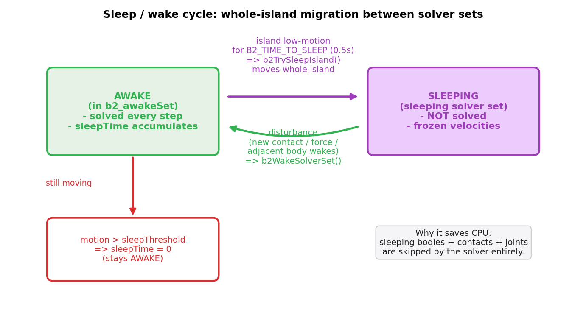
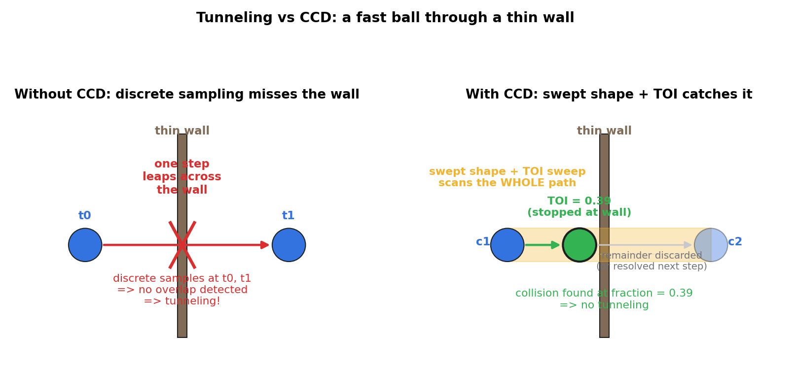
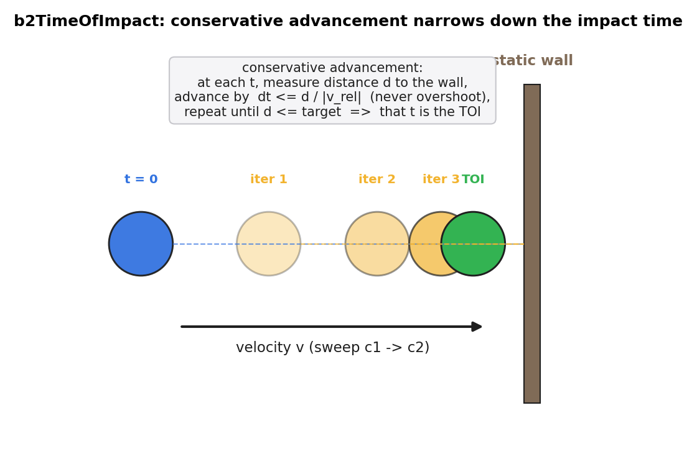
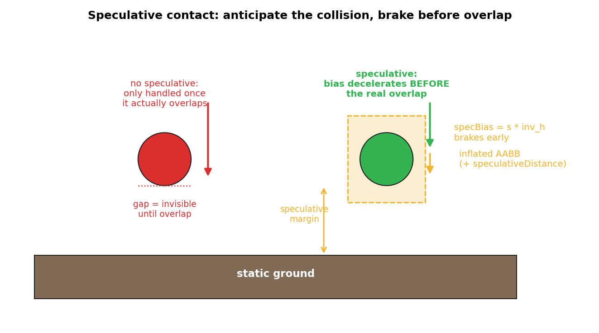

# 第 5 篇 · 第 18 章 · 休眠、连续碰撞 CCD 与稳定性

> **核心问题**:前三章我们让物体撞了能弹开、堆了能不穿透、铰上了能绕轴转。可一个真实场景里有**几千个物体**,它们绝大多数时候**一动不动**地躺在地上——为什么还要每帧都给它们跑一遍约束求解?又有一类**高速物体**(子弹、被大力踢出的球),它们一个时间步能跨过一面**比一步还薄的墙**,离散采样根本"没看见"那堵墙,于是**穿墙而过**(tunneling)。还有堆叠时的细微抖动,看着没事,长期累积就让人不舒服。本章就是第 5 篇的收尾,把这三个**横切**全场景的稳定性问题一次性讲清:① 静止物体怎么**休眠**省算力;② 高速物体怎么用**连续碰撞检测 CCD** 防穿透;③ **恢复系数阈值**等抖动兜底。

> **读完本章你会明白**:
> 1. 休眠凭什么省算力:静止物体的整座"岛"被搬进**睡眠 solver set**,求解器整步跳过它。
> 2. 为什么离散检测会 tunnel(穿墙),CCD 用什么"扫掠 + 时间冲击 TOI"把连续运动重新捡回来。
> 3. ★**v3.2 的 CCD 真实落地 = speculative contacts(每帧预判)+ TOI sweep(对高速物体扫掠)**,不是老资料泛泛说的 "sub-stepping"。
> 4. restitution 阈值怎么压住堆叠的微小反弹抖动,以及为什么不能把它设太小。
> 5. 三个机制共同回答一个问题:**离散近似怎么在静止、高速、临界三种极端下都保持稳定**。

> **如果一读觉得太难**:先只记三件事——① 静止物体整岛休眠,求解器跳过;② 高速物体可能穿墙,CCD 用扫掠形状 + TOI 把整段位移连续检测,救回来;③ 太小的反弹用阈值吃掉,防抖。源码细节可先略过。

---

## 〇、一句话点破

> **休眠省的是"不该动的",CCD 救的是"动得太快看不住的",阈值兜的是"临界抖个不停的"——三者都在补"离散近似"在不同极端下的漏洞。本质同源:物理连续,引擎离散,离散会在静止、高速、临界三种极端下露馅,这三个机制各管一头。**

这是结论。本章倒过来拆:先讲静止物体为什么要休眠、怎么判定"够静止"、怎么整岛搬走;再讲高速物体为什么会穿墙、CCD 怎么把穿墙救回来(并诚实标注 v3.2 的真实落地);最后讲抖动兜底。

---

## 一、休眠:静止物体凭什么不参与求解

### 提问:几千个堆在地上的箱子,真有必要每帧都解约束吗

想象一个典型游戏场景:一座用几百个箱子码起来的堡垒。游戏开始,箱子们落下来、互相挤压、最终**静止**地堆在一起。然后玩家走开去别处冒险,这几百个箱子**一动不动**地待了十分钟。

可物理引擎如果"老实",它每帧(`dt = 1/60` 秒)都要:给这几百个箱子积分速度、检测它们彼此的接触、跑 Sequential Impulse 迭代解约束、积分位置。**一分钟就是 60 帧 × 几百个箱子 × 多个接触点 × 多轮迭代**——而这几百个箱子其实一毫米都没动。这是纯粹的浪费。

> **不这样会怎样**:如果不做休眠,一座静态堆叠的堡垒会持续吃掉相当一部分 CPU 预算(场景越大越明显),留给渲染、AI、网络同步的预算就少了。在移动端尤其致命。物理引擎必须有个机制:**认出"这些物体已经稳定了",把它们移出求解循环**。

这就是**休眠(sleeping)**。

### 朴素做法会撞什么墙

最朴素的休眠判定:**看速度**。物体的线速度、角速度都低于某个阈值,就算它"静止"了,移出求解。

可这个判定有两道墙:

1. **数值噪声**:哪怕物体物理上完全静止,约束求解器每轮施加的微小冲量、积分误差,会让它的速度在零附近**抖动**(比如 `1e-4` 量级)。如果阈值设太低,物体永远"不够静止"进不了睡眠;阈值设太高,真正该弹的小碰撞被忽略。
2. **约束传递**:如果物体 A 睡了,它的邻居 B(和 A 有接触)还在动,B 一动就该把 A 撞醒——可若 A 已经在睡眠集合里、求解器根本不看它,这个"撞醒"就漏了。所以休眠不能按"单个物体"判定,**必须按"岛"(island,互相通过接触/关节连成一簇的物体集合)整体判定、整体迁移**。

> **所以这样设计**:休眠以**岛**为单位——只有当一座岛里**所有**物体都持续低速达到 `B2_TIME_TO_SLEEP` 时间,整座岛才被搬进睡眠集合;任何一个物体被扰动,整座岛(连同它牵连的邻居)一起被唤醒。这样既不会漏掉"邻居撞醒",又把迁移开销摊到"很少发生"的事件上。

为什么必须是"整岛"而不是"单个物体"?可以从两个角度理解。**正确性角度**:如果允许单个物体独立入睡,A 睡了 B 没睡,B 一动,求解器这一步只处理 B(在 `b2_awakeSet` 里),根本不碰 A(在睡眠集合里)。可 A 和 B 有接触,B 的位移会改变它们之间的穿透关系——A 必须被更新,否则下一帧 A 和 B 可能已经互相嵌进去半截,A 却还停留在旧的睡眠位置。要避免这个,要么不允许 A 睡(退化成没有休眠),要么 B 一动就把 A 唤醒。后者正是 Box2D 的选择,而"唤醒"的最小自然单位就是岛——因为接触/关节把 A、B 和它们的所有邻居连成一簇,任何一个动,这一簇的状态都可能变,都得重新求解。**性能角度**:如果按单个物体判定入睡,每次有物体被扰动就要逐个检查"该不该唤醒它",这个检查本身要遍历接触图,并不便宜。整岛判定把"该不该唤醒"简化成"这座岛有没有任何一个物体在 `b2_awakeSet` 里"——一次位集合查询就够(`awakeIslandBitSet`),常数时间。这是把图遍历的开销换成了位运算,工程上非常划算。

### 源码佐证:睡眠判定与整岛迁移

睡眠的"够静止"判定,在求解器收尾阶段([src/solver.c](../box2d/src/solver.c) 的 `b2FinalizeBodiesTask`)。每个物体每帧算一个"睡眠速度":

```c
// src/solver.c  (简化示意, 非源码原文, 仅展示逻辑)
// 用物体最远点的速度来兼顾旋转
float maxVelocity     = b2Length( v ) + b2AbsFloat( w ) * sim->maxExtent;
float maxDeltaPosition = b2Length( state->deltaPosition )
                       + b2AbsFloat( state->deltaRotation.s ) * sim->maxExtent;

// 睡眠既看真实速度, 也看位置修正量 (约束求解做的位置纠偏也算"动过")
float positionSleepFactor = 0.5f;
float sleepVelocity = b2MaxFloat( maxVelocity,
                                  positionSleepFactor * invTimeStep * maxDeltaPosition );

if ( enableSleep == false
     || ( body->flags & b2_enableSleep ) == 0
     || sleepVelocity > body->sleepThreshold )
{
    // 物体不够困, 睡眠计时清零
    body->sleepTime = 0.0f;
    ...
}
else
{
    // 够困, 累积睡眠计时
    body->sleepTime += timeStep;
}
```

关键点:① `sleepVelocity` 同时看**真实速度**和**位置修正量**(`deltaPosition`)——为什么?因为约束求解器为了消除穿透会做位置纠偏(P5-16 讲的 stabilization),哪怕物体真实速度是零,它每帧仍可能被求解器"推"一小下。把这个也算进去,才不会被"看着静止、实际还在被推"的物体骗进睡眠。换个说法:休眠要确认的是"物体真的不动了",而不仅仅是"它的速度是零"——因为约束求解的位置纠偏是一种"无速度的位移",只看速度会被它蒙蔽。代码里 `positionSleepFactor = 0.5f` 给位置修正打了个五折,理由是注释里写的"Position correction is not as important for sleep as true velocity"——真实运动比位置纠偏更说明物体没稳定,所以位置修正的权重低一半。这是一个很细腻的工程权衡。② `body->sleepThreshold` 是每个物体自己的阈值(可在 body 创建时设),默认值由世界级配置给出。每个物体单独的阈值是必要的——一个沉重的铁箱和一个轻飘飘的气球,判定"够静止"的速度标准显然不同。

然后是整岛判定:

```c
// src/solver.c  (简化示意)
b2Island* island = b2Array_Get( world->islands, body->islandId );
if ( body->sleepTime < B2_TIME_TO_SLEEP )        // B2_TIME_TO_SLEEP = 0.5f
{
    // 这座岛里有任何一个物体还没睡够, 整岛保持清醒
    b2SetBit( awakeIslandBitSet, island->localIndex );
}
```

> **钉死这件事**:一个物体"想睡"还不够,**整座岛都得想睡**。只要有任意一个物体 `sleepTime < 0.5s`,它就把整座岛钉在清醒集合里。这是 P5-16 讲约束求解时埋的伏笔——约束把物体连成岛,休眠也以岛为最小单位。常量 `B2_TIME_TO_SLEEP = 0.5f`([include/box2d/constants.h:73](../box2d/include/box2d/constants.h#L73)):物体要**连续静止半秒**才算"睡着了"。

真正把整座岛搬进睡眠集合的,是 [src/solver_set.c:155](../box2d/src/solver_set.c#L155) 的 `b2TrySleepIsland`:

```c
// src/solver_set.c  (简化示意)
void b2TrySleepIsland( b2World* world, int islandId )
{
    b2Island* island = b2Array_Get( world->islands, islandId );
    // 若这座岛还有待分裂的约束变更 (constraintRemoveCount > 0), 暂不睡
    if ( island->constraintRemoveCount > 0 && island->bodies.count > 1 )
        return;

    // 申请新的 sleeping solver set
    int sleepSetId = b2AllocId( &world->solverSetIdPool );
    b2SolverSet* sleepSet = b2Array_Get( world->solverSets, sleepSetId );
    *sleepSet = ( b2SolverSet ){ 0 };
    sleepSet->setIndex = sleepSetId;

    // 把这座岛的所有 bodySim 从 awakeSet 整体搬到 sleepSet
    for ( int i = 0; i < island->bodies.count; ++i )
    {
        b2Body* body = b2Array_Get( world->bodies, island->bodies.data[i] );
        int awakeBodyIndex = body->localIndex;
        b2BodySim* awakeSim = b2Array_Get( awakeSet->bodySims, awakeBodyIndex );

        // 复制到睡眠集合
        b2BodySim* sleepBodySim = b2Array_Emplace( sleepSet->bodySims );
        memcpy( sleepBodySim, awakeSim, sizeof( b2BodySim ) );

        // 从清醒集合摘掉 (swap-remove)
        b2RemoveBodySim( &awakeSet->bodySims, &world->bodies, awakeBodyIndex );
        (void)b2Array_RemoveSwap( awakeSet->bodyStates, awakeBodyIndex );

        body->setIndex = sleepSetId;          // 关键: 标记归属变了
        body->localIndex = sleepBodyIndex;
        ...
    }
    ...
}
```

注意 `body->setIndex = sleepSetId`——每个物体身上记着自己现在归哪个 solver set。求解器每步只遍历 `b2_awakeSet` 里的物体(`b2_awakeSet` 是固定下标 0,[src/physics_world.c:215](../box2d/src/physics_world.c#L215) 初始化时钉死),凡是 `setIndex != b2_awakeSet` 的物体,这一步**根本不会被积分、不会被求解**。这就是休眠省算力的根:不是"少算一点",而是**整个移出求解循环**。

### 唤醒:邻居一撞,整岛复活

物体睡了不是永远睡。只要有一个"外部扰动"碰到它——别的清醒物体新建了和它的接触、用户对它施了力、它被关节连到一个刚醒来的物体上——它(和它整座岛)必须立刻被搬回 `b2_awakeSet`,重新参与求解。这就是 [src/solver_set.c:35](../box2d/src/solver_set.c#L35) 的 `b2WakeSolverSet`:

```c
// src/solver_set.c  (简化示意)
void b2WakeSolverSet( b2World* world, int setIndex )
{
    B2_ASSERT( setIndex >= b2_firstSleepingSet );
    b2SolverSet* set       = b2Array_Get( world->solverSets, setIndex );
    b2SolverSet* awakeSet  = b2Array_Get( world->solverSets, b2_awakeSet );
    b2SolverSet* disabledSet = b2Array_Get( world->solverSets, b2_disabledSet );

    int bodyCount = set->bodySims.count;
    for ( int i = 0; i < bodyCount; ++i )
    {
        b2BodySim* simSrc = set->bodySims.data + i;
        b2Body* body = bodies + simSrc->bodyId;
        body->setIndex = b2_awakeSet;          // 搬回清醒集合
        body->localIndex = awakeSet->bodySims.count;
        body->sleepTime = 0.0f;                 // 重置睡眠计时

        // 复制 bodySim 回去, 并给它一个干净的 bodyState (速度沿用冻结前的)
        b2BodySim* simDst = b2Array_Emplace( awakeSet->bodySims );
        memcpy( simDst, simSrc, sizeof( b2BodySim ) );
        b2BodyState* state = b2Array_Emplace( awakeSet->bodyStates );
        *state = b2_identityBodyState;
        state->flags = body->flags;

        // 把它身上的非接触型 contact 从 disabledSet 一并搬回 awakeSet ...
        // (省略: 接触和关节也要从睡眠集合搬回约束图)
    }
    // 销毁这个睡眠集合 (空了)
    b2DestroySolverSet( world, setIndex );
}
```

唤醒是睡眠的逆操作:整岛(连同它的接触、关节)从睡眠集合搬回 `b2_awakeSet`,睡眠计时清零,重新接入约束图。值得注意的是 `b2_disabledSet` 这个常驻集合——它存的是"两个物体没真正碰到、只是 AABB 重叠"的**非接触型 contact**(P5-16 提过的 non-touching contacts)。唤醒时这些也要一并归位,否则物体醒了却"看不见"邻居。

整张睡眠/唤醒的状态机画出来是这样:



### API 与开关

休眠默认开启,可在世界级整体关掉:

```c
// include/box2d/box2d.h
B2_API void b2World_EnableSleeping( b2WorldId worldId, bool flag );
B2_API bool b2World_IsSleepingEnabled( b2WorldId worldId );
```

([include/box2d/box2d.h:113-116](../box2d/include/box2d/box2d.h#L113-L116))。关闭休眠的场景:需要逐帧精确监控所有物体运动(比如某些机器人物理仿真),宁可多花 CPU 也不接受"瞬间冻结"。但 Box2D 注释里也提醒:如果你的应用**不需要**休眠,关掉它能省一点点管理开销;反过来,绝大多数游戏都该开着。

> **钉死这件事**:休眠省算力的根,是**把静止物体的整座岛搬出 `b2_awakeSet`,求解器这一步完全跳过它**。判定以岛为单位(任一物体没睡够整岛不清醒),迁移是整岛 memcpy + swap-remove,开销集中在"入睡/唤醒"这种偶发事件上。这是 Box2D 能撑住大场景的关键之一。

---

## 二、连续碰撞检测 CCD:高速物体凭什么不穿墙

### 提问:一个离散步太大,会发生什么

休眠处理的是"不该动的"。CCD 处理的是相反的极端:**动得太快的**。

回到全书反复强调的那条根本矛盾——**真实物理连续,计算机离散**。物理引擎每个时间步把物体的位置**采样**成一个点:这一帧它在 A,下一帧它在 B,引擎只在这两个采样点检测碰撞。问题是,如果物体这一步**跨得太远**,而中间正好有一面**比这一步还薄**的障碍,会怎样?



左图就是 **tunneling(穿透)**:一个高速子弹,这一帧从墙的左边飞到墙的右边,两个采样点都不和薄墙重叠,离散检测报告"没碰",子弹就**穿墙而过**了。

> **不这样会怎样**:不加 CCD,任何"一步位移 > 障碍厚度"的高速物体都可能穿墙。子弹穿墙、快速挥舞的武器穿过角色、被大力撞飞的物体飞出关卡边界——这些都是 tunneling 的真实表现。游戏里一旦出现,玩家的物理沉浸感瞬间崩塌。

### 为什么会 tunnel:离散采样把连续运动丢成了点

要理解 CCD 怎么救,先彻底搞懂 tunneling 为什么发生。根源是**离散采样丢了"中间过程"**。

物理引擎一个时间步里,物体的运动其实是**连续的一段轨迹**:从 `c1`(这一帧开始位置)到 `c2`(这一帧结束位置),中间经过无数个点。可离散检测只在 `c1` 和 `c2` 两个端点(或再加上约束求解后的某个中间态)做几何相交判断。如果这段轨迹中间穿过一面薄墙,而 `c1`、`c2` 都在墙的同一侧(或两侧但不重叠),薄墙就被"跳过"了。

用数学说:设物体半径 `r`,薄墙厚度 `w`,这一步位移 `d = |c2 - c1|`。离散检测能看见墙的条件,粗略地是物体在 `c1` 或 `c2` 的圆盘和墙相交,即墙的某一侧到端点距离 `<= r`。当 `d > w + 2r`(位移比墙加物体直径还大),墙就可能整个夹在两个采样点之间,完全漏检。

> **承 P2-08**:这正是第 2 篇讲固定步长时埋的雷——固定步长 `dt` 越大,一步位移 `d = v·dt` 越大,tunneling 越容易发生(见《固定步长与稳定性》)。缩短 `dt` 能缓解(步子小了,`d` 小了),但代价是每秒帧数翻倍、CPU 翻倍;而且对于足够快的物体(比如真速度的子弹),`dt` 缩到多小都不够。所以物理引擎需要一种**不靠缩小 `dt` 也能防穿透**的机制——CCD。

### 朴素做法:子步进(sub-stepping),撞什么墙

最朴素的 CCD 想法:**把一个大步切成 N 个小步**,每个小步检测一次。这叫 **sub-stepping**。它确实能缓解——步子小了,漏检概率低了。

可 sub-stepping 撞两道墙:

1. **不知道切多细才够**:物体速度可变,`d` 可大可小,你不知道 N 取多少才能保证每个子步都不漏。取太大还是穿,取太小 CPU 烧。
2. **均匀切太浪费**:大多数物体大多数时候不快,给它们也切 N 步是纯浪费。真正需要细切的只是少数高速物体。

> **所以这样设计**:CCD 不该对所有物体无差别子步进,而该**只针对"够快"的物体**,并且用一种**自适应、能精确定位碰撞时刻**的方法——这就是**时间冲击 TOI(Time of Impact)**。

### CCD 的核心:扫掠形状 + 时间冲击 TOI

CCD 的思路,是把"连续运动"重新捡回来。具体两步:

**第一步:扫掠形状(swept shape)**。把物体这一步的位移 `c1 → c2` 当成一段扫掠,生成一个"扫掠过的体积"(2D 里就是物体沿轨迹扫出的形状)。这个扫掠形状和障碍做相交检测——只要扫掠形状碰到了障碍,说明这一步的**某处**发生了碰撞。

**第二步:时间冲击 TOI**。扫掠形状相交只告诉我们"这一步里碰撞发生了",没说**在哪一刻**发生。TOI 要算的,正是碰撞发生在这个时间步的**哪个分数** `fraction ∈ [0, 1]`(`fraction=0` 是步初,`fraction=1` 是步末)。算出 TOI 后,把物体**只前进到 TOI 那一刻**就停下,剩下的位移留到后续步骤处理(或直接丢弃,看策略)。

#### TOI 怎么算:保守前进(conservative advancement)

TOI 的经典算法叫**保守前进(conservative advancement)**,Box2D 的 `b2TimeOfImpact` 用的就是它的演化版([src/distance.c:1143](../box2d/src/distance.c#L1143))。直觉是:从步初 `t1=0` 开始,**每次前进一个保证不会穿透的量**,一步步逼近真正的碰撞时刻。

```c
// src/distance.c  (b2TimeOfImpact, 大幅简化示意)
b2TOIOutput b2TimeOfImpact( const b2TOIInput* input )
{
    float target = b2MaxFloat( B2_LINEAR_SLOP, totalRadius - B2_LINEAR_SLOP );
    float tolerance = 0.25f * B2_LINEAR_SLOP;
    float t1 = 0.0f;                       // 从步初开始
    const int k_maxIterations = 20;

    for ( ;; )
    {
        // 在 t1 时刻取两形状的位姿, 算它们当前的最近距离
        b2Transform xfA = b2GetSweepTransform( &sweepA, t1 );
        b2Transform xfB = b2GetSweepTransform( &sweepB, t1 );
        b2DistanceOutput distanceOutput = b2ShapeDistance( ... );   // GJK!

        if ( distanceOutput.distance <= 0.0f )
        {
            // 已经重叠, 碰撞在 t1 或更早
            output.state = b2_toiStateOverlapped;
            output.fraction = 0.0f;
            break;
        }
        if ( distanceOutput.distance <= target + tolerance )
        {
            // 够近了, 认定这就是碰撞时刻
            output.state = b2_toiStateHit;
            output.fraction = t1;
            break;
        }

        // 估计还能前进多少: 用当前距离 / 相对速度沿分离方向的分量
        // (保守: 保证不会冲过去)
        float dxb = ...;   // 分离方向上 B 相对 A 的速度
        float advance = ...;   // <= distance / |relative speed|
        t1 += advance;
        if ( t1 >= tMax ) { /* 这一步内没碰上 */ break; }
    }
    return output;
}
```

注意它内部调的 `b2ShapeDistance`——这正是 P4-13 讲的 **GJK**(算两凸形状最近距离)。所以 CCD 不是凭空的新算法,它**复用了窄相的 GJK**:在扫掠轨迹的每个候选时刻,用 GJK 算当前距离,根据距离和相对速度估计还能安全前进多少,迭代逼近 TOI。这就是为什么我们说 CCD 是"检测侧"的工具——它本质是**把窄相检测沿时间轴展开**。

#### 一段历史:conservative advancement 的来历

"保守前进"这个思路不是 Box2D 发明的。它的早期形式可以追溯到机器人路径规划领域(20 世纪 80 年代的 Cameron、Lozano-Pérez 等人的工作,原本用来做机械臂的碰撞回避),后来被 Erin Catto(Box2D 作者)在 2000 年代的 GDC 演讲里引入实时物理仿真,经过多轮改进成了今天 Box2D 用的样子。它的核心洞察极其朴素却有力:**与其一次性算出精确碰撞时刻(很难),不如反复地问"现在我离它多远?按当前速度我最多还能安全走多远?"——每次只走这个安全距离的一小部分,永远不会冲过头。** 这是个典型的"迭代逼近"思路,和 P5-16 讲的 Sequential Impulse"反复迭代修正违反的约束"是同一种数值哲学(《数学分析》的迭代法思想在物理引擎里的又一次落地)。

为什么说它"保守"?因为它每一步的前进量严格不大于"距离/速度"——按当前速度走这么远,最坏情况也就是刚刚贴上,绝不会穿透。这个"宁可慢一点也不穿透"的保守性,是它名字的由来,也是它比"均匀切步"安全的根本原因:均匀切步不知道切多细才够,保守前进每一步都自适应地保证安全。代价是"时间损失(time loss)"——因为每步只前进安全距离的一部分(不是全部),算出的 TOI 会比真实碰撞时刻**略晚**一点(物体可能稍微嵌进去一点点才被检测到),这个嵌入由后续的约束求解(位置纠偏)消除。这是一个精度和稳定性的权衡,源码注释里也提到("This handles slender geometry well but introduces significant time loss")。

保守前进的过程画出来:



> **钉死这件事**:TOI 不是暴力切步,而是**用 GJK 在每个候选时刻测距,按距离/速度自适应前进**。离得远就大步前进,离得近就小步逼近,最多 20 次迭代收敛到碰撞时刻。它比均匀 sub-stepping 高效得多,而且**只对被标记为"够快"的物体跑**。

### v3.2 的真实落地:speculative contacts + TOI sweep(★诚实标注)

讲到这里必须做一个**关键诚实标注**,因为很多老资料(和总纲的简化措辞)讲 CCD 时,要么泛泛说"sub-stepping / swept shape",要么把它当成一个独立的大模块。**Box2D v3.2 的真实落地是两层叠加,且只对高速物体跑完整 TOI**:

#### 第一层:speculative contacts(每帧对所有接触预判)

这是**默认常开**的一层,不挑物体。它的思路是:**别等真的穿透了再处理,提前一点就开始施加约束力,把碰撞"刹"在发生之前**。

具体怎么"提前":接触流形的生成(P4-14)本来只对**真正重叠**的形状产接触点。speculative contacts 把这个判定**放宽**一个 `B2_SPECULATIVE_DISTANCE`([include/box2d/constants.h:55](../box2d/include/box2d/constants.h#L55)):

```c
#define B2_LINEAR_SLOP          ( 0.005f )   // 5mm
#define B2_SPECULATIVE_DISTANCE ( 4.0f * B2_LINEAR_SLOP )   // = 2cm
```

也就是说,两个形状**还没真正碰到、但距离已在 2cm 以内**,窄相也会给它们生成一个**带正分离量**的接触点(`separation > 0`)。这个" speculative 接触点"在约束求解时怎么处理?看 [src/contact_solver.c:1924-1931](../box2d/src/contact_solver.c#L1924-L1931):

```c
// src/contact_solver.c  (约束求解时, 对每个接触点算 bias)
b2FloatW s = b2AddW( b2DotW( c->normal, ds ), c->baseSeparation1 );

// 如果分离量 s > 0 (还没真碰到, 是 speculative 接触):
//   用 speculative bias = s * inv_h  (按"这一步内会撞上"的假设施力)
// 如果 s <= 0 (已经重叠):
//   用 soft constraint bias (P5-16 讲的软约束, 按 biasRate 施力)
b2FloatW mask    = b2GreaterThanW( s, b2ZeroW() );
b2FloatW specBias = b2MulW( s, inv_h );                         // 预判
b2FloatW softBias = b2MaxW( b2MulW( biasRate, s ), contactSpeed );  // 软约束
b2FloatW bias     = b2BlendW( softBias, specBias, mask );
```

关键在 `specBias = s * inv_h`。`inv_h = 1/子步步长`。这个式子的物理含义是:**假设物体按当前速度继续走,这一步内会正好把分离量 `s` 消耗掉(撞上)**,于是提前施加一个大小为 `s/t` 的"减速 bias"——如果物体真的撞上了,这个 bias 正好把它刹住;如果物体其实没撞上(比如被别的力改变了方向),这个 bias 因为对应的冲量会被钳制(下面讲),也不会造成错误的推力。

这个 `s * inv_h` 的形式,和 P5-16 讲的软约束 bias(`biasRate × s`)是同一族——都是"按分离量施加一个推向零分离的修正速度"。区别在于系数:软约束的 `biasRate` 来自接触的 hertz/阻尼比(可控的弹性),而 speculative 的系数被钉死成 `inv_h`(表示"这一步内必须把分离消掉")。源码里用 `mask`(分离是否大于零)在两者间 blend:`s > 0` 用 speculative(还没碰到,激进地按"马上要碰"处理),`s <= 0` 用软约束(已经重叠,温和地按弹性推开)。这个分支是 v3.2 把"预判"和"实碰"统一进同一个约束求解框架的关键——同一个接触点,根据分离正负自动切换策略,不需要两套代码。

speculative contacts 的好处是**便宜**(只是放宽了接触生成阈值 + 多算一个 bias),坏处是**只能预判"差一点点"的碰撞**(2cm 以内)。对于一步跨 1 米的子弹,2cm 根本不够——这就需要第二层。

为什么是 2cm 这个值?它是 `4 × B2_LINEAR_SLOP`,而 `B2_LINEAR_SLOP = 0.005m = 5mm` 是整个 Box2D 的"数值噪声地板"(所有穿透容差、位置纠偏都基于它)。把 speculative 裕量设成 slop 的 4 倍,是个经验值——小于这个,裕量太窄防不住正常速度的物体;大于这个,物体会在没真正靠近时就互相"感觉得到",产生不自然的提前减速。注释里也警告:"modifying this can have a significant impact on performance and stability"——它是个牵一发动全身的常量。这个 2cm 还有另一层意义:它正好覆盖了大多数"正常速度(几 m/s)× 一个时间步(1/60s)"的位移量,也就是说,对于普通速度的物体,speculative 一层就足够防止穿透,根本不需要触发昂贵的 TOI。这是 speculative 作为"广覆盖廉价层"的设计目标。



#### 第二层:TOI sweep(只对"够快"的物体)

真正的高速穿透,要靠完整的 TOI 扫掠来救。但 TOI 比较贵(每次调 GJK + 迭代),不可能每帧对所有物体跑。v3.2 的策略是:**只对这一步位移"够大"的物体打上 `b2_isFast` 标志,只对它们跑 TOI sweep**。

`b2_isFast` 的判定在 finalize 阶段([src/solver.c:634-657](../box2d/src/solver.c#L634-L657)):

```c
// src/solver.c  (简化示意)
if ( enableSleep == false || ... || sleepVelocity > body->sleepThreshold )
{
    body->sleepTime = 0.0f;

    // 这一步的最大位移 = max(位置修正量, 速度×步长)
    const float safetyFactor = 0.5f;
    float maxMotion = b2MaxFloat( maxDeltaPosition, maxVelocity * timeStep );

    // 如果位移 > 0.5 × 物体最小尺寸, 判定为"够快", 标记 b2_isFast
    if ( body->type == b2_dynamicBody && enableContinuous
         && maxMotion > safetyFactor * sim->minExtent )
    {
        sim->flags |= b2_isFast;
        if ( sim->flags & b2_isBullet )   // bullet 类型进单独数组稍后处理
        {
            int idx = b2AtomicFetchAddInt( &stepContext->bulletBodyCount, 1 );
            stepContext->bulletBodies[idx] = simIndex;
        }
        else
        {
            b2SolveContinuous( world, simIndex, taskContext );   // 立刻做 TOI sweep
        }
    }
}
```

> **钉死这件事**:`b2_isFast` 的判定是 `maxMotion > 0.5 × minExtent`——一步位移超过物体最小尺寸的一半才算"够快"。一个直径 1 米的球,要一步移动超过 0.5 米才会触发 TOI;一个 5cm 的小子弹,一步移动 2.5cm 就触发。这是自适应的:小物体更容易被标 fast(因为它们更容易穿过薄墙),大物体阈值高。这就是为什么 Box2D 不需要用户手动指定"哪些物体要 CCD"——它按物体尺寸自适应判定。

被标 `b2_isFast` 的物体,进入 `b2SolveContinuous`([src/solver.c:386](../box2d/src/solver.c#L386),Tracy 性能 zone 标的就是 `ccd`)。它干的事:

1. **算扫掠 AABB**:把物体这一步 `c1 → c2` 的位移,生成一个包住整段轨迹的 AABB(`b2AABB_Union(box1, box2)`)。
2. **用扫掠 AABB 查动态树**:在静态/运动学/动力学树里查"哪些物体的 AABB 和我这个扫掠 AABB 相交"——这是复用宽相的动态树查询(`b2DynamicTree_Query`)。
3. **对每个候选障碍,算 TOI**:对查到的每个候选,调 `b2TimeOfImpact` 算"我这一步会在哪个 fraction 撞上它"([src/solver.c:318](../box2d/src/solver.c#L318))。取**最早**的 TOI。
4. **把物体前进到 TOI 那一刻**:如果最早 TOI `< 1`(这一步内会撞上),把物体的位姿**只前进到 TOI 时刻**就停下([src/solver.c:455-467](../box2d/src/solver.c#L455-L467)):

```c
// src/solver.c  (简化示意)
if ( context.fraction < 1.0f )
{
    // 按 fraction 插值, 把物体只前进到碰撞那一刻
    b2Rot q = b2NLerp( sweep.q1, sweep.q2, context.fraction );
    b2Vec2 c = b2Lerp( sweep.c1, sweep.c2, context.fraction );
    fastBodySim->transform.q = q;
    fastBodySim->transform.p = ...;
    fastBodySim->center = ...;
    fastBodySim->rotation0 = q;        // 冻结, 剩余位移不再走
    fastBodySim->center0 = fastBodySim->center;
    ...
    fastBodySim->flags |= b2_hadTimeOfImpact;   // 标记: 这一步被 TOI 截停
}
```

物体被截停在碰撞点后,**这一步剩余的位移被丢弃**(不继续前进)。下一帧,这个接触已经是真的接触(物体贴在障碍表面),正常的约束求解会接管,把它弹开或让它停下。这就是 CCD 救穿透的完整过程。

> **★诚实标注(修正总纲/锚点)**:本系列源码事实锚点(第 6 节)原本写"v3.2 的 CCD 主体是 mover 系统(`b2World_CastMover`/`b2World_CollideMover`)"。**经现场核实源码,这个说法需要修正**:`mover.c` + `b2World_CastMover`/`b2World_CollideMover` 是 **character controller(角色控制器)** 的工具——它用一个 `b2Capsule` 作 mover,把角色的**期望位移**当成扫掠胶囊,收集碰撞平面(`b2CollisionPlane`),再用 `b2SolvePlanes`(平面求解器, [src/mover.c:7](../box2d/src/mover.c#L7))算出"不穿透的实际位移"。这是给**运动学角色**(kinematic character)做手动移动 + 滑墙用的,**不是刚体动力学的 CCD**。刚体 CCD 的真正主体是上面讲的 **`b2TimeOfImpact`(TOI sweep)+ speculative contacts** 这两层,代码在 `src/solver.c`(`b2SolveContinuous`/`b2ContinuousCollision`)和 `src/contact_solver.c`(specBias)。这是 v3.2 相对早期资料的一个重要演进:老资料讲的 "swept shape / sub-stepping" 是通用概念,v3.2 把它落成了"speculative 常开 + TOI 按需"的工程化分层。

### API 与开关

```c
// include/box2d/box2d.h
B2_API void b2World_EnableContinuous( b2WorldId worldId, bool flag );
B2_API bool b2World_IsContinuousEnabled( b2WorldId worldId );
```

([include/box2d/box2d.h:122-125](../box2d/include/box2d/box2d.h#L122-L125))。注释明说:"Generally you should keep continuous collision enabled to prevent fast moving objects from going through static objects. The performance gain from disabling continuous collision is minor."——Box2D 官方建议默认开着,关掉省的 CPU 很有限,但穿墙风险大。

另外有个相关的 body 级标志 `b2_isBullet`。普通物体触发 TOI 后**立刻**做扫掠(`b2SolveContinuous`);而标了 `bullet` 的物体(典型用法:子弹、高速抛射物)会被**收集进单独数组**,在所有普通物体的连续碰撞处理完之后**统一**做 TOI sweep([src/solver.c:648-652](../box2d/src/solver.c#L648-L652))。为什么?因为子弹可能和**其他动态物体**相撞(不只是静态墙),把它放到最后处理,可以基于"别人都已经移动到位"的状态做更准确的扫掠。这是 bullet 和普通 fast 物体的细微差别。

> **钉死这件事**:CCD 救穿透靠**把整段位移连续检测**——speculative contacts 廉价地预判"差一点点"的碰撞(2cm 裕量,默认常开),TOI sweep 精确定位"一步跨很远"的碰撞时刻(只对 `b2_isFast` 物体跑,自适应按物体尺寸判定)。两层叠加,既覆盖大多数情况又把贵的 TOI 限制在少数物体上。这是 v3.2 的工程化分层,不是老资料的"一刀切 sub-stepping"。

---

## 三、稳定性兜底:restitution 阈值与速度封顶

### 提问:堆叠的箱子为什么会"莫名抖动"

休眠和 CCD 解决了两个极端(静止、高速)。但还有一个让人头疼的中等极端:**临界状态下的抖动**。

想象一堆箱子叠在地上。理想情况下,它们稳定地堆着,速度为零,准备进入休眠。可现实里,约束求解器(P5-16)每轮迭代只能**逼近**精确解,不能完全消除穿透。每帧,箱子们都被求解器推一小下消除残余穿透,然后下一帧重力又把它们往下拉一小下,再被推回去——**位置在平衡点附近做微小振荡**。这个振荡幅度可能只有 0.1mm,玩家肉眼几乎看不见,但它带来两个问题:

1. **永远进不了休眠**:因为 `sleepVelocity` 把位置修正量也算进去了(本章第一节讲过),持续的微小位置修正让 `sleepTime` 永远累积不到 0.5s,物体明明"看着"静止却始终清醒,白吃 CPU。
2. **恢复系数放大抖动**:如果接触设了弹性(restitution),哪怕接近零速度的接触也会按恢复系数施加一个反弹冲量。箱子贴着箱子,接近零速 → 微小反弹 → 又落下 → 又微小反弹……形成**持续的高频抖动**。

> **不这样会怎样**:没有兜底,堆叠场景永远稳定不下来,物体永远在微小抖动,既进不了休眠(浪费 CPU),视觉上也"不对劲"(资深玩家能看出来那种不自然的颤动)。

### 朴素做法撞什么墙

最朴素的办法:**把恢复系数设成零**。这确实能消掉反弹抖动,但它**误伤**——很多场景需要箱子有弹性(掉在地上弹两下才停),全设零就僵了。

另一个朴素办法:**用恢复系数 = 接近法向相对速度**。但"接近零速"的判定阈值设多少?设太大,该弹的碰撞被吃掉(子弹打钢板没反应);设太小,抖动还在。

> **所以这样设计**:把"低于某个速度就不施加反弹"的阈值,**放到世界级**,给个合理默认值(`1.0 m/s`),让用户按场景调。这就是 **restitution threshold**。

### 源码佐证:restitution threshold 怎么吃掉微反弹

恢复系数的处理在求解的 `b2_stageRestitution` 阶段(阶段流水线见 P5-16)。逻辑是:求解器先把不穿透约束解完(让物体贴住不穿透),然后**后处理**一遍,看哪些接触"撞得够重"需要额外施加反弹冲量。判定就靠阈值:

```c
// src/contact_solver.c  (b2ApplyRestitution_Overflow, 简化示意)
float threshold = context->world->restitutionThreshold;   // 默认 1.0 m/s

for ( int j = 0; j < pointCount; ++j )
{
    b2ContactConstraintPoint* cp = constraint->points + j;

    // 相对法向速度 > -threshold (即接近零或正向分离), 跳过: 不施加反弹
    // (同时要求这个点真的产生了法向冲量, 跳过 speculative 没撞实的点)
    if ( cp->relativeVelocity > -threshold || cp->totalNormalImpulse == 0.0f )
    {
        continue;
    }

    // 否则: 撞得够重, 按恢复系数施加反弹冲量
    float impulse = -cp->normalMass * ( vn + restitution * cp->relativeVelocity );
    ...
}
```

([src/contact_solver.c:422-484](../box2d/src/contact_solver.c#L422-L484))。关键判定 `cp->relativeVelocity > -threshold`:`relativeVelocity` 是接触点的接近速度(负值表示靠近),`-threshold` 是个负数。当接近速度**很慢**(`relativeVelocity` 接近零,即 `> -threshold`,比如 `-0.3 m/s`),就跳过——不给它施加反弹。只有接近速度**够快**(`relativeVelocity <= -threshold`,比如 `-2 m/s`),才算"真撞了",按恢复系数弹。

> **钉死这件事**:restitution threshold 干的事是——**接近速度低于阈值(默认 1m/s)的接触,不施加反弹冲量**。这一刀切掉的是"贴在一起的两个物体因为数值噪声产生的微小接近",保留的是"真的撞上了"的反弹。它和 speculative contacts 配合:speculative 那些没真正产生冲量的点(`totalNormalImpulse == 0`)也被一并跳过(看注释 "this skips speculative contact points that didn't generate an impulse"),不会因为预判而错误反弹。

API:

```c
// include/box2d/box2d.h
B2_API void b2World_SetRestitutionThreshold( b2WorldId worldId, float value );
B2_API float b2World_GetRestitutionThreshold( b2WorldId worldId );
```

([include/box2d/box2d.h:130-133](../box2d/include/box2d/box2d.h#L130-L133))。默认值 `1.0f * lengthUnits`(米/秒),在 [src/types.c:17](../box2d/src/types.c#L17) 里钉死。Box2D 注释里有个**重要提醒**:"It is recommended not to make this value very small because it will prevent bodies from sleeping."——为什么?因为阈值太小,微小的接近都会触发反弹,物体永远在微弹,`sleepTime` 永远累积不到 0.5s,休眠进不去。这是 restitution threshold 和休眠的耦合点:阈值调太小会**间接废掉休眠**。所以默认 1.0 m/s 是个经验平衡点。

#### 一点工程调参经验

实际项目里,restitution threshold 是个容易被忽略却很影响体感的旋钮。几个经验:

- **堆叠场景**(箱子码城堡、积木):保持默认 1.0 m/s 甚至调高到 2 m/s。堆叠最怕微弹,调高阈值能把更多噪声接触吃掉,堆叠更稳、更快进休眠。
- **需要明显弹性的场景**(弹球、皮球):不要为了"弹得明显"而调低阈值——弹性靠的是接触的 `restitution` 属性(0~1),不是阈值。阈值管的是"够不够格弹",restitution 管的是"弹多狠"。调低阈值只会让噪声也弹,不会让真弹更明显。
- **角色站在地上的脚感**:角色控制器(本章后面提到的 mover)和地面的接触,如果阈值太低,角色站着会感觉"脚底打滑"——每帧微小反弹让角色微微上浮。这种场景阈值宁可高一点。
- **和 CCD 的配合**:高速物体撞墙,TOI 把它截停在墙前,然后 restitution 后处理判定要不要弹。如果阈值高于撞击速度(比如慢速抛射物),即使标了 `restitution=0.8` 也不会弹——这是符合物理的(慢速碰墙本来就该贴上去不弹)。理解这一点能避免"我设了弹性为什么不弹"的困惑。

这一节的小结:restitution threshold 是个**世界级的"够不够格弹"门槛**,和接触级的 `restitution`(弹多狠)是两个正交的旋钮。默认 1.0 m/s 兼顾了堆叠稳定和真实碰撞,调它时要同时考虑它对休眠的间接影响。

### 顺带:速度封顶(speed cap)

还有个和稳定性相关的细节:每个物体的线/角速度有个**上限**(`maxLinearSpeed`/`maxAngularSpeed`),在 finalize 阶段被钳制([src/solver.c:139-153](../box2d/src/solver.c#L139-L153)):

```c
// src/solver.c  (简化示意)
if ( b2Dot( v, v ) > maxLinearSpeedSquared )
{
    float ratio = maxLinearSpeed / b2Length( v );
    v = b2MulSV( ratio, v );
    state->flags |= b2_isSpeedCapped;   // 标记: 速度被封顶了
}
```

为什么封顶?角速度过大(每帧旋转超过 `B2_MAX_ROTATION = 0.25π`)会**破坏连续碰撞**——TOI 的扫掠假设旋转是"温和"的,旋转太快扫掠形状不再准确,可能误判。所以高速旋转的物体被钳制角速度,同时打上 `b2_isSpeedCapped` 标志,后续逻辑(比如是否需要更激进的 CCD)可以参考。这是 CCD 的"护栏":防止极端角速度让 TOI 失准。

---

## 四、技巧精解:为什么 CCD 这样分两层,以及 speculative 的冲量钳制

这一章最值得单独拆透的,是 v3.2 CCD 的**两层分层**和 **speculative contact 不造成错误推力的秘密**。

### 技巧一:为什么是"speculative 常开 + TOI 按需"两层

回顾朴素 CCD 撞的两道墙:sub-stepping 不知道切多细、且对慢物体浪费。v3.2 的两层分层是怎么漂亮解决这两道墙的?

**speculative contacts 解决"大多数接近碰撞"**。它本质是把接触生成的阈值从"真重叠"放宽到"差 2cm"。2cm 这个值是精心选的——它足够小(不会让物体隔空互推),又足够大(覆盖了大多数"这一步差一点就撞上"的情况)。代价只是每个接触点多算一个 bias(几乎免费)。好处是:**不需要知道物体多快**,所有接触一律预判,廉价地兜住了绝大多数"准穿透"。

**TOI sweep 解决"真正的隧道"**。当一个物体一步跨出 1 米,2cm 的 speculative 裕量根本罩不住——物体从裕量这头进去、那头出来,speculative 接触点根本来不及产生力。这时只有完整地把整段位移连续扫掠、精确定位 TOI,才能救。但 TOI 贵(每次调 GJK + 迭代),所以**只对 `b2_isFast` 物体跑**,而 `b2_isFast` 的判定是自适应的(位移 > 物体尺寸的一半)——大物体阈值高不容易触发,小物体阈值低容易触发,正好对症(小物体才容易穿薄墙)。

> **反面对比**:如果只有 speculative(不做 TOI),子弹穿墙;如果只有 TOI(不做 speculative),每帧对所有接触跑 TOI 太贵,而且大量"差一点点"的准碰撞没必要用精确定位,speculative 的提前刹车反而更平滑。两层分工:speculative 廉价广覆盖,TOI 精确窄打击。这是"用便宜手段兜大多数 + 贵手段只打硬骨头"的分层智慧,和宽相(AABB 粗筛)保护窄相(SAT/GJK 精算)是同一种工程哲学(P0-01 讲过的"精确性分层")。

### 技巧二:speculative 接触为什么不造成错误推力

speculative contact 有个乍看很危险的地方:它在两个物体**还没真碰到**(separation > 0)时就施加约束力。万一这两个物体其实**不会**碰上(比如其中一个被别的力改变了方向),这个提前施加的力岂不是错误地把它们推开?

答案在**冲量钳制**。看 [src/contact_solver.c:1945-1948](../box2d/src/contact_solver.c#L1945-L1948):

```c
// src/contact_solver.c  (简化示意)
// 算这一轮要施加的法向冲量 (注意 bias 里混了 specBias)
b2FloatW negImpulse = b2MulW( c->normalMass1,
                              b2AddW( b2MulW( pointMassScale, vn ), bias ) )
                    + b2MulW( pointImpulseScale, c->normalImpulse1 );

// 关键: 累积冲量只能是非负 (单向约束: 只能推, 不能拉)
b2FloatW newImpulse = b2MaxW( b2SubW( c->normalImpulse1, negImpulse ), b2ZeroW() );
b2FloatW impulse    = b2SubW( newImpulse, c->normalImpulse1 );
c->normalImpulse1   = newImpulse;
```

`b2MaxW( ..., b2ZeroW() )` 这一行是关键:**接触冲量被钳制成非负**——法向冲量只能把两个物体**推开**(沿法线正方向),绝不能**拉开**(负冲量)。这是非穿透约束的物理本质:地面只能向上推球,不能向下拉球。

这个钳制对 speculative 的意义:假设两个物体其实不会撞上(物体 A 被别的力推向远离 B 的方向)。这一帧 speculative 接触点的 `vn`(法向接近速度)变成了**正值**(在分离),于是 `negImpulse` 是正的,`newImpulse = max(oldImpulse - 正数, 0)`。如果上一帧累积冲量是零(没真碰过),那 `newImpulse = max(0 - 正数, 0) = 0`——**这一轮施加的冲量是零**。speculative 接触点虽然存在,但因为物体在分离,它**实际上不施加任何力**。

> **钉死这件事**:speculative contact 安全的根,是**法向冲量的非负钳制**。预判的 bias 会"试图"施加力,但只要物体其实没在接近(法向相对速度非负),钳制就把这个力归零。所以 speculative 是"**有备无患**":撞上了它正好刹住,没撞上它不添乱。这是它敢在 separation > 0 时就介入的底气。

这个钳制也解释了 [src/contact_solver.c:465](../box2d/src/contact_solver.c#L465) 那句注释——"this skips speculative contact points that didn't generate an impulse":如果 speculative 接触点这一帧累积冲量是零(没真碰实),restitution 后处理就跳过它,不给它施加反弹。双重保险。

### 技巧三:休眠的 island 整体迁移为什么用 swap-remove

回头看 `b2TrySleepIsland` 和 `b2WakeSolverSet`,它们搬运 bodySim 用的是 `b2Array_RemoveSwap`(把末尾元素 swap 到被删位置,然后数组长度减一)。这是 O(1) 删除,但**改变了数组里其他元素的顺序**。

为什么敢用?因为 `awakeSet->bodySims` 这个数组里的元素顺序**对求解结果没有影响**——求解器遍历它做约束求解,顺序只影响缓存命中率不影响物理结果(约束求解是收敛的,迭代顺序不影响最终解,只影响收敛速度)。所以用 swap-remove 换 O(1) 的迁移开销是划算的。这是性能和"确定性"的权衡:Box2D 保证**给定相同输入、相同迭代次数,结果是确定的**,但不保证"数组里物体排列顺序固定"——后者对物理正确性无关。

> ★顺带一个 v3.2 的工程细节:睡眠迁移用 island 为单位,意味着每次入睡/唤醒是"一批" bodySim 的 memcpy + swap-remove。如果岛很大(几百个物体),单次迁移开销不小——但这种情况很少发生(大岛一旦稳定就长期睡),摊到长时间看仍然划算。这是"偶发大开销换常态零开销"的典型权衡。

---

## 五、章末小结

### 回扣主线

本章是第 5 篇的收尾,服务二分法的**横切**面——它讲的不是"检测谁碰了"或"碰了怎么响应"的新算法,而是**横跨检测和响应、服务整个时间步稳定性的三个机制**:

- **休眠**(省算力):静止物体的整座岛搬进睡眠 solver set,求解器整步跳过。这是对"不该动的物体"的优化。
- **CCD**(防穿透):高速物体可能一步跨过薄墙,用 speculative contacts(廉价预判)+ TOI sweep(精确定位)把连续运动重新捡回来。这是对"动得太快的物体"的补救,本质上**把窄相的 GJK 沿时间轴展开**(承接 P4-13)。
- **restitution 阈值 + 速度封顶**(防抖):临界状态下吃掉微反弹、钳制极端速度,让堆叠稳定、让 CCD 不失准。这是对"临界抖动的物体"的兜底。

三者同源:**物理连续,引擎离散,离散在静止、高速、临界三种极端下都会露馅**,这三个机制各补一头。回到全书主线——物理引擎是"数值近似的假物理",这三个机制就是让这个"假"在极端下也不穿帮的护栏。

### 五个为什么

1. **休眠凭什么省算力?**——静止物体的整座岛被搬进睡眠 solver set(`setIndex != b2_awakeSet`),求解器这一步**完全跳过**它们,不是"少算"而是"不算"。判定以岛为单位(任一物体没睡够整岛不清醒),避免漏掉"邻居撞醒"。
2. **为什么会 tunneling(穿墙)?**——离散检测只在每步的采样点做几何相交,当一步位移 > 障碍厚度,障碍整个夹在两个采样点之间被跳过。根源是离散采样丢了连续运动的中间过程。
3. **CCD 怎么救穿透?**——把整段位移连续检测:speculative contacts 廉价预判"差 2cm 内"的碰撞(默认常开),TOI sweep 用 GJK 自适应迭代精确定位"一步跨很远"的碰撞时刻(只对 `b2_isFast` 物体跑)。物体被截停在 TOI 那一刻,剩余位移丢弃。
4. **★v3.2 的 CCD 真实落地是什么(修正老资料)?**——不是泛泛的 sub-stepping,也不是 mover 系统(mover 是 character controller)。刚体 CCD 是 **speculative contacts(默认常开)+ TOI sweep(按需对 fast 物体)** 两层叠加,代码在 `src/solver.c`(`b2SolveContinuous`)+ `src/contact_solver.c`(specBias)。
5. **restitution 阈值为什么不能设太小?**——阈值太小,微小接近都会触发反弹,物体永远在微弹,`sleepTime` 永远累积不到 0.5s,**间接废掉休眠**。默认 1.0 m/s 是经验平衡点:吃掉堆叠噪声,保留真实碰撞反弹。

### 想继续深入往哪钻

- **想看 TOI 的完整迭代细节**:读 [src/distance.c:1143](../box2d/src/distance.c#L1143) `b2TimeOfImpact` 全文,看它如何处理"狭长几何"(slender geometry)的时间损失、如何用分离轴缓存加速。
- **想看 speculative 的完整 bias 混合**:读 [src/contact_solver.c:1890-2000](../box2d/src/contact_solver.c#L1890-L2000),看 `softBias` 和 `specBias` 如何按 `mask`(separation 正负)blend,以及它和 P5-16 软约束的关系。
- **想看休眠的 island 分裂**:读 `src/island.c`,看一座大岛怎么因为某个物体的约束被移除而**分裂**成两座小岛(`splitIslandId` 机制),以及为什么"想睡但岛要分裂"的物体要先记录、等分裂完再睡([src/solver.c:681-691](../box2d/src/solver.c#L681-L691))。
- **想看 character controller 的 mover**:读 [src/mover.c](../box2d/src/mover.c) 的 `b2SolvePlanes`(平面求解器),理解它和刚体 CCD 的区别——mover 是用户手动移动角色 + 滑墙,不参与动力学积分。

### 引出下一章

第 5 篇到此收束。从 P5-15 的冲量法、P5-16 的 Sequential Impulse、P5-17 的关节约束,到本章的休眠/CCD/稳定性,我们走完了"碰了之后怎么动"的全部核心。但物理引擎是一座完整的机器,这些零件怎么串成一台每帧运转的"数值钟表"?第 6 篇只有一章——P6-19 全书收束,把**数值积分(第 2 篇)+ 检测(第 3、4 篇)+ 约束求解(第 5 篇)+ 本章的横切机制**串成全景,回顾一个时间步从头到尾发生了什么,并展望物理引擎思想的普适性(机器人碰撞回避、布料流体、CAD 干涉检查),最终引出本子线的下一本《实时光线追踪》。

> **下一章**:[P6-19 · 全书收束:数值积分 + 检测 + 约束](P6-19-全书收束-数值积分检测约束.md)
