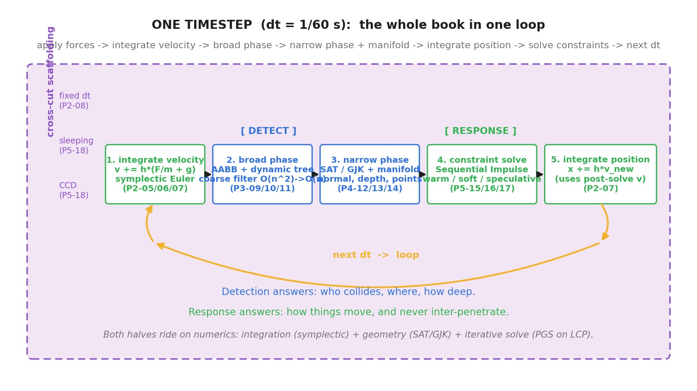
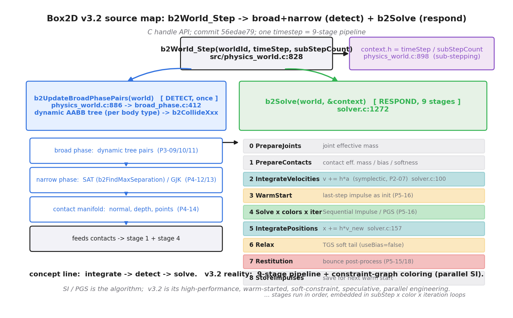
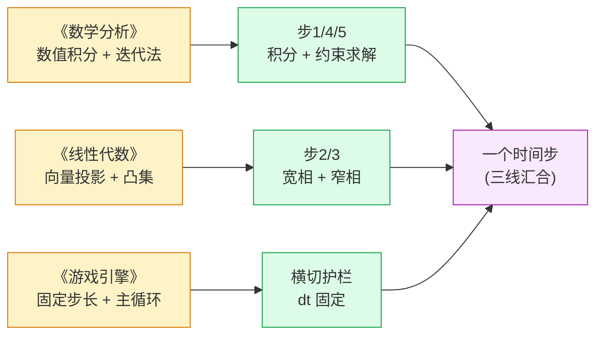
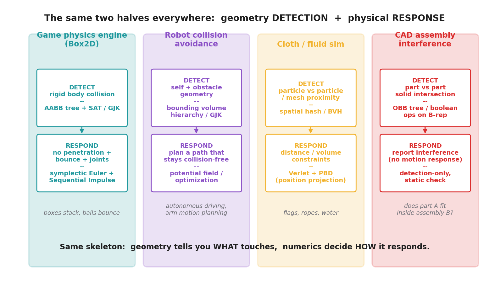

# 第 6 篇 · 第 19 章 · 全书收束:数值积分 + 检测 + 约束

> **核心问题**:我们用了 18 章,把一个物理引擎拆成 18 块零件——从牛顿 F=ma 怎么变成离散时间步(P1-02),到显式欧拉凭什么爆炸、半隐式欧拉凭什么稳(P2-06/07),到 AABB 树怎么粗筛(P3-11),SAT/GJK 怎么精确判相交(P4-12/13),再到 Sequential Impulse 怎么让一摞箱子不穿透(P5-16),最后到休眠、CCD 这些横切的稳定性护栏(P5-18)。每一块都讲透了。可读完这 18 块零件,你脑子里大概是一抽屉散落的齿轮——它们怎么咬合、怎么转成一个完整的时间步?本章要做的,就是把这些零件**装回一只完整的钟表**:让你在脑子里放映出一个时间步从头到尾的完整发生过程,每一步都对应得上前面哪一章、它在解决哪一类问题。更进一步,我们要看到——这套"数值积分 + 几何检测 + 约束求解"的思想,**不止属于游戏物理引擎**:机器人碰撞回避、布料/流体仿真、CAD 装配干涉检查,本质都是同一个骨架。最后,我们抬眼看下一步——从"模拟物体运动"到"模拟光的传播",这就是本子线下一本《实时光线追踪》。

> **读完本章你会明白**:
> 1. 一个时间步的**完整全景**:施加力 → 积分速度(半隐式欧拉)→ 宽相(AABB 树粗筛)→ 窄相(SAT/GJK + 接触流形)→ 约束求解(Sequential Impulse 迭代)→ 积分位置 → 下一步,每一步对应哪一章、为什么必须存在。
> 2. 全书三条承接线(**数值积分←《数学分析》、向量投影/凸集←《线性代数》、固定步长←《游戏引擎》**)是怎么在物理引擎这个场景里**汇合成一个整体**的。
> 3. "检测 vs 响应"这个二分为什么是物理引擎的**普适骨架**——任何"模拟物理"的系统(机器人、布料、CAD)都有这两半,只是各自的检测算法和响应手段不同。
> 4. Box2D v3.2 的源码怎么把这套概念落地成一条 9 阶段并行流水线(`b2World_Step` → `b2UpdateBroadPhasePairs` + `b2Solve`),以及为什么"概念简单、实现复杂"是工程常态。
> 5. 学完这本往哪走——本子线下一本《实时光线追踪》,以及更广阔的物理引擎进阶方向。

> **如果一读觉得太难**:这是收束章,没有新概念,全是把前面 18 章装回去。先只记三件事——① 一个时间步 = 积分速度 → 检测(宽相→窄相)→ 约束求解 → 积分位置 → 下一步;② 三件套(数值积分 + 几何检测 + 约束求解)是物理引擎的本质,也普适到机器人/布料/CAD;③ 从物理引擎到光追,是从"模拟物体运动"到"模拟光的传播"的跃迁,同一套数值思想的新场景。

---

## 〇、一句话点破

> **物理引擎 = 用数值方法让虚拟物体每帧"看起来"符合物理。它有三件套:数值积分推进运动(承《数学分析》)、几何算法检测碰撞(承《线性代数》)、约束求解器响应碰撞(本质是解 LCP)。这三件套按固定步长(承《游戏引擎》)每帧转一圈,串成一个时间步:施加力 → 积分速度 → 宽相粗筛 → 窄相精确 → 约束求解 → 积分位置 → 下一步。这套"检测 vs 响应"的骨架是普适的——任何"模拟物理"的系统都有这两半。这就是全书。**

这是结论,也是全书 18 章的浓缩。本章不再展开任何一块的细节(那 18 章已讲透),只做两件事:把三件套装回一个时间步的整图,以及看这套思想的普适性。

---

## 一、为什么需要收束:把零件装回钟表

### 1.1 18 章之后,你脑子里的状态

回头看你走过的 18 章。它们是按"先打地基,再检测,再响应,最后横切"的顺序铺开的:


每一章都聚焦一块:

- P2 篇讲透了**积分器**:为什么显式欧拉发散、半隐式欧拉凭什么保能量、Verlet 怎么天然处理约束。
- P3 篇讲透了**宽相**:AABB 包围盒怎么算相交、空间划分怎么把 O(n²) 降到近 O(n)、动态 AABB 树怎么随物体运动增量更新。
- P4 篇讲透了**窄相**:SAT 用投影判相交、GJK 用闵可夫斯基差算距离、接触流形给出法线/穿透/接触点。
- P5 篇讲透了**响应**:冲量怎么改变速度、Sequential Impulse 怎么迭代解多约束、关节怎么进同一个求解器、休眠/CCD 怎么补离散近似的漏洞。

可这些章节是**分头讲**的。读 P4-12(SAT)时,你大概没在想 P2-07 的半隐式欧拉;读 P5-16(Sequential Impulse)时,SAT 给的接触法线是它要用的输入,但那个衔接只在那一章的章首一笔带过。每一章都假设"你在这一块上",没有一张图把所有零件按时间步的真实顺序**同时摆出来**。

> **钉死这件事**:18 章是**零件**。本章是**装配图**——把所有零件按一个时间步的真实执行顺序,装回一只完整的钟表,让你看清它们怎么咬合。

### 1.2 装配之前,先回忆那只钟表的"咔哒"

第 0 章(P0-01)给过一个一次性点睛的比喻:物理引擎像一块每帧"咔哒"拨一格的**数值钟表**——真实物理是连续发生的,可计算机没法连续地算,只能每 dt 秒(比如 1/60 秒)离散地推进一步。每"咔哒"一声,引擎做三件事:**积分一下运动、判一下谁碰了(几何裁判)、让它们规矩地动(约束求解)**。本章不再沿用这个比喻做主线(直球为主),但要把"每咔哒一声引擎干了什么"这一整圈,用 18 章的精确语言重画一遍。

这就是下面第二节的全景图。

---

## 二、一个时间步的完整全景:全书最终装配图

### 2.1 全景图:每一步对应哪一章

把一个时间步里所有发生的事,按真实顺序摆成一张图,每块标注它对应哪一章、服务"检测"还是"响应":



这张图是全书的终点。把它逐块对到前面 18 章:

| 步 | 干什么 | 服务哪面 | 对应章 | 关键机制 |
|----|--------|---------|--------|---------|
| 横切护栏 | 固定 dt / 休眠 / CCD | 横切 | P2-08 / P5-18 | 保证离散近似稳定可复现、静止省算力、高速不穿透 |
| 1 | 积分速度 `v += h·(F/m + g)` | 响应 | P2-05 / P2-06 / P2-07 | symplectic Euler(辛,保能量有界) |
| 2 | 宽相:AABB 树粗筛候选对 | 检测 | P3-09 / P3-10 / P3-11 | 动态 AABB 树,O(n²)→近 O(n) |
| 3 | 窄相:SAT/GJK + 接触流形 | 检测 | P4-12 / P4-13 / P4-14 | 投影判相交、闵可夫斯基差、法线/穿透/接触点 |
| 4 | 约束求解 Sequential Impulse | 响应 | P5-15 / P5-16 / P5-17 | PGS 解 LCP、warm start、soft、speculative |
| 5 | 积分位置 `x += h·v_new` | 响应 | P2-07 | 用约束求解后的新速度推位置,所以不穿透 |
| 回环 | 下一个 dt | — | P1-04 | 每帧转一圈 |

> **钉死这件事**:这张图就是全书。如果你只能记住一张图,记这张——它把"物理引擎一个时间步干什么"和"全书 18 章讲什么"一一对应。任何一块单独看不懂,回到对应章复习;任何一章迷路了,回到这张图找它的位置。

### 2.2 跟着"小球落地反弹"再走一遍(收束版)

P0-01 用一个小球落地反弹做引子。现在我们用 18 章的精确语言,把那个小球的**一个时间步**完整重走一遍,作为这张全景图的实例:

- **(横切护栏)** 时间步 dt = 1/60 秒固定(P2-08)。小球醒着(没休眠),速度也不够快触发 CCD(P5-18)。
- **(步 1 积分速度)** 小球受重力 `g = (0, -9.8)`,加速度向下。半隐式欧拉(P2-07)先更新速度:`v_new = v_old + h·g`。小球每步向下加速一点。这一步只动速度,不动位置。
- **(步 2 宽相)** 把小球包进一个 AABB 方框,把地面也包进一个 AABB 方框(P3-09)。动态 AABB 树(P3-11)查询时,这两个方框重叠了 → 这对(小球, 地面)进入候选对。复杂度近 O(n),不是 O(n²)。
- **(步 3 窄相)** 对(小球, 地面)精确判断。小球是圆,地面是线段,`b2CollidePolygonAndCircle`(P4-12 提到 SAT 的特化版)算出:它们真相交,接触法线 `n = (0, +1)`(向上),穿透深度 `d`(小球钻进地面一点点),接触点在小球底部(P4-14 接触流形)。SAT 在这里顺给的"最小分离边"就是接触法线的方向。
- **(步 4 约束求解)** 小球正以 `v = (0, -10)` 向下穿入地面。约束求解器(P5-16 Sequential Impulse)沿接触法线 `n = (0, +1)` 施加一个法向冲量(P5-15),把向下速度变成向上:`v = (0, -10) → (0, +8)`(乘以恢复系数 0.8)。因为只有一个接触,迭代一轮就够(多接触才要多轮 PGS)。
- **(步 5 积分位置)** 用**约束求解后的新速度** `v = (0, +8)` 推位置:`x += h·v_new`。小球向上弹起——而且因为它用的是"已经不穿透的速度"推位置,小球不会穿进地面。
- **(回环)** 下一个 dt,小球上升、减速、到顶、又下落……循环。

**这就是物理引擎对"小球落地反弹"一个时间步的完整处理**。18 章的每一块,都能在这一圈里找到它的位置。任何一步缺失都会"不物理":没有步 1 物体不动;没有步 2/3 物体互相无视(碰了也不知道);没有步 4 物体互相穿透;没有步 5 物体不会真的位移。

> **钉死这件事**:全景图不是抽象的——它就是一个物体(小球)在每一帧里经历的完整故事。你能把这个故事从头讲到尾、每一步都能指到对应的章和机制,就说明 18 章装进了脑子。

### 2.3 一个关键节拍:检测夹在两段响应中间

注意全景图里一个容易被忽略的细节:**积分被拆成了两段**(步 1 积分速度 + 步 5 积分位置),**检测(步 2、3)夹在它们中间**。这不是随手画的顺序,是物理引擎一个时间步的**内在节拍**:

```
   一个 dt 内的真实顺序:

   [响应: 积分速度]  →  [检测: 宽相+窄相]  →  [响应: 约束求解]  →  [响应: 积分位置]
        ↑                    ↑                      ↑                    ↑
     让物体动起来        发现谁碰了          让碰了的别穿透      用不穿透的速度推位置
   (P2-07 symplectic)  (P3/P4)            (P5-16 SI)          (P2-07 位置半步)
```

为什么要这样夹?因为:

1. **积分速度在前**:必须先用加速度更新速度,才知道物体"想往哪儿去"(包括受重力往下钻的趋势)。
2. **检测在中间**:必须基于物体的新位置(由速度推出来的),才能算出"它和谁碰了、碰在哪、多深"。接触流形(法线、穿透、接触点)是检测的输出。
3. **约束求解在后**:拿到接触流形,才能沿法线施加冲量,把"要穿进去的速度"改成"不穿透的速度"。
4. **积分位置最后**:用约束求解**之后**的速度推位置——这样位置是用"已经被修正过、不穿透的速度"推的,物体就不会穿透。

> **钉死这件事**:**检测夹在两段响应中间,积分被拆成速度积分(前)和位置积分(后)**。这个节拍的精髓是"**先用加速度算速度,让约束求解修正速度,再用修正后的速度推位置**"——这正是半隐式欧拉(P2-07)的"半步先后"和一个完整时间步的对应。位置用"不穿透的速度"推,是物体不穿透的根。后面看源码时,你会看到这个节拍精确体现在 Box2D v3.2 的阶段流水线里(第三节)。

---

## 三、源码地图:把全景图对到 Box2D v3.2

概念上的全景图讲清了。我们去 Box2D v3.2 的源码里印证——看一个真实的物理引擎,是不是真的按"积分速度 → 检测 → 约束求解 → 积分位置"这个顺序跑。结论是:**概念顺序完全对得上,只是 v3.2 把它工程化成了一条 9 阶段的并行流水线**。这一节是全书的"源码地图"收束,不深入(那是各章的活),只把入口和阶段顺序钉死。

### 3.1 入口:`b2World_Step`

用户调一次公共 C API `b2World_Step(worldId, timeStep, subStepCount)`,物理引擎就推进一个时间步。入口在 [src/physics_world.c:828](../box2d/src/physics_world.c#L828):

```c
// (摘自 Box2D v3.2.0 src/physics_world.c, 简化展示关键行)
void b2World_Step( b2WorldId worldId, float timeStep, int subStepCount )
{
    b2World* world = b2GetWorldFromId( worldId );
    // ... 清空事件缓冲、记录 profile ...

    // ★ 检测这一面: 在 b2Solve 之前就做完了
    b2UpdateBroadPhasePairs( world );                    // physics_world.c:886

    b2StepContext context = { 0 };
    context.dt = timeStep;
    context.subStepCount = b2MaxInt( 1, subStepCount );
    if ( timeStep > 0.0f )
    {
        context.inv_dt = 1.0f / timeStep;
        context.h = timeStep / context.subStepCount;     // 子步步长 physics_world.c:898
        context.inv_h = context.subStepCount * context.inv_dt;
    }
    // ... 软约束参数 (contactSoftness / staticSoftness, 用 hertz + 阻尼比) ...

    b2Solve( world, &context );                          // -> solver.c:1272
}
```

几个要点(承接 P1-04、P2-07、P5-16 已讲过):

- **检测在 `b2World_Step` 一开头就做完了**:`b2UpdateBroadPhasePairs(world)`([src/physics_world.c:886](../box2d/src/physics_world.c#L886),实现在 [src/broad_phase.c:412](../box2d/src/broad_phase.c#L412))把宽相(动态 AABB 树配对)+ 窄相(精确相交 + 创建 contact)一口气做完。这是检测这一面在源码里的位置——它**先于** `b2Solve`(响应)。
- **★子步进(subStepCount)**:用户传一个大 `timeStep`(如 1/60),内部真正积分用的步长是 `h = timeStep / subStepCount`([physics_world.c:898](../box2d/src/physics_world.c#L898))。比如 `subStepCount=4`,就把一个大步切成 4 个 h 子步,每个子步完整跑一遍约束求解迭代。概念上的"固定 dt"(P2-08)在源码层是"一个大步切成 N 个 h 子步"。
- 之后调 `b2Solve(world, &context)`([src/solver.c:1272](../box2d/src/solver.c#L1272)),响应这一面(积分 + 约束求解)在里面发生。

> **★版本诚实标注**:这里用的是 v3 的 **C 句柄 API**(`b2WorldId` / `b2World_Step` / `b2CreateWorld`),不是 v2 的 C++ 类(`b2World::Step` 已过时)。v3.2 还默认走双精度(`#define b2CreateWorld b2CreateWorldDoublePrecision`,box2d.h:17)。这是本系列一贯的"诚实标注版本演进"。

### 3.2 `b2Solve` 的 9 阶段流水线

`b2Solve(world, stepContext)`([src/solver.c:1272](../box2d/src/solver.c#L1272))是响应这一面的核心。它把一个时间步切成一连串**阶段(stage)**,阶段类型定义在 [src/solver.h:75](../box2d/src/solver.h#L75)(逐行已核,见源码事实锚点第 2 节):

```c
// (摘自 Box2D v3.2.0 src/solver.h, 真实枚举)
typedef enum b2SolverStageType
{
    b2_stagePrepareJoints,         // 0. 准备关节约束 (算有效质量)
    b2_stagePrepareContacts,       // 1. 准备接触约束 (算 effective mass / bias / softness)
    b2_stageIntegrateVelocities,   // 2. 积分速度: v += h*a (半隐式欧拉, P2-07)
    b2_stageWarmStart,             // 3. warm start (用上步累积冲量)
    b2_stageSolve,                 // 4. ★Sequential Impulse 主体 (PGS, P5-16)
    b2_stageIntegratePositions,    // 5. 积分位置: x += h*v_new
    b2_stageRelax,                 // 6. 软约束松弛 (TGS 风味)
    b2_stageRestitution,           // 7. 恢复系数 (反弹后处理, P5-15/18)
    b2_stageStoreImpulses          // 8. 存累积冲量 (供下帧 warm start)
} b2SolverStageType;
```

把这张阶段表和我们全景图的概念流程对照:



| 全景图概念步 | Box2D v3.2 真实阶段 | 源码位置 |
|---|---|---|
| (检测·宽相+窄相) | `b2UpdateBroadPhasePairs` | physics_world.c:886 |
| (准备约束) | 阶段 0/1 PrepareJoints / PrepareContacts | solver.h:77-78 |
| **步 1 积分速度** | 阶段 2 IntegrateVelocities | solver.c:100-102(半隐式欧拉铁证) |
| (warm start,加速收敛) | 阶段 3 WarmStart | solver.h:80 |
| **步 4 约束求解** | 阶段 4 Solve(Sequential Impulse 主体,迭代) | solver.h:81 |
| **步 5 积分位置** | 阶段 5 IntegratePositions | solver.c:157(用新速度推位置) |
| (软约束松弛 + 反弹) | 阶段 6/7 Relax / Restitution | solver.h:83-84 |

> **钉死这件事**:概念流程"积分速度 → 检测 → 约束求解 → 积分位置"在 Box2D v3.2 源码里**是真实存在的**——检测在 `b2Solve` 之前(`b2UpdateBroadPhasePairs`),响应在 `b2Solve` 内(阶段 2 积分速度 → 阶段 4 约束求解 → 阶段 5 积分位置)。**积分被拆成速度积分(阶段 2,约束求解前)和位置积分(阶段 5,约束求解后),中间夹着 Sequential Impulse 修正速度**——这就是全景图那个"检测夹在两段响应中间、积分拆两段"节拍的源码落地。

### 3.3 v3.2 比概念流程多了什么:warm start / soft / speculative / 并行

诚实标注一下:v3.2 的 9 阶段比概念流程多了不少东西。这些前面各章都讲过(P5-16 最密集),这里只做收束式列举:

- **warm start(阶段 3)**:用上一帧的累积冲量做这一帧的初值,把 SI 的起点拉近解,大幅加速收敛(P5-16 第 4.1 节)。
- **soft constraint**:`b2MakeSoft(hertz, dampingRatio, h)` 把刚性冲量换成有刚度/阻尼比的软弹簧,堆叠不抖(P5-16 第 4.2 节)。
- **speculative contacts**:用未来一帧的相对速度预判"会不会穿",提前施加冲量,是 CCD 的第一道防线(P5-18)。
- **约束图着色并行**:`src/constraint_graph.c` 把接触/关节按"是否共享物体"建图着色,同色约束互不相邻 → 可并行解。24 种颜色 + 溢出兜底。这是 v3.2 把"顺序冲量"并行化的招牌(P5-16 第 5.4 节)。
- **relax(阶段 6)**:`useBias=false` 的二次求解,只清速度不做位置纠正,是 TGS(Temporal Gauss-Seidel)风味的速度松弛(P5-16 第 5.3 节)。
- **restitution(阶段 7)**:把"撞得够重"的接触额外施加反弹冲量,靠 `restitutionThreshold`(默认 1.0 m/s)阈值吃掉堆叠的微反弹抖动(P5-18)。

> **★诚实标注(概念 vs 实现的张力)**:概念主线讲的是 Sequential Impulse / PGS / LCP——这是**算法**,Erin Catto 给的物理引擎事实标准,教科书级核心,读者必须懂。v3.2 的**真实实现**是"9 阶段流水线 + 约束图着色并行 + warm start + soft constraint + speculative contacts"——这是**工程化**,把 SI 装进一个并行、稳定、不抖、不穿透的壳子。**两者不矛盾**:SI 是灵魂,v3.2 是它的高性能肉身。"概念简单、实现复杂"是工程常态——这也是本书反复要读者警惕"老资料讲 SI 是一个循环跑 8~20 轮"的原因,v3.2 早就不是那个样子了。

---

## 四、三条承接线在物理引擎里汇合

本书最大的特色是**密集承接**前面三本书。前面 18 章里,每条承接都是"在哪一章兑现、哪一句带过"。本章是收束,要把这三条线**在物理引擎这个场景里汇合**这件事点透——你会看到,物理引擎不是三本书的简单相加,而是它们在一个具体场景里的**有机合成**。

### 4.1 承《数学分析》:数值方法是物理引擎的灵魂

这是最强的一条承接。物理引擎三件套里,**两件半是数值方法**:

- **数值积分**(步 1、步 5):半隐式欧拉、Verlet、RK4,全是《数学分析》"微分方程数值解"那一章的内容。为什么显式欧拉发散、为什么半隐式欧拉保能量(辛积分器)、为什么 Verlet 天然处理约束——这些 P2-06/07 讲透的,本质都是《数学分析》的数值稳定性主线在物理场景的应用。
- **约束求解**(步 4):Sequential Impulse / PGS 解 LCP,是《数学分析》"数值线性代数 / 迭代法"那一章的内容。为什么 PGS 一定收敛(被解的有效质量矩阵对称正定,投影 Gauss-Seidel 对称正定必收敛)——P5-16 第 3.2 节钉死的,直接是数值线性代数的经典结论。
- **CCD 的 TOI sweep**(横切):保守前进(conservative advancement)复用 GJK,本质是数值迭代求根——也是《数学分析》的迭代法。

> **承接书讲过**:《数学分析》那句"精确 vs 逼近"的主线,在物理引擎里兑现成:真实物理是连续的精确方程(F=ma 是微分方程),可它大多解不出解析解,只能数值逼近(数值积分);而数值逼近有稳定性问题,选错方法(显式欧拉)能量发散爆炸,选对方法(半隐式欧拉/PGS)误差有界、收敛。物理引擎的"假物理"——数值近似让物体看起来符合物理——就是这条主线的极致应用。指路:[[math-analysis-series]]。

### 4.2 承《线性代数》:检测这一面全是向量运算

检测这一面(步 2、3)几乎全部建立在《线性代数》的向量/凸集上:

- **AABB 相交**(步 2 宽相):逐轴比 lower/upper 边界,本质是向量在每个坐标轴上的投影区间比较(P3-09)。
- **SAT 投影**(步 3 窄相):把顶点点乘单位法线算投影长度,取 min/max 得区间——向量点乘就是投影长度,这是《线性代数》向量投影的定义(P4-12)。SAT 把"两形状相交"降维成"一维区间是否分离",靠的就是投影。
- **GJK 闵可夫斯基差**(步 3 窄相):两个凸形状做闵可夫斯基差,相交判断变成"差集是否含原点",用单纯形迭代逼近——闵可夫斯基差和凸集是《线性代数》凸集那一章的内容(P4-13)。
- **惯性张量**(步 1 积分的物理量):刚体的转动惯量是矩阵,平行轴定理把各 shape 的惯性平移累加到质心——矩阵运算(P2-05)。

> **承接书讲过**:向量投影、点乘、凸集、凸包——这些《线性代数》讲透的概念,在物理引擎的检测侧被密集使用。本书没有重讲它们,只把它们"用在碰撞上"。指路:《线性代数入门》向量投影/凸集一节。

### 4.3 承《游戏引擎》:固定步长是物理的护栏

物理是游戏引擎主循环 update 里**最重的一段**,而且用**固定步长**(P2-08 一句带过指路)。为什么固定?P2-08 讲透了:

- **数值稳定**:半隐式欧拉的"能量有界带子"宽度跟 dt 有关,dt 固定带子才稳定;变步长会破坏辛性。
- **可复现**:同样输入、同样 dt,结果一样——这对调试、网络同步、录像回放是刚需。
- **和游戏主循环的可变帧率协调**:游戏渲染帧率可变(30/60/144Hz),但物理用固定 dt(如 1/60),靠"累积器"在可变帧里跑整数个固定步。

> **承接书讲过**:固定步长的"为什么稳定、怎么和游戏主循环协调"是《游戏引擎》P3-10 讲过的。本书 P2-08 一句带过指路 [[graphics-series-project]],篇幅留物理特有的稳定性(显式欧拉怎么爆炸、子步进怎么细化)。

### 4.4 三条线怎么汇合:一个时间步就是三条线的交点

把三条线放到全景图上,你会看到一个漂亮的汇合:



- **步 1/4/5(响应·积分 + 约束求解)**:三条线里《数学分析》那条——数值积分(步 1/5)+ 迭代法(步 4)。
- **步 2/3(检测·宽相 + 窄相)**:三条线里《线性代数》那条——投影/凸集。
- **横切护栏(固定 dt)**:三条线里《游戏引擎》那条。

**一个时间步,就是这三条线在物理引擎这个场景里的交点**。这不是三本书的简单拼凑——物理引擎特有的部分(动态 AABB 树、SAT/GJK、Sequential Impulse、warm start/soft/speculative)是三本书没讲过的,但它们的地基(数值方法、向量、固定步长)全来自三本书。

> **钉死这件事**:读本书,你不是从零学物理引擎,而是把你已有的数学功底(数值方法、向量、约束优化)+ 工程功底(固定步长、主循环),装到物理引擎这个场景里。三条承接线在一个时间步里汇合——这就是本书在你已读系列里的坐标。

---

## 五、普适性:这个骨架不止属于游戏物理引擎

全景图讲清了"一个物理引擎时间步干什么"。现在抬眼看——这套"检测 + 响应"的骨架,**不止属于游戏物理引擎**。它是任何"模拟物理"的系统的通用骨架。本节是全书思想的升华:把物理引擎的范式,推广到三个相邻领域。

### 5.1 同一个骨架:几何检测 + 物理响应

先把这个骨架抽象出来。任何"模拟物理"的系统,不管它模拟的是刚体、布料、机械臂还是装配体,内部都有**两半**:

- **检测(geometry detection)**:判断"谁和谁有几何关系(接触/接近/相交)"。这一半是**几何的**——用包围盒、投影、闵可夫斯基差、空间划分,本质是计算几何。
- **响应(physical response)**:基于检测结果,决定"怎么动/怎么处理"。这一半是**数值的**——积分、约束求解、路径优化、位置投影,本质是数值方法。

这两半的分工,和游戏物理引擎的"检测 vs 响应"二分**完全同构**。差别只在:各自的**检测算法**(AABB 树 vs BVH vs 空间哈希 vs OBB 树)和**响应手段**(Sequential Impulse vs PBD vs 势场法 vs 静态检查)不同,但骨架一样。

### 5.2 四个领域的对照



把四个领域摆开,逐个对照:

**① 游戏物理引擎(Box2D,本书主角)**:
- **检测**:刚体对刚体的碰撞——AABB 树粗筛(P3)+ SAT/GJK 精确判相交(P4)。
- **响应**:不穿透 + 反弹 + 关节约束——symplectic Euler 积分(P2)+ Sequential Impulse 迭代(P5)。
- **典型场景**:箱子堆叠不穿透、小球撞地反弹。

**② 机器人碰撞回避 / 自动驾驶**:
- **检测**:机器人本体 vs 障碍物(其他车、行人、墙体)的几何关系——用**包围体层次(BVH, bounding volume hierarchy)**或 GJK 算距离,和游戏物理的窄相同源。
- **响应**:**规划一条不碰撞的路径**——不是"撞了之后弹开",而是"提前算出怎么走才不撞"。常用势场法(把障碍物当斥力源、目标当引力源)、或基于优化的轨迹规划(MPC、A*、RRT)。
- **典型场景**:自动驾驶避障、机械臂在工件间运动不碰撞。
- **和物理引擎的关系**:检测那一半几乎一样(都是 BVH/GJK),响应那一半从"碰撞后修正速度"变成"碰撞前规划路径"——同一个几何检测,不同的物理响应。

**③ 布料 / 流体仿真**:
- **检测**:质点 vs 质点、网格 vs 网格的邻近关系——用**空间哈希(spatial hash)**或 BVH,和游戏物理的宽相同源。
- **响应**:**距离/体积约束**(布料的"相邻质点距离不变"、流体的"不可压缩")——用 **Verlet + PBD(Position Based Dynamics)** 直接投影位置(P2-07 讲过 PBD)。
- **典型场景**:旗帜飘动、绳索摆动、水面波纹。
- **和物理引擎的关系**:**检测那一半几乎一样**(都是空间划分找邻近对),**响应那一半换了积分器和约束求解器**——PBD(位置投影)替了 Sequential Impulse(速度冲量),Verlet 替了半隐式欧拉。这正是 P2-07 第 6.4 节讲的"Verlet 天然适合位置约束,半隐式欧拉天然适合速度约束"。**同一个骨架,不同的响应手段**。

**④ CAD 装配干涉检查**:
- **检测**:零件 vs 零件的实体相交——用 **OBB 树(oriented bounding box,有向包围盒,比 AABB 更贴形状)**或 B-rep(边界表示)的布尔运算。
- **响应**:**只报告干涉,不做运动响应**(CAD 装配是静态的,不需要"碰了之后弹开")——这是"检测那一半"独立成系统、响应那一半退化的特例。
- **典型场景**:装配体设计时检查"零件 A 会不会和零件 B 互相穿插"、机械运动仿真检查"运动到某个位置会不会卡死"。
- **和物理引擎的关系**:**检测那一半是同一套(包围盒树 + 精确相交)**,响应那一半简化成"报告 yes/no"。这反向印证了"检测 vs 响应"二分的普适——即使响应退化成"啥也不做",检测那一半依然完整存在。

### 5.3 为什么这个骨架普适

为什么这四个领域(以及更多:分子动力学、人群仿真、有限元接触)都长同一个骨架?根因在**它们都在模拟同一个东西——物理世界里的几何对象,以及它们之间的相互作用**。

- 物理世界里的对象有**几何**(形状、位置、朝向),所以任何模拟都得先**判断它们的几何关系**(检测)。
- 物理世界里的对象会**相互作用**(碰撞、约束、力),所以任何模拟都得**基于关系决定怎么动**(响应)。

这两件事——"判断几何关系"和"决定相互作用"——是物理世界本身的两个基本面。任何忠实模拟物理世界的系统,都绕不开这两半。这就是为什么"检测 vs 响应"二分普适——它不是物理引擎的发明,是物理世界本身的结构在软件里的投影。

> **钉死这件事**:**"检测 vs 响应"二分是物理世界的结构,不是物理引擎的发明**。任何模拟物理的系统(游戏、机器人、布料、CAD)都有这两半:几何检测告诉你"谁碰了/离多近",数值方法决定"怎么动/怎么处理"。本书花 18 章讲透的游戏物理引擎,只是这个骨架最完整、最工程化的一个实例——但这个骨架本身,普适到所有"模拟物理"的领域。

### 5.4 从物理引擎往外走的迁移路径

这个普适性不只是理论——它给你一条**职业迁移路径**。学透了游戏物理引擎,你掌握的是:

- **几何检测的工具箱**:AABB 树、SAT、GJK、闵可夫斯基差——这套直接迁移到机器人(BVH/GJK)、CAD(OBB 树/布尔运算)。
- **数值方法的工具箱**:辛积分器、约束求解(PGS/PBD)、迭代法收敛——这套直接迁移到布料/流体(Verlet+PBD)、分子动力学。
- **工程化的智慧**:分层(宽相保护窄相)、迭代近似(不精确解 LCP 而迭代收敛)、分层防御(speculative + TOI)——这套是通用的工程哲学。

所以本书的终点,不是一个孤立领域的终点,而是一系列相邻领域的**共同地基**。

---

## 六、技巧精解:为什么"检测 vs 响应"二分能抓住物理引擎本质

本章是收束,挑一个最值得单独拆透的洞察——**为什么"检测 vs 响应"这个二分,能抓住物理引擎(乃至一切"模拟物理"系统)的本质**。这不是随手切的分类,它对应着两个数学上截然不同的子问题,以及两套截然不同的解法工具箱。

### 6.1 这个二分对应两个数学上不同的子问题

先看这两半各自在解什么数学问题:

- **检测这一半,在解一个"几何判断"问题**:给定两个形状 A、B,判断它们"相交不相交"——这是一个**离散的、布尔型**的几何问题。答案是 yes/no(相交/不相交),或者附带几何细节(法线、穿透、接触点)。它的数学根基是**计算几何**——凸集、投影、闵可夫斯基差、包围盒。判断本身**不涉及时间、不涉及力**,纯粹是静态的几何关系。
- **响应这一半,在解一个"数值推进"问题**:给定当前的接触/约束,怎么在时间上推进一步,让物体既符合动力学(受力的运动)又满足约束(不穿透、关节不拉开)——这是一个**连续的、带约束的**数值问题。它的数学根基是**数值分析**——常微分方程数值解(积分器)、约束优化(LCP/MLCP)。

> **钉死这件事**:**检测 = 静态几何判断(计算几何),响应 = 动态数值推进(数值分析)**。这两个子问题的数学性质完全不同——一个是离散布尔判断,一个是连续约束优化。把物理引擎按这个二分切开,等于按"它在解哪一类数学问题"切开。这不是随意的分类,是数学本质的切分。

### 6.2 这个二分让两半可以用各自的"最优工具"

正因为这两半解的是不同的数学问题,它们各自有**截然不同的最优工具箱**:

| 维度 | 检测这一半 | 响应这一半 |
|------|-----------|-----------|
| 解的数学问题 | 几何相交判断 | 带约束的运动推进 |
| 数学根基 | 计算几何(凸集/投影) | 数值分析(ODE/LCP) |
| 典型算法 | AABB 树、SAT、GJK | symplectic Euler、Sequential Impulse |
| 输出 | yes/no + 法线/穿透/接触点 | 新的速度/位置 |
| 是否涉及时间 | 不涉及(静态几何) | 涉及(随时间推进) |
| 是否涉及力 | 不涉及 | 涉及(力→加速度→速度) |
| 优化目标 | 快(降复杂度 O(n²)→O(n)) | 稳(收敛、不发散、不穿透) |

这个分工的妙处在于:**每一半都可以独立优化,不被另一半拖累**。

- 检测这一半可以拼命**提速**——用 AABB 粗筛、空间划分、增量更新树,把 O(n²) 降到近 O(n),而不用管响应怎么做。
- 响应这一半可以拼命**求稳**——用辛积分器保能量、用 PGS 迭代收敛、用 soft constraint 防抖,而不用管检测多快。

如果硬把两半混在一起(比如一边检测一边响应),你会发现既要优化几何算法的复杂度、又要优化数值方法的稳定性,两个目标互相牵扯,谁也优化不好。**二分让它们解耦,各自用最优工具**。

### 6.3 为什么这个二分普适:任何"模拟物理"的系统都有这两半

这个二分之所以普适(上一节讲的四个领域都有),根因是:**任何"模拟物理"的系统,内部都同时有"判断几何关系"和"决定相互作用"这两类问题**。

- 物理世界里的对象有几何 → 任何模拟都要判断几何关系(检测)。
- 物理世界里的对象会相互作用 → 任何模拟都要决定怎么相互作用(响应)。

这两件事是**正交的**——你可以有非常复杂的几何检测(比如 CAD 的 B-rep 布尔运算)配非常简单的响应(只报告 yes/no),也可以有简单的几何检测(质点距离)配非常复杂的响应(流体的 Navier-Stokes)。但两半**都存在**,只是各自的复杂度此消彼长。

这就是为什么"检测 vs 响应"二分能抓住本质——它切在了物理世界本身的两个基本面(几何 + 相互作用)上,所以无论你模拟的是什么(刚体、布料、机器人、装配体),这个切分都成立。

> **钉死这件事**:**"检测 vs 响应"二分能抓住物理引擎本质,因为它切在了物理世界的两个正交基本面上——几何关系(检测)和相互作用(响应)**。这两半解的是数学性质截然不同的问题(计算几何 vs 数值分析),各自有最优工具箱,可以独立优化。而且因为物理世界本身就有这两个面,任何模拟物理的系统都长这个骨架——这就是它普适的根。

### 6.4 反面对比:不按这个二分会怎样

如果一本书不按"检测 vs 响应"组织,而是按概念平铺(刚体、力、碰撞、关节……),会发生什么?

- 读者记的是"有哪些概念",而不是"物理引擎每步在解决什么问题"。
- 讲到 SAT(检测)和 Sequential Impulse(响应)时,它们看起来是平级的两个"算法",读者看不出一个是几何判断、一个是数值推进,看不出它们解的是不同的数学问题。
- 讲到堆叠不穿透,读者要把"接触怎么来的(检测)+ 冲量怎么算的(响应)+ 多约束怎么迭代(响应)"在脑子里临时拼起来,没有现成的骨架。

本书用"检测 vs 响应"二分当骨架,读者永远知道**我在哪、为什么需要下一步**——这是为什么这个二分不止是分类,而是**理解物理引擎的认知脚手架**。

---

## 七、全书五问回顾:18 章回答了什么

收束章该有一次全书级的回顾。把全书开篇(P0-01)立的五个根基性疑问,用 18 章的结论逐一回答——这也是检验"18 章是否讲透了"的标尺。

### 问 1:物理引擎的"物理"是真的吗?

**答**:不是。物理引擎的物理是**数值近似的假物理**:真实物理是连续的(F=ma 是微分方程),可计算机只能每 dt 秒离散地推进一步。物理引擎做的事,就是把这个连续方程,**离散化**成每步的更新——数值积分推进运动、几何算法检测碰撞、约束求解响应。只要 dt 足够小、方法够稳,离散近似看起来就和连续物理一样。(P0-01、P1-02、P1-03)

### 问 2:一个时间步到底干什么?

**答**:一个时间步 = **积分速度(响应)→ 宽相+窄相(检测)→ 约束求解(响应)→ 积分位置(响应)**,然后进入下一个 dt。检测夹在两段响应中间:先积分把物体推到新位置(可能推过头造成穿透),再检测发现穿透,最后约束求解修正速度、用修正后的速度推位置消除穿透。在 Box2D v3.2 里,这个顺序精确体现在 `b2World_Step` → `b2UpdateBroadPhasePairs`(检测)+ `b2Solve` 的 9 阶段流水线。(P1-04、本章全景图)

### 问 3:为什么必须数值积分?积分器为什么稳定/爆炸?

**答**:大多数运动方程(碰撞、约束、任意力)解不出解析解,只能数值积分。但积分器有稳定性问题——选错(显式欧拉),能量几何发散爆炸(每步净注入能量);选对(半隐式欧拉,Box2D 用的),因为它是**辛积分器**(保相空间体积),能量被关在有界带子里,长期不发散。Verlet 是另一条辛的路,天然适合位置约束(PBD),在布料/绳索界占主流。RK4 精度高但不辛,长期漂移,且每步 4 倍开销,实时物理不用。(P2-06、P2-07)

### 问 4:碰撞怎么检测?为什么分宽相窄相?

**答**:检测分**宽相(AABB 粗筛)→ 窄相(SAT/GJK 精确 + 接触流形)**两步。窄相精确但 O(n²) 贵,几千个物体每帧做几百万次太慢。宽相用便宜的 AABB 先排除绝大部分不可能碰的(包围盒不重叠 ⇒ 一定不相交),只把少数候选交给窄相,把复杂度降到近 O(n)。本质是"用便宜的粗筛保护昂贵的精算"的分层思想。SAT 用投影判相交(承《线性代数》),GJK 用闵可夫斯基差算距离,接触流形给出法线/穿透/接触点喂给约束求解。(P3、P4 全篇)

### 问 5:碰撞后怎么不穿透、正确弹开?堆叠为什么不塌?

**答**:靠**约束求解**——Sequential Impulse(PGS)反复迭代:每轮按顺序逐个约束施加增量冲量、立刻应用,多轮后所有约束一起收敛到满足。它的数学本质是投影 Gauss-Seidel 解 MLCP(混合线性互补问题),收敛性由"有效质量矩阵对称正定"保证(承《数学分析》迭代法)。不穿透靠两个机制:① 互补条件 `λ·w=0`(法向冲量非负,只能推不能拉);② 位置纠正 bias(把已有穿透按比例推回去)。堆叠不抖靠 soft constraint(hertz/阻尼比软化刚度),高速不穿透靠 speculative contacts + TOI sweep(CCD)。(P5-15、P5-16、P5-17、P5-18)

> **钉死这件事**:这五个问题,就是全书 18 章的回答。如果你能不看这页,用自己的话把这五个问题答出来——恭喜,你真的读懂了物理引擎。如果某个问题卡壳,回到对应篇复习。

---

## 八、学完往哪走:进阶方向与下一本

本书是"图形学/游戏引擎子线"的第三本。学完它,你有几条路可以走。

### 8.1 深挖物理引擎本身

如果你想在这个领域继续深挖:

- **3D 物理引擎**:本书聚焦 2D(Box2D),3D 多一维。3D 的 SAT 候选轴(面法线 + 边叉积)数量暴涨,所以 3D 更多用 GJK;3D 的旋转用四元数(2D 用单位复数);3D 的惯性张量是 3×3 矩阵(2D 是标量)。看 **Bullet**、**PhysX**、**Havok** 的源码,概念和 Box2D 同源,只是维度提升。
- **软体仿真**:本书讲刚体,软体(布料、绳索、可变形体)是另一大块。核心是 Verlet + PBD(位置投影),P2-07 第 6.4 节给过入口。看 Müller 等人的《Position Based Dynamics》论文。
- **流体仿真**:基于网格(Eulerian,如 Stable Fluids)或基于质点(SPH,PBD 的延伸)。这又是一个大领域,本书只点到。
- **约束求解的数学**:把 Sequential Impulse 写成 MLCP 矩阵形式,证 PGS 收敛——指路《数学分析》迭代法、Erin Catto 原始论文 *"Iterative Dynamics with Temporal Coherence"*(2005)、Murty 《Linear Complementarity》。
- **源码深读**:附录 A 给了 Box2D v3 的阅读路线图;想看 3D,Bullet/PhysX 的 solver 是同源的 PGS/TGS。

### 8.2 迁移到相邻领域

上一节讲的普适性,给了你迁移的资本:

- **机器人/自动驾驶**:检测那一半(BVH/GJK)你已会,要学的是路径规划(A*、RRT、MPC)。
- **CAD/CAE**:检测那一半(OBB 树/布尔运算)你已会,要学的是 B-rep 数据结构、有限元。
- **科学计算**:数值方法(积分器、迭代法)你已会,要学的是具体领域的偏微分方程。

### 8.3 ★本子线下一本:《实时光线追踪》

本子线(图形学/游戏引擎子线)还有最后一本:**《实时光线追踪》**。

物理引擎模拟的是**物体的运动**——物体怎么受力、怎么碰撞、怎么响应。光追模拟的是**光的传播**——光从光源出发,怎么反射、折射、散射,最后进到相机(眼睛)成像。

这两件事看起来毫不相干(一个是刚体动力学,一个是几何光学),可它们的**数值方法骨架是同源的**:

- **物理引擎的约束求解,本质是数值优化(LCP)**;**光追的渲染方程,本质是积分方程**——都是"用数值方法解一个连续的数学问题"。
- **物理引擎用蒙特卡洛思想的地方不多**(主要是随机采样接触点),**可光追的核心就是蒙特卡洛积分**(路径追踪,path tracing)——用随机采样逼近渲染方程的解。这直接承接你读过的《概率论》(蒙特卡洛方法)和《数学分析》(积分方程)。
- **物理引擎的"连续物理 → 离散时间步"**,对应**光追的"连续光场 → 离散像素采样"**——都是把连续问题离散化逼近。
- **物理引擎的 AABB 树/BVH 是空间加速结构**,**光追也用 BVH 加速光线-场景求交**——同一个数据结构,在两个领域都用来"快速排除不可能相交的对"。

> **钉死这件事**:从《物理引擎》到《实时光线追踪》,是从"**模拟物体运动**"到"**模拟光的传播**"的跃迁。模拟的对象变了(刚体→光子),可**数值方法的骨架没变**——都是"把连续的物理方程离散化逼近"(承《数学分析》),光追还多了一层"用随机采样逼近积分"(承《概率论》蒙特卡洛)。同一套数值思想,新的场景。这是本子线最后一本,也是图形学子线的收尾。

### 8.4 一个更长的视野:三条数学线在图形学里合流

如果你读过整个"深入浅出系列"的数学线,你会发现一个漂亮的合流:

- **《数学分析》**(精确 vs 逼近):物理引擎的数值积分/约束求解、光追的积分方程/蒙特卡洛。
- **《线性代数》**(向量/空间):物理引擎的投影/凸集/惯性张量、渲染管线的 MVP 变换、光追的光线-几何求交。
- **《概率论》**(驯服随机性):光追的蒙特卡洛路径追踪、物理引擎的随机采样、全局光照的方差缩减。

这三条数学线,在图形学/游戏引擎这个应用场景里**合流**了。本书(物理引擎)主要用了前两条(数学分析 + 线代);下一本(光追)会把第三条(概率论)也拉进来。学完整个子线,你会真切看到——数学不是孤立的工具,它们在真实的工程系统里交织成网。

---

## 九、章末小结

### 回扣主线

本章是全书收束,做的是**全景综合 + 思想升华**。我们把 18 章的零件装回一个时间步的整图:施加力 → 积分速度(半隐式欧拉)→ 宽相(AABB 树粗筛)→ 窄相(SAT/GJK + 接触流形)→ 约束求解(Sequential Impulse 迭代)→ 积分位置 → 下一步,每一步对应前面哪一章、为什么必须存在。我们看到这个全景在 Box2D v3.2 源码里精确落地(`b2World_Step` → `b2UpdateBroadPhasePairs` + `b2Solve` 的 9 阶段流水线),并诚实标注了 v3.2 相比概念流程多出的 warm start / soft / speculative / 并行等工程化。我们点透了三条承接线(数值积分←《数学分析》、向量/凸集←《线性代数》、固定步长←《游戏引擎》)在一个时间步里汇合。最后我们看到——这套"检测 vs 响应"的骨架普适到机器人碰撞回避、布料/流体、CAD 装配干涉,因为它们都在模拟物理世界的两个正交基本面(几何关系 + 相互作用)。本书到此收尾,下一本《实时光线追踪》将从"模拟物体运动"跃迁到"模拟光的传播",同一套数值思想的新场景。

### 五个为什么(全书级收束)

1. **一个物理引擎时间步的完整流程是什么?**——施加力 → 积分速度(半隐式欧拉,响应)→ 宽相(AABB 树粗筛,检测)→ 窄相(SAT/GJK + 接触流形,检测)→ 约束求解(Sequential Impulse,响应)→ 积分位置(响应,用约束后的速度推位置所以不穿透)→ 下一个 dt。检测夹在两段响应中间,积分拆成速度积分(前)和位置积分(后)。
2. **全书三件套是什么,各自承接哪本书?**——数值积分(承《数学分析》,步 1/5)+ 几何检测(承《线性代数》,步 2/3)+ 约束求解(本质解 LCP,承《数学分析》迭代法,步 4)。三件套在固定步长(承《游戏引擎》)下每帧转一圈。
3. **Box2D v3.2 怎么把这个全景落地?**——`b2World_Step` 先调 `b2UpdateBroadPhasePairs`(检测,宽相+窄相一次做完),再调 `b2Solve` 跑 9 阶段响应流水线(PrepareContacts → IntegrateVelocities → WarmStart → Solve → IntegratePositions → Relax → Restitution → StoreImpulses)。★v3.2 还加了约束图着色并行、warm start、soft constraint、speculative contacts。
4. **"检测 vs 响应"二分为什么普适?**——它切在了物理世界的两个正交基本面:几何关系(检测,计算几何)和相互作用(响应,数值分析)。任何模拟物理的系统(游戏、机器人、布料、CAD)都有这两半,只是各自的检测算法和响应手段不同。
5. **学完物理引擎,下一本是什么,为什么?**——本子线下一本《实时光线追踪》。从"模拟物体运动"到"模拟光的传播",模拟对象变了(刚体→光子),可数值方法骨架同源(都是把连续物理方程离散化逼近,承《数学分析》),光追还多了蒙特卡洛采样(承《概率论》)。

### 想继续深入往哪钻

- **想深挖物理引擎本身**:3D 物理引擎(Bullet/PhysX,3D 多一维)、软体仿真(Verlet+PBD)、流体(Stable Fluids/SPH)、约束求解数学(Catto 论文、Murty《LCP》)。
- **想迁移到相邻领域**:机器人路径规划(A*/RRT/MPC)、CAD 的 B-rep/有限元、科学计算的 PDE 数值解。
- **想接系列其他书**:承《数学分析》(数值积分/迭代法)、《线性代数》(投影/凸集)、《游戏引擎》(固定步长);下一本《实时光线追踪》会拉进《概率论》(蒙特卡洛)。
- **想亲手跑通**:附录 B"用 Box2D v3 搭堆叠箱子 demo",几十行 C,观察积分/检测/约束怎么让箱子不穿透地堆起来。

### 全书结语

你从"游戏里物体掉落反弹堆叠到底怎么实现的"这个问题开始,走过了 18 章。现在你应该能在脑子里放映出一个时间步从头到尾的发生过程:施加力 → 数值积分更新速度位置 → 宽相粗筛 → 窄相精确 + 接触流形 → Sequential Impulse 迭代求解 → 下一步——以及每一步**为什么必须存在、原理是什么、源码怎么实现**。更重要的是,你看到了这套"数值积分 + 几何检测 + 约束求解"的思想,不止属于游戏物理引擎,而是任何"模拟物理"的系统的通用骨架。

物理引擎的物理,是数值近似的假物理。可正是这套假物理,让虚拟世界看起来遵守物理——而这,就是物理引擎的全部魔法。

> **下一站**:本子线最后一本,**《实时光线追踪:一个像素怎么算出来的光》**——从"模拟物体运动"到"模拟光的传播",同一套数值思想的新场景。在那里,我们会看到积分方程、蒙特卡洛采样、BVH 加速结构怎么让虚拟世界看起来有光。

---

> 全书 19 章至此完结。附录 A(源码阅读路线图)、附录 B(动手实践:堆叠箱子 demo)是配套。
