# 附录 A · 物理引擎源码阅读路线图

> **这份附录要解决的核心问题**:你已经读完本书前 19 章,在脑子里建立起了"一个时间步:积分推进 → 检测碰撞 → 约束求解"的全景。可真要打开 Box2D 源码,面对几十个 `.c` 文件、几万行代码,该**按什么顺序读、从哪里下手、每个模块对应你读过的哪一章、读之前最好先翻哪本书**?这份附录就是给你的一张"源码阅读地图"。
>
> 主载体是 **Box2D v3.2.0**(erincatto/Box2D,commit `56edae79`,**C 句柄 API**)。★**它不是 v2 的 C++**——这一点会反复强调,因为网上绝大多数 Box2D 资料还在讲 v2 的 `b2World::Step`、`b2Body` 类,直接拿来对号 v3 一定读错。本附录所有文件名、函数名、行号都经本地源码 Grep / Read 核实。

> **读完本附录你会明白**:
> 1. Box2D v3.2 的源码怎么分模块,每个模块干什么、对应本书第几章。
> 2. 一个合理的阅读顺序——从主入口 `b2World_Step` 出发,顺着"积分 → 宽相 → 窄相 → 接触流形 → 约束求解 → 关节 → CCD/休眠"一站站钻。
> 3. 读每一站之前,最好先翻《数学分析》《线性代数》《游戏引擎》的哪一章。
> 4. Box2D 讲透的这些原理(SAT、GJK、Sequential Impulse),到 3D 引擎(Bullet / PhysX)里怎么变。
> 5. v3.2 相比早期 v3 加了什么(并行求解、子步进软约束、约束图着色),为什么要诚实标注。

> **一张图先放这儿**(模块依赖与阅读顺序)。后面每一节都回到这张图上指位置。

```mermaid
flowchart TB
    subgraph API["公共 C 句柄 API (include/box2d/)"]
        WH["box2d.h<br/>b2WorldId / b2World_Step<br/>b2CreateBody / b2CreateCircleShape ..."]
    end

    subgraph WORLD["World · 主入口 (响应侧·调度)"]
        PW["physics_world.c<br/>b2World_Step@828"]
    end

    subgraph BROAD["宽相 · 检测粗筛"]
        BP["broad_phase.c<br/>三棵动态树"]
        DT["dynamic_tree.c<br/>CreateProxy@744 / MoveProxy@782<br/>Rebuild@1879"]
        AABB["aabb.c + math_functions.h<br/>AABB 工具"]
    end

    subgraph NARROW["窄相 · 检测精确"]
        MAN["manifold.c<br/>b2CollideXxx (SAT 落地)<br/>接触流形"]
        DIST["distance.c<br/>b2ShapeDistance@424 (GJK)<br/>b2TimeOfImpact@1143"]
        GEO["geometry.c / hull.c<br/>几何原语 / 凸包"]
    end

    subgraph SOLVER["约束求解 · 响应核心"]
        SOL["solver.c<br/>b2Solve@1272 / b2SolverTask@1007<br/>9 阶段流水线"]
        CS["contact_solver.c<br/>PrepareContacts / WarmStart@1811<br/>SolveContacts@1873 / specBias@1927"]
        CG["constraint_graph.c<br/>24 色图着色 + overflow"]
    end

    subgraph BODY["物体与形状"]
        BODY["body.c<br/>b2CreateBody@175 / b2ComputeShapeMass@587"]
        SHAPE["shape.c<br/>circle/polygon/capsule/segment"]
    end

    subgraph JOINT["关节 (响应侧)"]
        JT["revolute / prismatic / distance<br/>weld / wheel / motor _joint.c"]
    end

    subgraph CROSS["横切 · 休眠 / CCD"]
        SS["solver_set.c<br/>b2TrySleepIsland / b2WakeSolverSet"]
        CCD["solver.c b2SolveContinuous@384<br/>+ speculative (contact_solver)"]
    end

    WH --> PW
    PW -->|调用| SOL
    SOL --> CS
    SOL --> CG
    PW -->|更新对| BP
    BP --> DT
    BP --> AABB
    PW -->|窄相| MAN
    MAN --> DIST
    MAN --> GEO
    SOL -->|积分| SOLVER
    BODY --> SHAPE
    BODY -.质量/惯性.-> SOL
    JT -.同样进 SI.-> CS
    SS -.整岛迁移.-> SOL
    CCD -.高速物体.-> DIST

    classDef detect fill:#dbeafe,stroke:#2563eb
    classDef respond fill:#dcfce7,stroke:#16a34a
    classDef cross fill:#fae8ff,stroke:#a21caf
    class BROAD,NARROW detect
    class WORLD,SOLVER,BODY,JOINT respond
    class CROSS cross
```

> 图例:蓝 = 检测侧,绿 = 响应侧,紫 = 横切(休眠/CCD)。这张图就是本书"检测 vs 响应"二分法在源码里的落点。

---

## 一、先认准版本:v3.2 是 C 重写,不是 v2 的 C++

读 Box2D 源码最大的坑,是拿 v2 的资料对 v3。所以动手前先钉死三件事。

### 1. 版本与 API 形态

- **Box2D v3.2.0**,major=3 / minor=2 / revision=0,版本号见 `b2GetVersion`([src/core.c](../box2d/src/core.c))。★它**不是早期 v3**,而是 2025 年的 v3.2——相比刚发布时的 v3,它加了**并行求解架构**(solver sets / constraint graph / island / scheduler / parallel_for)、**子步进软约束求解器**(soft constraint,带 hertz 和阻尼比)、**mover 系统**。这些非显然事实,本附录第 5 节会专门标注。
- **公共 API 是 C 句柄**:`b2WorldId`、`b2CreateWorld`、`b2World_Step`、`b2CreateBody`、`b2CreateCircleShape` ……(见 [include/box2d/box2d.h](../box2d/include/box2d/box2d.h))。你拿到的是个**句柄**(一个不透明的 id),内部解引用到 `b2World*`。**没有** v2 那种 `b2World` 类、`b2World::Step` 方法、`b2Body` 类。老资料里凡是带 `::` 的写法,都过时了。
- **单/双精度切换**:`#define b2CreateWorld b2CreateWorldDoublePrecision`(box2d.h),v3.2 默认走双精度实现。读源码时认准真实符号名,别被宏骗了。

### 2. 目录布局

- `include/box2d/` —— 公共头:`box2d.h`(全部公共 API)、`base.h`、`collision.h`、`types.h`、`math_functions.h`、`constants.h`、`id.h`。你写应用时 `#include` 的就是这些。
- `src/` —— 实现全部在这。**关键认知**:world 的实现在 `physics_world.c`(**不是** `world.c`,根本没有这个文件);求解器在 `solver.c` + `contact_solver.c` + `constraint_graph.c`;宽相在 `broad_phase.c` + `dynamic_tree.c`;窄相在 `manifold.c` + `distance.c` + `geometry.c` + `hull.c`;关节每类一个 `*_joint.c`。
- `src/` 里还有不少"基础设施"文件,初读可以跳过:`arena_allocator.c`(分配器)、`table.c` / `id_pool.c`(id 表)、`bitset.c` / `ctz.h`(位运算)、`atomic.h`(原子操作)、`scheduler.c` / `parallel_for.c`(任务调度)、`container.h`(动态数组)、`timer.c`、`world_snapshot.c`(世界快照,给录制回放用)、`recording*.c`(测试用录制回放,与物理无关)。这些是工程支撑,不影响理解物理算法。

> **钉死这件事**:打开 `src/`,先别从头到尾读。Box2D 源码量大(光 `physics_world.c` 就 11 万字符、`solver.c` 7 万、`contact_solver.c` 8 万),无脑顺序读会迷路。本附录给的阅读顺序,是顺着"一个时间步的执行流"走的——读到哪个函数,就进哪个文件,不相关的不碰。

---

## 二、推荐阅读顺序:跟着一个时间步走

读物理引擎源码最好的切入口,不是从第一个文件读到最后一个,而是**从主入口 `b2World_Step` 出发,跟着一个时间步的实际执行流往下钻**。这样你每读一处,都知道"这一处在整个物理推进里扮演什么角色"。下面这条路线,对应本书第 4 章(P1-04)讲的一个时间步流程:积分 → 宽相 → 窄相 → 约束求解。

> **路线总览**(从易到难、从主线到细节):
> 1. 主入口 `b2World_Step`(定节奏:子步进 + 软约束)
> 2. 求解器骨架 `b2Solve` 的 9 阶段流水线(全局地图)
> 3. 积分器(半隐式欧拉,响应侧动力学基础)
> 4. Body / Shape 的创建与质量惯性(读约束前必看)
> 5. 宽相:动态 AABB 树(检测粗筛)
> 6. 窄相:GJK 距离 + SAT 接触流形(检测精确)
> 7. 接触约束求解(Sequential Impulse / soft / warm start / speculative)
> 8. 关节约束(同框架,换约束方程)
> 9. CCD / 休眠(横切稳定性)

下面逐站讲:读哪个文件、哪个函数、对应第几章、读前最好翻哪本书。

### 第 1 站:主入口 `b2World_Step` —— 定下整步的节奏

- **文件 / 函数**:[src/physics_world.c:828](../box2d/src/physics_world.c#L828) `void b2World_Step( b2WorldId worldId, float timeStep, int subStepCount )`。
- **要看什么**:这是用户每帧调一次的入口。它干三件事:① 配对更新(调 `b2UpdateBroadPhasePairs`);② 窄相更新(调 `b2Collide`);③ 调 `b2Solve` 跑约束求解。但**最重要的**是它怎么准备 `b2StepContext`——尤其**子步步长**和**软约束参数**。
- **关键代码**(已逐行核,[physics_world.c:890-914](../box2d/src/physics_world.c#L890-L914)):
  ```c
  // (从源码摘录,简化展示调用关系,非完整原文)
  context.dt = timeStep;
  context.subStepCount = b2MaxInt( 1, subStepCount );
  context.inv_dt = 1.0f / timeStep;
  context.h = timeStep / context.subStepCount;          // ★ 子步步长
  context.inv_h = context.subStepCount * context.inv_dt;
  // ...
  float contactHertz = b2MinFloat( world->contactHertz, 0.125f * context.inv_h );
  context.contactSoftness = b2MakeSoft( contactHertz, world->contactDampingRatio, context.h );
  context.staticSoftness  = b2MakeSoft( 2.0f * contactHertz, world->contactDampingRatio, context.h );
  b2Solve( world, &context );
  ```

> ★**钉死(非显然事实)**:用户调一次 `b2World_Step(dt=1/60, subStepCount=4)`,**内部真正积分用的不是 dt,是 `h = dt / subStepCount`**。也就是说,一个大步被切成 N 个子步,每个子步跑一遍约束求解迭代。这是 v3.2 的**子步进软约束求解器**——老资料/总纲里讲"固定步长 dt"是概念主线(对的,承《游戏引擎》P2-08),但源码层你必须看到 subStepCount 这层切分。`contactSoftness` 用 hertz + 阻尼比把"刚性"冲量变成软弹簧,避免堆叠抖动;`staticSoftness` 用 2 倍 hertz 让**静态接触更硬**(承重的接触要比动态接触刚)。

- **对应本书**:第 4 章(P1-04,时间步流程)+ 第 8 章(P2-08,固定步长)。读这里前最好翻 P1-04。
- **配套回指**:固定步长为什么稳定、可复现 → 《游戏引擎》P3-10(本系列 P2-08 一句带过指路)。

### 第 2 站:求解器骨架 `b2Solve` 的 9 阶段流水线 —— 全局地图

- **文件 / 函数**:[src/solver.c:1272](../box2d/src/solver.c#L1272) `void b2Solve( b2World* world, b2StepContext* stepContext )`,主循环 `b2SolverTask` @ [solver.c:1007](../box2d/src/solver.c#L1007)。
- **要看什么**:`b2Solve` 把一个子步切成**9 个阶段(stage)**,精确枚举见 [src/solver.h:77-85](../box2d/src/solver.h#L77-L85) 的 `b2StageType`(已逐行核):

```mermaid
flowchart LR
    S0["stagePrepareJoints<br/>准备关节约束"]
    S1["stagePrepareContacts<br/>算 effective mass / bias / softness"]
    S2["stageIntegrateVelocities<br/>① v += h*(invMass*F + gScale*g)<br/>(半隐式欧拉!)"]
    S3["stageWarmStart<br/>用上一步累积冲量做初值"]
    S4["stageSolve<br/>② Sequential Impulse 主体<br/>(subStep×iteration 轮)"]
    S5["stageIntegratePositions<br/>③ x += h*v; rot 积分"]
    S6["stageRelax<br/>TGS soft 尾调"]
    S7["stageRestitution<br/>恢复系数后处理"]
    S8["stageStoreImpulses<br/>存冲量供下帧 warm start"]
    S0 --> S1 --> S2 --> S3 --> S4 --> S5 --> S6 --> S7 --> S8
    S4 -.循环.-> S3
```



(执行 dispatch 见 [solver.c:852](../box2d/src/solver.c#L852) 的 switch;阶段顺序注释 @ [solver.c:1039-1046](../box2d/src/solver.c#L1039-L1046)。)

- **关键认知**:这 9 个阶段里,**③ 积分速度(半隐式欧拉)、④ warm start、⑤ 解约束、⑥ 积分位置**是物理核心。注意 warm start → solve → relax 在子步循环里重复——这就是 Sequential Impulse 的"多轮迭代"在源码里的真实形态。
- **对应本书**:第 16 章(P5-16,Sequential Impulse 约束求解)核心。读这里前最好翻 P5-15(冲量法)、P5-16。
- ★**诚实标注 v3.2**:概念主线是 Sequential Impulse / PGS(Erin Catto 的算法,本质解 LCP),这是物理引擎教科书级核心,本书 P5-16 会讲透。但 **v3.2 的真实实现是"分阶段 + 约束图着色并行 + warm start + soft constraint + speculative"**——它把 SI 用工程手段并行化、软化了。两者不矛盾:SI 是算法,v3.2 是它的高性能工程化。

### 第 3 站:积分器 —— 半隐式欧拉,源码铁证

- **文件 / 函数**:[src/solver.c:101-105](../box2d/src/solver.c#L101-L105)(速度积分,在 `b2IntegrateVelocitiesTask` 里)+ [solver.c:157-158](../box2d/src/solver.c#L157-L158)(位置积分,在 `b2IntegratePositionsTask` 里)。
- **关键代码**(已逐行核):
  ```c
  // solver.c:101-105  (半隐式/辛欧拉,速度积分)
  b2Vec2 linearVelocityDelta = b2Add( b2MulSV( h * sim->invMass, sim->force ),
                                      b2MulSV( h * gravityScale, gravity ) );
  float angularVelocityDelta = h * sim->invInertia * sim->torque;
  // ... 阻尼后写回 velocity

  // solver.c:157-158  (位置积分,用刚算出的新速度)
  state->deltaPosition = b2MulAdd( state->deltaPosition, h, state->linearVelocity );
  state->deltaRotation = b2IntegrateRotation( state->deltaRotation, h * state->angularVelocity );
  ```
- **要看什么**:**先用加速度(h·invMass·F + 重力)更新速度,再用新速度更新位置**——这就是**半隐式(symplectic)欧拉**。Box2D 用的就是它,源码铁证。位置积分里还有 `b2IntegrateRotation`(用旋转的指数映射,保持旋转后仍是单位四元数/旋转的等价物),以及速度封顶(见下一站)。
- **对应本书**:第 7 章(P2-07,半隐式欧拉与 Verlet)+ 第 6 章(P2-06,显式欧拉为什么不稳定)。这是全书**承《数学分析》数值方法**的招牌。
- **配套回指**:数值积分为什么稳定 / 辛积分器为什么保能量 → 《数学分析》数值方法章(本系列 P2-06~07)。Box2D 这里就是"半隐式欧拉"四个字的源码落地。

### 第 4 站:Body / Shape —— 质量与惯性怎么算出来

读约束求解之前,必须先看懂"每个物体的 `invMass` / `invInertia` 哪来的"——约束求解里反复用这两个量算 effective mass。

- **文件 / 函数**:
  - [src/body.c:175](../box2d/src/body.c#L175) `b2CreateBody` —— 创建刚体。
  - [src/body.c:587-613](../box2d/src/body.c#L587-L613) `b2ComputeShapeMass` 累加 + 平行轴定理(已逐行核):
    ```c
    // body.c:587  累加每个 shape 的质量
    b2MassData massData = b2ComputeShapeMass( s );
    // body.c:598
    bodySim->invMass = 1.0f / body->mass;
    // body.c:613  ★平行轴定理:把各 shape 的转动惯量平移累加到质心
    float inertia = massData.rotationalInertia + massData.mass * b2Dot( offset, offset );
    ```
  - [src/shape.c](../box2d/src/shape.c) —— 形状定义与 mass 计算(`b2ComputeShapeMass` @ [shape.c:814](../box2d/src/shape.c#L814))。
- **要看什么**:★**v3 形状是 circle / polygon / capsule / segment 四类**(见 [include/box2d/box2d.h](../box2d/include/box2d/box2d.h) 的 `b2CreateCircleShape` / `b2CreatePolygonShape` / `b2CreateCapsule` / `b2CreateSegment`)——**不是** v2 的 `b2PolygonShape` 类。一个 body 可以挂多个 shape,质量/惯性是累加的。**平行轴定理**(`I = I₀ + m·d²`)把每个 shape 绕自己质心的转动惯量,平移到 body 质心——这是 P2-05 的源码佐证。
- **对应本书**:第 5 章(P2-05,刚体动力学:质量、惯性、力矩)。
- **配套回指**:惯性张量是矩阵 → 《线性代数》;转动惯量 / 平行轴定理的物理直觉 → P2-05。

### 第 5 站:宽相 —— 动态 AABB 树,三棵不是一棵

- **文件 / 函数**:
  - [src/broad_phase.c:104](../box2d/src/broad_phase.c#L104) `b2BroadPhase_CreateProxy` —— 它内部调 `b2DynamicTree_CreateProxy(bp->trees + proxyType, ...)`([broad_phase.c:108](../box2d/src/broad_phase.c#L108))。★**注意 `bp->trees[]` 是数组**——broad phase 按 body type(static / kinematic / dynamic)**各维护一棵动态树**,不是单一一棵。配对查询时跨树。
  - [src/dynamic_tree.c:744](../box2d/src/dynamic_tree.c#L744) `_CreateProxy`、[:782](../box2d/src/dynamic_tree.c#L782) `_MoveProxy`、[:798](../box2d/src/dynamic_tree.c#L798) `_EnlargeProxy`、[:1879](../box2d/src/dynamic_tree.c#L1879) `_Rebuild`。
  - AABB 工具:★**核实修正**——两 AABB 相交/包含/合并不是在 `aabb.c` 里!`b2AABB_Overlaps` / `b2AABB_Contains` / `b2AABB_Union` 是 `B2_INLINE` 定义在 [include/box2d/math_functions.h](../box2d/include/box2d/math_functions.h)(如 `b2AABB_Overlaps`、`b2AABB_Union`、`b2AABB_Contains`);[src/aabb.c](../box2d/src/aabb.c) 只有 `b2IsValidAABB` 和 `b2AABB_RayCast`(slab 法射线检测,Ericson《Real-Time Collision Detection》p179)。**别去 aabb.c 找 Overlaps**。
- **要看什么**:`_MoveProxy`(物体移动了,更新它在树里的 AABB)和 `_Rebuild`(树质量下降时批量重建)的搭配。★**树的重平衡不是每次 MoveProxy 都旋转**——物体运动时先 fat AABB 容差(`B2_MAX_AABB_MARGIN` = 5cm)吸收小位移,容差吃满了才 MoveProxy;树整体退化到一定程度才调 `_Rebuild` 全量重建。这是"增量更新 + 定期重建"的工程取舍。
- **对应本书**:第 9 章(P3-09,AABB)+ 第 10 章(P3-10,空间划分)+ 第 11 章(P3-11,动态 AABB 树,招牌)。
- **配套回指**:空间划分降复杂度(O(n²)→近 O(n))的思想 → 渲染管线的 BVH、游戏引擎空间划分(弱承接)。AABB 相交的逐轴投影 → 《线性代数》向量投影(P4-12 SAT 的退化版)。

### 第 6 站:窄相 —— GJK 算距离,SAT 算接触流形

窄相分两个用途:物体**没碰时**算它们离多近(GJK)、**碰上了**算接触细节(SAT + 接触流形)。

- **GJK(距离 / 最近点)**:
  - [src/distance.c:424](../box2d/src/distance.c#L424) `b2ShapeDistance`(注释挂 Erin Catto GJK GDC2010 pdf)。用 `b2Simplex`(1/2/3 个顶点的单纯形)+ simplex cache 增量。★**GJK 算的是两凸形状的距离 / 最近点**——用于"没碰时算多近",也复用在 CCD 和 sensor 里。
  - **对应本书**:第 13 章(P4-13,GJK 与闵可夫斯基差)。
  - **配套回指**:闵可夫斯基差、凸集、单纯形迭代 → 《线性代数》凸集章。

- **SAT(分离轴)→ 接触流形**:
  - ★**SAT 在 Box2D 里不是一个独立的 `b2SAT()` 函数**,而是**融在每个 `b2CollideXxx` 里**(找"最小分离边 / 参考边")。见 [src/manifold.c](../box2d/src/manifold.c):
    - `b2CollideCircles` @ [manifold.c:36](../box2d/src/manifold.c#L36)
    - `b2CollidePolygonAndCircle` @ [:127](../box2d/src/manifold.c#L127)(注释 "Find the min separating edge" @ 138 附近)
    - `b2CollideCapsules` @ [:237](../box2d/src/manifold.c#L237)(注释 "find reference edge using SAT" @ 327 附近)
    - `b2CollidePolygonAndCapsule` @ [:504](../box2d/src/manifold.c#L504)
  - 这些函数的输出是 `b2LocalManifold`(法线方向、穿透深度、接触点),即**接触流形**。
  - **对应本书**:第 12 章(P4-12,SAT)+ 第 14 章(P4-14,接触流形)。
  - **配套回指**:SAT 的"投影到每条法线轴看能否分离" → 《线性代数》向量投影 / 点乘。

> **钉死这件事**:读窄相,**先读 `manifold.c` 的 `b2CollidePolygonAndCircle`**(它最典型地展示了"找参考边 / 最小分离轴"的 SAT 落地),再读 `distance.c` 的 `b2ShapeDistance`(GJK)。两者解决不同问题:SAT 解决"碰了,接触细节是什么";GJK 解决"没碰,离多近"。Box2D 在很多地方(初始化接触、CCD、sensor)复用 GJK 算距离。

### 第 7 站:接触约束求解 —— Sequential Impulse 的真身

这是全书最难、也最核心的部分。源码分三块。

- **准备约束**:[src/contact_solver.c:1573](../box2d/src/contact_solver.c#L1573) `b2PrepareContactsTask` —— 算每个接触的 effective mass、bias、softness。`b2PrepareContacts_Overflow` @ [:24](../box2d/src/contact_solver.c#L24) 是并行任务超容时的串行兜底。
- **warm start**:[src/contact_solver.c:1811](../box2d/src/contact_solver.c#L1811) `b2WarmStartContactsTask` —— 用上一帧累积冲量做迭代初值,显著加速收敛。开关 `world->enableWarmStarting`。
- **求解**:[src/contact_solver.c:1873](../box2d/src/contact_solver.c#L1873) `b2SolveContactsTask` —— Sequential Impulse 主体。`b2SolveContacts_Overflow` @ [:239](../box2d/src/contact_solver.c#L239) 同样是兜底。
- **soft constraint(TGS 风味)**:`b2Softness{ massScale, impulseScale, biasRate }`,把刚性冲量变成有 hertz / 阻尼比的软弹簧,避免堆叠抖动。`b2MakeSoft(hertz, dampingRatio, h)` 在 [solver.h](../box2d/src/solver.h) 里。
- **speculative contacts(防穿透)**:[:1927](../box2d/src/contact_solver.c#L1927) `specBias = s·inv_h` + mask blend——用未来一帧的相对速度预判穿透。`B2_SPECULATIVE_DISTANCE = 4 × B2_LINEAR_SLOP = 2cm`([constants.h:55](../box2d/include/box2d/constants.h#L55))。廉价广覆盖,和 CCD 配合防 tunneling。
- **约束图着色并行**:[src/constraint_graph.c](../box2d/src/constraint_graph.c) `b2AddContactToGraph` @ [:66](../box2d/src/constraint_graph.c#L66)。把接触/关节按"是否共享物体"建图、**图着色**——同色的约束互不相邻,可并行解。`B2_GRAPH_COLOR_COUNT = 24`([constants.h:29](../box2d/include/box2d/constants.h#L29)),着不上色的丢进 `B2_OVERFLOW_INDEX` 串行解(就是上面那些 `_Overflow` 函数)。`contact->colorIndex` 记录每个接触归属哪一色。

> ★**钉死(给读 P5-16 的你)**:概念主线仍然是 **Sequential Impulse / PGS**——Erin Catto 的算法:每个约束按顺序施加冲量、多轮迭代收敛、本质解 LCP / MLCP。这是物理引擎教科书级核心,本书 P5-16 会把它讲透。**然后**你看 v3.2 源码,会发现真实实现是"约束图 24 色着色并行 + warm start + soft constraint + speculative"——这是把 SI 高性能工程化。两者不矛盾。读源码时,先在脑子里有 SI 的算法骨架,再来看 v3.2 怎么把它切片并行。

- **对应本书**:第 15 章(P5-15,冲量法碰撞响应)+ 第 16 章(P5-16,Sequential Impulse,招牌)。
- **配套回指**:约束求解本质是解线性互补问题 LCP / MLCP,是数值线性代数 → 《数学分析》(本系列 P5-16 指路)。

### 第 8 站:关节约束 —— 同一套框架,换约束方程

- **文件**:[src/revolute_joint.c](../box2d/src/revolute_joint.c)(旋转 / 铰链)、[src/prismatic_joint.c](../box2d/src/prismatic_joint.c)(平移 / 滑轨)、[src/distance_joint.c](../box2d/src/distance_joint.c)(距离)、[src/weld_joint.c](../box2d/src/weld_joint.c)(焊接)、[src/wheel_joint.c](../box2d/src/wheel_joint.c)(轮)、[src/motor_joint.c](../box2d/src/motor_joint.c)(电机)。公共 [src/joint.c](../box2d/src/joint.c),warm start 在 [joint.c:1502](../box2d/src/joint.c#L1502) `b2WarmStartJointsTask`。
- **要看什么**:★**关节和接触走的是同一套 Sequential Impulse 求解框架**——同样进 `b2WarmStartJointsTask` + solve 阶段,同样进约束图着色。**区别只是约束方程不同**:距离关节约束两点距离恒定、旋转关节约束两物体绕同一点转、焊接关节约束相对位姿不变……每个 `*_joint.c` 里 `PrepareConstraints` 算自己的 effective mass / bias,`Solve` 施加自己的冲量。关节也用 `b2Softness`(如 `distance_joint.c:307` 的 `b2MakeSoft(hertz, dampingRatio, h)`),可做成柔性弹簧。
- **对应本书**:第 17 章(P5-17,关节约束)。
- **读法建议**:读关节**先读 `distance_joint.c`**(约束方程最简单:两点距离恒定),建立"关节 = 一种约束"的直觉,再看 `revolute_joint.c`(铰链,最常用)。

### 第 9 站:CCD / 休眠 —— 横切稳定性

- **休眠(sleeping)**:[src/solver_set.c](../box2d/src/solver_set.c) —— 静止物体**整岛迁移**进睡眠集合(`b2TrySleepIsland`、`b2WakeSolverSet`,memcpy + swap-remove)。`b2_awakeSet` 是醒着的集合下标(见 [physics_world.c](../box2d/src/physics_world.c) 和 [body.c](../box2d/src/body.c) 多处)。`B2_TIME_TO_SLEEP = 0.5f`([constants.h:73](../box2d/include/box2d/constants.h#L73)),速度低于阈值累积达 0.5 秒才睡。开关 `b2World_EnableSleeping`。
- **速度封顶**:[solver.c:139-153](../box2d/src/solver.c#L139-L153) —— 钳制 `maxLinearSpeed` / `maxAngularSpeed`,置 `b2_isSpeedCapped` 标志,防数值爆炸物体飞掉。
- **恢复系数阈值**:`b2World_SetRestitutionThreshold`——相对速度低于阈值不算反弹。

> ★**CCD(连续碰撞检测)—— 必须诚实标注,这是最容易读错的地方**。Box2D v3.2 里,**刚体 CCD 不是单一机制,是两层叠加**:
> - **① speculative contacts(默认常开)**:[contact_solver.c:1927](../box2d/src/contact_solver.c#L1927) 的 `specBias` + mask blend,用未来一帧相对速度预判穿透。廉价、广覆盖,防大多数低速 tunneling。
> - **② TOI sweep(按需,对 `b2_isFast` 高速物体)**:[solver.c:384](../box2d/src/solver.c#L384) `b2SolveContinuous`(Tracy zone `"CCD"`),调 `b2TimeOfImpact`([distance.c:1143](../box2d/src/distance.c#L1143),保守前进 conservative advancement,内部复用 GJK),算出碰撞时刻 TOI,把物体截停在 TOI。精确、窄打击,只对标记 `b2_isFast` 的高速物体启用。
> - 总开关 `b2World_EnableContinuous` / `b2World_IsContinuousEnabled`(见 box2d.h)。
>
> ★**还有一个坑**:[src/mover.c](../box2d/src/mover.c) + `b2World_CastMover` / `b2World_CollideMover` **不是刚体 CCD,是角色控制器(character controller)**——用 `b2Capsule` 当 mover,收集碰撞平面,`b2SolvePlanes`(mover.c:7)做平面求解,供 kinematic 角色手动移动 / 滑墙。它和刚体物理是两套路径,**别把它当成刚体 CCD 来读**。
>
> 老资料讲 CCD 多是 "sub-stepping / swept shape" 的通用说法;v3.2 落地为"speculative 廉价广覆盖 + TOI 精确窄打击"的工程化分层。

- **对应本书**:第 18 章(P5-18,休眠、连续碰撞 CCD 与稳定性)。

---

## 三、关键模块地图(速查表)

把上面九站压成一张速查表。读源码卡住时,回这张表找"这一块归哪个文件、哪个函数、第几章"。

| 模块 | 职责 | 关键文件 | 关键函数(行号已核) | 本书章 | 二分法 |
|------|------|---------|---------------------|--------|--------|
| World 主入口 | 一个时间步的调度 + 子步进 + 软约束 | physics_world.c | `b2World_Step`@828 | P1-04 / P2-08 | 响应(调度) |
| 求解器骨架 | 9 阶段流水线 + 子步循环 | solver.c / solver.h | `b2Solve`@1272, `b2SolverTask`@1007, `b2StageType`@77-85 | P5-16 | 响应(核心) |
| 积分器 | 半隐式欧拉:速度→位置 | solver.c | 速度@101-105, 位置@157-158 | P2-06/07 | 响应 |
| Body / Shape | 刚体创建、质量、惯性(平行轴定理) | body.c / shape.c | `b2CreateBody`@175, `b2ComputeShapeMass`@587/598/613 | P2-05 | 响应 |
| 宽相 | AABB 粗筛,三棵动态树 | broad_phase.c / dynamic_tree.c | `b2BroadPhase_CreateProxy`@104, `b2DynamicTree_CreateProxy`@744/`_MoveProxy`@782/`_Rebuild`@1879 | P3-09/10/11 | 检测 |
| AABB 工具 | 相交/包含/合并(ray cast 在 aabb.c) | math_functions.h / aabb.c | `b2AABB_Overlaps`/`_Union`/`_Contains`(math_functions.h), `b2AABB_RayCast`(aabb.c) | P3-09 | 检测 |
| 窄相 · GJK | 凸形状距离 / 最近点 | distance.c | `b2ShapeDistance`@424 | P4-13 | 检测 |
| 窄相 · SAT | 分离轴→接触流形(融在 collide 函数) | manifold.c | `b2CollideCircles`@36/`b2CollidePolygonAndCircle`@127/`b2CollideCapsules`@237/`b2CollidePolygonAndCapsule`@504 | P4-12/14 | 检测 |
| 几何原语 | 形状几何 / 凸包 | geometry.c / hull.c / math_functions.c | 按需 Grep | P4 | 检测 |
| 接触求解 | Sequential Impulse / soft / warm start / speculative | contact_solver.c | `b2PrepareContactsTask`@1573/`b2WarmStartContactsTask`@1811/`b2SolveContactsTask`@1873/specBias@1927 | P5-15/16 | 响应(招牌) |
| 约束图 | 24 色着色并行 + overflow | constraint_graph.c | `b2AddContactToGraph`@66/`b2AssignJointColor`@216 | P5-16 | 响应(并行) |
| 关节 | 铰链/距离/滑轨/焊接/轮/电机 | *_joint.c / joint.c | `b2WarmStartJointsTask`@1502 | P5-17 | 响应 |
| 休眠 | 整岛迁移睡眠集合 | solver_set.c | `b2TrySleepIsland`/`b2WakeSolverSet` | P5-18 | 横切 |
| CCD | speculative + TOI sweep | solver.c / distance.c / contact_solver.c | `b2SolveContinuous`@384, `b2TimeOfImpact`@1143, specBias@1927 | P5-18 | 横切 |
| 速度封顶 | 防数值爆炸 | solver.c | @139-153 (`b2_isSpeedCapped`) | P5-18 | 横切 |

> 基础设施(初读跳过):arena_allocator / table / id_pool / bitset / ctz / atomic / scheduler / parallel_for / container / timer / world_snapshot / recording。

---

## 四、配套回指:读这块源码前,最好先翻哪本书

本书承接网络密集(详见 P0-01 第六节)。这里把"读 Box2D 哪块源码 → 先翻哪本书的哪章"做成对照,让你带着数学底子去读源码,事半功倍。

| 你在读 Box2D 的 | 最好先翻 | 那本书的哪章 | 为什么 |
|----------------|---------|-------------|--------|
| 积分器(solver.c:101-105) | 《数学分析》 | 数值方法 / 数值稳定性 | 半隐式欧拉为什么稳、显式欧拉为什么发散,是"精确 vs 逼近"在离散时间上的应用 |
| Sequential Impulse(contact_solver.c) | 《数学分析》 | 数值线性代数 / 迭代法 | PGS 迭代解 LCP/MLCP,本质是数值线性代数 |
| 软约束 soft constraint(b2MakeSoft) | 《数学分析》 | 常微分方程数值解 | hertz + 阻尼比 = 把刚性约束变成有阻尼的弹簧 ODE |
| 固定步长 / 子步进(physics_world.c:898) | 《游戏引擎》 | P3-10 主循环 / 固定步长 | 固定步长保证数值稳定 + 可复现,承游戏引擎 |
| SAT 投影(manifold.c `b2CollideXxx`) | 《线性代数》 | 向量投影 / 点乘 | SAT 的本质是"投影到每条法线轴看能否分离" |
| GJK 闵可夫斯基差(distance.c:424) | 《线性代数》 | 凸集 / 单纯形 | GJK 用闵可夫斯基差 + 单纯形迭代判断凸形状距离 |
| 惯性张量(body.c:613 平行轴定理) | 《线性代数》 | 矩阵 / 二次型 | 转动惯量是惯性张量矩阵;平行轴定理是矩阵的平移 |
| 宽相空间划分(dynamic_tree.c) | 渲染管线 / 游戏引擎 | BVH / 空间划分 | 动态 AABB 树和渲染的 BVH 同源(弱承接) |

> **钉死这件事**:读 Box2D 源码,你不是从零啃物理引擎,而是把已有的数学功底(数值方法、向量、约束优化)装到物理场景里。承接书讲透的概念,本书一句带过指路;本书的篇幅全花在物理引擎**独有**的部分(AABB 树增量更新、SAT 落地、GJK 单纯形、Sequential Impulse 收敛、CCD 分层)。

---

## 五、★诚实标注:v3.2 相比早期 v3 的演进

这一节是本附录区别于"老 Box2D 资料"的关键。如果你读的是讲 v2 或早期 v3 的资料,下面这些点会和源码对不上——以本节为准。

1. **world 实现在 `physics_world.c`,不是 `world.c`**。根本没有 `world.c` 这个文件。老资料里的 `b2World::Step`(v2 C++)在 v3 里是 `b2World_Step`(physics_world.c:828,C 句柄 API)。

2. **求解器分阶段 + 约束图着色并行**。早期 Box2D(v2 / 早期 v3)的 Sequential Impulse 是**串行**的——一个线程依次解每个约束。v3.2 把它**并行化**:接触 / 关节按"是否共享物体"建约束图,图着色(24 色),同色约束不相邻可并行解,着不上色的丢 overflow 串行兜底。读 `constraint_graph.c` 和 `solver.c` 的 9 阶段流水线,就是看这套并行化的骨架。这是 v3.2 相比早期 v3 最大的架构演进。

3. **子步进(soft constraint / TGS 风味)**。`b2World_Step(dt, subStepCount)` 把一个大步切成 N 个 `h = dt/N` 子步,每个子步跑一遍 warm start → solve → relax。接触软约束用 `b2MakeSoft(hertz, dampingRatio, h)` 把刚性冲量变成有阻尼弹簧,避免堆叠抖动。这套"子步进 + 软约束"是 v3.2 的风味(TGS,Transient Gauss-Seidel 的影子),早期 v3 的接触更"硬"。

4. **mover 是角色控制器,不是刚体 CCD**。`src/mover.c` + `b2World_CastMover` / `b2World_CollideMover` 是给 kinematic 角色(玩家、NPC)用的——用 `b2Capsule` 当 mover 收集碰撞平面,`b2SolvePlanes` 做平面求解,让角色能滑墙、上台阶。**它不是刚体 CCD**。刚体 CCD 的真身是"speculative contacts(默认常开,廉价广覆盖)+ TOI sweep(对 `b2_isFast` 高速物体,精确窄打击)"两层叠加。读 CCD 别从 mover.c 读起,要从 `solver.c:384` 的 `b2SolveContinuous` 和 `contact_solver.c:1927` 的 `specBias` 读起。

5. **warm start + speculative 是默认开启的**。warm start 用上一帧累积冲量做迭代初值(`b2WarmStartContactsTask` / `b2WarmStartJointsTask`),显著加速收敛;speculative contacts 用未来一帧相对速度预判穿透(`specBias`,`B2_SPECULATIVE_DISTANCE = 2cm`),廉价防 tunneling。这两个在早期 v3 可能还是可选项,v3.2 基本默认开。

6. **求解器有溢出回退路径**。`b2PrepareContacts_Overflow` / `b2WarmStartContacts_Overflow` / `b2SolveContacts_Overflow`——当约束图 24 色都着不上(极端密集堆叠),或并行任务超容时,串行兜底保证正确性。这是并行求解器的工程保险。

7. **单/双精度切换**。`#define b2CreateWorld b2CreateWorldDoublePrecision`(box2d.h),v3.2 默认双精度。读源码认准真实符号,别被宏骗。`B2_HUGE` 在单/双精度下值不同(constants.h)。

> **一句话总结 v3.2 的演进**:算法灵魂不变(Sequential Impulse / PGS、SAT、GJK、半隐式欧拉),工程外壳全面升级(并行化、子步进软约束、speculative+TOI 双层 CCD、warm start 默认开)。读源码时,**先抓住不变的算法灵魂**(本书前 19 章就是讲这个),再看 v3.2 的工程外壳怎么把它落地——你不会被工程细节淹没,因为你知道每个细节在服务哪个算法。

---

## 六、3D 对照:Bullet / PhysX 怎么变

本书聚焦 2D(Box2D 是 2D 标杆)。但 Box2D 讲透的原理——SAT、GJK、Sequential Impulse——到 3D 引擎(Bullet、PhysX)里**算法骨架不变,只是多了一个维度**。这一节给你概念对照,**不深入**(本书不展开 3D 实现),让你读完 2D 后知道"这些原理在 3D 怎么延伸"。

| 概念 | 2D(Box2D) | 3D(Bullet / PhysX) | 差别的本质 |
|------|-----------|---------------------|-----------|
| **SAT 分离轴** | 投影到多边形每条**边的法线**(2D 法线是向量) | 投影到每个**面的法线** + 每对**边的叉积** | 3D 的分离轴除了面法线,还有"边对"的叉积方向;轴更多,但投影判断不变 |
| **GJK 单纯形** | 最多 3 顶点的**三角形**(2D 凸集) | 最多 4 顶点的**四面体**(3D 凸集) | 维度升一维,单纯形从三角形变四面体;迭代逻辑(找最靠近原点的面)不变 |
| **接触流形** | 通常 1~2 个接触点(2D) | 多点接触(3D),常做 **clipping** 生成接触多边形 | 3D 接触是面接触,要裁剪出接触多边形,点数多;2D 退化成点 / 线段 |
| **Sequential Impulse** | 解 2D 约束(每个接触 1 个法向 + 1 个切向冲量) | 解 3D 约束(法向 + 2 个切向 + 可能的摩擦锥) | 维度多一维,摩擦从 1D 变 2D;PGS 迭代框架完全一样 |
| **惯性张量** | 标量转动惯量(2D 绕单轴转) | 3×3 惯性张量矩阵(3D 绕任意轴) | 2D 退化为标量,3D 是完整矩阵(承《线性代数》) |
| **宽相** | 动态 AABB 树(2D AABB 是矩形) | 动态 AABB 树(3D AABB 是长方体)/ SAP | 数据结构一样,只是包围盒多一维 |
| **CCD** | speculative + TOI(GJK 复用) | speculative + TOI / sub-stepping(同样复用 GJK) | 防穿透原理一样,3D 几何更复杂 |

> **诚实标注**:本书聚焦 2D,3D 仅概念对照。3D 物理引擎(Bullet、PhysX、Havok、MuJoCo)的实现细节(接触裁剪、摩擦锥、并行岛划分)不在本书范围。但**你读懂了 Box2D 的 SAT / GJK / Sequential Impulse / 半隐式欧拉,再到 3D 引擎,会发现算法骨架完全一样**——只是几何从 2D 升到 3D。这是读 2D 标杆的最大价值:用最少的维度,讲透最核心的原理。
>
> 想深入 3D:Bullet(开源,C++)适合读源码对照;PhysX(NVIDIA,开源)工业级;Erin Catto 自己的 GDC 演讲(SAT、GJK、Sequential Impulse、Soft Constraints)是跨 2D/3D 的算法权威。

---

## 七、几个实战读法建议

最后给几条"怎么读源码不迷路"的实操经验。

1. **跟着时间步读,不要按文件顺序读**。从一个时间步的实际执行流下手(`b2World_Step` → `b2Solve` → 各阶段),每读一处知道它在物理推进里扮演什么角色。无脑从 `aabb.c` 读到 `world_snapshot.c` 会迷路。

2. **先读算法骨架,再读工程外壳**。先抓住 Sequential Impulse / SAT / GJK / 半隐式欧拉这些**不变的算法灵魂**(本书前 19 章就是讲这个),再看 v3.2 的约束图着色 / 子步进 / speculative 这些**工程外壳**怎么把它落地。这样你不会被并行调度、overflow、scheduler 这些工程细节淹没。

3. **善用 Tracy / 断点 / 日志**。Box2D 源码里大量 `b2TracyCZoneNC(...)`(如 `solver.c:386` 的 `ccd` zone)——开 Tracy 跑个 demo,能直观看到一个时间步里各阶段耗时。配合断点单步,能看清执行流。

4. **配附录 B 边读边跑**。附录 B 会带你用几十行 C 搭一个堆叠箱子 demo,亲手跑通 `b2World_Step`。边跑边读源码,效果远好于干读。

5. **认准 v3 的 C API**。再强调一次:看到 `b2World::Step` / `b2Body` 类 / `b2PolygonShape` 类,都是 v2 的过时资料。v3 是 `b2World_Step` / `b2BodyId` 句柄 / `b2CreateCircleShape` 等 C API。凡是带 `::` 的写法,直接跳过。

6. **不确定的行号宁可只标文件**。Box2D v3 还在演进(commit `56edae79` 是本书钉死的版本),行号会随版本变。读源码时,函数名比行号更稳——先 Grep 函数名定位,再看行号。

---

## 八、附录小结

### 回扣主线

这份附录是给"读完前 19 章、想钻进 Box2D v3 源码"的读者的地图。核心是三件事:① **一个合理的阅读顺序**——从 `b2World_Step` 出发,顺着一个时间步的执行流(积分 → 宽相 → 窄相 → 接触流形 → 约束求解 → 关节 → CCD/休眠)一站站钻;② **关键模块地图**——每个模块归哪个文件、哪个函数、对应第几章;③ **配套回指 + 3D 对照 + v3.2 演进诚实标注**——让你带着数学底子读、知道 3D 怎么延伸、不被老资料误导。

它服务于全书"检测 vs 响应"二分法:**宽相 + 窄相 = 检测侧**(broad_phase / dynamic_tree / manifold / distance),**积分器 + 接触求解 + 关节 = 响应侧**(solver / contact_solver / *_joint),**CCD / 休眠 = 横切**(solver_set / b2SolveContinuous)。源码目录就是这本书的二分法在工程上的落点。

### 五个为什么

1. **为什么从 `b2World_Step` 开始读?**——它是用户每帧调的入口,一个时间步的所有执行流都从它展开。从这里下手,每读一处都知道它在物理推进里的角色。
2. **为什么不按文件顺序读?**——Box2D 源码量大(核心文件单个就几万到十几万字符),无脑顺序读会迷路。跟着执行流读,只碰当前阶段需要的文件。
3. **为什么必须先认准 v3 是 C 重写?**——网上大量资料讲 v2 的 C++(`b2World::Step` 等),拿来对 v3 一定读错。v3 是 `b2WorldId` 句柄 + C API,目录也不一样(world 实现在 physics_world.c)。
4. **为什么 SAT 在 Box2D 里找不到独立函数?**——SAT 融在每个 `b2CollideXxx` 里(找参考边 / 最小分离轴),不是一个 `b2SAT()`。读窄相要从 `manifold.c` 的 collide 函数入手。
5. **为什么 CCD 要分两层?**——speculative 廉价广覆盖(默认开,防大多数 tunneling)+ TOI sweep 精确窄打击(只对 `b2_isFast` 高速物体)。这是 v3.2 的工程化分层,比单一机制更实用。mover 那套是角色控制器,别混进来。

### 想继续深入往哪钻

- **想跑通一个 demo 边读边看效果**:附录 B"用 Box2D v3 搭堆叠箱子 demo"。
- **想读 3D 引擎对照**:Bullet(C++,开源)源码对照;Erin Catto 的 GDC 演讲(SAT / GJK / Sequential Impulse / Soft Constraints)是跨 2D/3D 的算法权威。
- **想搞懂某个算法的数学**:回本书对应章 + 承接书(《数学分析》数值方法 / 《线性代数》投影凸集)。
- **想看 Box2D 官方文档**:erincatto/Box2D 仓库的 README 和 `docs/`(注意认准 v3.2,C API)。

> **一句话**:读 Box2D v3 源码,先抓住"积分 → 检测 → 约束求解"的算法灵魂(本书前 19 章已讲透),再看 v3.2 的工程外壳(并行 / 子步进 / speculative)怎么把它高性能落地。你手里的这张地图,就是帮你不在工程细节里迷路的指南针。
