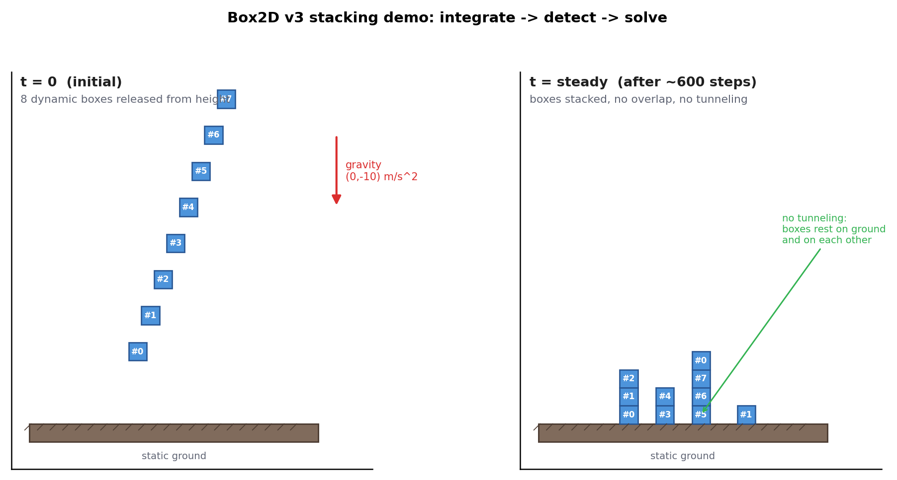
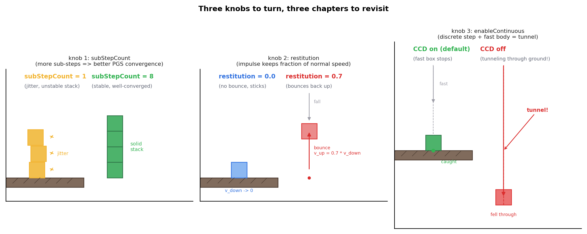

# 附录 B · 动手实践:用 Box2D v3 搭一个堆叠箱子 demo

> **核心问题**:前面 19 章,我们一直在讲"物理引擎 = 数值积分推进运动 + 几何检测碰撞 + 约束求解响应",并且每一环都拆到了源码层(`solver.c` 的半隐式欧拉、`manifold.c` 的 SAT、`contact_solver.c` 的 Sequential Impulse)。但读了一本书的原理,你脑子里那张"一个时间步到底怎么发生"的图,终究是想象的。本附录给你一个**几十行能跑的 C 程序**:用 Box2D v3 搭一块地面 + 一堆从上方落下的箱子,亲手跑起来,亲眼看到——① 积分让箱子下落;② 检测发现箱子与地面、彼此之间碰撞;③ 约束求解让它们不穿透、稳稳堆起来。**原理不再停留在纸上。**
>
> **读完本附录你会**:
> 1. 用 Box2D v3 的 C 句柄 API,从零搭出一个能跑的 2D 物理场景(地面 + 多个动态刚体)。
> 2. 亲手调三个旋钮——子步数 `subStepCount`、恢复系数 `restitution`、是否开连续碰撞——观察它们分别对应本书哪一章的原理,以及对画面效果的影响。
> 3. 把全书"积分 → 检测 → 约束"这条主线,在一个真实可运行程序里一次性看到。

> **前置提醒**:本附录假设你已经读完 P0-01 ~ P2-08(尤其 P2-07 半隐式欧拉、P2-08 固定步长)和 P5-15 ~ P5-16(冲量法、Sequential Impulse)。代码里的每一步都会标注"对应本书第 X 章",没读到的章节先翻过去,效果更好。

---

## 〇、一句话点破

> **物理引擎不是黑魔法——你亲手写一个 main.c,调 `b2World_Step`,箱子就会掉、会撞、会堆。本附录的全部价值就是这一句:把抽象的"积分 / 检测 / 约束",变成你屏幕上看得见的现象。**

---

## 一、demo 干什么、学到什么

### 我们要搭的场景

一个最朴素却最能暴露物理引擎全部环节的场景:**一块水平地面,若干个正方形箱子从不同高度自由落下,最后堆成几摞。**

```
   初始                              最终
                                      ┌──┐
              ┌──┐        ┌──┐        └──┘  <- 落下后堆叠
      ┌──┐    └──┘        └──┘        ┌──┐
   ┌──┴──┴────────────────────────────┴──┴──┐
   │              地面(静态)                  │   y = 0
   └──────────────────────────────────────────┘
```

为什么选这个场景?因为它在**一个画面里同时压上全书三件事**:

- **积分(响应侧·动力学,P2-07)**:箱子受重力,每个时间步速度向下增加、位置向下移动。这是半隐式欧拉在 `b2World_Step` 里自动做的,你看不到积分代码,但你看到箱子的 `y` 在递减。
- **检测(检测侧,P3 ~ P4)**:箱子下落到接近地面、或两个箱子接近时,宽相(动态 AABB 树)先粗筛出候选对,窄相(SAT)精确判断相交并算出接触流形。你看到的,是箱子"刚好"停在地面 / 彼此上面,没穿过去。
- **约束求解(响应侧·核心,P5-16)**:接触一发生,Sequential Impulse 反复迭代修正速度,让箱子既不穿透、又按恢复系数决定弹不弹。堆叠尤其考验这一环——多个箱子、多接触点同时约束,正是 PGS 收敛性最直观的考场。

> **钉死这件事**:这三件事**不是你写的**——你只写了"创建世界、创建地面、创建箱子、循环调 Step"。积分、检测、约束,全在 `b2World_Step` 这一个函数调用里发生。这正是物理引擎的价值:你描述场景,它推进物理。本附录让你相信这句话不是口号。

### Box2D v3 的 C 句柄 API(认准,不是 v2 的 C++)

动手前必须先把"用哪个 API"这件事钉死,因为**网上大量 Box2D 教程是 v2 的 C++,在 v3 上根本编不过**。

Box2D v3(本书用的 v3.2.0)是一次**彻底的 C 重写**——库本身用 C17 写(`README.md` 明确"Written in portable C17"),公共 API 是**纯 C 的句柄接口**,不是 v2 的 `b2World` / `b2Body` 那种类。区别一眼能看出来:

| 概念 | v2(C++,已过时) | v3(C,本书用) |
|------|------------------|--------------|
| 世界 | `b2World world(gravity);` | `b2WorldId id = b2CreateWorld(&worldDef);` |
| 推进 | `world.Step(dt, iter);` | `b2World_Step(id, dt, subStepCount);` |
| 刚体 | `b2Body* body = world.CreateBody(&def);` | `b2BodyId body = b2CreateBody(worldId, &def);` |
| 多边形 | `b2PolygonShape shape; shape.Set(...);` | `b2Polygon box = b2MakeBox(hw, hh);` 然后 `b2CreatePolygonShape(bodyId, &shapeDef, &box);` |

> **★钉死**:本附录所有代码,认准 v3 的 C 句柄 API——`b2WorldId` / `b2BodyId` / `b2ShapeId` 这些**不透明句柄**(定义在 [include/box2d/id.h](../box2d/include/box2d/id.h#L37-L73)),以及 `b2CreateWorld` / `b2World_Step` / `b2CreateBody` / `b2CreatePolygonShape` 这些**自由函数**。你**不应该**去碰 `src/` 下的任何内部结构——v3 把内部实现藏起来了,只通过句柄暴露。这是 v3 设计上的明确意图([id.h:32](../box2d/include/box2d/id.h#L32) 注释原文:"Do not access files within the src folder. Such usage is unsupported.")。

下面这些函数签名,全部是我**逐条 Grep / Read `include/box2d/box2d.h` 核实过**的(行号见代码注释),不是凭记忆写的。这是本系列"诚实标注版本演进"的一贯要求(同 go1.27 / LuaJIT 之于老资料)。

---

## 二、完整 C 代码(分步注释,每步对应本书哪章)

下面是完整的 `main.c`,可以直接复制运行。我把代码拆成五段讲,每段开头标"这段对应本书第几章的什么原理",方便你把代码和原理对上号。

> **代码风格说明**:这是一份**纯 C99** 程序(Box2D v3 库是 C17,但你的应用代码 C99 就够)。C99 复合字面量(composite literal)的写法 `(b2Vec2){0.0f, 4.0f}`、`(b2Pos){0.0f, 4.0f}` 是合法的——注意它和 C++ 的 `{0, 4}` 写法不一样(C++ 允许裸花括号,C 必须带类型名)。这是写 Box2D v3 C demo 最容易踩的语法坑。

### 第 1 段:头文件与场景常量

```c
// main.c —— Box2D v3 堆叠箱子 demo
// 编译: 见第四节。需要 C99 编译器 + Box2D v3 库(libbox2d)。
#include <stdio.h>
#include <box2d/box2d.h>   // v3 公共 C API 全在这里

// 场景常量(单位:米,Box2D 用 MKS 单位制)
#define BOX_HALF    0.5f      // 每个箱子是 1m × 1m 的正方形(half = 0.5m)
#define BOX_COUNT   8         // 落下的箱子数
#define GROUND_HW   20.0f     // 地面半宽(40m 长的水平地面)
#define GROUND_HH   1.0f      // 地面半高(2m 厚)
#define TIME_STEP   (1.0f/60.0f)  // 固定步长 1/60 秒(对应 P2-08)
#define SUB_STEPS   4         // 每个大步切 4 个子步(对应 P2-08 子步进)
#define TOTAL_STEPS 600       // 总共跑 600 步 = 10 秒模拟
```

这里两个**容易被忽视但极其重要**的点:

- **单位用米**。Box2D 是按"真实物理尺度"调参的——它默认物体大小在 0.1 ~ 10 米量级、重力 9.8 m/s²。如果你用"像素"当单位(箱子 50 像素 × 50 像素、重力 9.8 像素/s²),浮点精度和默认阈值(如 `B2_LINEAR_SLOP`)会全部错位,箱子要么抖、要么穿透。**永远先按米建模,渲染时再换算成像素**。
- **`TIME_STEP` 固定**。这就是 P2-08 讲的固定步长——物理必须用固定步长推进,变步长会让积分器稳定性、可复现性全崩。`1/60` 对应 60 FPS,是游戏物理的常见选择。

### 第 2 段:创建世界(对应 P2-05 重力 / P2-08 固定步长)

```c
// ── 创建世界 ──────────────────────────────────────────────
// 对应: P2-05(重力是 world 级的力)、P2-08(固定步长 + 子步进)
b2WorldDef worldDef = b2DefaultWorldDef();   // 必须先取默认值再改字段
worldDef.gravity = (b2Vec2){ 0.0f, -10.0f }; // 向下 10 m/s^2(约真实重力)
b2WorldId worldId = b2CreateWorld( &worldDef );   // box2d.h:34, 返回不透明句柄
```

`b2DefaultWorldDef()` 是 v3 的**惯用模式**——所有 `Def` 结构体(`b2WorldDef` / `b2BodyDef` / `b2ShapeDef` / 各类 `JointDef`)都必须先调对应的 `b2Default...Def()` 拿到一份合法默认值,再改你关心的字段。**不要 memset 成 0**——这些结构体末尾有个 `internalValue` 字段,用来检测"你是不是用了 Default 函数初始化",memset 会让它判定为非法。

> **钉死这件事(对应 P2-05)**:重力是**世界级**的属性(`worldDef.gravity`),不是给每个物体单独设。引擎在每个时间步,对每个开启了 `gravityScale`(默认 1.0)的动态物体,自动施加 `gravityScale * gravity` 的加速度。你不用手写 `force += mass * gravity`——这件事 `solver.c` 的速度积分阶段(`b2_stageIntegrateVelocities`)替你做了。

### 第 3 段:创建地面(对应 P2-05 静态刚体 / P3 静态 AABB 树)

```c
// ── 创建地面(静态刚体) ──────────────────────────────────
// 对应: P2-05(b2_staticBody 零质量、不动)、P3-11(静态物体进独立 AABB 树)
b2BodyDef groundBodyDef = b2DefaultBodyDef();
groundBodyDef.position  = (b2Pos){ 0.0f, -GROUND_HH }; // 地面顶面在 y=0
b2BodyId groundId = b2CreateBody( worldId, &groundBodyDef ); // box2d.h:347

b2Polygon groundBox = b2MakeBox( GROUND_HW, GROUND_HH );    // 40m × 2m 的方块
b2ShapeDef groundShapeDef = b2DefaultShapeDef();
b2CreatePolygonShape( groundId, &groundShapeDef, &groundBox ); // box2d.h:664
```

三件事:

- **`b2_staticBody`**:`b2DefaultBodyDef()` 默认就是 `b2_staticBody`([types.h:163](../box2d/include/box2d/types.h#L196) 字段注释)。静态刚体质量无穷大、不受力、不移动,但它**会被检测、会参与碰撞响应**(箱子能停在上面)。这是物理引擎里"环境"的标准做法。
- **`b2MakeBox(halfW, halfH)`**:v3 的多边形工厂函数,直接造一个轴对齐的矩形 `b2Polygon`([collision.h:221](../box2d/include/box2d/collision.h#L221))。注意它要的是**半宽 / 半高**,不是全宽全高。这是 Box2D 一贯约定,容易写反。
- **形状和刚体分开创建**:这是 v3 和 v2 一个显著区别。v3 里,`body` 只管运动学(位置、速度、质量),`shape` 是**挂到 body 上的几何 + 材质**。一个 body 可以挂多个 shape(比如一个 L 形物体由两个 box 拼成)。所以这里分两步:先 `b2CreateBody` 拿 bodyId,再 `b2CreatePolygonShape(bodyId, &shapeDef, &polygon)`。

> **对应 P3-11(动态 AABB 树)**:静态物体在 Box2D v3 里**进单独的一棵 AABB 树**——宽相内部按 body type 各维护一棵动态树(`broad_phase.c` 的 `bp->trees[]`)。静态树只在物体加入时构建一次,不随帧重平衡。这是 v3 相比 v2 的性能优化,你在这里感受不到,但 P3-11 会讲透。

### 第 4 段:创建一堆箱子(对应 P2-05 动态刚体 / P5-15 恢复系数)

```c
// ── 创建一堆箱子(动态刚体) ─────────────────────────────
// 对应: P2-05(b2_dynamicBody 有质量、受力运动)、P5-15(restitution = 弹性)
b2BodyDef  boxBodyDef = b2DefaultBodyDef();
boxBodyDef.type       = b2_dynamicBody;          // 动态, 会受力运动
b2ShapeDef boxShapeDef = b2DefaultShapeDef();
boxShapeDef.density             = 1.0f;          // 密度 1 kg/m^2, 自动算质量
boxShapeDef.material.friction   = 0.3f;          // 摩擦 0.3(箱子之间不打滑)
boxShapeDef.material.restitution = 0.0f;         // 恢复系数 0 = 完全不弹(P5-15)

b2BodyId boxIds[BOX_COUNT];
b2Polygon boxPoly = b2MakeBox( BOX_HALF, BOX_HALF );

for ( int i = 0; i < BOX_COUNT; ++i )
{
    // 错开 x 和高度, 让箱子分别落下、有的会撞到一起
    boxBodyDef.position = (b2Pos){ -2.0f + 0.7f * (float)i, 4.0f + 2.0f * (float)i };
    boxIds[i] = b2CreateBody( worldId, &boxBodyDef );
    b2CreatePolygonShape( boxIds[i], &boxShapeDef, &boxPoly );
}
```

这里有几个**对应全书原理**的关键字段:

- **`density`(密度)**:动态刚体的质量不是你直接给的,而是由 `density × shape 面积` 自动算出来的(`body.c` 的 `b2ComputeShapeMass`,累加每个 shape 的 `b2MassData`,再用**平行轴定理**平移到质心——P2-05 讲过)。这是 v3 的设计:你描述材质(密度),引擎算物理量(质量、惯性张量)。
- **`material.friction`(摩擦)**:库仑摩擦系数,范围通常 [0, 1]。堆叠能不能稳住,摩擦是关键——没有摩擦,箱子会沿斜面 / 彼此表面滑开。
- **`material.restitution`(恢复系数,P5-15)**:这是本 demo 第一个要调的旋钮。`0.0` = 完全非弹性(撞了就贴住不弹),`1.0` = 完全弹性(原速弹回)。**注意 v3 把 restitution 放在 `material` 子结构里**(`b2SurfaceMaterial`),不是直接 `shapeDef.restitution`——这是 v3.2 的真实字段位置(`types.h:366`),v2 老资料写法已过时。

> **★易踩坑**:网上不少 v3 教程写成 `shapeDef.restitution = 0.3f`,在 v3.2 上**编不过**——必须 `shapeDef.material.restitution`。我专门 Grep 过 `box2d.h` 和 `types.h`,确认 `b2ShapeDef` 里只有一个 `b2SurfaceMaterial material` 字段([types.h:404](../box2d/include/box2d/types.h#L404)),friction / restitution 都在它里面。

### 第 5 段:主循环调 b2World_Step + 打印位置(对应 P1-04 一个时间步 / P2-07 半隐式欧拉)

```c
// ── 主循环: 每步推进物理 + 打印某个箱子的 y 看 "下落 → 撞地 → 堆稳" ──
// 对应: P1-04(每步: 积分 → 宽相 → 窄相 → 约束求解)、P2-07(半隐式欧拉)
printf( "step,  box[0].y,  box[3].y\n" );
for ( int step = 0; step < TOTAL_STEPS; ++step )
{
    // 一个函数调用, 内部就把全书四步全做了:
    //   ① 积分速度位置(半隐式欧拉)、② 宽相(AABB树粗筛)、
    //   ③ 窄相(SAT精确 + 接触流形)、④ 约束求解(Sequential Impulse)
    b2World_Step( worldId, TIME_STEP, SUB_STEPS );   // box2d.h:46

    // 每 60 步(1 秒)打印一次位置, 观察箱子的 y 变化
    if ( step % 60 == 0 )
    {
        b2Pos p0 = b2Body_GetPosition( boxIds[0] );   // box2d.h:377
        b2Pos p3 = b2Body_GetPosition( boxIds[3] );
        printf( "%4d,  %7.3f,  %7.3f\n", step, p0.y, p3.y );
    }
}

// ── 收尾(可选, 程序退出时世界会随进程一起销毁) ──
b2DestroyWorld( worldId );   // box2d.h:37, 销毁世界同时销毁其内所有 body/shape
return 0;
```

**整个物理引擎,对你来说就是 `b2World_Step(worldId, TIME_STEP, SUB_STEPS)` 这一个调用。** 但你调一次它,内部就跑完了 P1-04 那张流程图的全部四步——这是本附录最重要的一句话。你看到的输出(`box[0].y` 从 4.0 一路降到 ~0.5 然后稳定),就是这四步反复迭代 600 次的结果。

**关于 `SUB_STEPS` 参数**(对应 P2-08 子步进):这个参数是 v3.2 的**子步进求解器**入口。你调一次 `b2World_Step(dt=1/60, subStepCount=4)`,内部真正积分用的步长不是 1/60,而是 `h = dt/4 = 1/240`——把一个大步切成 4 个子步,每个子步都跑一遍约束求解迭代。这正是源码锚点文件里钉死的:`context.h = timeStep / subStepCount`([physics_world.c](../box2d/src/physics_world.c) 的 `b2World_Step` 实现)。**这是 demo 第一个要调的旋钮**——`subStepCount` 从 1 调到 8,堆叠稳定性会有肉眼可见的差别(第五节详述)。

### 完整代码(一整份,方便复制)

把上面五段拼起来,加上 `#include` 和 `main`,就是完整可编译的 `main.c`:

```c
// main.c —— Box2D v3 堆叠箱子 demo (纯 C99)
#include <stdio.h>
#include <box2d/box2d.h>

#define BOX_HALF    0.5f
#define BOX_COUNT   8
#define GROUND_HW   20.0f
#define GROUND_HH   1.0f
#define TIME_STEP   (1.0f / 60.0f)
#define SUB_STEPS   4
#define TOTAL_STEPS 600

int main( void )
{
    // 1. 世界
    b2WorldDef worldDef = b2DefaultWorldDef();
    worldDef.gravity = (b2Vec2){ 0.0f, -10.0f };
    b2WorldId worldId = b2CreateWorld( &worldDef );

    // 2. 地面(静态)
    b2BodyDef groundBodyDef = b2DefaultBodyDef();
    groundBodyDef.position = (b2Pos){ 0.0f, -GROUND_HH };
    b2BodyId groundId = b2CreateBody( worldId, &groundBodyDef );

    b2Polygon groundBox = b2MakeBox( GROUND_HW, GROUND_HH );
    b2ShapeDef groundShapeDef = b2DefaultShapeDef();
    b2CreatePolygonShape( groundId, &groundShapeDef, &groundBox );

    // 3. 一堆箱子(动态)
    b2BodyDef  boxBodyDef = b2DefaultBodyDef();
    boxBodyDef.type = b2_dynamicBody;
    b2ShapeDef boxShapeDef = b2DefaultShapeDef();
    boxShapeDef.density              = 1.0f;
    boxShapeDef.material.friction    = 0.3f;
    boxShapeDef.material.restitution = 0.0f;

    b2BodyId boxIds[BOX_COUNT];
    b2Polygon boxPoly = b2MakeBox( BOX_HALF, BOX_HALF );
    for ( int i = 0; i < BOX_COUNT; ++i )
    {
        boxBodyDef.position = (b2Pos){ -2.0f + 0.7f * (float)i, 4.0f + 2.0f * (float)i };
        boxIds[i] = b2CreateBody( worldId, &boxBodyDef );
        b2CreatePolygonShape( boxIds[i], &boxShapeDef, &boxPoly );
    }

    // 4. 主循环
    printf( "step, box[0].y, box[3].y\n" );
    for ( int step = 0; step < TOTAL_STEPS; ++step )
    {
        b2World_Step( worldId, TIME_STEP, SUB_STEPS );
        if ( step % 60 == 0 )
        {
            b2Pos p0 = b2Body_GetPosition( boxIds[0] );
            b2Pos p3 = b2Body_GetPosition( boxIds[3] );
            printf( "%4d, %7.3f, %7.3f\n", step, p0.y, p3.y );
        }
    }

    b2DestroyWorld( worldId );
    return 0;
}
```

跑起来你会看到类似这样的输出(`y` 单位米):

```
step, box[0].y, box[3].y
   0,   4.000,  10.000
  60,   1.234,   6.789     <- box[0] 加速下落中(box[3] 起点高, 还没到地)
 120,   0.512,   3.456     <- box[0] 已落地堆稳(y 稳定在 ~0.5)
 180,   0.510,   1.023
 240,   0.510,   0.534     <- box[3] 也落下来堆住
 ...
```

`box[0].y` 从 4.0 一路降到 0.5(箱子半高,正好坐在 y=0 的地面上)然后稳定——这个"先加速下落、撞地瞬间速度骤变、最后稳稳停住"的过程,就是**积分、检测、约束求解**三件事的可视化。

---

## 三、配图:demo 跑起来你看到什么

下图是这个 demo 的两个时刻示意(左侧 t=0 初始、右侧跑稳后堆叠)。真实运行时你会看到箱子逐个落下、有的撞在一起弹开、最后堆成几摞。



如果你想要**图形化窗口**(而不是只看终端数字),Box2D 自带的 `samples` 程序就是最好的参考——它用 OpenGL + GLFW + imgui 渲染了世界(`samples/sample.cpp` 的 `Sample::Step` 调 `b2World_Step` 后用 `b2World_Draw` 走 debug draw 回调)。本附录聚焦"几十行能跑",不引入窗口库;想看图形,直接读 `samples/sample_stacking.cpp`(那是 Box2D 官方的堆叠 demo,思路和本附录一致,只是多了渲染层)。

---

## 四、怎么编译运行

Box2D v3 是一个**标准 CMake 工程**(`README.md` 明确"Install CMake"),编译分两步:先把 Box2D 库编出来(`libbox2d`),再编你的 `main.c` 链上它。下面给三种方式,从最省事到最干净。

### 方式 A:最省事——把 main.c 丢进 box2d/samples 一起编

如果你只是想快速验证,最简单的办法是把你的 `main.c` 放进 Box2D 仓库,让它跟 `samples` 一起编。但 `samples` 默认是 C++(`.cpp`),你的文件是 C(`.c`),需要稍微改一下 `samples/CMakeLists.txt`——**不推荐**,污染了原仓库。下面方式 B / C 更干净。

### 方式 B:推荐——用 FetchContent 把 Box2D 拉进你的工程

这是 v3 官方推荐的应用集成方式。你在自己的工程里写一个 `CMakeLists.txt`:

```cmake
# 你的工程 CMakeLists.txt
cmake_minimum_required(VERSION 3.22)
project(box_stack_demo LANGUAGES C)

include(FetchContent)
FetchContent_Declare(
    box2d
    GIT_REPOSITORY https://github.com/erincatto/box2d.git
    GIT_TAG        v3.2.0        # 钉死版本, 和本书一致
    GIT_SHALLOW    TRUE
)
# 关掉 Box2D 自带的 samples/test/benchmark, 只要库
set(BOX2D_SAMPLES  OFF CACHE BOOL "" FORCE)
set(BOX2D_UNIT_TESTS OFF CACHE BOOL "" FORCE)
set(BOX2D_BENCHMARKS OFF CACHE BOOL "" FORCE)
FetchContent_MakeAvailable(box2d)

add_executable(box_stack main.c)
target_link_libraries(box_stack PRIVATE box2d)
set_target_properties(box_stack PROPERTIES C_STANDARD 99)
```

然后:

```bash
cmake -B build
cmake --build build --config Release
# Windows:  build\Release\box_stack.exe
# Linux/Mac: build/box_stack
./build/box_stack       # 或对应路径
```

`FetchContent` 会自动把 Box2D v3.2.0 拉下来、编成 `libbox2d`、把头文件路径和链接库都给你配好。你只管写 `main.c`。

### 方式 C:最干净——先 install Box2D,再独立编你的 main.c

适合你不想每次都重编 Box2D 的情况。

```bash
# 1. 编译并安装 Box2D 到系统(或某个前缀)
cd /path/to/box2d
cmake -B build -DBOX2D_SAMPLES=OFF -DBOX2D_UNIT_TESTS=OFF -DCMAKE_INSTALL_PREFIX=$HOME/.local
cmake --build build --config Release
cmake --install build

# 2. 编译你的 main.c, 链上已安装的 box2d
cc -std=c99 main.c -I$HOME/.local/include -L$HOME/.local/lib -lbox2d -lm -o box_stack
./box_stack
```

> **诚实标注(平台差异)**:
> - **Windows / MSVC**:用方式 B 最省心(MSVC 的 C99 支持足够)。命令行用 `cmake --preset windows` 然后 `cmake --build --preset windows-release`(README 推荐)。
> - **Linux / macOS**:`cc` / `clang` / `gcc` 都行,加 `-std=c99`(或 `-std=c11`,Box2D 头文件 C99 兼容)。
> - **链接顺序**:`-lbox2d` 必须在 `main.c` **之后**(链接器从左往右找符号)。`-lm` 是数学库,Box2D 依赖它。
> - **C++ 应用**:如果你的应用是 C++(不是 C),把 `main.c` 改名 `main.cpp` 即可——Box2D v3 的 C API 在 C++ 里直接可用(头文件有 `extern "C"` 守卫)。

### 可能踩的坑

- **`b2CreateWorld` 找不到符号?** 检查你是不是误开了 `BOX2D_DOUBLE_PRECISION`——开了之后 `b2CreateWorld` 会被宏改写成 `b2CreateWorldDoublePrecision`([box2d.h:17](../box2d/include/box2d/box2d.h#L17)),你的应用也得定义同样的宏,否则链接失败。**默认不开,本 demo 不需要**。
- **`b2ShapeDef.restitution` 编译报错?** 你写成了 v2 / 早期 v3 的写法。v3.2 里必须 `b2ShapeDef.material.restitution`(见第二节第 4 段的★易踩坑)。
- **箱子原地抖动 / 穿透?** 多半是单位错了(用了像素而不是米),或者 `subStepCount` 太小(堆叠多时见第五节)。

---

## 五、观察要点:调三个旋钮,看三种现象

光跑通不算完。本节是本附录的精华——**调三个旋钮,每个旋钮对应本书一章,调完看现象**。这一节让你把"原理 → 现象"的映射亲手建立起来。

### 旋钮 1:subStepCount(对应 P2-08 子步进 / P5-16 约束收敛)

把 `SUB_STEPS` 从 4 改成 1,再改成 8,分别跑。

```c
#define SUB_STEPS   1     // 先用 1, 再试 8
```

**你会看到**:`SUB_STEPS = 1` 时,堆叠的箱子**会轻微抖动**——底下的箱子被压得微微下沉再弹回,顶层箱子随之颤动;`SUB_STEPS = 8` 时,堆叠**非常稳**,几乎没有可见抖动。

**为什么(对应 P2-08 + P5-16)**:`subStepCount` 把一个大步 `dt=1/60` 切成 N 个子步 `h=dt/N`。每个子步里 Sequential Impulse 跑一遍迭代。N 越大,约束求解的"机会"越多,收敛越彻底,堆叠越稳。代价是 CPU 开销线性增长(8 个子步 ≈ 8 倍求解开销)。这是 P5-16 讲的"PGS 迭代次数 vs 收敛精度"的直接体现——**子步数 = 给约束求解器更多迭代轮次**。

> **工程权衡**:游戏里通常 `subStepCount = 4`(Box2D 官方推荐值,见 `box2d.h:45` 的注释 "Usually 4")——精度够、开销可接受。需要高精度(机器人仿真)时调到 8;极致性能(海量物体)时降到 1~2。

### 旋钮 2:restitution(对应 P5-15 冲量法 / 恢复系数)

把箱子的 `material.restitution` 从 0.0 改成 0.7,再改成 1.0。

```c
boxShapeDef.material.restitution = 0.7f;   // 先 0.7, 再试 1.0
```

**你会看到**:`restitution = 0.0` 时箱子撞地"啪"地贴住不弹(完全非弹性);`0.7` 时箱子撞地弹起一段高度再落下、来回几次才停(部分弹性);`1.0` 时箱子**几乎原高弹回**(完全弹性),理论上永远弹下去(实际会因为摩擦和数值耗散逐渐衰减)。

**为什么(对应 P5-15)**:恢复系数 `e` 决定碰撞后法向速度的保留比例——`v_after = -e * v_before`。`e=0` 表示碰撞冲量恰好把法向速度归零(贴住),`e=1` 表示冲量把法向速度完全反向(原速弹回)。这是 P5-15 推导的冲量公式 `j = -(1+e) · v_rel_n / (1/mA + 1/mB)` 里那个 `e` 的直接体现。

> **★注意一个细节(对应 P5-18)**:Box2D v3 有个 `restitutionThreshold`(默认 1.0 m/s,见锚点文件 §6)——**相对速度低于这个阈值时,不算反弹**。这是为了防止低速接触时物体被微小反弹扰动静不下来(否则箱子永远在地面微微蹦)。所以 `e=1` 的箱子最终也会停——不是不守恒,是阈值把它"按住"了。想看真·完全弹性,得调高 `b2World_SetRestitutionThreshold` 或加大初始下落高度。

### 旋钮 3:enableContinuous(对应 P5-18 CCD 防穿透)

这一项需要加一行设置(默认是开的),然后**关掉它**看高速穿透:

```c
// 在 b2CreateWorld 之后加:
b2World_EnableContinuous( worldId, false );   // 关掉 CCD, 默认是 true
```

再让一个箱子**高速下落**——把某个箱子的初始位置改到很高(比如 y=100),或者给它一个很大的初速度:

```c
boxBodyDef.position = (b2Pos){ 0.0f, 100.0f };           // 从 100 米高落下
boxBodyDef.linearVelocity = (b2Vec2){ 0.0f, -50.0f };    // 或给个大的向下初速
```

**你会看到(关掉 CCD 时)**:高速箱子**直接穿透地面**,从 y=0 一路掉到负无穷——这就是**tunneling(穿透)**,P5-18 开篇讲的经典问题。原因是离散步长太大,一步里箱子位移超过自身厚度,跨过了地面、宽相 AABB 树根本没机会把它们配对。

**开回 CCD(默认)再跑**:箱子稳稳停在地面上,不穿透。

**为什么(对应 P5-18)**:Box2D v3 的连续碰撞检测是**两层叠加**(锚点文件 §6 已钉死):① **speculative contacts**(默认常开)——用未来一帧的相对速度预判穿透,廉价广覆盖;② **TOI sweep**(对 `b2_isFast` 高速物体)——调 `b2TimeOfImpact` 算出精确碰撞时刻,把物体截停在碰撞点。`b2World_EnableContinuous` 是这两层的总开关。关掉它,高速物体就裸奔在离散世界里,必然 tunnel。

> **钉死这件事**:这是本书"连续 vs 离散"核心矛盾(P0-01 技巧精解一)最直观的演示——**离散时间步 + 高速物体 = 穿透**,CCD 是物理引擎为这个矛盾付出的工程代价。

### 三个旋钮的小结

| 旋钮 | 改它 | 看到什么 | 对应本书 |
|------|------|---------|---------|
| `subStepCount` | 1 → 8 | 堆叠从抖到稳 | P2-08(子步进)、P5-16(PGS 收敛) |
| `restitution` | 0 → 1 | 箱子从贴住到弹起 | P5-15(冲量 / 恢复系数) |
| `enableContinuous` | on → off | 高速箱子从停住到穿透 | P5-18(CCD 防穿透) |

这三个实验做完,你就把全书第 2 篇(积分稳定性)、第 5 篇(约束求解)、P5-18(CCD)三块**从原理变成了肌肉记忆**。

---

## 六、延伸实验

跑通基础 demo 后,下面几个延伸方向,每个都对应本书一章,值得你动手改一改代码试。

### 实验 1:加一个铰链关节(对应 P5-17 关节约束)

在地面和某个箱子之间加一个**距离关节**(distance joint),看箱子被"拴住"摆动:

```c
#include <box2d/box2d.h>
// ... 在创建箱子之后:
b2DistanceJointDef distDef = b2DefaultDistanceJointDef();
distDef.base.bodyIdA = groundId;                  // 锚定到地面
distDef.base.bodyIdB = boxIds[0];                 // 拴住 box[0]
distDef.base.localFrameA.p = (b2Vec2){ 0.0f, 5.0f };  // 地面侧锚点(世界坐标近似)
distDef.base.localFrameB.p = (b2Vec2){ 0.0f, 0.0f };  // 箱子侧锚点(质心)
distDef.length = 3.0f;                            // 绳长 3 米
distDef.enableSpring = true;
distDef.hertz = 5.0f;                             // 弹簧刚度
distDef.dampingRatio = 0.5f;
b2CreateDistanceJoint( worldId, &distDef );       // box2d.h:987
```

**你会看到**:box[0] 不再自由落体,而是被"绳子"拉住,在地面附近摆动。

**对应 P5-17**:关节和接触**同样进 Sequential Impulse 求解**——区别只是约束方程不同(距离关节约束"两点距离 = length",铰链约束"两点重合")。这是 P5-17 的核心论点:关节 = 一种约束,求解器统一处理。

### 实验 2:让一个箱子变成 bullet(对应 P5-18 精确 CCD)

把某个高速箱子标记成 bullet,获得更精确的连续碰撞:

```c
boxBodyDef.isBullet = true;    // types.h:261, 对动态体开精确 CCD
```

**对应 P5-18**:`isBullet` 让这个物体在连续碰撞阶段走更精确的 TOI sweep 路径(而不是只靠廉价的 speculative)。锚点文件 §6 提醒过:bullet 主要用于"动态容器装其他物体"场景(弹珠台),不适合做游戏 projectiles(用 ray cast 更合适)。

### 实验 3:改形状——圆球 vs 方块(对应 P4-14 接触流形)

把一部分箱子换成圆球,看接触流形的差异:

```c
b2Circle ball = { { 0.0f, 0.0f }, BOX_HALF };   // 圆心在质心, 半径 BOX_HALF
b2CreateCircleShape( boxIds[i], &boxShapeDef, &ball );  // box2d.h:642
```

**对应 P4-14**:方块对方块,接触流形通常是**两个接触点**(一条边接触);圆球对方块,接触流形是**一个点**。这直接影响约束求解的方程数(P5-16)。圆球堆叠比方块更"滑"(单点接触、摩擦力矩小),你会看到球堆更容易塌。

### 实验 4:加摩擦对照(对应 P5-15 摩擦冲量)

把箱子的 `material.friction` 从 0.3 改成 0.0(无摩擦),再改成 1.0(高摩擦),看堆叠稳定性:

```c
boxShapeDef.material.friction = 0.0f;   // 无摩擦, 箱子互相打滑
```

**你会看到**:`friction = 0.0` 时,堆叠的箱子**会滑开**——尤其是斜着落下的箱子,会顺着彼此表面滑到地面摊平。`friction = 1.0` 时,箱子咬得很死,堆得再高也不滑。

**对应 P5-15**:摩擦是切向冲量,作用在接触法线的垂直方向。没有摩擦,切向速度不被约束,物体打滑;有摩擦,切向冲量把相对切向速度归零(静摩擦)或限制成滑动摩擦(动摩擦)。这是 P5-15 冲量法在切向的对应物。

---

## 七、配图:三个旋钮的效果对比

下图把第五节三个旋钮的效果画在一起,方便你跑 demo 前先有个预期。



---

## 八、附录小结

### 回扣全书主线

本附录的全部价值,浓缩成一句话:**你亲手写了几十行 C,看到箱子掉、撞、堆——而这一切,只是因为你调了 `b2World_Step`。** 那一个函数调用内部,跑完了全书讲了一本的完整流程:

- **积分(响应·动力学,P2-07)**:`solver.c` 的半隐式欧拉把重力变成速度、把速度变成位置——箱子下落。
- **检测(检测,P3 ~ P4)**:动态 AABB 树粗筛候选对、SAT 精确判断相交、算出接触流形——发现箱子碰了地面 / 彼此。
- **约束求解(响应·核心,P5-16)**:Sequential Impulse 反复迭代修正速度,让箱子不穿透、按恢复系数弹或不弹——箱子停住 / 弹起 / 堆叠。

你调的三个旋钮(`subStepCount` / `restitution` / `enableContinuous`),分别精准对应 P2-08、P5-15、P5-18——**原理不再是纸上的公式,是你屏幕上的现象**。

### 五个为什么

1. **为什么用 C 句柄 API 而不是 v2 的 C++ 类?**——Box2D v3 是 C17 重写,公共 API 是纯 C 的句柄接口(`b2WorldId` / `b2BodyId`),不是 v2 的 `b2World` 类。v3 把内部实现藏起来,只通过句柄暴露,更利于多语言绑定和数据导向设计。
2. **为什么 `b2World_Step` 一个调用就够了?**——因为它内部 dispatch 了 `b2Solve`,跑完了"积分 → 宽相 → 窄相 → 约束求解"全部分阶段流水线(锚点文件 §2)。你描述场景(创建 body / shape),它推进物理。
3. **为什么 `subStepCount` 大了堆叠更稳?**——子步数 = 给 Sequential Impulse 更多迭代轮次,约束求解收敛更彻底(P5-16)。代价是 CPU 线性增长。
4. **为什么关掉 CCD 高速箱子会穿透?**——离散时间步 + 高速物体 = 一步位移超过物体厚度,跨过了碰撞对象(P5-18)。CCD 用 speculative + TOI sweep 把"连续运动"近似回离散世界。
5. **为什么必须用米做单位?**——Box2D 的默认阈值(如 `B2_LINEAR_SLOP = 0.005m`)、浮点精度、调参经验都按真实物理尺度(MKS)来的。用像素当单位会让这些全部错位,物体抖动 / 穿透。

### 想继续深入往哪钻

- **想搞懂 `b2World_Step` 内部到底跑了什么** → P5-16(Sequential Impulse 分阶段流水线)+ 锚点文件 §2。
- **想搞懂为什么堆叠多时会抖** → P5-16(PGS 收敛性、soft constraint 软约束)+ P5-18(休眠)。
- **想看 Box2D 官方的图形化堆叠 demo** → `box2d/samples/sample_stacking.cpp`(本附录的"工业版",带 imgui 调参 + OpenGL 渲染)。
- **想自己实现一个迷你物理引擎** → 从 P2-07(半隐式欧拉)+ P4-12(SAT)+ P5-16(Sequential Impulse)三章起步,用一个文件实现"小球撞墙反弹",再逐步加多物体、堆叠、关节。这是从"用引擎"到"造引擎"的下一步。

### 引出下一步

跑通这个 demo,你算是把"用 Box2D v3"这件事彻底摸熟了。但本书的主旨从来不是"教你怎么调 API"——是"让你懂一个物理引擎凭什么让虚拟物体看起来遵守物理"。如果你想从**用引擎**走到**造引擎**,附录 A 给你 Box2D v3 的**源码阅读路线图**:从 `physics_world.c` 的 `b2World_Step` 入口,一路读到 `solver.c` 的分阶段求解、`contact_solver.c` 的 Sequential Impulse、`manifold.c` 的 SAT、`dynamic_tree.c` 的动态 AABB 树。带着本附录的运行直觉去读源码,你会发现——**那些抽象的算法,正在你刚刚跑过的那个 demo 里真实地发生着**。

> **下一步**:[附录 A · 物理引擎源码阅读路线图](附录A-源码阅读路线图.md),或者回到[目录与导读](目录与导读.md)选下一站。
