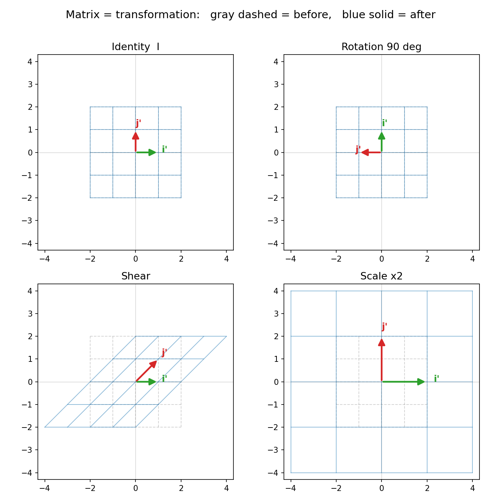

# 第 1 章 · 第一性原理:矩阵,其实是在揉捏空间

> **核心问题**:线性代数到底在研究什么?我们背了那么多"矩阵乘法""行列式""特征值",可这些冰冷的数字和符号,到底在描述世界里的什么?
>
> 这一章我们不背任何公式、不套任何算法。只问一件事:**如果先把矩阵那些数字全撤掉,底下藏着的那个"动作"到底是什么?为什么它非得用一张方方正正的数表来记?**
>
> **读完本章你会明白**:
> - 向量根本不是"一列数字",而是空间里从原点出发的一根箭头——这是从"会算"到"真懂"必须跨过的第一道门槛。
> - 矩阵根本不是"一个数表",而是对整个空间的**一次揉捏**(一个动作);矩阵的那两列,只是记录了"这次揉捏把空间的两根基准轴搬去了哪儿"。
> - 所以"矩阵乘向量"= 让这根箭头被揉一下;"矩阵乘矩阵"= 两次揉捏接龙。
> - 以及一个最重要的承诺:这本书后面所有吓人的名词——行列式、特征值、秩、逆矩阵、基变换——**全都是在描述"这次揉捏"的某一个侧面**。把"揉捏"这个词钉死,后面没有什么是看不懂的。

---

## 章首·一句话点破

如果用一句话回答"线性代数在干嘛",那就是:

> **线性代数,是一门研究"如何揉捏空间"的语言。矩阵,就是记录"怎么揉"的那张说明书。**

但这句话是**结论**,不是**理由**。这一章要倒过来——先把"矩阵"这两个字从你脑子里彻底清空,从最朴素的"向量"问起:

- 向量到底是个什么东西?它是一列数字,还是别的?
- 如果向量是空间里的一根箭头,那"矩阵"这种方方正正的数表,跟箭头有什么关系?
- 为什么矩阵乘法非得"行乘列"那么别扭地算?这套别扭算法的底下,藏着什么?

我们一块一块拆。

---

## 一、先把"向量"从一列数字,还原成一根箭头

绝大多数人脑子里的"向量",长这样:

```
   ┌   ┐
   │ 3 │
   │ 2 │
   └   ┘
```

一列数字。教材从第一页就这么画,于是你理所当然地以为:**向量 = 一列数字。**

这是你"会算却不懂"的第一个、也是最深的根源。我们把这句话连根拔起:

> **向量不是一列数字。"3、2"只是这根向量在某个坐标系下的"地址",不是向量本身。**

### 不这样看会怎样

如果你把向量当成"一列数字",那么:

- "矩阵乘向量"在你眼里永远是"拿一张数表去乘一列数,按行乘列的规则算出另一列数"。这套规则你背得滚瓜烂熟,但它**为什么长这样**,你答不上来——因为答案根本不在"数字"这一层,而在数字背后的"箭头"那一层。
- 后面遇到"特征值""正交""投影",你会觉得是一堆互不相干的定义,要死记。可一旦你看到向量是箭头,这些词全都是**对箭头之间几何关系**的描述,一目了然。

### 所以这样看:向量是空间里从原点出发的一根箭头

> **比喻**:想象一张铺开的坐标纸。向量,就是从纸的中心(原点)画出去的**一根箭头**,箭尖落在某个位置。"3、2"这俩数字,是这根箭头箭尖的**门牌号**:往右走 3 格,往上走 2 格,到了。

关键来了——这"往右 3 格、往上 2 格"里,藏着两个**无名英雄**:

- 一个叫 **i**(读作"艾"),它代表"往右走 1 格"那根最短的箭头,坐标 `(1, 0)`。
- 一个叫 **j**(读作"杰"),它代表"往上走 1 格"那根最短的箭头,坐标 `(0, 1)`。

向量 `(3, 2)` 的真正含义,是:

```
   (3, 2)  =  3 个 i  +  2 个 j
            =  3·(1,0) + 2·(0,1)
```

> **记住这件事,它是全书的钥匙**:任意一个向量,都是 **i 和 j 的某种配比**(几份 i + 几份 j)。i 和 j 这俩"基本款",叫**基向量(basis)**。整个空间里的任何一根箭头,都能用"几份 i、几份 j"唯一地调配出来。

这套"用基向量调配"的看法,看起来平平无奇。但下一节你就会看到,正是它,让"矩阵"这个东西一下子活了过来。

> **一个小升华(先种下,后面会收)**:同一个箭头,换一套"基"(换一种量地的尺子),它的"门牌号"就变了。所以**数字不是向量的本质,箭头才是**;数字只是箭头在某个特定坐标系下的投影。这个"换个基、数字就变"的事实,是后面"基变换""特征值"那些章节的地基。本章你只需记住:我们说一个向量 `(3, 2)` 时,默认它是在"标准基 i、j"下量的。

---

## 二、线性变换:对整个空间的一次"揉捏"

把向量还原成箭头之后,我们可以谈"变换"了。

所谓**变换(transformation)**,说白了就是:**把空间里的每一个点,都按照某个统一的规则,搬到新的位置。** 输入一个点,输出一个点。它本质上就是个函数——只不过线代习惯把它叫"变换",并且**让整个空间的所有点一起搬**。

> **比喻**:想象你拿的是一张**画满方格的橡皮膜**(每个格子的交点就是一个点)。变换,就是你伸手去**揉这张膜**——每个点都被揉到了新地方。

可"揉"的方式有千万种。线代只研究其中一类,叫**线性变换(linear transformation)**。这类变换有两条铁律,我们把它们翻译成橡皮膜的语言:

1. **原点不动**——膜的中心(0,0)谁也不能动,钉死在那儿。
2. **直线还是直线、网格还保持平行且等距**——膜上原来平行的线,揉完还得平行;原来等距的格子线,揉完间距可以变,但**所有同方向的平行线,间距得一样**。

> **不这样会怎样**:如果你允许把膜**弯曲**(比如让点的 y 坐标变成 x²),膜就被揉皱了,网格歪七扭八。一旦网格失去"平行等距"这个规矩,你就再也没法用"几份 i、几份 j"这种简单的数字去描述一个点的新位置了——世界会乱成一锅粥,数学根本管不住。

所以"线性"不是数学家无聊的限制,而是**"还能用数字管得住"的最复杂的一类变换**。只要变换是线性的,网格规矩就还在,整个空间的新状态就能被一两个数字说清楚。这是线代整个学科存在的理由。

> **一句话记住**:线性变换 = 在不撕裂、不弯曲、不挪动原点的前提下,把空间**均匀地拉伸、旋转、压扁、剪切**。就像在一张方格橡皮膜上,均匀地拽它。

---

## 三、高潮:两根基向量,就决定了整个空间怎么揉

现在,见证全书第一个、也是最关键的一个"啊哈"时刻。

一个线性变换,要把平面上**无穷多个点**都搬到新位置。你本能地以为:要描述它,得给每个点都记一笔"搬到哪",那得记无穷笔数据。

**完全不用。** 因为有一个惊人的事实:

> **一个二维线性变换,你只要知道它把 i 搬去了哪、把 j 搬去了哪,整个平面上每一个点的去向,就全都定了。**

### 为什么

还记得上节的钥匙吗?任意一个向量 `v = a·i + b·j`(它是 a 份 i 加 b 份 j)。

而"线性"这个铁律,恰好保证了:**变换前后,这种"几份 i + 几份 j"的配比关系不变。** 所以变换之后:

```
   T(v)  =  a · T(i)  +  b · T(j)
```

翻译成人话:**变换后,向量变成了 a 份"新的 i" 加 b 份"新的 j"。**

也就是说——只要你知道 i 被搬去了哪(`T(i)`)、j 被搬去了哪(`T(j)`),那么随便给一个向量,你只要数出它是"几份 i + 几份 j",就立刻知道它被搬到了"a 份新 i + b 份新 j"的位置。**整个空间怎么动,完全由这两根基向量的去向决定。**

### 于是,矩阵诞生了

既然只需要记两个去向,而每个去向是一个二维坐标(2 个数),那一共就 **4 个数**。这 4 个数怎么摆最顺眼?——**排成两列**:

```
   ┌          ┐
   │  T(i)的x   T(j)的x  │
   │  T(i)的y   T(j)的y  │
   └          ┘
```

第一列,是 i 被搬去的新坐标;第二列,是 j 被搬去的新坐标。

**这个两列的数表,就是矩阵。**

> **全章最重要的一句话,钉死它**:
>
> **矩阵的每一列,就是一根基向量被搬去的新位置。矩阵 = "这次揉捏,把空间的两根基准轴揉成了什么样"的说明书。**

### 几个矩阵,你立刻就能"看懂"

以前你看到一个矩阵,看到的是一堆数。现在你知道**每一列是一根箭头的新去向**,于是你能"看见"每次揉捏在干什么。我们看几个:

> 下图把这几种变换"揉捏前后"的真面目画出来了:灰虚线 = 揉之前的方格,蓝实线 = 揉之后,绿色 `i'` / 红色 `j'` = 两根基向量被搬去的新位置。**盯着"剪切(Shear)"那张看——整个方格被横向推歪了,这就是"矩阵在揉空间"的字面意思。**



**① 单位矩阵 `[[1,0],[0,1]]`**

```
   第一列 (1,0) = i 还在原地
   第二列 (0,1) = j 还在原地
```

i 和 j 都没动,整个空间纹丝不动。这就是"什么都不做"的变换——所以它叫**单位矩阵**,就像数字里的 1。

**② 放大 2 倍 `[[2,0],[0,2]]`**

```
   第一列 (2,0) = i 被拉长到原来的 2 倍(向右 2 格)
   第二列 (0,2) = j 被拉长到原来的 2 倍(向上 2 格)
```

两根基向量都往外撑了一倍,整个网格被均匀放大 2 倍。

**③ 逆时针旋转 90° `[[0,-1],[1,0]]`**

```
   第一列 (0,1) = i(原本朝右)被搬到"朝上"——转了 90°
   第二列 (-1,0) = j(原本朝上)被搬到"朝左"——也转了 90°
```

两根基向量一起逆时针转了 90°,整个空间跟着转了 90°。

**④ 水平剪切 `[[1,1],[0,1]]`**

```
   第一列 (1,0) = i 没动(还朝右)
   第二列 (1,1) = j 从"正上方"歪到了"右上方 45°"
```

i 原地不动,j 向右倾斜,整张网格像被一只手**横向推歪了**——顶上的格子往右滑,底下的不动。这就是"剪切"。

> 你看,**以前这些矩阵对你只是一堆要背的数字;现在每一个矩阵,你都能在脑子里"放映"出它揉捏空间的动作。** 这就是从"会算"到"真懂"的分水岭。

---

## 四、那套别扭的"行乘列"算法,到底在算什么

现在,我们来回答折磨了无数人的问题:**为什么矩阵乘向量,非得"拿每一行去乘那一列、再相加"?**

设矩阵 `M` 的第一列是 `T(i)`、第二列是 `T(j)`(也就是 i、j 的新去向)。现在拿一个向量 `v = (a, b)` 去乘它(意思是:让 v 经历 M 这个揉捏)。结果应该是什么?

回到第三节的结论:

```
   T(v) = a · T(i) + b · T(j)
        = a · (第一列) + b · (第二列)
```

**翻译成人话:这个向量原本是 a 份 i 加 b 份 j。现在 i、j 都被揉走了,那这个向量自然就变成 "a 份(新 i) 加 b 份(新 j)"。** 结果,就是把矩阵的**第一列乘 a、第二列乘 b,再加起来**。

而"第一列乘 a + 第二列乘 b"展开成数字算,恰好就是"拿矩阵每一行,分别去乘向量的分量再相加"——也就是你背的那个"行乘列"规则。

> **所以那套让你背到吐的"行乘列",不是一个任意的、莫名其妙的计算规定。它是"在新基下,用 a 份新 i + b 份新 j 重组这个向量"这件事,写成了数字算式后的唯一样子。** 算法是理解的副产品——理解了,你甚至能自己把它推出来,根本不用背。

### 拿数字走一遍,你就信了

矩阵 `M = [[1, 3], [-2, 0]]`,意思是:

- 第一列 `(1, -2)`:i 被搬到了"(1,-2)"——往右 1、往下 2。
- 第二列 `(3, 0)`:j 被搬到了"(3,0)"——往右 3、不动上下。

现在让向量 `v = (3, 2)` 经历这个变换。按"理解"算:

```
   T(v) = 3 · (第一列) + 2 · (第二列)
        = 3·(1,-2) + 2·(3,0)
        = (3,-6) + (6,0)
        = (9, -6)
```

按"行乘列"的规则算:

```
   新x = 第1行·v = 1·3 + 3·2 = 3 + 6 = 9
   新y = 第2行·v = (-2)·3 + 0·2 = -6 + 0 = -6
   →  (9, -6)
```

**两种算法,一模一样。** 因为它们本来就是同一件事。从此"行乘列"对你再无神秘——它就是"拿 a 份新 i、b 份新 j,把向量重新拼出来"。

---

## 五、矩阵乘矩阵:两次揉捏的接龙

把"矩阵 = 一次揉捏"贯彻到底,矩阵乘矩阵的意思就自动浮现了:

> **`A · B` 的意思:先做 B 这个揉捏,再做 A 这个揉捏,把两次合成"一个总的揉捏"。**

注意顺序——**从右往左**:先 B 后 A。这跟函数嵌套 `f(g(x))` 一样(先算里面的 g,再算外面的 f),纯属一套约定,别纠结。

那"两次揉捏的总效果",能不能也写成一个矩阵?能——而且这个总矩阵,就是 A 和 B 乘出来的那个结果。**所以"矩阵乘矩阵"算出来的,是"把两次揉捏合并成一次"的那个等价矩阵。**

### 为什么矩阵乘法不能交换(先 A 后 B ≠ 先 B 后 A)

这是初学者最容易被坑的点:`A·B ≠ B·A`。数字乘法 `3×5 = 5×3`,凭什么矩阵就不行?

因为矩阵是"动作",而**动作的先后顺序,会改变结果**。

> **比喻**:穿衣服。**先穿袜子、再穿鞋**,和**先穿鞋、再穿袜子**,结果能一样吗?当然不一样——顺序错了根本穿不上。

我们拿两个矩阵证明给你看。设:

- `S`(剪切)`= [[1,1],[0,1]]`:把空间横向推歪。
- `R`(逆时针转 90°)`= [[0,-1],[1,0]]`:把空间转 90°。

对同一根向量 `(1, 0)`:

**路线一:先剪切,再旋转(`R·S`)**
```
   (1,0) ──剪切──→ (1,0) ──转90°──→ (0,1)
```

**路线二:先旋转,再剪切(`S·R`)**
```
   (1,0) ──转90°──→ (0,1) ──剪切──→ (1,1)
```

`(0,1) ≠ (1,1)`。**同样的两个动作,先后顺序一换,结果就不同。** 这就是矩阵乘法不可交换的真正原因——它不是数学家的任性规定,而是"揉捏空间"这件事**本来就有先后**的物理事实。

> 记住:看到 `A·B`,永远在心里念成"**先 B 后 A**"。这个习惯,能帮你躲过线代里一半的坑。

---

## 计算佐证:拿张纸,你立刻能验证

这一章是概念章,本不急着算题。但我想给你一个**定心丸**:上面说的"箭头""揉捏""新基",不是玄学,你拿张纸、拿支笔,马上就能验证它们和教材里的算法是一回事。**这一节不求难,只求你亲手摸一次。**

### 1. 验证"矩阵的列 = 基向量的新去向"

随便取一个矩阵 `M = [[2, 1],[1, 2]]`。

- 它的第一列 `(2,1)` 告诉你:i 被搬到了 (2,1)。
- 它的第二列 `(1,2)` 告诉你:j 被搬到了 (1,2)。

**验证方法**:让 i 本身 `(1,0)` 去乘 M,按行乘列算:

```
   M · (1,0) 的新x = 2·1 + 1·0 = 2
                  新y = 1·1 + 2·0 = 1
   →  (2,1)   ←  正好是第一列!
```

让 j 本身 `(0,1)` 去乘 M:

```
   M · (0,1) → (1,2)   ←  正好是第二列!
```

**结论**:矩阵乘基向量,吐出来的就是它自己那一列。这反向印证了"矩阵的每一列,就是那根基向量被搬去的新家"。

### 2. 验证"M·v = a·列1 + b·列2"

还是上面的 M,让 `v = (3, 4)`:

```
   按"行乘列":  M·(3,4) = (2·3+1·4, 1·3+2·4) = (10, 11)
   按"列的重组": 3·(2,1) + 4·(1,2) = (6,3)+(4,8) = (10, 11)   ✓
```

两种算法完全吻合。**以后你算"矩阵乘向量",与其死背行乘列,不如直接想"第一列乘 a、第二列乘 b 再相加"——又快又不会错,还顺带懂了原理。**

### 3. 验证"两个矩阵相乘不可交换"

`S = [[1,1],[0,1]]`,`R = [[0,-1],[1,0]]`。手算两个乘积:

```
   R·S = [[0,-1],[1,0]] · [[1,1],[0,1]] = [[0·1+(-1)·0, 0·1+(-1)·1], [1·1+0·0, 1·1+0·1]]
       = [[0, -1], [1, 2]]

   S·R = [[1,1],[0,1]] · [[0,-1],[1,0]] = [[1·0+1·1, 1·(-1)+1·0], [0·0+1·1, 0·(-1)+1·0]]
       = [[1, -1], [1, 0]]
```

`R·S = [[0,-1],[1,2]]` ≠ `S·R = [[1,-1],[1,0]]`。**铁证。** 两个总揉捏完全不同,对应第五节那两条不同路线。

> 这三个验证,你花十分钟就能全做一遍。做完你会发现:**教材里那些冷冰冰的算法规则,每一条都能从"向量是箭头、矩阵是揉捏"推出来。** 这正是本书的承诺——公式,永远是理解的副产品。

---

## 章末小结

### 用"橡皮膜"比喻回顾本章

回到那张画满方格的橡皮膜。这一章我们做了一件纯粹的事:**搞清楚"矩阵"到底是什么。**

答案分三层,一层比一层接近本质:

1. **先把向量还原成箭头。** 向量不是一列数字,"3、2"只是它在"标准基 i、j"下的门牌号。向量是从原点出发的一根箭头,而且**任意向量 = a 份 i + b 份 j**。这把钥匙不开,后面全是死记。
2. **线性变换 = 对整张膜的一次均匀揉捏。** 在不挪原点、不弯不断的前提下,把空间拉伸、旋转、压扁、剪切。"线性"不是限制,是"还能用数字管得住"的最复杂的一类变换。
3. **矩阵 = 这次揉捏的说明书。** 因为整个空间怎么动,完全由"i 搬去哪、j 搬去哪"决定,所以**只需 4 个数(两列)就记下了整个变换**。矩阵的每一列,就是一根基向量被揉捏后的新家。**这就是矩阵的真身。**

由此,那些折磨你的算法全部有了人话解释:

- **矩阵乘向量** = 让这根箭头被揉一下 = `a·列1 + b·列2`("行乘列"只是它的数字写法)。
- **矩阵乘矩阵** = 两次揉捏接龙(先右后左),合成的总揉捏。
- **不可交换** = 揉捏有先后,先 B 后 A ≠ 先 A 后 B,就像先穿袜再穿鞋。

### 本章在全书主线中的位置

记住本书的主线:**一切线代概念,都是"空间被揉捏"这件事的某个侧面。**

这一章,我们把**"向量 = 箭头""矩阵 = 揉捏"**这个地基立住了。后面每一章,你要做的只是不断回到这两块基石,问一句:"这个概念,是在描述揉捏的什么?"

- **行列式** = 这次揉捏后,空间被**放大或缩小了多少倍**(面积/体积的缩放比)。
- **秩** = 揉捏之后,空间**还剩几维**(有没有被压扁成更低维)。
- **逆矩阵** = 这次揉捏的**撤销键**(把空间揉回原样)。
- **特征值与特征向量** = 揉捏过程中,**方向不变、只被拉伸或压缩的那些特殊轴**,以及它们被拉长/压扁的倍数。
- **基变换** = 换一套量地的尺子,重新描述**同一个**揉捏。

你看,**没有一个名词是孤立的。** 它们全是"揉捏"这出戏的不同镜头。后面任何一章你卡住了,回来问一句"这跟揉捏有什么关系",多半就通了。

### 五个"为什么"清单

如果你只能记五件事,记这五件:

1. **向量是什么**:不是一列数字,是从原点出发的箭头;"3、2"是它在基 i、j 下的门牌号。任意向量 = a·i + b·j。
2. **线性变换是什么**:对整个空间的一次均匀揉捏——原点不动、网格保持平行等距。"线性"= 还能用数字管得住的最复杂变换。
3. **矩阵到底是什么**:它的每一列是一根基向量被搬去的新坐标;矩阵 = 一次揉捏的说明书。**这是全书的钥匙。**
4. **矩阵乘向量在算什么**:`a·(第一列) + b·(第二列)`——把向量在新基下重新拼出来。"行乘列"只是这件事的数字写法,不是任意规定。
5. **矩阵乘矩阵、为什么不可交换**:两次揉捏接龙(先右后左)。动作有先后,所以 `A·B ≠ B·A`——这是物理事实,不是数学家的任性。

### 想继续深入,该往哪钻

- **亲眼"看见"揉捏**:强烈推荐 3Blue1Brown 的《线性代数的本质》(Essence of Linear Algebra)系列视频,尤其是"矩阵作为线性变换"那一集。它和本章讲的完全是同一件事,而且有动画——本章的文字比喻,在它的动画里会变成你亲眼可见的橡皮膜在变形。**如果本章有哪个"啊哈"你还没完全接住,看它的动画,一定会接住。**
- **亲手玩揉捏**:装个 Python + numpy,写两行代码:

  ```python
  import numpy as np
  M = np.array([[0,-1],[1,0]])   # 逆时针转 90°
  v = np.array([3,2])
  print(M @ v)                    # 看箭头被揉去了哪
  ```

  随便改 M 的两列,打印结果,在坐标纸上画出来。**改一晚上,你对矩阵的直觉会脱胎换骨。**
- **下一站**:既然矩阵是揉捏,那最自然要问的就是——**这次揉捏,把空间的面积(或体积)改变了多少?把空间压扁了吗?** 这两个问题的答案,分别叫"行列式"和"秩"。翻开 **第 2 章 · 行列式:揉捏后,空间胀缩了多少倍**——你会发现,那个让你算到头秃的行列式,不过是橡皮膜面积的一个缩放比。

---

> 第一性原理立住了:向量是箭头,矩阵是揉捏,矩阵乘法是揉捏的接龙。可这套揉捏的"说明书"上,还藏着两个最关键的数字——**空间被揉胀了多少、有没有被揉瘪**。下一章,我们盯住橡皮膜的面积,看清那个叫"行列式"的东西,到底在量什么。翻开 **第 2 章 · 行列式:揉捏后,空间胀缩了多少倍**。
