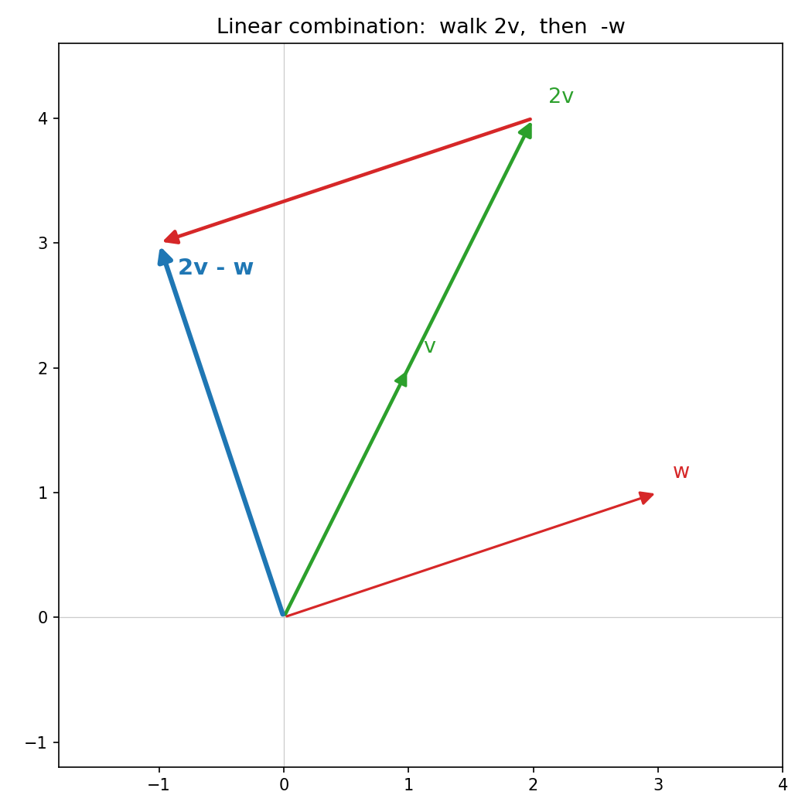

# 第 2 章 · 向量与线性组合:线代的字母表

> **核心问题**:向量到底是什么?为什么这门学科叫"线性"代数?"线性组合"这四个字,凭什么能撑起一整门学科?
>
> 这一章我们继续不背公式、不套算法。只问一件事:**"向量"这个词,到底允许它是什么形状的东西?而把几个向量"线性组合"在一起,这个最简单的动作,为什么是整门线代的地基?**
>
> **读完本章你会明白**:
> - 向量有三种"合法长相"——物理的箭头、程序员的数列、数学家的"任何守规矩的东西"——它们为什么是同一个东西。
> - "线性"两个字到底是什么意思(绝不是"一条直线"那么简单),以及为什么整门学科要叫"线性"代数。
> - 一个会让你世界观一震的事实:**函数也是向量**;线代远不只是几何,它是"任何线性结构"的通用语言。
> - 以及"线性组合"是线代最基本的动作,后面所有的矩阵、变换、方程,都是它的延伸。

---

## 章首·一句话点破

第 1 章,我们把向量说成"从原点出发的一根箭头",又顺手说"它也可以记成一列数 `(3, 2)`"。你大概没多想就接受了。

但这里藏着一个大多数人一辈子没想过、却极其关键的问题:

> **"向量"到底允许它是什么东西?是一根箭头?是一列数?还是可以更离谱?**

答案是出人意料的宽松:

> **向量,是任何"能相加、能被数乘"的东西。箭头和数列,只是它最亲切的两个化身。而"线性代数"的"线性",说的就是"线性组合"——把几个向量按比例调配出新向量——这回事。**

这句话是**结论**。这一章我们倒过来,从"向量到底长什么样"问起,一路问到"那函数算不算向量",你会发现线代的世界比你以为的大得多。

---

## 一、向量的三种"合法长相"

不同的人,眼里的向量长不一样。我们把三种最常见的看法摆出来,你会震惊地发现:它们是同一个东西。

### 第一种:物理学家的看法——一根箭头

物理学家(还有中学物理老师)眼里的向量,是**一根有长度、有方向的箭头**,而且可以在空间里自由平移而不改变自己(重要的是长度和方向,不是位置)。

速度、力、电场,都是这种向量。它们的特点是:**不依附于任何坐标系**——你换一套坐标轴,这根箭头还是它自己,只是你描述它的"数字"变了。

### 第二种:程序员的看法——一列数

程序员(还有大多数教材)眼里的向量,是**一列排好的数字**:

```
   ┌    ┐
   │ 3  │
   │ 2  │
   │ -1 │
   └    ┘
```

这种看法的好处是好算、好存。但它的隐患我们上一章点过:**这列数不是向量本身,是向量在某套坐标系下的"地址"**。换套坐标,同一个箭头的数列就变。

### 第三种:数学家的看法——"任何守规矩的东西"

数学家最贪心,也最深刻。他们说:

> **我才不管向量长什么样。只要一个东西满足两条规矩——能"相加"、能"被数乘"——我就承认它是向量。**

这两条规矩,翻译成大白话:

- **相加**:两个这种东西,能合在一起,得到同类的另一个东西。
- **数乘**:一个这种东西,能放大或缩小若干倍,得到同类的另一个东西。

> **比喻**:向量像"钱"。钱可以是纸币、硬币、银行卡里的数字、甚至比特币——长相天差地别。但数学家不管它长什么样,只管它守不守两条规矩:**能相加(3块+2块=5块)、能按汇率数乘(3块×7=21块)**。守这两条规矩的,都叫"钱"。向量也一样。

箭头守这两条规矩(两根箭头能首尾相接合成一根、一根箭头能拉长3倍),数列也守(两列数逐项相加、一列数每项乘3)。所以它们都是向量。

### 不这样看会怎样

如果你只认"向量=数列"这一种长相,那你的线代就永远困在几何里。你将无法理解:

- **函数为什么也能做"向量"**(本章第五节就会讲,这是大彩蛋);
- **矩阵本身也可以被当成向量**(矩阵能相加、能数乘);
- 为什么量子力学、信号处理、机器学习全都在用同一套"线代"——因为它们处理的"东西"虽然千奇百怪,但都守这两条规矩。

数学家那句"只要守规矩就是向量",看似抽象,实则是线代**威力无边**的根源:它让一套理论,能套用到所有"守规矩"的对象上。

> **钉死这件事**:向量 ≠ 一列数。向量 = 任何守"能加、能数乘"两条规矩的东西。数列只是它的一个化身。这个认知一旦打开,你就能看懂线代后面所有的"抽象"——它们都是在这两条规矩上推出来的。

---

## 二、箭头和数列是怎么对上的:坐标

既然箭头和数列是同一个向量的两种长相,它俩怎么互相翻译?

靠**基**——上一章提过的 i、j。

一根箭头 `(3, 2)`(往右3、往上2),本质是:

```
   (3, 2)  =  3·i  +  2·j
```

这列数 `(3, 2)`,就是这根箭头**在"标准基 i、j"这套坐标尺下的坐标**。它告诉你:"拿 3 份 i、2 份 j 拼起来"。

> **关键**:数列是箭头**在某套基下**的描述。换一套基(换一套量地的尺子),同一个箭头的数列就变了。所以**数列不是箭头的本质,箭头才是**;数列是箭头在坐标系下的投影。

这个"换套基、数列就变"的事实,是后面"基变换"(第 18 章)、"特征值"(第 12 章)的根。本章你只需记住:我们写 `(3, 2)` 时,默认用的是标准基 i、j。

---

## 三、线性组合:线代的第一个、也是最基础的动作

现在,三种长相统一了,我们可以谈"线性组合"了。

> **线性组合**:给几个向量(比如 v 和 w),它们的线性组合,就是 **a·v + b·w**(a、b 是任意数)。

几何上,这是说:**从原点出发,先沿 v 的方向走 a 个 v 那么远,再沿 w 的方向走 b 个 w 那么远,停下的地方,就是 a·v + b·w 这根新向量。**

> 下图就是 `2v + (−1)w` 这一个组合:先沿绿色走到 `2v` 那个中转点,再沿红色走 `−w`(w 的反方向)到终点,蓝色粗箭头就是最终的 `2v − w`。**"先走这个、再走那个"——线性组合的几何,就这么直白。**



> **比喻**:线性组合像**调色**。v 和 w 是两管颜料,"3·v + 2·w"就是"挤 3 份 v、再挤 2 份 w,调出来的新颜色"。a、b 是你挤的份数,可正可负(负数 = 往反方向走、或"减颜料")、可大可小。

这个动作极其简单,但它是**整门线代的地基**:

- 第 1 章说的"任意向量 = a·i + b·j",就是 **i、j 的线性组合**。
- 第 1 章说的"矩阵乘向量 = a·(第一列) + b·(第二列)",就是**矩阵各列的线性组合**。
- 后面"张成空间""秩""列空间""线性方程组有没有解",全都是"线性组合能凑出什么"这个问题在不同场合的变体。

你看,**线代翻来覆去,就是在研究"线性组合"这一件事**。

---

## 四、"线性"到底什么意思(本章的深度)

这一节,我们回答一个被绝大多数人忽略、却至关重要的问题:**"线性"两个字,到底什么意思?为什么这门学科要叫"线性"代数?**

### "线性"不是"一条直线"

很多人望文生义,以为"线性"就是"一条直线"。这只是它在最朴素情况下的巧合,不是定义。

数学上,说一个东西"线性",是说它满足**两条规矩**:

1. **可加性**:`f(u + v) = f(u) + f(v)` —— "两个合起来处理,等于分别处理再合"。
2. **数乘性(齐次性)**:`f(c·v) = c·f(v)` —— "先放大再处理,等于先处理再放大"。

> **比喻**:"线性" = **乖巧、可拆、可预测**。你可以把一件事拆成几件小事分别做,结果加起来一样;也可以先缩放再做、或先做再缩放,结果一样。一切都规规矩矩、好算好预测。
>
> "非线性"则相反 = **耍脾气、藕断丝连**。比如平方运算 `f(x) = x²` 就是非线性的:`(u+v)² = u² + 2uv + v² ≠ u² + v²`,中间多出来个 `2uv`——两个合起来处理,不等于分别处理之和。这个"多出来的交叉项",就是非线性的标志。

### 线性组合本身,就是"线性"的典范

线性组合 `a·v + b·w` 为什么叫"线性"组合?因为它对参与组合的向量,完美满足上面两条规矩:

```
   可加(对 v):  a·(u + v) + b·w  =  (a·u + b·w) + a·v       ← 能拆开!
   数乘(对 v):  a·(c·v) + b·w    =  c·(a·v) + b·w           ← 能挪出去!
```

它乖乖地守着可加性和数乘性。所以叫"线性"组合。

### 第 1 章的"揉捏",也是线性的

还记得第 1 章那个关键结论吗?线性变换满足 `T(v) = a·T(i) + b·T(j)`,即**变换保持线性组合**。这恰恰就是"变换 T 是线性的"这个说法的全部含义:

```
   T(u + v) = T(u) + T(v)      ← 可加性
   T(c·v)   = c·T(v)            ← 数乘性
```

第 1 章我们说"线性变换不弯曲、不断裂、保持网格平行等距",本质上就是这两条规矩的几何体现。

### 为什么整门学科叫"线性"代数

把上面的线索收在一起:

> **线性代数,只研究"线性组合"和"线性变换"能完全管住的世界。** 这个世界的特点是:一切都可以拆开、按比例调配、用数字精确描述。一旦遇到非线性(平方、正弦、指数),这套简洁的代数就管不住了,得另请高明(微积分、非线性科学)。

所以"线性"不是限制,而是**"还能用这套漂亮代数管得住"的最复杂的一类对象**。线代把这一类研究透了,你就拥有了理解一大片世界(物理、统计、机器学习、量子)的通用语言。

> **钉死**:线性 = 可加 + 可数乘 = 可拆、可预测。线性组合、线性变换,都守这两条。整门线代,就是这套"乖巧规矩"能管住的全部世界。

---

## 五、彩蛋:函数,也是向量(本章最深、也最颠覆的一节)

现在,用第四节"只要守两条规矩就是向量"这个定义,我们打开线代最颠覆的一扇门。

> **函数,也是向量。**

凭什么?因为函数完美地守着"能相加、能被数乘"这两条规矩:

- **相加**:`(f + g)(x) = f(x) + g(x)` —— 两个函数逐点相加,得到新函数。
- **数乘**:`(c·f)(x) = c·f(x)` —— 一个函数逐点放大 c 倍,得到新函数。

守了这两条,它就是向量。**于是,"向量的线性组合"对函数照样成立:**

```
   3·sin(x) + 2·cos(x)
```

这就是 `sin` 和 `cos` 这两个"向量"的一个**线性组合**。`3`、`2` 是系数,就像 `(3, 2)` 是 i、j 的系数。

### 这件事的威力:傅里叶级数

如果你觉得"函数是向量"只是个文字游戏,那就看看它的惊天后果——**傅里叶级数**:

> **几乎任何周期函数,都能写成一大堆正弦、余弦函数的线性组合。**

```
   任意周期函数 f(x)  =  a₀ + a₁·cos(x) + b₁·sin(x) + a₂·cos(2x) + b₂·sin(2x) + ...
```

用我们今天的话翻译:**`f(x)` 这个"向量",被表示成了 `{1, cos(x), sin(x), cos(2x), sin(2x), ...}` 这套"基"的线性组合**。正弦、余弦,就是"函数空间"里的 i、j——只不过这套基有无穷多根(因为函数空间是无穷维的)。

> **浅出这个震撼**:你中学学过的"三角函数叠加",你大学学过的"傅里叶变换",你刷到的"JPEG 压缩""降噪耳机""5G 信号",它们底下,统统是**同一个东西——函数空间里的线性代数**。线代把"向量"定义得这么宽(只要守两条规矩),就是为了让这一套理论,能同时管住几何里的箭头、数据里的数列、**还有无穷维的函数**。

### 为什么这是彩蛋,也是本书"往深走"的承诺

这一节告诉你两件事:

1. **线代远不只是几何。** 你以为它在讲平面上的箭头,其实它是"任何线性结构"的通用语言。这个视角一打开,量子力学(态是向量、可观测量是矩阵)、信号处理(傅里叶)、机器学习(数据是向量、模型是矩阵)——全是线代的不同化身。
2. **本书会一直往深走。** 第 1 章给你直觉,这一章已经把你带到"函数也是向量、傅里叶也是线代"的深度。后面每一篇,我们都会在"由浅入深"的路上继续往上走,直到第 19 章的 SVD——那是这套语言最华丽的巅峰。

> **别慌**:这个彩蛋你现在"知道有这么回事"就够了,不用马上吃透函数空间。但请记住这个画面:**向量 = 守规矩的东西;线性代数 = 这类东西的通用语法。** 这个画面,会让你后面每一次"这也能用线代?"的惊讶,都变成"当然,它守规矩嘛"的会心一笑。

---

## 计算佐证:拿纸笔,亲手摸一次线性组合

这一节用具体数字,把上面三件事(线性组合、坐标、线性规矩)摸一遍。**不求难,只求你亲手确认一遍"比喻 = 算式"。**

### 1. 线性组合:几何 = 算式

设 v = (1, 2),w = (3, 1)。算线性组合 2·v + (-1)·w:

```
   按几何(箭头走):  从原点沿 v 走 2 步 → (2,4),再沿 w 走 -1 步(反方向)→ (2,4) - (3,1) = (-1, 3)
   按算式(逐项):    2·(1,2) + (-1)·(3,1) = (2,4) + (-3,-1) = (-1, 3)   ✓
```

两种算法完全一致。**线性组合的几何("调配箭头")和代数("逐项乘加")是同一件事。**

### 2. 验证"线性"的两条规矩

拿 v = (1,2),u = (3,1),c = 4,验证可加性和数乘性(这里 f 就是"线性组合 3·□",即"放大3倍"这个最简单的线性操作):

```
   可加性:  3·(u + v)        vs   3·u + 3·v
            左 = 3·(4,3) = (12, 9)
            右 = (9,3) + (3,6) = (12, 9)        ✓ 相等

   数乘性:  3·(c·v)          vs   c·(3·v)
            左 = 3·(4,8) = (12, 24)
            右 = 4·(3,6) = (12, 24)             ✓ 相等
```

规矩成立。**"线性操作"之所以叫"线性",因为它真守这两条——拆开算、挪着算,结果都不变。**

### 3. numpy:动手调色

```python
import numpy as np
v = np.array([1, 2])
w = np.array([3, 1])
print(2*v + (-1)*w)   # 线性组合,应得 [-1, 3]
print(3*v + 0*w)      # 只用 v,应得 [3, 6]
```

改改系数 a、b,在坐标纸上画出 a·v + b·w,你会亲眼看到"调色"——这就是线性组合。

---

## 章末小结

### 用"调色 / 钱"比喻回顾本章

这一章我们做了一件事:**把"向量"和"线性组合"这两个字母,从"一列数字"的误解里彻底救出来。**

答案分四层,一层比一层深:

1. **向量有三种合法长相**:物理的箭头、程序员的数列、数学家的"任何守两条规矩(能加、能数乘)的东西"。**数列只是它的化身,不是本质。**
2. **箭头和数列靠"基"对上**:数列是箭头在某套坐标尺下的坐标;换套基,数列就变。**箭头是本质,数列是投影。**
3. **"线性" = 可加 + 可数乘 = 可拆、可预测**。线性组合、线性变换都守这两条;整门线代,就是这套乖巧规矩能管住的全部世界。**非线性的(平方、正弦)得另请高明。**
4. **函数也是向量**(最深彩蛋):因为它守两条规矩。于是傅里叶、信号、量子、机器学习,全是函数空间里的线代。**线代是"任何线性结构"的通用语言。**

而把这一切串起来的那个动作,就是**线性组合**——几个向量按比例调配出新向量,像调色。它是线代的地基,后面所有的矩阵、变换、方程,都是它的延伸。

### 本章在全书的位置

这是第 1 篇《空间的语言》的第一章,任务是**立住"向量"和"线性组合"这两个字母**。下一章,我们顺着线性组合问下去:

> **给几根向量,它们所有的线性组合,能铺出多大一片空间?什么时候某根向量是"多余的"(线性相关)?**

这就是"张成"和"线性无关"——它们决定了一个空间**长多大、骨架有几根**。翻开 **第 3 章 · 张成与线性无关:几根箭头能铺多大一片天**。

### 五个"为什么"清单

1. **向量是什么**:不是一列数,是任何守"能加、能数乘"两条规矩的东西。箭头和数列是它的两个化身。
2. **箭头和数列怎么对应**:靠"基"。数列 = 箭头在某套基下的坐标。换基,数列变;箭头不变。
3. **什么是线性组合**:a·v + b·w,把几个向量按比例调配出新向量,像调色。它是线代最基础的动作。
4. **"线性"什么意思**:可加性 + 数乘性 = 可拆、可预测。线性组合和线性变换都守这两条;非线性的(平方)守不了。
5. **函数为什么也是向量**:它守两条规矩(逐点相加、逐点数乘)。所以傅里叶、信号、量子里的"向量",和几何箭头是同一种东西——线代是它们的通用语言。

### 想继续深入,该往哪钻

- **看三种视角的动画**:3Blue1Brown《线性代数的本质》第 1 集,讲物理 / 计算机 / 数学三种向量视角,和本章同源。
- **亲手玩线性组合**:上面的 numpy 代码,改 v、w 和系数,在纸上画,看"调色"。
- **尝一口"函数空间"**:搜一下"傅里叶级数可视化",你会看到"一个方波 = 一堆正弦波叠加"——那就是 sin、cos 这套基的线性组合,和 `(3,2) = 3·i + 2·j` 在结构上一模一样。本章的彩蛋,会在那里变成你亲眼可见的画面。

---

> 字母立住了:向量是守规矩的东西,线性组合是调配它们的动作。下一章,我们盯住线性组合问一个最自然的问题——**几根向量,到底能铺出多大一片空间?哪几根是"骨架",哪几根是"多余的"?** 翻开 **第 3 章 · 张成与线性无关:几根箭头能铺多大一片天**。
