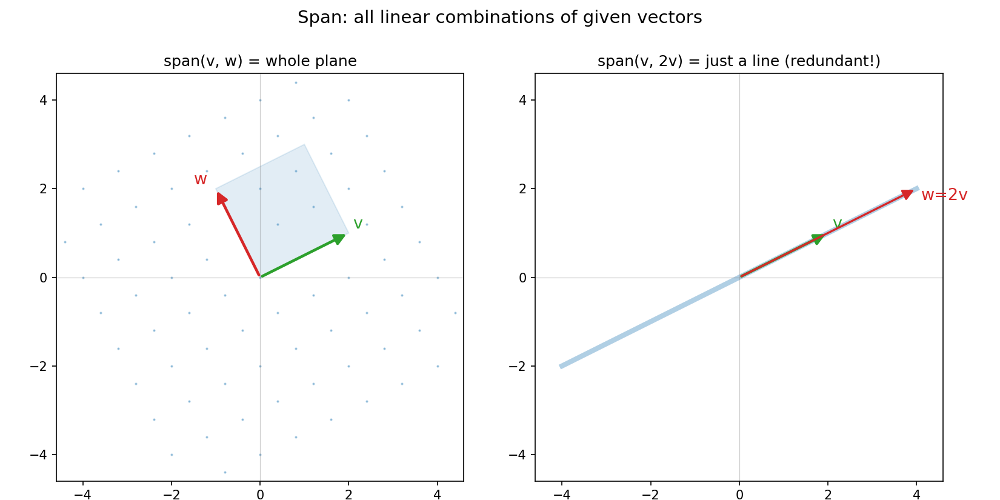
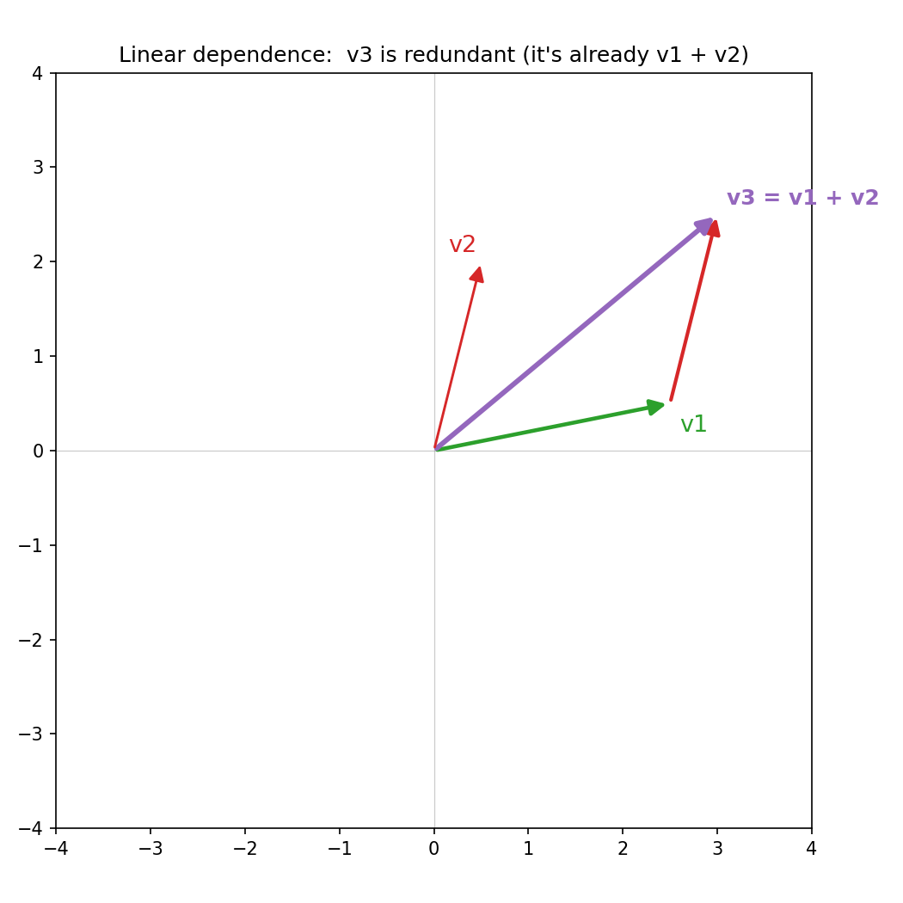

# 第 3 章 · 张成与线性无关:几根箭头能铺多大一片天

> **核心问题**:给几根向量,它们所有的线性组合,能铺出多大一片空间?其中哪几根是真正干活的"骨架",哪几根是凑数的"多余的"?
>
> 这一章我们不背定义。只顺着第 2 章的"线性组合"往下问两步:**第一步,把线性组合"撒满"——看看几根向量到底能调配出多大一片地;第二步,挑出"没有一根多余"的那几根——它们才是这个空间真正的骨架。**
>
> **读完本章你会明白**:
> - "张成(span)"是什么:几根向量所有线性组合凑出来的那片空间。
> - "线性无关"是什么:一组向量里没有哪根是"多余的"(能被别人调配出来)。
> - 为什么"维数"不是坐标的个数,而是"互不冗余的骨架有几根"。
> - 以及这两个概念,为什么是后面"秩""解方程有没有解"的地基——还在函数空间里照样成立。

---

## 章首·一句话点破

第 2 章,我们学会了"线性组合":几根向量,按不同比例调配,能凑出新的向量。

这一章,顺着这个动作,自然冒出两个问题:

> **① 调配来调配去,这几根向量到底能凑出多大一片空间?(这叫"张成")**
> **② 凑出同样这片空间,最少需要哪几根?有没有哪根是"多余的"?(这叫"线性无关")**

一句话点破:

> **几根向量所有线性组合凑出的那片空间,叫它们的"张成";而这片空间的"骨架"——也就是互相都不冗余、谁也替代不了谁的那几根——有几个,这个空间就是几维。**

这句话是**结论**。我们一块一块拆,先把"张成"看清楚。

---

## 一、张成:几根向量能铺多大一片

> **张成(span)**:给几根向量(比如 v、w),它们**所有的线性组合**(a·v + b·w,a、b 取遍所有数)凑出来的全部箭头,构成的那片空间,记作 `span(v, w)`。

### 看几个情形

最直观的,看两根二维向量:

- **两根不共线**(方向不一样):它们的线性组合,能铺满**整个二维平面**。因为你往 v 方向走任意远、再往 w 方向走任意远,能到达平面上的任何一个点。
- **两根共线**(方向一样,比如 w = 2v):不管你怎么调配,都只能沿着 v 那一条线走,永远走不偏。所以它们只张成**一条直线**——多一根同方向的,白搭。
- **只有一根向量**:自然只能张成**一条线**(沿着它自己的方向)。

> 下图把这两种情况画出来了。左边两根不共线,张成整个平面(蓝色铺开的区域);右边两根共线(`w = 2v`),张成的只是一条线——第二根完全是多余的。



### 不这样看会怎样

如果你没有"张成"这个概念,你就无法回答"这几根向量到底能描述多大的世界"。后面解方程 `Ax = b` 时,核心问题之一就是:**`b` 这个向量,在不在 `A` 的各列张成的空间里?在,才有解;不在,无解。** "张成"就是用来量这件事的尺子。

> **比喻**:张成像"几把不同方向的尺子,能丈量多大一片地"。给的尺子方向越多样(越不重复),能丈量的地越广;给的尺子都同向,再多也只能量一条线。**方向的数量和质量,决定你能铺多大。**

---

## 二、线性无关:没有一根是多余的

看完张成,第二个问题来了:**要张成同样这片空间,哪几根是真正必需的,哪几根是多余的?**

这就引出"线性无关"。

> **线性无关(linearly independent)**:一组向量里,**没有任何一根能被其他根的线性组合凑出来**。换句话说,每一根都"独一无二",删掉任何一根,张成的空间都会缩小。
>
> **线性相关(linearly dependent)**:反过来,有(至少)一根是多余的——它能被别的根调配出来,删了它,张成不变。

### 几何上怎么"看"

- **两根向量**:它们线性无关 ⟺ 不共线(各自带来一个新方向)。共线就是相关(第二根没带来新方向)。
- **三根向量在二维平面里**:**必然线性相关**!因为平面只有两个方向,第三根无论如何都能被前两根调配出来——它一定落在前两根张成的平面里,是多余的。

> 下图就是这个"第三根多余"的情形:`v3` 恰好等于 `v1 + v2`。你沿着 v1 走、再沿 v2 走,就到了 v3 的位置——所以 v3 这根,完全可以被 v1、v2 替代,它是冗余的。**有它没它,张成的都是同一片平面。**



### 不这样理解会怎样

你可能以为"向量越多,信息越丰富"。错——**冗余的向量不带来任何新信息**。三根共面的向量,信息量和两根一样。判断"这组向量到底带了几份独立信息",靠的就是"线性无关"。这就是为什么后面"秩"会定义为"最多几根线性无关"——秩,量的就是"去掉冗余后,真正剩几份干货"。

### 代数上怎么判:那个"凑回原点"的判据

教材会给一个判据,初看很绕,但配上几何就通透:

> 一组向量 `v1, v2, ...` 线性无关 ⟺ 方程 `c1·v1 + c2·v2 + ... = 0`(零向量)**只有唯一解:所有系数 c 全为 0**(叫"平凡解")。

翻译成几何:**想让这组向量的线性组合"抵消回原点"(零向量),唯一的办法是啥都不加(系数全0)。** 如果存在一组不全为0的系数能把它们凑回原点,那就说明其中有根是"多余的"(能被其他根抵消出来),即线性相关。

> **比喻**:线性无关像一支**每个人都能干别人干不了的事**的团队——谁也替代不了谁。线性相关则是团队里有个"闲人",他的活别人都能干,删了他团队战力不减。判据"凑不回原点",就是在问"这个团队里有没有谁能被别人凑出来"。

---

## 三、维数:骨架到底有几根

有了"线性无关",我们终于能给"维数"一个精确的、不靠坐标的定义:

> **维数(dimension)**:一个空间里,**最多能挑出几根线性无关的向量**,这个空间就是几维。

- 二维平面:最多挑出 2 根无关的(第三根必冗余),所以维数 = 2。
- 三维空间:最多 3 根,维数 = 3。
- 一条直线:最多 1 根,维数 = 1。

> **关键**:维数不是"坐标有几个数"那么表面。它是"这片空间,**互不冗余的骨架有几根**"。你用三根共面向量去"张成"一个平面,虽然你给了三根,但维数还是 2——因为骨架(无关的)只有两根,第三根是冗余。

这个"维数 = 骨架根数"的认知,是后面"秩"的直接源头:**一个矩阵的秩,就是它的各列里,真正不冗余的有几根 = 它们张成的空间的维数。** 现在你已经把"秩"的直觉准备好了,第 10 章我们正式拆它。

---

## 四、彩蛋:函数空间的张成与无关(本章最深)

第 2 章我们埋了个彩蛋:函数也是向量。那么,"张成""线性无关"在函数世界成立吗?**完全成立,而且立刻能解释一件你中学就会、却从没看透的事。**

### 多项式也是向量,也有张成和无关

看三个"函数向量":`1`、`x`、`x²`。它们线性无关吗?

> 问自己:**能不能找到不全为 0 的 c0、c1、c2,使得 `c0·1 + c1·x + c2·x² = 0`(对所有 x 成立)?** 一个二次多项式要恒等于 0,只有"所有系数都是 0"才行。所以 `1, x, x²` **线性无关**。

它们张成什么?所有 `a + b·x + c·x²` 形式的二次多项式。**所以 `{1, x, x²}` 是"二次多项式空间"的一组基,这个空间是 3 维的。**

### 加一根就冗余了

现在加第四个 `(x+1)²`:

```
   (x+1)² = x² + 2x + 1
```

它恰好等于 `1·1 + 2·x + 1·x²`——**是前三根的线性组合**。所以 `{1, x, x², (x+1)²}` 线性相关,第四根是冗余的,删了它,张成的还是同一个二次多项式空间。

这和几何里"v3 = v1 + v2 是冗余"**结构完全一样**——只不过这里 v1、v2、v3 换成了 `1`、`x`、`x²`。**线代的骨架,在函数世界里原封不动地起作用。**

### 无穷维:泰勒级数

把基扩到无穷:`{1, x, x², x³, ...}`。这无穷多个幂函数两两线性无关,它们张成的,是**所有多项式**构成的空间——一个**无穷维**的向量空间。

而你在微积分里学过的**泰勒级数**:

```
   e^x = 1 + x + x²/2! + x³/3! + ...
```

用今天的话说:**`e^x` 这个"函数向量",被表示成了 `{1, x, x², ...}` 这组无穷基的线性组合。** 傅里叶级数(第 2 章提过)是另一套无穷基 `{sin nx, cos nx}` 下的线性组合。**泰勒、傅里叶,本质都是"函数空间里换一套基、做线性组合"——纯粹的线性代数。**

> **浅出**:张成、线性无关、维数,这些你以为只属于"几何箭头"的概念,在函数世界一字不差地成立。泰勒展开、傅里叶变换,不过是"在无穷维函数空间里挑一组基、把函数表示成基的线性组合"。**线代是几何、代数、分析三界的通用语法。**

---

## 计算佐证:拿纸笔,亲手验证张成与冗余

### 1. 共线 = 张成一条线

v = (2, 1),w = (4, 2) = 2·v(共线)。任取一个线性组合 3·v + (-1)·w:

```
   3·(2,1) + (-1)·(4,2) = (6,3) + (-4,-2) = (2, 1)
```

结果 (2,1) 仍在 v 那条线上(y 总是 x 的一半)。**换任何系数,结果都逃不出这条线——这就是"共线只张成一条线"的算式印证。**

### 2. 第三根冗余 = 线性相关

v1 = (2.5, 0.5),v2 = (0.5, 2),v3 = (3, 2.5) = v1 + v2。验证 v3 是冗余的:

```
   v3 - v1 - v2 = (3, 2.5) - (2.5, 0.5) - (0.5, 2) = (0, 0)   ← 凑回了零向量!
```

存在不全为 0 的系数(1, -1, -1)把 v3、v1、v2 凑回零向量 → **三根线性相关,v3 冗余**。这就是判据"能不能凑回原点"的一次实操。

### 3. numpy:画张成、找冗余

```python
import numpy as np
v1 = np.array([2.5, 0.5]); v2 = np.array([0.5, 2.])
# v1, v2 张成整个平面吗?只要它们不共线(行列式≠0)就行:
print(np.linalg.det(np.stack([v1, v2], axis=1)))   # 非零 → 无关,张成整个平面
# 加 v3 = v1+v2,三根的相关性:矩阵的秩还是 2
v3 = v1 + v2
M = np.stack([v1, v2, v3], axis=1)
print(np.linalg.matrix_rank(M))   # 2 → 三根里只有2份干货,v3冗余
```

`matrix_rank`(秩)= 2,正是我们说的"骨架只有两根"。第 10 章我们会把"秩"彻底讲透。

---

## 章末小结

### 用"骨架 / 团队"比喻回顾本章

这一章顺着"线性组合"问了两个问题,得到的两个概念,是线代描述"空间结构"的核心工具:

1. **张成**:几根向量所有线性组合凑出的那片空间。方向越多样,铺得越广;方向重复,铺的就窄(共线只张成一条线)。
2. **线性无关**:一组向量里没有哪根是多余的——谁也不能被别人调配出来。判据是"能不能凑回零向量":凑不回(只有全0系数)就无关。
3. **维数 = 互不冗余的骨架有几根**。它不是坐标个数,是"去掉冗余后真正剩几份干货"——这就是"秩"的雏形。

而这一切,在**函数空间**里原样成立:`{1, x, x²}` 无关、张成二次多项式空间;泰勒、傅里叶,都是无穷维函数空间里的"换基 + 线性组合"。

### 本章在全书的位置

这是第 1 篇《空间的语言》的第二章。到这里,你已经有了三件法宝:**向量(第 2 章)、线性组合(第 2 章)、张成与线性无关(本章)**。下一章,我们把它们收束成两个最高频的词——**基与维数**:什么样的向量组才配当"坐标系",一个空间的标准骨架长什么样。翻开 **第 4 章 · 基与维数:空间的骨架有几根**。

### 五个"为什么"清单

1. **什么是张成**:几根向量所有线性组合凑出的那片空间。两根不共线张成整个平面;共线只张成一条线。
2. **什么是线性无关**:一组向量里没有哪根是多余的(能被别人凑出来)。判据:线性组合凑回零向量,只有系数全0才行。
3. **维数是什么**:不是坐标个数,是"互不冗余的骨架有几根"。三根共面向量张成的还是二维,因为骨架只有两根。
4. **为什么这两个概念是地基**:后面"秩"(第10章)就是"几列里不冗余的有几根";解方程 `Ax=b` 有没有解(第15章),取决于 b 在不在 A 各列的张成里。
5. **函数空间也成立吗**:`{1,x,x²}` 线性无关,张成二次多项式;`(x+1)²` 是冗余;泰勒/傅里叶是无穷维函数空间里的换基+线性组合。

### 想继续深入,该往哪钻

- **亲手玩张成**:上面的 numpy 代码,改 v1、v2,看行列式(共线与否)和张成的关系。
- **看动画**:3Blue1Brown《线性代数的本质》"线性组合、张成与基"一集,把本章的"铺满平面"画成动画。
- **尝函数空间**:随便取一个多项式如 `2x² + 3x + 1`,想想它是 `{1, x, x²}` 的线性组合(系数 1, 3, 2)——你已经会在函数空间里"读坐标"了。

---

> 张成和无关立住了:能铺多大、谁多余、骨架几根。下一章,我们把这些收束成线代最高频的两个词——**什么样的向量组才配当"坐标系"(基),一个空间的标准骨架到底长什么样**。翻开 **第 4 章 · 基与维数:空间的骨架有几根**。
