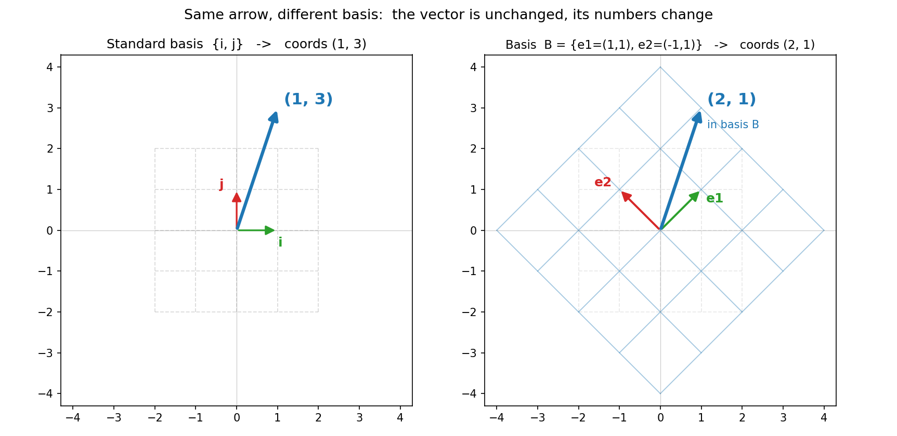

# 第 4 章 · 基与维数:空间的骨架有几根

> **核心问题**:上一章我们说"维数 = 互不冗余的骨架有几根"。可到底什么样的向量组,才配当这个"骨架"?为什么同一根箭头,换一套骨架去描述,它的"门牌号"就全变了?
>
> 这一章,我们把第 1 篇的三块积木——**张成、线性无关、维数**——收束成线代里出场频率最高的一个词:**基(basis)**。你会看清:基,就是一把"量地的尺子";而那一列一列的坐标数字,从来都不是箭头本身,只是箭头在这把尺子下的读数。
>
> **读完本章你会明白**:
> - "基"的两个硬条件:**张成整个空间**(一根不能少)、**线性无关**(一根不能多)。两个条件凑齐,就是"刚刚好的极简骨架"。
> - 为什么"坐标"不是箭头的本质:同一根箭头,换一套基,它那一列数字就变了——**箭头是本质,数字是投影**。
> - 为什么"维数"是一个**不随你选哪组基而变**的不变量:二维平面随便你挑哪组基,基里都是 2 根。
> - 以及一个为全书后半程埋下的伏笔:**基不是唯一的,而"挑一组好基"恰恰是特征值、对角化、SVD 这些巅峰内容的共同招式**。

---

## 章首·一句话点破

第 3 章结尾,我们留下了一句话:**维数 = 互不冗余的骨架有几根**。这话说得轻巧,可它藏着一个没回答透的问题:

> **"骨架"到底由哪些向量组成?它要满足什么条件,才配叫"骨架"?**

这一章,就正面回答它。一句话点破:

> **基,就是一组"张成整个空间、又互相不冗余"的向量——多一根是浪费,少一根就铺不满。坐标,就是某根向量在这组基下的"成分配方"。换一组基,同一根向量"还是它自己",可那张配方单上的数字,全变了。**

这句话是**结论**。我们一块一块拆,先看"基"的两个硬条件从哪来。

---

## 一、什么样的向量组,才配当"基"

回忆第 3 章我们手里已有的两块积木:

- **张成**:几根向量所有线性组合凑出的那片空间。
- **线性无关**:一组向量里没有一根是多余的(能被别的凑出来)。

"基",就是这两块积木**同时满足**的那个状态。

> **基(basis)**:一组向量 `{e1, e2, ..., en}`,如果同时满足两条:
>
> 1. 它们**张成整个空间**(目标空间里的每一个向量,都能被它们调配出来)——**一根都不能少**;
> 2. 它们**线性无关**(没有一根是多余的)——**一根都不能多**;
>
> 那这组向量,就叫这个空间的一组**基**。

翻译成大白话:**基,就是描述一个空间"刚刚好"的那组骨架——少一根,你描述不全;多一根,纯属浪费。** 它是"够用又不啰嗦"的极致。

### 不这样理解会怎样

如果你没把"基"想成"刚好的骨架",你会:

- 觉得"基"是个很玄、必须死记的概念。其实它就是"张成 + 无关"这两个你已经懂的东西,碰在一起的名字而已。
- 后面学"坐标""基变换""特征基"时,永远搞不清"为什么非得是这组向量"。答案永远是:因为它"够用又不啰嗦",所以配当尺子。

### 标准基:你最熟的那组 i、j

最天然的基,就是第 1 章那两位无名英雄:

```
   i = (1, 0)    j = (0, 1)
```

它俩张成整个二维平面(往右、往上各走任意远,能到任意点),又线性无关(方向不同、互不冗余)。所以 `{i, j}` 是二维平面的一组基,叫**标准基(standard basis)**。

> **钉死这件事**:基不是一个高深的、需要从天上掉下来的东西。任何"够用又不啰嗦"的一组向量,都是基。标准基只是其中最顺眼的一组。

---

## 二、坐标:一根箭头在"某把尺子"下的读数

基定下来了,我们就能谈"坐标"了——这是本章的第二个核心。

> **坐标**:给一组基 `{e1, e2}`,任何一个向量 `v` 都能被**唯一地**写成它们的线性组合 `v = a·e1 + b·e2`。那对系数 `(a, b)`,就叫 `v` 在这组基下的**坐标**。

关键就四个字:**唯一地**。因为基是线性无关的(没人多余),所以"几份 e1 + 几份 e2"的配方**只有一个答案**,不会有两套配方调配出同一根箭头。这正是"无关"送我们的礼物——坐标不会乱。

回到标准基。向量 `(3, 2)` 的意思,是:

```
   (3, 2)  =  3·i + 2·j
```

这 `(3, 2)`,就是这根箭头在标准基下的坐标。它读作:"3 份 i、2 份 j"。

> **再钉一次**(这件事贯穿全书):坐标 `(3, 2)` 不是箭头的本质,**那根箭头才是**。`(3, 2)` 只是"在标准基这把尺子下量出来的读数"。换把尺子,读数就变。

---

## 三、高潮:同一根箭头,换一套基,数字全变

现在,见证本章最该"啊哈"的一刻。

我们已经知道:一根物理箭头是它自己,坐标只是它在某把尺子下的读数。那自然地——**换一把尺子(换一组基),同一根箭头的读数,就变了。**

我们拿一根具体的箭头来演示。先在标准基 `{i=(1,0), j=(0,1)}` 下看它:

- 物理箭头 `v` 箭尖落在"往右 1、往上 3",标准基下坐标 **(1, 3)**。

现在我们**故意换一套斜的基**(换一把歪着的尺子):

```
   e1 = (1, 1)        e2 = (-1, 1)
```

它俩张成整个平面、又线性无关,所以也是合法的一组基,叫它 **基 B**。问题是:同一根箭头 `v`,在基 B 下读出来是多少?

我们来调配。要找 `a·e1 + b·e2 = (1, 3)`:

```
   a·(1,1) + b·(-1,1) = (1, 3)
   →  (a - b,  a + b) = (1, 3)
   →  a - b = 1,  a + b = 3
   →  a = 2,  b = 1
```

所以同一根箭头 `v`,在基 B 下的坐标是 **(2, 1)**——读作"2 份 e1、1 份 e2"。

> 下图把这件事画出来了。左右两幅,画的是**同一根蓝色箭头 `v`**(它一动没动,箭尖还在"往右1、往上3")。左边用标准基 `{i, j}` 这把正尺子量,读数是 (1, 3);右边用基 B 这把歪尺子量(注意网格被"揉歪"了),读数是 (2, 1)。**箭头没变,数字却从 (1, 3) 变成了 (2, 1)——这就是"换基换坐标"的字面意思。**



### 不这样看会怎样

如果你把"坐标 `(1, 3)`"当成箭头本身,那你脑子里就只有一种数字。一旦有人问"这根向量在另一组基下是多少",你会彻底懵——因为你以为数字就是箭头,而箭头只有一个。

可一旦你看见"箭头是本质、坐标是某把尺子下的读数",整件事豁然开朗:

- 换基 = 换尺子 = 同一根箭头换了个读数。
- 后面"基变换""相似矩阵"(第 18 章),说白了就是**研究"同一个动作(矩阵),换把尺子描述,它的数字会怎么变"**。本章给你的是它的地基:先认清"坐标本就是相对的、取决于基"。

> **比喻**:坐标像"用尺子量身高"。你用厘米尺量是 175,换英尺尺量是 5.74。**人没变,变的只是刻度。** 基,就是你手里那把尺子;坐标,是量出来的数。你纠结"到底是 175 还是 5.74"没意义——它们量的是同一个人。

---

## 四、维数:一个换基也撼动不了的不变量

换基会让坐标全变,这会不会让"维数"也跟着变?**不会。** 这正是维数最可贵的性质。

> **维数的本质**:一个空间最多能挑出几根线性无关的向量,它就是几维。而**任何一组基,基里向量的个数都一样,都等于维数**——不管你挑哪组基。

为什么?因为基的定义就是"够用又不啰嗦"。够用(张成整个空间),所以基的个数 ≥ 维数;不啰嗦(线性无关),所以基的个数 ≤ 维数。两头一夹,基的个数**只能**等于维数。

- 二维平面:标准基 2 根,基 B 也是 2 根,任何合法的基都是 2 根。**维数 = 2,雷打不动。**
- 三维空间:任何一组基都是 3 根。维数 = 3。

> **钉死**:坐标是"相对的"(随基变),维数是"绝对的"(换基不变)。这个"不变",让维数成了一个空间**最稳的身份证明**。后面"秩"(第 10 章)的定义——"矩阵各列张成的空间的维数"——之所以是个干脆的数,正是因为维数这股"换基也不变"的稳定性。

---

## 五、基不唯一:这是"挑一组好基"的开始(本书后半程的伏笔)

讲到这里,有个事实你千万别忽略:

> **一个空间的基,远不止一组。** 二维平面有标准基,有我们刚才的斜基 B,还有无穷多组。它们都是合法的"刚好的骨架",只是方向不同。

"基不唯一",听起来是个小小的麻烦(到底用哪组?)。可它恰恰是线代后半程几乎所有精彩内容的**发动机**:

- 既然同一根箭头、同一个变换,在不同基下有不同的数字长相,那我们就可以**挑一组最顺眼的基**,让数字变得极简单。
- 第 12 章的**特征向量**、第 13 章的**对角化**,本质上就是:"挑一组特殊的基(特征基),让一个原来歪七扭八的变换,在新基下变成纯粹的拉伸——数字全集中在一条对角线上。"
- 第 19 章的 **SVD**(全书压轴),是:"挑一组最妙的基,让**任何**矩阵都变成'转→拉→转'三步,数字干净到只剩下几个拉伸倍数。"

所以,千万别觉得"换基"是个绕远路的把戏。**线代最高级的那些技巧,招招都是"换一副好眼镜,让复杂的东西变简单"。** 本章给你打的地基是:先彻底接受"基有很多组、坐标随基变",后面所有的"挑好基",你才不会抵触。

---

## 六、彩蛋:函数空间里的"基"和"坐标"(本章最深)

第 2 章我们说函数也是向量,第 3 章说 `{1, x, x²}` 是二次多项式空间的一组基。现在,用本章"坐标"的眼光,我们能看到一件极其漂亮的事:

> **一个多项式在基 `{1, x, x²}` 下的坐标,就是它的系数!**

看 `f(x) = 2x² + 3x + 1`。把它写成基的线性组合:

```
   f(x) = 1·1 + 3·x + 2·x²
```

所以 `f` 在基 `{1, x, x²}` 下的坐标是 **(1, 3, 2)**——**正好就是它按升幂排的系数!** 中学里你随手写的"多项式的系数",用今天的眼光看,就是"这个函数向量在标准幂基下的坐标"。

### 换一组基,系数就全变(和几何里一模一样)

现在换一组基 `{1, x, (x+1)²}`?不对,先看简单的:换基 `{1, (x-1), (x-1)²}`(以 `x=1` 为中心展开)。同一个 `f(x)=2x²+3x+1`,在这组新基下,系数(坐标)就变成了完全不同的数——它正是 `f` 在 `x=1` 处的**泰勒展开系数**。

> 你看,**"换基 = 换坐标"这套几何里学来的道理,在函数世界里一字不差地成立**。多项式的系数,不过是"函数在幂基下的坐标";泰勒展开,不过是"换一组基重新读坐标"。函数空间和几何空间,共享同一套线代语法。

### 无穷维函数空间的基

把基扩到无穷 `{1, x, x², x³, ...}`,张成的是所有多项式(无穷维空间)。一个光滑函数 `e^x` 在这组无穷基下的坐标是 `(1, 1, 1/2, 1/6, ...)`——它的泰勒级数系数。傅里叶级数 `{sin nx, cos nx}` 是另一组无穷基,`f` 在它下面的坐标,就是傅里叶系数。

> **浅出**:基、坐标、换基——这些你以为只活在"平面箭头"里的词,在函数世界原封不动地运转。中学的"多项式系数"、大学的"泰勒系数""傅里叶系数",统统是"函数在某一组基下的坐标"。**线代是几何、代数、分析三界共用的坐标系语言。**

---

## 计算佐证:拿纸笔,亲手摸"换基换坐标"

### 1. 验证基 B 是合法的基

基 B = `{e1=(1,1), e2=(-1,1)}`。要当基,得张成整个平面(行列式 ≠ 0):

```
   det[[1, -1], [1, 1]] = 1·1 - (-1)·1 = 1 + 1 = 2   ≠ 0   ✓
```

行列式非零 ⟺ 两根不共线 ⟺ 线性无关 ⟺ 张成整个平面。**所以 B 是二维平面的一组合法基。**

### 2. 同一根箭头,两组坐标(本章核心,手算一遍)

物理箭头 `v = (1, 3)`。

- **标准基下**:直接读,**(1, 3)**。
- **基 B 下**:`v = a·e1 + b·e2`,解 `(a-b, a+b) = (1, 3)` 得 `a=2, b=1`,坐标 **(2, 1)**。

**验算**:`2·e1 + 1·e2 = 2·(1,1) + 1·(-1,1) = (2,2) + (-1,1) = (1, 3)` ✓。**同一根箭头,两组基,两套坐标 (1,3) 与 (2,1)——箭头没变,数字变了。**

### 3. numpy:解"在某组基下的坐标"

```python
import numpy as np
B = np.array([[1., -1.],   # 列向量 e1, e2
              [1.,  1.]])
v = np.array([1., 3.])
print(np.linalg.solve(B, v))   # v 在基 B 下的坐标, 应得 [2., 1.]
print(np.linalg.det(B))        # 非零 -> B 确实是一组基
```

`np.linalg.solve(B, v)` 解的是 `B·coords = v`,吐出的 `(2, 1)` 正是 `v` 在基 B 下的坐标。**改改 B(换把尺子),同一个 v 吐出的坐标就变——亲手揉一次,你就再也不会把"坐标"当成箭头本身了。**

---

## 章末小结

### 用"尺子 / 骨架"比喻回顾本章

这一章把第 1 篇的三块积木(张成、无关、维数)收束成了一个词——**基**:

1. **基 = "够用又不啰嗦"的骨架**:张成整个空间(一根不能少)+ 线性无关(一根不能多)。两个条件凑齐,就是描述一个空间刚刚好的那组向量。标准基 `{i, j}` 是其中最顺眼的一组。
2. **坐标 = 箭头在某把尺子下的读数**:`(3, 2)` 是"3 份 i、2 份 j",不是箭头本身。换把尺子,读数就变。
3. **同一根箭头,换基坐标变**:箭头 `v` 在标准基下是 (1, 3),在斜基 B 下是 (2, 1)。**箭头是本质,数字是投影**——这是后面"基变换""相似矩阵"的地基。
4. **维数换基不变**:任何一组基,根数都等于维数。这让维数成为空间最稳的身份证明,也是"秩"之所以是个干脆数字的原因。
5. **基不唯一,是后半程的发动机**:特征值、对角化、SVD,招招都是"挑一组好基,让复杂的变简单"。

而这一切,在**函数空间**里原样成立:多项式在幂基 `{1, x, x²}` 下的坐标,就是它的系数;泰勒、傅里叶,都是"换一组基重新读坐标"。

### 本章在全书主线中的位置

第 1 篇《空间的语言》到此**完工**:向量(第 2 章)→ 线性组合(第 2 章)→ 张成与线性无关(第 3 章)→ 基与维数(本章)。你现在彻底学会了"**看见空间**":你能用箭头看见向量,用骨架(基)看见空间的结构,用坐标看见箭头在尺子下的读数。

> 本章的概念,严格说不是"揉捏"本身,而是**被揉捏的对象(空间)的骨架结构**。但它是后面一切的地基:第 2 篇会告诉你"矩阵=揉捏",而第 18 章的基变换正是"换一副眼镜看同一个揉捏",第 13 章的对角化、第 19 章的 SVD,全是"挑一组好基"。**没有本章对"基与坐标"的死磕,后半程寸步难行。**

### 五个"为什么"清单

1. **基的两个条件是什么**:张成整个空间(不少)+ 线性无关(不多)。"够用又不啰嗦",就是基。
2. **坐标是什么**:向量在某组基下的"成分配方"(几份 e1 + 几份 e2)。因为基线性无关,这个配方唯一。
3. **同一根箭头为什么有不同坐标**:箭头是本质,坐标是某把尺子下的读数。换把尺子(换组基),读数就变(如 (1,3) ↔ (2,1))。
4. **维数为什么换基不变**:基"够用"(≥ 维数)又"不啰嗦"(≤ 维数),两头一夹,基的根数恒等于维数。所以维数是空间最稳的身份证明。
5. **基不唯一意味着什么**:可以挑一组"好基"让事情变简单——对角化挑特征基,SVD 挑奇异基。**"挑好基"是线代后半程的核心招式。**

### 想继续深入,该往哪钻

- **亲手揉"换基"**:上面的 numpy 代码,自己造几组基(只要 det ≠ 0 就是合法基),用 `solve` 看 `v` 在它们下的坐标。换三组基,你会对"坐标是相对的"彻底死心。
- **看动画**:3Blue1Brown《线性代数的本质》"线性组合、张成与基"一集的后半段,把"基就是骨架、换基换坐标"画成了动画。
- **尝函数空间**:随便写一个多项式 `5x² - 2x + 7`,立刻说出它在基 `{1, x, x²}` 下的坐标 `(7, -2, 5)`。**你已经会在函数空间里"读坐标"了。**

---

> 第 1 篇完工:你学会了**看见空间**——向量是箭头,空间有骨架(基),坐标是尺子下的读数。从下一章起,我们终于可以正式伸手去**揉**这张膜了。第 2 篇会一五一十地拆开"线性变换"的全貌:不只是二维的拉压转剪,还有**非方阵**(三维揉成二维)这种"投影式揉捏",以及把两次揉捏接龙起来的**矩阵乘法**。翻开 **第 5 章 · 线性变换的全貌:从直觉到矩阵**。
