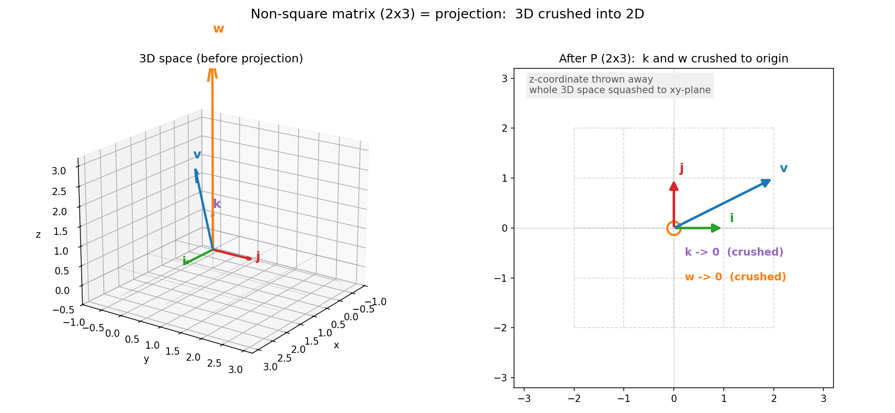
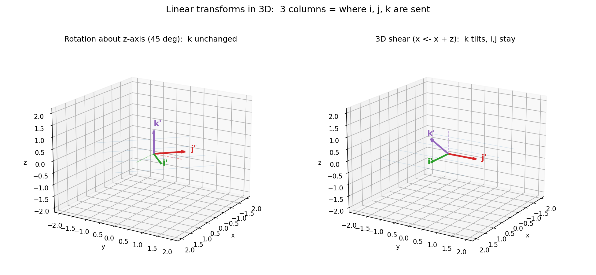

# 第 5 章 · 线性变换的全貌:从直觉到矩阵

> **核心问题**:第 1 章我们点过一句"矩阵 = 揉捏空间",可那是在二维平面、方方正正的数表上随口说的。现在正式问下去:**一个 m×n 的矩阵——尤其是 m 不等于 n 的"非方阵"——它到底在揉捏什么?一个 2×3 矩阵,把三维世界揉成了二维,这算什么"揉捏"?三维空间里的变换,又该怎么用矩阵记下来?**
>
> 这一章,我们把第 1 章那个"矩阵=揉捏"的种子正式展开:从二维方阵,推广到**非方阵**(不同维度空间之间的揉捏),再推广到**三维空间里的变换**。读完你会看到,"矩阵的列 = 新基"这条铁律,在任意维度、任意形状的矩阵上,一字不差地成立。
>
> **读完本章你会明白**:
> - "矩阵的列 = 一根基向量被揉去的新位置"这条铁律,**在任意 m×n 矩阵上都成立**——只不过非方阵里,每根基被揉去的是一个**新维度的**坐标。
> - **非方阵 = 不同维度空间之间的揉捏**。2×3 矩阵是把三维世界"投影式地压扁"到二维;3×2 矩阵是把二维世界"嵌进"三维。
> - 三维空间里的变换 = 3×3 矩阵,3 列就是 i、j、k 三根基向量被揉去的新位置(每列是 3 维坐标)。
> - 为什么非方阵**没有行列式、不能求逆**:因为揉捏改变了维度,信息被压扁丢失了,没法原路退回——这是第 7 章逆矩阵、第 9 章行列式的伏笔。

> **如果一读觉得太难**:先只记住三件事——① 矩阵的每一列永远是一根基向量的新去向,无论方阵非方阵都一样;② 非"正方形"的矩阵,是在把一个维度空间揉成另一个维度;③ 维度被压扁了就再也撑不回去,所以非方阵一般没有"撤销键"。这三条钉死,本章就够本了。

---

## 章首·一句话点破

第 4 章结尾,我们留下了那句话:

> 第 1 篇完工:你学会了**看见空间**。从下一章起,我们终于可以正式伸手去**揉**这张膜了。

现在,手伸出来了。一句话点破这一整章:

> **矩阵的形状 m×n,不是随便长成那样的——它直接告诉你"这次揉捏从几维空间、揉到几维空间"。n 列,意味着原来空间有 n 根基向量;m 行,意味着每根基被揉去了一个 m 维的新地址。一个 2×3 矩阵,就是"把三维的 3 根基,各自重新登记到二维地址簿上"——三维世界被整体压扁成二维。**

这句话是**结论**,不是理由。本章倒过来拆:先回顾"列=新基"这条铁律,再问"非方阵的列还能这么读吗",最后把它推到三维、推到函数空间,把"线性变换"的全貌一笔一笔描出来。

---

## 一、先把第 1 章的种子,正式种进地里

第 1 章(P0-01)我们说过一句反复用的话:

> **矩阵的每一列,就是一根基向量被搬去的新位置。**

那是在二维方阵上说的——2×2 矩阵有两列,第一列是 i 的新去向,第二列是 j 的新去向,每列是个 2 维坐标。然后"矩阵乘向量"= 拿 a 份新 i、b 份新 j 把向量重新拼出来。这些**一句话带过**,我们不再重讲。

但这一章要做的,是把这句话**当公理去推**。问一个第 1 章回避了的问题:

> **如果一个矩阵不是正方形呢?比如 2 行 3 列,它的"列"还能当成"基向量的新去向"来读吗?如果可以,这又是怎样的揉捏?**

> **不这样问会怎样**:大多数教材把"线性变换"默认限定在方阵上,让你以为"矩阵就该是方的"。等真碰到 2×3、3×5 这种长方形,你就只会把它当"一个数表"、照旧行乘列算,完全看不见它在几何上是什么动作。结果后面学"秩""列空间""最小二乘"全在云里雾里——因为这些东西的几何,本就长在非方阵上。

> **所以这样看**:非方阵不但不是例外,反而**正方形矩阵才是特例**——它只是"维度不变的揉捏"。真正完整的线性变换,允许从一个维度空间揉到另一个维度空间。这,就是"线性变换的全貌"。

---

## 二、非方阵:维度之间的"揉捏"

### 1. 先看形状说了什么

一个 m×n 矩阵(m 行 n 列),按"列=新基"来读,说的是:

> **原来的空间有 n 根基向量(因为 n 列);每根基,被揉去了一个 m 维的新位置(因为每列有 m 个分量,是 m 行)。**

翻译成"从几维揉到几维":**输入是 n 维向量,输出是 m 维向量。** 矩阵的形状 m×n,就是"从 n 维空间,揉到 m 维空间"这件事的**身份证**。

- 方阵 2×2:从 2 维揉到 2 维(维度不变,只是变形)。
- 方阵 3×3:从 3 维揉到 3 维。
- **非方阵 2×3**:从 **3 维** 空间,揉到 **2 维**——维度被**降低**了。
- **非方阵 3×2**:从 **2 维** 空间,揉到 **3 维**——维度被**升高**了。

> **钉死这件事**:看见一个矩阵,先读它的形状。`m×n` 读作"n 维进、m 维出"。形状决定了揉捏的"进出口维度",这是矩阵的第一张身份牌。

### 2. 计算:非方阵怎么乘向量

非方阵乘向量的算式,和方阵**一模一样**——还是"列的线性组合"。只不过这次,向量的分量个数 = 矩阵的列数 n,输出向量的分量个数 = 矩阵的行数 m。

拿一个 2×3 矩阵 `A`:

```
       ┌           ┐
       │  1   0   1│      ← 这是 i 被揉去的 2 维位置: (1, 0)
   A = │  0   1   1│      ← 这是 j 被揉去的 2 维位置: (0, 1)
       └           ┘        这是 k 被揉去的 2 维位置: (1, 1)
```

读它的三列:第一列 `(1, 0)` 是 i 的新家、第二列 `(0, 1)` 是 j 的新家、第三列 `(1, 1)` 是 k 的新家。注意——**三根基向量本来住 3 维,现在全被搬到了 2 维的地址。** 这就是"从 3 维揉到 2 维"。

现在让一个 3 维向量 `v = (1, 2, 3)` 经历这次揉捏:

```
   A · v  =  1·(第一列) + 2·(第二列) + 3·(第三列)
          =  1·(1,0) + 2·(0,1) + 3·(1,1)
          =  (1,0) + (0,2) + (3,3)
          =  (4, 5)
```

输入 3 维 `(1, 2, 3)`,输出 2 维 `(4, 5)`。**维度被压扁了。** 拿 numpy 验:`A @ v` 正好吐出 `[4, 5]`(本章开头我们已亲手验过)。

> **不这样理解会怎样**:如果你只会按"行乘列"死算 `A·v`,你当然也能算出 `(4, 5)`,但你**看不见**这次揉捏在干什么——为什么一个 3 维的箭头变成了 2 维?答案是:**三根 3 维基被搬到了 2 维地址簿上,空间整体被压扁了**。会算却不懂,又来了。

> **所以这样看**:非方阵乘向量 = "把向量的 n 个分量,当作 n 根新基(它们都是 m 维)的调配份数,重新组合出一个 m 维向量"。**算法没变,只是进出口的维度变了。**

---

## 三、高潮:2×3 矩阵,一次"投影式揉捏"

现在,把上面那个直觉推到极致。看一个最直白的 2×3 矩阵:

```
       ┌           ┐
       │  1   0   0│
   P = │  0   1   0│
       └           ┘
```

读它的三列:

- 第一列 `(1, 0)`:i 被搬到 `(1, 0)`——正好就是 2 维的"往右一格"。
- 第二列 `(0, 1)`:j 被搬到 `(0, 1)`——2 维的"往上一格"。
- 第三列 `(0, 0)`:**k 被搬到了原点 `(0, 0)`!**

这是什么意思?——k 这根基向量(原本是"朝上指 z 方向"),被这次揉捏**整个压扁到了原点**。而 i、j 还在它们的 2 维老位置。结果是:**整个三维世界,被"啪"地一下压扁成它的 xy 平面,z 方向整个没了。**

> **比喻**:想象你手里捏着一块 3 维的橡皮泥,这次揉捏就是**一巴掌把它拍扁成一张饼**——xy 平面上的位置还在,但 z 方向的厚度全没了。所有"立在 z 方向"的箭头,都被拍扁成原点(因为它们没有任何 xy 分量)。

拿数字验:向量 `w = (0, 0, 5)`(一根纯 z 方向的箭头):

```
   P · w  =  0·(1,0) + 0·(0,1) + 5·(0,0)  =  (0, 0)
```

**一根长 5 的 z 方向箭头,被拍扁成了原点。** 它的"长度 5"信息,在这次揉捏里彻底丢失了。再看 `v = (2, 1, 3)`:

```
   P · v  =  2·(1,0) + 1·(0,1) + 3·(0,0)  =  (2, 1)
```

`v` 被映射到 `(2, 1)`——它的 xy 坐标保留了,z=3 那一截被丢掉。

> 下图把这次"投影式揉捏"画了出来。左边是 3 维空间:绿色 i、红色 j、紫色 k 三根基向量,加上蓝色 `v=(2,1,3)`、橙色 `w=(0,0,5)` 两根向量。右边是经过 2×3 矩阵 P 之后:**i、j、v 都被映射到 xy 平面上(注意 v 只剩下 `(2,1)`,它的 z=3 那截没了);而 k 和 w 这两根纯 z 方向的箭头,被压成了原点(空心圈标记)**。整张 3 维世界,被一张 2 行 3 列的矩阵,拍扁成了 2 维平面。



### 为什么这叫"投影"

这种"把一个维度的坐标直接扔掉"的揉捏,数学上叫**投影(projection)**——就像灯光从正上方照下来,3 维物体在地面投下的影子:影子保留了 x、y,但 z(高度)信息没了。所以 2×3 的 P,几何上就是"取 3 维物体在地面的影子"。

> **钉死**:非方阵不一定都是"压扁"(也可能是"嵌进"),但只要 m<n(行比列少),它就**必然把维度压低**——因为 n 个 n 维基,被搬到了 m 维地址簿,装不下 n 个独立方向,必然有信息丢失。这是后面"秩""零空间"几何的种子。

### 一个反过来的例子:3×2 矩阵,把二维"嵌进"三维

形状反过来,3 行 2 列:

```
       ┌       ┐
       │  1  0│
   E = │  0  1│
       │  0  0│
       └       ┘
```

读两列:第一列 `(1, 0, 0)` 是 i 的新家(3 维!),第二列 `(0, 1, 0)` 是 j 的新家(也是 3 维)。**两根 2 维基,被搬进了 3 维地址簿**——结果是,2 维平面被原封不动地"嵌进"了 3 维空间的 xy 平面里。

让 2 维向量 `(3, 2)` 经过 E:

```
   E · (3, 2)  =  3·(1,0,0) + 2·(0,1,0)  =  (3, 2, 0)
```

`(3, 2)` 变成了 `(3, 2, 0)`——多出一个 z=0 的分量。**维度被"撑高"了,但新维度上全是 0**(没有真正填进新信息,只是搬了个家)。所以 m>n 的非方阵,**只能把低维空间"嵌进"高维的一个子空间,填不满整个高维空间**。

> **比喻**:2×3 矩阵像"投影"(3 维拍成 2 维影子,信息丢);3×2 矩阵像"嵌进"(2 维平面塞进 3 维,没丢信息,但也只占了一个薄片)。两个方向,几何含义截然不同——而这一切,全写在矩阵的形状 m×n 里。

---

## 四、三维空间里的变换:3×3 矩阵

讲完非方阵这个"全貌"里最反直觉的一块,三维方阵反而是顺理成章的推广。

> **3×3 矩阵**:6 个数?不,9 个数,排成 3 列。**3 列,就是三维空间的三根基向量 i、j、k,各自被揉去的新位置**(每列是一个 3 维坐标)。这和 2×2 矩阵"两列 = i、j 的新位置"一模一样,只不过多了第三根基 k,多了第三个维度。

三维空间的标准基是:

```
   i = (1, 0, 0)   朝 x 方向
   j = (0, 1, 0)   朝 y 方向
   k = (0, 0, 1)   朝 z 方向
```

任意 3 维向量 `v = (a, b, c)` = `a·i + b·j + c·k`。一个 3×3 矩阵 `M`,就是把 i、j、k 这三根基**分别揉去 `M` 的第一、二、三列**那个新位置。变换之后:

```
   M · v  =  a·(M 的第1列) + b·(M 的第2列) + c·(M 的第3列)
```

——还是"列的线性组合",一字未改。

### 例子 1:绕 z 轴旋转 45°

绕 z 轴转,意味着:**整个 xy 平面在转,但 z 方向不动**。所以三根基里,i、j 在 xy 平面里转了 45°,k 原地不动。对应的矩阵是:

```
       ┌                          ┐
       │  cos45°  -sin45°   0     │      i 被转到了 (cos45°, sin45°, 0)
   R = │  sin45°   cos45°   0     │      j 被转到了 (-sin45°, cos45°, 0)
       │   0        0       1     │      k 留在 (0, 0, 1) —— 转轴不动!
       └                          ┘
```

代 `cos45° = sin45° ≈ 0.707`:

```
   i 的新位置 = (0.707, 0.707, 0)   ← 在 xy 平面里转了 45°
   j 的新位置 = (-0.707, 0.707, 0)  ← 也在 xy 平面里转了 45°
   k 的新位置 = (0, 0, 1)           ← z 轴方向纹丝不动
```

> **钉死**:转轴方向的那根基向量(k),在旋转里**原地不动**——这正是"旋转轴"的几何含义。这个"变换中方向不变的轴",是后面**第 12 章特征向量**的种子:特征向量,就是"揉捏中方向不变、只被拉伸的那根轴"。绕 z 轴旋转里,k 就是一个(特征值为 1 的)特征向量。

让 `i = (1, 0, 0)` 经过这次旋转:

```
   R · (1, 0, 0)  =  1·(0.707, 0.707, 0) + 0 + 0  =  (0.707, 0.707, 0)
```

i 被转到了 xy 平面上 45° 的位置。numpy 验证完全一致。

### 例子 2:三维剪切

二维剪切我们在第 1 章见过("j 向右歪,i 不动")。三维剪切也一样,只是让某根基去"带歪"另一根。比如这个矩阵:

```
       ┌       ┐
       │ 1 0 1 │      i 留在 (1, 0, 0)
   S = │ 0 1 0 │      j 留在 (0, 1, 0)
       │ 0 0 1 │      k 被搬去 (1, 0, 1) —— 歪了!
       └       ┘
```

读三列:i、j 都没动,只有 k 这根(z 方向的基),从 `(0,0,1)` 被搬到了 `(1, 0, 1)`——**整个 z 方向被向 x 方向推歪了**。几何上,这就是把立方体顶面整体往 x 方向错开,像把一摞扑克牌**斜着推**。

让 `k = (0, 0, 1)` 经过 S:

```
   S · (0, 0, 1)  =  1·(1, 0, 1)  =  (1, 0, 1)
```

k 被推歪到了 `(1, 0, 1)`。任何 z 方向的箭头都被按比例推向 x——这就是三维剪切。

> 下图把这两个 3 维变换画出来:左边是绕 z 轴旋转 45°(注意紫色 k' 还在 z 轴上没动,绿 i' 和红 j' 在 xy 平面里转了);右边是 3 维剪切(紫 k' 被推向 x 方向歪了,i'、j' 留在原地)。**两幅图都验证了同一件事:3×3 矩阵的 3 列,就是 i、j、k 三根基被揉去的新位置。**



> **不这样看会怎样**:如果你把 3×3 矩阵只当"9 个数",那"绕轴旋转""剪切"这些动作你永远看不见,做 3D 图形学(OpenGL、Unity)、机器人运动学(机械臂姿态)、物理(刚体转动)时,你就只会调参数、不懂为什么。**一旦你把 3 列读成 i、j、k 的新家,任何一个 3×3 矩阵,你都能在脑子里"放映"它揉捏 3 维空间的动作。**

---

## 五、非方阵没有行列式,也不能求逆(伏笔)

讲到这里,一个自然的疑问:**2×2、3×3 这些方阵有行列式、能求逆;那 2×3、3×2 这些非方阵呢?**

答案是:**都没有。** 而且原因完全是几何的。

### 为什么没有行列式

行列式度量的是"揉捏后,面积/体积胀缩了几倍"(第 9 章会正式讲)。可一个 2×3 矩阵把 3 维揉成 2 维——**体积从有到无,直接归零**(一张 2 维的饼,3 维体积是 0)。那它的"体积缩放比"是多少?**根本无意义**——因为输出的已经不是 3 维的体积了,谈不上"缩放"。

> **钉死**:行列式只对**方阵**有定义(m = n),因为它要求"揉捏前后维度一样,才能比面积/体积"。非方阵改变维度,没法比,所以没有行列式。`np.linalg.det` 给非方阵会直接报错(本章开头我们验过:它报 "Last 2 dimensions must be square")。

### 为什么不能求逆

逆矩阵是"撤销键"——把揉捏原路退回(第 7 章会正式讲)。可 2×3 矩阵把 3 维压成 2 维时,**z 方向的信息丢了**(k 被压到原点)。你拿着一张压扁的 2 维饼,问"它原来 z 是多少"——**答不出来**,因为无数个 z 不同的 3 维点,被压成了同一个 2 维点。

具体看:`(2, 1, 0)`、`(2, 1, 3)`、`(2, 1, 100)` 这三个 3 维点,经过 P 之后**全都**变成 `(2, 1)`。你拿 `(2, 1)` 想"逆"回去,到底逆到哪一个?**没法唯一确定**。所以 P 没有(普通的)逆矩阵——信息一旦被压扁,就找不回来了。

> **比喻**:把一个 3 维雕塑压成照片,你拿着照片想还原雕塑的厚度——做不到,因为照片把厚度信息丢了。**非方阵的压扁式揉捏,是不可逆的。**

这条伏笔,会在第 7 章(逆矩阵)、第 9 章(行列式)正式兑现:**只有"没把空间压扁"的方阵(行列式非零),才有撤销键。** 现在,你只需要记住"非方阵一般没有逆、没有行列式"这件事的**几何理由**:维度被改变,信息被丢失。

---

## 六、彩蛋:线性变换推广到函数 = 线性算子(本章最深)

还记得第 2 章那个颠覆性结论吗——**函数也是向量**(因为它守"能相加、能数乘"两条规矩)。那么问题来了:

> **线性变换,能不能作用在函数这种"向量"上?**

能。而且你高中就见过一个最经典的例子:**求导**。

### 求导,是一个线性变换

看求导算子 `D = d/dx`。它把一个函数 `f(x)`,变成另一个函数 `f'(x)`。我们验证它守不守第 2 章那两条"线性"规矩:

```
   可加性:   D(f + g)  =  (f+g)'  =  f' + g'  =  D(f) + D(g)        ✓
   数乘性:   D(c·f)    =  (c·f)'  =  c·f'      =  c·D(f)            ✓
```

两条都守!所以**求导是一个线性变换**——只不过它作用的对象不是 2 维箭头,而是**无穷维的函数空间**。这样的"作用在函数上的线性变换",数学上专门有个名字,叫**线性算子(linear operator)**。

### 求导干了什么:把多项式"降一次"

最漂亮的是,看求导怎么对付多项式(还记得第 4 章说,`{1, x, x², x³, ...}` 是多项式空间的一组基吗?):

```
   D( x² )   =  2x        ← 二次降成一次
   D( x³ )   =  3x²       ← 三次降成二次
   D( x )    =  1         ← 一次降成零次(常数)
   D( 1 )    =  0         ← 常数降成 0(被"压到原点"!)
```

看出规律了吗?——**求导,把每一根基 `xⁿ` 映射到了 `n·xⁿ⁻¹`,降了一次。** 这和我们这一章讲的"矩阵把基向量映射到新位置",**结构上一模一样**!只不过:

- 矩阵把 `i, j, k` 这有限几根基,映射到新坐标;
- 求导算子把 `1, x, x², x³, ...` 这**无穷多根**基,各自映射到新位置(降一次)。

而且注意 `D(1) = 0`——常数函数这根基,被求导**压到了零**(原点)。这和本章第三节的 `P · k = 0`(k 被压到原点)**完全是同一种几何动作**:有根基向量被揉捏压扁了。求导不是"高深的微积分",它是**无穷维函数空间上的一次线性变换**。

> **浅出**:线性变换这套语言,不止能描述平面箭头、3 维空间,还能描述**函数**。求导是线性算子(把多项式降一次),积分也是(把多项式升一次,是求导的"近似逆")。微分方程、傅里叶分析、量子力学里的算符,底层全是"无穷维空间上的线性变换"。**线代是几何、代数、分析三界的通用语法——本章给你的是它最完整的一张地图。**

> 这个彩蛋你"知道有这事"就够了。等学完特征值(第 12 章),你甚至能问"求导算子的特征函数是什么"——答案是 `e^{λx}`(因为 `D(e^{λx}) = λ·e^{λx}`,求导只是乘了个常数 λ)。**指数函数之所以到处冒出来,正因为它在求导这个线性变换下是特征向量。** 这条线,我们留到第 4 篇再收。

---

## 计算佐证:拿纸笔,亲手摸"非方阵"

### 1. 2×3 矩阵乘 3 维向量(本章核心,手算一遍)

`A = [[1,0,1],[0,1,1]]`(2 行 3 列),`v = (1, 2, 3)`。按"列的线性组合"算:

```
   A · v  =  1·(1,0) + 2·(0,1) + 3·(1,1)
          =  (1,0) + (0,2) + (3,3)
          =  (4, 5)
```

按"行乘列"算(验证):

```
   新分量1 = 第1行·v = 1·1 + 0·2 + 1·3 = 1 + 0 + 3 = 4
   新分量2 = 第2行·v = 0·1 + 1·2 + 1·3 = 0 + 2 + 3 = 5
   →  (4, 5)   ✓
```

两种算法一致。**输入 3 维 `(1,2,3)`,输出 2 维 `(4,5)`——维度被压扁了。**

### 2. 投影矩阵 P 把纯 z 向量压到原点

`P = [[1,0,0],[0,1,0]]`,`w = (0, 0, 5)`(纯 z 方向)。

```
   P · w  =  0·(1,0) + 0·(0,1) + 5·(0,0)  =  (0, 0)
```

**一根 z 方向长 5 的箭头,被压成了原点。** 再算 `(2, 1, 3)`:得 `(2, 1)`——z=3 被丢掉。**这就是"投影式揉捏"。**

### 3. 3×2 矩阵把 2 维嵌进 3 维

`E = [[1,0],[0,1],[0,0]]`(3 行 2 列),`u = (3, 2)`。

```
   E · u  =  3·(1,0,0) + 2·(0,1,0)  =  (3, 2, 0)
```

`(3, 2)` 变成 `(3, 2, 0)`——多出一个 z=0 分量,**二维平面被嵌进了三维的 xy 平面**。

### 4. numpy:亲手揉一次

```python
import numpy as np

# 2x3 投影: 3D -> 2D
A = np.array([[1., 0, 1],
              [0., 1, 1]])
print(A @ np.array([1., 2, 3]))     # [4. 5.]  维度压低

P = np.array([[1., 0, 0],
              [0., 1, 0]])
print(P @ np.array([0., 0, 5]))     # [0. 0.]  纯 z 被压到原点

# 3x2 嵌入: 2D -> 3D
E = np.array([[1., 0],
              [0., 1],
              [0., 0]])
print(E @ np.array([3., 2]))        # [3. 2. 0.]  维度升高, 新维是 0

# 3x3 绕 z 轴转 45°
th = np.pi/4
Rz = np.array([[np.cos(th), -np.sin(th), 0],
               [np.sin(th),  np.cos(th), 0],
               [0,           0,          1]])
print(Rz @ np.array([1., 0, 0]))    # [0.707 0.707 0.]  i 转了 45°
print(Rz @ np.array([0., 0, 1]))    # [0. 0. 1.]        k 轴不动

# 非方阵没有行列式
try:
    np.linalg.det(A)
except np.linalg.LinAlgError as e:
    print("det error:", e)          # Last 2 dims must be square
```

跑一遍,亲手看见"维度被改变",你就能把非方阵彻底看懂。

---

## 章末小结

### 用"橡皮膜"比喻回顾本章

第 4 章结尾,我们说"从下一章起,正式伸手去揉这张膜"。这一章,手伸了出去,把"揉捏"的全貌一笔一笔描了出来:

1. **矩阵的形状 m×n = "从 n 维揉到 m 维"的身份证**。n 列 = 原空间有 n 根基;m 行 = 每根基被揉去了一个 m 维的新地址。**方阵(m=n)只是"维度不变的特例"。**
2. **非方阵 = 不同维度空间之间的揉捏**。2×3 矩阵(3D→2D)是"投影式揉捏":三维世界被压扁成二维,z 方向的信息被丢失,k 这种纯 z 基被压到原点。3×2 矩阵(2D→3D)是"嵌进":二维平面被塞进三维的一个薄片。
3. **三维空间里的变换 = 3×3 矩阵**,3 列 = i、j、k 三根基被揉去的新位置(每列 3 维坐标)。绕 z 轴旋转里 k 不动(转轴 = 后面的特征向量种子);三维剪切把 k 推向 x。
4. **非方阵没有行列式、不能求逆**:因为维度被改变、信息被压扁丢失,没法比面积/体积,也没法原路退回。这是第 7 章(逆矩阵)、第 9 章(行列式)的伏笔。
5. **线性变换推广到函数 = 线性算子**。求导把多项式降一次(`D(x²)=2x`),是无穷维函数空间上的线性变换;`D(1)=0` 这种"压到原点",和几何里 k 被压扁同构。

而贯穿这一切的那条铁律,一个字都没变:

> **矩阵的每一列,就是一根基向量被揉去的新位置——无论它是 2×2、3×3,还是 2×3、3×2,甚至作用在函数上。**

### 本章在全书主线中的位置

记住本书的主线:**一切线代概念,都是"空间被揉捏"这件事的某个侧面。**

这一章,是"揉捏"的**完整记录**侧面。第 1 章(P0-01)我们在二维方阵上随口点了一句"矩阵=揉捏";本章把它正式展开:从二维到三维,从方阵到非方阵,从几何箭头到函数算子。**至此,"线性变换"这副完整的面孔,你已经看见了。**

- 后面第 6 章(矩阵乘法),是**两次揉捏接龙**——矩阵乘矩阵,还是揉捏。
- 第 7 章(逆矩阵),是**揉捏的撤销键**——本章给你埋了伏笔:压扁了的揉捏,撤不回。
- 第 9 章(行列式),是**揉捏后体积胀缩了多少倍**——本章给你埋了伏笔:非方阵没体积可比。
- 第 10 章(秩),问"揉捏后空间还剩几维"——本章的 2×3 投影,正是"把 3 维揉剩 2 维"的最直白例子。

**没有这一章把"非方阵""3D""压扁"讲透,后面秩、零空间、最小二乘全没有几何落脚点。** 本章是第 2 篇《矩阵即变换》的地基。

### 五个"为什么"清单

1. **矩阵的形状 m×n 说了什么**:"从 n 维空间,揉到 m 维空间"。n 列 = 原空间 n 根基,m 行 = 每根基被揉到的 m 维新地址。方阵(m=n)是"维度不变"的特例。
2. **非方阵的"列=新基"还成立吗**:成立。2×3 矩阵的 3 列,是 3 根 3 维基各自被揉到的 2 维新位置。"列的线性组合"算法一字未改,只是进出口维度变了。
3. **2×3 矩阵在几何上干什么**:把 3 维世界"投影式压扁"成 2 维。纯 z 方向的基(k)被压到原点,z 信息丢失——就像 3 维物体在地面投的影子。
4. **3×3 矩阵的 3 列是什么**:i、j、k 三根基向量被揉去的新位置(每列 3 维坐标)。绕 z 轴旋转里 k 不动(转轴),三维剪切里 k 被推向 x。
5. **非方阵为什么没行列式、不能求逆**:它改变了维度(压扁/嵌进),信息丢失或新增,没法比体积、也没法原路退回。**压扁了的揉捏,不可逆**——这是逆矩阵、行列式两章的伏笔。

### 想继续深入,该往哪钻

- **看动画**:3Blue1Brown《线性代数的本质》"Linear transformations in three dimensions"和"Non-square matrices"两节。它把本章的 3D 旋转、2×3 投影,画成了你能亲眼看见的橡皮膜变形。本章文字没接住的,动画一定接得住。
- **亲手揉 3 维**:上面的 numpy 代码,自己造几个 3×3 矩阵(随便填三列),用 `M @ v` 看 3 维箭头被揉去哪。改一晚上,你对"3 列 = i、j、k 新家"会有肌肉记忆。
- **尝一口"函数上的线性变换"**:用 Python 的 `sympy` 符号库,试 `diff(x**3, x)` 得 `3x²`。**求导,就是无穷维函数空间上的线性变换。** 想想:`D` 这个算子,它的"特征向量"(被求导后只缩放的函数)是什么?——是 `e^{λx}`,因为 `D(e^{λx}) = λ·e^{λx}`。这就是第 12 章特征值在函数世界的样子。

---

> 揉捏的全貌画完了:二维、三维、非方阵、甚至函数上的算子,统统是"矩阵的列 = 新基"这条铁律的不同化身。可真实世界里的变换,很少只揉一下——往往是**先揉一下、再揉一下**。两次揉捏接龙起来,会怎样?为什么接龙的顺序不能换?翻开 **第 6 章 · 矩阵乘法与复合:两次揉捏的接龙**——你会发现,矩阵乘矩阵,不过是"先 B 后 A"两次揉捏的合并算,而它为什么不可交换,本章已经用"穿袜穿鞋"埋好了种子。
