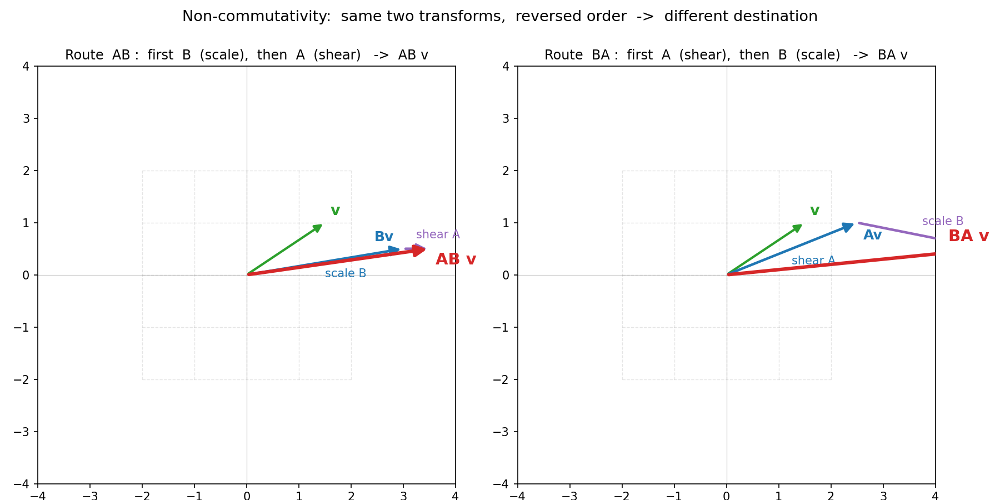

# 第 6 章 · 矩阵乘法与复合:两次揉捏的接龙

> **核心问题**:两个矩阵相乘,到底在算什么?为什么 `A·B` 和 `B·A` 一般不相等——而且不是数学家故意为难,是"动作有先后"这件物理事实逼出来的?又为什么 `(A·B)·C = A·(B·C)` 这条**结合律**偏偏成立,哪怕乘法根本不能交换?
>
> 第 1 章(P0-01)我们随口点过一句"矩阵乘矩阵 = 两次揉捏接龙(先右后左)、不可交换"。这一章把它正式展开:用**新的例子**、**新的图**,把"复合的几何""不可交换的更深层原因""结合律为何成立"三件事讲透。
>
> **读完本章你会明白**:
> - `A·B` 几何上到底在做什么——"先做 B 这次揉捏,再做 A 这次揉捏",合成的"总揉捏"才是乘出来的那个矩阵。
> - 那套让人头秃的"行乘列"算法,为什么对"矩阵乘矩阵"长得那样——它是"复合"这件事的数字落地,不是死规定。
> - 不可交换的**真正原因**:不是"穿袜穿鞋"的比喻,而是"剪切先做还是后做,后续缩放抓的是不同的空间"——用新例子(剪切 + 非均匀缩放)画给你看。
> - 结合律 `(AB)C = A(BC)` 为什么成立——一个比代数证明好懂百倍的**几何妙解**:两边走的是同一条接龙路线。
> - 矩阵的幂 `Aⁿ` = A 接龙 n 次,以及为什么"对角阵的幂好算"——为后面(第 13 章对角化、算高次幂)埋下伏笔。

> **如果一读觉得太难**:先只记住三件事——① 看到 `A·B` 永远念成"先 B 后 A";② `A·B ≠ B·A` 是因为动作有先后(先转后剪 ≠ 先剪后转);③ `(AB)C = A(BC)` 成立,是因为打不打括号都没改变"先 C、再 B、再 A"这条动作顺序。三条钉死,本章就够本了。

---

## 章首·一句话点破

第 5 章结尾,我们留了那句话:

> 真实世界里的变换,很少只揉一下——往往是**先揉一下、再揉一下**。两次揉捏接龙起来,会怎样?

一句话点破这一整章:

> **矩阵乘矩阵,就是"先做一次揉捏、再做一次揉捏",把两次接龙合成一个总的揉捏。这个"总揉捏"的说明书,就是乘出来的那个矩阵。而因为它本质是"两个动作排队执行",所以顺序不能换(不可交换)、但谁先和谁合并无所谓(结合律)。**

这句话是**结论**。本章倒过来拆:先把"复合"在几何上是什么看清,再问"那行乘列算法是怎么从复合里长出来的",最后用几何一眼看穿"不可交换"和"结合律"这两件看似矛盾的事。

---

## 一、复合的几何:两次揉捏接成一条总揉捏

第 1 章到第 5 章,我们盯着一件事:**一次揉捏**——一个矩阵,把空间的每根基向量搬到新位置。

可现实里的变换,几乎总是**一连串**的。你旋转一张照片,再放大它;你先把 3D 模型剪一切,再投影到屏幕;你先把数据标准化,再做主成分分析(PCA)。每一步,都是一次揉捏。问题是:

> **先做 B 这次揉捏,再做 A 这次揉捏——能不能也写成一个矩阵?能不能说"我这一下,就等价于某个 C 这次揉捏"?**

能。而那个 C,正是 `A·B`。先看几何。

### 接龙:从右往左,像 f(g(x))

`A·B` 作用在一根向量 `v` 上,意思是:

```
   (A·B) · v  =  A · ( B · v )
              ↑      ↑
              外层   内层: 先做 B
```

**翻译成动作**:先把 `v` 揉一下(B),把揉完的箭头 `Bv`,再揉一下(A)。最终落点,就是 `(AB)v`。

> **比喻**:接龙。`A·B` 念作"**先 B,后 A**"——从右往左数,就像函数嵌套 `f(g(x))` 先算里面的 `g`、再算外面的 `f`。这纯粹是一套记号约定,不用纠结,但**这个"从右往左"的习惯,请你从今天起钉死在肌肉里**——线代里一半的坑,都是顺序读反了踩出来的。

关键来了:**接龙出来的总效果,本身也是一个线性变换**(一个"总揉捏")。为什么?因为"先 B 后 A"这件事,守着第 2 章那两条"线性"规矩——可加性、数乘性:

```
   先 B 后 A,  对 u + v:   先 (u+v) 被 B 揉成 Bu+Bv,  再被 A 揉成 A(Bu)+A(Bv)   ✓ 能拆
   先 B 后 A,  对 c·v:     先 c·v 被 B 揉成 c·Bv,    再被 A 揉成 c·A(Bv)        ✓ 能缩放
```

两个线性变换接龙,还是线性的。所以"先 B 后 A"这件事,**可以被一个矩阵整体记下**——这个总矩阵,就是 `A·B`。

> **钉死这件事**:`A·B` 是"先 B 后 A"两次揉捏合并成一个总揉捏后的说明书。**它不是"A 揉 B 这张数表",而是"A 揉 B 揉过的空间"。** 乘出来的那个矩阵,描述的是**一次**总的动作。

### 那"行乘列"算法,是怎么从复合里长出来的

现在问那个最折磨人的问题:**为什么 `AB` 的算式,长成"拿 A 的每一行,去乘 B 的每一列、再相加"这种别扭的样子?它凭什么不是别的算法?**

> **不这样问会怎样**:如果你把"行乘列"当成一条任意的、靠死记硬背的规定,那你算一辈子矩阵乘法,都只是"在数表上做体操"——既不知道为什么,也不知道算错了没有,更没法用它去推理(比如"为什么结合律成立")。会算不懂,又来了。

答案藏在第 1 章那把钥匙里。回忆:**矩阵的每一列,是一根基向量被揉去的新位置。** 这条铁律,对"总揉捏 `AB`"一样适用。所以:

> **`AB` 的第 j 列,是什么?——是"总揉捏 `AB`"把第 j 根基向量揉去了哪。**

可是"总揉捏"是"先 B 后 A"。第 j 根基向量(记作 `e_j`),被"先 B 后 A"揉,会到哪?

```
   step 1:  e_j 先被 B 揉   ->   B · e_j   =   B 的第 j 列     (因为矩阵乘基向量 = 自己那一列)
   step 2:  那个结果再被 A 揉 ->   A · (B 的第 j 列)
```

> **所以这样看**:`AB` 的第 j 列,**就是 A 去揉"B 的第 j 列"的结果**。

这是一句能让你彻底看懂"行乘列"的话。我们把它拆开:

- B 的第 j 列,是"j 被第一次揉捏(B)后到的中转站"。
- 然后 A 再把这个中转站,揉到最终位置。
- 这个最终位置,记下来,就是 `AB` 的第 j 列。

> **钉死**:`AB` 的每一列 = `A` 去乘 `B` 的对应列。**行乘列算法,是"先把基向量经 B 揉到中转、再被 A 揉到终点"这件事的数字落地。** 它不是规定,是复合的几何逼出来的唯一长相。

#### 拿数字走一遍,你就信了

设:

```
       ┌       ┐
       │ 2  0 │        x 方向拉 2 倍、y 方向压到 0.5
   B = │ 0  .5│        (非均匀缩放)
       └       ┘

       ┌       ┐
       │ 1  1 │        水平剪切: j 被推向右
   A = │ 0  1 │
       └       ┘
```

`AB` 的第 1 列 = `A` 去揉 `B` 的第 1 列 `(2, 0)`:

```
   A · (2, 0) = 2·(A 的第1列) + 0·(A 的第2列)
              = 2·(1, 0) + 0·(1, 1)
              = (2, 0)
```

`AB` 的第 2 列 = `A` 去揉 `B` 的第 2 列 `(0, 0.5)`:

```
   A · (0, 0.5) = 0·(1, 0) + 0.5·(1, 1)
                = (0.5, 0.5)
```

拼起来,`AB = [[2, 0.5],[0, 0.5]]`。拿 numpy 的 `A @ B` 核对——一模一样。**每一列都是"A 揉了 B 的对应列"**。这条规律,下面"不可交换"那一节会再次救场。

---

## 二、不可交换:动作有先后,这件事有多深

这是本章的硬骨头,也是初学者最容易翻车的地方。

`A·B ≠ B·A`,数字乘法 `3×5 = 5×3` 明明可以换,矩阵凭什么不行?

第 1 章我们用"穿袜穿鞋"打了个比方:先穿袜再穿鞋,和反过来,结果不一样。那个比喻对——但它只点了"动作有先后"这个表面。**真正深层的原因,藏在两次揉捏的几何里。** 这一节我们把它挖到底。

### 先把直觉摆正:揉捏是动作,动作有顺序

> **比喻**:揉捏是"动作",不是"数字"。两个动作接龙执行,顺序换了,中间经历的空间就不一样了。

设想一张画满方格的橡皮膜。你打算做两个动作:**先把空间沿 x 方向剪切歪**,再**沿 x 方向拉长 2 倍**。

- **先剪切,后拉**:膜先被推歪(j 向右倾),然后整体沿 x 拉长——那张歪掉的膜,被均匀地横向撑开。
- **先拉,后剪切**:膜先被横向拉成"瘦高"的格子,然后做剪切——可剪切是"j 往 x 方向滑",而此时 j 已经被压缩得很矮了,它滑出去的影响,和第一次完全不同。

**同样的两个动作,谁先谁后,中间那张膜长得不一样,最后的样子自然也不同。** 这不是规定,是物理。

> **钉死**:矩阵不可交换,根源不是"算式特殊",而是**"两次揉捏的中间状态不同"**。先 B 后 A,中间那张膜是 B 揉过的;先 A 后 B,中间是 A 揉过的。A 这一步"抓"到的、要去揉的对象,根本就不是同一张膜——结果怎么可能一样?

### 画给你看:AB vs BA,落到两个不同的终点

嘴上说不直观,我们让一根具体的箭头走一遍两条路线。取:

```
   v = (1.5, 1)
   A = 剪切 [[1,1],[0,1]]
   B = 缩放 [[2,0],[0,0.5]]
```

**路线一:`AB`,先 B 后 A。**

```
   v        = (1.5, 1)
   先 B 揉  ->  B·v = (2·1.5, 0.5·1)   = (3,   0.5)    ← x 被拉、y 被压
   再 A 揉  ->  A·(3, 0.5) = (3+0.5, 0.5) = (3.5, 0.5)  ← 被剪切推向右
   终点 1:  (3.5, 0.5)
```

**路线二:`BA`,先 A 后 B。**

```
   v        = (1.5, 1)
   先 A 揉  ->  A·v = (1.5+1, 1)       = (2.5, 1)      ← 被剪切推向右
   再 B 揉  ->  B·(2.5, 1) = (2·2.5, 0.5·1) = (5, 0.5) ← x 被拉、y 被压
   终点 2:  (5, 0.5)
```

**同一根 v、同样的两个动作,只是顺序一换,终点从 `(3.5, 0.5)` 跳到了 `(5, 0.5)`——差了整整 1.5 格。** 这就是"不可交换"的血淋淋的证据。

> 下图把两条路线画在同一根 v 上。**左图**是路线一 `AB`(先 B 后 A):绿色 `v` 先被缩放(蓝)到 `Bv=(3, 0.5)`,再被剪切(紫)推向 `ABv=(3.5, 0.5)`(红,终点)。**右图**是路线二 `BA`(先 A 后 B):同一个 `v` 先被剪切(蓝)到 `Av=(2.5, 1)`,再被缩放(紫)拉到 `BAv=(5, 0.5)`(红,终点)。**两个红箭头指向不同的地方——这就是 AB ≠ BA 的几何。**



### 为什么差别发生在 x 方向:看清"中间状态"的玄机

盯着那两个终点看:`(3.5, 0.5)` vs `(5, 0.5)`——y 一样,差的全在 x。这不是巧合,里头藏着不可交换的**最深层原因**。

剪切 A 干什么?它把每个点的 x 坐标,**加上它的 y 坐标**(`x' = x + y`)。所以:**y 越大,被推得越远。**

现在看两条路线,A 抓到的"y"分别是多少:

- **路线一 AB**(先缩放 B):v 的 y=1 先被 B 压成了 0.5。于是 A 剪切时,看到的 y 是 0.5,只把 x 往右推 0.5。
- **路线二 BA**(先剪切 A):v 的 y 还是 1。A 剪切时看到的 y 是 1,把 x 往右推 1。

**剪切这一步,推多远取决于"当时 y 还剩多少"。而缩放恰恰会改 y。所以缩放放前面,剪切抓到的 y 就小、推得近;缩放纵后面,剪切抓到的 y 还满、推得远。** 这就是两条路线终点差 1.5 的全部原因。

> **钉死这件事**(不可交换的最深层原因):两个动作接龙,**后一个动作,是在"前一个动作改过的空间"上执行的**。先做的那个动作,改了"地基",后做的动作抓到的就是改过的地基——顺序一换,地基就不同,结果必然不同。**不可交换,是"动作改地基、地基改动作"的连锁后果,不是数学家的任性。**

### 那"行乘列"算出来的 AB 和 BA,到底哪里不同

回到第一节那句话:"`AB` 的每一列 = `A` 揉 `B` 的对应列"。把它套到 `BA` 上:"`BA` 的每一列 = `B` 揉 `A` 的对应列"。

这俩压根是两件不同的事:

- `AB` 是"先 B 后 A",B 先把基揉成它的列,A 再去揉。
- `BA` 是"先 A 后 B",A 先把基揉成它的列,B 再去揉。

拿我们的例子手算两个乘积(本章"计算佐证"会再走一遍):

```
   AB = A·B:
      AB 第1列 = A·(B 的第1列) = A·(2,0) = (2, 0)
      AB 第2列 = A·(B 的第2列) = A·(0,0.5) = (0.5, 0.5)
      AB = [[2, 0.5],[0, 0.5]]

   BA = B·A:
      BA 第1列 = B·(A 的第1列) = B·(1,0) = (2, 0)
      BA 第2列 = B·(A 的第2列) = B·(1,1) = (2, 0.5)
      BA = [[2, 2],[0, 0.5]]
```

差别全在第 2 列:`AB` 的 j 被揉去 `(0.5, 0.5)`,`BA` 的 j 被揉去 `(2, 0.5)`——j 是被剪切"推歪"的那根基,先缩放还是后缩放,它落点差了 1.5。**这和我们那根向量 v 的终点之差,是同一回事**——因为 v 里恰好也有 j 的成分。算式和几何,严丝合缝。

> **小结**:不可交换不是"算式特殊",是"两次揉捏改的中间状态不同"。看到 `A·B`,永远先做 B;永远问"先做的那一步,给后做的留了张什么样的膜"。

---

## 三、结合律:打不打括号,几何上根本没区别

现在,一个看似更绕、其实更优雅的问题。

矩阵乘法**不能交换**(`AB ≠ BA`),那它能**结合**吗?即 `(AB)C = A(BC)` 成立吗?

答案是:**成立。** 而且这件事,有一段比代数证明好懂百倍的**几何妙解**。

### 先看两边各是什么动作

把 `(AB)C` 和 `A(BC)` 都拆成"接龙":

```
   (AB)C · v  =  (AB) · (C·v)          先 C,  再 (AB)
              =  A · ( B · ( C·v ) )    而 (AB) 又是 先 B 后 A
              =  先 C,  再 B,  再 A

   A(BC) · v  =  A · ( (BC)·v )         先 (BC),  再 A
              =  A · ( B · ( C·v ) )    而 (BC) 又是 先 C 后 B
              =  先 C,  再 B,  再 A
```

**两边都拆到底,是同一条动作路线:先 C、再 B、再 A。**

> **比喻(几何妙解)**:三个揉捏 C、B、A 排成一队,挨个执行。`(AB)C` 是"先把 A、B 这两个相邻的合并成一个总动作 AB,再和 C 接";`A(BC)` 是"先把 B、C 合并成 BC,再和 A 接"。**但不管你先合并哪一对,真正执行起来,C 永远第一个、B 第二个、A 第三个——三个动作的顺序,一个没动。** 打括号,只是"先在纸上把哪两步算出来"的选择;几何上,动作的先后次序纹丝未变。所以结果必然相同。

> **钉死(结合律的最优雅解释)**:`(AB)C = A(BC)`,因为**两边都是"先 C、再 B、再 A"这条同一条接龙路线**。结合律的成立,不是因为算式凑巧能对上,而是"打括号没改变动作顺序"这个几何事实。**几何动作的次序不变,结果就不变。**

### 这和"不可交换"矛盾吗

有人会愣:**既然顺序这么重要(不可交换),为什么换括号又没关系(可结合)?**

不矛盾。关键在分清两件事:

- **不可交换**:`AB` vs `BA`——**动作的先后次序换了**(先 B 后 A,变成先 A 后 B)。次序是动作本身,换了就是另一回事。
- **可结合**:`(AB)C` vs `A(BC`——**动作的先后次序没换**(都是先 C、再 B、再 A),只是"算的时候先合并谁"换了。次序没动,只是分组方式变了。

> **一句口诀**:**换次序 ≠ 换分组。** 矩阵乘法对"换次序"敏感(不可交换),但对"换分组"免疫(可结合)。这两件看似打架的事,其实是"动作的次序"和"动作的分组"两件完全不同的事。

> **钉死这件事**:结合律告诉你——**一连串揉捏,你可以挑任意相邻的两个先合并,逐步把整串折叠成一个总揉捏;最后得到的总揉捏,和合并的先后无关,只和"动作实际执行的顺序"有关。** 这条性质,是矩阵乘法能当"真正的乘法"来用的根基(没有它,`Aⁿ`、矩阵的因式分解、相似变换全都立不住)。

### 拿数字验一下,踏实

随手取三个矩阵:

```
       ┌       ┐           ┌       ┐           ┌       ┐
   A = │ 1  1 │       B = │ 2  0 │       C = │ 1  2 │
       │ 0  1 │           │ 0  .5│           │ 0  1 │
       └       ┘           └       ┘           └       ┘
```

按结合律两种括号各算一遍:

```
   (AB)C:   AB = [[2, 0.5],[0, 0.5]]   (上节算过)
            (AB)·C  ->  [[2, 4.5],[0, 0.5]]

   A(BC):   BC = B·C   ->  BC 第1列 = B·(1,0) = (2,0)
                                     BC 第2列 = B·(2,1) = (4, 0.5)
                     BC = [[2, 4],[0, 0.5]]
            A·(BC)  ->  [[2, 4.5],[0, 0.5]]
```

两边都 `[[2, 4.5],[0, 0.5]]`。**铁证。** 它们必然相等,因为几何上是同一条"先 C、再 B、再 A"的路线。numpy 里 `(A@B)@C == A@(B@C)` 一行就能核。

---

## 四、单位矩阵:接龙里的"零操作"

讲完复合,一个角色自然登场:**单位矩阵 `I`**。

```
       ┌       ┐
   I = │ 1  0 │        两根基向量 i、j 都留在原地
       │ 0  1 │
       └       ┘
```

它的两列,分别是 i、j 原本的位置——所以 `I` 这个揉捏,**什么都不做**。就像数字里的 1。

> **比喻**:单位矩阵是接龙里的"空气"——和它接龙,等于没接。`A·I`(先做"什么都不做",再做 A)= 还是 A;`I·A`(先做 A,再做"什么都不做")= 还是 A。所以:

```
   A · I  =  I · A  =  A
```

> **钉死**:`AI = IA = A`。单位矩阵是矩阵世界里的"1"——它不是巧合,而是"零操作"接龙进任何动作,都不改变那个动作。后面第 7 章逆矩阵会用到它:`A·A⁻¹ = I`,意思是"先做撤销、再做 A,等于什么都没发生"。

注意一件有意思的事:**`I` 和任何矩阵都能交换**(`AI = IA = A`)。这是少数几个能交换的情形——因为"什么都不做"放前面放后面,效果都一样。这恰好印证了上一节:能交换,是因为两个动作里有一个是"零操作",根本不会改地基。

---

## 五、矩阵的幂:同一动作接龙 n 次

复合一旦成立,自然能问:**同一个揉捏,接龙自己 n 次,是什么?**

这就是**矩阵的幂**:

```
   A²  =  A · A          先 A,  再 A
   A³  =  A · A · A      连做三次 A
   Aⁿ  =  A 接龙 n 次
```

> **比喻**:复印机。把一张纸(空间)放进复印机,复印出来的扭曲一点(A);再拿这张扭曲的,复印再扭曲一次(A²);再拿这张,再扭曲(A³)……每多复印一次,扭曲就叠加一层。**`Aⁿ` 描述的是"A 这个动作,连做了 n 遍之后的总效果"。**

#### 一个漂亮的事实:剪切矩阵的幂特别好算

取剪切 `A = [[1,1],[0,1]]`(j 被推向右一格)。手算它的几次幂:

```
   A² = A·A = [[1, 2],[0, 1]]     j 被推向右 2 格
   A³ = A·A·A = [[1, 3],[0, 1]]   j 被推向右 3 格
   ...
   Aⁿ = [[1, n],[0, 1]]           j 被推向右 n 格
```

**每多接龙一次剪切,j 就多被推右一格。** 这件事几何上一目了然——剪切是"把 y 加到 x 上",连做两次,就是把 y 加了两次;x 不动,y 也不动。所以幂就是右上角那个数往上累加。**幂,是"同一动作叠加"的几何后果。**

> **钉死(为后面埋伏笔)**:不是所有矩阵的幂都这么好算。剪切、对角阵这种"结构特殊"的,幂一目了然;但一个随便填的矩阵,`A¹⁰⁰` 手算会累死人。**第 13 章对角化**会给你一把利器:**把 A 换成"对角阵"(纯拉伸),幂就变成"每个对角元自己乘 n 次"——一秒算完。** 那一章的动机,就藏在这一节:`Aⁿ` 之所以重要,是因为很多真实问题(马尔可夫链的状态转移、递推、微分方程的离散化)都要算"同一动作连做很多次",而对角化让它变得可算。

> **(深度一笔)分块矩阵乘法**:既然矩阵是"列的集合",那如果把一个大矩阵切成几块(每块本身是小矩阵),"分块相乘"的规则和普通矩阵乘法**一模一样**——把每块当成一个"大元素"做行乘列即可。这背后的道理,还是复合:`(AB)` 的每一块,是"A 的某几行"去揉"B 的某几列"的组合。分块乘法之所以合法,正是因为结合律保证"先合并哪部分都一样"。这是数值线性代数(BLAS、LAPACK)能高速算大矩阵的根基——把大矩阵切成适合 CPU 缓存的小块,分块算。**复合的思想,一直延伸到工程实现的最底层。**

---

## 计算佐证:拿张纸,亲手验一遍复合

这一节用纸笔 + numpy,把本章三个核心(复合的算法、不可交换、结合律)全验一遍。**不求难,只求你亲手摸一次"算式 = 几何"。**

### 1. 验证"AB 的第 j 列 = A 揉 B 的第 j 列"

设 `A = [[1,1],[0,1]]`(剪切),`B = [[2,0],[0,0.5]]`(缩放)。

**按"行乘列"算 `AB` 整体:**

```
   AB[0,0] = 行0(A)·列0(B) = (1,1)·(2,0) = 1·2 + 1·0 = 2
   AB[0,1] = 行0(A)·列1(B) = (1,1)·(0,0.5) = 1·0 + 1·0.5 = 0.5
   AB[1,0] = 行1(A)·列0(B) = (0,1)·(2,0) = 0 + 0 = 0
   AB[1,1] = 行1(A)·列1(B) = (0,1)·(0,0.5) = 0 + 0.5 = 0.5
   AB = [[2, 0.5],[0, 0.5]]
```

**按"AB 第 j 列 = A 揉 B 的第 j 列"分开算:**

```
   AB 第1列 = A·(B 的第1列) = A·(2,0) = (1·2+1·0, 0·2+1·0) = (2, 0)     ✓ 对上
   AB 第2列 = A·(B 的第2列) = A·(0,0.5) = (1·0+1·0.5, 0·0+1·0.5) = (0.5, 0.5)  ✓ 对上
```

两种算法,一模一样。**因为它们是同一件事**:"AB 的每一列"就是"A 去揉 B 的对应列"。

### 2. 验证"AB ≠ BA"(同一对矩阵)

接着上面,把顺序换过来算 `BA`:

```
   BA 第1列 = B·(A 的第1列) = B·(1,0) = (2·1+0·0, 0·1+0.5·0) = (2, 0)
   BA 第2列 = B·(A 的第2列) = B·(1,1) = (2·1+0·1, 0·1+0.5·1) = (2, 0.5)
   BA = [[2, 2],[0, 0.5]]
```

`AB = [[2, 0.5],[0, 0.5]]`,`BA = [[2, 2],[0, 0.5]]`。**第 2 列差了 1.5**(j 被揉去的落点不同)。**铁证 AB ≠ BA。** 这正是图 6.1 里那两条路线终点的差别来源。

### 3. 验证结合律 `(AB)C = A(BC)`

取 `C = [[1,2],[0,1]]`,用上面算好的 `AB = [[2,0.5],[0,0.5]]`:

```
   (AB)C:   AB·C
            第1列 = AB·(1,0) = (2·1+0.5·0, 0·1+0.5·0) = (2, 0)
            第2列 = AB·(2,1) = (2·2+0.5·1, 0·2+0.5·1) = (4.5, 0.5)
            (AB)C = [[2, 4.5],[0, 0.5]]

   A(BC):   先算 BC
            BC 第1列 = B·(1,0) = (2, 0)
            BC 第2列 = B·(2,1) = (2·2+0·1, 0·2+0.5·1) = (4, 0.5)
            BC = [[2, 4],[0, 0.5]]
            再 A·(BC):
            第1列 = A·(2,0) = (2, 0)
            第2列 = A·(4,0.5) = (1·4+1·0.5, 0·4+1·0.5) = (4.5, 0.5)
            A(BC) = [[2, 4.5],[0, 0.5]]
```

两边都得 `[[2, 4.5],[0, 0.5]]`。**结合律成立。** 因为它们几何上都是"先 C、再 B、再 A"。

### 4. numpy:亲眼核对三件事

```python
import numpy as np
np.set_printoptions(precision=3, suppress=True)

A = np.array([[1., 1.], [0., 1.]])      # shear
B = np.array([[2., 0.], [0., 0.5]])     # non-uniform scale
C = np.array([[1., 2.], [0., 1.]])
v = np.array([1.5, 1.])

# (1) AB, by row-col vs by-columns, should match
print("AB =", A @ B)                       # [[2. 0.5] [0. 0.5]]
print("A (B col0) =", A @ B[:, 0])         # [2. 0.]   == AB col0  ✓
print("A (B col1) =", A @ B[:, 1])         # [0.5 0.5] == AB col1  ✓

# (2) non-commutativity: same v, two routes, different endpoints
print("AB v (first B then A) =", (A @ B) @ v)   # [3.5 0.5]
print("BA v (first A then B) =", (B @ A) @ v)   # [5.  0.5]
print("AB == BA?", np.allclose(A @ B, B @ A))   # False

# (3) associativity
print("(AB)C ="); print((A @ B) @ C)
print("A(BC) ="); print(A @ (B @ C))
print("associative?", np.allclose((A @ B) @ C, A @ (B @ C)))   # True

# (4) identity commutes with everything
I = np.eye(2)
print("A I == I A == A?", np.allclose(A @ I, A) and np.allclose(I @ A, A))   # True

# (5) power: shear^n
print("A^3 =", np.linalg.matrix_power(A, 3))    # [[1. 3.] [0. 1.]]
```

跑一遍,亲手看见三件事:**`A@(B 的列)` 拼起来就是 `A@B`;两条路线终点不同(`ABv ≠ BAv`);两边括号换着打,结果完全一样。** 这就是"复合"的全部算术证据。

---

## 章末小结

### 用"橡皮膜"比喻回顾本章

第 5 章结尾,我们说"真实里的变换,很少只揉一下——往往是先揉一下、再揉一下"。这一章,把"两次揉捏的接龙"一笔一笔讲清了:

1. **`A·B` = 先 B 后 A 的总揉捏**。两次线性变换接龙,还是线性变换,所以能写成一个矩阵——这个总矩阵,就是 `A·B`。看到 `A·B`,永远念成"先 B 后 A",像 `f(g(x))` 从里往外算。
2. **`AB` 的第 j 列 = `A` 揉 `B` 的第 j 列**。B 的第 j 列是"j 被第一次揉到中转站",A 再把中转站揉到终点。**那一套别扭的"行乘列"算法,是这条几何事实的数字落地,不是规定。**
3. **不可交换的深层原因**:后一个动作是在"前一个动作改过的空间"上执行的。剪切推多远,取决于"当时 y 还剩多少";缩放恰恰改 y——所以缩放在前还是后,剪切抓到的地基就不同,结果不同。**不是"穿袜穿鞋"那么表面,是"动作改地基、地基改动作"的连锁。**
4. **结合律的几何妙解**:`(AB)C = A(BC)`,因为两边都是"先 C、再 B、再 A"同一条接龙路线——打括号没改变动作顺序,只改了"先在纸上合并谁"。**换次序 ≠ 换分组**:对换次序敏感(不可交换),对换分组免疫(可结合)。
5. **单位矩阵 `I` 是接龙的零操作**:`AI = IA = A`;**矩阵的幂 `Aⁿ`** 是 A 接龙 n 次(剪切的幂一目了然,为第 13 章对角化算高次幂埋下伏笔);**(深度)** 分块矩阵乘法是复合思想在大矩阵上的延伸,数值线性代数靠它提速。

### 本章在全书主线中的位置

记住本书的主线:**一切线代概念,都是"空间被揉捏"这件事的某个侧面。**

这一章,是"揉捏"的**接龙**侧面——把两次(或多次)揉捏,合成一次总揉捏。第 1 章和第 5 章立的是"一次揉捏"的全貌(矩阵=揉捏,列=新基,非方阵=跨维揉捏);本章把它从"一次"推到"多次接龙",于是矩阵不再只是孤立的动作,而是**可以排队、可以合并、可以重复**的动作。

- 第 7 章(逆矩阵),是**接龙的"撤销"**:`A·A⁻¹ = I`,意思是"先撤销、再做 A,等于什么都没干"。
- 第 9 章(行列式),会用到"复合的面积缩放相乘"——`det(AB) = det(A)·det(B)`,两次揉捏的面积胀缩,是各自胀缩的乘积。这是接龙在"度量"侧面的回响。
- 第 13 章(对角化),把"一个普通矩阵的 n 次幂"问题,转化为"一个对角阵的 n 次幂"——而本章埋的 `Aⁿ` 伏笔,会在那里兑现成"算高次幂的利器"。
- 第 18 章(基变换),`P⁻¹AP` 这种"接龙"是相似矩阵的核心:它描述的是"同一个揉捏,换了副眼镜看"。

**没有本章把"接龙"和"结合律"讲透,后面逆矩阵、相似变换、对角化全没有立足点。** 本章是第 2 篇《矩阵即变换》从"单次揉捏"走向"揉捏的代数"的桥梁。

### 五个"为什么"清单

如果你只能记五件事,记这五件:

1. **`A·B` 在几何上是什么**:先做 B 这次揉捏、再做 A 这次揉捏,合成一个总揉捏。看到 `A·B` 永远念"先 B 后 A"(从右往左,像 `f(g(x))`)。
2. **`AB` 的每一列是什么**:`A` 去揉 `B` 的对应列的结果。`AB` 第 j 列 = `A·(B 的第 j 列)`——因为 B 的第 j 列是 j 被第一次揉到的中转,A 再揉中转到终点。"行乘列"是这条几何的数字落地。
3. **为什么不可交换**:后一个动作在前一个改过的空间上执行。剪切推多远取决于当时 y 还剩多少,而缩放改 y——所以顺序一换,中间地基不同,结果必然不同。**根源是"动作改地基、地基改动作"的连锁,不是"穿袜穿鞋"那么表面。**
4. **为什么结合律成立**:`(AB)C = A(BC)`,因为两边都是"先 C、再 B、再 A"同一条接龙路线。打括号没改变动作顺序,只改了合并的时机。**换次序(不可交换)和换分组(可结合)是两回事。**
5. **单位矩阵、幂、分块**:`I` 是接龙的零操作(`AI=IA=A`);`Aⁿ` 是 A 接龙 n 次(对角阵/剪切的幂好算,为第 13 章埋伏笔);分块乘法是复合思想在大矩阵上的延伸,数值线代提速的根基。

### 想继续深入,该往哪钻

- **看动画**:3Blue1Brown《线性代数的本质》"Matrix multiplication as composition"一集。它把本章"两次揉捏接龙"、"`AB` 的列 = A 揉 B 的列",画成你亲眼可见的橡皮膜接龙动画。本章文字没接住的,动画一定接得住。
- **亲手揉接龙**:上面的 numpy 代码,自己造两个矩阵(别用我的例子),手算 `AB` 和 `BA`,再用 `A @ B` 核对。改一晚上,你对"先右后左"会有肌肉记忆。
- **尝一口"幂的威力"**:取 `A = [[0.9, 0.2],[0.1, 0.8]]`(一个马尔可夫转移矩阵),用 `np.linalg.matrix_power(A, 100)` 算它的 100 次幂——你会看到一个收敛的稳态。**"同一动作连做很多次会稳定下来",是马尔可夫链、PageRank 的几何本质,而它就藏在 `Aⁿ` 这件事里。** 这条线,会在第 13 章对角化时正式收。

---

> 接龙立住了:`A·B` 是先 B 后 A,不可交换是因为地基被改,可结合是因为动作顺序没变。可既然能接龙,最自然要问的就是——**这次揉捏,能不能原路撤销?把空间揉回原样?** 能撤销的,叫可逆;不能撤销的(比如第 5 章那张被拍扁的 2×3 揉捏),永远回不去。翻开 **第 7 章 · 逆矩阵:这次揉捏,能不能撤销**——你会发现,"可逆"不是代数的巧,而是几何上一个朴素到不能再朴素的条件:**这次揉捏,没把空间压扁。**
